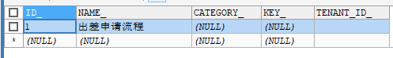

# Activiti工作流引擎

## 具体应用

工作流适用于很多业务场景：

1. **行政管理类：** 出差申请、加班申请、请假申请、用车申请、各种办公用品申请、购买申请、日报周报等凡是原来手工流转处理的行政表单。

2. **人事管理类：** 员工培训安排、绩效考评、职位变动处理、员工档案信息管理等。

3. **财务相关类：** 付款请求、应收款处理、日常报销处理、出差报销、预算和计划申请等。

## Activiti7

### 介绍

Alfresco软件在2010年5月17日宣布Activiti业务流程管理（BPM）开源项目的正式启动，其首席架构师由业务流程管理BPM的专家 Tom Baeyens担任，Tom Baeyens就是原来jbpm的架构师，而jbpm是一个非常有名的工作流引擎，当然activiti也是一个工作流引擎。

Activiti是一个工作流引擎， activiti可以将业务系统中复杂的业务流程抽取出来，使用专门的建模语言BPMN2.0进行定义，业务流程按照预先定义的流程进行执行，实现了系统的流程由activiti进行管理，减少业务系统由于流程变更进行系统升级改造的工作量，从而提高系统的健壮性，同时也减少了系统开发维护成本。

官方网站：[https://www.activiti.org/](https://www.activiti.org/)

### 使用步骤

#### 部署activiti

Activiti是一个工作流引擎（其实就是一堆jar包API），业务系统访问(操作)activiti的接口，就可以方便的操作流程相关数据，这样就可以把工作流环境与业务系统的环境集成在一起。

#### 流程定义

使用activiti流程建模工具(activity-designer)定义业务流程(.bpmn文件) 。

.bpmn文件就是业务流程定义文件，通过xml定义业务流程。

#### 流程定义部署

activiti部署业务流程定义（.bpmn文件）。

使用activiti提供的api把流程定义内容存储起来，在Activiti执行过程中可以查询定义的内容

Activiti执行把流程定义内容存储在数据库中

#### 启动一个流程实例

流程实例也叫：ProcessInstance

启动一个流程实例表示开始一次业务流程的运行。

在员工请假流程定义部署完成后，如果张三要请假就可以启动一个流程实例，如果李四要请假也启动一个流程实例，两个流程的执行互相不影响。

#### 用户查询待办任务(Task)

因为现在系统的业务流程已经交给activiti管理，通过activiti就可以查询当前流程执行到哪了，当前用户需要办理什么任务了，这些activiti帮我们管理了，而不需要开发人员自己编写在sql语句查询。

#### 用户办理任务

用户查询待办任务后，就可以办理某个任务，如果这个任务办理完成还需要其它用户办理，比如采购单创建后由部门经理审核，这个过程也是由activiti帮我们完成了。

#### 流程结束

当任务办理完成没有下一个任务结点了，这个流程实例就完成了。

### Activiti环境

activiti运行需要有数据库的支持，支持的数据库有：h2, mysql, oracle, postgres, mssql, db2。

#### 依赖安装

```xml
<!-- activiti -->
        <dependency>
            <groupId>org.activiti</groupId>
            <artifactId>activiti-engine</artifactId>
            <version>5.23.0</version>
            <exclusions>
                <exclusion>
                    <artifactId>mybatis</artifactId>
                    <groupId>org.mybatis</groupId>
                </exclusion>
            </exclusions>
        </dependency>

        <dependency>
            <groupId>org.activiti</groupId>
            <artifactId>activiti-spring</artifactId>
            <version>5.23.0</version>
        </dependency>

        <!--activiti在线建模器依赖-->
        <dependency>
            <groupId>org.activiti</groupId>
            <artifactId>activiti-modeler</artifactId>
            <version>5.23.0</version>
        </dependency>
        <dependency>
            <groupId>org.activiti</groupId>
            <artifactId>activiti-diagram-rest</artifactId>
            <version>5.23.0</version>
        </dependency>  </dependency>
```

#### 添加activiti配置文件

Spring Boot项目要求在配置类中对activiti进行配置，大体上需要配置数据源、工作流引擎。工作流引擎分成StandaloneProcessEngineConfiguration和SpringProcessEngineConfiguration两个。

StandaloneProcessEngineConfiguration可以单独运行，来创建`ProcessEngine`，`Activiti`会自己处理事务。需要自己设置数据库地址、数据库连接池配置。

SpringProcessEngineConfiguration是与Spring整合的方式，使用Spring的数据源、事务管理器。

```java
/**
 * 工作流相关配置
 * @author sunquan
 */
@Component
@ConfigurationProperties(prefix = "activiti")
public class ActivitiConfig {
    private String dataType;

    private String formServerUrl;

    public String getDataType() {
        return dataType;
    }

    public void setDataType(String dataType) {
        this.dataType = dataType;
    }

    public String getFormServerUrl() {
        return formServerUrl;
    }

    public void setFormServerUrl(String formServerUrl) {
        this.formServerUrl = formServerUrl;
    }

    @Autowired
    private CustomUserEntityManagerFactory customUserEntityManagerFactory;

    @Autowired
    private CustomGroupEntityManagerFactory customGroupEntityManagerFactory;

    /**
     * 流程配置，与spring整合采用SpringProcessEngineConfiguration这个实现
     * @param dataSource
     * @param transactionManager
     * @return
     */
    @Bean
    public ProcessEngineConfiguration processEngineConfiguration(DataSource dataSource,
                                                                 PlatformTransactionManager transactionManager) {
        SpringProcessEngineConfiguration processEngineConfiguration = new SpringProcessEngineConfiguration();
        processEngineConfiguration.setDataSource(dataSource);
        /**
         * public static final String DB_SCHEMA_UPDATE_FALSE = "false";操作activiti23张表的时候，如果表不存在，就抛出异常，不能自动创建23张表
         *
         * public static final String DB_SCHEMA_UPDATE_CREATE_DROP = "create-drop";每次操作，都会先删除表，再创建表
         *
         * public static final String DB_SCHEMA_UPDATE_TRUE = "true";如果表不存在，就创建表，如果表存在，就直接操作
         */
        processEngineConfiguration.setDatabaseSchemaUpdate(ProcessEngineConfiguration.DB_SCHEMA_UPDATE_TRUE);

        //指定数据库类型是mysql还是oracle等
        processEngineConfiguration.setDatabaseType(dataType);

        processEngineConfiguration.setTransactionManager(transactionManager);

        // 流程图字体
        processEngineConfiguration.setActivityFontName("宋体");
        processEngineConfiguration.setAnnotationFontName("宋体");
        processEngineConfiguration.setLabelFontName("宋体");

        /**
         *     这段代码表示是否使用activiti自带用户组织表，如果是，这里为true，如果不是，这里为false。
         *     由于本项目使用了视图的方式代替了原有的用户组织表，所以这里设置为false，这样启动就不用去检查用户组织表是否存在。
         *  */
        processEngineConfiguration.setDbIdentityUsed(true);

        //历史记录保存模式
        processEngineConfiguration.setHistory("full");

        processEngineConfiguration.setProcessDiagramGenerator(new CustomProcessDiagramGenerator());

        //自定义用户和组
        List<SessionFactory> customSessionFactories = new ArrayList<>();
        customSessionFactories.add(customUserEntityManagerFactory);
        customSessionFactories.add(customGroupEntityManagerFactory);
        processEngineConfiguration.setCustomSessionFactories(customSessionFactories);

        return processEngineConfiguration;
    }

    /**
     * 流程引擎，与spring整合使用factoryBean
     * @param processEngineConfiguration
     * @return
     */
    @Bean
    public ProcessEngineFactoryBean processEngine(ProcessEngineConfiguration processEngineConfiguration) {
        ProcessEngineFactoryBean processEngineFactoryBean = new ProcessEngineFactoryBean();
        processEngineFactoryBean.setProcessEngineConfiguration((ProcessEngineConfigurationImpl) processEngineConfiguration);
        return processEngineFactoryBean;
    }

    /**
     * 八大接口
     */
    @Bean
    public RepositoryService repositoryService(ProcessEngine processEngine) {
        return processEngine.getRepositoryService();
    }

    @Bean
    public RuntimeService runtimeService(ProcessEngine processEngine) {
        return processEngine.getRuntimeService();
    }

    @Bean
    public TaskService taskService(ProcessEngine processEngine) {
        return processEngine.getTaskService();
    }

    @Bean
    public HistoryService historyService(ProcessEngine processEngine) {
        return processEngine.getHistoryService();
    }

    @Bean
    public FormService formService(ProcessEngine processEngine) {
        return processEngine.getFormService();
    }

    @Bean
    public IdentityService identityService(ProcessEngine processEngine) {
        return processEngine.getIdentityService();
    }

    @Bean
    public ManagementService managementService(ProcessEngine processEngine) {
        return processEngine.getManagementService();
    }

    @Bean
    public DynamicBpmnService dynamicBpmnService(ProcessEngine processEngine) {
        return processEngine.getDynamicBpmnService();
    }

}
```

#### 数据库中关联表

运行项目后会在数据库中生成25张表


### 表结构介绍

#### 表的命名规则和作用

看到刚才创建的表，我们发现Activiti 的表都以 `ACT_` 开头。

第二部分是表示表的用途的两个字母标识。用途也和服务的 API 对应。

- `ACT_RE` ：'RE’表示 repository。这个前缀的表包含了流程定义和流程静态资源 （图片，规则，等等）。
- `ACT_RU`：'RU’表示 runtime。这些运行时的表，包含流程实例，任务，变量，异步任务，等运行中的数据。Activiti 只在流程实例执行过程中保存这些数据， 在流程结束时就会删除这些记录。这样运行时表可以一直很小速度很快。
- `ACT_HI`：'HI’表示 history。这些表包含历史数据，比如历史流程实例， 变量，任务等等。
- `ACT_GE` ：GE 表示 general。通用数据， 用于不同场景下

#### Activiti数据表介绍


### Activiti类关系图


在新版本中，我们通过实验可以发现`IdentityService`，`FormService`两个Serivce都已经删除了。

### 工作流引擎创建

工作流引擎（ProcessEngine），相当于一个门面接口，通过`ProcessEngineConfiguration`创建`processEngine`，通过`ProcessEngine`创建各个service接口。

#### Servcie服务接口

Service是工作流引擎提供用于进行工作流部署、执行、管理的服务接口，我们使用这些接口可以就是操作服务对应的数据表

#### Service总览


##### RepositoryService

是activiti的资源管理类，提供了管理和控制流程发布包和流程定义的操作。使用工作流建模工具设计的业务流程图需要使用此service将流程定义文件的内容部署到计算机。

除了部署流程定义以外还可以：查询引擎中的发布包和流程定义。

暂停或激活发布包，对应全部和特定流程定义。暂停意味着它们不能再执行任何操作了，激活是对应的反向操作。获得多种资源，像是包含在发布包里的文件， 或引擎自动生成的流程图。

获得流程定义的pojo版本， 可以用来通过java解析流程，而不必通过xml。

##### RuntimeService

Activiti的流程运行管理类。可以从这个服务类中获取很多关于流程执行相关的信息

##### TaskService

Activiti的任务管理类。可以从这个类中获取任务的信息。

##### HistoryService

Activiti的历史管理类，可以查询历史信息，执行流程时，引擎会保存很多数据（根据配置），比如流程实例启动时间，任务的参与者， 完成任务的时间，每个流程实例的执行路径，等等。这个服务主要通过查询功能来获得这些数据。

##### ManagementService

Activiti的引擎管理类，提供了对 Activiti 流程引擎的管理和维护功能，这些功能不在工作流驱动的应用程序中使用，主要用于 Activiti 系统的日常维护。

## Activiti工作流实操

创建Activiti工作流主要包含以下几步：

- 定义流程，按照BPMN的规范，使用流程定义工具，用流程符号把整个流程描述出来
- 部署流程，把画好的流程定义文件，加载到数据库中，生成表的数据
- 启动流程，使用java代码来操作数据库表中的内容

### 流程符号

BPMN 2.0是业务流程建模符号2.0的缩写。

它由Business Process Management Initiative这个非营利协会创建并不断发展。作为一种标识，BPMN 2.0是使用一些符号来明确业务流程设计流程图的一整套符号规范，它能增进业务建模时的沟通效率。

目前BPMN2.0是最新的版本，它用于在BPM上下文中进行布局和可视化的沟通。

接下来我们先来了解在流程设计中常见的 符号。

BPMN2.0的基本符合主要包含：

#### 事件 Event


#### 活动 Activity


#### 网关 GateWay


##### 排他网关 (x)

只有一条路径会被选择。流程执行到该网关时，按照输出流的顺序逐个计算，当条件的计算结果为true时，继续执行当前网关的输出流；

- 如果多条线路计算结果都是 true，则会执行第一个值为 true 的线路。如果所有网关计算结果没有true，则引擎会抛出异常。
- 排他网关需要和条件顺序流结合使用，default 属性指定默认顺序流，当所有的条件不满足时会执行默认顺序流。

#### 流向 Flow

流是连接两个流程节点的连线。常见的流向包含以下几种：


### 绘制流程

使用滑板来绘制流程，通过从右侧把图标拖拽到左侧的画板，最终效果如下：


#### 指定流程定义Key


#### 指定任务负责人


- 经理审批负责人为 jerry
- 总经理审批负责人为 jack
- 财务审批负责人为 rose

### 流程定义部署

将上面在设计器中定义的流程部署到activiti数据库中，就是流程定义部署。

通过调用activiti的api将流程定义的bpmn和png两个文件一个一个添加部署到activiti中，也可以将两个文件打成zip包进行部署。

#### 单个文件部署方式

分别将bpmn文件和png图片文件部署。

```java
public class ActivitiDemo {
    /**
     * 部署流程定义
     */
    @Test
    public void testDeployment(){
//        1、创建ProcessEngine
        ProcessEngine processEngine = ProcessEngines.getDefaultProcessEngine();
//        2、得到RepositoryService实例
        RepositoryService repositoryService = processEngine.getRepositoryService();
//        3、使用RepositoryService进行部署
        Deployment deployment = repositoryService.createDeployment()
                .addClasspathResource("bpmn/evection.bpmn") // 添加bpmn资源
                .addClasspathResource("bpmn/evection.png")  // 添加png资源
                .name("出差申请流程")
                .deploy();
//        4、输出部署信息
        System.out.println("流程部署id：" + deployment.getId());
        System.out.println("流程部署名称：" + deployment.getName());
    }
}
```

##### 操作数据表

流程定义部署后操作activiti的3张表如下：

- `act_re_deployment` 流程定义部署表，每部署一次增加一条记录
- `act_re_procdef` 流程定义表，部署每个新的流程定义都会在这张表中增加一条记录
- `act_ge_bytearray` 流程资源表

接下来我们来看看，写入了什么数据：

```sql
SELECT * FROM act_re_deployment #流程定义部署表，记录流程部署信息
```

结果：



```sql
SELECT * FROM act_re_procdef #流程定义表，记录流程定义信息
```

结果：


```sql
SELECT * FROM act_ge_bytearray #资源表 
```

结果：


注意：  

`act_re_deployment`和`act_re_procdef`一对多关系，一次部署在流程部署表生成一条记录，但一次部署可以部署多个流程定义，每个流程定义在流程定义表生成一条记录。每一个流程定义在`act_ge_bytearray`会存在两个资源记录，bpmn和png。

建议：一次部署一个流程，这样部署表和流程定义表是一对一有关系，方便读取流程部署及流程定义信息。

### 启动流程实例

流程定义部署在activiti后就可以通过工作流管理业务流程了，也就是说上边部署的出差申请流程可以使用了。

针对该流程，启动一个流程表示发起一个新的出差申请单，这就相当于java类与java对象的关系，类定义好后需要new创建一个对象使用，当然可以new多个对象。对于请出差申请流程，张三发起一个出差申请单需要启动一个流程实例，出差申请单发起一个出差单也需要启动一个流程实例。

代码如下：

```java
    /**
     * 启动流程实例
     */
    @Test
    public void testStartProcess(){
//        1、创建ProcessEngine
        ProcessEngine processEngine = ProcessEngines.getDefaultProcessEngine();
//        2、获取RunTimeService
        RuntimeService runtimeService = processEngine.getRuntimeService();
//        3、根据流程定义Id启动流程
        ProcessInstance processInstance = runtimeService
                .startProcessInstanceByKey("myEvection");
//        输出内容
        System.out.println("流程定义id：" + processInstance.getProcessDefinitionId());
        System.out.println("流程实例id：" + processInstance.getId());
        System.out.println("当前活动Id：" + processInstance.getActivityId());
    }
```

输出结果如下：

```text
流程定义id：myEvection:1:4
流程实例id：2501
当前活动Id：null
```

操作数据表  

- `act_hi_actinst` 流程实例执行历史
- `act_hi_identitylink` 流程的参与用户历史信息
- `act_hi_procinst` 流程实例历史信息
- `act_hi_taskinst` 流程任务历史信息
- `act_ru_execution` 流程执行信息
- `act_ru_identitylink` 流程的参与用户信息
- `act_ru_task` 任务信息

### 任务查询

流程启动后，任务的负责人就可以查询自己当前需要处理的任务，查询出来的任务都是该用户的待办任务。

```java
/**
     * 查询当前个人待执行的任务
      */
    @Test
    public void testFindPersonalTaskList() {
//        任务负责人
        String assignee = "zhangsan";
        ProcessEngine processEngine = ProcessEngines.getDefaultProcessEngine();
//        创建TaskService
        TaskService taskService = processEngine.getTaskService();
//        根据流程key 和 任务负责人 查询任务
        List<Task> list = taskService.createTaskQuery()
                .processDefinitionKey("myEvection") //流程Key
                .taskAssignee(assignee)//只查询该任务负责人的任务
                .list();

        for (Task task : list) {

            System.out.println("流程实例id：" + task.getProcessInstanceId());
            System.out.println("任务id：" + task.getId());
            System.out.println("任务负责人：" + task.getAssignee());
            System.out.println("任务名称：" + task.getName());

        }
    }
```

输出结果如下：

```text
流程实例id：2501
任务id：2505
任务负责人：zhangsan
任务名称：创建出差申请
```

### 流程任务处理

任务负责人查询待办任务，选择任务进行处理，完成任务。

```java
// 完成任务
    @Test
    public void completTask(){
//        获取引擎
        ProcessEngine processEngine = ProcessEngines.getDefaultProcessEngine();
//        获取taskService
        TaskService taskService = processEngine.getTaskService();

//        根据流程key 和 任务的负责人 查询任务
//        返回一个任务对象
        Task task = taskService.createTaskQuery()
                .processDefinitionKey("myEvection") //流程Key
                .taskAssignee("zhangsan")  //要查询的负责人
                .singleResult();

//        完成任务,参数：任务id
        taskService.complete(task.getId());
    }
```

### 流程定义信息查询

查询流程相关信息，包含流程定义，流程部署，流程定义版本

```java
    /**
     * 查询流程定义
     */
    @Test
    public void queryProcessDefinition(){
        //        获取引擎
        ProcessEngine processEngine = ProcessEngines.getDefaultProcessEngine();
//        repositoryService
        RepositoryService repositoryService = processEngine.getRepositoryService();
//        得到ProcessDefinitionQuery 对象
        ProcessDefinitionQuery processDefinitionQuery = repositoryService.createProcessDefinitionQuery();
//          查询出当前所有的流程定义
//          条件：processDefinitionKey =evection
//          orderByProcessDefinitionVersion 按照版本排序
//        desc倒叙
//        list 返回集合
        List<ProcessDefinition> definitionList = processDefinitionQuery.processDefinitionKey("myEvection")
                .orderByProcessDefinitionVersion()
                .desc()
                .list();
//      输出流程定义信息
        for (ProcessDefinition processDefinition : definitionList) {
            System.out.println("流程定义 id="+processDefinition.getId());
            System.out.println("流程定义 name="+processDefinition.getName());
            System.out.println("流程定义 key="+processDefinition.getKey());
            System.out.println("流程定义 Version="+processDefinition.getVersion());
            System.out.println("流程部署ID ="+processDefinition.getDeploymentId());
        }

    }
```

输出结果：

```text
流程定义id：myEvection:1:4
流程定义名称：出差申请单
流程定义key：myEvection
流程定义版本：1
```

### 流程删除

```java
public void deleteDeployment() {
  // 流程部署id
  String deploymentId = "1";

    ProcessEngine processEngine = ProcessEngines.getDefaultProcessEngine();
    // 通过流程引擎获取repositoryService
  RepositoryService repositoryService = processEngine
    .getRepositoryService();
  //删除流程定义，如果该流程定义已有流程实例启动则删除时出错
  repositoryService.deleteDeployment(deploymentId);
  //设置true 级联删除流程定义，即使该流程有流程实例启动也可以删除，设置为false非级别删除方式，如果流程
  //repositoryService.deleteDeployment(deploymentId, true);
 }
```

说明：

- 使用repositoryService删除流程定义，历史表信息不会被删除
- 如果该流程定义下没有正在运行的流程，则可以用普通删除。

如果该流程定义下存在已经运行的流程，使用普通删除报错，可用级联删除方法将流程及相关记录全部删除。

先删除没有完成流程节点，最后就可以完全删除流程定义信息

项目开发中级联删除操作一般只开放给超级管理员使用.

### 流程历史信息的查看

即使流程定义已经删除了，流程执行的历史信息通过前面的分析，依然保存在activiti的`act_hi_*`相关的表中。所以我们还是可以查询流程执行的历史信息，可以通过`HistoryService`来查看相关的历史记录。

```java
    /**
     * 查看历史信息
     */
    @Test
    public void findHistoryInfo(){
//      获取引擎
        ProcessEngine processEngine = ProcessEngines.getDefaultProcessEngine();
//        获取HistoryService
        HistoryService historyService = processEngine.getHistoryService();
//        获取 actinst表的查询对象
        HistoricActivityInstanceQuery instanceQuery = historyService.createHistoricActivityInstanceQuery();
//        查询 actinst表，条件：根据 InstanceId 查询
//        instanceQuery.processInstanceId("2501");
//        查询 actinst表，条件：根据 DefinitionId 查询
        instanceQuery.processDefinitionId("myEvection:1:4");
//        增加排序操作,orderByHistoricActivityInstanceStartTime 根据开始时间排序 asc 升序
        instanceQuery.orderByHistoricActivityInstanceStartTime().asc();
//        查询所有内容
        List<HistoricActivityInstance> activityInstanceList = instanceQuery.list();
//        输出
        for (HistoricActivityInstance hi : activityInstanceList) {
            System.out.println(hi.getActivityId());
            System.out.println(hi.getActivityName());
            System.out.println(hi.getProcessDefinitionId());
            System.out.println(hi.getProcessInstanceId());
            System.out.println("<==========================>");
        }
    }
```

## 结尾

基本功能介绍以及完成了，如果还需要更加高级的功能比如挂起、激活流程实例、流程变量等请参考

- [https://andyoung.blog.csdn.net/article/details/118345330](https://andyoung.blog.csdn.net/article/details/118345330)

工作流引擎 Activiti 与 Spring boot 结合会是开发跟简单，不如来看下

- [https://andyoung.blog.csdn.net/](https://andyoung.blog.csdn.net/)
