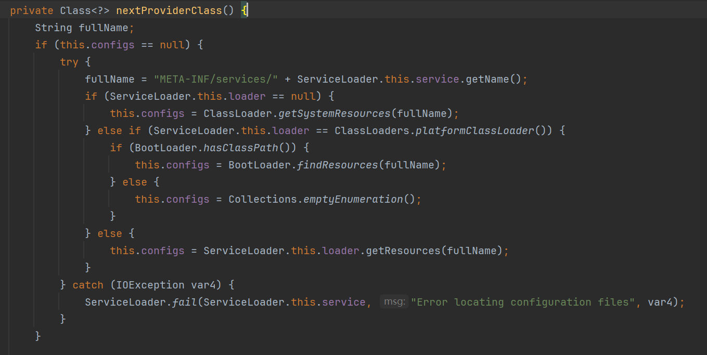
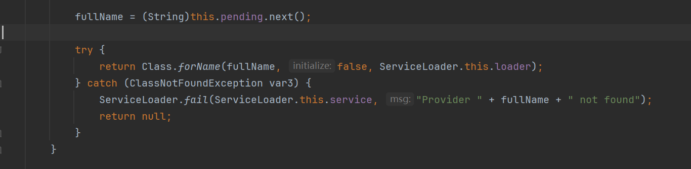
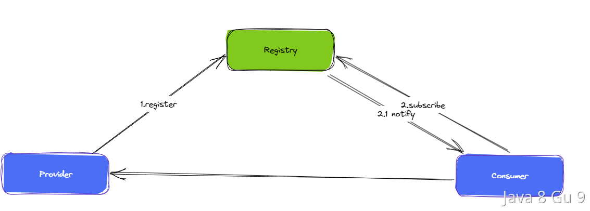

# Dubbo

## SPI机制讨论

SPI 全称为 Service Provider Interface，是一种服务发现机制。SPI 的本质是将接口实现类的全限定名配置在文件中，并由服务加载器读取配置文件，加载实现类。这样可以在运行时，动态为接口替换实现类。正因此特性，我们可以很容易的通过 SPI 机制为我们的程序提供拓展功能。

在谈dubbo的SPI扩展机制之前，我们需要先了解下java原生的SPI机制，有助于我们更好的了解dubbo的SPI。

### java原生的SPI

先上例子：

1. 定义接口Animal ：
   
   ```java
   public interface Animal {
    void run();
   }
   ```

2. 编写2个实现类，Cat和Dog
   
   ```java
   public class Cat implements Animal{
    @Override
    public void run() {
         System.out.println("小猫步走起来～");
      }
   }
   public class Dog implements Animal {
    @Override
    public void run() {
         System.out.println("小狗飞奔～");
      }
   }
   ```

3. 接下来在 META-INF/services 文件夹下创建一个文件，名称为 Animal 的全限定名 com.sunnick.animal.Animal，文件内容为实现类的全限定的类名，如下：
   
   ```java
   com.sunnick.animal.impl.Dog
   com.sunnick.animal.impl.Cat
   ```

4. 编写方法进行测试：
   
   ```java
   public static void main(String[] s){
      System.out.println("======this is SPI======");
      ServiceLoader<Animal> serviceLoader = ServiceLoader.load(Animal.class);  
          Iterator<Animal> animals = serviceLoader.iterator();  
    while (animals.hasNext()) {  
              animals.next().run();
          }
   } 
   ```

5. 测试结果如下：
   
   ```
   ======this is SPI======
   小狗飞奔～
   小猫步走起来～
   ```

6. 

在上述例子中，通过ServiceLoader.load(Animal.class)方法动态加载Animal的实现类，通过追踪该方法的源码，发现程序会去读取META-INF/services目录下文件名为类名的配置文件（如上述例子中的META-INF/services/com.sunnick.animal.Animal文件），如下，其中PREFIX 常量值为”META-INF/services/”:



然后再通过反射Class.forName()加载类对象，并用instance()方法将类实例化，从而完成了服务发现。



java原生SPI有以下几个缺点：

1. 需要遍历所有的实现并实例化，无法只加载某个指定的实现类，加载机制不够灵活；

2. 配置文件中没有给实现类命名，无法在程序中准确的引用它们；

3. 没有使用缓存，每次调用load方法都需要重新加载

4. 在多线程并发的使用Serviceloader实例时会出现线程不安全问题

### Spring SPI

Spring SPI机制使用了Java SPI的设计思路，我们只需要在 **META-INF/spring.factories** 中配置接口+实现类名，即可通过Spring组件加载机制，在运行时加载接口的实现类。

1. 首先创建一个接口定义项目-ServiceProviderInterfaceSpring，定义好接口：
   
   ```java
   public interface SpringLogger {
     public void info(String msg);
   
     public void debug(String msg);
   }
   ```

2. 在接口定义项目内最好引入Spring依赖：
   
   ```xml
   <dependencies>
           <dependency>
               <groupId>org.springframework</groupId>
               <artifactId>spring-core</artifactId>
               <version>5.3.26</version>
           </dependency>
       </dependencies>
   ```

3. 接着创建一个接口实现类1项目，在接口实现类1项目中，引入接口定义项目A：
   
   ```xml
       <dependencies>
           <dependency>
               <groupId>org.example</groupId>
               <artifactId>ServiceProviderInterfaceSpring</artifactId>
               <version>1.0-SNAPSHOT</version>
           </dependency>
       </dependencies>
   ```

4. 在接口实现类1项目中，实现该接口：
   
   ```java
   public class SpringLoggerImpl
       implements org.example.JavaWorld.serviceProviderInterfaceSpring.spi.SpringLogger {
     @Override
     public void info(String msg) {
       System.out.println("SpringLoggerImpl info:" + msg);
     }
   
     @Override
     public void debug(String msg) {
       System.out.println("SpringLoggerImpl debug:" + msg);
     }
   }
   ```

5. 在接口实现类1项目中，配置接口全路径和实现类全路径映射关系：
   
   ```properties
   org.exampleJavaWorld.serviceProviderInterfaceSpring.spi.SpringLogger=org.example.JavaGuide.ServiceProviderSpring.SpringLoggerImpl
   ```

6. 接着创建一个接口实现类2项目，在接口实现类2项目中，重复上面步骤：
   
   ```xml
       <dependencies>
           <dependency>
               <groupId>org.example</groupId>
               <artifactId>ServiceProviderInterfaceSpring</artifactId>
               <version>1.0-SNAPSHOT</version>
           </dependency>
       </depende
   ```

7. 接口实现类2项目中，引入接口定义项目A：
   
   ```java
   public class SpringLoggerImpl2
       implements org.example.JavaWorld.serviceProviderInterfaceSpring.spi.SpringLogger {
     @Override
     public void info(String msg) {
       System.out.println("SpringLoggerImpl2 info:" + msg);
     }
   
     @Override
     public void debug(String msg) {
       System.out.println("SpringLoggerImpl2 debug:" + msg);
     }
   }
   ```

8. 接口实现类2项目中，配置接口全路径和实现类全路径映射关系：
   
   ```properties
   org.example.JavaWorld.serviceProviderInterfaceSpring.spi.SpringLogger=org.example.JavaGuide.ServiceProviderSpring2.SpringLoggerImpl2
   ```

9. 测试代码如下：
   
   ```java
   public class TestSpringSpi {
     public static void main(String[] args) {
       List<SpringLogger> springLoggerList =
           SpringFactoriesLoader.loadFactories(
               SpringLogger.class, TestSpringSpi.class.getClassLoader());
       Iterator<SpringLogger> iterator = springLoggerList.iterator();
       while (iterator.hasNext()) {
         SpringLogger next = iterator.next();
         next.info("TestSpringSpi");
       }
       System.out.println("执行结束");
     }
   }
   ```

10. 测试结果如下：
    
    ```log
    SpringLoggerImpl info:TestSpringSpi
    SpringLoggerImpl2 info:TestSpringSpi
    执行结束
    ```

### Spring的SPI源码分析

Spring通过SpringFactoriesLoader的loadFactories方法加载实现类到Spring中。该方法会先获取类全路径名，再去生成类实例：

```java
    public static <T> List<T> loadFactories(Class<T> factoryType, @Nullable ClassLoader classLoader) {
        //断言，factoryType为空直接报错factoryType' must not be null
        Assert.notNull(factoryType, "'factoryType' must not be null");
        ClassLoader classLoaderToUse = classLoader;
        //判断是否有类加载器，没有的话就使用SpringFactoriesLoader的
        if (classLoaderToUse == null) {
            classLoaderToUse = SpringFactoriesLoader.class.getClassLoader();
        }
        //加载实现类全限定名，我们进去看下loadFactoryNames()实现，看它怎么加载的实现类全限定名
        List<String> factoryImplementationNames = loadFactoryNames(factoryType, classLoaderToUse);
        if (logger.isTraceEnabled()) {
            logger.trace("Loaded [" + factoryType.getName() + "] names: " + factoryImplementationNames);
        }
        List<T> result = new ArrayList<>(factoryImplementationNames.size());
        for (String factoryImplementationName : factoryImplementationNames) {
            /**
            * 重点关注instantiateFactory(factoryImplementationName, factoryType, classLoaderToUse)，这里面主要是通过反射实例化对象
            * 接下来我们探究一下它的源码
            *
            **/
            result.add(instantiateFactory(factoryImplementationName, factoryType, classLoaderToUse));
        }

        //对结果进行排序
        AnnotationAwareOrderComparator.sort(result);
        return result;
    }
```

loadFactoryNames方法通过调用loadSpringFactories方法获取类全路径名：

```java
    public static List<String> loadFactoryNames(Class<?> factoryType, @Nullable ClassLoader classLoader) {
        ClassLoader classLoaderToUse = classLoader;
        //判断是否有类加载器，没有的话就使用SpringFactoriesLoader的
        if (classLoaderToUse == null) {
            classLoaderToUse = SpringFactoriesLoader.class.getClassLoader();
        }
        //获取接口全限定名
        String factoryTypeName = factoryType.getName();
        //主要看loadSpringFactories(classLoaderToUse)方法，这里面是找到spring.factories的源码
        return loadSpringFactories(classLoaderToUse).getOrDefault(factoryTypeName, Collections.emptyList());
    }
```

loadSpringFactories方法先从缓存中查找实现类名，如果找不到再从META-INF/spring.factories文件中读取接口对应的实现类全路径：

```java
    private static Map<String, List<String>> loadSpringFactories(ClassLoader classLoader) {
        //先从缓存里面取，如果有数据直接返回，则继续往下执行（注意：key是classLoader）
        Map<String, List<String>> result = cache.get(classLoader);
        if (result != null) {
            return result;
        }

        result = new HashMap<>();
        try {
            //根据路径获取所有资源，FACTORIES_RESOURCE_LOCATION = "META-INF/spring.factories"
            Enumeration<URL> urls = classLoader.getResources(FACTORIES_RESOURCE_LOCATION);
            while (urls.hasMoreElements()) {
                URL url = urls.nextElement();
                UrlResource resource = new UrlResource(url);

                //加载配置文件拿到实现类全限定名，为什么可以用Properties加载，因为配置是K V的
                Properties properties = PropertiesLoaderUtils.loadProperties(resource);
                for (Map.Entry<?, ?> entry : properties.entrySet()) {
                    String factoryTypeName = ((String) entry.getKey()).trim();
                    //以逗号分隔的实现类全限定类名转成字符串数组
                    String[] factoryImplementationNames =
                            StringUtils.commaDelimitedListToStringArray((String) entry.getValue());
                    for (String factoryImplementationName : factoryImplementationNames) {
                        //重新计算key，不存在则添加，存在则直接返回
                        result.computeIfAbsent(factoryTypeName, key -> new ArrayList<>())
                                .add(factoryImplementationName.trim());
                    }
                }
            }

            //给结果去重
            result.replaceAll((factoryType, implementations) -> implementations.stream().distinct()
                    .collect(Collectors.collectingAndThen(Collectors.toList(), Collections::unmodifiableList)));

            //把结果添加到缓存里，classLoader作为key， 结果集作为value
            cache.put(classLoader, result);
        }
        catch (IOException ex) {
            throw new IllegalArgumentException("Unable to load factories from location [" +
                    FACTORIES_RESOURCE_LOCATION + "]", ex);
        }
        //返回结果
        return result;
    }
```

instantiateFactory方法通过反射生成类实例：

```java
    private static <T> T instantiateFactory(String factoryImplementationName, Class<T> factoryType, ClassLoader classLoader) {
        try {
            //通过ClassUtils.forName()加载Class对象
            Class<?> factoryImplementationClass = ClassUtils.forName(factoryImplementationName, classLoader);
            //判断实现类是不是实现了标准接口
            if (!factoryType.isAssignableFrom(factoryImplementationClass)) {
                throw new IllegalArgumentException(
                        "Class [" + factoryImplementationName + "] is not assignable to factory type [" + factoryType.getName() + "]");
            }

            //先获得构造器，然后再实例化对象
            return (T) ReflectionUtils.accessibleConstructor(factoryImplementationClass).newInstance();
        }
        catch (Throwable ex) {
            throw new IllegalArgumentException(
                "Unable to instantiate factory class [" + factoryImplementationName + "] for factory type [" + factoryType.getName() + "]",
                ex);
        }
    }
```

到这里，我们就完成了Spring SPI机制的源码分析，相信读完大家都明白了这中间实现逻辑的简单。

Spring SPI机制和Java SPI机制相比，在编程范式上并没有提升，沿用了接口+实现类的范式解耦，但是内部使用缓存机制提升了性能。另一方面，Spring可以只用一个配置文件即可完成对多个接口+实现类的映射关系，而Java SPI机制仍需要配置多个文件进行映射，非常繁琐。

对于Spring项目来说，项目内引用接口定义依赖、接口实现类依赖即可完成功能引入，在实际使用功能时，直接使用接口定义的方法，与具体实现解耦。这样的项目，即使以后更换了接口实现类依赖，也是只需要更新依赖即可，不需要改动项目代码。这种开发方式才是发挥了解耦范式的强大威力。Spring Boot Starter的项目就是采用了这种方式，方便开发者引入功能组件。

### Dubbo SPI

Dubbo 也并未使用 Java SPI，而是重新实现了一套功能更强更灵活的 SPI 机制。Dubbo SPI 的相关逻辑被封装在了 ExtensionLoader 类中，通过 ExtensionLoader，我们可以加载指定的实现类。Dubbo SPI 所需的配置文件需放置在 META-INF/dubbo 路径下，配置内容如下：

```properties
First = org.example.JavaWorld.ServiceProviderDubbo.spi.FirstLoggerServiceImpl
Second = org.example.JavaWorld.ServiceProviderDubbo.spi.SecondLoggerServiceImpl
```

与 Java SPI 实现类配置不同，Dubbo SPI 是通过键值对的方式进行配置，这样就可以按需加载指定的实现类。另外，在使用 Dubbo SPI 时，需要在 Animal接口上标注 @SPI 注解，Cat与Dog类不变。下面来演示 Dubbo SPI 的用法：

```java
@SPI
public interface Logger {
  public void info(String msg);

  public void debug(String msg);
}
```

在对应的服务实现类上：

```java
public class FirstLoggerServiceImpl implements Logger {
  @Override
  public void info(String s) {
    System.out.println("FirstLoggerServiceImpl info 打印日志：" + s);
  }

  @Override
  public void debug(String s) {
    System.out.println("FirstLoggerServiceImpl debug 打印日志：" + s);
  }
}

public class SecondLoggerServiceImpl implements Logger {
  @Override
  public void info(String s) {
    System.out.println("SecondLoggerServiceImpl info 打印日志：" + s);
  }

  @Override
  public void debug(String s) {
    System.out.println("SecondLoggerServiceImpl debug 打印日志：" + s);
  }
}


```

编写测试方法：

```java
public class TestDubboSpi {
  public static void main(String[] args) {
    System.out.println("======dubbo SPI======");
    ExtensionLoader<Logger> extensionLoader = ExtensionLoader.getExtensionLoader(Logger.class);
    Logger FirstLoggerServiceImpl = extensionLoader.getExtension("First");
    FirstLoggerServiceImpl.info("TestDubboSpi");
    Logger SecondLoggerServiceImpl = extensionLoader.getExtension("Second");
    SecondLoggerServiceImpl.info("TestDubboSpi");
  }
}
```

测试结果如下：

```log
======dubbo SPI======
FirstLoggerServiceImpl info 打印日志：TestDubboSpi
SecondLoggerServiceImpl info 打印日志：TestDubboSpi
```

### dubbo的SPI源码分析

Dubbo通过ExtensionLoader.getExtensionLoader(Animal.class).getExtension("First")方法获取实例。该方法中，会先到缓存列表中获取实例，若未命中，则创建实例：

```java
public T getExtension(String name) {
    if (name == null || name.length() == 0)
        throw new IllegalArgumentException("Extension name == null");
    if ("true".equals(name)) {
        // 获取默认的拓展实现类
        return getDefaultExtension();
    }
    // Holder，顾名思义，用于持有目标对象
    Holder<Object> holder = cachedInstances.get(name);
    if (holder == null) {
        cachedInstances.putIfAbsent(name, new Holder<Object>());
        holder = cachedInstances.get(name);
    }
    Object instance = holder.get();
    // 双重检查
    if (instance == null) {
        synchronized (holder) {
            instance = holder.get();
            if (instance == null) {
                // 创建拓展实例
                instance = createExtension(name);
                // 设置实例到 holder 中
                holder.set(instance);
            }
        }
    }
    return (T) instance;
}
```

创建实例过程如下，即createExtension()方法：

```java
private T createExtension(String name) {
    // 从配置文件中加载所有的拓展类，可得到“配置项名称”到“配置类”的映射关系表
    Class<?> clazz = getExtensionClasses().get(name);
    if (clazz == null) {
        throw findException(name);
    }
    try {
        T instance = (T) EXTENSION_INSTANCES.get(clazz);
        if (instance == null) {
            // 通过反射创建实例
            EXTENSION_INSTANCES.putIfAbsent(clazz, clazz.newInstance());
            instance = (T) EXTENSION_INSTANCES.get(clazz);
        }
        //此处省略一些源码......
        return instance;
    } catch (Throwable t) {
        throw new IllegalStateException("...");
    }
}
```

获取所有的SPI配置文件，并解析配置文件中的键值对的方法getExtensionClasses()的源码如下：

```java
private Map<String, Class<?>> getExtensionClasses() {
    // 从缓存中获取已加载的拓展类
    Map<String, Class<?>> classes = cachedClasses.get();
    // 双重检查
    if (classes == null) {
        synchronized (cachedClasses) {
            classes = cachedClasses.get();
            if (classes == null) {
                // 加载拓展类
                classes = loadExtensionClasses();
                cachedClasses.set(classes);
            }
        }
    }
    return classes;
}
```

这里也是先检查缓存，若缓存未命中，则通过 synchronized 加锁。加锁后再次检查缓存，并判空。此时如果 classes 仍为 null，则通过 loadExtensionClasses 加载拓展类。下面分析 loadExtensionClasses 方法的逻辑：

```java
private Map<String, Class<?>> loadExtensionClasses() {
    // 获取 SPI 注解，这里的 type 变量是在调用 getExtensionLoader 方法时传入的，即示例中的Animal
    SPI defaultAnnotation = (SPI)this.type.getAnnotation(SPI.class);
    if(defaultAnnotation != null) {
        String extensionClasses = defaultAnnotation.value();
        if(extensionClasses != null && (extensionClasses = extensionClasses.trim()).length() > 0) {
      // 对 SPI 注解内容进行切分
            String[] names = NAME_SEPARATOR.split(extensionClasses);
      // 检测 SPI 注解内容是否合法，不合法则抛出异常
            if(names.length > 1) {
                throw new IllegalStateException("more than 1 default extension name on extension " + this.type.getName() + ": " + Arrays.toString(names));
            }

            if(names.length == 1) {
                this.cachedDefaultName = names[0];
            }
        }
    }
    HashMap extensionClasses1 = new HashMap();
    // 加载指定文件夹下的配置文件
    this.loadFile(extensionClasses1, "META-INF/dubbo/internal/");
    this.loadFile(extensionClasses1, "META-INF/dubbo/");
    this.loadFile(extensionClasses1, "META-INF/services/");
    return extensionClasses1;
}
```

可以看出，最后调用了loadFile方法，该方法就是从指定的目录下读取指定的文件名，解析其内容，将键值对放入map中，其过程不在赘述。

以上就是dubbo的SPI加载实例的过程。

如果想使用Dubbo SPI，接口必须打上@SPI注解。相比之下，Dubbo SPI有以下几点改进：

1. 按需加载。Dubbo 的扩展能力不会一次性实例化所有实现，而是对需要加载的扩展类实例化，减少资源浪费。

2. 配置灵活。键值对方式配置拓展点实现类。

3. 增加了缓存来存储实例，提高了读取的性能。

除此之外，dubbo SPI还提供了默认值的指定方式（例如可通过@SPI（“First”）方式指定Logger的默认实现类为FirstLoggerServiceImpl）。同时dubbo SPI还提供了对IOC和AOP等高级功能的支持，以实现更多类型的扩展。

Dubbo的加载器的设计思路是：

1. 一个扩展点类一个加载器对象，加载器对象获取指定名称实现类时，先读取缓存中的结果；

2. 缓存中没有对应实现类，再通过读取META-INF/dubbo下的配置文件尝试加载实现类

3. 进行扩展实例属性的 IOC 注入以及实例化扩展的包装类，实现 AOP 特性

## 什么是Dubbo的优雅停机，怎么实现的？

### 优雅上下线

关于"优雅上下线"这个词，我没找到官方的解释，我尝试解释一下这是什么。  

首先，上线、下线大家一定都很清楚，比如我们一次应用发布过程中，就需要先将应用服务停掉，然后再把服务启动起来。这个过程就包含了一次下线和一次上线。  

那么，"优雅"怎么理解呢？  

先说什么情况我们认为不优雅：  

1、服务停止时，没有关闭对应的监控，导致应用停止后发生大量报警。  

2、应用停止时，没有通知外部调用方，很多请求还会过来，导致很多调用失败。  

3、应用停止时，有线程正在执行中，执行了一半，JVM进程就被干掉了。  

4、应用启动时，服务还没准备好，就开始对外提供服务，导致很多失败调用。  

5、应用启动时，没有检查应用的健康状态，就开始对外提供服务，导致很多失败调用。  

以上，都是我们认为的不优雅的情况，那么，反过来，优雅上下线就是一种避免上述情况发生的手段。  

一个应用的优雅上下线涉及到的内容其实有很多，从底层的操作系统、容器层面，到编程语言、框架层面，再到应用架构层面，涉及到的知识很广泛。  

其实，优雅上下线中，最重要的还是优雅下线。因为如果下线过程不优雅的话，就会发生很多调用失败了、服务找不到等问题。所以很多时候，大家也会提优雅停机这样的概念。  

本文后面介绍的优雅上下线也重点关注优雅停机的过程。

### 操作系统&容器的优雅上下线

我们知道，kill -9之所以不建议使用，是因为kill -9特别强硬，系统会发出SIGKILL信号，他要求接收到该信号的程序应该立即结束运行，不能被阻塞或者忽略。  

这个过程显然是不优雅的，因为应用立刻停止的话，就没办法做收尾动作。而更优雅的方式是kill -15（kill命令默认使用-15）。  

当使用kill -15时，系统会发送一个SIGTERM的信号给对应的程序。当程序接收到该信号后，具体要如何处理是自己可以决定的。  

kill -15会通知到应用程序，这就是操作系统对于优雅上下线的最基本的支持。  

以前，在操作系统之上就是应用程序了，但是，自从容器化技术推出之后，在操作系统和应用程序之间，多了一个容器层，而Docker、k8s等容器其实也是支持优雅上下线的。  

如Docker中同样提供了两个命令， docker stop 和 docker kill  

docker stop就像kill -15一样，他会向容器内的进程发送SIGTERM信号，在10S之后（可通过参数指定）再发送SIGKILL信号。  

而docker kill就像kill -9，直接发送SIGKILL信号。

### JVM的优雅上下线

在操作系统、容器等对优雅上下线有了基本的支持之后，在接收到docker stop、kill -15等命令后，会通知应用进程进行进程关闭。  

而Java应用在运行时就是一个独立运行的进程，这个进程是如何关闭的呢？  

Java程序的终止运行是基于JVM的关闭实现的，JVM关闭方式分为正常关闭、强制关闭和异常关闭3种。  

这其中，正常关闭就是支持优雅上下线的。正常关闭过程中，JVM可以做一些清理动作，比如删除临时文件。  

当然，开发者也是可以自定义做一些额外的事情的，比如通知应用框架优雅上下线操作。  

而这种机制是通过JDK中提供的shutdown hook实现的。JDK提供了Java.Runtime.addShutdownHook(Thread hook)方法，可以注册一个JVM关闭的钩子。  

例子如下：  

```java
package com.hollis;

public class ShutdownHookTest {

    public static void main(String[] args) {
        boolean flag = true;
        Runtime.getRuntime().addShutdownHook(new Thread(() -> {
            System.out.println("hook execute...");
        }));

        while (flag) {
            // app is runing
        }

        System.out.println("main thread execute end...");
    }
}
```

控制台输出内容：  

```log
hook execute...
Process finished with exit code 143 (interrupted by signal 15: SIGTERM)
```

可以看到，当我们使用kill（默认kill -15）关闭进程的时候，程序会先执行我注册的shutdownHook，然后再退出，并且会给出一个提示：interrupted by signal 15: SIGTERM

### Spring的优雅上下线

有了JVM提供的shutdown hook之后，很多框架都可以通过这个机制来做优雅下线的支持。  

比如Spring，他就会向JVM注册一个shutdown hook，在接收到关闭通知的时候，进行bean的销毁，容器的销毁处理等操作。  

同时，作为一个成熟的框架，Spring也提供了事件机制，可以借助这个机制实现更多的优雅上下线功能。  

ApplicationListener是Spring事件机制的一部分，与抽象类ApplicationEvent类配合来完成ApplicationContext的事件机制。  

开发者可以实现ApplicationListener接口，监听到 Spring 容器的关闭事件（ContextClosedEvent），来做一些特殊的处理：

```java
@Component
public class MyListener implements ApplicationListener<ContextClosedEvent> {
    @Override
    public void onApplicationEvent(ContextClosedEvent event) {
        // 做容器关闭之前的清理工作
    }
}
```

### Dubbo的优雅上下线

因为Spring中提供了ApplicationListener接口，帮助我们来监听容器关闭事件，那么，很多web容器、框架等就可以借助这个机制来做自己的优雅上下线操作。  

如tomcat、dubbo等都是这么做的。  

应用在停机时，接收到关闭通知时，会先把自己标记为不接受（发起）新请求，然后再等待10s（默认是10秒）的时候，等执行中的线程执行完。  

那么，之所以他能做这些事，是因为从操作系统、到JVM、到Spring等都对优雅停机做了很好的支持。  

关于Dubbo各个版本中具体是如何借助JVM的shutdown hook机制、或者说Spring的事件机制做的优雅停机，我的一位同事的一篇文章介绍的很清晰，大家可以看下：  

[一文聊透 Dubbo 优雅停机 - 徐靖峰|个人博客](https://www.cnkirito.moe/dubbo-gracefully-shutdown/)  

在从Dubbo 2.5 到 Dubbo 2.7介绍了历史版本中，Dubbo为了解决优雅上下线问题所遇到的问题和方案。  

目前，Dubbo中实现方式如下，同样是用到了Spring的事件机制：

```java
public class SpringExtensionFactory implements ExtensionFactory {
    public static void addApplicationContext(ApplicationContext context) {
        CONTEXTS.add(context);
        if (context instanceof ConfigurableApplicationContext) {
            ((ConfigurableApplicationContext) context).registerShutdownHook();
            DubboShutdownHook.getDubboShutdownHook().unregister();
        }
        BeanFactoryUtils.addApplicationListener(context, SHUTDOWN_HOOK_LISTENER);
    }
}
```

## Dubbo支持哪些调用协议？

dubbo支持多种协议，主要由以下几个：

1. dubbo 协议 (默认) 
   默认就是走dubbo协议的，基于hessian作为序列化协议，单一长连接，TCP协议传输，NIO异步通信，适合大并发小数据量的服务调用，以及消费者远大于提供者，传输数据量很小（每次请求在100kb以内），但是并发量很高。

2. rmi 协议
   采用JDK标准的rmi协议实现，传输参数和返回参数对象需要实现Serializable接口，使用java标准序列化机制，使用阻塞式短连接，传输数据包大小混合，消费者和提供者个数差不多，可传文件，传输协议TCP。

3. hessian 协议
   集成Hessian服务，基于HTTP通讯，采用Servlet暴露服务，Dubbo内嵌Jetty作为服务器时默认实现，提供与Hession服务互操作。
   hessian序列化协议，多个短连接，同步HTTP传输，传入参数较大，提供者大于消费者，提供者压力较大，适用于文件的传输，一般较少用；

4. http 协议
   基于Http表单提交的远程调用协议，使用Spring的HttpInvoke实现。

5. webservice 协议
   
   基于WebService的远程调用协议，集成CXF实现，提供和原生WebService的互操作。

6. thrift 协议
   当前 dubbo 支持的 thrift 协议是对 thrift 原生协议 的扩展，在原生协议的基础上添加了一些额外的头信息，比如 service name，magic number 等。

7. memcached 协议
   基于 memcached实现的 RPC 协议。

8. redis 协议
   基于 Redis实现的 RPC 协议。

9. restful
   基于标准的Java REST API——JAX-RS 2.0（Java API for RESTful Web Services的简写）实现的REST调用支持

## Dubbo服务发现与路由的概念有什么不同？

服务发现是指在Dubbo注册中心中查找提供某个服务的服务提供者，以便服务消费者可以调用它们。  

Dubbo的注册中心可以是ZooKeeper、Redis等，服务提供者在启动时会将自己的地址信息注册到注册中心中，服务消费者在调用服务时会从注册中心中获取服务提供者的地址信息。  

服务路由是指根据一定的规则将服务请求路由到指定的服务提供者上。Dubbo提供了多种路由策略，如随机路由、轮询路由、一致性哈希路由等。路由规则可以在Dubbo的配置文件中进行配置，也可以在运行时通过API进行动态修改。  

因此，服务发现是获取服务提供者的地址信息，路由则是将服务请求路由到指定的服务提供者上。两者都是Dubbo中非常重要的概念，但是它们的作用是不同的。

## Dubbo的缓存机制了解吗？

Dubbo提供了缓存机制，其主要作用是缓存服务调用的响应结果，减少重复调用服务的次数，提高调用性能。  

Dubbo支持了服务端结果缓存和客户端结果缓存。  

服务端缓存是指将服务端方法的返回结果缓存到内存中，以便下次请求时可以直接从缓存中获取结果，而不必再调用服务方法。服务端缓存可以提高响应速度和系统吞吐量。Dubbo提供了三种服务端缓存的实现方式：

- LRU Cache: 使用基于LRU(最近最少使用)算法的缓存，当缓存空间满时，会将最近最少使用的缓存清除掉。

- Thread Local Cache: 使用线程本地缓存，即每个线程都拥有一个缓存实例，缓存结果只对当前线程可见。

- Concurrent Map Cache: 使用基于ConcurrentMap的缓存，支持并发读写，相对LRU Cache和Thread Local Cache来说，缓存效率更高。  

客户端缓存是指客户端将调用远程服务方法的返回结果缓存到内存中，以便下次请求时可以直接从缓存中获取结果，而不必再调用远程服务方法。消费端缓存可以提高系统的响应速度和降低系统的负载。Dubbo提供了两种消费端缓存的实现方式：

- LRU Cache: 使用基于LRU算法的缓存，当缓存空间满时，会将最近最少使用的缓存清除掉。 

- Thread Local Cache: 使用线程本地缓存，即每个线程都拥有一个缓存实例，缓存结果只对当前线程可见。  

需要注意的是，缓存虽好用，使用需谨慎，过度依赖缓存可能会出现数据不一致的问题。

### 服务端缓存

接口维度的服务端缓存配置方式支持XML和注解两种：
XML配置：

```java
<bean id="demoService" class="org.apache.dubbo.demo.provider.DemoServiceImpl"/>
<dubbo:service interface="com.foo.DemoService" ref="demoService" cache="lru" /> 
```

注解配置方式：

```java
@DubboService(cache = "lru")
public class DemoServiceImpl implements DemoService {

    private static final Logger logger = LoggerFactory.getLogger(DemoServiceImpl.class);
    @Override
    public String sayHello(String name) {
        logger.info("Hello " + name + ", request from consumer: " + RpcContext.getContext().getRemoteAddress());
        return "Hello " + name;

    }

}
```

还支持方法维度的缓存配置，同样支持XML和注解两种：

```java
<bean id="demoService" class="org.apache.dubbo.demo.provider.DemoServiceImpl"/>
<dubbo:service interface="com.foo.DemoService" ref="demoService" cache="lru" />
    <dubbo:method name="sayHello" cache="lru" />
</dubbo:service>
```

```java
@DubboService(methods = {@Method(name="sayHello",cache = "lru")})
public class DemoServiceImpl implements DemoService {

    private static final Logger logger = LoggerFactory.getLogger(DemoServiceImpl.class);
    @Override
    public String sayHello(String name) {
        logger.info("Hello " + name + ", request from consumer: " + RpcContext.getContext().getRemoteAddress());
        return "Hello " + name;
    }
}
```

### 客户端缓存

接口维度：

```java
<dubbo:reference interface="com.foo.DemoService" cache="lru" />
```

或者：

```java
@DubboReference(cache = "lru")
private DemoService demoService;
```

方法维度：

```java
<dubbo:reference interface="com.foo.DemoService">
    <dubbo:method name="sayHello" cache="lru" />
</dubbo:reference>
```

或者：

```java
@DubboReference(methods = {@Method(name="sayHello",cache = "lru")})
private DemoService demoService;
```

## Dubbo如何实现像本地方法一样调用远程方法的？

Dubbo 实现像本地方法一样调用远程方法的核心技术是动态代理。Dubbo 使用 JDK 动态代理或者字节码增强技术，生成一个代理类，该代理类实现了本地接口，具有本地接口的所有方法。在调用本地接口方法时，会通过代理类的 invoke 方法将请求转发到远程服务提供者上。  

生成代理类，Dubbo 在启动时会扫描配置文件（注解）中指定的服务接口，并根据服务接口生成一个代理类。这个代理类实现了服务接口，并且在调用服务接口的方法时，会将参数封装成请求消息，然后通过网络传输给服务提供方。  

网络通信，Dubbo 支持多种通信协议，包括 Dubbo 协议、HTTP 协议、Hessian 协议等。在配置文件中指定了要使用的通信协议后，Dubbo 会根据协议的不同，选择不同的序列化方式，将请求消息序列化成二进制流并发送给服务提供方。  

负载均衡，Dubbo 支持多种负载均衡算法，包括轮询、随机、加权随机、最小活跃数等。在客户端发起调用时，Dubbo 会根据负载均衡算法选择一台服务提供方进行调用。  

远程服务执行，当客户端发起远程调用后，服务提供方接收到请求后，会根据请求中的服务接口名和方法名，找到对应的实现类和方法，并将请求消息反序列化成参数列表，最终调用服务实现类的方法，并将执行结果序列化成响应消息返回给客户端。

## Dubbo实现服务调用的过程是什么样的？

Dubbo的整体架构中，有多个角色，分别是服务提供者，服务调用者以及服务注册中心。一次完整的服务调用过程其实要分为服务注册、服务发现和服务调用三个过程。



1、服务注册：服务提供者在启动时，会向注册中心注册自己提供的服务，并将服务相关的信息（如服务名称、版本号、IP地址、端口号、协议、权重等）一并注册。Dubbo支持多种注册中心，包括ZooKeeper、Redis、Multicast、Simple等。一旦服务注册成功，服务提供者就可以等待服务调用请求的到来。  

2、服务发现：服务调用者在启动时，需要向注册中心订阅自己所需的服务，注册中心会将服务提供者列表返回给服务调用者。当过程中，如果服务提供者列表发生变化，那么Dubbo会通知客户端进行变更。  

3、服务调用：服务调用者需要根据负载均衡策略选择一个服务提供者，之后，就可以发送服务调用请求了。Dubbo支持多种通信协议和序列化方式。Dubbo客户端将调用请求序列化成二进制数据，并使用网络协议发送给服务提供者，服务提供者将调用请求反序列化后，调用目标方法并将结果序列化成二进制数据返回给服务调用者。在整个调用过程中 ，Dubbo会对服务调用进行监控，包括调用次数、调用时间、响应时间、异常次数、异常信息等，以便于服务提供者和服务调用者进行故障排查和性能调优。

### 连接方式

Dubbo提供了多种通信协议和通信方式，包括dubbo、http、hessian等，对于不同的通信方式，Dubbo也提供了不同的通信模型。对于服务提供者和服务消费者之间的通信，可以使用长连接模式或短连接模式，可以使用NIO或者Netty等高性能的通信框架，还可以设置心跳等机制来保持连接的稳定性。  

对于服务提供者和注册中心之间的通信，Dubbo同样提供了多种注册中心实现，包括ZooKeeper、Redis、Multicast和Simple等，这些注册中心实现了不同的通信协议和通信方式。  

在使用ZooKeeper作为注册中心时，Dubbo会通过ZooKeeper的长连接来注册服务和订阅服务提供者列表，并通过ZooKeeper提供的watch机制来监听服务提供者列表的变化。而在使用Redis作为注册中心时，则会使用Redis提供的订阅-发布机制来进行服务注册和发现。

## 为什么RPC要比HTTP更快一些？

其实，RPC的设计目的就是用于高效的内部服务通信，他通常优化了数据传输和序列化过程，目的是减少网络延迟和提高性能。而HTTP的设计是一种更通用的协议，用于Web文档传输，它在灵活性和可访问性上进行了优化，而不是仅仅专注于性能。  

展开来说主要在以下几个方面，RPC做出了很多事情。  

轻量级序列化协议，RPC通常使用更高效的数据序列化格式（如Protocol Buffers、Thrift等），这些格式专门为性能和效率设计，它们比HTTP标准使用的文本格式（如JSON、XML）更紧凑、解析更快。  

网络协议更优，RPC的网络通信协议通常被设计的更轻量（如Netty），他一般不需要像HTTP那样有很复杂的Header信息，从而不需要传输太多的数据。  

长连接，虽然RPC和HTTP都是基于TCP的，但是RPC可以使用长连接和更有效的连接管理策略，如gRPC还是基于HTTP/2实现，这可以减少建立连接的开销，并允许多个请求在同一连接上有效地复用。虽然HTTP/1.1也有keep-alive机制，HTTP/2也有很多优化。但是RPC只在企业内部用，所以兼容性更好，而HTTP新版的普及程度并不太高。  

定制优化，RPC框架通常允许更深层次的定制和优化，比如调整底层传输细节、序列化方式和错误处理机制。而HTTP作为一个标准化的Web协议，其灵活性和定制能力可能较低，特别是在面向性能的场景中。  

内部网络，RPC通常应用于企业内部，内部网络交互链路更短，而HTTP在公网上进行通信，一次交互需要经过多个中间节点的转换。
