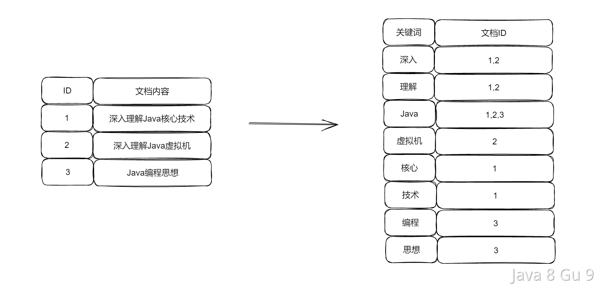

# Elastic Search

## 为什么要使用ElasticSearch？

Elasticsearch是一个开源的分布式搜索和分析引擎，主要适用于以下场景：

1. 搜索引擎：用于快速检索文档、商品、新闻等。

2. 日志分析：通过分析日志数据，帮助企业了解其业务的性能情况。

3. 数据分析：帮助数据科学家和数据分析师进行数据分析，以获取有价值的信息。

4. 商业智能：帮助企业制定数据驱动的决策，以实现商业上的成功。

5. 实时监控：帮助企业实时监测系统性能、监控数据变化，以保证系统正常运行。

6. 安全性：帮助企业保证数据的安全性，保证数据不被非法窃取。

7. 应用程序开发：帮助开发人员开发基于搜索的应用程序，以增加用户体验。

Elasticsearch具有以下几个优势：

1. 高性能：Elasticsearch具有高性能的搜索和分析能力，其中涵盖了多种查询语言和数据结构。

2. 可扩展性：Elasticsearch是分布式的，可以通过增加节点数量扩展搜索和分析能力。

3. 灵活性：Elasticsearch支持多种数据类型，支持多种语言，支持动态映射，允许快速地调整模型以适应不同的需求。

4. 实时分析：Elasticsearch支持实时分析，可以对数据进行实时查询，这对于快速检索数据非常有用。

5. 可靠性：Elasticsearch具有可靠性和高可用性，支持数据备份和恢复。

## ElasticSearch为什么快？

Elasticsearch是一个高性能、分布式搜索引擎，它之所以快，主要有以下几个原因：

1. 分布式存储：Elasticsearch使用分布式存储技术，将数据存储在多个节点上，从而减少单个节点的压力，提高整体性能。

2. 索引分片：Elasticsearch把每个索引划分成多个分片，这样可以让查询操作并行化，从而提高查询速度。

3. 全文索引：Elasticsearch使用了高效的全文索引技术，把文档转化成可搜索的结构化数据，使得搜索操作快速高效。

4. 倒排索引：Elasticsearch支持倒排索引这种数据结构，倒排索引将文档中的每个词与该词出现在哪些文档中进行映射，并存储这些信息。当搜索请求发生时，ES可以快速查找包含所有搜索词的文档，从而返回结果。

5. 索引优化：Elasticsearch通过索引优化技术，可以使查询速度更快。例如，它支持索引覆盖、索引下推等优化技术，使得查询速度更快。

6. 预存储结果：Elasticsearch在插入数据时，对数据进行预处理，把结果预存储到索引中，从而在查询时不需要再重新计算，提高查询速度。

7. 高效的查询引擎：Elasticsearch使用了高效的查询引擎，支持各种类型的查询，并对复杂查询提供了优化策略，从而提高查询速度。

8. 异步请求处理：ES使用了异步请求处理机制，能够在请求到达时立即返回，避免长时间的等待，提高用户体验。

9. 内存存储：ES使用了内存存储技术，能够在读写数据时大大减少磁盘访问次数，提高数据存储和查询效率。

总之，Elasticsearch快的原因在于它使用了各种高效的技术，使得数据存储、查询、处理都变得更加高效，从而实现了快速的搜索体验。

## 倒排索引是什么？

在 ElasticSearch 中，倒排索引是一种常用的索引结构，用于快速搜索文档中的某个词汇。  

倒排索引的结构与传统的索引结构相反，传统的索引结构是由文档构成的，每个文档包含了若干个词汇，然后根据这些词汇建立索引。而倒排索引是由词汇构成的，每个词汇对应了若干个文档，然后根据这些文档建立索引。



对于一个包含多个词汇的文档，倒排索引会将每个词汇作为一个关键字（Term），然后记录下该词汇所在的文档编号（Document ID）及该词汇在文档中的位置（Term Position）。这样，当用户输入一个关键字时，就可以快速地查找到包含该关键字的文档编号，然后通过文档编号再查找到对应的文档内容。

倒排索引的优点在于它可以快速定位包含关键字的文档，而且可以支持复杂的搜索操作，如词组搜索、通配符搜索等。同时，由于倒排索引是由词汇构成的，因此在进行数据分析和统计时也非常有用。在 ElasticSearch 中，倒排索引是一种非常重要的索引结构，它被广泛应用于搜索引擎、日志分析、推荐系统等领域。

### 倒排索引建立过程

ES中的倒排索引建立过程主要有2个步骤，分别是分词、建立倒排索引  

比如我们现在有三份文档内容，分别是

| id    | content                 |
| ----- | ----------------------- |
| 1<br> | 深入理解Java核心技术—Hollis<br> |
| 2<br> | 深入理解Java虚拟机—周志明<br>     |
| 3<br> | Java编程思想—布鲁斯·埃克尔        |

#### 分词

在倒排索引建立过程中，首先需要将文档中的原始文本分解成一个个词项（Term）。Elasticsearch 中默认使用标准分词器（Standard Analyzer）进行分词。  

以上三个文本内容，我们经过分词之后，就会包含了"深入"、"理解"、"Java"、"核心"、"技术"、"编程"、"思想"、"Hollis"、"周志明"、"布鲁斯·埃克尔"等词

#### 生成倒排索引

将分开的词，当做索引，与对应的文档ID进行关联，形成倒排表。  

|          |           |
| -------- | --------- |
| 词条       | 文档ID      |
| 深入<br>   | 1,2<br>   |
| 理解<br>   | 1,2<br>   |
| Java<br> | 1,2,3<br> |
| 虚拟机<br>  | 2<br>     |
| 核心<br>   | 1<br>     |
| 技术<br>   | 1<br>     |
| 编程<br>   | 3<br>     |
| 思想<br>   | 3<br>     |

在生成了倒排表后，还会对倒排表进行压缩，减少空间占用。常用的压缩算法包括Variable Byte Encoding和Simple9等。最后再将压缩后的倒排表存储在磁盘中，以便后续的搜索操作能够快速地访问倒排表。

## 如何保证ES和数据库的数据一致性？

在业务中，我们通常需要把数据库中的数据变更同步到ES中，那么如何保证数据库和ES的一致性呢？通常有以下几种做法：

### 双写

在代码中，对数据库和ES进行双写，并且先操作本地数据库，后操作ES，而且还需要把两个操作放到一个事务中：

```java
@Transactional(rollbackFor = Exception.class)
public void update(OrderDTO orderDTO) {
	//更新本地数据库
	updateDb(orderDTO);
  //远程更新ES
	updateEs(orderDTO);
}
```

在以上逻辑中，如果写数据库成功，写ES失败，那么事务会回滚。

如果写数据库成功，写ES超时，实际上ES操作成功，这时候数据库会回滚，导致数据不一致。这时候需要重试来保证最终一致性。

这个方案的好处就是简单，容易实现。并且实时性比较高。

缺点首先是需要改代码，有侵入性，还有就是存在不一致的情况。并且在本地事务中发生了外调（外部调用，调ES），大大拖长了事务，白白占用数据库链接，影响整体的吞吐量。

### MQ异步消费

在应用中，如果我要更新数据库了，那么就抛一个消息出去，然后数据库和ES各自有一个监听者，监听消息之后各自去做数据变更，如果失败了就基于消息的重试在重新执行。

或者像之前那个方案一样，先操作数据库，然后异步通知ES去更新，这时候就可以借助本地消息表的方式来保证最终一致性了。

这个方案的好处是用了MQ，起到了解耦的作用，而且还做到了异步，提升了整体性能。

缺点就是MQ可能存在延迟，并且需要引入新的中间件，复杂度有所提升。

### 扫表定时同步

如果是ES中的数据变更的实时性要求不高，可以考虑定时任务扫表， 然后批量更新ES。

这个方案优点是没有侵入性，数据库的写操作处不需要改代码。

缺点是实时性很差，并且轮询可能存在性能问题、效率问题以及给数据库带来压力。

### 监听binlog同步

还有一种方案，就是可以利用数据库变更时产生的binlog来更新ES。通过监听binlog来更新ES中的数据，也有成熟的框架可以做这样的事情

好处就是对业务代码完全没有侵入性，业务也非常解耦，不需要关心这个ES的更新操作。

缺点就是需要基于binlog监听，需要引入第三方框架。存在一定的延迟。

总结一下，目前业内比较流行的方案是基于binlog监听的这种，首先一般业务量小的业务也不太需要用ES，所以用了ES的团队，一般并不太会关心引入新框架的复杂度问题，而且ES这种搜索，一般来说，毫秒级的延迟都是可以接受的，所以，综合来讲，基于canal做数据同步的方案，是比较合适的。

## 什么是ElasticSearch的深度分页问题？如何解决？

在Elasticsearch中进行分页查询通常使用from和size参数。当我们对Elasticsearch发起一个带有分页参数的查询（如使用from和size参数）时，ES需要遍历所有匹配的文档直到达到指定的起始点（from），然后返回从这一点开始的size个文档。

```json
GET /your_index/_search
{
  "from": 20,
  "size": 10,
  "query": {
    "match_all": {}
  }
}
```

在这个例子中：

- from 参数定义了要跳过的记录数。在这里，它跳过了前20条记录。

- size 参数定义了返回的记录数量。在这里，它返回了10条记录。

from + size 的总数不能超过Elasticsearch索引的index.max_result_window设置，默认为10000。这意味着如果你设置from为9900，size为100，查询将会成功。但如果from为9900，size为101，则会失败。

ES的检索机制决定了，当进行分页查询时，Elasticsearch需要先找到并处理所有位于当前页之前的记录。例如，如果你请求第1000页的数据，并且每页显示10条记录，系统需要先处理前9990条记录，然后才能获取到你请求的那10条记录。这意味着，随着页码的增加，数据库需要处理的数据量急剧增加，导致查询效率降低。

这就是ES的深度分页的问题，深度分页需要数据库在内存中维护大量的数据，并对这些数据进行排序和处理，这会消耗大量的CPU和内存资源。随着分页深度的增加，查询响应时间会显著增加。在某些情况下，这可能导致查询超时或者系统负载过重。

所以，需要想办法解决ES的深度分页的问题。

### scroll

Scroll API在Elasticsearch中的主要目的是为了能够遍历大量的数据，它通常用于数据导出或者进行大规模的数据分析。可以用于处理大量数据的深度分页问题。

```json
GET /your_index/_search?scroll=1m
{
  "size": 10,  // 每页10条记录
  "query": {
    "match_all": {}
  }
}
```

如上方式初始化一个带有scroll参数的搜索请求。这个请求返回一个scroll ID，用于后续的滚动。Scroll参数指定了scroll的有效期，例如1m表示一分钟。

接下来就可以使用返回的scroll ID来获取下一批数据。每次请求也会更新scroll ID的有效期。

```json
GET /_search/scroll
{
  "scroll": "1m",
  "scroll_id": "your_scroll_id"
}
```

我们需要重复以上操作直到到达想要的页数。比如第10页，则需要执行9次滚动操作，然后第10次请求将返回第10页的数据。Scroll API可以解决深度分页问题，主要是因为他有以下几个特点：

1. 避免重复排序：
   
   在传统的分页方式中，每次分页请求都需要对所有匹配的数据进行排序，以确定分页的起点。Scroll避免了这种重复排序，因为它保持了一个游标。

2. 稳定视图：
   
   Scroll提供了对数据的“稳定视图”。当你开始一个scroll时，Elasticsearch会保持搜索时刻的数据快照，这意味着即使数据随后被修改，返回的结果仍然是一致的。

3. 减少资源消耗：
   
   由于不需要重复排序，Scroll减少了对CPU和内存的消耗，特别是对于大数据集。

Scroll非常适合于处理需要访问大量数据但不需要快速响应的场景，如数据导出、备份或大规模数据分析。

但是，需要知道，使用Scroll API进行分页并不高效，因为你需要先获取所有前面页的数据。Scroll API主要用于遍历整个索引或大量数据，而不是用于快速访问特定页数的数据。

### search_after

search_after 是 Elasticsearch 中用于实现深度分页的一种机制。与传统的分页方法（使用 from 和 size 参数）不同，search_after 允许你基于上一次查询的结果来获取下一批数据，这在处理大量数据时特别有效。

在第一次查询时，你需要定义一个排序规则。不需要指定 search_after 参数：

```json
GET /your_index/_search
{
  "size": 10,
  "query": {
    "match_all": {}
  },
  "sort": [
    {"timestamp": "asc"},
    {"id": "asc"}
  ]
}
```

这个查询按 timestamp 字段排序，并在相同 timestamp 的情况下按 id 排序。

在后续的查询中，使用上一次查询结果中最后一条记录的排序值。

```json
GET /your_index/_search
{
  "size": 10,
  "query": {
    "match_all": {}
  },
  "sort": [
    {"timestamp": "asc"},
    {"id": "asc"}
  ],
  "search_after": [1609459200000, 10000]
}
```

在这个例子中，search_after 数组包含了 timestamp 和 _id 的值，对应于上一次查询结果的最后一条记录。

search_after 可以有效解决深度分页问题，原因如下：

1. 避免重复处理数据：与传统的分页方式不同，search_after 不需要处理每个分页请求中所有先前页面上的数据。这大大减少了处理数据的工作量。

2. 提高查询效率：由于不需要重复计算和跳过大量先前页面上的数据，search_after 方法能显著提高查询效率，尤其是在访问数据集靠后部分的数据时。

但是这个方案有一些局限，一方面需要有一个全局唯一的字段用来排序，另外虽然一次分页查询时不需要处理先前页面中的数据，但实际需要依赖上一个页面中的查询结果。

### 对比

|                  |                                   |                                               |                                               |                                                                     |
| ---------------- | --------------------------------- | --------------------------------------------- | --------------------------------------------- | ------------------------------------------------------------------- |
|                  | 使用场景                              | 实现方式                                          | 优点                                            | 缺点                                                                  |
| 传统分页<br>         | 适用于小数据集和用户界面中的标准分页，如网站上的列表分页。<br> | 通过指定from（起始位置）和size（页面大小）来实现分页。<br>           | 实现简单，适用于小数据集，易于理解和使用。<br>                     | 不适用于深度分页。当from值很大时，性能急剧下降。Elasticsearch默认限制from + size不超过10000。<br> |
| scroll<br>       | 适用于大规模数据的导出、备份或处理，而不是实时用户请求。<br>  | 初始化一个scroll请求，然后使用返回的scroll id来连续地获取后续数据。<br> | 可以有效处理大量数据。提供了数据快照，保证了查询过程中数据的一致性。<br>        | 不适合实时请求。初始化scroll会占用更多资源，因为它在后端维护了数据的状态。<br>                        |
| search_after<br> | 适用于深度分页和大数据集的遍历。<br>              | 基于上一次查询结果的排序值来获取下一批数据。<br>                    | 解决了深度分页的性能问题。更适合于处理大数据量，尤其是当需要顺序遍历整个数据集时。<br> | 不适用于随机页访问。需要精确的排序机制，并在每次请求中维护状态。<br>                                |

- 对于小型数据集和需要随机页面访问的标准分页场景，传统的分页是最简单和最直接的选择。

- 对于需要处理大量数据但不需要随机页面访问的场景，尤其是深度分页，search_after提供了更好的性能和更高的效率。

- 当需要处理非常大的数据集并且对数据一致性有要求时（如数据导出或备份），Scroll API是一个更好的选择。

## 如何优化 ElasticSearch 搜索性能？

优化 Elasticsearch（ES）的查询性能涉及多个方面，从查询本身到集群配置和硬件资源。以下是一些关键的优化策略：

### 集群和硬件优化

负载均衡: 确保查询负载在集群中均衡分配。

硬件资源: 根据需要增加 CPU、内存或改善 I/O 性能（例如使用 SSD）。

配置 JVM: 优化 JVM 设置，如堆大小，以提高性能。

### 合理分片和副本

虽然更多的分片可以提高写入吞吐量，因为可以并行写入多个分片。但是，查询大量分片可能会降低查询性能，因为每个分片都需要单独处理查询。而且分片数量过多可能会增加集群的管理开销和降低查询效率，尤其是在内存和文件句柄方面。所以，需要考虑数据量和硬件资源，合理设置分片数量。

但是这个说起来比较玄学，毕竟没有一种“一刀切”的方法来确定最优的分片和副本数量，因为这取决于多种因素，包括数据的大小、查询的复杂性、硬件资源和预期的负载等。

在ES每个节点上可以存储的分片数量与可用的堆内存大小成正比关系，但是 ElasticSearch 并未强制规定固定限值。这里有一个很好的经验法则：确保对于节点上已配置的每个 GB，将分片数量保持在 20 以下。如果某个节点拥有 30GB 的堆内存，那其最多可有 600 个分片，但是在此限值范围内，您设置的分片数量越少，效果就越好。一般而言，这可以帮助集群保持良好的运行状态。（来源参考：https://www.elastic.co/cn/blog/how-many-shards-should-i-have-in-my-elasticsearch-cluster ）

### 精确的映射和索引设置

映射（Mapping）是定义如何存储和索引文档中字段的规则。我们可以在以下几个方面做一些优化：

确切定义字段类型：为每个字段指定正确的数据类型（如 text, keyword, date, integer 等），这是因为不同的数据类型有不同的存储和索引方式。需要注意的是：text 类型用于全文搜索，它会被分析（analyzed），即分解为单个词项。keyword 类型用于精确值匹配，过滤，排序和聚合。它不会被分析。

根据需要选择合适的分析器（Analyzer），对于 text 类型的字段，可以指定分析器来定义文本如何被分割和索引。对于不需要全文搜索的字段，使用 keyword 类型以避免分析开销。

### 查询优化

很多人用ES很慢，是因为自己的查询本身就用的不对，我们可以尝试着优化一下你的查询。如：

- 避免高开销查询: 如 wildcard、regexp 等类型的查询往往开销较大，尽量避免使用或优化其使用方式。

- 使用过滤器: 对于不需要评分的查询条件，使用 filter 而不是 query，因为 filter 可以被缓存以加快后续相同查询的速度。

- 查询尽可能少的字段: 只返回查询中需要的字段，减少数据传输和处理时间。

- 避免深度分页: 避免深度分页，对于需要处理大量数据的情况，考虑使用 search_after。

- 避免使用脚本：尽量避免使用脚本（Script）查询，因为它们通常比简单查询要慢。（脚本执行通常比静态查询更消耗资源。每次执行脚本时，都需要进行编译（除非缓存）和运行，这会增加CPU和内存的使用。脚本执行不能利用索引，因此可能需要全面扫描文档。）

- 使用 match 而非 term 查询文本字段：match 查询会分析查询字符串，而 term 查询不会，适用于精确值匹配。

- 避免使用通配符、正则表达式：这类查询往往非常消耗资源，特别是以通配符开头的（如 *text）。

- 合理使用聚合：聚合可以用于高效地进行数据分析，但复杂的聚合也可能非常消耗资源。优化聚合查询，如通过限制桶的数量，避免过度复杂的嵌套聚合。

### 使用缓存

请求缓存: 对于不经常变化的数据，利用 ES 的请求缓存机制。

清理缓存: 定期清理不再需要的缓存，释放资源。

### 监控和分析

监控: 使用 Kibana、Elasticsearch-head、Elastic HQ 等工具监控集群状态和性能。

慢查询日志: 启用慢查询日志来识别和优化慢查询。
