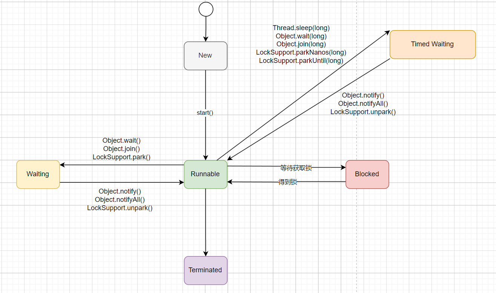

# Java多线程

## Java线程有几种状态，状态之间的流转是怎样的？

Java中线程的状态分为6种：

1. 初始(NEW)：新创建了一个线程对象，但还没有调用start()方法。

2. 运行(RUNNABLE)：Java线程中将就绪（READY）和运行中（RUNNING）两种状态笼统的称为“运行”。
   
   就绪（READY）:线程对象创建后，其他线程(比如main线程）调用了该对象的start()方法。该状态的线程位于可运行线程池中，等待被线程调度选中并分配cpu使用权 。
   
   运行中（RUNNING）：就绪(READY)的线程获得了cpu 时间片，开始执行程序代码。

3. 阻塞(BLOCKED)：表示线程阻塞于锁（关于锁，在后面章节会介绍）。

4. 等待(WAITING)：进入该状态的线程需要等待其他线程做出一些特定动作（通知或中断）。

5. 超时等待(TIMED_WAITING)：该状态不同于WAITING，它可以在指定的时间后自行返回。

6. 终止(TERMINATED)：表示该线程已经执行完毕。

状态流转如图：



### WAITING和TIMED_WAIT的区别？

WAITING是等待状态，在Java中，调用wait方法时，线程会进入到WAITING状态，而TIMED_WAITING是超时等待状态，当线程执行sleep方法时，线程会进入TIMED_WAIT状态。

处于WAITING和TIMED_WAIT的线程，都是会让出CPU的，这时候其他线程就可以获得CPU时间片开始执行。但是他们在对象的锁释放上面并不一样，如果加了锁，sleep方法不会释放对象上的锁，而wait方法是会释放锁的。

因为Java锁的目标是对象，所以wait、notify和notifyAll针对的目标都是对象，所以把他们定义在Object类中。而sleep不需要释放锁，所以他是Thread类中的一个方法。

### 为什么线程没有RUNNING状态

对于现在的分时操作系统来说，在单CPU情况下，所有的线程其实都是串行执行的。但是为了让我们看起来像是在并发执行，人们把CPU的执行分成很多个小的时间片。

哪个线程得到时间片，那个线程就执行，时间片到了之后，就要释放出CPU，再重新进行争抢时间片。

只要把时间片划分的足够细，那么多个程序虽然在不断的串行执行，但是看起来也像是在同时执行一样。


那么，CPU的时间片其实是很短的，一般也就是10-20毫秒左右。

那么，也就是说，在一秒钟之内，同一个线程可能一部分时间处于READY状态、一部分时间处于RUNNING状态。

那么如果，明确的给线程定义出RUNNING状态的话，有一个很大的问题，就是这个状态其实是不准的。

因为当我们看到线程是RUNNING状态的时候，很有可能他已经丢失了CPU时间片了。

对于线程的状态，我们只需要知道，他当前有没有在"正在参与执行"就行了，何为"参与执行"？

就是他的状态是可执行的，只要获得时间片，就能立即执行。

那这不就是RUNNABLE吗？

所以，Java就没有给线程定义RUNNING状态，而是定义了一个RUNNABLE状态。

### jstack监测线程状态

下面使用jstack来观察线程的几种状态：

```java
public class TestThreadState {
  public static void main(String[] args) {
    new Thread(new Waiting(), "Waiting-Thread").start();
    new Thread(new TimedWaiting(), "TimedWaiting-Thread").start();
    new Thread(new Blocked(), "Blocked-Thread-1").start();
    new Thread(new Blocked(), "Blocked-Thread-2").start();
  }

  // 有时间的等待
  static class TimedWaiting implements Runnable {
    @Override
    public void run() {
      try {
        while (true) {
          TimeUnit.SECONDS.sleep(100);
        }

      } catch (InterruptedException e) {
        throw new RuntimeException(e);
      }
    }
  }

  // 等待
  static class Waiting implements Runnable {
    @Override
    public void run() {
      while (true) {
        synchronized (Waiting.class) {
          try {
            Waiting.class.wait();
          } catch (InterruptedException e) {
            e.printStackTrace();
          }
        }
      }
    }
  }

  // 阻塞
  static class Blocked implements Runnable {
    @Override
    public void run() {
      synchronized (Blocked.class) {
        while (true) {
          try {
            TimeUnit.SECONDS.sleep(100);
          } catch (InterruptedException e) {
            e.printStackTrace();
          }
        }
      }
    }
  }
}
```

运行这个例子，打开终端输入jps：

```shell
C:\Users\sunquan>jps
13112 TestThreadState
26712 Jps
```

使用jstack检测线程状态：

```shell
2024-04-06 16:50:13
Full thread dump Java HotSpot(TM) 64-Bit Server VM (25.381-b09 mixed mode):

"DestroyJavaVM" #23 prio=5 os_prio=0 tid=0x0000018de8e76000 nid=0x4aec waiting on condition [0x0000000000000000]
   java.lang.Thread.State: RUNNABLE

"Blocked-Thread-2" #22 prio=5 os_prio=0 tid=0x0000018d8ff74800 nid=0xd5c waiting for monitor entry [0x0000000feb7ff000]
   java.lang.Thread.State: BLOCKED (on object monitor)
        at org.example.MultiThread.TestThreadState$Blocked.run(TestThreadState.java:51)
        - waiting to lock <0x0000000716ce0178> (a java.lang.Class for org.example.MultiThread.TestThreadState$Blocked)
        at java.lang.Thread.run(Unknown Source)

"Blocked-Thread-1" #21 prio=5 os_prio=0 tid=0x0000018d8ff74000 nid=0x5098 waiting on condition [0x0000000feb6ff000]
   java.lang.Thread.State: TIMED_WAITING (sleeping)
        at java.lang.Thread.sleep(Native Method)
        at java.lang.Thread.sleep(Unknown Source)
        at java.util.concurrent.TimeUnit.sleep(Unknown Source)
        at org.example.MultiThread.TestThreadState$Blocked.run(TestThreadState.java:51)
        - locked <0x0000000716ce0178> (a java.lang.Class for org.example.MultiThread.TestThreadState$Blocked)
        at java.lang.Thread.run(Unknown Source)

"TimedWaiting-Thread" #20 prio=5 os_prio=0 tid=0x0000018d8ff70000 nid=0x3b0 waiting on condition [0x0000000feb5ff000]
   java.lang.Thread.State: TIMED_WAITING (sleeping)
        at java.lang.Thread.sleep(Native Method)
        at java.lang.Thread.sleep(Unknown Source)
        at java.util.concurrent.TimeUnit.sleep(Unknown Source)
        at org.example.MultiThread.TestThreadState$TimedWaiting.run(TestThreadState.java:19)
        at java.lang.Thread.run(Unknown Source)

"Waiting-Thread" #19 prio=5 os_prio=0 tid=0x0000018d8ff6d000 nid=0x6b50 in Object.wait() [0x0000000feb4ff000]
   java.lang.Thread.State: WAITING (on object monitor)
        at java.lang.Object.wait(Native Method)
        - waiting on <0x0000000716cdc1e0> (a java.lang.Class for org.example.MultiThread.TestThreadState$Waiting)
        at java.lang.Object.wait(Unknown Source)
        at org.example.MultiThread.TestThreadState$Waiting.run(TestThreadState.java:35)
        - locked <0x0000000716cdc1e0> (a java.lang.Class for org.example.MultiThread.TestThreadState$Waiting)
        at java.lang.Thread.run(Unknown Source)
```

### 什么是守护(Daemon)线程，和普通线程有什么区别？

在Java中有两类线程：User Thread(用户线程)、Daemon Thread(守护线程) 。用户线程一般用于执行用户级任务，而守护线程也就是“后台线程”，一般用来执行后台调度及支持性任务，守护线程最典型的应用就是GC(垃圾回收器)。

这两种线程其实是没有什么区别的，唯一的区别就是Java虚拟机在所有<用户线程>都结束后就会退出，而不会等<守护线程>执行完。也即Daemon线程会被JVM强制退出，不能在编写程序时依靠Daemon中的finally代码块来关闭资源或者清理资源。

## Java线程通信-等待通知机制

一个线程修改了值，另一个线程能感知到变化，然后进行相应的操作，整个过程开始于一个线程，而最终执行又是另一个线程，前者就是生产者，后者就是消费者，这种生产消费模式彻底解耦了“什么时间做”和“怎么做”的逻辑。在java语言中如何实现这个模式呢？

一个简单办法就是开一个消费者线程，消费者线程不停循环监视条件是否达到预期，达到条件则真正执行消费逻辑。伪代码如下：

```java
while(flag !=true){
    Thread.sleep(100);
}

doSomething();
```

这个实现方式在条件不满足时睡眠一段时间，这样做能减少很多次无效的检查逻辑执行，但是却存在以下问题：

1. 难以保证实时性；

2. 难以降低cpu资源消耗；

以上两个问题看起来很难同时解决，如果想要实时性，就需要增加检查逻辑的执行，消耗cpu；如果想要降低cpu资源消耗，则会降低检查逻辑执行的频率，从而降低实时性。Java通过内置的等待通知机制可以很好的解决这个矛盾并实现所需要的功能。

等待通知方法是任意java对象都具备的，它们被定义在Object类之上：

| 方法名称        | 描述  |
| ----------- | --- |
| notify()    |     |
| notifyAll() |     |

我们写一个等待通知的例子，将一个线程视为等待线程，等待共享变量的条件满足才执行逻辑，前提是获得到对象的锁；另一个线程是通知线程，主要是获得到锁之后，通知等待线程，并将共享变量设置为满足条件。

```java
public class TestWaitNotify {
    public static Object lock = new Object();
    public static boolean flag = true;

    public static void main(String[] args) throws InterruptedException {
        Thread thread1 = new Thread(new WaitThread(), "WaitThread");
        thread1.start();
        TimeUnit.SECONDS.sleep(1);
        Thread thread2 = new Thread(new NotifyThread(), "NotifyThread");
        thread2.start();
    }

    static class WaitThread implements Runnable {
        @Override
        public void run() {
            synchronized (lock) {
                while (flag) {
                    try {
                        System.out.println(Thread.currentThread() + " flag is true " + new SimpleDateFormat("HH:mm:ss").format(new Date()));
                        lock.wait();
                    } catch (InterruptedException e) {
                        throw new RuntimeException(e);
                    }
                }
            }
            System.out.println(Thread.currentThread() + " flag is false " + new SimpleDateFormat("HH:mm:ss").format(new Date()));
        }
    }

    static class NotifyThread implements Runnable {
        @Override
        public void run() {
            synchronized (lock) {
                System.out.println(Thread.currentThread() + " hold lock " + new SimpleDateFormat("HH:mm:ss").format(new Date()));
                lock.notifyAll();
                flag = false;
                try {
                    TimeUnit.SECONDS.sleep(3);
                } catch (InterruptedException e) {
                    throw new RuntimeException(e);
                }
            }

            //中间空隙lock对象的锁被释放，可能先由WaitThread被唤醒执行，可能先由NotifyThread继续获取到时间片二次获取到锁去执行
            // 大部分情况下，都是NotifyThread先执行，除非手动sleep NotifyThread
//            try {
//                TimeUnit.MICROSECONDS.sleep(3);
//            } catch (InterruptedException e) {
//                throw new RuntimeException(e);
//            }

            synchronized (lock) {
                System.out.println(Thread.currentThread() + " hold lock again " + new SimpleDateFormat("HH:mm:ss").format(new Date()));
                try {
                    TimeUnit.SECONDS.sleep(3);
                } catch (InterruptedException e) {
                    throw new RuntimeException(e);
                }
            }
        }
    }
}
```

输出内容如下：

```log
Thread[#22,WaitThread,5,main] flag is true 22:22:11
Thread[#23,NotifyThread,5,main] hold lock 22:22:12
Thread[#23,NotifyThread,5,main] hold lock again 22:22:15
Thread[#22,WaitThread,5,main] flag is false 22:22:18
```

上述三四行可能会有顺序差异，这个例子也体现了等待通知机制的细节：

1. wait()方法让当前线程停下，并释放对象的锁，当前线程进入waiting状态，被放置到对象的等待队列中

2. notify()方法调用后，等待线程不会从wait()方法返回，只有对象的锁被释放之后，对象的等待队列中的线程才会被放置到对象的同步队列中，有机会执行逻辑，被移动的线程进入blocked状态

3. 从wait()方法返回的前提是线程获得到了对象的锁

结合这张图看一下代码的执行逻辑：


1. WaitThread首先获得了对象的锁，然后调用对象的wait()方法，从而放弃了锁并进入了对象的等待队列WaitQueue，进入等待状态。

2. 由于WaitThread释放了对象的锁，NotifyThread随后获取了对象的锁，并调用对象的notify()方法，将WaitThread移到同步队列SynchronizedQueue中，此时WaitThread变为阻塞状态。

3. NotifyThread释放了锁之后，WaitThread再次获取到锁并从wait()方法返回继续执行下面逻辑。

### 等待通知机制的经典范式

由上面例子可知，等待通知机制分成两个部分讨论：

等待者

1. 获取对象的锁

2. 如果条件不满足，则调用对象的wait()方法，被通知后继续检查条件是否满足

3. 条件满足的情况下才执行逻辑

通知者

1. 获取对象的锁

2. 改变条件满足等待者

3. 通知所有等待这个对象的线程
