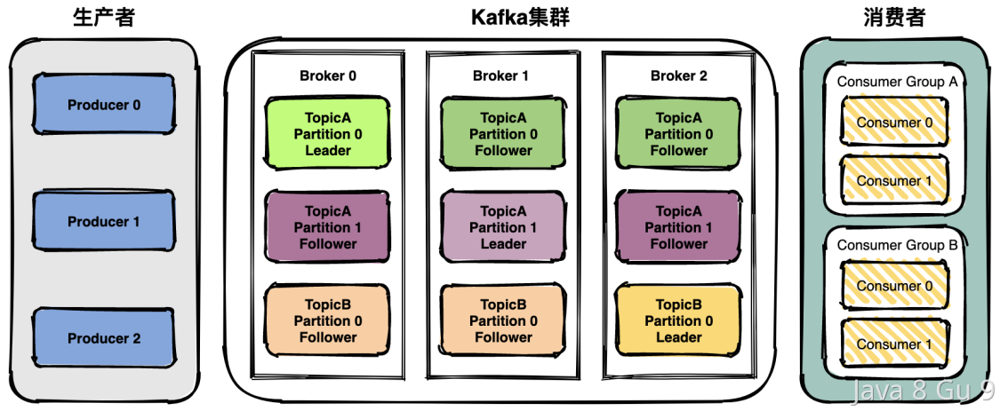
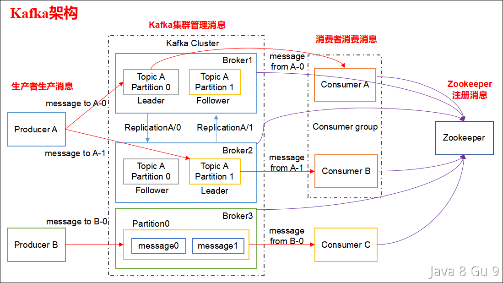
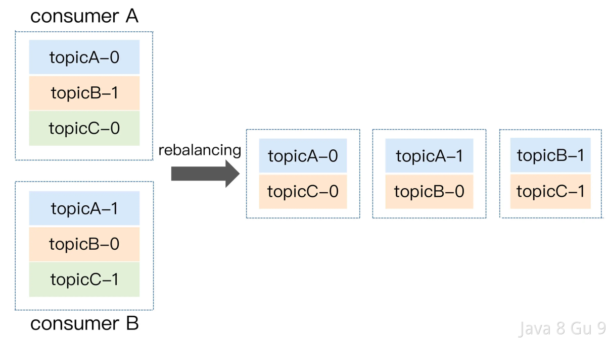
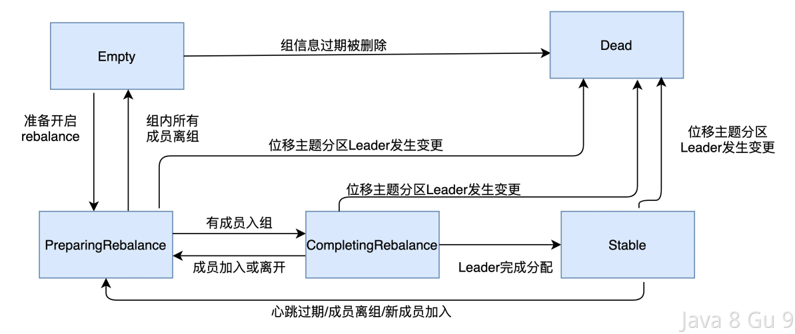
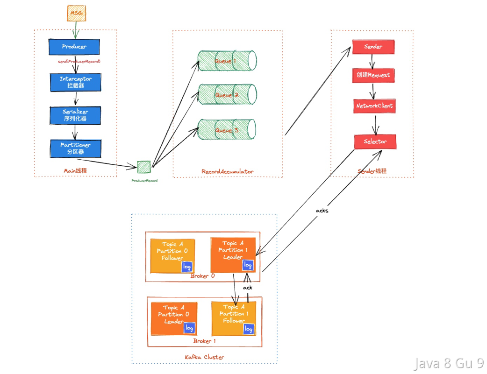
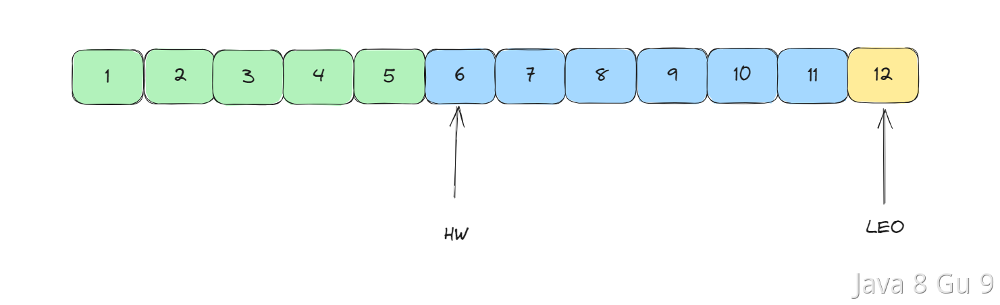

# Kafka

## 为什么要使用消息队列？

使用消息队列的主要目的主要记住这几个关键词：解耦、异步、削峰填谷

解耦：在一个复杂的系统中，不同的模块或服务之间可能需要相互依赖，如果直接使用函数调用或者 API 调用的方式，会造成模块之间的耦合，当其中一个模块发生改变时，需要同时修改调用方和被调用方的代码。而使用消息队列作为中间件，不同的模块可以将消息发送到消息队列中，不需要知道具体的接收方是谁，接收方可以独立地消费消息，实现了模块之间的解耦。  

异步：有些操作比较耗时，例如发送邮件、生成报表等，如果使用同步的方式处理，会阻塞主线程或者进程，导致系统的性能下降。而使用消息队列，可以将这些操作封装成消息，放入消息队列中，异步地处理这些操作，不影响主流程的执行，提高了系统的性能和响应速度。  

削峰填谷：削峰填谷是一种在高并发场景下平衡系统压力的技术，通常用于平衡系统在高峰期和低谷期的资源利用率，提高系统的吞吐量和响应速度。在削峰填谷的过程中，通常使用消息队列作为缓冲区，将请求放入消息队列中，然后在系统负载低的时候进行处理。这种方式可以将系统的峰值压力分散到较长的时间段内，减少瞬时压力对系统的影响，从而提高系统的稳定性和可靠性。

另外消息队列还有以下优点：  

1. 可靠性高：消息队列通常具有高可靠性，可以实现消息的持久化存储、消息的备份和故障恢复等功能，保证消息不会丢失。

2. 扩展性好：通过增加消息队列实例或者添加消费者实例，可以实现消息队列的水平扩展，提高系统的处理能力。

3. 灵活性高：消息队列通常支持多种消息传递模式，如点对点模式和发布/订阅模式，可以根据不同的业务场景选择不同的模式。

## Kafka、ActiveMQ、RabbitMQ和RocketMQ都有哪些区别？

Kafka、ActiveMQ、RabbitMQ和RocketMQ都是常见的消息中间件，它们都提供了高性能、高可用、可扩展的消息传递机制，但它们之间也有以下一些区别：

1. 消息传递模型：Kafka主要支持发布-订阅模型，ActiveMQ、RabbitMQ和RocketMQ则同时支持点对点和发布-订阅两种模型。 

2. 性能和吞吐量：Kafka在数据处理和数据分发方面表现出色，可以处理每秒数百万条消息，而ActiveMQ、RabbitMQ和RocketMQ的吞吐量相对较低。

3. 消息持久化：Kafka的消息是以追加的方式写入磁盘的，能够更快地持久化消息，并且可以支持高效的消息查询。ActiveMQ、RabbitMQ和RocketMQ在消息持久化方面则采用更传统的方式，将消息写入磁盘中的数据库中。

4. 消息分区和负载均衡：Kafka将消息划分为多个分区，并分布在多个服务器上，实现负载均衡和高可用性。ActiveMQ、RabbitMQ和RocketMQ也支持消息分区和负载均衡，但实现方式不同，例如RabbitMQ使用了一种叫做Sharding的机制。

5. 开发和部署复杂度：Kafka相对比较简单，易于使用和部署，但在实现一些高级功能时需要进行一些复杂的配置。ActiveMQ、RabbitMQ和RocketMQ则提供了更多的功能和选项，也更加灵活，但相应地会增加开发和部署的复杂度。

6. 社区和生态：Kafka、ActiveMQ、RabbitMQ和RocketMQ都拥有庞大的社区和完善的生态系统，但Kafka和RocketMQ目前的发展势头比较迅猛，社区活跃度也相对较高。

7. 功能支持：
   
   |          | 优先级队列 | 延迟队列                          | 死信队列 | 重试队列                          | 消费模式              | 事务消息          |
   | -------- | ----- | ----------------------------- | ---- | ----------------------------- | ----------------- | ------------- |
   | Kafka    | 不支持   | 不支持，可以间接实现延迟队列                | 无    | 不直接支持，可以通过消费者逻辑来实现重试机制。       | 主要是拉模式。           | 支持事务，但限于消息生产。 |
   | RocketMQ | 支持    | 直接支持延迟队列，可以设定消息的延迟时间。         | 支持   | 支持重试队列，可以自动或手动将消息重新发送。        | 支持推和拉两种模式。        | 支持事务消息。       |
   | RabbitMQ | 支持    | 支持延迟队列，可以通过插件或者消息TTL和死信交换来实现。 | 支持   | 可以实现重试机制，但需要通过消息属性和额外配置来手动设置。 | 主要是推模式，但也可以实现拉模式。 | 支持基本的消息事务。    |
   | ActiveMQ | 支持    | 支持                            | 支持   | 支持重试机制，可以配置消息重发策略。            | 支持推和拉两种模式。        | 支持事务消息。       |
   |          |       |                               |      |                               |                   |               |

总的来说，这些消息中间件都有自己的优缺点，选择哪一种取决于具体的业务需求和系统架构。

### 如何选型

在选择消息队列技术时，需要根据实际业务需求和系统特点来选择，以下是一些参考因素：  

1. 性能和吞吐量：如果需要处理海量数据，需要高性能和高吞吐量，那么Kafka是一个不错的选择。  

2. 可靠性：如果需要保证消息传递的可靠性，包括数据不丢失和消息不重复投递，那么RocketMQ和RabbitMQ都提供了较好的可靠性保证。

3. 消息传递模型：如果需要支持发布-订阅和点对点模型，那么RocketMQ和RabbitMQ是一个不错的选择。如果只需要发布-订阅模型，Kafka则是一个更好的选择。

4. 消息持久化：如果需要更快地持久化消息，并且支持高效的消息查询，那么Kafka是一个不错的选择。如果需要更加传统的消息持久化方式，那么RocketMQ和RabbitMQ可以满足需求。

5. 开发和部署复杂度：Kafka比较简单，易于使用和部署，但在实现一些高级功能时需要进行一些复杂的配置。RocketMQ和RabbitMQ提供了更多的功能和选项，也更加灵活，但相应地会增加开发和部署的复杂度。

6. 社区和生态：Kafka、RocketMQ和RabbitMQ都拥有庞大的社区和完善的生态系统，但Kafka和RocketMQ目前的发展势头比较迅猛，社区活跃度也相对较高。

7. 实现语言方面，kafka和rocketmq、activemq等都是基于java语言的，rabbitmq是基于erlang的。

8. 功能性，上面列举过一些功能，我们在选型的时候需要看哪个可以满足我们的需求。  

需要根据具体情况来选择最适合的消息队列技术。如果有多个因素需要考虑，可以进行性能测试和功能评估来辅助选择。

## Kafka 为什么这么快？

kafka是一个成熟的消息队列，一直以性能高著称，它之所以能够实现高吞吐量和低延迟，主要是由于以下几个方面的优化：  

1. 批量发送：Kafka 通过将多个消息打包成一个批次，减少了网络传输和磁盘写入的次数，从而提高了消息的吞吐量和传输效率。

2. 零拷贝技术：Kafka 使用零拷贝技术来避免了数据的拷贝操作，降低了内存和 CPU 的使用率，提高了系统的性能。

3. 磁盘顺序写入：Kafka 将消息写入磁盘时采用了顺序写入的方式，避免了随机读写带来的性能损耗，提高了磁盘的使用效率。

4. 页缓存：Kafka 将其数据存储在磁盘中，但在访问数据时，它会先将数据加载到操作系统的页缓存中，并在页缓存中保留一份副本，从而实现快速的数据访问。

5. 分区和副本：Kafka 采用分区和副本的机制，可以将数据分散到多个节点上进行处理，从而实现了分布式的高可用性和负载均衡。

6. 高效的索引和存储结构：Kafka 采用了高效的消息索引和存储结构，可以快速定位和检索消息，降低了消息读取和写入的延迟。

## Kafka的架构是怎么样的？

Kafka 的整体架构比较简单，是显式分布式架构，主要由 Producer（生产者）、broker（Kafka集群）和 consumer（消费者） 组成。



生产者（Producer）：生产者负责将消息发布到Kafka集群中的一个或多个主题(Topic)，每个Topic包含一个或多个分区（Partition）。

> 主题：Topic。主题是承载消息的逻辑容器，在实际使用中多用来区分具体的业务。分区：Partition。一个有序不变的消息序列。每个主题下可以有多个分区。

消费者（Consumer）：消费者负责从Kafka集群中的一个或多个主题消费消息，并将消费的偏移量（Offset）提交回Kafka以保证消息的顺序性和一致性。  

> 偏移量：Offset。表示分区中每条消息的位置信息，是一个单调递增且不变的值。

Kafka集群：Kafka集群是由多个Kafka节点（Broker）组成的分布式系统。每个节点都可以存储一个或多个主题的分区副本，以提供高可用性和容错能力。

> Leader Broker：Leader Broker 是分区的主副本，它是负责处理消息读写请求的节点。生产者将消息发送到 Leader Broker，消费者从 Leader Broker 中拉取消息。Follower Broker：Follower Broker 是 Leader Broker 的备份节点，它负责与 Leader Broker 进行数据同步，以保持自己的数据与 Leader Broker 保持一致。  
> 
> 在集群中，每个分区都有一个 Leader Broker 和多个 Follower Broker，只有 Leader Broker 才能处理生产者和消费者的请求，而 Follower Broker 只是 Leader Broker 的备份，用于提供数据的冗余备份和容错能力。如果 Leader Broker 发生故障，Kafka 集群会自动将 Follower Broker 提升为新的 Leader Broker，从而实现高可用性和容错能力。



ZooKeeper：ZooKeeper是Kafka集群中使用的分布式协调服务，用于维护Kafka集群的状态和元数据信息，例如主题和分区的分配信息、消费者组和消费者偏移量等。

## Kafka 为什么有 Topic 还要用 Partition?

Topic和Partition是kafka中比较重要的概念。

> 主题：Topic是Kafka中承载消息的逻辑容器。可以理解为一个消息队列。生产者将消息发送到特定的Topic，消费者从Topic中读取消息。Topic可以被认为是逻辑上的消息流。在实际使用中多用来区分具体的业务。
> 分区：Partition。是Topic的物理分区。一个Topic可以被分成多个Partition，每个Partition是一个有序且持久化存储的日志文件。每个Partition都存储了一部分消息，并且有一个唯一的标识符（称为Partition ID）。

看上去，这两个都是存储消息的载体，那为啥要分两层呢，有了Topic还需要Partition干什么呢？

在软件领域中，任何问题都可以加一个中间层来解决，而这，就是类似的思想，在Topic的基础上，再细粒度的划分出了一层，主要能带来以下几个好处：

1. 提升吞吐量：通过将一个Topic分成多个Partition，可以实现消息的并行处理。每个Partition可以由不同的消费者组进行独立消费，这样就可以提高整个系统的吞吐量。

2. 负载均衡：Partition的数量通常比消费者组的数量多，这样可以使每个消费者组中的消费者均匀地消费消息。当有新的消费者加入或离开消费者组时，可以通过重新分配Partition的方式进行负载均衡。

3. 扩展性：通过增加Partition的数量，可以实现Kafka集群的扩展性。更多的Partition可以提供更高的并发处理能力和更大的存储容量。

综上，Topic是逻辑上的消息分类，而Partition是物理上的消息分区。通过将Topic分成多个Partition，可以实现提升吞吐量、负载均衡、以及增加可扩展性。

## Kafka如何保证消息不丢失？

Kafka作为一个消息中间件，他需要结合消息生产者和消费者一起才能工作，一次消息发送包含以下是三个过程：

1）Producer 端发送消息给 Kafka Broker 。
2）Kafka Broker 将消息进行同步并持久化数据。
3）Consumer 端从Kafka Broker 将消息拉取并进行消费。  

Kafka只对已提交的消息做最大限度的持久化保证不丢失，但是没办法保证100%。

但是，Kafka还是提供了很多机制来保证消息不丢失的。要想知道Kafka如何保证消息不丢失，需要从生产者、消费者以及kafka集群三个方面来分析。

### Producer

消息的生产者端，最怕的就是消息发送给Kafka集群的过程中失败，所以，我们需要有机制来确保消息能够发送成功，但是，因为存在网络问题，所以基本没有什么办法可以保证一次消息一定能成功。

所以，就需要有一个确认机制来告诉生产者这个消息是否有发送成功，如果没成功，需要重新发送直到成功。

我们通常使用Kafka发送消息的时候，通常使用的producer.send(msg)其实是一种异步发送，发送消息的时候，方法会立即返回，但是并不代表消息一定能发送成功。（producer.send(msg).get() 是同步等待返回的。）

那么，为了保证消息不丢失，通常会建议使用producer.send(msg, callback)方法，这个方法支持传入一个callback，我们可以在消息发送失败时进行重试。

同时，我们也可以通过给producer设置一些参数来提升发送成功率：

```java
acks=-1 // 表示 Leader 和 Follower 都接收成功时确认；可以最大限度保证消息不丢失，但是吞吐量低。
retries=3 // 生产端的重试次数
retry.backoff.ms = 300  //消息发送超时或失败后，间隔的重试时间
```

> acks = 0: 表示Producer请求立即返回，不需要等待Leader的任何确认。这种方案有最高的吞吐率，但是不保证消息是否真的发送成功。
> acks = -1: 表示分区Leader必须等待消息被成功写入到所有的ISR副本(同步副本)中才认为Producer请求成功。这种方案提供最高的消息持久性保证，但是理论上吞吐率也是最差的。
> acks = 1: 表示Leader副本必须应答此Producer请求并写入消息到本地日志，之后Producer请求被认为成功。如果此时Leader副本应答请求之后挂掉了，消息会丢失。这个方案，提供了不错的持久性保证和吞吐。

### Broker

Kafka的集群有一些机制来保证消息的不丢失，比如复制机制、持久化存储机制以及ISR机制。  

- 持久化存储：Kafka使用持久化存储来存储消息。这意味着消息在写入Kafka时将被写入磁盘，这种方式可以防止消息因为节点宕机而丢失。 

- ISR复制机制：Kafka使用ISR机制来确保消息不会丢失，Kafka使用复制机制来保证数据的可靠性。每个分区都有多个副本，副本可以分布在不同的节点上。当一个节点宕机时，其他节点上的副本仍然可以提供服务，保证消息不丢失。  

在服务端，也有一些参数配置可以调节来避免消息丢失：

```java
replication.factor //表示分区副本的个数，replication.factor >1 当leader 副本挂了，follower副本会被选举为leader继续提供服务。
min.insync.replicas //表示 ISR 最少的副本数量，通常设置 min.insync.replicas >1，这样才有可用的follower副本执行替换，保证消息不丢失
unclean.leader.election.enable = false //是否可以把非 ISR 集合中的副本选举为 leader 副本。
```

### Consumer

作为Kafka的消费者端，只需要确保投递过来的消息能正常消费，并且不会胡乱的提交偏移量就行了。  

Kafka消费者会跟踪每个分区的偏移量，消费者每次消费消息时，都会将偏移量向后移动。当消费者宕机或者不可用时，Kafka会将该消费者所消费的分区的偏移量保存下来，下次该消费者重新启动时，可以从上一次的偏移量开始消费消息。  

另外，Kafka消费者还可以组成消费者组，每个消费者组可以同时消费多个分区。当一个消费者组中的消费者宕机或者不可用时，其他消费者仍然可以消费该组的分区，保证消息不丢失。

为了保证消息不丢失，建议使用手动提交偏移量的方式，避免拉取了消息以后，业务逻辑没处理完，提交偏移量后但是消费者挂了的问题：

```java
enable.auto.commit=false
```

## 为什么Kafka没办法100%保证消息不丢失？

Kafka提供的Producer和Consumer之间的消息传递保证语义有三种，所谓消息传递语义，其实就是Kafka的消息交付可靠保障，主要有以下三种：

- At most once—消息可能会丢，但绝不会重复传递；

- At least once—消息绝不会丢，但可能会重复传递；

- Exactly once—每条消息只会被精确地传递一次：既不会多，也不会少；

目前，Kafka 默认提供的交付可靠性保障是第二种，即At least once ，但是，其实依靠Kafka自身，是没有办法100%保证可靠性的。

上面的文档中，介绍了Kafka在保证消息的可靠性中做的一些努力，但是我们提到，Kafka只对已提交的消息做最大限度的持久化保证不丢失，但是没办法保证100%。

那么，整体分析下为什么吧。

### 生产者

Kafka允许生产者以异步方式发送消息，这意味着生产者在发送消息后不会等待确认。当然，我们可以注册一个回调等待消息的成功回调。  

但是，如果生产者在发送消息之后，Kafka的集群发生故障或崩溃，而消息尚未被完全写入Kafka的日志中，那么这些消息可能会丢失。虽然后续有可能会重试，但是，如果重试也失败了呢？如果这个过程中刚好生产者也崩溃了呢？那就可能会导致没有人知道这个消息失败了，就导致不会重试了。

### 消费者

消费者来说比较简单，只要保证在消息成功时，才提交偏移量就行了，这样就不会导致消息丢失了。

### Broker

Kafka使用日志来做消息的持久化的，日志文件是存储在磁盘之上的，但是如果Broker在消息尚未完全写入日志之前崩溃，那么这些消息可能会丢失了。  

而且，操作系统在写磁盘之前，会先把数据写入Page Cache中，然后再由操作系统中自己决定什么时候同步到磁盘当中，而在这个过程中，如果还没来得及同步到磁盘中，就直接宕机了，那这个消息也就丢了。  

当然，也可以通过配置log.flush.interval.messages=1，来实现类似于同步刷盘的功能，但是又回到了前面说的情况，还没来得及做持久化，就宕机了。  

即使Kafka中引入了副本机制来提升消息的可靠性，但是如果发生同步延迟，还没来及的同步，主副本就挂掉了，那么消息就可能会发生丢失。

这几种情况，只从Broker的角度分析，Broker自身是没办法保证消息不丢失的，但是如果配合Producer，再配合request.required.acks = -1 这种ACK策略，可以确保消息持久化成功之后，才会ACK给Producer，那么， 如果我们的Producer在一定时间段内，没有收到ACK，是可以重新发送的。

但是，这种重新发送，就又回到了我们前面介绍生产者的时候的问题，生产者也有可能挂，重新发送也有可能会没有发送依据，导致消息最终丢失。

所以，我们说，只靠Kafka自己，其实是没有办法保证极端情况下的消息100%不丢失的。  

但是，我们也可以在做一些机制来保证，比如引入分布式事务，或者引入本地消息表等，保证在Kafka Broker没有保存消息成功时，可以重新投递消息。这样才行。

## Kafka怎么保证消费只消费一次的?

Kafka消息只消费一次，这个需要从多方面回答，既包含Kafka自身的机制，也需要考虑客户端自己的重复处理。

可以从以下几个方面回答：

首先，在Kafka中，每个消费者都必须加入至少一个消费者组。同一个消费者组内的消费者可以共享消费者的负载。因此，如果一个消息被消费组中的任何一个消费者消费了，那么其他消费者就不会再收到这个消息了。

另外，消费者可以通过手动提交消费位移来控制消息的消费情况。通过手动提交位移，消费者可以跟踪自己已经消费的消息，确保不会重复消费同一消息。

还有就是客户端自己可以做一些幂等机制，防止消息的重复消费。

另外可以借助Kafka的Exactly-once消费语义，其实就是引入了事务，消费者使用事务来保证消息的消费和位移提交是原子的，而生产者可以使用事务来保证消息的生产和位移提交是原子的。Exactly-once消费语义则解决了重复问题，但需要更复杂的设置和配置。

### Kafka的三种消息消费语义

在Kafka中，有三种常见的消息消费语义：At-least-once、At-most-once和Exactly-once。其中At-least-once和Exactly-once是最常用的。

### At-least-once消费语义

At-least-once消费语义意味着消费者至少消费一次消息，但可能会重复消费同一消息。在At-least-once语义中，当消费者从Kafka服务器读取消息时，消息的偏移量会被记录下来。一旦消息被成功处理，消费者会将位移提交回Kafka服务器。如果消息处理失败，消费者不会提交位移。这意味着该消息将在下一次重试时再次被消费。

在生产者端，如果生产者发送消息给kafka后，kafka在未回复ACK前宕机了，生产者会重试，重试时如果kafka主节点上线了，此时将会得到两条相同的消息。此即为重复生产消息。

At-least-once语义通常用于实时数据处理或消费者不能容忍数据丢失的场景，例如金融交易或电信信令。

### Exactly-once消费语义

Exactly-once消费语义意味着每个消息仅被消费一次，且不会被重复消费。在Exactly-once语义中，Kafka保证消息只被处理一次，同时保持消息的顺序性。为了实现Exactly-once语义，Kafka引入了一个新的概念：事务。

事务是一系列的读写操作，这些操作要么全部成功，要么全部失败。在Kafka中，生产者和消费者都可以使用事务，以保证消息的Exactly-once语义。具体来说，消费者可以使用事务来保证消息的消费和位移提交是原子的，而生产者可以使用事务来保证消息的生产和位移提交是原子的。

在Kafka 0.11版本之前，实现Exactly-once语义需要一些特殊的配置和设置。但是，在Kafka 0.11版本之后，Kafka提供了原生的Exactly-once支持，使得实现Exactly-once变得更加简单和可靠。

总之，At-least-once消费语义保证了数据的可靠性，但可能会导致数据重复消费。而Exactly-once消费语义则解决了重复问题，但需要更复杂的设置和配置。选择哪种消费语义取决于业务需求和数据可靠性要求。

### At-most-once消费语义

如果生产者在发送消息时，kafka主节点ACK超时或返回错误，此时生产者不重试，则可能导致消息最终不会写入kafka，因此不会传递给消费者。

## 什么是Kafka的重平衡机制？

Kafka 的重平衡机制是指在消费者组中新增或删除消费者时，Kafka 集群会重新分配主题分区给各个消费者，以保证每个消费者消费的分区数量尽可能均衡。

重平衡机制的目的是实现消费者的负载均衡和高可用性，以确保每个消费者都能够按照预期的方式消费到消息。



重平衡的 3 个触发条件：

- 消费者组成员数量发生变化。

- 订阅主题数量发生变化。

- 订阅主题的分区数发生变化。

当Kafka 集群要触发重平衡机制时，大致的步骤如下：

1. 暂停消费：在重平衡开始之前，Kafka 会暂停所有消费者的拉取操作，以确保不会出现重平衡期间的消息丢失或重复消费。

2. 计算分区分配方案：Kafka 集群会根据当前消费者组的消费者数量和主题分区数量，计算出每个消费者应该分配的分区列表，以实现分区的负载均衡。

3. 通知消费者：一旦分区分配方案确定，Kafka 集群会将分配方案发送给每个消费者，告诉它们需要消费的分区列表，并请求它们重新加入消费者组。

4. 重新分配分区：在消费者重新加入消费者组后，Kafka 集群会将分区分配方案应用到实际的分区分配中，重新分配主题分区给各个消费者。

5. 恢复消费：最后，Kafka 会恢复所有消费者的拉取操作，允许它们消费分配给自己的分区。

Kafka 的重平衡机制能够有效地实现消费者的负载均衡和高可用性，提高消息的处理能力和可靠性。但是，由于重平衡会带来一定的性能开销和不确定性，因此在设计应用时需要考虑到重平衡的影响，并采取一些措施来降低重平衡的频率和影响。

在重平衡过程中，所有 Consumer 实例都会停止消费，等待重平衡完成。但是目前并没有什么好的办法来解决重平衡带来的STW，只能尽量避免它的发生。

### 消费者的五种状态

Kafka的Consumer实例五种状态，分别是：

| 状态                  | 描述                                                 |
| ------------------- | -------------------------------------------------- |
| Empty               | 组内没有任何成员，但是消费者可能存在已提交的位移数据，而且这些位移尚未过期              |
| Dead                | 同样是组内没有任何成员，但是组的元数据信息已经被协调者端移除，协调者保存着当前向他注册过的所有组信息 |
| PreparingRebalance  | 消费者组准备开启重平衡，此时所有成员都需要重新加入消费者组                      |
| CompletingRebalance | 消费者组下所有成员已经加入，各个成员中等待分配方案                          |
| Stable              | 消费者组的稳定状态，该状态表明重平衡已经完成，组内成员能够正常消费数据                |

状态的流转过程：



## Kafka如何实现顺序消费？

Kafka的消息是存储在指定的topic中的某个partition中的。并且一个topic是可以有多个partition的。同一个partition中的消息是有序的，但是跨partition，或者跨topic的消息就是无序的了。

**为什么同一个partition的消息是有序的？**

因为当生产者向某个partition发送消息时，消息会被追加到该partition的日志文件（log）中，并且被分配一个唯一的 offset，文件的读写是有顺序的。而消费者在从该分区消费消息时，会从该分区的最早 offset 开始逐个读取消息，保证了消息的顺序性。

基于此，想要实现消息的顺序消费，可以有以下几个办法：

1. 在一个topic中，只创建一个partition，这样这个topic下的消息都会按照顺序保存在同一个partition中，这就保证了消息的顺序消费。

2. 发送消息的时候指定partition，如果一个topic下有多个partition，那么我们可以把需要保证顺序的消息都发送到同一个partition中，这样也能做到顺序消费。

### 如何发到同一个partition

当我们发送消息的时候，如果key为null，那么Kafka 默认采用 Round-robin 策略，也就是轮转，实现类是 DefaultPartitioner。那么如果想要指定他发送到某个partition的话，有以下三个方式：

#### 指定partition

我们可以在发送消息的时候，可以直接在ProducerRecord中指定partition

```java
import java.util.Properties;

public class KafkaProducerExample {
    public static void main(String[] args) {
        // 创建Kafka生产者
        Producer<String, String> producer = new KafkaProducer<>(getProperties());
        String topic = "hollis_topic"; // 指定要发送消息的主题
        String message = "Hello World!"; // 要发送的消息内容
        int partition = 0; // 要发送消息的分区
        // 创建包含分区信息的ProducerRecord
        ProducerRecord<String, String> record = new ProducerRecord<>(topic, partition, null, message);
        // 发送消息
        producer.send(record);
        // 关闭Kafka生产者
        producer.close();
    }
}
```

#### 指定key

在没有指定 Partition(null 值) 时, 如果有 Key, Kafka 将依据 Key 做hash来计算出一个 Partition 编号来。如果key相同，那么也能分到同一个partition中：

```java
import org.apache.kafka.clients.producer.Producer;
import org.apache.kafka.clients.producer.ProducerRecord;
import java.util.Properties;

public class KafkaProducerExample {
    public static void main(String[] args) {
        // 创建Kafka生产者
        Producer<String, String> producer = new KafkaProducer<>(getProperties());
        String topic = "hollis_topic"; // 指定要发送消息的主题
        String message = "Hello World!"; // 要发送的消息内容
        String key = "Hollis_key"; // 要发送消息的key
       // 创建ProducerRecord，指定主题、键和消息内容
        ProducerRecord<String, String> record = new ProducerRecord<>(topic, null, key, message);
        // 发送消息
        producer.send(record);
        // 关闭Kafka生产者
        producer.close();
    }
}
```

#### 自定义Partitioner

除了以上两种方式，我们还可以实现自己的分区器（Partitioner）来指定消息发送到特定的分区。  

我们需要创建一个类实现Partitioner接口，并且重写partition()方法。

```java
import org.apache.kafka.clients.producer.Partitioner;
import org.apache.kafka.common.Cluster;
import org.apache.kafka.common.PartitionInfo;
import org.apache.kafka.common.record.InvalidRecordException;
import org.apache.kafka.common.utils.Utils;

import java.util.List;
import java.util.Map;

public class CustomPartitioner implements Partitioner {

    @Override
    public void configure(Map<String, ?> configs) {
        // 可以在这里处理和获取分区器的配置参数
    }

    @Override
    public int partition(String topic, Object key, byte[] keyBytes, Object value, byte[] valueBytes, Cluster cluster) {
        List<PartitionInfo> partitions = cluster.partitionsForTopic(topic);
        int numPartitions = partitions.size();
        if (keyBytes == null || !(key instanceof String)) {
            throw new InvalidRecordException("键不能为空且必须是字符串类型");
        }
        // 根据自定义的逻辑，确定消息应该发送到哪个分区
        String keyValue = (String) key;
        int partition = Math.abs(keyValue.hashCode()) % numPartitions;
        // 返回分区编号
        return partition;
    }

    @Override
    public void close() {
        // 可以在这里进行一些清理操作
    }
}
```

在partition()方法中，我们使用了一个简单的逻辑，根据键的哈希值将消息发送到相应的分区。为了在Kafka生产者中使用自定义的分区器，你需要在生产者的配置中指定分区器类：

```java
import org.apache.kafka.clients.producer.Producer;
import org.apache.kafka.clients.producer.ProducerRecord;

import java.util.Properties;

public class KafkaProducerExample {
    public static void main(String[] args) {
        // 设置Kafka生产者的配置属性
        Properties props = new Properties();
        props.put("bootstrap.servers", "localhost:9092");
        props.put("key.serializer", "org.apache.kafka.common.serialization.StringSerializer");
        props.put("value.serializer", "org.apache.kafka.common.serialization.StringSerializer");
        props.put("partitioner.class", "com.sunquan.CustomPartitioner"); // 指定自定义分区器类
        // 创建Kafka生产者
        Producer<String, String> producer = new org.apache.kafka.clients.producer.KafkaProducer<>(props);
        String topic = "hollis_topic"; // 指定要发送消息的主题
        String message = "Hello World!"; // 要发送的消息内容
        String key = "Hollis_key"; // 要发送消息的key
        // 创建ProducerRecord，指定主题、键和消息内容
        ProducerRecord<String, String> record = new ProducerRecord<>(topic, key, message);
        // 发送消息
        producer.send(record);
        // 关闭Kafka生产者
        producer.close();
    }
}
```

## Kafka 几种选举过程简单介绍一下？

Kafka 中常见的选举过程有以下几种：

**Partition Leader 选举**

Kafka 中的每个 Partition 都有一个 Leader，负责处理该 Partition 的读写请求。在正常情况下，Leader 和 ISR 集合中的所有副本保持同步，Leader 接收到的消息也会被 ISR 集合中的副本所接收。当 leader 副本宕机或者无法正常工作时，需要选举新的 leader 副本来接管分区的工作。  

Leader 选举的过程如下：

- 每个参与选举的副本会尝试向 ZooKeeper 上写入一个临时节点，表示它们正在参与 Leader 选举；

- 所有写入成功的副本会在 ZooKeeper 上创建一个序列号节点，并将自己的节点序列号写入该节点；

- 节点序列号最小的副本会被选为新的 Leader，并将自己的节点名称写入 ZooKeeper 上的 /broker/.../leader 节点中。

**Controller 选举**  

Kafka 集群中只能有一个 Controller 节点，用于管理分区的副本分配、leader 选举等任务。当一个Broker变成Controller后，会在Zookeeper的/controller节点中记录下来。然后其他的Broker会实时监听这个节点，主要就是避免当这个controller宕机的话，就需要进行重新选举。

Controller选举的过程如下：

- 所有可用的 Broker 向 ZooKeeper 注册自己的 ID，并监听 ZooKeeper 中 /controller 节点的变化。

- 当 Controller 节点出现故障时，ZooKeeper 会删除 /controller 节点，这时所有的 Broker 都会监听到该事件，并开始争夺 Controller 的位置。

- 为了避免出现多个 Broker 同时竞选 Controller 的情况，Kafka 设计了一种基于 ZooKeeper 的 Master-Slave 机制，其中一个 Broker 成为 Master，其它 Broker 成为 Slave。Master 负责选举 Controller，并将选举结果写入 ZooKeeper 中，而 Slave 则监听 /controller 节点的变化，一旦发现 Master 发生故障，则开始争夺 Master 的位置。

- 当一个 Broker 发现 Controller 失效时，它会向 ZooKeeper 写入自己的 ID，并尝试竞选 Controller 的位置。如果他创建临时节点成功，则该 Broker 成为新的 Controller，并将选举结果写入 ZooKeeper 中。

- 其它的 Broker 会监听到 ZooKeeper 中 /controller 节点的变化，一旦发现选举结果发生变化，则更新自己的元数据信息，然后与新的 Controller 建立连接，进行后续的操作。

### kafka选举中，为什么节点序列号最小的副本会被选为新的 Leader

在Kafka中，节点序列号最小的副本被选为新的Leader是因为Kafka使用了ZooKeeper作为其协调服务。在Kafka集群中，ZooKeeper负责维护集群的元数据（例如主题和分区信息）以及Brokers（Kafka服务器）的状态。

当一个Broker（副本）成为Leader候选人时，它会向ZooKeeper注册自己并申请成为该分区的Leader。在这个过程中，每个候选人都会创建一个临时的带有递增序列号的ZooKeeper节点，称为"选举竞争者（election contender）"。

当候选人注册完成后，它们会查询ZooKeeper并比较自己的序列号与其他候选人的序列号。Kafka采用基于递增序列号的最小值来选择新的Leader。因此，具有最小序列号的候选人将成为新的Leader，并负责处理该分区的所有读写请求。

通过这种方式，Kafka实现了简单而有效的Leader选举机制，确保了高可用性和数据一致性。选择序列号最小的副本作为Leader可以避免分区的不一致情况，并且能够快速地恢复正常操作，因为ZooKeeper节点序列号是唯一且递增的。

## Kafka 消息的发送过程简单介绍一下？

当我们使用Kafka发送消息时，一般有两种方式，分别是同步发送（producer.send(msg).get() ）及异步发送（producer.send(msg, callback)）。

同步发送的时候，可以在发送消息后，通过get方法等待消息结果：producer.send(record).get(); ，这种情况能够准确的拿到消息最终的发送结果，要么是成功，要么是失败。

而异步发送，是采用了callback的方式进行回调的，可以大大的提升消息的吞吐量，也可以根据回调来判断消息是否发送成功。

不管是同步发送还是异步发送，最终都需要在Producer端把消息发送到Broker中，那么这个过程大致如下：



Kafka 的 Producer 在发送消息时通常涉及两个线程，主线程（Main）和发送线程（Sender）和一个消息累加器（RecordAccumulator）

Main线程是 Producer 的入口，负责初始化 Producer 的配置、创建 KafkaProducer 实例并执行发送逻辑。它会按照用户定义的发送方式（同步或异步）发送消息，然后等待消息发送完成。

一条消息的发送，在调用send方法后，会经过拦截器、序列化器及分区器。

- 拦截器主要用于在消息发送之前和之后对消息进行定制化的处理，如对消息进行修改、记录日志、统计信息等。

- 序列化器负责将消息的键和值对象转换为字节数组，以便在网络上传输。

- 分区器决定了一条消息被发送到哪个 Partition 中。它根据消息的键（如果有）或者特定的分区策略，选择出一个目标 Partition。

RecordAccumulator在 Kafka Producer 中起到了消息积累和批量发送的作用，当 Producer 发送消息时，不会立即将每条消息发送到 Broker，而是将消息添加到 RecordAccumulator 维护的内部缓冲区中，RecordAccumulator 会根据配置的条件（如batch.size、linger.ms）对待发送的消息进行批量处理。

当满足指定条件时，RecordAccumulator 将缓冲区中的消息组织成一个批次（batch），然后一次性发送给 Broker。如果发送失败或发生错误，RecordAccumulator 可以将消息重新分配到新的批次中进行重试。这样可以确保消息不会丢失，同时提高消息的可靠性。

Send线程是负责实际的消息发送和处理的。发送线程会定期从待发送队列中取出消息，并将其发送到对应的 Partition 的 Leader Broker 上。它主要负责网络通信操作，并处理发送请求的结果，包括确认的接收、错误处理等。

NetworkClient 和 Selector 是两个重要的组件，分别负责网络通信和 I/O 多路复用。

发送线程会把消息发送到Kafka集群中对应的Partition的Partition Leader，Partition Leader 接收到消息后，会对消息进行一系列的处理。它会将消息写入本地的日志文件（Log）。

为了保证数据的可靠性和高可用性，Kafka 使用了消息复制机制。Leader Broker 接收到消息后，会将消息复制到其他副本（Partition Follower）。副本是通过网络复制数据的，它们会定期从 Leader Broker 同步消息。

每一个Partition Follower在写入本地log之后，会向Leader发送一个ACK。

但是我们的Producer其实也是需要依赖ACK才能知道消息有没有投递成功的，而这个ACK是何时发送的，Producer又要不要关心呢？这就涉及到了kafka的ack机制，生产者会根据设置的 request.required.acks 参数不同，选择等待或或直接发送下一条消息：

- request.required.acks = 0
  表示 Producer 不等待来自 Leader 的 ACK 确认，直接发送下一条消息。在这种情况下，如果 Leader 分片所在服务器发生宕机，那么这些已经发送的数据会丢失。 

- request.required.acks = 1
  
  表示 Producer 等待来自 Leader 的 ACK 确认，当收到确认后才发送下一条消息。在这种情况下，消息一定会被写入到 Leader 服务器，但并不保证 Follow 节点已经同步完成。所以如果在消息已经被写入 Leader 分片，但是还未同步到 Follower 节点，此时Leader 分片所在服务器宕机了，那么这条消息也就丢失了，无法被消费到。

- request.required.acks = -1
  
  Leader会把消息复制到集群中的所有ISR（In-Sync Replicas，同步副本），要等待所有ISR的ACK确认后，再向Producer发送ACK消息，然后Producer再继续发下一条消息。

## Kafka 高水位了解过吗？为什么 Kafka 需要 Leader Epoch？

高水位（HW，High Watermark）是Kafka中的一个重要的概念，主要是用于管理消费者的进度和保证数据的可靠性的。

高水位标识了一个特定的消息偏移量（offset），即一个分区中已提交消息的最高偏移量（offset），消费者只能拉取到这个 offset 之前的消息。消费者可以通过跟踪高水位来确定自己消费的位置。

> 这里的已提交指的是ISRs中的所有副本都记录了这条消息  

在Kafka中，HW主要有两个作用：

- 消费进度管理：消费者可以通过记录上一次消费的偏移量，然后将其与分区的高水位进行比较，来确定自己的消费进度。消费者可以在和高水位对比之后继续消费新的消息，确保不会错过任何已提交的消息。这样，消费者可以按照自己的节奏进行消费，不受其他消费者的影响。

- 数据的可靠性：高水位还用于确保数据的可靠性。在Kafka中，只有消息被写入主副本（Leader Replica）并被所有的同步副本（In-Sync Replicas，ISR）确认后，才被认为是已提交的消息。高水位表示已经被提交的消息的边界。只有高水位之前的消息才能被认为是已经被确认的，其他的消息可能会因为副本故障或其他原因而丢失。

还有一个概念，叫做LEO，即 Log End Offset，他是日志最后消息的偏移量。 它标识当前日志文件中下一条待写入消息的 offset。



当消费者消费消息时，它可以使用高水位作为参考点，只消费高水位之前的消息，以确保消费的是已经被确认的消息，从而保证数据的可靠性。如上图，只消费offet为6之前的消息。

我们都知道，在Kafka中，每个分区都有一个Leader副本和多个Follower副本。

当Leader副本发生故障时，Kafka会选择一个新的Leader副本。这个切换过程中，需要保证数据的一致性，即新的Leader副本必须具有和旧Leader副本一样的消息顺序。

为了实现这个目标，Kafka引入了Leader Epoch的概念。Leader Epoch是一个递增的整数，每次副本切换时都会增加。它用于标识每个Leader副本的任期。

每个副本都会维护自己的Leader Epoch记录。它记录了副本所属的分区在不同Leader副本之间切换时的任期。

在副本切换过程中，新的Leader会检查旧Leader副本的Leader Epoch和高水位。只有当旧Leader副本的Leader Epoch小于等于新Leader副本的Leader Epoch，并且旧Leader副本的高水位小于等于新Leader副本的高水位时，新Leader副本才会接受旧Leader副本的数据。

通过使用Leader Epoch和高水位的验证，Kafka可以避免新的Leader副本接受旧Leader副本之后的消息，从而避免数据回滚。只有那些在旧Leader副本的Leader Epoch和高水位之前的消息才会被新Leader副本接受。

### Leader Epoch的过程

每个分区都有一个初始的Leader Epoch，通常为0。

当Leader副本发生故障或需要进行切换时，Kafka会触发副本切换过程。

副本切换过程中，Kafka会从ISR（In-Sync Replicas，同步副本）中选择一个新的Follower副本作为新的Leader副本。

新的Leader副本会增加自己的Leader Epoch，使其大于之前的Leader Epoch。这表示进入了一个新的任期。

新的Leader副本会验证旧Leader副本的状态以确保数据的一致性。它会检查旧Leader副本的Leader Epoch和高水位。

如果旧Leader副本的Leader Epoch小于等于新Leader副本的Leader Epoch，并且旧Leader副本的高水位小于等于新Leader副本的高水位，则验证通过。

一旦验证通过，新的Leader副本会开始从ISR中的一部分副本复制数据，以确保新Leader上的数据与旧Leader一致。

一旦新的Leader副本复制了旧Leader副本的所有数据，并达到了与旧Leader副本相同的高水位，副本切换过程就完成了。

## 介绍一下Kafka的ISR机制？

ISR，是In-Sync Replicas，同步副本的意思。  

在Kafka中，每个主题分区可以有多个副本(replica)。ISR是与主副本（Leader Replica）保持同步的副本集合。ISR机制就是用于确保数据的可靠性和一致性的。  

当消息被写入Kafka的分区时，它首先会被写入Leader，然后Leader将消息复制给ISR中的所有副本。只有当ISR中的所有副本都成功地接收到并确认了消息后，主副本才会认为消息已成功提交。这种机制确保了数据的可靠性和一致性。

### ISR列表维护

在Kafka中，ISR（In-Sync Replicas）列表的维护是通过副本状态和配置参数来进行的。具体的ISR列表维护机制在不同的Kafka版本中有所变化。

### before 0.9.x

在0.9.x之前的版本，Kafka 有一个核心的参数：replica.lag.max.messages，表示如果Follower落后Leader的消息数量超过了这个参数值，就认为Follower就会从ISR列表里移除。

但是，基于replica.lag.max.messages这种实现，在瞬间高并发访问的情况下会有问题：比如Leader瞬间接收到几万条消息，然后所有Follower还没来得及同步过去，此时所有follower都会被踢出ISR列表。

### after 0.9.x

Kafka从0.9.x版本开始，引入了replica.lag.max.ms参数，表示如果某个Follower的LEO（latest end offset）一直落后Leader超过了10秒，那么才会被从ISR列表里移除。

这样的话，即使出现瞬间流量，导致Follower落后很多数据，但是只要在限定的时间内尽快追上来就行了。
