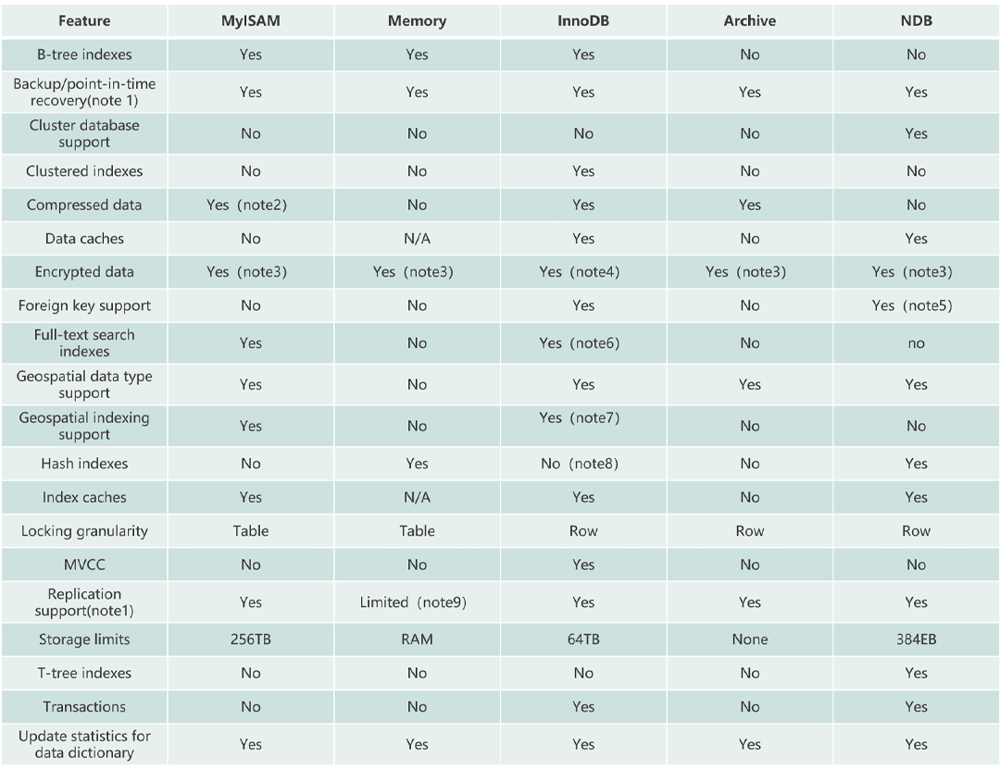
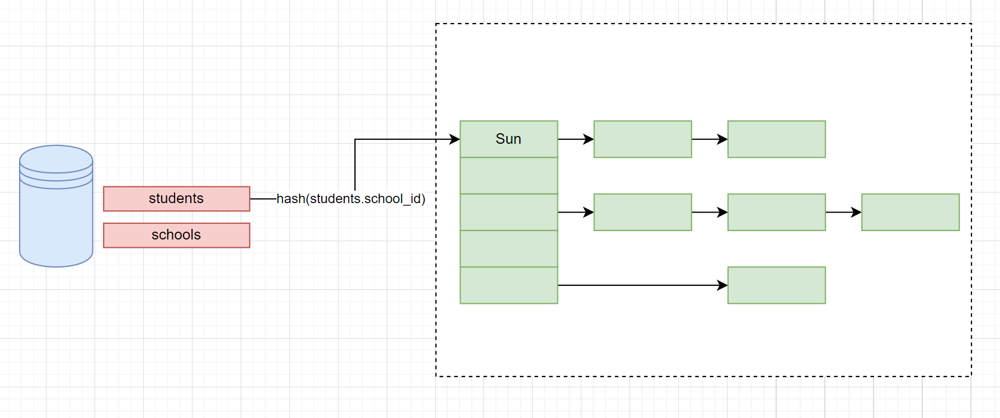
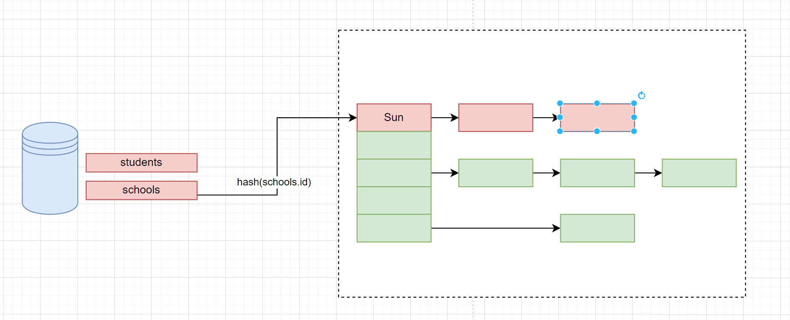
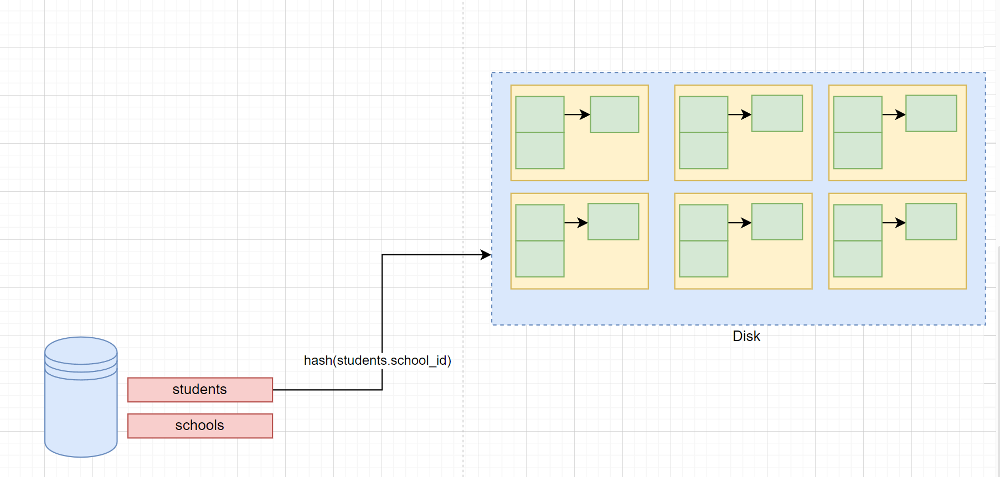
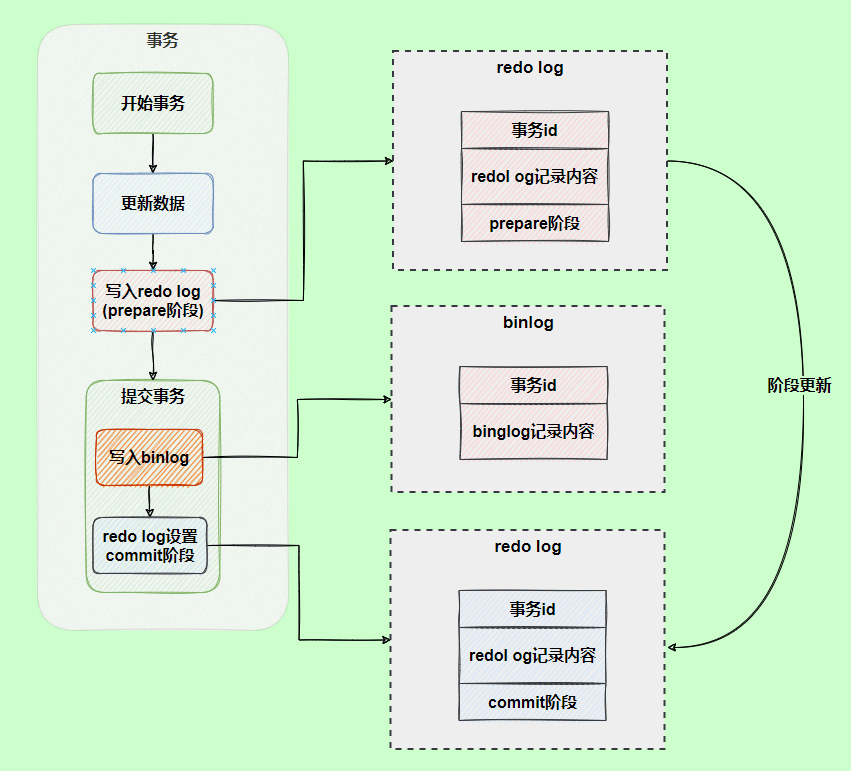
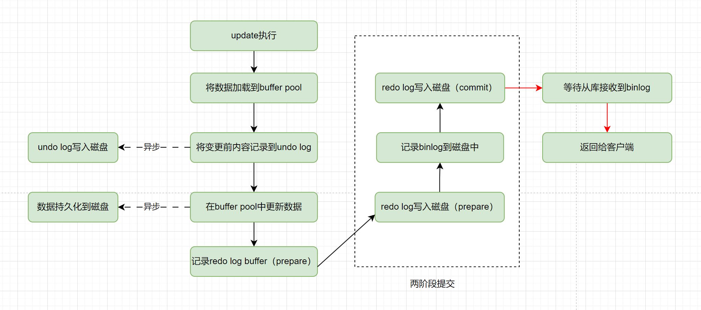

```yaml
title: MySQL数据库-1
category: 数据库
tag:
  - MySQL
```

## MySQL 字段类型

MySQL 字段类型可以简单分为三大类：

- **数值类型**：整型（TINYINT、SMALLINT、MEDIUMINT、INT 和 BIGINT）、浮点型（FLOAT 和 DOUBLE）、定点型（DECIMAL）
- **字符串类型**：CHAR、VARCHAR、TINYTEXT、TEXT、MEDIUMTEXT、LONGTEXT、TINYBLOB、BLOB、MEDIUMBLOB 和 LONGBLOB 等，最常用的是 CHAR 和 VARCHAR。
- **日期时间类型**：YEAR、TIME、DATE、DATETIME 和 TIMESTAMP 等。

### 整数类型的 UNSIGNED 属性有什么用？

MySQL 中的整数类型可以使用可选的 UNSIGNED 属性来表示不允许负值的无符号整数。使用 UNSIGNED 属性可以将正整数的上限提高一倍，因为它不需要存储负数值。

例如， TINYINT UNSIGNED 类型的取值范围是 0 ~ 255，而普通的 TINYINT 类型的值范围是 -128 ~ 127。INT UNSIGNED 类型的取值范围是 0 ~ 4,294,967,295，而普通的 INT 类型的值范围是 2,147,483,648 ~ 2,147,483,647。

对于从 0 开始递增的 ID 列，使用 UNSIGNED 属性可以非常适合，因为不允许负值并且可以拥有更大的上限范围，提供了更多的 ID 值可用。

### char和varchar的区别？

char和varchar都是用于在数据库中存储字符串的数据类型。它们之间的主要区别在于存储空间的使用方式：

char是一种定长的数据类型，它的长度固定且在存储时会自动在结尾添加空格来将字符串填满指定的长度。char的长度范围是0-255，

varchar是一种可变长度的数据类型，它只会存储实际的字符串内容，不会填充空格。因此，在存储短字符串时，varchar可以节省空间。varchar的长度范围是0-65535（MySQL 5.0.3之后的版本）。

对于字段值经常改变的数据类型来说，CHAR 相比 VARCHAR 也更有优势，因为 CHAR 的长度固定，不会产生碎片。如果使用char(100)，则插入记录后就分配了100个字节，后续修改不会造成页分裂的问题，而varchar(100)由于没有提前分配存储空间，因为表中数据刚开始插入时，可变长度字段值都是根据实际长度存储下来的，且行与行之间数据也是紧密连续存放在文件地址中的。那么现在值变长了，原来的位置无法扩展出新的空间出来，所以无法覆盖存放到原来的位置上。此时MySQL就会使用页分裂的方法扩展字段变长的空间。

varchar的优点是变长的字符串类型，兼容性更好；但是同时也会带来一些问题，如使用varchar可能会产生内存碎片、varchar会额外需要1到2个字节存储长度信息、以及update语句可能会导致页分裂等。

例如，存储产品描述（可变长度）、存储用户地址（可变长度）、存储用户名称（可变长度），这些都适合用varchar。

char的优点是定长的字符串类型，减少内存碎片，并且无需额外的内存空间去存储长度信息。但是他的缺点是会删除列末尾的空格信息。

例如，存储身份证号（固定长度）、存储订单号（可变长度）、存储国家编码（固定长度），这些都适合用char。

### VARCHAR(100)和 VARCHAR(10)的区别是什么？

VARCHAR(100)和 VARCHAR(10)都是变长类型，表示能存储最多 100 个字符和 10 个字符。因此，VARCHAR (100) 可以满足更大范围的字符存储需求，有更好的业务拓展性。而 VARCHAR(10)存储超过 10 个字符时，就需要修改表结构才可以。

虽说 VARCHAR(100)和 VARCHAR(10)能存储的字符范围不同，但二者存储相同的字符串，所占用磁盘的存储空间其实是一样的，这也是很多人容易误解的一点。

不过，VARCHAR(100) 会消耗更多的内存。这是因为 VARCHAR 类型在内存中操作时，通常会分配固定大小的内存块来保存值，即使用字符类型中定义的长度。例如在进行排序的时候，VARCHAR(100)是按照 100 这个长度来进行的，也就会消耗更多内存。

### DECIMAL 和 FLOAT/DOUBLE 的区别是什么？

DECIMAL 和 FLOAT 的区别是：**DECIMAL 是定点数，FLOAT/DOUBLE 是浮点数。DECIMAL 可以存储精确的小数值，FLOAT/DOUBLE 只能存储近似的小数值。**

DECIMAL 用于存储具有精度要求的小数，例如与货币相关的数据，可以避免浮点数带来的精度损失。

在 Java 中，MySQL 的 DECIMAL 类型对应的是 Java 类 `java.math.BigDecimal`。

### 为什么不推荐使用 TEXT 和 BLOB？

TEXT 类型类似于 CHAR（0-255 字节）和 VARCHAR（0-65,535 字节），但可以存储更长的字符串，即长文本数据，例如博客内容。

| 类型         | 可存储大小              | 用途      |
| ---------- | ------------------ | ------- |
| TINYTEXT   | 0-255 字节           | 一般文本字符串 |
| TEXT       | 0-65,535 字节        | 长文本字符串  |
| MEDIUMTEXT | 0-16,772,150 字节    | 较大文本数据  |
| LONGTEXT   | 0-4,294,967,295 字节 | 极大文本数据  |

BLOB 类型主要用于存储二进制大对象，例如图片、音视频等文件。

| 类型         | 可存储大小    | 用途           |
| ---------- | -------- | ------------ |
| TINYBLOB   | 0-255 字节 | 短文本二进制字符串    |
| BLOB       | 0-65KB   | 二进制字符串       |
| MEDIUMBLOB | 0-16MB   | 二进制形式的长文本数据  |
| LONGBLOB   | 0-4GB    | 二进制形式的极大文本数据 |

在日常开发中，很少使用 TEXT 类型，但偶尔会用到，而 BLOB 类型则基本不常用。如果预期长度范围可以通过 VARCHAR 来满足，建议避免使用 TEXT。

数据库规范通常不推荐使用 BLOB 和 TEXT 类型，这两种类型具有一些缺点和限制，例如：

- 不能有默认值。
- 在使用临时表时无法使用内存临时表，只能在磁盘上创建临时表（《高性能 MySQL》书中有提到）。
- 检索效率较低。
- 不能直接创建索引，需要指定前缀长度。
- 可能会消耗大量的网络和 IO 带宽。
- 可能导致表上的 DML 操作变慢。
- ……

### DATETIME 和 TIMESTAMP 的区别是什么？

DATETIME 类型没有时区信息，TIMESTAMP 和时区有关。

TIMESTAMP 只需要使用 4 个字节的存储空间，但是 DATETIME 需要耗费 8 个字节的存储空间。但是，这样同样造成了一个问题，Timestamp 表示的时间范围更小。

- DATETIME：1000-01-01 00:00:00 ~ 9999-12-31 23:59:59
- Timestamp：1970-01-01 00:00:01 ~ 2037-12-31 23:59:59****

### NULL 和 '' 的区别是什么？

`NULL` 跟 `''`(空字符串)是两个完全不一样的值，区别如下：

- `NULL` 代表一个不确定的值,就算是两个 `NULL`,它俩也不一定相等。例如，`SELECT NULL=NULL`的结果为 false，但是在我们使用`DISTINCT`,`GROUP BY`,`ORDER BY`时,`NULL`又被认为是相等的。
- `''`的长度是 0，是不占用空间的，而`NULL` 是需要占用空间的。
- `NULL` 会影响聚合函数的结果。例如，`SUM`、`AVG`、`MIN`、`MAX` 等聚合函数会忽略 `NULL` 值。 `COUNT` 的处理方式取决于参数的类型。如果参数是 `*`(`COUNT(*)`)，则会统计所有的记录数，包括 `NULL` 值；如果参数是某个字段名(`COUNT(列名)`)，则会忽略 `NULL` 值，只统计非空值的个数。
- 查询 `NULL` 值时，必须使用 `IS NULL` 或 `IS NOT NULLl` 来判断，而不能使用 =、!=、 <、> 之类的比较运算符。而`''`是可以使用这些比较运算符的。

看了上面的介绍之后，相信你对另外一个高频面试题：“为什么 MySQL 不建议使用 `NULL` 作为列默认值？”也有了答案。

### Boolean 类型如何表示？

MySQL 中没有专门的布尔类型，而是用 TINYINT(1) 类型来表示布尔值。TINYINT(1) 类型可以存储 0 或 1，分别对应 false 或 true。

### MySQL 如何存储 IP 地址？

可以将 IP 地址转换成整形数据存储，性能更好，占用空间也更小。

MySQL 提供了两个方法来处理 ip 地址

- `INET_ATON()`：把 ip 转为无符号整型 (4-8 位)
- `INET_NTOA()` :把整型的 ip 转为地址

插入数据前，先用 `INET_ATON()` 把 ip 地址转为整型，显示数据时，使用 `INET_NTOA()` 把整型的 ip 地址转为地址显示即可。

## MySQL的数据存储一定是基于硬盘的吗？

不是的，MySQL也可以基于内存的，即MySQL的内存表技术（Memory引擎）。它允许将数据和索引存储在内存中，从而提高了检索速度和修改数据的效率。优点包括具有快速响应的查询性能和节约硬盘存储空间。此外，使用内存表还可以实现更高的复杂性，从而提高了MySQL的整体性能。

创建内存表与创建普通表一样，使用CREATE TABLE语句，但需要将存储引擎设置为：ENGINE = MEMORY

## 什么是数据库存储引擎？

数据库引擎是用于存储、处理和保护数据的核心服务。利用数据库引擎可控制访问权限并快速处理事务，从而满足企业内大多数需要处理大量数据的应用程序的要求。

使用数据库引擎创建用于联机事务处理或联机分析处理数据的关系数据库。这包括创建用于存储数据的表和用于查看、管理和保护数据安全的数据库对象（如索引、视图和存储过程）。

查看mysql当前使用什么存储引擎:show engines;

查看mysql当前默认的存储引擎:show variables like '%storage_engine%';

查看看某个表用了什么引擎:show create table 表名;，在显示结果里参数engine后面的就表示该表当前用的存储引擎

## MySQL支持哪几种执行引擎，有什么区别

MySQL是开源的，我们可以基于其源码编写我们自己的存储引擎，有以下几种存储引擎MyISAM、InnoDB、NDB、MEMORY，Archieve、Fedarated以及Maria等。对比如下：



## InnoDB和MyISAM有什么区别？

InnoDB和MyISAM是MySQL中比较常用的两个执行引擎，MySQL 在 5.5 之前版本默认存储引擎是 MyISAM，5.5 之后版本默认存储引擎是 InnoDB，MyISAM适合查询以及插入为主的应用，InnoDB适合频繁修改以及涉及到安全性较高的应用他们主要有以下区别：

1. InnoDB支持事务，MyISAM不支持

2. InnoDB 是聚集索引，MyISAM 是非聚集索引

3. InnoDB支持外键，MyISAM不支持

4. InnoDB 最小的锁粒度是行锁，MyISAM 最小的锁粒度是表锁。

5. InnoDB不支持FULLTEXT类型的索引（5.6之前不支持全文索引）

6. InnoDB中不保存表的行数，但是MyISAM只要简单的读出保存好的行数即可

7. 对于自增长的字段，InnoDB中必须包含只有该字段的索引，但是在MyISAM表中可以和其他字段一起建立联合索引

8. 清空整个表时，InnoDB是一行一行的删除，效率非常慢。MyISAM则会重建表

9. MyISAM 不支持数据库异常崩溃后的安全恢复，而 InnoDB 支持

## MySQL 5.x和8.0有什么区别？

1. 性能：MySQL 8.0 的速度要比 MySQL 5.7 快 2 倍。MySQL 8.0 在以下方面带来了更好的性能：读/写工作负载、IO 密集型工作负载、以及高竞争（"hot spot"热点竞争问题）工作负载。

2. NoSQL：MySQL 从 5.7 版本开始提供 NoSQL 存储功能，目前在 8.0 版本中这部分功能也得到了更大的改进。该项功能消除了对独立的 NoSQL 文档数据库的需求，而 MySQL 文档存储也为 schema-less 模式的 JSON 文档提供了多文档事务支持和完整的 ACID 合规性。

3. 窗口函数(Window Functions)：从 MySQL 8.0 开始，新增了一个叫窗口函数的概念，它可以用来实现若干新的查询方式。窗口函数与 SUM()、COUNT() 这种集合函数类似，但它不会将多行查询结果合并为一行，而是将结果放回多行当中。即窗口函数不需要 GROUP BY。

4. 隐藏索引：在 MySQL 8.0 中，索引可以被“隐藏”和“显示”。当对索引进行隐藏时，它不会被查询优化器所使用。我们可以使用这个特性用于性能调试，例如我们先隐藏一个索引，然后观察其对数据库的影响。如果数据库性能有所下降，说明这个索引是有用的，然后将其“恢复显示”即可；如果数据库性能看不出变化，说明这个索引是多余的，可以考虑删掉。

5. 取消查询缓存：MySQL 8.0 出于性能和可维护性方面的考虑取消了查询缓存，通过使用索引、更好的查询计划优化、以及缓存结果集而不是整个查询。这些方法更有效地提高了查询性能，同时避免了查询缓存可能引入的问题。

6. 降序索引：MySQL 8.0 为索引提供按降序方式进行排序的支持，在这种索引中的值也会按降序的方式进行排序。

7. 通用表表达式(Common Table Expressions CTE)：在复杂的查询中使用嵌入式表时，使用 CTE 使得查询语句更清晰。

8. UTF-8 编码：从 MySQL 8 开始，使用 utf8mb4 作为 MySQL 的默认字符集。

9. JSON：MySQL 8 大幅改进了对 JSON 的支持，添加了基于路径查询参数从 JSON 字段中抽取数据的 JSON_EXTRACT() 函数，以及用于将数据分别组合到 JSON 数组和对象中的 JSON_ARRAYAGG() 和 JSON_OBJECTAGG() 聚合函数。

10. 可靠性：InnoDB 现在支持表 DDL 的原子性，也就是 InnoDB 表上的 DDL 也可以实现事务完整性，要么失败回滚，要么成功提交，不至于出现 DDL 时部分成功的问题，此外还支持 crash-safe 特性，元数据存储在单个事务数据字典中。

11. 高可用性(High Availability)：InnoDB 集群为您的数据库提供集成的原生 HA 解决方案。

12. 安全性：对 OpenSSL 的改进、新的默认身份验证、SQL 角色、密码强度、授权。

## 什么是数据库范式，为什么要反范式

所谓数据库范式，其实就是数据库的设计上的一些规范；这些规范可以让数据库的设计更加简洁、清晰；同时也会更加好的可以保证一致性。

三个常用的范式：

1. 第一范式（1NF）是说，数据库表中的属性是原子性的，要求属性具有原子性，不可再被拆分；
   
   - 比如地址如果都细化拆分成省、市、区、街道、小区等等多个字段这就是符合第一范式的， 如果地址就是一个字段，那就不符合了。

2. 第二范式（2NF）是说，数据库表中的每个实例或记录必须可以被唯一地区分，说白了就是要有主键，其他的字段都依赖于主键。

3. 第三范式（3NF）是说，任何非主属性不依赖于其它非主属性，也就是说，非主键外的所有字段必须互不依赖

如果我们在做表结构设计的时候，完全遵守数据库三范式，确实可以避免一些写时异常，提升一些写入性能，但是同时也会丢失一些读取性能。

因为在遵守范式的数据库设计中，表中不能有任何冗余字段，这就使得查询的时候就会经常有多表关联查询，这无疑是比较耗时的。

于是就有了反范式化。所谓反范式化，是一种针对遵从设计范式的数据库的性能优化策略。

也就是说，反范式化不等于非范式化，反范式化一定发生在满足范式设计的基础之上。前者相当于先遵守所有规则，再进行局部调整。

比如我们可以在表中增加一些冗余字段，方便我们进行数据查询，而不再需要经常做多表join，但同时，这也会带来一个问题，那就是这些冗余字段之间的一致性如何保证，这个问题本来在遵守范式的设计中是不会有的，一旦做了反范式，那就需要开发者自行解决了。

反范式其实本质上是软件开发中一个比较典型的方案，那就是"用空间换时间"，通过做一些数据冗余，来提升查询速度。

在互联网业务中，比较典型的就是数据量大，并发高，并且通常查询的频率要远高于写入的频率，所以适当的做一些反范式，通过做一些字段的冗余，可以提升查询性能，降低响应时长，从而提升并发度。

## MySQL的驱动表是什么？MySQL怎么选的？

驱动表是表连接中的基础表，也就是通过驱动表的数据结果集作为循环基础数据，然后一条一条的通过这个结果集的数据作为过滤条件到被驱动表中查询数据，然后再做合并。那么，也就意味着：驱动表在SQL语句执行的过程中先读取。而被驱动表在SQL语句执行的过程中后读取。

当我们知道MySQL的join的原理之后，其实就可以很容易的知道，驱动表的选择会决定着一条SQL的执行效率。所以，一条SQL中，该使用哪张表作为驱动表，其实是优化器决定的。

MySQL的优化器选择驱动表的原则是：更好的访问性能和筛选性能，所以，通常情况下， 会做以下几个方面的考量：

1. 表大小：这个很容易理解，小表作为驱动表可以更快地被扫描和匹配。所以优化器倾向于选择较小的表作为驱动表。

2. 索引：在MySQL中，索引能大大的影响SQL的查询效率，所以选择可以利用索引进行加速访问的表作为驱动表可以提升效率。

3. where条件：如果查询中包含过滤条件，优化器会选择能够使用过滤条件进行筛选的表作为驱动表，以减少后续的匹配操作。

4. 连接类型：根据连接类型，INNER JOIN、LEFT JOIN、RIGHT JOIN等，优化器可能会做一些选择。比如left join会选择左表作为驱动表，主要是因为LEFT JOIN要返回左表中的所有记录，而右表中的匹配记录是可选的。通过以左表作为驱动表，可以确保返回左表中的所有记录。
   
   - left join： 左表是驱动表，右表是被驱动表
   
   - right join： 右表是驱动表，左表是被驱动表
   
   - inner join： 表数据量较小的表会由mysql自动选择作为驱动表

### 如何判断哪张表是驱动表

```sql
+----+-------------+---------------+--------+------------------+---------+---------+--------------------------------+------+-------------+
| id | select_type | table         | type   | possible_keys    | key     | key_len | ref                            | rows | Extra       |
+----+-------------+---------------+--------+------------------+---------+---------+--------------------------------+------+-------------+
|  1 | SIMPLE      | orders        | ALL    | NULL             | NULL    | NULL    | NULL                           | 100  | Using where |
|  1 | SIMPLE      | order_details | ref    | order_id         | order_id| 4       | db_name.orders.order_id       | 2    | NULL        |
+----+-------------+---------------+--------+------------------+---------+---------+--------------------------------+------+-------------+
```

如上图，orders表为驱动表，order_details表为非驱动表。

上面的执行计划中，有一个id字段，这个是执行计划中每个操作的唯一标识符。对于一条查询语句，每个操作都有一个唯一的id。但是在多表join的时候，一次explain中的多条记录的id是相同的。而排在前面的表会作为驱动表先执行。

### left join 一定是左表作为驱动表吗？

当然不一定，因为这是MySQL优化器决定的。当右表的数据量远远小于左表时，通过以右表作为驱动表可以更快地完成匹配操作。当右表上存在适合的索引或过滤条件，也可以通过右表作为驱动表来利用这些优化。当然sql也比较特殊。这里看一个实例：

```sql
mysql> create table a(f1 int, f2 int, index(f1))engine=innodb;
Query OK, 0 rows affected (0.01 sec)

mysql> create table b(f1 int, f2 int)engine=innodb;
Query OK, 0 rows affected (0.01 sec)

mysql> insert into a values(1,1),(2,2),(3,3),(4,4),(5,5),(6,6);
Query OK, 6 rows affected (0.00 sec)
Records: 6  Duplicates: 0  Warnings: 0

mysql> insert into b values(3,3),(4,4),(5,5),(6,6),(7,7),(8,8);
Query OK, 6 rows affected (0.02 sec)
Records: 6  Duplicates: 0  Warnings: 0
mysql> explain select * from a left join b on(a.f1=b.f1) where (a.f2=b.f2);
+----+-------------+-------+------------+------+---------------+------+---------+-----------+------+----------+-------------+
| id | select_type | table | partitions | type | possible_keys | key  | key_len | ref       | rows | filtered | Extra       |
+----+-------------+-------+------------+------+---------------+------+---------+-----------+------+----------+-------------+
|  1 | SIMPLE      | b     | NULL       | ALL  | NULL          | NULL | NULL    | NULL      |    6 |   100.00 | Using where |
|  1 | SIMPLE      | a     | NULL       | ref  | f1            | f1   | 5       | test.b.f1 |    1 |    16.67 | Using where |
+----+-------------+-------+------------+------+---------------+------+---------+-----------+------+----------+-------------+
2 rows in set, 1 warning (0.00 sec) 
mysql> show warnings;
+-------+------+-------------------------------------------------------------------------------------------------------------------------------------------------------------------------------------------------------------------------------------------+
| Level | Code | Message                                                                                                                                                                                                                                   |
+-------+------+-------------------------------------------------------------------------------------------------------------------------------------------------------------------------------------------------------------------------------------------+
| Note  | 1003 | /* select#1 */ select `test`.`a`.`f1` AS `f1`,`test`.`a`.`f2` AS `f2`,`test`.`b`.`f1` AS `f1`,`test`.`b`.`f2` AS `f2` from `test`.`a` join `test`.`b` where ((`test`.`a`.`f1` = `test`.`b`.`f1`) and (`test`.`a`.`f2` = `test`.`b`.`f2`)) |
+-------+------+-------------------------------------------------------------------------------------------------------------------------------------------------------------------------------------------------------------------------------------------+
1 row in set (0.00 sec)
```

从这个执行计划中可以看到，表b作为了这个SQL的驱动表，表a作为了被驱动表，这个SQL的执行过程是这样的：顺序扫描表b，并将表b的字段放入join buffer，对于join buffer中表b的每一行用b.f1到表a中去查，匹配到记录后判断a.f2=b.f2是否满足，满足条件的话就作为结果集的一部分返回。

我们再来看看explain结果中的warnings，可以看到，MySQL的优化器把这条语句的left join改写成了join，然后因为表a的f1上有索引，就把表b作为驱动表，这样就可以用上表a的f1索引。

### 指定驱动表

在MySQL中，可以使用"STRAIGHT_JOIN"关键字来强制指定JOIN语句中的表连接顺序。使用"STRAIGHT_JOIN"可以告诉优化器使用查询中表的顺序，而不再重新优化连接顺序。

```sql
SELECT *
FROM table1 STRAIGHT_JOIN table2 ON table1.id = table2.id
```

但是，需要注意，STRAIGHT_JOIN只适用于内连接。

## MySQL的Hash Join是什么？

hash join 是 MySQL 8.0.18版本中新推出的一种多表join的算法。

在这之前，MySQL是使用了嵌套循环（Nested-Loop Join）的方式来实现关联查询的，而嵌套循环的算法其实性能是比较差的，而Hash Join的出现就是要优化Nested-Loop Join的。

所谓Hash Join，其实是因为他底层用到了Hash表。

Hash Join 是一种针对 equal-join 场景的优化，他的基本思想是将驱动表数据加载到内存，并建立 hash 表，这样只要遍历一遍非驱动表，然后再去通过哈希查找在哈希表中寻找匹配的行 ，就可以完成 join 操作了。

举个栗子。

```sql
SELECT
  student_name,school_name
FROM
  students LEFT JOIN schools ON students.school_id=schools.id;
```

以上，是一个left join的SQL，在Hash Join过程中，主要分为两个步骤，分别是构建和探测。

构建阶段，假如优化器优化后使用students作为驱动表，那么就会把这个驱动表的数据构建到hash表中：    



探测阶段，在这个过程中，从school表中取出记录之后，去hash表中查询，找到匹配的数据，在做聚合就行了。



需要注意的时候，上面的Hash表是在内存中的，但是，内存是有限的（通过join_buffer_size限制），如果内存中存不下驱动表的数据怎么办呢？

### 基于磁盘的hash join

如果驱动表中的数据量比较大， 没办法一次性的加载到内存中，就需要考虑把这些数据存储在磁盘上。通过将哈希表的一部分存储在磁盘上，分批次地加载和处理数据，从而减少对内存的需求。

在这样的算法中，为了避免一个大的hash表内存中无法完全存储，那么就采用分表的方式来实现，即首先利用 hash 算法将驱动表进行分表，并产生临时分片写到磁盘上。

这样就相当于把一张驱动表，拆分成多个hash表，并且分别存储在磁盘上。



接下来就是做join了，在这个过程中，会对被驱动表使用同样的 hash 算法进行分区，确定好在哪个分区之后，先确认下这个分区是否已经加载到内存，如果已经加载，则直接在内存中的哈希表中进行查找匹配的行。


如果哈希值对应的分区尚未加载到内存中，则从磁盘上读取该分区的数据到内存中的哈希表，并进行匹配。

就这样不断的重复进行下去，直到把所有数据都join完，把结果集返回。

## 为什么大厂不建议使用多表join？

之所以不建议使用join查询，最主要的原因就是join的效率比较低。

MySQL是使用了嵌套循环（Nested-Loop Join）的方式来实现关联查询的，简单点说就是要通过两层循环，用第一张表做外循环，第二张表做内循环，外循环的每一条记录跟内循环中的记录作比较，符合条件的就输出。

而具体到算法实现上主要有simple nested loop，block nested loop和index nested loop这三种。而且这三种的效率都没有特别高。

MySQL是使用了嵌套循环（Nested-Loop Join）的方式来实现关联查询的，如果有2张表join的话，复杂度最高是O(n^2)，3张表则是O(n^3)...随着表越多，表中的数据量越多，JOIN的效率会呈指数级下降。

### join

在MySQL 中，可以使用 JOIN 在两个或多个表中进行联合查询，join有三种，分别是inner join、left join 和 right join。

1. INNER JOIN（内连接,或等值连接）：获取两个表中字段匹配关系的记录。
   
   - 取两个表的交集部分

2. LEFT JOIN（左连接）：获取左表所有记录，即使右表没有对应匹配的记录。
   
   - 取两个表的交集部分+左表中的数据

3. RIGHT JOIN（右连接）： 与 LEFT JOIN 相反，用于获取右表所有记录，即使左表没有对应匹配的记录。
   
   - 取两个表的交集部分+右表中的数据

在配合join一起使用的还有on关键字，用来指明关联查询的一些条件。

### 嵌套循环算法

MySQL是使用了嵌套循环（Nested-Loop Join）的方式来实现关联查询的，具体到算法上面主要有simple nested loop join，block nested loop join和index nested loop join这三种。

而这三种的效率都没有特别高。

1. simple nested loop，他的做法简单粗暴，就是全量扫描连接两张表进行数据的两两对比，所以他的复杂度可以认为是N*M（N是驱动表的数量，M是被驱动表的数量）

2. index nested loop，当Inner Loop的表用到字段有索引的话，可以用到索引进行查询数据，因为索引是B+树的，复杂度可以近似认为是N*logM。

3. block nested loop，其实是引入了一个Buffer，会提前把外循环的一部分结果提前放到JOIN BUFFER中，然后内循环的每一行都和整个buffer的数据作比较。虽然比较次数还是N*M，但是因为join buffer是基于内存的，所以效率高很多。

所以，虽然MySQL已经尽可能的在优化了，但是这几种算法复杂度都还是挺高的，这也是为什么不建议在数据库中多表JOIN的原因。随着表越多，表中的数据量越多，JOIN的效率会呈指数级下降。

### 不能用join如何做关联查询

如果不能通过数据库做关联查询，那么需要查询多表的数据的时候要怎么做呢？

主要有两种做法：

1. 在内存中自己做关联，即先从数据库中把数据查出来之后，我们在代码中再进行二次查询，然后再进行关联。

2. 数据冗余，那就是把一些重要的数据在表中做冗余，这样就可以避免关联查询了。

3. 宽表，就是基于一定的join关系，把数据库中多张表的数据打平做一张大宽表，可以同步到ES或者干脆直接在数据库中直接查都可以。

## 说一说MySQL一条SQL语句的执行过程？

先简单介绍一下MySQL 主要分为 Server 层和存储引擎层：

- **Server 层**：主要包括连接器、查询缓存、分析器、优化器、执行器等，所有跨存储引擎的功能都在这一层实现，比如存储过程、触发器、视图，函数等，还有一个通用的日志模块 binlog 日志模块。
- **存储引擎**：主要负责数据的存储和读取，采用可以替换的插件式架构，支持 InnoDB、MyISAM、Memory 等多个存储引擎，其中 InnoDB 引擎有自有的日志模块 redolog 模块。现在最常用的存储引擎是 InnoDB，它从 MySQL 5.5 版本开始就被当做默认存储引擎了。

### Server 层基本组件介绍

#### 连接器

连接器主要和身份认证和权限相关的功能相关，就好比一个级别很高的门卫一样。

主要负责用户登录数据库，进行用户的身份认证，包括校验账户密码，权限等操作，如果用户账户密码已通过，连接器会到权限表中查询该用户的所有权限，之后在这个连接里的权限逻辑判断都是会依赖此时读取到的权限数据，也就是说，后续只要这个连接不断开，即使管理员修改了该用户的权限，该用户也是不受影响的。

#### 查询缓存(MySQL 8.0 版本后移除)

查询缓存主要用来缓存我们所执行的 SELECT 语句以及该语句的结果集。

连接建立后，执行查询语句的时候，会先查询缓存，MySQL 会先校验这个 SQL 是否执行过，以 Key-Value 的形式缓存在内存中，Key 是查询语句，Value 是结果集。如果缓存 key 被命中，就会直接返回给客户端，如果没有命中，就会执行后续的操作，完成后也会把结果缓存起来，方便下一次调用。当然在真正执行缓存查询的时候还是会校验用户的权限，是否有该表的查询条件。

MySQL 查询不建议使用缓存，因为查询缓存失效在实际业务场景中可能会非常频繁，假如你对一个表更新的话，这个表上的所有的查询缓存都会被清空。对于不经常更新的数据来说，使用缓存还是可以的。

所以，一般在大多数情况下我们都是不推荐去使用查询缓存的。

MySQL 8.0 版本后删除了缓存的功能，官方也是认为该功能在实际的应用场景比较少，所以干脆直接删掉了。

#### 分析器

MySQL 没有命中缓存，那么就会进入分析器，分析器主要是用来分析 SQL 语句是来干嘛的，分析器也会分为几步：

**第一步，词法分析**，一条 SQL 语句有多个字符串组成，首先要提取关键字，比如 select，提出查询的表，提出字段名，提出查询条件等等。做完这些操作后，就会进入第二步。

**第二步，语法分析**，主要就是判断你输入的 SQL 是否正确，是否符合 MySQL 的语法。

完成这 2 步之后，MySQL 就准备开始执行了，但是如何执行，怎么执行是最好的结果呢？这个时候就需要优化器上场了。

#### 优化器

优化器的作用就是它认为的最优的执行方案去执行（有时候可能也不是最优，这篇文章涉及对这部分知识的深入讲解），比如多个索引的时候该如何选择索引，多表查询的时候如何选择关联顺序等。

可以说，经过了优化器之后可以说这个语句具体该如何执行就已经定下来。

#### 执行器

当选择了执行方案后，MySQL 就准备开始执行了，首先执行前会校验该用户有没有权限，如果没有权限，就会返回错误信息，如果有权限，就会去调用引擎的接口，返回接口执行的结果。

### 查询语句示例

select * from users where age='18' and name='sun';

执行过程如下图：


结合上面的说明，我们分析下这个语句的执行流程：

1. 使用连接器，通过客户端/服务器通信协议与 MySQL 建立连接。并查询是否有权限，如果没有权限，直接返回错误信息

2. Mysql8.0之前检查是否开启缓存，开启了 Query Cache 且命中完全相同的 SQL 语句，则将查询结果直接返回给客户端；

3. 由解析器（分析器）进行语法分析和语义分析，并生成解析树。如查询是select、表名users、条件是age='18' and name='sun'，预处理器则会根据 MySQL 规则进一步检查解析树是否合法。比如检查要查询的数据表或数据列是否存在等。

4. 由优化器生成执行计划。上面的 SQL 语句，可以有两种执行方案：a.先查询人员表中姓名为“sun”的，然后判断是否年龄是 18。b.先找出学生中年龄 18 岁的学生，然后再查询姓名为“sun”的学生。那么优化器根据自己的优化算法进行选择执行效率最好的一个方案（优化器认为，有时候不一定最好）。那么确认了执行计划后就准备开始执行了。

5. 执行器来执行SQL语句，这里会操作MySQL的存储引擎来执行 SQL 语句，根据存储引擎类型，得到查询结果。若开启了 Query Cache，则需要缓存，否则直接返回。

### 更新语句示例

update tb_student A set A.age='19' where A.name=' 张三 ';

我们来给张三修改下年龄，在实际数据库肯定不会设置年龄这个字段的，不然要被技术负责人打的。其实这条语句也基本上会沿着上一个查询的流程走，只不过执行更新的时候肯定要记录日志啦，这就会引入日志模块了，MySQL 自带的日志模块是 **binlog（归档日志）** ，所有的存储引擎都可以使用，我们常用的 InnoDB 引擎还自带了一个日志模块 **redo log（重做日志）**，我们就以 InnoDB 模式下来探讨这个语句的执行流程。流程如下：

- 连接器权限校验，分析器检查sql格式

- 执行器先查询到张三这一条数据，如果有缓存，也是会用到缓存。

- 然后拿到查询的语句，把 age 改为 19，然后调用引擎 API 接口，写入这一行数据，InnoDB 引擎把数据保存在内存中，同时记录 redo log，此时 redo log 进入 prepare 状态，然后告诉执行器，执行完成了，随时可以提交。

- 执行器收到通知后记录 binlog，然后调用引擎接口，提交 redo log 为提交状态。

- 更新完成。

## InnoDB支持哪几种行格式？

数据库表的行格式决定了一行数据是如何进行物理存储的，进而影响查询和DML操作的性能。

在InnoDB中，常见的行格式有4种：

1. COMPACT ：是MySQL 5.0之前的默认格式，除了保存字段值外，还会利用空值列表保存null值，还会记录变长字段长度列表和记录头信息。
   
   COMPACT 适合处理大量包含可变长度列（如VARCHAR、VARBINARY、BLOB和TEXT类型）的数据。
   
   对于可变长度列，前768字节的数据存储在B树节点的索引记录中，超出部分存储在溢出页中。大于或等于768字节的固定长度列会被编码为可变长度列，并可以存储在页外。
   
   

2. REDUNDANT ：Redundant 是 MySQL5.0 版本之前 InnoDB 的行记录存储方式，用的比较少，Redundant 行格式会把该条记录中所有列 (包括隐藏列) 的长度信息都存储到 '字段长度偏移列表' 中。
   
   

3. DYNAMIC：DYNAMIC格式在MySQL 5.7版本引入，是COMPACT格式的改进版。它保持了COMPACT格式的优点，同时在存储大的可变长度列时更加灵活，能够动态地选择存储在页内或页外。DYNAMIC格式适用于大部分的应用场景，并在存储空间和性能上做了一定的平衡。其结构和COMPACT大致相同；

4. COMPRESSED：是MySQL 5.1中InnoDB的新特性之一，它可以在存储数据时对数据进行压缩，从而减小磁盘占用空间。它的缺点是增加了CPU的使用，可能会降低一些查询的性能。COMPRESSED 行格式是在 DYNAMIC 行格式的基础上添加了页外压缩功能。在存储时，如果发现数据可以通过压缩减小存储空间，就会使用压缩方式来存储数据。在查询时，会自动解压缩数据并返回结果。

5. BARRACUDA：是MySQL 5.7引入的一种新格式，相对于前面的格式，支持更多的高级特性，如动态行格式、行级压缩、空间管理等。

| 行格式        | 紧凑的存储特性 | 增强的可变长度列存储 | 大索引键前缀支持 | 压缩支持 | 支持的表空间类型                        | 所需文件格式                |
| ---------- | ------- | ---------- | -------- | ---- | ------------------------------- | --------------------- |
| REDUNDANT  | 否       | 否          | 否        | 否    | system, file-per-table, general | Antelope or Barracuda |
| COMPACT    | 是       | 否          | 否        | 否    | system, file-per-table, general | Antelope or Barracuda |
| DYNAMIC    | 是       | 是          | 是        | 否    | system, file-per-table, general | Barracuda             |
| COMPRESSED | 是       | 是          | 是        | 是    | file-per-table, general         | Barracuda             |

### varchar最多支持多少长度的存储？

在MySQL文档中总是说varchar最多支持65535长度的字符串，在实际使用时，真的是这样吗？

如果创建一个字段为varchar(65535)，MySQL会抛出异常：

`row size too large. the maximum row size for the used table type,not counting BLOBs, is 65535.`

从错误可以看出InnoDB不支持65535长度的varchar字段。这是因为还有别的开销。实际测试时可以发现最大的varchar长度为65532。

如果将这张表的字符集从latin1更换成gbk或者utf-8，你会发现65532长度的varchar字段也不允许创建了，这次的报错是

`ERROR 1074(42000) :column length too big for column 'a' (max = 21845);use BLOB or TEXT instead.`

这里报错说明只能创建varchar(21845)的字段了。这说明varchar(N)中的N代表着字符长度。MySQL文档中定义的65535长度是指所有varchar列的总长度。如果一张表的varchar字段长度之和超过了65535，MySQL依然会报错。

> Tips:在Oracle中，varchar2可以存放4000字节长度。

一个数据页只有16K，即16384字节，如何存储65532字节的varchar呢？而且我们知道B+树索引结构肯定不能让一个节点只存一行数据，这样B+树结构就和链表一样了。

其实MySQL有多种数据页格式，针对长度超过限制的数据行，会将数据的前一部分存储在B-tree类型的数据页中，将剩余部分指向另外的溢出页。这样一个数据页就能存储多条行数据了。

## 什么是数据库事务？

数据库事务( transaction)是访问并可能操作各种数据项的一个数据库操作序列，这些操作要么全部执行，要么全部不执行，是一个不可分割的工作单位。事务由事务开始与事务结束之间执行的全部数据库操作组成。

并非任意的对数据库的操作序列都是数据库事务。事务应该具有4个属性：原子性、一致性、隔离性、持久性。这四个属性通常称为ACID特性。

1. 原子性（Atomicity）：事务作为一个整体被执行，包含在其中的对数据库的操作要么全部被执行，要么都不执行。

2. 一致性（Consistency）：事务应确保数据库的状态从一个一致状态转变为另一个一致状态。一致状态的含义是数据库中的数据应满足完整性约束。

3. 隔离性（Isolation）：多个事务并发执行时，一个事务的执行不应影响其他事务的执行。

4. 持久性（Durability）：一个事务一旦提交，他对数据库的修改应该永久保存在数据库中。

### 举例

用一个常用的“A账户向B账号汇钱”的例子来说明如何通过数据库事务保证数据的准确性和完整性。熟悉关系型数据库事务的都知道从帐号A到帐号B需要6个操作：

1. 从A账号中把余额读出来（500）

2. 对A账号做减法操作（500-100）

3. 把结果写回A账号中（400）

4. 从B账号中把余额读出来（500）

5. 对B账号做加法操作（500+100）

6. 把结果写回B账号中（600）

### 原子性

保证1-6所有过程要么都执行，要么都不执行。一旦在执行某一步骤的过程中发生问题，就需要执行回滚操作。 假如执行到第五步的时候，B账户突然不可用（比如被注销），那么之前的所有操作都应该回滚到执行事务之前的状态。

### 一致性

在转账之前，A和B的账户中共有500+500=1000元钱。在转账之后，A和B的账户中共有400+600=1000元。也就是说，数据的状态在执行该事务操作之后从一个状态改变到了另外一个状态。同时一致性还能保证账户余额不会变成负数等。

### 隔离性

在A向B转账的整个过程中，只要事务还没有提交（commit），查询A账户和B账户的时候，两个账户里面的钱的数量都不会有变化。 如果在A给B转账的同时，有另外一个事务执行了C给B转账的操作，那么当两个事务都结束的时候，B账户里面的钱应该是A转给B的钱加上C转给B的钱再加上自己原有的钱。

### 持久性

一旦转账成功（事务提交），两个账户的里面的钱就会真的发生变化（会把数据写入数据库做持久化保存）！

🌈 这里要额外补充一点：**只有保证了事务的持久性、原子性、隔离性之后，一致性才能得到保障。也就是说 A、I、D 是手段，C 是目的！** 想必大家也和我一样，被 ACID 这个概念被误导了很久! 我也是看周志明老师的公开课[《周志明的软件架构课》](https://time.geekbang.org/opencourse/intro/100064201)才搞清楚的（多看好书！！！）。


另外，DDIA 也就是 [《Designing Data-Intensive Application（数据密集型应用系统设计）》](https://book.douban.com/subject/30329536/) 的作者在他的这本书中如是说：

> Atomicity, isolation, and durability are properties of the database, whereas consis‐
> tency (in the ACID sense) is a property of the application. The application may rely
> on the database’s atomicity and isolation properties in order to achieve consistency,
> but it’s not up to the database alone.
> 
> 翻译过来的意思是：原子性，隔离性和持久性是数据库的属性，而一致性（在 ACID 意义上）是应用程序的属性。应用可能依赖数据库的原子性和隔离属性来实现一致性，但这并不仅取决于数据库。因此，字母 C 不属于 ACID 。

## binlog、redo log和undo log区别？

在MySQL数据库中，binlog、redolog和undolog都是日志类型文件，但它们各自的作用和实现方式有所不同。

binlog主要用来对数据库进行数据备份、崩溃恢复和数据复制等操作，redo log和undo log主要用于事务管理，记录的是数据修改操作和回滚操作。redo log用来做恢复，undo log用来做回滚。

> 崩溃恢复是指在数据库系统因为某种原因而发生崩溃或非正常关闭后，通过一系列机制和步骤来恢复数据库到一个一致性和可用的状态。崩溃恢复是数据库管理系统的重要功能，它确保数据库在出现异常情况后能够自动恢复，避免数据丢失或数据库状态不一致的问题。

在MySQL中，redo log和undo log只适用于InnoDB存储引擎，因为要支持事务。而不适用于MyISAM等其他存储引擎。而binlog则适用于所有存储引擎。

binlog是MySQL用于记录数据库中的所有DDL语句和DML语句的一种二进制日志。它记录了所有对数据库结构和数据的修改操作，如INSERT、UPDATE和DELETE等。binlog主要用来对数据库进行数据备份、灾难恢复和数据复制等操作。binlog的格式分为基于语句的格式和基于行的格式。

redo log是MySQL用于实现崩溃恢复和数据持久性的一种机制。在事务进行过程中，MySQL会将事务做了什么改动到redo log中。当系统崩溃或者发生异常情况时，MySQL会利用redo log中的记录信息来进行恢复操作，将事务所做的修改持久化到磁盘中。redo log保证事务的持久性。

undo log则用于在事务回滚或系统崩溃时撤销（回滚）事务所做的修改。当一个事务执行完成后，MySQL会将事务修改前的数据记录到undo log中。如果事务需要回滚，则会从undo log中找到相应的记录来撤销事务所做的修改。另外，undo log还支持MVCC（多版本并发控制）机制，用于在并发事务执行时提供一定的隔离性。undo log保证事务的原子性和一致性。

如果要对比redo log和binlog的不同，有这几个方面可以对比：

1. 存储内容不同：binlog不仅记录了事务执行的数据改动内容（DML），也有对表等的修改（DDL）日志，包括存储引擎的日志；redo log只记录事务执行的数据修改内容。

2. 记录格式不同：无论binlog的格式是statement、row、mixed，都是逻辑日志；redo log记录的是每个数据页的更改情况，是物理日志。

3. 刷盘时机不同：binlog仅在事务提交前刷盘；redo log在事务执行过程中不停的有刷盘行为。

## redo log 刷盘策略

什么情况下InnoDB 会将 redo log 刷到磁盘上：

1. 事务提交：当事务提交时，log buffer 里的 redo log 会被刷新到磁盘（可以通过`innodb_flush_log_at_trx_commit`参数控制，后文会提到）。

2. log buffer 空间不足时：log buffer 中缓存的 redo log 已经占满了 log buffer 总容量的大约一半左右，就需要把这些日志刷新到磁盘上。

3. 事务日志缓冲区满：InnoDB 使用一个事务日志缓冲区（transaction log buffer）来暂时存储事务的重做日志条目。当缓冲区满时，会触发日志的刷新，将日志写入磁盘。

4. Checkpoint（检查点）：InnoDB 定期会执行检查点操作，将内存中的脏数据（已修改但尚未写入磁盘的数据）刷新到磁盘，并且会将相应的重做日志一同刷新，以确保数据的一致性。

5. 后台刷新线程：InnoDB 启动了一个后台线程，负责周期性（每隔 1 秒）地将脏页（已修改但尚未写入磁盘的数据页）刷新到磁盘，并将相关的重做日志一同刷新。

6. 正常关闭服务器：MySQL 关闭的时候，redo log 都会刷入到磁盘里去。

总之，InnoDB 在多种情况下会刷新重做日志，以保证数据的持久性和一致性。

我们要注意设置正确的刷盘策略`innodb_flush_log_at_trx_commit` 。根据 MySQL 配置的刷盘策略的不同，MySQL 宕机之后可能会存在轻微的数据丢失问题。

`innodb_flush_log_at_trx_commit` 的值有 3 种，也就是共有 3 种刷盘策略：

- **0**：设置为 0 的时候，表示每次事务提交时不进行刷盘操作。这种方式性能最高，但是也最不安全，因为如果 MySQL 挂了或宕机了，可能会丢失最近 1 秒内的事务。

- **1**：设置为 1 的时候，表示每次事务提交时都将进行刷盘操作。这种方式性能最低，但是也最安全，因为只要事务提交成功，redo log 记录就一定在磁盘里，不会有任何数据丢失。

- **2**：设置为 2 的时候，表示每次事务提交时都只把 log buffer 里的 redo log 内容写入 page cache（文件系统缓存）。page cache 是专门用来缓存文件的，这里被缓存的文件就是 redo log 文件。这种方式的性能和安全性都介于前两者中间。

刷盘策略`innodb_flush_log_at_trx_commit` 的默认值为 1，设置为 1 的时候才不会丢失任何数据。为了保证事务的持久性，我们必须将其设置为 1。

另外，`InnoDB` 存储引擎有一个后台线程，每隔`1` 秒，就会把 `redo log buffer` 中的内容写到文件系统缓存（`page cache`），然后调用 `fsync` 刷盘。


也就是说，一个没有提交事务的 `redo log` 记录，也可能会刷盘。

**为什么呢？**

因为在事务执行过程 `redo log` 记录是会写入`redo log buffer` 中，这些 `redo log` 记录会被后台线程刷盘。


除了后台线程每秒`1`次的轮询操作，还有一种情况，当 `redo log buffer` 占用的空间即将达到 `innodb_log_buffer_size` 一半的时候，后台线程会主动刷盘。

下面是不同刷盘策略的流程图。

### innodb_flush_log_at_trx_commit=0


为`0`时，如果`MySQL`挂了或宕机可能会有`1`秒数据的丢失。

### innodb_flush_log_at_trx_commit=1


为`1`时， 只要事务提交成功，`redo log`记录就一定在硬盘里，不会有任何数据丢失。

如果事务执行期间`MySQL`挂了或宕机，这部分日志丢了，但是事务并没有提交，所以日志丢了也不会有损失。

### innodb_flush_log_at_trx_commit=2


为`2`时， 只要事务提交成功，`redo log buffer`中的内容只写入文件系统缓存（`page cache`）。

如果仅仅只是`MySQL`挂了不会有任何数据丢失，但是服务器宕机可能会有`1`秒数据的丢失。

### 日志文件组

硬盘上存储的 `redo log` 日志文件不只一个，而是以一个**日志文件组**的形式出现的，每个的`redo`日志文件大小都是一样的。

比如可以配置为一组`4`个文件，每个文件的大小是 `1GB`，整个 `redo log` 日志文件组可以记录`4G`的内容。

它采用的是环形数组形式，从头开始写，写到末尾又回到头循环写，如下图所示。


在个**日志文件组**中还有两个重要的属性，分别是 `write pos、checkpoint`

- **write pos** 是当前记录的位置，一边写一边后移
- **checkpoint** 是当前要擦除的位置，也是往后推移

每次刷盘 `redo log` 记录到**日志文件组**中，`write pos` 位置就会后移更新。

每次 `MySQL` 加载**日志文件组**恢复数据时，会清空加载过的 `redo log` 记录，并把 `checkpoint` 后移更新。

`write pos` 和 `checkpoint` 之间的还空着的部分可以用来写入新的 `redo log` 记录。


如果 `write pos` 追上 `checkpoint` ，表示**日志文件组**满了，这时候不能再写入新的 `redo log` 记录，`MySQL` 得停下来，清空一些记录，把 `checkpoint` 推进一下。


注意从 MySQL 8.0.30 开始，日志文件组有了些许变化：

> The innodb_redo_log_capacity variable supersedes the innodb_log_files_in_group and innodb_log_file_size variables, which are deprecated. When the innodb_redo_log_capacity setting is defined, the innodb_log_files_in_group and innodb_log_file_size settings are ignored; otherwise, these settings are used to compute the innodb_redo_log_capacity setting (innodb_log_files_in_group * innodb_log_file_size = innodb_redo_log_capacity). If none of those variables are set, redo log capacity is set to the innodb_redo_log_capacity default value, which is 104857600 bytes (100MB). The maximum redo log capacity is 128GB.

> Redo log files reside in the #innodb_redo directory in the data directory unless a different directory was specified by the innodb_log_group_home_dir variable. If innodb_log_group_home_dir was defined, the redo log files reside in the #innodb_redo directory in that directory. There are two types of redo log files, ordinary and spare. Ordinary redo log files are those being used. Spare redo log files are those waiting to be used. InnoDB tries to maintain 32 redo log files in total, with each file equal in size to 1/32 * innodb_redo_log_capacity; however, file sizes may differ for a time after modifying the innodb_redo_log_capacity setting.

意思是在 MySQL 8.0.30 之前可以通过 `innodb_log_files_in_group` 和 `innodb_log_file_size` 配置日志文件组的文件数和文件大小，但在 MySQL 8.0.30 及之后的版本中，这两个变量已被废弃，即使被指定也是用来计算 `innodb_redo_log_capacity` 的值。而日志文件组的文件数则固定为 32，文件大小则为 `innodb_redo_log_capacity / 32` 。

关于这一点变化，我们可以验证一下。

首先创建一个配置文件，里面配置一下 `innodb_log_files_in_group` 和 `innodb_log_file_size` 的值：

```properties
[mysqld]
innodb_log_file_size = 10485760
innodb_log_files_in_group = 64
```

docker 启动一个 MySQL 8.0.32 的容器：

```bash
docker run -d -p 3312:3309 -e MYSQL_ROOT_PASSWORD=your-password -v /path/to/your/conf:/etc/mysql/conf.d --name
MySQL830 mysql:8.0.32
```

现在我们来看一下启动日志：

```plain
2023-08-03T02:05:11.720357Z 0 [Warning] [MY-013907] [InnoDB] Deprecated configuration parameters innodb_log_file_size and/or innodb_log_files_in_group have been used to compute innodb_redo_log_capacity=671088640. Please use innodb_redo_log_capacity instead.
```

这里也表明了 `innodb_log_files_in_group` 和 `innodb_log_file_size` 这两个变量是用来计算 `innodb_redo_log_capacity` ，且已经被废弃。

我们再看下日志文件组的文件数是多少：


可以看到刚好是 32 个，并且每个日志文件的大小是 `671088640 / 32 = 20971520`

所以在使用 MySQL 8.0.30 及之后的版本时，推荐使用 `innodb_redo_log_capacity` 变量配置日志文件组

### redo log相关的报错

有些时候，我们可以在MySQL日志中看到`InnoDB:ERROR:the age of the last checkpoint is xxx,InnoDB:which exceeds the log group capacity xxxx.`

这里的报错代表着redo log的文件组写入点write_pos已经赶上了check_point，redo log没有足够空间写入更多内容了。这个时候MySQL会主动将内存中的脏页数据刷到磁盘中，将check_point继续往前推进，然后才能将redo log继续写入，但是这期间的用户线程会阻塞。

如果真的遇到这个问题，说明MySQL redo log文件组大小设置低了，需要调整参数，增大文件体积、增加文件数量。

### redo log 小结

相信大家都知道 `redo log` 的作用和它的刷盘时机、存储形式。

现在我们来思考一个问题：**只要每次把修改后的数据页直接刷盘不就好了，还有 `redo log` 什么事？**

它们不都是刷盘么？差别在哪里？

```java
1 Byte = 8bit
1 KB = 1024 Byte
1 MB = 1024 KB
1 GB = 1024 MB
1 TB = 1024 GB
```

实际上，数据页大小是`16KB`，刷盘比较耗时，可能就修改了数据页里的几 `Byte` 数据，有必要把完整的数据页刷盘吗？

而且数据页刷盘是随机写，因为一个数据页对应的位置可能在硬盘文件的随机位置，所以性能是很差。

如果是写 `redo log`，一行记录可能就占几十 `Byte`，只包含表空间号、数据页号、磁盘文件偏移
量、更新值，再加上是顺序写，所以刷盘速度很快。

所以用 `redo log` 形式记录修改内容，性能会远远超过刷数据页的方式，这也让数据库的并发能力更强。

> 其实内存的数据页在一定时机也会刷盘，我们把这称为页合并，讲 `Buffer Pool`的时候会对这块细说

## InnoDB的一次更新事务是怎么实现的？

一次InnnoDB的update操作，涉及到buffer pool、binlog、undo log、redo log以及物理磁盘，完整的一次操作过程基本如下：

1. 在Buffer Pool中读取数据：当InnoDB需要更新一条记录时，首先会在buffer pool中查找该记录是否在内存中。如果没有在内存中，则从磁盘读取该页到buffer pool中。

2. 记录undo log：在修改操作前，InnoDB会在undo log中记录修改前的数据。undo log是用来保证事务原子性和一致性的一种机制，用于在发生事务回滚等情况时，将修改操作回滚到修改前的状态，以达到事务的原子性和一致性。undo log的写入最开始写到内存中的，然后由1个后台线程定时刷新到磁盘中的。

3. 在buffer pool中更新：当执行update语句时，InnoDB会先更新已经读取到buffer pool中的数据，而不是直接写入磁盘。同时，InnoDB会将修改后的数据页状态设置为“脏页”（Dirty Page）状态，表示该页已经被修改但尚未写入磁盘。

4. 记录redo log buffer：InnoDB在buffer pool中记录修改操作的同时，InnoDB 会先将修改操作写入到 redo log buffer 中。

5. 提交事务：在执行完所有修改操作后，事务被提交。在提交事务时，InnoDB会将redo log写入磁盘，以保证事务持久性。

6. 写入磁盘：在提交过程后，InnoDB会将buffer pool中的脏页写入磁盘，以保证数据的持久性。但是这个写入过程并不是立即执行的，是有一个后台线程异步执行的，所以可能会延迟写入，总之就是MYSQL会选择合适的时机把数据写入磁盘做持久化。

7. 记录binlog：在提交过程中，InnoDB会将事务提交的信息记录到binlog中。binlog是MySQL用来实现主从复制的一种机制，用于将主库上的事务同步到从库上。在binlog中记录的信息包括：事务开始的时间、数据库名、表名、事务ID、SQL语句等。

需要注意的是，在binlog和redo log的写入过程中，其实是分成了2阶段的，通过2阶段提交的方式来保证一致性的。


## redo log两阶段提交

`redo log`（重做日志）让`InnoDB`存储引擎拥有了崩溃恢复能力。

`binlog`（归档日志）保证了`MySQL`集群架构的数据一致性。

虽然它们都属于持久化的保证，但是侧重点不同。

在执行更新语句过程，会记录`redo log`与`binlog`两块日志，以基本的事务为单位，`redo log`在事务执行过程中可以不断写入，而`binlog`只有在提交事务时才写入，所以`redo log`与`binlog`的写入时机不一样。


回到正题，`redo log`与`binlog`两份日志之间的逻辑不一致，会出现什么问题？

我们以`update`语句为例，假设`id=2`的记录，字段`c`值是`0`，把字段`c`值更新成`1`，`SQL`语句为`update T set c=1 where id=2`。

假设执行过程中写完`redo log`日志后，`binlog`日志写期间发生了异常，会出现什么情况呢？


由于`binlog`没写完就异常，这时候`binlog`里面没有对应的修改记录。因此，之后用`binlog`日志恢复数据时，就会少这一次更新，恢复出来的这一行`c`值是`0`，而原库因为`redo log`日志恢复，这一行`c`值是`1`，最终数据不一致。


为了解决两份日志之间的逻辑一致问题，`InnoDB`存储引擎使用**两阶段提交**方案。

原理很简单，将`redo log`的写入拆成了两个步骤`prepare`和`commit`，这就是**两阶段提交**。



使用**两阶段提交**后，写入`binlog`时发生异常也不会有影响，因为`MySQL`根据`redo log`日志恢复数据时，发现`redo log`还处于`prepare`阶段，并且没有对应`binlog`日志，就会回滚该事务。


再看一个场景，`redo log`设置`commit`阶段发生异常，那会不会回滚事务呢？


并不会回滚事务，它会执行上图框住的逻辑，虽然`redo log`是处于`prepare`阶段，但是只要能通过redolog中的事务`id`找到对应的`binlog`日志且事务id相同，则`MySQL`认为是完整的，就会提交事务恢复数据。只要事务id不一致，则不完整，会回滚事务。

## MySQL主从复制的过程

MySQL的主从复制，是基于binlog实现的，主要过程是这样的：


1. 从服务器在开启主从复制后，会创建出两个线程：I/O线程和SQL线程

2. 从服务器的I/O线程，会尝试和主服务器建立连接，相对应的，主服务中也有一个binlog dump线程， 是专门来和从服务器的I/O线程做交互的。

3. 从服务器的I/O线程会告诉主服务的dump线程自己要从什么位置开始接收binlog

4. 主服务器在更新过程中，将更改记录保存到自己的binlog中，根据不同的binlog格式，记录的内容可能不一样。

5. 在dump线程检测到binlog变化时，会从指定位置开始读取内容，并把它发送给从服务器的I/O线程
   
   <u>这里需要注意，有些资料上面说这里是主服务器向从服务器推的，但是，实际上是从服务器向主服务器拉的。（[MySQL :: MySQL 8.0 Reference Manual :: 17.2 Replication Implementation](https://dev.mysql.com/doc/refman/8.0/en/replication-implementation.html) ）</u>
   
   拉的模式，从库可以自行管理同步进度和处理延迟。

6. 从服务器的I/O线程接收到通知事件后，会把内容保存在relay log中。

7. 从服务器还有一个SQL线程，他会不断地读取他自己的relay log中的内容，把他解析成具体的操作，然后写入到自己的数据表中。

### 复制方式（这里缺少发生异常怎么处理部分）

MySQL目前支持多种复制方式，其中包括了全同步复制、异步复制和半同步复制。

异步复制：这是MySQL默认的复制方式，在异步复制的方式中主库在执行完事务操作以后，会立刻给客户端返回。他不需要关心从库是否完成该事务的执行。

这种方式会导致一个问题，那就是当主库出现故障时，主库虽然事务执行完了，但是可能还没来得及把数据同步给从库，就挂了。那么当从库升级为主库之后，他会丢失了这次事务的变更内容。

全同步复制：全同步复制的这个方式中，当主库执行完一个事务之后，他会等待所有的从库完成数据复制之后，才会给客户端反馈。

这种方式安全性可以保障了，但是性能很差。如果从库比较多的话，会导致整个过程更加长。

半同步复制：半同步复制是介于全同步复制和异步复制之间的一种方案。他再执行完一个事务之后，也不会立刻给客户端反馈，但是也不会等所有从库都完成事务，而是等其中一个从库完成接收到事件之后，再反馈给客户端。

在半同步复制这个方案中，会在事务提交的2阶段都完成之后，等待从库接收到binlog，然后再返回成功。

如果把半同步复制的过程也加进两阶段提交，那么就会变成：



### 主从延迟

数据库的主从延迟是指在主从数据库复制过程中，从服务器（Slave）上的数据与主服务器（Master）上的数据之间存在的时间差或延迟。

一般来说导致主从延迟可能由多种因素引起，以下是一些常见的原因：

1. 网络延迟：主节点和从节点之间的网络延迟导致复制延迟这是比较常见的一种情况，

2. 从节点性能问题：从服务器的性能不足也可能导致复制延迟。如果从服务器的硬件资源（CPU、内存、磁盘）不足以处理接收到的复制事件，延迟可能会增加。

3. 复制线程不够：当从节点只有一个线程，或者线程数不够的时候，数据回放就会慢，就会导致主从节点的数据延迟。

解决主从延迟主要有几个事情可以做：

1. 优化网络：确保主节点和从节点之间的网络连接稳定，尽量同城或者同单元部署，减小网络延迟。

2. 提高从服务器性能：增加从服务器的硬件资源，如CPU、内存和磁盘，以提高其性能，从而更快地处理复制事件。

3. 并行复制：借助MySQL提供的并行复制的能力，提升复制的效率，降低延迟。

### 并行复制

在MySQL的主从复制中，我们介绍过MySQL的主从复制的原理，在复制过程中，主库的binlog会不断地同步到从库，然后从库有一个SQL线程不断地拉取并重放这些SQL语句，那么，一旦日志内容太多的话，一个线程执行就会有延迟，就会导致主从延迟。

为了降低因为这个原因导致的主从延迟，所以MySQL提供了并行复制的方案。在MySQL的多个版本中，先后推出过很多个并行复制的方案：

- MySQL 5.6推出基于库级别的并行复制。

- MySQL 5.7推出基于组提交的的并行复制。

- MySQL 8.0 推出基于WRITESET的并行复制。

#### 库级别并行复制

在MySQL 5.6中，并行是基于Schema的，也就是基于库的，在MySQL 5.6中，可以配置多个库并行进行复制，这意味着每个库都可以有自己的复制线程，可以并行处理来自不同库的写入。这提高了并行复制的性能和效率。

但是，其实大多数业务都是单库的，所以这种方案，在推出之后很多开发者和DBA并不买账，因为实在是太鸡肋了。

#### 组提交的的并行复制

因为5.6的并行复制被很多人诟病，于是在MySQL 5.7中推出了基于组提交的的并行复制，这才是真正意义上的并行复制。这就是注明的 MTS (Enhanced Multi-Threaded Slave) ：[MySQL :: Multi-threaded Replication Performance in MySQL 5.7](https://dev.mysql.com/blog-archive/multi-threaded-replication-performance-in-mysql-5-7/)

##### 组提交

MySQL的组提交（Group Commit）是一项优化技术，用于提高数据库系统的性能和事务处理的效率。它通过将多个事务的提交操作合并成一个批处理操作来减少磁盘IO和锁定开销，从而加速事务的处理。

我们的数据库需要不断地执行很多次数据变更，并且每次变更都需要把数据持久化下来，以方便进行崩溃恢复及主从同步、还有回滚等，这就涉及到binlog、redo log以及undo log的写入。

而频繁的文件写入需要会触发频繁磁盘写入操作，为了减少提交操作的开销，MySQL引入了组提交技术，就是将多个事务的提交操作可以合并成一个批处理操作，以减少磁盘IO次数。这个批处理操作将包含多个事务的修改，并一次性写入二进制日志。

通过以下命令可以查看关于组提交的配置：

```sql
mysql> show variables like '%group_commit%';                                                                                                                                         
+-----------------------------------------+-------+                                                                                                                                  
| Variable_name                           | Value |                                                                                                                                  
+-----------------------------------------+-------+                                                                                                                                  
| binlog_group_commit_sync_delay          | 0     |                                                                                                                                  
| binlog_group_commit_sync_no_delay_count | 0     |                                                                                                                                  
+-----------------------------------------+-------+                                                                                                                                  
2 rows in set (0.00 sec) 
```

1. binlog_group_commit_sync_delay
   
   延迟多长时间再通过fsync进行刷盘，把数据持久化

2. binlog_group_commit_sync_no_delay_count
   
   累积多少次操作再通过fsync进行刷盘，把数据持久化

注意，这两个条件是或的关系，只要满足一个，就会触发提交动作。

###### 有了组提交后的2阶段

在有了组提交之后，2阶段就会有一些变化，因为日志的刷盘过程会因为组提交而需要等待，所以会变成这样：


这里面write 和 fsync 是与文件系统和磁盘IO相关的两个不同的操作。

write 操作将数据写入文件的缓冲区，这意味着 write 操作完成后，并不一定立即将数据持久化到磁盘上，而是将数据暂时存储在内存中。

fsync 用于强制将文件的修改持久化到磁盘上。它通常与 write 配合使用，以确保文件的修改在 fsync 操作完成后被写入磁盘。

所以，用于将缓冲区内容持久化到磁盘的fsync这一步，被延迟了。他会等一个组中多个事务都处于Prepare阶段后，然后进行一次组提交，即把日志持久化到磁盘中。

##### 并行复制

在组提交的介绍中我们说过，一个组中多个事务，都处于Prepare阶段之后，才会被优化成组提交。那么就意味着如果多个事务他们能在同一个组内提交，这个就说明了这个几个事务在锁上是一定是没有冲突的。

换句话说，就是这几个事务修改的一定不是同一行记录，所以他们之间才能互不影响，同时进入Prepare阶段，并且进行组提交。

那么，没有冲突的多条SQL，是不是就可以在主备同步过程中，在备库上并行执行回放呢？

答案是可以的，因为一个组中的多条SQL之间互相不影响，谁先执行，谁后执行，结果都是一样的！所以，这样Slave就可以用多个SQL线程来并行的执行一个组提交中的多条SQL，从而提升效率，降低主从延迟。

#### 基于WRITESET的并行复制

前面的组提交大大的提升了主从复制的效率，但是他有一个特点，就是他依赖于主库的并行度，假如主库的并发比较高，那么才可以进行组提交，那么才能用到组提交的并行复制优化。

如果主库的SQL执行并没有那么频繁，那么时间间隔可能就会超过组提交的那两个参数阈值，就不会进行组提交。那么复制的时候就不能用并行复制了。

MySQL 8.0为了解决这个问题，引入了基于WriteSet的并行复制，这种情况下即使主库在串行提交的事务，只有互相不冲突，在备库就可以并行回放。

开启WRITESET：

```properties
binlog_transaction_dependency_tracking  = WRITESET                 #    COMMIT_ORDER          
transaction_write_set_extraction        = XXHASH64
```

实际上Writeset是一个集合，使用的是C++ STL中的set容器：

```cpp
std::set<uint64> write_set_unique;
```

集合中的每一个元素都是hash值，这个hash值和transaction_write_set_extraction参数指定的算法有关（可选OFF、MURMUR32、XXHASH64，默认值 XXHASH64），其来源就是行数据的主键和唯一键。

WriteSet 是通过检测两个事务是否更新了相同的记录来判断事务能否并行回放的，因此需要在运行时保存已经提交的事务信息以记录历史事务更新了哪些行，并且在做更新的时候进行冲突检测，拿新更新的记录计算出来的hash值和writeset作比较，如果不存在，那么就认为是不冲突的，这样就可以共用同一个last_committed 。

> last_committed 指的是该事务提交时，上一个事务提交的编号。

就这样，就能保证同一个writeset中的变更都是不冲突的，那么同一个writeset就可以并行的通过多个线程进行回放SQL了。

## 什么是脏读、不可重复读、幻读？

脏读：读到了其他事务还没有提交的数据。

不可重复读：对某数据进行读取过程中，有其他事务对数据进行了修改（UPDATE、DELETE)，导致第二次读取的结果不同。

幻读：事务在做范围查询过程中，有另外一个事务对范围内新增了记录(INSERT)，导致范围查询的结果条数不一致。

### 什么是脏读？

脏读又称无效数据的读出，是指在数据库访问中，事务T1将某一值修改，然后事务T2读取该值，此后T1因为某种原因撤销对该值的修改，这就导致了T2所读取到的数据是无效的。

脏读就是指当一个事务正在访问数据，并且对数据进行了修改，而这种修改还没有提交(commit)到数据库中，这时，另外一个事务也访问这个数据，然后使用了这个数据。因为这个数据是还没有提交的数据，那么另外一个事务读到的这个数据是脏数据，依据脏数据所做的操作可能是不正确的。

### 什么是不可重复读？

不可重复读，是指在数据库访问中，一个事务范围内两个相同的查询却返回了不同数据。这是由于查询时系统中其他事务修改的提交而引起的。比如事务T1读取某一数据，事务T2读取并修改了该数据，T1为了对读取值进行检验而再次读取该数据，便得到了不同的结果。

一种更易理解的说法是：在一个事务内，多次读同一个数据。在这个事务还没有结束时，另一个事务也访问该同一数据。那么，在第一个事务的两次读数据之间。由于第二个事务的修改，那么第一个事务读到的数据可能不一样，这样就发生了在一个事务内两次读到的数据是不一样的，因此称为不可重复读，即原始读取不可重复。

### 什么是幻读？

幻读是指当事务不是独立执行时发生的一种现象，例如第一个事务对一个表中的数据进行了修改，比如这种修改涉及到表中的“全部数据行”。同时，第二个事务也修改这个表中的数据，这种修改是向表中插入“一行新数据”。那么，以后就会发生操作第一个事务的用户发现表中还有没有修改的数据行，就好象发生了幻觉一样.一般解决幻读的方法是增加范围锁RangeS，锁定检锁范围为只读，这样就避免了幻读。

幻读是不可重复读的一种特殊场景：当事务没有获取范围锁的情况下执行SELECT … WHERE操作可能会发生幻读。

### 事务隔离级别

脏读、不可重复读和幻读这三种异常情况，是在 SQL-92 标准中定义的，同时 SQL-92 标准还定义了 4 种隔离级别来解决这些异常情况，从高到底依次为：串行化(Serializable)、可重复读(Repeatable reads)、读已提交(Read committed)、读未提交(Read uncommitted)。

## MySQL中的事务隔离级别？

读未提交(Read uncommitted)是最低的隔离级别。通过名字我们就可以知道，在这种事务隔离级别下，一个事务可以读到另外一个事务未提交的数据。这种隔离级别下会存在幻读、不可重复读和脏读的问题。

提交读(Read committed)也可以翻译成读已提交，通过名字也可以分析出，在一个事务修改数据过程中，如果事务还没提交，其他事务不能读该数据。所以，这种隔离级别是可以避免脏读的发生的。

可重复读(Repeatable reads)，由于提交读隔离级别会产生不可重复读的读现象。所以，比提交读更高一个级别的隔离级别就可以解决不可重复读的问题。这种隔离级别就叫可重复读。但是这种隔离级别没办法彻底解决幻读。

可串行化(Serializable)是最高的隔离级别，前面提到的所有的隔离级别都无法解决的幻读，在可序列化的隔离级别中可以解决。

| 隔离级别             | 脏读  | 不可重复读 | 幻读  |
|:----------------:|:---:|:-----:|:---:|
| READ-UNCOMMITTED | √   | √     | √   |
| READ-COMMITTED   | ×   | √     | √   |
| REPEATABLE-READ  | ×   | ×     | √   |
| SERIALIZABLE     | ×   | ×     | ×   |

注意！！！以上是SQL-92标准中对事务隔离级别以及需要解决的读现象（脏读、幻读、不可重复读）的定义，但是不同的数据库在实际实现的过程中，是有一些细微差异的。

### 事务隔离级别相关命令

1. 查看当前会话隔离级别
   
   `select @@tx_isolation;`
   
   在MySQL 8.0中：`SELECT @@transaction_isolation;`

2. .查看系统当前隔离级别
   
   `select @@global.tx_isolation;`

3. 设置当前会话隔离级别
   
   `set session transaction isolatin level repeatable read;`

4. 设置系统当前隔离级别
   
   `set global transaction isolation level repeatable read;`

5. 命令行，开始事务时
   
   `set autocommit=off 或者 start transaction`

## MVCC

MVCC，是Multiversion Concurrency Control的缩写，翻译过来是多版本并发控制，和数据库锁一样，他也是一种并发控制的解决方案。

我们知道，在数据库中，对数据的操作主要有2种，分别是读和写，而在并发场景下，就可能出现以下三种情况：

- 读-读并发

- 读-写并发

- 写-写并发

我们都知道，在没有写的情况下读-读并发是不会出现问题的，而写-写并发这种情况比较常用的就是通过加锁的方式实现。那么，读-写并发则可以通过MVCC的机制解决。

可以说快照读是MVCC实现的基础，而当前读是悲观锁实现的基础。

那么，快照读读到的快照是从哪里读到的的呢？换句话说，快照是存在哪里的呢？

### undo log

undo log是Mysql中比较重要的事务日志之一，顾名思义，undo log是一种用于回退的日志，在事务没提交之前，MySQL会先记录更新前的数据到 undo log日志文件里面，当事务回滚时或者数据库崩溃时，可以利用 undo log来进行回退。

这里面提到的存在undo log中的"更新前的数据"就是我们前面提到的快照。所以，这也是为什么很多人说UndoLog是MVCC实现的重要手段的原因。

那么，一条记录在同一时刻可能有多个事务在执行，那么，undo log会有一条记录的多个快照，那么在这一时刻发生SELECT要进行快照读的时候，要读哪个快照呢？

这就需要用到另外几个信息了。

### 行记录的隐式字段

首先，数据库中的每行记录中，除了保存了我们自己定义的一些字段以外，还有一些重要的隐式字段的：

- db_row_id：隐藏主键，如果我们没有给这个表创建主键，那么会以这个字段来创建聚簇索引。

- db_trx_id：对这条记录做了最新一次修改的事务的ID

- db_roll_ptr：回滚指针，指向这条记录的上一个版本，其实他指向的就是Undo Log中的上一个版本的快照的地址。

因为每一次记录变更之前都会先存储一份快照到undo log中，那么这几个隐式字段也会跟着记录一起保存在undo log中，就这样，每一个快照中都有一个db_trx_id字段表示了对这个记录做了最新一次修改的事务的ID ，以及一个db_roll_ptr字段指向了上一个快照的地址。（db_trx_id和db_roll_ptr是重点，后面还会用到）

这样，就形成了一个快照链表：

有了undo log，又有了几个隐式字段，我们好像还是不知道具体应该读取哪个快照，那怎么办呢？

### Read View

这时候就需要Read View 登场了，Read View 主要来帮我们解决可见性的问题的, 即他会来告诉我们本次事务应该看到哪个快照，不应该看到哪个快照。

在 Read View 中有几个重要的属性：

- trx_ids，`Read View` 创建时其他未提交的事务 ID 列表。

- max_trx_id，下一个将被分配的事务 ID。

- min_trx_id，当前系统中活跃的事务中最小的事务 ID。

- creator_trx_id，创建这个 Read View 的事务 ID。

每开启一个事务，我们都会从数据库中获得一个事务 ID，这个事务 ID 是自增长的，通过 ID 大小，我们就可以判断事务的时间顺序。

那么，一个事务应该看到哪些快照，不应该看到哪些快照该如何判断呢？

其实原则比较简单，那就是事务ID大的事务应该能看到事务ID小的事务的变更结果，反之则不能！举个例子：

假如当前有一个事务3想要对某条记录进行一次快照读的时候，他会先创建一个Read View，并且把当前所有还未提交的事务的信息记录下来。比如min_trx_id= 2，max_trx_id= 5，trx_ids= [2,4]，creator_trx_id= 3

我们前面说过，每一条记录上都有一个隐式字段db_trx_id记录对这条记录做了最新一次修改的事务的ID，如db_trx_id = 3；

那么接下来，数据库会拿这条记录db_trx_id和Read View进行可见性比较。

- 如果db_trx_id<min_trx_id，则说明，在Read View创建之前，db_trx_id的这个事务就已经提交了。所以，这条记录对当前事务就应该是可见的。

- 如果，db_trx_id>max_trx_id，则说明，db_trx_id的这个事务是在Read View创建之后才开启并提交的，也就是说，在当前事务开启之后，有别的事务修改了数据并作了提交。所以，这个记录对于当前事务来说应该就是不可见的。（不可见怎么办呢？后面讲）

- 那么，还有另外一种情况，那就是min_trx_id< db_trx_id <max_trx_id，这种情况下，会再拿db_trx_id和Read View中的trx_ids进行逐一比较。
  
  - 如果，db_trx_id在trx_ids列表中，那么表示在当前事务开启Read View后，并未提交的某个事务在修改数据之后提交了，那么这个记录对于当前事务来说应该是不可见的。
  
  - 如果，db_trx_id不在trx_ids列表中，那么表示的是在当前事务开启Read View之前，其他事务对数据进行修改并已经提交了，所以，这条记录对当前事务就应该是可见的。

所以，当读取一条记录的时候，经过以上判断，发现记录对当前事务可见，那么就直接返回就行了。那么如果不可见怎么办？没错，那就需要用到undo log了。

当数据的事务ID不符合Read View规则时候，那就需要从undo log里面获取数据的历史快照，然后数据快照的事务ID再来和Read View进行可见性比较，如果找到一条快照，则返回，找不到则返回空。

所以，总结一下，在InnoDB中，MVCC就是通过Read View + Undo Log来实现的，undo log中保存了历史快照，而Read View 用来判断具体哪一个快照是可见的。

## InnoDB如何解决脏读、不可重复读和幻读的？

在Innodb中，通过MVCC解决脏读和不可重复读，通过MVCC+间隙锁解决幻读的。

脏读的解决。脏读指一个事务可以读取另一个事务未提交的数据，导致数据不一致。InnoDB 通过在每行数据中添加一个隐藏的事务 ID 来实现 MVCC，当一个事务开始时，它会获取一个唯一的事务 ID，该事务 ID 被用来标记该事务所做的修改。当一个事务读取一行数据时，InnoDB 检查该行数据的事务 ID 是否小于当前事务的 ID，只有小于当前事务ID才是已提交的数据。否则，说明该行数据是未提交的数据，InnoDB 将阻止该事务读取该行数据，从而避免了脏读的问题。

不可重读的解决。不可重复读指一个事务读取同一行数据两次，但是在两次读取之间另一个事务修改了该行数据，导致两次读取的结果不同。InnoDB在RR隔离级别下解决了不可重复读的问题，具体实现上通过MVCC来解决不可重复读的问题。在RR这种隔离级别下，当我们使用快照读进行数据读取的时候，只会在第一次读取的时候生成一个Read View，后续的所有快照读都是用的同一个快照，所以就不会发生不可重复读的问题了。

幻读的解决。InnoDB的RR级别中，基于MVCC+间隙锁，是在某种程度上是可以避免幻读的发生的，但是没有办法完全避免，当一个事务中发生当前读的时候，会导致幻读的发生。

## 当前读和快照读有什么区别？

所谓快照读，就是读取的是快照数据，即快照生成的那一刻的数据，像我们常用的普通的SELECT语句在不加锁情况下就是快照读。如：

SELECT * FROM xx_table WHERE ...

和快照读相对应的另外一个概念叫做当前读，当前读就是读取最新数据，所以，加锁的 SELECT，或者对数据进行增删改都会进行当前读，比如：

```sql
SELECT * FROM xx_table LOCK IN SHARE MODE;

SELECT * FROM xx_table FOR UPDATE;

INSERT INTO xx_table ...

DELETE FROM xx_table ...

UPDATE xx_table ...
```

在MySQL 中，只有READ COMMITTED 和 REPEATABLE READ这两种事务隔离级别才会使用快照读。

- 在 RR 中，快照会在事务中第一次SELECT语句执行时生成，只有在本事务中对数据进行更改才会更新快照。

- 在 RC 中，每次读取都会重新生成一个快照，总是读取行的最新版本。

## Innodb的RR到底有没有解决幻读？

InnoDB中的REPEATABLE READ这种隔离级别通过临键锁+MVCC解决了大部分的幻读问题，但是并不是所有的幻读都能解读，想要彻底解决幻读，需要使用Serializable的隔离级别。

RR中，通过间隙锁解决了部分当前读的幻读问题，通过增加间隙锁将记录之间的间隙锁住，避免新的数据插入。

RR中，通过MVCC机制的，解决了快照读的幻读问题，RR中的快照读只有第一次会进行数据查询，后面都是直接读取快照，所以不会发生幻读。

但是，如果两个事务，事务1先进行快照读，然后事务2插入了一条记录并提交，再在事务1中进行update新插入的这条记录是可以更新出成功的，这就是发生了幻读。

还有一种场景，如果两个事务，事务1先进行快照读，然后事务2插入了一条记录并提交，在事务1中进行了当前读之后，再进行快照读也会发生幻读。

### 快照读解决幻读示例


可以看到，同一个事务中的两次查询结果是一样的，就是在RR级别下，因为有快照读，所以第二次查询其实读取的是一个快照数据。

### 当前读解决幻读示例


像上面这种情况，在RR的级别下，当我们使用SELECT … FOR UPDATE的时候，会进行加锁，不仅仅会对行记录进行加锁，还会对记录之间的间隙进行加锁，这就叫做间隙锁。

因为记录之间的间隙被锁住了，所以事务2的插入操作就被阻塞了，一直到事务1把锁释放掉他才能执行成功。

因为事务2无法插入数据成功，所以也就不会存在幻读的现象了。所以，在RR级别中，通过加入间隙锁的方式，就避免了幻读现象的发生。

### 解决不了的幻读

前面我们介绍了快照读（无锁查询）和当前读（有锁查询）下是如何解决幻读的问题的，但是，上面的例子就是幻读的所有情况了吗？显然并不是。

我们说MVCC只能解决快照读的幻读，那如果在一个事务中发生了当前读，并且在另一个事务插入数据前没来得及加间隙锁的话，会发生什么呢？那么，我们稍加修改一下上面的SQL代码，通过当前读的方式进行查询数据：


在上面的例子中，在事务1中，我们并没有在事务开启后立即加锁，而是进行了一次普通的查询，然后事务2插入数据成功之后，再通过事务1进行了2次查询。

我们发现，事务1后面的两次查询结果完全不一样，没加锁的情况下，就是快照读，读到的数据就和第一次查询是一样的，就不会发生幻读。但是第二次查询加了锁，就是当前读，那么读取到的数据就有其他事务提交的数据了，就发生了幻读。

那么，如果你理解了上面的这个例子，并且你也理解了当前读的概念，那么你很容易就能想到，下面的这个CASE其实也是会发生幻读的：


这里发生幻读的原理，和上面的例子其实是一样的，那就是MVCC只能解决快照读中的幻读问题，而对于当前读（SELECT FOR UPDATE、UPDATE、DELETE等操作）还是会产生幻读的现象的。即，在同一个事务里面，如果既有快照读，又有当前读，那是会产生幻读的、

UPDATE语句也是一种当前读，所以它是可以读到其他事务的提交结果的。

为什么事务1的最后一次查询和倒数第二次查询的结果也不一样呢？

是因为根据快照读的定义，在RR中，如果本事务中发生了数据的修改，那么就会更新快照，那么最后一次查询的结果也就发生了变化。

### 如何避免幻读

那么了解了幻读的解决场景，以及不能解决的几个CASE之后，我们来总结一下该如何解决幻读的问题呢？

首先，如果想要彻底解决幻读的问题，在InnoDB中只能使用Serializable这种隔离级别。

那么，如果想在一定程度上解决或者避免发生幻读的话，使用RR也可以，但是RC、RU肯定是不行的。

在RR级别中，能使用快照读（无锁查询）的就使用快照读，这样不仅可以减少锁冲突，提升并发度，而且还能避免幻读的发生。

那么，如果在并发场景中，一定要加锁的话怎么办呢？那就一定要在事务一开始就立即加锁，这样就会有间隙锁，也能有效的避免幻读的发生。

但是需要注意的是，间隙锁是导致死锁的一个重要根源~所以，用起来也需要慎重。

## MySQL 的 select * 会用到事务吗？

我们都知道，在InnoDB存储引擎中，所有的修改操作都必须在事务中进行的，那么，而SELECT * 这种普通的读取操作其实也会在事务的上下文中执行，即使没有明确的开启事务语句，InnoDB存储引擎也会为查询自动开启一个隐式事务。

因此，InnoDB的所有操作都可以说是在事务的上下文中执行的，包括读取操作和修改操作。

虽然查询语句也会在事务的上下文中执行，但是由于没有进行任何修改操作，因此事务不会持有任何锁，并且在查询结束后立即提交。这种隐式事务通常被称为自动提交事务（autocommit）。

## MySQL执行大事务会存在什么问题？

所谓大事务，一般是指事务中要执行的SQL很多，事务的时间比较长。

这样的事务，会带来很多问题。

1. 占用数据库连接：这个很容易理解，SQL多了，执行的就会很慢，那么大的事务就会很长时间占用数据库链接，但是因为数据库连接是有限的，被长事务占用后，就会导致其他事务可能无法获取连接，导致应用的吞吐量下降， 影响系统可用性。

2. 难以回滚：由于大事务涉及的数据量较大，执行回滚操作可能会变得非常耗时。如果事务需要回滚或失败，可能需要花费很长时间才能完全回滚所有修改，这会对数据库的可用性和性能造成负面影响。

3. 锁竞争：大事务的话，写操作多了就可能要锁定许多数据。这可能导致其他并发事务在访问相同资源时遇到锁竞争，从而导致性能下降和延迟增加。长时间的锁定还可能导致其他事务的等待和阻塞。

4. 日志空间占用：大事务会生成大量的日志，尤其是binlog，当单个事务最大允许使用的Binlog文件的大小超过了max_binlog_cache_size时，会导致报错：Multi-statement transaction required more than 'max_binlog_cache_size' bytes of storage; increase this mysqld variable and try again

### 解决方案

拆分，把一个大事务，拆成多个事务。把不需要在事务中的操作，如读操作，内存计算操作、IO操作，远程调用等，放到事务外处理。

## MySQL的binlog有几种格式

binlog是MySQL用于记录数据库中的所有DDL语句和DML语句的一种二进制日志。它记录了所有对数据库结构和数据的修改操作，如INSERT、UPDATE和DELETE等。binlog主要用来对数据库进行数据备份、灾难恢复和数据复制等操作。binlog的格式分为基于语句的格式和基于行的格式。

MySQL的bin log主要支持三种格式，分别是statement、row以及mixed。MySQL是在5.1.5版本开始支持row的、在5.1.8版本中开始支持mixed。

### bin log支持格式

#### statement

当binlog的格式为statement时，binlog 里面记录的就是 SQL 语句的原文，也就是说在数据库中执行的SQL会原封不动的记录到binlog中。

如：

```log
# at 12345
# statement: UPDATE employees SET name = "Sun" WHERE id = 101;
```

这种格式现在用的都比较少了，因为他会导致主从同步的数据不一致问题。

比如说，当我们使用DELETE或者UPDATE的时候，指定了LIMIT，但是并没有使用order by，那么最终这条语句在主库和从库上的执行结果可能是不一样的（即使同一个库上面，你执行多次结果可能也不一样）。或者原来的sql中使用now函数获取当前时间，在同步到从库之后，从库执行now获取到的时间就是新的时间，导致了主从数据不一致的问题。

#### row

在ROW格式中，bin log会记录每个数据更改的具体行的细节。这意味着二进制日志中的每个条目都会详细列出发生变更的行的内容和修改。即把每个字段需要修改的内容都记录下来，不会省略。

这种格式的好处就是不会导致主从不一致的问题。

但是他的缺点就是可能会要记录更多的内容，比如批量修改，就需要把每天记录的变更都记录下来。

所以，带来的问题就是基于这种格式的binlog，在数据恢复的时候，会需要更长的时间，也会导致磁盘IO和网络IO都比较高。

#### mixed

这种其实就是把statement和row结合了，MySQL会根据SQL的情况，自动在row和statement中互相切换选择一个他认为合适的格式进行记录。

但是，在RR下，row和statement都可以生效，但是在RC下，只有row格式才能生效。

### 刷盘机制

`binlog`的刷盘时机也非常简单，事务执行过程中，先把日志写到`binlog cache`，事务提交的时候，再把`binlog cache`写到`binlog`文件中。

因为一个事务的`binlog`不能被拆开，无论这个事务多大，也要确保一次性写入，所以系统会给每个线程分配一个块内存作为`binlog cache`。

我们可以通过`binlog_cache_size`参数控制单个线程 binlog cache 大小，如果存储内容超过了这个参数，就要暂存到磁盘（`Swap`）。

`binlog`日志刷盘流程如下


- **上图的 write，是指把日志写入到文件系统的 page cache，并没有把数据持久化到磁盘，所以速度比较快**
- **上图的 fsync，才是将数据持久化到磁盘的操作**

`write`和`fsync`的时机，可以由参数`sync_binlog`控制，默认是`1`。

为`0`的时候，表示每次提交事务都只`write`，由系统自行判断什么时候执行`fsync`。


虽然性能得到提升，但是机器宕机，`page cache`里面的 binlog 会丢失。

为了安全起见，可以设置为`1`，表示每次提交事务都会执行`fsync`，就如同 **redo log 日志刷盘流程** 一样。

最后还有一种折中方式，可以设置为`N(N>1)`，表示每次提交事务都`write`，但累积`N`个事务后才`fsync`。


在出现`IO`瓶颈的场景里，将`sync_binlog`设置成一个比较大的值，可以提升性能。

同样的，如果机器宕机，会丢失最近`N`个事务的`binlog`日志。

## 为什么MySQL默认使用RR隔离级别？

对于数据库的默认隔离级别，Oracle默认的隔离级别是 RC，而MySQL默认的隔离级别是 RR。

那么，你知道为什么Oracle选择RC作为默认级别，而MySQL要选择RR作为默认的隔离级别吗？

### Oracle 的隔离级别

前面我们说过，Oracle只支持ANSI/ISO SQL定义的Serializable和Read Committed，其实，根据Oracle官方文档给出的介绍，Oracle支持三种隔离级别：Read Committed、Serializable和Read-Only。

Read-Only只读隔离级别类似于可序列化隔离级别，但是只读事务不允许在事务中修改数据，除非用户是SYS。

在Oracle这三种隔离级别中，Serializable和Read-Only显然都是不适合作为默认隔离级别的，那么就只剩Read Committed这个唯一的选择了。

### MySQL 的隔离级别

相比于Oracle，MySQL的默认隔离级别的可选范围就比较大了。

首先，我们先从四种隔离级别中排除Serializable和Read Uncommitted这两种，主要是因为这两个级别一个隔离级别太高，一个太低。太高的就会影响并发度，太低的就有脏读现象。

那么，剩下的RR和RC两种，怎么选？

在MySQL设计之初，他的定位就是提供一个稳定的关系型数据库。而为了要解决MySQL单点故障带来的问题，MySQL采用主从复制的机制。

所谓主从复制，其实就是通过搭建MySQL集群，整体对外提供服务，集群中的机器分为主服务器（Master）和从服务器（Slave），主服务器提供写服务，从服务器提供读服务。

为了保证主从服务器之间的数据的一致性，就需要进行数据同步，大致的同步过程如下，这里就不详细介绍了


MySQL在主从复制的过程中，数据的同步是通过bin log进行的，简单理解就是主服务器把数据变更记录到bin log中，然后再把bin log同步传输给从服务器，从服务器接收到bin log之后，再把其中的数据恢复到自己的数据库存储中。

那么，binlog里面记录的是什么内容呢？格式是怎样的呢？

MySQL的bin log主要支持三种格式，分别是statement、row以及mixed。MySQL是在5.1.5版本开始支持row的、在5.1.8版本中开始支持mixed。

statement和row最大的区别，当binlog的格式为statement时，binlog 里面记录的就是 SQL 语句的原文（这句话很重要！！！后面会用的到）。

因为MySQL早期只有statement这种bin log格式，这时候，如果使用提交读(Read Committed)、未提交读(Read Uncommitted)这两种隔离级别会出现问题。

举个例子，有一个数据库表t1，表中有如下两条记录：

```sql
CREATE TABLE `t1` (
  `a` int(11) DEFAULT NULL,
  `b` int(11) DEFAULT NULL,
  KEY `b` (`b`)
) ENGINE=InnoDB DEFAULT CHARSET=latin1;

insert into t1 values(10,1);
```

接着开始执行两个事务的写操作：

| Session 1                                               | Session 2                                               |
| ------------------------------------------------------- | ------------------------------------------------------- |
| set session transaction isolation level read committed; |                                                         |
| set autocommit = 0;                                     | set session transaction isolation level read committed; |
|                                                         | set autocommit = 0;                                     |
| begin;                                                  | begin;                                                  |
| delete from t1 where b < 100;                           |                                                         |
|                                                         | insert into t1 values(10,99);                           |
|                                                         | commit;                                                 |
| commit;                                                 |                                                         |

以上两个事务执行之后，数据库里面的记录会只有一条记录（10,99），这个发生在主库的数据变更大家都能理解。

以上两个事务执行之后，会在bin log中记录两条记录，因为事务2先提交，所以insert into t1 values(10,99);会被优先记录，然后再记录delete from t1 where b < 100;（再次提醒：statement格式的bin log记录的是SQL语句的原文）

这样bin log同步到备库之后，SQL语句回放时，会先执行insert into t1 values(10,99);，再执行delete from t1 where b < 100;。

这时候，数据库中的数据就会变成 EMPTY SET，即没有任何数据。这就导致主库和备库的数据不一致了！！！

为了避免这样的问题发生。MySQL就把数据库的默认隔离级别设置成了Repetable Read，那么，Repetable Read的隔离级别下是如何解决这样问题的那？

那是因为Repetable Read这种隔离级别，会在更新数据的时候不仅对更新的行加行级锁，还会增加GAP锁和临键锁。上面的例子，在事务2执行的时候，因为事务1增加了GAP锁和临键锁，就会导致事务2执行被卡住，需要等事务1提交或者回滚后才能继续执行。

除了设置默认的隔离级别外，MySQL还禁止在使用statement格式的bin log的情况下，使用READ COMMITTED作为事务隔离级别。

一旦用户主动修改隔离级别，尝试更新时，会报错：

```log
ERROR 1598 (HY000): Binary logging not possible. Message: Transaction level 'READ-COMMITTED' in InnoDB is not safe for binlog mode 'STATEMENT'
```

所以，现在我们知道了，为什么MySQL选择RR作为默认的数据库隔离级别了吧，其实就是为了兼容历史上的那种statement格式的bin log。

## 为什么默认RR，大厂要改成RC？

虽然RR的隔离级别可以在一定程度上避免脏读、不可重复读和幻读等问题，但是，对于很多大型的互联网来说，会愿意将数据库的默认隔离级别调整成并发度更高的RC级别，从而，提升并发度并且降低发生死锁的概率。

### RR 和 RC 的区别

我们需要先来弄清楚一下 RR 和 RC 的区别，分析下各自的优缺点。

#### 一致性读

一致性读，又称为快照读。快照即当前行数据之前的历史版本。快照读就是使用快照信息显示基于某个时间点的查询结果，而不考虑与此同时运行的其他事务所执行的更改。

在MySQL 中，只有READ COMMITTED 和 REPEATABLE READ这两种事务隔离级别才会使用一致性读。

在 RR 中，快照会在事务中第一次SELECT语句执行时生成，只有在本事务中对数据进行更改才会更新快照。

在 RC 中，每次读取都会重新生成一个快照，总是读取行的最新版本。

在数据库的 RC 这种隔离级别中，还支持"半一致读" ，一条update语句，如果 where 条件匹配到的记录已经加锁，那么InnoDB会返回记录最近提交的版本，由MySQL上层判断此是否需要真的加锁。

#### 锁机制

数据库的锁，在不同的事务隔离级别下，是采用了不同的机制的。在 MySQL 中，有三种类型的锁，分别是Record Lock、Gap Lock和 Next-Key Lock。

> Record Lock表示记录锁，锁的是索引记录。
> 
> Gap Lock是间隙锁，锁的是索引记录之间的间隙。
> 
> Next-Key Lock是Record Lock和Gap Lock的组合，同时锁索引记录和间隙。他的范围是左开右闭的。

在 RC 中，只会对索引增加Record Lock，不会添加Gap Lock和Next-Key Lock。

在 RR 中，为了解决幻读的问题，在支持Record Lock的同时，还支持Gap Lock和Next-Key Lock；

#### 主从同步

在数据主从同步时，不同格式的 binlog 也对事务隔离级别有要求。

MySQL的binlog主要支持三种格式，分别是statement、row以及mixed。

但是，RC 隔离级别只支持row格式的binlog。如果指定了mixed作为 binlog 格式，那么如果使用RC，服务器会自动使用基于row 格式的日志记录。

而 RR 的隔离级别同时支持statement、row以及mixed三种。

### 为什么互联网公司选择使用 RC

#### 提升并发

互联网业务的并发度比传统企业要高出很多。

为什么 RC 比 RR 的并发度要好呢？

首先，RC 在加锁的过程中，是不需要添加Gap Lock和 Next-Key Lock 的，只对要修改的记录添加行级锁就行了。

这就使得并发度要比 RR 高很多。

另外，因为 RC 还支持"半一致读"，可以大大的减少了更新语句时行锁的冲突；对于不满足更新条件的记录，可以提前释放锁，提升并发度。

#### 减少死锁

因为RR这种事务隔离级别会增加Gap Lock和 Next-Key Lock，这就使得锁的粒度变大，那么就会使得死锁的概率增大。

> 死锁：一个事务锁住了表A，然后又访问表B；另一个事务锁住了表B，然后企图访问表A；这时就会互相等待对方释放锁，就导致了死锁。

RR和RC主要在加锁机制、主从同步以及一致性读方面存在一些差异。

而很多大厂，为了提升并发度和降低死锁发生的概率，会把数据库的隔离级别从默认的 RR 调整成 RC。

当然，这样做也不是完全没有问题，首先使用 RC 之后，就需要自己解决不可重复读的问题，这个其实还好，很多时候不可重复读问题其实是可以忽略的，或者可以用其他手段解决。

比如读取到别的事务修改的值其实问题不太大的，只要修改的时候的不基于错误数据就可以了，所以我们都是在核心表中增加乐观锁标记，更新的时候都要带上锁标记进行乐观锁更新。

还有就是使用 RC 的时候，不能使用statement格式的 binlog，这种影响其实可以忽略不计了，因为MySQL是在5.1.5版本开始支持row的、在5.1.8版本中开始支持mixed，后面这两种可以代替 statement格式。

## MySQL怎么做热点数据高效更新？

MySQL的热点数据更新问题，一直都是行业内的一个难题，对于秒杀场景至关重要。一旦处理不好，就可能会导致数据库被打垮。

那么，如果一定要在MySQL这个层面上，抗住高并发的热点数据并发更新，有什么方案呢？拿库存扣减举例

1. 库存拆分，把一个大的库存拆分成多个小库存，拆分后，一次扣减动作就可以分散到不同的库、表中进行，降低锁粒度提升并发。
   
   优点：实现较简单
   缺点：存在碎片问题、库存调控不方便

2. 请求合并，把多个库存扣减请求，合并成一个，进行批量更新。
   
   优点：简单
   缺点：适用于异步场景，或者经过分析后认为可以合并的场景

3. 把update转换成insert，直接插入一次占用记录，然后异步统计剩余库存，或者通过SQL统计流水方式计算剩余库存。

除了上面这三个方案外，重点介绍一个大公司在用的方案：改造MySQL

主要思路就是，针对于频繁更新或秒杀类业务场景，大幅度优化对于热点行数据的update操作的性能。当开启热点更新自动探测时，系统会自动探测是否有单行的热点更新，如果有，则会让大量的并发 update 排队执行，以减少大量行锁造成的并发性能下降。

也就是说，他们改造了MySQL数据库，让同一个热点行的更新语句，在执行层进行排队。这样的排队相比update的排队，要轻量级很多，因为他不需要自旋，不需要抢锁。

这个方案的好处就是开发不需要做额外的事情，只需要开启热点检测就行了。缺点就是改造MySQL数据库有成本。不过现在很多云上数据库都支持了。如：

腾讯云数据库MySQL热点更新： [云数据库 MySQL 热点更新-自研内核 TXSQL-文档中心-腾讯云](https://cloud.tencent.com/document/product/236/63239)
阿里云数据库Inventory Hint： https://www.alibabacloud.com/help/zh/apsaradb-for-rds/latest/inventory-hint
