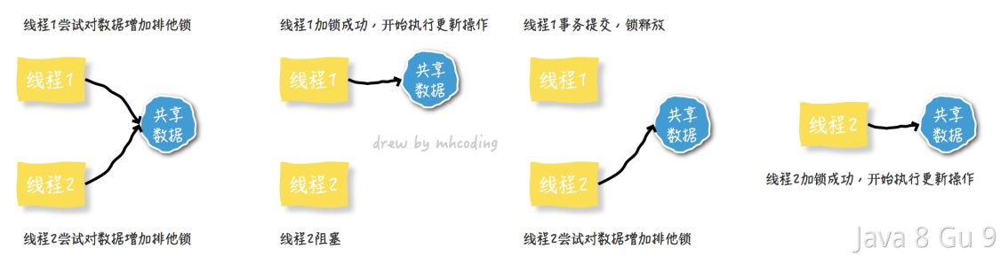
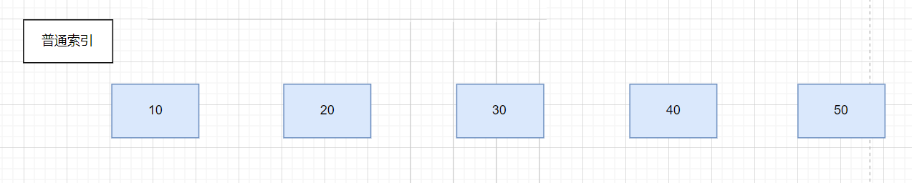
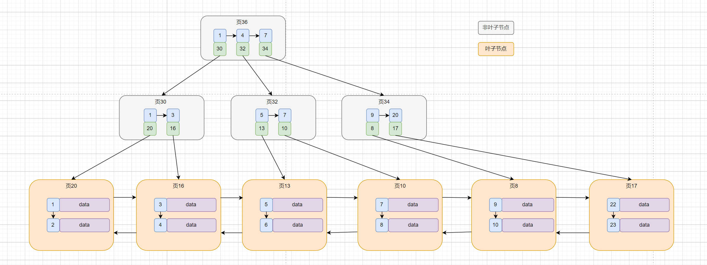
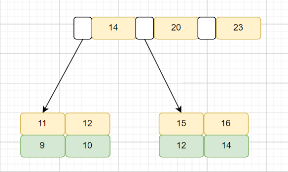
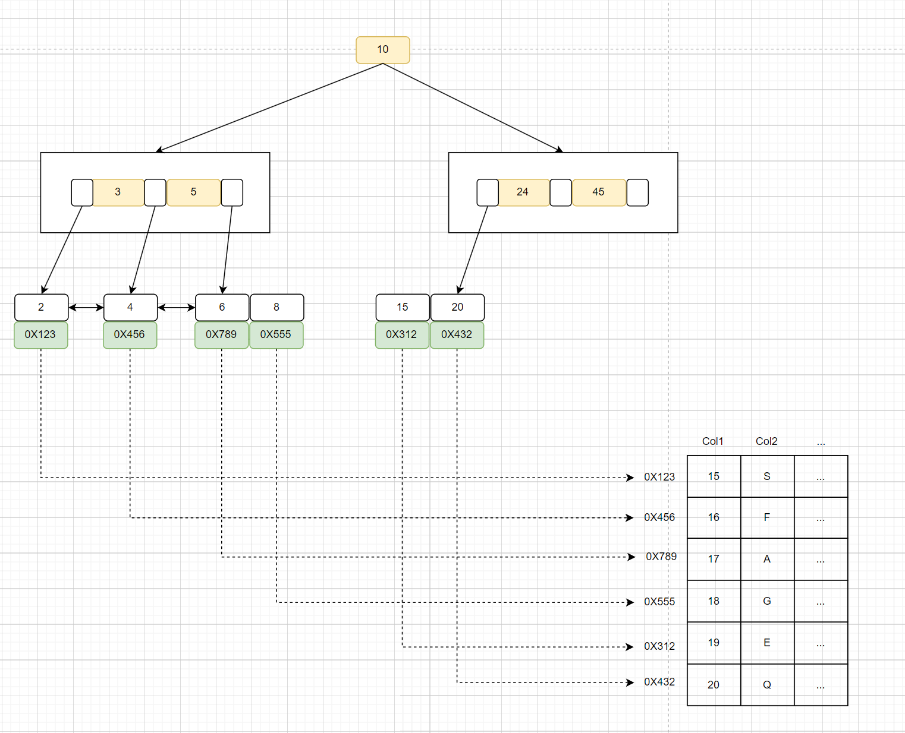
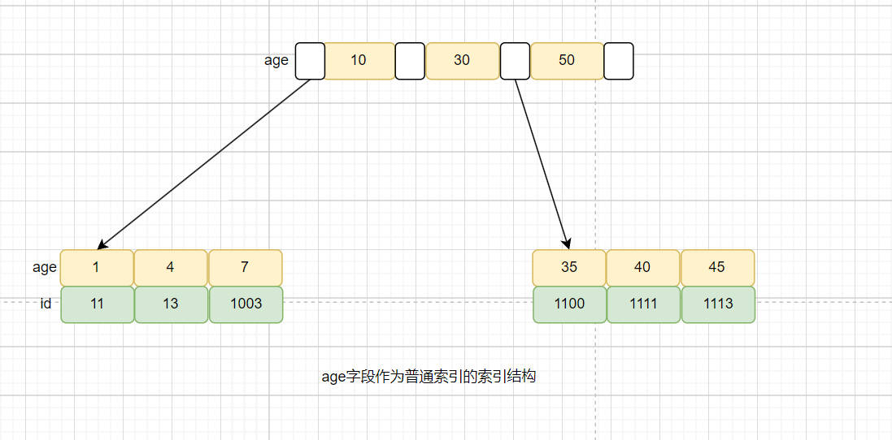
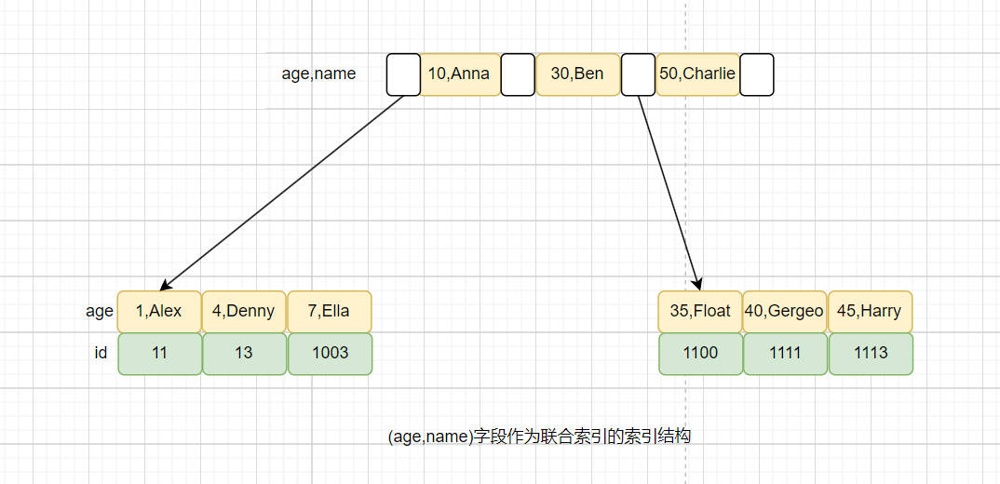

```yaml
title: MySQL数据库-2
category: 数据库
tag:
  - MySQL
```

## InnoDB的锁机制

锁是MySQL中并发控制的重要手段，InnoDB作为一种最常用的执行引擎，他支持很多种锁的类型。InnoDB中的锁根据不同的分类方式也有很多种分法。主要由以下这些：

按操作划分，可分为DML锁、DDL锁

按锁的粒度划分，可分为表级锁、行级锁、页级锁

按锁的级别划分，可分为共享锁、排他锁

按加锁方式划分，可分为自动锁、显示锁

按使用方式划分，可分为乐观锁、悲观锁

按锁的对象划分，可分为记录锁、间隙锁、临键锁

### 操作划分

#### DDL锁&DML锁

DDL 是Data Definition Language的缩写，简单来说，就是对数据库内部的对象进行创建、删除、修改的操作语言，例如表、字段、聚簇、索引、视图、函数、存储过程和触发器等。DML是Data Manipulation Language的缩写，主要就是指我们常用的 Delete\Update\Insert等操作。

那么，DDL锁指的就是在DDL操作过程中加的锁，而DML锁指的就是在DML操作过程中加的锁了。

#### DDL锁

在MySQL 5.6 Online DDL推出以前，执行DDL主要有两种方式copy方式和inplace方式，DDL执行期间会全程锁表，无法同时进行DML，实用性很低。

MySQL 5.6 版本发布了Online DDL功能，就是在DDL执行期间，也可以同时进行表上的DML操作，并不会全程锁表，实用性加强了很多。

#### DML锁

在执行DML操作过程中，是否需要加锁，就要看具体执行的是什么样的语句了，并且根据实际情况，比如是否存在索引等会加不同的锁（行级锁、表级锁）。

而且，update、delete和insert语句都是需要添加锁的。

### 锁的粒度划分

#### 行级锁

行级锁是Mysql中锁定粒度最细的一种锁，表示只针对当前操作的行进行加锁。行级锁能大大减少数据库操作的冲突。其加锁粒度最小，但加锁的开销也最大。行级锁分为共享锁 和 排他锁。

他的特点是开销大，加锁慢；会出现死锁；优点是锁定粒度最小，发生锁冲突的概率最低，并发度也最高。

#### 表级锁

表级锁是MySQL中锁定粒度最大的一种锁，表示对当前操作的整张表加锁，它实现简单，资源消耗较少，被大部分MySQL引擎支持。最常使用的MYISAM与INNODB都支持表级锁定。

他的优点是开销小，加锁快；不会出现死锁；缺点是锁定粒度大，发出锁冲突的概率最高，并发度最低。

#### 页级锁

页级锁是MySQL中锁定粒度介于行级锁和表级锁中间的一种锁。表级锁速度快，但冲突多，行级冲突少，但速度慢。所以取了折衷的页级，一次锁定相邻的一组记录。BDB支持页级锁。

他的特点是开销和加锁时间界于表锁和行锁之间；会出现死锁；锁定粒度界于表锁和行锁之间，并发度一般。

### InnoDB中的行锁与表锁

InnoDB行锁是通过给索引上的索引项加锁来实现的，这一点MySQL与Oracle不同，后者是通过在数据块中对相应数据行加锁来实现的。InnoDB这种行锁实现特点意味着：只有通过索引条件检索数据，InnoDB才使用行级锁，否则，InnoDB将使用表锁！

在实际应用中，要特别注意InnoDB行锁的这一特性，不然的话，可能导致大量的锁冲突，从而影响并发性能。

- 在不通过索引条件查询的时候,InnoDB 确实使用的是表锁,而不是行锁。

- 由于 MySQL 的行锁是针对索引加的锁,不是针对记录加的锁,所以虽然是访问不同行 的记录,但是如果是使用相同的索引键,是会出现锁冲突的。应用设计的时候要注意这一点。（参考：https://www.yuque.com/hollis666/xx5hr2/yywypm ）

- 当表有多个索引的时候,不同的事务可以使用不同的索引锁定不同的行,另外,不论 是使用主键索引、唯一索引或普通索引,InnoDB 都会使用行锁来对数据加锁。

- 即便在条件中使用了索引字段,但是否使用索引来检索数据是由 MySQL 通过判断不同 执行计划的代价来决定的,如果 MySQL 认为全表扫 效率更高,比如对一些很小的表,它 就不会使用索引,这种情况下 InnoDB 将使用表锁,而不是行锁。因此,在分析锁冲突时, 别忘了检查 SQL 的执行计划,以确认是否真正使用了索引。

### 锁的级别划分

#### 共享锁

共享锁又称读锁，是读取操作创建的锁。其他用户可以并发读取数据，但任何事务都不能对数据进行修改（获取数据上的排他锁），直到已释放所有共享锁。

如果事务T对数据A加上共享锁后，则其他事务只能对A再加共享锁，不能加排他锁。获得共享锁的事务只能读数据，不能修改数据。

```sql
SELECT ... LOCK IN SHARE MODE;
```

在查询语句后面增加LOCK IN SHARE MODE，MySQL会对查询结果中的每行都加共享锁，当没有其他线程对查询结果集中的任何一行使用排他锁时，可以成功申请共享锁，否则会被阻塞。其他线程也可以读取使用了共享锁的表，而且这些线程读取的是同一个版本的数据。

#### 排他锁

排他锁又称写锁，如果事务T对数据A加上排他锁后，则其他事务不能再对A加任任何类型的锁。获得排他锁的事务既能读数据，又能修改数据。

```sql
SELECT ... FOR UPDATE;
```

在查询语句后面增加FOR UPDATE，MySQL会对查询命中的每条记录都加排他锁（在有索引的情况下其实是通过索引加锁，无索引时会锁表），当没有其他线程对查询结果集中的任何一行使用排他锁时，可以成功申请排他锁，否则会被阻塞。

### 使用方式划分

#### 悲观锁

当我们要对一个数据库中的一条数据进行修改的时候，为了避免同时被其他人修改，最好的办法就是直接对该数据进行加锁以防止并发。

这种借助数据库锁机制在修改数据之前先锁定，再修改的方式被称之为悲观并发控制（又名“悲观锁”，Pessimistic Concurrency Control，缩写“PCC”）。

之所以叫做悲观锁，是因为这是一种对数据的修改抱有悲观态度的并发控制方式。我们一般认为数据被并发修改的概率比较大，所以需要在修改之前先加锁。

悲观并发控制实际上是“先取锁再访问”的保守策略，为数据处理的安全提供了保证。



但是在效率方面，处理加锁的机制会让数据库产生额外的开销，还有增加产生死锁的机会；另外，还会降低并行性，一个事务如果锁定了某行数据，其他事务就必须等待该事务处理完才可以处理那行数据。

我们举一个简单的例子，如淘宝下单过程中扣减库存的需求说明一下如何使用悲观锁：

```sql
//0.开始事务
begin; 
//1.查询出商品信息
select quantity from items where id=1 for update;
//2.修改商品quantity为2
update items set quantity=2 where id = 1;
//3.提交事务
commit;
```

以上，在对id = 1的记录修改前，先通过for update的方式进行加锁，然后再进行修改。这就是比较典型的悲观锁策略。

如果以上修改库存的代码发生并发，同一时间只有一个线程可以开启事务并获得id=1的锁，其它的事务必须等本次事务提交之后才能执行。这样我们可以保证当前的数据不会被其它事务修改。

> 上面我们提到，使用select…for update会把数据给锁住，不过我们需要注意一些锁的级别，MySQL InnoDB默认行级锁。行级锁都是基于索引的，如果一条SQL语句用不到索引是不会使用行级锁的，会使用表级锁把整张表锁住，这点需要注意。

#### 乐观锁

乐观锁（ Optimistic Locking ） 是相对悲观锁而言的，乐观锁假设数据一般情况下不会造成冲突，所以在数据进行提交更新的时候，才会正式对数据的冲突与否进行检测，如果发现冲突了，则让返回用户错误的信息，让用户决定如何去做。

相对于悲观锁，在对数据库进行处理的时候，乐观锁并不会使用数据库提供的锁机制。一般的实现乐观锁的方式就是记录数据版本。


乐观并发控制相信事务之间的数据竞争(data race)的概率是比较小的，因此尽可能直接做下去，直到提交的时候才去锁定，所以不会产生任何锁和死锁。

前面的扣减库存问题，通过乐观锁可以实现如下：

```sql
//查询出商品信息，quantity = 3
select quantity from items where id=1
//根据商品信息生成订单
//修改商品quantity为2
update items set quantity=2 where id=1 and quantity = 3;
```

以上，我们在更新之前，先查询一下库存表中当前库存数（quantity），然后在做update的时候，以库存数作为一个修改条件。当我们提交更新的时候，判断数据库表对应记录的当前库存数与第一次取出来的库存数进行比对，如果数据库表当前库存数与第一次取出来的库存数相等，则予以更新，否则认为是过期数据。

#### 如何选择

在乐观锁与悲观锁的选择上面，主要看下两者的区别以及适用场景就可以了。

1. 乐观锁并未真正加锁，效率高。一旦锁的粒度掌握不好，更新失败的概率就会比较高，容易发生业务失败。

2. 悲观锁依赖数据库锁，效率低。更新失败的概率比较低。

随着互联网三高架构（高并发、高性能、高可用）的提出，悲观锁已经越来越少的被使用到生产环境中了，尤其是并发量比较大的业务场景。

### 锁的对象划分

#### Record Lock

Record Lock，翻译成记录锁，是加在索引记录上的锁。例如，SELECT c1 FROM t WHERE c1 = 10 For UPDATE;会对c1=10这条记录加锁，为了防止任何其他事务插入、更新或删除c1值为10的行。

需要特别注意的是，记录锁锁定的是索引记录。即使表没有定义索引，InnoDB也会创建一个隐藏的聚集索引，并使用这个索引来锁定记录。


#### Gap Lock

Gap Lock，翻译成间隙锁，他指的是在索引记录之间的间隙上的锁，或者在第一个索引记录之前或最后一个索引记录之后的间隙上的锁。

那么，这里所谓的Gap（间隙）又怎么理解呢？

Gap指的是InnoDB的索引数据结构中可以插入新值的位置。

当你用语句SELECT…FOR UPDATE锁定一组行时。InnoDB可以创建锁，应用于索引中的实际值以及他们之间的间隙。例如，如果选择所有大于10的值进行更新，间隙锁将阻止另一个事务插入大于10的新值。


既然是锁，那么就可能会影响到数据库的并发性，所以，间隙锁只有在Repeatable Reads这种隔离级别中才会起作用。

在Repeatable Reads这种隔离下，对于锁定的读操作（select ... for update 、 lock in share mode)、update操作、delete操作时，会进行如下的加锁：

- 对于具有唯一搜索条件的唯一索引，InnoDB只锁定找到的索引记录，而不会锁定间隙。

- 对于其他搜索条件，InnoDB锁定扫描的索引范围，使用gap lock或next-key lock来阻塞其他事务插入范围覆盖的间隙。

也就是说，对于SELECT FOR UPDATE、LOCK IN SHARE MODE、UPDATE和DELETE等语句处理时，除了对唯一索引的唯一搜索外都会获取gap锁或next-key锁，即锁住其扫描的范围。

#### Next-Key Lock

Next-Key锁是索引记录上的记录锁和索引记录之前间隙上的间隙锁的组合。


假设一个索引包含值10、11、13和20。此索引可能的next-key锁包括以下区间:

```
(-∞, 10]
(10, 11]
(11, 13]
(13, 20]
(20, ∞ ]
```

对于最后一个间隙，∞不是一个真正的索引记录，因此，实际上，这个next-key锁只锁定最大索引值之后的间隙。

所以，Next-Key 的锁的范围都是左开右闭的。

Next-Key Lock和Gap Lock一样，只有在InnoDB的RR隔离级别中才会生效。

#### MySQL的加锁原则

前面介绍过了Record Lock、Gap Lock和Next-Key Lock，但是并没有说明加锁规则。关于加锁规则，我是看了丁奇大佬的《MySQL实战45讲》中的文章之后理解的，他总结的加锁规则里面，包含了两个“原则”、两个“优化”和一个“bug”：

原则 1：加锁的基本单位是 next-key lock。是一个前开后闭区间。

原则 2：查找过程中访问到的对象才会加锁。

优化 1：索引上的等值查询，给唯一索引加锁的时候，next-key lock 退化为行锁。

优化 2：索引上的等值查询，向右遍历时且最后一个值不满足等值条件的时候，next-key lock 退化为间隙锁。

一个 bug：唯一索引上的范围查询会访问到不满足条件的第一个值为止。

假如，数据库表中当前有以下记录：


当我们执行update t set d=d+1 where id = 7的时候，由于表 t 中没有 id=7 的记录，所以：

- 根据原则 1，加锁单位是 next-key lock，session A 加锁范围就是 (5,10]；

- 根据优化 2，这是一个等值查询 (id=7)，而 id=10 不满足查询条件，next-key lock 退化成间隙锁，因此最终加锁的范围是 (5,10)。

当我们执行select * from t where id>=10 and id<11 for update的时候：

- 根据原则 1，加锁单位是 next-key lock，会给 (5,10]加上 next-key lock，范围查找就往后继续找，找到 id=15 这一行停下来

- 根据优化 1，主键 id 上的等值条件，退化成行锁，只加了 id=10 这一行的行锁。

- 根据原则 2，访问到的都要加锁，因此需要加 next-key lock(10,15]。因此最终加的是行锁 id=10 和 next-key lock(10,15]。

当我们执行select * from t where id>10 and id<=15 for update的时候： 根据原则 1，加锁单位是 next-key lock，会给 (10,15]加上 next-key lock，并且因为 id 是唯一键，所以循环判断到 id=15 这一行就应该停止了。 但是，InnoDB 会往前扫描到第一个不满足条件的行为止，也就是 id=20。而且由于这是个范围扫描，因此索引 id 上的 (15,20]这个 next-key lock 也会被锁上。

假如，数据库表中当前有以下记录：



当我们执行select id from t where c=5 lock in share mode的时候：

- 根据原则 1，加锁单位是 next-key lock，因此会给 (0,5]加上 next-key lock。要注意 c 是普通索引，因此仅访问 c=5 这一条记录是不能马上停下来的，需要向右遍历，查到 c=10 才放弃。

- 根据原则 2，访问到的都要加锁，因此要给 (5,10]加 next-key lock。

- 根据优化 2：等值判断，向右遍历，最后一个值不满足 c=5 这个等值条件，因此退化成间隙锁 (5,10)。

- 根据原则 2 ，只有访问到的对象才会加锁，这个查询使用覆盖索引，并不需要访问主键索引，所以主键索引上没有加任何锁。

当我们执行select * from t where c>=10 and c<11 for update的时候：

- 根据原则 1，加锁单位是 next-key lock，会给 (5,10]加上 next-key lock，范围查找就往后继续找，找到 id=15 这一行停下来。

- 根据原则 2，访问到的都要加锁，因此需要加 next-key lock(10,15]。

- 由于索引 c 是非唯一索引，没有优化规则，也就是说不会蜕变为行锁，因此最终 sesion A 加的锁是，索引 c 上的 (5,10] 和 (10,15] 这两个 next-key lock。

#### 总结

以上，我们介绍了InnoDB中的锁机制，一共有三种锁，分别是Record Lock、Gap Lock和Next-Key Lock。

Record Lock表示记录锁，锁的是索引记录。 Gap Lock是间隙锁，说的是索引记录之间的间隙。 Next-Key Lock是Record Lock和Gap Lock的组合，同时锁索引记录和间隙。他的范围是左开右闭的。

InnoDB的RR级别中，加锁的基本单位是 next-key lock，只要扫描到的数据都会加锁。唯一索引上的范围查询会访问到不满足条件的第一个值为止。

同时，为了提升性能和并发度，也有两个优化点：

- 索引上的等值查询，给唯一索引加锁的时候，next-key lock 退化为行锁。

- 索引上的等值查询，向右遍历时且最后一个值不满足等值条件的时候，next-key lock 退化为间隙锁。

RR的隔离级别引入的这些锁，虽然一定程度上可解决很多如幻读这样的问题，但是也会带来一些副作用，比如并发度降低、容易导致死锁等。

## 数据库乐观锁的过程中，完全没有加任何锁吗？

使用乐观锁在对数据库进行处理的时候，乐观锁并不会使用数据库提供的锁机制。一般的实现乐观锁的方式就是记录数据版本。

这是我们前面的文章中提到的一句话，但是，如果你认为乐观锁的这个过程中完全没有任何锁的参与的话那就大错特错了。

因为虽然在使用乐观锁的时候，我们没有显示的加锁，也没有用到对他的相关锁机制。但是乐观锁是使用updata语句过程中实现的，update的过程是有锁的。

数据库在更新时，会根据where条件中是否包含索引考虑加锁范围，如果有索引，那么就使用索引添加行级锁（可能还有gap 或者 next key），如果没有索引 ，那么就会添加表级锁。

所以，乐观锁的过程中，并不是完全无锁的。

那么，乐观锁既然也有锁，那么他相比悲观锁意义在哪里呢？

乐观锁最大的好处就是通过CAS的方式做并发校验，这个过程不需要提前加锁，只需要在更新的那一刻加一个短暂的锁而已，而悲观锁的话，需要你先select for update，锁的时长要长得多。

## 什么是意向锁？

MySQL的Innodb引擎中，支持多种锁级别，包括了行级锁和表级锁。当多个事务想要访问一个共享资源的时候，如果每个事务都直接请求获取锁，那么就可能会导致互相阻塞，甚至导致死锁。

举个例子：

> 事务A对表Table1中的一行加上了行级锁，这时候这行记录就只能读不能写了。事务B申请对Table1增加了表级锁，如果他申请成功了，那么他就可以修改表中的任意一行记录。这就发生了冲突。
> 
> 那么，想要解决这个问题，就需要让事务B在对Table1增加表级锁的时候，先判断一下是不是有事务增加过行级锁。但是，事务B总不能遍历表中数据逐条判断是否有加锁吧？

所以，为了解决这个问题，MySQL引入了意向锁机制。当一个事务请求获取一个行级锁或表级锁时，MySQL会自动获取相应的表的意向锁。

这样，其他事务请求获取锁时，就可以先基于这个意向锁来发现是否有人加过锁，并根据该锁的类型来判断自己是否可以获取锁。这样可以在不阻塞其他事务的情况下，为当前事务锁定资源。

意向锁有两种类型：意向共享锁和意向排他锁。意向共享锁用于表明事务希望获取一个共享锁（读锁），而意向排他锁用于表明事务希望获取一个排他锁（写锁）。

意向锁是一个表级锁，并且他会在触发意向锁的事务提交或者回滚后释放。

## Innodb加索引，这个时候会锁表吗？

在 MySQL 5.6 之前，InnoDB 索引构建期间会对表进行排它锁定，这意味着在索引构建期间，其他会话不能读取或修改表中的任何数据。这将导致长时间阻塞和性能问题。

自 MySQL 5.6 开始，InnoDB 使用一种称为“Online DDL”的技术，允许在不阻塞其他会话的情况下创建或删除索引。Online DDL 针对不同的操作，有多种实现方式，包括COPY，INSTANT以及INPLACE。

因为DDL有很多种操作，比如创建索引、增加字段、增加外键等，所以不同的操作支持的类型也不一样，具体支持方式可以在mysql官方可以看到（https://dev.mysql.com/doc/refman/5.7/en/innodb-online-ddl-operations.html ），拿索引创建举例：因为DDL有很多种操作，比如创建索引、增加字段、增加外键等，所以不同的操作支持的类型也不一样，具体支持方式可以在mysql官方可以看到（[MySQL :: MySQL 5.7 Reference Manual :: 14.13.1 Online DDL Operations](https://dev.mysql.com/doc/refman/5.7/en/innodb-online-ddl-operations.html) ），拿索引创建举例：


从上表中可以看到，当我们创建、删除或者重命名一个索引的时候，是会用到in place的模式。

需要注意的是，虽然Online DDL 可以减少锁定时间和对性能的影响，但在索引构建期间仍然可能出现锁定和阻塞。例如，在添加索引时，如果表中有许多未提交的事务，则需要等待这些事务提交后才能开始索引构建。因此，建议在非高峰期进行此类操作，以避免影响用户的正常使用。在进行任何DDL操作之前，最好进行充分的测试和规划，并且确保有备份和回滚计划，以防意外情况的发生。

### 什么是OnlineDDL

在MySQL 5.6中引入了Online DDL，OnLineDDL是MySQL5.6提出的加速DDL方案，尽最大可能保证DDL期间不阻塞DML动作。但是需要注意，这里说的尽最大可能意味着不是所有DDL语句都会使用OnlineDDL加速。

Online DDL的优点就是可以减少阻塞，是MySQL的一种内置优化手段，但是需要注意的是，DDL在刚开始和快结束的时候，都需要获取MDL锁，而在获取锁的时候如果有事务未提交，那么DDL就会因为加锁失败而进入阻塞状态，也会造成性能影响。

还有就是，如果Online DDL操作失败，其回滚操作可能成本较高。以及长时间运行的Online DDL操作可能导致主从同步滞后。

### DDL算法

在MySQL 5.6支持Online DDL之前，有两种DDL的算法，分别是COPY和INPLACE。

我们可以使用如下SQL指定DDL算法：

```sql
ALTER TABLE hollis_ddl_test ADD PRIMARY KEY (id) ,ALGORITHM=INPLACE,LOCK=NONE
```

#### COPY算法原理

1. 新建一张临时表

2. 对原表加共享MDL锁，禁止原表的写，只允许查询操作

3. 逐行拷贝原表数据到临时表，且不进行排序

4. 拷贝完成后升级原表锁为排他MDL锁，禁止原表读写

5. 对临时表rename操作，创建索引，完成DDL操作

##### 什么是MySQL的字典锁？

字典锁，英文名叫做MetaData Lock，也叫做MDL锁，它是一种用于管理元数据的锁机制，而不是数据本身的锁。

MDL锁用于控制对数据库对象的元数据的并发访问，数据库会在执行DDL（Data Defination Language）操作时加上字典锁。字典锁的主要目的是保护数据库中的元数据对象，如表、列、索引、视图等，以确保在DDL操作期间，不会出现数据一致性问题和竞争条件。

以下是触发数据库加字典锁的一些情况：

- 创建/修改/删除表结构：当执行CREATE TABLE、ALTER TABLE、DROP TABLE等DDL语句时，数据库会对相关的表和表的元数据对象加上字典锁，以阻止其他事务同时修改这些表的结构。

- 创建/修改/删除索引：执行CREATE INDEX、ALTER TABLE 添加索引、修改、删除索引等DDL操作时，会锁定与索引相关的元数据，以确保索引的一致性。

- 修改列定义：如果执行ALTER TABLE来修改表的列定义，例如改变数据类型、添加、删除、重命名列等，相关的列和表的元数据会被锁定。

- 创建/修改/删除视图：当执行CREATE VIEW、ALTER VIEW、DROP VIEW等DDL操作以创建或修改视图时，相关视图的元数据会被锁定。

- 其他DDL操作：其他的DDL操作，如创建、修改、删除存储过程、触发器、事件等也可能涉及到元数据的锁定。

##### 字典锁升级

在数据库中，通常有两种主要的锁级别，即共享锁和排他锁，而字典锁也有两种级别，即：

- 共享字典锁（SHARED-MDL ）：这允许多个事务同时读取元数据对象，但不允许任何事务修改它们。共享字典锁通常用于保护元数据的读取操作，以确保在读取元数据时不会被其他事务修改。

- 排他字典锁（EXCLUSIVE-MDL ）：排他字典锁是最高级别的字典锁，它阻止其他事务同时读取或修改元数据对象。只有一个事务可以持有排他字典锁，通常用于保护元数据的写操作，以确保数据的完整性。

而在字典锁的加锁过程中，会有升级的情况，当事务开始时，通常会以共享字典锁的方式访问元数据对象。这允许多个事务同时读取相同的元数据。

如果事务需要对元数据对象进行修改操作，例如修改表结构或索引，它需要将共享字典锁升级为排他字典锁，以阻止其他事务同时访问该元数据对象。

在数据库管理系统中，升级通常是自动执行的。当事务尝试修改元数据对象时，系统会检测到需要升级共享字典锁为排他字典锁，以确保数据的完整性。

#### INPLACE算法原理

INPLACE算法是MySQL 5.1中引入的，主要是为了优化索引的创建和删除过程的效率。INPLACE算法的原理是可能地使用原地算法进行DDL操作，而不是重新创建或复制表。

1. 创建索引数据字典，

2. 对原表加共享MDL锁，禁止原表的写，只允许查询操作

3. 根据聚集索引的顺序，查询表中的数据，并提取需要的索引列数据。将提取的索引数据进行排序，并插入到新的索引页中。

4. 等待当前表的所有只读事务提交。

5. 创建索引结束。

MySQL中的INPLACE其实还可以分为以下两种算法：

- inplace-no-rebuild ：对二级索引的增删改查、修改变长字段长度（如：varchar）、重命名列名都不需要重建原表

- inplace-rebuild：修改主键索引、增加删除列、修改字符集、创建全文索引等都需要重建原表。

#### OnlineDDL算法

前面说过，ALGORITHM可以指定的DDL操作的算法，目前主要支持以下几种：

- COPY算法

- INPLACE算法

- INSTANT算法：MySQL 8.0.12 引入的新算法，目前只支持添加列等少量操作，利用 8.0 新的表结构设计，可以直接修改表的元数据，省掉了重建原表的过程，极大的缩短了 DDL 语句的执行时间。其他类型的改表语句默认使用inplace算法。
  
  关于instant支持的场景可参考官方文档[Online DDL Operations](https://dev.mysql.com/doc/refman/8.0/en/innodb-online-ddl-operations.html)

- DEFAULT：如果不指定ALGORITHM，那么MySQL会自行选择默认算法，优先使用INSTANT、其次是INPLACE、再然后是COPY

#### OnlineDDL的整体步骤

以下是OnlineDDL的整体步骤，主要分为Prepare阶段、DDL执行阶段以及Commit阶段。

Prepare阶段：

1. 创建临时 frm 文件

2. 加EXCLUSIVE-MDL 锁，禁止读写

3. 根据alter类型，确定执行方式（copy/online-rebuild/online-norebuild）。这里需要注意如果使用copy算法，就不是OnLineDDL了。

4. 更新数据字典的内存对象

5. 分配row_log对象，记录OnlineDDL过程中增量的DML

6. 生成新的临时idb文件

Execute阶段：

1. 降级EXCLUSIVE-MDL锁为SHARED-MDL锁，允许读写。

2. 扫描原表聚集索引的每一条记录。

3. 遍历新表的聚集索引和二级索引，逐一处理。

4. 根据原表中的记录构造对应的索引项。

5. 将构造的索引项插入sort_buffer 块排序。

6. 将sort_buffer块更新到新表的索引上。

7. 记录 OnlineDDL 执行过程中产生的增量（oinline-rebuild）。

8. 重放row_log 中的操作到新表的索引上（online-not-rebuild 数据是在原表上更新）。

9. 重放row_log 中的 DML 操作到新表的数据行上。

Commit阶段：

1. 升级到 EXCLUSIVE-MDL 锁，禁止读写。

2. 重做 row_log 中最后一部分增量。

3. 更新 innodb 的数据字典表。

4. 提交事务，写redolog。

5. 修改统计信息。

6. rename 临时 ibd 文件，frm 文件。

7. 变更完成，释放 EXCLUSIVE-MDL 锁。

Prepare阶段和Commit阶段虽然也加了EXECLUSIVE-MDL锁，但操作非常轻，所以耗时较低。Execute阶段允许读写，通过row_log记录期间变更的数据记录，最后再应用row_log到新表中。最终实现OnlineDDL的效果。

## MySQL只操作同一条记录，也会发生死锁吗？

会。因为数据库的锁锁的是索引，并不是记录。

当我们在事务中，更新一条记录的时候，如果用到普通索引作为条件，那么会先获取普通索引的锁，然后再尝试获取主键索引的锁。

那么这个时候，如果刚好有一个线程，已经拿到了这条记录的主键索引的锁后，同时尝试在该事务中去拿该记录的普通索引的锁。

这时候就会发生死锁。

```sql
update my_table set name = 'hollis',age = 22 where name = "hollischuang";

这个SQL会先对name加锁， 然后再回表对id加锁。

-----

select * from my_table where id = 15 for update;

update my_table set age = 33 where name like "hollis%";

以上SQL，会先获取主键的锁，然后再获取name的锁。
```

为了避免这种死锁情况的发生，可以在应用程序中设置一个规定的索引获取顺序，例如，只能按照主键索引->普通索引的顺序获取锁，这样就可以避免不同的线程出现获取不同顺序锁的情况，进而避免死锁的发生。

## 什么是死锁，如何解决？

死锁是指两个或两个以上的进程（或线程）在执行过程中，由于竞争资源或者由于彼此通信而造成的一种阻塞的现象，若无外力作用，它们都将无法推进下去。此时称系统处于死锁状态或系统产生了死锁，这些永远在互相等待的进程称为死锁进程。

### 产生死锁的四个必要条件

1. 互斥条件：一个资源每次只能被一个进程使用。

2. 占有且等待：一个进程因请求资源而阻塞时，对已获得的资源保持不放。

3. 不可强行占有：进程已获得的资源，在末使用完之前，不能强行剥夺。

4. 循环等待条件：若干进程之间形成一种头尾相接的循环等待资源关系。

### 如何解除死锁

想好解除和预防死锁，就避免4个条件同时发生就行了，一般从以下几个方面入手

1. 破坏不可抢占：设置优先级，使优先级高的可以抢占资源

2. 破坏循环等待：保证多个进程（线程）的执行顺序相同即可避免循环等待。
   
   如执行顺序都是：A->B->C，那就可以避免循环等待。
   
   最常用的避免方法就是破坏循环等待，就是当我们有多个事务的时候，最好让这几个事务的执行顺序相同。
   如事务1：A->B->C ，事务2：C->D->A，这种情况就有可能导致死锁。 
   即事务1占有了A，等待C，而事务2占有了C在等待A。 
   所以，要避免死锁就把事务2改为：A -> D-> C。

## 数据库死锁如何解决？

数据库死锁问题是指在多个并发事务中，彼此之间出现了相互等待的情况，导致所有事务都无法继续执行，称为死锁。

```log
Error updating database. Cause: ERR-CODE: [TDDL-4614][ERR_EXECUTE_ON_MYSQL] 

Deadlock found when trying to get lock; 
```

数据库的死锁的发生通常由以下原因导致：

1. 资源竞争：多个事务试图同时访问相同的资源，如数据库表、行、页或锁。但是它们请求资源的顺序不同，导致互相等待。

2. 未释放资源：事务在使用完资源后未及时释放资源，导致其他事务无法获得所需的资源。这可能是由于程序中的错误或异常情况引起的。

3. 不同事务的执行速度不同：如果一个事务在获取资源后执行速度很慢，而其他事务需要等待该事务释放资源，那么可能会导致其他事务超时，从而发生死锁。

4. 操作的数据量过大：在持有锁的同时，又请求获取更多的锁，导致互相等待。

解决（避免）死锁的方法有：

1. 减少锁的数量：比如使用RC来代替RR来避免因为gap锁和next-key锁而带来的死锁情况。

2. 减少锁的时长：加快事务的执行速度，降低执行时间，也能减少死锁发生的概率。

3. 固定顺序访问数据：事务在访问同一张表时，应该以相同的顺序获取锁，这样可以避免死锁的发生。

4. 减少操作的数据量：尽量减少事务操作的数据量，尽量减少事务的持有时间，这样可以降低死锁的发生几率。

## InnoDB中的索引类型？

InnoDB存储引擎支持两种常见的索引数据结构：B+树索引、Hash索引，其中B+树索引是目前关系型数据库系统中最常见、最有效的索引。

数据库中的B+树索引分为聚集索引和非聚集索引。聚集索引就是按照每张表的主键构造一个B+树，B+树的叶子节点中记录着表中一行记录的所有值。只要找到这个叶子节点也就得到了这条记录的所有值。非聚簇索引的叶节点中不包含行记录的所有值。只包含索引值和主键的值。

根据索引的唯一性，又可以把索引分为唯一索引和普通索引。唯一索引要求索引的列值必须唯一，不能重复。

另外，在MySQL 5.6中还增加了全文索引，5.7版本之后通过使用ngram插件开始支持中文。

## InnoDB为什么使用B+树实现索引？

首先看看B+树有哪些特点：

1. B+树是一棵平衡树，每个叶子节点到根节点的路径长度相同，查找效率较高；

2. B+树的所有关键字都在叶子节点上，因此范围查询时只需要遍历一遍叶子节点即可；

3. B+树的叶子节点都按照关键字大小顺序存放，因此可以快速地支持按照关键字大小进行排序；

4. B+树的非叶子节点不存储实际数据，因此可以存储更多的索引数据；

5. B+树的非叶子节点使用指针连接子节点，因此可以快速地支持范围查询和倒序查询。

6. B+树的叶子节点之间通过双向链表链接，方便进行范围查询。



那么，使用B+树实现索引，就有以下几个优点：

1. 支持范围查询，B+树在进行范围查找时，只需要从根节点一直遍历到叶子节点，因为数据都存储在叶子节点上，而且叶子节点之间有双向指针连接，可以很方便地进行范围查找。

2. 支持排序，B+树的叶子节点按照关键字顺序存储，可以快速支持排序操作，提高排序效率；

3. 存储更多的索引数据，因为它的非叶子节点只存储索引关键字，不存储实际数据，因此可以存储更多的索引数据；

4. 在节点分裂和合并时，IO操作少。B+树的叶子节点的大小是固定的，而且节点的大小一般都会设置为一页的大小，这就使得节点分裂和合并时，IO操作很少，只需读取和写入一页。

5. 有利于磁盘预读。由于B+树的非节点大小是固定的，因此可以很好地利用磁盘预读特性，一次性读取多个节点到内存中，这样可以减少IO操作次数，提高查询效率。

6. 有利于缓存。B+树的非叶子节点只存储指向子节点的指针，而不存储数据，这样可以使得缓存能够容纳更多的索引数据，从而提高缓存的命中率，加快查询速度。

### 为什么不用红黑树或者B树？

因为B+树的特点是只有叶子节点存储数据，而非叶子节点不存储数据，并且节点大小固定，还有就是叶子结点之间通过双向链表链接的，所以，使用B+树实现索引有很多好处，比如我们前面提到的支持范围查询、有利于磁盘预读、有利于优化排序等等。而这些是红黑树和B树做不到的。

### B+树索引和Hash索引有什么区别？

B+ 树索引和哈希索引是常见的数据库索引结构，它们有以下几个主要区别：

- B+ 树索引将索引列的值按照大小排序后存储，因此B+ 树索引适合于范围查找和排序操作；而哈希索引是将索引列的值通过哈希函数计算后得到一个桶的编号，然后将桶内的记录保存在一个链表或者树结构中。因此，哈希索引适合于等值查询，但不适合范围查询和排序操作。

- B+ 树索引在插入和删除数据时需要调整索引结构，这个过程可能会涉及到页分裂和页合并等操作，因此B+ 树索引的维护成本比较高；而哈希索引在插入和删除数据时只需要计算哈希值并插入或删除链表中的记录，因此哈希索引的维护成本相对较低。

- B+ 树索引在磁盘上是有序存储的，因此在进行区间查询时可以利用磁盘预读的优势提高查询效率；而哈希索引在磁盘上是无序存储的，因此在进行区间查询时可能会需要随机访问磁盘，导致查询效率降低。

- B+ 树索引在节点中存储多个键值对，因此可以充分利用磁盘块的空间，提高空间利用率；而哈希索引由于需要存储哈希值和指针，因此空间利用率相对较低。

## 什么是聚簇索引和非聚簇索引？

聚簇索引（Clustered Index）和非聚簇索引（Non-clustered Index）是数据库中的两种索引类型，它们在组织和存储数据时有不同的方式。

聚簇索引，简单点理解就是将数据与索引放到了一起，找到索引也就找到了数据。也就是说，对于聚簇索引来说，他的非叶子节点上存储的是索引字段的值，而他的叶子节点上存储的是这条记录的整行数据。


在InnoDB中，聚簇索引（Clustered Index）指的是按照每张表的主键构建的一种索引方式，它是将表数据按照主键的顺序存储在磁盘上的一种方式。这种索引方式保证了行的物理存储顺序与主键的逻辑顺序相同，因此查找聚簇索引的速度非常快。

非聚簇索引，就是将数据与索引分开存储，叶子节点包含索引字段值及指向数据页数据行的逻辑指针。



在Innodb中，非聚簇索引（Non-clustered Index）是指根据非主键字段创建的索引，也就是通常所说的二级索引。它不影响表中数据的物理存储顺序，而是单独创建一张索引表，用于存储索引列和对应行的指针。

在InnoDB中，主键索引就是聚簇索引，而非主键索引，就是非聚簇索引，所以在InnoDB中：

- 对于聚簇索引来说，他的非叶子节点上存储的是索引值，而它的叶子节点上存储的是整行记录。

- 对于非聚簇索引来说，他的非叶子节点上存储的都是索引值，而它的叶子节点上存储的是主键的值。

所以，通过非聚簇索引的查询，需要进行一次回表，就是先查到主键ID，在通过ID查询所需字段。

### 没有创建主键怎么办？

我们知道，Innodb中的聚簇索引是按照每张表的主键构造一个B+树，那么不知道大家有没有想过这个问题，如果我们在表结构中没有定义主键，那怎么办呢？

其实，数据库中的每行记录中，除了保存了我们自己定义的一些字段以外，还有一些重要的 db_row_id字段，其实他就是一个数据库帮我添加的隐藏主键，如果我们没有给这个表创建主键，会选择一个不为空的唯一索引来作为聚簇索引，但是如果没有合适的唯一索引，那么会以这个隐藏主键来创建聚簇索引。

## MyISAM 的索引结构是怎么样的，它存在的问题是什么？

和InnoDB最大的不同，MyISAM是采用了一种索引和数据分离的存储方式，也就是说，MyISAM中索引文件和数据文件是独立的。



因为文件独立，所以在MyISAM的索引树中，叶子节点上存储的并不是数据，而是数据所在的地址。所以，MyISAM 存储引擎实际上不支持聚簇索引的概念。在 MyISAM 中，所有索引都是非聚簇索引。

也就是说，在MyISAM中，根据索引查询的过程中，必然需要先查到数据所在的地址，然后再查询真正的数据，那么就需要有两次查询的过程。而在InnoDB中，如果基于聚簇索引查询，则不需要回表，因为叶子节点上就已经包含数据的内容了。

因为MyISAM是先出的，正是因为存在这个问题，所以后来的InnoDB 引入了聚簇索引的概念提高了数据检索的效率，特别是对于主键检索。

## 什么是回表，怎么减少回表的次数？

在 InnoDB 里，索引B+ Tree的叶子节点存储了整行数据的是主键索引，也被称之为聚簇索引。而索引B+ Tree的叶子节点存储了主键的值的是非主键索引，也被称之为非聚簇索引。

那么，当我们根据非聚簇索引查询的时候，会先通过非聚簇索引查到主键的值，之后，还需要再通过主键的值再进行一次查询才能得到我们要查询的数据。而这个过程就叫做回表。

所以，在InnoDB 中，使用主键查询的时候，是效率更高的， 因为这个过程不需要回表。另外，依赖覆盖索引、索引下推等技术，我们也可以通过优化索引结构以及SQL语句减少回表的次数。

### 覆盖索引

覆盖索引（covering index）指一个查询语句的执行只用从索引中就能够取得，不必从数据表中读取。也可以称之为实现了索引覆盖。

当一条查询语句符合覆盖索引条件时，MySQL只需要通过索引就可以返回查询所需要的数据，这样避免了查到索引后再返回表操作，减少I/O提高效率。

如，表covering_index_sample中有一个普通索引 idx_key1_key2(key1,key2)。

当我们通过SQL语句：

`select key2 from covering_index_sample where key1 = ‘keytest’;`

的时候，就可以通过覆盖索引查询，无需回表。

### 索引下推

索引下推是 MySQL 5.6引入了一种优化技术，默认开启，使用`SET optimizer_switch = ‘index_condition_pushdown=off’;`可以将其关闭。

官方文档中给的例子和解释如下： 

people表中（zipcode，lastname，firstname）构成一个索引
`SELECT * FROM people WHERE zipcode=’95054′ AND lastname LIKE ‘%etrunia%’ AND address LIKE ‘%Main Street%’;`

如果没有使用索引下推技术，则MySQL会通过zipcode=’95054’从存储引擎中查询对应的数据，返回到MySQL服务端，然后MySQL服务端基于lastname LIKE ‘%etrunia%’和address LIKE ‘%Main Street%’来判断数据是否符合条件。

如果使用了索引下推技术，则MYSQL首先会返回符合zipcode=’95054’的索引，然后根据lastname LIKE ‘%etrunia%’来判断索引是否符合条件。

如果符合条件，则根据该索引来定位对应的数据，如果不符合，则直接reject掉。 有了索引下推优化，可以在有like条件查询的情况下，减少回表次数。

当我们的SQL语句用到索引下推时，执行计划中的extra内容为：Using index condition 。所以，大家可以通过这个方式来判断是否有用到索引下推优化。

### 索引下推不止like

上面的例子中，提到了like，包括MySQL官网中也只提到了like，但是其实不止有like。因为我认为索引下推其实是解决索引失效带来的效率低的问题的一种手段。

所以当联合索引中，某个非前导列因为索引失效而要进行扫表并回表时，就可以进行索引下推优化了。

如，有a,b联合索引，类型都是varchar，以下SQL也可以用到索引下推：

`select d from t2 where a = "ni" and b = 1;`

因为b字段因为类型不匹配导致索引失效了，但是通过下推优化其实是可以减少回表的次数的。

## MySQL是如何保证唯一性索引的唯一性的？

MySQL 实现唯一索引的底层原理是基于 B+ 树索引结构。在实现唯一索引时，MySQL 会在 B+ 树上的每个节点上都添加一个指向唯一性索引值的指针（也称为“唯一性检查器”）。当在索引列上插入新值时，MySQL 会先使用 B+ 树查找该值是否存在。

如果该值已经存在，就会触发唯一性检查器，检查索引列中是否已经存在相同的值。如果唯一性检查器返回了错误，就会抛出唯一性约束冲突的异常，否则就可以插入新值。

在更新索引列时，MySQL 也会先使用 B+ 树查找目标记录，然后触发唯一性检查器，检查索引列中是否已经存在相同的值。如果新值和原值相同，就直接返回。如果新值和原值不同，就会检查新值是否已经存在。如果新值已经存在，就会抛出唯一性约束冲突的异常，否则就可以更新该记录。

### 唯一索引允许NULL值吗？

唯一索引在 MySQL 中可以允许 NULL 值的，但是这些NULL的表现是未知的，未知就是他们不相等，但是也不能说他们不等。

### 唯一性索引查询更快吗？

在数据库中，通过唯一性索引来创建唯一性约束，可以保证表中指定列的值唯一，避免数据重复和错误插入。

唯一性索引查询通常会比非唯一性索引查询更快，因为唯一性索引能够快速定位到唯一的记录，而非唯一性索引则需要扫描整个索引并匹配符合条件的记录。

在应用中，如果我们能够设计合适的唯一性索引，也可以有效地提升查询性能和数据质量。

### 唯一性索引有什么缺点吗？

没有银弹，所以一定有缺点。

首先，唯一性索引需要保证索引列的唯一性，因此在插入数据时需要检查是否存在相同的索引值，这会对插入性能产生一定的影响。

如果需要更新唯一性索引列的值，需要先删除旧记录，再插入新记录，这会对更新操作的成本产生影响。

## 设计索引的时候有哪些原则？

1. 考虑查询的频率和效率：在决定创建索引之前，需要分析查询频率和效率。对于频繁查询的列，可以创建索引来加速查询，但对于不经常查询或者数据量较少的列，可以不创建索引。

2. 选择适合的索引类型：MySQL提供了多种索引类型，如B+Tree索引、哈希索引和全文索引等。不同类型的索引适用于不同的查询操作，需要根据实际情况选择适合的索引类型。例如前缀索引仅限于字符串类型，较普通索引会占用更小的空间，所以可以考虑使用前缀索引带替普通索引。

3. 考虑区分度：尽量不要选择区分度不高的字段作为索引，比如性别。但是也并不绝对，对于一些数据倾斜比较严重的字段，虽然区分度不高，但是如果有索引，查询占比少的数据时效率也会提升。

4. 考虑联合索引：联合索引是将多个列组合在一起创建的索引。当多个列一起被频繁查询时，可以考虑创建联合索引。

5. 考虑索引覆盖：联合索引可以通过索引覆盖而避免回表查询，可以大大提升效率，对于频繁的查询，可以考虑将select后面的字段和where后面的条件放在一起创建联合索引。

6. 避免创建过多的索引：创建过多的索引会占用大量的磁盘空间，影响写入性能。并且在数据新增和删除时也需要对索引进行维护。所以在创建索引时，需要仔细考虑需要索引的列，避免创建过多的索引。

7. 避免使用过长的索引：索引列的长度越长，索引效率越低。在创建索引时，需要选择长度合适的列作为索引列。

8. 合适的索引长度：虽然索引不建议太长，但是也要合理设置，如果设置的太短，比如身份证号，但是只把前面6位作为索引，那么可能会导致大量锁冲突。

## 什么是最左前缀匹配？为什么要遵守？

### 什么是最左前缀匹配

在MySQL中，最左前缀匹配是指在查询中利用索引的最左边的一部分来进行匹配。指你执行查询时，如果查询条件涉及到了组合索引的前几个列，MySQL 就可以利用这个复合索引来进行匹配。

> 组合索引，指的就是有多个字段组成的一个联合索引，如 idx_col1_col2_col3 (col1,col2,col3))

假如我们创建了一个组合索引 (col1, col2, col3)，如果你的查询条件是针对 col1 、 (col1, col2)或者(col1, col2, col3)，那么MySQL可以利用这个复合索引进行最左前缀匹配。

但是，如果查询条件涉及到的列只有 col2 或者 只有col3或者只有col2和col3，总之就是如果不包含col1的话，那么是没有遵守最左前缀匹配，那么通常情况下（不考虑索引跳跃扫描等其他优化），就不能利用这个索引进行最左前缀匹配。

并且，需要注意的是，最左前缀匹配和查询条件的顺序没有关系，不管你写的是`where col1 = "Holiis" and col2 = "666"`还是`where col2 = "666" and col1 = "Holiis"`对结果都没有影响，该命中还是会命中。

但是，需要大家注意的是，很多人会以为创建一个组合索引 (col1, col2, col3)的时候，数据库会创建出三个索引 (col1)、 (col1, col2)和(col1, col2, col3)，这么理解其实是不对的，他创建的只是一棵B+树，只不过在这颗树中，他是先按照col1排序，在col1相同时再按照col2排序的，col2相同再按照col3排序。

### 为什么要遵循最左前缀匹配

我们都知道，MySQL的Innodb引擎中，索引是通过B+树来实现的。不管是普通索引还是联合索引，都需要构造一个B+树的索引结构。

那么，我们都知道普通索引的存储结构是在B+树的每个非叶子节点上记录索引的值，而这棵B+树的叶子节点上记录的是索引的值和聚簇索引（主键索引）的值的。



那么，如果是联合索引的话，这棵B+树又是如何存储的呢？

在联合索引中，联合索引(age,name)也是一个B+树，非叶子节点中记录的是name,age两个字段的值，叶子节点中记录的是name，age两个字段以及主键id的值。



在存储的过程中，如上图所示，当age不同时，按照age排序，当age相同时，则按照name排序。

所以，了解了索引的存储结构之后，我们就很容易理解最左前缀匹配了：因为索引底层是一个B+树，如果是联合索引的话，在构造B+树的时候，会先按照左边的key进行排序，左边的key相同时再依次按照右边的key排序。

所以，在通过索引查询的时候，也需要遵守最左前缀匹配的原则，也就是需要从联合索引的最左边开始进行匹配，这时候就要求查询语句的where条件中，包含最左边的索引的值。

## MySQL索引一定遵循最左前缀匹配吗？

因为索引底层是一个B+树，如果是联合索引的话，在构造B+树的时候，会先按照左边的key进行排序，左边的key相同时再依次按照右边的key排序。

所以，在通过索引查询的时候，也需要遵守最左前缀匹配的原则，也就是需要从联合索引的最左边开始进行匹配，这时候就要求查询语句的where条件中，包含最左边的索引的值。这也就是最左前缀匹配。

MySQL一定是遵循最左前缀匹配的，这句话在以前是正确的，没有任何毛病。但是在MySQL 8.0中，就不一定了。因为8.0.13中引入了索引跳跃扫描。

### 索引跳跃扫描

MySQL 8.0.13 版本中，对于range查询（什么是range后面会提到)，引入了索引跳跃扫描（Index Skip Scan）优化，支持不符合组合索引最左前缀原则条件下的SQL，依然能够使用组合索引，减少不必要的扫描。

通过一个例子给大家解释一下，首先有下面这样一张表（参考了MySQL官网的例子，但是我做了些改动和优化）：

```sql
CREATE TABLE t1 (f1 INT NOT NULL, f2 INT NOT NULL);
CREATE INDEX idx_t on t1(f1,f2);
INSERT INTO t1 VALUES
  (1,1), (1,2), (1,3), (1,4), (1,5),
  (2,1), (2,2), (2,3), (2,4), (2,5);
INSERT INTO t1 SELECT f1, f2 + 5 FROM t1;
INSERT INTO t1 SELECT f1, f2 + 10 FROM t1;
INSERT INTO t1 SELECT f1, f2 + 20 FROM t1;
INSERT INTO t1 SELECT f1, f2 + 40 FROM t1;
```

通过上面的SQL，先创建一张t1表，并把f1,f2两个字段设置为联合索引。之后再向其中插入一些记录。

分别在MySQL 5.7.9和MySQL 8.0.30上执行EXPLAIN SELECT f1, f2 FROM t1 WHERE f2 = 40;


可以看到，主要有以下几个区别：

> MySQL 5.7中，type = index，rows=160，extra=Using where;Using index
> 
> MySQL 8.0中，type = range，rows=16，extra=Using where;Using index for skip scan

这里面的type指的是扫描方式，range表示的是范围扫描，index表示的是索引树扫描，通常情况下，range要比index快得多。

从rows上也能看得出来，使用index的扫描方式共扫描了160行，而使用range的扫描方式只扫描了16行。

接着，重点来了，那就是为啥MySQL 8.0中的扫描方式可以更快呢？主要是因为Using index for skip scan 表示他用到了索引跳跃扫描的技术。

也就是说，虽然我们的SQL中，没有遵循最左前缀原则，只使用了f2作为查询条件，但是经过MySQL 8.0的优化以后，还是通过索引跳跃扫描的方式用到了索引了。

### 优化原理

在MySQL 8.0.13 及以后的版本中，`SELECT f1, f2 FROM t1 WHERE f2 = 40;`SQL执行过程如下：

1. 获取f1字段第一个唯一值，也就是f1=1

2. 构造f1=1 and f2 = 40，进行范围查询

3. 获取f1字段第二个唯一值，也就是f1=2

4. 构造f1=2 and f2 = 40，进行范围查询

5. 一直扫描完f1字段所有的唯一值，最后将结果合并返回

也就是说，最终执行的SQL语句是像下面这样的：

```sql
SELECT f1, f2 FROM t1 WHERE f1 =1 and f2 = 40
UNION
SELECT f1, f2 FROM t1 WHERE f1 =2 and f2 = 40;
```

即，MySQL的优化器帮我们把联合索引中的f1字段作为查询条件进行查询了。

### 限制条件

在知道了索引跳跃扫描的执行过程之后，很多聪明的读者其实就会发现，这种查询优化比较适合于f1的取值范围比较少，区分度高的情况，一旦f1的区分度不是特别高的话，这种查询可能会更慢。

所以，真正要不要走索引跳跃扫描，还是要经过MySQL的优化器进行成本预估之后做决定的。

所以，这种优化一般用于那种联合索引中第一个字段区分度不高的情况。但是话又说回来了，我们一般不太会把区分度不高的字段放在联合索引的左边，不过事无绝对，既然MySQL给了一个优化的方案，就说明还是有这样的诉求的。

但是，我们不能依赖他这个优化，建立索引的时候，还是优先把区分度高的，查询频繁的字段放到联合索引的左边。

除此之外，在MySQL官网中，还提到索引跳跃扫描还有一些其他的限制条件：

- 表T至少有一个联合索引，但是对于联合索引(A,B,C,D)来说，A和D可以是空的，但B和C必须是非空的。

- 查询必须只能依赖一张表，不能多表join

- 查询中不能使用GROUP BY或DISTINCT语句

- 查询的字段必须是索引中的列

## MySQL中like的模糊查询如何优化

在MySQL中，使用like进行模糊查询，在一定情况下是无法使用索引的。如下所示：

- 当like值前后都有匹配符时%abc%，无法使用索引

- 当like值前有匹配符时%abc，无法使用索引

- 当like值后有匹配符时'abc%'，可以使用索引

那么，前模糊真的无法优化了吗？

我们之所以会使用%abc来查询说明表中的name可能包含以abc结尾的字符串，如果以abc%说明有以abc开头的字符串。

假设我们要向表中的name写入123abc，我们可以将这一列反转过来，即cba321插入到一个冗余列v_name中，并为这一列建立索引：

```sql
ALTER TABLE `test` ADD COLUMN `v_name` VARCHAR(50) NOT NULL DEFAULT ''; //为test表新增v_name列
ALTER TABLE `test` ADD INDEX `idx_v_name`(`v_name`); //为v_name列添加索引
INSERT INTO `test`(`id`,`name`,`v_name`)VALUES(1,'123abc','cba321'); //这里不但要写name，也要写v_name
```

接下来在查询的时候，我们就可以使用v_name列进行模糊查询了

```sql
SELECT * FROM `test` WHERE `v_name` LIKE 'cba%'; //相当于反向查询匹配出了name=123abc的行
```

当然这样看起来有点麻烦，表中如果已经有了很多数据，还需要利用update语句反转name到v_name中，如果数据量大了（几百万或上千万条记录）更新一下v_name耗时也比较长，同时也会增大表空间。

```sql
UPDATE `test` SET `v_name` = REVERSE(`name`);
```

幸运的是在MySQL5.7.6之后，新增了虚拟列功能（如果不是>=5.7.6，只能用上面的土方法）。为一个列建立一个虚拟列，并为虚拟列建立索引，在查询时where中like条件改为虚拟列，就可以使用索引了。

```sql
ALTER TABLE `test` ADD COLUMN `v_name` VARCHAR(50) GENERATED ALWAYS AS (REVERSE(`name`)) VIRTUAL; //创建虚拟列
ALTER TABLE `test` ADD INDEX `idx_name_virt`(`v_name`); //为虚拟列v_name列添加索引
```

我们再进行查询，就会走索引了

```sql
EXPLAIN SELECT * FROM `test` WHERE `v_name` LIKE 'cba%';

+----+-------------+-------+------------+-------+---------------+---------------+---------+--------+------+----------+-------------+
| id | select_type | table | partitions | type  | possible_keys | key           | key_len | ref    | rows | filtered | Extra       |
+----+-------------+-------+------------+-------+---------------+---------------+---------+--------+------+----------+-------------+
| 1  | SIMPLE      | test  | <null>     | range | idx_name_virt | idx_name_virt | 153     | <null> | 200  | 100.0    | Using where |
+----+-------------+-------+------------+-------+---------------+---------------+---------+--------+------+----------+-------------+
```

当然如果你要查询like 'abc%'和like '%abc'，你只需要使用一个union

```sql
EXPLAIN SELECT * FROM `test` WHERE `v_name` LIKE 'cba%' //第一部分查询的是虚拟列
UNION SELECT * FROM `test` WHERE `name` LIKE 'abc%'; //第二部分查询的是原name列

+--------+--------------+------------+------------+-------+---------------+---------------+---------+--------+--------+----------+-----------------------+
| id     | select_type  | table      | partitions | type  | possible_keys | key           | key_len | ref    | rows   | filtered | Extra                 |
+--------+--------------+------------+------------+-------+---------------+---------------+---------+--------+--------+----------+-----------------------+
| 1      | PRIMARY      | test       | <null>     | range | idx_name_virt | idx_name_virt | 153     | <null> | 200    | 100.0    | Using where           |
| 2      | UNION        | test       | <null>     | range | idx_name      | idx_name      | 153     | <null> | 200    | 100.0    | Using index condition |
| <null> | UNION RESULT | <union1,2> | <null>     | ALL   | <null>        | <null>        | <null>  | <null> | <null> | <null>   | Using temporary       |
+--------+--------------+------------+------------+-------+---------------+---------------+---------+--------+--------+----------+-----------------------+
```

可以看到，除了union result合并俩个语句，另外俩个查询都已经走索引了。如果你只想需要查询name，甚至可以使用覆盖索引进一步提升性能

```sql
EXPLAIN SELECT REVERSE(`v_name`) `test` WHERE `v_name` LIKE 'cba%' //第一部分查询的是虚拟列,注意把v_name反转过来就拿到name的值了
UNION SELECT `name` FROM `test` WHERE `name` LIKE 'abc%'; //第二部分查询的是原name列

+--------+--------------+------------+------------+-------+---------------+---------------+---------+--------+--------+----------+--------------------------+
| id     | select_type  | table      | partitions | type  | possible_keys | key           | key_len | ref    | rows   | filtered | Extra                    |
+--------+--------------+------------+------------+-------+---------------+---------------+---------+--------+--------+----------+--------------------------+
| 1      | PRIMARY      | test       | <null>     | range | idx_name_virt | idx_name_virt | 153     | <null> | 200    | 100.0    | Using where; Using index |
| 2      | UNION        | test       | <null>     | range | idx_name      | idx_name      | 153     | <null> | 200    | 100.0    | Using where; Using index |
| <null> | UNION RESULT | <union1,2> | <null>     | ALL   | <null>        | <null>        | <null>  | <null> | <null> | <null>   | Using temporary          |
+--------+--------------+------------+------------+-------+---------------+---------------+---------+--------+--------+----------+--------------------------+
```

虚拟列可以指定为VIRTUAL或STORED，VIRTUAL不会将虚拟列存储到磁盘中，在使用时MySQL会现计算虚拟列的值，STORED会存储到磁盘中，相当于我们手动创建的冗余列。所以：如果你的磁盘足够大，可以使用STORED方式，这样在查询时速度会更快一些。

如果你的数据量级较大，不使用反向查询的方式耗时会非常高。你可以使用如下sql测试虚拟列的效果：

```sql
//建表
CREATE TABLE test (
  id INT AUTO_INCREMENT PRIMARY KEY,
  name VARCHAR(50),
  INDEX idx_name (name)
) CHARACTER SET utf8;

//创建一个存储过程，向test表中写入2000000条数据，200条数据中abc字符前包含一些随机字符（用于测试like '%abc'的情况），200条数据中abc字符后包含一些随机字符（用于测试like 'abc%'的情况），其余行不包含abc字符
DELIMITER //

CREATE PROCEDURE InsertTestData()
BEGIN
  DECLARE i INT DEFAULT 1;

  WHILE i <= 2000000 DO
    IF i <= 200 THEN
      SET @randomPrefix1 = CONCAT(CHAR(FLOOR(RAND() * 26) + 65), CHAR(FLOOR(RAND() * 26) + 97), CHAR(FLOOR(RAND() * 26) + 48));
      SET @randomString1 = CONCAT(CHAR(FLOOR(RAND() * 26) + 65), CHAR(FLOOR(RAND() * 26) + 97), CHAR(FLOOR(RAND() * 26) + 48));
      SET @randomName1 = CONCAT(@randomPrefix1, @randomString1, 'abc');
      INSERT INTO test (name) VALUES (@randomName1);
    ELSEIF i <= 400 THEN
      SET @randomString2 = CONCAT(CHAR(FLOOR(RAND() * 26) + 65), CHAR(FLOOR(RAND() * 26) + 97), CHAR(FLOOR(RAND() * 26) + 48));
      SET @randomName2 = CONCAT('abc', @randomString2);
      INSERT INTO test (name) VALUES (@randomName2);
    ELSE
      SET @randomName3 = CONCAT(CHAR(FLOOR(RAND() * 26) + 65), CHAR(FLOOR(RAND() * 26) + 97), CHAR(FLOOR(RAND() * 26) + 48));
      INSERT INTO test (name) VALUES (@randomName3);
    END IF;

    SET i = i + 1;
  END WHILE;
END //

DELIMITER ;

//调用存储过程，这里执行的会很慢
call InsertTestData();

//建立虚拟列
alter table test add column `v_name` varchar(50) generated always as (reverse(name));
//为虚拟列创建索引
alter table test add index `idx_name_virt`(v_name);

//使用虚拟列模糊查询
select * from test where v_name like 'cba%'
union
select * from test where name like 'abc%'

//不使用虚拟列模糊查询
select * from test where name like 'abc%'
union
select * from test where name like '%abc'
```

## 用了索引还是很慢，可能是什么原因？

使用索引查询仍然很慢可能是由于以下原因：

1. 选错索引：走了索引也可能走错，当一个SQL可能走多个索引的时候，MySQL的优化器会选择一个，但是这个选择是可能选错的，如果选错了，那就可能会比较慢。

2. 数据分布不均匀：索引的效率与数据的分布密切相关。如果数据分布不均匀，就可能导致某些索引节点的数据量很大，而另外一些节点的数据量很少，从而使查询性能下降。

3. SQL语句存在问题：查询语句的优化非常重要，一些常用的优化技巧包括避免使用SELECT *、尽量避免多表join等。如果查询语句没有进行优化，就可能导致查询性能较差。

4. 数据库设计不合理：数据库结构的设计也是影响查询性能的一个重要因素。如果表的结构设计不合理，就可能导致查询需要扫描大量的数据才能得到结果，从而影响查询性能。

5. 系统硬件或者网络环境问题：最后，查询性能还可能受到系统硬件或者网络环境等因素的影响。如果系统硬件或者网络环境存在问题，就可能导致查询性能较差。

## 区分度不高的字段建索引一定没用吗？

不一定的。

假如我的表中有一个性别字段，他的区分度肯定是不高的，只有男和女两种。一般情况下，如果表中数据量很大的话，用这个字段查询会导致没办法过滤掉很多数据，就可能没办法发挥索引的效果。

但是，如果有一种特殊情况，如男女比例是95:5，那么，这时候，如果我用"女'作为性别的查询条件的话，还是可以走索引，并且有很大的性能提升的，原因就是因为他可以过滤掉大部分数据。走索引可以大大提升效率。

这种一般在任务表中比较多，比如任务表中有状态，两种情况：INIT和SUCCESS，大多数情况下，任务都是SUCCESS的，只有一少部分是INIT，这时候就可以给这个字段加索引。这样当我们扫描任务表执行任务的时候，还是可以大大提升查询效率的。

## SQL中PK、UK、CK、FK、DF是什么意思？

K是Key的意思，就是代表约束的，所以PK、UK这些都是代表不同类型的约束：

PK：Primary Key ，主键约束

UK：Unique Key， 唯一约束

CK： check()， 检查约束

FK：Foreign Key， 外键约束

DF：default ，默认约束

## 索引失效的问题如何排查？

MySQL的索引失效是一个比较常见的问题，这种情况一般会在慢SQL发生时需要考虑，考虑是否存在索引失效的问题。

在排查索引失效的时候，第一步一定是找到要分析的SQL语句，然后通过explain查看他的执行计划。主要关注type、key和extra这几个字段。

我们需要通过key+type+extra来判断一条SQL语句是否用到了索引。如果有用到索引，那么是走了覆盖索引呢？还是索引下推呢？还是扫描了整颗索引树呢？或者是用到了索引跳跃扫描等等。

一般来说，比较理想的走索引的话，应该是以下几种情况：

> 首先，key一定要有值，不能是NULL
> 其次，type应该是ref、eq_ref、range、const等这几个
> 还有，extra的话，如果是NULL，或者using index，using index condition都是可以的

如果通过执行计划之后，发现一条SQL没有走索引，比如 type = ALL， key = NULL , extra = Using where

那么就要进一步分析没有走索引的原因了。我们需要知道的是，到底要不要走索引，走哪个索引，是MySQL的优化器决定的，他会根据预估的成本来做一个决定。

那么，有以下这么几种情况可能会导致没走索引：

1. 没有正确创建索引：当查询语句中的where条件中的字段，没有创建索引，或者不符合最左前缀匹配的话，就是没有正确的创建索引。

2. 索引区分度不高：如果索引的区分度不够高，那么可能会不走索引，因为这种情况下走索引的效率并不高。

3. 表太小：当表中的数据很小，优化器认为扫全表的成本也不高的时候，也可能不走索引

4. 查询语句中，索引字段因为用到了函数、类型不一致等导致了索引失效

这时候我们就需要从头开始逐一分析：

1. 如果没有正确创建索引，那么就根据SQL语句，创建合适的索引。如果没有遵守最左前缀那么就调整一下索引或者修改SQL语句

2. 索引区分度不高的话，那么就考虑换一个索引字段。

3. 表太小这种情况确实也没啥优化的必要了，用不用索引可能影响不大的

4. 排查具体的失效原因，然后针对性的调整SQL语句就行了。

### 可能导致索引失效的情况

假设我们有一张表（以下SQL实验基于Mysql 5.7）：

```sql
CREATE TABLE `mytable` (
  `id` int(11) NOT NULL AUTO_INCREMENT,
  `name` varchar(50) NOT NULL,
  `age` int(11) DEFAULT NULL,
  `create_time` datetime DEFAULT NULL,
  PRIMARY KEY (`id`),
  UNIQUE KEY `name` (`name`),
  KEY `age` (`age`),
  KEY `create_time` (`create_time`)
) ENGINE=InnoDB DEFAULT CHARSET=utf8mb4;

insert into mytable(id,name,age,create_time) values (1,"Sun0",20,now());
insert into mytable(id,name,age,create_time) values (2,"Sun1",21,now());
insert into mytable(id,name,age,create_time) values (3,"Sun2",22,now());
insert into mytable(id,name,age,create_time) values (4,"Sun3",20,now());
insert into mytable(id,name,age,create_time) values (5,"Sun4",14,now());
insert into mytable(id,name,age,create_time) values (6,"Sun5",43,now());
insert into mytable(id,name,age,create_time) values (7,"Sun6",32,now());
insert into mytable(id,name,age,create_time) values (8,"Sun7",12,now());
insert into mytable(id,name,age,create_time) values (9,"Sun8",1,now());
insert into mytable(id,name,age,create_time) values (10,"Sun9",43,now());
```

#### 索引列参与计算

```log
select * from mytable where age = 12;

+----+-------------+---------+------------+------+---------------+------+---------+-------+------+----------+-------+                                                                
| id | select_type | table   | partitions | type | possible_keys | key  | key_len | ref   | rows | filtered | Extra |                                                                
+----+-------------+---------+------------+------+---------------+------+---------+-------+------+----------+-------+                                                                
|  1 | SIMPLE      | mytable | NULL       | ref  | age           | age  | 5       | const |    1 |   100.00 | NULL  |                                                                
+----+-------------+---------+------------+------+---------------+------+---------+-------+------+----------+-------+              
```

以上SQL是可以走索引的，但是如果我们在字段中增加计算的话，就会索引失效：

```log
select * from mytable where age +1 = 12;

+----+-------------+---------+------------+------+---------------+------+---------+------+------+----------+-------------+                                                           
| id | select_type | table   | partitions | type | possible_keys | key  | key_len | ref  | rows | filtered | Extra       |                                                           
+----+-------------+---------+------------+------+---------------+------+---------+------+------+----------+-------------+                                                           
|  1 | SIMPLE      | mytable | NULL       | ALL  | NULL          | NULL | NULL    | NULL |   10 |   100.00 | Using where |                                                           
+----+-------------+---------+------------+------+---------------+------+---------+------+------+----------+-------------+                                                          
```

但是如果是如下形式的计算还是可以走索引的：

```log
select * from mytable where age = 12 - 1;

+----+-------------+---------+------------+------+---------------+------+---------+-------+------+----------+-------+                                                                
| id | select_type | table   | partitions | type | possible_keys | key  | key_len | ref   | rows | filtered | Extra |                                                                
+----+-------------+---------+------------+------+---------------+------+---------+-------+------+----------+-------+                                                                
|  1 | SIMPLE      | mytable | NULL       | ref  | age           | age  | 5       | const |    1 |   100.00 | NULL  |                                                                
+----+-------------+---------+------------+------+---------------+------+---------+-------+------+----------+-------+
```

#### 对索引列进行函数操作

```log
SELECT * FROM mytable WHERE create_time = '2023-04-01 00:00:00';

+----+-------------+---------+------------+------+---------------+-------------+---------+-------+------+----------+-------+                                                         
| id | select_type | table   | partitions | type | possible_keys | key         | key_len | ref   | rows | filtered | Extra |                                                         
+----+-------------+---------+------------+------+---------------+-------------+---------+-------+------+----------+-------+                                                         
|  1 | SIMPLE      | mytable | NULL       | ref  | create_time   | create_time | 6       | const |    1 |   100.00 | NULL  |                                                         
+----+-------------+---------+------------+------+---------------+-------------+---------+-------+------+----------+-------+
```

以上SQL是可以走索引的，但是如果我们在字段中增加函数操作的话，就会索引失效：

```log
SELECT * FROM mytable WHERE YEAR(create_time) = 2022;

+----+-------------+---------+------------+------+---------------+------+---------+------+------+----------+-------------+                                                           
| id | select_type | table   | partitions | type | possible_keys | key  | key_len | ref  | rows | filtered | Extra       |                                                           
+----+-------------+---------+------------+------+---------------+------+---------+------+------+----------+-------------+                                                           
|  1 | SIMPLE      | mytable | NULL       | ALL  | NULL          | NULL | NULL    | NULL |   10 |   100.00 | Using where |                                                           
+----+-------------+---------+------------+------+---------------+------+---------+------+------+----------+-------------+                                                           
1 row in set, 1 warning (0.00 sec)
```

#### 使用OR

```log
SELECT * FROM mytable WHERE name = 'Sun' and age > 18;

+----+-------------+---------+------------+-------+---------------+------+---------+-------+------+----------+-------+                                                               
| id | select_type | table   | partitions | type  | possible_keys | key  | key_len | ref   | rows | filtered | Extra |                                                               
+----+-------------+---------+------------+-------+---------------+------+---------+-------+------+----------+-------+                                                               
|  1 | SIMPLE      | mytable | NULL       | const | name,age      | name | 202     | const |    1 |   100.00 | NULL  |                                                               
+----+-------------+---------+------------+-------+---------------+------+---------+-------+------+----------+-------+
```

但是如果使用OR的话，并且OR的两边存在<或者>的时候，就会索引失效，如：

```log
SELECT * FROM mytable WHERE name = 'Sun' OR age > 18;

+----+-------------+---------+------------+------+---------------+------+---------+------+------+----------+-------------+                                                           
| id | select_type | table   | partitions | type | possible_keys | key  | key_len | ref  | rows | filtered | Extra       |                                                           
+----+-------------+---------+------------+------+---------------+------+---------+------+------+----------+-------------+                                                           
|  1 | SIMPLE      | mytable | NULL       | ALL  | name,age      | NULL | NULL    | NULL |   10 |    40.00 | Using where |                                                           
+----+-------------+---------+------------+------+---------------+------+---------+------+------+----------+-------------+
```

但是如果OR两边都是=判断，并且两个字段都有索引，那么也是可以走索引的，如：

```log
mysql> explain SELECT * FROM mytable WHERE name = 'Sun' OR age = 18;                                                                                                              
+----+-------------+---------+------------+-------------+---------------+----------+---------+------+------+----------+------------------------------------+                         
| id | select_type | table   | partitions | type        | possible_keys | key      | key_len | ref  | rows | filtered | Extra                              |                         
+----+-------------+---------+------------+-------------+---------------+----------+---------+------+------+----------+------------------------------------+                         
|  1 | SIMPLE      | mytable | NULL       | index_merge | name,age      | name,age | 202,5   | NULL |    2 |   100.00 | Using union(name,age); Using where |                         
+----+-------------+---------+------------+-------------+---------------+----------+---------+------+------+----------+------------------------------------+
```

#### like操作

```log
SELECT * FROM mytable WHERE nick like '%Sun%';                                                                                                                     
+----+-------------+---------+------------+------+---------------+------+---------+------+------+----------+-------------+                                                           
| id | select_type | table   | partitions | type | possible_keys | key  | key_len | ref  | rows | filtered | Extra       |                                                           
+----+-------------+---------+------------+------+---------------+------+---------+------+------+----------+-------------+                                                           
|  1 | SIMPLE      | mytable | NULL       | ALL  | NULL          | NULL | NULL    | NULL |   10 |    11.11 | Using where |                                                           
+----+-------------+---------+------------+------+---------------+------+---------+------+------+----------+-------------+                                                           

SELECT * FROM mytable WHERE nick like '%Sun';                                                                                                                      
+----+-------------+---------+------------+------+---------------+------+---------+------+------+----------+-------------+                                                           
| id | select_type | table   | partitions | type | possible_keys | key  | key_len | ref  | rows | filtered | Extra       |                                                           
+----+-------------+---------+------------+------+---------------+------+---------+------+------+----------+-------------+                                                           
|  1 | SIMPLE      | mytable | NULL       | ALL  | NULL          | NULL | NULL    | NULL |   10 |    11.11 | Using where |                                                           
+----+-------------+---------+------------+------+---------------+------+---------+------+------+----------+-------------+                                                                                                                                                                                                          

SELECT * FROM mytable WHERE nick like 'Su%';                                                                                                                      
+----+-------------+---------+------------+------+---------------+------+---------+------+------+----------+-------------+                                                           
| id | select_type | table   | partitions | type | possible_keys | key  | key_len | ref  | rows | filtered | Extra       |                                                           
+----+-------------+---------+------------+------+---------------+------+---------+------+------+----------+-------------+                                                           
|  1 | SIMPLE      | mytable | NULL       | range| nick          | nick | NULL    | NULL |   10 |   100.00 | Using index condition |                                                           
+----+-------------+---------+------------+------+---------------+------+---------+------+------+----------+-------------+                                                           

SELECT * FROM mytable WHERE nick like 'Su%n';                                                                                                                      
+----+-------------+---------+------------+------+---------------+------+---------+------+------+----------+-------------+                                                           
| id | select_type | table   | partitions | type | possible_keys | key  | key_len | ref  | rows | filtered | Extra       |                                                           
+----+-------------+---------+------------+------+---------------+------+---------+------+------+----------+-------------+                                                           
|  1 | SIMPLE      | mytable | NULL       | range| nick          | nick | NULL    | NULL |   10 |   100.00 | Using index condition |                                                           
+----+-------------+---------+------------+------+---------------+------+---------+------+------+----------+-------------+
```

以上四种like，"Su%"和"Su%n"这两种可以走索引，但是如果是"%Sun%"和"%Sun"就没办法走索引了。

#### 隐式类型转换

```log
select * from mytable where name = 1;                                                                                                                                 
+----+-------------+---------+------------+------+---------------+------+---------+------+------+----------+-------------+                                                           
| id | select_type | table   | partitions | type | possible_keys | key  | key_len | ref  | rows | filtered | Extra       |                                                           
+----+-------------+---------+------------+------+---------------+------+---------+------+------+----------+-------------+                                                           
|  1 | SIMPLE      | mytable | NULL       | ALL  | name          | NULL | NULL    | NULL |   10 |    10.00 | Using where |                                                           
+----+-------------+---------+------------+------+---------------+------+---------+------+------+----------+-------------+
```

以上情况，name是一个varchar类型，但是我们用int类型查询，这种是会导致索引失效的。

这种情况有一个特例，如果字段类型为int类型，而查询条件添加了单引号或双引号，则Mysql会参数转化为int类型，这种情况也能走索引：

```log
select * from mytable where age = '1';

+----+-------------+---------+------------+------+---------------+------+---------+-------+------+----------+-------+                                                                
| id | select_type | table   | partitions | type | possible_keys | key  | key_len | ref   | rows | filtered | Extra |                                                                
+----+-------------+---------+------------+------+---------------+------+---------+-------+------+----------+-------+                                                                
|  1 | SIMPLE      | mytable | NULL       | ref  | age           | age  | 5       | const |    1 |   100.00 | NULL  |                                                                
+----+-------------+---------+------------+------+---------------+------+---------+-------+------+----------+-------+
```

关于MySQL字段隐式类型转换的内容，可以看一下专门的文章介绍，有几种原则。

#### 不等于比较

```log
SELECT * FROM mytable WHERE age != 18;

+----+-------------+---------+------------+------+---------------+------+---------+------+------+----------+-------------+                                                           
| id | select_type | table   | partitions | type | possible_keys | key  | key_len | ref  | rows | filtered | Extra       |                                                           
+----+-------------+---------+------------+------+---------------+------+---------+------+------+----------+-------------+                                                           
|  1 | SIMPLE      | mytable | NULL       | ALL  | age           | NULL | NULL    | NULL |   10 |   100.00 | Using where |                                                           
+----+-------------+---------+------------+------+---------------+------+---------+------+------+----------+-------------+
```

但是也不全是，比如以下的用ID进行!=比较的时候，是可能走索引的：

```log
SELECT * FROM mytable WHERE id != 18;                                                                                                                                 
+----+-------------+---------+------------+-------+---------------+---------+---------+------+------+----------+-------------+                                                       
| id | select_type | table   | partitions | type  | possible_keys | key     | key_len | ref  | rows | filtered | Extra       |                                                       
+----+-------------+---------+------------+-------+---------------+---------+---------+------+------+----------+-------------+                                                       
|  1 | SIMPLE      | mytable | NULL       | range | PRIMARY       | PRIMARY | 4       | NULL |   12 |   100.00 | Using where |                                                       
+----+-------------+---------+------------+-------+---------------+---------+---------+------+------+----------+-------------+
```

!=这种情况，索引失效与索引的选择性、数据分布情况等因素有关，不能简单地说是由于查询条件中包含 != 这个操作符而导致索引失效。

#### is not null

```log
SELECT * FROM mytable WHERE name is not null

+----+-------------+---------+------------+------+---------------+------+---------+------+------+----------+-------------+                                                           
| id | select_type | table   | partitions | type | possible_keys | key  | key_len | ref  | rows | filtered | Extra       |                                                           
+----+-------------+---------+------------+------+---------------+------+---------+------+------+----------+-------------+                                                           
|  1 | SIMPLE      | mytable | NULL       | ALL  | name          | NULL | NULL    | NULL |   10 |    90.00 | Using where |                                                           
+----+-------------+---------+------------+------+---------------+------+---------+------+------+----------+-------------+
```

这个情况是索引失效的

#### order by

```log
SELECT * FROM mytable order by age

+----+-------------+---------+------------+------+---------------+------+---------+------+------+----------+----------------+                                                        
| id | select_type | table   | partitions | type | possible_keys | key  | key_len | ref  | rows | filtered | Extra          |                                                        
+----+-------------+---------+------------+------+---------------+------+---------+------+------+----------+----------------+                                                        
|  1 | SIMPLE      | mytable | NULL       | ALL  | NULL          | NULL | NULL    | NULL |   10 |   100.00 | Using filesort |                                                        
+----+-------------+---------+------------+------+---------------+------+---------+------+------+----------+----------------+
```

当进行order by的时候，如果数据量很小，数据库可能会直接在内存中进行排序，而不使用索引。

#### in

使用in的时候，有可能走索引，也有可能不走，一般在in中的值比较少的时候可能会走索引优化，但是如果选项比较多的时候，可能会不走索引：

```log
mysql> explain select * from mytable where name in ("Sun");                                                                                                                       
+----+-------------+---------+------------+-------+---------------+------+---------+-------+------+----------+-------+                                                               
| id | select_type | table   | partitions | type  | possible_keys | key  | key_len | ref   | rows | filtered | Extra |                                                               
+----+-------------+---------+------------+-------+---------------+------+---------+-------+------+----------+-------+                                                               
|  1 | SIMPLE      | mytable | NULL       | const | name          | name | 202     | const |    1 |   100.00 | NULL  |                                                               
+----+-------------+---------+------------+-------+---------------+------+---------+-------+------+----------+-------+                                                                                                                                                                                                            

mysql> explain select * from mytable where name in ("Sun","ss");                                                                                                                 
+----+-------------+---------+------------+-------+---------------+------+---------+------+------+----------+-----------------------+                                                
| id | select_type | table   | partitions | type  | possible_keys | key  | key_len | ref  | rows | filtered | Extra                 |                                                
+----+-------------+---------+------------+-------+---------------+------+---------+------+------+----------+-----------------------+                                                
|  1 | SIMPLE      | mytable | NULL       | range | name          | name | 202     | NULL |    2 |   100.00 | Using index condition |                                                
+----+-------------+---------+------------+-------+---------------+------+---------+------+------+----------+-----------------------+                                                


mysql> explain select * from mytable where name in ("Sun","ss","s");                                                                                                             
+----+-------------+---------+------------+------+---------------+------+---------+------+------+----------+-------------+                                                           
| id | select_type | table   | partitions | type | possible_keys | key  | key_len | ref  | rows | filtered | Extra       |                                                           
+----+-------------+---------+------------+------+---------------+------+---------+------+------+----------+-------------+                                                           
|  1 | SIMPLE      | mytable | NULL       | ALL  | name          | NULL | NULL    | NULL |   11 |    27.27 | Using where |                                                           
+----+-------------+---------+------------+------+---------------+------+---------+------+------+----------+-------------+
```

## SQL执行计划分析的时候，要关注哪些信息？

下面是一次explain返回的一条SQL语句的执行计划的内容：

```log
+----+-------------+-------+------------+-------+---------------+----------+---------+------+------+----------+--------------------------+                                           
| id | select_type | table | partitions | type  | possible_keys | key      | key_len | ref  | rows | filtered | Extra                    |                                           
+----+-------------+-------+------------+-------+---------------+----------+---------+------+------+----------+--------------------------+                                           
|  1 | SIMPLE      | t2    | NULL       | index | NULL          | idx_abc | 198     | NULL |    5 |    20.00 | Using where; Using index |                                           
+----+-------------+-------+------------+-------+---------------+----------+---------+------+------+----------+--------------------------+ 
```

一个执行计划中，共有12个字段，每个字段都挺重要的，先来介绍下这12个字段

1. id：执行计划中每个操作的唯一标识符。对于一条查询语句，每个操作都有一个唯一的id。但是在多表join的时候，一次explain中的多条记录的id是相同的。

2. select_type：操作的类型。常见的类型包括SIMPLE、PRIMARY、SUBQUERY、UNION等。不同类型的操作会影响查询的执行效率。

3. table：当前操作所涉及的表。

4. partitions：当前操作所涉及的分区。

5. type：表示查询时所使用的索引类型，包括ALL、index、range、ref、eq_ref、const等。

6. possible_keys：表示可能被查询优化器选择使用的索引。

7. key：表示查询优化器选择使用的索引。

8. key_len：表示索引的长度。索引的长度越短，查询时的效率越高。

9. ref：表示连接操作所使用的索引。

10. rows：表示此操作需要扫描的行数，即扫描表中多少行才能得到结果。

11. filtered：表示此操作过滤掉的行数占扫描行数的百分比。该值越大，表示查询结果越准确。

12. Extra：表示其他额外的信息，包括Using index、Using filesort、Using temporary等。

假如我们有如下一张表（MySQL Innodb 5.7）：

```sql
 CREATE TABLE `t2` (          
  `id` INT(11),
  `a` varchar(64) NOT NULL,                                                                                                                                                          
  `b` varchar(64) NOT NULL,                                                                                                                                                          
  `c` varchar(64) NOT NULL,                                                                                                                                                          
  `d` varchar(64) NOT NULL,                                                                                                                                                          
  `f` varchar(64) DEFAULT NULL,    
  PRIMARY KEY(id),
  UNIQUE KEY `f` (`f`),                                                                                                                                                              
  KEY `idx_abc` (`a`,`b`,`c`)                                                                                                                                                       
) ENGINE=InnoDB DEFAULT CHARSET=latin1
```

挑其中比较重要的几个字段分别介绍下他们的不同值都有哪些区别：

首先说type，他有以下几个取值内容，并给出了具体的SQL（PS：以下SQL是我实际测试过的，但是具体的表内容不一样可能最终优化器优化后的效果可能也不一样。）

- system：系统表，少量数据，往往不需要进行磁盘IO

- const：表中最多只有一条记录匹配，一次查询就可以得到，常用于主键或者唯一索引的所有字段作为查询条件。
  
  `explain select * from t2 where f='Sun';`

- eq_ref：唯一索引扫描，只会扫描索引树中的一个匹配行。
  
  `explain select * from t1 join t2 on t1.id = t2.id where t1.f1 = 's';`
  
  当在连表查询中使用了唯一索引或主键索引，并且连接条件是基于这些索引的等值条件时，MySQL通常会选择 eq_ref 连接类型，以提高查询性能。

- ref：非唯一索引扫描， 只会扫描索引树中的一部分来查找匹配的行。
  
  `explain select * from t2 where a = 'Sun';`
  
  使用非唯一索引进行查询

- range：范围扫描， 只会扫描索引树中的一个范围来查找匹配的行。
  
  `explain select * from t2 where a > 'a' and a < 'c';`
  
  使用索引进行范围性查询

- index：全索引扫描， 会遍历索引树来查找匹配的行
  
  `explain select c from t2 where b = 's';`
  
  不符合最左前缀匹配的查询

- ALL：全表扫描， 将遍历全表来找到匹配的行。
  
  `explain select * from t2 where d = "ni";`
  
  使用非索引字段查询

需要注意的是，这里的index表示的是做了索引树扫描，效率并不高。以上类型由快到慢：

system> const > eq_ref >ref>range> index >ALL

来说说possible_keys和key，possible_keys表示查询语句中可以使用的索引，而不一定实际使用了这些索引。这个字段列出了可能用于这个查询的所有索引，包括联合索引的组合。而 key 字段表示实际用于查询的索引。如果在查询中使用了索引，则该字段将显示使用的索引名称；

key_len列表示 MySQL 实际使用的索引的最大长度；当使用到联合索引时，有可能是多个列的长度和。在满足需求的前提下越短越好。如果 key 列显示 NULL ，则 key_len 列也显示 NULL 。

rows 列表示根据表统计信息及选用情况，大致估算出找到所需的记录或所需读取的行数，数值越小越好。

接着说一个很重要！的字段，但是经常被忽略的字段extra，这个字段描述了 MySQL 在执行查询时所做的一些附加操作。下面是 Extra 可能的取值及其含义：

- Using where：表明查询使用了 WHERE 子句进行条件过滤。一般在没有使用到索引的时候会出现；查询的列未被索引覆盖，where筛选条件非索引的前导列或者where筛选条件非索引列。
  
  `explain select * from t2 where d = "ni"; `非索引字段查询
  
  `explain select d from t2 where b = "ni";` 未索引覆盖，不符合最左前缀匹配的查询

- Using index：表示 MySQL 使用了覆盖索引（也称为索引覆盖）优化，只需要扫描索引，而无需回表；
  
  `explain select b,c from t2 where a = "ni";`索引覆盖

- Using index condition：表示 MySQL 在使用索引进行查找时，无法使用覆盖索引优化，需要回到数据表中检索行；
  
  `explain select d from t2 where a = "ni" and b like "s%";`使用到索引下推。

- Using where; Using index：查询的列被索引覆盖，并且where筛选条件是索引列之一，但不是索引的前导列，或者where筛选条件是索引列前导列的一个范围。
  
  `explain select a from t2 where b = "ni";`索引覆盖，但是不符合最左前缀
  
  `explain select b from t2 where a in ('a','d','sd');`索引覆盖，但是前导列是个范围

- Using join buffer：连表查询的方式，表示当被驱动表的没有使用索引的时候，MySQL 会先将驱动表读出来放到 join buffer 中，再遍历被驱动表与驱动表进行查询。
  
  `explain select * from t1 join t2 on t1.id = t2.id where a = 's';`

- Using temporary：MySQL 需要创建临时表来存储查询的结果，常见于 ORDER BY 和 GROUP BY。
  
  `explain select count(*),b from t2 group by b;`

- Using filesort：表示 MySQL 将使用文件排序而不是索引排序，这通常发生在无法使用索引来进行排序时；
  
  `explain select count(*),b from t2 group by b;`

- Using index for group-by：表示 MySQL 在分组操作中使用了索引。这通常是在分组操作涉及到索引中的所有列时发生的；

- Using filesort for group-by：表示 MySQL 在分组操作中使用了文件排序。这通常发生在无法使用索引进行分组操作时；

- Range checked for each record：表示 MySQL 在使用索引范围查找时，需要检查每一条记录；

- Using index for order by：表示 MySQL 在排序操作中使用了索引，这通常发生在排序涉及到索引中的所有列时；

- Using filesort for order by：表示 MySQL 在排序操作中使用了文件排序，这通常发生在无法使用索引进行排序时；

- Using index for group-by; Using index for order by：表示 MySQL 在分组和排序操作中都使用了索引。

### 如何判断一条SQL走没有索引

首先看key字段有没有值，有值表示用到了索引树，但是具体是怎么用的，还得看type和extra。

#### 情况一

`explain select b from t2 where a in ('a','d','sd');`

```log
+----+-------+---------------+----------+--------------------------+                                           
| id | type  | possible_keys | key      | Extra                    |                                           
+----+-------+---------------+----------+--------------------------+                                           
|  1 | index | NULL          | idx_abc | Using where; Using index |                                           
+----+-------+---------------+----------+--------------------------+ 
```

type = index ， key = idx_abc ，extra = Using where; Using index ，表示本次查询用到了idx_abc的联合索引，但是没有遵守最左前缀匹配，或者遵守了最左前缀，但是使用了a字段进行了范围查询。所以，最终其实还是扫描了索引树的。效率并不高。

#### 情况二

`explain select * from t2 where a = 'Hollis';`

```log
+----+-------+---------------+----------+--------------------------+                                           
| id | type  | possible_keys | key      | Extra                    |                                           
+----+-------+---------------+----------+--------------------------+                                           
|  1 | ref   | idx_abc      | idx_abc | NULL                     |                                           
+----+-------+---------------+----------+--------------------------+ 
```

表示用到了索引进行查询，并且用到的是idx_abc这个非唯一索引。

#### 情况三

`explain select * from t2 where f = 'f';`

```log
+----+-------+---------------+----------+--------------------------+                                           
| id | type  | possible_keys | key      | Extra                    |                                           
+----+-------+---------------+----------+--------------------------+                                           
|  1 | const | f             | f        | NULL                     |                                           
+----+-------+---------------+----------+--------------------------+ 
```

表示用到了索引进行查询，并且用到的是f这个唯一索引。

#### 情况四

`explain select b,c from t2 where a = 'Sun';`

```log
+----+-------+---------------+----------+--------------------------+                                           
| id | type  | possible_keys | key      | Extra                    |                                           
+----+-------+---------------+----------+--------------------------+                                           
|  1 | ref   | idx_abc      | idx_abc |  Using index             |                                           
+----+-------+---------------+----------+--------------------------+ 
```

表示用到了索引进行查询，并且用到了idx_abc这个索引，而且查询用到了覆盖索引，不需要回表。

#### 情况五

`explain select b,c from t2 where d = 'Sun';`

```sql
+----+-------+---------------+----------+--------------------------+                                           
| id | type  | possible_keys | key      | Extra                    |                                           
+----+-------+---------------+----------+--------------------------+                                           
|  1 | ALL   | NULL          | NULL     |  Using where             |                                           
+----+-------+---------------+----------+--------------------------+ 
```

表示没有用到索引。

## 执行计划中，key有值，还是很慢怎么办？

执行计划中，key有值，并且type=index，这时候很多人认为是走了索引的。

当我们执行执行计划查看一个SQL的执行过程的时候，通常会见到以下这样的执行计划：

```log
+----+-------+---------------+----------+--------------------------+                                           
| id | type  | possible_keys | key      | Extra                    |                                           
+----+-------+---------------+----------+--------------------------+                                           
|  1 | index | NULL          | idx_abcd | Using where; Using index |                                           
+----+-------+---------------+----------+--------------------------+ 
```

这个执行计划中，type=index,key=idx_abcd很多人会认为这表示这条SQL走了索引，但是其实这么理解是不对的。

如果是走了索引Extra中的内容应该是Using index 而不是Using where; Using index

以上的这个执行计划表明，这个SQL确实用到了idx_abcd的这个索引树，但是他并没有直接通过索引进行匹配或者范围查询，而是扫描了整颗索引树。

所以，type=index 意味着进行了全索引扫描， 会遍历索引树来查找匹配的行，这个效率比扫表扫描快一些，但是很有限，和我们通常意义上理解的走了索引 是两回事儿。

遇到这种情况，大概率是因为没有遵守最左前缀匹配导致的索引失效了。所以需要调整查询语句，或者修改索引来解决。

## 如何进行SQL调优？

SQL调优是面试中经常爱问的问题，这个问题可以考察一个候选人对于SQL的整体性能优化的理解和掌握程度，一般来说，SQL调优需要从以下几个方面和步骤入手。

首先，需要先发现问题，尤其是在面试中，最好是结合业务说明，比如是某一次线下报警出现了慢SQL，或者是接口RT比较长，做了性能分析发现瓶颈是在SQL查询上面都可以。但是不管怎么样，一定要有背景。

有了问题之后，那就是问题的分析了。

首先需要定位到具体的SQL语句，这个可以通过各类监控平台或者工具来实现，通过定位到SQL语句之后，我们就知道具体是哪张表、哪个SQL慢了。

那接下来就是进行分析了，一般一个SQL慢，可能有以下几种原因：

1. 索引失效

2. 多表join

3. 查询字段太多

4. 表中数据量太大

5. 索引区分度不高

6. 数据库连接数不够

7. 数据库的表结构不合理

8. 数据库IO或者CPU比较高

9. 数据库参数不合理

10. 事务比较长

11. 锁竞争导致的等待

所以，一次完整的SQL调优，一般需要考虑以上几个因素，一般会涉及到其中的一个或者多个问题。那么就逐个优化。

首先，索引失效的问题一般是先通过执行计划分析是否走了索引，以及所走的索引是否符合预期，如果因为索引设计的不合理、或者索引失效导致的，那么就可以修改索引，或者修改SQL语句。或者强制执行使用某个索引。

其次，多表join也是SQL执行的比较其次，多表join也是SQL执行的比较慢的一个常见原因，可以参见`不能用join如何做关联查询`

接下来，如果是索引区分度不高的话，这个其实也和索引不合理有关，但是其实到底快不快，用不用索引，并不是因为区分度高不高导致，其实还是索引扫描的行数的成本导致。所以，有的时候不能认为区分度不高就一定会效率低，或者一定就不适合创建索引。

查询字段太多，这个有的时候是因为我们错误的用到了select * 导致的，一般来说，查询字段小于100个，都不是特别大的问题，除非真的是字段数特别多，这时候可以采用两种办法解决。第一个就是不要查询那些你不关心的字段，只查询少部分字段。第二个就是做分表，垂直分表，把数据拆分到多张表中。但是这么做可能也会带来需要多表join的问题，所以拆分的时候也需要考虑冗余。

表中数据量太大，一般来说，单表超过1000万，会导致查询效率变低，即使使用索引可能也会比较慢，所以如果表中数据量太大的话，这时候可能通过建索引并不一定能完全解决了。那么具体的解决方案有几种：

1. 数据归档，把历史数据移出去，比如只保留最近半年的数据，半年前的数据做归档。

2. 分库分表、分区。把数据拆分开，分散到多个地方去，这里不详细介绍了，我们的文档中有分库分表和分区的详细介绍，不展开了。

3. 使用第三方的数据库，比如把数据同步到支持大数量查询的分布式数据库中，如oceanbase、tidb，或者搜索引擎中，如ES等。

数据库连接数不够，这个也需要具体分析，到底是什么原因，可能的原因有几个，第一个就是业务量太大了，单库确实扛不住了，那就选择分库吧。

第二个可能就是存在一些慢SQL、或者长事务导致的，慢SQL占用数据库链接，数据库连接数不够，其他的查询就会阻塞，就更慢。

数据库的表结构不合理，这个也是一个关键原因，有的时候比如某个字段中存了很长的内容，或者没有做合理的冗余需要多表关联查询等等。解决思路就是重构，或者分表。

数据库IO或者CPU比较高，这种问题也常见的，当数据库整体IO或者CPU飙高的时候，查询速度就有可能下降，所以需要分析背后的原因及解决思路。

存在长事务，这个和慢SQL同理，都是占用了数据库链接，导致其他请求要等待。

锁竞争导致的等待，当有大并发争抢共享资源的时候，就会导致锁等待，这个过程就会拉长耗时，导致SQL变慢。这个也可以参考上面的CPU被打满的问题。

数据库参数不合理，这个也是经常会遇到的，针对我们具体的业务场景，做一些适当的参数调整，有时候也能大大的提升SQL的效率。比如调整内存大小、缓存大小、线程池大小等。

### 数据库参数优化

假设我们有一个名为 mydb 的数据库，其中包含一个名为 mytable 的 InnoDB 表。该表有一个自增主键 id，一个整数类型字段 age 和一个字符串类型字段 name，我们希望对该表进行优化。

首先，我们可以使用 SHOW VARIABLES LIKE 'innodb%'; 命令查看当前的 InnoDB 参数设置。这些参数包括缓冲池大小、刷新间隔、日志大小等等。接下来，我们可以尝试调整以下几个参数来优化数据库性能：

innodb_buffer_pool_size: 缓冲池大小是 InnoDB 存储引擎的核心参数之一，它控制着 InnoDB 存储引擎使用的内存大小。通常，我们可以将该参数设置为系统可用内存的 70%-80%。例如，如果系统有 8GB 内存可用，我们可以将 innodb_buffer_pool_size 设置为 6GB。在 MySQL 中，可以使用以下命令进行设置：

`SET GLOBAL innodb_buffer_pool_size=6G;`

innodb_read_io_threads 和 innodb_write_io_threads: 这两个参数控制 InnoDB 存储引擎使用的 I/O 线程数量。通常情况下，我们可以将这两个参数设置为 CPU 核心数的一半。在 MySQL 中，可以使用以下命令进行设置：

`SET GLOBAL innodb_read_io_threads=4;`

`SET GLOBAL innodb_write_io_threads=4;`

innodb_log_file_size: 这个参数控制事务日志文件的大小。这个值的默认为5M，是远远不够的。在 MySQL 中，可以使用以下命令进行设置：

`SET GLOBAL innodb_log_file_size=1G;`

一般在设置这个字段的时候，都是需要先进行数据采样，看一下一般在业务高峰期，2小时左右可以写入多少日志，然后把这个量作为你的日志文件的大小即可。如果简单点的话，一般设置为1G左右，或者系统内存的1/4即可。
