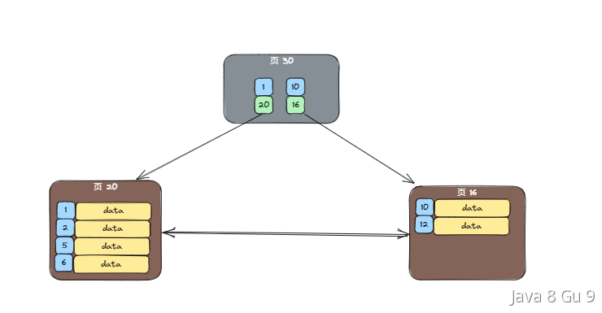

```yaml
title: MySQL数据库-3
category: 数据库
tag:
  - MySQL
```

## 介绍一下InnoDB的数据页，和B+树的关系是什么？

InnoDB的数据页是InnoDB存储引擎中用于存储数据的基本单位。它是磁盘上的一个连续区域，通常大小为16KB当然，也可以通过配置进行调整。16KB就意味着Innodb的每次读写都是以 16KB 为单位的，一次从磁盘到内存的读取的最小是16KB，一次从内存到磁盘的持久化也是最小16KB。

B+树的每个节点都对应着一个数据页，包括根节点、非叶子节点和叶子节点。B+树通过节点之间的指针连接了不同层级的数据页，从而构建了一个有序的索引结构。


通过B+树的搜索过程，可以从根节点开始逐层遍历，最终到达叶子节点，找到所需的数据行。

所以，数据页是存储数据行的实际物理空间，以页为单位进行磁盘读写操作。B+树通过节点和指针的组织，构建了一个层次结构的索引，用于快速定位和访问数据行。

B+树的非叶子节点对应的数据页，其中存储着主键+指向子节点（即其他数据页）的指针。B+树的叶子节点包含实际的数据行，每个数据行存储在一个数据页中。

通过这种方式，InnoDB利用B+树和数据页的组合，实现了高效的数据存储和检索。B+树提供了快速的索引查找能力，而数据页提供了实际存储和管理数据行的机制。它们相互配合，使得InnoDB能够处理大规模数据的高效访问。

### 数据页的构成

一个数据页中包含了7个部分，分别是文件头、页头、最小和最大记录、用户记录、空闲空间、页目录以及文件尾。


## 什么是InnoDB的页分裂和页合并

InnoDB的数据页是InnoDB存储引擎中用于存储数据的基本单位，通常大小为16KB。B+树的每个节点都对应着一个数据页，包括根节点、非叶子节点和叶子节点。B+树通过节点之间的指针连接了不同层级的数据页，从而构建了一个有序的索引结构。

我们都是知道，B+树是按照索引字段建立的，并且在B+树中是有序的，假如有下面一个索引的数据结构，其中的索引字段的值并不连续。



假如，现在我们插入一个新的一条记录，他的索引值是3，那么他就要按照顺序插入到页20中，在索引值为1,2的记录的后面。而如果这个索引页已经满了，那么就需要触发一次页分裂。

> 页分裂是指将该页面中的一部分索引记录移动到一个新的页面中，从而为新记录腾出空间。这样可以保持B+树的平衡和性能。

以下，就是一次页分裂的过程：


那么，当我们向Innodb中添加数据的时候，如果索引是随机无序的，那么就会导致页分裂。而且分裂这个动作还可能会引起连锁反应，从叶子节点沿着树结构一路分裂到根节点。

有分裂，就会有合并。在InnoDB中，当索引页面中的索引记录删除后，页面可能会变得过于稀疏。这时，为了节省空间和提高性能，可能会触发叶合并操作。

> 叶合并是指将两个相邻的索引页面合并成一个更大的页面，减少B+树的层级，从而提高查询性能。


### 页分裂（合并）的危害

首先，页分裂和合并是涉及大量数据移动和重组的操作。频繁进行这些操作会增加数据库的I/O负担和CPU消耗，影响数据库的整体性能。

分裂和合并可能导致B+树索引结构频繁调整，这个过程也会影响插入及删除操作的性能。

频繁的页分裂和合并可能会导致磁盘上存在较多的空间碎片，新分出的一个页一般会有很多空闲空间，使得数据库表占用更多的磁盘空间，而导致浪费。

### 如何避免页分裂

我们介绍过，使用varchar或者使用UUID作为主键的话，都会导致页分裂。

所以，尽量选择使用自增的字段作为索引，尤其是主键索引，这样可以很大程度的避免页分裂。

如果要插入大量数据，尽量使用批量插入的方式，而不是逐条插入。这样可以减少页分裂的次数。

频繁删除操作可能导致页面过于稀疏，从而触发叶合并。所以，一般建议使用逻辑删除而不是物理删除。

> 逻辑删除：即在记录中添加一个标记来表示记录是否被删除(deleted = 0/1)，而不是真正地从数据库中删除记录。

我们当然还可以根据实际情况，适当调整InnoDB的配置参数，如页大小、填充因子、叶子页合并的阈值等，以优化数据库性能。

## 什么是buffer pool？

我们都知道，MySQL的数据是存储在磁盘上面的（Memory引擎除外），但是如果每次数据的查询和修改都直接和磁盘交互的话，性能是很差的。

于是，为了提升读写性能，Innodb引擎就引入了一个中间层，就是buffer pool。

buffer是在内存上的一块连续空间，他主要的用途就是用来缓存数据页的，每个数据页的大小是16KB。

> 页是Innodb做数据存储的单元，无论是在磁盘，还是buffe pool中，都是按照页读取的，这也是一种'预读'的思想。


有了buffer pool之后，当我们想要做数据查询的时候，InnoDB会首先检查buffer pool中是否存在该数据。如果存在，数据就可以直接从内存中获取，避免了频繁的磁盘读取，从而提高查询性能。如果不存在再去磁盘中进行读取，磁盘中如果找到了的数据，则会把该数据所在的页直接复制一份到buffer pool中，并返回给客户端，后续的话再次读取就可以从buffer pool中就近读取了。


当需要修改的时候也一样，需要现在buffer pool中做修改，然后再把他写入到磁盘中。

但是因为buffer pool是基于内存的，所以空间不可能无限大，他的默认大小是128M，当然这个大小也不是完全固定的，我们可以调整，可以通过修改MySQL配置文件中的innodb_buffer_pool_size参数来调整Buffer Pool的大小。

```sql
SHOW VARIABLES LIKE 'innodb_buffer_pool_size';  -- 查看buffer pool

SET GLOBAL innodb_buffer_pool_size = 512M; -- 修改buffer pool
```

### buffer pool和query cache的区别

在Innodb中，除了buffer pool，还有一个缓存层是用来做数据缓存，提升查询效率的，很多人搞不清楚他和buffer pool的区别是什么。

首先就是他们目的和作用不同。buffer pool用于缓存表和索引的数据页，从而加速读取操作；而query cache用于缓存查询结果，减少重复查询的执行时间。

buffer pool主要与存储引擎InnoDB相关，而query cache也支持其他的引擎，如MyISAM等。所以，query cache是位于Server层的优化技术，而buffer pool是位于引擎层的优化技术。

需要注意的是，在MySQL 5.7版本中，query cache已经被标记为废弃，并在MySQL 8.0版本中彻底被移除了。

## 为什么MySQL 8.0要取消查询缓存？

MySQL的查询缓存是一种数据库性能优化技术，它允许MySQL在执行SELECT时将查询结果缓存起来，以便在以后相同的查询被再次执行时，可以直接返回缓存的结果，而不必再次重新解析和执行该语句。

查询缓存在session之间共享，因此由一个客户端生成的结果集可以用来响应另一个客户端发出的相同查询。

查询缓存可以提高查询性能，尤其是具有不经常更改的表且服务器接收到许多相同查询的环境中非常有用。

但是查询缓存是存在一定的限制的，如：

1. 查询缓存是根据查询文本（sql内容）来匹配查询的。查询必须以字节级别完全匹配，包括大小写敏感性。如果查询文本不完全相同，查询将不会被缓存。

2. 包含非确定性函数的查询结果不会缓存，例如RAND()和NOW()。这是因为这些函数的结果在不同的执行之间可能会不同，因此无法缓存结果。

3. 如果查询涉及使用临时表，查询缓存将不会工作。这是因为临时表的存在会导致查询无法被缓存。

4. 查询缓存被设计成不提供陈旧的结果。对底层表的任何修改都会导致这些表的所有缓存失效。

5. 某些存储引擎可能不支持查询缓存，或者在特定情况下限制了其使用。例如，InnoDB存储引擎在某些情况下不使用查询缓存，以便支持多版本并发控制（MVCC）。

在MySQL 5.6之前，查询缓存默认开启的，但是从5.6开始，查询缓存已经默认禁用了！

但是，在MySQL 8.0中取消了查询缓存：[MySQL :: MySQL 8.0: Retiring Support for the Query Cache](https://dev.mysql.com/blog-archive/mysql-8-0-retiring-support-for-the-query-cache/)

主要原因是因为虽然他能带来一定的性能提升，但它也有一些明显的缺点，这些缺点导致了MySQL 8.0取消查询缓存的决定：

1. 频繁失效：查询缓存是以表级别为单位进行管理的，这意味着如果任何表中的数据发生变化，与该表相关的所有查询缓存都将被清除。这导致了缓存的频繁失效，减少了其效用。

2. 内存开销：查询缓存需要占用大量内存来存储查询文本和结果集，这对于具有大量查询和数据的数据库来说，会导致内存开销问题。

3. 不一致性：有时查询结果可能会因为数据库中的数据更改而不再与缓存的结果匹配，这可能导致不一致性的问题。

4. 查询分布不均匀：在某些情况下，查询缓存可能会导致性能下降，因为它不能很好地应对不均匀的查询分布。（部分频繁查询需要频繁更新缓存，不频繁的查询又无法命中缓存）

所以，MySQL 8.0决定取消查询缓存，以便提高整体性能和可维护性。

## uuid和自增id做主键哪个好，为什么？

UUID和自增主键ID是作为数据库主键比较常用的方式。使用这两个做主键各自都有优缺点。

### UUID

UUID(Universally Unique Identifier)全局唯一标识符，是指在一台机器上生成的数字，它的目标是保证对在同一时空中的所有机器都是唯一的。

UUID 是一个 128 位长的唯一标识符，通常以字符串形式表示。它可以使用不同的算法生成，比如基于时间戳的 UUID（version 1）和随机数生成的 UUID（version 4）等。生成的 UUID 由 32 位 16 进制数表示，共有 128 位（标准的UUID格式为：xxxxxxxx-xxxx-xxxx-xxxx-xxxxxxxxxxxx (8-4-4-4-12)，共32个字符）

由于 UUID 是由 MAC 地址、时间戳、随机数等信息生成的，因此 UUID 具有极高的唯一性，可以说是几乎不可能重复，但是在实际实现过程中，UUID有多种实现版本，他们的唯一性指标也不尽相同。

UUID在具体实现上，有多个版本，有基于时间的UUID V1，基于随机数的 UUID V4等。

Java中的java.util.UUID生成的UUID是V3和V4两种：

```java
    /**
     * Static factory to retrieve a type 4 (pseudo randomly generated) UUID.
     *
     * The {@code UUID} is generated using a cryptographically strong pseudo
     * random number generator.
     *
     * @return  A randomly generated {@code UUID}
     */
    public static UUID randomUUID() {
        SecureRandom ng = Holder.numberGenerator;

        byte[] randomBytes = new byte[16];
        ng.nextBytes(randomBytes);
        randomBytes[6]  &= 0x0f;  /* clear version        */
        randomBytes[6]  |= 0x40;  /* set to version 4     */
        randomBytes[8]  &= 0x3f;  /* clear variant        */
        randomBytes[8]  |= 0x80;  /* set to IETF variant  */
        return new UUID(randomBytes);
    }

    /**
     * Static factory to retrieve a type 3 (name based) {@code UUID} based on
     * the specified byte array.
     *
     * @param  name
     *         A byte array to be used to construct a {@code UUID}
     *
     * @return  A {@code UUID} generated from the specified array
     */
    public static UUID nameUUIDFromBytes(byte[] name) {
        MessageDigest md;
        try {
            md = MessageDigest.getInstance("MD5");
        } catch (NoSuchAlgorithmException nsae) {
            throw new InternalError("MD5 not supported", nsae);
        }
        byte[] md5Bytes = md.digest(name);
        md5Bytes[6]  &= 0x0f;  /* clear version        */
        md5Bytes[6]  |= 0x30;  /* set to version 3     */
        md5Bytes[8]  &= 0x3f;  /* clear variant        */
        md5Bytes[8]  |= 0x80;  /* set to IETF variant  */
        return new UUID(md5Bytes);
    }
```

#### 优缺点

UUID的优点：

- 全局唯一：使用不同的算法生成，几乎可以保证在全球范围内唯一，避免了多台机器之间主键冲突的问题。

- 不可预测性：随机生成的 UUID 很难被猜测出来，对于需要保密性的应用场景较为适用。

- 分布式：由于可以在不同的机器上生成 UUID，因此可以用于分布式系统中。

UUID的缺点：

- 存储空间比较大：UUID 通常以字符串形式存储，占用的存储空间比较大。

- 不适合范围查询：因为不是自增的，所以在做范围查询的时候是不支持的。

- 不方便展示：主键ID有的时候会需要在系统间、或者前台页面展示，如果是UUID的话，就因为比较长、并且没有任何业务含义，所以不方便展示。

- 查询效率低：
  
  - 在UUID列上创建索引，因为他很长，所以索引的大小会变得非常大。大的索引会占用更多的磁盘空间，导致缓存命中率下降，进而增加了磁盘I/O的需求。此外，大的索引还会导致查询时的内存开销增加。
  
  - 当使用UUID进行排序时，新的UUID值通常会插入到叶子节点的中间位置。这可能导致B+树的分裂和平衡操作频繁进行，从而增加了写入的开销。每次分裂或平衡都涉及到数据的重新排序和移动，这会影响查询的性能。

#### 各个版本实现

##### V1. 基于时间戳的UUID

基于时间的UUID通过计算当前时间戳、随机数和机器MAC地址得到。由于在算法中使用了MAC地址，这个版本的UUID可以保证在全球范围的唯一性。

但与此同时，使用MAC地址会带来安全性问题，这就是这个版本UUID受到批评的地方。如果应用只是在局域网中使用，也可以使用退化的算法，以IP地址来代替MAC地址。

##### V2. DCE(Distributed Computing Environment)安全的UUID

和基于时间的UUID算法相同，但会把时间戳的前4位置换为POSIX的UID或GID，这个版本的UUID在实际中较少用到。

##### V3. 基于名称空间的UUID(MD5)

基于名称的UUID通过计算名称和名称空间的MD5散列值得到。

这个版本的UUID保证了：相同名称空间中不同名称生成的UUID的唯一性；不同名称空间中的UUID的唯一性；相同名称空间中相同名称的UUID重复生成得到的结果是相同的。

##### V4. 基于随机数的UUID

根据随机数，或者伪随机数生成UUID。该版本 UUID 采用随机数生成器生成，它可以保证生成的 UUID 具有极佳的唯一性。但是因为基于随机数的，所以，并不适合数据量特别大的场景。

##### V5. 基于名称空间的UUID(SHA1)

和版本3的UUID算法类似，只是散列值计算使用SHA1(Secure Hash Algorithm 1)算法。

##### 各个版本总结

可以简单总结一下，Version 1和Version 2 这两个版本的UUID，主要基于时间和MAC地址，所以比较适合应用于分布式计算环境下，具有高度唯一性。

Version 3和 Version 5 这两种UUID都是基于名称空间的，所以在一定范围内是唯一的，而且如果有需要生成重复UUID的场景的话，这两种是可以实现的。

Version 4 这种是最简单的，只是基于随机数生成的，但是也是最不靠谱的。适合数据量不是特别大的场景下。

### 自增ID

在 MySQL 中，可以通过设置 AUTO_INCREMENT 属性实现ID的自增长，通常可以用来作为主键ID。

使用自增ID做主键的好处是：

- 存储空间：ID是数字，所以占用的位数要比UUID小多了，所以在存储空间上也节省很多。

- 查询效率：ID 是递增的，因此在使用 B+Tree 索引时，查询效率较高。

- 方便展示：因为ID比较短，方便展示。

- 分页方便：因为ID是连续自增的，所以在分页的时候，可以通过ID解决深度分页的问题。

但是，使用自增主键做主键ID也存在一定的问题：

- 分库分表：当我们做分库分表的时候，就没办法依赖一张表的自增主键来做主键ID了，这样就会发生重复导致冲突的问题

- 可预测：因为ID是顺序自增的，所以是可以预测的，这就给系统带来了一定的安全风险。

- 可能用尽：自增id的话可能是int、bigint等，但是他们都是有范围的，有可能会用尽。

## MySQL的主键一定是自增的吗？

不是的，主键是可以自己选择的，我们可以选择任意一种数据类型作为主键。

但是一般都是单独创建一个自增字段作为主键，主要能带来以下几个好处：

1. 索引大小更小：使用自增主键可以确保主键的递增性，使得新插入的数据都会在索引的末尾处，减少了数据页的分裂和页分裂导致的IO操作，使得索引大小更小，查询速度更快。

2. 索引顺序和插入顺序相同：使用自增主键可以保证索引顺序和插入顺序相同，减少了插入新数据时索引的重新排序，提高了插入速度。

3. 安全性：使用自增主键可以避免主键重复的情况，确保数据完整性和唯一性。

4. 减少页分裂（合并）及内存碎片。

另外，即使我们用了自增字段作为主键，最后体现在数据库上，字段也可能不是连续自增的，比如做了某一次插入失败但是主键ID被占用了，比如数据做了删除，比如做了回滚、比如做了数据订正等等。

## MySQL自增主键用完了会怎么样？

我们知道，在MySQL中，自增主键有两种，一种是显式的、一种是隐式的。如果我们在一张表中没有定义主键，那么，MySQL会创建一个隐藏的主键（row_id）作为主键。

那么，不管是我们自己定义的自增主键，还是row_id的这个主键，都是一个固定类型的，一般都是bigint unsigned，那么既然有固定类型，就有取值范围。那么随着数据量的增长，主键的值会不断增长，那么万一超过了这个范围限制，会怎么样呢？

如果是我们自己显式定义的一个自增ID，如果已经达到了上限，那么下一次申请ID的时候，得到的值就是那个最大值，后续也不会再增加。这时候我们会拿到一个已经用过的主键，如果继续插入的话，会报主键冲突。

那如果我们没有自定义自增ID，那么就会默认使用row_id，如果已经达到了上限，那么下一次申请ID的时候，得到的值会从0开始，然后继续重新自增。但是，这种情况如果我们因为没有设置主键，所以他不会报主键冲突，他会直接把这个row_id = 0的数据插入到数据库中，并且会把之前的row_id=0的数据给直接覆盖了。

所以，结论是：

1. 显示自定义的自增ID，用完以后下次插入会报主键冲突。

2. 未定义自增ID主键，会用row_id，用完以后下一次插入会覆盖历史数据。

那么，从这个方面来看的话，我们为了避免数据被覆盖，还是需要自己设置一个自增的主键ID的，毕竟异常我们是可以感知到的，但是数据覆盖我们可能过了很久才能发现。

## order by 是怎么实现的？

order by 是做排序的，具体怎么排取决于优化器的选择，如果优化器认为走索引更快，那么就会用索引排序，否则，就会使用filesort (执行计划中extra中提示：using filesort），但是能走索引排序的情况并不多，并且确定性也没有那么强，很多时候，还是走的filesort。

filesort这种排序方式中，如果需要排序的内容比较少，就会基于内存中的sort_buffer，否则就需要使用临时文件进行排序了。并且在实际排序过程中，如果字段长度并不是特别长，那么就会使用全字段排序的方式直接在sort_buffer中排序后返回结果集。如果字段长度特别长，那么就可能基于空间考虑，采用row_id排序，这样就会在排序后进行二次回表后返回结果集。

### 索引排序

我们都知道，索引是天然有序的，所以当我们在使用order by的时候，如果能借助索引，那么效率一定是最高的。

并且MySQL确实也可以基于索引进行order by的查询，但是这个过程是否一定用索引，完全取决于优化器的选择。

```sql
 CREATE TABLE `t2` (          
  `id` INT(11),
  `a` varchar(64) NOT NULL,                                                                                                                                                          
  `b` varchar(64) NOT NULL,                                                                                                                                                          
  `c` varchar(64) NOT NULL,                                                                                                                                                          
  `d` varchar(64) NOT NULL,                                                                                                                                                          
  `f` varchar(64) DEFAULT NULL,    
  PRIMARY KEY(id),
  UNIQUE KEY `f` (`f`),
  KEY `idx_abc` (`a`,`b`,`c`),
  KEY `idx_a` (`a`)    
) ENGINE=InnoDB DEFAULT CHARSET=latin1
```

假设有以上这样一张表，在排序时，可能出现的情况如下（因为有优化器的干预，以下结果并不一定可以100%复现。我自己实验的时候是可以的，我的环境是MySQL 5.7，）：

```sql
select * from t2 order by a;
-- 不走索引，使用filesort（后面介绍啥是filesort）
select * from t2 order by a limit 100;
-- 走索引
select a,b from t2 order by a limit 100;
-- 走索引
select a,b,c from t2 order by a;
-- 走索引
select a,b,c,d from t2 order by a;
-- 不走索引，使用filesort
select a,b,c,d from t2 where a = "Sun" order by b;
-- 走索引
select a,b,c,d from t2 where b = "Sun" order by a;
-- 不走索引，使用filesort
```

也就是说，当我们使用索引字段进行排序的时候，优化器会根据成本评估选择是否通过索引进行排序。经过我的不断验证，以下几种情况，走索引的概率很高：

- 查询的字段和order by的字段组成了一个联合索引，并且查询条件符合最左前缀匹配，查询可以用到索引覆盖。如`select a,b,c from t2 order by a;`

- 查询条件中有limit，并且limit的数量并不高。（我测试的表数据量80万，在limit超过2W多的时候就不走索引了），如order by a limit 100

- 虽然没有遵循最左前缀匹配，但是前导列通过常量进行查询，如 where a = "Sun" order by b

### filesort 排序

如果不能使用或者优化器认为索引排序效率不高时， MySQL 会执行filesort操作以读取表中的行并对它们进行排序。

在进行排序时，MySQL 会给每个线程分配一块内存用于排序，称为 sort_buffer，它的大小是由sort_buffer_size控制的。

而根据sort_buffer_size的大小不同，会在不同的地方进行排序操作：

- 如果要排序的数据量小于 sort_buffer_size，那么排序就在内存中完成。

- 如果排序数据量大于sort_buffer_size，则需要利用磁盘临时文件辅助排序。

> 临时文件排序采用归并排序的算法，首先会把需要排序的数据拆分到多个临时文件里同步进行排序操作，然后把多个排好序的文件合并成一个结果集返回给客户端。
> 
> 在磁盘上的临时文件里排序相对于在内存中的sort buffer里排序来说，会慢很多。

除了sort_buffer_size参数以外，影响排序的算法的还有一个关键参数：max_length_for_sort_data

max_length_for_sort_data是 MySQL 中控制<用于排序的行数据的长度>的一个参数，默认值是1024字节。如果单行的长度超过这个值，MySQL就认为单行太大，那么就会采用rowid 排序，否则就进行全字段排序。

在内存中的排序，MySQL可能会选择全字段排序、rowid排序。

### 全字段排序

所谓全字段排序，就是将要查询的所有字段都放到sort_buffer中，然后再根据排序字段进行排序，排好之后直接把结果集返回给客户端。

假如我们有如下查询SQL：

`select b,c,d from t2 where a = "Sun" order by b;`

因为这里涉及到的字段有b,c,d三个，那么就会把符合where条件的所有数据的b,c,d字段都放到sort_buffer中，然后再在sort_buffer中根据b进行排序，排好之后返回给客户端。大致过程如下：

1. 从索引(a,b,c)中取出 a = "Sun"的第一条记录的主键ID

2. 根据主键ID回表，取出b,c,d三个字段，存入sort_buffer

3. 继续查询下一个符合a = "Sun"的记录，重复第1-2步骤

4. 在sort_buffer中，根据b进行排序

5. 将排序后的结果集返回给客户端


以上过程中，如果数据sort buffer放不下了，就会采用临时文件，然后再对临时文件进行归并排序。

全字段排序的好处就是只对原表进行了一次回表查询（每条记录只需要回表一次），之后的排序好以后就可以直接把需要的字段返回了。所以他的效率比较高。但是他的缺点就是，如果要查询的字段比较多，那么就会比较耗费sort_buffer的空间，使得空间中能存储的数据很少。那么如果要排序的数据量变大，就会要用到临时文件，导致整体的性能下降。

那么，为了避免这个问题，也可以通过row_id排序的方式。

### row_id 排序

这个也比较容易理解，就是说我们在构建sort_buffer的时候，不要把所有的要查询字段都放进去，只把排序字段这主键放进去就行了。

`select b,c,d from t2 where a = "Sun" order by b;`

比如这个SQL，那么只需要把b和id放到sort_buffer中，先按照b进行排序。排好之后，就在根据id，把对应的b,c,d几个字段都查询出来，返回给客户端即可。大致过程如下：

1. 从索引(a,b,c)中取出 a = "Sun"的第一条记录的主键ID

2. 根据主键ID回表，取出b这个字段，存入sort_buffer

3. 继续查询下一个符合a = "Sun"的记录，重复第1-2步骤

4. 在sort_buffer中，根据b进行排序

5. 再根据ID，回表查询出b,c,d几个字段

6. 将排序后的结果集返回给客户端


以上的第五步，就是比全字段排序算法中多出来的一步，可以看到，这个方案多了一次回表。所以他的效率肯定也要更慢一些。

### 如何选择

其实，row_id是MySQL的一种优化算法，他会优先考虑使用全字段排序，只有在他认为字段长度过长，可能会影响效率时，采用row_id的方式排序。并且，能用sort_buffer搞定的情况，MySQL就不会采用临时文件。

总之就是，速度优先，内存优先、一次回表优先。

## count(1)、count(*) 与 count(列名) 的区别

COUNT(1) 和 COUNT(*)表示的是直接查询符合条件的数据库表的行数。而COUNT(列名)表示的是查询符合条件的列的值不为NULL的行数。

除了查询得到结果集有区别之外，在性能方面COUNT(\*)是约等于COUNT(1)的，但是COUNT(*)是SQL92定义的标准统计行数的语法，因为他是标准语法，所以MySQL数据库对他进行过很多优化。

### COUNT函数

关于COUNT函数，在MySQL官网中有详细介绍：


简单翻译一下：

- COUNT(expr) ，返回SELECT语句检索的行中expr的值不为NULL的数量。结果是一个BIGINT值。

- 如果查询结果没有命中任何记录，则返回0

- 但是，值得注意的是，COUNT(*) 的统计结果中，会包含值为NULL的行数。

即以下表记录

```sql
create table #bla(id int,id2 int)
insert #bla values(null,null)
insert #bla values(1,null)
insert #bla values(null,1)
insert #bla values(1,null)
insert #bla values(null,1)
insert #bla values(1,null)
insert #bla values(null,null)
```

使用语句count(*),count(id),count(id2)查询结果如下：

```sql
select count(*),count(id),count(id2)
from #bla;
results 7 3 2
```

### 实际使用count表达式

实际场景中使用count表达式的时候也要注意：单纯的使用count表达式会查出多余数量。

例如，想要计算性别为男的学生数量时，count(sex='男')会返回性别为男和性别为非男的数量。

原因很简单，count表达式中只有计算出null时才会跳过这行数据：当性别为男时，count表达式计算为true，不跳过这行；当性别为非男时，count表达式计算为false，也不跳过这行。

#### 如何解决？

count(表达式 Or null)

当性别为男时，第一个表达式为true，直接计算出结果是true，count认定需要加上这行；当性别为非男时，第一个表达式为false，继续执行第二个表达式，null直接输出为计算结果，count认定不需要加上这行。

### COUNT(*)的优化

前面提到了COUNT(*)是SQL92定义的标准统计行数的语法，所以MySQL数据库对他进行过很多优化。那么，具体都做过哪些事情呢？

这里的介绍要区分不同的执行引擎。MySQL中比较常用的执行引擎就是InnoDB和MyISAM。

MyISAM和InnoDB有很多区别，其中有一个关键的区别和我们接下来要介绍的COUNT(*)有关，那就是MyISAM不支持事务，MyISAM中的锁是表级锁；而InnoDB支持事务，并且支持行级锁。

因为MyISAM的锁是表级锁，所以同一张表上面的操作需要串行进行，所以，MyISAM做了一个简单的优化，那就是它可以把表的总行数单独记录下来，如果从一张表中使用COUNT(*)进行查询的时候，可以直接返回这个记录下来的数值就可以了，当然，前提是不能有where条件。

MyISAM之所以可以把表中的总行数记录下来供COUNT(*)查询使用，那是因为MyISAM数据库是表级锁，不会有并发的数据库行数修改，所以查询得到的行数是准确的。

但是，对于InnoDB来说，就不能做这种缓存操作了，因为InnoDB支持事务，其中大部分操作都是行级锁，所以可能表的行数可能会被并发修改，那么缓存记录下来的总行数就不准确了。

但是，InnoDB还是针对COUNT(*)语句做了些优化的。

在InnoDB中，使用COUNT(*)查询行数的时候，不可避免的要进行扫表了，那么，就可以在扫表过程中下功夫来优化效率了。

从MySQL 8.0.13开始，针对InnoDB的SELECT COUNT(*) FROM tbl_name语句，确实在扫表的过程中做了一些优化。前提是查询语句中不包含WHERE或GROUP BY等条件。

我们知道，COUNT(*)的目的只是为了统计总行数，所以，他根本不关心自己查到的具体值，所以，他如果能够在扫表的过程中，选择一个成本较低的索引进行的话，那就可以大大节省时间。

我们知道，InnoDB中索引分为聚簇索引（主键索引）和非聚簇索引（非主键索引），聚簇索引的叶子节点中保存的是整行记录，而非聚簇索引的叶子节点中保存的是该行记录的主键的值。

所以，相比之下，非聚簇索引要比聚簇索引小很多，所以MySQL会优先选择最小的非聚簇索引来扫表。所以，当我们建表的时候，除了主键索引以外，创建一个非主键索引还是有必要的。

至此，我们介绍完了MySQL数据库对于COUNT(*)的优化，这些优化的前提都是查询语句中不包含WHERE以及GROUP BY条件。

### COUNT(*)和COUNT(1)

介绍完了COUNT(*)，接下来看看COUNT(1)，对于，这二者到底有没有区别，网上的说法众说纷纭。

有的说COUNT(*)执行时会转换成COUNT(1)，所以COUNT(1)少了转换步骤，所以更快。

还有的说，因为MySQL针对COUNT(\*)做了特殊优化，所以COUNT(*)更快。

那么，到底哪种说法是对的呢？看下MySQL官方文档是怎么说的：

> InnoDB handles SELECT COUNT(*) and SELECT COUNT(1) operations in the same way. There is no performance difference.

画重点：same way , no performance difference。所以，对于COUNT(1)和COUNT(*)，MySQL的优化是完全一样的，根本不存在谁比谁快！

那既然COUNT(*)和COUNT(1)一样，建议用哪个呢？

建议使用COUNT(*)！因为这个是SQL92定义的标准统计行数的语法，而且本文只是基于MySQL做了分析，关于Oracle中的这个问题，也是众说纷纭的呢。

### COUNT(字段)

最后，就是我们一直还没提到的COUNT(字段)，他的查询就比较简单粗暴了，就是进行全表扫描，然后判断指定字段的值是不是为NULL，不为NULL则累加。

相比COUNT(\*)，COUNT(字段)多了一个步骤就是判断所查询的字段是否为NULL，所以他的性能要比COUNT(*)慢。

## limit 0,100和limit 10000000,100一样吗？

不一样，这是MySQL中典型的深度分页的问题。

MySQL的limit m n工作原理就是先读取前面m+n条记录，然后抛弃前m条，然后返回后面n条数据，所以m越大，偏移量越大，性能就越差。

所以，limit 10000000,100要比limit 0,100的性能差的多，因为他要先读取10000100条数据，然后再抛弃前面的10000000条。

### limit优化

通常，我们在查询数据的时候，如果明确的知道我们想要多少行的话，那么建议大家在查询语句中使用limit，而不是把整个结果集查出来再自己丢弃那些不用的数据。

虽然我们前面提过，深度分页的时候，MySQL自己也是先全都查出来，再丢弃的，但是，MySQL针对limit也是有一些优化的。但是下面我们要介绍的优化前提都是使用limit的同时没有用having语句。

1. MySQL通常更愿意执行全表扫描，但是如果你用LIMIT只查询几行记录的话，MySQL在某些情况下可能会使用索引。

2. 如果你将LIMIT row_count子句与ORDER BY子句组合在一起使用的话，MySQL会在找到排序结果的row_count行数据后后立即停止排序，而不是对整个结果进行排序。如果使用索引来完成排序，这将非常快。
   
   > 当ORDER BY子句使用了索引时，MySQL就能够基于已经排好序的索引树快速找到所需的前N行数据，而不需要对整个表进行全表扫描和排序了。

3. 如果LIMIT row_count与DISTINCT一起使用，一旦找到row_count惟一的行，MySQL就会停止。

4. LIMIT 0 可以快速返回一个空的结果集，这是用来检测一个查询是否有效的一种很有用的方法。

5. 如果ORDER BY不走索引，而且后面还带了LIMIT的话，那么优化器可能可以避免用一个合并文件，并使用内存中的filesort操作对内存中的行进行排序。

### order by返回顺序不固定

我们知道，当我们在查询的时候，对某个字段order by时，如果这个字段有一些重复值，那么MySQL会是可以自由的以任意顺序返回这些行记录的，并且根据总体的执行计划而有不同的表现。也就是说，排序结果可能是不固定的。

所以，当order by语句中，有Limit的时候，可能每次的查询结构都不一样。比如有下面两次查询的结果可能就不一样：

```shell
mysql> SELECT * FROM ratings ORDER BY category;
+----+----------+--------+
| id | category | rating |
+----+----------+--------+
|  1 |        1 |    4.5 |
|  5 |        1 |    3.2 |
|  3 |        2 |    3.7 |
|  4 |        2 |    3.5 |
|  6 |        2 |    3.5 |
|  2 |        3 |    5.0 |
|  7 |        3 |    2.7 |
+----+----------+--------+
mysql> SELECT * FROM ratings ORDER BY category LIMIT 5;
+----+----------+--------+
| id | category | rating |
+----+----------+--------+
|  1 |        1 |    4.5 |
|  5 |        1 |    3.2 |
|  4 |        2 |    3.5 |
|  3 |        2 |    3.7 |
|  6 |        2 |    3.5 |
+----+----------+
```

那么该怎么解决呢？一个好的办法就是排序的时候不要只用一个字段，可以再加一个字段，比如id字段这种一定不会重复的。

`SELECT * FROM ratings ORDER BY category,id LIMIT 5;`

### 深度分页怎么优化

前面我们提到了MySQL的深度分页问题，如果offset比较大的话，会导致查询速度比较慢，那么这个问题可以解决吗？

答案是如果你还是用MySQL的话，那是没办法彻底解决，只能缓解。有以下几种办法：

1. 首先，可以考虑不用MySQL，那就能解决了。比如使用ES。

2. 使用主键索引优化，减少回表：
   
   ```sql
   SELECT c1,c2,cn... FROM table WHERE id>=
   (
       SELECT id FROM table LIMIT 20000,1
   )
   LIMIT 10;
   ```
   
   这种方式主要目的是减少回表次数了，先通过子查询查询出最小的ID，然后再根据ID进行查询就行了。但是这个方案有个弊端，那就是要求ID一定要是自增的。

3. 在《高性能MySQL》这本书中，专门有一个章节介绍了如何优化LIMIT和OFFSET字句的，他提到了一种优化方案。
   
   优化前的SQL是：
   
   `select film_id,desc from film order by titile limit 50,5;`
   
   优化后的SQL为：
   
   ```sql
   SELECT film_id,desc
     FROM film
    INNER JOIN (SELECT film_id FROM film ORDER BY titile LIMIT 50, 5) AS lim
    USING (film_id)
   ```
   
   这是一种"延迟连接"的方式，他允许服务器在不访问行的情况下检查索引中尽可能少的数据，然后一旦找到所需的行，就将它们与整个表连接，以从该行中检索其他列。

4. 还有一种方式，就是如果能提前预估要查询的分页的条件的话，是可以很大程度提升性能的。比如记住上一页的最大ID，下一页查询的时候，就可以根据id >　max_id_in_last_page 进行查询。

## SQL语句如何实现insertOrUpdate的功能？

在 MySQL 中，可以使用 INSERT INTO ... ON DUPLICATE KEY UPDATE 语句实现 insertOrUpdate 功能。

> 需要注意：在on duplicate key时，会在前一个索引值到当前值加临键锁，极容易造成死锁。

要使用 INSERT INTO ... ON DUPLICATE KEY UPDATE 语句，需要满足以下条件：

1. 表必须有主键或唯一索引；

2. 插入的数据必须包含主键或唯一索引列；

3. 主键或唯一索引列的值不能为 NULL。

假设有一个 student 表，包含 id、name 和 age 三列，其中 id 是主键。现在要插入一条数据，如果该数据的主键已经存在，则更新该数据的姓名和年龄，否则插入该数据。

```sql
INSERT INTO student (id, name, age) VALUES (1, 'Alice', 20)
ON DUPLICATE KEY UPDATE name='Alice', age=20;
```

### 类似SQL

REPLACE INTO: 如果存在唯一索引冲突，则先删除旧记录，再插入新记录。

INSERT IGNORE INTO: 如果唯一索引冲突，则忽略该条插入操作，不报错。

## 为什么不推荐使用外键？

MySQL 外键（Foreign Key）是用于建立表之间关系的，它定义了一个表中的一列或一组列，这些列的值必须在另一个表的主键列中存在。

MySQL 外键最大的作用就是有助于维护数据的一致性和完整性。

- 一致性：如果一个订单表引用了一个客户表的外键，外键可以确保订单的客户 ID 存在于客户表中，从而保持数据的一致性。

- 完整性：外键可以防止在引用表中删除正在被其他表引用的记录，从而维护数据的完整性。

但是，其实在很多大型互联网公司中，很少用外键的，甚至阿里巴巴Java开发手册中明确规定了：

> 【强制】不得使用外键与级联，一切外键概念必须在应用层解决。  
> 
> 说明: 以学生和成绩的关系为例，学生表中的 student_id 是主键，那么成绩表中的 student_id 则为外键。如果更新学生表中的 student_id，同时触发成绩表中的 student_id 更新，即为级联更新。外键与级联更新适用于单机低并发，不适合分布式、高并发集群;级联更新是强阻塞，存在数据库更新风暴的风险;外键影响数据库的插入速度。

那么，使用外键会带来哪些问题呢？

先举个例子，我们有两张表：Orders（订单）和 OrderItems（订单项）。这两个表之间通过外键建立关系，订单项表中的外键引用订单表的订单号。

```sql
CREATE TABLE Orders (
    OrderID INT PRIMARY KEY,
    CustomerID INT,
    OrderDate DATE,
    -- 其他订单信息
);

CREATE TABLE OrderItems (
    ItemID INT PRIMARY KEY,
    OrderID INT,
    ProductID INT,
    Quantity INT,
    -- 其他订单项信息
    FOREIGN KEY (OrderID) REFERENCES Orders(OrderID)
);
```

接下来基于这两张表展开分析

### 性能问题

首先就是性能问题，因为外键会增加数据库的维护负担，因为每次插入、更新或删除数据时，数据库都需要检查外键约束的完整性。

首先，这两张表中共有两个索引，一个是Orders表的主键索引，一个是OrdersItems表的外键索引，这就使得每次插入、更新或删除订单或订单项时，数据库需都要维护这两个索引，这可能会导致性能开销。

其次，在插入新的订单项之前，数据库需要执行数据一致性检查以确保引用的订单号在 Orders 表中存在。这额外的检查可能增加插入订单项的执行时间。

### 锁竞争问题

还有就是比较容易忽略的锁竞争问题。当多个事务同时尝试插入或更新订单项时，它们就需要去检查订单表，就需要获得额外的锁，以确保一致性。这可能导致事务之间的锁竞争，降低并发性能。

一旦有了锁竞争，就可能带来更加严重的死锁问题，所以都是需要尽量避免的。

### 无法适应分库分表

当数据量大的时候，我们就要考虑分库分表了，但是在分库分表环境中，相关数据可能分布在不同的数据库中，外键通常难以跨越不同数据库来建立关系。更重要的是，分库分表环境中，数据的一致性可能更难维护。跨库事务搞不定。

以上，就是一些比较重要的原因吧。其实最主要的还是外键约束会带来一些额外的开销及锁竞争。而在很多大型互联网公司中，都是会尽量避免的。

就像大厂会使用RC来替代RR一样，会尽可能的降低锁的发生，一方面提升性能，一方面避免死锁。

## MySQL是否支持emoji表情存储，如果不支持，如何操作？

MySQL中是可以存储emoji表情的，但是要使用UTF8MB4的字符编码才可以。如果是UTF8MB3的话，存储这些扩展字符的话会无法解析导致报错。

### MySQL对Unicode的支持

Unicode字符集，他现在已经是计算机科学领域里的一项业界标准，它对世界上大部分的文字系统进行了整理、编码，使得计算机可以用更为简单的方式来呈现和处理文字。

为了适应不同的数据存储和传递需求，人们提出了 Unicode Transformation Format（UTF）系列编码。这其中包含UTF-8、UTF-16、UTF-32等。

通过查阅MySQL官方文档（https://dev.mysql.com/doc/refman/8.0/en/charset-unicode.html ），我们可以知道，在MySQL中，主要支持以下字符集：utf8、ucs2、utf8mb3、utf8mb4、utf16、utf16le和utf32。

不同的字符集的区别在于包含的字符情况以及存储需要的空间。

| 字符集               | 支持的字符        | 每个字符所需存储空间 |
| ----------------- | ------------ | ---------- |
| utf8mb3, utf8<br> | BMP<br>      | 1-3 字节<br> |
| ucs2<br>          | BMP<br>      | 2 字节<br>   |
| utf8mb4<br>       | BMP和补充字符<br> | 1-4 字节<br> |
| utf16<br>         | BMP和补充字符<br> | 2或4 字节<br> |
| utf16le<br>       | BMP和补充字符<br> | 2或4 字节<br> |
| utf32<br>         | BMP和补充字符<br> | 4 字节       |

在MySQL官方文档中，介绍了支持的编码方式之后，还有一段醒目的提醒：

翻译过来是：utf8mb3字符集已被弃用，它在未来的MySQL版本中将会被删除，请使用utf8mb4代替。在目前的8.0版本中，utf8指的就是utf8mb3，虽然未来可能改成utf8mb4，但是为了避免产生歧义，可以考虑为字符集引用显式指定utf8mb4，而不是utf8。

也就是说，当我们在MySQL 8.0 中指定字符编码方式为UTF-8的时候，其实使用的是utf8mb3这种编码方式。

那么，我们先来说说utf8mb3。

### utf8mb3

utf8mb3字符集是MySQL早期就支持的字符集，他具有以下特征:

1. 仅支持BMP字符(不支持补充字符)

2. 每个多字节字符最多需要三个字节

注意，仅支持BMP字符，那么什么是BMP字符呢？

BMP是Basic Multilingual Plane的缩写，即码位在0到65535之间(或者U+0000和U+FFFF)的字符。

BMP中并不包含补充字符，即码位在U+10000和U+10FFFF之间的的字符。补充字符有哪些呢，如一些生僻的汉字，或者Emoji 表情等都是补充字符。

也就是说，如果在建表的时候，指定的编码方式是utf8mb3（utf-8），那么对于一些生僻字或者emoji表情都无法表示。

### utf8mb4

早期的时候，Unicode 只用到了 0~0xFFFF 范围的数字编码，这就是 BMP 字符集。所以，最初MySQL在设计之初，也就只涉及了包含BMP 字符集的utfmb3(utf-8)，但是随着文字越来越多，3个字节肯定无法全部表示，于是Unicode支持的字符就更多了。

所以，早期的utfmb3在有些场景中就不能满足需求了，于是，MySQL在5.5.3之后增加了utf8mb4的编码。

utfmb4字符集具有以下特征:

1. 支持BMP和补充字符。

2. 每个多字节字符最多需要4个字节。

utf8mb4与utf8mb3字符集不同，utf8mb3字符集只支持BMP字符，每个字符最多使用三个字节:

对于BMP字符，utf8mb4和utf8mb3具有相同的存储特征，即相同的编码值，相同的编码，相同的长度。

对于补充字符，utf8mb4需要4个字节来存储它，而utf8mb3根本不能存储该字符。所以我们说utf8mb4是utf8mb3的超集。

所以，很多时候，为了考虑到兼容性，建议创建MySQL表的时候，使用utf8mb4，而不是utf8！

### 从utf8mb3转换成utf8mb4

首先，想要把字符集从utf8mb3转换到utf8mb4，其实是问题不大的:

对于BMP字符，utf8mb4和utf8mb3具有相同的存储特征:相同的编码值，相同的编码，相同的长度。

对于补充字符，utf8mb4需要4个字节来存储它，而utf8mb3根本不能存储该字符。当将utf8mb3列转换为utf8mb4时，您不必担心转换补充字符，因为没有补充字符。

假设有一张已知表使用了utf8mb3：

```sql
CREATE TABLE t1 (
  col1 CHAR(10) CHARACTER SET utf8 COLLATE utf8_unicode_ci NOT NULL,
  col2 CHAR(10) CHARACTER SET utf8 COLLATE utf8_bin NOT NULL
) CHARACTER SET utf8;
```

下面的语句将t1转换为utf8mb4:

```sql
ALTER TABLE t1
  DEFAULT CHARACTER SET utf8mb4,
  MODIFY col1 CHAR(10)
    CHARACTER SET utf8mb4 COLLATE utf8mb4_unicode_ci NOT NULL,
  MODIFY col2 CHAR(10)
    CHARACTER SET utf8mb4 COLLATE utf8mb4_bin NOT NULL;
```

## 数据库怎么做加密和解密？

很多时候，我们的数据库表中会存储很多敏感信息，如用户的手机号、身份证号、密码之类的，这些数据如果不做好加密的话，一旦数据泄漏就会导致重要信息泄露。

一般来说都需要对敏感字段进行加密，然后再在数据库中保存加密后的数据，这样即使被拖库也没关系，比如攻击者拿到的只是加密后的密码，并不知道真实密码是什么。

那么，我们应该如何做数据库的加密呢。通常来说有以下几种办法：

### 服务端加解密

服务端加解密指的就是数据库在存入数据库之前就加密好，然后再从数据库取出之后进行解密。这样可以保证数据库的数据绝对安全，因为数据库也不知道明文到底是什么。

一般来说我们可以选择各种各样的加密算法，如对称加密和非对称加密都可以，一般来说用对称加密就行了。

当然，有些场景下也可以用MD5（MD5严格来说并不是加密算法，只是一种hash算法），但是需要注意的是MD5不支持解密，所以只能用于那种存储后只做匹配而不作查询展示的场景，如用户的密码。而需要展示的场景，如手机号等就需要支持解密。

### 数据库加密函数

MySQL提供了一些内置的加密函数，我们可以直接使用这些加密函数进行数据加密：

1. AES_ENCRYPT 和 AES_DECRYPT，这两个函数是对称加密算法，使用对称密钥加密，这意味着加密和解密都使用相同的密钥。因此，必须确保密钥的安全性。
   
   - AES_ENCRYPT(str, key) 用于使用AES算法对字符串 str 进行加密，key表示使用的密钥。
   
   - AES_DECRYPT(crypt_str, key) 用于解密已加密的字符串 crypt_str，使用相同的密钥 key。
   
   ```sql
   -- 加密数据
   INSERT INTO user_data (username, credit_card) VALUES ('Sun', AES_ENCRYPT('1234-5678-9012-3456', 'sun_secret_key'));
   -- 解密数据
   SELECT username, AES_DECRYPT(credit_card, 'Sun_secret_key') FROM user_data WHERE username = 'John';
   ```

2. ENCRYPT： ENCRYPT(str, salt) 函数使用UNIX crypt()函数对字符串 str 进行加密，其中 salt 是一个2字符的随机盐。这种加密方法通常用于密码存储，但不是最安全的加密方式。
   
   ```sql
   -- 使用随机盐加密密码
   INSERT INTO user_credentials (username, password_hash) VALUES ('Sun', ENCRYPT('my_password', 'ab'));
   -- 验证密码
   SELECT * FROM user_credentials WHERE username = 'Sun' AND password_hash = ENCRYPT('entered_password', password_hash);
   ```

3. MD5 和 SHA1：
   
   MD5(str) 和 SHA1(str) 函数分别用于计算字符串 str 的MD5和SHA-1哈希值。这不是真正的加密，而是散列函数，无法逆向解密。
   
   ```sql
   -- 存储MD5哈希值
   INSERT INTO user_data (username, password_hash) VALUES ('Sun', MD5('Sun666'));
   -- 验证密码
   SELECT * FROM user_data WHERE username = 'Sun' AND password_hash = MD5('Sun666');
   ```

4. PASSWORD： PASSWORD(str) 函数将字符串 str 加密为MySQL原生密码散列。这通常用于MySQL用户密码的存储。
   
   ```sql
   -- 存储MySQL原生密码散列
   INSERT INTO mysql_users (username, password_hash) VALUES ('Suns', PASSWORD('Suns666'));
   ```

5. DES_ENCRYPT 和 DES_DECRYPT，需要注意：DES算法不够安全，通常不建议使用：
   
   - DES_ENCRYPT(str, key_str) 用于使用DES算法对字符串 str 进行加密，使用提供的密钥字符串 key_str。
   
   - DES_DECRYPT(crypt_str, key_str) 用于解密已加密的字符串 crypt_str，使用相同的密钥字符串 key_str。

### InnoDB静态加密

MySQL 5.7开始，InnoDB支持对静态数据加密。适用于按表的文件表空间、常规表空间、mysql系统表空间、redo log和undo log进行加密。

从MySQL 8.0.16开始，还支持为schema和常规表空间设置默认加密，这允许DBA控制是否对在这些schema和表空间中创建的表进行加密。

关于表空间的加密，大家可以下官方文档中有比较详细的描述，这种加密一般都是DBA负责的：

[MySQL :: MySQL 8.0 Reference Manual :: 15.13 InnoDB Data-at-Rest Encryption](https://dev.mysql.com/doc/refman/8.0/en/innodb-data-encryption.html#innodb-schema-tablespace-encryption-default)

## 使用加密库

除了以上几个方案，使用加密库是一种常见的方法，以下是一些常用的加密库，它们提供了各种加密算法和功能，以帮助你保护数据的安全性：

1. OpenSSL：OpenSSL是一个功能强大的开源加密库，提供了许多加密算法和协议的实现，包括SSL/TLS、AES、DES、RSA等。它广泛用于网络通信和数据加密。

2. Libsodium：Libsodium是一个现代的、易于使用的加密库，提供高级加密功能，如公钥加密、数字签名和安全哈希。它的API设计旨在降低开发者在正确使用加密时的复杂性。

3. Bouncy Castle：Bouncy Castle是一个Java加密库，提供了丰富的密码和加密算法的实现，包括公钥基础设施、数字签名和对称密钥加密。

4. Crypto++：Crypto++是一个C++加密库，提供了广泛的密码和加密算法的实现，包括DES、AES、RSA、SHA等。它在C++项目中非常受欢迎。

5. Google Tink：Google Tink是Google开发的加密库，它专注于简化安全编程，并提供了一组现代密码库，用于密码学原语的安全实现，如AES、HMAC、Digital Signatures等。

6. PyCryptodome：PyCryptodome是Python的加密库，提供了各种密码和加密算法的实现，包括AES、DES、RSA、SHA等。它是Python中广泛使用的加密库。

### 加密后会带来哪些问题

加密可以保证数据的安全，但是对数据进行加密也并不是全无缺点的，一般来说存在以下几个缺点：

1. 性能开销：加密和解密数据会引入额外的计算开销，这可能导致数据库性能下降。加密操作通常需要更多的CPU资源，因此在高负载环境中，可能需要更强大的硬件来维持性能水平。

2. 复杂性：加密引入了复杂性，包括密钥管理、加密算法的选择和配置等。不正确的配置和管理可能导致数据泄露或安全漏洞。

3. 查询和检索困难：加密数据的查询和检索通常更加困难，尤其是在进行模糊查询或部分匹配时。需要采用额外的技术来解决这些问题。

4. 密钥管理：密钥管理是关键的问题。如果加密密钥不受良好的保护，那么整个安全性可能会受到威胁。密钥管理要求严格的访问控制和监控，以防止未经授权的访问。如果你丢失了加密密钥，那么加密数据将无法解密，这可能导致数据永久不可用。

## 数据库加密后怎么做模糊查询？

数据库加密可以保障数据的安全，但是也会带来很多的问题，其中有一个比较关键的就是数据的模糊查询的问题。

当我们通过加密后把密文存到数据库中的时候，在通过明文进行模糊查询是不生效的。

比如Sun加密后的内容是363164846D8200899E314897E64A7420，那么当我想用Su来做模糊查询时候，那么他的密文是71AAFD38484F3160708C6A6D2D5F736B，这两个密文可以说是没有任何关系的，所以，是无法直接做模糊查询的。那么如何解决这个问题呢？

### 先解密再查询

一种比较常见的方法，就是把要查询的表中的所有符合条件的数据，都加载到应用内存中，在内存中逐个解密，然后再做模糊匹配。

这个方案的优点就是实现简单，缺点也很明显，需要把所有数据都加载到内存中，容易导致OOM。不推荐

### 明文映射表

还有人提出过说单独建一张表，其中保存明文和目标表之间的映射，需要模糊查询的时候先去明文映射表中查到主键，然后再去目标表查询数据。

但是这个方案基本上是属于自欺欺人，因为一旦数据被拖库，还是会丢。不推荐

### 数据库解密函数

加密的时候如果用了函数的话，解密的时候我们也可以借助函数来做解密，同时做模糊查询，比如加密时使用了AES_ENCRYPT算法：

```sql
-- 加密数据
INSERT INTO user_data (username, credit_card) VALUES ('Sun', AES_ENCRYPT('1234-5678-9012-3456', 'sun_secret_key'));
```

那么在做模糊查询的时候就可以这样做：

```sql
SELECT * FROM user_data WHERE AES_DECRYPT(credit_card, 'sun_secret_key') like 'Su%';
```

这样也就能实现一个模糊查询的效果了，但是这个方案有个缺点，就是无法用到索引，不是因为用like，而是因为我们在字段上用了函数，索引就会失效。

这个方案适合于表中数据量不大，或者查询条件中还有其他查询字段可以走索引的情况。

### 明文分词

首先有一个比较简单的做法，那就是对明文进行分词，然后分别加密后存储到数据库中，比如Sun这个需要加密的字符串，我们就可以把他拆成S、Su等这几个字符串，然后分别对他们进行加密，并保存到数据库中。

这样当我们使用S、Su进行查询的时候，就可以对明文加密后去数据库中匹配了。

这个方案的缺点也比较明显，第一个就是需要冗余很多字段，第二个就是不够灵活，如果我按照Sun来查询的话就不支持了。

当然，也有一些改进的方式，比如并不需要增加多个字段，可以把这些需要用于模糊查询的信息都放到同一个字段中，如DECRYPT_NAME，拼接成一个字符串就行了。如71AAFD38484F3160708C6A6D2D5F736B,83B01A578395CE81AEAAC6A4FE70AA94,E90048FB068AA98B7EC751CBD6DC78B7 这样就只需要通过这个字段做模糊查询就行了。SQL如下：

```sql
SELECT *
FROM test_table
WHERE DECRYPT_NAME REGEXP '71AAFD38484F3160708C6A6D2D5F736B|83B01A578395CE81AEAAC6A4FE70AA94|E90048FB068AA98B7EC751CBD6DC78B7';
```

很多公司其实都是用的这种方案，比如：  

淘宝：https://open.taobao.com/docV3.htm?docId=106213&docType=1  

拼多多：[拼多多 开放平台](https://open.pinduoduo.com/application/document/browse?idStr=3407B605226E77F2)

## 触发器

```sql
/* 触发器 */ ------------------
    触发程序是与表有关的命名数据库对象，当该表出现特定事件时，将激活该对象
    监听：记录的增加、修改、删除。
-- 创建触发器
CREATE TRIGGER trigger_name trigger_time trigger_event ON tbl_name FOR EACH ROW trigger_stmt
    参数：
    trigger_time是触发程序的动作时间。它可以是 before 或 after，以指明触发程序是在激活它的语句之前或之后触发。
    trigger_event指明了激活触发程序的语句的类型
        INSERT：将新行插入表时激活触发程序
        UPDATE：更改某一行时激活触发程序
        DELETE：从表中删除某一行时激活触发程序
    tbl_name：监听的表，必须是永久性的表，不能将触发程序与TEMPORARY表或视图关联起来。
    trigger_stmt：当触发程序激活时执行的语句。执行多个语句，可使用BEGIN...END复合语句结构
-- 删除
DROP TRIGGER [schema_name.]trigger_name
可以使用old和new代替旧的和新的数据
    更新操作，更新前是old，更新后是new.
    删除操作，只有old.
    增加操作，只有new.
-- 注意
    1. 对于具有相同触发程序动作时间和事件的给定表，不能有两个触发程序。
-- 字符连接函数
concat(str1,str2,...])
concat_ws(separator,str1,str2,...)
-- 分支语句
if 条件 then
    执行语句
elseif 条件 then
    执行语句
else
    执行语句
end if;
-- 修改最外层语句结束符
delimiter 自定义结束符号
    SQL语句
自定义结束符号
delimiter ;     -- 修改回原来的分号
-- 语句块包裹
begin
    语句块
end
-- 特殊的执行
1. 只要添加记录，就会触发程序。
2. Insert into on duplicate key update 语法会触发：
    如果没有重复记录，会触发 before insert, after insert;
    如果有重复记录并更新，会触发 before insert, before update, after update;
    如果有重复记录但是没有发生更新，则触发 before insert, before update
3. Replace 语法 如果有记录，则执行 before insert, before delete, after delete, after insert
```

## 存储过程

```sql
/* 存储过程 */ ------------------
存储过程是一段可执行性代码的集合。相比函数，更偏向于业务逻辑。
调用：CALL 过程名
-- 注意
- 没有返回值。
- 只能单独调用，不可夹杂在其他语句中
-- 参数
IN|OUT|INOUT 参数名 数据类型
IN      输入：在调用过程中，将数据输入到过程体内部的参数
OUT     输出：在调用过程中，将过程体处理完的结果返回到客户端
INOUT   输入输出：既可输入，也可输出
-- 语法
CREATE PROCEDURE 过程名 (参数列表)
BEGIN
    过程体
END
```

## 如何优化一个大规模的数据库系统？

这是一个典型的考察知识储备以及架构能力的问题，一般可以考虑从以下几个方面回答：

1. 硬件优化：升级硬件是提高数据库性能的一种有效方式，包括增加内存、磁盘、CPU和网络带宽等。

2. 数据库设计：一个好的数据库设计可以提高数据库的性能和可扩展性。例如，将数据进行适当的分表、分库、索引等，可以有效减轻数据库的负载。

3. 查询优化：查询是数据库性能的瓶颈之一。使用合适的查询语句、索引、聚合、优化器统计信息等技术，可以有效地优化查询性能。

4. 索引优化：索引是优化数据库性能的重要手段之一，可以使用合适的索引来提高查询效率。

5. 缓存机制：将热点数据缓存在内存中，可以大大加快访问速度。可以使用Redis等缓存技术来实现。

6. 负载均衡：合理的负载均衡可以分摊数据库的负载，提高整个系统的性能。可以使用分布式数据库、读写分离等技术来实现。

7. 分区和分片：将数据分成多个区域或分片，可以降低单个节点的压力，提高整个系统的可扩展性和性能。

8. 数据备份和恢复：备份和恢复是数据安全的基础，也是数据库可用性的重要保障。可以使用备份和恢复技术、数据同步技术等来保障数据的安全性和可用性。

9. 性能监控和调优：定期对数据库系统进行性能监控和调优，可以及时发现并解决性能问题。可以使用性能监控工具、数据库性能分析工具等来实现。

综上所述，优化一个大规模的数据库系统需要从多个方面进行考虑和实践，需要不断地进行调整和改进，才能达到更好的性能和可用性。

## 深入阅读：

- 《MySQL 技术内幕：InnoDB 存储引擎》

- [MySQL :: MySQL 5.7 Reference Manual](https://dev.MySQL.com/doc/refman/5.7/en/)

- [一篇文章看懂mysql中varchar能存多少汉字、数字，以及varchar(100)和varchar(10)的区别 - 那些年的代码 - 博客园](https://www.cnblogs.com/zhuyeshen/p/11642211.html)

- [联合索引的最左匹配原则全网都在说的一个错误结论](https://mp.weixin.qq.com/s/8qemhRg5MgXs1So5YCv0fQ)

- [为什么 MySQL 的自增主键不单调也不连续 - 面向信仰编程](https://draveness.me/whys-the-design-mysql-auto-increment/)

- [技术分享 | 隔离级别：正确理解幻读](https://opensource.actionsky.com/20210818-mysql/)

- [详解 MySql InnoDB 中意向锁的作用 - 掘金](https://juejin.cn/post/6844903666332368909)

- [Mysql 锁：灵魂七拷问](https://tech.youzan.com/seven-questions-about-the-lock-of-MySQL/)

- [MySQL next-key lock 加锁范围](https://segmentfault.com/a/1190000040129107)

- [Innodb 中的事务隔离级别和锁的关系](https://tech.meituan.com/2014/08/20/innodb-lock.html)

- [深入剖析 MySQL 自增锁 - 掘金](https://juejin.cn/post/6968420054287253540)

- [《周志明的软件架构课》](https://time.geekbang.org/opencourse/intro/100064201)

- [一树一溪的 MySQL 系列教程](https://mp.weixin.qq.com/mp/appmsgalbum?__biz=Mzg3NTc3NjM4Nw==&action=getalbum&album_id=2372043523518300162&scene=173&from_msgid=2247484308&from_itemidx=1&count=3&nolastread=1#wechat_redirect)

- [Yes 的 MySQL 系列教程](https://mp.weixin.qq.com/mp/appmsgalbum?__biz=MzkxNTE3NjQ3MA==&action=getalbum&album_id=1903249596194095112&scene=173&from_msgid=2247490365&from_itemidx=1&count=3&nolastread=1#wechat_redirect)

- [写完这篇 我的 SQL 优化能力直接进入新层次 - 变成派大星 - 2022](https://juejin.cn/post/7161964571853815822)

- [两万字详解！InnoDB 锁专题！ - 捡田螺的小男孩 - 2022](https://juejin.cn/post/7094049650428084232)

- [深入理解 MySQL 索引底层原理 - 腾讯技术工程 - 2020](https://zhuanlan.zhihu.com/p/113917726)

- 《高性能 MySQL》第 7 章 MySQL 高级特性

- 《MySQL 技术内幕 InnoDB 存储引擎》第 6 章 锁

- Relational Database：[What is a Relational Database? Definition and FAQs | HEAVY.AI](https://www.omnisci.com/technical-glossary/relational-database)

- 哪些是SQL92定义的标准语法
