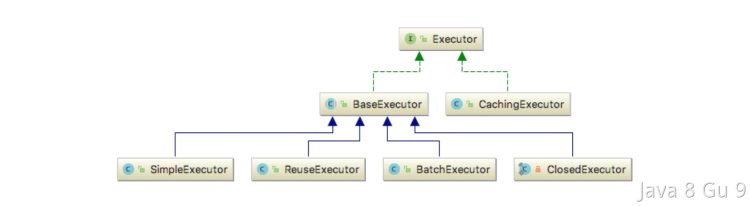
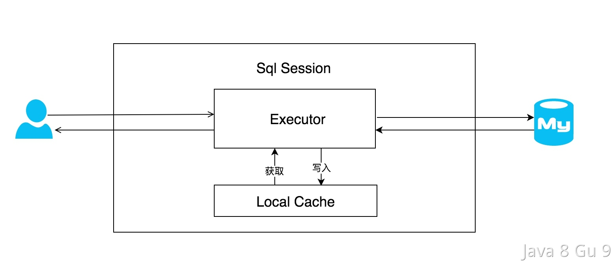
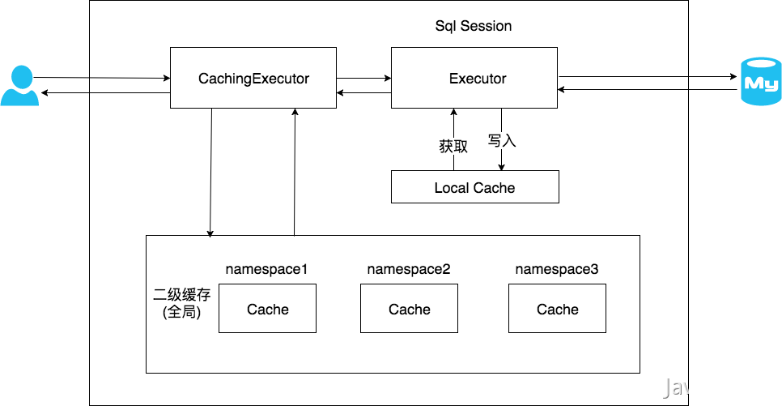

# Mybatis

Mybatis的核心是ORM对象映射和缓存。

## Mybatis的优点

1. 将数据库的操作逻辑和业务操作解耦合，使得开发人员可以专心业务逻辑的处理。  

2. 开发人员只写Sql就可以访问数据库，不需要关心各种数据库连接等额外的操作。各种Connection和Statement都交给了Mybatis来管理 

3. 可以将数据库表的字段按照业务规则直接映射到DO层，不用再像JDBC一样需要业务代码来转换

除此之外，还有其他优点：

1. 支持多种数据源，如POOLED，UNPOOLED，JNDI。同时，还可以整合其他数据库连接池如HikariCP，Druid，C3p0等

2. 支持动态SQL，大大减少了代码的开发量，如if/foreach等常用的动态标签

3. 支持事务性的一级缓存，二级缓存和自定义缓存，其中，一级缓存是以session为生命周期，默认开启；二级缓存则是根据配置的算法来计算过期时间（FIFO，LRU等），二级缓存如果操作不当容易产生脏数据，不建议使用

## Mybatis字段映射的几种方式

Mybatis通过ResultSet对象来获取SQL查询返回的结果集，然后将结果集中的每行记录映射到Java对象中。在字段映射过程中，Mybatis提供了以下几种方式：  

1. 使用列名映射：Mybatis默认使用列名来映射查询结果集中的列与Java对象中的属性。如果列名和Java对象属性名不完全一致，可以通过在SQL语句中使用“AS”关键字或使用别名来修改列名。

2. 使用别名映射：如果查询语句中使用了别名，则Mybatis会优先使用列别名来映射Java对象属性名，而不是列名。

3. 使用ResultMap映射：ResultMap是Mybatis用来映射查询结果集和Java对象属性的关系。可以在映射文件中定义ResultMap，指定Java对象和列之间的映射关系。通过ResultMap，可以实现复杂的字段映射关系和转换。

4. 自定义TypeHandler映射：如果默认的字段映射方式无法满足需求，可以通过实现TypeHandler接口来自定义字段映射规则。TypeHandler可以将查询结果集中的列类型转换为Java对象属性类型，并将Java对象属性类型转换为SQL类型。可以通过在映射文件中定义TypeHandler，来实现自定义映射。  

总之，Mybatis提供了多种灵活的字段映射方式，可以满足不同场景下的需求。

### Mybatis为什么需要提供一个mapper接口，再实现一个xml文件呢？

Mybatis通过全路径类名.方法名的方式作为key，映射一个sql方法。xml文件中的每一个select、insert、delete、update标签代表的sql方法将被转换成一个MapperStatement对象，作为映射的值。当开发者提供一个mapper接口之后，Mybatis将会使用jdk动态代理将mapper接口代理成一个proxy对象，代理对象会拦截方法，将对应方法的MapperStatement执行完，组装好sql，进行查询，得到结果再映射到对应数据类型中，最后返回给调用者。

### 字段映射的过程及原理

Mybatis实现字段映射的代码主要在ResultSetHandler类中。该类是Mybatis查询结果集处理的核心类，负责将JDBC ResultSet对象转换为Java对象，并进行字段映射。  

Mybatis实现字段映射的原理可以简单描述为以下几个步骤：  

1. Mybatis通过JDBC API向数据库发送SQL查询语句，并获得查询结果集。

2. 查询结果集中的每一行数据都被封装成一个ResultSet对象，Mybatis遍历ResultSet对象中的数据。

3. 对于每一行数据，Mybatis根据Java对象属性名和查询结果集中的列名进行匹配。如果匹配成功，则将查询结果集中的该列数据映射到Java对象的相应属性中。

4. 如果Java对象属性名和查询结果集中的列名不完全一致，Mybatis可以通过在SQL语句中使用“AS”关键字或使用别名来修改列名，或者使用ResultMap来定义Java对象属性和列的映射关系。

5. 对于一些复杂的映射关系，例如日期格式的转换、枚举类型的转换等，可以通过自定义TypeHandler来实现。Mybatis将自定义TypeHandler注册到映射配置中，根据Java对象属性类型和查询结果集中的列类型进行转换。

6. 最终，Mybatis将所有映射成功的Java对象封装成一个List集合，返回给用户使用。  

总之，Mybatis通过查询结果集中的列名和Java对象属性名之间的映射关系，将查询结果集中的数据映射到Java对象中。Mybatis提供了多种灵活的映射方式，可以满足不同场景下的需求。

## \#和$的区别是什么？什么情况必须用\$

在Mybatis的mapper文件中，可以使用#{param}和${param}来作为动态参数的替换。  

使用${}方式传入的参数，mybatis不会对它进行特殊处理，而使用#{}传进来的参数，mybatis默认会将其当成字符串。

#{}和${}在预编译处理中是不一样的。mybatis在处理#{}的时候，会将#{}替换为?号，调用PreparedStatement来进行赋值，在数据库层面进行查询时会自动加上单引号，可以有效的避免SQL注入。

所以我们在Mybatis中，能使用#{}的地方应尽量使用#{}，但是有一些情况是必须要用${}的，比如我们要把他用在order by、group by 等语句后面的时候。

order by \${sortItem} \${sortType}

## Mybatis插件的运行原理？

Mybatis只支持针对ParameterHandler、ResultSetHandler、StatementHandler、Executor这四种接口的插件。Mybatis 使用 JDK 的动态代理， 为需要拦截的接口生成代理对象以实现接口方法拦截功能， 每当执行这 4 种接口对象的方法时，就会进入拦截方法，具体就是 InvocationHandler 的invoke() 方法， 拦截那些你指定需要拦截的方法。

Mybatis插件的运行原理主要涉及3个关键接口：Interceptor、Invocation和Plugin。

1. Interceptor：拦截器接口，定义了Mybatis插件的基本功能，包括插件的初始化、插件的拦截方法以及插件的销毁方法。

2. Invocation：调用接口，表示Mybatis在执行SQL语句时的状态，包括SQL语句、参数、返回值等信息。

3. Plugin：插件接口，Mybatis框架在执行SQL语句时，会将所有注册的插件封装成Plugin对象，通过Plugin对象实现对SQL语句的拦截和修改。  

插件的运行流程如下：

1. 首先，当Mybatis框架运行时，会将所有实现了Interceptor接口的插件进行初始化。

2. 初始化后，Mybatis框架会将所有插件和原始的Executor对象封装成一个InvocationChain对象。（这里使用的是责任链模式）

3. 每次执行SQL语句时，Mybatis框架都会通过InvocationChain对象依次调用所有插件的intercept方法，实现对SQL语句的拦截和修改。

4. 最后，Mybatis框架会将修改后的SQL语句交给原始的Executor对象执行，并将执行结果返回给调用方。

通过这种方式，Mybatis插件可以对SQL语句进行拦截和修改，实现各种功能，例如查询缓存、分页、分库分表等。

## Mybatis的工作原理？

无论是Mybatis也好，Spring也罢，它们的执行过程无非可分为启动阶段和运行阶段： 

1. 启动阶段： 
   
   定义配置文件，如XML，注解
   
   解析配置文件，将配置文件加载到内存当中

2. 运行阶段： 
   读取内存中的配置文件，并根据配置文件实现对应的功能

### 代理类的生成

首先Mybatis会根据我们传入接口通过JDK动态代理，生成一个代理对象TestMapper，代理类的主要逻辑在MapperProxy中，而代理逻辑则是通过MapperMethod完成的。 

```java
public T newInstance(SqlSession sqlSession) {
    // mapperProxy实现了Invocationhandler接口，用于JDK动态代理
    final MapperProxy<T> mapperProxy = new MapperProxy<>(sqlSession, mapperInterface, methodCache);
    return newInstance(mapperProxy);
}
// 通过JDK动态代理生成对象
protected T newInstance(MapperProxy<T> mapperProxy) {
    return (T) Proxy.newProxyInstance(mapperInterface.getClassLoader(), new Class[] { mapperInterface }, mapperProxy);
}
```

对于MapperMethod来说，它在创建的时候是需要读取XML或者方法注解的配置项，所以在使用的时候才能知道具体代理的方法的SQL内容。同时，这个类也会解析和记录被代理方法的入参和出参，以方便对SQL的查询占位符进行替换，同时对查询到的SQL结果进行转换。

### 执行SQL

代理类生成之后，就可以执行代理类的具体逻辑，也就是真正开始执行用户自定义的SQL逻辑了。

首先会进入到MapperMethod核心的执行逻辑，如下所示：

```java
public Object execute(SqlSession sqlSession, Object[] args) {
    Object result;
    switch (command.getType()) {
      case INSERT: {
      Object param = method.convertArgsToSqlCommandParam(args);
        result = rowCountResult(sqlSession.insert(command.getName(), param));
        break;
      }
      case UPDATE: {
        Object param = method.convertArgsToSqlCommandParam(args);
        result = rowCountResult(sqlSession.update(command.getName(), param));
        break;
      }
      case DELETE: {
        Object param = method.convertArgsToSqlCommandParam(args);
        result = rowCountResult(sqlSession.delete(command.getName(), param));
        break;
      }
      case SELECT:
        if (method.returnsVoid() && method.hasResultHandler()) {
          executeWithResultHandler(sqlSession, args);
          result = null;
        } else if (method.returnsMany()) {
          result = executeForMany(sqlSession, args);
        } else if (method.returnsMap()) {
          result = executeForMap(sqlSession, args);
        } else if (method.returnsCursor()) {
          result = executeForCursor(sqlSession, args);
        } else {
          Object param = method.convertArgsToSqlCommandParam(args);
          result = sqlSession.selectOne(command.getName(), param);
        }
        break;
      case FLUSH:
        result = sqlSession.flushStatements();
        break;
      default:
        throw new BindingException("Unknown execution method for: " + command.getName());
    }
     // ...
    return result;
  }
```

通过代码我们可以很清晰的发现，为什么Mybatis的insert，update和delete会返回行数的原因。业务处理上，我们经常通过update==1来判断当前语句是否更新成功。 
这里一共做了两件事情，一件事情是通过BoundSql将方法的入参转换为SQL需要的入参形式，第二件事情就是通过SqlSession来执行对应的Sql。下面我们通过select来举例。

### 缓存

Sqlsession是Mybatis对Sql执行的封装，真正的SQL处理逻辑要通过Executor来执行。Executor有多个实现类，因为在查询之前，要先check缓存是否存在，所以默认使用的是CachingExecutor类，顾名思义，它的作用就是二级缓存。



CachingExecutor的执行逻辑如下所示：

```java
public <E> List<E> query(MappedStatement ms, Object parameterObject, RowBounds rowBounds, ResultHandler resultHandler, CacheKey key, BoundSql boundSql)
      throws SQLException {
    Cache cache = ms.getCache();
    if (cache != null) {
      flushCacheIfRequired(ms);
      if (ms.isUseCache() && resultHandler == null) {
        ensureNoOutParams(ms, boundSql);
        @SuppressWarnings("unchecked")
        List<E> list = (List<E>) tcm.getObject(cache, key);
        if (list == null) {
          list = delegate.<E> query(ms, parameterObject, rowBounds, resultHandler, key, boundSql);
          // 放缓存
          tcm.putObject(cache, key, list); // issue #578 and #116
        }
        return list;
      }
    }
    // 若二级缓存为空，则重新查询数据库
    return delegate.<E> query(ms, parameterObject, rowBounds, resultHandler, key, boundSql);
  }
```

二级缓存是和命名空间绑定的，如果多表操作的SQL的话，是会出现脏数据的。同时如果是不同的事务，也可能引起脏读，所以要慎重。 
如果二级缓存没有命中则会进入到BaseExecutor中继续执行，在这个过程中，会调用一级缓存执行。 
值得一提的是，在Mybatis中，缓存分为PerpetualCache, BlockingCache, LruCache等，这些cache的实现则是借用了装饰者模式。一级缓存使用的是PerpetualCache，里面是一个简单的HashMap。一级缓存会在更新的时候，事务提交或者回滚的时候被清空。换句话说，一级缓存是和SqlSession绑定的。

### 查询数据库

如果一级缓存中没有的话，则需要调用JDBC执行真正的SQL逻辑。我们知道，在调用JDBC之前，是需要建立连接的，如下代码所示：

```java
private Statement prepareStatement(StatementHandler handler, Log statementLog) throws SQLException {
    Statement stmt;
    Connection connection = getConnection(statementLog);
    stmt = handler.prepare(connection, transaction.getTimeout());
    handler.parameterize(stmt);
    return stmt;
}
```

我们会发现，Mybatis并不是直接从JDBC获取连接的，通过数据源来获取的，Mybatis默认提供了三种数据源：JNDI，PooledDataSource和UnpooledDataSource，我们也可以引入第三方数据源，如Druid等。包括驱动等都是通过数据源获取的。 
获取到Connection之后，还不够，因为JDBC的数据库操作是需要Statement的，所以Mybatis专门抽象出来了StatementHandler处理类来专门处理和JDBC的交互，如下所示：

```java
public <E> List<E> query(Statement statement, ResultHandler resultHandler) throws SQLException {
    String sql = boundSql.getSql();
    statement.execute(sql);
    return resultSetHandler.<E>handleResultSets(statement);
  }
```

其实这三行代码就代表了Mybatis执行SQL的核心逻辑：组装SQL，执行SQL，组装结果。仅此而已。 
具体Sql是如何组装的呢？是通过BoundSql来完成的，具体组装的逻辑大家可以从org.apache.ibatis.mapping.MappedStatement#getBoundSql中了解，这里不再赘述。

### 处理查询结果

当我们获取到查询结果之后，就需要对查询结果进行封装，即把查询到的数据库字段映射为DO对象。 
因为此时我们已经拿到了执行结果ResultSet，同时我们也在应用启动的时候在配置文件中配置了DO到数据库字段的映射ResultMap，所以通过这两个配置就可以转换。核心的转换逻辑是通过TypeHandler完成的，流程如下所示： 

1. 创建返回的实体类对象，如果该类是延迟加载，则先生成代理类

2. 根据ResultMap中配置的数据库字段，将该字段从ResultSet取出来

3. 从ResultMap中获取映射关系，如果没有，则默认将下划线转为驼峰式命名来映射

4. 通过setter方法反射调用，将数据库的值设置到实体类对象当中

## Mybatis的缓存机制

Mybatis的缓存机制有两种：一级缓存和二级缓存。

### 一级缓存

在同一个会话中，Mybatis会将执行过的SQL语句的结果缓存到内存中，下次再执行相同的SQL语句时，会先查看缓存中是否存在该结果，如果存在则直接返回缓存中的结果，不再执行SQL语句。一级缓存是默认开启的，可以通过在Mybatis的配置文件中设置禁用或刷新缓存来控制缓存的使用。 
工作流程如下：



对于一级缓存，有两点需要注意的是：  

1. MyBatis一级缓存内部设计简单，只是一个没有容量限定的HashMap，在缓存的功能性上有所欠缺。

2. MyBatis的一级缓存最大范围是SqlSession内部，有多个SqlSession或者分布式的环境下，数据库写操作会引起脏数据，换句话说，当一个SqlSession查询并缓存结果后，另一个SqlSession更新了该数据，其他缓存结果的SqlSession是看不到更新后的数据的。所以建议设定缓存级别为Statement。

### 二级缓存

二级缓存是基于命名空间的缓存，它可以跨会话，在多个会话之间共享缓存，可以减少数据库的访问次数。要使用二级缓存，需要在Mybatis的配置文件中配置相应的缓存实现类，并在需要使用缓存的Mapper接口上添加@CacheNamespace注解。二级缓存的使用需要注意缓存的更新和失效机制，以及并发操作的问题。
工作流程如下：



因为二级缓存是基于namespace的，所以一般情况下，Mybatis的二级缓存是不适合多表查询的情况的。举个例子： 

我们有两个表：student和class，我们为这两个表创建了两个namespace去对这两个表做相关的操作。同时，为了进行多表查询，我们在namespace=student的空间中，对student和class两张表进行了关联查询操作（sqlA）。此时就会在namespace=student的空间中把sqlA的结果缓存下来，如果我们在namespace=class下更新了class表，namespace=student是不会更新的，这就会导致脏数据的产生。

## Mybatis可以实现动态SQL么？

可以，动态SQL是指根据不同的条件生成不同的SQL语句，可以避免在编写SQL语句时出现重复的代码，提高代码的复用性和灵活性。  

MyBatis中提供了一些标签来支持动态SQL的生成，常见的几个有：

### if标签

用于根据条件生成SQL语句的一部分。例如：

```xml
<select id="getUsers" resultType="User">
  SELECT * FROM user
  WHERE
    <if test="name != null and name != ''">
      name like #{name}
    </if>
    <if test="age != null">
      and age = #{age}
    </if>
</select>
```

### choose、when、otherwise标签

用于根据不同的条件选择不同的SQL语句块。例如：

```xml
<select id="getUsers" resultType="User">
  SELECT * FROM user
  <where>
    <choose>
      <when test="name != null and name != ''">
        and name like #{name}
      </when>
      <when test="age != null">
        and age = #{age}
      </when>
      <otherwise>
        and sex = 'M'
      </otherwise>
    </choose>
  </where>
</select>
```

使用choose、when、otherwise标签判断了查询条件中的name和age是否为空，如果不为空，则在SQL语句中加入相应的条件；否则加入默认的条件。

### foreach标签

用于遍历集合并生成多个SQL语句块。例如：

```xml
<update id="getUsers" parameterType="List">
 SELECT * FROM user
  where id in
    <foreach collection="list" item="user" open="(" separator="," close=")">
      #{user.id}
    </foreach>
</update>
```

使用foreach标签遍历了一个User集合，并根据集合中的元素生成了多个SQL语句块，用于批量更新数据库中的数据。  

### Where标签

有这样的一个例子：

```xml
<select id="findActiveBlogLike"
     resultType="Blog">
  SELECT * FROM BLOG 
  <where> 
    <if test="state != null">
         state = #{state}
    </if> 
    <if test="title != null">
        AND title like #{title}
    </if>
    <if test="author != null and author.name != null">
        AND author_name like #{author.name}
    </if>
  </where>
</select>
```

Where标签的一个作用是将内部的查询条件用where前缀拼上，如果内部查询条件为空，则where前缀也不会生成。这就避免了可能出现的多余字符导致sql出现格式错误。

例如这个例子，如果查询参数没有state、title、author_name，则where保证这个sql修改为select * from BLOG

Where标签的另一个作用是可以保证内部的查询条件如果包含and、or元素，where会将它消除，保证查询条件格式正确。

例如上面的例子，如果查询参数没有state参数，有title参数，则where会保证查询sql修改为

where title like ?

### trim标签

trim标签可以指定内部内容的前缀和后缀，使用prefix和suffix属性指定。也可以使用prefixOverrides和suffixOverrides属性将内部查询条件的起始位置、结束位置的and、or元素消除，保证查询条件格式正确，类似于where标签。

有这样的一个例子：

```xml
<trim prefix="(" prefixOverrides="and" suffix=")">
    <if test="state != null">
      and state = #{state}
    </if> 
    <if test="title != null">
      and title like #{title}
    </if>
    <if test="author != null and author.name != null">
      and author_name like #{author.name}
    </if>
</trim>
```

这里无论查询时缺少哪个参数，拼装出来的sql结果都会是(xxx = '' and yyy = '')，不会出现多余的and。

所以trim标签可以作为一个大块查询条件的包装，将内部查询条件组合成正确的sql格式。

除了以上示例中提到的标签外，MyBatis还提供了很多其他的标签来支持动态SQL的生成，可以根据实际需求进行选择和使用。

## 使用MyBatis如何实现分页？

MyBatis中可以通过两种方式来实现分页：基于物理分页和基于逻辑分页。  

所谓物理分页，指的是最终执行的SQL中进行分页，即SQL语句中带limit，这样SQL语句执行之后返回的内容就是分页后的结果。  

所谓逻辑分页，就是在SQL语句中不进行分页，照常全部查询，在查询到的结果集中，再进行分页。  

在MyBatis中，想要实现分页通常有四种做法：

### 在SQL中添加limit语句--物理分页

select * from user limit #{offset}, #{limit}

### 基于PageHelper分页插件，实现分页--物理分页

在使用PageHelper时，只需要在查询语句前调用PageHelper.startPage()方法，然后再进行查询操作。PageHelper会自动将查询结果封装到一个PageInfo对象中，包含了分页信息和查询结果。使用PageHelper时，不需要在mapper.xml文件中使用limit语句。

```java
// Java代码中使用 PageHelper
PageHelper.startPage(1, 10);
List<User> userList = userMapper.getUsers();
PageInfo<User> pageInfo = new PageInfo<>(userList);
```

当我们在代码中使用PageHelper.startPage(int pageNum, int pageSize)设置分页参数之后，其实PageHelper会把他们存储到ThreadLocal中。  

PageHelper会在执行器的query方法执行之前，会从ThreadLocal中再获取分页参数信息，页码和页大小，然后执行分页算法，计算需要返回的数据块的起始位置和大小。最后，PageHelper会通过修改SQL语句的方式，在SQL后面动态拼接上limit语句，限定查询的数据范围，从而实现物理分页的效果。并且在查询结束后再清除ThreadLocal中的分页参数。

### 基于RowBounds实现分页--逻辑分页

RowBounds是MyBatis中提供的一个分页查询工具，其中可以设置offset和limit用于分页。

```java
int offset = 10; // 偏移量
int limit = 5; // 每页数据条数
RowBounds rowBounds = new RowBounds(offset, limit);
List<User> userList = sqlSession.selectList("getUsers", null, rowBounds);
```

### 基于MyBatis-Plus实现分页--物理分页/逻辑分页

MyBatis-Plus中提供了分页插件，可实现简单易用的分页功能，可以根据传入的分页参数自动计算出分页信息，无需手动编写分页SQL语句。

```java
public interface UserMapper extends BaseMapper<User> {
 List<User> selectUserPage(Page<User> page, @Param("name") String name);
}
```

默认情况下，MyBatis-Plus使用的是物理分页。如果需要使用逻辑分页，可以在分页插件的配置中指定分页的类型：

```xml
<plugins>
    <plugin interceptor="com.baomidou.mybatisplus.extension.plugins.PaginationInterceptor">
        <property name="logical" value="true"/> <!-- 设置为逻辑分页 -->
    </plugin>
</plugins>
```

上面的配置中，MyBatis-Plus的分页插件实现了一个拦截器，用于拦截SQL查询请求，做分页处理。  

配置完成后，分页插件就会自动拦截所有的SQL查询请求，计算分页查询的起始位置和记录数，并在SQL语句中加入LIMIT语句。同时，MyBatis-Plus还提供了许多其他的配置选项，例如分页的类型（使用物理分页或逻辑分页）、排序等。

## MyBatis-Plus有什么用？

MyBatis-Plus是一个增强的MyBatis框架，提供了许多实用的功能和工具

### 主要功能

1. 通用Mapper：提供了一组通用的Mapper接口和实现，可以快速进行增删改查操作，无需手写SQL语句。例如BaseMapper、ConditionMapper等：
   
   ```java
   public interface UserMapper extends BaseMapper<User> {
   }
   ```

2. 分页插件：提供了一种简单易用的分页功能，可以根据传入的分页参数自动计算出分页信息，无需手动编写分页SQL语句。
   
   ```java
   public interface UserMapper extends BaseMapper<User> {
       List<User> selectUserPage(Page<User> page, @Param("name") String name);
   }
   ```

3. 自动生成代码：可以根据数据库表自动生成实体类、Mapper接口、Mapper XML映射文件等代码，大大减少了开发人员的工作量。
   
   ```java
   AutoGenerator generator = new AutoGenerator();
   generator.setDataSource(dataSourceConfig);
   generator.setPackageInfo(new PackageConfig().setParent("com.example.mybatisplus"));
   generator.setGlobalConfig(new GlobalConfig().setOutputDir(System.getProperty("user.dir") + "/src/main/java"));
   generator.setTemplateEngine(new FreemarkerTemplateEngine());
   generator.execute();
   ```

4. Lambda表达式支持：提供了LambdaQueryWrapper和LambdaUpdateWrapper，可以使用Lambda表达式来构造查询条件和更新操作，使得代码更加简洁和易读。
   
   ```java
   LambdaQueryWrapper<User> queryWrapper = new LambdaQueryWrapper<>();
   queryWrapper.eq(User::getName, "Tom").gt(User::getAge, 18);
   List<User> userList = userMapper.selectList(queryWrapper);
   ```

5. 性能分析插件：提供了性能分析插件，可以帮助开发人员分析SQL执行效率，优化数据库操作。

### 缺点

1. 技术选型限制：MyBatis-Plus是基于MyBatis的增强工具，因此使用MyBatis-Plus需要熟悉MyBatis的使用，对于不熟悉MyBatis的开发人员来说可能需要一些时间学习。

2. 版本依赖问题：MyBatis-Plus的版本依赖于MyBatis的版本，因此需要注意版本的兼容性。

3. 自动映射不可靠：MyBatis-Plus提供了自动映射功能，但是在某些情况下可能不够可靠，需要手动进行映射。

4. 代码生成器生成的代码可能需要手动调整：MyBatis-Plus的代码生成器可以自动生成大量的代码，但是有时候生成的代码可能不符合项目的需求，需要手动进行调整。

## sql in 超过1000的最佳修改方式

我们日常开发过程中肯定遇到过这种问题：

当mybatis的in查询条件超过1000时会报错，需要修改in查询的部分

示例代码如下：

```xml
ID in      
 <foreach collection="itemIds" index="index" item="item" open="(" close=")">
    <if test="index != 0">
         <choose>
            <when test="index % 1000 == 999"> ) OR ID IN( </when>
                          <otherwise>,</otherwise>
         </choose>
    </if>
   #{item}
 </foreach>
```

如果是普通查询，到这里一般就认为没啥问题了。但是，仔细研究这条sql语句的话，会找出漏洞。

### 我们先写一个基本使用案例：

```xml
select * from student where sex = #{sex}
 <if test="xxxList != null and xxxList.size() > 0">
            and id in
            <foreach collection="idList" item="item" index="index" open="(" close=")">
                <if test="index > 0">
                    <choose>
                        <when test="index % 1000 == 999"> ) or id in( </when>
                          <otherwise>,</otherwise>
                     </choose>
                </if>
                #{item}
            </foreach>
        </if>
```

当参数不超过1000时，sql语句like：

select * from student where sex = #{sex} and id in ('1','2')

当超过1000时，sql语句like：

select * from student where sex = #{sex} and id in ('1',...'999') or id in ('1000','1001')

#### 注意：

这里的查询条件从查询sex和id同时满足要求变成了sex和id在999以内为一个条件，同时or上id在1000以上为另一个条件。这就导致原本的查询条件变成了两组，查询到的结果变多了。

这里如果看懂了就不需要看这个解释部分，如果没看懂，请继续查看这一部分。

### 解释部分

原本这条sql的查询要求是根据学生性别和学生id查询到对应的学生记录。

即select * from student where sex = #{sex} and id in ('1','2')这条sql满足查询要求，不会查询到多余的数据。

如果使用select * from student where sex = #{sex} and id in ('1',...'999') or id in ('1000','1001')查询，将会得到以下数据：

学生id在1000以内的，且性别为指定性别的数据+学生id在1000以上的数据。

按照查询要求，正确的数据应该是：

学生id在1000以内的，且性别为指定性别的数据+学生id在1000以上的，且性别为指定性别的数据。

这样就能明白，上面的sql改变了查询要求，返回了不应该查到的数据。

### 最佳修改方式

理论上，应该得到的sql语句应该是：

select * from student where sex = #{sex} and (id in ('1',...'999') or id in ('1000','1001'))

所以，修改的sql in形式应该如下：

```xml
select * from student where sex = #{sex}
 <if test="xxxList != null and xxxList.size() > 0">
            and (id in
            <foreach collection="idList" item="item" index="index" open="(" close=")">
                <if test="index > 0">
                    <choose>
                        <when test="index % 1000 == 999"> ) or id in( </when>
                          <otherwise>,</otherwise>
                     </choose>
                </if>
                #{item}
            </foreach>
            )
        </if>
```

### Mybatis-Generator生成代码也需要修改

Mybatis-Generator生成的代码也有sql in查询的问题，需要开发者自己在项目中找到并修改。

```xml
<when test="criterion.listValue">
    and ${criterion.condition}
    <foreach close=")" collection="criterion.value" item="listItem" open="(" separator=",">
    #{listItem}
    </foreach>
</when>
```

修改后的代码如下：

```xml
<when test="criterion.listValue">
    and (${criterion.condition}
    <foreach collection="criterion.value" item="listItem" index="index" open="(" close=")">
          <if test="index > 0">
               <choose>
                    <when test="index % 1000 == 999"> ) or ${criterion.condition}( </when>
                    <otherwise>,</otherwise>
               </choose>
           </if>
           #{listItem}
    </foreach>
     )
</when>
```

如果公司有定制化Mybatis-Generator的能力，也可以自己修改Mybatis-Generator项目的生成代码，最后将指定版本工具推广到全公司哟~

## 如何用Mybatis实现批量插入？

常规的sql写法应该是：

```sql
insert into table (id, name,sex,address)
 values
 (?,?,?,?),(?,?,?,?),(?,?,?,?),(?,?,?,?)
```

项目中的写法如下：

### 业务层

service中对大批量数据进行分片，每一片设定1000个元素，再对每一片进行插入操作

这里的分片我采用的是guava提供的api，理论上其他的commons-collections4、Hutool包能实现相同的功能的都可以直接用。

```java
// 将list分片成1000个元素一个list，执行批量插入操作
List<List<User>> partition = Lists.partition(userList, 1000);
for (List<User> userList : partition) {
     userMapper.insertBatch(userList);
}
```

### sql层

xml中定义的批量插入语句

```xml
<insert id="insertBatch" >
    insert into user ( <include refid="Base_Column_List" /> ) 
    values 
    <foreach collection="list" item="item" index="index" separator=",">
        (#{item.id},#{item.name},#{item.sex},#{item.address})
    </foreach>
</insert>
```

## mybaticsPlus底层实现是什么？
