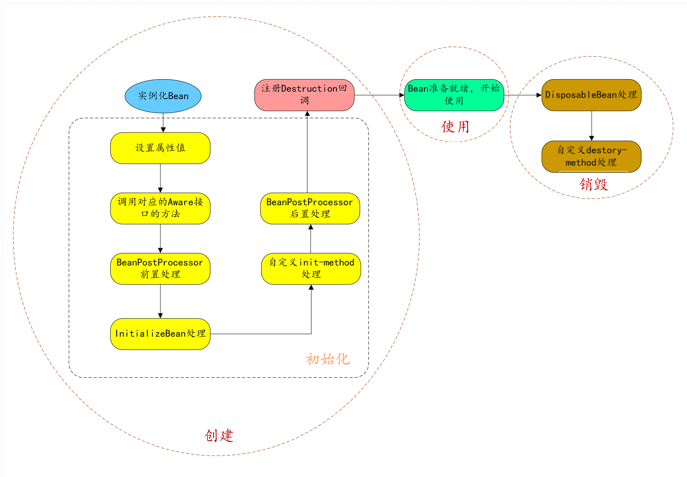
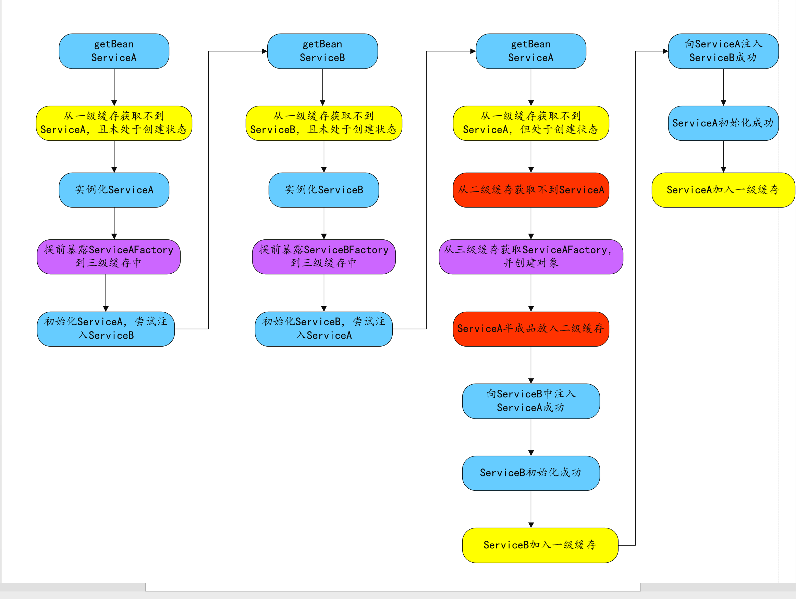
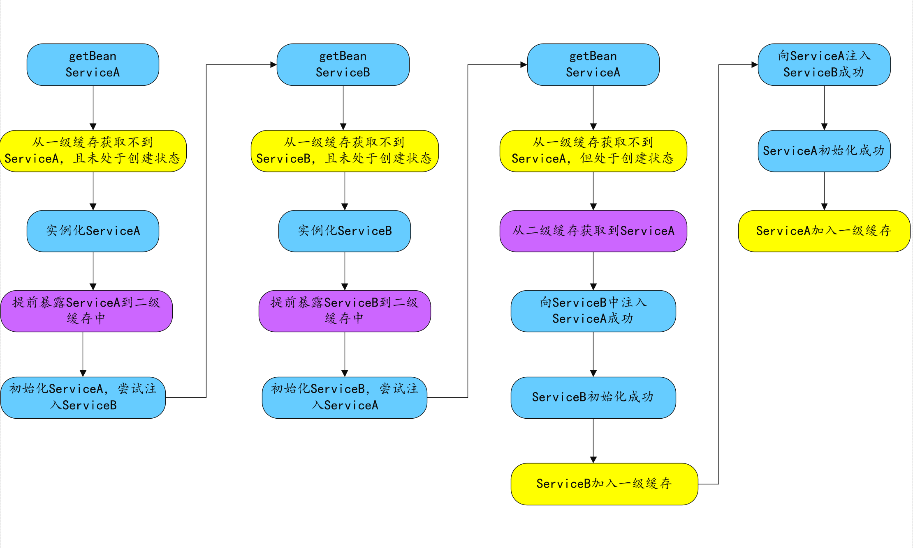
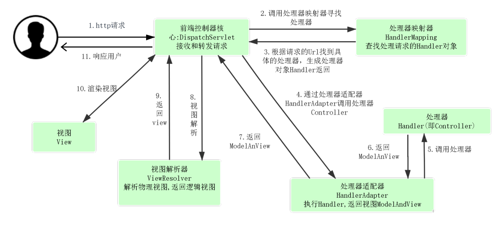
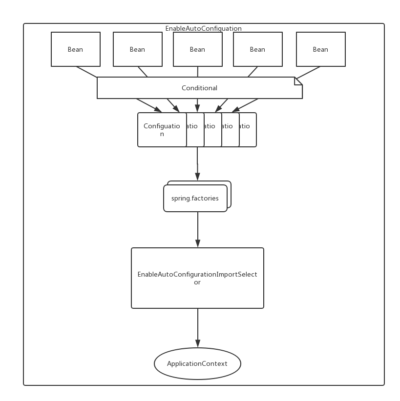
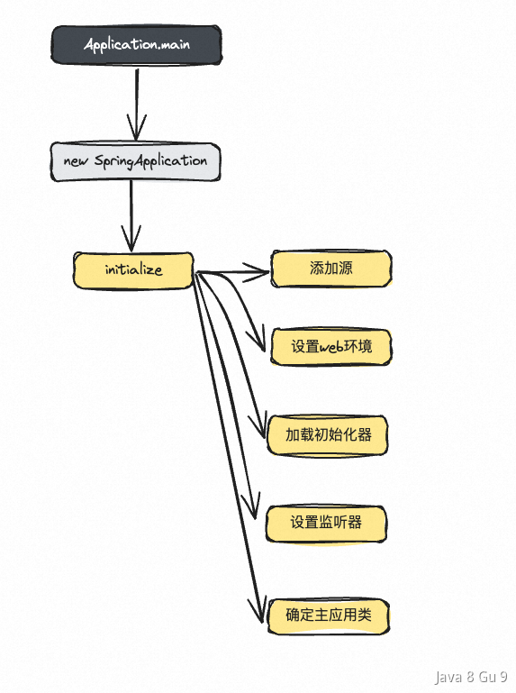
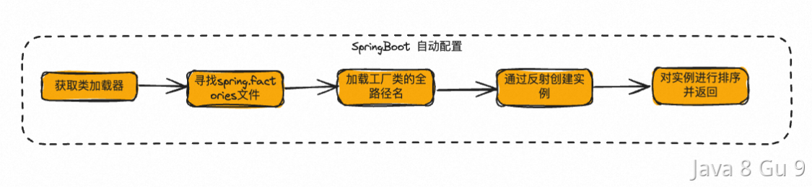
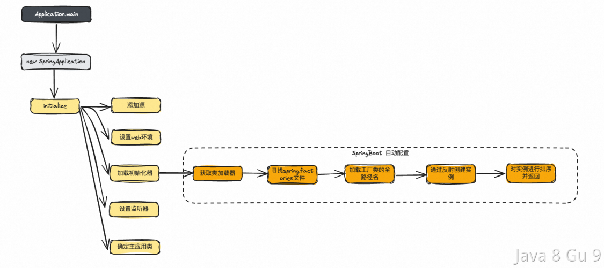
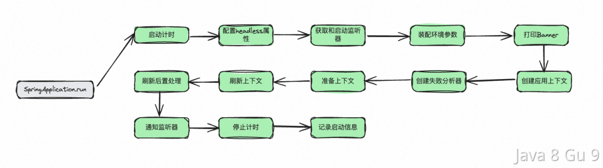
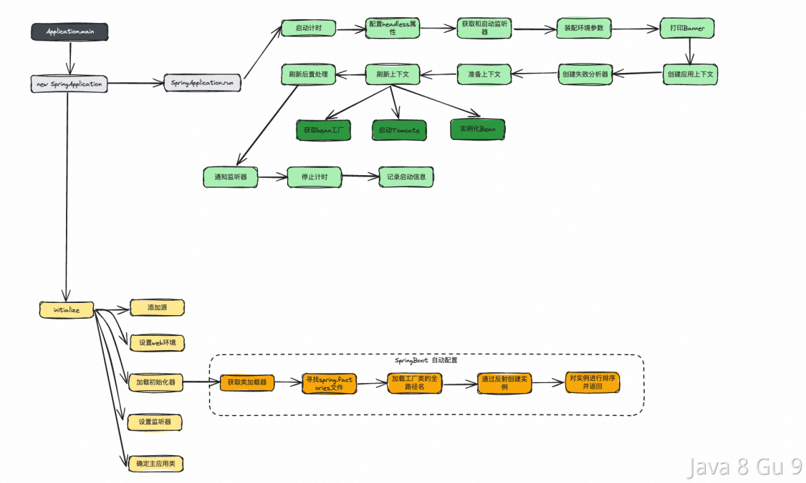

# Spring笔记

## Spring bean初始化步骤

userService.class->反射调用无参构造方法->普通对象初始化->实例化bean->属性值设置->检查aware接口实现->调用beanpostprocess的前置处理方法->执行afterPropertiesSet方法->调用自定义初始化方法->调用beanpostprocess的后置处理方法：aop->注册Destruction方法回调->放入容器map<对象名,对象>

### Spring初始化bean用类的哪个构造方法？

有无参的构造方法，就用无参的；没有无参的，有唯一的一个有参构造方法，就用唯一的；有多个有参的构造方法，直接报错，找不到用哪个构造方法初始化；有多个有参的构造方法，用户在有参构造方法上加autowired注解，就用这个指定的构造方法。

## 单例bean是真的一个类型只有一个吗？

单例bean是对象名相同的只能有一个，orderService名的只有一个，orderService1名的只有一个。例如可以写几个返回OrderService的方法，加上bean注解后，都可以实例化。

## Spring创建一个依赖对象bean的方式

先通过依赖对象的类来找，找到只有一个bean，则依赖对象找到；找到多个bean，则根据依赖对象的属性名来找，相同属性名的是匹配的；找不到则会报错。

## 如何理解 Spring Boot 中的 Starter

使用spring + springmvc使用，如果需要引入mybatis等框架，需要到xml中定义mybatis需要的bean。starter就是定义一个starter的jar包，写一个@Configuration配置类、将这些bean定义在里面，然后在starter包的META-INF/spring.factories中写入该配置类，springboot会按照约定来加载该配置类。开发人员只需要将相应的starter包依赖进应用，进行相应的属性配置（使用默认配置时，不需要配置），就可以直接进行代码开发，使用对应的功能了，比如mybatis-spring-boot--starter，spring-boot-starter-redis。

## 如何理解Spring IOC的设计方式？

所谓的IOC（inversion of control），就是控制反转的意思。何为控制反转？

在传统的软件设计中，应用程序通常控制着对象的创建和管理。例如，一个对象依赖另一个对象，那么它会直接new一个对象出来，这是控制流程的设计思想。

在Spring中，控制关系得到了反转。对象的控制权掌握在Spring容器中，容器负责对象的创建和管理，并在需要的时候将它们注入到容器中。

简单来说就是，我们原先创建对象会new一个出来，这个对象如果依赖其他对象，我们也需要new出来，并进行构造。这样循环往复，直到全部对象都构造完毕，我们才可以开始使用原来的第一个对象。

现在有了Spring容器，我们只需要给类加上相应注解@Component等等，并给依赖加上@Autowired即可注入依赖对象。

### 使用IOC的好处

使用者不需要关心依赖对象的实现细节，直接通过注解注入对象既可以开始使用。如果我依赖一个对象，还需要知道并构造全部的实现细节才可以使用，那相应的开发成本就要提高不少。

不用创建多个对象造成浪费。如果大部分场景下的对象只要单例即可，那每次依赖对象时都new一遍将造成浪费。Spring默认构造的bean都是单例的，引用时将不会浪费。

Bean的修改不需要依赖方感知。如果采用new的方式得到一个beanA，对beanA的修改还需要通知到所有依赖beanA的对象进行相应修改。但是如果采用IOC的方式，其他bean将不需要感知到这个改变。

### Spring IOC的启动流程

对于Spring IOC来说，在容器启动的时候，它会根据每个bean的设置将bean注入到Spring容器中，如果需要依赖其他的bean，Spring会从容器中直接拿对应的bean。即：

1. 从配置元数据中获取要DI的业务POJO（这里的配置元数据包括xml，注解，configuration类等）

2. 将业务POJO形成BeanDefinition注入到Spring Container中

3. 使用方通过ApplicationContext从Spring Container直接获取即可。

## 描述一下Spring AOP

AOP(Aspect-Oriented Programming)，即面向切面编程，用人话说就是把公共的逻辑抽出来，让开发者可以更专注于业务逻辑开发。

和IOC一样，AOP也指的是一种思想。AOP思想是OOP（Object-Oriented Programming）的补充。OOP是面向类和对象的，但是AOP则是面向不同切面的。一个切面可以横跨多个类和对象去操作，极大的丰富了开发者的使用方式，提高了开发效率。

譬如，一个订单的创建，可能需要以下步骤： 

1. 权限校验

2. 事务管理

3. 创建订单

4. 日志打印

如果使用AOP思想，我们就可以把这四步当成四个“切面”，让业务人员专注开发第三个切面，其他三个切面则是基础的通用逻辑，统一交给AOP封装和管理。

Spring AOP有如下概念（列举下，不用刻意记）：

| 术语                            | 翻译   | 释义                                                                                                      |
| ----------------------------- | ---- | ------------------------------------------------------------------------------------------------------- |
| Aspect                        | 切面   | 切面由切入点和通知组成，它既包含了横切逻辑的定义，也包括了切入点的定义。切面是一个横切关注点的模块化，一个切面能够包含同一个类型的不同增强方法，比如说事务处理和日志处理可以理解为两个切面。          |
| PointCut                      | 切入点  | 切入点是对连接点进行拦截的条件定义，决定通知应该作用于截哪些方法。（充当where角色，即在哪里做）                                                      |
| Advice                        | 通知   | 通知定义了通过切入点拦截后，应该在连接点做什么，是切面的具体行为。（充当what角色，即做什么）                                                        |
| Target                        | 目标对象 | 目标对象指将要被增强的对象，即包含主业务逻辑的类对象。或者说是被一个或者多个切面所通知的对象。                                                         |
| JoinPoint                     | 连接点  | 连接点是程序在运行时的执行点，这个点可以是正在执行的方法，或者是正在抛出的异常。因为Spring只支持方法类型的连接点，所以在Spring中连接点就是运行时刻被拦截到的方法。连接点由两个信息确定：<br/> |
| ●                             |      |                                                                                                         |
| 方法(表示程序执行点，即在哪个目标方法)          |      |                                                                                                         |
| <br/>●                        |      |                                                                                                         |
| 相对点(表示方位，即目标方法的什么位置，比如调用前，后等) |      |                                                                                                         |
| Weaving                       | 织入   | 织入是将切面和业务逻辑对象连接起来, 并创建通知代理的过程。织入可以在编译时，类加载时和运行时完成。在编译时进行织入就是静态代理，而在运行时进行织入则是动态代理。                       |

对于通知类型来说：

| Before Advice          | 连接点执行前执行的逻辑                     |
| ---------------------- | ------------------------------- |
| After returning advice | 连接点正常执行（未抛出异常）后执行的逻辑            |
| After throwing advice  | 连接点抛出异常后执行的逻辑                   |
| After finally advice   | 无论连接点是正常执行还是抛出异常，在连接点执行完毕后执行的逻辑 |
| Around advice          | 该通知可以非常灵活的在方法调用前后执行特定的逻辑        |

## Spring AOP如何实现的？

从Bean的初始化流程中来讲，Spring的AOP会在bean实例的实例化已完成，进行初始化后置处理时创建代理对象，即下面代码中的applyBeanPostProcessorsAfterInitialization部分。

```java
protected Object initializeBean(final String beanName, final Object bean, RootBeanDefinition mbd) {

    //...
    //检查Aware
    invokeAwareMethods(beanName, bean);

    //调用BeanPostProcessor的前置处理方法
    Object wrappedBean = bean;
    if (mbd == null || !mbd.isSynthetic()) {
        wrappedBean = applyBeanPostProcessorsBeforeInitialization(wrappedBean, beanName);
    }

    //调用InitializingBean的afterPropertiesSet方法或自定义的初始化方法及自定义init-method方法
    try {
        invokeInitMethods(beanName, wrappedBean, mbd);
    }
    catch (Throwable ex) {
        throw new BeanCreationException(
                (mbd != null ? mbd.getResourceDescription() : null),
                beanName, "Invocation of init method failed", ex);
    }
    //调用BeanPostProcessor的后置处理方法
    if (mbd == null || !mbd.isSynthetic()) {
        wrappedBean = applyBeanPostProcessorsAfterInitialization(wrappedBean, beanName);
    }
    return wrappedBean;
}
```

applyBeanPostProcessorsAfterInitialization中会遍历所有BeanPostProcessor，然后调用其postProcessAfterInitialization方法，而AOP代理对象的创建就是在AbstractAutoProxyCreator这个类的postProcessAfterInitialization中：

```java
@Override
public Object postProcessAfterInitialization(Object bean, String beanName) throws BeansException {
    if (bean != null) {
        Object cacheKey = getCacheKey(bean.getClass(), beanName);
        if (this.earlyProxyReferences.remove(cacheKey) != bean) {
            return wrapIfNecessary(bean, beanName, cacheKey);
        }
    }
    return bean;
}
```

这里面最重要的就是wrapIfNecessary方法了：

```java
/**
 * 如果需要，对bean进行包装。
 *
 * @param bean 要包装的目标对象
 * @param beanName bean的名称
 * @param cacheKey 缓存键
 * @return 包装后的对象，可能是原始对象或代理对象
 */
protected Object wrapIfNecessary(Object bean, String beanName, Object cacheKey) {
    // 如果beanName不为null且在目标源bean集合中，则直接返回原始对象
    if (beanName != null && this.targetSourcedBeans.contains(beanName)) {
        return bean;
    }

    // 如果缓存键对应的值为Boolean.FALSE，则直接返回原始对象
    if (Boolean.FALSE.equals(this.advisedBeans.get(cacheKey))) {
        return bean;
    }

    // 如果bean的类型为基础设施类，或者应跳过该类型的代理，则将缓存键对应的值设置为Boolean.FALSE并返回原始对象
    if (isInfrastructureClass(bean.getClass()) || shouldSkip(bean.getClass(), beanName)) {
        this.advisedBeans.put(cacheKey, Boolean.FALSE);
        return bean;
    }

    // 如果存在advice，为bean创建代理对象
    Object[] specificInterceptors = getAdvicesAndAdvisorsForBean(bean.getClass(), beanName, null);
    if (specificInterceptors != DO_NOT_PROXY) {
        // 将缓存键对应的值设置为Boolean.TRUE
        this.advisedBeans.put(cacheKey, Boolean.TRUE);
        // 创建代理对象
        Object proxy = createProxy(
                bean.getClass(), beanName, specificInterceptors, new SingletonTargetSource(bean));
        // 将代理对象的类型与缓存键关联起来
        this.proxyTypes.put(cacheKey, proxy.getClass());
        return proxy;
    }

    // 如果没有advice，将缓存键对应的值设置为Boolean.FALSE并返回原始对象
    this.advisedBeans.put(cacheKey, Boolean.FALSE);
    return bean;
}
```

createProxy的主要作用是根据给定的bean类、bean名称、特定拦截器和目标源，创建代理对象：

```java
/**
 * 根据给定的bean类、bean名称、特定拦截器和目标源，创建代理对象。
 *
 * @param beanClass 要代理的目标对象的类
 * @param beanName bean的名称
 * @param specificInterceptors 特定的拦截器数组
 * @param targetSource 目标源
 * @return 创建的代理对象
 */
protected Object createProxy(
        Class<?> beanClass, String beanName, Object[] specificInterceptors, TargetSource targetSource) {

    // 如果beanFactory是ConfigurableListableBeanFactory的实例，将目标类暴露给它
    if (this.beanFactory instanceof ConfigurableListableBeanFactory) {
        AutoProxyUtils.exposeTargetClass((ConfigurableListableBeanFactory) this.beanFactory, beanName, beanClass);
    }

    // 创建ProxyFactory实例，并从当前代理创建器复制配置
    ProxyFactory proxyFactory = new ProxyFactory();
    proxyFactory.copyFrom(this);

    // 如果不强制使用CGLIB代理目标类，根据条件决定是否使用CGLIB代理
    if (!proxyFactory.isProxyTargetClass()) {
        if (shouldProxyTargetClass(beanClass, beanName)) {
            proxyFactory.setProxyTargetClass(true);
        } else {
            // 根据bean类评估代理接口
            evaluateProxyInterfaces(beanClass, proxyFactory);
        }
    }

    // 构建advisor数组
    Advisor[] advisors = buildAdvisors(beanName, specificInterceptors);
    // 将advisors添加到ProxyFactory中
    proxyFactory.addAdvisors(advisors);
    // 设置目标源
    proxyFactory.setTargetSource(targetSource);
    // 定制ProxyFactory
    customizeProxyFactory(proxyFactory);

    // 设置代理是否冻结
    proxyFactory.setFrozen(this.freezeProxy);
    // 如果advisors已经预过滤，则设置ProxyFactory为预过滤状态
    if (advisorsPreFiltered()) {
        proxyFactory.setPreFiltered(true);
    }

    // 获取代理对象，并使用指定的类加载器
    return proxyFactory.getProxy(getProxyClassLoader());
}
```

Spring AOP 是通过代理模式实现的，具体有两种实现方式，一种是基于Java原生的动态代理，一种是基于cglib的动态代理。对应到代码中就是，这里面的Proxy有两种实现，分别是CglibAopProxy和JdkDynamicAopProxy。

Spring AOP默认使用标准的JDK动态代理进行AOP代理。这使得任何接口可以被代理。但是JDK动态代理有一个缺点，就是它不能代理没有接口的类。

所以Spring AOP就使用CGLIB代理没有接口的类。

## Spring AOP在什么场景下会失效？

首先，Spring的AOP其实是通过动态代理实现的，所以，想要让AOP生效，前提必须是动态代理生效，并且可以调用到代理对象的方法。

什么情况下会不走代理对象的调用呢？

首先就是类内部的调用，比如一些私有方法调用，内部类调用，以及同一个类中方法的自调用等。如：

```java
//1
public class MyService {
    public void doSomething() {
        doInternal(); // 自调用方法
    }

    public void doInternal() {
        System.out.println("Doing internal work...");
    }
}

//2
public class MyService {
    public void doSomething() {
        doInternal(); // 自调用私有方法
    }

    private void doInternal() {
        System.out.println("Doing internal work...");
    }
}


//3
public class OuterClass {
    private class InnerClass {
        public void doSomething() {
            System.out.println("Doing something in inner class...");
        }
    }

    public void invokeInnerClassMethod() {
        InnerClass innerClass = new InnerClass();
        innerClass.doSomething(); // 调用内部类方法
    }
}
```

以上，都是因为在对象内部直接调用其他方法，就会用原始对象直接调用了，不会调用到代理对象，所以代理会失效。

类似的还有一种情况，虽然不是对象的自调用，但是他也是因为没有调用到代理对象，那就是调用static方法，因为静态方法是属于这个类的，并不是对象的，所以无法被AOP。

```java
public class MyService {
    public staic void doSomething() {
        // static 方法
    }
}
```

还有一种方法，也无法被代理，那就是final方法，由于AOP是通过创建代理对象来实现的，而无法对final方法进行子类化和覆盖，所以无法拦截这些方法。

```java
public class MyService {
    public final void doSomethingFinal() {
        System.out.println("Doing something final...");
    }
}
```

所以，那么总结一下就是以下几种情况，会导致代理失效，AOP不起作用：

1. 私有方法调用

2. 静态方法调用

3. final方法调用

4. 类内部自调用

5. 内部类方法调用

## Spring Bean的生命周期是什么样的？

一个Spring的Bean从出生到销毁的全过程就是他的整个生命周期，那么经历以下几个阶段：

 

整个生命周期可以大致分为3个大的阶段，分别是：创建、使用、销毁。还可以进一步分为6个小的阶段：实例化、设置属性值、初始化、注册Destruction回调、Bean的正常使用以及Bean的销毁。

这里的小阶段如何划分只是我一家之言，实际上可以有所变动。这里重要的部分是理解Bean的各阶段执行内容，具体的概念划分并不重要。实际上在Spring代码中，Bean的创建阶段也是基于多个初始化方法来进行分层的。

具体到代码方面，可以参考以下这个更加详细的过程介绍，我把具体实现的代码位置列出来了。

1. 实例化Bean：
   
   - Spring容器首先创建Bean实例。
   
   - 在AbstractAutowireCapableBeanFactory类中的createBeanInstance方法中实现

2. 设置属性值：
   
   - Spring容器注入必要的属性到Bean中。
   
   - 在AbstractAutowireCapableBeanFactory类的populateBean方法中处理

3. 检查Aware：
   
   - 如果Bean实现了BeanNameAware、BeanClassLoaderAware等这些Aware接口，Spring容器会调用它们。
   
   - 在AbstractAutowireCapableBeanFactory的initializeBean方法中调用

4. 调用BeanPostProcessor的前置处理方法：
   
   - 在Bean初始化之前，允许自定义的BeanPostProcessor对Bean实例进行处理，如修改Bean的状态。BeanPostProcessor的postProcessBeforeInitialization方法会在此时被调用。
   
   - 由AbstractAutowireCapableBeanFactory的applyBeanPostProcessorsBeforeInitialization方法执行。

5. 调用InitializingBean的afterPropertiesSet方法：
   
   - 提供一个机会，在所有Bean属性设置完成后进行初始化操作。如果Bean实现了InitializingBean接口，afterPropertiesSet方法会被调用。
   
   - 在AbstractAutowireCapableBeanFactory的invokeInitMethods方法中调用。

6. 调用自定义init-method方法：
   
   - 提供一种配置方式，在XML配置中指定Bean的初始化方法。如果Bean在配置文件中定义了初始化方法，那么该方法会被调用。
   
   - 在AbstractAutowireCapableBeanFactory的invokeInitMethods方法中调用。

7. 调用BeanPostProcessor的后置处理方法：
   
   - 在Bean初始化之后，再次允许BeanPostProcessor对Bean进行处理。BeanPostProcessor的postProcessAfterInitialization方法会在此时被调用。
   
   - 由AbstractAutowireCapableBeanFactory的applyBeanPostProcessorsAfterInitialization方法执行

8. 注册Destruction回调：
   
   - 如果Bean实现了DisposableBean接口或在Bean定义中指定了自定义的销毁方法，Spring容器会为这些Bean注册一个销毁回调，确保在容器关闭时能够正确地清理资源。
   
   - 在AbstractAutowireCapableBeanFactory类中的registerDisposableBeanIfNecessary方法中实现

9. Bean准备就绪：
   
   - 此时，Bean已完全初始化，可以开始处理应用程序的请求了。

10. 调用DisposableBean的destroy方法：
    
    - 当容器关闭时，如果Bean实现了DisposableBean接口，destroy方法会被调用。
    
    - 在DisposableBeanAdapter的destroy方法中实现

11. 调用自定义的destory-method
    
    - 如果Bean在配置文件中定义了销毁方法，那么该方法会被调用。
    
    - 在DisposableBeanAdapter的destroy方法中实现

可以看到，整个Bean的创建的过程都依赖于AbstractAutowireCapableBeanFactory这个类，而销毁主要依赖DisposableBeanAdapter这个类。

AbstractAutowireCapableBeanFactory 的入口处，doCreateBean的核心代码如下，其中包含了实例化、设置属性值、初始化Bean以及注册销毁回调的几个核心方法。

```java
protected Object doCreateBean(String beanName, RootBeanDefinition mbd, @Nullable Object[] args)
            throws BeanCreationException {
        BeanWrapper instanceWrapper = null;
        if (instanceWrapper == null) {
            // 实例化bean
            instanceWrapper = createBeanInstance(beanName, mbd, args);
        }
        // ...
        Object exposedObject = bean;
        try {
            // 设置属性值
            populateBean(beanName, mbd, instanceWrapper);
            // 初始化bean
            exposedObject = initializeBean(beanName, exposedObject, mbd);
        }

        // ...
        try {
            // 注册bean的Destruction回调
            registerDisposableBeanIfNecessary(beanName, bean, mbd);
        }

        return exposedObject;
    }
```

而DisposableBeanAdapter的destroy方法中核心内容如下：

```java
@Override
    public void destroy() {
        if (this.invokeDisposableBean) {
            //...
            try {
                // 调用这个bean实现disposableBean的destory方法
                ((DisposableBean) this.bean).destroy();
            }
        //...
        // 调用自定义的destory-method
        if (this.destroyMethod != null) {
            invokeCustomDestroyMethod(this.destroyMethod);
        }
        else if (this.destroyMethodName != null) {
            Method destroyMethod = determineDestroyMethod(this.destroyMethodName);
            if (destroyMethod != null) {
                invokeCustomDestroyMethod(ClassUtils.getInterfaceMethodIfPossible(destroyMethod, this.bean.getClass()));
            }
        }
    }
```

## Spring Bean的初始化是什么样的？

前面已经谈到了Spring Bean的初始化可以分为6个小的阶段：实例化、设置属性值、初始化、注册Destruction回调、Bean的正常使用以及Bean的销毁。

我们再把初始化的的这个过程单独拿出来展开介绍一下。

首先先看一下初始化和实例化的区别是什么？

在Spring框架中，初始化和实例化是两个不同的概念：

实例化（Instantiation）：

- 实例化是创建对象的过程。在Spring中，这通常指的是通过调用类的构造器来创建Bean的实例。这是对象生命周期的开始阶段。对应doCreateBean中的createBeanInstance方法。

初始化（Initialization）：

- 初始化是在Bean实例创建后，进行一些设置或准备工作的过程。在Spring中，包括设置Bean的属性，调用各种前置&后置处理器。对应doCreateBean中的populateBean和initializeBean方法。

```java
protected Object doCreateBean(String beanName, RootBeanDefinition mbd, @Nullable Object[] args)
            throws BeanCreationException {
        BeanWrapper instanceWrapper = null;
        if (instanceWrapper == null) {
            // 实例化bean
            instanceWrapper = createBeanInstance(beanName, mbd, args);
        }
        // ...
        Object exposedObject = bean;
        try {
            // 设置属性值
            populateBean(beanName, mbd, instanceWrapper);
            // 初始化bean
            exposedObject = initializeBean(beanName, exposedObject, mbd);
        }

        // ...
        return exposedObject;
    }
```

下面是SpringBean的实例化+初始化的完整过程：

### 实例化Bean

Spring容器在这一步创建Bean实例。其主要代码在AbstractAutowireCapableBeanFactory类中的createBeanInstance方法中实现：

```java
protected BeanWrapper createBeanInstance(String beanName, RootBeanDefinition mbd, @Nullable Object[] args) {
        // 解析Bean的类，确保Bean的类在这个点已经被确定
        Class<?> beanClass = resolveBeanClass(mbd, beanName);
        // 检查Bean的访问权限，确保非public类允许访问
        if (beanClass != null && !Modifier.isPublic(beanClass.getModifiers()) && !mbd.isNonPublicAccessAllowed()) {
            throw new BeanCreationException(mbd.getResourceDescription(), beanName,
                    "Bean class isn't public, and non-public access not allowed: " + beanClass.getName());
        }

        Supplier<?> instanceSupplier = mbd.getInstanceSupplier();
        if (instanceSupplier != null) {
            return obtainFromSupplier(instanceSupplier, beanName);
        }
        // 如果Bean中指定了工厂方法，则使用工厂方法创建Bean实例
        if (mbd.getFactoryMethodName() != null) {
            return instantiateUsingFactoryMethod(beanName, mbd, args);
        }

        // 当重新创建相同的Bean时的快捷路径
        boolean resolved = false;
        boolean autowireNecessary = false;
        if (args == null) {
            synchronized (mbd.constructorArgumentLock) {
                // 如果构造方法或工厂方法已经被解析，直接使用解析结果
                if (mbd.resolvedConstructorOrFactoryMethod != null) {
                    resolved = true;
                    autowireNecessary = mbd.constructorArgumentsResolved;
                }
            }
        }
        if (resolved) {
            if (autowireNecessary) {
                // 如果需要自动装配构造函数参数，则调用相应方法进行处理
                return autowireConstructor(beanName, mbd, null, null);
            }
            else {
                // 否则使用无参构造函数或默认构造方法创建实例
                return instantiateBean(beanName, mbd);
            }
        }

        // 通过BeanPostProcessors确定构造函数候选
        Constructor<?>[] ctors = determineConstructorsFromBeanPostProcessors(beanClass, beanName);
        // 如果bean有合适的构造函数或需要通过构造函数自动装配，则主动使用相应的构造函数创建实例
        if (ctors != null || mbd.getResolvedAutowireMode() == AUTOWIRE_CONSTRUCTOR ||
                mbd.hasConstructorArgumentValues() || !ObjectUtils.isEmpty(args)) {
            return autowireConstructor(beanName, mbd, ctors, args);
        }

        // Preferred constructors for default construction?
        ctors = mbd.getPreferredConstructors();
        if (ctors != null) {
            return autowireConstructor(beanName, mbd, ctors, null);
        }

        // 没有特殊处理，使用默认的无参构造函数创建Bean实例
        return instantiateBean(beanName, mbd);
    }
```

其实就是先确保这个Bean对应的类已经被加载，然后确保它是public的，然后如果有工厂方法，则直接调用工厂方法创建这个Bean，如果没有的话就调用它的构造方法来创建这个Bean。

这里需要注意的是，在Spring的完整Bean创建和初始化流程中，容器会在调用createBeanInstance之前检查Bean定义的作用域。如果是Singleton，容器会在其内部单例缓存中查找现有实例。如果实例已存在，它将被重用；如果不存在，才会调用createBeanInstance来创建新的实例。

```java
protected Object doCreateBean(String beanName, RootBeanDefinition mbd, @Nullable Object[] args)
        throws BeanCreationException {

    // 如果bean是单例的，则先去单例缓存中查找现有实例
    BeanWrapper instanceWrapper = null;
    if (mbd.isSingleton()) {
        instanceWrapper = this.factoryBeanInstanceCache.remove(beanName);
    }
    // 如果查找到实例，则可以重用
    // 如果查找不到实例，才会调用createBeanInstance创建实例
    if (instanceWrapper == null) {
        instanceWrapper = createBeanInstance(beanName, mbd, args);
    }
    //...
}
```

### 三级缓存解决循环依赖问题

#### 先简单介绍一下循环依赖问题

Spring中Bean的创建过程其实可以分成两步，第一步叫做实例化，第二步叫做初始化。实例化的过程只需要调用构造函数把对象创建出来并给他分配内存空间，而初始化则是给对象的属性进行赋值。而Spring之所以可以解决循环依赖就是因为对象的初始化是可以延后的，也就是说，当我创建一个Bean ServiceA的时候，会先把这个对象实例化出来，然后再初始化其中的serviceB属性。

```java
@Service
public class ServiceA{
    @Autowired
    private ServiceB serviceB;
}

@Service
public class ServiceB{
    @Autowired
    private ServiceA serviceA;
}
```

而当一个对象只进行了实例化，但是还没有进行初始化时，我们称之为半成品对象。所以，所谓半成品对象，其实只是 bean 对象的一个空壳子，还没有进行属性注入和初始化。

当两个Bean在初始化过程中互相依赖的时候，如初始化A发现他依赖了B，继续去初始化B，发现他又依赖了A，那这时候怎么办呢？大致流程如下：

#### 三级缓存流程图



通过以上方式，就通过引入三级缓存，解决了循环依赖的问题，在上述流程执行完之后，ServiceA和ServiceB都被成功的完成了实例化和初始化。

以下是DefaultSingletonBeanRegistry#getSingleton方法，代码中，包括一级缓存、二级缓存、三级缓存的处理逻辑，该方法是获取bean的单例实例对象的核心方法：

```java
@Nullable
protected Object getSingleton(String beanName, boolean allowEarlyReference) {
    // 首先从一级缓存中获取bean实例对象，如果已经存在，则直接返回
    Object singletonObject = this.singletonObjects.get(beanName);
    if (singletonObject == null && isSingletonCurrentlyInCreation(beanName)) {
        // 如果一级缓存中不存在bean实例对象，而且当前bean正在创建中，则从二级缓存中获取bean实例对象
        singletonObject = this.earlySingletonObjects.get(beanName);
        if (singletonObject == null && allowEarlyReference) {
            // 如果二级缓存中也不存在bean实例对象，并且允许提前引用，则需要在锁定一级缓存之前，
            // 先锁定二级缓存，然后再进行一系列处理
            synchronized (this.singletonObjects) {
                // 进行一系列安全检查后，再次从一级缓存和二级缓存中获取bean实例对象
                singletonObject = this.singletonObjects.get(beanName);
                if (singletonObject == null) {
                    singletonObject = this.earlySingletonObjects.get(beanName);
                    if (singletonObject == null) {
                        // 如果二级缓存中也不存在bean实例对象，则从三级缓存中获取bean的ObjectFactory，并创建bean实例对象
                        ObjectFactory<?> singletonFactory = this.singletonFactories.get(beanName);
                        if (singletonFactory != null) {
                            singletonObject = singletonFactory.getObject();
                            // 将创建好的bean实例对象存储到二级缓存中
                            this.earlySingletonObjects.put(beanName, singletonObject);
                            // 从三级缓存中移除bean的ObjectFactory
                            this.singletonFactories.remove(beanName);
                        }
                    }
                }
            }
        }
    }
    return singletonObject;
}
```

#### 二级缓存流程图

理论上只用二级缓存也可以解决循环依赖的问题，如图所示：



那么，为什么还需要引入三级缓存呢？

如果完全依靠二级缓存解决循环依赖，意味着当我们依赖了一个代理类的时候，就需要在Bean实例化之后完成AOP代理。而在Spring的设计中，为了解耦Bean的初始化和代理，是通过AnnotationAwareAspectJAutoProxyCreator这个后置处理器来在Bean生命周期的最后一步来完成AOP代理的。

我给大家标出来了，如果使用三级缓存，在实例化之后，初始化之前，向三级缓存中保存的是ObjectFactory。而如果使用二级缓存，那么在这个步骤中保存的就是具体的Object。

这里如果我们只用二级缓存，对于普通对象的循环依赖问题是都可以正常解决的，但是如果是代理对象的话就麻烦多了，并且AOP又是Spring中很重要的一个特性，代理又不能忽略。

我们都知道，我们是可以在一个ServiceA中注入另外一个ServiceB的代理对象的，那么在解决循环依赖过程中，如果需要注入ServiceB的代理对象，就需要把ServiceB的代理对象创建出来，但是这时候还只是ServiceB的实例化阶段，代理对象的创建要等到初始化之后，在后置处理的postProcessAfterInitialization方法中对初始化后的Bean完成AOP代理的。

那怎么办好呢？Spring想到了一个好的办法，那就是使用三级缓存，并且在这个三级缓存中，并没有存入一个实例化的对象，而是存入了一个匿名类ObjectFactory（其实本质是一个函数式接口() -> getEarlyBeanReference(beanName, mbd, bean)），具体代码如下：

```java
public abstract class AbstractAutowireCapableBeanFactory extends AbstractBeanFactory
        implements AutowireCapableBeanFactory {
  protected Object doCreateBean(String beanName, RootBeanDefinition mbd, @Nullable Object[] args)
    throws BeanCreationException {
    ....

    // 如果允许循环引用，且beanName对应的单例bean正在创建中，则早期暴露该单例bean，以便解决潜在的循环引用问题
        boolean earlySingletonExposure = (mbd.isSingleton() && this.allowCircularReferences &&
                isSingletonCurrentlyInCreation(beanName));
        if (earlySingletonExposure) {
            if (logger.isTraceEnabled()) {
                logger.trace("Eagerly caching bean '" + beanName +
                        "' to allow for resolving potential circular references");
            }
            // 向singletonFactories添加该beanName及其对应的提前引用对象，以便解决潜在的循环引用问题
            addSingletonFactory(beanName, () -> getEarlyBeanReference(beanName, mbd, bean));
        }

    ...
    }
}
```

#### Spring真的完全解决了循环依赖吗？

Spring默认不会开启循环依赖，所以想要测试循环依赖需要先配置上这个：

spring.main.allow-circular-references=true

看以下的例子：

```java
@Service
public class A {
  @Autowired private B b;

  @Async
  public void test() {
    System.out.println("A.test start");
  }
}


@Service
public class B {
  @Autowired private A a;

  public void test() {
    a.test();
  }
}
```

程序运行结果：

```log
2023-11-17 20:05:57.856  WARN 16032 --- [           main] ConfigServletWebServerApplicationContext : Exception encountered during context initialization - cancelling refresh attempt: org.springframework.beans.factory.BeanCurrentlyInCreationException: Error creating bean with name 'a': Bean with name 'a' has been injected into other beans [b] in its raw version as part of a circular reference, but has eventually been wrapped. This means that said other beans do not use the final version of the bean. This is often the result of over-eager type matching - consider using 'getBeanNamesForType' with the 'allowEagerInit' flag turned off, for example.
2023-11-17 20:05:57.857  INFO 16032 --- [           main] com.alibaba.druid.pool.DruidDataSource   : {dataSource-1} closed
2023-11-17 20:05:57.859  INFO 16032 --- [           main] o.apache.catalina.core.StandardService   : Stopping service [Tomcat]
2023-11-17 20:05:57.889 ERROR 16032 --- [           main] o.s.boot.SpringApplication               : Application run failed

org.springframework.beans.factory.BeanCurrentlyInCreationException: Error creating bean with name 'a': Bean with name 'a' has been injected into other beans [b] in its raw version as part of a circular reference, but has eventually been wrapped. This means that said other beans do not use the final version of the bean. This is often the result of over-eager type matching - consider using 'getBeanNamesForType' with the 'allowEagerInit' flag turned off, for example.
    at org.springframework.beans.factory.support.AbstractAutowireCapableBeanFactory.doCreateBean(AbstractAutowireCapableBeanFactory.java:649) ~[spring-beans-5.3.29.jar:5.3.29]
    at org.springframework.beans.factory.support.AbstractAutowireCapableBeanFactory.createBean(AbstractAutowireCapableBeanFactory.java:542) ~[spring-beans-5.3.29.jar:5.3.29]
    at org.springframework.beans.factory.support.AbstractBeanFactory.lambda$doGetBean$0(AbstractBeanFactory.java:335) ~[spring-beans-5.3.29.jar:5.3.29]
    at org.springframework.beans.factory.support.DefaultSingletonBeanRegistry.getSingleton(DefaultSingletonBeanRegistry.java:234) ~[spring-beans-5.3.29.jar:5.3.29]
    at org.springframework.beans.factory.support.AbstractBeanFactory.doGetBean(AbstractBeanFactory.java:333) ~[spring-beans-5.3.29.jar:5.3.29]
    at org.springframework.beans.factory.support.AbstractBeanFactory.getBean(AbstractBeanFactory.java:208) ~[spring-beans-5.3.29.jar:5.3.29]
    at org.springframework.beans.factory.support.DefaultListableBeanFactory.preInstantiateSingletons(DefaultListableBeanFactory.java:955) ~[spring-beans-5.3.29.jar:5.3.29]
    at org.springframework.context.support.AbstractApplicationContext.finishBeanFactoryInitialization(AbstractApplicationContext.java:921) ~[spring-context-5.3.29.jar:5.3.29]
    at org.springframework.context.support.AbstractApplicationContext.refresh(AbstractApplicationContext.java:583) ~[spring-context-5.3.29.jar:5.3.29]
    at org.springframework.boot.web.servlet.context.ServletWebServerApplicationContext.refresh(ServletWebServerApplicationContext.java:147) ~[spring-boot-2.7.14.jar:2.7.14]
    at org.springframework.boot.SpringApplication.refresh(SpringApplication.java:731) [spring-boot-2.7.14.jar:2.7.14]
    at org.springframework.boot.SpringApplication.refreshContext(SpringApplication.java:408) [spring-boot-2.7.14.jar:2.7.14]
    at org.springframework.boot.SpringApplication.run(SpringApplication.java:307) [spring-boot-2.7.14.jar:2.7.14]
    at org.springframework.boot.SpringApplication.run(SpringApplication.java:1303) [spring-boot-2.7.14.jar:2.7.14]
    at org.springframework.boot.SpringApplication.run(SpringApplication.java:1292) [spring-boot-2.7.14.jar:2.7.14]
    at com.sun.fileconverter.FileConverterApplication.main(FileConverterApplication.java:16) [classes/:na]

Disconnected from the target VM, address: '127.0.0.1:10700', transport: 'socket'
```

这里可以看到，A有async方法，是一个需要被代理的bean，B是个简单的bean。启动程序后，实例化A，然后将A加入到三级缓存中，A初始化，需要依赖B；B不在一级、二级、三级缓存中，则实例化B，将B加入到三级缓存中，初始化B，需要依赖A，A在三级缓存中有，直接返回缓存对象到二级缓存中，所以三级缓存返回对象是A原始对象，此时初始化的逻辑出问题了：从二级缓存中能拿到A的原始对象，A自身初始化完成后会生成代理对象（@Async注解会在postProcessAfterInitialization阶段将A代理生成对象），Spring此时判断这个A又没有配置允许此bean的原始对象注入到其他bean中，则判断二级缓存和生成对象不一致，抛出了异常。

Spring中对应代码处理部分：

```java
    protected Object doCreateBean( ... ){
        ...
        boolean earlySingletonExposure = (mbd.isSingleton() && this.allowCircularReferences && isSingletonCurrentlyInCreation(beanName));
        if (earlySingletonExposure) {
            addSingletonFactory(beanName, () -> getEarlyBeanReference(beanName, mbd, bean));
        }
        ...

        // populateBean这一句特别的关键，它需要给A的属性赋值，所以此处会去实例化B~~
        // 而B我们从上可以看到它就是个普通的Bean（并不需要创建代理对象），实例化完成之后，继续给他的属性A赋值，而此时它会去拿到A的早期引用
        // 也就在此处在给B的属性a赋值的时候，会执行到上面放进去的Bean A流程中的getEarlyBeanReference()方法  从而拿到A的早期引用~~
        // 执行A的getEarlyBeanReference()方法的时候，会执行自动代理创建器，但是由于A没有标注事务，所以最终不会创建代理，so B合格属性引用会是A的**原始对象**
        // 需要注意的是：@Async的代理对象不是在getEarlyBeanReference()中创建的，是在postProcessAfterInitialization创建的代理
        // 从这我们也可以看出@Async的代理它默认并不支持你去循环引用，因为它并没有把代理对象的早期引用提供出来~~~（注意这点和自动代理创建器的区别~）

        // 结论：此处给A的依赖属性字段B赋值为了B的实例(因为B不需要创建代理，所以就是原始对象)
        // 而此处实例B里面依赖的A注入的仍旧为Bean A的普通实例对象（注意  是原始对象非代理对象）  注：此时exposedObject也依旧为原始对象
        populateBean(beanName, mbd, instanceWrapper);

        // 标注有@Async的Bean的代理对象在此处会被生成~~~ 参照类：AsyncAnnotationBeanPostProcessor
        // 所以此句执行完成后  exposedObject就会是个代理对象而非原始对象了
        exposedObject = initializeBean(beanName, exposedObject, mbd);

        ...
        // 这里是报错的重点~~~
        if (earlySingletonExposure) {
            // 上面说了A被B循环依赖进去了，所以此时A是被放进了二级缓存的，所以此处earlySingletonReference 是A的原始对象的引用
            // （这也就解释了为何我说：如果A没有被循环依赖，是不会报错不会有问题的   因为若没有循环依赖earlySingletonReference =null后面就直接return了）
            Object earlySingletonReference = getSingleton(beanName, false);
            if (earlySingletonReference != null) {
                // 上面分析了exposedObject 是被@Aysnc代理过的对象， 而bean是原始对象 所以此处不相等  走else逻辑
                if (exposedObject == bean) {
                    exposedObject = earlySingletonReference;
                }
                // allowRawInjectionDespiteWrapping 标注是否允许此Bean的原始类型被注入到其它Bean里面，即使自己最终会被包装（代理）
                // 默认是false表示不允许，如果改为true表示允许，就不会报错啦。这是我们后面讲的决方案的其中一个方案~~~
                // 另外dependentBeanMap记录着每个Bean它所依赖的Bean的Map~~~~
                else if (!this.allowRawInjectionDespiteWrapping && hasDependentBean(beanName)) {
                    // 我们的Bean A依赖于B，so此处值为["b"]
                    String[] dependentBeans = getDependentBeans(beanName);
                    Set<String> actualDependentBeans = new LinkedHashSet<>(dependentBeans.length);

                    // 对所有的依赖进行一一检查~    比如此处B就会有问题
                    // “b”它经过removeSingletonIfCreatedForTypeCheckOnly最终返返回false  因为alreadyCreated里面已经有它了表示B已经完全创建完成了~~~
                    // 而b都完成了，所以属性a也赋值完成儿聊 但是B里面引用的a和主流程我这个A竟然不相等，那肯定就有问题(说明不是最终的)~~~
                    // so最终会被加入到actualDependentBeans里面去，表示A真正的依赖~~~
                    for (String dependentBean : dependentBeans) {
                        if (!removeSingletonIfCreatedForTypeCheckOnly(dependentBean)) {
                            actualDependentBeans.add(dependentBean);
                        }
                    }

                    // 若存在这种真正的依赖，那就报错了~~~  则个异常就是上面看到的异常信息
                    if (!actualDependentBeans.isEmpty()) {
                        throw new BeanCurrentlyInCreationException(beanName,
                                "Bean with name '" + beanName + "' has been injected into other beans [" +
                                StringUtils.collectionToCommaDelimitedString(actualDependentBeans) +
                                "] in its raw version as part of a circular reference, but has eventually been " +
                                "wrapped. This means that said other beans do not use the final version of the " +
                                "bean. This is often the result of over-eager type matching - consider using " +
                                "'getBeanNamesOfType' with the 'allowEagerInit' flag turned off, for example.");
                    }
                }
            }
        }
        ...
    }
```

所以这里的解决方法是：

1. 将A的允许此bean的原始对象注入到其他bean配置设置为true，即将B中注入的A加上@Lazy注解

2. 配置Spring的allowRawInjectionDespiteWrap为true，允许全局bean都可以将原始对象注入到其他bean中
   
   ```java
   public class MyBeanFactoryPostProcessor implements BeanFactoryPostProcessor {
     @Override
     public void postProcessBeanFactory(ConfigurableListableBeanFactory beanFactory)
         throws BeansException {
       ((AbstractAutowireCapableBeanFactory) beanFactory).setAllowRawInjectionDespiteWrapping(true);
     }
   }
   ```

### 设置属性值

populateBean方法是Spring Bean生命周期中的一个关键部分，负责将属性值应用到新创建的Bean实例。它处理了自动装配、属性注入、依赖检查等多个方面。代码如下：

```java
protected void populateBean(String beanName, RootBeanDefinition mbd, BeanWrapper bw) {
    // 获取Bean定义中的属性值
    PropertyValues pvs = mbd.getPropertyValues();

    // 如果BeanWrapper为空，则无法设置属性值
    if (bw == null) {
        if (!pvs.isEmpty()) {
            throw new BeanCreationException(
                    mbd.getResourceDescription(), beanName, "Cannot apply property values to null instance");
        }
        else {
            // 对于null实例，跳过设置属性阶段
            return;
        }
    }

    // 在设置属性之前，给InstantiationAwareBeanPostProcessors机会修改Bean状态
    // 这可以用于支持字段注入等样式
    boolean continueWithPropertyPopulation = true;

    // 如果Bean不是合成的，并且存在InstantiationAwareBeanPostProcessor，执行后续处理
    if (!mbd.isSynthetic() && hasInstantiationAwareBeanPostProcessors()) {
        for (BeanPostProcessor bp : getBeanPostProcessors()) {
            if (bp instanceof InstantiationAwareBeanPostProcessor) {
                InstantiationAwareBeanPostProcessor ibp = (InstantiationAwareBeanPostProcessor) bp;
                if (!ibp.postProcessAfterInstantiation(bw.getWrappedInstance(), beanName)) {
                    continueWithPropertyPopulation = false;
                    break;
                }
            }
        }
    }

    // 如果上述处理后决定不继续，则返回
    if (!continueWithPropertyPopulation) {
        return;
    }

    // 根据自动装配模式（按名称或类型），设置相关的属性值
    if (mbd.getResolvedAutowireMode() == RootBeanDefinition.AUTOWIRE_BY_NAME ||
            mbd.getResolvedAutowireMode() == RootBeanDefinition.AUTOWIRE_BY_TYPE) {
        MutablePropertyValues newPvs = new MutablePropertyValues(pvs);

        // 如果是按名称自动装配，添加相应的属性值
        if (mbd.getResolvedAutowireMode() == RootBeanDefinition.AUTOWIRE_BY_NAME) {
            autowireByName(beanName, mbd, bw, newPvs);
        }

        // 如果是按类型自动装配，添加相应的属性值
        if (mbd.getResolvedAutowireMode() == RootBeanDefinition.AUTOWIRE_BY_TYPE) {
            autowireByType(beanName, mbd, bw, newPvs);
        }

        pvs = newPvs;
    }

    // 检查是否需要进行依赖性检查
    boolean hasInstAwareBpps = hasInstantiationAwareBeanPostProcessors();
    boolean needsDepCheck = (mbd.getDependencyCheck() != RootBeanDefinition.DEPENDENCY_CHECK_NONE);

    // 如果需要，则进行依赖性检查
    if (hasInstAwareBpps || needsDepCheck) {
        PropertyDescriptor[] filteredPds = filterPropertyDescriptorsForDependencyCheck(bw, mbd.allowCaching);
        if (hasInstAwareBpps) {
            for (BeanPostProcessor bp : getBeanPostProcessors()) {
                if (bp instanceof InstantiationAwareBeanPostProcessor) {
                    InstantiationAwareBeanPostProcessor ibp = (InstantiationAwareBeanPostProcessor) bp;
                    pvs = ibp.postProcessPropertyValues(pvs, filteredPds, bw.getWrappedInstance(), beanName);
                    if (pvs == null) {
                        return;
                    }
                }
            }
        }
        if (needsDepCheck) {
            checkDependencies(beanName, mbd, filteredPds, pvs);
        }
    }

    // 应用属性值
    applyPropertyValues(beanName, mbd, bw, pvs);
}
```

逻辑也比较清晰，就是把各种属性进行初始化。

### initializeBean方法

InitializingBean阶段主要包括afterPropertiesSet方法和自定义的初始化方法，具体实现是invokeInitMethods方法。

```java
protected Object initializeBean(String beanName, Object bean, @Nullable RootBeanDefinition mbd) {
        //...
        //检查Aware    else {
        invokeAwareMethods(beanName, bean);
        //...
        //调用BeanPostProcessor的前置处理方法
        Object wrappedBean = bean;
        if (mbd == null || !mbd.isSynthetic()) {
            wrappedBean = applyBeanPostProcessorsBeforeInitialization(wrappedBean, beanName);
        }
        //调用InitializingBean的afterPropertiesSet方法或自定义的初始化方法及自定义init-method方法
        try {
            invokeInitMethods(beanName, wrappedBean, mbd);
        }
        catch (Throwable ex) {
            throw new BeanCreationException(
                    (mbd != null ? mbd.getResourceDescription() : null),
                    beanName, "Invocation of init method failed", ex);
        }
        //调用BeanPostProcessor的后置处理方法
        if (mbd == null || !mbd.isSynthetic()) {
            wrappedBean = applyBeanPostProcessorsAfterInitialization(wrappedBean, beanName);
        }

        return wrappedBean;
    }
```

#### 检查Aware

```java
private void invokeAwareMethods(String beanName, Object bean) {
        if (bean instanceof Aware) {
            if (bean instanceof BeanNameAware) {
                ((BeanNameAware) bean).setBeanName(beanName);
            }
            if (bean instanceof BeanClassLoaderAware) {
                ClassLoader bcl = getBeanClassLoader();
                if (bcl != null) {
                    ((BeanClassLoaderAware) bean).setBeanClassLoader(bcl);
                }
            }
            if (bean instanceof BeanFactoryAware) {
                ((BeanFactoryAware) bean).setBeanFactory(AbstractAutowireCapableBeanFactory.this);
            }
        }
    }
```

就是检查这个Bean是不是实现了BeanNameAware、BeanClassLoaderAware等这些Aware接口，Spring容器会调用它们的方法进行处理。

这些Aware接口提供了一种机制，使得Bean可以与Spring框架的内部组件交互，从而更灵活地利用Spring框架提供的功能：

- BeanNameAware: 通过这个接口，Bean可以获取到自己在Spring容器中的名字。这对于需要根据Bean的名称进行某些操作的场景很有用。

- BeanClassLoaderAware: 这个接口使Bean能够访问加载它的类加载器。这在需要进行类加载操作时特别有用，例如动态加载类。

- BeanFactoryAware：通过这个接口可以获取对 BeanFactory 的引用，获得对BeanFactory 的访问权限

#### 调用BeanPostProcessor的前置处理方法

BeanPostProcessor是Spring IOC容器给我们提供的一个扩展接口，他的主要作用主要是帮我们在Bean的初始化前后添加一些自己的逻辑处理，Spring内置了很多BeanPostProcessor，我们也可以定义一个或者多个 BeanPostProcessor 接口的实现，然后注册到容器中。

调用BeanPostProcessor的前置处理方法是在applyBeanPostProcessorsBeforeInitialization这个方法中实现的，代码如下：

```java
@Override
    public Object applyBeanPostProcessorsBeforeInitialization(Object existingBean, String beanName)
            throws BeansException {

        Object result = existingBean;
        for (BeanPostProcessor processor : getBeanPostProcessors()) {
            Object current = processor.postProcessBeforeInitialization(result, beanName);
            if (current == null) {
                return result;
            }
            result = current;
        }
        return result;
    }
```

其实就是遍历所有的BeanPostProcessor的实现，执行他的postProcessBeforeInitialization方法。

##### @PostConstruct注解标注的初始化方法就是在这里反射调用完成的

@PostConstruct 是javax.annotation 包中的注解(Spring Boot 3.0之后jakarta.annotation中，用于在构造函数执行完毕并且依赖注入完成后执行特定的初始化方法。标注在方法上，表示这个方法将在Bean初始化阶段被调用。

#### afterPropertiesSet方法

afterPropertiesSet 是 Spring 的 InitializingBean 接口中的方法。如果一个 Bean 实现了 InitializingBean 接口，Spring 在初始化阶段会调用该接口的 afterPropertiesSet 方法。

InitializingBean接口的afterPropertiesSet方法被各种组件使用，无论是Spring内置的组件还是外部的组件集成到Spring中，有很多实现类实现了InitializingBean接口，用来完成bean初始化的这一阶段操作。

#### 自定义初始化方法

@Bean(initMethod = "initMethod")是Spring提供给我们的指定一个bean的初始化方法的入口（也可以在Spring配置文件XML中指定）。具体实现逻辑在invokeCustomInitMethod方法里：

```java
protected void invokeCustomInitMethod(String beanName, Object bean, RootBeanDefinition mbd)
            throws Throwable {
        // 获取配置的 initMethod
        String initMethodName = mbd.getInitMethodName();
        // 通过反射获取方法对象
        Method initMethod = (mbd.isNonPublicAccessAllowed() ?
                BeanUtils.findMethod(bean.getClass(), initMethodName) :
                ClassUtils.getMethodIfAvailable(bean.getClass(), initMethodName));
        // 如果方法不存在 , 抛出异常或返回
        if (initMethod == null) {
            if (mbd.isEnforceInitMethod()) {
                throw new BeanDefinitionValidationException("Could not find an init method named '" +
                        initMethodName + "' on bean with name '" + beanName + "'");
            }
            else {
                if (logger.isTraceEnabled()) {
                    logger.trace("No default init method named '" + initMethodName +
                            "' found on bean with name '" + beanName + "'");
                }
                return;
            }
        }

        // 如果可能，为给定的方法句柄确定相应的接口方法
        Method methodToInvoke = ClassUtils.getInterfaceMethodIfPossible(initMethod, bean.getClass());
        // 通过方法反射的方式执行method，需要先获取权限管理
        if (System.getSecurityManager() != null) {
            AccessController.doPrivileged((PrivilegedAction<Object>) () -> {
                ReflectionUtils.makeAccessible(methodToInvoke);
                return null;
            });
            try {
                 // 由相应的管理者去执行初始化方法
                AccessController.doPrivileged((PrivilegedExceptionAction<Object>)
                        () -> methodToInvoke.invoke(bean), getAccessControlContext());
            }
            catch (PrivilegedActionException pae) {
                InvocationTargetException ex = (InvocationTargetException) pae.getException();
                throw ex.getTargetException();
            }
        }
        else {
            try {
                ReflectionUtils.makeAccessible(methodToInvoke);
                 // 不需要许可的情况下可以直接调用反射执行初始化方法
                methodToInvoke.invoke(bean);
            }
            catch (InvocationTargetException ex) {
                throw ex.getTargetException();
            }
        }
    }
```

### 调用BeanPostProcessor的后置处理方法

调用BeanPostProcessor的后置处理方法是在applyBeanPostProcessorsAfterInitialization这个方法中实现的，代码如下：

```java
@Override
public Object applyBeanPostProcessorsAfterInitialization(Object existingBean, String beanName)
        throws BeansException {

    Object result = existingBean;
    for (BeanPostProcessor processor : getBeanPostProcessors()) {
        result = processor.postProcessAfterInitialization(result, beanName);
        if (result == null) {
            return result;
        }
    }
    return result;
}
```

其实就是遍历所有的BeanPostProcessor的实现，执行他的postProcessAfterInitialization方法。这里面需要我们关注的就是AnnotationAwareAspectJAutoProxyCreator（继承自AspectJAwareAdvisorAutoProxyCreator，继承自AbstractAdvisorAutoProxyCreator，继承自AbstractAutoProxyCreator），他们也是BeanPostProcessor的实现，他之所以重要，是因为在他的postProcessAfterInitialization 后置处理方法。

```java
@Override
    public Object postProcessAfterInitialization(@Nullable Object bean, String beanName) {
        if (bean != null) {
            Object cacheKey = getCacheKey(bean.getClass(), beanName);
            if (this.earlyProxyReferences.remove(cacheKey) != bean) {
                return wrapIfNecessary(bean, beanName, cacheKey);
            }
        }
        return bean;
    }
```

在这里完成AOP的代理的创建。

### 注册Destruction方法回调

调用registerDisposableBeanIfNecessary方法完成对bean实现的disposable接口的destruction方法注册。用于bean销毁时回调。

```java
protected void registerDisposableBeanIfNecessary(String beanName, Object bean, RootBeanDefinition mbd) {
        AccessControlContext acc = (System.getSecurityManager() != null ? getAccessControlContext() : null);
        if (!mbd.isPrototype() && requiresDestruction(bean, mbd)) {
            if (mbd.isSingleton()) {
                //这里注册单例bean实现的disposable接口的destruction方法回调
                registerDisposableBean(beanName, new DisposableBeanAdapter(
                        bean, beanName, mbd, getBeanPostProcessorCache().destructionAware, acc));
            }
            else {
                // A bean with a custom scope...
                Scope scope = this.scopes.get(mbd.getScope());
                if (scope == null) {
                    throw new IllegalStateException("No Scope registered for scope name '" + mbd.getScope() + "'");
                }
                //这里注册非单例bean实现的disposable接口的destruction方法回调
                scope.registerDestructionCallback(beanName, new DisposableBeanAdapter(
                        bean, beanName, mbd, getBeanPostProcessorCache().destructionAware, acc));
            }
        }
    }
```

## 为什么Spring不建议使用基于字段的依赖注入？

在我们通过IDEA编写Spring的代码的时候，假如我们编写了如下代码：

```java
@Autowired
private Bean bean;
```

IDEA会给我们一个warning警告：Field injection is not recommended

翻阅[官方文档](https://docs.spring.io/spring-framework/docs/5.1.3.RELEASE/spring-framework-reference/core.html#beans-dependencies)我们会发现： 
Since you can mix constructor-based and setter-based DI, it is a good rule of thumb to use constructors for mandatory dependencies and setter methods or configuration methods for optional dependencies.

大意就是强制依赖使用构造器注入，可选依赖使用setter注入。那么这是为什么呢？使用字段注入又会导致什么问题呢？

### 单一职责问题

我们都知道，根据SOLID设计原则来讲，一个类的设计应该符合单一职责原则，就是一个类只能做一件功能，当我们使用基于字段注入的时候，随着业务的暴增，字段越来越多，我们是很难发现我们已经默默中违背了单一职责原则的。  

但是如果我们使用基于构造器注入的方式，因为构造器注入的写法比较臃肿，所以它就在间接提醒我们，违背了单一职责原则，该做重构了

### 隐藏依赖

对于一个正常的使用依赖注入的Bean来说，它应该“显式”的通知容器，自己需要哪些Bean，可以通过构造器通知，public的setter方法通知，这些设计都是没问题的。

但是对于private的field来说，从设计的角度来讲，外部的容器是不应该感知到bean内部的private属性的，所以理论上，private的field是没办法通知到容器的（不考虑反射，单从设计角度理解），所以从这个角度来看，我们最好不要通过字段注入。

### 不利于测试

很明显，使用了Autowired注解，说明这个类依赖了Spring容器，这让我们在进行UT的时候必须要启动一个Spring容器才可以测试这个类，显然太麻烦，这种测试方式非常重，对于大型项目来说，往往启动一个容器就要好几分钟，这样非常耽误时间。

不过，如果使用构造器的依赖注入就不会有这种问题，或者，我们可以使用Resource注解也可以解决上述问题

### Spring支持哪些注入方式

#### 字段注入

```java
@Autowired
private Bean bean;
```

#### 构造器注入

```java
@Component
class ServiceA {
    private final Bean bean;

    @Autowired
    public ServiceA(Bean bean) {
        this.bean = bean;
    }
}
```

setter注入

```java
@Component
class ServiceA {
    private Bean bean;

    @Autowired
    public void setBean(Bean bean) {
        this.bean = bean;
    }
}
```

## Spring的事务传播机制有哪些？

Spring的事务传播机制用于控制在多个事务方法相互调用时事务的行为。

在复杂的业务场景中，多个事务方法之间的调用可能会导致事务的不一致，如出现数据丢失、重复提交、出异常等问题，合理的配置事务传播机制可以处理这些问题，保证事务的一致性和完整性，保证业务功能的正确执行。

Spring的事务规定了7种事务的传播级别，默认的传播机制是REQUIRED

- REQUIRED，如果不存在事务则开启一个事务，如果存在事务则加入之前的事务，总是只有一个事务在执行

- REQUIRES_NEW，每次执行新开一个事务

- SUPPORTS，有事务则加入事务，没有事务则普通执行

- NOT_SUPPORTED，有事务则暂停该事务，没有则普通执行

- MANDATORY，强制有事务，没有事务则报异常

- NEVER，有事务则报异常

- NESTED，如果之前有事务，则创建嵌套事务，嵌套事务回滚不影响父事务，反之父事务影响嵌套事务

假设有两个业务方法A和B，方法A在方法B中被调用，需要在事务中保证它们的一致性，如果方法A或方法B中的任何一个方法发生异常，则需要回滚事务。

使用Spring的事务传播机制，可以在方法A和方法B上使用相同的事务管理器，并通过设置相同的传播行为来保证事务的一致性和完整性。具体实现如下：

```java
@Service
public class TransactionFooService {
    @Autowired
    private FooDao fooDao;
    @Transactional(propagation = Propagation.REQUIRED, rollbackFor = Exception.class)
    public void methodA() throws Exception {
        // do something
        fooDao.updateFoo();
    }
}

@Service
public class TransactionBarService {
    @Autowired
    private BarDao barDao;
      @Autowired
      private TransactionFooService transactionFooService;
    @Transactional(propagation = Propagation.REQUIRED, rollbackFor = Exception.class)
    public void methodB() throws Exception {
        // do something
        barDao.updateBar();
        transactionFooService.methodA();
    }
}
```

在上述示例中，方法A和方法B都使用了REQUIRED的传播行为，表示如果当前存在事务，则在当前事务中执行；如果当前没有事务，则创建一个新的事务。如果在方法A或方法B中出现异常，则整个事务会自动回滚。

rollbackFor是Spring事务中的一个属性，用于指定哪些异常会触发事务回滚。

在一个事务方法中，如果发生了rollbackFor属性指定的异常或其子类异常，则事务会回滚。如果不指定rollbackFor，则默认情况下只有RuntimeException和Error会触发事务回滚。

问：一个长的事务方法a，在读写分离的情况下，里面既有读库操作，也有写库操作，再调用个读库方法b，方法b该用什么传播机制呢？

答：分情况讨论，如果读方法是在整个事务中间位置，读取的结果需要继续处理，则读方法需要加上REQUIRED标注，读取出现问题的话，整个事务需要回滚处理。如果读方法是在整个事务最后位置，读取结果不需要继续处理，则读方法可以设置NOT_SUPPORTED，防止读取异常导致整个事务回滚。

## Spring中如何使用事务？

事务管理在系统开发中是不可缺少的一部分，Spring提供了很好事务管理机制，主要分为编程式事务和声明式事务两种。

### 编程式事务

基于底层的API，如PlatformTransactionManager、TransactionDefinition 和 TransactionTemplate 等核心接口，开发者完全可以通过编程的方式来进行事务管理。

编程式事务方式需要是开发者在代码中手动的管理事务的开启、提交、回滚等操作。

```java
public void test() {
      TransactionDefinition def = new DefaultTransactionDefinition();
      TransactionStatus status = transactionManager.getTransaction(def);

       try {
         // 事务操作
         // 事务提交
         transactionManager.commit(status);
      } catch (DataAccessException e) {
         // 事务回滚
         transactionManager.rollback(status);
         throw e;
      }
}
```

如以上代码，开发者可以通过API自己控制事务。

### 声明式事务

声明式事务管理方法允许开发者配置的帮助下来管理事务，而不需要依赖底层API进行硬编码。开发者可以只使用注解或基于配置的 XML 来管理事务。

```java
@Transactional
public void test() {
     // 事务操作  
}
```

如上，使用@Transactional即可给test方法增加事务控制。

#### 声明式事务的优点

通过上面的例子，其实我们可以很容易的看出来，声明式事务帮助我们节省了很多代码，他会自动帮我们进行事务的开启、提交以及回滚等操作，把程序员从事务管理中解放出来。

声明式事务管理使用了 AOP 实现的，本质就是在目标方法执行前后进行拦截。在目标方法执行前加入或创建一个事务，在执行方法执行后，根据实际情况选择提交或是回滚事务。

使用这种方式，对代码没有侵入性，方法内只需要写业务逻辑就可以了。

#### 声明式事务的粒度问题

首先，声明式事务有一个局限，那就是他的最小粒度要作用在方法上。

也就是说，如果想要给一部分代码块增加事务的话，那就需要把这个部分代码块单独独立出来作为一个方法。

但是，正是因为这个粒度问题，容易给代码管理带来麻烦。声明式事务容易被开发者忽略。

如果在一个事务中加入了其他逻辑，例如：远程调用、消息发送、缓存更新、文件写入，这些操作并不会自动的和事务一样自动回滚。

1. 这些操作如果耗时较长，容易引起项目内数据库连接长时间被占用，导致数据库连接池耗尽。

2. 这些操作没有回滚的操作的话，事务出现异常回滚了，这个操作并没有回滚，会导致数据不一致的问题。

但是如果是编程式事务的话，业务代码中就会清清楚楚看到什么地方开启事务，什么地方提交，什么时候回滚。这样有人改这段代码的时候，就会强制他考虑要加的代码是否应该放在事务内。

#### 声明式事务用不对容易失效

除了事务的粒度问题，还有一个问题那就是声明式事务虽然看上去帮我们简化了很多代码，但是一旦没用对，也很容易导致事务失效。

如以下几种场景就可能导致声明式事务失效：

1. @Transactional 应用在非 public 修饰的方法上，idea会提示，但是程序能运行起来

2. @Transactional 应用在final/static修饰的方法上，idea会提示，但是程序能运行起来

3. 调用本类内部的@Transactional方法

4. 异常被catch捕获导致@Transactional失效

5. 数据库引擎不支持事务

6. @Transactional用的不对，例如设置了propagation为NOT_SUPPORTED，这个方法将在无事务下执行，回滚之类的和这个方法也没有关系了。

7. 因为Spring的事务是基于AOP实现的，但是在代码中，有时候我们会有很多切面，不同的切面可能会来处理不同的事情，多个切面之间可能会有相互影响。如果某个切面里面做了异常的统一捕获，导致事务的切面没有捕获到异常，导致事务无法回滚。

关于@Transactional的用法，Java开发手册中也有提到过：

@Transactional事务不要滥用，事务会影响数据库的QPS，另外使用事务的地方需要考虑各个方面的回滚方案，包括缓存回滚、搜索引擎回滚、消息补偿、统计修正等。

## Autowired和Resource的关系？

### 相同点

两个注解的功能基本是等价的，他们都可以将bean注入到对应的field中

```java
@Autowired
private Bean beanA;
@Resource
private Bean beanB;
```

### 不同点

#### byName和byType匹配顺序不同

Autowired在获取bean的时候，先是byType的方式，再是byName的方式。意思就是先在Spring容器中找以Bean为类型的Bean实例，如果找不到或者找到多个bean，则会通过fieldName来找。举个例子：

```java
@Component("beanOne")
class BeanOne implements Bean {}
@Component("beanTwo")
class BeanTwo implements Bean {}
@Service
class Test {
    // 此时会报错，先byType找到两个bean：beanOne和beanTwo
    // 然后通过byName（bean）仍然没办法匹配
    @Autowired
    private Bean bean; 

    // 先byType找到两个bean，然后通过byName确认最后要注入的bean
    @Autowired
    private Bean beanOne;

    // 先byType找到两个bean，然后通过byName确认最后要注入的bean
    @Autowired
    @Qualifier("beanOne")
    private Bean bean;
}
```

Resource在获取bean的时候，和Autowired恰好相反，先是byName方式，然后再是byType方式。当然，我们也可以通过注解中的参数显示指定通过哪种方式。同样举个例子：

```java
@Component("beanOne")
class BeanOne implements Bean {}
@Component("beanTwo")
class BeanTwo implements Bean {}
@Service
class Test {
    // 此时会报错，先byName，发现没有找到bean
    // 然后通过byType找到了两个Bean：beanOne和beanTwo，仍然没办法匹配
    @Resource
    private Bean bean; 

    // 先byName直接找到了beanOne，然后注入
    @Resource
    private Bean beanOne;

    // 显式通过byType注入，能注入成功
    @Resource(type = BeanOne.class)
    private Bean beanOne;
}
```

#### 作用域不同

1. Autowired可以作用在构造器，字段，setter方法上

2. Resource 只可以使用在field，setter方法上

#### 支持方不同

1. Autowired是Spring提供的自动注入注解，只有Spring容器会支持，如果做容器迁移，是需要修改代码的

2. Resource是JDK官方提供的自动注入注解（JSR-250）。它等于说是一个标准或者约定，所有的IOC容器都会支持这个注解。假如系统容器从Spring迁移到其他IOC容器中，是不需要修改代码的。

## BeanFactory和FactroyBean的关系？

他们的区别比较容易理解，从字面意思就能区分开发，BeanFactory是Bean工厂，而FactroyBean是工厂Bean。

BeanFactory，Spring中工厂的顶层规范，他是IOC容器的核心接口，它的职责包括：实例化、定位、配置应用程序中的对象及建立这些对象间的依赖。它定义了getBean()、containsBean()等管理Bean的通用方法。

Spring 容器中有两种Bean：普通Bean和工厂Bean。Spring直接使用前者，FactoryBean跟普通Bean不同，其返回的对象不是指定类的一个实例，而是该FactoryBean的getObject方法所返回的对象。

```java
public interface FactoryBean<T> {
    @Nullable
    T getObject() throws Exception;
    @Nullable
    Class<?> getObjectType();
    default boolean isSingleton() {
        return true;
    }
}
```

Spring通过反射机制利用bean的class属性指定的实现类来实例化bean 。在某些情况下，实例化bean过程比较复杂，如果按照传统的方式，则需要在定义bean的地方提供大量的配置信息，配置方式的灵活性是受限的，这时采用编码的方式可能会得到更好的效果。Spring为此提供了一个org.Springframework.beans.factory.FactoryBean的工厂类接口，用户可以通过实现该接口定制实例化bean的逻辑。

Spring框架本身就自带了实现FactoryBean的70多个类，如ProxyFactoryBean、MapFactoryBean、PropertiesFactoryBean等。

## Spring中@Service 、@Component、@Repository等注解区别是什么？

在Spring框架中，有很多用来声明Spring管理的bean的常用注解。它们都是@Component的特化形式，用于指定不同类型的组件，主要有以下几个：

1. @Component：是一个通用的组件声明注解，表示该类是一个Spring组件。它可以用于任何Spring管理的组件。

2. @Service：通常用于标记服务层的组件。虽然它本质上与@Component相同，但这个注解表示该类属于服务层，这有助于区分不同层次的组件。

3. @Repository：用于标记数据访问层的组件，即DAO（Data Access Object）层。这个注解除了将类标识为Spring组件之外，还能让Spring为它提供一些持久化特定的功能，比如异常转换。

4. @Controller：用于标记控制层的组件，特别是在Spring MVC中用于定义控制器类。这个注解通知Spring该类应当作为控制器处理HTTP请求。

这些注解在Spring框架中的主要区别在于它们的语义意图，在功能上几乎没有差异！只是为了让我们识别出我们标注的Bean到底是个什么角色，是一个Service、还是一个Repository、又或者是一个Controller。

## Spring在业务中常见的使用方式

### 通过IOC实现策略模式

很多时候，我们需要对不同的场景进行不同的业务逻辑处理，举个例子，譬如不同的场景需要不同支付方式，普通的逻辑是使用if-else，多层if-else嵌套导致代码可读性很差。

我们可以借助Spring来完成策略模式。

```java
interface PayFacade extends InitializingBean {
    void pay();
    Scene getSupportScene();
    @Override
    default void afterPropertiesSet() throws Exception {
        PayFactory.register(getSupportScene(), this);
    }
}
@Component
class WeiXinPay implements PayFacade {
    @Override
    public void pay() {
        // by weixin
    }
    @Override
    public Scene getSupportScene() {
        return Scene.TENCENT;
    }
}
@Component
class AliPay implements PayFacade {
    @Override
    public void pay() {
        // by alipay
    }
    @Override
    public Scene getSupportScene() {
        return Scene.ALIBABA;
    }
}
class PayFactory {
    private static final Map<Scene, PayFacade> PAY_FACADE = Maps.newHashMap();
    public static void register(Scene scene, PayFacade payFacade) {
        PAY_FACADE.put(scene, payFacade);
    }
    public static PayFacade get(Scene scene) {
        return PAY_FACADE.get(scene);
    }
}
public void use(Scene scene) {
    PayFactory.get(scene);
}
```

这样子，调用方只需要调用Payfactory#get即可，不需要感知内部的实现细节和逻辑。需要说明的是，这里使用了InitializingBean只是实现方式之一，还有其他的实现方式，如通过Autowired注解，BeanPostProcess等，这里不做过多赘述。

### 通过AOP实现拦截

很多时候，我们一般是通过注解和AOP相结合。大概的实现思路就是先定义一个注解，然后通过AOP去发现使用过该注解的类，对该类的方法进行代理处理，增加额外的逻辑，譬如参数校验，缓存，日志打印等等，如下代码所示：

#### 参数校验

```java
@Target({ ElementType.METHOD, ElementType.FIELD})
@Retention(RetentionPolicy.RUNTIME)
public @interface ParamsCheck {
    boolean ignore() default false;
}

@Aspect
@Component
public class ValidateAspect {

    @Around("@annotation(com.hollis.annotation.ParamCheck)")
    public void ParamCheckAround(JoinPoint joinPoint) throws Throwable {
        // 判断是否需要校验
        MethodSignature signature = (MethodSignature) joinPoint.getSignature();
        Method method = signature.getMethod();
        ParamsCheck paramsCheckAnnotation = method.getAnnotation(ParamsCheck.class);
        if (paramsCheckAnnotation != null && paramsCheckAnnotation.ignore()) {
            return joinPoint.proceed();
        }
        Object[] objects = joinPoint.getArgs();
        for (Object arg : objects) {
            if (arg == null) {
                break;
            }
           // 校验参数，失败抛出异常
        }
    }
}
```

#### 缓存逻辑

```java
@Target(ElementType.METHOD)
@Retention(RetentionPolicy.RUNTIME)
public @interface Cacheable {
    /**
     * 策略名称，需要保证唯一
     *
     * @return
     */
    public String keyName();

    /**
     * 超时时长，单位：秒
     *
     * @return
     */
    public int expireTime();
}
@Aspect
@Component
public class CacheableAspect {
    private static final Logger LOGGER = LoggerFactory.getLogger(FacadeAspect.class);
    @Around("@annotation(com.hollis.cache.Cacheable)")
    public Object cache(ProceedingJoinPoint pjp) throws Throwable {
        // 先查缓存，如果缓存中有值，直接返回。如果缓存中没有，先执行方法，再将返回值存储到缓存中。
    }
}
```

#### 日志打印

```java
@Target(ElementType.METHOD)
@Retention(RetentionPolicy.RUNTIME)
public @interface OpLog {}
@Aspect
@Component
public class OpLogAspect {
    private static final Logger LOGGER = LoggerFactory.getLogger(OpLogAspect.class);
    @Autowired
    HttpServletRequest request;
    @Around("@annotation(com.hollis.annotation.OpLog)")
    public Object log(ProceedingJoinPoint pjp) throws Exception {
        Method method = ((MethodSignature)pjp.getSignature()).getMethod();
        OpLog opLog = method.getAnnotation(OpLog.class);
        Object response = null;
        try {
            // 目标方法执行
            response = pjp.proceed();
        } catch (Throwable throwable) {
            throw new Exception(throwable);
        } 
        LOGGER.info("log");
        return response;
    }
}
```

#### 通过Event异步解耦

很多时候，一个单据状态的改变，要触发很多下游的行为，举个例子：

订单从确认订单变为支付成功，就要触发物流的发货，财务的记账，edm触达等等。但是如果订单状态改变同步触发下游的动作，这样对订单业务非常不友好，下游的每次变动都需要上游感知。所以，对于这种情况，我们就需要Event异步解藕。

具体说就是订单状态改变后，可以发出来一个Event事件，下游只感知这个Event事件，如果监听到这个事件，就去做自己对应的业务处理。如下代码所示：

```java
// 调用
@Component
public class OrderService {
    @Autowired
    private ApplicationEventPublisher publisher;
    public void payFinished() {
        PayFinishedEvent springEvent = new PayFinishedEvent();
        publisher.publishEvent(springEvent);
    }
}
// 监听
@Component
public class BillListener {
    @EventListener
    public void onListenPayFinished(PayFinishedEvent event) {
        // 记账
    }
}
@Component
public class EdmListener {
    @EventListener
    public void onListenPayFinished(PayFinishedEvent event) {
        // 发送站内信
    }
}
```

## Spring中用到了哪些设计模式

Spring有着非常优雅的设计，很多地方都遵循SOLID原则，里面的设计模式更是数不胜数。大概有以下几种：

### 工厂模式

所谓的工厂模式，核心是屏蔽内部的实现，直接由client使用即可。

Spring的IOC就是一个非常好的工厂模式的例子。Spring IOC 容器就像是一个工厂一样，当我们需要创建一个对象的时候，只需要配置好配置文件/注解即可，完全不用考虑对象是如何被创建出来的。 IOC 容器负责创建对象，将对象连接在一起，配置这些对象，并从创建中处理这些对象的整个生命周期，直到它们被完全销毁。

### 适配器模式

适配器模式简而言之就是上游为了适应下游，而要做一些适配，承担适配工作的模块，就叫做适配器。常见的场景是甲方因为话语权很高，提供了一套交互模型，而所有对接甲方模型的乙方，就需要通过适配器模式来适配甲方的模型和自己已有的系统。

在SpringMVC中，HandlerAdapter就是典型的适配器模式。参考其注释我们可以发现：

对于DispatcherServlet来说，HandlerAdapter是核心的业务逻辑处理流程，DispatcherServlet只负责调用HandlerAdapter#handle方法即可。至于当前Http的请求该如何处理，则交给HandlerAdapter的实现方负责。换句话说，HandlerAdapter只是定义了和DispatcherServlet交互的标准，帮助不同的实现适配了DispatcherServlet而已。

譬如，用于Controller注解解析和url映射的逻辑就是通过RequestMappingHandlerAdapter实现的。

```java
protected void doDispatch(HttpServletRequest request, HttpServletResponse response) throws Exception {
    try {
        ModelAndView mv = null;
        Exception dispatchException = null;
        try {
            // Determine handler for the current request.
            mappedHandler = getHandler(processedRequest);
            // Determine handler adapter for the current request.
            HandlerAdapter ha = getHandlerAdapter(mappedHandler.getHandler());
            // Process last-modified header, if supported by the handler.
            String method = request.getMethod();
            if (!mappedHandler.applyPreHandle(processedRequest, response)) {
                return;
            }
            // Actually invoke the handler. 【重要】
            mv = ha.handle(processedRequest, response, mappedHandler.getHandler());
        }
        catch (Exception ex) {
            dispatchException = ex;
        }
        catch (Throwable err) {
            // As of 4.3, we're processing Errors thrown from handler methods as well,
            // making them available for @ExceptionHandler methods and other scenarios.
            dispatchException = new NestedServletException("Handler dispatch failed", err);
        }
        processDispatchResult(processedRequest, response, mappedHandler, mv, dispatchException);
    }
    catch (Exception ex) {
    }
    finally {
    }
}
```

### 代理模式

代理模式和适配器模式的核心区别就在于，适配器模式的目的是为了适配不同的场景，而代理模式的目的则是enhance，即增强被代理的类（如增加日志打印功能等）。Spring的AOP就是代理模式的典型代表。

### 单例模式

单例模式是Spring一个非常核心的功能，Spring中的bean默认都是单例的，这样可以尽最大程度保证对象的复用和线程安全。

Spring Bean也不止是单例的，还有其他作用域，如下：

- prototype : 每次获取都会创建一个新的 bean 实例。也就是说，连续 getBean() 两次，得到的是不同的 Bean 实例。

- request （仅 Web 应用可用）: 每一次 HTTP 请求都会产生一个新的 bean（请求 bean），该 bean 仅在当前 HTTP request 内有效。

- session （仅 Web 应用可用） : 每一次来自新 session 的 HTTP 请求都会产生一个新的 bean（会话 bean），该 bean 仅在当前 HTTP session 内有效。

- global-session （仅 Web 应用可用）：每个 Web 应用在启动时创建一个 Bean（应用 Bean），该 bean 仅在当前应用启动时间内有效。

- websocket （仅 Web 应用可用）：每一次 WebSocket 会话产生一个新的 bean。

### 模板方法模式

如果使用过Spring的事务管理，相信一定对TransactionTemplate这个类不陌生，而且顾名思义，这个也是用到了模板方法。它把事务操作按照3个固定步骤来写：

1. 执行业务逻辑

2. 如果异常则回滚事务

3. 否则提交事务

如下代码所示：

```java
public <T> T execute(TransactionCallback<T> action) throws TransactionException {
    TransactionStatus status = this.transactionManager.getTransaction(this);
    T result;
    try {
        // 1. 步骤一，执行事务逻辑
        result = action.doInTransaction(status);
    }
    catch (RuntimeException | Error ex) {
        // Transactional code threw application exception -> rollback
        rollbackOnException(status, ex);
        throw ex;
    }
    catch (Throwable ex) {
        // Transactional code threw unexpected exception -> rollback
        rollbackOnException(status, ex);
        throw new UndeclaredThrowableException(ex, "TransactionCallback threw undeclared checked exception");
    }
    // 2. 步骤三，提交事务
    this.transactionManager.commit(status);
    return result;

}
```

### 责任链模式

对于SpringMVC来说，他会通过一系列的拦截器来处理请求执行前，执行后，以及结束的response，核心的类是handlerExecutionChain，它封装了HandlerAdapter和一系列的过滤器。

对于执行前的处理来说，DispatherServlet会先通过handlerExecutionChain获取所有的HandlerInterceptor，然后再执行处理逻辑，如下代码所示：

```java
protected void doDispatch(HttpServletRequest request, HttpServletResponse response) throws Exception {
    try {
        try {
            // Process last-modified header, if supported by the handler.
            String method = request.getMethod();
            // 执行预处理
            if (!mappedHandler.applyPreHandle(processedRequest, response)) {
                return;
            }
        }
        processDispatchResult(processedRequest, response, mappedHandler, mv, dispatchException);
    }
    catch (Exception ex) {
    }
    finally {
    }
}
```

```java
boolean applyPreHandle(HttpServletRequest request, HttpServletResponse response) throws Exception {
    HandlerInterceptor[] interceptors = getInterceptors();
    if (!ObjectUtils.isEmpty(interceptors)) {
        for (int i = 0; i < interceptors.length; i++) {
            HandlerInterceptor interceptor = interceptors[i];
            if (!interceptor.preHandle(request, response, this.handler)) {
                triggerAfterCompletion(request, response, null);
                return false;
            }
            this.interceptorIndex = i;
        }
    }
    return true;
}
```

## SpringMVC是如何将不同的Request路由到不同Controller中的？

在计算机程序处理中，但凡涉及到路由，那包含到的数据结构一定是和map相关的。所以对于url和controller之间的映射，如果交给我们来设计的话，可能会用一个大的map将url和controller中对应的方法作为键值对存储起来，以此来达到路由的目的。

对于Spring MVC的流程中来说，当http请求进入tomcat并在HttpServlet中处理的时候，首先会解析http request中的数据，以此来拿到对应的HandlerMethod（HandlerMethod封装了对应的Method和持有它的Bean）。明白了这一层，本问题就会从不同的request如何路由到不同的Controller变为不同的request如何拿到对应的HandlerMethod。

Spring MVC在启动的时候，会把带有@RequestMapping注解的方法和类封装成一个RequestMappingInfo和HandlerMethod，然后注册到MappingRegistry。当HttpServletRequest访问时，会通过AbstractHandlerMethodMapping#lookupHandlerMethod方法获取对应的HandlerMethod，核心代码如下：

```java
protected HandlerMethod lookupHandlerMethod(String lookupPath, HttpServletRequest request) throws Exception {
    List<Match> matches = new ArrayList<>();
    // 先通过url获取到对应的RequestMappingInfo集合
    List<T> directPathMatches = this.mappingRegistry.getMappingsByDirectPath(lookupPath);
    if (directPathMatches != null) {
        // 把RequestMappingInfo和HandlerMethod放到match里面
        addMatchingMappings(directPathMatches, matches, request);
    }
    if (matches.isEmpty()) {
        addMatchingMappings(this.mappingRegistry.getRegistrations().keySet(), matches, request);
    }
    if (!matches.isEmpty()) {
        Match bestMatch = matches.get(0);
        // 如果匹配到多个Match（譬如url相同但是方法不同），则通过RequestMappingInfo中的各种condition匹配出对应的bestMatch
        if (matches.size() > 1) {
        }
        // 获取match中的HandlerMethod
        return bestMatch.getHandlerMethod();
    }
    else {
        return handleNoMatch(this.mappingRegistry.getRegistrations().keySet(), lookupPath, request);
    }
}
```

要知道，一个http请求中，携带有不同的信息，如url，method，header等等，SpringMVC通过Match类统一封装所有的RequestMappingInfo中的各种condition，同时利用compare方法，直接比较出最优的那个handlerMethod。同时，不管是RequestMappingInfo和其组合的各个condition都实现了RequestCondition接口，所以，这也符合组合模式的基本思想。

我们知道，对于Http请求来说，tomcat执行了HttpServlet#service方法，继承了HttpServlet的FrameServlet则是执行doService方法，而SpringMVC的DispatcherServlet则是继承了FrameworkServlet，进入到SpringMVC的流程中，在DispatcherServlet中的流程如下：

1. 先通过HandlerMapping拿到request对应的HandlerExecutionChain，然后再拿到HandlerExecutionChain中handler对应的HandlerAdapter，执行HandlerExecutionChain中interceptor#prehandle方法。（责任链模式）

2. 再通过HandlerAdapter去执行handler，handler其实对应的是之前注册的HandlerMethod（handlerMethod里面封装的映射的真正方法 handler还有可能是原生的Servlet），所以要执行handler.invoke，不过在这之前要去判断参数，这一步需要参数解析器HandlerMethodArgumentResolver。反射调用完之后，需要调用返回值解析器HandlerMethodReturnValueHanlder（适配器模式&组合模式&策略模式）

3. 真正方法执行完了之后，再执行HandlerExecutionChain中interceptor#posthandle方法进行拦截器的后置处理。

4. SpringMVC执行完之后返回的是ModelAndView，我们还需要对ModelAndView进行render，即把ModelAndView中的view渲染到response中

5. 当发生异常时，会将异常拉到用户业务自己的异常处理方法中，这时也需要对参数和返回值进行custom，此时就需要用到HandlerExceptionResolver系列了。因为用户标记的@ExceptionHandler方法已经被ExceptionHandlerMethodResolver找到并且注册（key为对应异常，value为对应方法），只需要调用该方法就可以对异常进行处理，此时的方法调用和之前的handler几乎没有区别

SpringMVC的执行流程图如下：



## 在Spring中如何使用Spring Event做事件驱动

Spring Event是Spring框架中的一种事件机制，它允许不同组件之间通过事件的方式进行通信。Spring框架中的事件机制建立在观察者模式的基础上，允许应用程序中的组件注册监听器来监听特定类型的事件，并在事件发生时执行相应的操作。

Spring Event的使用需要定义以下三个内容：

1. 事件（Event）：事件是一个普通的Java对象，用于封装关于事件发生的信息。通常，事件类会包含一些数据字段，以便监听器能够获取事件的相关信息。

2. 事件发布者（Event Publisher）：事件发布者是负责触发事件并通知所有注册的监听器的组件。

3. 事件监听器（Event Listener）：事件监听器是负责响应特定类型事件的组件。它们实现了一个接口或者使用注解来标识自己是一个事件监听器，并定义了在事件发生时需要执行的逻辑。

### 实现一个Spring Event

假设我们在用户注册成功之后，需要发送一条欢迎短信，那么就可以通过事件来实现。

首先定义一个Event，需要继承ApplicationEvent类。

```java
public class RegisterSuccessEvent extends ApplicationEvent {
    public RegisterSuccessEvent(RegisterInfo registerInfo) {
        super(registerInfo);
    }
}
```

在他的构造方法中，可以定义一个具体的事件内容。

然后再定义一个事件的监听者：

```java
/**
 * 案件中心内部事件监听器
 *
 */
@Component
public class RegisterEventListener {

    @EventListener(RegisterSuccessEvent.class)
    public void onApplicationEvent(RegisterSuccessEvent event) {
        RegisterInfo registerInfo = (RegisterInfo) event.getSource();
        //执行发送欢迎短信的逻辑
    }
}
```

以上这个监听器，在监听到一个RegisterSuccessEvent事件被发出来之后，会调用onApplicationEvent方法，我们就可以在这个方法中实现我们的发送欢迎短信的业务逻辑。

有了监听者，那么发送者也需要定义：

```java
@Service
public class RegisterService{
  @Autowired
  protected ApplicationContext applicationContext;
    public RegisterResponse register(RegisterInfo registerInfo){
        //用户注册核心代码
      //发送一个注册完成的事件
    applicationContext.publishEvent(new RegisterSuccessEvent(registerInfo));
  }
}
```

在我们的RegisterService中，我们在用户注册成功之后，调用applicationContext.publishEvent即可把我们的注册成功事件广播出去了。

但是需要注意的是，默认情况下，Spring Event的调用时同步调用的。如果想要实现异步调用，也是支持的，最简单的方式就是借助@Async 注解：

修改监听器，增加@Async 注解：

```java
/**
 * 案件中心内部事件监听器
 *
 */
@Component
public class RegisterEventListener {
    @EventListener(RegisterSuccessEvent.class)
    @Async
    public void onApplicationEvent(RegisterSuccessEvent event) {
        RegisterInfo registerInfo = (RegisterInfo) event.getSource();
        //执行发送欢迎短信的逻辑
    }
}
```

并且需要开启对异步的支持，需要在Application.java中增加@EnableAsync

但是，一般来说我不建议大家直接用@Async，最好是自定义线程池来实现异步。

### Spring Event带来的好处是什么

1. 代码解耦：通过使用事件机制，组件之间不需要直接互相依赖，从而减少了代码之间的耦合度。这使得代码更易于维护和扩展。

2. 职责清晰：事件机制有助于将应用程序拆分为更小的模块，每个模块只关心要做的事儿，和关心自己需要监听的事件就行了。

3. 异步处理：Spring Event机制支持异步事件处理，这意味着可以将事件的处理分发到不同的线程，提高了系统的响应性。

4. 一对多：Spring Event是观察者模式的一种实现，他的一个事件可以有多个监听者，所以当我们有多个模块之间需要通信时，可以直接发一个事件出去，让监听者各自监听即可。

## 为什么不建议直接使用Spring的@Async

@Async中关于线程池的使用部分在AsyncExecutionInterceptor中，在这个类中有一个getDefaultExecutor方法， 当我们没有做过自定义线程池的时候，就会用SimpleAsyncTaskExecutor这个线程池。

```java
@Override
protected Executor getDefaultExecutor(BeanFactory beanFactory) {
    Executor defaultExecutor = super.getDefaultExecutor(beanFactory);
    return (defaultExecutor != null ? defaultExecutor : new SimpleAsyncTaskExecutor());
}
```

SimpleAsyncTaskExecutor这玩意坑很大，其实他并不是真的线程池，它是不会重用线程的，每次调用都会创建一个新的线程，也没有最大线程数设置。并发大的时候会产生严重的性能问题。

他的doExecute核心逻辑如下：

```java
/**
     * Template method for the actual execution of a task.
     * <p>The default implementation creates a new Thread and starts it.
     * @param task the Runnable to execute
     * @see #setThreadFactory
     * @see #createThread
     * @see java.lang.Thread#start()
     */
    protected void doExecute(Runnable task) {
        Thread thread = (this.threadFactory != null ? this.threadFactory.newThread(task) : createThread(task));
        thread.start();
    }
```

所以，我们应该自定义线程池来配合@Async使用，而不是直接就用默认的。

### 自定义线程池

我们可以通过如下方式，自定义一个线程池：

```java
@Configuration
@EnableAsync
public class AsyncExecutorConfig {
    @Bean("registerSuccessExecutor")
    public Executor caseStartFinishExecutor() {
        ThreadFactory namedThreadFactory = new ThreadFactoryBuilder()
                .setNameFormat("registerSuccessExecutor-%d").build();
        ExecutorService executorService = new ThreadPoolExecutor(100, 200,
                0L, TimeUnit.MILLISECONDS,
                new LinkedBlockingQueue<Runnable>(1024), namedThreadFactory, new ThreadPoolExecutor.AbortPolicy());
        return executorService;
    }
}
```

并且把他声明为@Configuration，然后也可以把Application.java中的 @EnableAsync放到这里。

接下来在使用@Async的时候，指定一下即可：

```java
/**
 * 案件中心内部事件监听器
 *
 */
@Component
public class RegisterEventListener {
    @EventListener(RegisterSuccessEvent.class)
     @Async("registerSuccessExecutor")
    public void onApplicationEvent(RegisterSuccessEvent event) {
        RegisterInfo registerInfo = (RegisterInfo) event.getSource();
        //执行发送欢迎短信的逻辑
    }
}
```

在@Async中指定registerSuccessExecutor即可。这样在后续执行时，就会用到我们自定义的线程池了。

## Spring中的事务事件如何使用？

@TransactionalEventListener 是 Spring Framework 提供的一个注解，用于处理事务事件。它可以在事务提交前后（或回滚前后）触发事件监听器，以执行一些特定的操作。这个注解的使用场景是在需要基于事务状态执行后处理逻辑时非常有用。

如以下是一个简单的例子：

```java
@Service
public class UserService {
    @Autowired
    private ApplicationEventPublisher eventPublisher;
    @Transactional
    public void registerUser(User user) {
        // 用户注册逻辑
        // 发布用户注册事件
        UserRegistrationEvent registrationEvent = new UserRegistrationEvent(user);
        eventPublisher.publishEvent(registrationEvent);
    }
}

@Component
public class UserRegistrationEventListener {
    @TransactionalEventListener
    public void handleUserRegistrationEvent(UserRegistrationEvent event) {
        // 事务成功提交后执行的逻辑
        sendWelcomeEmail(event.getUser());
    }
    private void sendWelcomeEmail(User user) {
        // 发送欢迎邮件
    }
}
```

在上面的示例中，UserRegistrationEvent 事件在用户注册成功后发布，然后 UserRegistrationEventListener 中的 handleUserRegistrationEvent 方法在事务成功提交后触发，发送欢迎邮件。

TransactionalEventListener 默认只在成功提交的事务中触发事件监听器。如果需要在事务回滚后也触发，可以使用 phase 属性进行配置。

phase 属性用于指定事件监听器的触发时机，它有四种不同的阶段，分别是 BEFORE_COMMIT、AFTER_COMMIT、AFTER_ROLLBACK 和 AFTER_COMPLETION。它们的区别如下：

1. BEFORE_COMMIT：在事务提交前触发。事件监听器将在事务尚未提交时执行，这意味着它可以在事务内部进行回滚操作，如果事件监听器抛出异常，将导致事务回滚。这个阶段通常用于在事务即将提交前执行某些额外的逻辑。

2. AFTER_COMMIT：在事务成功提交后触发。事件监听器将在事务已成功提交后执行，这意味着它不会影响事务的回滚。这个阶段通常用于执行那些不应该导致事务回滚的后处理操作，如发送通知或记录日志。

3. AFTER_ROLLBACK：在事务回滚后触发。事件监听器将在事务回滚后执行，这通常用于清理或记录与事务回滚相关的操作。

4. AFTER_COMPLETION：在事务完成（不管是提交还是回滚）后触发。事件监听器将在事务完成后执行，无论事务是否成功提交或回滚。这个阶段通常用于执行一些与事务状态无关的清理工作。

## Spring中shutdownhook作用是什么？

在Spring框架中，Shutdown Hook（关闭钩子）是一种机制，用于在应用程序关闭时执行一些清理操作。

Spring会向JVM注册一个shutdown hook，在接收到关闭通知的时候，进行bean的销毁，容器的销毁处理等操作。

在Spring框架中，可以使用使用AbstractApplicationContext类或其子类来注册Shutdown Hook。这些类提供了一个registerShutdownHook()方法，用于将Shutdown Hook与应用程序上下文关联起来。

很多中间件的优雅上下线的功能（优雅停机），都是基于Spring的shutdown hook的机制实现的，比如Dubbo的优雅下线。

还有我们经常在Spring中使用的以下两种方式，其实都是基于shutdown hook实现的。如：

1. 实现DisposableBean接口，实现destroy方法：
   
   ```java
   @Slf4j
   @Component
   public class ShutdownHook implements DisposableBean {
     @Override
     public void destroy() throws Exception {
         // 清理资源
     }
   }
   ```

2. 使用@PreDestroy注解
   
   ```java
   @Service
   public class Bean {
     @PreDestroy
     public void cleanup() {
         // 执行清理逻辑
         System.out.println("Performing cleanup before bean destruction...");
         // 关闭资源、释放连接等
         // ...
     }
   }
   ```

3. 当然，我们也可以借助Spring的事件机制，来自己注册一个hook，如下：
   
   ```java
   @Component
   public class CloseListener implements ApplicationListener<ContextClosedEvent> {
     @Override
     public void onApplicationEvent(ContextClosedEvent event) {
         // 做容器关闭之前的清理工作
     }
   }
   ```

可以实现ApplicationListener接口，监听 Spring 容器的关闭事件（ContextClosedEvent），来做一些特殊的处理。

## SpringBoot和Spring的区别是什么？

Spring是一个非常强大的企业级Java开发框架（Java的腾飞他居功至伟），提供了一系列模块来支持不同的应用需求，如依赖注入、面向切面编程、事务管理、Web应用程序开发等。而SpringBoot的出现，主要是起到了简化Spring应用程序的开发和部署，特别是用于构建微服务和快速开发的应用程序。

相比于Spring，SpringBoot主要在这几个方面来提升了我们使用Spring的效率，降低开发成本：

1. 自动配置：Spring Boot通过Auto-Configuration来减少开发人员的配置工作。我们可以通过依赖一个starter就把一坨东西全部都依赖进来，使开发人员可以更专注于业务逻辑而不是配置。

2. 内嵌Web服务器：Spring Boot内置了常见的Web服务器（如Tomcat、Jetty），这意味着您可以轻松创建可运行的独立应用程序，而无需外部Web服务器。

3. 约定大于配置：SpringBoot中有很多约定大于配置的思想的体现，通过一种约定的方式，来降低开发人员的配置工作。如他默认读取spring.factories来加载Starter、读取application.properties或application.yml文件来进行属性配置等。

## Spring Boot如何让你的bean在其他bean之前加载？

面对这个问题的时候，读者朋友们可能会有点懵逼，但是我们回到Bean初始化的本质上来看，Bean初始化有两个时机：

1. Spring容器主动去初始化该Bean

2. 其他Bean依赖该Bean，该Bean会先被初始化

从这两个出发点来思考解决问题方案的话，大概有如下几种方式：

### 直接依赖某Bean

如下代码所示：

```java
@Component
public class A {
    @Autowired
    private B b;
}
```

如上，在加载Bean A的时候，一定会先初始化Bean B

### DependsOn注解

对于应用之外的二方或者三方库来说，因为我们不能修改外部库的代码，如果想要二方库的Bean在初始化之前就初始化我们内部的某个bean，就不能用第一种直接依赖的方式，可以使用@DependsOn注解来完成，如下代码所示：

```java
@Configuration
public class BeanOrderConfiguration {
    @Bean
    @DependsOn("beanB")
    public BeanA beanA(){
        return new BeanA();
    }
}
```

这里我们先注册了beanA，然后在beanA上显式声明需要先初始化beanB。此时Spring会按照我们的要求先初始化beanB，再初始化beanA。

当然，DependsOn注解也可以作用在@Componet注解上面

### BeanFactoryPostProcessor

前两种方式只能对于特定的Bean生效，如果我们希望某个Bean在其他所有Bean加载之前就初始化，用前面两种方式显然是不合适的，我们这个时候，就需要从Spring容器的生命周期中去找方法。

通过上面的参考文章我们可以知道，Spring的Bean在初始化之前，会通过BeanFactoryPostProcessor#postProcessBeanFactory对工厂进行处理，我们可以依赖这个特性，在此刻提前初始化我们需要的bean

```java
@Component
public class PrimaryBeanProcessor implements BeanFactoryPostProcessor {
    @Override
    public void postProcessBeanFactory(ConfigurableListableBeanFactory beanFactory) throws BeansException {
        PrimaryBean bean = beanFactory.getBean(PrimaryBean.class);
        System.out.println(bean);
    }
}
@Component
public class PrimaryBean {
    public PrimaryBean() {
        System.out.println("init primary bean");
    }
    @Override
    public String toString() {
        return "PrimaryBean{aaa}";
    }
}
```

这个时候我们通过控制台发现，PrimaryBean的初始化等级会优于其他Bean，如下所示：

```java
  .   ____          _            __ _ _
 /\\ / ___'_ __ _ _(_)_ __  __ _ \ \ \ \
( ( )\___ | '_ | '_| | '_ \/ _` | \ \ \ \
 \\/  ___)| |_)| | | | | || (_| |  ) ) ) )
  '  |____| .__|_| |_|_| |_\__, | / / / /
 =========|_|==============|___/=/_/_/_/
 :: Spring Boot ::                (v2.5.2)

2023-05-21 14:32:09.499  INFO 59380 --- [           main] cn.wxxlamp.spring.boot.Main              : Starting Main using Java 1.8.0_291 on B-13CKQ05P-0131.local with PID 59380 (/Users/chenkai/code/test/target/classes started by chenkai in /Users/chenkai/code/test)
2023-05-21 14:32:09.503  INFO 59380 --- [           main] cn.wxxlamp.spring.boot.Main              : No active profile set, falling back to default profiles: default
init primary bean // 希望初始化的Bean
PrimaryBean{aaa}
aware applicationContext // 系统配置Bean
initializingBean
```

### 踩坑陷阱

Order只能控制在同一个Bean类型集合中初始化的Bean的顺序，不能控制不同Bean的初始化顺序，举个例子：

```java
@Component
public class Container {

    private final List<Bean> beanList;

    public Container(List<Bean> beanList) {
        this.beanList = beanList;
    }
}
@Order(1)
@Component
class BeanA implements Bean {}
@Order(2)
@Component
class BeanB implements Bean {}
```

只有这里的beanList中BeanA才会先于BeanB初始化。

## 如何统计一个Bean中的方法调用次数

通过AOP即可实现，通过AOP对Bean进行代理，在每次执行方法前或者后进行几次计数统计。这个主要就是考虑好如何避免并发情况下不准，以及如何使用AOP实现代理。

首先我们先自定义一个注解，有了这个注解之后，我们可以在想要统计的方法上加上这个注解：

```java
@Retention(RetentionPolicy.RUNTIME)
@Target(ElementType.METHOD)
public @interface MethodCallCount {
}
```

接下来定义一个切面，来对这个注解进行增强处理：

```java
@Aspect
@Component
public class MethodCallCounterAspect {
    private Map<String, AtomicInteger> methodCallCountMap = new ConcurrentHashMap<>();
    @Around("@annotation(com.sun.fileconverter.MethodCallCount)")
    public Object facade(ProceedingJoinPoint pjp) throws Exception {
        Method method = ((MethodSignature) pjp.getSignature()).getMethod();
        String methodName = method.getName();
        try{
            return pjp.proceed();
        } catch (Throwable e) {
            //异常处理
        } finally{
            //计数+1
            AtomicInteger counter = methodCallCountMap.computeIfAbsent(methodName, k -> new AtomicInteger(0));
            counter.incrementAndGet();
        }
    }
    public int getMethodCallCount(String methodName) {
        AtomicInteger counter = methodCallCountMap.get(methodName);
        return (counter != null) ? counter.get() : 0;
    }
}
```

有了以上注解和切面后，只需要在我们想要统计的方法上使用该注解就行了：

```java
@Service
public class TestServiceImpl implements ITestService {
    @MethodCallCount
    @Override
    public AjaxResponse test(TestRequest testRequest) {
    }
```

以上，当test方法被调用时，就会自动统计调用次数。

同时需要注意，这个统计结果只在内存中有效，如果应用发生重启，就会归零了。如果想要持久化保存，就需要考虑持久化存储了，如存在mysql或者redis中。

## Springboot是如何实现自动配置的？

Spring Boot会根据类路径中的jar包、类，为jar包里的类自动配置，这样可以极大的减少配置的数量。简单点说就是它会根据定义在classpath下的类，自动的给你生成一些Bean，并加载到Spring的Context中。

SpringBoot通过Spring 的条件配置决定哪些bean可以被配置，将这些条件定义成具体的Configuration，然后将这些Configuration配置到spring.factories文件中（这种方式Springboot 2.7.0版本已不建议使用，最新的方式是使用 /META-INF/spring/org.springframework.boot.autoconfigure.AutoConfiguration.imports ）作为key: org.springframework.boot.autoconfigure.EnableAutoConfiguration的值

这时候，容器在启动的时候，由于使用了EnableAutoConfiguration注解，该注解Import的EnableAutoConfigurationImportSelector会去扫描classpath下的所有spring.factories文件，然后进行bean的自动化配置：



### 条件化配置

假设你希望一个或多个bean只有在某种特殊的情况下才需要被创建，比如，一个应用同时服务于中美用户，要在中美部署，有的服务在美国集群中需要提供，在中国集群中就不需要提供。在Spring 4之前，要实现这种级别的条件化配置是比较复杂的，但是，Spring 4引入了一个新的@Conditional注解可以有效的解决这类问题。

```java
@Bean
@Conditional(ChinaEnvironmentCondition.class)
public ServiceBean serviceBean(){
    return new ServiceBean();
}
```

当@Conditional(ChinaEnvironmentCondition.class)条件的值为true的时候，该ServiceBean才会被创建，否则该bean就会被忽略。@Conditional指定了一个条件。他的条件的实现是一个Java类——ChinaEnvironmentCondition，要实现以上功能就要定义ChinaEnvironmentCondition类，并继承Condition接口并重写其中的matches方法。

```java
class ChinaEnvironmentCondition implements Condition{
    public final boolean matches(ConditionContext context, AnnotatedTypeMetadata metadata) {
        Environment env = context.getEnvironment();
        return env.containProperty("ENV_CN");
    }
}
```

在上面的代码中，matches方法的内容比较简单，他通过给定的ConditionContext对象进而获取Environment对象，然后使用该对象检查环境中是否存在ENV_CN属性。如果存在该方法则直接返回true，反之返回false。当该方法返回true的时候，就符合了@Conditional指定的条件，那么ServiceBean就会被创建。反之，如果环境中没有这个属性，那么这个ServiceBean就不会被创建。

除了可以自定义一些条件之外，Spring 4本身提供了很多已有的条件供直接使用，如：

```java
@ConditionalOnBean
@ConditionalOnClass
@ConditionalOnExpression
@ConditionalOnMissingBean
@ConditionalOnMissingClass
@ConditionalOnNotWebApplication
```

### Spring Boot应用的启动入口

自动配置充分的利用了spring 4.0的条件化配置特性，那么，Spring Boot是如何实现自动配置的？Spring 4中的条件化配置又是怎么运用到Spring Boot中的呢？这要从Spring Boot的启动类说起。Spring Boot应用通常有一个名为*Application的入口类，入口类中有一个main方法，这个方法其实就是一个标准的Java应用的入口方法。一般在main方法中使用SpringApplication.run()来启动整个应用。值得注意的是，这个入口类要使用@SpringBootApplication注解声明。@SpringBootApplication是Spring Boot的核心注解，他是一个组合注解。

```java
@Target({ElementType.TYPE})
@Retention(RetentionPolicy.RUNTIME)
@Documented
@Inherited
@SpringBootConfiguration
@EnableAutoConfiguration
@ComponentScan(
    excludeFilters = {@Filter(
    type = FilterType.CUSTOM,
    classes = {TypeExcludeFilter.class}
), @Filter(
    type = FilterType.CUSTOM,
    classes = {AutoConfigurationExcludeFilter.class}
)}
)
public @interface SpringBootApplication {
    // 略
}
```

@SpringBootApplication是一个组合注解，它主要包含@SpringBootConfiguration、@EnableAutoConfiguration等几个注解。也就是说可以直接在启动类中使用这些注解来代替@ SpringBootApplication注解。 关于Spring Boot中的Spring自动化配置主要是@EnableAutoConfiguration的功劳。该注解可以让Spring Boot根据类路径中的jar包依赖为当前项目进行自动配置。

至此，我们知道，Spring Boot的自动化配置主要是通过@EnableAutoConfiguration来实现的，因为我们在程序的启动入口使用了@SpringBootApplication注解，而该注解中组合了@EnableAutoConfiguration注解。所以，在启动类上使用@EnableAutoConfiguration注解，就会开启自动配置。

那么，本着刨根问底的原则，当然要知道@EnableAutoConfiguration又是如何实现自动化配置的，因为目前为止，我们还没有发现Spring 4中条件化配置的影子。

### EnableAutoConfiguration

其实Spring框架本身也提供了几个名字为@Enable开头的Annotation定义。比如@EnableScheduling、@EnableCaching、@EnableMBeanExport等，@EnableAutoConfiguration的理念和这些注解其实是一脉相承的。

1. @EnableScheduling是通过@Import将Spring定时任务框架相关的bean定义都加载到IoC容器。

2. @EnableMBeanExport是通过@Import将JMX相关的bean定义加载到IoC容器。

3. @EnableAutoConfiguration也是借助@Import的帮助，将所有符合自动配置条件的bean定义加载到IoC容器。

下面是EnableAutoConfiguration注解的源码：

```java
@Target({ElementType.TYPE})
@Retention(RetentionPolicy.RUNTIME)
@Documented
@Inherited
@AutoConfigurationPackage
@Import({EnableAutoConfigurationImportSelector.class})
public @interface EnableAutoConfiguration {
    //略
}
```

观察@EnableAutoConfiguration可以发现，这里Import了EnableAutoConfigurationImportSelector，这就是Spring Boot自动化配置的“始作俑者”。

至此，我们知道，由于我们在Spring Boot的启动类上使用了@SpringBootApplication注解，而该注解组合了@EnableAutoConfiguration注解，@EnableAutoConfiguration是自动化配置的“始作俑者”，而@EnableAutoConfiguration中Import了EnableAutoConfigurationImportSelector类，该注解的内部实现已经很接近我们要找的“真相”了。

### EnableAutoConfigurationImportSelector

EnableAutoConfigurationImportSelector的源码在这里就不贴了，感兴趣的可以直接去看一下，其实实现也比较简单，主要就是使用Spring 4 提供的的SpringFactoriesLoader工具类。通过SpringFactoriesLoader.loadFactoryNames()读取了ClassPath下面的META-INF/spring.factories文件。

这里要简单提一下spring.factories文件，它是一个典型的java properties文件，配置的格式为Key = Value形式。

EnableAutoConfigurationImportSelector通过读取spring.factories中的key为org.springframework.boot.autoconfigure.EnableAutoConfiguration的值。如spring-boot-autoconfigure-1.5.1.RELEASE.jar中的spring.factories文件包含以下内容：

```java
# Auto Configure
org.springframework.boot.autoconfigure.EnableAutoConfiguration=\
org.springframework.boot.autoconfigure.admin.SpringApplicationAdminJmxAutoConfiguration,\
org.springframework.boot.autoconfigure.aop.AopAutoConfiguration,\
org.springframework.boot.autoconfigure.amqp.RabbitAutoConfiguration,\
org.springframework.boot.autoconfigure.batch.BatchAutoConfiguration,\
org.springframework.boot.autoconfigure.cache.CacheAutoConfiguration,\
org.springframework.boot.autoconfigure.cassandra.CassandraAutoConfiguration,\
org.springframework.boot.autoconfigure.cloud.CloudAutoConfiguration,\
......
org.springframework.boot.autoconfigure.webservices.WebServicesAutoConfiguration
```

上面的EnableAutoConfiguration配置了多个类，这些都是Spring Boot中的自动配置相关类；在启动过程中会解析对应类配置信息。每个Configuration都定义了相关bean的实例化配置。都说明了哪些bean可以被自动配置，什么条件下可以自动配置，并把这些bean实例化出来。

如果我们新定义了一个starter的话，也要在该starter的jar包中提供 spring.factories文件，并且为其配置org.springframework.boot.autoconfigure.EnableAutoConfiguration对应的配置类。

### Configuration

我们从spring-boot-autoconfigure-1.5.1.RELEASE.jar中的spring.factories文件随便找一个Configuration，看看他是如何自动加载bean的。

```java
@Configuration
@AutoConfigureAfter({JmxAutoConfiguration.class})
@ConditionalOnProperty(
    prefix = "spring.application.admin",
    value = {"enabled"},
    havingValue = "true",
    matchIfMissing = false
)
public class SpringApplicationAdminJmxAutoConfiguration {
    @Bean
    @ConditionalOnMissingBean
    public SpringApplicationAdminMXBeanRegistrar springApplicationAdminRegistrar() throws MalformedObjectNameException {
        String jmxName = this.environment.getProperty("spring.application.admin.jmx-name", "org.springframework.boot:type=Admin,name=SpringApplication");
        if(this.mbeanExporter != null) {
            this.mbeanExporter.addExcludedBean(jmxName);
        }

        return new SpringApplicationAdminMXBeanRegistrar(jmxName);
    }
}
```

看到上面的代码，终于找到了我们要找的东西——Spring 4的条件化配置。上面SpringApplicationAdminJmxAutoConfiguration在决定对哪些bean进行自动化配置的时候，使用了两个条件注解：ConditionalOnProperty和ConditionalOnMissingBean。只有满足这种条件的时候，对应的bean才会被创建。这样做的好处是什么？这样可以保证某些bean在没满足特定条件的情况下就可以不必初始化，避免在bean初始化过程中由于条件不足，导致应用启动失败。

## SpringBoot是如何实现main方法启动Web项目的？

在Spring Boot中，通过SpringApplication类的静态方法run来启动Web项目。当我们在main方法中调用run方法时，Spring Boot使用一个内嵌的Tomcat服务器，并将其配置为处理Web请求。

当应用程序启动时，Spring Boot会自动扫描应用程序中所有的Spring组件，并使用默认的配置来启动内嵌的Tomcat服务器。在默认情况下，Spring Boot会自动配置大部分的Web开发所需的配置，包括请求处理、视图解析、静态资源处理等。

这样，在应用程序启动后，我们就可以通过Web浏览器访问应用程序了。例如，在默认情况下，可以通过访问http://localhost:8080 来访问应用程序的首页。

除了默认的Tomcat之外，Spring Boot还支持内嵌Jetty和Undertow服务器。

我们可以通过修改pom.xml文件中的依赖项来切换到其他的内嵌Web服务器。例如，如果我们想使用Undertow作为内嵌服务器，我们可以将以下依赖项添加到pom.xml文件中：

```xml
<dependency>
    <groupId>org.springframework.boot</groupId>
    <artifactId>spring-boot-starter-undertow</artifactId>
</dependency>
```

除了修改依赖项之外，我们还可以通过在application.properties或application.yml文件中设置server属性来配置内嵌Web服务器。例如，如果我们想将端口号从默认的8080更改为9090，我们可以在application.properties文件中添加以下属性：

```properties
server.port=9090
```

除了端口号之外，我们还可以在这里设置其他的Web服务器属性，例如上下文路径、SSL证书等。更多有关配置内嵌Web服务器的信息，可以参考Spring Boot官方文档。

## SpringBoot如何做优雅停机？

在Web应用开发中，确保应用可以平稳可靠的关闭是至关重要的。在我们常用的Spring Boot中其实提供了内置功能来优雅地处理应用程序的关闭的能力。

先说一下啥是优雅停机，其实他指的是以受控方式终止应用程序的过程，允许它完成任何正在进行的任务，释放资源，并确保数据的完整性。与突然终止应用程序不同，优雅停机确保所有进程都得到优雅停止，以防止潜在的数据损坏或丢失。

从Spring Boot 2.3开始，SpringBoot内置了优雅停机的功能。想要启用优雅停机也非常简单，你只需在你的application.properties文件中添加配置项：

```properties
server.shutdown=graceful
# 设置等待正在进行的请求处理完的最长时间
spring.lifecycle.timeout-per-shutdown-phase=2m
```

通过这个设置，当你停止服务器时，它将不再接受新的请求。并且服务器也不会立即关闭，而是等待正在进行的请求处理完。这个等待的时间我们也可以自定义。默认的等待时长是30秒，我们通过以上配置可以将这个等待时长延长至2分钟。

### Spring Boot Actuator通过HTTP请求进行优雅停机

想要在Spring Boot Actuator中启用优雅停机，需要做如下配置。

首先增加Maven依赖：

```xml
<dependency>
  <groupId>org.springframework.boot</groupId>
  <artifactId>spring-boot-starter-actuator</artifactId>
</dependency>
```

然后增加配置项：

```properties
management.endpoints.web.exposure.include=*
management.endpoint.shutdown.enabled=true
```

要优雅停机应用，可以使用HTTP POST请求来调用关闭端点。例如，可以使用curl命令或工具来发送POST请求：

```shell
curl -X POST http://localhost:8080/actuator/shutdown
```

当你发送POST请求到/actuator/shutdown时，应用将接收到关闭命令并开始进行优雅停机。应用会等待一段时间以完成正在进行的请求处理，然后关闭。

## SpringBoot的启动流程是怎么样的？

以下就是一个SpringBoot启动的入口，想要了解SpringBoot的启动过程，就从这里开始。

```java
@SpringBootApplication
public class Application {
    public static void main(String[] args) {
        SpringApplication.run(Application.class, args);  也可简化调用静态方法
    }
}
```

这里我们直接看重重点的SpringApplication.run(Application.class, args);方法。他的实现细节如下：

```java
public static ConfigurableApplicationContext run(Object source, String... args) {
    return run(new Object[] { source }, args);
}

public static ConfigurableApplicationContext run(Object[] sources, String[] args) {
    return new SpringApplication(sources).run(args);
}
```

最终就是new SpringApplication(sources).run(args)这部分代码了。那么接下来就需要分两方面介绍SpringBoot的启动过程。一个是new SpringApplication的初始化过程，一个是SpringApplication.run的启动过程。

### new SpringApplication()

在SpringApplication的构造函数中，调用了一个initialize方法，所以他的初始化逻辑直接看这个initialize方法就行了。流程图及代码如下：



```java
public SpringApplication(Object... sources) {
    initialize(sources);
}
private void initialize(Object[] sources) {
    // 添加源：如果 sources 不为空且长度大于 0，则将它们添加到应用的源列表中
    if (sources != null && sources.length > 0) {
        this.sources.addAll(Arrays.asList(sources));
    }
    // 设置web环境：推断并设置 Web 环境（例如，检查应用是否应该运行在 Web 环境中）
    this.webEnvironment = deduceWebEnvironment();
    // 加载初始化器：设置 ApplicationContext 的初始化器，从 'spring.factories' 文件中加载 ApplicationContextInitializer 实现
    setInitializers((Collection) getSpringFactoriesInstances(ApplicationContextInitializer.class));
    // 设置监听器：从 'spring.factories' 文件中加载 ApplicationListener 实现
    setListeners((Collection) getSpringFactoriesInstances(ApplicationListener.class));
    // 确定主应用类：通常是包含 main 方法的类
    this.mainApplicationClass = deduceMainApplicationClass();
}
```

1. 添加源：将提供的源（通常是配置类）添加到应用的源列表中。

2. 设置 Web 环境：判断应用是否应该运行在 Web 环境中，这会影响后续的 Web 相关配置。

3. 加载初始化器：从 spring.factories 文件中加载所有列出的 ApplicationContextInitializer 实现，并将它们设置到 SpringApplication 实例中，以便在应用上下文的初始化阶段执行它们。

4. 设置监听器：加载和设置 ApplicationListener 实例，以便应用能够响应不同的事件。

5. 确定主应用类：确定主应用类，这个主应用程序类通常是包含 public static void main(String[] args) 方法的类，是启动整个 Spring Boot 应用的入口点。

这里面第三步，加载初始化器这一步是Spring Boot的自动配置的核心，因为在这一步会从 spring.factories 文件中加载并实例化指定类型的类。

具体实现的代码和流程如下：



```java
private <T> Collection<? extends T> getSpringFactoriesInstances(Class<T> type, Class<?>[] parameterTypes, Object... args) {
    // 获取当前线程的上下文类加载器
    ClassLoader classLoader = Thread.currentThread().getContextClassLoader();
    // 从spring.factories加载指定类型的工厂名称，并使用LinkedHashSet确保名称的唯一性，以防重复
    Set<String> names = new LinkedHashSet<String>(SpringFactoriesLoader.loadFactoryNames(type, classLoader));
    // 创建指定类型的实例。这里使用反射来实例化类，并传入任何必要的参数
    List<T> instances = createSpringFactoriesInstances(type, parameterTypes, classLoader, args, names);
    // 对实例进行排序，这里使用的是Spring的注解感知比较器，可以处理@Order注解和Ordered接口
    AnnotationAwareOrderComparator.sort(instances);
    // 返回实例集合
    return instances;
}
```

以下就是new SpringApplication的主要流程，主要依赖initialize 方法初始化 Spring Boot 应用的关键组件和配置。



这个过程确保了在应用上下文被创建和启动之前，所有关键的设置都已就绪，包括环境设置、初始化器和监听器的配置，以及主应用类的识别。

### SpringApplication.run

看完了new SpringApplication接下来就在看看run方法做了哪些事情。这个方法是 SpringApplication 类的核心，用于启动 Spring Boot 应用。



```java
public ConfigurableApplicationContext run(String... args) {
    // 创建并启动一个计时器，用于记录应用启动耗时
    StopWatch stopWatch = new StopWatch();
    stopWatch.start();
    ConfigurableApplicationContext context = null;
    FailureAnalyzers analyzers = null;
    // 配置无头（headless）属性，影响图形环境的处理
    configureHeadlessProperty();
    // 获取应用运行监听器，并触发开始事件
    SpringApplicationRunListeners listeners = getRunListeners(args);
    listeners.starting();
    try {
        // 创建应用参数对象
        ApplicationArguments applicationArguments = new DefaultApplicationArguments(args);
        // 准备环境，包括配置文件和属性源
        ConfigurableEnvironment environment = prepareEnvironment(listeners, applicationArguments);
        // 打印应用的 Banner
        Banner printedBanner = printBanner(environment);
        // 创建应用上下文
        context = createApplicationContext();
        // 创建失败分析器
        analyzers = new FailureAnalyzers(context);
        // 准备上下文，包括加载 bean 定义
        prepareContext(context, environment, listeners, applicationArguments, printedBanner);
        // 刷新上下文，完成 bean 的创建和初始化
        refreshContext(context);
        // 刷新后的后置处理
        afterRefresh(context, applicationArguments);
        // 通知监听器，应用运行完成
        listeners.finished(context, null);
        // 停止计时器
        stopWatch.stop();
        // 如果启用了启动信息日志，记录应用的启动信息
        if (this.logStartupInfo) {
            new StartupInfoLogger(this.mainApplicationClass).logStarted(getApplicationLog(), stopWatch);
        }
        // 返回配置好的应用上下文
        return context;
    }
    catch (Throwable ex) {
        // 处理运行失败的情况
        handleRunFailure(context, listeners, analyzers, ex);
        throw new IllegalStateException(ex);
    }
}
```

以上的过程太复杂了，我们挑几个关键的介绍一下他们的主要作用。

#### 启动&停止计时器

在代码中，用到stopWatch来进行及时。所以在最开始先要启动计时，在最后要停止计时。这个计时就是最终用来统计启动过程的时长的。最终在应用启动信息输出的实时打印出来，如以下内容：

```log
2023-11-18 09:00:05.789  INFO 12345 --- [           main] com.sun.myapp.Application            : Started Application in 6.666 seconds (JVM running for 7.789)
```

#### 获取和启动监听器

这一步从spring.factories中解析初始所有的SpringApplicationRunListener 实例，并通知他们应用的启动过程已经开始。

SpringApplicationRunListener 是 Spring Boot 中的一个接口，用于在应用的启动过程中的不同阶段提供回调。实现这个接口允许监听并响应应用启动周期中的关键事件。SpringApplicationRunListener 接口定义了多个方法，每个方法对应于启动过程中的一个特定阶段。这些方法包括：

1. starting()：在运行开始时调用，此时任何处理都未开始，可以用于初始化在启动过程中需要的资源。

2. environmentPrepared()：当 SpringApplication 准备好 Environment（但在创建 ApplicationContext 之前）时调用，这是修改应用环境属性的好时机。

3. contextPrepared()：当 ApplicationContext 准备好但在它加载之前调用，可以用于对上下文进行一些预处理。

4. contextLoaded()：当 ApplicationContext 被加载（但在它被刷新之前）时调用，这个阶段所有的 bean 定义都已经加载但还未实例化。

5. started()：在 ApplicationContext 刷新之后、任何应用和命令行运行器被调用之前调用，此时应用已经准备好接收请求。

6. running()：在运行器被调用之后、应用启动完成之前调用，这是在应用启动并准备好服务请求时执行某些动作的好时机。

7. failed()：如果启动过程中出现异常，则调用此方法。

#### 装配环境参数

这一步主要是用来做参数绑定的，prepareEnvironment 方法会加载应用的外部配置。这包括 application.properties 或 application.yml 文件中的属性，环境变量，系统属性等。所以，我们自定义的那些参数就是在这一步被绑定的。

打印Banner

这一步的作用很简单，就是在控制台打印应用的启动横幅Banner。如以下内容：

```log
  .   ____          _            __ _ _
 /\\ / ___'_ __ _ _(_)_ __  __ _ \ \ \ \
( ( )\___ | '_ | '_| | '_ \/ _` | \ \ \ \
 \\/  ___)| |_)| | | | | || (_| |  ) ) ) )
  '  |____| .__|_| |_|_| |_\__, | / / / /
 =========|_|==============|___/=/_/_/_/
 :: Spring Boot ::                (v3.1.5)
```

创建应用上下文

到这一步就真的开始启动了，第一步就是先要创建一个Spring的上下文出来，只有有了这个上下文才能进行Bean的加载、配置等工作。

准备上下文

这一步非常关键，很多核心操作都是在这一布完成的：

```java
private void prepareContext(ConfigurableApplicationContext context, ConfigurableEnvironment environment,
        SpringApplicationRunListeners listeners, ApplicationArguments applicationArguments, Banner printedBanner) {

    // 将environment设置到应用上下文中
    context.setEnvironment(environment);

    // 对应用上下文进行后处理（可能涉及一些自定义逻辑）
    postProcessApplicationContext(context);

    // 应用所有的ApplicationContextInitializer
    applyInitializers(context);

    // 通知监听器上下文准备工作已完成
    listeners.contextPrepared(context);

    // 如果启用了启动信息日志，则记录启动信息和配置文件信息
    if (this.logStartupInfo) {
        logStartupInfo(context.getParent() == null);
        logStartupProfileInfo(context);
    }

    // 向上下文中添加特定于 Spring Boot 的单例 Bean
    context.getBeanFactory().registerSingleton("springApplicationArguments", applicationArguments);
    if (printedBanner != null) {
        context.getBeanFactory().registerSingleton("springBootBanner", printedBanner);
    }

    // 加载应用的源（如配置类）
    Set<Object> sources = getSources();
    Assert.notEmpty(sources, "Sources must not be empty");
    load(context, sources.toArray(new Object[sources.size()]));

    // 通知监听器上下文加载已完成
    listeners.contextLoaded(context);
}
```

在这一步，会打印启动的信息日志，主要内容如下：

```log
2023-11-18 09:00:00.123  INFO 12345 --- [           main] com.sun.myapp.Application            : Starting Application v0.1.0 on MyComputer with PID 12345 (started by user in /path/to/app)
```

刷新上下文

这一步，是Spring启动的核心步骤了，这一步骤包括了实例化所有的 Bean、设置它们之间的依赖关系以及执行其他的初始化任务。

```java
@Override
public void refresh() throws BeansException, IllegalStateException {
    synchronized (this.startupShutdownMonitor) {
        // 为刷新操作准备此上下文
        prepareRefresh();
        // 告诉子类刷新内部 bean 工厂
        ConfigurableListableBeanFactory beanFactory = obtainFreshBeanFactory();
        // 为在此上下文中使用做好 bean 工厂的准备工作
        prepareBeanFactory(beanFactory);
        try {
            // 允许在上下文子类中对 bean 工厂进行后处理
            postProcessBeanFactory(beanFactory);
            // 调用在上下文中注册为 bean 的工厂处理器
            invokeBeanFactoryPostProcessors(beanFactory);
            // 注册拦截 bean 创建的 bean 处理器
            registerBeanPostProcessors(beanFactory);
            // 初始化此上下文的消息源
            initMessageSource();
            // 初始化此上下文的事件多播器
            initApplicationEventMulticaster();
            // 在特定上下文子类中初始化其他特殊 bean
            onRefresh();
            // 检查监听器 bean 并注册它们
            registerListeners();
            // 实例化所有剩余的（非懒加载）单例
            finishBeanFactoryInitialization(beanFactory);
            // 最后一步：发布相应的事件
            finishRefresh();
        }
        catch (BeansException ex) {
            if (logger.isWarnEnabled()) {
                logger.warn("Exception encountered during context initialization - " +
                        "cancelling refresh attempt: " + ex);
            }
            // 销毁已经创建的单例以避免悬挂资源
            destroyBeans();
            // 重置“激活”标志
            cancelRefresh(ex);
            // 将异常传播给调用者
            throw ex;
        }
        finally {
            // 在 Spring 的核心中重置常见的内省缓存，因为我们可能不再需要单例 bean 的元数据...
            resetCommonCaches();
        }
    }
}
```

所以，这一步中，主要就是创建BeanFactory，然后再通过BeanFactory来实例化Bean。

但是，很多人都会忽略一个关键的步骤（网上很多介绍SpringBoot启动流程的都没提到），那就是Web容器的启动，及Tomcat的启动其实也是在这个步骤。

在refresh-> onRefresh中，这里会调用到ServletWebServerApplicationContext的onRefresh中：

```java
@Override
protected void onRefresh() {
    super.onRefresh();
    try {
        createWebServer();
    }
    catch (Throwable ex) {
        throw new ApplicationContextException("Unable to start web server", ex);
    }
}

private void createWebServer() {
    WebServer webServer = this.webServer;
    ServletContext servletContext = getServletContext();
    if (webServer == null && servletContext == null) {
        StartupStep createWebServer = getApplicationStartup().start("spring.boot.webserver.create");
        ServletWebServerFactory factory = getWebServerFactory();
        createWebServer.tag("factory", factory.getClass().toString());
        this.webServer = factory.getWebServer(getSelfInitializer());
        createWebServer.end();
        getBeanFactory().registerSingleton("webServerGracefulShutdown",
                new WebServerGracefulShutdownLifecycle(this.webServer));
        getBeanFactory().registerSingleton("webServerStartStop",
                new WebServerStartStopLifecycle(this, this.webServer));
    }
    else if (servletContext != null) {
        try {
            getSelfInitializer().onStartup(servletContext);
        }
        catch (ServletException ex) {
            throw new ApplicationContextException("Cannot initialize servlet context", ex);
        }
    }
    initPropertySources();
}
```

这里面的createWebServer方法中，调用到factory.getWebServer(getSelfInitializer());的时候，factory有三种实现，分别是JettyServletWebServerFactory、TomcatServletWebServerFactory、UndertowServletWebServerFactory这三个，默认使用TomcatServletWebServerFactory。

TomcatServletWebServerFactory的getWebServer方法如下，这里会创建一个Tomcat

```java
@Override
public WebServer getWebServer(ServletContextInitializer... initializers) {
    if (this.disableMBeanRegistry) {
        Registry.disableRegistry();
    }
    Tomcat tomcat = new Tomcat();
    File baseDir = (this.baseDirectory != null) ? this.baseDirectory : createTempDir("tomcat");
    tomcat.setBaseDir(baseDir.getAbsolutePath());
    for (LifecycleListener listener : this.serverLifecycleListeners) {
        tomcat.getServer().addLifecycleListener(listener);
    }
    Connector connector = new Connector(this.protocol);
    connector.setThrowOnFailure(true);
    tomcat.getService().addConnector(connector);
    customizeConnector(connector);
    tomcat.setConnector(connector);
    tomcat.getHost().setAutoDeploy(false);
    configureEngine(tomcat.getEngine());
    for (Connector additionalConnector : this.additionalTomcatConnectors) {
        tomcat.getService().addConnector(additionalConnector);
    }
    prepareContext(tomcat.getHost(), initializers);
    return getTomcatWebServer(tomcat);
}
```

在最后一步getTomcatWebServer(tomcat);的代码中，会创建一个TomcatServer，并且把他启动：

```java
protected TomcatWebServer getTomcatWebServer(Tomcat tomcat) {
    return new TomcatWebServer(tomcat, getPort() >= 0, getShutdown());
}

public TomcatWebServer(Tomcat tomcat, boolean autoStart, Shutdown shutdown) {
    Assert.notNull(tomcat, "Tomcat Server must not be null");
    this.tomcat = tomcat;
    this.autoStart = autoStart;
    this.gracefulShutdown = (shutdown == Shutdown.GRACEFUL) ? new GracefulShutdown(tomcat) : null;
    initialize();
}
```

接下来在initialize中完成了tomcat的启动。

最后，SpringBoot的启动过程主要流程如下：



## Spring 6.0和SpringBoot 3.0有什么新特性？

Spring在2022年相继推出了Spring Framework 6.0和SpringBoot 3.0，Spring把这次升级称之为新一代框架的开始，下一个10年的新开端

主要更新内容是以下几个：

- A Java 17 baseline

- Support for Jakarta EE 10 with an EE 9 baseline

- Support for generating native images with GraalVM, superseding the experimental Spring Native project

- Ahead-Of-Time transformations and the corresponding AOT processing support for Spring application contexts

首先，前两个比较容易理解，主要说的是依赖的服务的版本升级的信息，那就是Spring Framework 6.0和SpringBoot 3.0都要求JDK的版本最低也得是JDK 17；并且底层依赖的J2EE也迁移到了Jakarta EE 9。

### AOT编译

Ahead-Of-Time，即预先编译，这是相对于我们熟知的Just-In-Time（JIT，即时编译）来说的。

相比于JIT编译，AOT指的是在程序运行前编译，这样就可以避免在运行时的编译性能消耗和内存消耗，可以在程序运行初期就达到最高性能、也可以显著的加快程序的启动。

AOT的引入，意味着Spring生态正式引入了提前编译技术，相比于JIT编译，AOT有助于优化Spring框架启动慢、占用内存多、以及垃圾无法被回收等问题。

### Spring Native

在Spring的新版本中引入了Spring Native。

有了Spring Native ，Spring可以不再依赖Java虚拟机，而是基于 GraalVM 将 Spring 应用程序编译成原生镜像（native image），提供了一种新的方式来部署 Spring 应用。这种部署Spring的方式是云原生友好的。

Spring Native的优点是编译出来的原生 Spring 应用可以作为一个独立的可执行文件进行部署，而不需要安装JVM，而且启动时间非常短、并且有更少的资源消耗。他的缺点就是构建时长要比JVM更长一些，且不支持一些动态代理功能。
