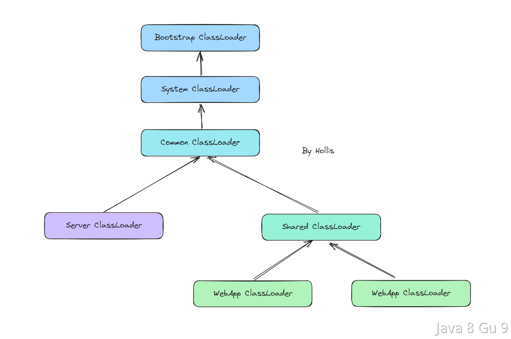
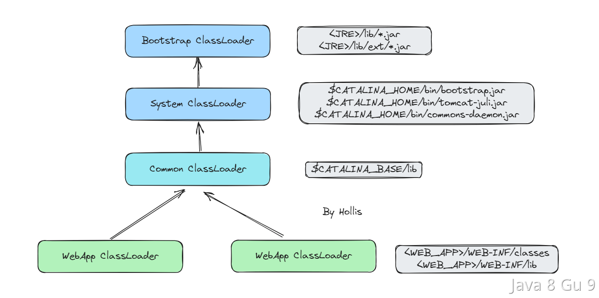
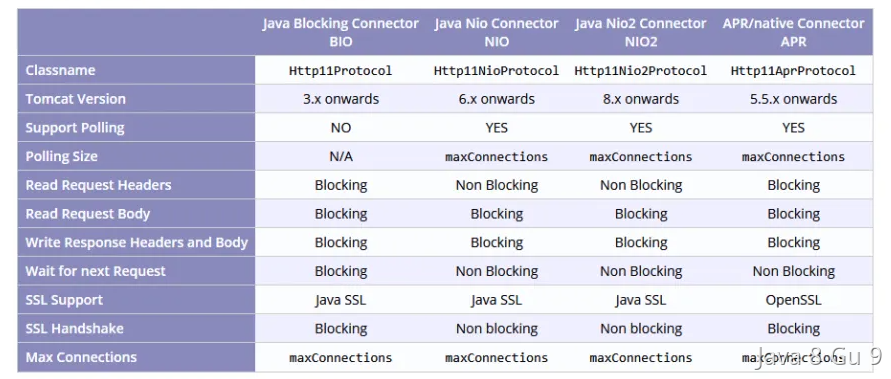

# Tomcat

## Tomcat的类加载机制是怎么样的？

Tomcat的类加载机制是指Tomcat在运行时如何加载和管理Java类。Tomcat的类加载机制的实现并没有严格遵守双亲委派原则，而是采用了一种层次化的类加载器结构，这种结构旨在提供更好的隔离性和灵活性，以支持多个Web应用程序的部署和运行。



但是，默认情况下，Server类加载器和Shared类加载器是未定义的，需要通过在conf/catalina.properties中定义server.loader和/或shared.loader属性的值，才会是这个更复杂的层次结构。  

Server类加载器只对Tomcat内部可见，对于Web应用程序完全不可见。  

Shared类加载器对所有Web应用程序可见，可以用于在所有Web应用程序之间共享代码。但是，对这些共享代码进行更新将需要重新启动Tomcat。  

所以，真正的需要一定有的，并且我们通常需要关注的就是下面这个层级关系：



### 启动类加载器（Bootstrap ClassLoader）

负责加载JVM自身的核心类库（如java.lang、java.util等）和JVM相关的类。启动类加载器是JVM的一部分，负责加载JVM运行所需的基础类。主要加载JRE中的lib包及lib/ext包下的内容

### 系统类加载器（System Class Loader）

负载加载Tomcat内部的一些核心类库，这些类一般在$CATALINA_HOME/bin这个目录下， 一般包含bootstarap.jar、tomcat-juli.jar以及common-daemon.jar等。

### 公共类加载器（Common Class Loader）

负责加载Tomcat的公共类和库，位于$CATALINA_HOME/lib目录下的JAR文件。这些类库是Tomcat启动时加载的，是整个Tomcat实例中共享的类。

### Web应用程序类加载器（Webapp Class Loader）

每个Web应用程序都有一个独立的Web应用程序类加载器，负责加载该Web应用程序的类和资源。它从\$CATALINA_HOME/webapps/\<webapp_name>/WEB-INF/classes目录和$CATALINA_HOME/webapps/\<webapp_name>/WEB-INF/lib目录加载类和JAR文件。

### 总结

以上几个加载器中Bootstrap、System、Common和Webapp之间，还是会遵守双亲委派的，也就是说还是先委派给上一层类加载器加载，加载不了再有自己加载。  

但是多个Webapp ClassLoader之间是没有委派关系的，他们就是各自加载各自需要加载的Jar包。

由于每个Web应用程序都有自己的类加载器，因此不同Web应用程序中的类可以使用相同的类名，而不会产生命名冲突。

同时，由于每个Web应用程序都有自己的类加载器，因此在卸载一个Web应用程序时，它的所有类都会从内存中清除，这可以避免内存泄漏的问题。

这种层次化的类加载器结构和委派机制确保了类的唯一性和隔离性，避免了类的重复加载和冲突，同时也实现了多个Web应用程序的隔离和独立运行。

## 为什么Tomcat可以把线程数设置为200，而不是N+1？

在实际应用中，设置线程池的核心线程数需要综合考虑多个因素，包括系统的硬件资源、应用的业务场景、应用线程的执行时间等等。因此，线程池核心线程数的推荐值仅仅是一个基础的参考值。

对于Tomcat而言，默认最大线程数是200，默认最小空闲线程数是10。

我认为，这些值应该是经过Tomcat开发团队反复测试和验证的结果，是适合绝大多数场景的。

我们作为使用者，大致可以猜测一下，Tomcat可以设置为200，可能有以下原因：

1. Tomcat作为Web服务器，其主要的场景是处理短连接请求。相较于其他应用服务器，Tomcat的请求处理时间相对较短，因此每条请求都不会占用时间太长。

2. Tomcat作为Web服务器，与一般的应用程序不同，它需要处理大量的并发请求。因此，t默认线程数设置的大一些，可以满足大多数Web应用的需求。

3. 在Tomcat的默认线程池中，使用了多个优化策略，如可回收线程、无锁化算法等，这些策略可以有效地减少线程创建和销毁的开销，提高线程池的吞吐量和性能。

Tomcat的设计目标是高吞吐量和低延迟，不遵守线程池核心线程数推荐公式，是因为其默认线程池的设置已经经过充分的优化和测试，能够满足大多数的应用场景。

其实在实际工作中，我们也建议大家不要完全按照公式配置，而是根据你的实际业务情况进行充分压测之后，进行合理的配置。

## Tomcat处理请求的过程是怎么样的？

### 处理过程

Tomcat是一个基于Servlet规范实现的Java Web容器，所以，在接收并处理请求的过程中，Servlet是必不可少的。

主要大致流程可以分为以下几步：

1. 接收请求

2. 请求解析

3. Servlet查找

4. Servlet请求处理

5. 请求返回

接收请求：Tomcat通过连接器监听指定的端口和协议，接收来自客户端的HTTP请求。

请求解析：接收到请求之后，Tomcat首先会解析请求信息，包括请求方法、URL、请求头参数等。

Servlet查找：根据解析出来的URL，找到对应的Servlet，并把请求交给他进行处理。

Servlet处理：这个过程就把请求交给Servlet进行处理，主要是执行其中的service方法进行请求处理。

请求返回：在Servlet处理结束后，把请求的响应在发送给客户端。

### Servlet的生命周期

Servlet在处理请求的过程中，要经历一个完整的生命周期，主要包含了以下三个阶段，分别执行三个方法，init、service和destory。每一次请求至少要经过service方法的执行，而init和destory并不需要每一个请求都执行。

初始化阶段：当Servlet容器加载Servlet时，会创建一个Servlet实例，并调用其init()方法进行初始化。在init()方法中，可以执行一些初始化操作，例如读取配置文件、连接数据库等。

处理请求阶段：在Servlet初始化完成后，当有客户端请求到达时，Servlet容器会创建一个请求对象（HttpServletRequest）和响应对象（HttpServletResponse），并调用Servlet的service()方法来处理请求。在service()方法中，Servlet可以通过请求对象获取客户端请求的信息，然后根据请求内容生成响应结果。

销毁阶段：当Servlet容器关闭或Web应用程序卸载时，会调用Servlet的destroy()方法进行销毁。在destroy()方法中，可以执行一些清理操作，例如关闭连接、释放资源等。

## 过滤器和拦截器的区别是什么？

一般这个问题，主要是因为在SpringMVC的应用中，过滤器和拦截器都是用来对请求进行预处理、过滤、拦截的，所以经常会放在一起比较。不过他们其实还有一些区别的。

他们的主要区别在于作用和生效的位置不同，过滤器是在请求进入Servlet容器之前拦截请求并对请求进行处理，而拦截器是在请求进入Servlet容器之后，但在进入Controller之前拦截请求并对请求进行处理，也可以在响应返回客户端之前，拦截响应并对响应进行处理。

在Tomcat中，一次请求会先进入到Tomcat容器，然后经过Filter的处理，处理通过之后才会进入到Servlet容器，进入到Servlet容器之后，才会在Servlet执行的前后执行Intercepter。

过滤器在请求进入Servlet容器之前拦截请求并对请求进行处理，比如对请求进行安全验证、日志记录等，之后将请求转发给对应的Servlet进行处理。过滤器是基于Java Servlet规范实现的，可以通过配置web.xml文件进行实现。

拦截器是在请求进入Servlet容器之后，拦截请求并对请求进行处理，也可以在响应返回客户端之前，拦截响应并对响应进行处理。拦截器可以对请求进行更加精细的控制，例如进行AOP、权限控制、事务管理等操作。拦截器是基于Spring框架实现的，可以通过定义拦截器类实现。

### 代码实现

#### 过滤器实现

定义一个过滤器，需要实现javax.servlet.Filter接口：

```java
public class LoginFilter implements Filter {
    public void init(FilterConfig config) throws ServletException {
        // 初始化
    }

    public void doFilter(ServletRequest req, ServletResponse resp, FilterChain chain) throws ServletException, IOException {
        // 登录验证和处理
        chain.doFilter(req, resp);
    }

    public void destroy() {
        // 销毁
    }
}
```

并且需要在web.xml文件中把他配置上:

```xml
<filter>
    <filter-name>LoginFilter</filter-name>
    <filter-class>com.hollis.LoginFilter</filter-class>
</filter>
<filter-mapping>
    <filter-name>LoginFilter</filter-name>
    <url-pattern>/*</url-pattern>
</filter-mapping>
```

或者通过注解也可以。

在 LoginFilter上添加@WebFilter注解，并在启动类上增加@ServletComponentScan("com.hollis.filter.LoginFilter")注解。也可替代xml文件中的配置。

#### 拦截器实现

想要定义一个拦截器，需要实现org.springframework.web.servlet.HandlerInterceptor接口：

```java
@Component
public class LoginInterceptor implements HandlerInterceptor {
    public boolean preHandle(HttpServletRequest request, HttpServletResponse response, Object handler) throws Exception {
       // 登录验证和处理
        return true;
    }

    public void postHandle(HttpServletRequest request, HttpServletResponse response, Object handler, ModelAndView modelAndView) throws Exception {
        // 后处理
    }

    public void afterCompletion(HttpServletRequest request, HttpServletResponse response, Object handler, Exception ex) throws Exception {
        // 完成处理
    }
}
```

并且在SpringMVC中进行配置：

```xml
<mvc:interceptors>
    <mvc:interceptor>
        <mvc:mapping path="/api/*"/>
        <bean class="com.hollis.LoginInterceptor"/>
    </mvc:interceptor>
</mvc:interceptors>
```

或者

```java
@Configuration
public class WebConfig implements WebMvcConfigurer {

    @Override
    public void addInterceptors(InterceptorRegistry registry) {
        registry.addInterceptor(new LoginInterceptor()).addPathPatterns("/api/*");
    }
}
```

## 介绍一下Tomcat的IO模型？

关于Tomcat的IO模型，不同的版本中是不太一样的，下面是一张Tomcat官网中各个历史重要版本所采用IO模型的介绍：



综合来说就是Tomcat支持多种IO模型，包括了标准的BIO（Blocking I/O）、NIO（Non-Blocking I/O）、NIO2（即JDK 1.7中的AIO）和APR（Apache Portable Runtime）。

- BIO是最传统的线程模型，也称为阻塞I/O。在BIO模型中，每个客户端连接都由一个独立的线程处理。当有新的连接到来时，Tomcat会创建一个新的线程来处理请求。这意味着每个连接都需要一个独立的线程，当并发连接数较大时，会导致线程数急剧增加，占用大量系统资源，并且可能出现线程切换带来的开销。

- NIO是Java的新I/O库（java.nio）的线程模型。在NIO模型中，通过使用Java NIO的选择器（Selector）机制，一个线程可以同时处理多个连接的请求。NIO模型相对于BIO模型来说，能够支持更多的并发连接，并且在连接数较大时对系统资源的消耗较少，但由于在应用层需要处理I/O事件，编程较为复杂。

- NIO2是Java 7引入的进一步改进的NIO模型，也叫AIO。在NIO2中，Java提供了更多的异步I/O操作，包括异步文件I/O、异步套接字I/O等。这使得Tomcat能够更好地支持异步请求处理，提高了处理性能和效率。

- APR是Apache软件基金会提供的一个库，它为应用程序提供了跨平台的抽象层，提供了高性能的本地I/O支持。在APR模型中，Tomcat利用本地操作系统的特性进行I/O操作，包括网络和文件I/O。APR模型在性能方面表现得非常出色，特别是在处理大量并发连接时，因为它直接利用底层操作系统的异步I/O能力。

我们可以在Tomcat启动的时候，可以通过log看到Connector使用的是哪一种运行模式：

```log
Starting ProtocolHandler [“http-bio-8080”]
Starting ProtocolHandler [“http-nio-8080”]
Starting ProtocolHandler [“http-apr-8080”]
```

### 如何切换Tomcat的IO模型？

切换Tomcat使用的I/O模型通常涉及配置Tomcat的连接器（Connector）。不同的I/O模型对应着不同的连接器实现。

在server.xml文件中，通过配置Connecter来选择不同的IO模型，如：

```xml
<Connector port="8080" protocol="HTTP/1.1"
           connectionTimeout="20000"
           redirectPort="8443" />
```

这里的protocol就是可以修改来替换成其他的协议，即IO模型的地方。

各个IO模型对应的关系如下：

- BIO模型：将protocol属性设置为HTTP/1.1（默认值），或者可以显式地设置为org.apache.coyote.http11.Http11Protocol。

- NIO模型：将protocol属性设置为org.apache.coyote.http11.Http11NioProtocol。

- NIO2模型：将protocol属性设置为org.apache.coyote.http11.Http11Nio2Protocol。

- APR模型：将protocol属性设置为org.apache.coyote.http11.Http11AprProtocol。

但是记得修改后需要重启tomcat才会生效。而且需要注意，Tomcat的不同版本可能支持不同的I/O模型，因此请根据您使用的Tomcat版本进行相应的配置。

一般来说，建议使用NIO或者NIO2就行了，对于涉及大量I/O操作的应用，例如Web服务、聊天应用或在线游戏等，NIO或NIO2模型都挺合适。

如果对性能要求非常高，可以考虑使用APR模型，但需要安装和配置APR库，有一定的成本。
