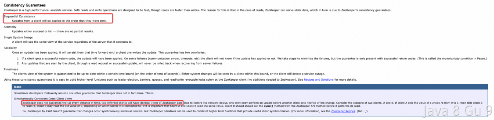

# Zookeeper

## Zookeeper是CP的还是AP的？

ZooKeeper作为分布式协调服务，它的职责是保证数据(注：配置数据，状态数据)在其管辖下的所有服务之间保持同步、一致。所以，我们可以认为Zookeeper是一个CP的分布式系统。所以他会牺牲可用性，也就是在极端环境下，ZooKeeper可能会丢弃一些请求，消费者程序需要重新请求才能获得结果。

而且， 作为ZooKeeper的核心实现算法 Zab，就是解决了分布式系统下数据如何在多个服务之间保持同步问题的。

如果 ZooKeeper下所有节点都断开了，或者集群中出现了网络分割的故障(注：由于交换机故障导致交换机底下的子网间不能互访);那么ZooKeeper 会将它们都从自己管理范围中剔除出去，外界就不能访问到这些节点了，即便这些节点本身是“健康”的，可以正常提供服务的;所以导致到达这些节点的服务请求被丢失了。

但是，请一定要注意，这里面的一致性，他确实是强一致性，但是，Zookeeper保证的是强一致模型中的顺序一致性而不是线性一致性。 （这个很少有人提）

这一点在ZK的官网（https://zookeeper.apache.org/doc/r3.4.13/zookeeperProgrammers.html ）上明确的说过：



这里明确的提了，Zookeeper是保证的顺序一致性，也就是说，ZooKeeper不保证在每个时间点，两个不同的客户端将具有相同的ZooKeeper数据视图。但是他能保证我们在每个节点上读取到的一定是他最后一次更新的内容。

具体的案例就是，当Zookeeper在进行数据同步的过程中，如果半数节点同步成功，它就提交当前事务，但此时集群内还有可能有节点没有同步到数据，如果此时读请求发送到没有同步到数据的节点，那么就会读到旧的数据。

但是Zookeeper是会保证这个节点最终也会按照顺序执行成功的。

### 如何保证真正的强一致性？

想要让Zookeeper真正的保证强一致性，或者说保证线性一致性也是有办法的，那就是通过sync命令。

当我们对一个Follower调用sync命令的时候，会使得他和Leader节点进行数据同步，并等待服务器同步完成之后再返回。这样下一次的read就能保证拿到的是最新数据了。

## Zookeeper的典型应用场景有哪些？

ZooKeeper是一个分布式的，开放源码的分布式应用程序协调服务。常见的应用场景如下：

1. 分布式配置管理：ZooKeeper可以存储配置信息，应用程序可以动态读取配置信息。

2. 分布式同步：ZooKeeper可以协调各个节点的同步，确保数据的一致性。

3. 命名服务：ZooKeeper可以作为一个命名服务，应用程序可以通过名字来找到所需的服务。

4. 集群管理：ZooKeeper可以用来管理分布式集群，协调各个节点的加入和退出。

5. Master选举：ZooKeeper可以用来实现Master选举，选择一个节点作为Master节点。

6. 分布式协调服务：Zookeeper提供了一些分布式协调服务，如分布式锁、唯一标识生成等，帮助系统中的各个组件之间进行协调。

7. 服务注册和发现：Zookeeper可以用于注册和发现系统中的服务，简化服务的部署和更新。

8. 负载均衡：Zookeeper可以用于动态地对请求进行负载均衡，以提高系统的可用性。

总之，ZooKeeper是一个非常适用于分布式应用程序的协调服务，它提供了强大的分布式协调功能，可以简化分布式应用程序的开发。
## Zookeeper集群中的角色有哪些？有什么区别？

ZK中主要有以下角色：

### 领导者（leader）

负责进行投票的发起和决议，更新系统状态。为客户端提供读和写服务。  

### 跟随者（follower）

用于接受客户端请求并响应客户端返回结果，在选主过程中参与投票。为客户端提供读服务。  

### 观察者（observer）

可以接受客户端连接，将写请求转发给leader，但observer不参加投票过程，只同步leader的状态，observer的目的是为了扩展系统，提高读取速度。  

### 客户端（client）

请求发起方

## Zookeeper的数据结构是怎么样的？

ZK中数据是以目录结构的形式存储的。其中的每一个存储数据的节点都叫做Znode，每个Znode都有一个唯一的路径标识。和目录结构类似，每一个节点都可以可有子节点（临时节点除外）。节点中可以存储数据和状态信息，每个Znode上可以配置监视器（watcher），用于监听节点中的数据变化。节点不支持部分读写，而是一次性完整读写。

### 节点

Znode有四种类型，PERSISTENT（持久节点）、PERSISTENT_SEQUENTIAL（持久的连续节点）、EPHEMERAL（临时节点）、EPHEMERAL_SEQUENTIAL（临时的连续节点）。

Znode的类型在创建时确定并且之后不能再修改。

#### 临时节点

临时节点的生命周期和客户端会话绑定。也就是说，如果客户端会话失效，那么这个节点就会自动被清除掉。临时节点不能有子节点。

```java
String root = "/ephemeral";
String createdPath = zk.create(root, root.getBytes(),
          Ids.OPEN_ACL_UNSAFE, CreateMode.PERSISTENT);
System.out.println("createdPath = " + createdPath);

String path = "/ephemeral/test01" ; 
createdPath = zk.create(path, path.getBytes(),
            Ids.OPEN_ACL_UNSAFE, CreateMode.EPHEMERAL);
System.out.println("createdPath = " + createdPath);
Thread.sleep(1000 * 20); // 等待20秒关闭ZooKeeper连接
zk.close(); // 关闭连接后创建的临时节点将自动删除
```

#### 持久节点

所谓持久节点，是指在节点创建后，就一直存在，直到有删除操作来主动清除这个节点——不会因为创建该节点的客户端会话失效而消失。

```java
String root = "/computer";
String createdPath = zk.create(root, root.getBytes(),
       Ids.OPEN_ACL_UNSAFE, CreateMode.PERSISTENT);
System.out.println("createdPath = " + createdPath);
```

#### 临时顺序节点

临时节点的生命周期和客户端会话绑定。也就是说，如果客户端会话失效，那么这个节点就会自动被清除掉。注意创建的节点会自动加上编号。

```java
String root = "/ephemeral";
String createdPath = zk.create(root, root.getBytes(),
          Ids.OPEN_ACL_UNSAFE, CreateMode.PERSISTENT);
System.out.println("createdPath = " + createdPath);

String path = "/ephemeral/test01" ; 
createdPath = zk.create(path, path.getBytes(),
            Ids.OPEN_ACL_UNSAFE, CreateMode.EPHEMERAL_SEQUENTIAL);
System.out.println("createdPath = " + createdPath);
Thread.sleep(1000 * 20); // 等待20秒关闭ZooKeeper连接
zk.close(); // 关闭连接后创建的临时节点将自动删除
```

输出结果：

```java
type = None
createdPath = /ephemeral/test0000000003
createdPath = /ephemeral/test0000000004
createdPath = /ephemeral/test0000000005
createdPath = /ephemeral/test0000000006
```

#### 持久顺序节点

这类节点的基本特性和持久节点类型是一致的。额外的特性是，在ZooKeeper中，每个父节点会为他的第一级子节点维护一份时序，会记录每个子节点创建的先后顺序。基于这个特性，在创建子节点的时候，可以设置这个属性，那么在创建节点过程中，ZooKeeper会自动为给定节点名加上一个数字后缀，作为新的节点名。这个数字后缀的范围是整型的最大值。

```java
String root = "/computer";
String createdPath = zk.create(root, root.getBytes(),
       Ids.OPEN_ACL_UNSAFE, CreateMode.PERSISTENT);
System.out.println("createdPath = " + createdPath);
for (int i=0; i<5; i++) {
   String path = "/computer/node";
   String createdPath = zk.create(path, path.getBytes(),
       Ids.OPEN_ACL_UNSAFE, CreateMode.PERSISTENT_SEQUENTIAL);
   System.out.println("createdPath = " + createdPath);
}
zk.close();
```

运行结果：

```java
createdPath = /computer
createdPath = /computer/node0000000000
createdPath = /computer/node0000000001
createdPath = /computer/node0000000002
createdPath = /computer/node0000000003
createdPath = /computer/node0000000004
结果中的0000000000~0000000004都是自动添加的序列号
```

节点中除了可以存储数据，还包含状态信息。

### ACL

每个znode被创建时都会带有一个ACL列表，用于决定谁可以对它执行何种操作。

### 观察（watcher）

Watcher 在 ZooKeeper 是一个核心功能，Watcher 可以监控目录节点的数据变化以及子目录的变化，一旦这些状态发生变化，服务器就会通知所有设置在这个目录节点上的 Watcher，从而每个客户端都很快知道它所关注的目录节点的状态发生变化，而做出相应的反应

可以设置观察的操作：exists,getChildren,getData 可以触发观察的操作：create,delete,setData

znode以某种方式发生变化时，“观察”（watcher）机制可以让客户端得到通知。可以针对ZooKeeper服务的“操作”来设置观察，该服务的其他 操作可以触发观察。比如，客户端可以对某个客户端调用exists操作，同时在它上面设置一个观察，如果此时这个znode不存在，则exists返回 false，如果一段时间之后，这个znode被其他客户端创建，则这个观察会被触发，之前的那个客户端就会得到通知。
