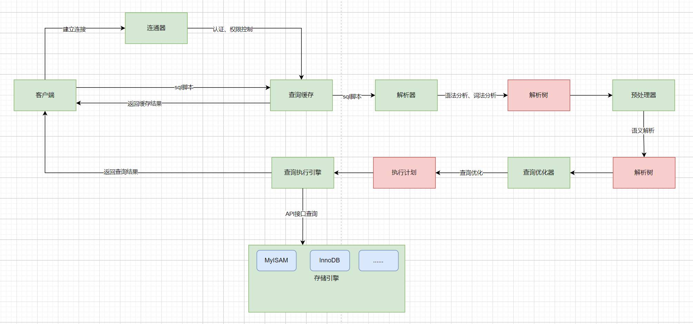
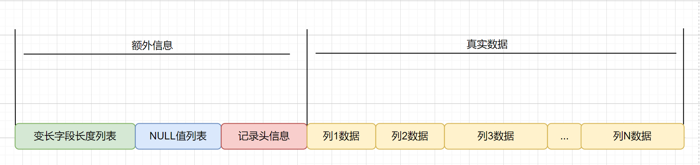
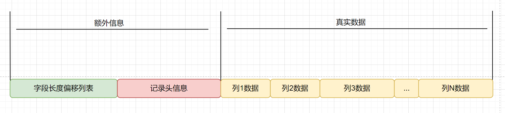
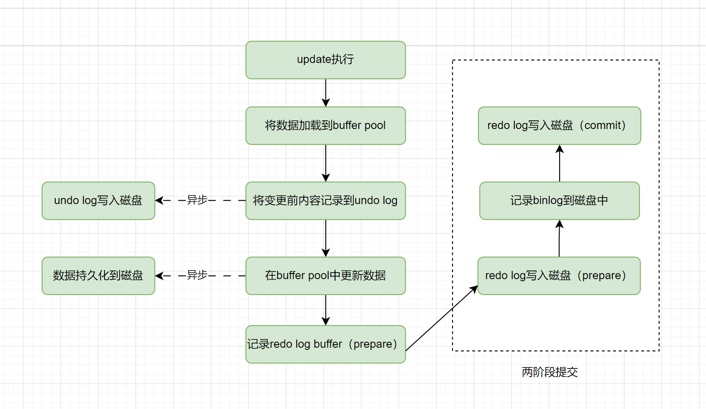
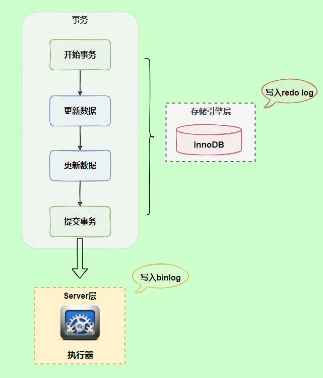

# MySQL数据库

## MySQL的数据存储一定是基于硬盘的吗？

不是的，MySQL也可以基于内存的，即MySQL的内存表技术（Memory引擎）。它允许将数据和索引存储在内存中，从而提高了检索速度和修改数据的效率。优点包括具有快速响应的查询性能和节约硬盘存储空间。此外，使用内存表还可以实现更高的复杂性，从而提高了MySQL的整体性能。

创建内存表与创建普通表一样，使用CREATE TABLE语句，但需要将存储引擎设置为：ENGINE = MEMORY

## 什么是数据库存储引擎？

数据库引擎是用于存储、处理和保护数据的核心服务。利用数据库引擎可控制访问权限并快速处理事务，从而满足企业内大多数需要处理大量数据的应用程序的要求。

使用数据库引擎创建用于联机事务处理或联机分析处理数据的关系数据库。这包括创建用于存储数据的表和用于查看、管理和保护数据安全的数据库对象（如索引、视图和存储过程）。

查看mysql当前使用什么存储引擎:show engines;

查看mysql当前默认的存储引擎:show variables like '%storage_engine%';

查看看某个表用了什么引擎:show create table 表名;，在显示结果里参数engine后面的就表示该表当前用的存储引擎

## MySQL支持哪几种执行引擎，有什么区别

MySQL是开源的，我们可以基于其源码编写我们自己的存储引擎，有以下几种存储引擎MyISAM、InnoDB、NDB、MEMORY，Archieve、Fedarated以及Maria等。对比如下：


## InnoDB和MyISAM有什么区别？

InnoDB和MyISAM是MySQL中比较常用的两个执行引擎，MySQL 在 5.5 之前版本默认存储引擎是 MyISAM，5.5 之后版本默认存储引擎是 InnoDB，MyISAM适合查询以及插入为主的应用，InnoDB适合频繁修改以及涉及到安全性较高的应用他们主要有以下区别：

1. InnoDB支持事务，MyISAM不支持

2. InnoDB 是聚集索引，MyISAM 是非聚集索引

3. InnoDB支持外键，MyISAM不支持

4. InnoDB 最小的锁粒度是行锁，MyISAM 最小的锁粒度是表锁。

5. InnoDB不支持FULLTEXT类型的索引（5.6之前不支持全文索引）

6. InnoDB中不保存表的行数，但是MyISAM只要简单的读出保存好的行数即可

7. 对于自增长的字段，InnoDB中必须包含只有该字段的索引，但是在MyISAM表中可以和其他字段一起建立联合索引

8. 清空整个表时，InnoDB是一行一行的删除，效率非常慢。MyISAM则会重建表

## char和varchar的区别？

char和varchar都是用于在数据库中存储字符串的数据类型。它们之间的主要区别在于存储空间的使用方式：

char是一种定长的数据类型，它的长度固定且在存储时会自动在结尾添加空格来将字符串填满指定的长度。char的长度范围是0-255，

varchar是一种可变长度的数据类型，它只会存储实际的字符串内容，不会填充空格。因此，在存储短字符串时，varchar可以节省空间。varchar的长度范围是0-65535（MySQL 5.0.3之后的版本）。

对于字段值经常改变的数据类型来说，CHAR 相比 VARCHAR 也更有优势，因为 CHAR 的长度固定，不会产生碎片。如果使用char(100)，则插入记录后就分配了100个字节，后续修改不会造成页分裂的问题，而varchar(100)由于没有提前分配存储空间，因为表中数据刚开始插入时，可变长度字段值都是根据实际长度存储下来的，且行与行之间数据也是紧密连续存放在文件地址中的。那么现在值变长了，原来的位置无法扩展出新的空间出来，所以无法覆盖存放到原来的位置上。此时MySQL就会使用页分裂的方法扩展字段变长的空间。

varchar的优点是变长的字符串类型，兼容性更好；但是同时也会带来一些问题，如使用varchar可能会产生内存碎片、varchar会额外需要1到2个字节存储长度信息、以及update语句可能会导致页分裂等。

例如，存储产品描述（可变长度）、存储用户地址（可变长度）、存储用户名称（可变长度），这些都适合用varchar。

char的优点是定长的字符串类型，减少内存碎片，并且无需额外的内存空间去存储长度信息。但是他的缺点是会删除列末尾的空格信息。

例如，存储身份证号（固定长度）、存储订单号（可变长度）、存储国家编码（固定长度），这些都适合用char。

## MySQL 5.x和8.0有什么区别？

1. 性能：MySQL 8.0 的速度要比 MySQL 5.7 快 2 倍。MySQL 8.0 在以下方面带来了更好的性能：读/写工作负载、IO 密集型工作负载、以及高竞争（"hot spot"热点竞争问题）工作负载。

2. NoSQL：MySQL 从 5.7 版本开始提供 NoSQL 存储功能，目前在 8.0 版本中这部分功能也得到了更大的改进。该项功能消除了对独立的 NoSQL 文档数据库的需求，而 MySQL 文档存储也为 schema-less 模式的 JSON 文档提供了多文档事务支持和完整的 ACID 合规性。

3. 窗口函数(Window Functions)：从 MySQL 8.0 开始，新增了一个叫窗口函数的概念，它可以用来实现若干新的查询方式。窗口函数与 SUM()、COUNT() 这种集合函数类似，但它不会将多行查询结果合并为一行，而是将结果放回多行当中。即窗口函数不需要 GROUP BY。

4. 隐藏索引：在 MySQL 8.0 中，索引可以被“隐藏”和“显示”。当对索引进行隐藏时，它不会被查询优化器所使用。我们可以使用这个特性用于性能调试，例如我们先隐藏一个索引，然后观察其对数据库的影响。如果数据库性能有所下降，说明这个索引是有用的，然后将其“恢复显示”即可；如果数据库性能看不出变化，说明这个索引是多余的，可以考虑删掉。

5. 取消查询缓存：MySQL 8.0 出于性能和可维护性方面的考虑取消了查询缓存，通过使用索引、更好的查询计划优化、以及缓存结果集而不是整个查询。这些方法更有效地提高了查询性能，同时避免了查询缓存可能引入的问题。

6. 降序索引：MySQL 8.0 为索引提供按降序方式进行排序的支持，在这种索引中的值也会按降序的方式进行排序。

7. 通用表表达式(Common Table Expressions CTE)：在复杂的查询中使用嵌入式表时，使用 CTE 使得查询语句更清晰。

8. UTF-8 编码：从 MySQL 8 开始，使用 utf8mb4 作为 MySQL 的默认字符集。

9. JSON：MySQL 8 大幅改进了对 JSON 的支持，添加了基于路径查询参数从 JSON 字段中抽取数据的 JSON_EXTRACT() 函数，以及用于将数据分别组合到 JSON 数组和对象中的 JSON_ARRAYAGG() 和 JSON_OBJECTAGG() 聚合函数。

10. 可靠性：InnoDB 现在支持表 DDL 的原子性，也就是 InnoDB 表上的 DDL 也可以实现事务完整性，要么失败回滚，要么成功提交，不至于出现 DDL 时部分成功的问题，此外还支持 crash-safe 特性，元数据存储在单个事务数据字典中。

11. 高可用性(High Availability)：InnoDB 集群为您的数据库提供集成的原生 HA 解决方案。

12. 安全性：对 OpenSSL 的改进、新的默认身份验证、SQL 角色、密码强度、授权。

## 什么是数据库范式，为什么要反范式

所谓数据库范式，其实就是数据库的设计上的一些规范；这些规范可以让数据库的设计更加简洁、清晰；同时也会更加好的可以保证一致性。

三个常用的范式：

1. 第一范式（1NF）是说，数据库表中的属性是原子性的，要求属性具有原子性，不可再被拆分；
   
   - 比如地址如果都细化拆分成省、市、区、街道、小区等等多个字段这就是符合第一范式的， 如果地址就是一个字段，那就不符合了。

2. 第二范式（2NF）是说，数据库表中的每个实例或记录必须可以被唯一地区分，说白了就是要有主键，其他的字段都依赖于主键。

3. 第三范式（3NF）是说，任何非主属性不依赖于其它非主属性，也就是说，非主键外的所有字段必须互不依赖

如果我们在做表结构设计的时候，完全遵守数据库三范式，确实可以避免一些写时异常，提升一些写入性能，但是同时也会丢失一些读取性能。

因为在遵守范式的数据库设计中，表中不能有任何冗余字段，这就使得查询的时候就会经常有多表关联查询，这无疑是比较耗时的。

于是就有了反范式化。所谓反范式化，是一种针对遵从设计范式的数据库的性能优化策略。

也就是说，反范式化不等于非范式化，反范式化一定发生在满足范式设计的基础之上。前者相当于先遵守所有规则，再进行局部调整。

比如我们可以在表中增加一些冗余字段，方便我们进行数据查询，而不再需要经常做多表join，但同时，这也会带来一个问题，那就是这些冗余字段之间的一致性如何保证，这个问题本来在遵守范式的设计中是不会有的，一旦做了反范式，那就需要开发者自行解决了。

反范式其实本质上是软件开发中一个比较典型的方案，那就是"用空间换时间"，通过做一些数据冗余，来提升查询速度。

在互联网业务中，比较典型的就是数据量大，并发高，并且通常查询的频率要远高于写入的频率，所以适当的做一些反范式，通过做一些字段的冗余，可以提升查询性能，降低响应时长，从而提升并发度。

## 为什么大厂不建议使用多表join？

之所以不建议使用join查询，最主要的原因就是join的效率比较低。

MySQL是使用了嵌套循环（Nested-Loop Join）的方式来实现关联查询的，简单点说就是要通过两层循环，用第一张表做外循环，第二张表做内循环，外循环的每一条记录跟内循环中的记录作比较，符合条件的就输出。

而具体到算法实现上主要有simple nested loop，block nested loop和index nested loop这三种。而且这三种的效率都没有特别高。

MySQL是使用了嵌套循环（Nested-Loop Join）的方式来实现关联查询的，如果有2张表join的话，复杂度最高是O(n^2)，3张表则是O(n^3)...随着表越多，表中的数据量越多，JOIN的效率会呈指数级下降。

### join

在MySQL 中，可以使用 JOIN 在两个或多个表中进行联合查询，join有三种，分别是inner join、left join 和 right join。

1. INNER JOIN（内连接,或等值连接）：获取两个表中字段匹配关系的记录。
   
   - 取两个表的交集部分

2. LEFT JOIN（左连接）：获取左表所有记录，即使右表没有对应匹配的记录。
   
   - 取两个表的交集部分+左表中的数据

3. RIGHT JOIN（右连接）： 与 LEFT JOIN 相反，用于获取右表所有记录，即使左表没有对应匹配的记录。
   
   - 取两个表的交集部分+右表中的数据

在配合join一起使用的还有on关键字，用来指明关联查询的一些条件。

### 嵌套循环算法

MySQL是使用了嵌套循环（Nested-Loop Join）的方式来实现关联查询的，具体到算法上面主要有simple nested loop join，block nested loop join和index nested loop join这三种。

而这三种的效率都没有特别高。

1. simple nested loop，他的做法简单粗暴，就是全量扫描连接两张表进行数据的两两对比，所以他的复杂度可以认为是N*M（N是驱动表的数量，M是被驱动表的数量）

2. index nested loop，当Inner Loop的表用到字段有索引的话，可以用到索引进行查询数据，因为索引是B+树的，复杂度可以近似认为是N*logM。

3. block nested loop，其实是引入了一个Buffer，会提前把外循环的一部分结果提前放到JOIN BUFFER中，然后内循环的每一行都和整个buffer的数据作比较。虽然比较次数还是N*M，但是因为join buffer是基于内存的，所以效率高很多。

所以，虽然MySQL已经尽可能的在优化了，但是这几种算法复杂度都还是挺高的，这也是为什么不建议在数据库中多表JOIN的原因。随着表越多，表中的数据量越多，JOIN的效率会呈指数级下降。

### 不能用join如何做关联查询

如果不能通过数据库做关联查询，那么需要查询多表的数据的时候要怎么做呢？

主要有两种做法：

1. 在内存中自己做关联，即先从数据库中把数据查出来之后，我们在代码中再进行二次查询，然后再进行关联。

2. 数据冗余，那就是把一些重要的数据在表中做冗余，这样就可以避免关联查询了。

3. 宽表，就是基于一定的join关系，把数据库中多张表的数据打平做一张大宽表，可以同步到ES或者干脆直接在数据库中直接查都可以。

## 说一说MySQL一条SQL语句的执行过程？

如一条简单的查询语句：select * from users where age='18' and name='sun';

执行过程如下图：



结合上面的说明，我们分析下这个语句的执行流程：

1. 使用连接器，通过客户端/服务器通信协议与 MySQL 建立连接。并查询是否有权限

2. Mysql8.0之前检查是否开启缓存，开启了 Query Cache 且命中完全相同的 SQL 语句，则将查询结果直接返回给客户端；

3. 由解析器（分析器）进行语法分析和语义分析，并生成解析树。如查询是select、表名users、条件是age='18' and name='sun'，预处理器则会根据 MySQL 规则进一步检查解析树是否合法。比如检查要查询的数据表或数据列是否存在等。

4. 由优化器生成执行计划。根据索引看看是否可以优化

5. 执行器来执行SQL语句，这里具体的执行会操作MySQL的存储引擎来执行 SQL 语句，根据存储引擎类型，得到查询结果。若开启了 Query Cache，则缓存，否则直接返回。

## InnoDB支持哪几种行格式？

数据库表的行格式决定了一行数据是如何进行物理存储的，进而影响查询和DML操作的性能。

在InnoDB中，常见的行格式有4种：

1. COMPACT ：是MySQL 5.0之前的默认格式，除了保存字段值外，还会利用空值列表保存null值，还会记录变长字段长度列表和记录头信息。
   
   COMPACT 适合处理大量包含可变长度列（如VARCHAR、VARBINARY、BLOB和TEXT类型）的数据。
   
   对于可变长度列，前768字节的数据存储在B树节点的索引记录中，超出部分存储在溢出页中。大于或等于768字节的固定长度列会被编码为可变长度列，并可以存储在页外。
   
   

2. REDUNDANT ：Redundant 是 MySQL5.0 版本之前 InnoDB 的行记录存储方式，用的比较少，Redundant 行格式会把该条记录中所有列 (包括隐藏列) 的长度信息都存储到 '字段长度偏移列表' 中。
   
   

3. DYNAMIC：DYNAMIC格式在MySQL 5.7版本引入，是COMPACT格式的改进版。它保持了COMPACT格式的优点，同时在存储大的可变长度列时更加灵活，能够动态地选择存储在页内或页外。DYNAMIC格式适用于大部分的应用场景，并在存储空间和性能上做了一定的平衡。其结构和COMPACT大致相同；

4. COMPRESSED：是MySQL 5.1中InnoDB的新特性之一，它可以在存储数据时对数据进行压缩，从而减小磁盘占用空间。它的缺点是增加了CPU的使用，可能会降低一些查询的性能。COMPRESSED 行格式是在 DYNAMIC 行格式的基础上添加了页外压缩功能。在存储时，如果发现数据可以通过压缩减小存储空间，就会使用压缩方式来存储数据。在查询时，会自动解压缩数据并返回结果。

5. BARRACUDA：是MySQL 5.7引入的一种新格式，相对于前面的格式，支持更多的高级特性，如动态行格式、行级压缩、空间管理等。

| 行格式        | 紧凑的存储特性 | 增强的可变长度列存储 | 大索引键前缀支持 | 压缩支持 | 支持的表空间类型                        | 所需文件格式                |
| ---------- | ------- | ---------- | -------- | ---- | ------------------------------- | --------------------- |
| REDUNDANT  | 否       | 否          | 否        | 否    | system, file-per-table, general | Antelope or Barracuda |
| COMPACT    | 是       | 否          | 否        | 否    | system, file-per-table, general | Antelope or Barracuda |
| DYNAMIC    | 是       | 是          | 是        | 否    | system, file-per-table, general | Barracuda             |
| COMPRESSED | 是       | 是          | 是        | 是    | file-per-table, general         | Barracuda             |

## 什么是数据库事务？

数据库事务( transaction)是访问并可能操作各种数据项的一个数据库操作序列，这些操作要么全部执行，要么全部不执行，是一个不可分割的工作单位。 事务由事务开始与事务结束之间执行的全部数据库操作组成。

并非任意的对数据库的操作序列都是数据库事务。事务应该具有4个属性：原子性、一致性、隔离性、持久性。这四个属性通常称为ACID特性。

1. 原子性（Atomicity）：事务作为一个整体被执行，包含在其中的对数据库的操作要么全部被执行，要么都不执行。

2. 一致性（Consistency）：事务应确保数据库的状态从一个一致状态转变为另一个一致状态。一致状态的含义是数据库中的数据应满足完整性约束。

3. 隔离性（Isolation）：多个事务并发执行时，一个事务的执行不应影响其他事务的执行。

4. 持久性（Durability）：一个事务一旦提交，他对数据库的修改应该永久保存在数据库中。

### 举例

用一个常用的“A账户向B账号汇钱”的例子来说明如何通过数据库事务保证数据的准确性和完整性。熟悉关系型数据库事务的都知道从帐号A到帐号B需要6个操作：

1. 从A账号中把余额读出来（500）

2. 对A账号做减法操作（500-100）

3. 把结果写回A账号中（400）

4. 从B账号中把余额读出来（500）

5. 对B账号做加法操作（500+100）

6. 把结果写回B账号中（600）

### 原子性

保证1-6所有过程要么都执行，要么都不执行。一旦在执行某一步骤的过程中发生问题，就需要执行回滚操作。 假如执行到第五步的时候，B账户突然不可用（比如被注销），那么之前的所有操作都应该回滚到执行事务之前的状态。

### 一致性

在转账之前，A和B的账户中共有500+500=1000元钱。在转账之后，A和B的账户中共有400+600=1000元。也就是说，数据的状态在执行该事务操作之后从一个状态改变到了另外一个状态。同时一致性还能保证账户余额不会变成负数等。

### 隔离性

在A向B转账的整个过程中，只要事务还没有提交（commit），查询A账户和B账户的时候，两个账户里面的钱的数量都不会有变化。 如果在A给B转账的同时，有另外一个事务执行了C给B转账的操作，那么当两个事务都结束的时候，B账户里面的钱应该是A转给B的钱加上C转给B的钱再加上自己原有的钱。

### 持久性

一旦转账成功（事务提交），两个账户的里面的钱就会真的发生变化（会把数据写入数据库做持久化保存）！

## InnoDB的一次更新事务是怎么实现的？

一次InnnoDB的update操作，涉及到BufferPool、BinLog、UndoLog、RedoLog以及物理磁盘，完整的一次操作过程基本如下：

1. 在Buffer Pool中读取数据：当InnoDB需要更新一条记录时，首先会在Buffer Pool中查找该记录是否在内存中。如果没有在内存中，则从磁盘读取该页到Buffer Pool中。

2. 记录UndoLog：在修改操作前，InnoDB会在Undo Log中记录修改前的数据。Undo Log是用来保证事务原子性和一致性的一种机制，用于在发生事务回滚等情况时，将修改操作回滚到修改前的状态，以达到事务的原子性和一致性。UndoLog的写入最开始写到内存中的，然后由1个后台线程定时刷新到磁盘中的。

3. 在Buffer Pool中更新：当执行update语句时，InnoDB会先更新已经读取到Buffer Pool中的数据，而不是直接写入磁盘。同时，InnoDB会将修改后的数据页状态设置为“脏页”（Dirty Page）状态，表示该页已经被修改但尚未写入磁盘。

4. 记录RedoLog Buffer：InnoDB在Buffer Pool中记录修改操作的同时，InnoDB 会先将修改操作写入到 redo log buffer 中。

5. 提交事务：在执行完所有修改操作后，事务被提交。在提交事务时，InnoDB会将Redo Log写入磁盘，以保证事务持久性。

6. 写入磁盘：在提交过程后，InnoDB会将Buffer Pool中的脏页写入磁盘，以保证数据的持久性。但是这个写入过程并不是立即执行的，是有一个后台线程异步执行的，所以可能会延迟写入，总之就是MYSQL会选择合适的时机把数据写入磁盘做持久化。

7. 记录Binlog：在提交过程中，InnoDB会将事务提交的信息记录到Binlog中。Binlog是MySQL用来实现主从复制的一种机制，用于将主库上的事务同步到从库上。在Binlog中记录的信息包括：事务开始的时间、数据库名、表名、事务ID、SQL语句等。

需要注意的是，在binlog和redolog的写入过程中，其实是分成了2阶段的，通过2阶段提交的方式来保证一致性的。



## 两阶段提交

`redo log`（重做日志）让`InnoDB`存储引擎拥有了崩溃恢复能力。

`binlog`（归档日志）保证了`MySQL`集群架构的数据一致性。

虽然它们都属于持久化的保证，但是侧重点不同。

在执行更新语句过程，会记录`redo log`与`binlog`两块日志，以基本的事务为单位，`redo log`在事务执行过程中可以不断写入，而`binlog`只有在提交事务时才写入，所以`redo log`与`binlog`的写入时机不一样。



回到正题，`redo log`与`binlog`两份日志之间的逻辑不一致，会出现什么问题？

我们以`update`语句为例，假设`id=2`的记录，字段`c`值是`0`，把字段`c`值更新成`1`，`SQL`语句为`update T set c=1 where id=2`。

假设执行过程中写完`redo log`日志后，`binlog`日志写期间发生了异常，会出现什么情况呢？


由于`binlog`没写完就异常，这时候`binlog`里面没有对应的修改记录。因此，之后用`binlog`日志恢复数据时，就会少这一次更新，恢复出来的这一行`c`值是`0`，而原库因为`redo log`日志恢复，这一行`c`值是`1`，最终数据不一致。


为了解决两份日志之间的逻辑一致问题，`InnoDB`存储引擎使用**两阶段提交**方案。

原理很简单，将`redo log`的写入拆成了两个步骤`prepare`和`commit`，这就是**两阶段提交**。


使用**两阶段提交**后，写入`binlog`时发生异常也不会有影响，因为`MySQL`根据`redo log`日志恢复数据时，发现`redo log`还处于`prepare`阶段，并且没有对应`binlog`日志，就会回滚该事务。


再看一个场景，`redo log`设置`commit`阶段发生异常，那会不会回滚事务呢？


并不会回滚事务，它会执行上图框住的逻辑，虽然`redo log`是处于`prepare`阶段，但是只要能通过redolog中的事务`id`找到对应的`binlog`日志且事务id相同，则`MySQL`认为是完整的，就会提交事务恢复数据。只要事务id不一致，则不完整，会回滚事务。

tinyint、smallint、mediumint、int、bigint、float、double、decimal、char、varchar、text、binary、varbinary、blob、datetime、timestamp、enum、set

primary key、unique、use index(a,b)、ignore index(a)

union查询、子查询（from、where）、inner join=join、outer join、left join、right join

DB、DBMS、DBA、DBS

元组、码、候选码、主码、外码、主属性、非主属性

第一范式、第二范式、第三范式

ER图、实体、属性、关系

主码和外码

drop、delete、truncate区别

ascii、gb2312、gbk、gb18030、big5、unicode、utf-8

mysql配置字符集层次：实例、数据库、表、列、连接

mysql utf-8和utf-8mb4

jdbc连接mysql显示异常

char和varchar区别

varchar(10)和varchar(100)区别

decimal和float、double区别

text、blob使用

null和''区别

mysql：连接器、分析器、优化器、执行器、存储引擎、日志模块

mysql执行sql语句的过程

隐式类型转换索引失效

```sql
select 12 = '012avbgbg'
```

自增主键不连续的四个场景

读未提交、读已提交、可重复读、串行化

一致性非锁定读、快照读、MVCC、锁定读、当前读、Next-key Lock

MVCC的实现：隐藏字段、read view、undo-log

MVCC视角下的读已提交、可重复读

RR隔离级别下解决幻读方式：MVCC、Next-key Lock

redolog作用、内容物理形式、redolog buffer、redolog刷盘策略（0、1、2）、后台线程刷盘策略（1s、1/2）、redolog文件日志组

binlog作用、内容逻辑形式、记录的三种格式、binlog cache、binlog写入时机（0、1、N）

redolog和binlog两阶段提交

explain、select_type、type、key、possible_keys、extra、rows

undolog作用

redolog、undolog、binlog满足了事务的几大特性

timestamp和datetime区别，存储大小、记录时间范围、时区显示

锁表lock tables、触发器、存储过程、分析表

哈希表、二叉树、AVL树、红黑树、B树、B+树、哈希索引、全文索引

非聚簇索引、聚簇索引、二级索引（辅助索引）

主键索引、普通索引、唯一索引、联合索引、全文索引、前缀索引（字符串类型）

覆盖索引、最左前缀匹配原则：范围查询之后的不在索引里查询（>、<）；>=、<=、between and、like前模糊不停止，可以继续匹配，mysql 8.0.13后sql可以不满足最左前缀匹配，mysql优化器使用跳跃扫描保证查询用到索引，但是限制较多

acid是什么

脏读、丢失修改、不可重复读、幻读

行锁、表锁、共享锁、独占锁、意向锁、自增锁的三种模式、对于插入数据的影响

可重复读下的MVCC快照读、可重复读下的加锁读、加锁更新

可重复读级别下，出现幻读：插入数据、写事务提交、读事务加锁读

读已提交+binlog statement状态+更新数据，出现从库数据不一致问题

mysql5.7下的next-key lock是什么：唯一索引的范围查询、索引上的等值查询

innodb加索引，是否会锁表

索引条件下推（ICP）？

mysql如何保证唯一索引的唯一性的

count(*)、count(1)、count(列)区别、count(**)的优化

order by可能返回顺序不固定，可优化

深度分页limit优化

mysql实现insertOrUpdate功能

走不走索引：计算、函数、or、like、隐式类型转换、in

区分度不高的字段也可以用索引？

优化器选择驱动表对join的影响

hash join的优势：基于内存、基于磁盘

buffer pool是什么

怎么做热点数据行的更新？

## 深入阅读：

- 《MySQL 技术内幕：InnoDB 存储引擎》
- https://dev.MySQL.com/doc/refman/5.7/en/
- [一篇文章看懂mysql中varchar能存多少汉字、数字，以及varchar(100)和varchar(10)的区别 - 那些年的代码 - 博客园](https://www.cnblogs.com/zhuyeshen/p/11642211.html)
- [联合索引的最左匹配原则全网都在说的一个错误结论](https://mp.weixin.qq.com/s/8qemhRg5MgXs1So5YCv0fQ)
- [为什么 MySQL 的自增主键不单调也不连续 - 面向信仰编程](https://draveness.me/whys-the-design-mysql-auto-increment/)
- [技术分享 | 隔离级别：正确理解幻读](https://opensource.actionsky.com/20210818-mysql/)
- [详解 MySql InnoDB 中意向锁的作用 - 掘金](https://juejin.cn/post/6844903666332368909)
- [Mysql 锁：灵魂七拷问](https://tech.youzan.com/seven-questions-about-the-lock-of-MySQL/)
- [MySQL next-key lock 加锁范围](https://segmentfault.com/a/1190000040129107)
- [Innodb 中的事务隔离级别和锁的关系](https://tech.meituan.com/2014/08/20/innodb-lock.html)
- [深入剖析 MySQL 自增锁 - 掘金](https://juejin.cn/post/6968420054287253540)
- [Spring Boot 整合 MinIO 实现分布式文件服务](https://www.51cto.com/article/716978.html)
- 
- [《周志明的软件架构课》](https://time.geekbang.org/opencourse/intro/100064201)
- [一树一溪的 MySQL 系列教程](https://mp.weixin.qq.com/mp/appmsgalbum?__biz=Mzg3NTc3NjM4Nw==&action=getalbum&album_id=2372043523518300162&scene=173&from_msgid=2247484308&from_itemidx=1&count=3&nolastread=1#wechat_redirect)
- [Yes 的 MySQL 系列教程](https://mp.weixin.qq.com/mp/appmsgalbum?__biz=MzkxNTE3NjQ3MA==&action=getalbum&album_id=1903249596194095112&scene=173&from_msgid=2247490365&from_itemidx=1&count=3&nolastread=1#wechat_redirect)
- [写完这篇 我的 SQL 优化能力直接进入新层次 - 变成派大星 - 2022](https://juejin.cn/post/7161964571853815822)
- [两万字详解！InnoDB 锁专题！ - 捡田螺的小男孩 - 2022](https://juejin.cn/post/7094049650428084232)
- [深入理解 MySQL 索引底层原理 - 腾讯技术工程 - 2020](https://zhuanlan.zhihu.com/p/113917726)
- 
- 
- 
- 《高性能 MySQL》第 7 章 MySQL 高级特性
- 《MySQL 技术内幕 InnoDB 存储引擎》第 6 章 锁
- Relational Database：https://www.omnisci.com/technical-glossary/relational-database
- 
- 
- 
- 
