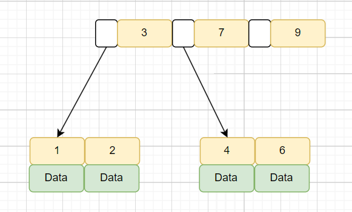
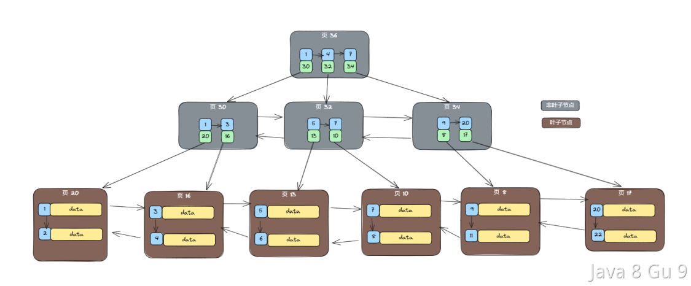
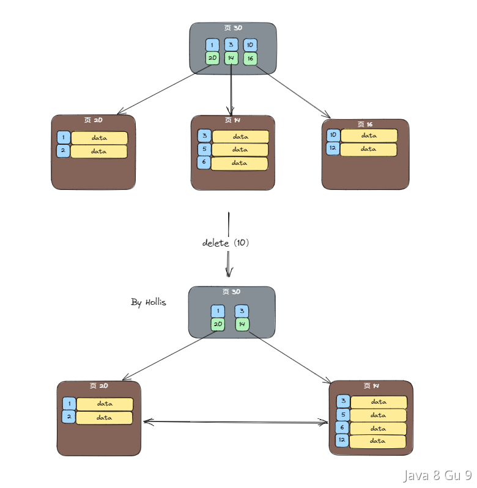
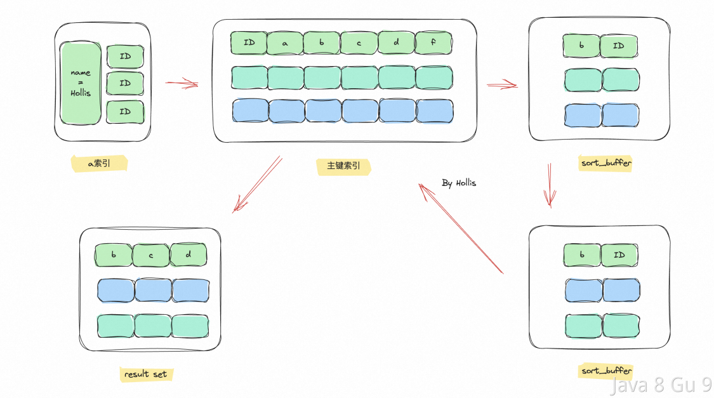

# MySQL数据库

## MySQL的数据存储一定是基于硬盘的吗？

不是的，MySQL也可以基于内存的，即MySQL的内存表技术（Memory引擎）。它允许将数据和索引存储在内存中，从而提高了检索速度和修改数据的效率。优点包括具有快速响应的查询性能和节约硬盘存储空间。此外，使用内存表还可以实现更高的复杂性，从而提高了MySQL的整体性能。

创建内存表与创建普通表一样，使用CREATE TABLE语句，但需要将存储引擎设置为：ENGINE = MEMORY

## 什么是数据库存储引擎？

数据库引擎是用于存储、处理和保护数据的核心服务。利用数据库引擎可控制访问权限并快速处理事务，从而满足企业内大多数需要处理大量数据的应用程序的要求。

使用数据库引擎创建用于联机事务处理或联机分析处理数据的关系数据库。这包括创建用于存储数据的表和用于查看、管理和保护数据安全的数据库对象（如索引、视图和存储过程）。

查看mysql当前使用什么存储引擎:show engines;

查看mysql当前默认的存储引擎:show variables like '%storage_engine%';

查看看某个表用了什么引擎:show create table 表名;，在显示结果里参数engine后面的就表示该表当前用的存储引擎

## MySQL支持哪几种执行引擎，有什么区别

MySQL是开源的，我们可以基于其源码编写我们自己的存储引擎，有以下几种存储引擎MyISAM、InnoDB、NDB、MEMORY，Archieve、Fedarated以及Maria等。对比如下：


## InnoDB和MyISAM有什么区别？

InnoDB和MyISAM是MySQL中比较常用的两个执行引擎，MySQL 在 5.5 之前版本默认存储引擎是 MyISAM，5.5 之后版本默认存储引擎是 InnoDB，MyISAM适合查询以及插入为主的应用，InnoDB适合频繁修改以及涉及到安全性较高的应用他们主要有以下区别：

1. InnoDB支持事务，MyISAM不支持

2. InnoDB 是聚集索引，MyISAM 是非聚集索引

3. InnoDB支持外键，MyISAM不支持

4. InnoDB 最小的锁粒度是行锁，MyISAM 最小的锁粒度是表锁。

5. InnoDB不支持FULLTEXT类型的索引（5.6之前不支持全文索引）

6. InnoDB中不保存表的行数，但是MyISAM只要简单的读出保存好的行数即可

7. 对于自增长的字段，InnoDB中必须包含只有该字段的索引，但是在MyISAM表中可以和其他字段一起建立联合索引

8. 清空整个表时，InnoDB是一行一行的删除，效率非常慢。MyISAM则会重建表

## char和varchar的区别？

char和varchar都是用于在数据库中存储字符串的数据类型。它们之间的主要区别在于存储空间的使用方式：

char是一种定长的数据类型，它的长度固定且在存储时会自动在结尾添加空格来将字符串填满指定的长度。char的长度范围是0-255，

varchar是一种可变长度的数据类型，它只会存储实际的字符串内容，不会填充空格。因此，在存储短字符串时，varchar可以节省空间。varchar的长度范围是0-65535（MySQL 5.0.3之后的版本）。

对于字段值经常改变的数据类型来说，CHAR 相比 VARCHAR 也更有优势，因为 CHAR 的长度固定，不会产生碎片。如果使用char(100)，则插入记录后就分配了100个字节，后续修改不会造成页分裂的问题，而varchar(100)由于没有提前分配存储空间，因为表中数据刚开始插入时，可变长度字段值都是根据实际长度存储下来的，且行与行之间数据也是紧密连续存放在文件地址中的。那么现在值变长了，原来的位置无法扩展出新的空间出来，所以无法覆盖存放到原来的位置上。此时MySQL就会使用页分裂的方法扩展字段变长的空间。

varchar的优点是变长的字符串类型，兼容性更好；但是同时也会带来一些问题，如使用varchar可能会产生内存碎片、varchar会额外需要1到2个字节存储长度信息、以及update语句可能会导致页分裂等。

例如，存储产品描述（可变长度）、存储用户地址（可变长度）、存储用户名称（可变长度），这些都适合用varchar。

char的优点是定长的字符串类型，减少内存碎片，并且无需额外的内存空间去存储长度信息。但是他的缺点是会删除列末尾的空格信息。

例如，存储身份证号（固定长度）、存储订单号（可变长度）、存储国家编码（固定长度），这些都适合用char。

## MySQL 5.x和8.0有什么区别？

1. 性能：MySQL 8.0 的速度要比 MySQL 5.7 快 2 倍。MySQL 8.0 在以下方面带来了更好的性能：读/写工作负载、IO 密集型工作负载、以及高竞争（"hot spot"热点竞争问题）工作负载。

2. NoSQL：MySQL 从 5.7 版本开始提供 NoSQL 存储功能，目前在 8.0 版本中这部分功能也得到了更大的改进。该项功能消除了对独立的 NoSQL 文档数据库的需求，而 MySQL 文档存储也为 schema-less 模式的 JSON 文档提供了多文档事务支持和完整的 ACID 合规性。

3. 窗口函数(Window Functions)：从 MySQL 8.0 开始，新增了一个叫窗口函数的概念，它可以用来实现若干新的查询方式。窗口函数与 SUM()、COUNT() 这种集合函数类似，但它不会将多行查询结果合并为一行，而是将结果放回多行当中。即窗口函数不需要 GROUP BY。

4. 隐藏索引：在 MySQL 8.0 中，索引可以被“隐藏”和“显示”。当对索引进行隐藏时，它不会被查询优化器所使用。我们可以使用这个特性用于性能调试，例如我们先隐藏一个索引，然后观察其对数据库的影响。如果数据库性能有所下降，说明这个索引是有用的，然后将其“恢复显示”即可；如果数据库性能看不出变化，说明这个索引是多余的，可以考虑删掉。

5. 取消查询缓存：MySQL 8.0 出于性能和可维护性方面的考虑取消了查询缓存，通过使用索引、更好的查询计划优化、以及缓存结果集而不是整个查询。这些方法更有效地提高了查询性能，同时避免了查询缓存可能引入的问题。

6. 降序索引：MySQL 8.0 为索引提供按降序方式进行排序的支持，在这种索引中的值也会按降序的方式进行排序。

7. 通用表表达式(Common Table Expressions CTE)：在复杂的查询中使用嵌入式表时，使用 CTE 使得查询语句更清晰。

8. UTF-8 编码：从 MySQL 8 开始，使用 utf8mb4 作为 MySQL 的默认字符集。

9. JSON：MySQL 8 大幅改进了对 JSON 的支持，添加了基于路径查询参数从 JSON 字段中抽取数据的 JSON_EXTRACT() 函数，以及用于将数据分别组合到 JSON 数组和对象中的 JSON_ARRAYAGG() 和 JSON_OBJECTAGG() 聚合函数。

10. 可靠性：InnoDB 现在支持表 DDL 的原子性，也就是 InnoDB 表上的 DDL 也可以实现事务完整性，要么失败回滚，要么成功提交，不至于出现 DDL 时部分成功的问题，此外还支持 crash-safe 特性，元数据存储在单个事务数据字典中。

11. 高可用性(High Availability)：InnoDB 集群为您的数据库提供集成的原生 HA 解决方案。

12. 安全性：对 OpenSSL 的改进、新的默认身份验证、SQL 角色、密码强度、授权。

## 什么是数据库范式，为什么要反范式

所谓数据库范式，其实就是数据库的设计上的一些规范；这些规范可以让数据库的设计更加简洁、清晰；同时也会更加好的可以保证一致性。

三个常用的范式：

1. 第一范式（1NF）是说，数据库表中的属性是原子性的，要求属性具有原子性，不可再被拆分；
   
   - 比如地址如果都细化拆分成省、市、区、街道、小区等等多个字段这就是符合第一范式的， 如果地址就是一个字段，那就不符合了。

2. 第二范式（2NF）是说，数据库表中的每个实例或记录必须可以被唯一地区分，说白了就是要有主键，其他的字段都依赖于主键。

3. 第三范式（3NF）是说，任何非主属性不依赖于其它非主属性，也就是说，非主键外的所有字段必须互不依赖

如果我们在做表结构设计的时候，完全遵守数据库三范式，确实可以避免一些写时异常，提升一些写入性能，但是同时也会丢失一些读取性能。

因为在遵守范式的数据库设计中，表中不能有任何冗余字段，这就使得查询的时候就会经常有多表关联查询，这无疑是比较耗时的。

于是就有了反范式化。所谓反范式化，是一种针对遵从设计范式的数据库的性能优化策略。

也就是说，反范式化不等于非范式化，反范式化一定发生在满足范式设计的基础之上。前者相当于先遵守所有规则，再进行局部调整。

比如我们可以在表中增加一些冗余字段，方便我们进行数据查询，而不再需要经常做多表join，但同时，这也会带来一个问题，那就是这些冗余字段之间的一致性如何保证，这个问题本来在遵守范式的设计中是不会有的，一旦做了反范式，那就需要开发者自行解决了。

反范式其实本质上是软件开发中一个比较典型的方案，那就是"用空间换时间"，通过做一些数据冗余，来提升查询速度。

在互联网业务中，比较典型的就是数据量大，并发高，并且通常查询的频率要远高于写入的频率，所以适当的做一些反范式，通过做一些字段的冗余，可以提升查询性能，降低响应时长，从而提升并发度。

## 为什么大厂不建议使用多表join？

之所以不建议使用join查询，最主要的原因就是join的效率比较低。

MySQL是使用了嵌套循环（Nested-Loop Join）的方式来实现关联查询的，简单点说就是要通过两层循环，用第一张表做外循环，第二张表做内循环，外循环的每一条记录跟内循环中的记录作比较，符合条件的就输出。

而具体到算法实现上主要有simple nested loop，block nested loop和index nested loop这三种。而且这三种的效率都没有特别高。

MySQL是使用了嵌套循环（Nested-Loop Join）的方式来实现关联查询的，如果有2张表join的话，复杂度最高是O(n^2)，3张表则是O(n^3)...随着表越多，表中的数据量越多，JOIN的效率会呈指数级下降。

### join

在MySQL 中，可以使用 JOIN 在两个或多个表中进行联合查询，join有三种，分别是inner join、left join 和 right join。

1. INNER JOIN（内连接,或等值连接）：获取两个表中字段匹配关系的记录。
   
   - 取两个表的交集部分

2. LEFT JOIN（左连接）：获取左表所有记录，即使右表没有对应匹配的记录。
   
   - 取两个表的交集部分+左表中的数据

3. RIGHT JOIN（右连接）： 与 LEFT JOIN 相反，用于获取右表所有记录，即使左表没有对应匹配的记录。
   
   - 取两个表的交集部分+右表中的数据

在配合join一起使用的还有on关键字，用来指明关联查询的一些条件。

### 嵌套循环算法

MySQL是使用了嵌套循环（Nested-Loop Join）的方式来实现关联查询的，具体到算法上面主要有simple nested loop join，block nested loop join和index nested loop join这三种。

而这三种的效率都没有特别高。

1. simple nested loop，他的做法简单粗暴，就是全量扫描连接两张表进行数据的两两对比，所以他的复杂度可以认为是N*M（N是驱动表的数量，M是被驱动表的数量）

2. index nested loop，当Inner Loop的表用到字段有索引的话，可以用到索引进行查询数据，因为索引是B+树的，复杂度可以近似认为是N*logM。

3. block nested loop，其实是引入了一个Buffer，会提前把外循环的一部分结果提前放到JOIN BUFFER中，然后内循环的每一行都和整个buffer的数据作比较。虽然比较次数还是N*M，但是因为join buffer是基于内存的，所以效率高很多。

所以，虽然MySQL已经尽可能的在优化了，但是这几种算法复杂度都还是挺高的，这也是为什么不建议在数据库中多表JOIN的原因。随着表越多，表中的数据量越多，JOIN的效率会呈指数级下降。

### 不能用join如何做关联查询

如果不能通过数据库做关联查询，那么需要查询多表的数据的时候要怎么做呢？

主要有两种做法：

1. 在内存中自己做关联，即先从数据库中把数据查出来之后，我们在代码中再进行二次查询，然后再进行关联。

2. 数据冗余，那就是把一些重要的数据在表中做冗余，这样就可以避免关联查询了。

3. 宽表，就是基于一定的join关系，把数据库中多张表的数据打平做一张大宽表，可以同步到ES或者干脆直接在数据库中直接查都可以。

## 说一说MySQL一条SQL语句的执行过程？

如一条简单的查询语句：select * from users where age='18' and name='sun';

执行过程如下图：


结合上面的说明，我们分析下这个语句的执行流程：

1. 使用连接器，通过客户端/服务器通信协议与 MySQL 建立连接。并查询是否有权限

2. Mysql8.0之前检查是否开启缓存，开启了 Query Cache 且命中完全相同的 SQL 语句，则将查询结果直接返回给客户端；

3. 由解析器（分析器）进行语法分析和语义分析，并生成解析树。如查询是select、表名users、条件是age='18' and name='sun'，预处理器则会根据 MySQL 规则进一步检查解析树是否合法。比如检查要查询的数据表或数据列是否存在等。

4. 由优化器生成执行计划。根据索引看看是否可以优化

5. 执行器来执行SQL语句，这里具体的执行会操作MySQL的存储引擎来执行 SQL 语句，根据存储引擎类型，得到查询结果。若开启了 Query Cache，则缓存，否则直接返回。

## InnoDB支持哪几种行格式？

数据库表的行格式决定了一行数据是如何进行物理存储的，进而影响查询和DML操作的性能。

在InnoDB中，常见的行格式有4种：

1. COMPACT ：是MySQL 5.0之前的默认格式，除了保存字段值外，还会利用空值列表保存null值，还会记录变长字段长度列表和记录头信息。
   
   COMPACT 适合处理大量包含可变长度列（如VARCHAR、VARBINARY、BLOB和TEXT类型）的数据。
   
   对于可变长度列，前768字节的数据存储在B树节点的索引记录中，超出部分存储在溢出页中。大于或等于768字节的固定长度列会被编码为可变长度列，并可以存储在页外。
   
   

2. REDUNDANT ：Redundant 是 MySQL5.0 版本之前 InnoDB 的行记录存储方式，用的比较少，Redundant 行格式会把该条记录中所有列 (包括隐藏列) 的长度信息都存储到 '字段长度偏移列表' 中。
   
   

3. DYNAMIC：DYNAMIC格式在MySQL 5.7版本引入，是COMPACT格式的改进版。它保持了COMPACT格式的优点，同时在存储大的可变长度列时更加灵活，能够动态地选择存储在页内或页外。DYNAMIC格式适用于大部分的应用场景，并在存储空间和性能上做了一定的平衡。其结构和COMPACT大致相同；

4. COMPRESSED：是MySQL 5.1中InnoDB的新特性之一，它可以在存储数据时对数据进行压缩，从而减小磁盘占用空间。它的缺点是增加了CPU的使用，可能会降低一些查询的性能。COMPRESSED 行格式是在 DYNAMIC 行格式的基础上添加了页外压缩功能。在存储时，如果发现数据可以通过压缩减小存储空间，就会使用压缩方式来存储数据。在查询时，会自动解压缩数据并返回结果。

5. BARRACUDA：是MySQL 5.7引入的一种新格式，相对于前面的格式，支持更多的高级特性，如动态行格式、行级压缩、空间管理等。

| 行格式        | 紧凑的存储特性 | 增强的可变长度列存储 | 大索引键前缀支持 | 压缩支持 | 支持的表空间类型                        | 所需文件格式                |
| ---------- | ------- | ---------- | -------- | ---- | ------------------------------- | --------------------- |
| REDUNDANT  | 否       | 否          | 否        | 否    | system, file-per-table, general | Antelope or Barracuda |
| COMPACT    | 是       | 否          | 否        | 否    | system, file-per-table, general | Antelope or Barracuda |
| DYNAMIC    | 是       | 是          | 是        | 否    | system, file-per-table, general | Barracuda             |
| COMPRESSED | 是       | 是          | 是        | 是    | file-per-table, general         | Barracuda             |

## 什么是数据库事务？

数据库事务( transaction)是访问并可能操作各种数据项的一个数据库操作序列，这些操作要么全部执行，要么全部不执行，是一个不可分割的工作单位。 事务由事务开始与事务结束之间执行的全部数据库操作组成。

并非任意的对数据库的操作序列都是数据库事务。事务应该具有4个属性：原子性、一致性、隔离性、持久性。这四个属性通常称为ACID特性。

1. 原子性（Atomicity）：事务作为一个整体被执行，包含在其中的对数据库的操作要么全部被执行，要么都不执行。

2. 一致性（Consistency）：事务应确保数据库的状态从一个一致状态转变为另一个一致状态。一致状态的含义是数据库中的数据应满足完整性约束。

3. 隔离性（Isolation）：多个事务并发执行时，一个事务的执行不应影响其他事务的执行。

4. 持久性（Durability）：一个事务一旦提交，他对数据库的修改应该永久保存在数据库中。

### 举例

用一个常用的“A账户向B账号汇钱”的例子来说明如何通过数据库事务保证数据的准确性和完整性。熟悉关系型数据库事务的都知道从帐号A到帐号B需要6个操作：

1. 从A账号中把余额读出来（500）

2. 对A账号做减法操作（500-100）

3. 把结果写回A账号中（400）

4. 从B账号中把余额读出来（500）

5. 对B账号做加法操作（500+100）

6. 把结果写回B账号中（600）

### 原子性

保证1-6所有过程要么都执行，要么都不执行。一旦在执行某一步骤的过程中发生问题，就需要执行回滚操作。 假如执行到第五步的时候，B账户突然不可用（比如被注销），那么之前的所有操作都应该回滚到执行事务之前的状态。

### 一致性

在转账之前，A和B的账户中共有500+500=1000元钱。在转账之后，A和B的账户中共有400+600=1000元。也就是说，数据的状态在执行该事务操作之后从一个状态改变到了另外一个状态。同时一致性还能保证账户余额不会变成负数等。

### 隔离性

在A向B转账的整个过程中，只要事务还没有提交（commit），查询A账户和B账户的时候，两个账户里面的钱的数量都不会有变化。 如果在A给B转账的同时，有另外一个事务执行了C给B转账的操作，那么当两个事务都结束的时候，B账户里面的钱应该是A转给B的钱加上C转给B的钱再加上自己原有的钱。

### 持久性

一旦转账成功（事务提交），两个账户的里面的钱就会真的发生变化（会把数据写入数据库做持久化保存）！

## binlog、redo log和undo log区别？

在MySQL数据库中，binlog、redolog和undolog都是日志类型文件，但它们各自的作用和实现方式有所不同。

binlog主要用来对数据库进行数据备份、崩溃恢复和数据复制等操作，redo log和undo log主要用于事务管理，记录的是数据修改操作和回滚操作。redo log用来做恢复，undo log用来做回滚。

> 崩溃恢复是指在数据库系统因为某种原因而发生崩溃或非正常关闭后，通过一系列机制和步骤来恢复数据库到一个一致性和可用的状态。崩溃恢复是数据库管理系统的重要功能，它确保数据库在出现异常情况后能够自动恢复，避免数据丢失或数据库状态不一致的问题。

在MySQL中，redo log和undo log只适用于InnoDB存储引擎，因为要支持事务。而不适用于MyISAM等其他存储引擎。而binlog则适用于所有存储引擎。

binlog是MySQL用于记录数据库中的所有DDL语句和DML语句的一种二进制日志。它记录了所有对数据库结构和数据的修改操作，如INSERT、UPDATE和DELETE等。binlog主要用来对数据库进行数据备份、灾难恢复和数据复制等操作。binlog的格式分为基于语句的格式和基于行的格式。

redo log是MySQL用于实现崩溃恢复和数据持久性的一种机制。在事务进行过程中，MySQL会将事务做了什么改动到redo log中。当系统崩溃或者发生异常情况时，MySQL会利用redo log中的记录信息来进行恢复操作，将事务所做的修改持久化到磁盘中。redo log保证事务的持久性。

undo log则用于在事务回滚或系统崩溃时撤销（回滚）事务所做的修改。当一个事务执行完成后，MySQL会将事务修改前的数据记录到undo log中。如果事务需要回滚，则会从undo log中找到相应的记录来撤销事务所做的修改。另外，undo log还支持MVCC（多版本并发控制）机制，用于在并发事务执行时提供一定的隔离性。undo log保证事务的原子性和一致性。

## InnoDB的一次更新事务是怎么实现的？

一次InnnoDB的update操作，涉及到buffer pool、binlog、undo log、redo log以及物理磁盘，完整的一次操作过程基本如下：

1. 在Buffer Pool中读取数据：当InnoDB需要更新一条记录时，首先会在buffer pool中查找该记录是否在内存中。如果没有在内存中，则从磁盘读取该页到buffer pool中。

2. 记录undo log：在修改操作前，InnoDB会在undo log中记录修改前的数据。undo log是用来保证事务原子性和一致性的一种机制，用于在发生事务回滚等情况时，将修改操作回滚到修改前的状态，以达到事务的原子性和一致性。undo log的写入最开始写到内存中的，然后由1个后台线程定时刷新到磁盘中的。

3. 在buffer pool中更新：当执行update语句时，InnoDB会先更新已经读取到buffer pool中的数据，而不是直接写入磁盘。同时，InnoDB会将修改后的数据页状态设置为“脏页”（Dirty Page）状态，表示该页已经被修改但尚未写入磁盘。

4. 记录redo log buffer：InnoDB在buffer pool中记录修改操作的同时，InnoDB 会先将修改操作写入到 redo log buffer 中。

5. 提交事务：在执行完所有修改操作后，事务被提交。在提交事务时，InnoDB会将redo log写入磁盘，以保证事务持久性。

6. 写入磁盘：在提交过程后，InnoDB会将buffer pool中的脏页写入磁盘，以保证数据的持久性。但是这个写入过程并不是立即执行的，是有一个后台线程异步执行的，所以可能会延迟写入，总之就是MYSQL会选择合适的时机把数据写入磁盘做持久化。

7. 记录binlog：在提交过程中，InnoDB会将事务提交的信息记录到binlog中。binlog是MySQL用来实现主从复制的一种机制，用于将主库上的事务同步到从库上。在binlog中记录的信息包括：事务开始的时间、数据库名、表名、事务ID、SQL语句等。

需要注意的是，在binlog和redo log的写入过程中，其实是分成了2阶段的，通过2阶段提交的方式来保证一致性的。


## redo log两阶段提交

`redo log`（重做日志）让`InnoDB`存储引擎拥有了崩溃恢复能力。

`binlog`（归档日志）保证了`MySQL`集群架构的数据一致性。

虽然它们都属于持久化的保证，但是侧重点不同。

在执行更新语句过程，会记录`redo log`与`binlog`两块日志，以基本的事务为单位，`redo log`在事务执行过程中可以不断写入，而`binlog`只有在提交事务时才写入，所以`redo log`与`binlog`的写入时机不一样。


回到正题，`redo log`与`binlog`两份日志之间的逻辑不一致，会出现什么问题？

我们以`update`语句为例，假设`id=2`的记录，字段`c`值是`0`，把字段`c`值更新成`1`，`SQL`语句为`update T set c=1 where id=2`。

假设执行过程中写完`redo log`日志后，`binlog`日志写期间发生了异常，会出现什么情况呢？


由于`binlog`没写完就异常，这时候`binlog`里面没有对应的修改记录。因此，之后用`binlog`日志恢复数据时，就会少这一次更新，恢复出来的这一行`c`值是`0`，而原库因为`redo log`日志恢复，这一行`c`值是`1`，最终数据不一致。


为了解决两份日志之间的逻辑一致问题，`InnoDB`存储引擎使用**两阶段提交**方案。

原理很简单，将`redo log`的写入拆成了两个步骤`prepare`和`commit`，这就是**两阶段提交**。


使用**两阶段提交**后，写入`binlog`时发生异常也不会有影响，因为`MySQL`根据`redo log`日志恢复数据时，发现`redo log`还处于`prepare`阶段，并且没有对应`binlog`日志，就会回滚该事务。


再看一个场景，`redo log`设置`commit`阶段发生异常，那会不会回滚事务呢？


并不会回滚事务，它会执行上图框住的逻辑，虽然`redo log`是处于`prepare`阶段，但是只要能通过redolog中的事务`id`找到对应的`binlog`日志且事务id相同，则`MySQL`认为是完整的，就会提交事务恢复数据。只要事务id不一致，则不完整，会回滚事务。

## 什么是脏读、幻读、不可重复读？

脏读：读到了其他事务还没有提交的数据。

不可重复读：对某数据进行读取过程中，有其他事务对数据进行了修改（UPDATE、DELETE)，导致第二次读取的结果不同。

幻读：事务在做范围查询过程中，有另外一个事务对范围内新增了记录(INSERT)，导致范围查询的结果条数不一致。

### 什么是脏读？

脏读又称无效数据的读出，是指在数据库访问中，事务T1将某一值修改，然后事务T2读取该值，此后T1因为某种原因撤销对该值的修改，这就导致了T2所读取到的数据是无效的。

脏读就是指当一个事务正在访问数据，并且对数据进行了修改，而这种修改还没有提交(commit)到数据库中，这时，另外一个事务也访问这个数据，然后使用了这个数据。因为这个数据是还没有提交的数据，那么另外一个事务读到的这个数据是脏数据，依据脏数据所做的操作可能是不正确的。

### 什么是不可重复读？

不可重复读，是指在数据库访问中，一个事务范围内两个相同的查询却返回了不同数据。这是由于查询时系统中其他事务修改的提交而引起的。比如事务T1读取某一数据，事务T2读取并修改了该数据，T1为了对读取值进行检验而再次读取该数据，便得到了不同的结果。

一种更易理解的说法是：在一个事务内，多次读同一个数据。在这个事务还没有结束时，另一个事务也访问该同一数据。那么，在第一个事务的两次读数据之间。由于第二个事务的修改，那么第一个事务读到的数据可能不一样，这样就发生了在一个事务内两次读到的数据是不一样的，因此称为不可重复读，即原始读取不可重复。

### 什么是幻读？

幻读是指当事务不是独立执行时发生的一种现象，例如第一个事务对一个表中的数据进行了修改，比如这种修改涉及到表中的“全部数据行”。同时，第二个事务也修改这个表中的数据，这种修改是向表中插入“一行新数据”。那么，以后就会发生操作第一个事务的用户发现表中还有没有修改的数据行，就好象发生了幻觉一样.一般解决幻读的方法是增加范围锁RangeS，锁定检锁范围为只读，这样就避免了幻读。

幻读是不可重复读的一种特殊场景：当事务没有获取范围锁的情况下执行SELECT … WHERE操作可能会发生幻读。

### 事务隔离级别

脏读、不可重复读和幻读这三种异常情况，是在 SQL-92 标准中定义的，同时 SQL-92 标准还定义了 4 种隔离级别来解决这些异常情况，从高到底依次为：串行化(Serializable)、可重复读(Repeatable reads)、读已提交(Read committed)、读未提交(Read uncommitted)。

## MySQL中的事务隔离级别？

读未提交(Read uncommitted)是最低的隔离级别。通过名字我们就可以知道，在这种事务隔离级别下，一个事务可以读到另外一个事务未提交的数据。这种隔离级别下会存在幻读、不可重复读和脏读的问题。

提交读(Read committed)也可以翻译成读已提交，通过名字也可以分析出，在一个事务修改数据过程中，如果事务还没提交，其他事务不能读该数据。所以，这种隔离级别是可以避免脏读的发生的。

可重复读(Repeatable reads)，由于提交读隔离级别会产生不可重复读的读现象。所以，比提交读更高一个级别的隔离级别就可以解决不可重复读的问题。这种隔离级别就叫可重复读。但是这种隔离级别没办法彻底解决幻读。

可串行化(Serializable)是最高的隔离级别，前面提到的所有的隔离级别都无法解决的幻读，在可序列化的隔离级别中可以解决。


注意！！！以上是SQL-92标准中对事务隔离级别以及需要解决的读现象（脏读、幻读、不可重复读）的定义，但是不同的数据库在实际实现的过程中，是有一些细微差异的。

### 事务隔离级别相关命令

1. 查看当前会话隔离级别
   
   `select @@tx_isolation;`
   
   在MySQL 8.0中：`SELECT @@transaction_isolation;`

2. .查看系统当前隔离级别
   
   `select @@global.tx_isolation;`

3. 设置当前会话隔离级别
   
   `set session transaction isolatin level repeatable read;`

4. 设置系统当前隔离级别
   
   `set global transaction isolation level repeatable read;`

5. 命令行，开始事务时
   
   `set autocommit=off 或者 start transaction`

## InnoDB如何解决脏读、不可重复读和幻读的？

在Innodb中，通过MVCC解决脏读和不可重复读，通过MVCC+间隙锁解决幻读的。

脏读的解决。脏读指一个事务可以读取另一个事务未提交的数据，导致数据不一致。InnoDB 通过在每行数据中添加一个隐藏的事务 ID 来实现 MVCC，当一个事务开始时，它会获取一个唯一的事务 ID，该事务 ID 被用来标记该事务所做的修改。当一个事务读取一行数据时，InnoDB 检查该行数据的事务 ID 是否小于当前事务的 ID，只有小于当前事务ID才是已提交的数据。否则，说明该行数据是未提交的数据，InnoDB 将阻止该事务读取该行数据，从而避免了脏读的问题。

不可重读的解决。不可重复读指一个事务读取同一行数据两次，但是在两次读取之间另一个事务修改了该行数据，导致两次读取的结果不同。InnoDB 通过使用 MVCC 来解决不可重复读的问题。在RR这种隔离级别下，当我们使用快照读进行数据读取的时候，只会在第一次读取的时候生成一个Read View，后续的所有快照读都是用的同一个快照，所以就不会发生不可重复读的问题了。

幻读的解决。InnoDB的RR级别中，基于MVCC+间隙锁，是在某种程度上是可以避免幻读的发生的，但是没有办法完全避免，当一个事务中发生当前读的时候，会导致幻读的发生。

## 当前读和快照读有什么区别？

所谓快照读，就是读取的是快照数据，即快照生成的那一刻的数据，像我们常用的普通的SELECT语句在不加锁情况下就是快照读。如：

SELECT * FROM xx_table WHERE ...

和快照读相对应的另外一个概念叫做当前读，当前读就是读取最新数据，所以，加锁的 SELECT，或者对数据进行增删改都会进行当前读，比如：

```sql
SELECT * FROM xx_table LOCK IN SHARE MODE;

SELECT * FROM xx_table FOR UPDATE;

INSERT INTO xx_table ...

DELETE FROM xx_table ...

UPDATE xx_table ...
```

在MySQL 中，只有READ COMMITTED 和 REPEATABLE READ这两种事务隔离级别才会使用快照读。

- 在 RR 中，快照会在事务中第一次SELECT语句执行时生成，只有在本事务中对数据进行更改才会更新快照。

- 在 RC 中，每次读取都会重新生成一个快照，总是读取行的最新版本。

## MVCC解决幻读

MVCC，是Multiversion Concurrency Control的缩写，翻译过来是多版本并发控制，和数据库锁一样，他也是一种并发控制的解决方案。

我们知道，在数据库中，对数据的操作主要有2种，分别是读和写，而在并发场景下，就可能出现以下三种情况：

- 读-读并发

- 读-写并发

- 写-写并发

我们都知道，在没有写的情况下读-读并发是不会出现问题的，而写-写并发这种情况比较常用的就是通过加锁的方式实现。那么，读-写并发则可以通过MVCC的机制解决。

可以说快照读是MVCC实现的基础，而当前读是悲观锁实现的基础。

那么，快照读读到的快照是从哪里读到的的呢？换句话说，快照是存在哪里的呢？

### undo log

undo log是Mysql中比较重要的事务日志之一，顾名思义，undo log是一种用于回退的日志，在事务没提交之前，MySQL会先记录更新前的数据到 undo log日志文件里面，当事务回滚时或者数据库崩溃时，可以利用 undo log来进行回退。

这里面提到的存在undo log中的"更新前的数据"就是我们前面提到的快照。所以，这也是为什么很多人说UndoLog是MVCC实现的重要手段的原因。

那么，一条记录在同一时刻可能有多个事务在执行，那么，undo log会有一条记录的多个快照，那么在这一时刻发生SELECT要进行快照读的时候，要读哪个快照呢？

这就需要用到另外几个信息了。

### 行记录的隐式字段

首先，数据库中的每行记录中，除了保存了我们自己定义的一些字段以外，还有一些重要的隐式字段的：

- db_row_id：隐藏主键，如果我们没有给这个表创建主键，那么会以这个字段来创建聚簇索引。

- db_trx_id：对这条记录做了最新一次修改的事务的ID

- db_roll_ptr：回滚指针，指向这条记录的上一个版本，其实他指向的就是Undo Log中的上一个版本的快照的地址。

因为每一次记录变更之前都会先存储一份快照到undo log中，那么这几个隐式字段也会跟着记录一起保存在undo log中，就这样，每一个快照中都有一个db_trx_id字段表示了对这个记录做了最新一次修改的事务的ID ，以及一个db_roll_ptr字段指向了上一个快照的地址。（db_trx_id和db_roll_ptr是重点，后面还会用到）

这样，就形成了一个快照链表：


有了undo log，又有了几个隐式字段，我们好像还是不知道具体应该读取哪个快照，那怎么办呢？

### Read View

这时候就需要Read View 登场了，Read View 主要来帮我们解决可见性的问题的, 即他会来告诉我们本次事务应该看到哪个快照，不应该看到哪个快照。

在 Read View 中有几个重要的属性：

- trx_ids，系统当前未提交的事务 ID 的列表。

- max_trx_id，应该分配给下一个事务的id 值。

- min_trx_id，当前系统中活跃的事务中最小的事务 ID。

- creator_trx_id，创建这个 Read View 的事务 ID。

每开启一个事务，我们都会从数据库中获得一个事务 ID，这个事务 ID 是自增长的，通过 ID 大小，我们就可以判断事务的时间顺序。

那么，一个事务应该看到哪些快照，不应该看到哪些快照该如何判断呢？

其实原则比较简单，那就是事务ID大的事务应该能看到事务ID小的事务的变更结果，反之则不能！举个例子：

假如当前有一个事务3想要对某条记录进行一次快照读的时候，他会先创建一个Read View，并且把当前所有还未提交的事务的信息记录下来。比如min_trx_id= 2，max_trx_id= 5，trx_ids= [2,4]，creator_trx_id= 3

我们前面说过，每一条记录上都有一个隐式字段db_trx_id记录对这条记录做了最新一次修改的事务的ID，如db_trx_id = 3；

那么接下来，数据库会拿这条记录db_trx_id和Read View进行可见性比较。

- 如果db_trx_id<min_trx_id，则说明，在Read View创建之前，db_trx_id的这个事务就已经提交了。所以，这条记录对当前事务就应该是可见的。

- 如果，db_trx_id>max_trx_id，则说明，db_trx_id的这个事务是在Read View创建之后才开启并提交的，也就是说，在当前事务开启之后，有别的事务修改了数据并作了提交。所以，这个记录对于当前事务来说应该就是不可见的。（不可见怎么办呢？后面讲）

- 那么，还有另外一种情况，那就是min_trx_id< db_trx_id <max_trx_id，这种情况下，会再拿db_trx_id和Read View中的trx_ids进行逐一比较。
  
  - 如果，db_trx_id在trx_ids列表中，那么表示在当前事务开启Read View后，并未提交的某个事务在修改数据之后提交了，那么这个记录对于当前事务来说应该是不可见的。
  
  - 如果，db_trx_id不在trx_ids列表中，那么表示的是在当前事务开启Read View之前，其他事务对数据进行修改并已经提交了，所以，这条记录对当前事务就应该是可见的。

所以，当读取一条记录的时候，经过以上判断，发现记录对当前事务可见，那么就直接返回就行了。那么如果不可见怎么办？没错，那就需要用到undo log了。

当数据的事务ID不符合Read View规则时候，那就需要从undo log里面获取数据的历史快照，然后数据快照的事务ID再来和Read View进行可见性比较，如果找到一条快照，则返回，找不到则返回空。


所以，总结一下，在InnoDB中，MVCC就是通过Read View + Undo Log来实现的，undo log中保存了历史快照，而Read View 用来判断具体哪一个快照是可见的。

### MVCC和可重复读

其实，根据不同的事务隔离级别，Read View的获取时机是不同的，在RC下，一个事务中的每一次SELECT都会重新获取一次Read View，而在RR下，一个事务中只在第一次SELECT的时候会获取一次Read View。

所以，可重复读这种事务隔离级别之下，因为有MVCC机制，就可以解决不可重复读的问题，因为他只有在第一次SELECT的时候才会获取一次Read View，天然不存在重复读的问题了。

## Innodb的RR到底有没有解决幻读？

InnoDB中的REPEATABLE READ这种隔离级别通过临键锁+MVCC解决了大部分的幻读问题，但是并不是所有的幻读都能解读，想要彻底解决幻读，需要使用Serializable的隔离级别。

RR中，通过间隙锁解决了部分当前读的幻读问题，通过增加间隙锁将记录之间的间隙锁住，避免新的数据插入。

RR中，通过MVCC机制的，解决了快照读的幻读问题，RR中的快照读只有第一次会进行数据查询，后面都是直接读取快照，所以不会发生幻读。

但是，如果两个事务，事务1先进行快照读，然后事务2插入了一条记录并提交，再在事务1中进行update新插入的这条记录是可以更新出成功的，这就是发生了幻读。

还有一种场景，如果两个事务，事务1先进行快照读，然后事务2插入了一条记录并提交，在事务1中进行了当前读之后，再进行快照读也会发生幻读。

### 快照读解决幻读示例


可以看到，同一个事务中的两次查询结果是一样的，就是在RR级别下，因为有快照读，所以第二次查询其实读取的是一个快照数据。

### 当前读解决幻读示例


像上面这种情况，在RR的级别下，当我们使用SELECT … FOR UPDATE的时候，会进行加锁，不仅仅会对行记录进行加锁，还会对记录之间的间隙进行加锁，这就叫做间隙锁。

因为记录之间的间隙被锁住了，所以事务2的插入操作就被阻塞了，一直到事务1把锁释放掉他才能执行成功。

因为事务2无法插入数据成功，所以也就不会存在幻读的现象了。所以，在RR级别中，通过加入间隙锁的方式，就避免了幻读现象的发生。

### 解决不了的幻读

前面我们介绍了快照读（无锁查询）和当前读（有锁查询）下是如何解决幻读的问题的，但是，上面的例子就是幻读的所有情况了吗？显然并不是。

我们说MVCC只能解决快照读的幻读，那如果在一个事务中发生了当前读，并且在另一个事务插入数据前没来得及加间隙锁的话，会发生什么呢？那么，我们稍加修改一下上面的SQL代码，通过当前读的方式进行查询数据：


在上面的例子中，在事务1中，我们并没有在事务开启后立即加锁，而是进行了一次普通的查询，然后事务2插入数据成功之后，再通过事务1进行了2次查询。

我们发现，事务1后面的两次查询结果完全不一样，没加锁的情况下，就是快照读，读到的数据就和第一次查询是一样的，就不会发生幻读。但是第二次查询加了锁，就是当前读，那么读取到的数据就有其他事务提交的数据了，就发生了幻读。

那么，如果你理解了上面的这个例子，并且你也理解了当前读的概念，那么你很容易就能想到，下面的这个CASE其实也是会发生幻读的：


这里发生幻读的原理，和上面的例子其实是一样的，那就是MVCC只能解决快照读中的幻读问题，而对于当前读（SELECT FOR UPDATE、UPDATE、DELETE等操作）还是会产生幻读的现象的。即，在同一个事务里面，如果既有快照读，又有当前读，那是会产生幻读的、

UPDATE语句也是一种当前读，所以它是可以读到其他事务的提交结果的。

为什么事务1的最后一次查询和倒数第二次查询的结果也不一样呢？

是因为根据快照读的定义，在RR中，如果本事务中发生了数据的修改，那么就会更新快照，那么最后一次查询的结果也就发生了变化。

### 如何避免幻读

那么了解了幻读的解决场景，以及不能解决的几个CASE之后，我们来总结一下该如何解决幻读的问题呢？

首先，如果想要彻底解决幻读的问题，在InnoDB中只能使用Serializable这种隔离级别。

那么，如果想在一定程度上解决或者避免发生幻读的话，使用RR也可以，但是RC、RU肯定是不行的。

在RR级别中，能使用快照读（无锁查询）的就使用快照读，这样不仅可以减少锁冲突，提升并发度，而且还能避免幻读的发生。

那么，如果在并发场景中，一定要加锁的话怎么办呢？那就一定要在事务一开始就立即加锁，这样就会有间隙锁，也能有效的避免幻读的发生。

但是需要注意的是，间隙锁是导致死锁的一个重要根源~所以，用起来也需要慎重。

## MySQL 的 select * 会用到事务吗？

我们都知道，在InnoDB存储引擎中，所有的修改操作都必须在事务中进行的，那么，而SELECT * 这种普通的读取操作其实也会在事务的上下文中执行，即使没有明确的开启事务语句，InnoDB存储引擎也会为查询自动开启一个隐式事务。

因此，InnoDB的所有操作都可以说是在事务的上下文中执行的，包括读取操作和修改操作。

虽然查询语句也会在事务的上下文中执行，但是由于没有进行任何修改操作，因此事务不会持有任何锁，并且在查询结束后立即提交。这种隐式事务通常被称为自动提交事务（autocommit）。

## MySQL的binlog有几种格式

binlog是MySQL用于记录数据库中的所有DDL语句和DML语句的一种二进制日志。它记录了所有对数据库结构和数据的修改操作，如INSERT、UPDATE和DELETE等。binlog主要用来对数据库进行数据备份、灾难恢复和数据复制等操作。binlog的格式分为基于语句的格式和基于行的格式。

MySQL的bin log主要支持三种格式，分别是statement、row以及mixed。MySQL是在5.1.5版本开始支持row的、在5.1.8版本中开始支持mixed。

### statement

当binlog的格式为statement时，binlog 里面记录的就是 SQL 语句的原文，也就是说在数据库中执行的SQL会原封不动的记录到binlog中。

如：

```sql
# at 12345
# statement: UPDATE employees SET name = "Hollis" WHERE id = 101;
```

这种格式现在用的都比较少了，因为他会导致主从同步的数据不一致问题。

比如说，当我们使用DELETE或者UPDATE的时候，指定了LIMIT，但是并没有使用order by，那么最终这条语句在主库和从库上的执行结果可能是不一样的（即使同一个库上面，你执行多次结果可能也不一样）。或者原来的sql中使用now函数获取当前时间，在同步到从库之后，从库执行now获取到的时间就是新的时间，导致了主从数据不一致的问题。

### row

在ROW格式中，bin log会记录每个数据更改的具体行的细节。这意味着二进制日志中的每个条目都会详细列出发生变更的行的内容和修改。即把每个字段需要修改的内容都记录下来，不会省略。

这种格式的好处就是不会导致主从不一致的问题。

但是他的缺点就是可能会要记录更多的内容，比如批量修改，就需要把每天记录的变更都记录下来。

所以，带来的问题就是基于这种格式的binlog，在数据恢复的时候，会需要更长的时间，也会导致磁盘IO和网络IO都比较高。

### mixed

这种其实就是把statement和row结合了，MySQL会根据SQL的情况，自动在row和statement中互相切换选择一个他认为合适的格式进行记录。

但是，在RR下，row和statement都可以生效，但是在RC下，只有row格式才能生效。

## 为什么MySQL默认使用RR隔离级别？

对于数据库的默认隔离级别，Oracle默认的隔离级别是 RC，而MySQL默认的隔离级别是 RR。

那么，你知道为什么Oracle选择RC作为默认级别，而MySQL要选择RR作为默认的隔离级别吗？

### Oracle 的隔离级别

前面我们说过，Oracle只支持ANSI/ISO SQL定义的Serializable和Read Committed，其实，根据Oracle官方文档给出的介绍，Oracle支持三种隔离级别：Read Committed、Serializable和Read-Only。

Read-Only只读隔离级别类似于可序列化隔离级别，但是只读事务不允许在事务中修改数据，除非用户是SYS。

在Oracle这三种隔离级别中，Serializable和Read-Only显然都是不适合作为默认隔离级别的，那么就只剩Read Committed这个唯一的选择了。

### MySQL 的隔离级别

相比于Oracle，MySQL的默认隔离级别的可选范围就比较大了。

首先，我们先从四种隔离级别中排除Serializable和Read Uncommitted这两种，主要是因为这两个级别一个隔离级别太高，一个太低。太高的就会影响并发度，太低的就有脏读现象。

那么，剩下的RR和RC两种，怎么选？

在MySQL设计之初，他的定位就是提供一个稳定的关系型数据库。而为了要解决MySQL单点故障带来的问题，MySQL采用主从复制的机制。

所谓主从复制，其实就是通过搭建MySQL集群，整体对外提供服务，集群中的机器分为主服务器（Master）和从服务器（Slave），主服务器提供写服务，从服务器提供读服务。

为了保证主从服务器之间的数据的一致性，就需要进行数据同步，大致的同步过程如下，这里就不详细介绍了


MySQL在主从复制的过程中，数据的同步是通过bin log进行的，简单理解就是主服务器把数据变更记录到bin log中，然后再把bin log同步传输给从服务器，从服务器接收到bin log之后，再把其中的数据恢复到自己的数据库存储中。

那么，binlog里面记录的是什么内容呢？格式是怎样的呢？

MySQL的bin log主要支持三种格式，分别是statement、row以及mixed。MySQL是在5.1.5版本开始支持row的、在5.1.8版本中开始支持mixed。

statement和row最大的区别，当binlog的格式为statement时，binlog 里面记录的就是 SQL 语句的原文（这句话很重要！！！后面会用的到）。

因为MySQL早期只有statement这种bin log格式，这时候，如果使用提交读(Read Committed)、未提交读(Read Uncommitted)这两种隔离级别会出现问题。

举个例子，有一个数据库表t1，表中有如下两条记录：

```sql
CREATE TABLE `t1` (
  `a` int(11) DEFAULT NULL,
  `b` int(11) DEFAULT NULL,
  KEY `b` (`b`)
) ENGINE=InnoDB DEFAULT CHARSET=latin1;

insert into t1 values(10,1);
```

接着开始执行两个事务的写操作：

| Session 1                                               | Session 2                                               |
| ------------------------------------------------------- | ------------------------------------------------------- |
| set session transaction isolation level read committed; |                                                         |
| set autocommit = 0;                                     | set session transaction isolation level read committed; |
|                                                         | set autocommit = 0;                                     |
| begin;                                                  | begin;                                                  |
| delete from t1 where b < 100;                           |                                                         |
|                                                         | insert into t1 values(10,99);                           |
|                                                         | commit;                                                 |
| commit;                                                 |                                                         |

以上两个事务执行之后，数据库里面的记录会只有一条记录（10,99），这个发生在主库的数据变更大家都能理解。

以上两个事务执行之后，会在bin log中记录两条记录，因为事务2先提交，所以insert into t1 values(10,99);会被优先记录，然后再记录delete from t1 where b < 100;（再次提醒：statement格式的bin log记录的是SQL语句的原文）

这样bin log同步到备库之后，SQL语句回放时，会先执行insert into t1 values(10,99);，再执行delete from t1 where b < 100;。

这时候，数据库中的数据就会变成 EMPTY SET，即没有任何数据。这就导致主库和备库的数据不一致了！！！

为了避免这样的问题发生。MySQL就把数据库的默认隔离级别设置成了Repetable Read，那么，Repetable Read的隔离级别下是如何解决这样问题的那？

那是因为Repetable Read这种隔离级别，会在更新数据的时候不仅对更新的行加行级锁，还会增加GAP锁和临键锁。上面的例子，在事务2执行的时候，因为事务1增加了GAP锁和临键锁，就会导致事务2执行被卡住，需要等事务1提交或者回滚后才能继续执行。

除了设置默认的隔离级别外，MySQL还禁止在使用statement格式的bin log的情况下，使用READ COMMITTED作为事务隔离级别。

一旦用户主动修改隔离级别，尝试更新时，会报错：

```log
ERROR 1598 (HY000): Binary logging not possible. Message: Transaction level 'READ-COMMITTED' in InnoDB is not safe for binlog mode 'STATEMENT'
```

所以，现在我们知道了，为什么MySQL选择RR作为默认的数据库隔离级别了吧，其实就是为了兼容历史上的那种statement格式的bin log。

## 为什么默认RR，大厂要改成RC？

虽然RR的隔离级别可以在一定程度上避免脏读、不可重复读和幻读等问题，但是，对于很多大型的互联网来说，会愿意将数据库的默认隔离级别调整成并发度更高的RC级别，从而，提升并发度并且降低发生死锁的概率。

### RR 和 RC 的区别

我们需要先来弄清楚一下 RR 和 RC 的区别，分析下各自的优缺点。

#### 一致性读

一致性读，又称为快照读。快照即当前行数据之前的历史版本。快照读就是使用快照信息显示基于某个时间点的查询结果，而不考虑与此同时运行的其他事务所执行的更改。

在MySQL 中，只有READ COMMITTED 和 REPEATABLE READ这两种事务隔离级别才会使用一致性读。

在 RR 中，快照会在事务中第一次SELECT语句执行时生成，只有在本事务中对数据进行更改才会更新快照。

在 RC 中，每次读取都会重新生成一个快照，总是读取行的最新版本。

在数据库的 RC 这种隔离级别中，还支持"半一致读" ，一条update语句，如果 where 条件匹配到的记录已经加锁，那么InnoDB会返回记录最近提交的版本，由MySQL上层判断此是否需要真的加锁。

#### 锁机制

数据库的锁，在不同的事务隔离级别下，是采用了不同的机制的。在 MySQL 中，有三种类型的锁，分别是Record Lock、Gap Lock和 Next-Key Lock。

> Record Lock表示记录锁，锁的是索引记录。
> 
> Gap Lock是间隙锁，锁的是索引记录之间的间隙。
> 
> Next-Key Lock是Record Lock和Gap Lock的组合，同时锁索引记录和间隙。他的范围是左开右闭的。

在 RC 中，只会对索引增加Record Lock，不会添加Gap Lock和Next-Key Lock。

在 RR 中，为了解决幻读的问题，在支持Record Lock的同时，还支持Gap Lock和Next-Key Lock；

#### 主从同步

在数据主从同步时，不同格式的 binlog 也对事务隔离级别有要求。

MySQL的binlog主要支持三种格式，分别是statement、row以及mixed。

但是，RC 隔离级别只支持row格式的binlog。如果指定了mixed作为 binlog 格式，那么如果使用RC，服务器会自动使用基于row 格式的日志记录。

而 RR 的隔离级别同时支持statement、row以及mixed三种。

### 为什么互联网公司选择使用 RC

#### 提升并发

互联网业务的并发度比传统企业要高出很多。

为什么 RC 比 RR 的并发度要好呢？

首先，RC 在加锁的过程中，是不需要添加Gap Lock和 Next-Key Lock 的，只对要修改的记录添加行级锁就行了。

这就使得并发度要比 RR 高很多。

另外，因为 RC 还支持"半一致读"，可以大大的减少了更新语句时行锁的冲突；对于不满足更新条件的记录，可以提前释放锁，提升并发度。

#### 减少死锁

因为RR这种事务隔离级别会增加Gap Lock和 Next-Key Lock，这就使得锁的粒度变大，那么就会使得死锁的概率增大。

> 死锁：一个事务锁住了表A，然后又访问表B；另一个事务锁住了表B，然后企图访问表A；这时就会互相等待对方释放锁，就导致了死锁。

RR和RC主要在加锁机制、主从同步以及一致性读方面存在一些差异。

而很多大厂，为了提升并发度和降低死锁发生的概率，会把数据库的隔离级别从默认的 RR 调整成 RC。

当然，这样做也不是完全没有问题，首先使用 RC 之后，就需要自己解决不可重复读的问题，这个其实还好，很多时候不可重复读问题其实是可以忽略的，或者可以用其他手段解决。

比如读取到别的事务修改的值其实问题不太大的，只要修改的时候的不基于错误数据就可以了，所以我们都是在核心表中增加乐观锁标记，更新的时候都要带上锁标记进行乐观锁更新。

还有就是使用 RC 的时候，不能使用statement格式的 binlog，这种影响其实可以忽略不计了，因为MySQL是在5.1.5版本开始支持row的、在5.1.8版本中开始支持mixed，后面这两种可以代替 statement格式。

## InnoDB的锁机制

锁是MySQL中并发控制的重要手段，InnoDB作为一种最常用的执行引擎，他支持很多种锁的类型。InnoDB中的锁根据不同的分类方式也有很多种分法。主要由以下这些：

按操作划分，可分为DML锁、DDL锁

按锁的粒度划分，可分为表级锁、行级锁、页级锁

按锁的级别划分，可分为共享锁、排他锁

按加锁方式划分，可分为自动锁、显示锁

按使用方式划分，可分为乐观锁、悲观锁

按锁的对象划分，可分为记录锁、间隙锁、临键锁

### 操作划分

#### DDL锁&DML锁

DDL 是Data Definition Language的缩写，简单来说，就是对数据库内部的对象进行创建、删除、修改的操作语言，例如表、字段、聚簇、索引、视图、函数、存储过程和触发器等。DML是Data Manipulation Language的缩写，主要就是指我们常用的 Delete\Update\Insert等操作。

那么，DDL锁指的就是在DDL操作过程中加的锁，而DML锁指的就是在DML操作过程中加的锁了。

#### DDL锁

在MySQL 5.6 Online DDL推出以前，执行DDL主要有两种方式copy方式和inplace方式，DDL执行期间会全程锁表，无法同时进行DML，实用性很低。

MySQL 5.6 版本发布了Online DDL功能，就是在DDL执行期间，也可以同时进行表上的DML操作，并不会全程锁表，实用性加强了很多。

#### DML锁

在执行DML操作过程中，是否需要加锁，就要看具体执行的是什么样的语句了，并且根据实际情况，比如是否存在索引等会加不同的锁（行级锁、表级锁）。

而且，update、delete和insert语句都是需要添加锁的。

### 锁的粒度划分

#### 行级锁

行级锁是Mysql中锁定粒度最细的一种锁，表示只针对当前操作的行进行加锁。行级锁能大大减少数据库操作的冲突。其加锁粒度最小，但加锁的开销也最大。行级锁分为共享锁 和 排他锁。

他的特点是开销大，加锁慢；会出现死锁；优点是锁定粒度最小，发生锁冲突的概率最低，并发度也最高。

#### 表级锁

表级锁是MySQL中锁定粒度最大的一种锁，表示对当前操作的整张表加锁，它实现简单，资源消耗较少，被大部分MySQL引擎支持。最常使用的MYISAM与INNODB都支持表级锁定。

他的优点是开销小，加锁快；不会出现死锁；缺点是锁定粒度大，发出锁冲突的概率最高，并发度最低。

#### 页级锁

页级锁是MySQL中锁定粒度介于行级锁和表级锁中间的一种锁。表级锁速度快，但冲突多，行级冲突少，但速度慢。所以取了折衷的页级，一次锁定相邻的一组记录。BDB支持页级锁。

他的特点是开销和加锁时间界于表锁和行锁之间；会出现死锁；锁定粒度界于表锁和行锁之间，并发度一般。

### InnoDB中的行锁与表锁

InnoDB行锁是通过给索引上的索引项加锁来实现的，这一点MySQL与Oracle不同，后者是通过在数据块中对相应数据行加锁来实现的。InnoDB这种行锁实现特点意味着：只有通过索引条件检索数据，InnoDB才使用行级锁，否则，InnoDB将使用表锁！

在实际应用中，要特别注意InnoDB行锁的这一特性，不然的话，可能导致大量的锁冲突，从而影响并发性能。

- 在不通过索引条件查询的时候,InnoDB 确实使用的是表锁,而不是行锁。

- 由于 MySQL 的行锁是针对索引加的锁,不是针对记录加的锁,所以虽然是访问不同行 的记录,但是如果是使用相同的索引键,是会出现锁冲突的。应用设计的时候要注意这一点。（参考：https://www.yuque.com/hollis666/xx5hr2/yywypm ）

- 当表有多个索引的时候,不同的事务可以使用不同的索引锁定不同的行,另外,不论 是使用主键索引、唯一索引或普通索引,InnoDB 都会使用行锁来对数据加锁。

- 即便在条件中使用了索引字段,但是否使用索引来检索数据是由 MySQL 通过判断不同 执行计划的代价来决定的,如果 MySQL 认为全表扫 效率更高,比如对一些很小的表,它 就不会使用索引,这种情况下 InnoDB 将使用表锁,而不是行锁。因此,在分析锁冲突时, 别忘了检查 SQL 的执行计划,以确认是否真正使用了索引。

### 锁的级别划分

#### 共享锁

共享锁又称读锁，是读取操作创建的锁。其他用户可以并发读取数据，但任何事务都不能对数据进行修改（获取数据上的排他锁），直到已释放所有共享锁。

如果事务T对数据A加上共享锁后，则其他事务只能对A再加共享锁，不能加排他锁。获得共享锁的事务只能读数据，不能修改数据。

```sql
SELECT ... LOCK IN SHARE MODE;
```

在查询语句后面增加LOCK IN SHARE MODE，MySQL会对查询结果中的每行都加共享锁，当没有其他线程对查询结果集中的任何一行使用排他锁时，可以成功申请共享锁，否则会被阻塞。其他线程也可以读取使用了共享锁的表，而且这些线程读取的是同一个版本的数据。

#### 排他锁

排他锁又称写锁，如果事务T对数据A加上排他锁后，则其他事务不能再对A加任任何类型的锁。获得排他锁的事务既能读数据，又能修改数据。

```sql
SELECT ... FOR UPDATE;
```

在查询语句后面增加FOR UPDATE，MySQL会对查询命中的每条记录都加排他锁（在有索引的情况下其实是通过索引加锁，无索引时会锁表），当没有其他线程对查询结果集中的任何一行使用排他锁时，可以成功申请排他锁，否则会被阻塞。

### 使用方式划分

#### 悲观锁

当我们要对一个数据库中的一条数据进行修改的时候，为了避免同时被其他人修改，最好的办法就是直接对该数据进行加锁以防止并发。

这种借助数据库锁机制在修改数据之前先锁定，再修改的方式被称之为悲观并发控制（又名“悲观锁”，Pessimistic Concurrency Control，缩写“PCC”）。

之所以叫做悲观锁，是因为这是一种对数据的修改抱有悲观态度的并发控制方式。我们一般认为数据被并发修改的概率比较大，所以需要在修改之前先加锁。

悲观并发控制实际上是“先取锁再访问”的保守策略，为数据处理的安全提供了保证。


但是在效率方面，处理加锁的机制会让数据库产生额外的开销，还有增加产生死锁的机会；另外，还会降低并行性，一个事务如果锁定了某行数据，其他事务就必须等待该事务处理完才可以处理那行数据。

我们举一个简单的例子，如淘宝下单过程中扣减库存的需求说明一下如何使用悲观锁：

```sql
//0.开始事务
begin; 
//1.查询出商品信息
select quantity from items where id=1 for update;
//2.修改商品quantity为2
update items set quantity=2 where id = 1;
//3.提交事务
commit;
```

以上，在对id = 1的记录修改前，先通过for update的方式进行加锁，然后再进行修改。这就是比较典型的悲观锁策略。

如果以上修改库存的代码发生并发，同一时间只有一个线程可以开启事务并获得id=1的锁，其它的事务必须等本次事务提交之后才能执行。这样我们可以保证当前的数据不会被其它事务修改。

> 上面我们提到，使用select…for update会把数据给锁住，不过我们需要注意一些锁的级别，MySQL InnoDB默认行级锁。行级锁都是基于索引的，如果一条SQL语句用不到索引是不会使用行级锁的，会使用表级锁把整张表锁住，这点需要注意。

#### 乐观锁

乐观锁（ Optimistic Locking ） 是相对悲观锁而言的，乐观锁假设数据一般情况下不会造成冲突，所以在数据进行提交更新的时候，才会正式对数据的冲突与否进行检测，如果发现冲突了，则让返回用户错误的信息，让用户决定如何去做。

相对于悲观锁，在对数据库进行处理的时候，乐观锁并不会使用数据库提供的锁机制。一般的实现乐观锁的方式就是记录数据版本。


乐观并发控制相信事务之间的数据竞争(data race)的概率是比较小的，因此尽可能直接做下去，直到提交的时候才去锁定，所以不会产生任何锁和死锁。

前面的扣减库存问题，通过乐观锁可以实现如下：

```sql
//查询出商品信息，quantity = 3
select quantity from items where id=1
//根据商品信息生成订单
//修改商品quantity为2
update items set quantity=2 where id=1 and quantity = 3;
```

以上，我们在更新之前，先查询一下库存表中当前库存数（quantity），然后在做update的时候，以库存数作为一个修改条件。当我们提交更新的时候，判断数据库表对应记录的当前库存数与第一次取出来的库存数进行比对，如果数据库表当前库存数与第一次取出来的库存数相等，则予以更新，否则认为是过期数据。

#### 如何选择

在乐观锁与悲观锁的选择上面，主要看下两者的区别以及适用场景就可以了。

1. 乐观锁并未真正加锁，效率高。一旦锁的粒度掌握不好，更新失败的概率就会比较高，容易发生业务失败。

2. 悲观锁依赖数据库锁，效率低。更新失败的概率比较低。

随着互联网三高架构（高并发、高性能、高可用）的提出，悲观锁已经越来越少的被使用到生产环境中了，尤其是并发量比较大的业务场景。

### 锁的对象划分

#### Record Lock

Record Lock，翻译成记录锁，是加在索引记录上的锁。例如，SELECT c1 FROM t WHERE c1 = 10 For UPDATE;会对c1=10这条记录加锁，为了防止任何其他事务插入、更新或删除c1值为10的行。

需要特别注意的是，记录锁锁定的是索引记录。即使表没有定义索引，InnoDB也会创建一个隐藏的聚集索引，并使用这个索引来锁定记录。


#### Gap Lock

Gap Lock，翻译成间隙锁，他指的是在索引记录之间的间隙上的锁，或者在第一个索引记录之前或最后一个索引记录之后的间隙上的锁。

那么，这里所谓的Gap（间隙）又怎么理解呢？

Gap指的是InnoDB的索引数据结构中可以插入新值的位置。

当你用语句SELECT…FOR UPDATE锁定一组行时。InnoDB可以创建锁，应用于索引中的实际值以及他们之间的间隙。例如，如果选择所有大于10的值进行更新，间隙锁将阻止另一个事务插入大于10的新值。


既然是锁，那么就可能会影响到数据库的并发性，所以，间隙锁只有在Repeatable Reads这种隔离级别中才会起作用。

在Repeatable Reads这种隔离下，对于锁定的读操作（select ... for update 、 lock in share mode)、update操作、delete操作时，会进行如下的加锁：

- 对于具有唯一搜索条件的唯一索引，InnoDB只锁定找到的索引记录，而不会锁定间隙。

- 对于其他搜索条件，InnoDB锁定扫描的索引范围，使用gap lock或next-key lock来阻塞其他事务插入范围覆盖的间隙。

也就是说，对于SELECT FOR UPDATE、LOCK IN SHARE MODE、UPDATE和DELETE等语句处理时，除了对唯一索引的唯一搜索外都会获取gap锁或next-key锁，即锁住其扫描的范围。

#### Next-Key Lock

Next-Key锁是索引记录上的记录锁和索引记录之前间隙上的间隙锁的组合。


假设一个索引包含值10、11、13和20。此索引可能的next-key锁包括以下区间:

```
(-∞, 10]
(10, 11]
(11, 13]
(13, 20]
(20, ∞ ]
```

对于最后一个间隙，∞不是一个真正的索引记录，因此，实际上，这个next-key锁只锁定最大索引值之后的间隙。

所以，Next-Key 的锁的范围都是左开右闭的。

Next-Key Lock和Gap Lock一样，只有在InnoDB的RR隔离级别中才会生效。

#### MySQL的加锁原则

前面介绍过了Record Lock、Gap Lock和Next-Key Lock，但是并没有说明加锁规则。关于加锁规则，我是看了丁奇大佬的《MySQL实战45讲》中的文章之后理解的，他总结的加锁规则里面，包含了两个“原则”、两个“优化”和一个“bug”：

原则 1：加锁的基本单位是 next-key lock。是一个前开后闭区间。

原则 2：查找过程中访问到的对象才会加锁。

优化 1：索引上的等值查询，给唯一索引加锁的时候，next-key lock 退化为行锁。

优化 2：索引上的等值查询，向右遍历时且最后一个值不满足等值条件的时候，next-key lock 退化为间隙锁。

一个 bug：唯一索引上的范围查询会访问到不满足条件的第一个值为止。

假如，数据库表中当前有以下记录：


当我们执行update t set d=d+1 where id = 7的时候，由于表 t 中没有 id=7 的记录，所以：

- 根据原则 1，加锁单位是 next-key lock，session A 加锁范围就是 (5,10]；

- 根据优化 2，这是一个等值查询 (id=7)，而 id=10 不满足查询条件，next-key lock 退化成间隙锁，因此最终加锁的范围是 (5,10)。

当我们执行select * from t where id>=10 and id<11 for update的时候：

- 根据原则 1，加锁单位是 next-key lock，会给 (5,10]加上 next-key lock，范围查找就往后继续找，找到 id=15 这一行停下来

- 根据优化 1，主键 id 上的等值条件，退化成行锁，只加了 id=10 这一行的行锁。

- 根据原则 2，访问到的都要加锁，因此需要加 next-key lock(10,15]。因此最终加的是行锁 id=10 和 next-key lock(10,15]。

当我们执行select * from t where id>10 and id<=15 for update的时候： 根据原则 1，加锁单位是 next-key lock，会给 (10,15]加上 next-key lock，并且因为 id 是唯一键，所以循环判断到 id=15 这一行就应该停止了。 但是，InnoDB 会往前扫描到第一个不满足条件的行为止，也就是 id=20。而且由于这是个范围扫描，因此索引 id 上的 (15,20]这个 next-key lock 也会被锁上。

假如，数据库表中当前有以下记录：


当我们执行select id from t where c=5 lock in share mode的时候：

- 根据原则 1，加锁单位是 next-key lock，因此会给 (0,5]加上 next-key lock。要注意 c 是普通索引，因此仅访问 c=5 这一条记录是不能马上停下来的，需要向右遍历，查到 c=10 才放弃。

- 根据原则 2，访问到的都要加锁，因此要给 (5,10]加 next-key lock。

- 根据优化 2：等值判断，向右遍历，最后一个值不满足 c=5 这个等值条件，因此退化成间隙锁 (5,10)。

- 根据原则 2 ，只有访问到的对象才会加锁，这个查询使用覆盖索引，并不需要访问主键索引，所以主键索引上没有加任何锁。

当我们执行select * from t where c>=10 and c<11 for update的时候：

- 根据原则 1，加锁单位是 next-key lock，会给 (5,10]加上 next-key lock，范围查找就往后继续找，找到 id=15 这一行停下来。

- 根据原则 2，访问到的都要加锁，因此需要加 next-key lock(10,15]。

- 由于索引 c 是非唯一索引，没有优化规则，也就是说不会蜕变为行锁，因此最终 sesion A 加的锁是，索引 c 上的 (5,10] 和 (10,15] 这两个 next-key lock。

#### 总结

以上，我们介绍了InnoDB中的锁机制，一共有三种锁，分别是Record Lock、Gap Lock和Next-Key Lock。

Record Lock表示记录锁，锁的是索引记录。 Gap Lock是间隙锁，说的是索引记录之间的间隙。 Next-Key Lock是Record Lock和Gap Lock的组合，同时锁索引记录和间隙。他的范围是左开右闭的。

InnoDB的RR级别中，加锁的基本单位是 next-key lock，只要扫描到的数据都会加锁。唯一索引上的范围查询会访问到不满足条件的第一个值为止。

同时，为了提升性能和并发度，也有两个优化点：

- 索引上的等值查询，给唯一索引加锁的时候，next-key lock 退化为行锁。

- 索引上的等值查询，向右遍历时且最后一个值不满足等值条件的时候，next-key lock 退化为间隙锁。

RR的隔离级别引入的这些锁，虽然一定程度上可解决很多如幻读这样的问题，但是也会带来一些副作用，比如并发度降低、容易导致死锁等。

## 什么是意向锁？

MySQL的Innodb引擎中，支持多种锁级别，包括了行级锁和表级锁。当多个事务想要访问一个共享资源的时候，如果每个事务都直接请求获取锁，那么就可能会导致互相阻塞，甚至导致死锁。

举个例子：

> 事务A对表Table1中的一行加上了行级锁，这时候这行记录就只能读不能写了。事务B申请对Table1增加了表级锁，如果他申请成功了，那么他就可以修改表中的任意一行记录。这就发生了冲突。
> 
> 那么，想要解决这个问题，就需要让事务B在对Table1增加表级锁的时候，先判断一下是不是有事务增加过行级锁。但是，事务B总不能遍历表中数据逐条判断是否有加锁吧？

所以，为了解决这个问题，MySQL引入了意向锁机制。当一个事务请求获取一个行级锁或表级锁时，MySQL会自动获取相应的表的意向锁。

这样，其他事务请求获取锁时，就可以先基于这个意向锁来发现是否有人加过锁，并根据该锁的类型来判断自己是否可以获取锁。这样可以在不阻塞其他事务的情况下，为当前事务锁定资源。

意向锁有两种类型：意向共享锁和意向排他锁。意向共享锁用于表明事务希望获取一个共享锁（读锁），而意向排他锁用于表明事务希望获取一个排他锁（写锁）。

意向锁是一个表级锁，并且他会在触发意向锁的事务提交或者回滚后释放。

## Innodb加索引，这个时候会锁表吗？

在 MySQL 5.6 之前，InnoDB 索引构建期间会对表进行排它锁定，这意味着在索引构建期间，其他会话不能读取或修改表中的任何数据。这将导致长时间阻塞和性能问题。

自 MySQL 5.6 开始，InnoDB 使用一种称为“Online DDL”的技术，允许在不阻塞其他会话的情况下创建或删除索引。Online DDL 针对不同的操作，有多种实现方式，包括COPY，INSTANT以及INPLACE。

因为DDL有很多种操作，比如创建索引、增加字段、增加外键等，所以不同的操作支持的类型也不一样，具体支持方式可以在mysql官方可以看到（https://dev.mysql.com/doc/refman/5.7/en/innodb-online-ddl-operations.html ），拿索引创建举例：因为DDL有很多种操作，比如创建索引、增加字段、增加外键等，所以不同的操作支持的类型也不一样，具体支持方式可以在mysql官方可以看到（[MySQL :: MySQL 5.7 Reference Manual :: 14.13.1 Online DDL Operations](https://dev.mysql.com/doc/refman/5.7/en/innodb-online-ddl-operations.html) ），拿索引创建举例：


从上表中可以看到，当我们创建、删除或者重命名一个索引的时候，是会用到in place的模式。

需要注意的是，虽然Online DDL 可以减少锁定时间和对性能的影响，但在索引构建期间仍然可能出现锁定和阻塞。例如，在添加索引时，如果表中有许多未提交的事务，则需要等待这些事务提交后才能开始索引构建。因此，建议在非高峰期进行此类操作，以避免影响用户的正常使用。在进行任何DDL操作之前，最好进行充分的测试和规划，并且确保有备份和回滚计划，以防意外情况的发生。

### 什么是OnlineDDL

在MySQL 5.6中引入了Online DDL，OnLineDDL是MySQL5.6提出的加速DDL方案，尽最大可能保证DDL期间不阻塞DML动作。但是需要注意，这里说的尽最大可能意味着不是所有DDL语句都会使用OnlineDDL加速。

Online DDL的优点就是可以减少阻塞，是MySQL的一种内置优化手段，但是需要注意的是，DDL在刚开始和快结束的时候，都需要获取MDL锁，而在获取锁的时候如果有事务未提交，那么DDL就会因为加锁失败而进入阻塞状态，也会造成性能影响。

还有就是，如果Online DDL操作失败，其回滚操作可能成本较高。以及长时间运行的Online DDL操作可能导致主从同步滞后。

### DDL算法

在MySQL 5.6支持Online DDL之前，有两种DDL的算法，分别是COPY和INPLACE。

我们可以使用如下SQL指定DDL算法：

```sql
ALTER TABLE hollis_ddl_test ADD PRIMARY KEY (id) ,ALGORITHM=INPLACE,LOCK=NONE
```

#### COPY算法原理

1. 新建一张临时表

2. 对原表加共享MDL锁，禁止原表的写，只允许查询操作

3. 逐行拷贝原表数据到临时表，且不进行排序

4. 拷贝完成后升级原表锁为排他MDL锁，禁止原表读写

5. 对临时表rename操作，创建索引，完成DDL操作

##### 什么是MySQL的字典锁？

字典锁，英文名叫做MetaData Lock，也叫做MDL锁，它是一种用于管理元数据的锁机制，而不是数据本身的锁。

MDL锁用于控制对数据库对象的元数据的并发访问，数据库会在执行DDL（Data Defination Language）操作时加上字典锁。字典锁的主要目的是保护数据库中的元数据对象，如表、列、索引、视图等，以确保在DDL操作期间，不会出现数据一致性问题和竞争条件。

以下是触发数据库加字典锁的一些情况：

- 创建/修改/删除表结构：当执行CREATE TABLE、ALTER TABLE、DROP TABLE等DDL语句时，数据库会对相关的表和表的元数据对象加上字典锁，以阻止其他事务同时修改这些表的结构。

- 创建/修改/删除索引：执行CREATE INDEX、ALTER TABLE 添加索引、修改、删除索引等DDL操作时，会锁定与索引相关的元数据，以确保索引的一致性。

- 修改列定义：如果执行ALTER TABLE来修改表的列定义，例如改变数据类型、添加、删除、重命名列等，相关的列和表的元数据会被锁定。

- 创建/修改/删除视图：当执行CREATE VIEW、ALTER VIEW、DROP VIEW等DDL操作以创建或修改视图时，相关视图的元数据会被锁定。

- 其他DDL操作：其他的DDL操作，如创建、修改、删除存储过程、触发器、事件等也可能涉及到元数据的锁定。

##### 字典锁升级

在数据库中，通常有两种主要的锁级别，即共享锁和排他锁，而字典锁也有两种级别，即：

- 共享字典锁（SHARED-MDL ）：这允许多个事务同时读取元数据对象，但不允许任何事务修改它们。共享字典锁通常用于保护元数据的读取操作，以确保在读取元数据时不会被其他事务修改。

- 排他字典锁（EXCLUSIVE-MDL ）：排他字典锁是最高级别的字典锁，它阻止其他事务同时读取或修改元数据对象。只有一个事务可以持有排他字典锁，通常用于保护元数据的写操作，以确保数据的完整性。

而在字典锁的加锁过程中，会有升级的情况，当事务开始时，通常会以共享字典锁的方式访问元数据对象。这允许多个事务同时读取相同的元数据。

如果事务需要对元数据对象进行修改操作，例如修改表结构或索引，它需要将共享字典锁升级为排他字典锁，以阻止其他事务同时访问该元数据对象。

在数据库管理系统中，升级通常是自动执行的。当事务尝试修改元数据对象时，系统会检测到需要升级共享字典锁为排他字典锁，以确保数据的完整性。

#### INPLACE算法原理

INPLACE算法是MySQL 5.1中引入的，主要是为了优化索引的创建和删除过程的效率。INPLACE算法的原理是可能地使用原地算法进行DDL操作，而不是重新创建或复制表。

1. 创建索引数据字典，

2. 对原表加共享MDL锁，禁止原表的写，只允许查询操作

3. 根据聚集索引的顺序，查询表中的数据，并提取需要的索引列数据。将提取的索引数据进行排序，并插入到新的索引页中。

4. 等待当前表的所有只读事务提交。

5. 创建索引结束。

MySQL中的INPLACE其实还可以分为以下两种算法：

- inplace-no-rebuild ：对二级索引的增删改查、修改变长字段长度（如：varchar）、重命名列名都不需要重建原表

- inplace-rebuild：修改主键索引、增加删除列、修改字符集、创建全文索引等都需要重建原表。

#### OnlineDDL算法

前面说过，ALGORITHM可以指定的DDL操作的算法，目前主要支持以下几种：

- COPY算法

- INPLACE算法

- INSTANT算法：MySQL 8.0.12 引入的新算法，目前只支持添加列等少量操作，利用 8.0 新的表结构设计，可以直接修改表的元数据，省掉了重建原表的过程，极大的缩短了 DDL 语句的执行时间。其他类型的改表语句默认使用inplace算法。
  
  关于instant支持的场景可参考官方文档[Online DDL Operations](https://dev.mysql.com/doc/refman/8.0/en/innodb-online-ddl-operations.html)

- DEFAULT：如果不指定ALGORITHM，那么MySQL会自行选择默认算法，优先使用INSTANT、其次是INPLACE、再然后是COPY

#### OnlineDDL的整体步骤

以下是OnlineDDL的整体步骤，主要分为Prepare阶段、DDL执行阶段以及Commit阶段。

Prepare阶段：

1. 创建临时 frm 文件

2. 加EXCLUSIVE-MDL 锁，禁止读写

3. 根据alter类型，确定执行方式（copy/online-rebuild/online-norebuild）。这里需要注意如果使用copy算法，就不是OnLineDDL了。

4. 更新数据字典的内存对象

5. 分配row_log对象，记录OnlineDDL过程中增量的DML

6. 生成新的临时idb文件

Execute阶段：

1. 降级EXCLUSIVE-MDL锁为SHARED-MDL锁，允许读写。

2. 扫描原表聚集索引的每一条记录。

3. 遍历新表的聚集索引和二级索引，逐一处理。

4. 根据原表中的记录构造对应的索引项。

5. 将构造的索引项插入sort_buffer 块排序。

6. 将sort_buffer块更新到新表的索引上。

7. 记录 OnlineDDL 执行过程中产生的增量（oinline-rebuild）。

8. 重放row_log 中的操作到新表的索引上（online-not-rebuild 数据是在原表上更新）。

9. 重放row_log 中的 DML 操作到新表的数据行上。

Commit阶段：

1. 升级到 EXCLUSIVE-MDL 锁，禁止读写。

2. 重做 row_log 中最后一部分增量。

3. 更新 innodb 的数据字典表。

4. 提交事务，写redolog。

5. 修改统计信息。

6. rename 临时 ibd 文件，frm 文件。

7. 变更完成，释放 EXCLUSIVE-MDL 锁。

Prepare阶段和Commit阶段虽然也加了EXECLUSIVE-MDL锁，但操作非常轻，所以耗时较低。Execute阶段允许读写，通过row_log记录期间变更的数据记录，最后再应用row_log到新表中。最终实现OnlineDDL的效果。

## MySQL只操作同一条记录，也会发生死锁吗？

会。因为数据库的锁锁的是索引，并不是记录。

当我们在事务中，更新一条记录的时候，如果用到普通索引作为条件，那么会先获取普通索引的锁，然后再尝试获取主键索引的锁。

那么这个时候，如果刚好有一个线程，已经拿到了这条记录的主键索引的锁后，同时尝试在该事务中去拿该记录的普通索引的锁。

这时候就会发生死锁。

```sql
update my_table set name = 'hollis',age = 22 where name = "hollischuang";

这个SQL会先对name加锁， 然后再回表对id加锁。

-----

select * from my_table where id = 15 for update;

update my_table set age = 33 where name like "hollis%";

以上SQL，会先获取主键的锁，然后再获取name的锁。
```

为了避免这种死锁情况的发生，可以在应用程序中设置一个规定的索引获取顺序，例如，只能按照主键索引->普通索引的顺序获取锁，这样就可以避免不同的线程出现获取不同顺序锁的情况，进而避免死锁的发生。

## 什么是死锁，如何解决？

死锁是指两个或两个以上的进程（或线程）在执行过程中，由于竞争资源或者由于彼此通信而造成的一种阻塞的现象，若无外力作用，它们都将无法推进下去。此时称系统处于死锁状态或系统产生了死锁，这些永远在互相等待的进程称为死锁进程。

### 产生死锁的四个必要条件

1. 互斥条件：一个资源每次只能被一个进程使用。

2. 占有且等待：一个进程因请求资源而阻塞时，对已获得的资源保持不放。

3. 不可强行占有：进程已获得的资源，在末使用完之前，不能强行剥夺。

4. 循环等待条件：若干进程之间形成一种头尾相接的循环等待资源关系。

### 如何解除死锁

想好解除和预防死锁，就避免4个条件同时发生就行了，一般从以下几个方面入手

1. 破坏不可抢占：设置优先级，使优先级高的可以抢占资源

2. 破坏循环等待：保证多个进程（线程）的执行顺序相同即可避免循环等待。
   
   如执行顺序都是：A->B->C，那就可以避免循环等待。
   
   最常用的避免方法就是破坏循环等待，就是当我们有多个事务的时候，最好让这几个事务的执行顺序相同。
   如事务1：A->B->C ，事务2：C->D->A，这种情况就有可能导致死锁。 
   即事务1占有了A，等待C，而事务2占有了C在等待A。 
   所以，要避免死锁就把事务2改为：A -> D-> C。

## 数据库死锁如何解决？

数据库死锁问题是指在多个并发事务中，彼此之间出现了相互等待的情况，导致所有事务都无法继续执行，称为死锁。

```log
Error updating database. Cause: ERR-CODE: [TDDL-4614][ERR_EXECUTE_ON_MYSQL] 

Deadlock found when trying to get lock; 
```

数据库的死锁的发生通常由以下原因导致：

1. 资源竞争：多个事务试图同时访问相同的资源，如数据库表、行、页或锁。但是它们请求资源的顺序不同，导致互相等待。

2. 未释放资源：事务在使用完资源后未及时释放资源，导致其他事务无法获得所需的资源。这可能是由于程序中的错误或异常情况引起的。

3. 不同事务的执行速度不同：如果一个事务在获取资源后执行速度很慢，而其他事务需要等待该事务释放资源，那么可能会导致其他事务超时，从而发生死锁。

4. 操作的数据量过大：在持有锁的同时，又请求获取更多的锁，导致互相等待。

解决（避免）死锁的方法有：

1. 减少锁的数量：比如使用RC来代替RR来避免因为gap锁和next-key锁而带来的死锁情况。

2. 减少锁的时长：加快事务的执行速度，降低执行时间，也能减少死锁发生的概率。

3. 固定顺序访问数据：事务在访问同一张表时，应该以相同的顺序获取锁，这样可以避免死锁的发生。

4. 减少操作的数据量：尽量减少事务操作的数据量，尽量减少事务的持有时间，这样可以降低死锁的发生几率。

## InnoDB中的索引类型？

InnoDB存储引擎支持两种常见的索引数据结构：B+树索引、Hash索引，其中B+树索引是目前关系型数据库系统中最常见、最有效的索引。

数据库中的B+树索引分为聚集索引和非聚集索引。聚集索引就是按照每张表的主键构造一个B+树，B+树的叶子节点中记录着表中一行记录的所有值。只要找到这个叶子节点也就得到了这条记录的所有值。非聚簇索引的叶节点中不包含行记录的所有值。只包含索引值和主键的值。

根据索引的唯一性，又可以把索引分为唯一索引和普通索引。唯一索引要求索引的列值必须唯一，不能重复。

另外，在MySQL 5.6中还增加了全文索引，5.7版本之后通过使用ngram插件开始支持中文。

## InnoDB为什么使用B+树实现索引？

首先看看B+树有哪些特点：

1. B+树是一棵平衡树，每个叶子节点到根节点的路径长度相同，查找效率较高；

2. B+树的所有关键字都在叶子节点上，因此范围查询时只需要遍历一遍叶子节点即可；

3. B+树的叶子节点都按照关键字大小顺序存放，因此可以快速地支持按照关键字大小进行排序；

4. B+树的非叶子节点不存储实际数据，因此可以存储更多的索引数据；

5. B+树的非叶子节点使用指针连接子节点，因此可以快速地支持范围查询和倒序查询。

6. B+树的叶子节点之间通过双向链表链接，方便进行范围查询。


那么，使用B+树实现索引，就有以下几个优点：

1. 支持范围查询，B+树在进行范围查找时，只需要从根节点一直遍历到叶子节点，因为数据都存储在叶子节点上，而且叶子节点之间有双向指针连接，可以很方便地进行范围查找。

2. 支持排序，B+树的叶子节点按照关键字顺序存储，可以快速支持排序操作，提高排序效率；

3. 存储更多的索引数据，因为它的非叶子节点只存储索引关键字，不存储实际数据，因此可以存储更多的索引数据；

4. 在节点分裂和合并时，IO操作少。B+树的叶子节点的大小是固定的，而且节点的大小一般都会设置为一页的大小，这就使得节点分裂和合并时，IO操作很少，只需读取和写入一页。

5. 有利于磁盘预读。由于B+树的非节点大小是固定的，因此可以很好地利用磁盘预读特性，一次性读取多个节点到内存中，这样可以减少IO操作次数，提高查询效率。

6. 有利于缓存。B+树的非叶子节点只存储指向子节点的指针，而不存储数据，这样可以使得缓存能够容纳更多的索引数据，从而提高缓存的命中率，加快查询速度。

### 为什么不用红黑树或者B树？

因为B+树的特点是只有叶子节点存储数据，而非叶子节点不存储数据，并且节点大小固定，还有就是叶子结点之间通过双向链表链接的，所以，使用B+树实现索引有很多好处，比如我们前面提到的支持范围查询、有利于磁盘预读、有利于优化排序等等。而这些是红黑树和B树做不到的。

### B+树索引和Hash索引有什么区别？

B+ 树索引和哈希索引是常见的数据库索引结构，它们有以下几个主要区别：

- B+ 树索引将索引列的值按照大小排序后存储，因此B+ 树索引适合于范围查找和排序操作；而哈希索引是将索引列的值通过哈希函数计算后得到一个桶的编号，然后将桶内的记录保存在一个链表或者树结构中。因此，哈希索引适合于等值查询，但不适合范围查询和排序操作。

- B+ 树索引在插入和删除数据时需要调整索引结构，这个过程可能会涉及到页分裂和页合并等操作，因此B+ 树索引的维护成本比较高；而哈希索引在插入和删除数据时只需要计算哈希值并插入或删除链表中的记录，因此哈希索引的维护成本相对较低。

- B+ 树索引在磁盘上是有序存储的，因此在进行区间查询时可以利用磁盘预读的优势提高查询效率；而哈希索引在磁盘上是无序存储的，因此在进行区间查询时可能会需要随机访问磁盘，导致查询效率降低。

- B+ 树索引在节点中存储多个键值对，因此可以充分利用磁盘块的空间，提高空间利用率；而哈希索引由于需要存储哈希值和指针，因此空间利用率相对较低。

## 什么是聚簇索引和非聚簇索引？

聚簇索引（Clustered Index）和非聚簇索引（Non-clustered Index）是数据库中的两种索引类型，它们在组织和存储数据时有不同的方式。

聚簇索引，简单点理解就是将数据与索引放到了一起，找到索引也就找到了数据。也就是说，对于聚簇索引来说，他的非叶子节点上存储的是索引字段的值，而他的叶子节点上存储的是这条记录的整行数据。



在InnoDB中，聚簇索引（Clustered Index）指的是按照每张表的主键构建的一种索引方式，它是将表数据按照主键的顺序存储在磁盘上的一种方式。这种索引方式保证了行的物理存储顺序与主键的逻辑顺序相同，因此查找聚簇索引的速度非常快。

非聚簇索引，就是将数据与索引分开存储，叶子节点包含索引字段值及指向数据页数据行的逻辑指针。


在Innodb中，非聚簇索引（Non-clustered Index）是指根据非主键字段创建的索引，也就是通常所说的二级索引。它不影响表中数据的物理存储顺序，而是单独创建一张索引表，用于存储索引列和对应行的指针。

在InnoDB中，主键索引就是聚簇索引，而非主键索引，就是非聚簇索引，所以在InnoDB中：

- 对于聚簇索引来说，他的非叶子节点上存储的是索引值，而它的叶子节点上存储的是整行记录。

- 对于非聚簇索引来说，他的非叶子节点上存储的都是索引值，而它的叶子节点上存储的是主键的值。

所以，通过非聚簇索引的查询，需要进行一次回表，就是先查到主键ID，在通过ID查询所需字段。

### 没有创建主键怎么办？

我们知道，Innodb中的聚簇索引是按照每张表的主键构造一个B+树，那么不知道大家有没有想过这个问题，如果我们在表结构中没有定义主键，那怎么办呢？

其实，数据库中的每行记录中，除了保存了我们自己定义的一些字段以外，还有一些重要的 db_row_id字段，其实他就是一个数据库帮我添加的隐藏主键，如果我们没有给这个表创建主键，会选择一个不为空的唯一索引来作为聚簇索引，但是如果没有合适的唯一索引，那么会以这个隐藏主键来创建聚簇索引。

## 什么是回表，怎么减少回表的次数？

在 InnoDB 里，索引B+ Tree的叶子节点存储了整行数据的是主键索引，也被称之为聚簇索引。而索引B+ Tree的叶子节点存储了主键的值的是非主键索引，也被称之为非聚簇索引。

那么，当我们根据非聚簇索引查询的时候，会先通过非聚簇索引查到主键的值，之后，还需要再通过主键的值再进行一次查询才能得到我们要查询的数据。而这个过程就叫做回表。

所以，在InnoDB 中，使用主键查询的时候，是效率更高的， 因为这个过程不需要回表。另外，依赖覆盖索引、索引下推等技术，我们也可以通过优化索引结构以及SQL语句减少回表的次数。

### 覆盖索引

覆盖索引（covering index）指一个查询语句的执行只用从索引中就能够取得，不必从数据表中读取。也可以称之为实现了索引覆盖。

当一条查询语句符合覆盖索引条件时，MySQL只需要通过索引就可以返回查询所需要的数据，这样避免了查到索引后再返回表操作，减少I/O提高效率。

如，表covering_index_sample中有一个普通索引 idx_key1_key2(key1,key2)。

当我们通过SQL语句：

`select key2 from covering_index_sample where key1 = ‘keytest’;`

的时候，就可以通过覆盖索引查询，无需回表。

### 索引下推

索引下推是 MySQL 5.6引入了一种优化技术，默认开启，使用`SET optimizer_switch = ‘index_condition_pushdown=off’;`可以将其关闭。

官方文档中给的例子和解释如下： 

people表中（zipcode，lastname，firstname）构成一个索引
`SELECT * FROM people WHERE zipcode=’95054′ AND lastname LIKE ‘%etrunia%’ AND address LIKE ‘%Main Street%’;`

如果没有使用索引下推技术，则MySQL会通过zipcode=’95054’从存储引擎中查询对应的数据，返回到MySQL服务端，然后MySQL服务端基于lastname LIKE ‘%etrunia%’和address LIKE ‘%Main Street%’来判断数据是否符合条件。

如果使用了索引下推技术，则MYSQL首先会返回符合zipcode=’95054’的索引，然后根据lastname LIKE ‘%etrunia%’来判断索引是否符合条件。

如果符合条件，则根据该索引来定位对应的数据，如果不符合，则直接reject掉。 有了索引下推优化，可以在有like条件查询的情况下，减少回表次数。

当我们的SQL语句用到索引下推时，执行计划中的extra内容为：Using index condition 。所以，大家可以通过这个方式来判断是否有用到索引下推优化。

### 索引下推不止like

上面的例子中，提到了like，包括MySQL官网中也只提到了like，但是其实不止有like。因为我认为索引下推其实是解决索引失效带来的效率低的问题的一种手段。

所以当联合索引中，某个非前导列因为索引失效而要进行扫表并回表时，就可以进行索引下推优化了。

如，有a,b联合索引，类型都是varchar，以下SQL也可以用到索引下推：

`select d from t2 where a = "ni" and b = 1;`

因为b字段因为类型不匹配导致索引失效了，但是通过下推优化其实是可以减少回表的次数的。

## MySQL是如何保证唯一性索引的唯一性的？

MySQL 实现唯一索引的底层原理是基于 B+ 树索引结构。在实现唯一索引时，MySQL 会在 B+ 树上的每个节点上都添加一个指向唯一性索引值的指针（也称为“唯一性检查器”）。当在索引列上插入新值时，MySQL 会先使用 B+ 树查找该值是否存在。

如果该值已经存在，就会触发唯一性检查器，检查索引列中是否已经存在相同的值。如果唯一性检查器返回了错误，就会抛出唯一性约束冲突的异常，否则就可以插入新值。

在更新索引列时，MySQL 也会先使用 B+ 树查找目标记录，然后触发唯一性检查器，检查索引列中是否已经存在相同的值。如果新值和原值相同，就直接返回。如果新值和原值不同，就会检查新值是否已经存在。如果新值已经存在，就会抛出唯一性约束冲突的异常，否则就可以更新该记录。

### 唯一索引允许NULL值吗？

唯一索引在 MySQL 中可以允许 NULL 值的，但是这些NULL的表现是未知的，未知就是他们不相等，但是也不能说他们不等。

### 唯一性索引查询更快吗？

在数据库中，通过唯一性索引来创建唯一性约束，可以保证表中指定列的值唯一，避免数据重复和错误插入。

唯一性索引查询通常会比非唯一性索引查询更快，因为唯一性索引能够快速定位到唯一的记录，而非唯一性索引则需要扫描整个索引并匹配符合条件的记录。

在应用中，如果我们能够设计合适的唯一性索引，也可以有效地提升查询性能和数据质量。

### 唯一性索引有什么缺点吗？

没有银弹，所以一定有缺点。

首先，唯一性索引需要保证索引列的唯一性，因此在插入数据时需要检查是否存在相同的索引值，这会对插入性能产生一定的影响。

如果需要更新唯一性索引列的值，需要先删除旧记录，再插入新记录，这会对更新操作的成本产生影响。

## 设计索引的时候有哪些原则？

1. 考虑查询的频率和效率：在决定创建索引之前，需要分析查询频率和效率。对于频繁查询的列，可以创建索引来加速查询，但对于不经常查询或者数据量较少的列，可以不创建索引。

2. 选择适合的索引类型：MySQL提供了多种索引类型，如B+Tree索引、哈希索引和全文索引等。不同类型的索引适用于不同的查询操作，需要根据实际情况选择适合的索引类型。

3. 考虑区分度：尽量不要选择区分度不高的字段作为索引，比如性别。但是也并不绝对，对于一些数据倾斜比较严重的字段，虽然区分度不高，但是如果有索引，查询占比少的数据时效率也会提升。

4. 考虑联合索引：联合索引是将多个列组合在一起创建的索引。当多个列一起被频繁查询时，可以考虑创建联合索引。

5. 考虑索引覆盖：联合索引可以通过索引覆盖而避免回表查询，可以大大提升效率，对于频繁的查询，可以考虑将select后面的字段和where后面的条件放在一起创建联合索引。

6. 避免创建过多的索引：创建过多的索引会占用大量的磁盘空间，影响写入性能。并且在数据新增和删除时也需要对索引进行维护。所以在创建索引时，需要仔细考虑需要索引的列，避免创建过多的索引。

7. 避免使用过长的索引：索引列的长度越长，索引效率越低。在创建索引时，需要选择长度合适的列作为索引列。

8. 合适的索引长度：虽然索引不建议太长，但是也要合理设置，如果设置的太短，比如身份证号，但是只把前面6位作为索引，那么可能会导致大量锁冲突。

## 什么是最左前缀匹配？为什么要遵守？

### 什么是最左前缀匹配

在MySQL中，最左前缀匹配是指在查询中利用索引的最左边的一部分来进行匹配。指你执行查询时，如果查询条件涉及到了组合索引的前几个列，MySQL 就可以利用这个复合索引来进行匹配。

> 组合索引，指的就是有多个字段组成的一个联合索引，如 idx_col1_col2_col3 (col1,col2,col3))

假如我们创建了一个组合索引 (col1, col2, col3)，如果你的查询条件是针对 col1 、 (col1, col2)或者(col1, col2, col3)，那么MySQL可以利用这个复合索引进行最左前缀匹配。

但是，如果查询条件涉及到的列只有 col2 或者 只有col3或者只有col2和col3，总之就是如果不包含col1的话，那么是没有遵守最左前缀匹配，那么通常情况下（不考虑索引跳跃扫描等其他优化），就不能利用这个索引进行最左前缀匹配。

并且，需要注意的是，最左前缀匹配和查询条件的顺序没有关系，不管你写的是`where col1 = "Holiis" and col2 = "666"`还是`where col2 = "666" and col1 = "Holiis"`对结果都没有影响，该命中还是会命中。

但是，需要大家注意的是，很多人会以为创建一个组合索引 (col1, col2, col3)的时候，数据库会创建出三个索引 (col1)、 (col1, col2)和(col1, col2, col3)，这么理解其实是不对的，他创建的只是一棵B+树，只不过在这颗树中，他是先按照col1排序，在col1相同时再按照col2排序的，col2相同再按照col3排序。

### 为什么要遵循最左前缀匹配

我们都知道，MySQL的Innodb引擎中，索引是通过B+树来实现的。不管是普通索引还是联合索引，都需要构造一个B+树的索引结构。

那么，我们都知道普通索引的存储结构是在B+树的每个非叶子节点上记录索引的值，而这棵B+树的叶子节点上记录的是索引的值和聚簇索引（主键索引）的值的。


那么，如果是联合索引的话，这棵B+树又是如何存储的呢？

在联合索引中，联合索引(age,name)也是一个B+树，非叶子节点中记录的是name,age两个字段的值，叶子节点中记录的是name，age两个字段以及主键id的值。


在存储的过程中，如上图所示，当age不同时，按照age排序，当age相同时，则按照name排序。

所以，了解了索引的存储结构之后，我们就很容易理解最左前缀匹配了：因为索引底层是一个B+树，如果是联合索引的话，在构造B+树的时候，会先按照左边的key进行排序，左边的key相同时再依次按照右边的key排序。

所以，在通过索引查询的时候，也需要遵守最左前缀匹配的原则，也就是需要从联合索引的最左边开始进行匹配，这时候就要求查询语句的where条件中，包含最左边的索引的值。

## MySQL索引一定遵循最左前缀匹配吗？

因为索引底层是一个B+树，如果是联合索引的话，在构造B+树的时候，会先按照左边的key进行排序，左边的key相同时再依次按照右边的key排序。

所以，在通过索引查询的时候，也需要遵守最左前缀匹配的原则，也就是需要从联合索引的最左边开始进行匹配，这时候就要求查询语句的where条件中，包含最左边的索引的值。这也就是最左前缀匹配。

MySQL一定是遵循最左前缀匹配的，这句话在以前是正确的，没有任何毛病。但是在MySQL 8.0中，就不一定了。因为8.0.13中引入了索引跳跃扫描。

### 索引跳跃扫描

MySQL 8.0.13 版本中，对于range查询（什么是range后面会提到)，引入了索引跳跃扫描（Index Skip Scan）优化，支持不符合组合索引最左前缀原则条件下的SQL，依然能够使用组合索引，减少不必要的扫描。

通过一个例子给大家解释一下，首先有下面这样一张表（参考了MySQL官网的例子，但是我做了些改动和优化）：

```sql
CREATE TABLE t1 (f1 INT NOT NULL, f2 INT NOT NULL);
CREATE INDEX idx_t on t1(f1,f2);
INSERT INTO t1 VALUES
  (1,1), (1,2), (1,3), (1,4), (1,5),
  (2,1), (2,2), (2,3), (2,4), (2,5);
INSERT INTO t1 SELECT f1, f2 + 5 FROM t1;
INSERT INTO t1 SELECT f1, f2 + 10 FROM t1;
INSERT INTO t1 SELECT f1, f2 + 20 FROM t1;
INSERT INTO t1 SELECT f1, f2 + 40 FROM t1;
```

通过上面的SQL，先创建一张t1表，并把f1,f2两个字段设置为联合索引。之后再向其中插入一些记录。

分别在MySQL 5.7.9和MySQL 8.0.30上执行EXPLAIN SELECT f1, f2 FROM t1 WHERE f2 = 40;


可以看到，主要有以下几个区别：

> MySQL 5.7中，type = index，rows=160，extra=Using where;Using index
> 
> MySQL 8.0中，type = range，rows=16，extra=Using where;Using index for skip scan

这里面的type指的是扫描方式，range表示的是范围扫描，index表示的是索引树扫描，通常情况下，range要比index快得多。

从rows上也能看得出来，使用index的扫描方式共扫描了160行，而使用range的扫描方式只扫描了16行。

接着，重点来了，那就是为啥MySQL 8.0中的扫描方式可以更快呢？主要是因为Using index for skip scan 表示他用到了索引跳跃扫描的技术。

也就是说，虽然我们的SQL中，没有遵循最左前缀原则，只使用了f2作为查询条件，但是经过MySQL 8.0的优化以后，还是通过索引跳跃扫描的方式用到了索引了。

### 优化原理

在MySQL 8.0.13 及以后的版本中，`SELECT f1, f2 FROM t1 WHERE f2 = 40;`SQL执行过程如下：

1. 获取f1字段第一个唯一值，也就是f1=1

2. 构造f1=1 and f2 = 40，进行范围查询

3. 获取f1字段第二个唯一值，也就是f1=2

4. 构造f1=2 and f2 = 40，进行范围查询

5. 一直扫描完f1字段所有的唯一值，最后将结果合并返回

也就是说，最终执行的SQL语句是像下面这样的：

```sql
SELECT f1, f2 FROM t1 WHERE f1 =1 and f2 = 40
UNION
SELECT f1, f2 FROM t1 WHERE f1 =2 and f2 = 40;
```

即，MySQL的优化器帮我们把联合索引中的f1字段作为查询条件进行查询了。

### 限制条件

在知道了索引跳跃扫描的执行过程之后，很多聪明的读者其实就会发现，这种查询优化比较适合于f1的取值范围比较少，区分度高的情况，一旦f1的区分度不是特别高的话，这种查询可能会更慢。

所以，真正要不要走索引跳跃扫描，还是要经过MySQL的优化器进行成本预估之后做决定的。

所以，这种优化一般用于那种联合索引中第一个字段区分度不高的情况。但是话又说回来了，我们一般不太会把区分度不高的字段放在联合索引的左边，不过事无绝对，既然MySQL给了一个优化的方案，就说明还是有这样的诉求的。

但是，我们不能依赖他这个优化，建立索引的时候，还是优先把区分度高的，查询频繁的字段放到联合索引的左边。

除此之外，在MySQL官网中，还提到索引跳跃扫描还有一些其他的限制条件：

- 表T至少有一个联合索引，但是对于联合索引(A,B,C,D)来说，A和D可以是空的，但B和C必须是非空的。

- 查询必须只能依赖一张表，不能多表join

- 查询中不能使用GROUP BY或DISTINCT语句

- 查询的字段必须是索引中的列

## 用了索引还是很慢，可能是什么原因？

使用索引查询仍然很慢可能是由于以下原因：

1. 选错索引：走了索引也可能走错，当一个SQL可能走多个索引的时候，MySQL的优化器会选择一个，但是这个选择是可能选错的，如果选错了，那就可能会比较慢。

2. 数据分布不均匀：索引的效率与数据的分布密切相关。如果数据分布不均匀，就可能导致某些索引节点的数据量很大，而另外一些节点的数据量很少，从而使查询性能下降。

3. SQL语句存在问题：查询语句的优化非常重要，一些常用的优化技巧包括避免使用SELECT *、尽量避免多表join等。如果查询语句没有进行优化，就可能导致查询性能较差。

4. 数据库设计不合理：数据库结构的设计也是影响查询性能的一个重要因素。如果表的结构设计不合理，就可能导致查询需要扫描大量的数据才能得到结果，从而影响查询性能。

5. 系统硬件或者网络环境问题：最后，查询性能还可能受到系统硬件或者网络环境等因素的影响。如果系统硬件或者网络环境存在问题，就可能导致查询性能较差。

## 区分度不高的字段建索引一定没用吗？

不一定的。

假如我的表中有一个性别字段，他的区分度肯定是不高的，只有男和女两种。一般情况下，如果表中数据量很大的话，用这个字段查询会导致没办法过滤掉很多数据，就可能没办法发挥索引的效果。

但是，如果有一种特殊情况，如男女比例是95:5，那么，这时候，如果我用"女'作为性别的查询条件的话，还是可以走索引，并且有很大的性能提升的，原因就是因为他可以过滤掉大部分数据。走索引可以大大提升效率。

这种一般在任务表中比较多，比如任务表中有状态，两种情况：INIT和SUCCESS，大多数情况下，任务都是SUCCESS的，只有一少部分是INIT，这时候就可以给这个字段加索引。这样当我们扫描任务表执行任务的时候，还是可以大大提升查询效率的。

## 索引失效的问题如何排查？

MySQL的索引失效是一个比较常见的问题，这种情况一般会在慢SQL发生时需要考虑，考虑是否存在索引失效的问题。

在排查索引失效的时候，第一步一定是找到要分析的SQL语句，然后通过explain查看他的执行计划。主要关注type、key和extra这几个字段。

我们需要通过key+type+extra来判断一条SQL语句是否用到了索引。如果有用到索引，那么是走了覆盖索引呢？还是索引下推呢？还是扫描了整颗索引树呢？或者是用到了索引跳跃扫描等等。

一般来说，比较理想的走索引的话，应该是以下几种情况：

> 首先，key一定要有值，不能是NULL
> 其次，type应该是ref、eq_ref、range、const等这几个
> 还有，extra的话，如果是NULL，或者using index，using index condition都是可以的

如果通过执行计划之后，发现一条SQL没有走索引，比如 type = ALL， key = NULL , extra = Using where

那么就要进一步分析没有走索引的原因了。我们需要知道的是，到底要不要走索引，走哪个索引，是MySQL的优化器决定的，他会根据预估的成本来做一个决定。

那么，有以下这么几种情况可能会导致没走索引：

1. 没有正确创建索引：当查询语句中的where条件中的字段，没有创建索引，或者不符合最左前缀匹配的话，就是没有正确的创建索引。

2. 索引区分度不高：如果索引的区分度不够高，那么可能会不走索引，因为这种情况下走索引的效率并不高。

3. 表太小：当表中的数据很小，优化器认为扫全表的成本也不高的时候，也可能不走索引

4. 查询语句中，索引字段因为用到了函数、类型不一致等导致了索引失效

这时候我们就需要从头开始逐一分析：

1. 如果没有正确创建索引，那么就根据SQL语句，创建合适的索引。如果没有遵守最左前缀那么就调整一下索引或者修改SQL语句

2. 索引区分度不高的话，那么就考虑换一个索引字段。

3. 表太小这种情况确实也没啥优化的必要了，用不用索引可能影响不大的

4. 排查具体的失效原因，然后针对性的调整SQL语句就行了。

### 可能导致索引失效的情况

假设我们有一张表（以下SQL实验基于Mysql 5.7）：

```sql
CREATE TABLE `mytable` (
  `id` int(11) NOT NULL AUTO_INCREMENT,
  `name` varchar(50) NOT NULL,
  `age` int(11) DEFAULT NULL,
  `create_time` datetime DEFAULT NULL,
  PRIMARY KEY (`id`),
  UNIQUE KEY `name` (`name`),
  KEY `age` (`age`),
  KEY `create_time` (`create_time`)
) ENGINE=InnoDB DEFAULT CHARSET=utf8mb4;

insert into mytable(id,name,age,create_time) values (1,"Sun0",20,now());
insert into mytable(id,name,age,create_time) values (2,"Sun1",21,now());
insert into mytable(id,name,age,create_time) values (3,"Sun2",22,now());
insert into mytable(id,name,age,create_time) values (4,"Sun3",20,now());
insert into mytable(id,name,age,create_time) values (5,"Sun4",14,now());
insert into mytable(id,name,age,create_time) values (6,"Sun5",43,now());
insert into mytable(id,name,age,create_time) values (7,"Sun6",32,now());
insert into mytable(id,name,age,create_time) values (8,"Sun7",12,now());
insert into mytable(id,name,age,create_time) values (9,"Sun8",1,now());
insert into mytable(id,name,age,create_time) values (10,"Sun9",43,now());
```

#### 索引列参与计算

```log
select * from mytable where age = 12;

+----+-------------+---------+------------+------+---------------+------+---------+-------+------+----------+-------+                                                                
| id | select_type | table   | partitions | type | possible_keys | key  | key_len | ref   | rows | filtered | Extra |                                                                
+----+-------------+---------+------------+------+---------------+------+---------+-------+------+----------+-------+                                                                
|  1 | SIMPLE      | mytable | NULL       | ref  | age           | age  | 5       | const |    1 |   100.00 | NULL  |                                                                
+----+-------------+---------+------------+------+---------------+------+---------+-------+------+----------+-------+              
```

以上SQL是可以走索引的，但是如果我们在字段中增加计算的话，就会索引失效：

```log
select * from mytable where age +1 = 12;

+----+-------------+---------+------------+------+---------------+------+---------+------+------+----------+-------------+                                                           
| id | select_type | table   | partitions | type | possible_keys | key  | key_len | ref  | rows | filtered | Extra       |                                                           
+----+-------------+---------+------------+------+---------------+------+---------+------+------+----------+-------------+                                                           
|  1 | SIMPLE      | mytable | NULL       | ALL  | NULL          | NULL | NULL    | NULL |   10 |   100.00 | Using where |                                                           
+----+-------------+---------+------------+------+---------------+------+---------+------+------+----------+-------------+                                                          
```

但是如果是如下形式的计算还是可以走索引的：

```log
select * from mytable where age = 12 - 1;

+----+-------------+---------+------------+------+---------------+------+---------+-------+------+----------+-------+                                                                
| id | select_type | table   | partitions | type | possible_keys | key  | key_len | ref   | rows | filtered | Extra |                                                                
+----+-------------+---------+------------+------+---------------+------+---------+-------+------+----------+-------+                                                                
|  1 | SIMPLE      | mytable | NULL       | ref  | age           | age  | 5       | const |    1 |   100.00 | NULL  |                                                                
+----+-------------+---------+------------+------+---------------+------+---------+-------+------+----------+-------+
```

#### 对索引列进行函数操作

```log
SELECT * FROM mytable WHERE create_time = '2023-04-01 00:00:00';

+----+-------------+---------+------------+------+---------------+-------------+---------+-------+------+----------+-------+                                                         
| id | select_type | table   | partitions | type | possible_keys | key         | key_len | ref   | rows | filtered | Extra |                                                         
+----+-------------+---------+------------+------+---------------+-------------+---------+-------+------+----------+-------+                                                         
|  1 | SIMPLE      | mytable | NULL       | ref  | create_time   | create_time | 6       | const |    1 |   100.00 | NULL  |                                                         
+----+-------------+---------+------------+------+---------------+-------------+---------+-------+------+----------+-------+
```

以上SQL是可以走索引的，但是如果我们在字段中增加函数操作的话，就会索引失效：

```log
SELECT * FROM mytable WHERE YEAR(create_time) = 2022;

+----+-------------+---------+------------+------+---------------+------+---------+------+------+----------+-------------+                                                           
| id | select_type | table   | partitions | type | possible_keys | key  | key_len | ref  | rows | filtered | Extra       |                                                           
+----+-------------+---------+------------+------+---------------+------+---------+------+------+----------+-------------+                                                           
|  1 | SIMPLE      | mytable | NULL       | ALL  | NULL          | NULL | NULL    | NULL |   10 |   100.00 | Using where |                                                           
+----+-------------+---------+------------+------+---------------+------+---------+------+------+----------+-------------+                                                           
1 row in set, 1 warning (0.00 sec)
```

#### 使用OR

```log
SELECT * FROM mytable WHERE name = 'Sun' and age > 18;

+----+-------------+---------+------------+-------+---------------+------+---------+-------+------+----------+-------+                                                               
| id | select_type | table   | partitions | type  | possible_keys | key  | key_len | ref   | rows | filtered | Extra |                                                               
+----+-------------+---------+------------+-------+---------------+------+---------+-------+------+----------+-------+                                                               
|  1 | SIMPLE      | mytable | NULL       | const | name,age      | name | 202     | const |    1 |   100.00 | NULL  |                                                               
+----+-------------+---------+------------+-------+---------------+------+---------+-------+------+----------+-------+
```

但是如果使用OR的话，并且OR的两边存在<或者>的时候，就会索引失效，如：

```log
SELECT * FROM mytable WHERE name = 'Sun' OR age > 18;

+----+-------------+---------+------------+------+---------------+------+---------+------+------+----------+-------------+                                                           
| id | select_type | table   | partitions | type | possible_keys | key  | key_len | ref  | rows | filtered | Extra       |                                                           
+----+-------------+---------+------------+------+---------------+------+---------+------+------+----------+-------------+                                                           
|  1 | SIMPLE      | mytable | NULL       | ALL  | name,age      | NULL | NULL    | NULL |   10 |    40.00 | Using where |                                                           
+----+-------------+---------+------------+------+---------------+------+---------+------+------+----------+-------------+
```

但是如果OR两边都是=判断，并且两个字段都有索引，那么也是可以走索引的，如：

```log
mysql> explain SELECT * FROM mytable WHERE name = 'Sun' OR age = 18;                                                                                                              
+----+-------------+---------+------------+-------------+---------------+----------+---------+------+------+----------+------------------------------------+                         
| id | select_type | table   | partitions | type        | possible_keys | key      | key_len | ref  | rows | filtered | Extra                              |                         
+----+-------------+---------+------------+-------------+---------------+----------+---------+------+------+----------+------------------------------------+                         
|  1 | SIMPLE      | mytable | NULL       | index_merge | name,age      | name,age | 202,5   | NULL |    2 |   100.00 | Using union(name,age); Using where |                         
+----+-------------+---------+------------+-------------+---------------+----------+---------+------+------+----------+------------------------------------+
```

#### like操作

```log
SELECT * FROM mytable WHERE nick like '%Sun%';                                                                                                                     
+----+-------------+---------+------------+------+---------------+------+---------+------+------+----------+-------------+                                                           
| id | select_type | table   | partitions | type | possible_keys | key  | key_len | ref  | rows | filtered | Extra       |                                                           
+----+-------------+---------+------------+------+---------------+------+---------+------+------+----------+-------------+                                                           
|  1 | SIMPLE      | mytable | NULL       | ALL  | NULL          | NULL | NULL    | NULL |   10 |    11.11 | Using where |                                                           
+----+-------------+---------+------------+------+---------------+------+---------+------+------+----------+-------------+                                                           


                                                                                                                                                                                     
SELECT * FROM mytable WHERE nick like '%Sun';                                                                                                                      
+----+-------------+---------+------------+------+---------------+------+---------+------+------+----------+-------------+                                                           
| id | select_type | table   | partitions | type | possible_keys | key  | key_len | ref  | rows | filtered | Extra       |                                                           
+----+-------------+---------+------------+------+---------------+------+---------+------+------+----------+-------------+                                                           
|  1 | SIMPLE      | mytable | NULL       | ALL  | NULL          | NULL | NULL    | NULL |   10 |    11.11 | Using where |                                                           
+----+-------------+---------+------------+------+---------------+------+---------+------+------+----------+-------------+                                                                                                                                                                                                          


SELECT * FROM mytable WHERE nick like 'Su%';                                                                                                                      
+----+-------------+---------+------------+------+---------------+------+---------+------+------+----------+-------------+                                                           
| id | select_type | table   | partitions | type | possible_keys | key  | key_len | ref  | rows | filtered | Extra       |                                                           
+----+-------------+---------+------------+------+---------------+------+---------+------+------+----------+-------------+                                                           
|  1 | SIMPLE      | mytable | NULL       | range| nick          | nick | NULL    | NULL |   10 |   100.00 | Using index condition |                                                           
+----+-------------+---------+------------+------+---------------+------+---------+------+------+----------+-------------+                                                           


                                                                                                                                                                                     
SELECT * FROM mytable WHERE nick like 'Su%n';                                                                                                                      
+----+-------------+---------+------------+------+---------------+------+---------+------+------+----------+-------------+                                                           
| id | select_type | table   | partitions | type | possible_keys | key  | key_len | ref  | rows | filtered | Extra       |                                                           
+----+-------------+---------+------------+------+---------------+------+---------+------+------+----------+-------------+                                                           
|  1 | SIMPLE      | mytable | NULL       | range| nick          | nick | NULL    | NULL |   10 |   100.00 | Using index condition |                                                           
+----+-------------+---------+------------+------+---------------+------+---------+------+------+----------+-------------+
```

以上四种like，"Su%"和"Su%n"这两种可以走索引，但是如果是"%Sun%"和"%Sun"就没办法走索引了。

#### 隐式类型转换

```log
select * from mytable where name = 1;                                                                                                                                 
+----+-------------+---------+------------+------+---------------+------+---------+------+------+----------+-------------+                                                           
| id | select_type | table   | partitions | type | possible_keys | key  | key_len | ref  | rows | filtered | Extra       |                                                           
+----+-------------+---------+------------+------+---------------+------+---------+------+------+----------+-------------+                                                           
|  1 | SIMPLE      | mytable | NULL       | ALL  | name          | NULL | NULL    | NULL |   10 |    10.00 | Using where |                                                           
+----+-------------+---------+------------+------+---------------+------+---------+------+------+----------+-------------+
```

以上情况，name是一个varchar类型，但是我们用int类型查询，这种是会导致索引失效的。

这种情况有一个特例，如果字段类型为int类型，而查询条件添加了单引号或双引号，则Mysql会参数转化为int类型，这种情况也能走索引：

```log
select * from mytable where age = '1';

+----+-------------+---------+------------+------+---------------+------+---------+-------+------+----------+-------+                                                                
| id | select_type | table   | partitions | type | possible_keys | key  | key_len | ref   | rows | filtered | Extra |                                                                
+----+-------------+---------+------------+------+---------------+------+---------+-------+------+----------+-------+                                                                
|  1 | SIMPLE      | mytable | NULL       | ref  | age           | age  | 5       | const |    1 |   100.00 | NULL  |                                                                
+----+-------------+---------+------------+------+---------------+------+---------+-------+------+----------+-------+
```

#### 不等于比较

```log
SELECT * FROM mytable WHERE age != 18;

+----+-------------+---------+------------+------+---------------+------+---------+------+------+----------+-------------+                                                           
| id | select_type | table   | partitions | type | possible_keys | key  | key_len | ref  | rows | filtered | Extra       |                                                           
+----+-------------+---------+------------+------+---------------+------+---------+------+------+----------+-------------+                                                           
|  1 | SIMPLE      | mytable | NULL       | ALL  | age           | NULL | NULL    | NULL |   10 |   100.00 | Using where |                                                           
+----+-------------+---------+------------+------+---------------+------+---------+------+------+----------+-------------+
```

但是也不全是，比如以下的用ID进行!=比较的时候，是可能走索引的：

```log
SELECT * FROM mytable WHERE id != 18;                                                                                                                                 
+----+-------------+---------+------------+-------+---------------+---------+---------+------+------+----------+-------------+                                                       
| id | select_type | table   | partitions | type  | possible_keys | key     | key_len | ref  | rows | filtered | Extra       |                                                       
+----+-------------+---------+------------+-------+---------------+---------+---------+------+------+----------+-------------+                                                       
|  1 | SIMPLE      | mytable | NULL       | range | PRIMARY       | PRIMARY | 4       | NULL |   12 |   100.00 | Using where |                                                       
+----+-------------+---------+------------+-------+---------------+---------+---------+------+------+----------+-------------+
```

!=这种情况，索引失效与索引的选择性、数据分布情况等因素有关，不能简单地说是由于查询条件中包含 != 这个操作符而导致索引失效。

#### is not null

```log
SELECT * FROM mytable WHERE name is not null

+----+-------------+---------+------------+------+---------------+------+---------+------+------+----------+-------------+                                                           
| id | select_type | table   | partitions | type | possible_keys | key  | key_len | ref  | rows | filtered | Extra       |                                                           
+----+-------------+---------+------------+------+---------------+------+---------+------+------+----------+-------------+                                                           
|  1 | SIMPLE      | mytable | NULL       | ALL  | name          | NULL | NULL    | NULL |   10 |    90.00 | Using where |                                                           
+----+-------------+---------+------------+------+---------------+------+---------+------+------+----------+-------------+
```

这个情况是索引失效的

#### order by

```log
SELECT * FROM mytable order by age

+----+-------------+---------+------------+------+---------------+------+---------+------+------+----------+----------------+                                                        
| id | select_type | table   | partitions | type | possible_keys | key  | key_len | ref  | rows | filtered | Extra          |                                                        
+----+-------------+---------+------------+------+---------------+------+---------+------+------+----------+----------------+                                                        
|  1 | SIMPLE      | mytable | NULL       | ALL  | NULL          | NULL | NULL    | NULL |   10 |   100.00 | Using filesort |                                                        
+----+-------------+---------+------------+------+---------------+------+---------+------+------+----------+----------------+
```

当进行order by的时候，如果数据量很小，数据库可能会直接在内存中进行排序，而不使用索引。

#### in

使用in的时候，有可能走索引，也有可能不走，一般在in中的值比较少的时候可能会走索引优化，但是如果选项比较多的时候，可能会不走索引：

```log
mysql> explain select * from mytable where name in ("Sun");                                                                                                                       
+----+-------------+---------+------------+-------+---------------+------+---------+-------+------+----------+-------+                                                               
| id | select_type | table   | partitions | type  | possible_keys | key  | key_len | ref   | rows | filtered | Extra |                                                               
+----+-------------+---------+------------+-------+---------------+------+---------+-------+------+----------+-------+                                                               
|  1 | SIMPLE      | mytable | NULL       | const | name          | name | 202     | const |    1 |   100.00 | NULL  |                                                               
+----+-------------+---------+------------+-------+---------------+------+---------+-------+------+----------+-------+                                                                                                                                                                                                            
                                                                                                                                                                                     
mysql> explain select * from mytable where name in ("Sun","ss");                                                                                                                 
+----+-------------+---------+------------+-------+---------------+------+---------+------+------+----------+-----------------------+                                                
| id | select_type | table   | partitions | type  | possible_keys | key  | key_len | ref  | rows | filtered | Extra                 |                                                
+----+-------------+---------+------------+-------+---------------+------+---------+------+------+----------+-----------------------+                                                
|  1 | SIMPLE      | mytable | NULL       | range | name          | name | 202     | NULL |    2 |   100.00 | Using index condition |                                                
+----+-------------+---------+------------+-------+---------------+------+---------+------+------+----------+-----------------------+                                                

                                                             
mysql> explain select * from mytable where name in ("Sun","ss","s");                                                                                                             
+----+-------------+---------+------------+------+---------------+------+---------+------+------+----------+-------------+                                                           
| id | select_type | table   | partitions | type | possible_keys | key  | key_len | ref  | rows | filtered | Extra       |                                                           
+----+-------------+---------+------------+------+---------------+------+---------+------+------+----------+-------------+                                                           
|  1 | SIMPLE      | mytable | NULL       | ALL  | name          | NULL | NULL    | NULL |   11 |    27.27 | Using where |                                                           
+----+-------------+---------+------------+------+---------------+------+---------+------+------+----------+-------------+
```

## SQL执行计划分析的时候，要关注哪些信息？

下面是一次explain返回的一条SQL语句的执行计划的内容：

```log
+----+-------------+-------+------------+-------+---------------+----------+---------+------+------+----------+--------------------------+                                           
| id | select_type | table | partitions | type  | possible_keys | key      | key_len | ref  | rows | filtered | Extra                    |                                           
+----+-------------+-------+------------+-------+---------------+----------+---------+------+------+----------+--------------------------+                                           
|  1 | SIMPLE      | t2    | NULL       | index | NULL          | idx_abc | 198     | NULL |    5 |    20.00 | Using where; Using index |                                           
+----+-------------+-------+------------+-------+---------------+----------+---------+------+------+----------+--------------------------+ 
```

一个执行计划中，共有12个字段，每个字段都挺重要的，先来介绍下这12个字段

1. id：执行计划中每个操作的唯一标识符。对于一条查询语句，每个操作都有一个唯一的id。但是在多表join的时候，一次explain中的多条记录的id是相同的。

2. select_type：操作的类型。常见的类型包括SIMPLE、PRIMARY、SUBQUERY、UNION等。不同类型的操作会影响查询的执行效率。

3. table：当前操作所涉及的表。

4. partitions：当前操作所涉及的分区。

5. type：表示查询时所使用的索引类型，包括ALL、index、range、ref、eq_ref、const等。

6. possible_keys：表示可能被查询优化器选择使用的索引。

7. key：表示查询优化器选择使用的索引。

8. key_len：表示索引的长度。索引的长度越短，查询时的效率越高。

9. ref：表示连接操作所使用的索引。

10. rows：表示此操作需要扫描的行数，即扫描表中多少行才能得到结果。

11. filtered：表示此操作过滤掉的行数占扫描行数的百分比。该值越大，表示查询结果越准确。

12. Extra：表示其他额外的信息，包括Using index、Using filesort、Using temporary等。

假如我们有如下一张表（MySQL Innodb 5.7）：

```sql
 CREATE TABLE `t2` (          
  `id` INT(11),
  `a` varchar(64) NOT NULL,                                                                                                                                                          
  `b` varchar(64) NOT NULL,                                                                                                                                                          
  `c` varchar(64) NOT NULL,                                                                                                                                                          
  `d` varchar(64) NOT NULL,                                                                                                                                                          
  `f` varchar(64) DEFAULT NULL,    
  PRIMARY KEY(id),
  UNIQUE KEY `f` (`f`),                                                                                                                                                              
  KEY `idx_abc` (`a`,`b`,`c`)                                                                                                                                                       
) ENGINE=InnoDB DEFAULT CHARSET=latin1
```

挑其中比较重要的几个字段分别介绍下他们的不同值都有哪些区别：

首先说type，他有以下几个取值内容，并给出了具体的SQL（PS：以下SQL是我实际测试过的，但是具体的表内容不一样可能最终优化器优化后的效果可能也不一样。）

- system：系统表，少量数据，往往不需要进行磁盘IO

- const：使用常数索引，MySQL 只会在查询时使用常数值进行匹配。
  
  `explain select * from t2 where f='Sun';`
  
  使用唯一性索引做唯一查询

- eq_ref：唯一索引扫描，只会扫描索引树中的一个匹配行。
  
  `explain select * from t1 join t2 on t1.id = t2.id where t1.f1 = 's';`
  
  当在连接操作中使用了唯一索引或主键索引，并且连接条件是基于这些索引的等值条件时，MySQL通常会选择 eq_ref 连接类型，以提高查询性能。

- ref：非唯一索引扫描， 只会扫描索引树中的一部分来查找匹配的行。
  
  `explain select * from t2 where a = 'Sun';`
  
  使用非唯一索引进行查询

- range：范围扫描， 只会扫描索引树中的一个范围来查找匹配的行。
  
  `explain select * from t2 where a > 'a' and a < 'c';`
  
  使用索引进行范围性查询

- index：全索引扫描， 会遍历索引树来查找匹配的行
  
  `explain select c from t2 where b = 's';`
  
  不符合最左前缀匹配的查询

- ALL：全表扫描， 将遍历全表来找到匹配的行。
  
  `explain select * from t2 where d = "ni";`
  
  使用非索引字段查询

需要注意的是，这里的index表示的是做了索引树扫描，效率并不高。以上类型由快到慢：

system> const > eq_ref >ref>range> index >ALL

来说说possible_keys 和 key，possible_keys 表示查询语句中可以使用的索引，而不一定实际使用了这些索引。这个字段列出了可能用于这个查询的所有索引，包括联合索引的组合。而 key 字段表示实际用于查询的索引。如果在查询中使用了索引，则该字段将显示使用的索引名称；

接着说一个很重要！的字段，但是经常被忽略的字段extra，这个字段描述了 MySQL 在执行查询时所做的一些附加操作。下面是 Extra 可能的取值及其含义：

- Using where：表示 MySQL 将在存储引擎检索行后，再进行条件过滤（使用 WHERE 子句）；查询的列未被索引覆盖，where筛选条件非索引的前导列或者where筛选条件非索引列。
  
  `explain select * from t2 where d = "ni"; `非索引字段查询
  
  `explain select d from t2 where b = "ni";` 未索引覆盖，不符合最左前缀匹配的查询

- Using index：表示 MySQL 使用了覆盖索引（也称为索引覆盖）优化，只需要扫描索引，而无需回到数据表中检索行；
  
  `explain select b,c from t2 where a = "ni";`索引覆盖

- Using index condition：表示 MySQL 在使用索引进行查找时，无法使用覆盖索引优化，需要回到数据表中检索行；
  
  `explain select d from t2 where a = "ni" and b like "s%";`使用到索引下推。

- Using where; Using index：查询的列被索引覆盖，并且where筛选条件是索引列之一，但不是索引的前导列，或者where筛选条件是索引列前导列的一个范围。
  
  `explain select a from t2 where b = "ni";`索引覆盖，但是不符合最左前缀
  
  `explain select b from t2 where a in ('a','d','sd');`索引覆盖，但是前导列是个范围

- Using join buffer：表示 MySQL 使用了连接缓存；
  
  `explain select * from t1 join t2 on t1.id = t2.id where a = 's';`

- Using temporary：表示 MySQL 创建了临时表来存储查询结果。这通常是在排序或分组时发生的；
  
  `explain select count(*),b from t2 group by b;`

- Using filesort：表示 MySQL 将使用文件排序而不是索引排序，这通常发生在无法使用索引来进行排序时；
  
  `explain select count(*),b from t2 group by b;`

- Using index for group-by：表示 MySQL 在分组操作中使用了索引。这通常是在分组操作涉及到索引中的所有列时发生的；

- Using filesort for group-by：表示 MySQL 在分组操作中使用了文件排序。这通常发生在无法使用索引进行分组操作时；

- Range checked for each record：表示 MySQL 在使用索引范围查找时，需要检查每一条记录；

- Using index for order by：表示 MySQL 在排序操作中使用了索引，这通常发生在排序涉及到索引中的所有列时；

- Using filesort for order by：表示 MySQL 在排序操作中使用了文件排序，这通常发生在无法使用索引进行排序时；

- Using index for group-by; Using index for order by：表示 MySQL 在分组和排序操作中都使用了索引。

### 如何判断一条SQL走没有索引

首先看key字段有没有值，有值表示用到了索引树，但是具体是怎么用的，还得看type和extra。

#### 情况一

`explain select b from t2 where a in ('a','d','sd');`

```log
+----+-------+---------------+----------+--------------------------+                                           
| id | type  | possible_keys | key      | Extra                    |                                           
+----+-------+---------------+----------+--------------------------+                                           
|  1 | index | NULL          | idx_abc | Using where; Using index |                                           
+----+-------+---------------+----------+--------------------------+ 
```

type = index ， key = idx_abc ，extra = Using where; Using index ，表示本次查询用到了idx_abc的联合索引，但是没有遵守最左前缀匹配，或者遵守了最左前缀，但是使用了a字段进行了范围查询。所以，最终其实还是扫描了索引树的。效率并不高。

#### 情况二

`explain select * from t2 where a = 'Hollis';`

```log
+----+-------+---------------+----------+--------------------------+                                           
| id | type  | possible_keys | key      | Extra                    |                                           
+----+-------+---------------+----------+--------------------------+                                           
|  1 | ref   | idx_abc      | idx_abc | NULL                     |                                           
+----+-------+---------------+----------+--------------------------+ 
```

表示用到了索引进行查询，并且用到的是idx_abc这个非唯一索引。

#### 情况三

`explain select * from t2 where f = 'f';`

```log
+----+-------+---------------+----------+--------------------------+                                           
| id | type  | possible_keys | key      | Extra                    |                                           
+----+-------+---------------+----------+--------------------------+                                           
|  1 | const | f             | f        | NULL                     |                                           
+----+-------+---------------+----------+--------------------------+ 
```

表示用到了索引进行查询，并且用到的是f这个唯一索引。

#### 情况四

`explain select b,c from t2 where a = 'Sun';`

```log
+----+-------+---------------+----------+--------------------------+                                           
| id | type  | possible_keys | key      | Extra                    |                                           
+----+-------+---------------+----------+--------------------------+                                           
|  1 | ref   | idx_abc      | idx_abc |  Using index             |                                           
+----+-------+---------------+----------+--------------------------+ 
```

表示用到了索引进行查询，并且用到了idx_abc这个索引，而且查询用到了覆盖索引，不需要回表。

#### 情况五

`explain select b,c from t2 where d = 'Sun';`

```sql
+----+-------+---------------+----------+--------------------------+                                           
| id | type  | possible_keys | key      | Extra                    |                                           
+----+-------+---------------+----------+--------------------------+                                           
|  1 | ALL   | NULL          | NULL     |  Using where             |                                           
+----+-------+---------------+----------+--------------------------+ 
```

表示没有用到索引。

## 如何进行SQL调优？

SQL调优是面试中经常爱问的问题，这个问题可以考察一个候选人对于SQL的整体性能优化的理解和掌握程度，一般来说，SQL调优需要从以下几个方面和步骤入手。

首先，需要先发现问题，尤其是在面试中，最好是结合业务说明，比如是某一次线下报警出现了慢SQL，或者是接口RT比较长，做了性能分析发现瓶颈是在SQL查询上面都可以。但是不管怎么样，一定要有背景。

有了问题之后，那就是问题的分析了。

首先需要定位到具体的SQL语句，这个可以通过各类监控平台或者工具来实现，通过定位到SQL语句之后，我们就知道具体是哪张表、哪个SQL慢了。

那接下来就是进行分析了，一般一个SQL慢，可能有以下几种原因：

1. 索引失效

2. 多表join

3. 查询字段太多

4. 表中数据量太大

5. 索引区分度不高

6. 数据库连接数不够

7. 数据库的表结构不合理

8. 数据库IO或者CPU比较高

9. 数据库参数不合理

10. 事务比较长

11. 锁竞争导致的等待

所以，一次完整的SQL调优，一般需要考虑以上几个因素，一般会涉及到其中的一个或者多个问题。那么就逐个优化。

首先，索引失效的问题一般是先通过执行计划分析是否走了索引，以及所走的索引是否符合预期，如果因为索引设计的不合理、或者索引失效导致的，那么就可以修改索引，或者修改SQL语句。或者强制执行使用某个索引。

其次，多表join也是SQL执行的比较其次，多表join也是SQL执行的比较慢的一个常见原因，可以参见`不能用join如何做关联查询`

接下来，如果是索引区分度不高的话，这个其实也和索引不合理有关，但是其实到底快不快，用不用索引，并不是因为区分度高不高导致，其实还是索引扫描的行数的成本导致。所以，有的时候不能认为区分度不高就一定会效率低，或者一定就不适合创建索引。

查询字段太多，这个有的时候是因为我们错误的用到了select * 导致的，一般来说，查询字段小于100个，都不是特别大的问题，除非真的是字段数特别多，这时候可以采用两种办法解决。第一个就是不要查询那些你不关心的字段，只查询少部分字段。第二个就是做分表，垂直分表，把数据拆分到多张表中。但是这么做可能也会带来需要多表join的问题，所以拆分的时候也需要考虑冗余。

表中数据量太大，一般来说，单表超过1000万，会导致查询效率变低，即使使用索引可能也会比较慢，所以如果表中数据量太大的话，这时候可能通过建索引并不一定能完全解决了。那么具体的解决方案有几种：

1. 数据归档，把历史数据移出去，比如只保留最近半年的数据，半年前的数据做归档。

2. 分库分表、分区。把数据拆分开，分散到多个地方去，这里不详细介绍了，我们的文档中有分库分表和分区的详细介绍，不展开了。

3. 使用第三方的数据库，比如把数据同步到支持大数量查询的分布式数据库中，如oceanbase、tidb，或者搜索引擎中，如ES等。

数据库连接数不够，这个也需要具体分析，到底是什么原因，可能的原因有几个，第一个就是业务量太大了，单库确实扛不住了，那就选择分库吧。

第二个可能就是存在一些慢SQL、或者长事务导致的，慢SQL占用数据库链接，数据库连接数不够，其他的查询就会阻塞，就更慢。

数据库的表结构不合理，这个也是一个关键原因，有的时候比如某个字段中存了很长的内容，或者没有做合理的冗余需要多表关联查询等等。解决思路就是重构，或者分表。

数据库IO或者CPU比较高，这种问题也常见的，当数据库整体IO或者CPU飙高的时候，查询速度就有可能下降，所以需要分析背后的原因及解决思路。

存在长事务，这个和慢SQL同理，都是占用了数据库链接，导致其他请求要等待。

锁竞争导致的等待，当有大并发争抢共享资源的时候，就会导致锁等待，这个过程就会拉长耗时，导致SQL变慢。这个也可以参考上面的CPU被打满的问题。

数据库参数不合理，这个也是经常会遇到的，针对我们具体的业务场景，做一些适当的参数调整，有时候也能大大的提升SQL的效率。比如调整内存大小、缓存大小、线程池大小等。

### 数据库参数优化

假设我们有一个名为 mydb 的数据库，其中包含一个名为 mytable 的 InnoDB 表。该表有一个自增主键 id，一个整数类型字段 age 和一个字符串类型字段 name，我们希望对该表进行优化。

首先，我们可以使用 SHOW VARIABLES LIKE 'innodb%'; 命令查看当前的 InnoDB 参数设置。这些参数包括缓冲池大小、刷新间隔、日志大小等等。接下来，我们可以尝试调整以下几个参数来优化数据库性能：

innodb_buffer_pool_size: 缓冲池大小是 InnoDB 存储引擎的核心参数之一，它控制着 InnoDB 存储引擎使用的内存大小。通常，我们可以将该参数设置为系统可用内存的 70%-80%。例如，如果系统有 8GB 内存可用，我们可以将 innodb_buffer_pool_size 设置为 6GB。在 MySQL 中，可以使用以下命令进行设置：

`SET GLOBAL innodb_buffer_pool_size=6G;`

innodb_read_io_threads 和 innodb_write_io_threads: 这两个参数控制 InnoDB 存储引擎使用的 I/O 线程数量。通常情况下，我们可以将这两个参数设置为 CPU 核心数的一半。在 MySQL 中，可以使用以下命令进行设置：

`SET GLOBAL innodb_read_io_threads=4;`

`SET GLOBAL innodb_write_io_threads=4;`

innodb_log_file_size: 这个参数控制事务日志文件的大小。这个值的默认为5M，是远远不够的。在 MySQL 中，可以使用以下命令进行设置：

`SET GLOBAL innodb_log_file_size=1G;`

一般在设置这个字段的时候，都是需要先进行数据采样，看一下一般在业务高峰期，2小时左右可以写入多少日志，然后把这个量作为你的日志文件的大小即可。如果简单点的话，一般设置为1G左右，或者系统内存的1/4即可。

## 介绍一下InnoDB的数据页，和B+树的关系是什么？

InnoDB的数据页是InnoDB存储引擎中用于存储数据的基本单位。它是磁盘上的一个连续区域，通常大小为16KB当然，也可以通过配置进行调整。16KB就意味着Innodb的每次读写都是以 16KB 为单位的，一次从磁盘到内存的读取的最小是16KB，一次从内存到磁盘的持久化也是最小16KB。

B+树的每个节点都对应着一个数据页，包括根节点、非叶子节点和叶子节点。B+树通过节点之间的指针连接了不同层级的数据页，从而构建了一个有序的索引结构。



通过B+树的搜索过程，可以从根节点开始逐层遍历，最终到达叶子节点，找到所需的数据行。

所以，数据页是存储数据行的实际物理空间，以页为单位进行磁盘读写操作。B+树通过节点和指针的组织，构建了一个层次结构的索引，用于快速定位和访问数据行。

B+树的非叶子节点对应的数据页，其中存储着主键+指向子节点（即其他数据页）的指针。B+树的叶子节点包含实际的数据行，每个数据行存储在一个数据页中。

通过这种方式，InnoDB利用B+树和数据页的组合，实现了高效的数据存储和检索。B+树提供了快速的索引查找能力，而数据页提供了实际存储和管理数据行的机制。它们相互配合，使得InnoDB能够处理大规模数据的高效访问。

### 数据页的构成

一个数据页中包含了7个部分，分别是文件头、页头、最小和最大记录、用户记录、空闲空间、页目录以及文件尾。


## 什么是InnoDB的页分裂和页合并

InnoDB的数据页是InnoDB存储引擎中用于存储数据的基本单位，通常大小为16KB。B+树的每个节点都对应着一个数据页，包括根节点、非叶子节点和叶子节点。B+树通过节点之间的指针连接了不同层级的数据页，从而构建了一个有序的索引结构。

我们都是知道，B+树是按照索引字段建立的，并且在B+树中是有序的，假如有下面一个索引的数据结构，其中的索引字段的值并不连续。


假如，现在我们插入一个新的一条记录，他的索引值是3，那么他就要按照顺序插入到页20中，在索引值为1,2的记录的后面。而如果这个索引页已经满了，那么就需要触发一次页分裂。

> 页分裂是指将该页面中的一部分索引记录移动到一个新的页面中，从而为新记录腾出空间。这样可以保持B+树的平衡和性能。

以下，就是一次页分裂的过程：


那么，当我们向Innodb中添加数据的时候，如果索引是随机无序的，那么就会导致页分裂。而且分裂这个动作还可能会引起连锁反应，从叶子节点沿着树结构一路分裂到根节点。

有分裂，就会有合并。在InnoDB中，当索引页面中的索引记录删除后，页面可能会变得过于稀疏。这时，为了节省空间和提高性能，可能会触发叶合并操作。

> 叶合并是指将两个相邻的索引页面合并成一个更大的页面，减少B+树的层级，从而提高查询性能。



### 页分裂（合并）的危害

首先，页分裂和合并是涉及大量数据移动和重组的操作。频繁进行这些操作会增加数据库的I/O负担和CPU消耗，影响数据库的整体性能。

分裂和合并可能导致B+树索引结构频繁调整，这个过程也会影响插入及删除操作的性能。

频繁的页分裂和合并可能会导致磁盘上存在较多的空间碎片，新分出的一个页一般会有很多空闲空间，使得数据库表占用更多的磁盘空间，而导致浪费。

### 如何避免页分裂

我们介绍过，使用varchar或者使用UUID作为主键的话，都会导致页分裂。

所以，尽量选择使用自增的字段作为索引，尤其是主键索引，这样可以很大程度的避免页分裂。

如果要插入大量数据，尽量使用批量插入的方式，而不是逐条插入。这样可以减少页分裂的次数。

频繁删除操作可能导致页面过于稀疏，从而触发叶合并。所以，一般建议使用逻辑删除而不是物理删除。

> 逻辑删除：即在记录中添加一个标记来表示记录是否被删除(deleted = 0/1)，而不是真正地从数据库中删除记录。

我们当然还可以根据实际情况，适当调整InnoDB的配置参数，如页大小、填充因子、叶子页合并的阈值等，以优化数据库性能。

## uuid和自增id做主键哪个好，为什么？

UUID和自增主键ID是作为数据库主键比较常用的方式。使用这两个做主键各自都有优缺点。

### UUID

UUID(Universally Unique Identifier)全局唯一标识符，是指在一台机器上生成的数字，它的目标是保证对在同一时空中的所有机器都是唯一的。

UUID 是一个 128 位长的唯一标识符，通常以字符串形式表示。它可以使用不同的算法生成，比如基于时间戳的 UUID（version 1）和随机数生成的 UUID（version 4）等。生成的 UUID 由 32 位 16 进制数表示，共有 128 位（标准的UUID格式为：xxxxxxxx-xxxx-xxxx-xxxx-xxxxxxxxxxxx (8-4-4-4-12)，共32个字符）

由于 UUID 是由 MAC 地址、时间戳、随机数等信息生成的，因此 UUID 具有极高的唯一性，可以说是几乎不可能重复，但是在实际实现过程中，UUID有多种实现版本，他们的唯一性指标也不尽相同。

UUID在具体实现上，有多个版本，有基于时间的UUID V1，基于随机数的 UUID V4等。

Java中的java.util.UUID生成的UUID是V3和V4两种：

```java
    /**
     * Static factory to retrieve a type 4 (pseudo randomly generated) UUID.
     *
     * The {@code UUID} is generated using a cryptographically strong pseudo
     * random number generator.
     *
     * @return  A randomly generated {@code UUID}
     */
    public static UUID randomUUID() {
        SecureRandom ng = Holder.numberGenerator;

        byte[] randomBytes = new byte[16];
        ng.nextBytes(randomBytes);
        randomBytes[6]  &= 0x0f;  /* clear version        */
        randomBytes[6]  |= 0x40;  /* set to version 4     */
        randomBytes[8]  &= 0x3f;  /* clear variant        */
        randomBytes[8]  |= 0x80;  /* set to IETF variant  */
        return new UUID(randomBytes);
    }

    /**
     * Static factory to retrieve a type 3 (name based) {@code UUID} based on
     * the specified byte array.
     *
     * @param  name
     *         A byte array to be used to construct a {@code UUID}
     *
     * @return  A {@code UUID} generated from the specified array
     */
    public static UUID nameUUIDFromBytes(byte[] name) {
        MessageDigest md;
        try {
            md = MessageDigest.getInstance("MD5");
        } catch (NoSuchAlgorithmException nsae) {
            throw new InternalError("MD5 not supported", nsae);
        }
        byte[] md5Bytes = md.digest(name);
        md5Bytes[6]  &= 0x0f;  /* clear version        */
        md5Bytes[6]  |= 0x30;  /* set to version 3     */
        md5Bytes[8]  &= 0x3f;  /* clear variant        */
        md5Bytes[8]  |= 0x80;  /* set to IETF variant  */
        return new UUID(md5Bytes);
    }
```

#### 优缺点

UUID的优点：

- 全局唯一：使用不同的算法生成，几乎可以保证在全球范围内唯一，避免了多台机器之间主键冲突的问题。

- 不可预测性：随机生成的 UUID 很难被猜测出来，对于需要保密性的应用场景较为适用。

- 分布式：由于可以在不同的机器上生成 UUID，因此可以用于分布式系统中。

UUID的缺点：

- 存储空间比较大：UUID 通常以字符串形式存储，占用的存储空间比较大。

- 不适合范围查询：因为不是自增的，所以在做范围查询的时候是不支持的。

- 不方便展示：主键ID有的时候会需要在系统间、或者前台页面展示，如果是UUID的话，就因为比较长、并且没有任何业务含义，所以不方便展示。

- 查询效率低：
  
  - 在UUID列上创建索引，因为他很长，所以索引的大小会变得非常大。大的索引会占用更多的磁盘空间，导致缓存命中率下降，进而增加了磁盘I/O的需求。此外，大的索引还会导致查询时的内存开销增加。
  
  - 当使用UUID进行排序时，新的UUID值通常会插入到叶子节点的中间位置。这可能导致B+树的分裂和平衡操作频繁进行，从而增加了写入的开销。每次分裂或平衡都涉及到数据的重新排序和移动，这会影响查询的性能。

#### 各个版本实现

##### V1. 基于时间戳的UUID

基于时间的UUID通过计算当前时间戳、随机数和机器MAC地址得到。由于在算法中使用了MAC地址，这个版本的UUID可以保证在全球范围的唯一性。

但与此同时，使用MAC地址会带来安全性问题，这就是这个版本UUID受到批评的地方。如果应用只是在局域网中使用，也可以使用退化的算法，以IP地址来代替MAC地址。

##### V2. DCE(Distributed Computing Environment)安全的UUID

和基于时间的UUID算法相同，但会把时间戳的前4位置换为POSIX的UID或GID，这个版本的UUID在实际中较少用到。

##### V3. 基于名称空间的UUID(MD5)

基于名称的UUID通过计算名称和名称空间的MD5散列值得到。

这个版本的UUID保证了：相同名称空间中不同名称生成的UUID的唯一性；不同名称空间中的UUID的唯一性；相同名称空间中相同名称的UUID重复生成得到的结果是相同的。

##### V4. 基于随机数的UUID

根据随机数，或者伪随机数生成UUID。该版本 UUID 采用随机数生成器生成，它可以保证生成的 UUID 具有极佳的唯一性。但是因为基于随机数的，所以，并不适合数据量特别大的场景。

##### V5. 基于名称空间的UUID(SHA1)

和版本3的UUID算法类似，只是散列值计算使用SHA1(Secure Hash Algorithm 1)算法。

##### 各个版本总结

可以简单总结一下，Version 1和Version 2 这两个版本的UUID，主要基于时间和MAC地址，所以比较适合应用于分布式计算环境下，具有高度唯一性。

Version 3和 Version 5 这两种UUID都是基于名称空间的，所以在一定范围内是唯一的，而且如果有需要生成重复UUID的场景的话，这两种是可以实现的。

Version 4 这种是最简单的，只是基于随机数生成的，但是也是最不靠谱的。适合数据量不是特别大的场景下。

### 自增ID

在 MySQL 中，可以通过设置 AUTO_INCREMENT 属性实现ID的自增长，通常可以用来作为主键ID。

使用自增ID做主键的好处是：

- 存储空间：ID是数字，所以占用的位数要比UUID小多了，所以在存储空间上也节省很多。

- 查询效率：ID 是递增的，因此在使用 B+Tree 索引时，查询效率较高。

- 方便展示：因为ID比较短，方便展示。

- 分页方便：因为ID是连续自增的，所以在分页的时候，可以通过ID解决深度分页的问题。

但是，使用自增主键做主键ID也存在一定的问题：

- 分库分表：当我们做分库分表的时候，就没办法依赖一张表的自增主键来做主键ID了，这样就会发生重复导致冲突的问题

- 可预测：因为ID是顺序自增的，所以是可以预测的，这就给系统带来了一定的安全风险。

- 可能用尽：自增id的话可能是int、bigint等，但是他们都是有范围的，有可能会用尽。

## MySQL的主键一定是自增的吗？

不是的，主键是可以自己选择的，我们可以选择任意一种数据类型作为主键。

但是一般都是单独创建一个自增字段作为主键，主要能带来以下几个好处：

1. 索引大小更小：使用自增主键可以确保主键的递增性，使得新插入的数据都会在索引的末尾处，减少了数据页的分裂和页分裂导致的IO操作，使得索引大小更小，查询速度更快。

2. 索引顺序和插入顺序相同：使用自增主键可以保证索引顺序和插入顺序相同，减少了插入新数据时索引的重新排序，提高了插入速度。

3. 安全性：使用自增主键可以避免主键重复的情况，确保数据完整性和唯一性。

4. 减少页分裂（合并）及内存碎片。

另外，即使我们用了自增字段作为主键，最后体现在数据库上，字段也可能不是连续自增的，比如做了某一次插入失败但是主键ID被占用了，比如数据做了删除，比如做了回滚、比如做了数据订正等等。

## order by 是怎么实现的？

order by 是做排序的，具体怎么排取决于优化器的选择，如果优化器认为走索引更快，那么就会用索引排序，否则，就会使用filesort (执行计划中extra中提示：using filesort），但是能走索引排序的情况并不多，并且确定性也没有那么强，很多时候，还是走的filesort。

filesort这种排序方式中，如果需要排序的内容比较少，就会基于内存中的sort_buffer，否则就需要使用临时文件进行排序了。并且在实际排序过程中，如果字段长度并不是特别长，那么就会使用全字段排序的方式直接在sort_buffer中排序后返回结果集。如果字段长度特别长，那么就可能基于空间考虑，采用row_id排序，这样就会在排序后进行二次回表后返回结果集。

### 索引排序

我们都知道，索引是天然有序的，所以当我们在使用order by的时候，如果能借助索引，那么效率一定是最高的。

并且MySQL确实也可以基于索引进行order by的查询，但是这个过程是否一定用索引，完全取决于优化器的选择。

```sql
 CREATE TABLE `t2` (          
  `id` INT(11),
  `a` varchar(64) NOT NULL,                                                                                                                                                          
  `b` varchar(64) NOT NULL,                                                                                                                                                          
  `c` varchar(64) NOT NULL,                                                                                                                                                          
  `d` varchar(64) NOT NULL,                                                                                                                                                          
  `f` varchar(64) DEFAULT NULL,    
  PRIMARY KEY(id),
  UNIQUE KEY `f` (`f`),
  KEY `idx_abc` (`a`,`b`,`c`),
  KEY `idx_a` (`a`)    
) ENGINE=InnoDB DEFAULT CHARSET=latin1
```

假设有以上这样一张表，在排序时，可能出现的情况如下（因为有优化器的干预，以下结果并不一定可以100%复现。我自己实验的时候是可以的，我的环境是MySQL 5.7，）：

```sql
select * from t2 order by a;
-- 不走索引，使用filesort（后面介绍啥是filesort）
select * from t2 order by a limit 100;
-- 走索引
select a,b from t2 order by a limit 100;
-- 走索引
select a,b,c from t2 order by a;
-- 走索引
select a,b,c,d from t2 order by a;
-- 不走索引，使用filesort
select a,b,c,d from t2 where a = "Sun" order by b;
-- 走索引
select a,b,c,d from t2 where b = "Sun" order by a;
-- 不走索引，使用filesort
```

也就是说，当我们使用索引字段进行排序的时候，优化器会根据成本评估选择是否通过索引进行排序。经过我的不断验证，以下几种情况，走索引的概率很高：

- 查询的字段和order by的字段组成了一个联合索引，并且查询条件符合最左前缀匹配，查询可以用到索引覆盖。如`select a,b,c from t2 order by a;`

- 查询条件中有limit，并且limit的数量并不高。（我测试的表数据量80万，在limit超过2W多的时候就不走索引了），如order by a limit 100

- 虽然没有遵循最左前缀匹配，但是前导列通过常量进行查询，如 where a = "Sun" order by b

### filesort 排序

如果不能使用或者优化器认为索引排序效率不高时， MySQL 会执行filesort操作以读取表中的行并对它们进行排序。

在进行排序时，MySQL 会给每个线程分配一块内存用于排序，称为 sort_buffer，它的大小是由sort_buffer_size控制的。

而根据sort_buffer_size的大小不同，会在不同的地方进行排序操作：

- 如果要排序的数据量小于 sort_buffer_size，那么排序就在内存中完成。

- 如果排序数据量大于sort_buffer_size，则需要利用磁盘临时文件辅助排序。

> 临时文件排序采用归并排序的算法，首先会把需要排序的数据拆分到多个临时文件里同步进行排序操作，然后把多个排好序的文件合并成一个结果集返回给客户端。
> 
> 在磁盘上的临时文件里排序相对于在内存中的sort buffer里排序来说，会慢很多。

除了sort_buffer_size参数以外，影响排序的算法的还有一个关键参数：max_length_for_sort_data

max_length_for_sort_data是 MySQL 中控制<用于排序的行数据的长度>的一个参数，默认值是1024字节。如果单行的长度超过这个值，MySQL就认为单行太大，那么就会采用rowid 排序，否则就进行全字段排序。

在内存中的排序，MySQL可能会选择全字段排序、rowid排序。

### 全字段排序

所谓全字段排序，就是将要查询的所有字段都放到sort_buffer中，然后再根据排序字段进行排序，排好之后直接把结果集返回给客户端。

假如我们有如下查询SQL：

`select b,c,d from t2 where a = "Sun" order by b;`

因为这里涉及到的字段有b,c,d三个，那么就会把符合where条件的所有数据的b,c,d字段都放到sort_buffer中，然后再在sort_buffer中根据b进行排序，排好之后返回给客户端。大致过程如下：

1. 从索引(a,b,c)中取出 a = "Sun"的第一条记录的主键ID

2. 根据主键ID回表，取出b,c,d三个字段，存入sort_buffer

3. 继续查询下一个符合a = "Sun"的记录，重复第1-2步骤

4. 在sort_buffer中，根据b进行排序

5. 将排序后的结果集返回给客户端


以上过程中，如果数据sort buffer放不下了，就会采用临时文件，然后再对临时文件进行归并排序。

全字段排序的好处就是只对原表进行了一次回表查询（每条记录只需要回表一次），之后的排序好以后就可以直接把需要的字段返回了。所以他的效率比较高。但是他的缺点就是，如果要查询的字段比较多，那么就会比较耗费sort_buffer的空间，使得空间中能存储的数据很少。那么如果要排序的数据量变大，就会要用到临时文件，导致整体的性能下降。

那么，为了避免这个问题，也可以通过row_id排序的方式。

### row_id 排序

这个也比较容易理解，就是说我们在构建sort_buffer的时候，不要把所有的要查询字段都放进去，只把排序字段这主键放进去就行了。

`select b,c,d from t2 where a = "Sun" order by b;`

比如这个SQL，那么只需要把b和id放到sort_buffer中，先按照b进行排序。排好之后，就在根据id，把对应的b,c,d几个字段都查询出来，返回给客户端即可。大致过程如下：

1. 从索引(a,b,c)中取出 a = "Sun"的第一条记录的主键ID

2. 根据主键ID回表，取出b这个字段，存入sort_buffer

3. 继续查询下一个符合a = "Sun"的记录，重复第1-2步骤

4. 在sort_buffer中，根据b进行排序

5. 再根据ID，回表查询出b,c,d几个字段

6. 将排序后的结果集返回给客户端



以上的第五步，就是比全字段排序算法中多出来的一步，可以看到，这个方案多了一次回表。所以他的效率肯定也要更慢一些。

### 如何选择

其实，row_id是MySQL的一种优化算法，他会优先考虑使用全字段排序，只有在他认为字段长度过长，可能会影响效率时，采用row_id的方式排序。并且，能用sort_buffer搞定的情况，MySQL就不会采用临时文件。

总之就是，速度优先，内存优先、一次回表优先。

## count(1)、count(*) 与 count(列名) 的区别

COUNT(1) 和 COUNT(*)表示的是直接查询符合条件的数据库表的行数。而COUNT(列名)表示的是查询符合条件的列的值不为NULL的行数。

除了查询得到结果集有区别之外，在性能方面COUNT(\*)是约等于COUNT(1)的，但是COUNT(*)是SQL92定义的标准统计行数的语法，因为他是标准语法，所以MySQL数据库对他进行过很多优化。

### COUNT函数

关于COUNT函数，在MySQL官网中有详细介绍：


简单翻译一下：

- COUNT(expr) ，返回SELECT语句检索的行中expr的值不为NULL的数量。结果是一个BIGINT值。

- 如果查询结果没有命中任何记录，则返回0

- 但是，值得注意的是，COUNT(*) 的统计结果中，会包含值为NULL的行数。

即以下表记录

```sql
create table #bla(id int,id2 int)
insert #bla values(null,null)
insert #bla values(1,null)
insert #bla values(null,1)
insert #bla values(1,null)
insert #bla values(null,1)
insert #bla values(1,null)
insert #bla values(null,null)
```

使用语句count(*),count(id),count(id2)查询结果如下：

```sql
select count(*),count(id),count(id2)
from #bla;
results 7 3 2
```

### 实际使用count表达式

实际场景中使用count表达式的时候也要注意：单纯的使用count表达式会查出多余数量。

例如，想要计算性别为男的学生数量时，count(sex='男')会返回性别为男和性别为非男的数量。

原因很简单，count表达式中只有计算出null时才会跳过这行数据：当性别为男时，count表达式计算为true，不跳过这行；当性别为非男时，count表达式计算为false，也不跳过这行。

#### 如何解决？

count(表达式 Or null)

当性别为男时，第一个表达式为true，直接计算出结果是true，count认定需要加上这行；当性别为非男时，第一个表达式为false，继续执行第二个表达式，null直接输出为计算结果，count认定不需要加上这行。

### COUNT(*)的优化

前面提到了COUNT(*)是SQL92定义的标准统计行数的语法，所以MySQL数据库对他进行过很多优化。那么，具体都做过哪些事情呢？

这里的介绍要区分不同的执行引擎。MySQL中比较常用的执行引擎就是InnoDB和MyISAM。

MyISAM和InnoDB有很多区别，其中有一个关键的区别和我们接下来要介绍的COUNT(*)有关，那就是MyISAM不支持事务，MyISAM中的锁是表级锁；而InnoDB支持事务，并且支持行级锁。

因为MyISAM的锁是表级锁，所以同一张表上面的操作需要串行进行，所以，MyISAM做了一个简单的优化，那就是它可以把表的总行数单独记录下来，如果从一张表中使用COUNT(*)进行查询的时候，可以直接返回这个记录下来的数值就可以了，当然，前提是不能有where条件。

MyISAM之所以可以把表中的总行数记录下来供COUNT(*)查询使用，那是因为MyISAM数据库是表级锁，不会有并发的数据库行数修改，所以查询得到的行数是准确的。

但是，对于InnoDB来说，就不能做这种缓存操作了，因为InnoDB支持事务，其中大部分操作都是行级锁，所以可能表的行数可能会被并发修改，那么缓存记录下来的总行数就不准确了。

但是，InnoDB还是针对COUNT(*)语句做了些优化的。

在InnoDB中，使用COUNT(*)查询行数的时候，不可避免的要进行扫表了，那么，就可以在扫表过程中下功夫来优化效率了。

从MySQL 8.0.13开始，针对InnoDB的SELECT COUNT(*) FROM tbl_name语句，确实在扫表的过程中做了一些优化。前提是查询语句中不包含WHERE或GROUP BY等条件。

我们知道，COUNT(*)的目的只是为了统计总行数，所以，他根本不关心自己查到的具体值，所以，他如果能够在扫表的过程中，选择一个成本较低的索引进行的话，那就可以大大节省时间。

我们知道，InnoDB中索引分为聚簇索引（主键索引）和非聚簇索引（非主键索引），聚簇索引的叶子节点中保存的是整行记录，而非聚簇索引的叶子节点中保存的是该行记录的主键的值。

所以，相比之下，非聚簇索引要比聚簇索引小很多，所以MySQL会优先选择最小的非聚簇索引来扫表。所以，当我们建表的时候，除了主键索引以外，创建一个非主键索引还是有必要的。

至此，我们介绍完了MySQL数据库对于COUNT(*)的优化，这些优化的前提都是查询语句中不包含WHERE以及GROUP BY条件。

### COUNT(*)和COUNT(1)

介绍完了COUNT(*)，接下来看看COUNT(1)，对于，这二者到底有没有区别，网上的说法众说纷纭。

有的说COUNT(*)执行时会转换成COUNT(1)，所以COUNT(1)少了转换步骤，所以更快。

还有的说，因为MySQL针对COUNT(\*)做了特殊优化，所以COUNT(*)更快。

那么，到底哪种说法是对的呢？看下MySQL官方文档是怎么说的：

> InnoDB handles SELECT COUNT(*) and SELECT COUNT(1) operations in the same way. There is no performance difference.

画重点：same way , no performance difference。所以，对于COUNT(1)和COUNT(*)，MySQL的优化是完全一样的，根本不存在谁比谁快！

那既然COUNT(*)和COUNT(1)一样，建议用哪个呢？

建议使用COUNT(*)！因为这个是SQL92定义的标准统计行数的语法，而且本文只是基于MySQL做了分析，关于Oracle中的这个问题，也是众说纷纭的呢。

### COUNT(字段)

最后，就是我们一直还没提到的COUNT(字段)，他的查询就比较简单粗暴了，就是进行全表扫描，然后判断指定字段的值是不是为NULL，不为NULL则累加。

相比COUNT(\*)，COUNT(字段)多了一个步骤就是判断所查询的字段是否为NULL，所以他的性能要比COUNT(*)慢。

## limit 0,100和limit 10000000,100一样吗？

不一样，这是MySQL中典型的深度分页的问题。

MySQL的limit m n工作原理就是先读取前面m+n条记录，然后抛弃前m条，然后返回后面n条数据，所以m越大，偏移量越大，性能就越差。

所以，limit 10000000,100要比limit 0,100的性能差的多，因为他要先读取10000100条数据，然后再抛弃前面的10000000条。

### limit优化

通常，我们在查询数据的时候，如果明确的知道我们想要多少行的话，那么建议大家在查询语句中使用limit，而不是把整个结果集查出来再自己丢弃那些不用的数据。

虽然我们前面提过，深度分页的时候，MySQL自己也是先全都查出来，再丢弃的，但是，MySQL针对limit也是有一些优化的。但是下面我们要介绍的优化前提都是使用limit的同时没有用having语句。

1. MySQL通常更愿意执行全表扫描，但是如果你用LIMIT只查询几行记录的话，MySQL在某些情况下可能会使用索引。

2. 如果你将LIMIT row_count子句与ORDER BY子句组合在一起使用的话，MySQL会在找到排序结果的row_count行数据后后立即停止排序，而不是对整个结果进行排序。如果使用索引来完成排序，这将非常快。
   
   > 当ORDER BY子句使用了索引时，MySQL就能够基于已经排好序的索引树快速找到所需的前N行数据，而不需要对整个表进行全表扫描和排序了。

3. 如果LIMIT row_count与DISTINCT一起使用，一旦找到row_count惟一的行，MySQL就会停止。

4. LIMIT 0 可以快速返回一个空的结果集，这是用来检测一个查询是否有效的一种很有用的方法。

5. 如果ORDER BY不走索引，而且后面还带了LIMIT的话，那么优化器可能可以避免用一个合并文件，并使用内存中的filesort操作对内存中的行进行排序。

### order by返回顺序不固定

我们知道，当我们在查询的时候，对某个字段order by时，如果这个字段有一些重复值，那么MySQL会是可以自由的以任意顺序返回这些行记录的，并且根据总体的执行计划而有不同的表现。也就是说，排序结果可能是不固定的。

所以，当order by语句中，有Limit的时候，可能每次的查询结构都不一样。比如有下面两次查询的结果可能就不一样：

```shell
mysql> SELECT * FROM ratings ORDER BY category;
+----+----------+--------+
| id | category | rating |
+----+----------+--------+
|  1 |        1 |    4.5 |
|  5 |        1 |    3.2 |
|  3 |        2 |    3.7 |
|  4 |        2 |    3.5 |
|  6 |        2 |    3.5 |
|  2 |        3 |    5.0 |
|  7 |        3 |    2.7 |
+----+----------+--------+
mysql> SELECT * FROM ratings ORDER BY category LIMIT 5;
+----+----------+--------+
| id | category | rating |
+----+----------+--------+
|  1 |        1 |    4.5 |
|  5 |        1 |    3.2 |
|  4 |        2 |    3.5 |
|  3 |        2 |    3.7 |
|  6 |        2 |    3.5 |
+----+----------+
```

那么该怎么解决呢？一个好的办法就是排序的时候不要只用一个字段，可以再加一个字段，比如id字段这种一定不会重复的。

`SELECT * FROM ratings ORDER BY category,id LIMIT 5;`

### 深度分页怎么优化

前面我们提到了MySQL的深度分页问题，如果offset比较大的话，会导致查询速度比较慢，那么这个问题可以解决吗？

答案是如果你还是用MySQL的话，那是没办法彻底解决，只能缓解。有以下几种办法：

1. 首先，可以考虑不用MySQL，那就能解决了。比如使用ES。

2. 使用主键索引优化，减少回表：
   
   ```sql
   SELECT c1,c2,cn... FROM table WHERE id>=
   (
       SELECT id FROM table LIMIT 20000,1
   )
   LIMIT 10;
   ```
   
   这种方式主要目的是减少回表次数了，先通过子查询查询出最小的ID，然后再根据ID进行查询就行了。但是这个方案有个弊端，那就是要求ID一定要是自增的。

3. 在《高性能MySQL》这本书中，专门有一个章节介绍了如何优化LIMIT和OFFSET字句的，他提到了一种优化方案。
   
   优化前的SQL是：
   
   `select film_id,desc from film order by titile limit 50,5;`
   
   优化后的SQL为：
   
   ```sql
   SELECT film_id,desc
     FROM film
    INNER JOIN (SELECT film_id FROM film ORDER BY titile LIMIT 50, 5) AS lim
    USING (film_id)
   ```
   
   这是一种"延迟连接"的方式，他允许服务器在不访问行的情况下检查索引中尽可能少的数据，然后一旦找到所需的行，就将它们与整个表连接，以从该行中检索其他列。

4. 还有一种方式，就是如果能提前预估要查询的分页的条件的话，是可以很大程度提升性能的。比如记住上一页的最大ID，下一页查询的时候，就可以根据id >　max_id_in_last_page 进行查询。

## SQL语句如何实现insertOrUpdate的功能？

在 MySQL 中，可以使用 INSERT INTO ... ON DUPLICATE KEY UPDATE 语句实现 insertOrUpdate 功能。

> 需要注意：在on duplicate key时，会在前一个索引值到当前值加临键锁，极容易造成死锁。

要使用 INSERT INTO ... ON DUPLICATE KEY UPDATE 语句，需要满足以下条件：

1. 表必须有主键或唯一索引；

2. 插入的数据必须包含主键或唯一索引列；

3. 主键或唯一索引列的值不能为 NULL。

假设有一个 student 表，包含 id、name 和 age 三列，其中 id 是主键。现在要插入一条数据，如果该数据的主键已经存在，则更新该数据的姓名和年龄，否则插入该数据。

```sql
INSERT INTO student (id, name, age) VALUES (1, 'Alice', 20)
ON DUPLICATE KEY UPDATE name='Alice', age=20;
```

### 类似SQL

REPLACE INTO: 如果存在唯一索引冲突，则先删除旧记录，再插入新记录。

INSERT IGNORE INTO: 如果唯一索引冲突，则忽略该条插入操作，不报错。

## MySQL是否支持emoji表情存储，如果不支持，如何操作？

MySQL中是可以存储emoji表情的，但是要使用UTF8MB4的字符编码才可以。如果是UTF8MB3的话，存储这些扩展字符的话会无法解析导致报错。

### MySQL对Unicode的支持

Unicode字符集，他现在已经是计算机科学领域里的一项业界标准，它对世界上大部分的文字系统进行了整理、编码，使得计算机可以用更为简单的方式来呈现和处理文字。

为了适应不同的数据存储和传递需求，人们提出了 Unicode Transformation Format（UTF）系列编码。这其中包含UTF-8、UTF-16、UTF-32等。

通过查阅MySQL官方文档（https://dev.mysql.com/doc/refman/8.0/en/charset-unicode.html ），我们可以知道，在MySQL中，主要支持以下字符集：utf8、ucs2、utf8mb3、utf8mb4、utf16、utf16le和utf32。

不同的字符集的区别在于包含的字符情况以及存储需要的空间。

| 字符集               | 支持的字符        | 每个字符所需存储空间 |
| ----------------- | ------------ | ---------- |
| utf8mb3, utf8<br> | BMP<br>      | 1-3 字节<br> |
| ucs2<br>          | BMP<br>      | 2 字节<br>   |
| utf8mb4<br>       | BMP和补充字符<br> | 1-4 字节<br> |
| utf16<br>         | BMP和补充字符<br> | 2或4 字节<br> |
| utf16le<br>       | BMP和补充字符<br> | 2或4 字节<br> |
| utf32<br>         | BMP和补充字符<br> | 4 字节       |

在MySQL官方文档中，介绍了支持的编码方式之后，还有一段醒目的提醒：

翻译过来是：utf8mb3字符集已被弃用，它在未来的MySQL版本中将会被删除，请使用utf8mb4代替。在目前的8.0版本中，utf8指的就是utf8mb3，虽然未来可能改成utf8mb4，但是为了避免产生歧义，可以考虑为字符集引用显式指定utf8mb4，而不是utf8。

也就是说，当我们在MySQL 8.0 中指定字符编码方式为UTF-8的时候，其实使用的是utf8mb3这种编码方式。

那么，我们先来说说utf8mb3。

### utf8mb3

utf8mb3字符集是MySQL早期就支持的字符集，他具有以下特征:

1. 仅支持BMP字符(不支持补充字符)

2. 每个多字节字符最多需要三个字节

注意，仅支持BMP字符，那么什么是BMP字符呢？

BMP是Basic Multilingual Plane的缩写，即码位在0到65535之间(或者U+0000和U+FFFF)的字符。

BMP中并不包含补充字符，即码位在U+10000和U+10FFFF之间的的字符。补充字符有哪些呢，如一些生僻的汉字，或者Emoji 表情等都是补充字符。

也就是说，如果在建表的时候，指定的编码方式是utf8mb3（utf-8），那么对于一些生僻字或者emoji表情都无法表示。

### utf8mb4

早期的时候，Unicode 只用到了 0~0xFFFF 范围的数字编码，这就是 BMP 字符集。所以，最初MySQL在设计之初，也就只涉及了包含BMP 字符集的utfmb3(utf-8)，但是随着文字越来越多，3个字节肯定无法全部表示，于是Unicode支持的字符就更多了。

所以，早期的utfmb3在有些场景中就不能满足需求了，于是，MySQL在5.5.3之后增加了utf8mb4的编码。

utfmb4字符集具有以下特征:

1. 支持BMP和补充字符。

2. 每个多字节字符最多需要4个字节。

utf8mb4与utf8mb3字符集不同，utf8mb3字符集只支持BMP字符，每个字符最多使用三个字节:

对于BMP字符，utf8mb4和utf8mb3具有相同的存储特征，即相同的编码值，相同的编码，相同的长度。

对于补充字符，utf8mb4需要4个字节来存储它，而utf8mb3根本不能存储该字符。所以我们说utf8mb4是utf8mb3的超集。

所以，很多时候，为了考虑到兼容性，建议创建MySQL表的时候，使用utf8mb4，而不是utf8！

### 从utf8mb3转换成utf8mb4

首先，想要把字符集从utf8mb3转换到utf8mb4，其实是问题不大的:

对于BMP字符，utf8mb4和utf8mb3具有相同的存储特征:相同的编码值，相同的编码，相同的长度。

对于补充字符，utf8mb4需要4个字节来存储它，而utf8mb3根本不能存储该字符。当将utf8mb3列转换为utf8mb4时，您不必担心转换补充字符，因为没有补充字符。

假设有一张已知表使用了utf8mb3：

```sql
CREATE TABLE t1 (
  col1 CHAR(10) CHARACTER SET utf8 COLLATE utf8_unicode_ci NOT NULL,
  col2 CHAR(10) CHARACTER SET utf8 COLLATE utf8_bin NOT NULL
) CHARACTER SET utf8;
```

下面的语句将t1转换为utf8mb4:

```sql
ALTER TABLE t1
  DEFAULT CHARACTER SET utf8mb4,
  MODIFY col1 CHAR(10)
    CHARACTER SET utf8mb4 COLLATE utf8mb4_unicode_ci NOT NULL,
  MODIFY col2 CHAR(10)
    CHARACTER SET utf8mb4 COLLATE utf8mb4_bin NOT NULL;
```


## 如何优化一个大规模的数据库系统？

这是一个典型的考察知识储备以及架构能力的问题，一般可以考虑从以下几个方面回答：

1. 硬件优化：升级硬件是提高数据库性能的一种有效方式，包括增加内存、磁盘、CPU和网络带宽等。

2. 数据库设计：一个好的数据库设计可以提高数据库的性能和可扩展性。例如，将数据进行适当的分表、分库、索引等，可以有效减轻数据库的负载。

3. 查询优化：查询是数据库性能的瓶颈之一。使用合适的查询语句、索引、聚合、优化器统计信息等技术，可以有效地优化查询性能。

4. 索引优化：索引是优化数据库性能的重要手段之一，可以使用合适的索引来提高查询效率。

5. 缓存机制：将热点数据缓存在内存中，可以大大加快访问速度。可以使用Redis等缓存技术来实现。

6. 负载均衡：合理的负载均衡可以分摊数据库的负载，提高整个系统的性能。可以使用分布式数据库、读写分离等技术来实现。

7. 分区和分片：将数据分成多个区域或分片，可以降低单个节点的压力，提高整个系统的可扩展性和性能。

8. 数据备份和恢复：备份和恢复是数据安全的基础，也是数据库可用性的重要保障。可以使用备份和恢复技术、数据同步技术等来保障数据的安全性和可用性。

9. 性能监控和调优：定期对数据库系统进行性能监控和调优，可以及时发现并解决性能问题。可以使用性能监控工具、数据库性能分析工具等来实现。

综上所述，优化一个大规模的数据库系统需要从多个方面进行考虑和实践，需要不断地进行调整和改进，才能达到更好的性能和可用性。


tinyint、smallint、mediumint、int、bigint、float、double、decimal、char、varchar、text、binary、varbinary、blob、datetime、timestamp、enum、set

primary key、unique、use index(a,b)、ignore index(a)

union查询、子查询（from、where）、inner join=join、outer join、left join、right join

DB、DBMS、DBA、DBS

元组、码、候选码、主码、外码、主属性、非主属性

第一范式、第二范式、第三范式

ER图、实体、属性、关系

主码和外码

drop、delete、truncate区别

ascii、gb2312、gbk、gb18030、big5、unicode、utf-8

mysql配置字符集层次：实例、数据库、表、列、连接

mysql utf-8和utf-8mb4

jdbc连接mysql显示异常

char和varchar区别

varchar(10)和varchar(100)区别

decimal和float、double区别

text、blob使用

null和''区别

mysql：连接器、分析器、优化器、执行器、存储引擎、日志模块

mysql执行sql语句的过程

隐式类型转换索引失效

```sql
select 12 = '012avbgbg'
```

自增主键不连续的四个场景

读未提交、读已提交、可重复读、串行化

一致性非锁定读、快照读、MVCC、锁定读、当前读、Next-key Lock

MVCC的实现：隐藏字段、read view、undo-log

MVCC视角下的读已提交、可重复读

RR隔离级别下解决幻读方式：MVCC、Next-key Lock

redolog作用、内容物理形式、redolog buffer、redolog刷盘策略（0、1、2）、后台线程刷盘策略（1s、1/2）、redolog文件日志组

binlog作用、内容逻辑形式、记录的三种格式、binlog cache、binlog写入时机（0、1、N）

redolog和binlog两阶段提交

explain、select_type、type、key、possible_keys、extra、rows

undolog作用

redolog、undolog、binlog满足了事务的几大特性

timestamp和datetime区别，存储大小、记录时间范围、时区显示

锁表lock tables、触发器、存储过程、分析表

哈希表、二叉树、AVL树、红黑树、B树、B+树、哈希索引、全文索引

非聚簇索引、聚簇索引、二级索引（辅助索引）

主键索引、普通索引、唯一索引、联合索引、全文索引、前缀索引（字符串类型）

覆盖索引、最左前缀匹配原则：范围查询之后的不在索引里查询（>、<）；>=、<=、between and、like前模糊不停止，可以继续匹配，mysql 8.0.13后sql可以不满足最左前缀匹配，mysql优化器使用跳跃扫描保证查询用到索引，但是限制较多

acid是什么

脏读、丢失修改、不可重复读、幻读

行锁、表锁、共享锁、独占锁、意向锁、自增锁的三种模式、对于插入数据的影响

可重复读下的MVCC快照读、可重复读下的加锁读、加锁更新

可重复读级别下，出现幻读：插入数据、写事务提交、读事务加锁读

读已提交+binlog statement状态+更新数据，出现从库数据不一致问题

mysql5.7下的next-key lock是什么：唯一索引的范围查询、索引上的等值查询

innodb加索引，是否会锁表

索引条件下推（ICP）？

mysql如何保证唯一索引的唯一性的

count(*)、count(1)、count(列)区别、count(**)的优化

order by可能返回顺序不固定，可优化

深度分页limit优化

mysql实现insertOrUpdate功能

走不走索引：计算、函数、or、like、隐式类型转换、in

区分度不高的字段也可以用索引？

优化器选择驱动表对join的影响

hash join的优势：基于内存、基于磁盘

buffer pool是什么

怎么做热点数据行的更新？

## 深入阅读：

- 《MySQL 技术内幕：InnoDB 存储引擎》
- https://dev.MySQL.com/doc/refman/5.7/en/
- [一篇文章看懂mysql中varchar能存多少汉字、数字，以及varchar(100)和varchar(10)的区别 - 那些年的代码 - 博客园](https://www.cnblogs.com/zhuyeshen/p/11642211.html)
- [联合索引的最左匹配原则全网都在说的一个错误结论](https://mp.weixin.qq.com/s/8qemhRg5MgXs1So5YCv0fQ)
- [为什么 MySQL 的自增主键不单调也不连续 - 面向信仰编程](https://draveness.me/whys-the-design-mysql-auto-increment/)
- [技术分享 | 隔离级别：正确理解幻读](https://opensource.actionsky.com/20210818-mysql/)
- [详解 MySql InnoDB 中意向锁的作用 - 掘金](https://juejin.cn/post/6844903666332368909)
- [Mysql 锁：灵魂七拷问](https://tech.youzan.com/seven-questions-about-the-lock-of-MySQL/)
- [MySQL next-key lock 加锁范围](https://segmentfault.com/a/1190000040129107)
- [Innodb 中的事务隔离级别和锁的关系](https://tech.meituan.com/2014/08/20/innodb-lock.html)
- [深入剖析 MySQL 自增锁 - 掘金](https://juejin.cn/post/6968420054287253540)
- [Spring Boot 整合 MinIO 实现分布式文件服务](https://www.51cto.com/article/716978.html)
- 
- [《周志明的软件架构课》](https://time.geekbang.org/opencourse/intro/100064201)
- [一树一溪的 MySQL 系列教程](https://mp.weixin.qq.com/mp/appmsgalbum?__biz=Mzg3NTc3NjM4Nw==&action=getalbum&album_id=2372043523518300162&scene=173&from_msgid=2247484308&from_itemidx=1&count=3&nolastread=1#wechat_redirect)
- [Yes 的 MySQL 系列教程](https://mp.weixin.qq.com/mp/appmsgalbum?__biz=MzkxNTE3NjQ3MA==&action=getalbum&album_id=1903249596194095112&scene=173&from_msgid=2247490365&from_itemidx=1&count=3&nolastread=1#wechat_redirect)
- [写完这篇 我的 SQL 优化能力直接进入新层次 - 变成派大星 - 2022](https://juejin.cn/post/7161964571853815822)
- [两万字详解！InnoDB 锁专题！ - 捡田螺的小男孩 - 2022](https://juejin.cn/post/7094049650428084232)
- [深入理解 MySQL 索引底层原理 - 腾讯技术工程 - 2020](https://zhuanlan.zhihu.com/p/113917726)
- 
- 
- 
- 《高性能 MySQL》第 7 章 MySQL 高级特性
- 《MySQL 技术内幕 InnoDB 存储引擎》第 6 章 锁
- Relational Database：https://www.omnisci.com/technical-glossary/relational-database
- 哪些是SQL92定义的标准语法
- 
- 
- 
