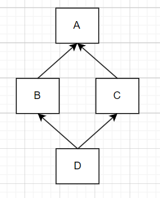
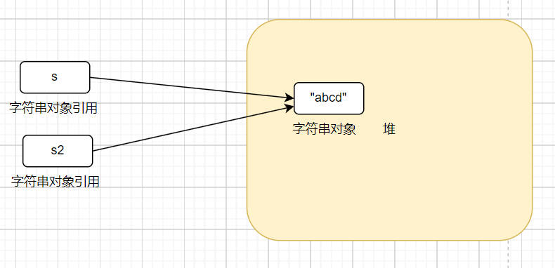
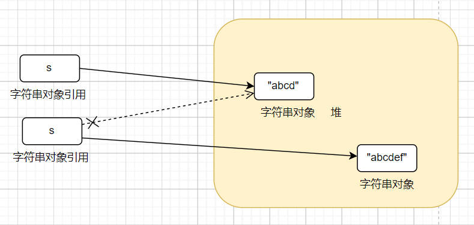

# Java面试题

## 基础

### jvm、jre、jdk

### java是编译与解释并存的语言

### java编译与运行

当我们执行javac TestPipeCommunication.java时，javac会从当前目录找到java文件，编译成class字节码文件

当我们执行java org.example.javaexample.multithread.TestPipeCommunication时，java会从当前目录开始寻找，根据包路径寻找文件夹路径，找到对应class文件启动jvm运行主函数。

### java和c++区别

C++是编译型语言（首先将源代码编译生成机器语言，再由机器运行机器码），执行速度快、效率高；依赖编译器、跨平台性差些。 
Java是解释型语言（源代码不是直接翻译成机器语言，而是先翻译成中间代码，再由解释器对中间代码进行解释运行。），执行速度慢、效率低；依赖解释器、跨平台性好。

PS：也有人说Java是半编译、半解释型语言。Java 编译器(javac)先将java源程序编译成Java字节码(.class)，JVM负责解释执行字节码文件。

二者更多的主要区别如下：  

C++是平台相关的，Java是平台无关的。 
C++对所有的数字类型有标准的范围限制，但字节长度是跟具体实现相关的，同一个类型在不同操作系统可能长度不一样。Java在所有平台上对所有的基本类型都有标准的范围限制和字节长度。 
C++除了一些比较少见的情况之外和C语言兼容 。 Java没有对任何之前的语言向前兼容。但在语法上受 C/C++ 的影响很大 
C++允许直接调用本地的系统库 。 Java要通过JNI调用, 或者 JNA 
C++允许过程式程序设计和面向对象程序设计 。Java必须使用面向对象的程序设计方式 
C++支持指针，引用，传值调用 。Java只有值传递。 
C++需要显式的内存管理，但有第三方的框架可以提供垃圾搜集的支持。支持析构函数。 Java 是自动垃圾收集的。没有析构函数的概念。 
C++支持多重继承，包括虚拟继承 。Java只允许单继承，需要多继承的情况要使用接口。

### 为什么Java不支持多继承？

因为如果要实现多继承，就会像C++中一样，存在菱形继承的问题，C++为了解决菱形继承问题，又引入了虚继承。因为支持多继承，引入了菱形继承问题，又因为要解决菱形继承问题，引入了虚继承。而经过分析，人们发现我们其实真正想要使用多继承的情况并不多。所以，在 Java 中，不允许“多继承”，即一个类不允许继承多个父类。

除了菱形的问题，支持多继承复杂度也会增加。一个类继承了多个父类，可能会继承大量的属性和方法，导致类的接口变得庞大、难以理解和维护。此外，在修改一个父类时，可能会影响到多个子类，增加了代码的耦合度。

在Java 8以前，接口中是不能有方法的实现的。所以一个类同时实现多个接口的话，也不会出现C++中的歧义问题。因为所有方法都没有方法体，真正的实现还是在子类中的。**但是，Java 8中支持了默认函数（default method ），即接口中可以定义一个有方法体的方法了。**

而又因为Java支持同时实现多个接口，这就相当于通过implements就可以从多个接口中继承到多个方法了，但是，Java8中为了避免菱形继承的问题，在实现的多个接口中如果有相同方法，就会要求该类必须重写这个方法。

#### 菱形继承问题

Java的创始人James Gosling曾经回答过，他表示：

“Java之所以不支持一个类继承多个类，主要是因为在设计之初我们听取了来自C++和Objective-C等阵营的人的意见。因为多继承会产生很多歧义问题。”

Gosling老人家提到的歧义问题，其实是C++因为支持多继承之后带来的菱形继承问题。  



假设我们有类B和类C，它们都继承了相同的类A。另外我们还有类D，类D通过多重继承机制继承了类B和类C。

这时候，因为D同时继承了B和C，并且B和C又同时继承了A，那么，D中就会因为多重继承，继承到两份来自A中的属性和方法。

这时候，在使用D的时候，如果想要调用一个定义在A中的方法时，就会出现歧义。  

因为这样的继承关系的形状类似于菱形，因此这个问题被形象地称为菱形继承问题。

而C++为了解决菱形继承问题，又引入了虚继承。

所以，在 Java 中，不允许“声明多继承”，即一个类不允许继承多个父类。但是 Java 允许“实现多继承”，即一个类可以实现多个接口，一个接口也可以继承多个父接口。由于接口只允许有方法声明而不允许有方法实现（Java 8之前），这就避免了 C++ 中多继承的歧义问题。

## ^：按位异或

## 左移、右移、无符号右移的原理

|             | 原码                             | 补码                                                        | 反码                                     | 左移                                | 右移                            | 无符号右移            |
| ----------- | ------------------------------ | --------------------------------------------------------- | -------------------------------------- | --------------------------------- | ----------------------------- | ---------------- |
| 负数          | 原码就是机器数，是加了一位符号位的二进制数。负数的符号位是1 | 负数的补码为 其原码除符号位外所有位取反（得到反码了），然后最低位加1。                      |                                        |                                   |                               |                  |
| 负数一般用补码来计算。 | 负数的反码等于原码除符号位以外所有的位取反          | 左侧的数字左移右侧数字的位数的结果，其规则为：丢弃最高为，0补最低位。因此，左移可以用作乘2操作的一个高效的实现。 | 先求补码，然后右移，左边空出的用1填补，然后求补码对应的原码(先-1再求反) | 负数，先求补码，然后不顾符号的右移，高位全部补0，最后就是所得值。 |                               |                  |
| 正数          | 原码就是机器数，是加了一位符号位的二进制数。正数的符号位是0 | 正数的补码与原码相同                                                | 正数的反码就是原码                              | 同负数                               | 先求补码，正数的补码就是原码，然后右移，左边空出的用0填补 | 正数的补码就是原码，所以直接右移 |

###### 左移、右移超过位数限制会怎样

###### continue、break、return区别

### 基本数据类型：byte、short、int、long、float、double、char、boolean

| 分类         | 基本数据类型      | 包装类           | 长度                                                         | 表示范围                   |
| ---------- | ----------- | ------------- | ---------------------------------------------------------- | ---------------------- |
| 布尔型<br>    | boolean<br> | Boolean<br>   | /<br>                                                      | /<br>                  |
| 整型<br>     | byte<br>    | Byte<br>      | 1字节<br>                                                    | -128 到 127<br>         |
| short<br>  | Short<br>   | 2字节<br>       | -32,768 到 32,767<br>                                       |                        |
| int<br>    | Integer<br> | 4字节<br>       | -2,147,483,648 到 2,147,483,647<br>                         |                        |
| long<br>   | Long<br>    | 8字节<br>       | -9,223,372,036,854,775,808 到 9,223,372,036,854,775,807<br> |                        |
| 字符型<br>    | char<br>    | Character<br> | 2字节<br>                                                    | Unicode字符集中的任何字符<br>   |
| 浮点型<br>    | float<br>   | Float<br>     | 4字节<br>                                                    | 约 -3.4E38 到 3.4E38<br> |
| double<br> | Double<br>  | 8字节<br>       | 约 -1.7E308 到 1.7E308                                       |                        |

因为Java是一种面向对象语言，很多地方都需要使用对象而不是基本数据类型。比如，在集合类中，我们是无法将int 、double等类型放进去的。因为集合的容器要求元素是Object类型。

为了让基本类型也具有对象的特征，就出现了包装类型，它相当于将基本类型“包装起来”，使得它具有了对象的性质，并且为其添加了属性和方法，丰富了基本类型的操作。

### 包装类型和基本类型的区别

1. 默认值不同，基本类型的默认值为0, false或\u0000等，包装类默认为null

2. 初始化方式不同，一个需要new，一个不需要

3. 存储方式不同，基本类型保存在栈上，包装类对象保存在堆上（成员变量的话，在不考虑JIT优化的栈上分配时，都是随着对象一起保存在堆上的）

###### 基本数据类型一定存放在栈中吗

### 自动拆箱intValue、自动装箱valueOf

包装类是对基本类型的包装，所以，把基本数据类型转换成包装类的过程就是装箱；反之，把包装类转换成基本数据类型的过程就是拆箱。

在Java SE5中，为了减少开发人员的工作，Java提供了自动拆箱与自动装箱功能。  

自动装箱: 就是将基本数据类型自动转换成对应的包装类。  

自动拆箱：就是将包装类自动转换成对应的基本数据类型。

```java
Integer i =10;  //自动装箱
int b= i;     //自动拆箱
```

自动装箱都是通过包装类的valueOf()方法来实现的，自动拆箱都是通过包装类对象的xxxValue()来实现的。  

如：int的自动装箱都是通过Integer.valueOf()方法来实现的，Integer的自动拆箱都是通过integer.intValue()来实现的。

### 哪些地方会自动拆装箱

#### 将基本数据类型放入集合类

Java中的集合类只能接收对象类型，当传入基本数据类型后会自动装箱：

```java
List<Integer> li = new ArrayList<>();
for (int i = 1; i < 50; i ++){
    li.add(i);
}
```

将上面代码进行反编译，可以得到以下代码：

```java
List<Integer> li = new ArrayList<>();
for (int i = 1; i < 50; i ++){
    li.add(Integer.valueOf(i));
}
```

#### 包装类型和基本类型的大小比较

```java
Integer a=1;
System.out.println(a==1?"等于":"不等于");
Boolean bool=false;
System.out.println(bool?"真":"假");
```

对以上代码进行反编译，得到以下代码：

```java
Integer a=1;
System.out.println(a.intValue()==1?"等于":"不等于");
Boolean bool=false;
System.out.println(bool.booleanValue?"真":"假");
```

#### 包装类型的运算

```java
Integer i = 10;
Integer j = 20;
System.out.println(i+j);
```

反编译后代码如下：

```java
Integer i = Integer.valueOf(10);
Integer j = Integer.valueOf(20);
System.out.println(i.intValue() + j.intValue());
```

#### 三目运算符的使用

```java
boolean flag = true; //设置成true，保证条件表达式的表达式二一定可以执行
boolean simpleBoolean = false; //定义一个基本数据类型的boolean变量
Boolean nullBoolean = null;//定义一个包装类对象类型的Boolean变量，值为null
boolean x = flag ? nullBoolean : simpleBoolean; //使用三目运算符并给x变量赋值
```

很多人不知道，其实在int k = flag ? i : j;这一行，会发生自动拆箱。反编译后代码如下：

```java
boolean flag = true;
boolean simpleBoolean = false;
Boolean nullBoolean = null;
boolean x = flag ? nullBoolean.booleanValue() : simpleBoolean;
```

这其实是三目运算符的语法规范。当第二，第三位操作数分别为基本类型和对象时，其中的对象就会拆箱为基本类型进行操作。

可以看到，反编译后的代码的最后一行，编译器帮我们做了一次自动拆箱，而就是因为这次自动拆箱，导致代码出现对于一个null对象（nullBoolean.booleanValue()）的调用，导致了NPE。

#### 函数参数与返回值

这个比较容易理解，直接上代码了：

```java
//自动拆箱
public int getNum1(Integer num) {
return num;
}
//自动装箱
public Integer getNum2(int num) {
return num;
}
```

#### 自动拆装箱与缓存

```java
public static void main(String... strings) {
    Integer integer1 = 3;
    Integer integer2 = 3;
    if (integer1 == integer2)
        System.out.println("integer1 == integer2");
    else
        System.out.println("integer1 != integer2");
    Integer integer3 = 300;
    Integer integer4 = 300;
    if (integer3 == integer4)
        System.out.println("integer3 == integer4");
    else
        System.out.println("integer3 != integer4");
}
```

输出结果：

```log
integer1 == integer2
integer3 != integer4
```

原因就和Integer中的缓存机制有关。在Java 5中，在Integer的操作上引入了一个新功能来节省内存和提高性能。整型对象通过使用相同的对象引用实现了缓存和重用。

> 适用于整数值区间-128 至 +127。  
> 
> 只适用于自动装箱。使用构造函数创建对象不适用。

我们只需要知道，当需要进行自动装箱时，如果数字在-128至127之间时，会直接使用缓存中的对象，而不是重新创建一个对象。

其中的javadoc详细的说明了缓存支持-128到127之间的自动装箱过程。最大值127可以通过-XX:AutoBoxCacheMax=size修改。

实际上这个功能在Java 5中引入的时候,范围是固定的-128 至 +127。后来在Java 6中，可以通过java.lang.Integer.IntegerCache.high设置最大值。

这使我们可以根据应用程序的实际情况灵活地调整来提高性能。到底是什么原因选择这个-128到127范围呢？因为这个范围的数字是最被广泛使用的。 在程序中，第一次使用Integer的时候也需要一定的额外时间来初始化这个缓存。

在Boxing Conversion部分的Java语言规范(JLS)规定如下：

如果一个变量p的值是：

```log
-128至127之间的整数(§3.10.1)
true 和 false的布尔值 (§3.10.3)
‘\u0000’至 ‘\u007f’之间的字符(§3.10.4)
```

范围内的时，将p包装成a和b两个对象时，可以直接使用a==b判断a和b的值是否相等。

### 浮点数和定点数的区别

浮点数通过二进制表达小数，通过2^-1,2^-2...表达小数，有误差-----java开发手册：二进制无法精确表示大部分十进制小数

```
二进制科学计数法
X = (-1)^S * M * R^E
S：取值0或1，决定一个数字的符号，0表示正，1表示负
M：二进制定点小数，表示数字的尾数，尾数的第一位总是1，因此可在尾数中省略第一位的1，这个1称为隐藏位，使得单精度尾数可表示24位有效数字
E：二进制定点整数，表示数字的阶码或指数，此时使用移码表示：(2^n-1)-1+E
R：基数，可以约定为2、4、16

单精度浮点数定义
32位表示浮点数，第1位表示符号位S，之后8位表示阶码E，最后23位表示尾数M

-0.75表示成二进制
0.75*2=1.5-------------------------1
0.5*2=1----------------------------1
-0.75(D)=-0.11(B)=-1.1*2^-1

单精度浮点数表示
符号位S=1，尾数M=1.1，阶码E=(2^8-1)-1-1=126(D)=01111110(B)
-0.75(H)的规格化浮点数为1 01111110 100 0000 0000 0000 0000 0000
```

### 为什么不能用BigDecimal的equals方法做等值比较？

因为BigDecimal的equals方法和compareTo并不一样，equals方法会比较两部分内容，分别是值（value）和标度（scale），而对于0.1和0.10这两个数字，他们的值虽然一样，但是精度是不一样的，所以在使用equals比较的时候会返回false。

### BigDecimal(double)和BigDecimal(String)有什么区别？

有区别，而且区别很大。

因为double是不精确的，所以使用一个不精确的数字来创建BigDeciaml，得到的数字也是不精确的。如0.1这个数字，double只能表示他的近似值。

所以，当我们使用new BigDecimal(0.1)创建一个BigDecimal 的时候，其实创建出来的值并不是正好等于0.1的。

而是0.1000000000000000055511151231257827021181583404541015625。这是因为double自身表示的只是一个近似值。

而对于BigDecimal(String) ，当我们使用new BigDecimal("0.1")创建一个BigDecimal 的时候，其实创建出来的值正好就是等于0.1的，他的标度也就是1。

#### BigDecimal的计数保留法最好是四舍六入五成双：BigDecimal.ROUND_HALF_EVEN

###### 静态方法为什么不能调用非静态成员?

###### 静态方法和实例方法有何不同？调用方式、访问类成员是否存在限制

###### 重载和重写有什么区别？

###### 什么是可变长参数？可变参数只能作为函数的最后一个参数，但其前面可以有也可以没有任何其他参数。遇到方法重载的情况怎么办呢？会优先匹配固定参数还是可变参数的方法呢？答案是会优先匹配固定参数的方法，因为固定参数的方法匹配度更高。

### 面向对象和面向过程的区别

面向过程指的是把解决问题的过程拆成一个一个方法，通过方法的执行完成功能。

面向对象指的是先抽象出对象，通过对象执行方法的方式完成功能。面向对象更易维护、更易复用、更易拓展。

### 面向对象的五大基本原则？

五大基本原则：单一职责原则（Single-Responsibility Principle）、开放封闭原则（Open-Closed principle）、Liskov替换原则（Liskov-Substituion Principle）、依赖倒置原则（Dependency-Inversion Principle）和 接口隔离原则（Interface-Segregation Principle）。  

单一职责原则：一个类最好只做一件事

开放封闭原则：对扩展开放、对修改封闭  

里氏替换原则：子类必须能够替换其基类  

依赖倒置原则：程序要依赖于抽象接口，而不是具体的实现  

接口隔离原则：使用多个小的专门的接口，而不要使用一个大的总接口

### 类的构造方法

我们不定义类的构造方法的话，java会添加一个默认的无参构造方法，我们添加了一个（无论是否有参）构造方法，java就不会添加默认了。所以我们重载构造方法时，一定要加上无参构造方法。构造方法可以被重载，不可被重写。构造方法必须与类名相同，没有返回值，但不可以用void。new的时候调用构造方法。

### 封装

封装是指把一个类的状态信息隐藏在类的内部，不允许外部对象直接访问类的内部信息，但是提供一些可以被外部访的方法来操作属性。如果一个对象没有对外部提供方法，那这个对象也就没有存在意义了。外部有时候不需要操作类内部的部分信息，只需要调用指定的方法就可以执行功能。

### 继承

不同类型的对象之间有一些共性存在，这就是基础类。继承就是在基础类的基础上建立新类的技术，新类的定义可以增加新的数据和功能，也可以使用基础类的功能，但是不能选择性的继承，必须是全部继承。通过使用继承，可以提高代码重用性，增加程序可维护性，节省创造新类的时间，提高我们的开发效率。

### 多态

多态是指一个对象具有多种状态，具体表现为父类的引用指向子类的实例。对象的引用和对象的实例之间具有继承/实现的关系。对象引用调用的方法，到底是对哪个类的调用是在运行期才能确定的。多态不能调用只在子类存在父类不存在的方法。如果子类重写了父类的方法，调用的是子类覆盖的方法，否则调用的是父类的方法。

还有一种说法，包括维基百科也说明，认为多态还分为动态多态和静态多态。

一般认为Java中的函数重载是一种静态多态，因为他需要在编译期决定具体调用哪个方法。关于这一点，不同的人有不同的见解，建议在面试中如果被问到，可以这样回答：

“我认为，多态应该是一种运行期特性，Java中的重写是多态的体现。不过也有人提出重载是一种静态多态的想法，这个问题在StackOverflow等网站上有很多人讨论，但是并没有什么定论。我更加倾向于重载不是多态。”

### 方法的重载与重写

重载是就是函数或者方法有同样的名称，但是参数列表不相同的情形，这样的同名不同参数的函数或者方法之间，互相称之为重载函数或者方法。

返回值不同，但是方法名和参数列表都相同的两个方法，不是重载。

重写指的是在Java的子类与父类中有两个名称、参数列表都相同的方法的情况。由于他们具有相同的方法签名，所以子类中的新方法将覆盖父类中原有的方法。

### 重载和重写的区别

1、重载是一个编译期概念、重写是一个运行期间概念。 
2、重载遵循所谓“编译期绑定”，即在编译时根据参数变量的类型判断应该调用哪个方法。 
3、重写遵循所谓“运行期绑定”，即在运行的时候，根据引用变量所指向的实际对象的类型来调用方法

### 接口和抽象类的比较

接口和抽象类共同点：不可以被实例化；可以包含抽象方法；抽象类内可以实现方法，java8后接口才可以拥有方法的默认实现。

接口和抽象类不同点：

1. 接口主要是对类的行为进行约束，实现一个接口就具有对应的行为，抽象类主要用于代码复用，强调的是主从关系；

2. 接口可以被多个继承，抽象类只能被继承一个；

3. 接口内的方法访问级别必须是public，抽象类的方法可以是public、protected、default；

4. 抽象类可以有构造器，接口不可以；

5. 接口内的成员变量是public static final修饰，不能被修改，必须有初始值，抽象类的成员变量默认default赋值，可以被子类重新定义和重新赋值。

### 浅拷贝和深拷贝

浅拷贝是指在堆上创建一个新对象，不过如果对象属性也是一个引用，那么这个引用会被拷贝过来直接使用。深拷贝是指在堆上创建一个新对象，包括重新创建对象内部的引用对象。

#### 实现深拷贝

##### 实现Cloneable接口，重写clone()

在Object类中定义了一个clone方法，这个方法其实在不重写的情况下，其实也是浅拷贝的。如果想要实现深拷贝，就需要重写clone方法，而想要重写clone方法，就必须实现Cloneable，否则会报CloneNotSupportedException异常。

```java
public class Address implements Cloneable{
    private String province;
    private String city;
    private String area;
    //省略构造函数和setter/getter

    @Override
    public Object clone() throws CloneNotSupportedException {
        return super.clone();
    }
}

class User implements Cloneable{
    private String name;
    private String password;
    private HomeAddress address;
    //省略构造函数和setter/getter

    @Override
    protected Object clone() throws CloneNotSupportedException {
        User user = (User)super.clone();
        user.setAddress((HomeAddress)address.clone());
        return user;
    }
}
```

之后，在执行一下上面的测试代码，就可以发现，这时候newUser中的address对象就是一个新的对象了。

这种方式就能实现深拷贝，但是问题是如果我们在User中有很多个对象，那么clone方法就写的很长，而且如果后面有修改，在User中新增属性，这个地方也要改。

那么，有没有什么办法可以不需要修改，一劳永逸呢？

##### 序列化实现深拷贝

我们可以借助序列化来实现深拷贝。先把对象序列化成流，再从流中反序列化成对象，这样就一定是新的对象了。  序列化的方式有很多，比如我们可以使用各种JSON工具，把对象序列化成JSON字符串，然后再从字符串中反序列化成对象。如使用fastjson实现。

除此之外，还可以使用Apache Commons Lang中提供的SerializationUtils工具实现。

我们需要修改下上面的User和Address类，使他们实现Serializable接口，否则是无法进行序列化的。

```java
class User implements Serializable
class Address implements Serializable
User newUser = (User) SerializationUtils.clone(user);
```

###### hashcode()返回的一定是对象地址吗？不一定，不同的jdk实现hashcode也不同，有的使用一些算法来实现，有的使用内存地址

###### 为什么重写equals方法也要重写hashcode方法呢？相同对象的hashcode一定要相等，所以重写equals方法后，hashcode方法也要重写，根据比较的属性异或得到结果，例如`return name.toUpperCase().hashCode() ^ age;`，这样在把对象放入hashset之类的哈希表结构时才能保证功能正常。

### String为什么是不可变的？

#### 缓存

字符串是使用最广泛的数据结构。大量的字符串的创建是非常耗费资源的，所以，Java提供了对字符串的缓存功能，可以大大的节省堆空间。

JVM中专门开辟了一部分空间来存储Java字符串，那就是字符串池。

通过字符串池，两个内容相同的字符串变量，可以从池中指向同一个字符串对象，从而节省了关键的内存资源。

```java
String s = "abcd";
String s2 = s;
```

对于这个例子，s和s2都表示"abcd"，所以他们会指向字符串池中的同一个字符串对象：



但是，之所以可以这么做，主要是因为字符串的不变性。试想一下，如果字符串是可变的，我们一旦修改了s的内容，那必然导致s2的内容也被动的改变了，这显然不是我们想看到的。

#### 安全性

字符串类在Java应用程序中广泛用于存储敏感信息，如用户名、密码、连接url、网络连接等。JVM类加载器在加载类的时也广泛地使用它。

因此，保护String类对于提升整个应用程序的安全性至关重要。

当我们在程序中传递一个字符串的时候，如果这个字符串的内容是不可变的，那么我们就可以相信这个字符串中的内容。

但是，如果是可变的，那么这个字符串内容就可能随时都被修改。那么这个字符串内容就完全不可信了。这样整个系统就没有安全性可言了。

例如，我们建立数据库连接时：

```java
boolean connect(string s){
if (!isSecure(s)) { throw new SecurityException(); }
// 如果在其他地方可以修改String,那么此处就会引起各种预料不到的问题/错误
causeProblem(s); }
```

这里如果第一步判断安全性通过之后，其他线程修改了字符串内容，这里的连接操作就不再安全。

#### hashcode缓存

由于字符串对象被广泛地用作数据结构，它们也被广泛地用于哈希实现，如HashMap、HashTable、HashSet等。在对这些散列实现进行操作时，经常调用hashCode()方法。

不可变性保证了字符串的值不会改变。因此，hashCode()方法在String类中被重写，以方便缓存，这样在第一次hashCode()调用期间计算和缓存散列，并从那时起返回相同的值。

因此在String类中，有以下代码：

```java
private int hash;//this is used to cache hash code.
```

### String是如何实现不可变的？

我们都知道String是不可变的，但是它是怎么实现的呢？

先来看一段String的源码（JDK 1.8）：

```java
public final class String
    implements java.io.Serializable, Comparable<String>, CharSequence {

    /** The value is used for character storage. */
    private final char value[];

    /** use serialVersionUID from JDK 1.0.2 for interoperability */
    private static final long serialVersionUID = -6849794470754667710L;

    public String substring(int beginIndex) {
        if (beginIndex < 0) {
            throw new StringIndexOutOfBoundsException(beginIndex);
        }
        int subLen = value.length - beginIndex;
        if (subLen < 0) {
            throw new StringIndexOutOfBoundsException(subLen);
        }
        return (beginIndex == 0) ? this : new String(value, beginIndex, subLen);
    }

    public String concat(String str) {
        int otherLen = str.length();
        if (otherLen == 0) {
            return this;
        }
        int len = value.length;
        char buf[] = Arrays.copyOf(value, len + otherLen);
        str.getChars(buf, len);
        return new String(buf, true);
    }
}
```

以上代码，其实就包含了String不可变的主要实现了。

首先，用final修饰类，那么表示这个类是不可以被继承的，那么他里面的方法就是没办法被覆盖的。

其次，用final修饰字符串内容的char[]，那么表示这个字符数组是不可变的。（从JDK 1.9开始，char[]变成了byte[]）

再然后，在他的一些方法中，如substring、concat等，在代码中如果有涉及到字符串的修改，也是通过new String()的方式新建了一个字符串。

所以，通过以上方式，使得一个字符串的内容，一旦被创建出来，就是不可以修改的了。

> 不可变对象是在完全创建后其内部状态保持不变的对象。这意味着，一旦对象被赋值给变量，我们既不能更新引用，也不能通过任何方式改变内部状态。

可是有人会有疑惑，String为什么不可变，我的代码中经常改变String的值啊，如下：

```java
String s = "abcd";
s = s.concat("ef");
```

这样，操作，不就将原本的"abcd"的字符串改变成"abcdef"了么？

但是，虽然字符串内容看上去从"abcd"变成了"abcdef"，但是实际上，我们得到的已经是一个新的字符串了。



如上图，在堆中重新创建了一个"abcdef"字符串，和"abcd"并不是同一个对象。

所以，一旦一个string对象在内存(堆)中被创建出来，他就无法被修改。而且，String类的所有方法都没有改变字符串本身的值，都是返回了一个新的对象。

如果我们想要一个可修改的字符串，可以选择StringBuffer 或者 StringBuilder这两个代替String。

### String、StringBuilder和StringBuffer的区别

String使用final修饰字符数组，且不对外暴露，每次修改String都会创建新对象；StringBuilder和StringBuffer都继承了AbstractStringBuilder类，但是StringBuilder对方法没有加同步锁，是线程不安全的；

StringBuffer对方法加了同步锁，是线程安全的。

### jdk9之后String、StringBuilder和StringBuffer底层都改为字节数组？

java认为大部分情况下的字符串只包含latin-1编码范围内的字符，即一个字节即可表示，使用char（两个字节）表示会浪费一半空间，所以默认使用一个字节表示字符（字节数组byte[]），除非字符中有latin-1无法表示的字符，才会改用utf-16，使用两个字节表示（字符数组char[]）。

String的内部实现引入了一个名为coder的字段，用于保存这些信息。

```java
/**
 * The value is used for character storage.
 *
 * @implNote This field is trusted by the VM, and is a subject to
 * constant folding if String instance is constant. Overwriting this
 * field after construction will cause problems.
 *
 * Additionally, it is marked with {@link Stable} to trust the contents
 * of the array. No other facility in JDK provides this functionality (yet).
 * {@link Stable} is safe here, because value is never null.
 */
@Stable
private final byte[] value;

/**
 * The identifier of the encoding used to encode the bytes in
 * {@code value}. The supported values in this implementation are
 *
 * LATIN1
 * UTF16
 *
 * @implNote This field is trusted by the VM, and is a subject to
 * constant folding if String instance is constant. Overwriting this
 * field after construction will cause problems.
 */
private final byte coder;
```

coder字段的取值可以是以下两种

```java
static final byte LATIN1 = 0;
static final byte UTF16 = 1;
```

在很多字符串的相关操作中都需要做一下判断，如：

```java
public int indexOf(int ch, int fromIndex) {
    return isLatin1() 
      ? StringLatin1.indexOf(value, ch, fromIndex) 
      : StringUTF16.indexOf(value, ch, fromIndex);
}  

private boolean isLatin1() {
    return COMPACT_STRINGS && coder == LATIN1;
}
```

### +拼接字符串，java重载了+，底层使用了StringBuilder的append拼接，但是for循环调用+会创建过多StringBuilder对象，对内存还是不友好。

### String reference3 = new String("a") + new String("b");reference3.intern();这句话创建了几个字符串对象？

创建一个堆中StringBuilder对象，两个堆中String对象a和b，一个字符串常量池中a字符串，一个字符串常量池中b字符串，一个堆中String对象ab;字符串常量池中没有ab字符串，创建一个字符串常量池中对堆内String对象ab的引用。=7个对象

### String#intern 方法有什么作用?

`String.intern()` 是一个 native（本地）方法，其作用是将指定的字符串对象的引用保存在字符串常量池中，可以简单分为两种情况：

- 如果字符串常量池中保存了对应的字符串对象的引用，就直接返回该引用。
- 如果字符串常量池中没有保存了对应的字符串对象的引用，那就在常量池中创建一个指向该字符串对象的引用并返回。

```java
// 通过javap -c StringTest.class可以查看反编译的字节码
public class StringTest {
  public static void main(String[] args) {
    // 创建字符串常量池中"a"，创建堆中string对象，对象指向常量池中"a"，reference1引用堆中string对象地址
    String reference1 = new String("a");
    // intern方法先去字符串常量池中找是否有"a"字符串，此时常量池中已经有"a"了，直接返回给reference0常量池中的对象地址引用
    String reference0 = reference1.intern();
    // 字符串字面量赋值时也先去字符串常量池中找是否有"a"字符串，此时常量池中已经有"a"了，直接返回给reference2常量池中的对象地址引用
    String reference2 = "a";
    System.out.println(reference1 == reference2); // 堆中string对象地址 != 常量池中对象地址
    System.out.println(reference1 == reference0); // 堆中string对象地址 != 常量池中对象地址
    System.out.println(reference0 == reference2); // 常量池中对象地址 == 常量池中对象地址
    System.out.println("---------------------------");

    // 创建堆中对象StringBuilder，创建字符串常量池中"a"，创建堆中string对象指向常量池中"a"，创建堆中string对象指向常量池中"a"，stringBuilder对象执行toString方法创建堆中string对象"aa"，此时常量池中没有"aa"
    String reference3 = new String("a") + new String("a");
    // intern方法先去常量池中找是否有"aa"字符串，此时常量池中没有。则在字符串常量池中存储一个指向堆中string对象"aa"的引用，并把这个引用返回给reference4
    String reference4 = reference3.intern();
    // 字符串字面量赋值时也会先去字符串常量池中查找是否有"aa"字符串，此时常量池中已经有"aa"字符串的引用了，直接返回给reference5常量池中的这个新引用，新引用指向堆中string对象"aa"
    String reference5 = "aa";
    System.out.println(reference3 == reference4);
    System.out.println(reference3 == reference5);
    System.out.println(reference4 == reference5);
  }
}
```

### String有长度限制吗？是多少？

编译期需要用CONSTANT_Utf8_info 结构用于表示字符串常量的值，而这个结构是有长度限制，他的限制是65535。

运行期，String的length参数是Int类型的，那么也就是说，String定义的时候，最大支持的长度就是int的最大范围值。根据Integer类的定义，java.lang.Integer#MAX_VALUE的最大值是2^31 - 1。

### 常见的字符编码有哪些？有什么区别？

由于ASCII只有128个字符，虽然对于英文字符都可以表示了，但是世界上还有很多其他的文字他是没办法表示的，所以需要一种更加全面的字符编码。  

于是又出现了Unicode字符集（常见的Unicode Transformation Format有：UTF-7, UTF-7.5, UTF-8,UTF-16, 以及 UTF-32），除此之外还有一些常用的中文编码有GBK，GB2312，GB18030等。

### Unicode和UTF-8有啥关系？

Unicode（中文：万国码、国际码、统一码、单一码）是计算机科学领域里的一项业界标准。它对世界上大部分的文字系统进行了整理、编码，使得计算机可以用更为简单的方式来呈现和处理文字。

但是，Unicode虽然统一了全世界字符的编码，但没有规定如何存储。

因为如果Unicode统一规定，每个符号就要用三个或四个字节表示，因为字符太多，只能用这么多字节才能表示完全。一旦这么规定，那么每个英文字母前都必然有二到三个字节是0，因为所有英文字母在ASCII中都有，都可以用一个字节表示，剩余字节位置就要补充0。如果这样，文本文件的大小会因此大出二三倍，这对于存储来说是极大的浪费。

为了解决这个问题，就出现了一些中间格式的字符集，他们被称为通用转换格式，即UTF（Unicode Transformation Format）。常见的UTF格式有：UTF-7, UTF-7.5, UTF-8,UTF-16, 以及 UTF-32。

UTF-8 使用一至四个字节为每个字符编码
UTF-16 使用二或四个字节为每个字符编码
UTF-32 使用四个字节为每个字符编码  

所以我们可以说，UTF-8、UTF-16等都是 Unicode 的一种实现方式。

### 有了UTF-8，为什么要出现GBK

因为UTF-8是Unicode的一种实现，所以他包含了世界上的所有文字的编码，他采用的是1-4字节进行编码。

正是因为UTF-8太全了，所以那些晚一些纳入的字符，在UTF-8中的存储所占的字节数可能就会多一些，那他的存储空间要求就会很大。对于常用的汉字，在UTF-8中采用3字节进行编码，但是如果有一种只包含中文和ASCII的编码的话，就不需要使用3个字节，可能2个字节就够了。

对于大部分网站来说，基本都是只服务一个国家或者地区的，比如一个中国的网站，一般会出现简体字和繁体字以及一些英文字符，很少会出现日语或者韩文的。

也是出于这样的考虑，中国国家标准总局于1981年制定并实施了 GB 2312-80 编码，即中华人民共和国国家标准简体中文字符集。后来厂商微软利用GB 2312-80未使用的编码空间，收录GB 13000.1-93全部字符制定了GBK编码。

有了标准中文字符集，如果是一个纯中文网站，就可以可以采用这种编码方式，这样可以大大节省一些存储空间的。

常用的中文编码有GBK，GB2312，GB18030等，最常用的是GBK。

- GB2312（1980年）：16位字符集，收录有6763个简体汉字，682个符号，共7445个字符；
  
  - 优点：适用于简体中文环境，属于中国国家标准，通行于大陆，新加坡等地也使用此编码；
  
  - 缺点：不兼容繁体中文，其汉字集合过少。

- GBK（1995年）：16位字符集，收录有21003个汉字，883个符号，共21886个字符；
  
  - 优点：适用于简繁中文共存的环境，为简体Windows所使用，向下完全兼容gb2312，向上支持 ISO-10646 国际标准 ；所有字符都可以一对一映射到unicode2.0上；
  
  - 缺点：不属于官方标准，和big5之间需要转换；很多搜索引擎都不能很好地支持GBK汉字。

- GB18030（2000年）：32位字符集；收录了27484个汉字，同时收录了藏文、蒙文、维吾尔文等主要的少数民族文字。
  
  - 优点：可以收录所有你能想到的文字和符号，属于中国最新的国家标准；
  
  - 缺点：目前支持它的软件较少。

#### 为什么会出现乱码

文件里面的内容归根到底都是有0101组成的，至于0101的二进制码如何转成人们可以理解的字符串，则是需要通过规定好的字符编码标准进行转换才可以。

我们把一串中文字符通过UTF-8进行编码传输给别人，别人拿到这串文字之后，通过GBK进行解码，得到的内容就会是“锟届瀿锟斤拷雮傡锟斤拷直锟斤拷锟”，这就是乱码。

### RPC接口返回中，使用基本类型还是包装类？

使用包装类，不要使用基本类型，比如某个字段表示费率的Float rate,在接口中返回时，如果出现接口异常的情况，那么可能会返回默认值，float的话返回的是0.0，而Float返回的是null。

在接口中，为了避免发生歧义，建议使用对象，因为他默认值是null，当看到null的时候，我们明确的知道他是出错了，但是看到0.0的时候，你不知道是因为出错返回的0.0，还是就是不出错真的返回了0.0，虽然可以用其他的字段如错误码或者getSuccess判断，但是还是尽量减少歧义的可能。

### try、catch、finally知识

如果在try和finally中都有return，则try中的return会被暂存起来，等到执行finally代码到return时，实际return的值是finally中的return。

如果没有catch，try后面一定要有finally。

finally中的代码一定会被执行吗？

如果执行finally代码前虚拟机终止了，则不会执行后面代码；程序的线程终止了，也不会执行finally里面代码。

try-with-resource可以代替finally关闭流的作用。

### 泛型类、泛型接口、泛型方法

Java泛型（generics） 是JDK 5中引入的一个新特性，允许在定义类和接口的时候使用类型参数（type parameter）。声明的类型参数在使用时用具体的类型来替换。泛型最主要的应用是在JDK 5中的新集合类框架中。

泛型的好处有两个：

1. 方便：可以提高代码的复用性。以List接口为例，我们可以将String、Integer等类型放入List中，如不用泛型，存放String类型要写一个List接口，存放Integer要写另外一个List接口，泛型可以很好的解决这个问题

2. 安全：在泛型出之前，通过Object实现的类型转换需要在运行时检查，如果类型转换出错，程序直接GG，可能会带来毁灭性打击。而泛型的作用就是在编译时做类型检查，这无疑增加程序的安全性

#### 泛型是如何实现的

Java中的泛型通过类型擦除的方式来实现，通俗点理解，就是通过语法糖的形式，在.java->.class转换的阶段，将List\<String>擦除调转为List的手段。换句话说，Java的泛型只在编译期，Jvm是不会感知到泛型的。

类型擦除的缺点有哪些？

1. 泛型不可以重载

2. 泛型异常类不可以多次catch

3. 泛型类中的静态变量也只有一份，不会有多份

#### 泛型中上下界限定符extends 和 super有什么区别？

<? extends T> 表示类型的上界，表示参数化类型的可能是T 或是 T的子类。

<? super T> 表示类型下界（Java Core中叫超类型限定），表示参数化类型是此类型的超类型（父类型），直至Object。

在使用 限定通配符的时候，需要遵守PECS原则，即Producer Extends, Consumer Super；上界生产，下界消费。

如果要从集合中读取类型T的数据，并且不能写入，可以使用 ? extends 通配符；(Producer Extends)。

如果要从集合中写入类型T的数据，并且不需要读取，可以使用 ? super 通配符；(Consumer Super)。

如果既要存又要取，那么就不要使用任何通配符。


#### List, List\<Object>, List之间的区别

List<?>

是一个未知类型的List，而List\<Object> 其实是任意类型的List。可以把List\<String>, List\<Integer>赋值给List<?>，却不能把List\<String>赋值给 List\<Object>

可以把任何带参数的类型传递给原始类型List，但却不能把List\<String>赋值给List\<Object>，因为会产生编译错误（不支持协变）

#### 在泛型为Integer的ArrayList中存放一个String类型的对象

通过反射可以实现：

```java
public void test() throws Exception {
    ArrayList<Integer> list = new ArrayList<Integer>();
    Method method = list.getClass().getMethod("add", Object.class);
    method.invoke(list, "Java反射机制实例");
    System.out.println(list.get(0));
}
```

#### 什么是类型擦除？

类型擦除就是在编译期将我们写的代码：

```java
public class Foo<T> {
    T bar;
    void doSth(T param) {
    }
};

Foo<String> f1;
Foo<Integer> f2;
```

在编译后的字节码文件中，会把泛型的信息擦除掉：

```java
public class Foo {
    Object bar;
    void doSth(Object param) {
    }
};
```

也就是说，在代码中的Foo 和 Foo使用的类，经过编译后都是同一个类。

这种擦除的过程，被称之为——类型擦除。所以类型擦除指的是通过类型参数合并，将泛型类型实例关联到同一份字节码上。编译器只为泛型类型生成一份字节码，并将其实例关联到这份字节码上。类型擦除的关键在于从泛型类型中清除类型参数的相关信息，并且再必要的时候添加类型检查和类型转换的方法。

类型擦除可以简单的理解为将泛型java代码转换为普通java代码，只不过编译器更直接点，将泛型java代码直接转换成普通java字节码。

#### C语言对泛型的支持

泛型是一种编程范式，在不同的语言和编译器中的实现和支持方式都不一样。

通常情况下，一个编译器处理泛型有多种方式，在C++中，当编译器对以下代码编译时：

```cpp
template<typename T>
struct Foo
{
    T bar;
    void doSth(T param) {
    }
};

Foo<int> f1;
Foo<float> f2;
```

当编译器对其进行编译时，编译器发现要用到Foo和Foo，这时候就会为每一个泛型类新生成一份执行代码。相当于新创建了如下两个类：

```cpp
struct FooInt
{
    int bar;
    void doSth(int param) {
    }
};

struct FooFloat
{
    float bar;
    void doSth(float param) {
    }
};
```

这种做法，用起来的时候很方便，只需要根据具体类型找到具体的的类和方法就行了。但是问题是，当我们多次使用不同类型的模板时，就会创建出来的很多新的类，就会导致代码膨胀。

#### 泛型中K T V E ？ Object等分别代表什么含义

E – Element (在集合中使用，因为集合中存放的是元素) 
T – Type（Java 类）
K – Key（键）
V – Value（值）
N – Number（数值类型）
？ – 表示不确定的java类型（无限制通配符类型）
S、U、V – 2nd、3rd、4th types
Object – 是所有类的根类，任何类的对象都可以设置给该Object引用变量，使用的时候可能需要类型强制转换，但是用使用了泛型T、E等这些标识符后，在实际用之前类型就已经确定了，不需要再进行类型强制转换。

```java
// 示例1：使用T作为泛型类型参数，表示任何类型
public class MyGenericClass<T> {
    private T myField;

    public MyGenericClass(T myField) {
        this.myField = myField;
    }

    public T getMyField() {
        return myField;
    }
}

// 示例2：使用K、V作为泛型类型参数，表示键值对中的键和值的类型
public class MyMap<K, V> {
    private List<Entry<K, V>> entries;

    public MyMap() {
        entries = new ArrayList<>();
    }

    public void put(K key, V value) {
        Entry<K, V> entry = new Entry<>(key, value);
        entries.add(entry);
    }

    public V get(K key) {
        for (Entry<K, V> entry : entries) {
            if (entry.getKey().equals(key)) {
                return entry.getValue();
            }
        }
        return null;
    }

    private class Entry<K, V> {
        private K key;
        private V value;

        public Entry(K key, V value) {
            this.key = key;
            this.value = value;
        }

        public K getKey() {
            return key;
        }

        public V getValue() {
            return value;
        }
    }
}

// 示例3：使用E作为泛型类型参数，表示集合中的元素类型
public class MyList<E> {
    private List<E> elements;

    public MyList() {
        elements = new ArrayList<>();
    }

    public void add(E element) {
        elements.add(element);
    }

    public E get(int index) {
        return elements.get(index);
    }
}

// 示例4：使用Object作为泛型类型参数，表示可以接受任何类型
public class MyGenericClass {
    private Object myField;

    public MyGenericClass(Object myField) {
        this.myField = myField;
    }

    public Object getMyField() {
        return myField;
    }
}
```

### 反射

反射机制指的是程序在运行时能够获取自身的信息。在java中，只要给定类的名字，那么就可以通过反射机制来获得类的所有属性和方法。

Java的反射可以：

1. 在运行时判断任意一个对象所属的类。

2. 在运行时判断任意一个类所具有的成员变量和方法。

3. 在运行时任意调用一个对象的方法

4. 在运行时构造任意一个类的对象

优点：可以提升程序的灵活性和扩展性，比较容易在运行期干很多事情

缺点：反射破坏了封装性、反射代码执行的性能低、代码可读性低及可维护性

应用场景：

1. 动态代理

2. JDBC的class.forName

3. BeanUtils中属性值的拷贝

4. RPC框架

5. ORM框架

6. Spring的IOC/DI

7. 框架中的注解使用到了反射：分析类得到类、方法、注解信息

反射为什么慢呢？主要由以下几个原因：

1. 由于反射涉及动态解析的类型，因此不能执行某些Java虚拟机优化，如JIT优化。

2. 在使用反射时，参数需要包装（boxing)成Object[] 类型，但是真正方法执行的时候，又需要再拆包（unboxing)成真正的类型，这些动作不仅消耗时间，而且过程中也会产生很多对象，对象一多就容易导致GC，GC也会导致应用变慢。

3. 反射调用方法时会从方法数组中遍历查找，并且会检查可见性。这些动作都是耗时的。

4. 不仅方法的可见性要做检查，参数也需要做很多额外的检查。

例子：

```java
public class TargetObject {
  private String value;

  public TargetObject() {
    this.value = "c++";
  }

  public String publicMethod(String input) {
    return "I love " + input;
  }

  private String privateMethod() {
    return "value:" + this.value;
  }
}


public class Test {
  public static void main(String[] args)
      throws ClassNotFoundException,
          InstantiationException,
          IllegalAccessException,
          NoSuchMethodException,
          InvocationTargetException,
          NoSuchFieldException {
    // 反射创建class对象，生成类实例
    Class<?> targetClass = Class.forName("com.javaTest.JavaGuide.reflect.TargetObject");
    TargetObject targetObject = (TargetObject) targetClass.newInstance();
    // 打印类内部所有方法
    for (Method method : targetClass.getMethods()) {
      System.out.println(method.getName());
    }
    System.out.println("------------------");
    // 调用public方法
    //        Method publicMethod = targetClass.getMethod("publicMethod", String.class);
    Method publicMethod = targetClass.getDeclaredMethod("publicMethod", String.class);
    String result = (String) publicMethod.invoke(targetObject, "Java");
    System.out.println(result);

    // 设置类对象中成员变量值
    Field field = targetClass.getDeclaredField("value");
    field.setAccessible(true);
    field.set(targetObject, "JavaValue");
    System.out.println("------------------");
    // 调用private方法
    Method privateMethod = targetClass.getDeclaredMethod("privateMethod");
    privateMethod.setAccessible(true);
    String result2 = (String) privateMethod.invoke(targetObject);
    System.out.println(result2);
  }
}
```

#### 反射和Class的关系

Java的Class类是java反射机制的基础,通过Class类我们可以获得关于一个类的相关信息。

Java.lang.Class是一个比较特殊的类，它用于封装被装入到JVM中的类（包括类和接口）的信息。当一个类或接口被装入的JVM时便会产生一个与之关联的java.lang.Class对象，可以通过这个Class对象对被装入类的详细信息进行访问。

虚拟机为每种类型管理一个独一无二的Class对象。也就是说，每个类（型）都有一个Class对象。运行程序时，Java虚拟机(JVM)首先检查所要加载的类对应的Class对象是否已经加载。如果没有加载，JVM就会根据类名查找.class文件，并将其Class对象载入。

#### 反射破坏单例

### 注解

是java5开始提供的功能，是特殊的注释，可用于类、方法、变量上，用于在编译期/运行期提供信息，本质是一个继承了Annotation的特殊接口

解析方式：部分注解如override在编译器编译代码时处理，用于检查是否子类重写了父类方法；部分注解在运行期间由框架根据反射技术分析类进行处理。

### 什么是元注解？

元注解定义其他注解的注解 。比如Override这个注解，就不是一个元注解。而是通过元注解定义出来的。

元注解有四个:@Target（表示该注解可以用于什么地方）、@Retention（表示在什么级别保存该注解信息）、@Documented（将此注解包含在javadoc中）、@Inherited（允许子类继承父类中的注解）。

#### @Retention

指定被修饰的注解的生命周期，即注解在源代码、编译时还是运行时保留。它有三个可选的枚举值：SOURCE、CLASS和RUNTIME。默认为CLASS。

```java
import java.lang.annotation.Retention;
import java.lang.annotation.RetentionPolicy;

@Retention(RetentionPolicy.RUNTIME)
public @interface MyRuntimeAnnotation {
    // some elements and values
}
```

#### @Target

指定被修饰的注解可以应用于的元素类型，如类、方法、字段等。这样可以限制注解的使用范围，避免错误使用。

```java
import java.lang.annotation.Target;
import java.lang.annotation.ElementType;

@Target({ElementType.TYPE, ElementType.METHOD})
public @interface MyTargetAnnotation {
    // some elements and values
}
```

#### @Documented

用于指示注解是否会出现在生成的Java文档中。如果一个注解被@Documented元注解修饰，则该注解的信息会出现在API文档中，方便开发者查阅。

```java
import java.lang.annotation.Documented;

@Documented
public @interface MyDocumentedAnnotation {
    // some elements and values
}
```

#### @Inherited

指示被该注解修饰的注解是否可以被继承。默认情况下，注解不会被继承，即子类不会继承父类的注解。但如果将一个注解用@Inherited修饰，那么它就可以被子类继承。

```java
import java.lang.annotation.Inherited;

@Inherited
public @interface MyInheritedAnnotation {
    // some elements and values
}
```

### SPI

Service Provider Interface，即服务提供者的接口。API是一组定义了软件组件之间交互的规则和约定的接口。提供方来制定接口并完成对接口的不同实现，调用方只需要调用即可。SPI是一种扩展机制，通常用于在应用程序中提供可插拔的实现。 调用方可选择使用提供方提供的内置实现，也可以自己实现。

API用于定义调用接口，而SPI用于定义和提供可插拔的实现方式。

应用场景：

1. Spring中大量使用了SPI,比如：对servlet3.0规范对ServletContainerInitializer的实现、自动类型转换Type Conversion SPI(Converter SPI、Formatter SPI)等

2. 数据库驱动

3. SLF4J加载不同提供商的日志实现类

4. Dubbo中也大量使用SPI的方式实现框架的扩展, 不过它对Java提供的原生SPI做了封装，允许用户扩展实现Filter接口

优点：提供更高的代码灵活性、可拓展性、可维护性，将服务实现者和服务提供者接口解耦开来，避免实现逻辑污染调用方代码。

缺点：加载时需要循环加载全部的类，不能按需加载，较慢；多个serviceLoader执行load时容易出现并发问题

场景：服务调用者接口负责提供接口定义、规则制定。服务实现者负责实现接口逻辑。用户直接引入服务调用者接口和服务实现者，调用服务调用者接口的功能即可。后期切换实现者，只需要修改依赖即可，调用代码无感知。

基本原理：通过Serviceloader加载接口和实现类。ServiceLoader读取META-INF/services文件夹下所有文件名为接口，文件内容为实现类名的文件，根据内容调用反射生成对应的实现类。

### 序列化和反序列化

应用场景：将对象放到网络中传输；存储到文件；存储到数据库；存储到内存中

原理：将对象转化成二进制字节流

序列化、反序列化协议存在表示层，是TCP/IP协议的一部分。序列化、反序列化无法保留深层复杂对象之间的引用关系。

常用协议：JDK自带、Kryo（dubbo推荐，针对java语言的）、ProtoBuf

不推荐JDK自带协议：不支持跨语言调用；JDK自带协议生成的字节数组较大，传输体积较大，效率较低；当反序列化时，攻击者可以操作反序列化数组达到修改生成对象内容的效果，存在安全问题。

### serialVersionUID 有何用途? 如果没定义会有什么问题？

在进行反序列化时，JVM会把传来的字节流中的serialVersionUID与本地相应实体类的serialVersionUID进行比较，如果相同就认为是一致的，可以进行反序列化，否则就会出现序列化版本不一致的异常，即是InvalidCastException。这样做是为了保证安全，因为文件存储中的内容可能被篡改。

当实现java.io.Serializable接口的类没有显式地定义一个serialVersionUID变量时候，Java序列化机制会根据编译的Class自动生成一个serialVersionUID作序列化版本比较用，这种情况下，如果Class文件没有发生变化，就算再编译多次，serialVersionUID也不会变化的。但是，如果发生了变化，那么这个文件对应的serialVersionUID也就会发生变化。

基于以上原理，如果我们一个类实现了Serializable接口，但是没有定义serialVersionUID，然后序列化。在序列化之后，由于某些原因，我们对该类做了变更，重新启动应用后，我们想对之前序列化过的对象进行反序列化的话就会报错。

### 你知道fastjson的反序列化漏洞吗

当一个类中包含了一个接口（或抽象类）的时候，在使用fastjson进行序列化的时候，会将子类型抹去，只保留接口（抽象类）的类型，使得反序列化时无法拿到原始类型。

```java
{
    "fruit":{
        "price":0.5
    },
    "name":"Hol
```

那么有什么办法解决这个问题呢，fastjson引入了AutoType，即在序列化的时候，把原始类型记录下来。使用autotype注解之后的json对象如下：

```java
{
    "@type":"com.hollis.lab.fastjson.test.Store",
    "fruit":{
        "@type":"com.hollis.lab.fastjson.test.Apple",
        "price":0.5
    },
    "name":"Hollis"
}
```

可以看到fastjson使用@type属性指定了这个类的全路径，方便在反序列化的时候定位到具体类型。

这就是AutoType，以及fastjson中引入AutoType的原因。

因为有了autoType功能，那么fastjson在对JSON字符串进行反序列化的时候，就会读取@type到内容，试图把JSON内容反序列化成这个对象，并且会调用这个类的setter方法。

那么就可以利用这个特性，自己构造一个JSON字符串，并且使用@type指定一个自己想要使用的攻击类库。

举个例子，黑客比较常用的攻击类库是com.sun.rowset.JdbcRowSetImpl，这是sun官方提供的一个类库，这个类的dataSourceName支持传入一个rmi的源，当解析这个uri的时候，就会支持rmi远程调用，去指定的rmi地址中去调用方法。

而fastjson在反序列化时会调用目标类的setter方法，那么如果黑客在JdbcRowSetImpl的dataSourceName中设置了一个想要执行的命令，那么就会导致很严重的后果。

如通过以下方式定一个JSON串，即可实现远程命令执行（在早期版本中，新版本中JdbcRowSetImpl已经被加了黑名单）

```java
{"@type":"com.sun.rowset.JdbcRowSetImpl",
"dataSourceName":"rmi://localhost:1099/Exploit",
"autoCommit":true}
```

### IO流

java IO流分为字符流和字节流：InputStreamReader/OutputStreamWriter，InputStream/OutputStream

### 语法糖

java语法糖包括：枚举、自动装箱、自动拆箱、可变长参数、泛型、switch字符串、条件编译、数值字面量中有下划线、增强for循环(for(aa  a: collection){})、try-with-resource、lambda表达式

switch本来不支持字符串，只支持short、char、int、long整数类型和枚举类型，且都会转换成整数类型进行判断。java7开始支持String，后面也支持了Character, Byte, Short, Integer。字符串类型的switch会被转换成hashcode比较+equals比较，性能上比基本数据类型差一点。

泛型是在编译期被擦除的类型，等到真正调用时才传入具体的类，调用处使用父类来接收。

一个Iterator\<A> xi = xs.iterator();会被编译成Iterator xi = xs.iterator();

一个A w = xi.next();会被编译成Comparable w = (Comparable)xi.next();

可变长参数类似String... args，在编译后转换成对应类型的数组String args[]。

自动装/拆箱调用包装类的valueOf()和xxxValue()。

枚举类会被转换成泛型类继承enum类，在内部写好对应变量的赋值逻辑。

条件编译是指对if等判断语句中常量判断计算为false的部分不编译进去。

数值字面量中有下划线，编译时会去掉下划线，类似10_000_000->10000000。

增强for循环，for(Student stu:studentArr)->int length = studentArr.length;for(int i=0;io<length;i++)。对于容器类list的for循环会被转换成迭代器的循环。

try-with-resource其实也是转换后会被编译成try-catch-finally的代码，关闭资源操作在finally代码中。

lambda表达式在编译时会转换成几个jvm提供的lambda api方法，并将内部匿名方法提取出来成独立方法进行调用，以此达到目的。

内部类之所以也是语法糖，是因为它仅仅是一个编译时的概念，outer.java里面定义了一个内部类inner，一旦编译成功，就会生成两个完全不同的.class文件了，分别是outer.class和outer$inner.class。

特殊情况：

1. 方法重载时仅仅是参数的泛型类不同，此时编译器会报错，因为泛型擦除后方法就一样了。random(List\<String> names)和random(List\<Integer> names)就不允许编译了。

2. 泛型类的静态变量在运行时与所有泛型类实现类共享，可被任意改变。
   
   ```java
   public class StaticTest{
       public static void main(String[] args){
           GT<Integer> gti = new GT<Integer>();
           gti.var=1;
           GT<String> gts = new GT<String>();
           gts.var=2;
           System.out.println(gti.var);
       }
   }
   class GT<T>{
       public static int var=0;
       public void nothing(T x){}
   }
   ```
   
   以上代码输出结果为：2！由于经过类型擦除，所有的泛型类实例都关联到同一份字节码上，泛型类的所有静态变量是共享的。

3. 自动装拆箱时，Integer等包装类对128内的数字用了缓存池，比较时有可能一样。

4. for循环时删除元素，会抛出cocurrentModificationException，可以用iterator循环处理，并删除元素。

### final

放在类上，类无法被继承

放在方法上 ，方法无法被重写

放在变量上，基本数据类型无法被修改，引用数据类型无法被重新引用

### static

静态成员变量和静态方法：静态成员变量属于类，可以直接由类调用，在java虚拟机方法区存储；静态方法只能调用类的静态成员变量；

静态代码块：[父类静态变量初始化、父类静态代码块(加载类时执行一次，仅执行一次)]->[子类静态变量初始化、子类静态代码块(加载类时执行一次，仅执行一次)]->子类main方法->[父类非静态变量初始化、父类非静态代码块(每次创建对象时执行一次)]->父类构造函数->[子类非静态变量初始化、子类非静态代码块(每次创建对象时执行一次)]->子类构造函数；

静态内部类和内部类：内部类暗含一个对外部类的引用；静态内部类不含，只能调用外部类静态成员和静态方法；

静态引用：import static 加上类名，可以直接调用类的静态方法和静态成员，无需再写类名。

静态代码块与非静态代码块区别：静态代码块只在类加载时执行一次/class.forName()加载，非静态代码块每次创建对象都执行。

非静态代码块和构造函数的区别：非静态代码块为每一个对象创建时都执行相同的初始化逻辑；构造函数由调用方主动选择用何种方式进行对象构造。

###### Java初始化类顺序

- (1)访问SubClass.main(),(这是一个static方法)，于是装载器就会为你寻找已经编译的SubClass类的代码（也就是SubClass.class文件）。在装载的过程中，装载器注意到它有一个基类（也就是extends所要表示的意思），于是它再装载基类。不管你创不创建基类对象，这个过程总会发生。如果基类还有基类，那么第二个基类也会被装载，依此类推。

- (2)执行根基类的static初始化，然后是下一个派生类的static初始化，依此类推。这个顺序非常重要，因为派生类的“static初始化”有可能要依赖基类成员的正确初始化。

- (3)当所有必要的类都已经装载结束，开始执行main()方法体，并用new SubClass（）创建对象。

- (4)类SubClass存在父类，则调用父类的构造函数，你可以使用super来指定调用哪个构造函数。基类的构造过程以及构造顺序，同派生类的相同。首先基类中各个变量按照字面顺序进行初始化，然后执行基类的构造函数的其余部分。

- (5)对子类成员数据按照它们声明的顺序初始化，执行子类构造函数的其余部分。

### 代理模式

静态代理：从应用和实现角度来看，静态代理需要手动编写代理类，将代理对象需要增加的功能写进代理类中。从JVM角度，接口、被代理类、静态代理类都在编译期间被生成成对应的class。

动态代理：从应用角度，动态代理不需要我们对每一个类都增加一个代理类，不需要实现接口就可以完成代理。从JVM角度看，动态代理是在运行期间动态生成字节码加载到JVM中。

JDK动态代理：原理是代理类实现一个InvocationHandler接口和invoke方法，对被代理类执行增加的功能，最后抛出工厂类进行调用。缺点是只能代理实现了接口的类的方法，优点是性能好于CGLIB，且随着JDK的升级会越来越好。

CGLIB动态代理：使用了ASM的字节码增强库实现，基于继承实现类的方法代理。本质上是实现了被代理类的子类完成方法的拦截调用，优点是不需要类实现接口就可以代理方法，缺点是无法代理final修饰的方法，性能不如JDK。

### 动态代理的用途

Java的动态代理，在日常开发中可能并不经常使用，但是并不代表他不重要。Java的动态代理的最主要的用途就是应用在各种框架中。因为使用动态代理可以很方便的运行期生成代理类，通过代理类可以做很多事情，比如AOP，比如过滤器、拦截器等。

在我们平时使用的框架中，像servlet的filter、包括spring提供的aop以及struts2的拦截器都使用了动态代理功能。我们日常看到的mybatis分页插件，以及日志拦截、事务拦截、权限拦截这些几乎全部由动态代理的身影。

### 内部类

成员内部类可以直接访问外部类的成员变量，即使是private的。内部类的存在可以弥补类的单继承带来的缺陷，可以在类里面创建多个内部类继承多个类完成功能。    

局部内部类存在方法内或作用域内，可以解决一些复杂问题，同时不用对外抛出类。

匿名内部类需要一个接口，然后直接new一个接口的实例并实现接口内部的方法，特殊点在于传给匿名内部类的变量需要声明成final。

静态内部类是成员内部类的静态版本，它是独立的类，创建时不依赖外部类对象的创建，只能访问外部类静态成员/静态方法。

```java
public class OuterClass {
  private String name;
  private int age;
  private static String school;

  public String toString() {
    return "我是外部类的对象实例：(name：" + name + ";age：" + age + ")";
  }

  /** 成员内部类可以直接访问外部类的成员变量，即使是private的。内部类的存在可以弥补类的单继承带来的缺陷，可以在类里面创建多个内部类继承多个类完成功能。 */
  public class InnerClass {
    public InnerClass() {
      name = "孙权";
      age = 18;
    }

    public String toString() {
      return "我是成员内部类的对象实例：(name：" + name + ";age：" + age + ")";
    }
  }

  /** 静态内部类是成员内部类的静态版本，它是独立的类，创建时不依赖外部类对象的创建，只能访问外部类静态成员/静态方法。 */
  public static class InnerStaticClass {
    public String _name = "nonstatic";
    public static String _name2 = "static";

    public InnerStaticClass() {
      school = "南京邮电大学";
    }

    public String toString() {
      return "我是静态内部类的对象实例：(school：" + school + ";_name：" + _name + ";_name2：" + _name2 + ")";
    }
  }

  public static void main(String[] args)
      throws ClassNotFoundException, InstantiationException, IllegalAccessException {
    // 必须创建外部类对象，才能创建外部类对象的成员内部类对象。不能直接创建成员内部类对象
    OuterClass outerClass = new OuterClass();
    OuterClass.InnerClass innerClass = outerClass.new InnerClass();
    System.out.println(innerClass.toString());
    // 这样写运行时也会抛出异常
    //    OuterClass.InnerClass innerClassQQ = (InnerClass)
    // Class.forName("com.javaTest.JavaGuide.testClass.OuterClass.InnerClass").newInstance();
    //    System.out.println(innerClassQQ.toString());
    OuterClass outerClassQQ =
        (OuterClass) Class.forName("com.javaTest.JavaGuide.testClass.OuterClass").newInstance();
    System.out.println(outerClassQQ.toString());
    OuterClass.InnerStaticClass innerStaticClass = new InnerStaticClass();
    System.out.println(innerStaticClass.toString());
    // 局部内部类存在方法内或作用域内，可以解决一些复杂问题，同时不用对外抛出类。
    if (true) {
      class BlockInnerClass {
        private String className;

        public BlockInnerClass() {
          this.className = "BlockInnerClass";
        }

        public String toString() {
          return "我是局部内部类的对象实例：(className：" + this.className + ")";
        }
      }
      System.out.println(new BlockInnerClass().toString());
    }
    // 匿名内部类需要一个接口，然后直接new一个接口的实例并实现接口内部的方法，特殊点在于传给匿名内部类的变量需要声明成final。
    System.out.println(
        new IStudent() {
          @Override
          public String getInfo() {
            return "我是匿名内部类的实现类的getInfo方法";
          }
        }.getInfo());
  }
}
```

### Unsafe类

unsafe类是java提供的可以直接操作内存的一个类，一般不建议在项目里使用，Netty等实现NIO的库会调用unsafe操作堆外内存，保证一些频繁从堆内拷贝到堆外的数据能更高效的进行操作，堆外内存不由jvm管理，由操作系统管理，需要手动释放内存。

unsafe提供cas功能，AtomicInteger等原子类也是调用对应的方法，只有CAS比较成功并赋值之后才会跳出循环。从而保证了多线程操作时的成功->cas就是自旋等待最终成功的线程安全解决方式。

### Java只有值传递

原因可能是为了安全性，对于方法调用者来说，方法实现是未知的，使用值传递可以保证一部分的数据是无法被修改的。为了简单易用，避免引用传递产生的语义不理解，java实现只有值传递。原始参数通过值传递给方法。这意味着对参数值的任何更改都只存在于方法的范围内。当方法返回时，参数将消失，对它们的任何更改都将丢失。引用数据类型参数(如对象)也按值传递给方法。这意味着，当方法返回时，传入的引用仍然引用与以前相同的对象。但是，如果对象字段具有适当的访问级别，则可以在方法中更改这些字段的值。Java中的对象传递，如果是修改引用，是不会对原来的对象有任何影响的，但是如果直接修改共享对象的属性的值，是会对原来的对象有影响的。

### Java异常体系


#### 什么是Throwable

Throwable是java中最顶级的异常类，继承Object，实现了序列化接口，有两个重要的子类：Exception和 Error，二者都是 Java 异常处理的重要子类，各自都包含大量子类。

#### Error和Exception的区别和联系

error表示系统级的错误，是java运行环境内部错误或者硬件问题，不能指望程序来处理这样的问题，除了退出运行外别无选择，它是Java虚拟机抛出的。如OutOfMemoryError、StackOverflowError这两种常见的错误都是ERROR。  

exception 表示程序需要捕捉、需要处理的异常，是由与程序设计的不完善而出现的问题，程序必须处理的问题。分为RuntimeException和其他异常  

#### 请列举几个常用的RuntimeException。

这个题目，其实面试官考的还挺多的，主要是考察面试者实战经验是否丰富，所以常见的RuntimeException要能回答的尽量多回答一些。

AnnotationTypeMismatchException, ArithmeticException, ArrayStoreException, BufferOverflowException, BufferUnderflowException, CannotRedoException, CannotUndoException, ClassCastException, CMMException, ConcurrentModificationException, DataBindingException, DOMException, EmptyStackException, EnumConstantNotPresentException, EventException, FileSystemAlreadyExistsException, FileSystemNotFoundException, IllegalArgumentException, IllegalMonitorStateException, IllegalPathStateException, IllegalStateException, IllformedLocaleException, ImagingOpException, IncompleteAnnotationException, IndexOutOfBoundsException, JMRuntimeException, LSException, MalformedParameterizedTypeException, MirroredTypesException, MissingResourceException, NegativeArraySizeException, NoSuchElementException, NoSuchMechanismException, NullPointerException, ProfileDataException, ProviderException, ProviderNotFoundException, RasterFormatException, RejectedExecutionException, SecurityException, SystemException, TypeConstraintException, TypeNotPresentException, UndeclaredThrowableException, UnknownEntityException, UnmodifiableSetException, UnsupportedOperationException, WebServiceException, WrongMethodTypeException

### 为什么说枚举是实现单例最好的方式？

1. 枚举实现的单例写法简单

2. 枚举实现的单例天然是线程安全的

3. 枚举实现的单例可避免被反序列化破坏

#### 枚举单例写法简单

如果你看过《[单例模式的多种写法](https://www.yuque.com/hollis666/xx5hr2/ggh2h0)》中的实现单例的所有方式的代码，那就会发现，各种方式实现单例的代码都比较复杂。主要原因是在考虑线程安全问题。

我们简单对比下“双重校验锁”方式和枚举方式实现单例的代码。

```java
public class Singleton {  
    private volatile static Singleton singleton;  
    private Singleton (){}  
    public static Singleton getSingleton() {  
    if (singleton == null) {  
        synchronized (Singleton.class) {  
        if (singleton == null) {  
            singleton = new Singleton();  
        }  
        }  
    }  
    return singleton;  
    }  
}
```

枚举实现单例：

```java
public enum Singleton {  
    INSTANCE;  
    public void whateverMethod() {  
    }  
}
```

相比之下，你就会发现，枚举实现单例的代码会精简很多。

上面的双重锁校验的代码之所以很臃肿，是因为大部分代码都是在保证线程安全。为了在保证线程安全和锁粒度之间做权衡，代码难免会写的复杂些。但是，这段代码还是有问题的，因为他无法解决反序列化会破坏单例的问题。

#### 枚举可解决线程安全问题

其实，并不是使用枚举就不需要保证线程安全，只不过线程安全的保证不需要我们关心而已。也就是说，其实在“底层”还是做了线程安全方面的保证的。那么，“底层”到底指的是什么？

这就要说到关于枚举的实现了：

定义枚举时使用enum和class一样，是Java中的一个关键字。就像class对应用一个Class类一样，enum也对应有一个Enum类。

通过将定义好的枚举反编译，我们就能发现，其实枚举在经过javac的编译之后，会被转换成形如public final class T extends Enum的定义。而且，枚举中的各个枚举项同时通过static来定义的。如：

```java
public enum T {
    SPRING,SUMMER,AUTUMN,WINTER;
}
```

反编译后代码为：

```java
public final class T extends Enum
{
    //省略部分内容
    public static final T SPRING;
    public static final T SUMMER;
    public static final T AUTUMN;
    public static final T WINTER;
    private static final T ENUM$VALUES[];
    static
    {
        SPRING = new T("SPRING", 0);
        SUMMER = new T("SUMMER", 1);
        AUTUMN = new T("AUTUMN", 2);
        WINTER = new T("WINTER", 3);
        ENUM$VALUES = (new T[] {
            SPRING, SUMMER, AUTUMN, WINTER
        });
    }
}
```

了解JVM的类加载机制的朋友应该对这部分比较清楚。static类型的属性会在类被加载过程中被初始化，当一个Java类第一次被真正使用到的时候静态资源被初始化、Java类的加载和初始化过程都是线程安全的（因为虚拟机在加载枚举的类的时候，会使用ClassLoader的loadClass方法，而这个方法使用同步代码块保证了线程安全）。所以，创建一个enum类型是线程安全的。

也就是说，我们定义的一个枚举，在第一次被真正用到的时候，会被虚拟机加载并初始化，而这个初始化过程是线程安全的。而我们知道，解决单例的并发问题，主要解决的就是初始化过程中的线程安全问题。

所以，由于枚举的以上特性，枚举实现的单例是天生线程安全的。

#### 枚举可解决反序列化会破坏单例的问题

前面我们提到过，就是使用双重校验锁实现的单例其实是存在一定问题的，就是这种单例有可能被序列化所破坏，那么，对于序列化这件事情，为什么枚举又有先天的优势了呢？答案可以在[Java Object Serialization Specification](https://docs.oracle.com/javase/7/docs/platform/serialization/spec/serial-arch.html#6469) 中找到答案。其中专门对枚举的序列化做了如下规定：

在序列化的时候Java仅仅是将枚举对象的name属性输出到结果中，反序列化的时候则是通过java.lang.Enum的valueOf方法来根据名字查找枚举对象。同时，编译器是不允许任何对这种序列化机制的定制的，因此禁用了writeObject、readObject、readObjectNoData、writeReplace和readResolve等方法。

普通的Java类的反序列化过程中，会通过反射调用类的默认构造函数来初始化对象。所以，即使单例中构造函数是私有的，也会被反射给破坏掉。由于反序列化后的对象是重新new出来的，所以这就破坏了单例。

但是，枚举的反序列化并不是通过反射实现的。所以，也就不会发生由于反序列化导致的单例破坏问题。

## 集合类

### Collection

#### Arraylist

ArrayList继承了list接口、randomaccess接口（快速随机访问，通过下标访问）、serialize接口（可序列化）、cloneable接口（可拷贝），底层使用了数组对象，线程不安全。

Vector是list的古老实现类，底层使用数组对象，线程安全。

ArrayList和LinkedList比较：

- ArrayList底层是对象数组，LinkedList底层是双向链表。

- ArrayList指定元素位置增删改的时间复杂度是O(n)，因为需要修改对应位置元素，再把元素之后的所有元素向后位移一个；直接在末尾增删改的时间复杂度是O(1)，因为支持快速随机访问。

- LinkedList指定元素位置增删改的时间复杂度是O(n)，因为需要遍历找到对应位置元素；如果是直接在头部或者尾部插入元素，时间复杂度是O(1)，因为可以根据头部指针和尾部指针找到。

- ArrayList支持快速随机访问，即根据数组下标访问元素，时间复杂度是O(1)，LinkedList访问元素需要从队头开始顺序往下查找，时间复杂度是O(n)。

- ArrayList需要预留一些数组空间供下次增加元素使用，必要时需要扩容，占用一些额外内存空间。LikedList每一个链表元素都需要增加前驱和后驱指针，占用空间也会大一点。

ArrayList默认初始容量大小是10，创建list对象时数组未进行初始化，只有真正放入元素时才会初始化成10个大小的数组。数组添加元素的核心是扩容，一次扩容后大小调整为原来的1.5倍，底层是原大小+原大小右移一位得到结果。右移操作的除法在大数据时更高效，因为底层只需要移动一下数据位即可。

核心方法数组拷贝的实现是调用了System.arraycopy方法，传入原数组和目标数组，指定原数组从哪个位置开始移动元素到新数组指定位置，其他元素直接拷贝。

相关文章：[ArrayList 源码分析 | JavaGuide(Java面试 + 学习指南)](https://javaguide.cn/java/collection/arraylist-source-code.html#_3-1-%E5%85%88%E4%BB%8E-arraylist-%E7%9A%84%E6%9E%84%E9%80%A0%E5%87%BD%E6%95%B0%E8%AF%B4%E8%B5%B7)

###### Linkedlist

LikedList查找指定位置元素的方式：检查位置是大于当前大小的一半还是小于一半。大于一半则从尾部元素向前遍历查找；小于一半则从头部元素向后遍历查找。双向链表(JDK1.6 之前为循环链表，JDK1.7 取消了循环)。

相关文章：[LinkedList 源码分析 | JavaGuide(Java面试 + 学习指南)](https://javaguide.cn/java/collection/linkedlist-source-code.html)

###### Vector

`Vector` 是 `List` 的古老实现类，底层使用`Object[]` 存储，线程安全。使用 `synchronized` 关键字进行同步处理。

###### Slack

Stack继承自Vector，是一个后进先出的栈，而Vector是一个列表。

###### 比较 HashSet、LinkedHashSet 和 TreeSet 三者的异同

- `HashSet`、`LinkedHashSet` 和 `TreeSet` 都是 `Set` 接口的实现类，都能保证元素唯一，并且都不是线程安全的。
- `HashSet`、`LinkedHashSet` 和 `TreeSet` 的主要区别在于底层数据结构不同。`HashSet` 的底层数据结构是哈希表（基于 `HashMap` 实现）。`LinkedHashSet` 的底层数据结构是链表和哈希表，元素的插入和取出顺序满足 FIFO。`TreeSet` 底层数据结构是红黑树，元素是有序的，排序的方式有自然排序和定制排序。
- 底层数据结构不同又导致这三者的应用场景不同。`HashSet` 用于不需要保证元素插入和取出顺序的场景，`LinkedHashSet` 用于保证元素的插入和取出顺序满足 FIFO 的场景，`TreeSet` 用于支持对元素自定义排序规则的场景。

###### 需要确认某个元素是否在集合内的时候，为什么hashset比list性能更好呢？

hashset使用contains确认某个元素是否在集合内部时使用了hashmap的containskey方法，时间复杂度接近O(1)，没有出现hash碰撞的情况下。list的contains方法需要遍历整个数组，时间复杂度是O(n)。hashset可以去重。

###### HashMap 和 HashSet 区别

如果你看过 `HashSet` 源码的话就应该知道：`HashSet` 底层就是基于 `HashMap` 实现的。（`HashSet` 的源码非常非常少，因为除了 `clone()`、`writeObject()`、`readObject()`是 `HashSet` 自己不得不实现之外，其他方法都是直接调用 `HashMap` 中的方法。

| `HashMap`                       | `HashSet`                                                                          |
| ------------------------------- | ---------------------------------------------------------------------------------- |
| 实现了 `Map` 接口                    | 实现 `Set` 接口                                                                        |
| 存储键值对                           | 仅存储对象                                                                              |
| 调用 `put()`向 map 中添加元素           | 调用 `add()`方法向 `Set` 中添加元素，底层将元素放到hashmap的key中                                      |
| `HashMap` 使用键（Key）计算 `hashcode` | `HashSet` 使用成员对象来计算 `hashcode` 值，对于两个对象来说 `hashcode` 可能相同，所以`equals()`方法用来判断对象的相等性 |

###### HashSet 如何检查重复?

当你把对象put进入`HashSet`时，`HashSet` 会先计算对象的`hashcode`值来判断对象加入的位置，同时也会与其他加入的对象的 `hashcode` 值作比较，如果没有相符的 `hashcode`，`HashSet` 会假设对象没有重复出现。但是如果发现有相同 `hashcode` 值的对象，这时会调用`equals()`方法来检查 `hashcode` 相等的对象是否真的相同。如果两者相同，`HashSet` 就返回false，并使用新元素覆盖旧元素。

###### Queue 与 Deque 的区别

`Queue` 是单端队列，只能从一端插入元素，另一端删除元素，实现上一般遵循 **先进先出（FIFO）** 规则。

`Queue` 扩展了 `Collection` 的接口，根据 **因为容量问题而导致操作失败后处理方式的不同** 可以分为两类方法: 一种在操作失败后会抛出异常，另一种则会返回特殊值。

| `Queue` 接口 | 抛出异常      | 返回特殊值      |
| ---------- | --------- | ---------- |
| 插入队尾       | add(E e)  | offer(E e) |
| 删除队首       | remove()  | poll()     |
| 查询队首元素     | element() | peek()     |

`Deque` 是双端队列，在队列的两端均可以插入或删除元素。

`Deque` 扩展了 `Queue` 的接口, 增加了在队首和队尾进行插入和删除的方法，同样根据失败后处理方式的不同分为两类：

| `Deque` 接口 | 抛出异常          | 返回特殊值           |
| ---------- | ------------- | --------------- |
| 插入队首       | addFirst(E e) | offerFirst(E e) |
| 插入队尾       | addLast(E e)  | offerLast(E e)  |
| 删除队首       | removeFirst() | pollFirst()     |
| 删除队尾       | removeLast()  | pollLast()      |
| 查询队首元素     | getFirst()    | peekFirst()     |
| 查询队尾元素     | getLast()     | peekLast()      |

事实上，`Deque` 还提供有 `push()` 和 `pop()` 等其他方法，可用于模拟栈。

###### 说一说 PriorityQueue

`PriorityQueue` 是在 JDK1.5 中被引入的, 其与 `Queue` 的区别在于元素出队顺序是与优先级相关的，即总是优先级最高的元素先出队。

这里列举其相关的一些要点：

- `PriorityQueue` 利用了二叉堆的数据结构来实现的，底层使用可变长的数组来存储数据
- `PriorityQueue` 通过堆元素的上浮和下沉，实现了在 O(logn) 的时间复杂度内插入元素和删除堆顶元素。
- `PriorityQueue` 是非线程安全的，且不支持存储 `NULL` 和 `non-comparable` 的对象。
- `PriorityQueue` 默认是小顶堆，但可以接收一个 `Comparator` 作为构造参数，从而来自定义元素优先级的先后。

`PriorityQueue` 在面试中可能更多的会出现在手撕算法的时候，典型例题包括堆排序、求第 K 大的数、带权图的遍历等，所以需要会熟练使用才行。

### Map

#### hashmap

hashmap在jdk1.8之前是数组+链表的实现方式，jdk1.8之后是数组+链表或红黑树的实现方式。hashmap初始容量为16，扩容后体积为两倍，负载因子默认是0.75，大于负载因子*容量时进行扩容操作。负载因子太大，会导致数组过于密集，容易产生hash碰撞现象；负载因子太低会导致数组过于稀疏，数组利用率低。

对比jdk1.8之前和jdk1.8之后：

1. jdk1.8之前只有数组+链表，jdk1.8之后增加红黑树，但是判断红黑树的逻辑顺序如下：当链表长度大于等于8时，继续判断，当hashmap数组长度大于等于64时，才会转换链表为红黑树；当长度小于64时，会先将数组扩容，之后重新计算元素下标，以此避免hash碰撞；

2. jdk1.8之前的hash函数运算速度较慢，使用了四次右移操作，jdk1.8之后的hash函数简化为一次右移操作。

3. jdk1.8之前，hash碰撞后的链表是头插法，jdk1.8之后的链表是尾插法。

扩容逻辑：

插入元素时判断条件：如果插入数组索引处没有元素，直接插入；如果有元素，判断是否是链表，链表的条件下，从链表内开始从头部遍历检查元素，是否hash值相同，是否key相同，相同的才会覆盖，全部不相同的在尾部插入元素；红黑树的条件下，调用红黑树的插入方法。调用插入之前，判断链表长度是否大于等于8，当链表长度大于等于8时，继续判断，当hashmap数组长度大于等于64时，才会转换链表为红黑树；当长度小于64时，会先将数组扩容，之后重新计算元素下标，以此避免hash碰撞。

```java
/**
     * Implements Map.put and related methods.
     *
     * @param hash         key 的 hash 值
     * @param key          key 值
     * @param value        value 值
     * @param onlyIfAbsent true：如果某个 key 已经存在那么就不插了；false 存在则替换，没有则新增。这里为 false
     * @param evict        不用管了，我也不认识
     * @return previous value, or null if none
     */
    final V putVal(int hash, K key, V value, boolean onlyIfAbsent,
                   boolean evict) {
        // tab 表示当前 hash 散列表的引用
        Node<K, V>[] tab;
        // 表示具体的散列表中的元素
        Node<K, V> p;
        // n：表示散列表数组的长度
        // i：表示路由寻址的结果
        int n, i;
        // 将 table 赋值发给 tab ；如果 tab == null，说明 table 还没有被初始化。则此时是需要去创建 table 的
        // 为什么这个时候才去创建散列表？因为可能创建了 HashMap 时候可能并没有存放数据，如果在初始化 HashMap 的时候就创建散列表，势必会造成空间的浪费
        // 这里也就是延迟初始化的逻辑
        if ((tab = table) == null || (n = tab.length) == 0) {
            n = (tab = resize()).length;
        }
        // 如果 p == null，说明寻址到的桶的位置没有元素。那么就将 key-value 封装到 Node 中，并放到寻址到的下标为 i 的位置
        if ((p = tab[i = (n - 1) & hash]) == null) {
            tab[i] = newNode(hash, key, value, null);
        }
        // 到这里说明 该位置已经有数据了，且此时可能是链表结构，也可能是树结构
        else {
            // e 表示找到了一个与当前要插入的key value 一致的元素
            Node<K, V> e;
            // 临时的 key
            K k;
            // p 的值就是上一步 if 中的结果即：此时的 (p = tab[i = (n - 1) & hash]) 不等于 null
            // p 是原来的已经在 i 位置的元素，且新插入的 key 是等于 p中的key
            //说明找到了和当前需要插入的元素相同的元素（其实就是需要替换而已）
            if (p.hash == hash && ((k = p.key) == key || (key != null && key.equals(k))))
                //将 p 的值赋值给 e
                e = p;
                //说明已经树化，红黑树会有单独的文章介绍，本文不再赘述
            else if (p instanceof TreeNode) {
                e = ((TreeNode<K, V>) p).putTreeVal(this, tab, hash, key, value);
            } else {
                //到这里说明不是树结构，也不相等，那说明不是同一个元素，那就是链表了
                for (int binCount = 0; ; ++binCount) {
                    //如果 p.next == null 说明 p 是最后一个元素，说明，该元素在链表中也没有重复的，那么就需要添加到链表的尾部
                    if ((e = p.next) == null) {
                        //直接将 key-value 封装到 Node 中并且添加到 p的后面
                        p.next = newNode(hash, key, value, null);
                        // 当元素已经是 7了，再来一个就是 8 个了，那么就需要进行树化
                        if (binCount >= TREEIFY_THRESHOLD - 1) {
                            treeifyBin(tab, hash);
                        }
                        break;
                    }
                    //在链表中找到了某个和当前元素一样的元素，即需要做替换操作了。
                    if (e.hash == hash && ((k = e.key) == key || (key != null && key.equals(k)))) {
                        break;
                    }
                    //将e(即p.next)赋值为e，这就是为了继续遍历链表的下一个元素（没啥好说的）下面有张图帮助大家理解。
                    p = e;
                }
            }
            //如果条件成立，说明找到了需要替换的数据，
            if (e != null) {
                //这里不就是使用新的值赋值为旧的值嘛
                V oldValue = e.value;
                if (!onlyIfAbsent || oldValue == null) {
                    e.value = value;
                }
                //这个方法没用，里面啥也没有
                afterNodeAccess(e);
                //HashMap put 方法的返回值是原来位置的元素值
                return oldValue;
            }
        }
        // 上面说过，对于散列表的 结构修改次数，那么就修改 modCount 的次数
        ++modCount;
        //size 即散列表中的元素的个数，添加后需要自增，如果自增后的值大于扩容的阈值，那么就触发扩容操作
        if (++size > threshold) {
            resize();
        }
        //啥也没干
        afterNodeInsertion(evict);
        //原来位置没有值，那么就返回 null 呗
        return null;
    }
```

#### HashMap 的长度为什么是 2 的幂次方？

为了能让 HashMap 存取高效，尽量较少碰撞，也就是要尽量把数据分配均匀。我们上面也讲到了过了，Hash 值的范围值-2147483648 到 2147483647，前后加起来大概 40 亿的映射空间，只要哈希函数映射得比较均匀松散，一般应用是很难出现碰撞的。但问题是一个 40 亿长度的数组，内存是放不下的。所以这个散列值是不能直接拿来用的。用之前还要先做对数组的长度取模运算，得到的余数才能用来要存放的位置也就是对应的数组下标。这个数组下标的计算方法是“ `(n - 1) & hash`”。（n 代表数组长度）。这也就解释了 HashMap 的长度为什么是 2 的幂次方。

**这个算法应该如何设计呢？**

我们首先可能会想到采用%取余的操作来实现。但是，重点来了：**“取余(%)操作中如果除数是 2 的幂次则等价于与其除数减一的与(&)操作（也就是说 hash%length==hash&(length-1)的前提是 length 是 2 的 n 次方；）。”** 并且 **采用二进制位操作 &，相对于%能够提高运算效率，这就解释了 HashMap 的长度为什么是 2 的幂次方。**

#### hashmap的红黑树什么时候退化成链表？

hashmap有两个地方会判断并退化成链表的条件：

1. remove时退化
   
   ```java
   // 在 removeTreeNode的方法中
   // 在红黑树的root节点为空 或者root的右节点、root的左节点、root左节点的左节点为空时 说明树都比较小了
   if (root == null || (movable && (root.right == null || (rl = root.left) == null|| rl.left == null))) {
         tab[index] = first.untreeify(map);  // too small
       return;
   }
   ```

2. 在扩容时 low、high 两个TreeNode 长度小于6时 会退化为链表。
   
   ```java
   // 在resize里面的split方法中
   // 在low、high 两个TreeNode 长度小于6时 会退化为链表。
   if (loHead != null) {
                   if (lc <= UNTREEIFY_THRESHOLD)
                       tab[index] = loHead.untreeify(map);
                   else {
                       tab[index] = loHead;
                       if (hiHead != null) // (else is already treeified)
                           loHead.treeify(tab);
                   }
               }
               if (hiHead != null) {
                   if (hc <= UNTREEIFY_THRESHOLD)
                       tab[index + bit] = hiHead.untreeify(map);
                   else {
                       tab[index + bit] = hiHead;
                       if (loHead != null)
                           hiHead.treeify(tab);
                   }
               }
   ```

#### hashmap为什么不是线程安全的？

[为什么HashMap线程不安全？以及实现HashMap线程安全的解决方案_hashmap为什么是线程不安全的,说说源码-CSDN博客](https://blog.csdn.net/qq_46074155/article/details/120072178)

JDK1.8中的数据覆盖

如下图框中的代码是判断是否出现hash碰撞，假设两个线程A、B都在进行put操作，并且hash函数计算出的插入下标是相同的，当线程A执行完该行判断代码后由于时间片耗尽导致被挂起，而线程B得到时间片后在该下标处插入了元素，完成了正常的插入，然后线程A获得时间片，由于之前已经进行了hash碰撞的判断，所有此时不会再进行判断，而是直接进行插入，这就导致了线程B插入的数据被线程A覆盖了，从而线程不安全。


除此之外，下图pullVal方法中还有框中代码的有个++size语句，如果还是线程A、B，这两个线程同时进行put操作时，假设当前HashMap的size大小为10，当线程A执行到第38行代码时，从主内存中获得size的值为10后准备进行+1操作，但是由于时间片耗尽只好让出CPU，线程B快乐的拿到CPU还是从主内存中拿到size的值10进行+1操作，完成了put操作并将size=11写回主内存，然后线程A再次拿到CPU并继续执行(此时size的值仍为10)，当执行完put操作后，还是将size=11写回内存，此时，线程A、B都执行了一次put操作，但是size的值只增加了1，所有说还是由于数据覆盖又导致了线程不安全。


#### LinkedHashMap

什么是 LinkedHashMap？

`LinkedHashMap` 是 Java 集合框架中 `HashMap` 的一个子类，它继承了 `HashMap` 的所有属性和方法，并且在 `HashMap` 的基础重写了 `afterNodeRemoval`、`afterNodeInsertion`、`afterNodeAccess` 方法。使之拥有顺序插入和访问有序的特性。它在底层增加了双向链表保证插入顺序，相对于hashmap插入性能有所下降，查询性能有所提升，适用于需要保证插入顺序的场景。


#### LinkedHashMap 如何按照访问顺序迭代元素？

`LinkedHashMap` 可以通过构造函数中的 `accessOrder` 参数指定按照访问顺序迭代元素。当 `accessOrder` 为 true 时，每次访问一个元素时，该元素会被移动到链表的末尾，因此下次访问该元素时，它就会成为链表中的最后一个元素，从而实现按照访问顺序迭代元素。

#### LinkedHashMap 如何实现 LRU 缓存？

将 `accessOrder` 设置为 true 并重写 `removeEldestEntry` 方法当链表大小超过容量时返回 true，使得每次访问一个元素时，该元素会被移动到链表的末尾。一旦插入操作让 `removeEldestEntry` 返回 true 时，视为缓存已满，`LinkedHashMap` 就会将链表首元素移除，由此我们就能实现一个 LRU 缓存。

```java
public class LRUCache<K, V> extends LinkedHashMap<K, V> {
    private final int capacity;

    public LRUCache(int capacity) {
        super(capacity, 0.75f, true);
        this.capacity = capacity;
    }

    /**
     * 判断size超过容量时返回true，告知LinkedHashMap移除最老的缓存项(即链表的第一个元素)
     */
    @Override
    protected boolean removeEldestEntry(Map.Entry<K, V> eldest) {
        return size() > capacity;
    }
}

//测试代码
LRUCache < Integer, String > cache = new LRUCache < > (2);
cache.put(1, "one");
cache.put(2, "two");
cache.put(3, "three");
cache.put(4, "four");
for (int i = 0; i < 4; i++) {
    System.out.println(cache.get(i));
}

// 输出
null
null
three
four
```

#### 什么是fail-fast机制？fail-fast和fail-safe

[什么是fail-fast - 程序员自由之路 - 博客园](https://www.cnblogs.com/54chensongxia/p/12470446.html) 

#### HashMap 和 TreeMap 区别

`TreeMap` 和`HashMap` 都继承自`AbstractMap` ，但是需要注意的是`TreeMap`它还实现了`NavigableMap`接口和`SortedMap` 接口。实现 `NavigableMap` 接口让 `TreeMap` 有了对集合内元素的搜索的能力。

实现`SortedMap`接口让 `TreeMap` 有了对集合中的元素根据键排序的能力。默认是按 key 的升序排序，不过我们也可以指定排序的比较器。

相比于`HashMap`来说 `TreeMap` 主要多了对集合中的元素根据键排序的能力以及对集合内元素的搜索的能力。

#### ConcurrentHashMap 和 Hashtable 的区别

`ConcurrentHashMap` 和 `Hashtable` 的区别主要体现在实现线程安全的方式上不同。

- **底层数据结构：** JDK1.7 的 `ConcurrentHashMap` 底层采用 **分段的数组+链表** 实现，JDK1.8 采用的数据结构跟 `HashMap1.8` 的结构一样，数组+链表/红黑二叉树。`Hashtable` 和 JDK1.8 之前的 `HashMap` 的底层数据结构类似都是采用 **数组+链表** 的形式，数组是 HashMap 的主体，链表则是主要为了解决哈希冲突而存在的；
- **实现线程安全的方式（重要）：**
  - 在 JDK1.7 的时候，`ConcurrentHashMap` 对整个桶数组进行了分割分段(`Segment`，分段锁)，每一把锁只锁容器其中一部分数据（下面有示意图），多线程访问容器里不同数据段的数据，就不会存在锁竞争，提高并发访问率。
  - 到了 JDK1.8 的时候，`ConcurrentHashMap` 已经摒弃了 `Segment` 的概念，而是直接用 `Node` 数组+链表+红黑树的数据结构来实现，并发控制使用 `synchronized` 和 CAS 来操作。（JDK1.6 以后 `synchronized` 锁做了很多优化） 整个看起来就像是优化过且线程安全的 `HashMap`，虽然在 JDK1.8 中还能看到 `Segment` 的数据结构，但是已经简化了属性，只是为了兼容旧版本；
  - **`Hashtable`(同一把锁)** :使用 `synchronized` 来保证线程安全，效率非常低下。当一个线程访问同步方法时，其他线程也访问同步方法，可能会进入阻塞或轮询状态，如使用 put 添加元素，另一个线程不能使用 put 添加元素，也不能使用 get，竞争会越来越激烈效率越低。

下面，我们再来看看两者底层数据结构的对比图。

**JDK1.7 的 ConcurrentHashMap**：


`ConcurrentHashMap` 是由 `Segment` 数组结构和 `HashEntry` 数组结构组成。

`Segment` 数组中的每个元素包含一个 `HashEntry` 数组，每个 `HashEntry` 数组属于链表结构。

`Segment` 继承了 `ReentrantLock`,所以 `Segment` 是一种可重入锁，扮演锁的角色。`HashEntry` 用于存储键值对数据。

```java
static class Segment<K,V> extends ReentrantLock implements Serializable {
}
```

一个 `ConcurrentHashMap` 里包含一个 `Segment` 数组，`Segment` 的个数一旦**初始化就不能改变**。 `Segment` 数组的大小默认是 16，也就是说默认可以同时支持 16 个线程并发写。

`Segment` 的结构和 `HashMap` 类似，是一种数组和链表结构，一个 `Segment` 包含一个 `HashEntry` 数组，每个 `HashEntry` 是一个链表结构的元素，每个 `Segment` 守护着一个 `HashEntry` 数组里的元素，当对 `HashEntry` 数组的数据进行修改时，必须首先获得对应的 `Segment` 的锁。也就是说，对同一 `Segment` 的并发写入会被阻塞，不同 `Segment` 的写入是可以并发执行的。

**JDK1.8 的 ConcurrentHashMap**：


JDK1.8 的 `ConcurrentHashMap` 不再是 **Segment 数组 + HashEntry 数组 + 链表**，而是 **Node 数组 + 链表 / 红黑树**。不过，Node 只能用于链表的情况，红黑树的情况需要使用 **`TreeNode`**。ConcurrentHashMap的链表转红黑树的判断条件也是和hashmap类似：只有数组长度大于64，且链表长度大于8才会开始树化。

`TreeNode`是存储红黑树节点，被`TreeBin`包装。`TreeBin`通过`root`属性维护红黑树的根结点，因为红黑树在旋转的时候，根结点可能会被它原来的子节点替换掉，在这个时间点，如果有其他线程要写这棵红黑树就会发生线程不安全问题，所以在 `ConcurrentHashMap` 中`TreeBin`通过`waiter`属性维护当前使用这棵红黑树的线程，来防止其他线程的进入。

```java
static final class TreeBin<K,V> extends Node<K,V> {
        TreeNode<K,V> root;
        volatile TreeNode<K,V> first;
        volatile Thread waiter;
        volatile int lockState;
        // values for lockState
        static final int WRITER = 1; // set while holding write lock
        static final int WAITER = 2; // set when waiting for write lock
        static final int READER = 4; // increment value for setting read lock
...
}
```

#### JDK 1.7 和 JDK 1.8 的 ConcurrentHashMap 实现有什么不同？

- **线程安全实现方式**：JDK 1.7 采用 `Segment` 分段锁来保证安全， `Segment` 是继承自 `ReentrantLock`。JDK1.8 放弃了 `Segment` 分段锁的设计，采用 `Node + CAS + synchronized` 保证线程安全，锁粒度更细，`synchronized` 只锁定当前链表或红黑二叉树的首节点。
- **Hash 碰撞解决方法** : JDK 1.7 采用拉链法，JDK1.8 采用拉链法结合红黑树（链表长度超过一定阈值时，将链表转换为红黑树）。
- **并发度**：JDK 1.7 最大并发度是 Segment 的个数，默认是 16。JDK 1.8 最大并发度是 Node 数组的大小，并发度更大。

#### ConcurrentHashMap 为什么 key 和 value 不能为 null？

`ConcurrentHashMap` 的 key 和 value 不能为 null 主要是为了避免二义性。null 是一个特殊的值，表示没有对象或没有引用。如果你用 null 作为键，那么你就无法区分这个键是否存在于 `ConcurrentHashMap` 中，还是根本没有这个键。同样，如果你用 null 作为值，那么你就无法区分这个值是否是真正存储在 `ConcurrentHashMap` 中的，还是因为找不到对应的键而返回的。

拿 get 方法取值来说，返回的结果为 null 存在两种情况：

- 值没有在集合中 ；
- 值本身就是 null。

这也就是二义性的由来。

多线程环境下，存在一个线程操作该 `ConcurrentHashMap` 时，其他的线程将该 `ConcurrentHashMap` 修改的情况，所以无法通过 `containsKey(key)` 来判断否存在这个键值对，也就没办法解决二义性问题了。

与此形成对比的是，`HashMap` 可以存储 null 的 key 和 value，但 null 作为键只能有一个，null 作为值可以有多个。如果传入 null 作为参数，就会返回 hash 值为 0 的位置的值。单线程环境下，不存在一个线程操作该 HashMap 时，其他的线程将该 `HashMap` 修改的情况，所以可以通过 `contains(key)`来做判断是否存在这个键值对，从而做相应的处理，也就不存在二义性问题。

也就是说，多线程下无法正确判定键值对是否存在（存在其他线程修改的情况），单线程是可以的（不存在其他线程修改的情况）。

#### 如何保证 `ConcurrentHashMap` 复合操作的原子性呢？

`ConcurrentHashMap` 提供了一些原子性的复合操作，如 `putIfAbsent`、`compute`、`computeIfAbsent` 、`computeIfPresent`、`merge`等。这些方法都可以接受一个函数作为参数，根据给定的 key 和 value 来计算一个新的 value，并且将其更新到 map 中。

上面的代码可以改写为：

```java
// 线程 A
map.putIfAbsent(key, value);
// 线程 B
map.putIfAbsent(key, anotherValue);
```

或者：

```java
// 线程 A
map.computeIfAbsent(key, k -> value);
// 线程 B
map.computeIfAbsent(key, k -> anotherValue);
```

很多同学可能会说了，这种情况也能加锁同步呀！确实可以，但不建议使用加锁的同步机制，违背了使用 `ConcurrentHashMap` 的初衷。在使用 `ConcurrentHashMap` 的时候，尽量使用这些原子性的复合操作方法来保证原子性。

#### JDK1.7下ConcurrentHashMap的put方法->ensureSegment方法->put方法赋值

ensureSegment的功能是当segement数组此位置为空时，初始化一个segment对象到这个位置。核心逻辑是while循环判断这个位置没有对象，然后调用unsafe方法cas一次，尝试把segment放到这个位置上。

#### JDK1.8下ConcurrentHashMap的put方法

put方法是比较核心的业务逻辑方法，其主要思路就是：先进入循环，判断如果node数组没有初始化，就先进行初始化操作；接着判断node数组对应位置的node元素是否存在，如果不存在，就尝试cas赋值一次，成功就跳出循环；如果其他线程已经在这个位置放置元素了，就继续走下面逻辑。下面就是根据元素是链表还是红黑树分别进行操作：链表的情况下，一个一个往下判断，检查hash值、key值相同的元素，找到的话就替换对应的value值，直到找到链表尾部，如果还找不到，就新增一个尾部元素；如果是红黑树就直接调用红黑树的方法直接放元素进去。

```java
public V put(K key, V value) {
    if (value == null)
        throw new NullPointerException();

    // 对 key 的 hashCode 进行扰动
    int hash = spread(key.hashCode());
    int binCount = 0;

    // 循环操作
    for (Node<K,V>[] tab = table;;) {
        Node<K,V> f; int n, i, fh;

        // 如果 table 为 null 或长度为 0，则进行初始化
        if (tab == null || (n = tab.length) == 0)
            tab = initTable();

            // 如果哈希槽为空，则通过 CAS 操作尝试插入新节点
        else if ((f = tabAt(tab, i = (n - 1) & hash)) == null) {
            if (casTabAt(tab, i, null,
                         new Node<K,V>(hash, key, value, null)))
                break;
        }

            // 如果哈希槽处已经有节点，且 hash 值为 MOVED，则说明正在进行扩容，需要帮助迁移数据
        else if ((fh = f.hash) == MOVED)
            tab = helpTransfer(tab, f);

            // 如果哈希槽处已经有节点，且 hash 值不为 MOVED，则进行链表/红黑树的节点遍历或插入操作
        else {
            V oldVal = null;

            // 加锁，确保只有一个线程操作该节点的链表/红黑树
            synchronized (f) {
                if (tabAt(tab, i) == f) {
                    if (fh >= 0) {
                        // 遍历链表，找到相同 key 的节点，更新值或插入新节点
                        binCount = 1;
                        for (Node<K,V> e = f;; ++binCount) {
                            K ek;
                            if (e.hash == hash &&
                                ((ek = e.key) == key ||
                                 (ek != null && key.equals(ek)))) {
                                oldVal = e.val;
                                if (!onlyIfAbsent)
                                    e.val = value;
                                break;
                            }
                            Node<K,V> pred = e;
                            if ((e = e.next) == null) {
                                // 将新节点插入到链表末尾
                                if (casNext(pred, new Node<K,V>(hash, key,
                                                                value, null))) {
                                    break;
                                }
                            }
                        }
                    }
                        // 遍历红黑树，找到相同 key 的节点，更新值或插入新节点
                    else if (f instanceof TreeBin) {
                        Node<K,V> p;
                        binCount = 2;
                        if ((p = ((TreeBin<K,V>)f).putTreeVal(hash, key,
                                                              value)) != null) {
                            oldVal = p.val;
                            if (!onlyIfAbsent)
                                p.val = value;
                        }
                    }
                }
            }
            // 如果插入或更新成功，则进行可能的红黑树化操作
            if (binCount != 0) {
                if (binCount >= TREEIFY_THRESHOLD)
                    treeifyBin(tab, i);
                // 如果替换旧值成功，则返回旧值
                if (oldVal != null)
                    return oldVal;
                break;
            }
        }
    }
```

#### concurrenthashmap的线程安全是怎么实现的？

##### JDK1.7

ConcurrentHashMap 在存储方面是一个 Segment 数组，一个 Segment 就是一个子哈希表，Segment 里维护了一个 HashEntry 数组，其中 Segment 继承自 ReentrantLock，并发环境下，对于不同的 Segment 数据进行操作是不用考虑锁竞争的，因此不会像 Hashtable 那样不管是添加、删除、查询操作都需要同步处理。

**理论上 ConcurrentHashMap 支持 concurrentLevel（通过 Segment 数组长度计算得来） 个线程并发操作，每当一个线程独占一把锁访问 Segment 时，不会影响到其他的 Segment 操作，效率大大提升！**

###### put 方法


从源码可以看出，真正的 put 操作主要分以下几步：

- 第一步，尝试获取对象锁，如果获取到返回 true，否则执行`scanAndLockForPut`方法，这个方法也是尝试获取对象锁；

- 第二步，获取到锁之后，类似 hashMap 的 put 方法，通过 key 计算所在 HashEntry 数组的下标；

- 第三步，获取到数组下标之后遍历链表内容，通过 key 和 hash 值判断是否 key 已存在，如果已经存在，通过标识符判断是否覆盖，默认覆盖；

- 第四步，如果不存在，采用头插法插入到 HashEntry 对象中；

- 第五步，最后操作完整之后，释放对象锁；

我们再来看看，上面提到的`scanAndLockForPut`这个方法，源码如下：


`scanAndLockForPut`这个方法，操作也是分以下几步：

- 当前线程尝试去获得锁，查找 key 是否已经存在，如果不存在，就创建一个 HashEntry 对象；

- 如果重试次数大于最大次数，就调用`lock()`方法获取对象锁，如果依然没有获取到，当前线程就阻塞，直到获取之后退出循环；

- 在这个过程中，key 可能被别的线程给插入，所以在第 5 步中，如果 HashEntry 存储内容发生变化，重置重试次数；

通过`scanAndLockForPut()`方法，当前线程就可以在即使获取不到`segment`锁的情况下，完成需要添加节点的实例化工作，当获取锁后，就可以直接将该节点插入链表即可。

这个方法还实现了**类似于自旋锁的功能，循环式的判断对象锁是否能够被成功获取，直到获取到锁才会退出循环，防止执行 put 操作的线程频繁阻塞，这些优化都提升了 put 操作的性能。**

###### get 操作

get 方法就比较简单了，因为不涉及增、删、改操作，所以不存在并发故障问题，源码如下：


由于 HashEntry 涉及到的共享变量都使用 volatile 修饰，volatile 可以保证内存可见性，所以不会读取到过期数据。

###### remove 操作

remove 操作和 put 方法差不多，都需要获取对象锁才能操作，通过 key 找到元素所在的 Segment 对象然后移除。

##### JDK1.8

虽然 JDK1.7 中的 ConcurrentHashMap 解决了 HashMap 并发的安全性，但是当冲突的链表过长时，在查询遍历的时候依然很慢！

在 JDK1.8 中，HashMap 引入了红黑二叉树设计，当冲突的链表长度大于 8 时，会将链表转化成红黑二叉树结构，红黑二叉树又被称为平衡二叉树，在查询效率方面，又大大的提高了不少。因为 HashMap 并不支持在多线程环境下使用， JDK1.8 中的 ConcurrentHashMap 和往期 JDK 中的 ConcurrentHashMa 一样支持并发操作，整体结构和 JDK1.8 中的 HashMap 类似，相比 JDK1.7 中的 ConcurrentHashMap， 它抛弃了原有的 Segment 分段锁实现，采用了 `CAS + synchronized` 来保证并发的安全性。

JDK1.8 中的 ConcurrentHashMap 对节点`Node`类中的共享变量，和 JDK1.7 一样，使用`volatile`关键字，保证多线程操作时，变量的可见行！


其他的细节，与 JDK1.8 中的 HashMap 类似，我们来具体看看 put 方法！

###### put 操作

打开 JDK1.8 中的 ConcurrentHashMap 中的 put 方法，源码如下：


当进行 put 操作时，流程大概可以分如下几个步骤：

- 首先会判断 key、value 是否为空，如果为空就抛异常！

- 接着会判断容器数组是否为空，如果为空就初始化数组；

- 进一步判断，要插入的元素`f`，在当前数组下标是否第一次插入，如果是就通过 CAS 方式插入；

- 在接着判断`f.hash == -1`是否成立，如果成立，说明当前`f`是`ForwardingNode`节点，表示有其它线程正在扩容，则一起进行扩容操作；

- 其他的情况，就是把新的`Node`节点按链表或红黑树的方式插入到合适的位置；

- 节点插入完成之后，接着判断链表长度是否超过`8`，如果超过`8`个，就将链表转化为红黑树结构；

- 最后，插入完成之后，进行扩容判断；

put 操作大致的流程，就是这样的，可以看的出，复杂程度比 JDK1.7 上了一个台阶。

###### initTable 初始化数组

我们再来看看源码中的第 3 步 `initTable()`方法，如果数组为空就**初始化数组**，源码如下：


sizeCtl 是一个对象属性，使用了 volatile 关键字修饰保证并发的可见性，默认为 0，当第一次执行 put 操作时，通过`Unsafe.compareAndSwapInt()`方法，俗称`CAS`，将 `sizeCtl`修改为 `-1`，有且只有一个线程能够修改成功，接着执行 table 初始化任务。

如果别的线程发现`sizeCtl<0`，意味着有另外的线程执行 CAS 操作成功，当前线程通过执行`Thread.yield()`让出 CPU 时间片等待 table 初始化完成。

###### helpTransfer 帮组扩容

我们继续来看看 put 方法中第 5 步`helpTransfer()`方法，如果`f.hash == -1`成立，说明当前`f`是`ForwardingNode`节点，意味有其它线程正在扩容，则一起进行扩容操作，源码如下：


这个过程，操作步骤如下：

- 第 1 步，对 table、node 节点、node 节点的 nextTable，进行数据校验；

- 第 2 步，根据数组的 length 得到一个标识符号；

- 第 3 步，进一步校验 nextTab、tab、sizeCtl 值，如果 nextTab 没有被并发修改并且 tab 也没有被并发修改，同时 `sizeCtl < 0`，说明还在扩容；

- 第 4 步，对 sizeCtl 参数值进行分析判断，如果不满足任何一个判断，将`sizeCtl + 1`, 增加了一个线程帮助其扩容;

###### addCount 扩容判断

我们再来看看源码中的第 9 步 `addCount()`方法，插入完成之后，扩容判断，源码如下：


这个过程，操作步骤如下：

- 第 1 步，利用 CAS 将方法更新 baseCount 的值

- 第 2 步，检查是否需要扩容，默认 check = 1，需要检查；

- 第 3 步，如果满足扩容条件，判断当前是否正在扩容，如果是正在扩容就一起扩容；

- 第 4 步，如果不在扩容，将 sizeCtl 更新为负数，并进行扩容处理；

put 的流程基本分析完了，可以从中发现，里面大量的使用了`CAS`方法，CAS 表示比较与替换，里面有 3 个参数，分别是**目标内存地址、旧值、新值**，每次判断的时候，会将旧值与目标内存地址中的值进行比较，如果相等，就将新值更新到内存地址里，如果不相等，就继续循环，直到操作成功为止！

虽然使用的了`CAS`这种乐观锁方法，但是里面的细节设计的很复杂，阅读比较费神，有兴趣的朋友们可以自己研究一下。

###### get 操作

get 方法操作就比较简单了，因为不涉及并发操作，直接查询就可以了。


从源码中可以看出，步骤如下：

- 第 1 步，判断数组是否为空，通过 key 定位到数组下标是否为空；

- 第 2 步，判断 node 节点第一个元素是不是要找到，如果是直接返回；

- 第 3 步，如果是红黑树结构，就从红黑树里面查询；

- 第 4 步，如果是链表结构，循环遍历判断；

###### reomve 操作

remove 方法操作和 put 类似，只是方向是反的


从源码中可以看出，步骤如下：  

- 第 1 步，循环遍历数组，接着校验参数；

- 第 2 步，判断是否有别的线程正在扩容，如果是一起扩容；

- 第 3 步，用 synchronized 同步锁，保证并发时元素移除安全；

- 第 4 步，因为 `check= -1`，所以不会进行扩容操作，利用 CAS 操作修改 baseCount 值；

##### 总结

虽然 HashMap 在多线程环境下操作不安全，但是在 `java.util.concurrent` 包下，java 为我们提供了 ConcurrentHashMap 类，保证在多线程下 HashMap 操作安全！

在 JDK1.7 中，ConcurrentHashMap 采用了分段锁策略，将一个 HashMap 切割成 Segment 数组，其中 Segment 可以看成一个 HashMap， 不同点是 Segment 继承自 ReentrantLock，在操作的时候给 Segment 赋予了一个对象锁，从而保证多线程环境下并发操作安全。

但是 JDK1.7 中，HashMap 容易因为冲突链表过长，造成查询效率低，所以在 JDK1.8 中，HashMap 引入了红黑树特性，当冲突链表长度大于 8 时，会将链表转化成红黑二叉树结构。

在 JDK1.8 中，与此对应的 ConcurrentHashMap 也是采用了与 HashMap 类似的存储结构，但是 JDK1.8 中 ConcurrentHashMap 并没有采用分段锁的策略，而是在元素的节点上采用 `CAS + synchronized` 操作来保证并发的安全性，源码的实现比 JDK1.7 要复杂的多。

#### 还有什么避免hash冲突的方法？

##### 开放地址法

开放地执法有一个公式:Hi=(H(key)+di) MOD m i=1,2,…,k(k<=m-1) 其中，m为哈希表的表长。di 是产生冲突的时候的增量序列。如果di值可能为1,2,3,…m-1，称线性探测再散列。如果di取1，则每次冲突之后，向后移动1个位置.如果di取值可能为1,-1,2,-2,4,-4,9,-9,16,-16,…kk,-kk(k<=m/2)，称二次探测再散列。如果di取值可能为伪随机数列。称伪随机探测再散列。

###### 线性探测法

di=1,2,3,…m-1

 线行探查法(Linear Probing)是开放定址法中最简单的冲突处理方法，它从发生冲突的单元起，依次判断下一个单元是否为空，当达到最后一个单元时，再从表首依次判断。直到碰到空闲的单元或者探查完全部单元为止。

###### 平方探测法

di=1^2,2^2,3^2,…m-1^2

在实际操作中，平方探测法不能探查到全部剩余的桶。不过在实际应用中，散列表如果大小是素数，并且至少有一半是空的，那么，总能够插入一个新的关键字。若探查到一半桶仍未找一个空闲的，表明此散列表太满，应该重哈希。平方探测法是解决线性探测中一次聚集问题的解决方法，但是，她引入了被称为二次聚集的问题——散列到同一个桶的那些元素将探测到相同的备选桶。下面的技术将会排除这个遗憾，不过要付出计算一个附加的哈希函数的代价。

###### Java中的应用

ThreadLocal的ThreadLocalMap使用了开放地址法解决hash冲突问题。在开放寻址法中，所有的数据都存储在一个数组中，比起链表法来说，冲突的代价更高。所以，使用开放寻址法解决冲突的散列表，装载因子的上限不能太大。这也导致这种方法比链表法更浪费内存空间。但是反过来看，链表法指针需要额外的空间，故当结点规模较小时，开放地址法较为节省空间，而若将节省的指针空间用来扩大散列表的规模，可使装填因子变小，这又减少了开放寻址法中的冲突，从而提高平均查找速度。 
所以这正是ThreadLocalMap选择开放寻址法的原因。

```java
// 这里是ThreadLocalMap在hash冲突时获取下一个下标地址的函数
private static int nextIndex(int i, int len) {
            return ((i + 1 < len) ? i + 1 : 0);
        }
```

##### 再哈希法Rehash

当发生冲突时，使用第二个、第三个、哈希函数计算地址，直到无冲突时。缺点：计算时间增加。比如上面第一次按照姓首字母进行哈希，如果产生冲突可以按照姓字母首字母第二位进行哈希，再冲突，第三位，直到不冲突为止.这种方法不易产生聚集，但增加了计算时间。

##### 链地址法（拉链法）

将所有关键字为同义词的记录存储在同一线性链表中.基本思想:将所有哈希地址为i的元素构成一个称为同义词链的单链表，并将单链表的头指针存在哈希表的第i个单元中，因而查找、插入和删除主要在同义词链中进行。链地址法适用于经常进行插入和删除的情况。

##### 拉链法的优缺点

###### 优点：

1. 拉链法处理冲突简单，且无堆积现象，即非同义词决不会发生冲突，因此平均查找长度较短；

2. 由于拉链法中各链表上的结点空间是动态申请的，故它更适合于造表前无法确定表长的情况；

3. 开放定址法为减少冲突，要求装填因子α较小，故当结点规模较大时会浪费很多空间。而拉链法中可取α≥1，且结点较大时，拉链法中增加的指针域可忽略不计，因此节省空间；

4. 在用拉链法构造的散列表中，删除结点的操作易于实现。只要简单地删去链表上相应的结点即可。而对开放地址法构造的散列表，删除结点不能简单地将被删结 点的空间置为空，否则将截断在它之后填人散列表的同义词结点的查找路径。这是因为各种开放地址法中，空地址单元(即开放地址)都是查找失败的条件。因此在 用开放地址法处理冲突的散列表上执行删除操作，只能在被删结点上做删除标记，而不能真正删除结点。

###### 缺点：

指针需要额外的空间，故当结点规模较小时，开放定址法较为节省空间，而若将节省的指针空间用来扩大散列表的规模，可使装填因子变小，这又减少了开放定址法中的冲突，从而提高平均查找速度。

##### 建立一个公共溢出区

假设哈希函数的值域为[0,m-1],则设向量HashTable[0..m-1]为基本表，另外设立存储空间向量OverTable[0..v]用以存储发生冲突的记录。
