# Java面试题

## IO

Java io流一般分为字符流和字节流，从输入角度又分为输入流和输出流。字节流包括InputStream、FileInputStream(读取文件操作)、BufferedInputStream(字节缓冲输入流，配合FileInputStream使用)、DataInputStream(读取一些基本数据类型数据)、ObjectInputStream(读取一些对象数据类型数据)。字符流包括Reader、InputStreamReader、FileReader(读取文件操作)、BufferedReader(字符缓冲输入流，配合FileReader使用)、Writer、OutputStreamWriter、FileWriter。

### 为什么要用字符流？

当输入/输出内容是字符时，使用字符流更方便，默认字符流使用unicode编码，如果使用字节流直接读取中文字符，会出现乱码。utf8 :英文占 1 字节，中文占 3 字节，unicode：任何字符都占 2 个字节，gbk：英文占 1 字节，中文占 2 字节。

### 为什么会出现字节缓冲输入流/字节缓冲输出流？

BufferedInputStream/BufferedOutputStream内部使用字节数组保存了一个字节的缓冲，使用输入流时，BufferedInputStream默认读取一部分输入内容到缓冲中，这样大幅减少了 IO 次数，当我们调用read方法时直接读取内存中的缓冲内容即可，比FileInputStream快一点。当使用int接收read方法时，使用BufferedInputStream性能较FileInputStream快很多，如果使用byte[]接收read方法时，BufferedInputStream性能提升就不会那么显著了。同理可以用在BufferedReader/BufferedWriter。

### 随机访问流

RandomAccessFile的特点是可以设置从文件哪个字节偏移量开始写入内容。这个典型应用场景是大文件分片上传。write方法在写入对象的时候如果对应的位置已经有数据的话，会将其覆盖掉。断点续传也可以用到，上传时只需要从未上传的分片开始继续上传即可。seek(long pos)方法来设置文件指针的偏移量（距文件开头pos个字节处）。如果想要获取文件指针当前的位置的话，可以使用getFilePointer()方法。

文件分片后，合并文件的代码如下：


### 适配器模式

**适配器（Adapter Pattern）模式** 主要用于接口互不兼容的类的协调工作，你可以将其联想到我们日常经常使用的电源适配器。

适配器模式中存在被适配的对象或者类称为 **适配者(Adaptee)** ，作用于适配者的对象或者类称为**适配器(Adapter)** 。适配器分为对象适配器和类适配器。类适配器使用继承关系来实现，对象适配器使用组合关系来实现。

IO 流中的字符流和字节流的接口不同，它们之间可以协调工作就是基于适配器模式来做的，更准确点来说是对象适配器。通过适配器，我们可以将字节流对象适配成一个字符流对象，这样我们可以直接通过字节流对象来读取或者写入字符数据。

`InputStreamReader` 和 `OutputStreamWriter` 就是两个适配器(Adapter)， 同时，它们两个也是字节流和字符流之间的桥梁。`InputStreamReader` 使用 `StreamDecoder` （流解码器）对字节进行解码，**实现字节流到字符流的转换，** `OutputStreamWriter` 使用`StreamEncoder`（流编码器）对字符进行编码，实现字符流到字节流的转换。

### 观察者模式

NIO 中的文件目录监听服务使用到了观察者模式。

NIO 中的文件目录监听服务基于 `WatchService` 接口和 `Watchable` 接口。`WatchService` 属于观察者，`Watchable` 属于被观察者。

`Watchable` 接口定义了一个用于将对象注册到 `WatchService`（监控服务） 并绑定监听事件的方法 `register` 。

```java
public interface Path
    extends Comparable<Path>, Iterable<Path>, Watchable{
}

public interface Watchable {
    WatchKey register(WatchService watcher,
                      WatchEvent.Kind<?>[] events,
                      WatchEvent.Modifier... modifiers)
        throws IOException;
}
```

`WatchService` 用于监听文件目录的变化，同一个 `WatchService` 对象能够监听多个文件目录。

```java
// 创建 WatchService 对象
WatchService watchService = FileSystems.getDefault().newWatchService();

// 初始化一个被监控文件夹的 Path 类:
Path path = Paths.get("workingDirectory");
// 将这个 path 对象注册到 WatchService（监控服务） 中去
WatchKey watchKey = path.register(
watchService, StandardWatchEventKinds...);
```

`Path` 类 `register` 方法的第二个参数 `events` （需要监听的事件）为可变长参数，也就是说我们可以同时监听多种事件。

```java
WatchKey register(WatchService watcher,
                  WatchEvent.Kind<?>... events)
    throws IOException;
```

常用的监听事件有 3 种：

- `StandardWatchEventKinds.ENTRY_CREATE`：文件创建。
- `StandardWatchEventKinds.ENTRY_DELETE` : 文件删除。
- `StandardWatchEventKinds.ENTRY_MODIFY` : 文件修改。

`register` 方法返回 `WatchKey` 对象，通过`WatchKey` 对象可以获取事件的具体信息比如文件目录下是创建、删除还是修改了文件、创建、删除或者修改的文件的具体名称是什么。

```java
WatchKey key;
while ((key = watchService.take()) != null) {
    for (WatchEvent<?> event : key.pollEvents()) {
      // 可以调用 WatchEvent 对象的方法做一些事情比如输出事件的具体上下文信息
    }
    key.reset();
}
```

`WatchService` 内部是通过一个 daemon thread（守护线程）采用定期轮询的方式来检测文件的变化，简化后的源码如下所示。

```java
class PollingWatchService
    extends AbstractWatchService
{
    // 定义一个 daemon thread（守护线程）轮询检测文件变化
    private final ScheduledExecutorService scheduledExecutor;

    PollingWatchService() {
        scheduledExecutor = Executors
            .newSingleThreadScheduledExecutor(new ThreadFactory() {
                 @Override
                 public Thread newThread(Runnable r) {
                     Thread t = new Thread(r);
                     t.setDaemon(true);
                     return t;
                 }});
    }

  void enable(Set<? extends WatchEvent.Kind<?>> events, long period) {
    synchronized (this) {
      // 更新监听事件
      this.events = events;

        // 开启定期轮询
      Runnable thunk = new Runnable() { public void run() { poll(); }};
      this.poller = scheduledExecutor
        .scheduleAtFixedRate(thunk, period, period, TimeUnit.SECONDS);
    }
  }
}
```

### 同步、异步、阻塞、非阻塞怎么理解？

同步和异步是用来描述被调用者的。

比如A调用B。同步是指，当A调用B之后，B会立即执行要做的事，A的本次调用会得到结果。异步是指，当A调用B之后，B不会保证立即执行要做的事，但是保证一定会做，B在未来某个时间执行完后会通知A。A的本次调用不会产生结果，但是B执行完后会通知A。

阻塞和非阻塞是用来描述调用者的。

比如A调用B。阻塞是指，当A调用B之后，会一直等待，等着B返回结果。非阻塞是指，当A调用B之后，不需要等待，可以去做其他的事情。是否同步和是否阻塞没有必然关系。

存在同步阻塞、同步非阻塞、异步阻塞、异步非阻塞四种模型。

### io模型

UNIX 系统下， IO 模型一共有 5 种：**同步阻塞 I/O**、**同步非阻塞 I/O**、**I/O 多路复用**、**信号驱动 I/O** 和**异步 I/O**。

#### BIO (Blocking I/O)

BIO 属于同步阻塞 I/O 模型 。

同步阻塞 IO 模型中，应用程序主动发起recv_from调用后，会一直阻塞，直到内核把数据拷贝到用户空间。


在客户端连接数量不高的情况下，是没问题的。但是，当面对十万甚至百万级连接的时候，传统的 BIO 模型是无能为力的。因此，我们需要一种更高效的 I/O 处理模型来应对更高的并发量。

#### 同步非阻塞 I/O


在同步非阻塞I/O模型中，应用程序先发起recv_from系统调用，此时系统会检查数据是否缓冲完成，如果没有，则直接返回。此后应用程序隔段时间就会发起一次recv_from系统调用，系统都会返回，直到数据已经缓冲到内核缓冲区。此时应用程序发起recv_from系统调用时，内核将开始拷贝内核缓冲区中的数据到应用程序内存中，直到数据拷贝完成，这个时候内核会返回给应用程序，应用程序开始处理数据。在拷贝期间，应用程序处于阻塞状态。可以看出，同步非阻塞I/O模型相对于阻塞模型来说，准备数据和数据拷贝到到内核缓冲区的过程都是非阻塞的，应用程序的调用都是立即返回的。直到内核开始从内核缓冲区中拷贝数据到应用程序内存中的时期，才会使应用程序处于阻塞状态。这里的同步是指内核复制数据到应用程序是同步进行的，非阻塞是指应用程序在确认数据是否缓冲完毕的时候是非阻塞进行的。

但是，这种 IO 模型同样存在问题：**应用程序不断进行 I/O 系统调用轮询数据是否已经准备好的过程是十分消耗 CPU 资源的。**

#### I/O 多路复用


I/O 多路复用模型中，线程首先发起 select 调用，询问内核查询的多个套接字是否准备好数据了，此时一直处于阻塞状态，等到某一个套接字数据准备好了，内核才会返回结果，此时用户线程再发起recv_from调用。recv_from调用的过程（数据从内核空间 -> 用户空间）还是阻塞的。这个IO模型本质上依然是同步阻塞模型。

> 目前支持 IO 多路复用的系统调用，有 select，epoll 等等。select 系统调用，目前几乎在所有的操作系统上都有支持。
> 
> - **select 调用**：内核提供的系统调用，它支持一次查询多个系统调用的可用状态。几乎所有的操作系统都支持。缺点是单个进程可以监控的套接字数量有上限，在Linux上一般是1024。
> - **epoll 调用**：linux 2.6 内核，属于 select 调用的增强版本，优化了 IO 的执行效率。

IO 多路复用模型，相对于阻塞I/O模型，似乎不显出什么优势，但是当select调用查询多个套接字时，将比单个调用的BIO方便不少，系统性能也会得到提升，cpu资源消耗相对更小。

Java 中的 NIO ，有一个非常重要的**选择器 ( Selector )** 的概念，也可以被称为 **多路复用器**。通过它，只需要一个线程便可以管理多个客户端连接。当客户端数据到了之后，才会为其服务。


#### 信号驱动 I/O


这个模型似乎未出现在java中，还是一个系统模型。这个模型主要是应用程序先发起一个sigaction系统调用，产生一个信号处理程序，此时内核会立即返回。直到内核中数据准备好，数据拷贝到内核缓冲区中，此后内核会按照约定递交sigio信号，应用程序接收到后会按照自己产生的信号处理程序继续发起recv_from系统调用，此时内核将内核缓冲区的数据复制到应用程序内存中，完成后返回。可以看出这个模型在数据准备阶段不需要阻塞，也不会出现频繁系统调用产生的系统资源浪费，全部流程基于约定的信号和数据处理程序，只是最后的内核缓冲区数据拷贝到应用程序内存中这个时期应用程序还是处于阻塞状态。

#### 异步 I/O（AIO）


异步I/O模型是应用程序发起aio_read系统调用，内核检查数据未准备好，则直接返回。直到内核接收到数据且在内核缓冲区准备好数据，且内核按照约定将内核缓冲区的数据拷贝到应用程序内存中指定位置，此后内核会按照约定通知应用程序。此时应用程序可以开始处理数据。在此期间，应用程序未处于阻塞状态。这是真正的异步非阻塞IO。

Java 7 中引入了 NIO 的改进版 NIO 2,它是异步 IO 模型。目前来说 AIO 的应用还不是很广泛。Netty 之前也尝试使用过 AIO，不过又放弃了。这是因为，Netty 使用了 AIO 之后，在 Linux 系统上的性能并没有多少提升。

## 零拷贝

要想理解零拷贝，首先要了解操作系统的IO流程，因为有内核态和用户态的区别，为了保证安全性和缓存，普通的读写流程如下： 
（对于Java程序，还会多了一个堆外内存和堆内存之间的copy）


整体的流程如下所示： 

1. 用户read发起系统调用，由用户态进入内核态，通过DMA技术将磁盘中的数据copy到内核缓冲区中

2. 当DMA完成工作后，会发起一个中断通知CPU数据拷贝完成，然后CPU再将内核态中的数据copy到用户态中

3. 内核唤醒对应线程，同时将用户态的数据返回给该线程空间

4. 用户态线程进行业务处理 

5. 当服务器对请求进行响应的时候，会发起系统调用，由内核将用户态的数据copy到内核态中

6. 复制完毕后，再有网络适配器通过DMA技术将内核态缓冲区中的数据copy到网卡中，完成后，内核态会返回到用户态

7. 最后由网卡将数据发送出去

8. 最后由网卡将数据发送出去

**在这个过程中，如果不考虑用户态的内存拷贝和物理设备到驱动的数据拷贝，我们会发现，这其中会涉及4次数据拷贝。同时也会涉及到4次进程上下文的切换。零拷贝技术的本质，就是通过各种方式，在特殊情况下，减少数据拷贝的次数/减少CPU参与数据拷贝的次数。**
常见的零拷贝方式有mmap，sendfile，DMA，directI/O等。

#### DMA

正常的IO流程中，不管是物理设备之间的数据拷贝，如磁盘到内存，还是内存之间的数据拷贝，如用户态到内核态，都是需要CPU参与的，如下所示


如果是比较大的文件，这样无意义的copy显然会极大的浪费CPU的效率，所以就诞生了DMA：


#### mmap

上文我们说到，正常的read+write，都会经历至少四次数据拷贝的，其中就包括内核态到用户态的拷贝，它的作用是为了安全和缓存。如果我们能保证安全性，是否就让用户态和内核态共享一个缓冲区呢？这就是mmap的作用。  

mmap，全称是memory map，翻译过来就是内存映射，顾名思义，就是将内核态和用户态的内存映射到一起，避免来回拷贝，实现这样的映射关系后，进程就可以采用指针的方式读写操作这一段内存，而系统会自动回写脏页面到对应的文件磁盘上，即完成了对文件的操作而不必再调用 read、write 等系统调用函数。相反，内核空间对这段区域的修改也直接反映用户空间，从而可以实现不同进程间的文件共享。

一般来讲，mmap会代替read方法，模型如下图所示：


如果这个时候系统进行IO的话，采用mmap + write的方式，内存拷贝的次数会变为3次，上下文切换则依旧是4次。需要注意的是，mmap采用基于缺页异常的懒加载模式。通过 mmap 申请 1000G 内存可能仅仅占用了 100MB 的虚拟内存空间，甚至没有分配实际的物理内存空间，只有当真正访问的时候，才会通过缺页中断的方式分配内存。但是mmap不是银弹，有如下原因：  

1. mmap 使用时必须实现指定好内存映射的大小，因此 mmap 并不适合变长文件；  

2. 因为mmap在文件更新后会通过OS自动将脏页回写到disk中，所以在随机写很多的情况下，mmap 方式在效率上不一定会比带缓冲区的一般写快；  

3. 因为mmap必须要在内存中找到一块连续的地址块，如果在 32-bits 的操作系统上，虚拟内存总大小也就 2GB左右（32位系统的地址空间最大为4G，除去1G系统，用户能使用的内存最多为3G左右（windows内核较大，一般用户只剩下2G可用）。），此时就很难对 4GB 大小的文件完全进行 mmap，所以对于超大文件来讲，mmap并不适合。

#### sendfile

如果只是传输数据，并不对数据作任何处理，譬如将服务器存储的静态文件，如html，js发送到客户端用于浏览器渲染，在这种场景下，如果依然进行这么多数据拷贝和上下文切换，简直就是丧心病狂有木有！所以我们就可以通过sendfile的方式，只做文件传输，而不通过用户态进行干预：


此时我们发现，数据拷贝变成了3次，上下文切换减少到了2次。 
虽然这个时候已经优化了不少，但是我们还有一个问题，为什么内核要拷贝两次（page cache -> socket cache），能不能省略这个步骤？当然可以

#### sendfile + DMA Scatter/Gather

DMA gather是LInux2.4新引入的功能，它可以读page cache中的数据描述信息（内存地址和偏移量）记录到socket cache中，由 DMA 根据这些将数据从读缓冲区拷贝到网卡，相比之前版本减少了一次CPU拷贝的过程，如下图所示：


#### direct I/O

之前的mmap可以让用户态和内核态共用一个内存空间来减少拷贝，其实还有一个方式，就是硬件数据不经过内核态的空间，直接到用户态的内存中，这种方式就是Direct I/O。换句话说，Direct I/O不会经过内核态，而是用户态和设备的直接交互，用户态的写入就是直接写入到磁盘，不会再经过操作系统刷盘处理。 
这样确实拷贝次数减少，读取速度会变快，但是因为操作系统不再负责缓存之类的管理，这就必须交由应用程序自己去做，譬如MySql就是自己通过Direct I/O完成的，同时MySql也有一套自己的缓存系统。
同时，虽然direct I/O可以直接将文件写入磁盘中，但是文件相关的元信息还是要通过fsync缓存到内核空间。

##### Java NIO

java nio在底层系统调用之上，封装了channel、buffer、selector等组件，保证了高并发下的性能，在较少连接时相较于bio没有明显优势。java的网络编程框架netty使用了java的nio，并增加了零拷贝技术减少了系统资源的消耗（拷贝时间、多余拷贝次数、cpu资源）。

## 并发编程

### CopyOnWriteArrayList

CopyOnWriteArrayList使用了COW(Copy on Write)的策略，保证读多写少的场景的性能。COW是指多个读线程读取数据时，是读取原数组的数据，不会加锁，读读并行。写线程修改数据(add、remove、update)时，对arraylist加锁，写写互斥。写数据时，调用系统方法将原数组拷贝一份，在拷贝数组上操作完毕后才将数组引用指向拷贝数组。

优点：面对读多写少的场景，读读并行，性能较高，写线程不会影响读的性能。

缺点：

1. 每个写线程都需要拷贝数组，当数组占用内存较大时，写操作对内存的消耗也较大。

2. 面对写多的场景会出现性能问题，每个写线程都因为需要加锁而阻塞，且写逻辑里会复制数组，再进行新增或替换操作，写操作的开销较大。

3. 可能出现一段时间的数据不一致问题，写线程在将拷贝数组赋值给数组引用前，读线程读到的数据都是旧数据。如果读线程先读取了数组引用，写线程此时才将数组引用改成拷贝数组，这个读线程依然只能读到旧数据。

add方法

核心逻辑就是先对arraylist加锁，调用系统方法复制数组到拷贝数组中，再在数组末尾添加元素，最后将拷贝数组赋值给数组引用，最后finally中释放锁。

由于CopyOnWriteArrayList的数组在每次add时直接从原数组复制一份拷贝数组，同时增加一格数组长度，所以内部数组每个位置都有元素，不像arraylist会存在空闲空间。

remove方法

核心逻辑就是先对arraylist加锁，调用系统方法复制数组到拷贝数组中，如果删除的是数组最后一个元素，那复制操作直接复制原数组元素到最后一个元素之前即可；如果不是最后一个元素，那复制原数组元素从0到指定下标之前的元素+指定下标之后的元素到数组末尾。最后将拷贝数组赋值给数组引用，最后finally中释放锁。

get方法

读取原数组引用，如果是根据下标找元素，直接返回指定下标的元素。

contains方法

for循环整个数组，对每个元素使用equals方法判断是否相等，找到则返回true。

例如，使用CopyOnWriteArrayList可以在增强for循环时删除元素。但是使用迭代器遍历元素时只能拿到生成迭代器的那一刻的list副本，不能拿到之后修改的list副本：

```java
public static void main(String[] args) {
    List<String> userNames = new CopyOnWriteArrayList<String>() {{
        add("Hollis");
        add("hollis");
        add("HollisChuang");
        add("H");
    }};

    Iterator it = userNames.iterator();

    for (String userName : userNames) {
        if (userName.equals("Hollis")) {
            userNames.remove(userName);
        }
    }

    System.out.println(userNames);

    while(it.hasNext()){
        System.out.println(it.next());
    }
}
```

输出结果：

```java
[hollis, HollisChuang, H]
Hollis
hollis
HollisChuang
H
```

### ConcurrentLinkedQueue

Java 提供的线程安全的 `Queue` 可以分为**阻塞队列**和**非阻塞队列**，其中阻塞队列的典型例子是 `BlockingQueue`，非阻塞队列的典型例子是 `ConcurrentLinkedQueue`，在实际应用中要根据实际需要选用阻塞队列或者非阻塞队列。 **阻塞队列可以通过加锁来实现，非阻塞队列可以通过 CAS 操作实现。**

从名字可以看出，`ConcurrentLinkedQueue`这个队列使用链表作为其数据结构．`ConcurrentLinkedQueue` 应该算是在高并发环境中性能最好的队列了。它之所有能有很好的性能，是因为其内部复杂的实现。

`ConcurrentLinkedQueue` 内部代码我们就不分析了，大家知道 `ConcurrentLinkedQueue` 主要使用 CAS 非阻塞算法来实现线程安全就好了。

`ConcurrentLinkedQueue` 适合在对性能要求相对较高，同时对队列的读写存在多个线程同时进行的场景，即如果对队列加锁的成本较高则适合使用无锁的 `ConcurrentLinkedQueue` 来替代。

### ConcurrentSkipListMap

为了引出 `ConcurrentSkipListMap`，先带着大家简单理解一下跳表。

对于一个单链表，即使链表是有序的，如果我们想要在其中查找某个数据，也只能从头到尾遍历链表，这样效率自然就会很低，跳表就不一样了。跳表是一种可以用来快速查找的数据结构，有点类似于平衡树。它们都可以对元素进行快速的查找。但一个重要的区别是：对平衡树的插入和删除往往很可能导致平衡树进行一次全局的调整。而对跳表的插入和删除只需要对整个数据结构的局部进行操作即可。这样带来的好处是：在高并发的情况下，你会需要一个全局锁来保证整个平衡树的线程安全。而对于跳表，你只需要部分锁即可。这样，在高并发环境下，你就可以拥有更好的性能。而就查询的性能而言，跳表的时间复杂度也是 **O(logn)** 所以在并发数据结构中，JDK 使用跳表来实现一个 Map。

跳表的本质是同时维护了多个链表，并且链表是分层的


最低层的链表维护了跳表内所有的元素，每上面一层链表都是下面一层的子集。

跳表内的所有链表的元素都是排序的。查找时，可以从顶级链表开始找。一旦发现被查找的元素大于当前链表中的取值，就会转入下一层链表继续找。这也就是说在查找过程中，搜索是跳跃式的。如上图所示，在跳表中查找元素 18。


查找 18 的时候原来需要遍历 18 次，现在只需要 7 次即可。针对链表长度比较大的时候，构建索引查找效率的提升就会非常明显。

从上面很容易看出，**跳表是一种利用空间换时间的算法。**

使用跳表实现 `Map` 和使用哈希算法实现 `Map` 的另外一个不同之处是：哈希并不会保存元素的顺序，而跳表内所有的元素都是排序的。因此在对跳表进行遍历时，你会得到一个有序的结果。所以，如果你的应用需要有序性，那么跳表就是你不二的选择。JDK 中实现这一数据结构的类是 `ConcurrentSkipListMap`。

### 什么是 BlockingQueue？

`BlockingQueue` （阻塞队列）是一个接口，继承自 `Queue`。`BlockingQueue`阻塞的原因是其支持当队列没有元素时一直阻塞，直到有元素；还支持如果队列已满，一直等到队列可以放入新元素时再放入。BlockingQueue常用于生产者-消费者模型中，生产者线程会向队列中添加数据，而消费者线程会从队列中取出数据进行处理。

### BlockingQueue 的实现类有哪些？

- `ArrayBlockingQueue`：使用数组实现的有界阻塞队列。在创建时需要指定容量大小，并支持公平和非公平两种方式的锁访问机制。
- `LinkedBlockingQueue`：使用单向链表实现的可选有界阻塞队列。在创建时可以指定容量大小，如果不指定则默认为`Integer.MAX_VALUE`。和`ArrayBlockingQueue`类似， 它也支持公平和非公平的锁访问机制。
- `PriorityBlockingQueue`：支持优先级排序的无界阻塞队列。元素必须实现`Comparable`接口或者在构造函数中传入`Comparator`对象，并且不能插入 null 元素。
- `SynchronousQueue`：同步队列，是一种不存储元素的阻塞队列。每个插入操作都必须等待对应的删除操作，反之删除操作也必须等待插入操作。因此，`SynchronousQueue`通常用于线程之间的直接传递数据。
- `DelayQueue`：延迟队列，其中的元素只有到了其指定的延迟时间，才能够从队列中出队。

### ArrayBlockingQueue

`ArrayBlockingQueue` 一旦创建，容量不能改变。其并发控制采用可重入锁 `ReentrantLock` ，不管是插入操作还是读取操作，都需要获取到锁才能进行操作。当队列容量满时，尝试将元素放入队列的生产者线程将导致操作阻塞;尝试从一个空队列中取一个元素的消费者线程也会同样阻塞。

`ArrayBlockingQueue` 默认情况下不能保证线程访问队列的公平性，所谓公平性是指严格按照线程等待的绝对时间顺序，即最先等待的线程能够最先访问到 `ArrayBlockingQueue`。而非公平性则是指访问 `ArrayBlockingQueue` 的顺序不是遵守严格的时间顺序，有可能存在，当 `ArrayBlockingQueue` 可以被访问时，长时间阻塞的线程依然无法访问到 `ArrayBlockingQueue`。如果保证公平性，通常会降低吞吐量。如果需要获得公平性的 `ArrayBlockingQueue`，可采用如下代码：

```java
private static ArrayBlockingQueue<Integer> blockingQueue = new ArrayBlockingQueue<Integer>(10,true);
```

### LinkedBlockingQueue

`LinkedBlockingQueue` 底层基于**单向链表**实现的阻塞队列，可以当做无界队列也可以当做有界队列来使用，同样满足 FIFO 的特性，与 `ArrayBlockingQueue` 相比起来具有更高的吞吐量，为了防止 `LinkedBlockingQueue` 容量迅速增加，损耗大量内存。通常在创建 `LinkedBlockingQueue` 对象时，会指定其大小，如果未指定，容量等于 `Integer.MAX_VALUE` 。

### ArrayBlockingQueue 和 LinkedBlockingQueue 有什么区别？

`ArrayBlockingQueue` 和 `LinkedBlockingQueue` 是 Java 并发包中常用的两种阻塞队列实现，它们都是线程安全的。不过，不过它们之间也存在下面这些区别：

- 底层实现：`ArrayBlockingQueue` 基于数组实现，而 `LinkedBlockingQueue` 基于链表实现。
- 是否有界：`ArrayBlockingQueue` 是有界队列，必须在创建时指定容量大小。`LinkedBlockingQueue` 创建时可以不指定容量大小，默认是`Integer.MAX_VALUE`，也就是无界的。但也可以指定队列大小，从而成为有界的。
- 锁是否分离： `ArrayBlockingQueue`中的锁是没有分离的，即生产和消费用的是同一个锁；`LinkedBlockingQueue`中的锁是分离的，即生产用的是`putLock`，消费是`takeLock`，这样可以防止生产者和消费者线程之间的锁争夺。
- 内存占用：`ArrayBlockingQueue` 需要提前分配数组内存，而 `LinkedBlockingQueue` 则是动态分配链表节点内存。这意味着，`ArrayBlockingQueue` 在创建时就会占用一定的内存空间，且往往申请的内存比实际所用的内存更大，而`LinkedBlockingQueue` 则是根据元素的增加而逐渐占用内存空间。

### PriorityBlockingQueue

`PriorityBlockingQueue` 是一个支持优先级的无界阻塞队列。默认情况下元素采用自然顺序进行排序，也可以通过自定义类实现 `compareTo()` 方法来指定元素排序规则，或者初始化时通过构造器参数 `Comparator` 来指定排序规则。

`PriorityBlockingQueue` 并发控制采用的是可重入锁 `ReentrantLock`，队列为无界队列（`ArrayBlockingQueue` 是有界队列，`LinkedBlockingQueue` 也可以通过在构造函数中传入 `capacity` 指定队列最大的容量，但是 `PriorityBlockingQueue` 只能指定初始的队列大小，后面插入元素的时候，**如果空间不够的话会自动扩容**）。

简单地说，它就是 `PriorityQueue` 的线程安全版本。不可以插入 null 值，同时，插入队列的对象必须是可比较大小的（comparable），否则报 `ClassCastException` 异常。它的插入操作 put 方法不会 block，因为它是无界队列（take 方法在队列为空的时候会阻塞）。

### DelayQueue

DelayQueue底层使用了PriorityQueue优先级队列作为任务的存放处，使用ReentantLock可重入锁锁住Queue保证多个线程竞争时的线程安全性。PriorityQueue使用了二叉小顶堆保证任务按照优先级进行排序。为了保证异步任务的定时执行，使用了Condition的await和signal方法完成多线程之间的等待与唤醒。

应用场景一般是定时任务调度和缓存过期时间。定时任务调度的功能一般需要将任务加入到DelayQueue中，设置好剩余时间保证任务按顺序执行。缓存过期删除功能一般需要将缓存封装成一个task，设置好过期时间后， 由消费者定期删除指定缓存。

DelayQueue的delay接口指定了获取剩余时间的方法getDelay方法需要生产者自己实现，并且需要重写compareTo方法用于比较各个任务谁的优先级较高。

```java
public class DelayedTask implements Delayed {
  public long excuteTime;
  private Runnable task;

  public DelayedTask(long delay, Runnable task) {
    this.excuteTime = System.currentTimeMillis() + delay;
    this.task = task;
  }

  @Override
  public long getDelay(TimeUnit unit) {
    return unit.convert(excuteTime - System.currentTimeMillis(), TimeUnit.MILLISECONDS);
  }

  @Override
  public int compareTo(Delayed o) {
    return Long.compare(excuteTime, ((DelayedTask) o).excuteTime);
  }

  public void execute() {
   task.run();
  }
}


public class TestDelayQueue {
  public static void main(String[] args) {
    DelayQueue<DelayedTask> delayQueue = new DelayQueue();
    delayQueue.add(
        new DelayedTask(
            2000,
            () -> {
              System.out.println("bb");
            }));
    delayQueue.add(
        new DelayedTask(
            1000,
            () -> {
              System.out.println("aa");
            }));
    delayQueue.add(
        new DelayedTask(
            3000,
            () -> {
              System.out.println("cc");
            }));

    for (int i = 0; i < delayQueue.size(); i++) {
      System.out.println("start DelayedTask:" + i);
      new Thread(
              new Runnable() {
                @Override
                public void run() {
                  if (!delayQueue.isEmpty()) {
                    DelayedTask take = null;
                    try {
                      take = delayQueue.take();
                    } catch (InterruptedException e) {
                      throw new RuntimeException(e);
                    }
                    if (take != null) {
                      take.execute();
                    }
                  }
                }
              })
          .start();
    }
  }
}
```

输出结果：

```java
start DelayedTask:0
start DelayedTask:1
start DelayedTask:2
aa
bb
cc
```

### MESI

volatile修饰的变量会在线程的工作内存修改了之后，通过总线嗅探机制同步给主内存和其他线程的工作内存，这是计算机实现的机制。同时，volatile修饰的变量在修改的地方，前后代码行会加上内存屏障，防止指令重排序。其实底层是jvm使用了汇编的lock指令加在变量赋值前后。

如果一个线程内的几条指令互不影响，可以使用指令重排序

as-if-serial原则：

happens-before原则

###### DCL双重检查锁单例对象出现半初始化现象

### ThreadLocal是什么？

ThreadLocal是采用哈希表的方式来为每个线程都提供一个变量的副本，内部是使用线程的threadlocal作为key，存入的数据变量作为value的形式存储的。实现上是根据key计算出entry数组的下标，然后在对应位置存入entry元素，entry元素的key为threadlocal，value为具体存入数据。每个线程都有一个ThreadLocalMap引用，

ThreadLocal适用于每一个线程需要自己独立实例，而且实例的话需要在多个方法里被使用到，也就是变量在线程之间是隔离的但是在方法或者是类里面是共享的场景

#### 看一下ThreadLocal的基本使用

```java
public class ThreadLocalTest02 {

    public static void main(String[] args) {

        ThreadLocal<String> local = new ThreadLocal<>();

        IntStream.range(0, 10).forEach(i -> new Thread(() -> {
            local.set(Thread.currentThread().getName() + ":" + i);
            System.out.println("线程：" + Thread.currentThread().getName() + ",local:" + local.get());
        }).start());
    }
}

输出结果：
线程：Thread-0,local:Thread-0:0
线程：Thread-1,local:Thread-1:1
线程：Thread-2,local:Thread-2:2
线程：Thread-3,local:Thread-3:3
线程：Thread-4,local:Thread-4:4
线程：Thread-5,local:Thread-5:5
线程：Thread-6,local:Thread-6:6
线程：Thread-7,local:Thread-7:7
线程：Thread-8,local:Thread-8:8
线程：Thread-9,local:Thread-9:9
```

从结果可以看到，每一个线程都有自己的local 值，这就是TheadLocal的基本使用 。

#### 实际应用

在项目中可以使用一个拦截器获取每次请求的请求头信息，写一个静态类+ThreadLocal静态成员，每次拦截请求后都可以向静态类中存放请求信息。之后项目中任何地方都可以拿到请求信息，只要通过静态类获取就可以拿到当前线程存储的信息。

#### set 方法

```java
/**
     * Sets the current thread's copy of this thread-local variable
     * to the specified value.  Most subclasses will have no need to
     * override this method, relying solely on the {@link #initialValue}
     * method to set the values of thread-locals.
     *
     * @param value the value to be stored in the current thread's copy of
     *        this thread-local.
     */
    public void set(T value) {
        //首先获取当前线程对象
        Thread t = Thread.currentThread();
        //获取线程中变量 ThreadLocal.ThreadLocalMap
        ThreadLocalMap map = getMap(t);
        //如果不为空，
        if (map != null)
            map.set(this, value);
        else
            //如果为空，初始化该线程对象的map变量，其中key 为当前的threadlocal 变量
            createMap(t, value);
    }

    /**
     * Create the map associated with a ThreadLocal. Overridden in
     * InheritableThreadLocal.
     *
     * @param t the current thread
     * @param firstValue value for the initial entry of the map
     */
//初始化线程内部变量 threadLocals ，key 为当前 threadlocal
    void createMap(Thread t, T firstValue) {
        t.threadLocals = new ThreadLocalMap(this, firstValue);
    }

       /**
         * Construct a new map initially containing (firstKey, firstValue).
         * ThreadLocalMaps are constructed lazily, so we only create
         * one when we have at least one entry to put in it.
         */
        ThreadLocalMap(ThreadLocal<?> firstKey, Object firstValue) {
            table = new Entry[INITIAL_CAPACITY];
            int i = firstKey.threadLocalHashCode & (INITIAL_CAPACITY - 1);
            table[i] = new Entry(firstKey, firstValue);
            size = 1;
            setThreshold(INITIAL_CAPACITY);
        }


 static class Entry extends WeakReference<ThreadLocal<?>> {
            /** The value associated with this ThreadLocal. */
            Object value;

            Entry(ThreadLocal<?> k, Object v) {
                super(k);
                value = v;
            }
        }
```

汇总下，`ThreadLocalMap` 为 `ThreadLocal` 的一个静态内部类，里面定义了`Entry` 来保存数据。而且是继承的弱引用。在`Entry`内部使用`ThreadLocal`作为`key`，使用我们设置的`value`作为`value`。

对于每个线程内部有个`ThreadLocal.ThreadLocalMap` 变量，存取值的时候，也是从这个容器中来获取。

#### get方法

```java
/**
     * Returns the value in the current thread's copy of this
     * thread-local variable.  If the variable has no value for the
     * current thread, it is first initialized to the value returned
     * by an invocation of the {@link #initialValue} method.
     *
     * @return the current thread's value of this thread-local
     */
    public T get() {
        Thread t = Thread.currentThread();
        ThreadLocalMap map = getMap(t);
        if (map != null) {
            ThreadLocalMap.Entry e = map.getEntry(this);
            if (e != null) {
                @SuppressWarnings("unchecked")
                T result = (T)e.value;
                return result;
            }
        }
        return setInitialValue();
    }
```

通过上面的分析，相信你对该方法已经有所理解了，首先获取当前线程，然后通过`key threadlocal` 获取 设置的`value` 。

#### ThreadLocal 内存泄漏问题

我们首先来看下，下面这个类：

```java
/**
         * The entries in this hash map extend WeakReference, using
         * its main ref field as the key (which is always a
         * ThreadLocal object).  Note that null keys (i.e. entry.get()
         * == null) mean that the key is no longer referenced, so the
         * entry can be expunged from table.  Such entries are referred to
         * as "stale entries" in the code that follows.
         */
        static class Entry extends WeakReference<ThreadLocal<?>> {
            /** The value associated with this ThreadLocal. */
            Object value;

            Entry(ThreadLocal<?> k, Object v) {
                super(k);
                value = v;
            }
        }
```

注释说的很清楚了，`Note that null keys (i.e. entry.get() == null)`

如果 `key threadlocal` 为 `null` 了，这个 `entry` 就可以清除了。

`ThreadLocal`是一个弱引用，当为`null`时，会被当成垃圾回收 。


**重点来了，突然我们ThreadLocal是null了，也就是要被垃圾回收器回收了，但是此时我们的ThreadLocalMap（thread 的内部属性）生命周期和Thread的一样，它不会回收，这时候就出现了一个现象。那就是ThreadLocalMap的key没了，但是value还在，这就造成了内存泄漏。**

解决办法：使用完`ThreadLocal`后，执行`remove`操作，避免出现内存泄漏情况。

所以 如同 `lock` 的操作 最后要执行解锁操作一样，`ThreadLocal`使用完毕一定记得执行remove 方法，清除当前线程的数值。

如果不`remove` 当前线程对应的`VALUE` ,就会一直存在这个值。

使用了线程池，可以达到“线程复用”的效果。但是归还线程之前记得清除`ThreadLocalMap`，要不然再取出该线程的时候，`ThreadLocal`变量还会存在。这就不仅仅是内存泄露的问题了，整个业务逻辑都可能会出错。

#### 为什么key使用弱引用？

如果使用强引用，当`ThreadLocal` 对象的引用（强引用）被回收了，`ThreadLocalMap`本身依然还持有`ThreadLocal`的强引用，如果没有手动删除这个key ,则`ThreadLocal`不会被回收，所以只要当前线程不消亡，`ThreadLocalMap`引用的那些对象就不会被回收， 可以认为这导致`Entry`内存泄漏。

附：强引用-软引用-弱引用

- 强引用：普通的引用，强引用指向的对象不会被回收；
- 软引用：仅有软引用指向的对象，只有发生gc且内存不足，才会被回收；
- 弱引用：仅有弱引用指向的对象，只要发生gc就会被回收。

###### ReadWriteLock场景

ReadWriteLock即为读写锁，他要求写与写之间互斥，读与写之间互斥，    读与读之间可以并发执行。在读多写少的情况下可以提高效率

### Synchronized 的锁升级

### 线程有几种状态，状态之间的流转是怎样的？

Java中线程的状态分为6种：

1. 初始(NEW)：新创建了一个线程对象，但还没有调用start()方法。

2. 运行(RUNNABLE)：Java线程中将就绪（READY）和运行中（RUNNING）两种状态笼统的称为“运行”。
   
   就绪（READY）:线程对象创建后，其他线程(比如main线程）调用了该对象的start()方法。该状态的线程位于可运行线程池中，等待被线程调度选中并分配cpu使用权 。
   
   运行中（RUNNING）：就绪(READY)的线程获得了cpu 时间片，开始执行程序代码。

3. 阻塞(BLOCKED)：表示线程阻塞于锁（关于锁，在后面章节会介绍）。

4. 等待(WAITING)：进入该状态的线程需要等待其他线程做出一些特定动作（通知或中断）。

5. 超时等待(TIMED_WAITING)：该状态不同于WAITING，它可以在指定的时间后自行返回。

6. 终止(TERMINATED)：表示该线程已经执行完毕。

状态流转如图：


#### WAITING和TIMED_WAIT的区别？

WAITING是等待状态，在Java中，调用wait方法时，线程会进入到WAITING状态，而TIMED_WAITING是超时等待状态，当线程执行sleep方法时，线程会进入TIMED_WAIT状态。

处于WAITING和TIMED_WAIT的线程，都是会让出CPU的，这时候其他线程就可以获得CPU时间片开始执行。但是他们在对象的锁释放上面并不一样，如果加了锁，sleep方法不会释放对象上的锁，而wait方法是会释放锁的。

因为Java锁的目标是对象，所以wait、notify和notifyAll针对的目标都是对象，所以把他们定义在Object类中。而sleep不需要释放锁，所以他是Thread类中的一个方法。

#### 为什么线程没有RUNNING状态

对于现在的分时操作系统来说，在单CPU情况下，所有的线程其实都是串行执行的。但是为了让我们看起来像是在并发执行，人们把CPU的执行分成很多个小的时间片。

哪个线程得到时间片，那个线程就执行，时间片到了之后，就要释放出CPU，再重新进行争抢时间片。

只要把时间片划分的足够细，那么多个程序虽然在不断的串行执行，但是看起来也像是在同时执行一样。


那么，CPU的时间片其实是很短的，一般也就是10-20毫秒左右。

那么，也就是说，在一秒钟之内，同一个线程可能一部分时间处于READY状态、一部分时间处于RUNNING状态。

那么如果，明确的给线程定义出RUNNING状态的话，有一个很大的问题，就是这个状态其实是不准的。

因为当我们看到线程是RUNNING状态的时候，很有可能他已经丢失了CPU时间片了。

对于线程的状态，我们只需要知道，他当前有没有在"正在参与执行"就行了，何为"参与执行"？

就是他的状态是可执行的，只要获得时间片，就能立即执行。

那这不就是RUNNABLE吗？

所以，Java就没有给线程定义RUNNING状态，而是定义了一个RUNNABLE状态。

### 什么是守护线程，和普通线程有什么区别？

在Java中有两类线程：User Thread(用户线程)、Daemon Thread(守护线程) 。用户线程一般用于执行用户级任务，而守护线程也就是“后台线程”，一般用来执行后台任务，守护线程最典型的应用就是GC(垃圾回收器)。

这两种线程其实是没有什么区别的，唯一的区别就是Java虚拟机在所有<用户线程>都结束后就会退出，而不会等<守护线程>执行完。

### JDK21 中的虚拟线程是怎么回事？

在以前的JDK中，Java的线程模型其实比较简单，在大多数操作系统中，主要采用的是基于轻量级进程实现的一对一的线程模型，简单来说就是每一个Java线程对应一个操作系统中的线程，这种线程模型中的线程创建、析构及同步等动作，都需要进行系统调用。而系统调用则需要在用户态（User Mode）和内核态（Kernel Mode）中来回切换，所以性能开销还是很大的。

而新引入的虚拟线程，是JDK 实现的轻量级线程，他可以避免上下文切换带来的的额外耗费。他的实现原理其实是JDK不再是每一个线程都一对一的对应一个操作系统的线程了，而是会将多个虚拟线程映射到少量操作系统线程中，通过有效的调度来避免那些上下文切换。

在JDK 21，有多种方法可以创建协程，如Thread.startVirtualThread()、Executors.newVirtualThreadPerTaskExecutor()等。

### 创建线程有几种方式？

在Java中，共有四种方式可以创建线程，分别是

1. 继承Thread类创建线程

2. 实现Runnable接口创建线程

3. 通过Callable和FutureTask创建线程

4. 通过线程池创建线程

#### Runnable和Callable区别

Runnable接口和Callable接口都可以用来创建新线程，实现Runnable的时候，需要实现run方法；实现Callable接口的话，需要实现call方法。

Runnable的run方法无返回值，Callable的call方法有返回值，类型为Object

Callable中可以够抛出checked exception,而Runnable不可以。

Callable和Runnable都可以应用于executors。而Thread类只支持Runnable。

#### Future

Future是一个接口，代表了一个异步执行的结果。接口中的方法用来检查执行是否完成、等待完成和得到执行的结果。当执行完成后，只能通过get()方法得到结果，get方法会阻塞直到结果准备好了。如果想取消，那么调用cancel()方法。

FutureTask是Future接口的一个实现，它实现了一个可以提交给Executor执行的任务，并且可以用来检查任务的执行状态和获取任务的执行结果。

#### FutureTask和Callable示例

```java
import java.util.concurrent.Callable;
import java.util.concurrent.ExecutionException;
import java.util.concurrent.FutureTask;

public class FutureAndCallableExample {
    public static void main(String[] args) throws InterruptedException, ExecutionException {
        Callable<String> callable = () -> {
            System.out.println("Entered Callable");
            Thread.sleep(2000);
            return "Hello from Callable";
        };

        FutureTask<String> futureTask = new FutureTask<>(callable);
        Thread thread = new Thread(futureTask);
        thread.start();

        System.out.println("Do something else while callable is getting executed");
        System.out.println("Retrieved: " + futureTask.get());
    }
}
```

#### 线程池和Callable的示例

```java
import java.util.concurrent.Callable;
import java.util.concurrent.ExecutionException;
import java.util.concurrent.ExecutorService;
import java.util.concurrent.Executors;
import java.util.concurrent.Future;

public class FutureAndCallableExample {
    public static void main(String[] args) throws InterruptedException, ExecutionException {
        ExecutorService executor = Executors.newSingleThreadExecutor();
        Callable<String> callable = () -> {
            System.out.println("Entered Callable");
            Thread.sleep(2000);
            return "Hello from Callable";
        };

        System.out.println("Submitting Callable");
        Future<String> future = executor.submit(callable);

        System.out.println("Do something else while callable is getting executed");
        System.out.println("Retrieved: " + future.get());

        executor.shutdown();
    }
}
```

### run/start、wait/sleep、notify/notifyAll区别?

#### run方法和start方法区别

我们创建好线程之后，想要启动这个线程，则需要调用其start方法。所以，start方法是启动一个线程的入口。

如果在创建好线程之后，直接调用其run方法，那么就会在单线程中直接运行run方法，不会起到多线程的效果。

#### sleep和wait区别

sleep()方法可以在任何地方使用；而wait()方法则只能在同步方法或同步块中使用。

wait 方法会释放对象锁，但 sleep 方法不会。

wait的线程会进入到WAITING状态，直到被唤醒；sleep的线程会进入到TIMED_WAITING状态，等到指定时间之后会再尝试获取CPU时间片。

因为Java锁的目标是对象，而wait需要释放锁，所以针对的目标都是对象，所以把他定义在Object类中。 而sleep()不需要释放锁，所以他针对的目标是线程，所以定义在Thread类中。

#### notify和notifyAll区别

当一个线程进入wait之后，就必须等其他线程notify()/notifyAll()，才会从等待队列中被移出。

使用notifyAll，可以唤醒所有处于wait状态的线程，使其重新进入锁的争夺队列中，而notify只能唤醒一个。

但是唤醒的这些线程只是进入争夺锁队列，并不表示立即就可以获得CPU开始执行，因为wait方法被调用的时候，线程已经释放了对象锁。

所以，被notify()/notifyAll()唤醒的线程，只是表示他们可以竞争锁了，竞争到锁之后才有机会被CPU调度。

那么notifyAll虽然可以把所有线程都唤醒，让他们都可以竞争锁，但是最终也只有一个可以获得锁并执行。

notify和notifyAll因为也是操作对象的，所以把他们定义在Object类中。

### 什么是线程池，如何实现的？

线程池是池化技术的一种典型实现，所谓池化技术就是提前保存大量的资源，以备不时之需。在机器资源有限的情况下，使用池化技术可以大大的提高资源的利用率，提升性能等。

线程池，说的就是提前创建好一批线程，然后保存在线程池中，当有任务需要执行的时候，从线程池中选一个线程来执行任务。

Java中线程池的继承关系如下：


#### 线程池的创建方式

Executors的创建线程池的方法，创建出来的线程池都实现了ExecutorService接口。常用方法有以下几个：

1. newFixedThreadPool(int Threads)：创建固定数目线程的线程池。

2. newCachedThreadPool()：创建一个可缓存的线程池，调用execute 将重用以前构造的线程（如果线程可用）。如果没有可用的线程，则创建一个新线程并添加到池中。终止并从缓存中移除那些已有 60 秒钟未被使用的线程。

3. newSingleThreadExecutor()创建一个单线程化的Executor。

4. newScheduledThreadPool(int corePoolSize)创建一个支持定时及周期性的任务执行的线程池，多数情况下可用来替代Timer类。

#### 线程池的实现原理

通常，一般构造函数会反映出这个工具或这个对象的数据存储结构。


> 如果把线程池比作一个公司。公司会有正式员工处理正常业务，如果工作量大的话，会雇佣外包人员来工作。
> 
> 闲时就可以释放外包人员以减少公司管理开销。一个公司因为成本关系，雇佣的人员始终是有最大数。
> 
> 如果这时候还有任务处理不过来，就走需求池排任务。

#### 线程池的配置参数

● acc : 获取调用上下文
● corePoolSize: 核心线程数量，可以类比正式员工数量，常驻线程数量。
● maximumPoolSize: 最大的线程数量，公司最多雇佣员工数量。常驻+临时线程数量
● workQueue：多余任务等待队列，再多的人都处理不过来了，需要等着，在这个地方等。 
● keepAliveTime：非核心线程空闲时间，就是外包人员等了多久，如果还没有活干，解雇了。
● threadFactory: 创建线程的工厂，在这个地方可以统一处理创建的线程的属性。每个公司对员工的要求不一样，恩，在这里设置员工的属性。
● handler：线程池拒绝策略，什么意思呢？就是当任务实在是太多，人也不够，需求池也排满了，还有任务咋办？默认是不处理，抛出异常告诉任务提交者，我这忙不过来了。

默认值：

```java
corePoolSize = 1
maxPoolSize = Integer.MAX_VALUE
queueCapacity = Integer.MAX_VALUE
keepAliveTime = 60s
allowCoreThreadTimeout = false
rejectedExecutionHandler = AbortPolicy()
```

#### 如何设置线程池参数

需要根据几个实际情况的值来决定：

`tasks` ：每秒的任务数，假设为500~1000

`taskcost`：每个任务花费时间，假设为0.1s

`responsetime`：系统允许容忍的最大响应时间，假设为1s

做几个计算：

`corePoolSize` = 每秒需要多少个线程处理？

`threadcount` = `tasks/(1/taskcost) = tasks*taskcout` = (500 ~ 1000)*0.1 = 50~100 个线程。

`corePoolSize`设置应该大于50。

根据8020原则，如果80%的每秒任务数小于800，那么corePoolSize设置为80即可。

`queueCapacity` = `(coreSizePool/taskcost)*responsetime`

计算可得 `queueCapacity` = 80/0.1*1 = 800。意思是队列里的线程可以等待1s，超过了的需要新开线程来执行。

切记不能设置为Integer.MAX_VALUE，这样队列会很大，线程数只会保持在`corePoolSize`大小，当任务陡增时，不能新开线程来执行，响应时间会随之陡增。

`maxPoolSize` 最大线程数在生产环境上我们往往设置成`corePoolSize`一样，这样可以减少在处理过程中创建线程的开销。

`rejectedExecutionHandler`：根据具体情况来决定，任务不重要可丢弃，任务重要则要利用一些缓冲机制来处理。

`keepAliveTime`和`allowCoreThreadTimeout`采用默认通常能满足。

以上都是理想值，实际情况下要根据机器性能来决定。如果在未达到最大线程数的情况机器cpu load已经满了，则需要通过升级硬件和优化代码，降低taskcost来处理。

#### 线程池队列的选择

`workQueue` - 当线程数目超过核心线程数时用于保存任务的队列。主要有3种类型的BlockingQueue可供选择：`无界队列`，`有界队列`和`同步移交`。从参数中可以看到，此队列仅保存实现`Runnable`接口的任务。

##### 无界队列

队列大小无限制，常用的为无界的`LinkedBlockingQueue`，使用该队列作为阻塞队列时要尤其当心，当任务耗时较长时可能会导致大量新任务在队列中堆积最终导致OOM。阅读代码发现，`Executors.newFixedThreadPool` 采用就是 `LinkedBlockingQueue`，而博主踩到的就是这个坑，当QPS很高，发送数据很大，大量的任务被添加到这个无界`LinkedBlockingQueue` 中，导致cpu和内存飙升服务器挂掉。

当然这种队列，`maximumPoolSize` 的值也就无效了。当每个任务完全独立于其他任务，即任务执行互不影响时，适合于使用无界队列；例如，在 Web 页服务器中。这种排队可用于处理瞬态突发请求，当命令以超过队列所能处理的平均数连续到达时，此策略允许无界线程具有增长的可能性。

##### 有界队列

当使用有限的 `maximumPoolSizes` 时，有界队列有助于防止资源耗尽，但是可能较难调整和控制。常用的有两类，一类是遵循FIFO原则的队列如`ArrayBlockingQueue`，另一类是优先级队列如`PriorityBlockingQueue`。`PriorityBlockingQueue`中的优先级由任务的`Comparator`决定。

使用有界队列时队列大小需和线程池大小互相配合，线程池较小有界队列较大时可减少内存消耗，降低cpu使用率和上下文切换，但是可能会限制系统吞吐量。

##### 同步移交队列

如果不希望任务在队列中等待而是希望将任务直接移交给工作线程，可使用`SynchronousQueue`作为等待队列。`SynchronousQueue`不是一个真正的队列，而是一种线程之间移交的机制。要将一个元素放入`SynchronousQueue`中，必须有另一个线程正在等待接收这个元素。**只有在使用无界线程池或者有饱和策略时才建议使用该队列。**

#### 添加一个任务

接着，我们看一下线程池中比较重要的execute方法，该方法用于向线程池中添加一个任务。


核心模块用红框标记了。

- 第一个红框：workerCountOf方法根据ctl的低29位，得到线程池的当前线程数，如果线程数小于corePoolSize，则执行addWorker方法创建新的线程执行任务；

- 第二个红框：判断线程池是否在运行，如果在，任务队列是否允许插入，插入成功再次验证线程池是否运行，如果不在运行，移除插入的任务，然后抛出拒绝策略。如果在运行，没有线程了，就启用一个线程。

- 第三个红框：如果添加非核心线程失败，就直接拒绝了。

这里逻辑稍微有点复杂，画了个流程图仅供参考


接下来，我们看看如何添加一个工作线程的？

#### 添加worker线程

从方法execute的实现可以看出：addWorker主要负责创建新的线程并执行任务，代码如下（这里代码有点长，没关系，也是分块的，总共有5个关键的代码块）：


第一个红框：做是否能够添加工作线程条件过滤：

判断线程池的状态，如果线程池的状态值大于或等SHUTDOWN，则不处理提交的任务，直接返回；

第二个红框：做自旋，更新创建线程数量：

通过参数core判断当前需要创建的线程是否为核心线程，如果core为true，且当前线程数小于corePoolSize，则跳出循环，开始创建新的线程

有人或许会疑问 retry 是什么？这个是java中的goto语法。只能运用在break和continue后面。

接着看后面的代码：


第一个红框：获取线程池主锁。

线程池的工作线程通过Woker类实现，通过ReentrantLock锁保证线程安全。

第二个红框：添加线程到workers中（线程池中）。

第三个红框：启动新建的线程。

接下来，我们看看workers是什么。


一个hashSet。所以，线程池底层的存储结构其实就是一个HashSet。

#### worker线程处理队列任务


第一个红框：是否是第一次执行任务，或者从队列中可以获取到任务。

第二个红框：获取到任务后，执行任务开始前操作钩子。

第三个红框：执行任务。

第四个红框：执行任务后钩子。

这两个钩子（beforeExecute，afterExecute）允许我们自己继承线程池，做任务执行前后处理。

到这里，源代码分析到此为止。接下来做一下简单的总结。

#### 总结

所谓线程池本质是一个hashSet。未达到核心线程数时，添加任务会直接创建线程。已达到核心线程数时，多余的任务会放在阻塞队列中。

只有当阻塞队列满了后，才会触发非核心线程的创建。所以非核心线程只是临时过来打杂的。直到空闲了，然后自己关闭了。

线程池提供了两个钩子（beforeExecute，afterExecute）给我们，我们继承线程池，在执行任务前后做一些事情。

线程池原理关键技术：锁（lock,cas）、阻塞队列、hashSet（资源池）


### 线程数设定成多少更合适？

线程数设定是个高频出现的题目，这个题目对于优秀的面试官希望得到的答案是面试者的思考过程，考察其分析线程数设定的思考方向是否全面(主要包括对操作系统线程的理解和实际设置经验)。比较差的面试官才会认为固定的公式是正确的。

所谓的公式，一般情况下，需要根据你的任务情况来设置线程数，任务可能是两种类型，分别是CPU密集型和IO密集型。

- 如果是CPU密集型应用，则线程池大小设置为N+1

- 如果是IO密集型应用，则线程池大小设置为2N+1

上面的N为CPU总核数，但是实际应用起来，也不要死守着公式不放，公式只是可以当作参考。

很多时候，我们的应用部署在云服务器上面，有时候给我们分配的机器显示的是8核的，但是你要知道你实际上使用的只是虚拟机而已，并不是物理机，实际上大多数情况下不能发挥出8核的作用来。

而且，上面的公式中，前提要求是知道你的应用是IO密集型还是CPU密集型，那么，到底怎么样算IO密集，怎么样又算CPU密集呢？一个应用就真的能明确的定位出来是CPU密集还是IO密集吗？

还有，现在很多CPU都采用了超线程技术，也就是利用特殊的硬件指令，把两个逻辑内核模拟成两个物理芯片，让单个处理器都能使用线程级并行计算。所以我们经常可以看到"4核8线程的CPU"，也就是物理内核有4个，逻辑内核有8个，但是按照4和8配置都不合理，因为超线程技术整体性能提升也并不是100%的。

所以回答的时候，最好是询问面试官什么业务场景，什么机器配置，多大的并发量，一次业务处理整体耗时是多少。

然后再说可以在刚上线的时候，先根据公式大致的设置一个数值，然后再根据你自己的实际业务情况，以及不断的压测结果，再不断调整，最终达到一个相对合理的值。

在说明压测的时候，要说清楚可接受的响应耗时是多少，大于这个阈值即是错误，错误率多少可接受。这样给出的线程池参数才合理。

### 什么是压测，怎么做压测？

压测是一种非常常见的帮我们做性能评估的手段。通过模拟用户请求，帮助我们发现系统的瓶颈以及评估系统的整体水位。

以下是进行压测的一般步骤：

1. 确定测试目标：明确进行压测的目标，具体是哪个接口，那个方法，哪种具体的case。以及这次压测我们要实现什么目的，是测试300QPS能不能扛得住，还是看看系统的整体水位咋样。

2. 制定压测计划：确定压测的具体策略，包括测试的时间、持续多久、并发量要压到多少、是一次性压到指标还是脉冲式压上去、测试环境配置等。

3. 创建环境并准备脚本：压测可以在测试环境也可以在生产环境，但是不管是硬件配置、部署架构还是代码，都需要和线上环境尽量保持一致。并且需要准备好压测数据及脚本，是不同的用户，还是相同的用户，是写数据还是读数据。都是不一样的。

4. 执行压测：根据测试计划，执行压测并收集性能指标。可以逐步增加负载，观察系统的响应情况。

5. 监控系统性能：施压不是目的，目的是在施压过程中，观察系统的整体情况。包括但不限于：RT、CPU利用率、Load、内存情况、GC次数、GC时长、网络IO情况、堆内存情况、线上报警情况等。

6. 分析结果：对压测结果进行分析，确定系统的性能瓶颈和潜在问题，并采取相应的优化措施。

7. 优化和再测试：根据分析结果，进行必要的优化和改进，并重新进行压测，直到系统能够满足预期的性能要求。

常用的压测工具包括JMeter、Apache Bench等，它们可以帮助自动化执行压测脚本，并提供详细的测试报告和性能分析。在进行压测时，需要特别注意对生产环境的影响，确保不会对实际用户造成不良影响。因此，在压测前务必仔细准备，并充分评估风险。

### 解释一下volatile使用流程和理解？

由于volatile保证可见性和有序性，被volatile修饰的共享属性一般并发读/写没有问题，可看做是一种轻量级的synchronized实现。

volatile只可以用来修饰变量,不可以修饰方法以及类。

**这里举几个比较经典的场景:**

### volatile底层怎么保证数据可见性？

volatile关键字是由JVM提供的最轻量级同步机制。与被滥用的synchronized不同，我们并不习惯使用它。想要正确且完全的理解它并不容易。相比于`synchronized`（synchronized通常称为重量级锁），volatile更轻量级，因为它不会引起线程上下文的切换和调度。但是volatile 变量的同步性较差（有时它更简单并且开销更低），而且其使用也更容易出错。

#### 并发编程的3个基本概念


##### 原子性

- 定义： 即一个操作或者多个操作 要么全部执行并且执行的过程不会被任何因素打断，要么就都不执行。
- 原子性是拒绝多线程操作的，不论是多核还是单核，具有原子性的量，同一时刻只能有一个线程来对它进行操作。
- 简而言之，在整个操作过程中不会被线程调度器中断的操作，都可认为是原子性。

例如 `a=1`是原子性操作，但是`a++`和`a +=1`就不是原子性操作。Java中的原子性操作包括：

1. 基本类型的读取和赋值操作，且赋值必须是值赋给变量，变量之间的相互赋值不是原子性操作。
2. 所有引用`reference`的赋值操作
3. `java.concurrent.Atomic.*` 包中所有类的一切操作

##### 可见性

定义：指当多个线程访问同一个变量时，一个线程修改了这个变量的值，其他线程能够立即看得到修改的值。

###### Java的内存模型JMM以及共享变量的可见性

Java虚拟机规范试图定义一种Java内存模型（JMM）,来屏蔽掉各种硬件和操作系统的内存访问差异，让Java程序在各种平台上都能达到一致的内存访问效果。

简单来说，由于CPU执行指令的速度是很快的，但是内存访问的速度就慢了很多，相差的不是一个数量级，所以搞处理器的那群大佬们又在CPU里加了好几层高速缓存。

JMM操作变量的时候不是直接在主存进行操作的,而是每个线程拥有自己的工作内存,在使用前,将该变量的值copy一份到自己的工作内存,读取时直接读取自己的工作内存中的值.写入操作时,先将修改后的值写入到自己的工作内存,再讲工作内存中的值刷新回主存。

JMM定义了线程和主内存之间的抽象关系：：

- 所有变量储存在主内存。

- 每条线程拥有自己的工作内存，其中保存了主内存中线程使用到的变量的副本。

- 线程不能直接读写主内存中的变量，所有操作均在工作内存中完成。线程，主内存，工作内存的交互关系如图。


对于普通的共享变量来讲：

- 线程A将其修改为某个值发生在线程A的本地内存中，此时还未同步到主内存中去；
- 而线程B已经缓存了该变量的旧值，所以就导致了共享变量值的不一致。

解决这种共享变量在多线程模型中的不可见性问题，较粗暴的方式自然就是`加锁`，但是此处使用`synchronized`或者`Lock`这些方式太重量级了，比较合理的方式其实就是volatile。

需要注意的是，JMM是个抽象的内存模型，所以所谓的本地内存，主内存都是抽象概念，并不一定就真实的对应cpu缓存和物理内存。

###### 举例说明

在线程执行时，首先会从主存中read变量值，再load到工作内存中的副本中，然后再传给处理器执行，执行完毕后再给工作内存中的副本赋值，随后工作内存再把值传回给主存，主存中的值才更新。 使用工作内存和主存，虽然加快的速度，但是也带来了一些问题。比如看下面一个例子：

i = i + 1;

假设i初值为0，当只有一个线程执行它时，结果肯定得到1，当两个线程执行时，会得到结果2吗？这倒不一定了。可能存在这种情况：

```tex
线程1： load i from 主存    // i = 0
        i + 1  // i = 1
线程2： load i from主存  // 因为线程1还没将i的值写回主存，所以i还是0
        i +  1 //i = 1
线程1:  save i to 主存
线程2： save i to 主存
```

如果两个线程按照上面的执行流程，那么i最后的值居然是1了。如果最后的写回生效的慢，你再读取i的值，都可能是0，这就是缓存不一致问题。

###### 可见性

在多线程环境下，一个线程对共享变量的操作对其他线程是不可见的。Java提供了volatile来保证可见性，当一个变量被volatile修饰后，表示着线程本地内存无效，当一个线程`修改共享变量`后他会`立即被更新到主内存`中，其他线程读取共享变量时，会直接从主内存中读取。

当然，`synchronize`和`Lock`都可以保证可见性。`synchronized`和`Lock`能保证同一时刻只有一个线程获取锁然后执行同步代码，并且在释放锁之前会将对变量的修改刷新到主存当中。因此可以保证可见性。

##### 有序性

定义：即程序执行的顺序按照代码的先后顺序执行。

Java内存模型中的有序性可以总结为：

- 如果在本线程内观察，所有操作都是有序的；
- 如果在一个线程中观察另一个线程，所有操作都是无序的。
- 前半句是指“线程内表现为串行语义”，后半句是指“指令重排序”现象和“工作内存主主内存同步延迟”现象。

在Java内存模型中，为了效率是允许编译器和处理器对指令进行重排序，当然重排序不会影响单线程的运行结果，但是对多线程会有影响。Java提供volatile来保证一定的有序性。

最著名的例子就是单例模式里面的DCL（双重检查锁）。另外，可以通过`synchronized`和`Lock`来保证有序性，`synchronized`和`Lock`保证每个时刻是有一个线程执行同步代码，相当于是让线程顺序执行同步代码，自然就保证了有序性。

#### 锁的互斥和可见性

锁提供了两种主要特性：`互斥（mutual exclusion`） 和`可见性（visibility）`。

1. 互斥性：互斥即一次只允许一个线程持有某个特定的锁，一次就只有一个线程能够使用该共享数据。

2. 可见性：它必须确保释放锁之前对共享数据做出的更改对于随后获得该锁的另一个线程是可见的。也即当一条线程修改了共享变量的值，新值对于其他线程来说是可以立即得知的。要使 volatile 变量提供理想的线程安全，必须同时满足下面两个条件：
   
   - 对变量的写操作不依赖于当前值。
   
   - 该变量没有包含在具有其他变量的不变式中。

实际上，这些条件表明，可以被写入 volatile 变量的这些有效值独立于任何程序的状态，包括变量的当前状态。事实上就是保证操作是原子性操作，才能保证使用volatile关键字的程序在并发时能够正确执行。

#### JMM八种操作指令

内存间的交互操作有很多，和volatile有关的操作为：

- read（读取）：作用于主内存变量，把一个变量值从主内存传输到线程的工作内存中，以便随后的load动作使用

- load（载入）：作用于工作内存的变量，它把read操作从主内存中得到的变量值放入工作内存的变量副本中。

- use（使用）：作用于工作内存的变量，把工作内存中的一个变量值传递给执行引擎，每当虚拟机遇到一个需要使用变量的值的字节码指令时将会执行这个操作。

- assign（赋值）：作用于工作内存的变量，它把一个从执行引擎接收到的值赋值给工作内存的变量，每当虚拟机遇到一个给变量赋值的字节码指令时执行这个操作。

- store（存储）：作用于工作内存的变量，把工作内存中的一个变量的值传送到主内存中，以便随后的write的操作。

- write（写入）：作用于主内存的变量，它把store操作从工作内存中一个变量的值传送到主内存的变量中。

- lock（锁定）：作用于主内存变量，他把一个变量标识为线程独占状态。

- unlock（解锁）：作用于主内存变量，他把一个处于锁定状态的变量释放出来，释放后的变量才可以被其他线程锁定。

如果要把一个变量从主内存拷贝到工作内存，那就要按顺序执行read和load操作，如果要把变量从工作内存同步回主内存，就要按顺序执行store和write操作。注意Java内存模型只要求上述两个操作必须按顺序执行，但不要求是连续执行。也就是说read与load之间、store与write之间是可插入其他指令的。如：

1. 对主内存中的变量a、b进行访问时，一种可能出现的顺序是read a、read b、load b、load a。

2. 除此之外，Java内存模型还规定了在执行上述8种基本操作时必须满足如下规则：


说明：


#### 保证可见性

[一文搞懂volatile的可见性原理](https://www.cnblogs.com/ring2/p/11429350.html)

##### 具体描述

volatile修饰的属性保证每次读取都能读到最新的值，但不会 & 无法更新已经读了的值

##### 原理

线程A在工作内存中修改的共享属性值会立即刷新到主存，线程B/C/D每次通过读写栅栏来达到类似于直接从主存中读取属性值。

> 1、只是类似，网上有些说volatile修饰的变量读写直接在主存中操作，这种说法是不对的，只是表现出类似的行为
> 
> 2、读写栅栏是一条CPU指令；插入一个读写栅栏 = 告诉CPU & 编译器先于这个命令的必须先执行，后于这个命令的必须后执行（有序性）
> 
> 3、读写栅栏另一个作用是强制更新一次不同CPU的缓存。例如，一个写栅栏会 把这个栅栏前写入的数据刷新到缓存，以此保证可见性

##### 实例说明

```java
public class VolatileVisibilityTest {
  public static boolean flag = false;

  public static void changeCondition() {
    flag = true;
  }

  public static void main(String[] args) throws InterruptedException {
    System.out.println("working and waiting for change...");
    new Thread(
            new Runnable() {
              @Override
              public void run() {
                while (!flag) {}
              }
            })
        .start();

    Thread.sleep(200);

    new Thread(
            new Runnable() {
              @Override
              public void run() {
                changeCondition();
                System.out.println("condition has changed.");
              }
            })
        .start();

    Thread.sleep(200);
    System.out.println("work done.");
  }
}
```

在该程序中有一个共享变量flag，第一个线程运行时等待别的线程改变flag的值使其跳出循环，第二个线程是去改变共享变量flag的值。

在我们看来，第一个线程只需要等待第二个线程改变了flag的即可跳出循环。以下是程序运行结果：


可以看到当“work done”打印出来时程序还没有停止，此时我们可以得出结论：两个线程对共享变量的操作是互相不可见的。此时我们很自然的想到了通过加synchronizedJava内置锁来解决。

通过在while循环外添加synchronized（this）同步块确实能解决这种问题，但是在这种仅仅只需要保证一个共享变量可见的情况下采用synchronized锁来保证同步代价太大，此时我们应该采用Java所提供的volatile关键字来保证变量的可见性。使用上通过在flag前加上volatile关键字即可。

public static volatile boolean flag = false;

正常的使程序结束了，线程一成功的感知到了线程二对flag变量的改变。

那么volatile关键字使如何保证多线程下共享变量线程间可见的呢？

##### 保证可见性具体说明

Java中的volatile关键字是通过调用C语言实现的，而在更底层的实现上，即汇编语言的层面上，用volatile关键字修饰后的变量在操作时，最终解析的汇编指令会在指令前加上`lock前缀指令`来保证工作内存中读取到的数据是主内存中最新的数据。

具体的实现原理是在硬件层面上通过：

- `MESI缓存一致性协议`：多个cpu从主内存读取数据到高速缓存中，如果其中一个cpu修改了数据，会通过总线立即回写到主内存中，其他cpu会通过`总线嗅探机制`感知到缓存中数据的变化并将工作内存中的数据失效，再去读取主内存中的数据。

IA32架构软件开发者手册对lock前缀指令的解释：

1. 会将当前处理器缓存行的数据立即回写到系统内存中

2. 这个写回内存的操作会引起其他cpu里缓存了该内存地址的数据失效（MESI协议）


#### 保证有序性

##### 具体描述

当对volatile修饰的属性进行读/写操作时，其前面的代码必须已执行完成 & 结果对后续的操作可见。

##### 原理

重排序时，以volatile修饰属性的读/写操作代码行为分界线，读/写操作前面的代码不许排序到后面，后面同理不许排序到前面。由此保证有序性。

##### 指令重排

重排序是指编译器和处理器为了优化程序性能而对指令序列进行排序的一种手段。重排序需要遵守一定规则：

1. **重排序操作不会对存在数据依赖关系的操作进行重排序。**
   
   比如：`a=1;b=a;` 这个指令序列，由于第二个操作依赖于第一个操作，所以在编译时和处理器运行时这两个操作不会被重排序。

2. **重排序是为了优化性能，但是不管怎么重排序，单线程下程序的执行结果不能被改变**
   
   比如：`a=1;b=2;c=a+b`这三个操作，第一步（`a=1)`和第二步`(b=2)`由于不存在数据依赖关系， 所以可能会发生重排序，但是`c=a+b`这个操作是不会被重排序的，因为需要保证最终的结果一定是`c=a+b=3`。

```java
int a = 0;
bool flag = false;

public void write() {
    a = 2;              //1
    flag = true;        //2
}

public void multiply() {
    if (flag) {         //3
        int ret = a * a;//4
    }
}
```

假如有两个线程执行上述代码段，线程1先执行write，随后线程2再执行multiply，最后ret的值一定是4吗？`结果不一定`

例中的1处和2处由于不存在数据依赖关系，则有可能会被重排序，先执行`flag=true`再执行`a=2`。而此时`线程B`会顺利到达`4`处，而`线程A`中`a=2`这个操作还未被执行，所以`ret=a*a`的结果也有可能依然等于`0`。

###### happens-before原则

JMM有一些内在的规律性，也就是说，没有任何方法可以保证有序，这通常称为发生在原则之前。

\<JSR-133：Java Memory Model and Thread Specification>定义了如下happens-before规则：


- 第1条规则（程序顺序规则）：在一个线程里，所有的操作都是按顺序的，但是在JMM里其实只要执行结果一样，是允许重排序的，这边的`happens-before`强调的重点也是单线程执行结果的正确性，但是无法保证多线程也是如此。
- 第2条规则（监视器规则）：就是在加锁之前，确定这个锁之前已经被释放了，才能继续加锁。
- 第3条规则：如果一个线程先去写一个变量，另外一个线程再去读，那么`写入操作`一定`在读操作之前`。
- 第4条规则，就是`happens-before`的`传递性`。

后面几条就不再一一赘述了。

###### volatile变量的禁止指令重排序：内存屏障

为了实现volatile的内存语义，编译器在生成字节码时，会在指令序列中插入内存屏障来禁止特定类型的处理器重排序，下面是基于保守策略的JMM内存平展插入策略。


JVM的实现会在volatile读写前后均加上内存屏障，在一定程度上保证有序性。如下所示：

```java
LoadLoadBarrier
volatile 读操作
LoadStoreBarrier

StoreStoreBarrier
volatile 写操作
StoreLoadBarrier
```

volatile在`写操作`前后插入了内存屏障后生成的指令序列示意图如下：


volatile在`读操作`后面插入了内存屏障后生成的指令序列示意图如下：


###### 解决方法：volatile关键字

使用`volatile`关键字修饰共享变量便可以禁止这种重排序。若用`volatile`修饰共享变量，在编译时，会在指令序列中插入`内存屏障`来禁止特定类型的处理器重排序,volatile禁止指令重排序也有一些规则：

- 即执行到`volatile`变量时，其前面的所有语句都执行完，后面所有语句都未执行。且前面语句的结果对volatile变量及其后面语句可见。

继续拿上面的一段代码举例：

```c
int a = 0;
volatile bool flag = false;

public void write() {
   a = 2;              //1
   flag = true;        //2
}

public void multiply() {
   if (flag) {         //3
       int ret = a * a;//4
   }
}
```

这段代码不仅仅受到重排序的困扰，即使1、2没有重排序。3也不会那么顺利的执行的：

- 假设还是线程1先执行write操作，线程2再执行multiply操作
- 由于线程1是在工作内存里把flag赋值为true，不一定立刻写回主存

所以线程2执行时，multiply再从主存读flag值，仍然可能为false，那么括号里的语句将不会执行。 如果改成下面这样：

```c
int a = 0;
volatile bool flag = false;

public void write() {
   a = 2;              //1
   flag = true;        //2
}

public void multiply() {
   if (flag) {         //3
       int ret = a * a;//4
   }
}
```

那么线程1先执行write,线程2再执行multiply。根据`happens-before原则`，这个过程会满足以下3类规则：

**`（1）程序顺序规则：`**

- 1 happens-before 2;
- 3 happens-before 4; (volatile限制了指令重排序，所以1 在2 之前执行)

**`（2）volatile规则：`**

- 2 happens-before 3

**`（3）传递性规则：`**

- 1 happens-before 4

当`写一个volatile变量`时，JMM会把该线程对应的本地内存中的共享变量刷新到主内存

当`读一个volatile变量`时，JMM会把该线程对应的本地内存置为无效，线程接下来将从主内存中读取共享变量。

#### 不保证原子性

##### 具体描述

volatile修饰的属性若在修改前已读取了值，那么修改后，无法改变已经复制到工作内存的值

即无法阻止并发的情况

```c
// 变量a 被volatile修饰 
volatile static int a=0;
a++;
// 包含了2步操作：1 = 读取a、2= 执行a+1 & 将a+1结果赋值给a
// 设：线程A、B同时执行以下语句，线程A执行完第1步后被挂起、线程B执行了a++，那么主存中a的值为1
// 但线程A的工作内存中还是0，由于线程A之前已读取了a的值 = 0，执行a++后再次将a的值刷新到主存 = 1
// 即 a++执行了2次，但2次都是从0变为1，故a的值最终为1
```

#### volatile原理

volatile可以保证线程可见性且提供了一定的有序性，但是无法保证原子性。在JVM底层volatile是采用“内存屏障”来实现的。

观察加入volatile关键字和没有加入volatile关键字时所生成的汇编代码发现，加入volatile关键字时，会多出一个lock前缀指令，lock前缀指令实际上相当于一个内存屏障（也成内存栅栏），内存屏障会提供3个功能：

1. 它确保指令重排序时不会把其后面的指令排到内存屏障之前的位置，也不会把前面的指令排到内存屏障的后面；即在执行到内存屏障这句指令时，在它前面的操作已经全部完成；
2. 它会强制将对缓存的修改操作立即写入主存；
3. 如果是写操作，它会导致其他CPU中对应的缓存行无效。

#### volatile的使用

- 由于volatile保证可见性和有序性，被volatile修饰的共享属性一般并发读/写没有问题，可看做是一种轻量级的synchronized实现
- volatile只可以用来修饰变量,不可以修饰方法以及类

**注意事项**

`volatile`并不能保证操作的原子性,想要保证原子性请使用`synchronized`关键字加锁。

##### volatile不适用的场景

###### volatile不适合复合操作

例如，inc++不是一个原子性操作，可以由读取、加、赋值3步组成，所以结果并不能达到10000。

- inc++是个复合操作，包括读取inc的值，对其自增，然后再写回主存。

```java
public class VolatileTest extends Thread{
    static volatile int increase = 0;
    static AtomicInteger aInteger=new AtomicInteger();//对照组
    static void increaseFun() {
        increase++;
        aInteger.incrementAndGet();
    }
    public void run(){
        int i=0;
        while (i < 10000) {
            increaseFun();
            i++;
        }
    }
    public static void main(String[] args) {
        VolatileTest vt = new VolatileTest();
        int THREAD_NUM = 10;
        Thread[] threads = new Thread[THREAD_NUM];
        for (int i = 0; i < THREAD_NUM; i++) {
            threads[i] = new Thread(vt, "线程" + i);
            threads[i].start();
        }
        //idea中会返回主线程和守护线程，如果用Eclipse的话改为1
        while (Thread.activeCount() > 2) {
            Thread.yield();
        }
        System.out.println("volatile的值: "+increase);
        System.out.println("AtomicInteger的值: "+aInteger);
    } 
} 
运行结果：
volatile的值: 52477
AtomicInteger的值: 100000
```

按道理来说volatile结果是10000，但是运行下很可能是个小于10000的值。

> **问题1、有人可能会说volatile不是保证了可见性啊，一个线程对inc的修改，另外一个线程应该立刻看到啊！**

- 可是这里的操作inc++是个复合操作啊，包括读取inc的值，对其自增，然后再写回主存。
- 假设线程A，读取了inc的值为10，这时候被阻塞了，因为没有对变量进行修改，触发不了volatile规则。
- 线程B此时也读读inc的值，主存里inc的值依旧为10，做自增，然后立刻就被写回主存了，为11。
- 此时又轮到线程A执行，由于工作内存里保存的是10，所以继续做自增，再写回主存，11又被写了一遍。
- 所以虽然两个线程执行了两次increase()，结果却只加了一次。

> **问题2、有人说，volatile不是会使缓存行无效的吗？**

- 但是这里线程A读取到线程B也进行操作之前，并没有修改inc值，所以线程B读取的时候，还是读的10。

> **问题3、又有人说，线程B将11写回主存，不会把线程A的缓存行设为无效吗？**

- 但是线程A的读取操作已经做过了啊，只有在做读取操作时，发现自己缓存行无效，才会去读主存的值，所以这里线程A只能继续做自增了。

综上所述，在这种复合操作的情景下，原子性的功能是维持不了了。但是volatile在上面那种设置flag值的例子里，由于对`flag`的读/写操作都是`单步的`，所以还是能保证原子性的。

要想保证原子性，只能借助于`synchronized`,`Lock`以及并发包下的`atomic的原子操作类`了

- 即对基本数据类型的`自增（加1操作）`，`自减（减1操作）`、以及`加法操作（加一个数）`，`减法操作（减一个数）`进行了封装，保证这些操作是原子性操作。

##### 解决方法

###### 采用synchronized

```java
public class VolatileTest extends Thread{
    static volatile int increase = 0;
    static synchronized void increaseFun() {
        increase++;
    }
    public void run(){
        int i=0;
        while (i < 10000) {
            increaseFun();
            i++;
        }
    }
    public static void main(String[] args) {
        VolatileTest vt = new VolatileTest();
        int THREAD_NUM = 10;
        Thread[] threads = new Thread[THREAD_NUM];
        for (int i = 0; i < THREAD_NUM; i++) {
            threads[i] = new Thread(vt, "线程" + i);
            threads[i].start();
        }
        //idea中会返回主线程和守护线程，如果用Eclipse的话改为1
        while (Thread.activeCount() > 2) {
            Thread.yield();
        }
        System.out.println("volatile的值: "+increase);
    }
}
```

###### 采用Lock

```java
public class VolatileTest1 extends Thread {
  static volatile int increase = 0;
  Lock lock = new ReentrantLock();

  void increaseFun() {
    lock.lock();
    try {
      increase++;
    } finally {
      lock.unlock();
    }
  }

  public void run() {
    int i = 0;
    while (i < 10000) {
      increaseFun();
      i++;
    }
  }

  public static void main(String[] args) {
    VolatileTest1 vt = new VolatileTest1();
    int THREAD_NUM = 10;
    Thread[] threads = new Thread[THREAD_NUM];
    for (int i = 0; i < THREAD_NUM; i++) {
      threads[i] = new Thread(vt, "线程" + i);
      threads[i].start();
    }
    // idea中会返回主线程和守护线程，如果用Eclipse的话改为1
    while (Thread.activeCount() > 2) {
      Thread.yield();
    }
    System.out.println("volatile的值: " + increase);
  }
}
```

###### 采用java并发包中的原子操作类，原子操作类是通过CAS循环的方式来保证其原子性的

```java
public class VolatileTest3 extends Thread {
  static AtomicInteger increase = new AtomicInteger();

  void increaseFun() {
    increase.incrementAndGet();
  }

  public void run() {
    int i = 0;
    while (i < 10000) {
      increaseFun();
      i++;
    }
  }

  public static void main(String[] args) {
    VolatileTest3 vt = new VolatileTest3();
    int THREAD_NUM = 10;
    Thread[] threads = new Thread[THREAD_NUM];
    for (int i = 0; i < THREAD_NUM; i++) {
      threads[i] = new Thread(vt, "线程" + i);
      threads[i].start();
    }
    // idea中会返回主线程和守护线程，如果用Eclipse的话改为1
    while (Thread.activeCount() > 2) {
      Thread.yield();
    }
    System.out.println("volatile的值: " + increase);
  }
}
```

##### volatile适用的场景距举例

###### 单例模式(懒汉式）的双重锁要加volatile

```java
public class TestInstance{
    private volatile static TestInstance instance;

    public static TestInstance getInstance(){        //1
        if(instance == null){                        //2
            synchronized(TestInstance.class){        //3
                if(instance == null){                //4
                    instance = new TestInstance();   //5
                }
            }
        }
        return instance;                             //6
    }
}
```

需要volatile关键字的原因是，在并发情况下，如果没有volatile关键字，在第5行会出现问题。instance = new TestInstance();可以分解为3行伪代码

```c
a. memory = allocate() //分配内存

b. ctorInstanc(memory) //初始化对象

c. instance = memory //设置instance指向刚分配的地址
```

上面的代码在编译运行时，可能会出现重排序从`a-b-c`排序为`a-c-b`。在多线程的情况下会出现以下问题：

- 当线程A在执行第5行代码时，B线程进来执行到第2行代码。
- 假设此时A执行的过程中发生了指令重排序，即先执行了a和c，没有执行b。
- 那么由于A线程执行了c导致`instance`指向了一段地址，所以B线程判断`instance`不为`null`，会直接跳到第6行并`返回一个未初始化的对象`。

###### 状态量标记

就如上面对flag的标记

```java
int a = 0;
volatile bool flag = false;

public void write() {
    a = 2;              //1
    flag = true;        //2
}

public void multiply() {
    if (flag) {         //3
        int ret = a * a;//4
    }
}
```

这种对变量的读写操作，标记为`volatile`可以`保证修改对线程立刻可见`。比`synchronized`,`Lock`有一定的效率提升。

#### 总结


### synchronized java底层怎么实现？

#### synchronized使用场景

我们在使用synchronized的时候都知道它是可以使用在方法上的也可以使用在代码块上的，那么使用在这两个地方有什么区别呢？

##### synchronized用在方法上

使用在静态方法上，`synchronized`锁住的是类对象。

```java
public class SynchronizedTest {

    /**     * synchronized 使用在静态方法上     */
    public static synchronized void test1(){
        System.out.println("I am test1 method");
    }
}
```

使用在实例方法上，`synchronized`锁住的是实例对象。

```java
public class SynchronizedTest {

    /**     * synchronized 使用在实例方法上     * @return
     */
    public synchronized String syncOnMethod(){
        return "a developer name Jimoer";
    }
}
```

##### synchronized用在代码块上

`synchronized`的同步代码块用在类实例的对象上，锁住的是当前的类的实例。  
即执行buildName的时候，整个对象都会被锁住，直到执行完成buildName后释放锁。

```java
public class SynchronizedTest {

    private String name;

    public String getName() {
        return name;
    }

    public void setName(String name) {
        this.name = name;
    }

    /**     * 带姓氏的名称     * @param firstName 姓氏     */
    public void buildName(String firstName){
        synchronized(this){
            this.setName(firstName+this.getName());
        }
    }
}
```

synchronized的同步代码块用在类对象上，锁住的是该类的类对象。

```java
public class SynchronizedTest {
    private static String myName = "Jimoer";
    /**     * 带姓氏的名称     * @param firstName 姓氏     */
    public static void buildName(String firstName){
        synchronized(SynchronizedTest.class){
            System.out.println(firstName+myName);
        }
    }
}
```

synchronized的同步代码块用在任意实例对象上，锁住的就是配置的实例对象。

```java
public class SynchronizedTest {
    private String lastName;

    public String getLastName() {
        return lastName;
    }
    public void setLastName(String lastName) {
        this.lastName = lastName;
    }
    /**     * 带姓氏的名称     * @param firstName 姓氏     */
    public void buildName(String firstName){
        synchronized(lastName){
            System.out.println(firstName+lastName);
        }
    }
}
```

synchronized的使用就介绍到这里，正常情况下会用了就可以了，能在实际场景中使用的时候知道锁住的范围就可以了，但是面试的时候可是要问原理的，而且在程序出现问题的时候，知道原理也是能快速定位问题的基础。

#### synchronized的原理

我们来看一下synchronized底层是怎么实现的吧。

例如： 
下面一段代码，包含一个synchronized代码块和一个synchronized的同步方法。

```java
public class SynchronizedTest {
    private static String myName = "Jimoer";
    public static void main(String[] args) {
        synchronized (myName){
            System.out.println(myName);
        }
    }
    /**     * synchronized 使用在静态方法上     */
    public static synchronized void test1(){
        System.out.println("I am test1 method");
    }
}
```

在编译完成后生成了class文件，我将class文件反编译出来，看看生成的class文件的内容。

```java
javap -p -v -c SynchronizedTest.class 
```

反编译出来的字节码文件内容有点多，我只截取了关键部分来分析。


注意上面我用红框标出来的地方，`synchronized`关键字在经过Javac编译之后，会在同步块的前后形成`monitorenter`和`monitorexit`两个字节码指令。 
根据《Java虚拟机规范》的要求

- 在执行`monitorenter`指令的时候，首先要去尝试获取对象的锁（**获取对象锁的过程，其实是获取monitor对象的所有权的过程**）。
- 如果这个对象没被锁定，或者当前线程已经持有了那个对象的锁，就把锁的计数器的值增加一。
- 而在执行`monitorexit`指令时会将锁计数器减一。一旦计数器的值为零，锁随即就被释放了。
- 如果获取对象锁失败，那当前线程就应当被阻塞等待，直到请求锁定的对象被持有它的线程释放为止。

##### 同步方法

同步方法test1的反编译后的字节码文件部分如下：


注意我用红框圈起来的部分，这个`ACC_SYNCHRONIZED`标志。代表的是当线程执行到方法后会检查是否有这个标志，如果有的话就会隐式的去调用`monitorenter`和`monitorexit`两个命令来将方法锁住。

##### 简洁地回答`synchroized`的底层原理

Java虚拟机是通过进入和退出Monitor对象来实现代码块同步和方法同步的，代码块同步使用的是`monitorenter`和 `monitorexit` 指令实现的，而方法同步是通过`Access flags`后面的标识来确定该方法是否为同步方法。

##### monitor对象

我在上面说了，获取对象锁的过程，其实是获取monitor对象的所有权的过程。哪个线程持有了monitor对象，那么哪个线程就获得了锁，获得了锁的对象可以重复的来获取monitor对象，但是同一个线程每获取一次monitor对象所有权锁计数就加一，在解锁的时候也是需要将锁计数减成0才算真的释放了锁。 
monitor对象，我们其实在Java的反编译文件中并没有看到。这个对象是存放在对象头中的。

##### 对象头

这里要介绍一下对象头，首先要说一下对象的内存布局，在HotSpot虚拟机里，对象在堆内存中的存储布局可以划分为三个部分：对象头（Header）、实例数据（Instance Data）和对齐填充（Padding）。

- 实例数据里面存储的是对象的真正有效数据，里面包含各种类型的字段内容，无论是自身的还是从父类继承来的。
- 对齐填充这部分并不是必然存在的，只是为了占位。虚拟机自动管理内存系统要求对象的大小必须是8字节的整数倍，当整个对象的大小不是8字节的整数倍时，用来对齐填充补全。
- 对象头部分包含两类信息。
  1、第一类是自身运行时数据，比如哈希码（hashcode）、GC分代年龄、**锁状态标志**、**线程持有的锁**、**偏向线程ID**等，这部分数据官方称它为“**Mark Word**”。
  2、第二类是类型指针，即对象指向它的类型元数据的指针，虚拟机通过它来确定对象是哪个类型的实例。

接着回到我们的monitor对象，monitor对象的源码是C++写的，在虚拟机的ObjectMonitor.hpp文件中。
数据结构长这个样子。

```cpp
ObjectMonitor() {
    _header       = NULL;
    _count        = 0; //锁的计数器，获取锁时count数值加1，释放锁时count值减1，直到
    _waiters      = 0, //等待线程数
    _recursions   = 0; //锁的重入次数
    _object       = NULL; 
    _owner        = NULL; //指向持有ObjectMonitor对象的线程地址
    _WaitSet      = NULL; //处于wait状态的线程，会被加入到_WaitSet
    _WaitSetLock  = 0 ;
    _Responsible  = NULL ;
    _succ         = NULL ;
    _cxq          = NULL ; //阻塞在EntryList上的单向线程列表
    FreeNext      = NULL ;
    _EntryList    = NULL ; //处于等待锁block状态的线程，会被加入到该列表
    _SpinFreq     = 0 ;
    _SpinClock    = 0 ;
    OwnerIsThread = 0 ;
  }
```

有想对这个monitor对象更深入了解的可以去Java虚拟机的源码里看看。

其中 _owner、_WaitSet和_EntryList 字段比较重要，它们之间的转换关系如下图


从上图可以总结获取Monitor和释放Monitor的流程如下：

1. 当多个线程同时访问同步代码块时，首先会进入到EntryList中，然后通过CAS的方式尝试将Monitor中的owner字段设置为当前线程，同时count加1，若发现之前的owner的值就是指向当前线程的，recursions也需要加1。如果CAS尝试获取锁失败，则进入到EntryList中。
2. 当获取锁的线程调用`wait()`方法，则会将owner设置为null，同时count减1，recursions减1，当前线程加入到WaitSet中，等待被唤醒。
3. 当前线程执行完同步代码块时，则会释放锁，count减1，recursions减1。当recursions的值为0时，说明线程已经释放了锁。

> 有一个常见面试题，为什么`wait()`、`notify()`等方法要在同步方法或同步代码块中来执行呢，这里就能找到原因，是因为`wait()`、`notify()`方法需要借助ObjectMonitor对象内部方法来完成。

##### 重量级锁

在主流的Java虚拟机实现中，Java的线程是映射到操作系统的原生内核线程之上的，如果要阻塞或唤醒一条线程，则需要操作系统来帮忙完成，这就不可避免地陷入用户态到核心态的转换中，这种状态的转换要耗费很多的处理时间。
所以在ObjectMonitor文件中的调用过程和复杂的操作系统运行机制导致线程的阻塞或唤醒时是很耗费资源的。
这样在JDK1.6之前都称synchronized为重量级锁。

##### 重量级锁的减重

高效并发是从JDK5升级到JDK6的一项重要的改进项，在JDK6版本上虚拟机开发团队花费了大量的资源去实现各种锁优化技术，来为重量级锁减重。
synchronized在升级后的整个加锁过程，大致如下图。


这里要说明一下，锁升级的过程是不可逆的。

##### 偏向锁

> 常见面试题：偏向锁的原理（或偏向锁的获取流程）、偏向锁的好处是什么（获取偏向锁的目的是什么）

引入偏向锁的目的：减少只有一个线程执行同步代码块时的性能消耗，即在没有其他线程竞争的情况下，一个线程获得了锁。

偏向锁的获取流程：

1. 检查对象头中Mark Word是否为可偏向状态，如果不是则直接升级为轻量级锁。
2. 如果是，判断Mark Work中的线程ID是否指向当前线程，如果是，则执行同步代码块。
3. 如果不是，则进行CAS操作竞争锁，如果竞争到锁，则将Mark Work中的线程ID设为当前线程ID，执行同步代码块。
4. 如果竞争失败，升级为轻量级锁。

偏向锁的获取流程如下图：


偏向锁的撤销：

只有等到竞争，持有偏向锁的线程才会撤销偏向锁。偏向锁撤销后会恢复到无锁或者轻量级锁的状态。

1. 偏向锁的撤销需要到达全局安全点，全局安全点表示一种状态，该状态下所有线程都处于暂停状态。
2. 判断锁对象是否处于无锁状态，即获得偏向锁的线程如果已经退出了临界区，表示同步代码已经执行完了。重新竞争锁的线程会进行CAS操作替代原来线程的ThreadID。
3. 如果获得偏向锁的线程还处于临界区之内，表示同步代码还未执行完，将获得偏向锁的线程升级为轻量级锁。

一句话简单总结偏向锁原理：使用CAS操作将当前线程的ID记录到对象的Mark Word中。

##### 轻量级锁

引入轻量级锁的目的：在多线程交替执行同步代码块时（未发生竞争），避免使用互斥量（重量锁）带来的性能消耗。但多个线程同时进入临界区（发生竞争）则会使得轻量级锁膨胀为重量级锁。

轻量级锁的获取流程：

- 首先判断当前对象是否处于一个无锁的状态，如果是，Java虚拟机将在当前线程的栈帧建立一个锁记录（Lock Record），用于存储对象目前的Mark Word的拷贝，如图所示。


- 将对象的Mark Word复制到栈帧中的Lock Record中，并将Lock Record中的owner指向当前对象，并使用CAS操作将对象的Mark Word更新为指向Lock Record的指针，如图所示。


- 如果第二步执行成功，表示该线程获得了这个对象的锁，将对象Mark Word中锁的标志位设置为“00”，执行同步代码块。
- 如果第二步未执行成功，需要先判断当前对象的Mark Word是否指向当前线程的栈帧，如果是，表示当前线程已经持有了当前对象的锁，这是一次重入，直接执行同步代码块。如果不是表示多个线程存在竞争，该线程通过自旋尝试获得锁，即重复步骤2，自旋超过一定次数，轻量级锁升级为重量级锁。

轻量级锁的解锁：

轻量级的解锁同样是通过CAS操作进行的，线程会通过CAS操作将Lock Record中的Mark Word（官方称为Displaced Mark Word）替换回来。如果成功表示没有竞争发生，成功释放锁，恢复到无锁的状态；如果失败，表示当前锁存在竞争，升级为重量级锁。

一句话总结轻量级锁的原理：将对象的Mark Word复制到当前线程的Lock Record中，并将对象的Mark Word更新为指向Lock Record的指针。

##### 自旋锁

Java锁的几种状态并不包括自旋锁，当轻量级锁的出现竞争就是采用的自旋锁机制。

什么是自旋锁：当线程A已经获得锁时，线程B再来竞争锁，线程B不会直接被阻塞，而是在原地循环 等待，当线程A释放锁后，线程B可以马上获得锁。

引入自旋锁的原因：因为阻塞和唤起线程都会引起操作系统用户态和核心态的转变，对系统性能影响较大，而自旋等待可以避免线程切换的开销。

自旋锁的缺点：自旋等待虽然可以避免线程切花的开销，但它也会占用处理器的时间。如果持有锁的线程在较短的时间内释放了锁，自旋锁的效果就比较好，如果持有锁的线程很长时间都不释放锁，自旋的线程就会白白浪费资源，所以一般线程自旋的次数必须有一个限制，该次数可以通过参数-XX:PreBlockSpin调整，一般默认为10。

自适应自旋锁：JDK1.6引入了自适应自旋锁，自适应自旋锁的自旋次数不在固定，而是由上一次在同一个锁上的自旋时间及锁的拥有者的状态来决定的。如果对于某个锁对象，刚刚有线程自旋等待成功获取到锁，那么虚拟机将认为这次自旋等待的成功率也很高，会允许线程自旋等待的时间更长一些。如果对于某个锁对象，线程自旋等待很少成功获取到锁，那么虚拟机将会减少线程自旋等待的时间。


##### 偏向锁、轻量级锁、重量级锁的对比


该表格出自《Java并发编程的艺术》

#### 了解锁消除吗？

锁消除是指Java虚拟机在即时编译时，通过对运行上下的扫描，消除那些不可能存在共享资源竞争的锁。锁消除可以节约无意义的请求锁时间。

#### 了解锁粗化吗

一般情况下，为了提高性能，总是将同步块的作用范围限制到最小，这样可以使得需要同步的操作尽可能地少。但如果一系列连续的操作一直对某个对象反复加锁和解锁，频繁地进行互斥同步操作也会引起不必要的性能消耗。

如果虚拟机检测到有一系列操作都是对某个对象反复加锁和解锁，会将加锁同步的范围粗化到整个操作序列的外部。可以看下面这个经典案例。

```java
for(int i=0;i<n;i++){
    synchronized(lock){
    }
}
```

这段代码会导致频繁地加锁和解锁，锁粗化后

```java
synchronized(lock){
    for(int i=0;i<n;i++){
    }
}
```

#### 当线程1进入到一个对象的synchronized方法A后，线程2是否可以进入到此对象的synchronized方法B?

不能，线程2只能访问该对象的非同步方法。因为执行同步方法时需要获得对象的锁，而线程1在进入`sychronized`修饰的方A时已经获取到了锁，线程2只能等待，无法进入到`synchronized`修饰的方法B，但可以进入到其他非`synchronized`修饰的方法。

#### synchronized和volatile的区别？

- `volatile`主要是保证内存的可见性，即变量在寄存器中的内存是不确定的，需要从主存中读取。`synchronized`主要是解决多个线程访问资源的同步性。
- `volatile`作用于变量，`synchronized`作用于代码块或者方法。
- `volatile`仅可以保证数据的可见性，不能保证数据的原子性。`synchronized`可以保证数据的可见性和原子性。
- `volatile`不会造成线程的阻塞，`synchronized`会造成线程的阻塞。

#### synchronized和Lock的区别？

- Lock是显式锁，需要手动开启和关闭。synchronized是隐式锁，可以自动释放锁。
- Lock是一个接口，是JDK实现的。synchronized是一个关键字，是依赖JVM实现的。
- Lock是可中断锁，synchronized是不可中断锁，需要线程执行完才能释放锁。
- 发生异常时，Lock不会主动释放占有的锁，必须通过unlock进行手动释放，因此可能引发死锁。synchronized在发生异常时会自动释放占有的锁，不会出现死锁的情况。
- Lock可以判断锁的状态，synchronized不可以判断锁的状态。
- Lock实现锁的类型是可重入锁、公平锁。synchronized实现锁的类型是可重入锁，非公平锁。
- Lock适用于大量同步代码块的场景，synchronized适用于少量同步代码块的场景。

### JMeter

JMeter是一个功能强大的开源性能测试工具，由Apache软件基金会开发和维护。它主要用于进行压力测试、负载测试和性能测试，以评估Web应用程序、Web服务、数据库和其他类型的服务在不同负载条件下的性能。

jmeter官网：[https://jmeter.apache.org/](https://jmeter.apache.org/)

给大大家推荐一篇我同事写的jemer实践经验：[如何做好性能压测（三）| 阿里巴巴在开源压测工具 JMeter 上的实践和优化 - info2soft - twt企业IT交流平台](https://www.talkwithtrend.com/Article/245389) ，想要了解这个工具怎么用的，可以看下这篇文章。

总之，这个是目前比较主流的压测工具。

## JVM

###### 哪种情况会导致持久区jvm堆内存溢出？

Java中堆内存分为两部分，分别是permantspace和heap space。permantspace（持久区）主要存放的是Java类定义信息，与垃圾收集器要收集的Java对象关系不大。持久代溢出通常由于持久代设置过小，动态加载了大量Java类，因此C选项正确。

heap space分为年轻代和年老代， 年老代常见的内存溢出原因有循环上万次的字符串处理、在一段代码内申请上百M甚至上G的内存和创建成千上万的对象。

### JVM的运行时内存区域是怎样的？

根据Java虚拟机规范的定义，JVM的运行时内存区域主要由Java堆、虚拟机栈、本地方法栈、方法区和程序计数器以及运行时常量池组成。其中堆、方法区以及运行时常量池是线程之间共享的区域，而栈（本地方法栈+虚拟机栈）、程序计数器都是线程独享的。

需要注意的是，上面的这6个区域，是虚拟机规范中定义的，但是在具体的实现上，不同的虚拟机，甚至是同一个虚拟机的不同版本，在实现细节上也是有区别的。

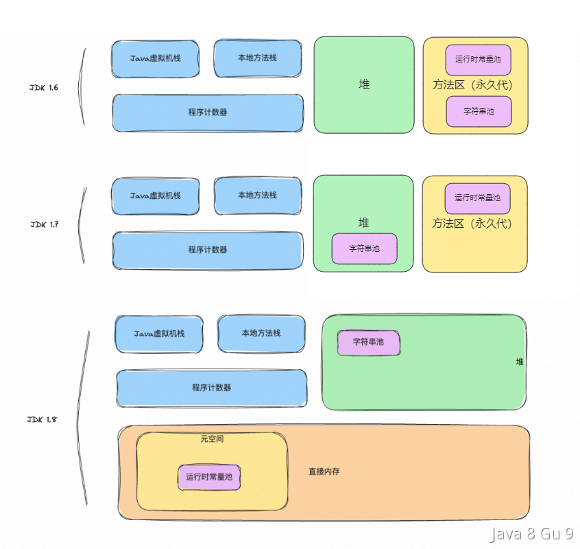

程序计数器：一个只读的存储器，用于记录Java虚拟机正在执行的字节码指令的地址。它是线程私有的，为每个线程维护一个独立的程序计数器，用于指示下一条将要被执行的字节码指令的位置。它保证线程执行一个字节码指令以后，才会去执行下一个字节码指令。

Java虚拟机栈：一种线程私有的存储器，用于存储Java中的局部变量。根据Java虚拟机规范，每次方法调用都会创建一个栈帧，该栈帧用于存储局部变量，操作数栈，动态链接，方法出口等信息。当方法执行完毕之后，这个栈帧就会被弹出，变量作用域就会结束，数据就会从栈中消失。

本地方法栈：本地方法栈是一种特殊的栈，它与Java虚拟机栈有着相同的功能，但是它支持本地代码（ Native Code ）的执行。本地方法栈中存放本地方法（ Native Method ）的参数和局部变量，以及其他一些附加信息。这些本地方法一般是用C等本地语言实现的，虚拟机在执行这些方法时就会通过本地方法栈来调用这些本地方法。

Java堆：是存储对象实例的运行时内存区域。它是虚拟机运行时的内存总体的最大的一块，也一直占据着虚拟机内存总量的一大部分。Java堆由Java虚拟机管理，用于存放对象实例，是几乎所有的对象实例都要在上面分配内存。此外，Java堆还用于垃圾回收，虚拟机发现没有被引用的对象时，就会对堆中对象进行垃圾回收，以释放内存空间。

方法区：用于存储已被加载的类信息、常量、静态变量、即时编译后的代码等数据的内存区域。每加载一个类，方法区就会分配一定的内存空间，用于存储该类的相关信息，这部分空间随着需要而动态变化。方法区的具体实现形式可以有多种，比如堆、永久代、元空间等。

运行时常量池：是方法区的一部分。用于存储编译阶段生成的信息，主要有字面量和符号引用常量两类。其中符号引用常量包括了类的全限定名称、字段的名称和描述符、方法的名称和描述符。

#### OutOfMemory

OutOfMemory 是内存溢出错误，他通常发生在程序试图分配内存时，但是超出可用内存限制。这可能是因为程序使用了太多内存，或者由于内存泄漏而导致内存不断累积。具体产生情况分成以下几类：

1. java Heap Space：这是最常见的OutOfMemoryError。它发生在Java堆内存不足，通常由程序中创建的对象过多或者单个对象太大引起。这种错误可能导致Java应用程序崩溃。

2. PermGen Space（在Java 7之前）或 Metaspace（在Java 8及更高版本）：这种错误发生在永久代（Java 7之前）或元空间（Java 8及更高版本）不足。通常由于加载过多的类或创建过多的动态代理类等原因引起。

3. Native Heap：这种错误发生在本机堆内存不足。Java虚拟机使用本机代码（native code）来执行某些操作，如本机方法，这些操作可能会占用本机堆内存。

4. Direct Memory：这种错误发生在程序使用NIO（New I/O）库或直接内存缓冲区时，由于分配了过多的直接内存而耗尽。

5. GC Overhead Limit Exceeded：这个错误发生在垃圾收集器花费了太多时间进行垃圾回收，而没有足够的内存被释放。这通常是由于内存不足以满足垃圾收集需求而引起的。

6. Requested array size exceeds VM limit：这个错误发生在试图创建一个太大的数组，超过了虚拟机的限制。

7. Unable to create new native thread：这个错误发生在虚拟机无法创建更多的本机线程，通常由于操作系统限制引起。

#### StackOverflow

StackOverflow 是栈溢出错误，他通常发生在程序的调用栈变得过深时，如递归调用。每次函数调用都会在栈上分配一些内存，当递归调用或者函数调用层次过深时，栈空间会被耗尽，从而导致StackOverflowError。

### 类的生命周期是怎么样的？

一个类从诞生到卸载，大体分为如下几步：

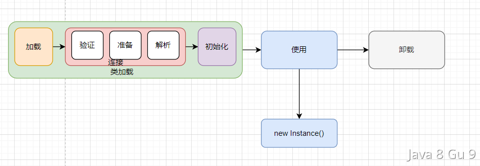

大的阶段可以分为类的加载、类的使用、以及类的卸载。

其中类的加载阶段又分为加载、连接、初始化。其中连接过程又包含了验证、准备和解析。

#### 加载阶段

查找并加载类的二进制数据(网络，jar包，运行时生成等)。将类的.class文件中的二进制数据读入内存中，将其放在方法区中，然后创建一个java.lang.Class对象（存放在堆中）用来封装类在方法区的数据结构

#### 连接阶段

在链接阶段，Java类加载器对类进行验证、准备和解析操作。将类与类的关系（符号引用转为直接引用）确定好，校验字节码

1. 验证：校验类的正确性（文件格式，元数据，字节码，二进制兼容性）

2. 准备：为类的静态变量分配内存，将其初始化为默认值。但是在到达初始化之前，类变量都没有初始化为真正的初始值。当然，对于final修饰的变量来说，会在此时就被初始化为指定值

3. 解析：把类的符号引用转为直接引用(类或接口、字段、类方法、接口方法、方法类型、方法句柄和访问控制修饰符7类符号引用 )

#### 初始化阶段

初始化是类加载的最后一步，也是真正执行类中定义的 Java 程序代码(字节码)，初始化阶段是执行类构造器\<clinit> ()方法的过程。这里利用了一种懒加载的思想，所有Java虚拟机实现必须在每个类或接口被Java程序首次主动使用才初始化，但类加载不一定，静态代码块在类初始化时执行：

1. 当遇到 new 、 getstatic、putstatic或invokestatic 这4条字节码指令时，比如 new 一个类，读取一个静态字段(未被 final 修饰)、或调用一个类的静态方法时

2. 使用 java.lang.reflect 包的方法对类进行反射调用时 ，如果类没初始化，需要触发其初始化

3. 初始化一个类，如果其父类还未初始化，则先触发该父类的初始化

4. 当虚拟机启动时，用户需要定义一个要执行的主类 (包含 main 方法的那个类)，虚拟机会先初始化这个类

5. 当使用 JDK1.7 的动态语言时，如果一个 MethodHandle 实例的最后解析结构为 REF_getStatic、REF_putStatic、REF_invokeStatic、的方法句柄，并且这个句柄没有初始化，则需要先触发器初始化

#### 什么是符号引用和直接引用

符号引用（Symbolic Reference）是一种用来表示引用目标的符号名称，比如类名、字段名、方法名等。符号引用与实际的内存地址无关，只是一个标识符，用于描述被引用的目标，类似于变量名。符号引用是在编译期间产生的，在编译后的class文件中存储。

直接引用（Direct Reference）是实际指向目标的内存地址，比如类的实例、方法的字节码等。直接引用与具体的内存地址相关，是在程序运行期间动态生成的。

假设有两个类A和B，其中A类中有一个成员变量x，B类中有一个方法foo，其中会调用A类中的成员变量x：

```java
public class A {
    public int x;
}

public class B {
    public void foo() {
        A a = new A();
        a.x = 10;
        System.out.println("x = " + a.x);
    }
}
```

在B类中调用A类的成员变量x时，实际上是通过符号引用来引用A类中的x变量。在解析阶段，Java虚拟机会将A类中的符号引用转换为直接引用，定位到具体的x变量实现，并为B类生成一条指令，用于获取该变量的内存地址。

假设A类的x变量的内存地址为0x1000，在解析阶段，Java虚拟机会为B类生成一条指令，用于获取x变量的内存地址，比如：

getstatic 0x1000

这条指令会将0x1000作为直接引用，用于访问A类中的x变量。

也就是说，在类的解析阶段进行时，Java虚拟机会根据符号引用定位到具体的内存地址，并生成一条指令，用于访问该内存地址。

#### 类使用过程

类的使用，即是类在加载完毕后，会有代码段来引用该类，如初始化该类的对象，或者通过反射获取该类的元数据。

#### 类卸载过程

假如说该类满足下面2个条件：

1. 该类所有的实例都已被GC回收。

2. 该类的ClassLoader已经被GC回收。

那么该类会在FULLGC期间从方法区被回收掉。

这个时候，我们需要明白一个问题，我们知道，JVM自带的类加载器因为需要一直加载基础对象，所以JDK自带的基础类是一定不会被回收掉的，那么会有哪些类会被回收掉呢？

答案就是那些自定义类加载器一些场景的类会被回收掉，如tomcat，SPI，JSP等临时类，是存活不久的，所以需要来不断回收。

需要注意的是，Java虚拟机并不会在程序运行过程中频繁地卸载类，因为类卸载是一个比较耗时的操作，会影响程序的性能。通常情况下，Java虚拟机会在需要释放内存空间时才会对不再使用的类进行卸载。

另外，Java SE 9引入了一个新的特性，即“模块化”，通过模块化可以对Java类进行更加精细的控制，包括对类的卸载。在模块化环境下，如果一个模块中的类不再被引用，那么这个模块就可以被卸载。模块化可以使Java应用程序更加安全、可靠和可维护。

### Java中的类什么时候会被加载？

Java中的类在以下几种情况中会被加载：

1. 当创建类的实例时，如果该类还没有被加载，则会触发类的加载。例如，通过关键字new创建一个类的对象时，JVM会检查该类是否已经加载，如果没有加载，则会调用类加载器进行加载。

2. 当使用类的静态变量或静态方法时，如果该类还没有被加载，则会触发类的加载。例如，当调用某个类的静态方法时，JVM会检查该类是否已经加载，如果没有加载，则会调用类加载器进行加载。

3. 当使用反射机制访问类时，如果该类还没有被加载，则会触发类的加载。例如，当使用Class.forName()方法加载某个类时，JVM会检查该类是否已经加载，如果没有加载，则会调用类加载器进行加载。

4. 当JVM启动时，会自动加载一些基础类，例如java.lang.Object类和java.lang.Class类等。

总之，Java中的类加载其实是延迟加载的，除了一些基础的类以外，其他的类都是在需要使用类时才会进行加载。同时，Java还支持动态加载类，即在运行时通过程序来加载类，这为Java程序带来了更大的灵活性。

#### Java在类的加载步骤中做了哪些操作

对于Java自带的类加载器来说，当一个类被加载的时候，需要用到类加载器将类从外部加载到Jvm的内存当中，如下代码所示：

```java
protected Class<?> loadClass(String name, boolean resolve) throws ClassNotFoundException {
    synchronized (getClassLoadingLock(name)) {
        // 查询该类是否被加载过
        Class<?> c = findLoadedClass(name);
        // 如果没有
        if (c == null) {
            long t0 = System.nanoTime();
            try {
                // 委派父类加载器加载
                if (parent != null) {
                    c = parent.loadClass(name, false);
                // 对于bootstap类加载器来说，他是没有父加载器的，所以用bootstrap加载该类
                } else {
                    c = findBootstrapClassOrNull(name);
                }
            } catch (ClassNotFoundException e) {
                // ClassNotFoundException thrown if class not found
                // from the non-null parent class loader
            }

            // 如果还没加载到，说明此类的二进制文件还没有定位到，需要使用自己的类加载器
            if (c == null) {
                // 使用自定义的加载方式
                c = findClass(name);

                // 省略...
            }
        }
        // 省略...
        return c;
    }
}
```

那么最后一步的findClass是什么意思呢？我们可以通过JDK8的classLoader源码的注释中发现这么一个例子：

```java
class NetworkClassLoader extends ClassLoader {
  String host;
  int port;

  public Class findClass(String name) {
      byte[] b = loadClassData(name);
      return defineClass(name, b, 0, b.length);
  }

  private byte[] loadClassData(String name) {
      // load the class data from the connection
       . . .
  }
}
```

再结合ClassLoader#findClass是protect的且为空实现，所以我们可以发现，findClass的作用就是给子类去加载其他二进制文件使用的，同时，还应该调用ClassLoader#defineClass去将二进制文件加载为Class类 

通过上面的代码，我们可以发现如下几个步骤：

1. 缓存思想，如果该类已经被加载过，则不加载

2. 使用双亲委派模型，对该类进行加载

3. 如果通过CLASSPATH找不到该类的定义，则会通过findClass让子类自定义的去获取类定义的二进制文件

4. 然后通过defineClass将二进制文件加载为类

#### 类加载的过程线程安全吗

是线程安全的，如上文所示，在loadClass方法中，是被synchronized加了锁的

#### 数组是怎么被加载的？

首先我们要明白，数组也是一种类，而不是基本数据类型。所以数组也和其他正常的类一样，需要被加载。

但是，Java规范中有如下表示：

> Class objects for array classes are not created by class loaders, but are created automatically as required by the Java runtime. The class loader for an array class, as returned by Class.getClassLoader() is the same as the class loader for its element type; if the element type is a primitive type, then the array class has no class loader.

翻译过来就是：

数组类的类对象不是由类加载器创建的，而是根据 Java 运行时的要求自动创建的。 Class.getClassLoader()返回的数组类的类加载器与其元素类型的类加载器相同；如果元素类型是原始类型，则数组类没有类加载器。

此时我们可以知道，数组不通过类加载器加载，而是根据 Java 运行时的要求自动创建的。如果元素类型是原始类型，则数组类没有类加载器。

### 什么是双亲委派？如何破坏？

下图中展示的类加载器之间的这种层次关系，称为类加载器的双亲委派模型（Parents Delegation Model）。
双亲委派模型要求除了顶层的启动类加载器外，其余的类加载器都应当有自己的父类加载器。这里类加载器之间的父子关系一般不会以继承（Inheritance）的关系来实现，而是都使用组合（Composition）关系来复用父加载器的代码。

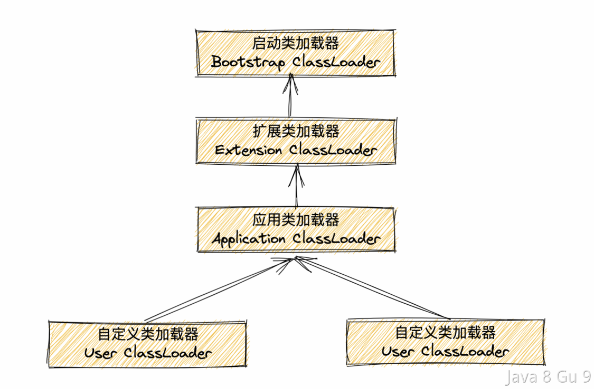

双亲委派模型的工作过程是：如果一个类加载器收到了类加载的请求，它首先不会自己去尝试加载这个类，而是把这个请求委派给父类加载器去完成，每一个层次的类加载器都是如此，因此所有的加载请求最终都应该传送到顶层的启动类加载器中，只有当父加载器反馈自己无法完成这个加载请求（它的搜索范围中没有找到所需的类）时，子加载器才会尝试自己去加载。

双亲委派模型对于保证Java程序的稳定运作很重要，但它的实现却非常简单，实现双亲委派的代码都集中在java.lang.ClassLoader的loadClass()方法之中，代码简单，逻辑清晰易懂：先检查类是否已经被加载过，若没有加载则调用父加载器的loadClass()方法，若父加载器为空则默认使用启动类加载器作为父加载器。如果父类加载失败，抛出ClassNotFoundException异常后，再调用自己的findClass()方法进行加载。

双亲委派模型主要是由ClassLoader#loadClass实现的，我们只需要自定义类加载器，并且重写其中的loadClass方法，即可破坏双亲委派模型。

#### JAVA有哪几种默认的类加载器

从Java虚拟机的角度来讲，只存在两种不同的类加载器：一种是启动类加载器（Bootstrap ClassLoader），这个类加载器使用C++语言实现（只限于HotSpot），是虚拟机自身的一部分；

另一种就是所有其他的类加载器，这些类加载器都由Java语言实现，独立于虚拟机外部，并且全都继承自抽象类java.lang.ClassLoader。

从Java开发人员的角度来看，类加载器还可以划分得更细致一些，绝大部分Java程序都会使用到以下3种系统提供的类加载器。

1. 启动类加载器（Bootstrap ClassLoader）： 这个类加载器负责将存放在＜JAVA_HOME＞\lib目录中的，或者被-Xbootclasspath参数所指定的路径中的，并且是虚拟机识别的（仅按照文件名识别，如rt.jar，名字不符合的类库即使放在lib目录中也不会被加载）类库加载到虚拟机内存中。启动类加载器无法被Java程序直接引用，用户在编写自定义类加载器时，如果需要把加载请求委派给引导类加载器，那直接使用null代替即可

2. 扩展类加载器（Extension ClassLoader）： 这个加载器由sun.misc.Launcher$ExtClassLoader实现，它负责加载＜JAVA_HOME＞\lib\ext目录中的，或者被java.ext.dirs系统变量所指定的路径中的所有类库，开发者可以直接使用扩展类加载器。

3. 应用程序类加载器（Application ClassLoader）： 这个类加载器由sun.misc.Launcher$App-ClassLoader实现。由于这个类加载器是ClassLoader中的getSystemClassLoader()方法的返回值，所以一般也称它为系统类加载器。它负责加载用户类路径（ClassPath）上所指定的类库，开发者可以直接使用这个类加载器，如果应用程序中没有自定义过自己的类加载器，一般情况下这个就是程序中默认的类加载器。

#### 为什么需要双亲委派模型

使用双亲委派模型来组织类加载器之间的关系，有一个显而易见的好处就是Java类随着它的类加载器一起具备了一种带有优先级的层次关系。例如类java.lang.Object，它存放在rt.jar之中，无论哪一个类加载器要加载这个类，最终都是委派给处于模型最顶端的启动类加载器进行加载，因此Object类在程序的各种类加载器环境中都是同一个类。

相反，如果没有使用双亲委派模型，由各个类加载器自行去加载的话，如果用户自己编写了一个称为java.lang.Object的类，并放在程序的ClassPath中，那系统中将会出现多个不同的Object类，Java这些核心类的API就会被随意篡改，应用程序也将会变得一片混乱。

使用不同的类加载器加载相同全路径的类，JVM中将会存在两个相同的类。当判断这两个类是否相等时，会得到不等的结果。

#### loadClass和findClass

findClass用于重写类加载逻辑、loadClass方法的逻辑里如果父类加载器加载失败则会调用自己的findClass方法完成加载，保证了双亲委派规则。

1. 如果不想打破双亲委派模型，那么只需要重写findClass方法即可

2. 如果想打破双亲委派模型，那么就重写整个loadClass方法

#### 有哪些破坏双亲委派的例子

##### 向前兼容

由于双亲委派模型是在JDK1.2之后才被引入的，而类加载器和抽象类java.lang.ClassLoader则是JDK1.0时候就已经存在，面对已经存在的用户自定义类加载器的实现代码，Java设计者引入双亲委派模型时不得不做出一些妥协。

为了向前兼容，JDK1.2之后的java.lang.ClassLoader添加了一个新的proceted方法findClass()，在此之前，用户去继承java.lang.ClassLoader的唯一目的就是重写loadClass()方法，因为虚拟机在进行类加载的时候会调用加载器的私有方法loadClassInternal()，而这个方法的唯一逻辑就是去调用自己的loadClass()。

JDK1.2之后已不再提倡用户再去覆盖loadClass()方法，应当把自己的类加载逻辑写到findClass()方法中，在loadClass()方法的逻辑里，如果父类加载器加载失败，则会调用自己的findClass()方法来完成加载，这样就可以保证新写出来的类加载器是符合双亲委派模型的。

##### SPI实现

双亲委派模型很好地解决了各个类加载器的基础类统一问题(越基础的类由越上层的加载器进行加载)，基础类之所以被称为“基础”，是因为它们总是作为被调用代码调用的API。但是，如果基础类又要调用用户的代码，那该怎么办呢。

这并非是不可能的事情，一个典型的例子便是JNDI服务，它的代码由启动类加载器去加载(在JDK1.3时放进rt.jar)，但JNDI的目的就是对资源进行集中管理和查找，它需要调用独立厂商实现部部署在应用程序的classpath下的JNDI接口提供者(SPI, Service Provider Interface)的代码，但启动类加载器不可能“认识”这些代码。

为了解决这个困境，Java设计团队只好引入了一个不太优雅的设计：线程上下文类加载器(Thread Context ClassLoader)。这个类加载器可以通过java.lang.Thread类的setContextClassLoader()方法进行设置，如果创建线程时还未设置，它将会从父线程中继承一个；如果在应用程序的全局范围内都没有设置过，那么这个类加载器默认就是应用程序类加载器。

有了线程上下文类加载器，JNDI服务使用这个线程上下文类加载器去加载所需要的SPI代码，也就是父类加载器请求子类加载器去完成类加载动作，这种行为实际上就是打通了双亲委派模型的层次结构来逆向使用类加载器，已经违背了双亲委派模型，但这也是无可奈何的事情。

Java中所有涉及SPI的加载动作基本上都采用这种方式，例如JNDI,JDBC,JCE,JAXB和JBI等。

##### TOMCAT

**一个web容器可能需要部署多个应用程序，不同的应用程序可能会依赖同一个第三方类库的不同版本，但是不同版本的类库中某一个类的全路径名可能是一样的，如果采用默认的类加载机制，那么就会无法加载多个相同的类。**

所以，TOMCAT需要有隔离的机制，为每个web容器单独提供一个WebAppClassLoader加载器。

Tomcat 为了实现隔离性，优先加载 Web 应用自己定义的类，所以没有遵照双亲委派的约定，每一个应用自己的类加载器——WebAppClassLoader负责加载本身的目录下的class文件，加载不到时再交给CommonClassLoader加载，这和双亲委派刚好相反。

##### 模块化

我们通过之前的文章了解到，一个类想要被卸载，必须要其ClassLoader的实例也要被GC，所以在热插拔，热部署，模块化的时候，即是添加一个功能或减去一个功能不用重启，只需要把这模块连同类加载器一起换掉就实现了代码的热替换。

譬如对于JDK9来说，它已经支持了模块化的机制，它不会直接委派给父类加载器实现，而是按照模块的维度来划分类加载器，只有模块中找不到该类，才会采用双亲委派机制。源码如下：

```java
Class<?> c = findLoadedClass(cn);
if (c == null) {
    // 找到当前类属于哪个模块
    LoadedModule loadedModule = findLoadedModule(cn);
    if (loadedModule != null) {
        //获取当前模块的类加载器
        BuiltinClassLoader loader = loadedModule.loader();
        //进行类加载
        c = findClassInModuleOrNull(loadedModule, cn);
     } else {
          // 找不到模块信息才会进行双亲委派
            if (parent != null) {
              c = parent.loadClassOrNull(cn);
            }
      }
}
```

#### 如何判断JVM中类和其他类是不是同一个类？

类加载器虽然只用于实现类的加载动作，但它在Java程序中起到的作用却远远不限于类加载阶段。对于任意一个类，都需要由加载它的类加载器和这个类本身一同确立其在Java虚拟机中的唯一性，每一个类加载器，都拥有一个独立的类名称空间。

简单点说：比较两个类是否“相等”，只有在这两个类是由同一个类加载器加载的前提下才有意义，否则，即使这两个类来源于同一个Class文件，被同一个虚拟机加载，只要加载它们的类加载器不同，那这两个类就必定不相等。

### 如何进行JVM调优？

JVM调优是一个过程，而不是一个具体的动作，是需要不断的根据实际的业务情况，根据实际的应用情况进行不断的调整和优化的。不同的应用之间的配置和优化手段也完全不同。

在做JVM调优的时候，首先就是需要监控、分析你的JVM的情况，然后才是真正的调整和优化，JVM的监控可以用到以下工具：

1. jps：JDK 1.5提供的一个显示当前所有java进程pid的命令，简单实用，非常适合在linux/unix平台上简单察看当前java进程的一些简单情况。

2. jstack：Java虚拟机自带的命令行工具，主要用于生成线程的堆栈信息，用于诊断死锁及线程阻塞等问题。

3. jmap：Java虚拟机自带的命令行工具，可以生成JVM中堆内存的Dump文件，用于分析堆内存的使用情况。排查内存泄漏等问题。

4. jstat：Java虚拟机自带的命令行工具，主要用来监控JVM中的类加载、GC、线程等信息。

5. jhat：使用jmap可以生成Java堆的Dump文件，生成dump文件之后就可以用jhat命令，将dump文件转成html的形式，然后通过http访问可以查看堆情况。

6. JConsole：一个基于JMX（Java Management Extensions）的监控工具，可以用来监视JVM中的内存、线程、GC等信息，并可以执行一些诊断和故障排除任务。

7. VisualVM：一个基于NetBeans平台的可视化工具，可以监视本地和远程JVM进程的性能和资源使用情况，包括CPU、内存、线程、GC等信息，并可以进行故障排除和性能分析。

8. YourKit：一个商业的JVM分析工具，可以进行内存、CPU、线程等方面的分析，提供了一些高级功能如内存泄漏检测、代码热替换等。

9. JProfiler：一个商业的JVM分析工具，可以监视JVM中的内存、线程、GC等信息，并提供一些高级功能如代码分析、内存泄漏检测等。

10. Arthas：Arthas 是Alibaba开源的Java诊断工具，非常强大，非常推荐，

在做JVM调整和优化的时候，可以真正实践做的一些手段：

1. 调整堆内存：JVM默认的最大堆内存大小是物理内存的1/4，可以通过在启动参数中增加-Xmx选项来增加堆内存大小。

2. 调整垃圾收集器：可以通过设置不同的垃圾收集器来改善应用程序的性能，如使用并行收集器（-XX:+UseParallelGC）或CMS收集器（-XX:+UseConcMarkSweepGC）、G1等。

3. 设置新生代和老年代的比例：默认情况下，新生代和老年代的比例是1:2，可以根据应用程序的需求调整这个比例。

4. 调整GC线程数：可以通过设置线程数来优化应用程序的性能，如使用-XX:ParallelThreads参数来设置并行垃圾收集器的线程数。

5. 使用合适的GC算法：可以根据应用程序的需求选择不同的GC算法，如G1（Garbage First）收集器，可以更好地处理大堆内存的应用程序。

6. 减少对象创建：对象的创建和回收是JVM中的一个开销，因此可以通过减少对象的创建来降低JVM的开销。

7. 使用合适的数据结构和算法：选择合适的数据结构和算法可以降低应用程序的内存和CPU使用量，从而提高性能。

### JVM有哪些垃圾回收算法？

#### 标记-清除

标记清除是最简单和干脆的一种垃圾回收算法，他的执行流程是这样子的：当 JVM 识别出内存中的垃圾以后，直接将其清除，但是这样有一个很明显的缺点，就是会导致内存空间的不连续，也就是会产生很多的内存碎片。先画个图来看下

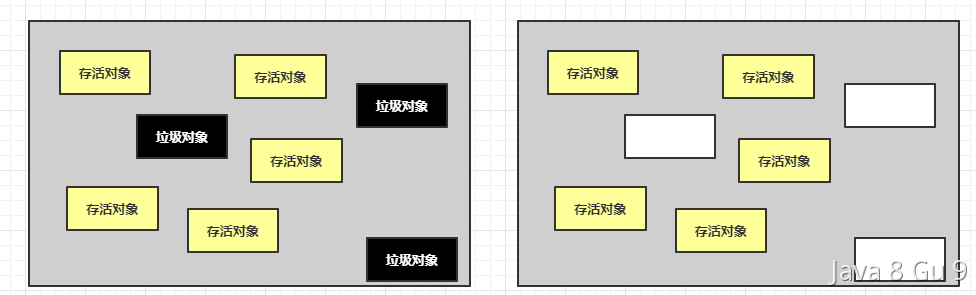

我们使用上图左边的图来表示垃圾回收之前的样子，黑色的区域表示可以被回收的垃圾对象。这些对象在内存空间中不是连续的。右侧这张图表示是垃圾回收过后的内存的样子。可以很明显的看到里面产生了断断续续的 内存碎片。

那说半天垃圾不是已经被回收了吗？内存碎片就内存碎片呗。又能咋地？

好，我来这么告诉你，现在假设这些内存碎片所占用的空间之和是1 M，现在新创建了一个对象大小就是 1 M，但是很遗憾的是，此时内存空间虽然加起来有 1 M，但是并不是连续的，所以也就无法存放这大对象。也就是说这样势必会造成内存空间的浪费，这就是内存碎片的危害。

比方说其中的1M空间其实依然是可用的，只不过它只能存放<=1M的对象，但是再出现大小完全一模一样的对象是概率很低的事情，即使出现了也并不一定被刚好分配到这段空间上，所以这1M很大概率会被分配给一个<1M的对象，或许只会被利用999K或者1020K或者任意K，剩下的那一点点就很难再被利用了，这才形成了碎片。

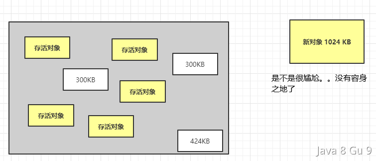

这么一说标记-清除就没有优点了吗？优点还是有的：速度快

到此，我们来对标记-清除来做一个简单的优缺点小结：

- 优点
  
  - 速度快，因为不需要移动和复制对象

- 缺点
  
  - 会产生内存碎片，造成内存的浪费

#### 标记-复制

上面的清除算法真的太差劲了。都不管后来人能不能存放的下，就直接啥也不管的去清除对象。所以升级后就来了复制算法。

复制算法的工作原理是这样子的：首先将内存划分成两个区域。新创建的对象都放在其中一块内存上面，当快满的时候，就将标记出来的存活的对象复制到另一块内存区域中（注意：这些对象在在复制的时候其内存空间上是严格排序且连续的），这样就腾出来一那一半就又变成了空闲空间了。依次循环运行。

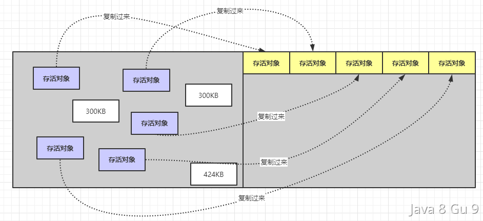

在回收前将存活的对象复制到另一边去。然后再回收垃圾对象，回收完就类似下面的样子：

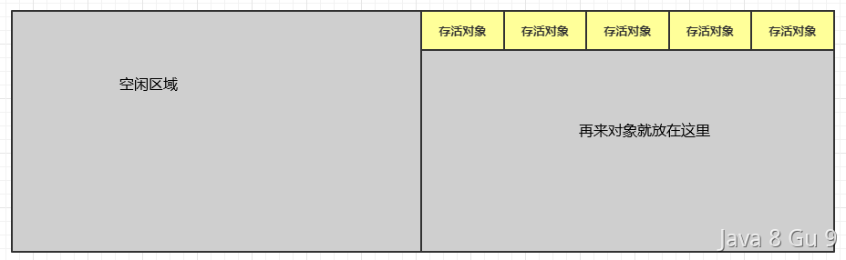

如果再来新对象被创建就会放在右边那块内存中，当内存满了，继续将存活对象复制到左边，然后清除掉垃圾对象。

标记-复制算法的明显的缺点就是：浪费了一半的内存，但是优点是不会产生内存碎片。所以我们再做技术的时候经常会走向一个矛盾点地方，那就是：一个新的技术的引入，必然会带来新的问题。

到这里我们来简单小结下标记-复制算法的优缺点：

- 优点
  
  - 内存空间是连续的，不会产生内存碎片

- 缺点
  
  - 浪费了一半的内存空间
  - 复制对象会造成性能和时间上的消耗

说到底，似乎这两种垃圾回收回收算法都不是很好。而且在解决了原有的问题之后，所带来的新的问题也是无法接受的。所以又有了下面的垃圾回收算法。

#### 标记-整理

标记-整理算法是结合了上面两者的特点进行演化而来的。具体的原理和执行流程是这样子的：我们将其分为2个阶段：第一阶段为标记；第二阶段为整理；

标记：它的第一个阶段与标记-清除算法是一模一样的，均是遍历 GC Roots，然后将存活的对象标记。

整理：移动所有存活的对象，且按照内存地址次序依次排列，然后将末端内存地址以后的内存全部回收。因此，第二阶段才称为整理阶段。

我们是画图说话，下面这张图是垃圾回收前的样子。


下图图表示的第一阶段：标记出存活对象和垃圾对象

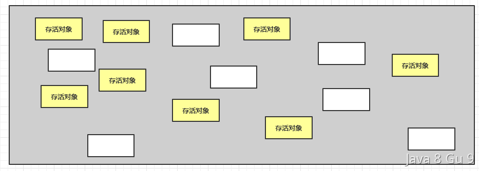

白色空间表示被清理后的垃圾。
下面就开始进行整理：

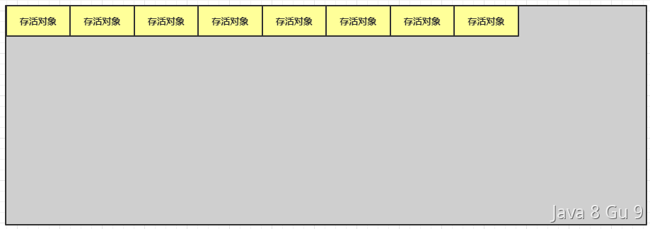

可以看到，现在即没有内存碎片，也没有浪费内存空间。

但是这就完美了吗？他在标记和整理的时候会消耗大量的时间（微观上）。但是在大厂那种高并发的场景下，这似乎有点不尽如人意。

到此，我们将标记-整理的优缺点整理如下：

- 优点
  
  - 内存空间是连续的，不会产生内存碎片

- 缺点
  
  - 太耗时间（性能低）

到此为止，我们已经了知道了标记-清除、标记-复制、标记-整理三大垃圾回收算法的优缺点。

单纯的从时间长短上面来看：标记-清除 < 标记-复制 < 标记-整理。

单纯从结果来看：标记-整理 > 标记-复制 >= 标记-清除

### 新生代和老年代的GC算法

三种垃圾回收算法，标记复制、标记清除、标记整理中，比较适合新生代的算法是标记复制算法。因为对于新生代来说，一般来说GC的次数是要比老年代高很多的，所以需要一个效率更高的算法，而且最好不要有碎片，因为很多对象都是需要先在新生代分配空间的，如果碎片太多的话，那么就会导致很多对象无法正常分配了。

所以，新生代选择了标记复制算法进行垃圾回收，但是标记复制算法存在一个缺点就是会浪费空间，新生代为了解决这个问题，把区域进一步细分成一个Eden区和两个Survivor区，同时工作的只有一个Eden区+一个Survivor区，这样，另外一个Survivor主要用来复制就可以了。只需要动态的调整Eden区和Survivor区的比例就可以降低空间浪费的问题。

对于老年代来说，通常会采用标记整理算法，虽然效率低了一点，但是可以减少空间的浪费并且不会有空间碎片等问题。在有些回收器上面，如CMS，为了降低STW的时长，也会采用标记清除算法。

### Java的堆是如何分代的？为什么分代？

Java的堆内存分代是指将不同生命周期的堆内存对象存储在不同的堆内存区域中，这里的不同的堆内存区域被定义为“代”。这样做有助于提升垃圾回收的效率，因为这样的话就可以为不同的"代"设置不同的回收策略。

一般来说，Java中的大部分对象都是朝生夕死的，同时也有一部分对象会持久存在。因为如果把这两部分对象放到一起分析和回收，这样效率实在是太低了。通过将不同时期的对象存储在不同的内存池中，就可以节省宝贵的时间和空间，从而改善系统的性能。

Java的堆由新生代（Young Generation）和老年代（Old Generation）组成。新生代存放新分配的对象，老年代存放长期存在的对象。

新生代（Young）由年轻区（Eden）、Survivor区组成（From Survivor、To Survivor）。默认情况下，新生代的Eden区和Survivor区的空间大小比例是8:2，可以通过-XX:SurvivorRatio参数调整。

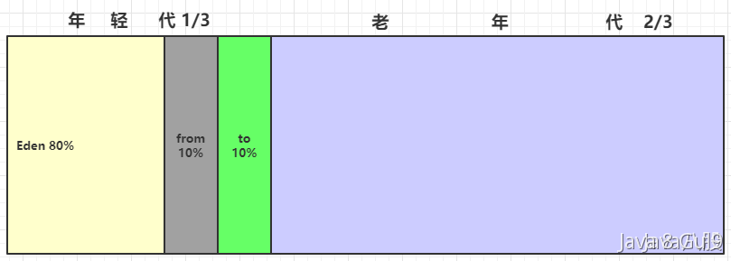

很多对象都会出现在Eden区，当Eden区的内存容量用完的时候，GC会发起，非存活对象会被标记为死亡，存活的对象被移动到Survivor区。如果Survivor的内存容量也用完，那么存活对象会被移动到老年代。

老年代（Old）是对象存活时间最长的部分，它由单一存活区（Tenured）组成，并且把经历过若干轮GC回收还存活下来的对象移动而来。在老年代中，大部分对象都是活了很久的，所以GC回收它们会很慢。

#### Java的对象分代回收过程

- 绝大多数刚刚被创建的对象会存放在 Eden 区。
- 当 `Eden` 区第一次满的时候，会进行垃圾回收。首先将 `Eden` 区的垃圾对象回收清除，并将存活的对象复制到 `From Survivor`，此时 `To Survivor` 是空的。
- 下一次 `Eden` 区满时，再执行一次垃圾回收。此次会将 `Eden` 和 `From Survivor` 区中所有垃圾对象清除，并将存活对象复制到 `To Survivor`，此时 `From Survivor` 变为空。
- 如此反复在 `From Survivor` 和 `To Survivor` 之间切换几次（默认 15 次）之后，如果还有存活对象。说明这些对象的生命周期较长，则将它们转移到老年代中。

> **注意**：对于老年代可能存在这么一种情况，老年代中的对象有时候会引用到新生代对象。这时如果要执行新生代 GC，则可能需要查询整个老年代上可能存在引用新生代的情况，这显然是低效的。所以，老年代中维护了一个 512 byte 的 `card table`，所有老年代对象引用新生代对象的信息都记录在这里。每当新生代发生 GC 时，只需要检查这个 `card table` 即可，大大提高了性能。

### GC分类

新生代和老年代所进行的GC是有区别的：

- 新生代 GC：这一区域的 GC 叫作 Minor GC。因为 Java 对象大多都具备朝生夕灭的特性，所以 Minor GC 非常频繁，一般回收速度也比较快。
- 老年代 GC：发生在这一区域的 GC 也叫作 Major GC 或者 Full GC。当出现了 Major GC，经常会伴随至少一次的 Minor GC。

> 注意：在有些虚拟机实现中，`Major GC` 和 `Full GC` 还是有一些区别的。`Major GC` 只是代表回收老年代的内存，而 `Full GC` 则代表回收整个堆中的内存，也就是新生代 + 老年代。

### 对象的分代晋升

一般情况下，对象将在新生代进行分配，首先会尝试在Eden区分配对象，当Eden内存耗尽，无法满足新的对象分配请求时，将触发新生代的GC(Young GC、MinorGC)，在新生代的GC过程中，没有被回收的对象会从Eden区被搬运到Survivor区，这个过程通常被称为"晋升"。如果对象比较大（比如长字符串或者大数组），并且新生代的剩余空间不足，则这个大对象会直接被分配到老年代上。

同样的，对象也可能会晋升到老年代，触发条件主要看对象的大小和年龄。对象进入老年代的条件有三个，满足一个就会进入到老年代：

1. 躲过15次GC。每次垃圾回收后，存活的对象的年龄就会加1，累计加到15次（jdk8默认的），也就是某个对象躲过了15次垃圾回收，那么JVM就认为这个是经常被使用的对象，就没必要再待在年轻代中了。具体的次数可以通过 -XX:MaxTenuringThreshold 来设置在躲过多少次垃圾收集后进去老年代。

2. 动态对象年龄判断。规则：如果在Survivor空间中小于等于某个年龄的所有对象大小的总和大于Survivor空间的一半时，那么就把大于等于这个年龄的对象都晋升到老年代。

3. 大对象直接进入老年代。-XX:PretenureSizeThreshold 来设置大对象的临界值，大于该值的就被认为是大对象，就会直接进入老年代。

针对上面的三点来逐一分析。

#### 动态年龄判断

为了能更好地适应不同程序的内存状况，HotSpot虚拟机并不是永远要求对象的年龄必须达到- XX:M axTenuringThreshold才能晋升老年代，他还有一个动态年龄判断的机制。

JVM中，动态年龄判断的代码如下：

```cpp
uint ageTable::compute_tenuring_threshold(size_t survivor_capacity) {

  size_t desired_survivor_size = (size_t)((((double) survivor_capacity)*TargetSurvivorRatio)/100);
  size_t total = 0;
  uint age = 1;
  while (age < table_size) {
    total += sizes[age];
    if (total > desired_survivor_size) break;
    age++;
  }
  uint result = age < MaxTenuringThreshold ? age : MaxTenuringThreshold;
    ...
}
```

它的过程是从年龄小的对象开始，不断地累加对象的大小，当年龄达到N时，刚好达到TargetSurvivorRatio这个阈值，那么就把所有年龄大于等于N的对象全部晋升到老年代去！

所以，这过程应该是这样的：

如果在Survivor空间中小于等于某个年龄的所有对象大小的总和大于Survivor空间的一半时，那么就把大于等于这个年龄的对象都晋升到老年代。

#### Survivor不够怎么办？

在YoungGC之后，如果存活的对象所需要的空间比Survivor区域的空间大怎么办呢？毕竟一块Survivor区域的比例只是年轻的10%而已。

这时候就需要把对象移动到老年代。

#### 空间分配担保机制

如果Survivor区域的空间不够，就要分配给老年代，也就是说，老年代起到了一个兜底的作用。但是，老年代也是可能空间不足的。所以，在这个过程中就需要做一次空间分配担保（CMS）：

在每一次执行YoungGC之前，虚拟机会检查老年代最大可用的连续空间是否大于新生代所有对象的总空间。

如果大于，那么说明本次Young GC是安全的。

如果小于，那么虚拟机会查看HandlePromotionFailure 参数设置的值判断是否允许担保失败。如果值为true，那么会继续检查老年代最大可用连续空间是否大于历次晋升到老年代的对象的平均大小（一共有多少对象在内存回收后存活下来是不可预知的，因此只好取之前每次垃圾回收后晋升到老年代的对象大小的平均值作为参考）。如果大于，则尝试进行一次YoungGC，但这次YoungGC依然是有风险的；如果小于，或者HandlePromotionFailure=false，则会直接触发一次Full GC。

但是，需要注意的是HandlePromotionFailure这个参数，在JDK 7中就不再支持了。在JDK代码中，移除了这个参数的判断（https://github.com/openjdk/jdk/commit/cbc7f8756a7e9569bbe1a38ce7cab0c0c6002bf7 ），也就是说，在后续的版本中， 只要检查老年代最大可用连续空间是否大于历次晋升到老年代的对象的平均大小，如果大于，则认为担保成功，可以进行YoungGC，担保失败，则需要进行Full GC。

但是需要注意的是，担保的结果可能成功，也可能失败。所以，在YoungGC的复制阶段执行之后，会发生以下三种情况：

- 剩余的存活对象大小，小于Survivor区，那就直接进入Survivor区。

- 剩余的存活对象大小，大于Survivor区，小于老年代可用内存，那就直接去老年代。

- 剩余的存活对象大小，大于Survivor并且大于老年代，触发"FullGC"。

### 什么是永久代？

永久代（Permanent Generation）是HotSpot虚拟机在以前版本中使用的一个永久内存区域，是JVM中垃圾收集堆之外的另一个内存区域，它主要用来实现方法区的，其中存储了Class类信息、常量池以及静态变量等数据。

Java 8以后，永久代被重构为元空间（MetaSpace）。

但是，和新生代、老年代一样，永久代也是可能会发生GC的。而且，永久代也是有可能导致内存溢出。只要永久代的内存分配超过限制指定的最大值，就会出现内存溢出。

### YoungGC和FullGC的触发条件是什么？

YoungGC的触发条件比较简单，那就是当年轻代中的eden区分配满的时候就会触发。

FullGC的触发条件比较复杂也比较多，主要以下几种：

- 老年代空间不足
  
  - 创建一个大对象，超过指定阈值会直接保存在老年代当中，如果老年代空间也不足，会触发Full GC。
  
  - YoungGC之后，发现要移到老年代的对象，老年代存不下的时候，会触发一次FullGC

- 空间分配担保失败
  
  - 当准备要触发一次YoungGC时，会进行空间分配担保，在担保过程中，发现虚拟机会检查老年代最大可用的连续空间小于新生代所有对象的总空间，但是HandlePromotionFailure=false，那么就会触发一次FullGC（HandlePromotionFailure 这个配置，在JDK 7中并不在支持了，这一步骤在该版本已取消）
  
  - 当准备要触发一次YoungGC时，会进行空间分配担保，在担保过程中，发现虚拟机会检查老年代最大可用的连续空间小于新生代所有对象的总空间，但是HandlePromotionFailure=true，继续检查发现老年代最大可用连续空间小于历次晋升到老年代的对象的平均大小时，会触发一次FullGC

- 永久代空间不足
  
  如果有永久代的话，当在永久代分配空间时没有足够空间的时候，会触发FullGC

- 代码中执行System.gc()
  
  代码中执行System.gc()的时候，会触发FullGC，但是并不保证一定会立即触发。

### JVM如何判断对象是否存活？

当JVM判断对象不再存活的时候，便会在下一次GC时候将该对象回收掉，为堆腾出空间，那么JVM如何判断对象是否存活呢？

JVM有两种算法来判断对象是否存活，分别是引用计数法和可达性分析算法

引用计数法：给对象中添加一个引用计数器，每当有一个地方引用它，计数器就加 1；当引用失效，计数器就减 1；任何时候计数器为 0 的对象就是不可能再被使用的。这个方法实现简单，效率高，但是目前主流的虚拟机中并没有选择这个算法来管理内存，其最主要的原因是它很难解决对象之间相互循环引用的问题。

循环引用会导致对象无法被回收，最终会导致内存泄漏及内存溢出。

可达性分析算法： 这个算法的基本思想就是通过一系列的称为 “GC Roots” 的对象作为起点，从这些节点开始向下搜索，节点所走过的路径称为引用链，当一个对象到 GC Roots 没有任何引用链相连的话，则证明此对象是不可用的。

但是，并不是说当进行完可达性分析算法后，即可证明某对象可以被GC。对象是否存活，需要两次标记：

- 第一次标记通过可达性分析算法。如果没有GC Roots相连接的引用链，那么将第一次标记

- 如果对象的finalize()方法被覆盖并且没有执行过，则放在F-Queue队列中等待执行(不一定会执行)，如果一段时间后该队列的finalize()方法被执行且和GC Roots关联，则移出“即将回收”集合。如果仍然没有关联，则进行第二次标记，才会对该对象进行回收

不过现在都不提倡覆盖finalize方法，它的本意是像Cpp一样在对象销毁前执行，但是它影响了JAVA的安全和GC的性能，所以第二种判断会越来越少。

#### 哪些对象可以作为GC roots？

GC roots是作为可达性分析算法的起点的。要实现语义正确的可达性分析，就必须要能完整枚举出所有的GC Roots，否则就可能会漏扫描应该存活的对象，导致GC错误回收了这些被漏扫的活对象。那么，所谓“GC Roots”，就是一组必须活跃的引用。

那么，有哪些引用是一定活跃的呢？看下下面这些是不是都符合这个条件：

1. Class - 由系统类加载器(system class loader)加载的对象，这些类是不能够被回收的，他们可以以静态字段的方式保存持有其它对象。

2. 当前运行的方法中的参数、局部变量、临时变量 

3. 方法区中类的静态属性引用的对象（基本数据类型和引用类型）

4. 方法区中常量引用的对象，例如字符串常量池中的引用

5. JNI本地方法栈中引用的对象

6. 被同步锁（synchronized）持有的对象

7. 用于JVM特殊目的由GC保留的对象，但实际上这个与JVM的实现是有关的。可能已知的一些类型是：系统类加载器、一些JVM知道的重要的异常类、一些用于处理异常的预分配对象以及一些自定义的类加载器等。然而，JVM并没有为这些对象提供其它的信息，因此需要去确定哪些是属于"JVM持有"的了。

以上，比如系统类加载器加载的对象、活着的线程、方法中的本地变量、被synchronized锁定的对象这些，都是符合活跃的引用这个条件的！

除了这些， 还有一种，基本上很少有人提到的，大家去看网上的所有关于介绍GC Root的八股文，基本上没人提的，那就是为了解决跨代引用的问题，会把Remembered Set也作为GC Root。

#### 可达性分析算法的不足

虽然可达性分析算法相比于引用计数法要好很多，但是他也不是毫无缺点的。这种算法主要存在以下几个不足：

##### STW时间长

可达性分析算法需要对程序进行全局分析，因此时间复杂度较高，可能需要很长的时间才能完成分析，并且整个过程都是STW的，所以对应用的整体性能有很大影响。这也使得可达性分析算法难以适用于大型程序的分析。所以一些常见的回收器都会使用一些优化技术来减少可达性分析的时间和开销，如增量标记、增量拷贝等。

解决这个问题，主要是依赖三色标记法

##### 内存消耗

可达性分析算法需要存储程序中所有的对象和它们之间的引用关系，这些信息需要占用大量的内存空间。对于大型程序，如果要进行完整的可达性分析，需要存储的对象数量和引用关系数量都非常大，可能会导致内存空间不足或者程序性能下降的问题。

### 什么是三色标记算法？

### 新生代和老年代的垃圾回收器有何区别？

常见的垃圾回收器如下：

1. 串行垃圾回收器（Serial Garbage Collector） 如：Serial GC， Serial Old

2. 并行垃圾回收器（Parallel Garbage Collector） 如：Parallel Scavenge，Parallel Old，ParNew

3. 并发标记扫描垃圾回收器（CMS Garbage Collector）

4. G1垃圾回收器（G1 Garbage Collector，JDK 7中推出，JDK 9中设置为默认）

5. ZGC垃圾回收器（The Z Garbage Collector，JDK 11 推出）

新生代收集器有Serial、ParNew、Parallel Scavenge；

老年代收集器有Serial Old、Parallel Old、CMS。

整堆收集器有G1、ZGC

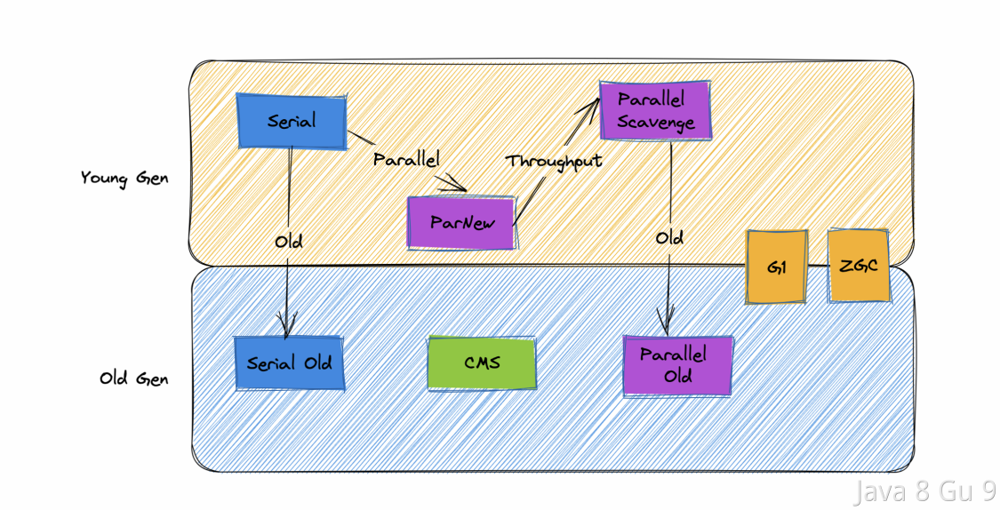

#### 串行垃圾收集器

##### Serial GC

Serial是单线程的串行垃圾回收器，主要采用标记-复制算法进行垃圾回收。

单线程地好处就是减少上下文切换，减少系统资源的开销。但这种方式的缺点也很明显，在GC的过程中，必须暂停其他所有的工作线程，直至Serial收集器收集结束为止（Stop The World）。若GC不是频繁发生，这或许是一个不错的选择，否则将会影响程序的执行性能。

##### Serial Old

Serial Old是Serial的老年代版本，也是个单线程收集器，适用于老年代，使用的是标记-整理算法。

优缺点基本和Serial差不多，二者主要是回收算法不一样。

#### 并行垃圾收集器

##### ParNew

ParNew其实就是Serial的多线程版本，在参数、回收算法上，和Serial是完全一样的，所以他也是采用标记-复制算法进行垃圾回收的。

ParNew在垃圾回收的时候，同样会STW，但是因为它是多线程并行进行垃圾回收的，所以通常情况下时间会比Serial短一些。

##### Parallel Scavenge

Parallel Scavenge 也是一个新生代的垃圾回收器，和ParNew一样，他也是多线程并发执行的，同样采用的也是标记-复制算法。与ParNew最大的不同是，Parallel Scavenge 关注的是垃圾回收的吞吐量（吞吐量=代码运行时间/(代码运行时间+垃圾收集时间)，以吞吐量优先。

因为Parallel Scavenge收集器的高吞吐量可以最高效率的利用CPU时间，尽快的完成程序的运算任务等，所以他主要适合在后台运算，比如一些定时任务的执行。

##### Parallel Old

Parallel 是 Parallel Scavenge的老年代版本，同样是一个关注吞吐量的并行垃圾收集器，他采用的是标记-整理算法算法进行垃圾回收的。

#### CMS

CMS，Concurrent Mark Sweep，同样是老年代的收集器。他也是一个并发执行的垃圾收集器，他和Parallel最大的区别是他更加关注垃圾回收的停顿时间，通过他的名字Concurrent Mark Sweep就可以知道，他采用的是耗时更短的标记-清除算法。

CMS收集器的工作流程主要有下面4个步骤：

1. 初始标记：独占CPU，仅标记GCroots能直接关联的对象（STW）

2. 并发标记：可以和用户线程并发执行，标记所有可达对象

3. 重新标记：独占CPU，对并发标记阶段用户线程运行产生的垃圾对象中产生变动的一部分对象进行标记修正(STW)

4. 并发清理：可以和用户线程并发执行，清理垃圾

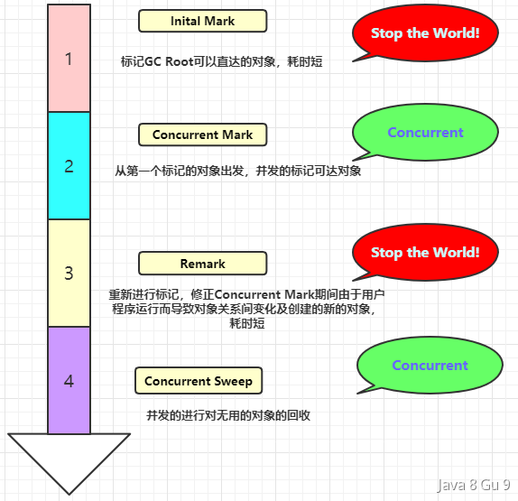

从上面的四个步骤中可以看出，CMS的过程中，只有初始标记和重新标记这两个步骤是STW的，所以，相比其他的收集器整个回收过程都STW来说，他导致的应用停顿时间更短。

- 优点
  
  1. 并发
  
  2. 低停顿

- 缺点
  
  1. 对CPU非常敏感：在并发阶段虽然不会导致用户线程停顿，但是会因为占用了一部分线程使应用程序变慢
  
  2. 无法处理浮动垃圾：在最后一步并发清理过程中，用户线程执行也会产生垃圾，但是这部分垃圾是在标记之后，所以只有等到下一次gc的时候清理掉，这部分垃圾叫浮动垃圾
  
  3. CMS使用“标记-清理”法会产生大量的空间碎片，当碎片过多，将会给大对象空间的分配带来很大的麻烦，往往会出现老年代还有很大的空间但无法找到足够大的连续空间来分配当前对象，不得不提前触发一次FullGC，为了解决这个问题CMS提供了一个开关参数，用于在CMS顶不住，要进行FullGC时开启内存碎片的合并整理过程，但是内存整理的过程是无法并发的，空间碎片没有了但是停顿时间变长了

#### G1

G1，Garbage First，是CMS的改进版，解决了CMS内存碎片、更多的内存空间等问题。总之，G1是一个先进的垃圾收集器，它可以提高系统的吞吐量，降低停顿的频率，并且可以有效管理大型堆。在JDK 9之后，G1成为了默认的垃圾回收器，主要是因为他有以下优势：

1. 并发回收：G1能充分利用CPU、多核环境下的硬件优势，使用多个CPU（CPU或者CPU核心）来缩短Stop The World的停顿时间。部分其他收集器原本需要停顿Java线程执行的GC动作，G1收集器仍然可以通过并发的方式让Java程序继续执行。

2. 分代收集：分代概念在G1中依然得以保留。虽然G1可以不需要其它收集器配合就能独立管理整个GC堆，但它能够采用不同的方式去处理新创建的对象和已经存活了一段时间、熬过多次GC的旧对象以获取更好的收集效果。也就是说G1可以自己管理新生代和老年代了。

3. 空间整合：由于G1使用了独立区域（Region）概念，G1从整体来看是基于标记-整理算法实现收集，从局部（两个Region）上来看是基于标记-复制算法实现的，但无论如何，这两种算法都意味着G1运作期间不会产生内存空间碎片。

4. 以用户设置的收集停顿时间为首要目标：这是G1相对于CMS的另一大优势，降低停顿时间是G1和CMS共同的关注点，但G1除了追求低停顿外，还能建立可预测的停顿时间模型，能让使用者明确指定一个长度为M毫秒的时间片段内，消耗在垃圾收集上的时间不得超过N毫秒。G1会对每个region进行价值判断：一次回收平均清除了多少内存，一次回收平均占用时间。对于价值较高的region，G1优先进行回收。G1不再是原先垃圾收集器要清理全部内存空间的目标，而是在用户设置的收集停顿时间内清除最有回收价值的region。也就是说，从G1开始，垃圾收集器的首要目标不是清除干净全部内存区域，而是清理速度赶得上对象分配速度即可。

5. 支持热插拔：G1可以在运行时动态调整堆的大小，以适应不同的内存需求。

与其它收集器相比，G1变化较大的是它将整个Java堆划分为多个大小相等的独立区域（Region），虽然还保留了新生代和老年代的概念，但新生代和老年代不再是物理隔离的了它们都是一部分Region（不需要连续）的集合。

同时，为了避免全堆扫描，G1使用了Remembered Set来管理相关的对象引用信息。当进行内存回收时，在GC根节点的枚举范围中加入Remembered Set即可保证不对全堆扫描也不会有遗漏了。

G1在回收的过程中，标记和清理的过程是并行的，可以充分利用多个CPU来缩短STW的时长，在复制的过程中是并发的，可以让复制线程和用户线程并发执行，不需要STW。并且G1还可以在运行时动态的做区域内存大小的调整。

Garbage First (G1) 是一种面向大型内存环境的垃圾回收算法。因此，G1适合在以下场景中使用：

1. 大型内存环境：G1针对大型内存环境进行了优化，因此对于使用了大量内存的应用程序来说（超过4G），G1是一个更好的选择。

2. 对应用程序响应时间敏感的场景：G1通过分配多线程来进行垃圾回收，以最大限度地减少回收时应用程序的暂停时间。

3. 对内存使用效率敏感的场景：G1可以更好地评估哪些内存空间可以释放，以此来提高内存的利用率。

4. 动态内存需求的场景：G1支持热插拔，可以在运行时动态调整堆的大小，以适应不同的内存需求。

5. 要求回收时间具有可预测性的场景：G1使用固定的内存分配块来管理堆内存，这使得其在回收时间上具有更高的可预测性。

所以，如果应用程序需要在大型内存环境下运行，同时对内存使用效率和应用程序的响应时间敏感，那么G1是一个更好的选择。

#### ZGC

ZGC是Java 11中引入的一种新的垃圾回收器，具有以下几个特点：

1. 低停顿：ZGC的目标是保证暂停时间非常短，并且尽可能地避免长时间的停顿。

2. 高吞吐量：ZGC旨在同时保证高吞吐量和低停顿。 

3. 兼容性：ZGC与现有的Java应用程序完全兼容，并且无需更改代码即可使用。

4. 可伸缩性：ZGC可以适应内存从几GB到数TB的范围内的应用程序。

5. 简单性：ZGC设计简单，代码库较小，因此它更容易维护和扩展。

因此，ZGC是一种新的、高效的、低停顿的垃圾回收器，适用于内存大小从几GB到数TB的应用程序。它的设计目标是在保证高吞吐量的同时保证最短的暂停时间，并且易于使用和维护。

### jdk从哪里开始不是分代收集？

Shenandoah和ZGC默认不存在分代概念。这两款垃圾收集器也是继承了G1的region概念，换句话说这两款不再划分新生代region和老年代region的概念了。

Shenandoah使用了一种连接矩阵来记录跨region引用的情况（记忆集），即x行y列是1代表x region对yregion有对象引用。

ZGC的region划分为三种规模的大小：小型region、中型region、大型region。

### Java 8 和 Java 11 的GC有什么区别？

Java 8 和 Java 11都是LTS版本的JDK，所以会有人经常问他们之间的区别。特别是在GC上面的差别。

首先，在垃圾收集器上面，Java 8 中默认的Parallel Scavenge GC+Parallel Old GC的，分别用来做新生代和老年代的垃圾回收。而在Java 11中默认采用的是G1进行整堆回收的（Java 9中就是默认的了）。

另外，Java 11中还新增了一种垃圾收集器，那就是ZGC，他可以在保证高吞吐量的同时保证最短的暂停时间。

在知道了垃圾收集器上面的区别之后，就可以基于Parallel Scavenge GC+Parallel Old GC 和 G1的区别进一步说一下GC上面的区别了。

在垃圾识别及回收上面，Java 8基于的是单纯地可达性分析，而Java 11中的G1采用的是三色标记法，可以大大降低STW的时长。

另外，G1的内存划分是自适应的，它会根据堆的大小和使用情况来动态调整各个区域的大小和比例。而Parallel Scavenge GC+Parallel Old GC都是固定分配的策略。

### 引用

根据引用强度的由强到弱，Java中存在四种引用类型：**强引用(Strong Reference)、软引用(Soft Reference)、弱引用(Weak Reference)、虚引用(Phantom Reference)**。

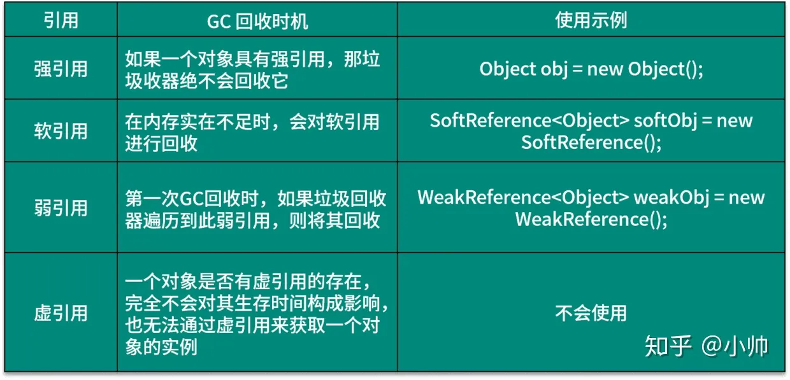

**需要注意的是**，被软引用对象关联的对象会自动被垃圾回收器回收，但是软引用对象本身也是一个对象，这些创建的软引用并不会自动被垃圾回收器回收掉。

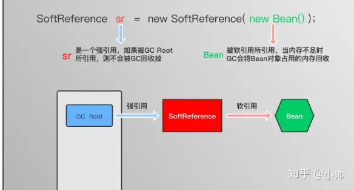

## 限流算法

### 计数器（固定窗口）

计数器算法是限流算法里最简单也是最容易实现的一种算法。比如我们规定，对于A接口来说，我们1分钟的访问次数不能超过100个。那么我们可以这么做：在一开 始的时候，我们可以设置一个计数器counter，每当一个请求过来的时候，counter就加1，如果counter的值大于100并且该请求与第一个 请求的间隔时间还在1分钟之内，那么说明请求数过多；如果该请求与第一个请求的间隔时间大于1分钟，且counter的值还在限流范围内，那么就重置 counter，具体算法的示意图如下：


这个算法虽然简单，但是有一个十分致命的问题，那就是临界问题，我们看下图：

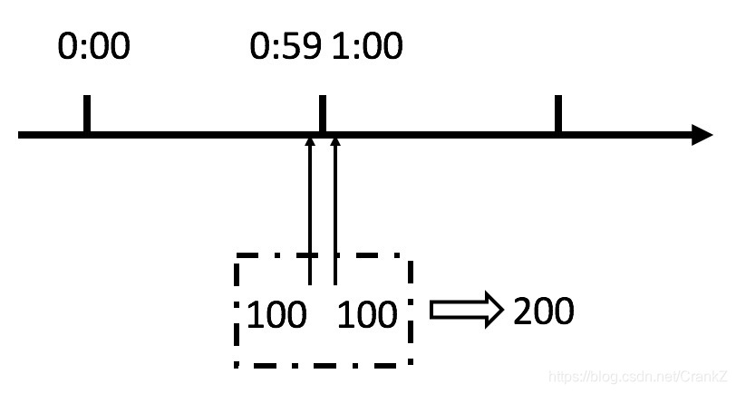

从上图中我们可以看到，假设有一个恶意用户，他在0:59时，瞬间发送了100个请求，并且1:00又瞬间发送了100个请求，这种情况，其实是符合我们上述规则的。因为在0:00-0:59这个区间用户确实没有超过我们设置的100这个最大范围，1:00-1:59这个区间也是一样。

但是，其实这个用户在 0:59-1:00这1秒里，瞬间发送了200个请求，这种情况使用固定窗口的计数器就很明显不符合我们的初衷。

### 滑动窗口算法（rolling window）

为了解决这个问题，我们引入了滑动窗口算法。如果学过TCP网络协议的话，那么一定对滑动窗口这个名词不会陌生。下面这张图，很好地解释了滑动窗口算法：

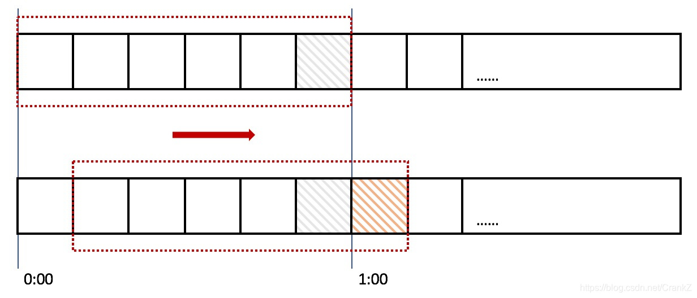

在上图中，整个红色的矩形框表示一个时间窗口，在我们的例子中，一个时间窗口就是一分钟。然后我们将时间窗口进行划分，比如图中，我们就将滑动窗口 划成了6格，所以每格代表的是10秒钟。每过10秒钟，我们的时间窗口就会往右滑动一格。每一个格子都有自己独立的计数器counter，比如当一个请求 在0:35秒的时候到达，那么0:30~0:39对应的counter就会加1。

那么滑动窗口怎么解决刚才的临界问题的呢？我们可以看上图，0:59到达的100个请求会落在灰色的格子中，而1:00到达的请求会落在橘黄色的格 子中。当时间到达1:00时，我们的窗口会往右移动一格，那么此时这个**时间窗口内**的总请求数量一共是200个，超过了限定的100个，所以此时能够检测出来触 发了限流。

滑动窗口算法是计数器算法的一种改进，将原来的一个时间窗口划分成多个时间窗口，并且不断向右滑动该窗口。流量经过滑动时间窗口算法整形之后，可以保证任意时间窗口内，都不会超过最大允许的限流值，从流量曲线上来看会更加平滑，可以部分解决上面提到的临界突发流量问题。对比固定时间窗口限流算法，滑动时间窗口限流算法的时间窗口是持续滑动的，并且除了需要一个计数器来记录时间窗口内接口请求次数之外，还需要记录在时间窗口内每个接口请求到达的时间点，对内存的占用会比较多。 在临界位置的突发请求都会被算到时间窗口内，因此可以解决计数器算法的临界问题。

### 漏桶算法(Leaky Bucket)

漏桶算法由流量容器、流量入口和出口组成。其中流量出口流速即为我们期望的限速值，比如 100 QPS。漏桶算法除了具备限流能力，还具备流量整型功能。流入漏桶流量的流速是不恒定的，经过漏桶限速后，流出流量的速度是恒定的。需要说明的是，漏桶的容量是有限的，一旦流入流量超出漏桶容量，这部分流量只能被丢弃了。

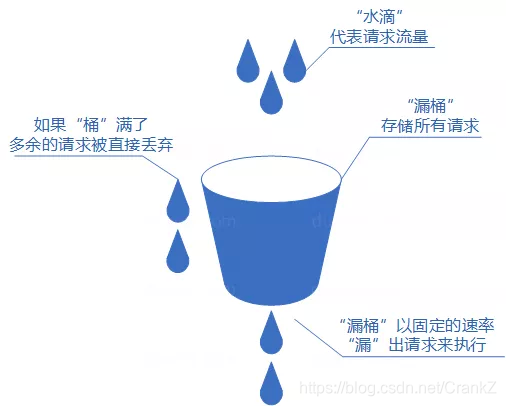

不管流量多大，超出的部分都会直接丢弃，即使服务器还有大量空闲资源也是直接丢弃，无法处理突发流量。那么如何解决这个问题呢？下面介绍令牌桶算法。

### 令牌桶算法(Token Bucket)

它的运行过程是这样的，一个令牌工厂按照设定值定期向令牌桶发放令牌。当令牌桶满了后，多出的令牌会被丢弃掉。每当一个请求到来时，该请求对应的线程会从令牌桶中取令牌。如果遇到突发情况，初期由于令牌桶中存放了很多个令牌，因此允许多个请求同时取令牌。当桶中没有令牌后，无法获取到令牌的请求可以丢弃，或者重试。下面我们来看一下的令牌桶示意图：

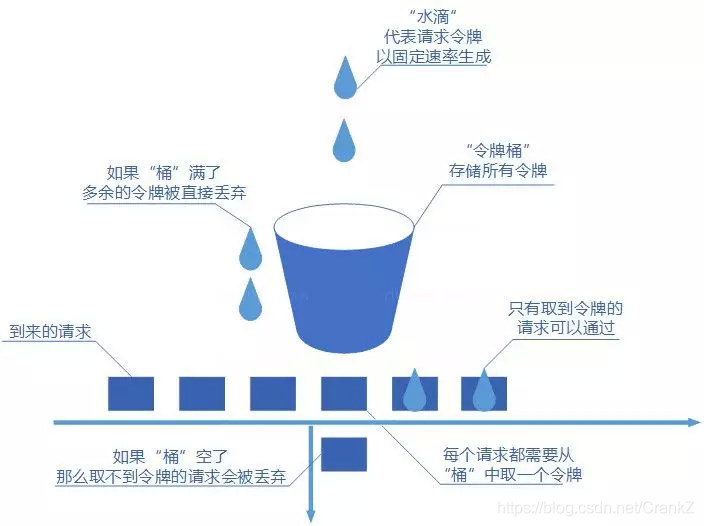

令牌桶算法既能够将所有的请求平均分布到时间区间内，又能接受服务器能够承受范围内的突发请求，因此是目前使用较为广泛的一种限流算法。

### 漏桶算法和令牌桶算法比较

|        | 漏桶算法                                      | 令牌桶算法                               |
| ------ | ----------------------------------------- | ----------------------------------- |
| 请求何时拒绝 | 流入请求速率任意，常量固定速率流出请求。当流入请求数积累到漏桶容量时，则拒绝新请求 | 固定速率往桶中添加令牌，如果桶中令牌不够，则拒绝新请求         |
| 速率限制   | 限制常量流出速率（流出速率是固定值），从而 **平滑突发流入速率**        | 限制平均流入速率，**允许一定程度的突发请求**（支持一次拿多个令牌） |

### 令牌桶对比滑动窗口的优势在哪里呢？

可以看出，滑动窗口可能遇到在限定时间内达到访问上限后，下次请求直接拒绝，直到滑动窗口内请求数减少的时候才会允许请求发生。令牌桶事先存储了令牌数量，可以应对请求突发上涨的问题，也可以在令牌使用完之后，定时补充令牌，满足部分请求过来的情况。

# 

JVM:G1收集器--ok

GC的垃圾回收算法有哪些？可达性分析算法是啥？具体解释下--ok

分代回收过程说下--ok

jdk从哪里开始不是分代收集--ok

hashmap为什么不是线程安全的 --ok

mybaticsPlus底层实现？除了mybatisPlus还有什么技术？

常用的索引结构？项目里怎么根据具体情景来创建索引？你是怎么实现的？--ok

hashmap的理解，底层实现，红黑树什么时候退化成链表？--ok

还有什么避免hash冲突的方法？比如开放寻址类的知道吗？--ok

那开放类寻址在java语言当中哪里有用到吗？--ok

hashset了解吗？和hashmap有什么关系？--ok

concurrenthashmap的线程安全是怎么实现的？--ok

解释一下voletile使用流程和理解？底层怎么保证数据可见性？--ok

synchronized java底层怎么实现？

java的一些锁你了解多少？

threadlocal你知道吗？--ok

如何创建线程池呢？线程池的配置你会怎么配置呢？那io十分频繁的情况下怎么配置？还知道其他配置参数吗？--ok

说下类加载机制？知道java底层代码怎么实现类加载的吗？--ok

GC了解吗？先解释下--ok

mysql的索引

用过redis是吧，解释下redis的过期是怎么实现的？

说一下常用的docker命令？知道k8s吗

nginx配置有没有遇到啥问题？

来聊聊spring吧，先解释AOP和IOC 你用过aop干啥？

## 相关阅读

- [基本功 | Java 即时编译器原理解析及实践](https://tech.meituan.com/2020/10/22/java-jit-practice-in-meituan.html)

- [彻底弄懂 Java 的移位操作符](https://juejin.cn/post/6844904025880526861)

- [面向过程：面向过程性能比面向对象高？？](https://github.com/Snailclimb/JavaGuide/issues/431)

- [Java hashCode() 和 equals()的若干问题解答](https://www.cnblogs.com/skywang12345/p/3324958.html)

- [如何理解 String 类型值的不可变？ - 知乎提问](https://www.zhihu.com/question/20618891/answer/114125846)

- [还在无脑用StringBuilder？来重温一下字符串拼接吧](https://juejin.cn/post/7182872058743750715)

- [Java--深入理解字符串的String#intern()方法奥妙之处_吾日三省贾斯汀的博客-CSDN博客](https://blog.csdn.net/JustinQin/article/details/120606343)

- [R 大（RednaxelaFX）关于常量折叠的回答](https://www.zhihu.com/question/55976094/answer/147302764)

- [Java Reflection: Why is it so slow?](https://stackoverflow.com/questions/1392351/java-reflection-why-is-it-so-slow)[应用安全：JAVA 反序列化漏洞之殇](https://cryin.github.io/blog/secure-development-java-deserialization-vulnerability/)

- [Java keywords with examples](https://www.codejava.net/java-core/the-java-language/java-keywords)

- [this关键字总结_this这个关键字_dbjxs的博客-CSDN博客](https://blog.csdn.net/u013393958/article/details/79881037)

- [剖析static关键字的四种使用场景_拉里_佩奇的博客-CSDN博客](https://blog.csdn.net/chen13579867831/article/details/78995480)

- [java提高篇(八)----详解内部类 - chenssy - 博客园](https://www.cnblogs.com/chenssy/p/3388487.html)

- [Java提高篇——静态代码块、构造代码块、构造函数以及Java类初始化顺序 - 萌小Q - 博客园](https://www.cnblogs.com/Qian123/p/5713440.html)

- 《深入拆解 Tomcat & Jetty》

- 如何完成一次 IO：https://llc687.top/126.html

- 程序员应该这样理解 IO：[程序员应该这样理解IO - 简书](https://www.jianshu.com/p/fa7bdc4f3de7)

- 10 分钟看懂， Java NIO 底层原理：[10分钟看懂， Java NIO 底层原理 - 疯狂创客圈 - 博客园](https://www.cnblogs.com/crazymakercircle/p/10225159.html)

- IO 模型知多少 | 理论篇：[IO 模型知多少 | 理论篇 - 「圣杰」 - 博客园](https://www.cnblogs.com/sheng-jie/p/how-much-you-know-about-io-models.html)

- 《UNIX 网络编程 卷 1；套接字联网 API 》6.2 节 IO 模型

- Java NIO浅析：[Java NIO浅析 - 美团技术团队](https://tech.meituan.com/2016/11/04/nio.html)

- 面试官：Java NIO 了解？https://mp.weixin.qq.com/s/mZobf-U8OSYQfHfYBEB6KA

- Java NIO：Buffer、Channel 和 Selector：[Java NIO：Buffer、Channel 和 Selector_Javadoop](https://www.javadoop.com/post/java-nio)

- 《实战 Java 高并发程序设计》

- [解读 java 并发队列 BlockingQueue_Javadoop](https://javadoop.com/post/java-concurrent-queue)

- https://juejin.im/post/5aeebd02518825672f19c546
