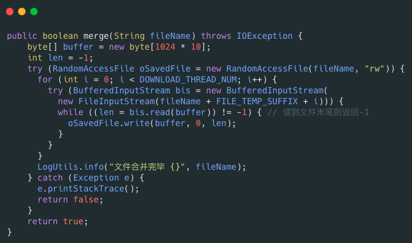
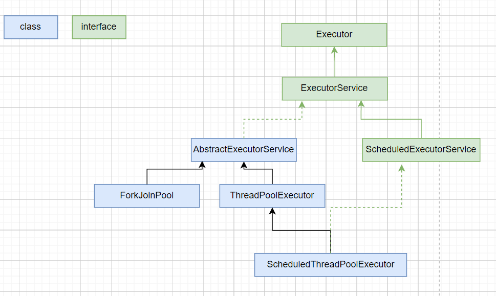
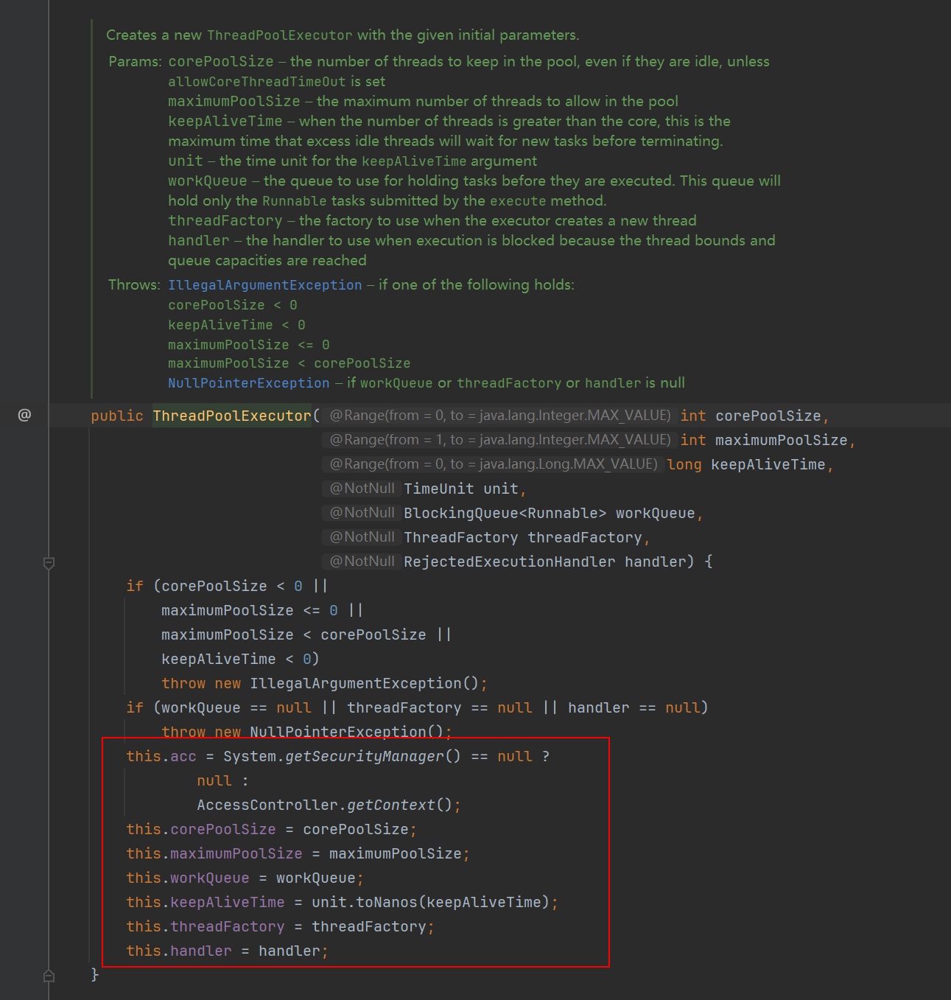
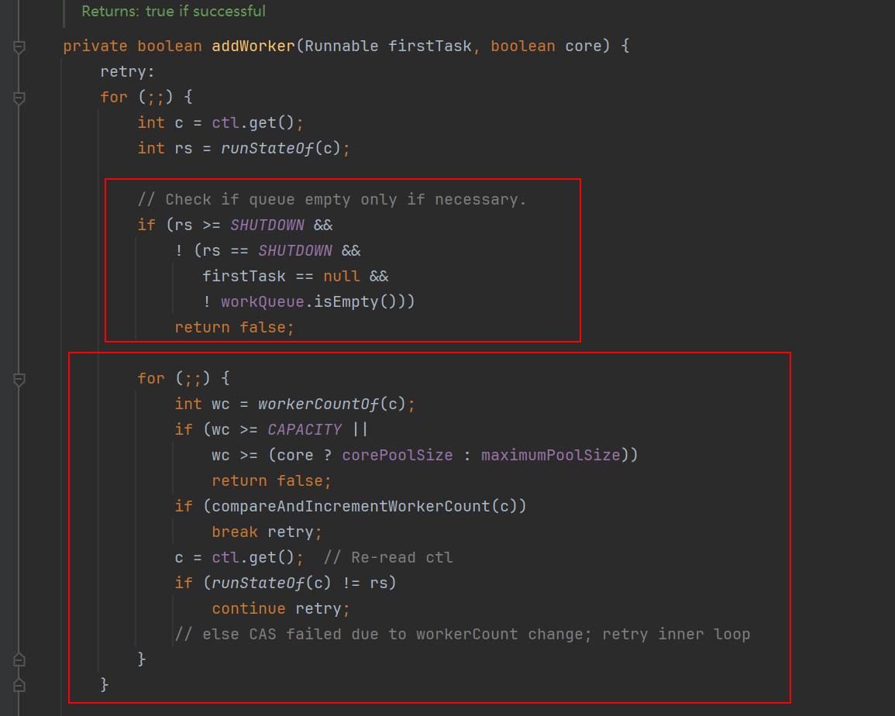
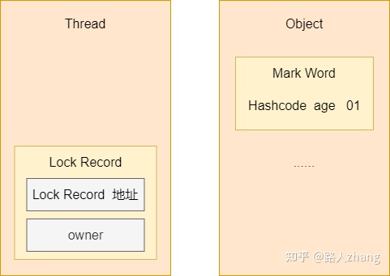

# Java面试题

## IO

Java io流一般分为字符流和字节流，从输入角度又分为输入流和输出流。字节流包括InputStream、FileInputStream(读取文件操作)、BufferedInputStream(字节缓冲输入流，配合FileInputStream使用)、DataInputStream(读取一些基本数据类型数据)、ObjectInputStream(读取一些对象数据类型数据)。字符流包括Reader、InputStreamReader、FileReader(读取文件操作)、BufferedReader(字符缓冲输入流，配合FileReader使用)、Writer、OutputStreamWriter、FileWriter。

### 为什么要用字符流？

当输入/输出内容是字符时，使用字符流更方便，默认字符流使用unicode编码，如果使用字节流直接读取中文字符，会出现乱码。utf8 :英文占 1 字节，中文占 3 字节，unicode：任何字符都占 2 个字节，gbk：英文占 1 字节，中文占 2 字节。

### 为什么会出现字节缓冲输入流/字节缓冲输出流？

BufferedInputStream/BufferedOutputStream内部使用字节数组保存了一个字节的缓冲，使用输入流时，BufferedInputStream默认读取一部分输入内容到缓冲中，这样大幅减少了 IO 次数，当我们调用read方法时直接读取内存中的缓冲内容即可，比FileInputStream快一点。当使用int接收read方法时，使用BufferedInputStream性能较FileInputStream快很多，如果使用byte[]接收read方法时，BufferedInputStream性能提升就不会那么显著了。同理可以用在BufferedReader/BufferedWriter。

### 随机访问流

RandomAccessFile的特点是可以设置从文件哪个字节偏移量开始写入内容。这个典型应用场景是大文件分片上传。write方法在写入对象的时候如果对应的位置已经有数据的话，会将其覆盖掉。断点续传也可以用到，上传时只需要从未上传的分片开始继续上传即可。seek(long pos)方法来设置文件指针的偏移量（距文件开头pos个字节处）。如果想要获取文件指针当前的位置的话，可以使用getFilePointer()方法。

文件分片后，合并文件的代码如下：



### 适配器模式

**适配器（Adapter Pattern）模式** 主要用于接口互不兼容的类的协调工作，你可以将其联想到我们日常经常使用的电源适配器。

适配器模式中存在被适配的对象或者类称为 **适配者(Adaptee)** ，作用于适配者的对象或者类称为**适配器(Adapter)** 。适配器分为对象适配器和类适配器。类适配器使用继承关系来实现，对象适配器使用组合关系来实现。

IO 流中的字符流和字节流的接口不同，它们之间可以协调工作就是基于适配器模式来做的，更准确点来说是对象适配器。通过适配器，我们可以将字节流对象适配成一个字符流对象，这样我们可以直接通过字节流对象来读取或者写入字符数据。

`InputStreamReader` 和 `OutputStreamWriter` 就是两个适配器(Adapter)， 同时，它们两个也是字节流和字符流之间的桥梁。`InputStreamReader` 使用 `StreamDecoder` （流解码器）对字节进行解码，**实现字节流到字符流的转换，** `OutputStreamWriter` 使用`StreamEncoder`（流编码器）对字符进行编码，实现字符流到字节流的转换。

### 观察者模式

NIO 中的文件目录监听服务使用到了观察者模式。

NIO 中的文件目录监听服务基于 `WatchService` 接口和 `Watchable` 接口。`WatchService` 属于观察者，`Watchable` 属于被观察者。

`Watchable` 接口定义了一个用于将对象注册到 `WatchService`（监控服务） 并绑定监听事件的方法 `register` 。

```java
public interface Path
    extends Comparable<Path>, Iterable<Path>, Watchable{
}

public interface Watchable {
    WatchKey register(WatchService watcher,
                      WatchEvent.Kind<?>[] events,
                      WatchEvent.Modifier... modifiers)
        throws IOException;
}
```

`WatchService` 用于监听文件目录的变化，同一个 `WatchService` 对象能够监听多个文件目录。

```java
// 创建 WatchService 对象
WatchService watchService = FileSystems.getDefault().newWatchService();

// 初始化一个被监控文件夹的 Path 类:
Path path = Paths.get("workingDirectory");
// 将这个 path 对象注册到 WatchService（监控服务） 中去
WatchKey watchKey = path.register(
watchService, StandardWatchEventKinds...);
```

`Path` 类 `register` 方法的第二个参数 `events` （需要监听的事件）为可变长参数，也就是说我们可以同时监听多种事件。

```java
WatchKey register(WatchService watcher,
                  WatchEvent.Kind<?>... events)
    throws IOException;
```

常用的监听事件有 3 种：

- `StandardWatchEventKinds.ENTRY_CREATE`：文件创建。
- `StandardWatchEventKinds.ENTRY_DELETE` : 文件删除。
- `StandardWatchEventKinds.ENTRY_MODIFY` : 文件修改。

`register` 方法返回 `WatchKey` 对象，通过`WatchKey` 对象可以获取事件的具体信息比如文件目录下是创建、删除还是修改了文件、创建、删除或者修改的文件的具体名称是什么。

```java
WatchKey key;
while ((key = watchService.take()) != null) {
    for (WatchEvent<?> event : key.pollEvents()) {
      // 可以调用 WatchEvent 对象的方法做一些事情比如输出事件的具体上下文信息
    }
    key.reset();
}
```

`WatchService` 内部是通过一个 daemon thread（守护线程）采用定期轮询的方式来检测文件的变化，简化后的源码如下所示。

```java
class PollingWatchService
    extends AbstractWatchService
{
    // 定义一个 daemon thread（守护线程）轮询检测文件变化
    private final ScheduledExecutorService scheduledExecutor;

    PollingWatchService() {
        scheduledExecutor = Executors
            .newSingleThreadScheduledExecutor(new ThreadFactory() {
                 @Override
                 public Thread newThread(Runnable r) {
                     Thread t = new Thread(r);
                     t.setDaemon(true);
                     return t;
                 }});
    }

  void enable(Set<? extends WatchEvent.Kind<?>> events, long period) {
    synchronized (this) {
      // 更新监听事件
      this.events = events;

        // 开启定期轮询
      Runnable thunk = new Runnable() { public void run() { poll(); }};
      this.poller = scheduledExecutor
        .scheduleAtFixedRate(thunk, period, period, TimeUnit.SECONDS);
    }
  }
}
```

### 同步、异步、阻塞、非阻塞怎么理解？

同步和异步是用来描述被调用者的。

比如A调用B。同步是指，当A调用B之后，B会立即执行要做的事，A的本次调用会得到结果。异步是指，当A调用B之后，B不会保证立即执行要做的事，但是保证一定会做，B在未来某个时间执行完后会通知A。A的本次调用不会产生结果，但是B执行完后会通知A。

阻塞和非阻塞是用来描述调用者的。

比如A调用B。阻塞是指，当A调用B之后，会一直等待，等着B返回结果。非阻塞是指，当A调用B之后，不需要等待，可以去做其他的事情。是否同步和是否阻塞没有必然关系。

存在同步阻塞、同步非阻塞、异步阻塞、异步非阻塞四种模型。

### io模型

UNIX 系统下， IO 模型一共有 5 种：**同步阻塞 I/O**、**同步非阻塞 I/O**、**I/O 多路复用**、**信号驱动 I/O** 和**异步 I/O**。

#### BIO (Blocking I/O)

BIO 属于同步阻塞 I/O 模型 。

同步阻塞 IO 模型中，应用程序主动发起recv_from调用后，会一直阻塞，直到内核把数据拷贝到用户空间。


在客户端连接数量不高的情况下，是没问题的。但是，当面对十万甚至百万级连接的时候，传统的 BIO 模型是无能为力的。因此，我们需要一种更高效的 I/O 处理模型来应对更高的并发量。

#### 同步非阻塞 I/O


在同步非阻塞I/O模型中，应用程序先发起recv_from系统调用，此时系统会检查数据是否缓冲完成，如果没有，则直接返回。此后应用程序隔段时间就会发起一次recv_from系统调用，系统都会返回，直到数据已经缓冲到内核缓冲区。此时应用程序发起recv_from系统调用时，内核将开始拷贝内核缓冲区中的数据到应用程序内存中，直到数据拷贝完成，这个时候内核会返回给应用程序，应用程序开始处理数据。在拷贝期间，应用程序处于阻塞状态。可以看出，同步非阻塞I/O模型相对于阻塞模型来说，准备数据和数据拷贝到到内核缓冲区的过程都是非阻塞的，应用程序的调用都是立即返回的。直到内核开始从内核缓冲区中拷贝数据到应用程序内存中的时期，才会使应用程序处于阻塞状态。这里的同步是指内核复制数据到应用程序是同步进行的，非阻塞是指应用程序在确认数据是否缓冲完毕的时候是非阻塞进行的。

但是，这种 IO 模型同样存在问题：**应用程序不断进行 I/O 系统调用轮询数据是否已经准备好的过程是十分消耗 CPU 资源的。**

#### I/O 多路复用


I/O 多路复用模型中，线程首先发起 select 调用，询问内核查询的多个套接字是否准备好数据了，此时一直处于阻塞状态，等到某一个套接字数据准备好了，内核才会返回结果，此时用户线程再发起recv_from调用。recv_from调用的过程（数据从内核空间 -> 用户空间）还是阻塞的。这个IO模型本质上依然是同步阻塞模型。

> 目前支持 IO 多路复用的系统调用，有 select，epoll 等等。select 系统调用，目前几乎在所有的操作系统上都有支持。
> 
> - **select 调用**：内核提供的系统调用，它支持一次查询多个系统调用的可用状态。几乎所有的操作系统都支持。缺点是单个进程可以监控的套接字数量有上限，在Linux上一般是1024。
> - **epoll 调用**：linux 2.6 内核，属于 select 调用的增强版本，优化了 IO 的执行效率。

IO 多路复用模型，相对于阻塞I/O模型，似乎不显出什么优势，但是当select调用查询多个套接字时，将比单个调用的BIO方便不少，系统性能也会得到提升，cpu资源消耗相对更小。

Java 中的 NIO ，有一个非常重要的**选择器 ( Selector )** 的概念，也可以被称为 **多路复用器**。通过它，只需要一个线程便可以管理多个客户端连接。当客户端数据到了之后，才会为其服务。Java借助操作系统的epoll事件轮询机制（win是select，mac是KQueue，linux是epoll）实现了多路复用技术。操作系统的epoll_create、epoll_ctl、epoll_wait函数对一个新建的epoll实例内监听的多个客户端连接的指定事件，只要一个客户端发生相应事件了，操作系统就会返回对应事件给Java应用程序进行处理。


#### 信号驱动 I/O


这个模型似乎未出现在java中，还是一个系统模型。这个模型主要是应用程序先发起一个sigaction系统调用，产生一个信号处理程序，此时内核会立即返回。直到内核中数据准备好，数据拷贝到内核缓冲区中，此后内核会按照约定递交sigio信号，应用程序接收到后会按照自己产生的信号处理程序继续发起recv_from系统调用，此时内核将内核缓冲区的数据复制到应用程序内存中，完成后返回。可以看出这个模型在数据准备阶段不需要阻塞，也不会出现频繁系统调用产生的系统资源浪费，全部流程基于约定的信号和数据处理程序，只是最后的内核缓冲区数据拷贝到应用程序内存中这个时期应用程序还是处于阻塞状态。

#### 异步 I/O（AIO）


异步I/O模型是应用程序发起aio_read系统调用，内核检查数据未准备好，则直接返回。直到内核接收到数据且在内核缓冲区准备好数据，且内核按照约定将内核缓冲区的数据拷贝到应用程序内存中指定位置，此后内核会按照约定通知应用程序。此时应用程序可以开始处理数据。在此期间，应用程序未处于阻塞状态。这是真正的异步非阻塞IO。

Java 7 中引入了 NIO 的改进版 NIO 2,它是异步 IO 模型。目前来说 AIO 的应用还不是很广泛。Netty 之前也尝试使用过 AIO，不过又放弃了。在Linux系统上，AIO的底层实现仍使用Epoll，没有很好实现AIO，因此在性能上没有明显的优势，而且被JDK封装了一层不容易深度优化，Linux上AIO还不够成熟。

#### Java NIO

NIO非阻塞代码示例：

```java
package com.tuling.nio;

import java.io.IOException;
import java.net.InetSocketAddress;
import java.nio.ByteBuffer;
import java.nio.channels.ServerSocketChannel;
import java.nio.channels.SocketChannel;
import java.util.ArrayList;
import java.util.Iterator;
import java.util.List;

 public class NioServer {

 // 保存客户端连接
 static List<SocketChannel> channelList = new ArrayList<>();

 public static void main(String[] args) throws IOException, InterruptedException {

 // 创建NIO ServerSocketChannel,与BIO的serverSocket类似
 ServerSocketChannel serverSocket = ServerSocketChannel.open();
 serverSocket.socket().bind(new InetSocketAddress(9000));
 // 设置ServerSocketChannel为非阻塞
 serverSocket.configureBlocking(false);
 System.out.println("服务启动成功");

 while (true) {
 // 非阻塞模式accept方法不会阻塞，否则会阻塞
 // NIO的非阻塞是由操作系统内部实现的，底层调用了linux内核的accept函数
 SocketChannel socketChannel = serverSocket.accept();
 if (socketChannel != null) { // 如果有客户端进行连接
 System.out.println("连接成功");
 // 设置SocketChannel为非阻塞
 socketChannel.configureBlocking(false);
 // 保存客户端连接在List中
 channelList.add(socketChannel);
 }
 // 遍历连接进行数据读取
 Iterator<SocketChannel> iterator = channelList.iterator();
 while (iterator.hasNext()) {
 SocketChannel sc = iterator.next();
 ByteBuffer byteBuffer = ByteBuffer.allocate(128);
 // 非阻塞模式read方法不会阻塞，否则会阻塞
 int len = sc.read(byteBuffer);
 // 如果有数据，把数据打印出来
 if (len > 0) {
 System.out.println("接收到消息：" + new String(byteBuffer.array()));
 } else if (len == ‐1) { // 如果客户端断开，把socket从集合中去掉
 iterator.remove();
 System.out.println("客户端断开连接");
 }
 }
 }
 }
 }
```

总结：如果连接数太多的话，会有大量的无效遍历，假如有10000个连接，其中只有1000个连接有写数据，但是由于其他9000个连接并

没有断开，我们还是要每次轮询遍历一万次，其中有十分之九的遍历都是无效的，这显然不是一个让人很满意的状态。

NIO引入多路复用器代码示例：

```java

```

NIO 有三大核心组件： Channel(通道)， Buffer(缓冲区)，Selector(多路复用器)

1. channel 类似于流，每个 channel 对应一个 buffer缓冲区，buffer 底层就是个数组

2. channel 会注册到 selector 上，由 selector 根据 channel 读写事件的发生将其交由某个空闲的线程处理

3. NIO 的 Buffer 和 channel 都是既可以读也可以写

NIO底层在JDK1.4版本是用linux的内核函数select()或poll()来实现，跟上面的NioServer代码类似，selector每次都会轮询所有的

sockchannel看下哪个channel有读写事件，有的话就处理，没有就继续遍历，JDK1.5开始引入了epoll基于事件响应机制来优化NIO。

### 零拷贝

要想理解零拷贝，首先要了解操作系统的IO流程，正常的IO流程中，不管是物理设备之间的数据拷贝，如磁盘到内存，还是内存之间的数据拷贝，如用户态到内核态，都是需要CPU参与的，一个基本的磁盘文件数据读取过程如下所示（对于Java程序，还会多了一个堆外内存和堆内存之间的copy）


1. 当应用程序需要读取磁盘文件时，向操作系统发起read()函数调用从用户态陷入内核态，read()系统调用最终由CPU完成；

2. CPU向磁盘发起I/O请求，磁盘收到后开始准备数据；

3. 磁盘管理器将数据放到磁盘缓冲区之后，向CPU发起I/O中断，报告CPU数据已经准备好了；

4. CPU收到I/O中断后，开始拷贝数据，拷贝完成后read()调用返回，再从内核态切换到用户态；

上图中，CPU一共参与了两次数据拷贝操作。如果应用程序不光是读取磁盘文件，还需要将磁盘文件发送到网络上，即先读后写，则需要进行四次数据拷贝操作。

如果是比较大的文件，这样无意义的copy显然会极大的浪费CPU的效率，所以就诞生了零拷贝。零拷贝技术的本质，就是通过各种方式，在特殊情况下，减少数据拷贝的次数/减少CPU参与数据拷贝的次数。
常见的零拷贝方式有mmap，sendfile，DMA，directI/O等。零拷贝技术是基于DMA和PageCache实现的。

#### DMA

直接内存访问(Direct Memory Access)，是一种硬件设备绕开CPU直接访问内存的机制。DMA在一定程度上解放了CPU，把之前CPU干的杂活让DMA控制器做了，提高了CPU的工作效率。目前支持DMA的设备包括：网卡、声卡、显卡、磁盘控制器等。

有了DMA的加持之后，I/O流程发生了一些变化：


最重要的变化就是CPU不再直接和磁盘进行交互，而是交给DMA控制器进行操作。

#### PageCache

回顾前面说到文件传输过程，其中第一步都是先需要先把磁盘文件数据拷贝「内核缓冲区」里，这个「内核缓冲区」实际上是**磁盘高速缓存（*PageCache*）**。

读写磁盘相比读写内存的速度慢太多了，所以我们应该想办法把「读写磁盘」替换成「读写内存」。于是，我们会通过 DMA 把磁盘里的数据搬运到内存里，这样就可以用读内存替换读磁盘。

但是，内存空间远比磁盘要小，内存注定只能拷贝磁盘里的一小部分数据。

那问题来了，选择哪些磁盘数据拷贝到内存呢？

我们都知道程序运行的时候，具有「局部性」，所以通常，刚被访问的数据在短时间内再次被访问的概率很高，于是我们可以用 **PageCache 来缓存最近被访问的数据**，当空间不足时淘汰最久未被访问的缓存。

所以，读磁盘数据的时候，优先在 PageCache 找，如果数据存在则可以直接返回；如果没有，则从磁盘中读取，然后缓存 PageCache 中。

还有一点，读取磁盘数据的时候，需要找到数据所在的位置，但是对于机械磁盘来说，就是通过磁头旋转到数据所在的扇区，再开始「顺序」读取数据，但是旋转磁头这个物理动作是非常耗时的，为了降低它的影响，**PageCache 使用了「预读功能」**。

比如，假设 read 方法每次只会读 `32 KB` 的字节，虽然 read 刚开始只会读 0 ～ 32 KB 的字节，但内核会把其后面的 32～64 KB 也读取到 PageCache，这样后面读取 32～64 KB 的成本就很低，如果在 32～64 KB 淘汰出 PageCache 前，进程读取到它了，收益就非常大。

所以，PageCache 的优点主要是两个：

1. 缓存最近被访问的数据；

2. 预读功能；

这两个做法，将大大提高读写磁盘的性能。

#### mmap+write

上文我们说到，正常的read+write，都会经历至少四次数据拷贝的，其中就包括内核态到用户态的拷贝，它的作用是为了安全和缓存。如果我们能保证安全性，是否就让用户态和内核态共享一个缓冲区呢？这就是mmap的作用。  

mmap，全称是memory map，翻译过来就是内存映射，顾名思义，就是将内核态和用户态的内存映射到一起，避免来回拷贝，实现这样的映射关系后，进程就可以采用指针的方式读写操作这一段内存，而系统会自动回写脏页面到对应的文件磁盘上，即完成了对文件的操作而不必再调用 read、write 等系统调用函数。相反，内核空间对这段区域的修改也直接反映用户空间，从而可以实现不同进程间的文件共享。

一般来讲，mmap会代替read方法，模型如下图所示：


如果这个时候系统进行IO的话，采用mmap + write的方式，这个过程有4次上下文切换、1次CPU拷贝、2次DMA拷贝。需要注意的是，mmap采用基于缺页异常的懒加载模式。通过 mmap 申请 1000G 内存可能仅仅占用了 100MB 的虚拟内存空间，甚至没有分配实际的物理内存空间，只有当真正访问的时候，才会通过缺页中断的方式分配内存，所以mmap适合大文件的传输。但是mmap不是银弹，有如下原因：  

1. mmap 使用时必须实现指定好内存映射的大小，因此 mmap 并不适合变长文件；  

2. 因为mmap在文件更新后会通过OS自动将脏页回写到disk中，所以在随机写很多小文件的情况下，mmap 方式在效率上不一定会比带缓冲区的一般写快；

3. 多个进程同时操作文件时可能产生引发coredump的signal；

#### sendfile

mmap+write方式有一定改进，但是由系统调用引起的状态切换并没有减少。

sendfile系统调用是在Linux内核2.1版本中被引入，它建立了两个文件之间的传输通道。

sendfile方式只使用一个函数就可以完成之前的read+write 和 mmap+write的功能，这样就少了2次状态切换，由于数据不经过用户缓冲区，因此该数据无法被修改。

如果只是传输数据，并不对数据作任何处理，譬如将服务器存储的静态文件，如html，js发送到客户端用于浏览器渲染，在这种场景下，如果依然进行这么多数据拷贝和上下文切换，简直就是丧心病狂有木有！所以我们就可以通过sendfile的方式，只做文件传输，而不通过用户态进行干预：


从图中可以看到，应用程序只需要调用sendfile函数完成操作，这个过程只有2次上下文切换、1次CPU拷贝、2次DMA拷贝。

#### sendfile + DMA Scatter/Gather

Linux 2.4 内核对 sendfile 系统调用进行优化，但是需要硬件DMA控制器的配合。DMA gather是Linux2.4新引入的功能，它可以读page cache中的数据描述信息（内存地址和偏移量）记录到socket cache中，由DMA控制器根据这些将数据从读缓冲区拷贝到网卡。

socket缓冲区只记录数据描述信息（文件描述符、地址偏移量等）。

DMA控制器根据socket缓冲区中的地址和偏移量将数据从内核缓冲区直接拷贝到网卡缓冲区中，从而省去了内核空间中仅剩1次的CPU拷贝。

你可以在你的 Linux 系统通过下面这个命令，查看网卡是否支持 scatter-gather 特性：

```shellsession
$ ethtool -k eth0 | grep scatter-gather
scatter-gather: on
```


从图中可以看到，应用程序只需要调用sendfile函数完成操作，这个过程只有2次上下文切换、0次CPU拷贝、2次DMA拷贝。这是真正的零拷贝（Zero-copy)技术，全程都没有通过CPU来搬运数据，所有的数据都是通过DMA来进行传输的。

虽然这个时候已经优化了不少，但是我们还有一个问题，为什么内核要拷贝两次（page cache -> socket cache），能不能省略这个步骤？当然可以。

#### splice

splice系统调用是在Linux2.6版本后引入的，其不需要硬件支持，并且不再限定于socket上，实现两个普通文件之间的数据零拷贝。

splice系统调用可以自爱内核缓冲区和socket缓冲区之间建立管道进行数据传输，避免了一次CPU拷贝。


#### 大文件传输场景

**在传输大文件（GB 级别的文件）的时候，PageCache 会不起作用，那就白白浪费 DMA 多做的一次数据拷贝，造成性能的降低，即使使用了 PageCache 的零拷贝也会损失性能。**

这是因为如果你有很多 GB 级别文件需要传输，每当用户访问这些大文件的时候，内核就会把它们载入 PageCache 中，于是 PageCache 空间很快被这些大文件占满。另外，由于文件太大，可能某些部分的文件数据被再次访问的概率比较低，这样就会带来 2 个问题：

- PageCache 由于长时间被几个大文件占据，其他「热点」的小文件可能就无法充分使用到 PageCache，于是这样整个机器的磁盘读写性能就会下降了；

- PageCache 中的大文件数据，有的可能没有享受到缓存带来的好处，但却耗费 DMA 多拷贝到 PageCache 一次；

所以，针对大文件的传输，不应该使用 PageCache，也就是说不应该使用零拷贝技术，因为可能由于 PageCache 被大文件占据，而导致「热点」小文件无法利用到 PageCache，这样在高并发的环境下，会带来严重的性能问题。

那针对大文件的传输，我们应该使用什么方式呢？

我们先来看看最初的例子，当调用 read 方法读取文件时，进程实际上会阻塞在 read 方法调用，因为要等待磁盘数据的返回，如下图：


具体过程：

1. 当调用 read 方法时，会阻塞着，此时内核会向磁盘发起 I/O 请求，磁盘收到请求后，便会寻址，当磁盘数据准备好后，就会向内核发起 I/O 中断，告知内核磁盘数据已经准备好；

2. 内核收到 I/O 中断后，就将数据从磁盘控制器缓冲区拷贝到 PageCache 里；

3. 最后，内核再把 PageCache 中的数据拷贝到用户缓冲区，于是 read 调用就正常返回了。

对于阻塞的问题，可以用异步 I/O 来解决，它工作方式如下图：


它把读操作分为两部分：

1. 前半部分，内核向磁盘发起读请求，但是可以**不等待数据就位就可以返回**，于是进程此时可以处理其他任务；

2. 后半部分，当内核将磁盘中的数据拷贝到进程缓冲区后，进程将接收到内核的**通知**，再去处理数据；

而且，我们可以发现，异步 I/O 并没有涉及到 PageCache，所以使用异步 I/O 就意味着要绕开 PageCache。

绕开 PageCache 的 I/O 叫直接 I/O(Direct I/O)，使用 PageCache 的 I/O 则叫缓存 I/O。通常，对于磁盘，异步 I/O 只支持直接 I/O。

前面也提到，大文件的传输不应该使用 PageCache，因为可能由于 PageCache 被大文件占据，而导致「热点」小文件无法利用到 PageCache。

于是，**在高并发的场景下，针对大文件的传输的方式，应该使用「异步 I/O + 直接 I/O」来替代零拷贝技术**。

传输文件的时候，我们要根据文件的大小来使用不同的方式：

- 传输大文件的时候，使用「异步 I/O + 直接 I/O」；

- 传输小文件的时候，则使用「零拷贝技术」；

例如在 nginx 中，我们可以用如下配置，来根据文件的大小来使用不同的方式：

```nginx
location /video/ { 
    sendfile on; 
    aio on; 
    directio 1024m; 
}
```

当文件大小大于 `directio` 值后，使用「异步 I/O + 直接 I/O」，否则使用「零拷贝技术」。

#### direct I/O

直接I/O(direct I/O)是指硬件数据不经过内核态的空间，直接到用户态的内存中的一种I/O技术。换句话说，Direct I/O不会经过内核态，用户态和设备直接交互，用户态的写入就是直接写入到磁盘，不会再经过操作系统刷盘处理。这样确实拷贝次数减少，读取速度会变快，但是因为操作系统不再负责缓存之类的管理，即不享受PageCache，如果应用程序需要就必须自己实现缓存机制。同时，虽然direct I/O可以直接将文件写入磁盘中，但是文件相关的元信息还是要通过fsync缓存到内核空间。

直接 I/O应用场景常见的两种：

1. 应用程序已经实现了磁盘数据的缓存，那么可以不需要 PageCache 再次缓存，减少额外的性能损耗。MySql就是自己通过Direct I/O完成的，同时MySql也有一套自己的缓存系统。在 MySQL 数据库中，可以通过参数设置开启直接 I/O，默认是不开启；

2. 传输大文件的时候，由于大文件难以命中 PageCache 缓存，而且会占满 PageCache 导致「热点」文件无法充分利用缓存，从而增大了性能开销，因此，这时应该使用直接 I/O。

另外，由于直接 I/O 绕过了 PageCache，就无法享受内核的合并请求和预读数据的优化：

1. 内核的 I/O 调度算法会缓存尽可能多的 I/O 请求在 PageCache 中，最后「**合并**」成一个更大的 I/O 请求再发给磁盘，这样做是为了减少磁盘的寻址操作；

2. 内核也会「**预读**」后续的 I/O 请求放在 PageCache 中，一样是为了减少对磁盘的操作；

于是，传输大文件的时候，使用「异步 I/O + 直接 I/O」了，就可以无阻塞地读取文件了。

#### Java NIO

java nio在底层系统调用之上，封装了channel、buffer、selector等组件，保证了高并发下的性能，在较少连接时相较于bio没有明显优势。java的网络编程框架netty使用了java的nio，并增加了零拷贝技术减少了系统资源的消耗（拷贝时间、多余拷贝次数、cpu资源）。

##### Java mmap

```java
public static void testMmap() throws IOException {
    File file = new File("test.txt");
    RandomAccessFile randomAccessFile = new RandomAccessFile(file, "rw");
    // 获取对应的通道
    FileChannel channel = randomAccessFile.getChannel();
    // mmap
    MappedByteBuffer map = channel.map(FileChannel.MapMode.READ_WRITE, 0, channel.size());
  }
```

Java NIO有一个`MappedByteBuffer`的类，可以用来实现内存映射。它的底层是调用了Linux内核的**mmap**的API。FileChannel类的核心是map()方法，该方法将文件映射到内存中，获得内存地址addr，然后通过addr构造MappedByteBuffer类，以暴露出相关文件操作API。

直接内存技术(mmap技术)将文件直接映射到操作系统内核空间的内存中，返回一个操作地址(address)。他解决了文件数据需要拷贝到JVM才能进行操作的问题，而是直接在内核空间进行操作，省去了内核空间拷贝到用户空间这一步操作。

##### Java sendfile

```java
public static void testSendFile() throws IOException {
    SocketChannel socketChannel = SocketChannel.open();
    socketChannel.connect(new InetSocketAddress("localhost", 8088));
    String fileName = "test.txt";
    // 得到一个文件channel
    FileChannel fileChannel = new FileInputStream(fileName).getChannel();
      /**
       * 在linux下的一个transferTo方法即可完成传输
       * 在windows下一次transferTo调用只能发送8M，大文件需要分段传输文件
       * transferTo底层使用零拷贝
       */
    long transferCount = fileChannel.transferTo(0, fileChannel.size(), socketChannel);
    // 关闭
    fileChannel.close();
  }
```

NIO的零拷贝由transferTo()方法实现。transferTo()方法将数据从FileChannel对象传送到可写的字节通道（如socketChannel等）。在内部实现上，由native方法transferTo0()来实现，它依赖操作系统的支持。在UNIX和Linux系统中，调用这个方法会引起sendfile()系统调用。

FileChannel的`transferTo()/transferFrom()`，底层就是sendfile() 系统调用函数。Kafka 和netty就用到它，平时面试的时候，回答面试官为什么这么快，就可以提到零拷贝`sendfile`这个点。

#### 总结

早期 I/O 操作，内存与磁盘的数据传输的工作都是由 CPU 完成的，而此时 CPU 不能执行其他任务，会特别浪费 CPU 资源。

于是，为了解决这一问题，DMA 技术就出现了，每个 I/O 设备都有自己的 DMA 控制器，通过这个 DMA 控制器，CPU 只需要告诉 DMA 控制器，我们要传输什么数据，从哪里来，到哪里去，就可以放心离开了。后续的实际数据传输工作，都会由 DMA 控制器来完成，CPU 不需要参与数据传输的工作。

传统 IO 的工作方式，从硬盘读取数据，然后再通过网卡向外发送，我们需要进行 4 上下文切换，和 4 次数据拷贝，其中 2 次数据拷贝发生在内存里的缓冲区和对应的硬件设备之间，这个是由 DMA 完成，另外 2 次则发生在内核态和用户态之间，这个数据搬移工作是由 CPU 完成的。

为了提高文件传输的性能，于是就出现了零拷贝技术，它通过一次系统调用（`sendfile` 或其他方法）合并了磁盘读取与网络发送两个操作，降低了上下文切换次数。另外，拷贝数据都是发生在内核中的，天然就降低了数据拷贝的次数。

Kafka 和 Nginx 都有实现零拷贝技术，这将大大提高文件传输的性能。

零拷贝技术是基于 PageCache 的，PageCache 会缓存最近访问的数据，提升了访问缓存数据的性能，同时，为了解决机械硬盘寻址慢的问题，它还协助 I/O 调度算法实现了 IO 合并与预读，这也是顺序读比随机读性能好的原因。这些优势，进一步提升了零拷贝的性能。

需要注意的是，零拷贝技术是不允许进程对文件内容作进一步的加工的，比如压缩数据再发送。

另外，当传输大文件时，不能使用零拷贝，因为可能由于 PageCache 被大文件占据，而导致「热点」小文件无法利用到 PageCache，并且大文件的缓存命中率不高，这时就需要使用「异步 IO + 直接 IO 」的方式。

在 Nginx 里，可以通过配置，设定一个文件大小阈值，针对大文件使用异步 IO 和直接 IO，而对小文件使用零拷贝。

## 并发编程

### CopyOnWriteArrayList

CopyOnWriteArrayList使用了COW(Copy on Write)的策略，保证读多写少的场景的性能。COW是指多个读线程读取数据时，是读取原数组的数据，不会加锁，读读并行。写线程修改数据(add、remove、update)时，对arraylist加锁，写写互斥。写数据时，调用系统方法将原数组拷贝一份，在拷贝数组上操作完毕后才将数组引用指向拷贝数组。

优点：面对读多写少的场景，读读并行，性能较高，写线程不会影响读的性能。

缺点：

1. 每个写线程都需要拷贝数组，当数组占用内存较大时，写操作对内存的消耗也较大。

2. 面对写多的场景会出现性能问题，每个写线程都因为需要加锁而阻塞，且写逻辑里会复制数组，再进行新增或替换操作，写操作的开销较大。

3. 可能出现一段时间的数据不一致问题，写线程在将拷贝数组赋值给数组引用前，读线程读到的数据都是旧数据。如果读线程先读取了数组引用，写线程此时才将数组引用改成拷贝数组，这个读线程依然只能读到旧数据。

add方法

核心逻辑就是先对arraylist加锁，调用系统方法复制数组到拷贝数组中，再在数组末尾添加元素，最后将拷贝数组赋值给数组引用，最后finally中释放锁。

由于CopyOnWriteArrayList的数组在每次add时直接从原数组复制一份拷贝数组，同时增加一格数组长度，所以内部数组每个位置都有元素，不像arraylist会存在空闲空间。

remove方法

核心逻辑就是先对arraylist加锁，调用系统方法复制数组到拷贝数组中，如果删除的是数组最后一个元素，那复制操作直接复制原数组元素到最后一个元素之前即可；如果不是最后一个元素，那复制原数组元素从0到指定下标之前的元素+指定下标之后的元素到数组末尾。最后将拷贝数组赋值给数组引用，最后finally中释放锁。

get方法

读取原数组引用，如果是根据下标找元素，直接返回指定下标的元素。

contains方法

for循环整个数组，对每个元素使用equals方法判断是否相等，找到则返回true。

例如，使用CopyOnWriteArrayList可以在增强for循环时删除元素。但是使用迭代器遍历元素时只能拿到生成迭代器的那一刻的list副本，不能拿到之后修改的list副本：

```java
public static void main(String[] args) {
    List<String> userNames = new CopyOnWriteArrayList<String>() {{
        add("Hollis");
        add("hollis");
        add("HollisChuang");
        add("H");
    }};

    Iterator it = userNames.iterator();

    for (String userName : userNames) {
        if (userName.equals("Hollis")) {
            userNames.remove(userName);
        }
    }

    System.out.println(userNames);

    while(it.hasNext()){
        System.out.println(it.next());
    }
}
```

输出结果：

```java
[hollis, HollisChuang, H]
Hollis
hollis
HollisChuang
H
```

### ConcurrentLinkedQueue

Java 提供的线程安全的 `Queue` 可以分为**阻塞队列**和**非阻塞队列**，其中阻塞队列的典型例子是 `BlockingQueue`，非阻塞队列的典型例子是 `ConcurrentLinkedQueue`，在实际应用中要根据实际需要选用阻塞队列或者非阻塞队列。 **阻塞队列可以通过加锁来实现，非阻塞队列可以通过 CAS 操作实现。**

从名字可以看出，`ConcurrentLinkedQueue`这个队列使用链表作为其数据结构．`ConcurrentLinkedQueue` 应该算是在高并发环境中性能最好的队列了。它之所有能有很好的性能，是因为其内部复杂的实现。

`ConcurrentLinkedQueue` 内部代码我们就不分析了，大家知道 `ConcurrentLinkedQueue` 主要使用 CAS 非阻塞算法来实现线程安全就好了。

`ConcurrentLinkedQueue` 适合在对性能要求相对较高，同时对队列的读写存在多个线程同时进行的场景，即如果对队列加锁的成本较高则适合使用无锁的 `ConcurrentLinkedQueue` 来替代。

### ConcurrentSkipListMap

为了引出 `ConcurrentSkipListMap`，先带着大家简单理解一下跳表。

对于一个单链表，即使链表是有序的，如果我们想要在其中查找某个数据，也只能从头到尾遍历链表，这样效率自然就会很低，跳表就不一样了。跳表是一种可以用来快速查找的数据结构，有点类似于平衡树。它们都可以对元素进行快速的查找。但一个重要的区别是：对平衡树的插入和删除往往很可能导致平衡树进行一次全局的调整。而对跳表的插入和删除只需要对整个数据结构的局部进行操作即可。这样带来的好处是：在高并发的情况下，你会需要一个全局锁来保证整个平衡树的线程安全。而对于跳表，你只需要部分锁即可。这样，在高并发环境下，你就可以拥有更好的性能。而就查询的性能而言，跳表的时间复杂度也是 **O(logn)** 所以在并发数据结构中，JDK 使用跳表来实现一个 Map。

跳表的本质是同时维护了多个链表，并且链表是分层的


最低层的链表维护了跳表内所有的元素，每上面一层链表都是下面一层的子集。

跳表内的所有链表的元素都是排序的。查找时，可以从顶级链表开始找。一旦发现被查找的元素大于当前链表中的取值，就会转入下一层链表继续找。这也就是说在查找过程中，搜索是跳跃式的。如上图所示，在跳表中查找元素 18。


查找 18 的时候原来需要遍历 18 次，现在只需要 7 次即可。针对链表长度比较大的时候，构建索引查找效率的提升就会非常明显。

从上面很容易看出，**跳表是一种利用空间换时间的算法。**

使用跳表实现 `Map` 和使用哈希算法实现 `Map` 的另外一个不同之处是：哈希并不会保存元素的顺序，而跳表内所有的元素都是排序的。因此在对跳表进行遍历时，你会得到一个有序的结果。所以，如果你的应用需要有序性，那么跳表就是你不二的选择。JDK 中实现这一数据结构的类是 `ConcurrentSkipListMap`。

### 什么是 BlockingQueue？

`BlockingQueue` （阻塞队列）是一个接口，继承自 `Queue`。`BlockingQueue`阻塞的原因是其支持当队列没有元素时一直阻塞，直到有元素；还支持如果队列已满，一直等到队列可以放入新元素时再放入。BlockingQueue常用于生产者-消费者模型中，生产者线程会向队列中添加数据，而消费者线程会从队列中取出数据进行处理。

### BlockingQueue 的实现类有哪些？

- `ArrayBlockingQueue`：使用数组实现的有界阻塞队列。在创建时需要指定容量大小，并支持公平和非公平两种方式的锁访问机制。
- `LinkedBlockingQueue`：使用单向链表实现的可选有界阻塞队列。在创建时可以指定容量大小，如果不指定则默认为`Integer.MAX_VALUE`。和`ArrayBlockingQueue`类似， 它也支持公平和非公平的锁访问机制。
- `PriorityBlockingQueue`：支持优先级排序的无界阻塞队列。元素必须实现`Comparable`接口或者在构造函数中传入`Comparator`对象，并且不能插入 null 元素。
- `SynchronousQueue`：同步队列，是一种不存储元素的阻塞队列。每个插入操作都必须等待对应的删除操作，反之删除操作也必须等待插入操作。因此，`SynchronousQueue`通常用于线程之间的直接传递数据。
- `DelayQueue`：延迟队列，其中的元素只有到了其指定的延迟时间，才能够从队列中出队。

### ArrayBlockingQueue

`ArrayBlockingQueue` 一旦创建，容量不能改变。其并发控制采用可重入锁 `ReentrantLock` ，不管是插入操作还是读取操作，都需要获取到锁才能进行操作。当队列容量满时，尝试将元素放入队列的生产者线程将导致操作阻塞;尝试从一个空队列中取一个元素的消费者线程也会同样阻塞。

`ArrayBlockingQueue` 默认情况下不能保证线程访问队列的公平性，所谓公平性是指严格按照线程等待的绝对时间顺序，即最先等待的线程能够最先访问到 `ArrayBlockingQueue`。而非公平性则是指访问 `ArrayBlockingQueue` 的顺序不是遵守严格的时间顺序，有可能存在，当 `ArrayBlockingQueue` 可以被访问时，长时间阻塞的线程依然无法访问到 `ArrayBlockingQueue`。如果保证公平性，通常会降低吞吐量。如果需要获得公平性的 `ArrayBlockingQueue`，可采用如下代码：

```java
private static ArrayBlockingQueue<Integer> blockingQueue = new ArrayBlockingQueue<Integer>(10,true);
```

### LinkedBlockingQueue

`LinkedBlockingQueue` 底层基于**单向链表**实现的阻塞队列，可以当做无界队列也可以当做有界队列来使用，同样满足 FIFO 的特性，与 `ArrayBlockingQueue` 相比起来具有更高的吞吐量，为了防止 `LinkedBlockingQueue` 容量迅速增加，损耗大量内存。通常在创建 `LinkedBlockingQueue` 对象时，会指定其大小，如果未指定，容量等于 `Integer.MAX_VALUE` 。

### ArrayBlockingQueue 和 LinkedBlockingQueue 有什么区别？

`ArrayBlockingQueue` 和 `LinkedBlockingQueue` 是 Java 并发包中常用的两种阻塞队列实现，它们都是线程安全的。不过，不过它们之间也存在下面这些区别：

- 底层实现：`ArrayBlockingQueue` 基于数组实现，而 `LinkedBlockingQueue` 基于链表实现。
- 是否有界：`ArrayBlockingQueue` 是有界队列，必须在创建时指定容量大小。`LinkedBlockingQueue` 创建时可以不指定容量大小，默认是`Integer.MAX_VALUE`，也就是无界的。但也可以指定队列大小，从而成为有界的。
- 锁是否分离： `ArrayBlockingQueue`中的锁是没有分离的，即生产和消费用的是同一个锁；`LinkedBlockingQueue`中的锁是分离的，即生产用的是`putLock`，消费是`takeLock`，这样可以防止生产者和消费者线程之间的锁争夺。
- 内存占用：`ArrayBlockingQueue` 需要提前分配数组内存，而 `LinkedBlockingQueue` 则是动态分配链表节点内存。这意味着，`ArrayBlockingQueue` 在创建时就会占用一定的内存空间，且往往申请的内存比实际所用的内存更大，而`LinkedBlockingQueue` 则是根据元素的增加而逐渐占用内存空间。

### PriorityBlockingQueue

`PriorityBlockingQueue` 是一个支持优先级的无界阻塞队列。默认情况下元素采用自然顺序进行排序，也可以通过自定义类实现 `compareTo()` 方法来指定元素排序规则，或者初始化时通过构造器参数 `Comparator` 来指定排序规则。

`PriorityBlockingQueue` 并发控制采用的是可重入锁 `ReentrantLock`，队列为无界队列（`ArrayBlockingQueue` 是有界队列，`LinkedBlockingQueue` 也可以通过在构造函数中传入 `capacity` 指定队列最大的容量，但是 `PriorityBlockingQueue` 只能指定初始的队列大小，后面插入元素的时候，**如果空间不够的话会自动扩容**）。

简单地说，它就是 `PriorityQueue` 的线程安全版本。不可以插入 null 值，同时，插入队列的对象必须是可比较大小的（comparable），否则报 `ClassCastException` 异常。它的插入操作 put 方法不会 block，因为它是无界队列（take 方法在队列为空的时候会阻塞）。

### DelayQueue

DelayQueue底层使用了PriorityQueue优先级队列作为任务的存放处，使用ReentantLock可重入锁锁住Queue保证多个线程竞争时的线程安全性。PriorityQueue使用了二叉小顶堆保证任务按照优先级进行排序。为了保证异步任务的定时执行，使用了Condition的await和signal方法完成多线程之间的等待与唤醒。

应用场景一般是定时任务调度和缓存过期时间。定时任务调度的功能一般需要将任务加入到DelayQueue中，设置好剩余时间保证任务按顺序执行。缓存过期删除功能一般需要将缓存封装成一个task，设置好过期时间后， 由消费者定期删除指定缓存。

DelayQueue的delay接口指定了获取剩余时间的方法getDelay方法需要生产者自己实现，并且需要重写compareTo方法用于比较各个任务谁的优先级较高。

```java
public class DelayedTask implements Delayed {
  public long excuteTime;
  private Runnable task;

  public DelayedTask(long delay, Runnable task) {
    this.excuteTime = System.currentTimeMillis() + delay;
    this.task = task;
  }

  @Override
  public long getDelay(TimeUnit unit) {
    return unit.convert(excuteTime - System.currentTimeMillis(), TimeUnit.MILLISECONDS);
  }

  @Override
  public int compareTo(Delayed o) {
    return Long.compare(excuteTime, ((DelayedTask) o).excuteTime);
  }

  public void execute() {
   task.run();
  }
}


public class TestDelayQueue {
  public static void main(String[] args) {
    DelayQueue<DelayedTask> delayQueue = new DelayQueue();
    delayQueue.add(
        new DelayedTask(
            2000,
            () -> {
              System.out.println("bb");
            }));
    delayQueue.add(
        new DelayedTask(
            1000,
            () -> {
              System.out.println("aa");
            }));
    delayQueue.add(
        new DelayedTask(
            3000,
            () -> {
              System.out.println("cc");
            }));

    for (int i = 0; i < delayQueue.size(); i++) {
      System.out.println("start DelayedTask:" + i);
      new Thread(
              new Runnable() {
                @Override
                public void run() {
                  if (!delayQueue.isEmpty()) {
                    DelayedTask take = null;
                    try {
                      take = delayQueue.take();
                    } catch (InterruptedException e) {
                      throw new RuntimeException(e);
                    }
                    if (take != null) {
                      take.execute();
                    }
                  }
                }
              })
          .start();
    }
  }
}
```

输出结果：

```java
start DelayedTask:0
start DelayedTask:1
start DelayedTask:2
aa
bb
cc
```

### MESI

volatile修饰的变量会在线程的工作内存修改了之后，通过总线嗅探机制同步给主内存和其他线程的工作内存，这是计算机实现的机制。同时，volatile修饰的变量在修改的地方，前后代码行会加上内存屏障，防止指令重排序。其实底层是jvm使用了汇编的lock指令加在变量赋值前后。

如果一个线程内的几条指令互不影响，可以使用指令重排序

as-if-serial原则：

happens-before原则

###### DCL双重检查锁单例对象出现半初始化现象

### ThreadLocal是什么？

ThreadLocal是采用哈希表的方式来为每个线程都提供一个变量的副本，内部是使用线程的threadlocal作为key，存入的数据变量作为value的形式存储的。实现上是根据key计算出entry数组的下标，然后在对应位置存入entry元素，entry元素的key为threadlocal，value为具体存入数据。每个线程都有一个ThreadLocalMap引用，

ThreadLocal适用于每一个线程需要自己独立实例，而且实例的话需要在多个方法里被使用到，也就是变量在线程之间是隔离的但是在方法或者是类里面是共享的场景

#### 看一下ThreadLocal的基本使用

```java
public class ThreadLocalTest02 {

    public static void main(String[] args) {

        ThreadLocal<String> local = new ThreadLocal<>();

        IntStream.range(0, 10).forEach(i -> new Thread(() -> {
            local.set(Thread.currentThread().getName() + ":" + i);
            System.out.println("线程：" + Thread.currentThread().getName() + ",local:" + local.get());
        }).start());
    }
}

输出结果：
线程：Thread-0,local:Thread-0:0
线程：Thread-1,local:Thread-1:1
线程：Thread-2,local:Thread-2:2
线程：Thread-3,local:Thread-3:3
线程：Thread-4,local:Thread-4:4
线程：Thread-5,local:Thread-5:5
线程：Thread-6,local:Thread-6:6
线程：Thread-7,local:Thread-7:7
线程：Thread-8,local:Thread-8:8
线程：Thread-9,local:Thread-9:9
```

从结果可以看到，每一个线程都有自己的local 值，这就是TheadLocal的基本使用 。

#### 实际应用

在项目中可以使用一个拦截器获取每次请求的请求头信息，写一个静态类+ThreadLocal静态成员，每次拦截请求后都可以向静态类中存放请求信息。之后项目中任何地方都可以拿到请求信息，只要通过静态类获取就可以拿到当前线程存储的信息。

#### set 方法

```java
/**
     * Sets the current thread's copy of this thread-local variable
     * to the specified value.  Most subclasses will have no need to
     * override this method, relying solely on the {@link #initialValue}
     * method to set the values of thread-locals.
     *
     * @param value the value to be stored in the current thread's copy of
     *        this thread-local.
     */
    public void set(T value) {
        //首先获取当前线程对象
        Thread t = Thread.currentThread();
        //获取线程中变量 ThreadLocal.ThreadLocalMap
        ThreadLocalMap map = getMap(t);
        //如果不为空，
        if (map != null)
            map.set(this, value);
        else
            //如果为空，初始化该线程对象的map变量，其中key 为当前的threadlocal 变量
            createMap(t, value);
    }

    /**
     * Create the map associated with a ThreadLocal. Overridden in
     * InheritableThreadLocal.
     *
     * @param t the current thread
     * @param firstValue value for the initial entry of the map
     */
//初始化线程内部变量 threadLocals ，key 为当前 threadlocal
    void createMap(Thread t, T firstValue) {
        t.threadLocals = new ThreadLocalMap(this, firstValue);
    }

       /**
         * Construct a new map initially containing (firstKey, firstValue).
         * ThreadLocalMaps are constructed lazily, so we only create
         * one when we have at least one entry to put in it.
         */
        ThreadLocalMap(ThreadLocal<?> firstKey, Object firstValue) {
            table = new Entry[INITIAL_CAPACITY];
            int i = firstKey.threadLocalHashCode & (INITIAL_CAPACITY - 1);
            table[i] = new Entry(firstKey, firstValue);
            size = 1;
            setThreshold(INITIAL_CAPACITY);
        }


 static class Entry extends WeakReference<ThreadLocal<?>> {
            /** The value associated with this ThreadLocal. */
            Object value;

            Entry(ThreadLocal<?> k, Object v) {
                super(k);
                value = v;
            }
        }
```

汇总下，`ThreadLocalMap` 为 `ThreadLocal` 的一个静态内部类，里面定义了`Entry` 来保存数据。而且是继承的弱引用。在`Entry`内部使用`ThreadLocal`作为`key`，使用我们设置的`value`作为`value`。

对于每个线程内部有个`ThreadLocal.ThreadLocalMap` 变量，存取值的时候，也是从这个容器中来获取。

#### get方法

```java
/**
     * Returns the value in the current thread's copy of this
     * thread-local variable.  If the variable has no value for the
     * current thread, it is first initialized to the value returned
     * by an invocation of the {@link #initialValue} method.
     *
     * @return the current thread's value of this thread-local
     */
    public T get() {
        Thread t = Thread.currentThread();
        ThreadLocalMap map = getMap(t);
        if (map != null) {
            ThreadLocalMap.Entry e = map.getEntry(this);
            if (e != null) {
                @SuppressWarnings("unchecked")
                T result = (T)e.value;
                return result;
            }
        }
        return setInitialValue();
    }
```

通过上面的分析，相信你对该方法已经有所理解了，首先获取当前线程，然后通过`key threadlocal` 获取 设置的`value` 。

#### ThreadLocal 内存泄漏问题

我们首先来看下，下面这个类：

```java
/**
         * The entries in this hash map extend WeakReference, using
         * its main ref field as the key (which is always a
         * ThreadLocal object).  Note that null keys (i.e. entry.get()
         * == null) mean that the key is no longer referenced, so the
         * entry can be expunged from table.  Such entries are referred to
         * as "stale entries" in the code that follows.
         */
        static class Entry extends WeakReference<ThreadLocal<?>> {
            /** The value associated with this ThreadLocal. */
            Object value;

            Entry(ThreadLocal<?> k, Object v) {
                super(k);
                value = v;
            }
        }
```

注释说的很清楚了，`Note that null keys (i.e. entry.get() == null)`

如果 `key threadlocal` 为 `null` 了，这个 `entry` 就可以清除了。

`ThreadLocal`是一个弱引用，当为`null`时，会被当成垃圾回收 。


**重点来了，突然我们ThreadLocal是null了，也就是要被垃圾回收器回收了，但是此时我们的ThreadLocalMap（thread 的内部属性）生命周期和Thread的一样，它不会回收，这时候就出现了一个现象。那就是ThreadLocalMap的key没了，但是value还在，这就造成了内存泄漏。**

解决办法：使用完`ThreadLocal`后，执行`remove`操作，避免出现内存泄漏情况。

所以 如同 `lock` 的操作 最后要执行解锁操作一样，`ThreadLocal`使用完毕一定记得执行remove 方法，清除当前线程的数值。

如果不`remove` 当前线程对应的`VALUE` ,就会一直存在这个值。

使用了线程池，可以达到“线程复用”的效果。但是归还线程之前记得清除`ThreadLocalMap`，要不然再取出该线程的时候，`ThreadLocal`变量还会存在。这就不仅仅是内存泄露的问题了，整个业务逻辑都可能会出错。

#### 为什么key使用弱引用？

如果使用强引用，当`ThreadLocal` 对象的引用（强引用）被回收了，`ThreadLocalMap`本身依然还持有`ThreadLocal`的强引用，如果没有手动删除这个key ,则`ThreadLocal`不会被回收，所以只要当前线程不消亡，`ThreadLocalMap`引用的那些对象就不会被回收， 可以认为这导致`Entry`内存泄漏。

附：强引用-软引用-弱引用

- 强引用：普通的引用，强引用指向的对象不会被回收；
- 软引用：仅有软引用指向的对象，只有发生gc且内存不足，才会被回收；
- 弱引用：仅有弱引用指向的对象，只要发生gc就会被回收。

###### ReadWriteLock场景

ReadWriteLock即为读写锁，他要求写与写之间互斥，读与写之间互斥，    读与读之间可以并发执行。在读多写少的情况下可以提高效率

### Synchronized 的锁升级

### 线程有几种状态，状态之间的流转是怎样的？

Java中线程的状态分为6种：

1. 初始(NEW)：新创建了一个线程对象，但还没有调用start()方法。

2. 运行(RUNNABLE)：Java线程中将就绪（READY）和运行中（RUNNING）两种状态笼统的称为“运行”。
   
   就绪（READY）:线程对象创建后，其他线程(比如main线程）调用了该对象的start()方法。该状态的线程位于可运行线程池中，等待被线程调度选中并分配cpu使用权 。
   
   运行中（RUNNING）：就绪(READY)的线程获得了cpu 时间片，开始执行程序代码。

3. 阻塞(BLOCKED)：表示线程阻塞于锁（关于锁，在后面章节会介绍）。

4. 等待(WAITING)：进入该状态的线程需要等待其他线程做出一些特定动作（通知或中断）。

5. 超时等待(TIMED_WAITING)：该状态不同于WAITING，它可以在指定的时间后自行返回。

6. 终止(TERMINATED)：表示该线程已经执行完毕。

状态流转如图：


#### WAITING和TIMED_WAIT的区别？

WAITING是等待状态，在Java中，调用wait方法时，线程会进入到WAITING状态，而TIMED_WAITING是超时等待状态，当线程执行sleep方法时，线程会进入TIMED_WAIT状态。

处于WAITING和TIMED_WAIT的线程，都是会让出CPU的，这时候其他线程就可以获得CPU时间片开始执行。但是他们在对象的锁释放上面并不一样，如果加了锁，sleep方法不会释放对象上的锁，而wait方法是会释放锁的。

因为Java锁的目标是对象，所以wait、notify和notifyAll针对的目标都是对象，所以把他们定义在Object类中。而sleep不需要释放锁，所以他是Thread类中的一个方法。

#### 为什么线程没有RUNNING状态

对于现在的分时操作系统来说，在单CPU情况下，所有的线程其实都是串行执行的。但是为了让我们看起来像是在并发执行，人们把CPU的执行分成很多个小的时间片。

哪个线程得到时间片，那个线程就执行，时间片到了之后，就要释放出CPU，再重新进行争抢时间片。

只要把时间片划分的足够细，那么多个程序虽然在不断的串行执行，但是看起来也像是在同时执行一样。


那么，CPU的时间片其实是很短的，一般也就是10-20毫秒左右。

那么，也就是说，在一秒钟之内，同一个线程可能一部分时间处于READY状态、一部分时间处于RUNNING状态。

那么如果，明确的给线程定义出RUNNING状态的话，有一个很大的问题，就是这个状态其实是不准的。

因为当我们看到线程是RUNNING状态的时候，很有可能他已经丢失了CPU时间片了。

对于线程的状态，我们只需要知道，他当前有没有在"正在参与执行"就行了，何为"参与执行"？

就是他的状态是可执行的，只要获得时间片，就能立即执行。

那这不就是RUNNABLE吗？

所以，Java就没有给线程定义RUNNING状态，而是定义了一个RUNNABLE状态。

### 什么是守护线程，和普通线程有什么区别？

在Java中有两类线程：User Thread(用户线程)、Daemon Thread(守护线程) 。用户线程一般用于执行用户级任务，而守护线程也就是“后台线程”，一般用来执行后台任务，守护线程最典型的应用就是GC(垃圾回收器)。

这两种线程其实是没有什么区别的，唯一的区别就是Java虚拟机在所有<用户线程>都结束后就会退出，而不会等<守护线程>执行完。

### JDK21 中的虚拟线程是怎么回事？

在以前的JDK中，Java的线程模型其实比较简单，在大多数操作系统中，主要采用的是基于轻量级进程实现的一对一的线程模型，简单来说就是每一个Java线程对应一个操作系统中的线程，这种线程模型中的线程创建、析构及同步等动作，都需要进行系统调用。而系统调用则需要在用户态（User Mode）和内核态（Kernel Mode）中来回切换，所以性能开销还是很大的。

而新引入的虚拟线程，是JDK 实现的轻量级线程，他可以避免上下文切换带来的的额外耗费。他的实现原理其实是JDK不再是每一个线程都一对一的对应一个操作系统的线程了，而是会将多个虚拟线程映射到少量操作系统线程中，通过有效的调度来避免那些上下文切换。

在JDK 21，有多种方法可以创建协程，如Thread.startVirtualThread()、Executors.newVirtualThreadPerTaskExecutor()等。

### 创建线程有几种方式？

在Java中，共有四种方式可以创建线程，分别是

1. 继承Thread类创建线程

2. 实现Runnable接口创建线程

3. 通过Callable和FutureTask创建线程

4. 通过线程池创建线程

#### Runnable和Callable区别

Runnable接口和Callable接口都可以用来创建新线程，实现Runnable的时候，需要实现run方法；实现Callable接口的话，需要实现call方法。

Runnable的run方法无返回值，Callable的call方法有返回值，类型为Object

Callable中可以够抛出checked exception,而Runnable不可以。

Callable和Runnable都可以应用于executors。而Thread类只支持Runnable。

#### Future

Future是一个接口，代表了一个异步执行的结果。接口中的方法用来检查执行是否完成、等待完成和得到执行的结果。当执行完成后，只能通过get()方法得到结果，get方法会阻塞直到结果准备好了。如果想取消，那么调用cancel()方法。

FutureTask是Future接口的一个实现，它实现了一个可以提交给Executor执行的任务，并且可以用来检查任务的执行状态和获取任务的执行结果。

#### FutureTask和Callable示例

```java
import java.util.concurrent.Callable;
import java.util.concurrent.ExecutionException;
import java.util.concurrent.FutureTask;

public class FutureAndCallableExample {
    public static void main(String[] args) throws InterruptedException, ExecutionException {
        Callable<String> callable = () -> {
            System.out.println("Entered Callable");
            Thread.sleep(2000);
            return "Hello from Callable";
        };

        FutureTask<String> futureTask = new FutureTask<>(callable);
        Thread thread = new Thread(futureTask);
        thread.start();

        System.out.println("Do something else while callable is getting executed");
        System.out.println("Retrieved: " + futureTask.get());
    }
}
```

#### 线程池和Callable的示例

```java
import java.util.concurrent.Callable;
import java.util.concurrent.ExecutionException;
import java.util.concurrent.ExecutorService;
import java.util.concurrent.Executors;
import java.util.concurrent.Future;

public class FutureAndCallableExample {
    public static void main(String[] args) throws InterruptedException, ExecutionException {
        ExecutorService executor = Executors.newSingleThreadExecutor();
        Callable<String> callable = () -> {
            System.out.println("Entered Callable");
            Thread.sleep(2000);
            return "Hello from Callable";
        };

        System.out.println("Submitting Callable");
        Future<String> future = executor.submit(callable);

        System.out.println("Do something else while callable is getting executed");
        System.out.println("Retrieved: " + future.get());

        executor.shutdown();
    }
}
```

### run/start、wait/sleep、notify/notifyAll区别?

#### run方法和start方法区别

我们创建好线程之后，想要启动这个线程，则需要调用其start方法。所以，start方法是启动一个线程的入口。

如果在创建好线程之后，直接调用其run方法，那么就会在单线程中直接运行run方法，不会起到多线程的效果。

#### sleep和wait区别

sleep()方法可以在任何地方使用；而wait()方法则只能在同步方法或同步块中使用。

wait 方法会释放对象锁，但 sleep 方法不会。

wait的线程会进入到WAITING状态，直到被唤醒；sleep的线程会进入到TIMED_WAITING状态，等到指定时间之后会再尝试获取CPU时间片。

因为Java锁的目标是对象，而wait需要释放锁，所以针对的目标都是对象，所以把他定义在Object类中。 而sleep()不需要释放锁，所以他针对的目标是线程，所以定义在Thread类中。

#### notify和notifyAll区别

当一个线程进入wait之后，就必须等其他线程notify()/notifyAll()，才会从等待队列中被移出。

使用notifyAll，可以唤醒所有处于wait状态的线程，使其重新进入锁的争夺队列中，而notify只能唤醒一个。

但是唤醒的这些线程只是进入争夺锁队列，并不表示立即就可以获得CPU开始执行，因为wait方法被调用的时候，线程已经释放了对象锁。

所以，被notify()/notifyAll()唤醒的线程，只是表示他们可以竞争锁了，竞争到锁之后才有机会被CPU调度。

那么notifyAll虽然可以把所有线程都唤醒，让他们都可以竞争锁，但是最终也只有一个可以获得锁并执行。

notify和notifyAll因为也是操作对象的，所以把他们定义在Object类中。

### 什么是线程池，如何实现的？

线程池是池化技术的一种典型实现，所谓池化技术就是提前保存大量的资源，以备不时之需。在机器资源有限的情况下，使用池化技术可以大大的提高资源的利用率，提升性能等。

线程池，说的就是提前创建好一批线程，然后保存在线程池中，当有任务需要执行的时候，从线程池中选一个线程来执行任务。

Java中线程池的继承关系如下：



#### 线程池的创建方式

Executors的创建线程池的方法，创建出来的线程池都实现了ExecutorService接口。常用方法有以下几个：

1. newFixedThreadPool(int Threads)：创建固定数目线程的线程池。

2. newCachedThreadPool()：创建一个可缓存的线程池，调用execute 将重用以前构造的线程（如果线程可用）。如果没有可用的线程，则创建一个新线程并添加到池中。终止并从缓存中移除那些已有 60 秒钟未被使用的线程。

3. newSingleThreadExecutor()创建一个单线程化的Executor。

4. newScheduledThreadPool(int corePoolSize)创建一个支持定时及周期性的任务执行的线程池，多数情况下可用来替代Timer类。

#### 线程池的实现原理

通常，一般构造函数会反映出这个工具或这个对象的数据存储结构。



> 如果把线程池比作一个公司。公司会有正式员工处理正常业务，如果工作量大的话，会雇佣外包人员来工作。
> 
> 闲时就可以释放外包人员以减少公司管理开销。一个公司因为成本关系，雇佣的人员始终是有最大数。
> 
> 如果这时候还有任务处理不过来，就走需求池排任务。

#### 线程池的配置参数

● acc : 获取调用上下文
● corePoolSize: 核心线程数量，可以类比正式员工数量，常驻线程数量。
● maximumPoolSize: 最大的线程数量，公司最多雇佣员工数量。常驻+临时线程数量
● workQueue：多余任务等待队列，再多的人都处理不过来了，需要等着，在这个地方等。 
● keepAliveTime：非核心线程空闲时间，就是外包人员等了多久，如果还没有活干，解雇了。
● threadFactory: 创建线程的工厂，在这个地方可以统一处理创建的线程的属性。每个公司对员工的要求不一样，恩，在这里设置员工的属性。
● handler：线程池拒绝策略，什么意思呢？就是当任务实在是太多，人也不够，需求池也排满了，还有任务咋办？默认是不处理，抛出异常告诉任务提交者，我这忙不过来了。

默认值：

```java
corePoolSize = 1
maxPoolSize = Integer.MAX_VALUE
queueCapacity = Integer.MAX_VALUE
keepAliveTime = 60s
allowCoreThreadTimeout = false
rejectedExecutionHandler = AbortPolicy()
```

#### 如何设置线程池参数

需要根据几个实际情况的值来决定：

`tasks` ：每秒的任务数，假设为500~1000

`taskcost`：每个任务花费时间，假设为0.1s

`responsetime`：系统允许容忍的最大响应时间，假设为1s

做几个计算：

`corePoolSize` = 每秒需要多少个线程处理？

`threadcount` = `tasks/(1/taskcost) = tasks*taskcout` = (500 ~ 1000)*0.1 = 50~100 个线程。

`corePoolSize`设置应该大于50。

根据8020原则，如果80%的每秒任务数小于800，那么corePoolSize设置为80即可。

`queueCapacity` = `(coreSizePool/taskcost)*responsetime`

计算可得 `queueCapacity` = 80/0.1*1 = 800。意思是队列里的线程可以等待1s，超过了的需要新开线程来执行。

切记不能设置为Integer.MAX_VALUE，这样队列会很大，线程数只会保持在`corePoolSize`大小，当任务陡增时，不能新开线程来执行，响应时间会随之陡增。

`maxPoolSize` 最大线程数在生产环境上我们往往设置成`corePoolSize`一样，这样可以减少在处理过程中创建线程的开销。

`rejectedExecutionHandler`：根据具体情况来决定，任务不重要可丢弃，任务重要则要利用一些缓冲机制来处理。

`keepAliveTime`和`allowCoreThreadTimeout`采用默认通常能满足。

以上都是理想值，实际情况下要根据机器性能来决定。如果在未达到最大线程数的情况机器cpu load已经满了，则需要通过升级硬件和优化代码，降低taskcost来处理。

#### 线程池队列的选择

`workQueue` - 当线程数目超过核心线程数时用于保存任务的队列。主要有3种类型的BlockingQueue可供选择：`无界队列`，`有界队列`和`同步移交`。从参数中可以看到，此队列仅保存实现`Runnable`接口的任务。

##### 无界队列

队列大小无限制，常用的为无界的`LinkedBlockingQueue`，使用该队列作为阻塞队列时要尤其当心，当任务耗时较长时可能会导致大量新任务在队列中堆积最终导致OOM。阅读代码发现，`Executors.newFixedThreadPool` 采用就是 `LinkedBlockingQueue`，而博主踩到的就是这个坑，当QPS很高，发送数据很大，大量的任务被添加到这个无界`LinkedBlockingQueue` 中，导致cpu和内存飙升服务器挂掉。

当然这种队列，`maximumPoolSize` 的值也就无效了。当每个任务完全独立于其他任务，即任务执行互不影响时，适合于使用无界队列；例如，在 Web 页服务器中。这种排队可用于处理瞬态突发请求，当命令以超过队列所能处理的平均数连续到达时，此策略允许无界线程具有增长的可能性。

##### 有界队列

当使用有限的 `maximumPoolSizes` 时，有界队列有助于防止资源耗尽，但是可能较难调整和控制。常用的有两类，一类是遵循FIFO原则的队列如`ArrayBlockingQueue`，另一类是优先级队列如`PriorityBlockingQueue`。`PriorityBlockingQueue`中的优先级由任务的`Comparator`决定。

使用有界队列时队列大小需和线程池大小互相配合，线程池较小有界队列较大时可减少内存消耗，降低cpu使用率和上下文切换，但是可能会限制系统吞吐量。

##### 同步移交队列

如果不希望任务在队列中等待而是希望将任务直接移交给工作线程，可使用`SynchronousQueue`作为等待队列。`SynchronousQueue`不是一个真正的队列，而是一种线程之间移交的机制。要将一个元素放入`SynchronousQueue`中，必须有另一个线程正在等待接收这个元素。**只有在使用无界线程池或者有饱和策略时才建议使用该队列。**

#### 添加一个任务

接着，我们看一下线程池中比较重要的execute方法，该方法用于向线程池中添加一个任务。


核心模块用红框标记了。

- 第一个红框：workerCountOf方法根据ctl的低29位，得到线程池的当前线程数，如果线程数小于corePoolSize，则执行addWorker方法创建新的线程执行任务；

- 第二个红框：判断线程池是否在运行，如果在，任务队列是否允许插入，插入成功再次验证线程池是否运行，如果不在运行，移除插入的任务，然后抛出拒绝策略。如果在运行，没有线程了，就启用一个线程。

- 第三个红框：如果添加非核心线程失败，就直接拒绝了。

这里逻辑稍微有点复杂，画了个流程图仅供参考


接下来，我们看看如何添加一个工作线程的？

#### 添加worker线程

从方法execute的实现可以看出：addWorker主要负责创建新的线程并执行任务，代码如下（这里代码有点长，没关系，也是分块的，总共有5个关键的代码块）：



第一个红框：做是否能够添加工作线程条件过滤：

判断线程池的状态，如果线程池的状态值大于或等SHUTDOWN，则不处理提交的任务，直接返回；

第二个红框：做自旋，更新创建线程数量：

通过参数core判断当前需要创建的线程是否为核心线程，如果core为true，且当前线程数小于corePoolSize，则跳出循环，开始创建新的线程

有人或许会疑问 retry 是什么？这个是java中的goto语法。只能运用在break和continue后面。

接着看后面的代码：


第一个红框：获取线程池主锁。

线程池的工作线程通过Woker类实现，通过ReentrantLock锁保证线程安全。

第二个红框：添加线程到workers中（线程池中）。

第三个红框：启动新建的线程。

接下来，我们看看workers是什么。


一个hashSet。所以，线程池底层的存储结构其实就是一个HashSet。

#### worker线程处理队列任务


第一个红框：是否是第一次执行任务，或者从队列中可以获取到任务。

第二个红框：获取到任务后，执行任务开始前操作钩子。

第三个红框：执行任务。

第四个红框：执行任务后钩子。

这两个钩子（beforeExecute，afterExecute）允许我们自己继承线程池，做任务执行前后处理。

到这里，源代码分析到此为止。接下来做一下简单的总结。

#### 总结

所谓线程池本质是一个hashSet。未达到核心线程数时，添加任务会直接创建线程。已达到核心线程数时，多余的任务会放在阻塞队列中。

只有当阻塞队列满了后，才会触发非核心线程的创建。所以非核心线程只是临时过来打杂的。直到空闲了，然后自己关闭了。

线程池提供了两个钩子（beforeExecute，afterExecute）给我们，我们继承线程池，在执行任务前后做一些事情。

线程池原理关键技术：锁（lock,cas）、阻塞队列、hashSet（资源池）


### 线程数设定成多少更合适？

线程数设定是个高频出现的题目，这个题目对于优秀的面试官希望得到的答案是面试者的思考过程，考察其分析线程数设定的思考方向是否全面(主要包括对操作系统线程的理解和实际设置经验)。比较差的面试官才会认为固定的公式是正确的。

所谓的公式，一般情况下，需要根据你的任务情况来设置线程数，任务可能是两种类型，分别是CPU密集型和IO密集型。

- 如果是CPU密集型应用，则线程池大小设置为N+1

- 如果是IO密集型应用，则线程池大小设置为2N+1

上面的N为CPU总核数，但是实际应用起来，也不要死守着公式不放，公式只是可以当作参考。

很多时候，我们的应用部署在云服务器上面，有时候给我们分配的机器显示的是8核的，但是你要知道你实际上使用的只是虚拟机而已，并不是物理机，实际上大多数情况下不能发挥出8核的作用来。

而且，上面的公式中，前提要求是知道你的应用是IO密集型还是CPU密集型，那么，到底怎么样算IO密集，怎么样又算CPU密集呢？一个应用就真的能明确的定位出来是CPU密集还是IO密集吗？

还有，现在很多CPU都采用了超线程技术，也就是利用特殊的硬件指令，把两个逻辑内核模拟成两个物理芯片，让单个处理器都能使用线程级并行计算。所以我们经常可以看到"4核8线程的CPU"，也就是物理内核有4个，逻辑内核有8个，但是按照4和8配置都不合理，因为超线程技术整体性能提升也并不是100%的。

所以回答的时候，最好是询问面试官什么业务场景，什么机器配置，多大的并发量，一次业务处理整体耗时是多少。

然后再说可以在刚上线的时候，先根据公式大致的设置一个数值，然后再根据你自己的实际业务情况，以及不断的压测结果，再不断调整，最终达到一个相对合理的值。

在说明压测的时候，要说清楚可接受的响应耗时是多少，大于这个阈值即是错误，错误率多少可接受。这样给出的线程池参数才合理。

### 什么是压测，怎么做压测？

压测是一种非常常见的帮我们做性能评估的手段。通过模拟用户请求，帮助我们发现系统的瓶颈以及评估系统的整体水位。

以下是进行压测的一般步骤：

1. 确定测试目标：明确进行压测的目标，具体是哪个接口，那个方法，哪种具体的case。以及这次压测我们要实现什么目的，是测试300QPS能不能扛得住，还是看看系统的整体水位咋样。

2. 制定压测计划：确定压测的具体策略，包括测试的时间、持续多久、并发量要压到多少、是一次性压到指标还是脉冲式压上去、测试环境配置等。

3. 创建环境并准备脚本：压测可以在测试环境也可以在生产环境，但是不管是硬件配置、部署架构还是代码，都需要和线上环境尽量保持一致。并且需要准备好压测数据及脚本，是不同的用户，还是相同的用户，是写数据还是读数据。都是不一样的。

4. 执行压测：根据测试计划，执行压测并收集性能指标。可以逐步增加负载，观察系统的响应情况。

5. 监控系统性能：施压不是目的，目的是在施压过程中，观察系统的整体情况。包括但不限于：RT、CPU利用率、Load、内存情况、GC次数、GC时长、网络IO情况、堆内存情况、线上报警情况等。

6. 分析结果：对压测结果进行分析，确定系统的性能瓶颈和潜在问题，并采取相应的优化措施。

7. 优化和再测试：根据分析结果，进行必要的优化和改进，并重新进行压测，直到系统能够满足预期的性能要求。

常用的压测工具包括JMeter、Apache Bench等，它们可以帮助自动化执行压测脚本，并提供详细的测试报告和性能分析。在进行压测时，需要特别注意对生产环境的影响，确保不会对实际用户造成不良影响。因此，在压测前务必仔细准备，并充分评估风险。

### 解释一下volatile使用流程和理解？

由于volatile保证可见性和有序性，被volatile修饰的共享属性一般并发读/写没有问题，可看做是一种轻量级的synchronized实现。

volatile只可以用来修饰变量,不可以修饰方法以及类。

**这里举几个比较经典的场景:**

### volatile底层怎么保证数据可见性？

volatile关键字是由JVM提供的最轻量级同步机制。与被滥用的synchronized不同，我们并不习惯使用它。想要正确且完全的理解它并不容易。相比于`synchronized`（synchronized通常称为重量级锁），volatile更轻量级，因为它不会引起线程上下文的切换和调度。但是volatile 变量的同步性较差（有时它更简单并且开销更低），而且其使用也更容易出错。

#### 并发编程的3个基本概念


##### 原子性

- 定义： 即一个操作或者多个操作 要么全部执行并且执行的过程不会被任何因素打断，要么就都不执行。
- 原子性是拒绝多线程操作的，不论是多核还是单核，具有原子性的量，同一时刻只能有一个线程来对它进行操作。
- 简而言之，在整个操作过程中不会被线程调度器中断的操作，都可认为是原子性。

例如 `a=1`是原子性操作，但是`a++`和`a +=1`就不是原子性操作。Java中的原子性操作包括：

1. 基本类型的读取和赋值操作，且赋值必须是值赋给变量，变量之间的相互赋值不是原子性操作。
2. 所有引用`reference`的赋值操作
3. `java.concurrent.Atomic.*` 包中所有类的一切操作

##### 可见性

定义：指当多个线程访问同一个变量时，一个线程修改了这个变量的值，其他线程能够立即看得到修改的值。

###### Java的内存模型JMM以及共享变量的可见性

Java虚拟机规范试图定义一种Java内存模型（JMM）,来屏蔽掉各种硬件和操作系统的内存访问差异，让Java程序在各种平台上都能达到一致的内存访问效果。

简单来说，由于CPU执行指令的速度是很快的，但是内存访问的速度就慢了很多，相差的不是一个数量级，所以搞处理器的那群大佬们又在CPU里加了好几层高速缓存。

JMM操作变量的时候不是直接在主存进行操作的,而是每个线程拥有自己的工作内存,在使用前,将该变量的值copy一份到自己的工作内存,读取时直接读取自己的工作内存中的值.写入操作时,先将修改后的值写入到自己的工作内存,再讲工作内存中的值刷新回主存。

JMM定义了线程和主内存之间的抽象关系：：

- 所有变量储存在主内存。

- 每条线程拥有自己的工作内存，其中保存了主内存中线程使用到的变量的副本。

- 线程不能直接读写主内存中的变量，所有操作均在工作内存中完成。线程，主内存，工作内存的交互关系如图。


对于普通的共享变量来讲：

- 线程A将其修改为某个值发生在线程A的本地内存中，此时还未同步到主内存中去；
- 而线程B已经缓存了该变量的旧值，所以就导致了共享变量值的不一致。

解决这种共享变量在多线程模型中的不可见性问题，较粗暴的方式自然就是`加锁`，但是此处使用`synchronized`或者`Lock`这些方式太重量级了，比较合理的方式其实就是volatile。

需要注意的是，JMM是个抽象的内存模型，所以所谓的本地内存，主内存都是抽象概念，并不一定就真实的对应cpu缓存和物理内存。

###### 举例说明

在线程执行时，首先会从主存中read变量值，再load到工作内存中的副本中，然后再传给处理器执行，执行完毕后再给工作内存中的副本赋值，随后工作内存再把值传回给主存，主存中的值才更新。 使用工作内存和主存，虽然加快的速度，但是也带来了一些问题。比如看下面一个例子：

i = i + 1;

假设i初值为0，当只有一个线程执行它时，结果肯定得到1，当两个线程执行时，会得到结果2吗？这倒不一定了。可能存在这种情况：

```tex
线程1： load i from 主存    // i = 0
        i + 1  // i = 1
线程2： load i from主存  // 因为线程1还没将i的值写回主存，所以i还是0
        i +  1 //i = 1
线程1:  save i to 主存
线程2： save i to 主存
```

如果两个线程按照上面的执行流程，那么i最后的值居然是1了。如果最后的写回生效的慢，你再读取i的值，都可能是0，这就是缓存不一致问题。

###### 可见性

在多线程环境下，一个线程对共享变量的操作对其他线程是不可见的。Java提供了volatile来保证可见性，当一个变量被volatile修饰后，表示着线程本地内存无效，当一个线程`修改共享变量`后他会`立即被更新到主内存`中，其他线程读取共享变量时，会直接从主内存中读取。

当然，`synchronize`和`Lock`都可以保证可见性。`synchronized`和`Lock`能保证同一时刻只有一个线程获取锁然后执行同步代码，并且在释放锁之前会将对变量的修改刷新到主存当中。因此可以保证可见性。

##### 有序性

定义：即程序执行的顺序按照代码的先后顺序执行。

Java内存模型中的有序性可以总结为：

- 如果在本线程内观察，所有操作都是有序的；
- 如果在一个线程中观察另一个线程，所有操作都是无序的。
- 前半句是指“线程内表现为串行语义”，后半句是指“指令重排序”现象和“工作内存主主内存同步延迟”现象。

在Java内存模型中，为了效率是允许编译器和处理器对指令进行重排序，当然重排序不会影响单线程的运行结果，但是对多线程会有影响。Java提供volatile来保证一定的有序性。

最著名的例子就是单例模式里面的DCL（双重检查锁）。另外，可以通过`synchronized`和`Lock`来保证有序性，`synchronized`和`Lock`保证每个时刻是有一个线程执行同步代码，相当于是让线程顺序执行同步代码，自然就保证了有序性。

#### 锁的互斥和可见性

锁提供了两种主要特性：`互斥（mutual exclusion`） 和`可见性（visibility）`。

1. 互斥性：互斥即一次只允许一个线程持有某个特定的锁，一次就只有一个线程能够使用该共享数据。

2. 可见性：它必须确保释放锁之前对共享数据做出的更改对于随后获得该锁的另一个线程是可见的。也即当一条线程修改了共享变量的值，新值对于其他线程来说是可以立即得知的。要使 volatile 变量提供理想的线程安全，必须同时满足下面两个条件：
   
   - 对变量的写操作不依赖于当前值。
   
   - 该变量没有包含在具有其他变量的不变式中。

实际上，这些条件表明，可以被写入 volatile 变量的这些有效值独立于任何程序的状态，包括变量的当前状态。事实上就是保证操作是原子性操作，才能保证使用volatile关键字的程序在并发时能够正确执行。

#### JMM八种操作指令

内存间的交互操作有很多，和volatile有关的操作为：

- read（读取）：作用于主内存变量，把一个变量值从主内存传输到线程的工作内存中，以便随后的load动作使用

- load（载入）：作用于工作内存的变量，它把read操作从主内存中得到的变量值放入工作内存的变量副本中。

- use（使用）：作用于工作内存的变量，把工作内存中的一个变量值传递给执行引擎，每当虚拟机遇到一个需要使用变量的值的字节码指令时将会执行这个操作。

- assign（赋值）：作用于工作内存的变量，它把一个从执行引擎接收到的值赋值给工作内存的变量，每当虚拟机遇到一个给变量赋值的字节码指令时执行这个操作。

- store（存储）：作用于工作内存的变量，把工作内存中的一个变量的值传送到主内存中，以便随后的write的操作。

- write（写入）：作用于主内存的变量，它把store操作从工作内存中一个变量的值传送到主内存的变量中。

- lock（锁定）：作用于主内存变量，他把一个变量标识为线程独占状态。

- unlock（解锁）：作用于主内存变量，他把一个处于锁定状态的变量释放出来，释放后的变量才可以被其他线程锁定。

如果要把一个变量从主内存拷贝到工作内存，那就要按顺序执行read和load操作，如果要把变量从工作内存同步回主内存，就要按顺序执行store和write操作。注意Java内存模型只要求上述两个操作必须按顺序执行，但不要求是连续执行。也就是说read与load之间、store与write之间是可插入其他指令的。如：

1. 对主内存中的变量a、b进行访问时，一种可能出现的顺序是read a、read b、load b、load a。

2. 除此之外，Java内存模型还规定了在执行上述8种基本操作时必须满足如下规则：


说明：


#### 保证可见性

[一文搞懂volatile的可见性原理](https://www.cnblogs.com/ring2/p/11429350.html)

##### 具体描述

volatile修饰的属性保证每次读取都能读到最新的值，但不会 & 无法更新已经读了的值

##### 原理

线程A在工作内存中修改的共享属性值会立即刷新到主存，线程B/C/D每次通过读写栅栏来达到类似于直接从主存中读取属性值。

> 1、只是类似，网上有些说volatile修饰的变量读写直接在主存中操作，这种说法是不对的，只是表现出类似的行为
> 
> 2、读写栅栏是一条CPU指令；插入一个读写栅栏 = 告诉CPU & 编译器先于这个命令的必须先执行，后于这个命令的必须后执行（有序性）
> 
> 3、读写栅栏另一个作用是强制更新一次不同CPU的缓存。例如，一个写栅栏会 把这个栅栏前写入的数据刷新到缓存，以此保证可见性

##### 实例说明

```java
public class VolatileVisibilityTest {
  public static boolean flag = false;

  public static void changeCondition() {
    flag = true;
  }

  public static void main(String[] args) throws InterruptedException {
    System.out.println("working and waiting for change...");
    new Thread(
            new Runnable() {
              @Override
              public void run() {
                while (!flag) {}
              }
            })
        .start();

    Thread.sleep(200);

    new Thread(
            new Runnable() {
              @Override
              public void run() {
                changeCondition();
                System.out.println("condition has changed.");
              }
            })
        .start();

    Thread.sleep(200);
    System.out.println("work done.");
  }
}
```

在该程序中有一个共享变量flag，第一个线程运行时等待别的线程改变flag的值使其跳出循环，第二个线程是去改变共享变量flag的值。

在我们看来，第一个线程只需要等待第二个线程改变了flag的即可跳出循环。以下是程序运行结果：


可以看到当“work done”打印出来时程序还没有停止，此时我们可以得出结论：两个线程对共享变量的操作是互相不可见的。此时我们很自然的想到了通过加synchronizedJava内置锁来解决。

通过在while循环外添加synchronized（this）同步块确实能解决这种问题，但是在这种仅仅只需要保证一个共享变量可见的情况下采用synchronized锁来保证同步代价太大，此时我们应该采用Java所提供的volatile关键字来保证变量的可见性。使用上通过在flag前加上volatile关键字即可。

public static volatile boolean flag = false;

正常的使程序结束了，线程一成功的感知到了线程二对flag变量的改变。

那么volatile关键字使如何保证多线程下共享变量线程间可见的呢？

##### 保证可见性具体说明

Java中的volatile关键字是通过调用C语言实现的，而在更底层的实现上，即汇编语言的层面上，用volatile关键字修饰后的变量在操作时，最终解析的汇编指令会在指令前加上`lock前缀指令`来保证工作内存中读取到的数据是主内存中最新的数据。

具体的实现原理是在硬件层面上通过：

- `MESI缓存一致性协议`：多个cpu从主内存读取数据到高速缓存中，如果其中一个cpu修改了数据，会通过总线立即回写到主内存中，其他cpu会通过`总线嗅探机制`感知到缓存中数据的变化并将工作内存中的数据失效，再去读取主内存中的数据。

IA32架构软件开发者手册对lock前缀指令的解释：

1. 会将当前处理器缓存行的数据立即回写到系统内存中

2. 这个写回内存的操作会引起其他cpu里缓存了该内存地址的数据失效（MESI协议）


#### 保证有序性

##### 具体描述

当对volatile修饰的属性进行读/写操作时，其前面的代码必须已执行完成 & 结果对后续的操作可见。

##### 原理

重排序时，以volatile修饰属性的读/写操作代码行为分界线，读/写操作前面的代码不许排序到后面，后面同理不许排序到前面。由此保证有序性。

##### 指令重排

重排序是指编译器和处理器为了优化程序性能而对指令序列进行排序的一种手段。重排序需要遵守一定规则：

1. **重排序操作不会对存在数据依赖关系的操作进行重排序。**
   
   比如：`a=1;b=a;` 这个指令序列，由于第二个操作依赖于第一个操作，所以在编译时和处理器运行时这两个操作不会被重排序。

2. **重排序是为了优化性能，但是不管怎么重排序，单线程下程序的执行结果不能被改变**
   
   比如：`a=1;b=2;c=a+b`这三个操作，第一步（`a=1)`和第二步`(b=2)`由于不存在数据依赖关系， 所以可能会发生重排序，但是`c=a+b`这个操作是不会被重排序的，因为需要保证最终的结果一定是`c=a+b=3`。

```java
int a = 0;
bool flag = false;

public void write() {
    a = 2;              //1
    flag = true;        //2
}

public void multiply() {
    if (flag) {         //3
        int ret = a * a;//4
    }
}
```

假如有两个线程执行上述代码段，线程1先执行write，随后线程2再执行multiply，最后ret的值一定是4吗？`结果不一定`

例中的1处和2处由于不存在数据依赖关系，则有可能会被重排序，先执行`flag=true`再执行`a=2`。而此时`线程B`会顺利到达`4`处，而`线程A`中`a=2`这个操作还未被执行，所以`ret=a*a`的结果也有可能依然等于`0`。

###### happens-before原则

JMM有一些内在的规律性，也就是说，没有任何方法可以保证有序，这通常称为发生在原则之前。

\<JSR-133：Java Memory Model and Thread Specification>定义了如下happens-before规则：


- 第1条规则（程序顺序规则）：在一个线程里，所有的操作都是按顺序的，但是在JMM里其实只要执行结果一样，是允许重排序的，这边的`happens-before`强调的重点也是单线程执行结果的正确性，但是无法保证多线程也是如此。
- 第2条规则（监视器规则）：就是在加锁之前，确定这个锁之前已经被释放了，才能继续加锁。
- 第3条规则：如果一个线程先去写一个变量，另外一个线程再去读，那么`写入操作`一定`在读操作之前`。
- 第4条规则，就是`happens-before`的`传递性`。

后面几条就不再一一赘述了。

###### volatile变量的禁止指令重排序：内存屏障

为了实现volatile的内存语义，编译器在生成字节码时，会在指令序列中插入内存屏障来禁止特定类型的处理器重排序，下面是基于保守策略的JMM内存平展插入策略。


JVM的实现会在volatile读写前后均加上内存屏障，在一定程度上保证有序性。如下所示：

```java
LoadLoadBarrier
volatile 读操作
LoadStoreBarrier

StoreStoreBarrier
volatile 写操作
StoreLoadBarrier
```

volatile在`写操作`前后插入了内存屏障后生成的指令序列示意图如下：


volatile在`读操作`后面插入了内存屏障后生成的指令序列示意图如下：


###### 解决方法：volatile关键字

使用`volatile`关键字修饰共享变量便可以禁止这种重排序。若用`volatile`修饰共享变量，在编译时，会在指令序列中插入`内存屏障`来禁止特定类型的处理器重排序,volatile禁止指令重排序也有一些规则：

- 即执行到`volatile`变量时，其前面的所有语句都执行完，后面所有语句都未执行。且前面语句的结果对volatile变量及其后面语句可见。

继续拿上面的一段代码举例：

```c
int a = 0;
volatile bool flag = false;

public void write() {
   a = 2;              //1
   flag = true;        //2
}

public void multiply() {
   if (flag) {         //3
       int ret = a * a;//4
   }
}
```

这段代码不仅仅受到重排序的困扰，即使1、2没有重排序。3也不会那么顺利的执行的：

- 假设还是线程1先执行write操作，线程2再执行multiply操作
- 由于线程1是在工作内存里把flag赋值为true，不一定立刻写回主存

所以线程2执行时，multiply再从主存读flag值，仍然可能为false，那么括号里的语句将不会执行。 如果改成下面这样：

```c
int a = 0;
volatile bool flag = false;

public void write() {
   a = 2;              //1
   flag = true;        //2
}

public void multiply() {
   if (flag) {         //3
       int ret = a * a;//4
   }
}
```

那么线程1先执行write,线程2再执行multiply。根据`happens-before原则`，这个过程会满足以下3类规则：

**`（1）程序顺序规则：`**

- 1 happens-before 2;
- 3 happens-before 4; (volatile限制了指令重排序，所以1 在2 之前执行)

**`（2）volatile规则：`**

- 2 happens-before 3

**`（3）传递性规则：`**

- 1 happens-before 4

当`写一个volatile变量`时，JMM会把该线程对应的本地内存中的共享变量刷新到主内存

当`读一个volatile变量`时，JMM会把该线程对应的本地内存置为无效，线程接下来将从主内存中读取共享变量。

#### 不保证原子性

##### 具体描述

volatile修饰的属性若在修改前已读取了值，那么修改后，无法改变已经复制到工作内存的值

即无法阻止并发的情况

```c
// 变量a 被volatile修饰 
volatile static int a=0;
a++;
// 包含了2步操作：1 = 读取a、2= 执行a+1 & 将a+1结果赋值给a
// 设：线程A、B同时执行以下语句，线程A执行完第1步后被挂起、线程B执行了a++，那么主存中a的值为1
// 但线程A的工作内存中还是0，由于线程A之前已读取了a的值 = 0，执行a++后再次将a的值刷新到主存 = 1
// 即 a++执行了2次，但2次都是从0变为1，故a的值最终为1
```

#### volatile原理

volatile可以保证线程可见性且提供了一定的有序性，但是无法保证原子性。在JVM底层volatile是采用“内存屏障”来实现的。

观察加入volatile关键字和没有加入volatile关键字时所生成的汇编代码发现，加入volatile关键字时，会多出一个lock前缀指令，lock前缀指令实际上相当于一个内存屏障（也成内存栅栏），内存屏障会提供3个功能：

1. 它确保指令重排序时不会把其后面的指令排到内存屏障之前的位置，也不会把前面的指令排到内存屏障的后面；即在执行到内存屏障这句指令时，在它前面的操作已经全部完成；
2. 它会强制将对缓存的修改操作立即写入主存；
3. 如果是写操作，它会导致其他CPU中对应的缓存行无效。

#### volatile的使用

- 由于volatile保证可见性和有序性，被volatile修饰的共享属性一般并发读/写没有问题，可看做是一种轻量级的synchronized实现
- volatile只可以用来修饰变量,不可以修饰方法以及类

**注意事项**

`volatile`并不能保证操作的原子性,想要保证原子性请使用`synchronized`关键字加锁。

##### volatile不适用的场景

###### volatile不适合复合操作

例如，inc++不是一个原子性操作，可以由读取、加、赋值3步组成，所以结果并不能达到10000。

- inc++是个复合操作，包括读取inc的值，对其自增，然后再写回主存。

```java
public class VolatileTest extends Thread{
    static volatile int increase = 0;
    static AtomicInteger aInteger=new AtomicInteger();//对照组
    static void increaseFun() {
        increase++;
        aInteger.incrementAndGet();
    }
    public void run(){
        int i=0;
        while (i < 10000) {
            increaseFun();
            i++;
        }
    }
    public static void main(String[] args) {
        VolatileTest vt = new VolatileTest();
        int THREAD_NUM = 10;
        Thread[] threads = new Thread[THREAD_NUM];
        for (int i = 0; i < THREAD_NUM; i++) {
            threads[i] = new Thread(vt, "线程" + i);
            threads[i].start();
        }
        //idea中会返回主线程和守护线程，如果用Eclipse的话改为1
        while (Thread.activeCount() > 2) {
            Thread.yield();
        }
        System.out.println("volatile的值: "+increase);
        System.out.println("AtomicInteger的值: "+aInteger);
    } 
} 
运行结果：
volatile的值: 52477
AtomicInteger的值: 100000
```

按道理来说volatile结果是10000，但是运行下很可能是个小于10000的值。

> **问题1、有人可能会说volatile不是保证了可见性啊，一个线程对inc的修改，另外一个线程应该立刻看到啊！**

- 可是这里的操作inc++是个复合操作啊，包括读取inc的值，对其自增，然后再写回主存。
- 假设线程A，读取了inc的值为10，这时候被阻塞了，因为没有对变量进行修改，触发不了volatile规则。
- 线程B此时也读读inc的值，主存里inc的值依旧为10，做自增，然后立刻就被写回主存了，为11。
- 此时又轮到线程A执行，由于工作内存里保存的是10，所以继续做自增，再写回主存，11又被写了一遍。
- 所以虽然两个线程执行了两次increase()，结果却只加了一次。

> **问题2、有人说，volatile不是会使缓存行无效的吗？**

- 但是这里线程A读取到线程B也进行操作之前，并没有修改inc值，所以线程B读取的时候，还是读的10。

> **问题3、又有人说，线程B将11写回主存，不会把线程A的缓存行设为无效吗？**

- 但是线程A的读取操作已经做过了啊，只有在做读取操作时，发现自己缓存行无效，才会去读主存的值，所以这里线程A只能继续做自增了。

综上所述，在这种复合操作的情景下，原子性的功能是维持不了了。但是volatile在上面那种设置flag值的例子里，由于对`flag`的读/写操作都是`单步的`，所以还是能保证原子性的。

要想保证原子性，只能借助于`synchronized`,`Lock`以及并发包下的`atomic的原子操作类`了

- 即对基本数据类型的`自增（加1操作）`，`自减（减1操作）`、以及`加法操作（加一个数）`，`减法操作（减一个数）`进行了封装，保证这些操作是原子性操作。

##### 解决方法

###### 采用synchronized

```java
public class VolatileTest extends Thread{
    static volatile int increase = 0;
    static synchronized void increaseFun() {
        increase++;
    }
    public void run(){
        int i=0;
        while (i < 10000) {
            increaseFun();
            i++;
        }
    }
    public static void main(String[] args) {
        VolatileTest vt = new VolatileTest();
        int THREAD_NUM = 10;
        Thread[] threads = new Thread[THREAD_NUM];
        for (int i = 0; i < THREAD_NUM; i++) {
            threads[i] = new Thread(vt, "线程" + i);
            threads[i].start();
        }
        //idea中会返回主线程和守护线程，如果用Eclipse的话改为1
        while (Thread.activeCount() > 2) {
            Thread.yield();
        }
        System.out.println("volatile的值: "+increase);
    }
}
```

###### 采用Lock

```java
public class VolatileTest1 extends Thread {
  static volatile int increase = 0;
  Lock lock = new ReentrantLock();

  void increaseFun() {
    lock.lock();
    try {
      increase++;
    } finally {
      lock.unlock();
    }
  }

  public void run() {
    int i = 0;
    while (i < 10000) {
      increaseFun();
      i++;
    }
  }

  public static void main(String[] args) {
    VolatileTest1 vt = new VolatileTest1();
    int THREAD_NUM = 10;
    Thread[] threads = new Thread[THREAD_NUM];
    for (int i = 0; i < THREAD_NUM; i++) {
      threads[i] = new Thread(vt, "线程" + i);
      threads[i].start();
    }
    // idea中会返回主线程和守护线程，如果用Eclipse的话改为1
    while (Thread.activeCount() > 2) {
      Thread.yield();
    }
    System.out.println("volatile的值: " + increase);
  }
}
```

###### 采用java并发包中的原子操作类，原子操作类是通过CAS循环的方式来保证其原子性的

```java
public class VolatileTest3 extends Thread {
  static AtomicInteger increase = new AtomicInteger();

  void increaseFun() {
    increase.incrementAndGet();
  }

  public void run() {
    int i = 0;
    while (i < 10000) {
      increaseFun();
      i++;
    }
  }

  public static void main(String[] args) {
    VolatileTest3 vt = new VolatileTest3();
    int THREAD_NUM = 10;
    Thread[] threads = new Thread[THREAD_NUM];
    for (int i = 0; i < THREAD_NUM; i++) {
      threads[i] = new Thread(vt, "线程" + i);
      threads[i].start();
    }
    // idea中会返回主线程和守护线程，如果用Eclipse的话改为1
    while (Thread.activeCount() > 2) {
      Thread.yield();
    }
    System.out.println("volatile的值: " + increase);
  }
}
```

##### volatile适用的场景距举例

###### 单例模式(懒汉式）的双重锁要加volatile

```java
public class TestInstance{
    private volatile static TestInstance instance;

    public static TestInstance getInstance(){        //1
        if(instance == null){                        //2
            synchronized(TestInstance.class){        //3
                if(instance == null){                //4
                    instance = new TestInstance();   //5
                }
            }
        }
        return instance;                             //6
    }
}
```

需要volatile关键字的原因是，在并发情况下，如果没有volatile关键字，在第5行会出现问题。instance = new TestInstance();可以分解为3行伪代码

```c
a. memory = allocate() //分配内存

b. ctorInstanc(memory) //初始化对象

c. instance = memory //设置instance指向刚分配的地址
```

上面的代码在编译运行时，可能会出现重排序从`a-b-c`排序为`a-c-b`。在多线程的情况下会出现以下问题：

- 当线程A在执行第5行代码时，B线程进来执行到第2行代码。
- 假设此时A执行的过程中发生了指令重排序，即先执行了a和c，没有执行b。
- 那么由于A线程执行了c导致`instance`指向了一段地址，所以B线程判断`instance`不为`null`，会直接跳到第6行并`返回一个未初始化的对象`。

###### 状态量标记

就如上面对flag的标记

```java
int a = 0;
volatile bool flag = false;

public void write() {
    a = 2;              //1
    flag = true;        //2
}

public void multiply() {
    if (flag) {         //3
        int ret = a * a;//4
    }
}
```

这种对变量的读写操作，标记为`volatile`可以`保证修改对线程立刻可见`。比`synchronized`,`Lock`有一定的效率提升。

#### 总结


### synchronized java底层怎么实现？

#### synchronized使用场景

我们在使用synchronized的时候都知道它是可以使用在方法上的也可以使用在代码块上的，那么使用在这两个地方有什么区别呢？

##### synchronized用在方法上

使用在静态方法上，`synchronized`锁住的是类对象。

```java
public class SynchronizedTest {

    /**     * synchronized 使用在静态方法上     */
    public static synchronized void test1(){
        System.out.println("I am test1 method");
    }
}
```

使用在实例方法上，`synchronized`锁住的是实例对象。

```java
public class SynchronizedTest {

    /**     * synchronized 使用在实例方法上     * @return
     */
    public synchronized String syncOnMethod(){
        return "a developer name Jimoer";
    }
}
```

##### synchronized用在代码块上

`synchronized`的同步代码块用在类实例的对象上，锁住的是当前的类的实例。 
即执行buildName的时候，整个对象都会被锁住，直到执行完成buildName后释放锁。

```java
public class SynchronizedTest {

    private String name;

    public String getName() {
        return name;
    }

    public void setName(String name) {
        this.name = name;
    }

    /**     * 带姓氏的名称     * @param firstName 姓氏     */
    public void buildName(String firstName){
        synchronized(this){
            this.setName(firstName+this.getName());
        }
    }
}
```

synchronized的同步代码块用在类对象上，锁住的是该类的类对象。

```java
public class SynchronizedTest {
    private static String myName = "Jimoer";
    /**     * 带姓氏的名称     * @param firstName 姓氏     */
    public static void buildName(String firstName){
        synchronized(SynchronizedTest.class){
            System.out.println(firstName+myName);
        }
    }
}
```

synchronized的同步代码块用在任意实例对象上，锁住的就是配置的实例对象。

```java
public class SynchronizedTest {
    private String lastName;

    public String getLastName() {
        return lastName;
    }
    public void setLastName(String lastName) {
        this.lastName = lastName;
    }
    /**     * 带姓氏的名称     * @param firstName 姓氏     */
    public void buildName(String firstName){
        synchronized(lastName){
            System.out.println(firstName+lastName);
        }
    }
}
```

synchronized的使用就介绍到这里，正常情况下会用了就可以了，能在实际场景中使用的时候知道锁住的范围就可以了，但是面试的时候可是要问原理的，而且在程序出现问题的时候，知道原理也是能快速定位问题的基础。

#### synchronized的原理

我们来看一下synchronized底层是怎么实现的吧。

例如： 
下面一段代码，包含一个synchronized代码块和一个synchronized的同步方法。

```java
public class SynchronizedTest {
    private static String myName = "Jimoer";
    public static void main(String[] args) {
        synchronized (myName){
            System.out.println(myName);
        }
    }
    /**     * synchronized 使用在静态方法上     */
    public static synchronized void test1(){
        System.out.println("I am test1 method");
    }
}
```

在编译完成后生成了class文件，我将class文件反编译出来，看看生成的class文件的内容。

```java
javap -p -v -c SynchronizedTest.class 
```

反编译出来的字节码文件内容有点多，我只截取了关键部分来分析。


注意上面我用红框标出来的地方，`synchronized`关键字在经过Javac编译之后，会在同步代码块的前后形成`monitorenter`和`monitorexit`两个字节码指令。 
根据《Java虚拟机规范》的要求

- 在执行`monitorenter`指令的时候，首先要去尝试获取对象的锁（**获取对象锁的过程，其实是获取monitor对象的所有权的过程**）。
- 如果这个对象没被锁定，或者当前线程已经持有了那个对象的锁，就把锁的计数器的值增加一。
- 而在执行`monitorexit`指令时会将锁计数器减一。一旦计数器的值为零，锁随即就被释放了。
- 如果获取对象锁失败，那当前线程就应当被阻塞等待，直到请求锁定的对象被持有它的线程释放为止。

##### 同步方法

同步方法test1的反编译后的字节码文件部分如下：


注意我用红框圈起来的部分，这个`ACC_SYNCHRONIZED`标志。代表的是当线程执行到方法后会检查是否有这个标志，如果有的话就会隐式的去调用`monitorenter`和`monitorexit`两个命令来将方法锁住。

##### 简洁地回答`synchroized`的底层原理

Java虚拟机是通过进入和退出Monitor对象来实现代码块同步和方法同步的，代码块同步使用的是`monitorenter`和 `monitorexit` 指令实现的，而方法同步是通过`Access flags`后面的标识来确定该方法是否为同步方法。

##### monitor对象

我在上面说了，获取对象锁的过程，其实是获取monitor对象的所有权的过程。哪个线程持有了monitor对象，那么哪个线程就获得了锁，获得了锁的对象可以重复的来获取monitor对象，但是同一个线程每获取一次monitor对象所有权锁计数就加一，在解锁的时候也是需要将锁计数减成0才算真的释放了锁。 
monitor对象，我们其实在Java的反编译文件中并没有看到。这个对象是存放在对象头中的。

##### 对象头

这里要介绍一下对象头，首先要说一下对象的内存布局，在HotSpot虚拟机里，对象在堆内存中的存储布局可以划分为三个部分：对象头（Header）、实例数据（Instance Data）和对齐填充（Padding）。

- 实例数据里面存储的是对象的真正有效数据，里面包含各种类型的字段内容，无论是自身的还是从父类继承来的。
- 对齐填充这部分并不是必然存在的，只是为了占位。虚拟机自动管理内存系统要求对象的大小必须是8字节的整数倍，当整个对象的大小不是8字节的整数倍时，用来对齐填充补全。
- 对象头部分包含两类信息。
  1、第一类是自身运行时数据，比如哈希码（hashcode）、GC分代年龄、**锁状态标志**、**线程持有的锁**、**偏向线程ID**等，这部分数据官方称它为“**Mark Word**”。
  2、第二类是类型指针，即对象指向它的类型元数据的指针，虚拟机通过它来确定对象是哪个类型的实例。

接着回到我们的monitor对象，monitor对象的源码是C++写的，在虚拟机的ObjectMonitor.hpp文件中。
数据结构长这个样子。

```cpp
ObjectMonitor() {
    _header       = NULL;
    _count        = 0; //锁的计数器，获取锁时count数值加1，释放锁时count值减1，直到
    _waiters      = 0, //等待线程数
    _recursions   = 0; //锁的重入次数
    _object       = NULL; 
    _owner        = NULL; //指向持有ObjectMonitor对象的线程地址
    _WaitSet      = NULL; //处于wait状态的线程，会被加入到_WaitSet
    _WaitSetLock  = 0 ;
    _Responsible  = NULL ;
    _succ         = NULL ;
    _cxq          = NULL ; //阻塞在EntryList上的单向线程列表
    FreeNext      = NULL ;
    _EntryList    = NULL ; //处于等待锁block状态的线程，会被加入到该列表
    _SpinFreq     = 0 ;
    _SpinClock    = 0 ;
    OwnerIsThread = 0 ;
  }
```

有想对这个monitor对象更深入了解的可以去Java虚拟机的源码里看看。

其中 _owner、_WaitSet和_EntryList 字段比较重要，它们之间的转换关系如下图


从上图可以总结获取Monitor和释放Monitor的流程如下：

1. 当多个线程同时访问同步代码块时，首先会进入到EntryList中，然后通过CAS的方式尝试将Monitor中的owner字段设置为当前线程，同时count加1，若发现之前的owner的值就是指向当前线程的，recursions也需要加1。如果CAS尝试获取锁失败，则进入到EntryList中。
2. 当获取锁的线程调用`wait()`方法，则会将owner设置为null，同时count减1，recursions减1，当前线程加入到WaitSet中，等待被唤醒。
3. 当前线程执行完同步代码块时，则会释放锁，count减1，recursions减1。当recursions的值为0时，说明线程已经释放了锁。

> 有一个常见面试题，为什么`wait()`、`notify()`等方法要在同步方法或同步代码块中来执行呢，这里就能找到原因，是因为`wait()`、`notify()`方法需要借助ObjectMonitor对象内部方法来完成。

##### 重量级锁

在主流的Java虚拟机实现中，Java的线程是映射到操作系统的原生内核线程之上的，如果要阻塞或唤醒一条线程，则需要操作系统来帮忙完成，这就不可避免地陷入用户态到核心态的转换中，这种状态的转换要耗费很多的处理时间。
所以在ObjectMonitor文件中的调用过程和复杂的操作系统运行机制导致线程的阻塞或唤醒时是很耗费资源的。
这样在JDK1.6之前都称synchronized为重量级锁。

##### 重量级锁的减重

高效并发是从JDK5升级到JDK6的一项重要的改进项，在JDK6版本上虚拟机开发团队花费了大量的资源去实现各种锁优化技术，来为重量级锁减重。
synchronized在升级后的整个加锁过程，大致如下图。


这里要说明一下，锁升级的过程是不可逆的。

##### 偏向锁

> 常见面试题：偏向锁的原理（或偏向锁的获取流程）、偏向锁的好处是什么（获取偏向锁的目的是什么）

引入偏向锁的目的：减少只有一个线程执行同步代码块时的性能消耗，即在没有其他线程竞争的情况下，一个线程获得了锁。

偏向锁的获取流程：

1. 检查对象头中Mark Word是否为可偏向状态，如果不是则直接升级为轻量级锁。
2. 如果是，判断Mark Work中的线程ID是否指向当前线程，如果是，则执行同步代码块。
3. 如果不是，则进行CAS操作竞争锁，如果竞争到锁，则将Mark Work中的线程ID设为当前线程ID，执行同步代码块。
4. 如果竞争失败，升级为轻量级锁。

偏向锁的获取流程如下图：


偏向锁的撤销：

只有等到竞争，持有偏向锁的线程才会撤销偏向锁。偏向锁撤销后会恢复到无锁或者轻量级锁的状态。

1. 偏向锁的撤销需要到达全局安全点，全局安全点表示一种状态，该状态下所有线程都处于暂停状态。
2. 判断锁对象是否处于无锁状态，即获得偏向锁的线程如果已经退出了临界区，表示同步代码已经执行完了。重新竞争锁的线程会进行CAS操作替代原来线程的ThreadID。
3. 如果获得偏向锁的线程还处于临界区之内，表示同步代码还未执行完，将获得偏向锁的线程升级为轻量级锁。

一句话简单总结偏向锁原理：使用CAS操作将当前线程的ID记录到对象的Mark Word中。

##### 轻量级锁

引入轻量级锁的目的：在多线程交替执行同步代码块时（未发生竞争），避免使用互斥量（重量锁）带来的性能消耗。但多个线程同时进入临界区（发生竞争）则会使得轻量级锁膨胀为重量级锁。

轻量级锁的获取流程：

- 首先判断当前对象是否处于一个无锁的状态，如果是，Java虚拟机将在当前线程的栈帧建立一个锁记录（Lock Record），用于存储对象目前的Mark Word的拷贝，如图所示。



- 将对象的Mark Word复制到栈帧中的Lock Record中，并将Lock Record中的owner指向当前对象，并使用CAS操作将对象的Mark Word更新为指向Lock Record的指针，如图所示。


- 如果第二步执行成功，表示该线程获得了这个对象的锁，将对象Mark Word中锁的标志位设置为“00”，执行同步代码块。
- 如果第二步未执行成功，需要先判断当前对象的Mark Word是否指向当前线程的栈帧，如果是，表示当前线程已经持有了当前对象的锁，这是一次重入，直接执行同步代码块。如果不是表示多个线程存在竞争，该线程通过自旋尝试获得锁，即重复步骤2，自旋超过一定次数，轻量级锁升级为重量级锁。

轻量级锁的解锁：

轻量级的解锁同样是通过CAS操作进行的，线程会通过CAS操作将Lock Record中的Mark Word（官方称为Displaced Mark Word）替换回来。如果成功表示没有竞争发生，成功释放锁，恢复到无锁的状态；如果失败，表示当前锁存在竞争，升级为重量级锁。

一句话总结轻量级锁的原理：将对象的Mark Word复制到当前线程的Lock Record中，并将对象的Mark Word更新为指向Lock Record的指针。

##### 自旋锁

Java锁的几种状态并不包括自旋锁，当轻量级锁的出现竞争就是采用的自旋锁机制。

什么是自旋锁：当线程A已经获得锁时，线程B再来竞争锁，线程B不会直接被阻塞，而是在原地循环 等待，当线程A释放锁后，线程B可以马上获得锁。

引入自旋锁的原因：因为阻塞和唤起线程都会引起操作系统用户态和核心态的转变，对系统性能影响较大，而自旋等待可以避免线程切换的开销。

自旋锁的缺点：自旋等待虽然可以避免线程切花的开销，但它也会占用处理器的时间。如果持有锁的线程在较短的时间内释放了锁，自旋锁的效果就比较好，如果持有锁的线程很长时间都不释放锁，自旋的线程就会白白浪费资源，所以一般线程自旋的次数必须有一个限制，该次数可以通过参数-XX:PreBlockSpin调整，一般默认为10。

自适应自旋锁：JDK1.6引入了自适应自旋锁，自适应自旋锁的自旋次数不在固定，而是由上一次在同一个锁上的自旋时间及锁的拥有者的状态来决定的。如果对于某个锁对象，刚刚有线程自旋等待成功获取到锁，那么虚拟机将认为这次自旋等待的成功率也很高，会允许线程自旋等待的时间更长一些。如果对于某个锁对象，线程自旋等待很少成功获取到锁，那么虚拟机将会减少线程自旋等待的时间。


##### 偏向锁、轻量级锁、重量级锁的对比


该表格出自《Java并发编程的艺术》

#### 了解锁消除吗？

锁消除是指Java虚拟机在即时编译时，通过对运行上下的扫描，消除那些不可能存在共享资源竞争的锁。锁消除可以节约无意义的请求锁时间。

#### 了解锁粗化吗

一般情况下，为了提高性能，总是将同步块的作用范围限制到最小，这样可以使得需要同步的操作尽可能地少。但如果一系列连续的操作一直对某个对象反复加锁和解锁，频繁地进行互斥同步操作也会引起不必要的性能消耗。

如果虚拟机检测到有一系列操作都是对某个对象反复加锁和解锁，会将加锁同步的范围粗化到整个操作序列的外部。可以看下面这个经典案例。

```java
for(int i=0;i<n;i++){
    synchronized(lock){
    }
}
```

这段代码会导致频繁地加锁和解锁，锁粗化后

```java
synchronized(lock){
    for(int i=0;i<n;i++){
    }
}
```

#### 当线程1进入到一个对象的synchronized方法A后，线程2是否可以进入到此对象的synchronized方法B?

不能，线程2只能访问该对象的非同步方法。因为执行同步方法时需要获得对象的锁，而线程1在进入`sychronized`修饰的方A时已经获取到了锁，线程2只能等待，无法进入到`synchronized`修饰的方法B，但可以进入到其他非`synchronized`修饰的方法。

#### synchronized和volatile的区别？

- `volatile`主要是保证内存的可见性，即变量在寄存器中的内存是不确定的，需要从主存中读取。`synchronized`主要是解决多个线程访问资源的同步性。
- `volatile`作用于变量，`synchronized`作用于代码块或者方法。
- `volatile`仅可以保证数据的可见性，不能保证数据的原子性。`synchronized`可以保证数据的可见性和原子性。
- `volatile`不会造成线程的阻塞，`synchronized`会造成线程的阻塞。

#### synchronized和Lock的区别？

- Lock是显式锁，需要手动开启和关闭。synchronized是隐式锁，可以自动释放锁。
- Lock是一个接口，是JDK实现的。synchronized是一个关键字，是依赖JVM实现的。
- Lock是可中断锁，synchronized是不可中断锁，需要线程执行完才能释放锁。
- 发生异常时，Lock不会主动释放占有的锁，必须通过unlock进行手动释放，因此可能引发死锁。synchronized在发生异常时会自动释放占有的锁，不会出现死锁的情况。
- Lock可以判断锁的状态，synchronized不可以判断锁的状态。
- Lock实现锁的类型是可重入锁、公平锁。synchronized实现锁的类型是可重入锁，非公平锁。
- Lock适用于大量同步代码块的场景，synchronized适用于少量同步代码块的场景。

### JMeter

JMeter是一个功能强大的开源性能测试工具，由Apache软件基金会开发和维护。它主要用于进行压力测试、负载测试和性能测试，以评估Web应用程序、Web服务、数据库和其他类型的服务在不同负载条件下的性能。

jmeter官网：[https://jmeter.apache.org/](https://jmeter.apache.org/)

给大大家推荐一篇我同事写的jemer实践经验：[如何做好性能压测（三）| 阿里巴巴在开源压测工具 JMeter 上的实践和优化 - info2soft - twt企业IT交流平台](https://www.talkwithtrend.com/Article/245389) ，想要了解这个工具怎么用的，可以看下这篇文章。

总之，这个是目前比较主流的压测工具。
