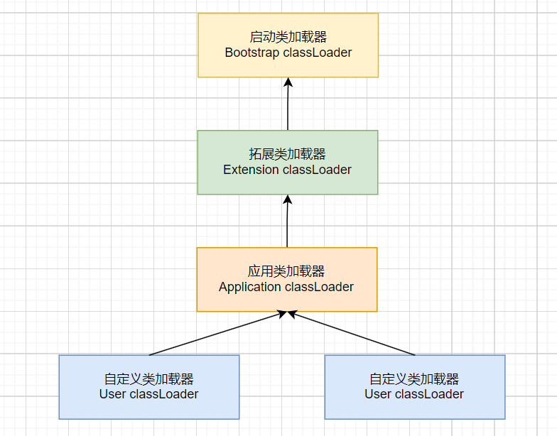
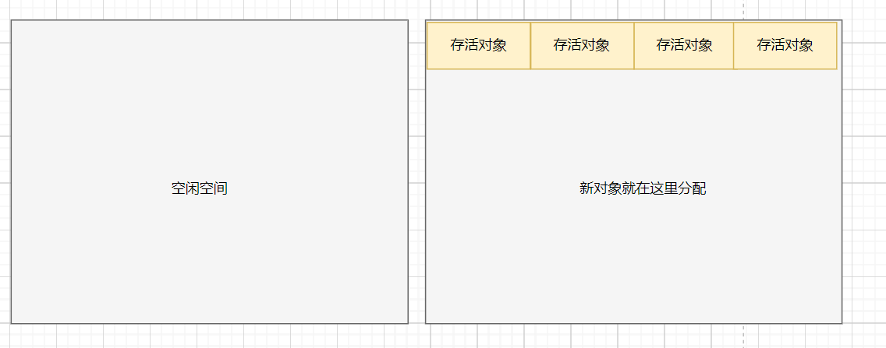
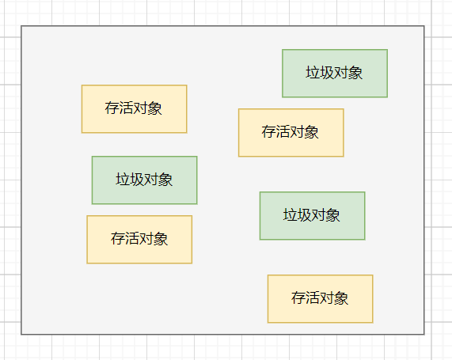
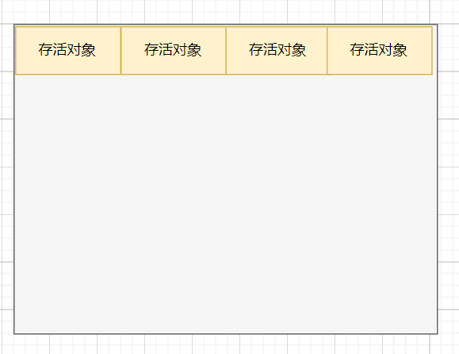
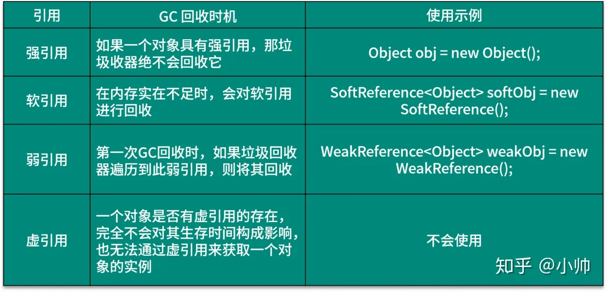
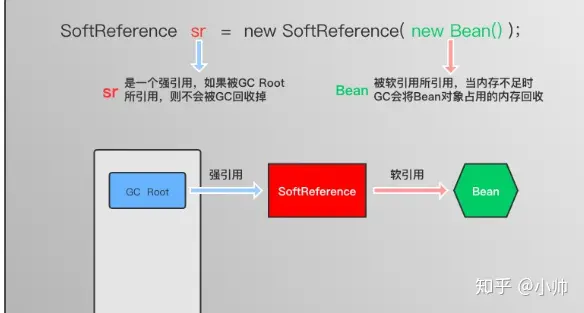

# Java面试题

## JVM

###### 哪种情况会导致持久区jvm堆内存溢出？

Java中堆内存分为两部分，分别是permantspace和heap space。permantspace（持久区）主要存放的是Java类定义信息，与垃圾收集器要收集的Java对象关系不大。持久代溢出通常由于持久代设置过小，动态加载了大量Java类，因此C选项正确。

heap space分为年轻代和年老代， 年老代常见的内存溢出原因有循环上万次的字符串处理、在一段代码内申请上百M甚至上G的内存和创建成千上万的对象。

### JVM的运行时内存区域是怎样的？

根据Java虚拟机规范的定义，JVM的运行时内存区域主要由Java堆、虚拟机栈、本地方法栈、方法区和程序计数器以及运行时常量池组成。其中堆、方法区以及运行时常量池是线程之间共享的区域，而栈（本地方法栈+虚拟机栈）、程序计数器都是线程独享的。

需要注意的是，上面的这6个区域，是虚拟机规范中定义的，但是在具体的实现上，不同的虚拟机，甚至是同一个虚拟机的不同版本，在实现细节上也是有区别的。


程序计数器：一个只读的存储器，用于记录Java虚拟机正在执行的字节码指令的地址。它是线程私有的，为每个线程维护一个独立的程序计数器，用于指示下一条将要被执行的字节码指令的位置。它保证线程执行一个字节码指令以后，才会去执行下一个字节码指令。

Java虚拟机栈：一种线程私有的存储器，用于存储Java中的局部变量。根据Java虚拟机规范，每次方法调用都会创建一个栈帧，该栈帧用于存储局部变量，操作数栈，动态链接，方法出口等信息。当方法执行完毕之后，这个栈帧就会被弹出，变量作用域就会结束，数据就会从栈中消失。

本地方法栈：本地方法栈是一种特殊的栈，它与Java虚拟机栈有着相同的功能，但是它支持本地代码（ Native Code ）的执行。本地方法栈中存放本地方法（ Native Method ）的参数和局部变量，以及其他一些附加信息。这些本地方法一般是用C等本地语言实现的，虚拟机在执行这些方法时就会通过本地方法栈来调用这些本地方法。

Java堆：是存储对象实例的运行时内存区域。它是虚拟机运行时的内存总体的最大的一块，也一直占据着虚拟机内存总量的一大部分。Java堆由Java虚拟机管理，用于存放对象实例，是几乎所有的对象实例都要在上面分配内存。此外，Java堆还用于垃圾回收，虚拟机发现没有被引用的对象时，就会对堆中对象进行垃圾回收，以释放内存空间。

方法区：用于存储已被加载的类信息、常量、静态变量、即时编译后的代码等数据的内存区域。每加载一个类，方法区就会分配一定的内存空间，用于存储该类的相关信息，这部分空间随着需要而动态变化。方法区的具体实现形式可以有多种，比如堆、永久代、元空间等。

运行时常量池：是方法区的一部分。用于存储编译阶段生成的信息，主要有字面量和符号引用常量两类。其中符号引用常量包括了类的全限定名称、字段的名称和描述符、方法的名称和描述符。

#### OutOfMemory

OutOfMemory 是内存溢出错误，他通常发生在程序试图分配内存时，但是超出可用内存限制。这可能是因为程序使用了太多内存，或者由于内存泄漏而导致内存不断累积。具体产生情况分成以下几类：

1. java Heap Space：这是最常见的OutOfMemoryError。它发生在Java堆内存不足，通常由程序中创建的对象过多或者单个对象太大引起。这种错误可能导致Java应用程序崩溃。

2. PermGen Space（在Java 7之前）或 Metaspace（在Java 8及更高版本）：这种错误发生在永久代（Java 7之前）或元空间（Java 8及更高版本）不足。通常由于加载过多的类或创建过多的动态代理类等原因引起。

3. Native Heap：这种错误发生在本机堆内存不足。Java虚拟机使用本机代码（native code）来执行某些操作，如本机方法，这些操作可能会占用本机堆内存。

4. Direct Memory：这种错误发生在程序使用NIO（New I/O）库或直接内存缓冲区时，由于分配了过多的直接内存而耗尽。

5. GC Overhead Limit Exceeded：这个错误发生在垃圾收集器花费了太多时间进行垃圾回收，而没有足够的内存被释放。这通常是由于内存不足以满足垃圾收集需求而引起的。

6. Requested array size exceeds VM limit：这个错误发生在试图创建一个太大的数组，超过了虚拟机的限制。

7. Unable to create new native thread：这个错误发生在虚拟机无法创建更多的本机线程，通常由于操作系统限制引起。

#### StackOverflow

StackOverflow 是栈溢出错误，他通常发生在程序的调用栈变得过深时，如递归调用。每次函数调用都会在栈上分配一些内存，当递归调用或者函数调用层次过深时，栈空间会被耗尽，从而导致StackOverflowError。

### 类的生命周期是怎么样的？

一个类从诞生到卸载，大体分为如下几步：


大的阶段可以分为类的加载、类的使用、以及类的卸载。

其中类的加载阶段又分为加载、连接、初始化。其中连接过程又包含了验证、准备和解析。

#### 加载阶段

查找并加载类的二进制数据(网络，jar包，运行时生成等)。将类的.class文件中的二进制数据读入内存中，将其放在方法区中，然后创建一个java.lang.Class对象（存放在堆中）用来封装类在方法区的数据结构

#### 连接阶段

在链接阶段，Java类加载器对类进行验证、准备和解析操作。将类与类的关系（符号引用转为直接引用）确定好，校验字节码

1. 验证：校验类的正确性（文件格式，元数据，字节码，二进制兼容性）

2. 准备：为类的静态变量分配内存，将其初始化为默认值。但是在到达初始化之前，类变量都没有初始化为真正的初始值。当然，对于final修饰的变量来说，会在此时就被初始化为指定值

3. 解析：把类的符号引用转为直接引用(类或接口、字段、类方法、接口方法、方法类型、方法句柄和访问控制修饰符7类符号引用 )

#### 初始化阶段

初始化是类加载的最后一步，也是真正执行类中定义的 Java 程序代码(字节码)，初始化阶段是执行类构造器\<clinit> ()方法的过程。这里利用了一种懒加载的思想，所有Java虚拟机实现必须在每个类或接口被Java程序首次主动使用才初始化，但类加载不一定，静态代码块在类初始化时执行：

1. 当遇到 new 、 getstatic、putstatic或invokestatic 这4条字节码指令时，比如 new 一个类，读取一个静态字段(未被 final 修饰)、或调用一个类的静态方法时

2. 使用 java.lang.reflect 包的方法对类进行反射调用时 ，如果类没初始化，需要触发其初始化

3. 初始化一个类，如果其父类还未初始化，则先触发该父类的初始化

4. 当虚拟机启动时，用户需要定义一个要执行的主类 (包含 main 方法的那个类)，虚拟机会先初始化这个类

5. 当使用 JDK1.7 的动态语言时，如果一个 MethodHandle 实例的最后解析结构为 REF_getStatic、REF_putStatic、REF_invokeStatic、的方法句柄，并且这个句柄没有初始化，则需要先触发器初始化

#### 什么是符号引用和直接引用

符号引用（Symbolic Reference）是一种用来表示引用目标的符号名称，比如类名、字段名、方法名等。符号引用与实际的内存地址无关，只是一个标识符，用于描述被引用的目标，类似于变量名。符号引用是在编译期间产生的，在编译后的class文件中存储。

直接引用（Direct Reference）是实际指向目标的内存地址，比如类的实例、方法的字节码等。直接引用与具体的内存地址相关，是在程序运行期间动态生成的。

假设有两个类A和B，其中A类中有一个成员变量x，B类中有一个方法foo，其中会调用A类中的成员变量x：

```java
public class A {
    public int x;
}

public class B {
    public void foo() {
        A a = new A();
        a.x = 10;
        System.out.println("x = " + a.x);
    }
}
```

在B类中调用A类的成员变量x时，实际上是通过符号引用来引用A类中的x变量。在解析阶段，Java虚拟机会将A类中的符号引用转换为直接引用，定位到具体的x变量实现，并为B类生成一条指令，用于获取该变量的内存地址。

假设A类的x变量的内存地址为0x1000，在解析阶段，Java虚拟机会为B类生成一条指令，用于获取x变量的内存地址，比如：

getstatic 0x1000

这条指令会将0x1000作为直接引用，用于访问A类中的x变量。

也就是说，在类的解析阶段进行时，Java虚拟机会根据符号引用定位到具体的内存地址，并生成一条指令，用于访问该内存地址。

#### 类使用过程

类的使用，即是类在加载完毕后，会有代码段来引用该类，如初始化该类的对象，或者通过反射获取该类的元数据。

#### 类卸载过程

假如说该类满足下面2个条件：

1. 该类所有的实例都已被GC回收。

2. 该类的ClassLoader已经被GC回收。

那么该类会在FULLGC期间从方法区被回收掉。

这个时候，我们需要明白一个问题，我们知道，JVM自带的类加载器因为需要一直加载基础对象，所以JDK自带的基础类是一定不会被回收掉的，那么会有哪些类会被回收掉呢？

答案就是那些自定义类加载器一些场景的类会被回收掉，如tomcat，SPI，JSP等临时类，是存活不久的，所以需要来不断回收。

需要注意的是，Java虚拟机并不会在程序运行过程中频繁地卸载类，因为类卸载是一个比较耗时的操作，会影响程序的性能。通常情况下，Java虚拟机会在需要释放内存空间时才会对不再使用的类进行卸载。

另外，Java SE 9引入了一个新的特性，即“模块化”，通过模块化可以对Java类进行更加精细的控制，包括对类的卸载。在模块化环境下，如果一个模块中的类不再被引用，那么这个模块就可以被卸载。模块化可以使Java应用程序更加安全、可靠和可维护。

### Java中的类什么时候会被加载？

Java中的类在以下几种情况中会被加载：

1. 当创建类的实例时，如果该类还没有被加载，则会触发类的加载。例如，通过关键字new创建一个类的对象时，JVM会检查该类是否已经加载，如果没有加载，则会调用类加载器进行加载。

2. 当使用类的静态变量或静态方法时，如果该类还没有被加载，则会触发类的加载。例如，当调用某个类的静态方法时，JVM会检查该类是否已经加载，如果没有加载，则会调用类加载器进行加载。

3. 当使用反射机制访问类时，如果该类还没有被加载，则会触发类的加载。例如，当使用Class.forName()方法加载某个类时，JVM会检查该类是否已经加载，如果没有加载，则会调用类加载器进行加载。

4. 当JVM启动时，会自动加载一些基础类，例如java.lang.Object类和java.lang.Class类等。

总之，Java中的类加载其实是延迟加载的，除了一些基础的类以外，其他的类都是在需要使用类时才会进行加载。同时，Java还支持动态加载类，即在运行时通过程序来加载类，这为Java程序带来了更大的灵活性。

#### Java在类的加载步骤中做了哪些操作

对于Java自带的类加载器来说，当一个类被加载的时候，需要用到类加载器将类从外部加载到Jvm的内存当中，如下代码所示：

```java
protected Class<?> loadClass(String name, boolean resolve) throws ClassNotFoundException {
    synchronized (getClassLoadingLock(name)) {
        // 查询该类是否被加载过
        Class<?> c = findLoadedClass(name);
        // 如果没有
        if (c == null) {
            long t0 = System.nanoTime();
            try {
                // 委派父类加载器加载
                if (parent != null) {
                    c = parent.loadClass(name, false);
                // 对于bootstap类加载器来说，他是没有父加载器的，所以用bootstrap加载该类
                } else {
                    c = findBootstrapClassOrNull(name);
                }
            } catch (ClassNotFoundException e) {
                // ClassNotFoundException thrown if class not found
                // from the non-null parent class loader
            }

            // 如果还没加载到，说明此类的二进制文件还没有定位到，需要使用自己的类加载器
            if (c == null) {
                // 使用自定义的加载方式
                c = findClass(name);

                // 省略...
            }
        }
        // 省略...
        return c;
    }
}
```

那么最后一步的findClass是什么意思呢？我们可以通过JDK8的classLoader源码的注释中发现这么一个例子：

```java
class NetworkClassLoader extends ClassLoader {
  String host;
  int port;

  public Class findClass(String name) {
      byte[] b = loadClassData(name);
      return defineClass(name, b, 0, b.length);
  }

  private byte[] loadClassData(String name) {
      // load the class data from the connection
       . . .
  }
}
```

再结合ClassLoader#findClass是protect的且为空实现，所以我们可以发现，findClass的作用就是给子类去加载其他二进制文件使用的，同时，还应该调用ClassLoader#defineClass去将二进制文件加载为Class类 

通过上面的代码，我们可以发现如下几个步骤：

1. 缓存思想，如果该类已经被加载过，则不加载

2. 使用双亲委派模型，对该类进行加载

3. 如果通过CLASSPATH找不到该类的定义，则会通过findClass让子类自定义的去获取类定义的二进制文件

4. 然后通过defineClass将二进制文件加载为类

#### 类加载的过程线程安全吗

是线程安全的，如上文所示，在loadClass方法中，是被synchronized加了锁的

#### 数组是怎么被加载的？

首先我们要明白，数组也是一种类，而不是基本数据类型。所以数组也和其他正常的类一样，需要被加载。

但是，Java规范中有如下表示：

> Class objects for array classes are not created by class loaders, but are created automatically as required by the Java runtime. The class loader for an array class, as returned by Class.getClassLoader() is the same as the class loader for its element type; if the element type is a primitive type, then the array class has no class loader.

翻译过来就是：

数组类的类对象不是由类加载器创建的，而是根据 Java 运行时的要求自动创建的。 Class.getClassLoader()返回的数组类的类加载器与其元素类型的类加载器相同；如果元素类型是原始类型，则数组类没有类加载器。

此时我们可以知道，数组不通过类加载器加载，而是根据 Java 运行时的要求自动创建的。如果元素类型是原始类型，则数组类没有类加载器。

### 什么是双亲委派？如何破坏？

下图中展示的类加载器之间的这种层次关系，称为类加载器的双亲委派模型（Parents Delegation Model）。
双亲委派模型要求除了顶层的启动类加载器外，其余的类加载器都应当有自己的父类加载器。这里类加载器之间的父子关系一般不会以继承（Inheritance）的关系来实现，而是都使用组合（Composition）关系来复用父加载器的代码。



双亲委派模型的工作过程是：如果一个类加载器收到了类加载的请求，它首先不会自己去尝试加载这个类，而是把这个请求委派给父类加载器去完成，每一个层次的类加载器都是如此，因此所有的加载请求最终都应该传送到顶层的启动类加载器中，只有当父加载器反馈自己无法完成这个加载请求（它的搜索范围中没有找到所需的类）时，子加载器才会尝试自己去加载。

双亲委派模型对于保证Java程序的稳定运作很重要，但它的实现却非常简单，实现双亲委派的代码都集中在java.lang.ClassLoader的loadClass()方法之中，代码简单，逻辑清晰易懂：先检查类是否已经被加载过，若没有加载则调用父加载器的loadClass()方法，若父加载器为空则默认使用启动类加载器作为父加载器。如果父类加载失败，抛出ClassNotFoundException异常后，再调用自己的findClass()方法进行加载。

双亲委派模型主要是由ClassLoader#loadClass实现的，我们只需要自定义类加载器，并且重写其中的loadClass方法，即可破坏双亲委派模型。

#### JAVA有哪几种默认的类加载器

从Java虚拟机的角度来讲，只存在两种不同的类加载器：一种是启动类加载器（Bootstrap ClassLoader），这个类加载器使用C++语言实现（只限于HotSpot），是虚拟机自身的一部分；

另一种就是所有其他的类加载器，这些类加载器都由Java语言实现，独立于虚拟机外部，并且全都继承自抽象类java.lang.ClassLoader。

从Java开发人员的角度来看，类加载器还可以划分得更细致一些，绝大部分Java程序都会使用到以下3种系统提供的类加载器。

1. 启动类加载器（Bootstrap ClassLoader）： 这个类加载器负责将存放在＜JAVA_HOME＞\lib目录中的，或者被-Xbootclasspath参数所指定的路径中的，并且是虚拟机识别的（仅按照文件名识别，如rt.jar，名字不符合的类库即使放在lib目录中也不会被加载）类库加载到虚拟机内存中。启动类加载器无法被Java程序直接引用，用户在编写自定义类加载器时，如果需要把加载请求委派给引导类加载器，那直接使用null代替即可

2. 扩展类加载器（Extension ClassLoader）： 这个加载器由sun.misc.Launcher$ExtClassLoader实现，它负责加载＜JAVA_HOME＞\lib\ext目录中的，或者被java.ext.dirs系统变量所指定的路径中的所有类库，开发者可以直接使用扩展类加载器。

3. 应用程序类加载器（Application ClassLoader）： 这个类加载器由sun.misc.Launcher$App-ClassLoader实现。由于这个类加载器是ClassLoader中的getSystemClassLoader()方法的返回值，所以一般也称它为系统类加载器。它负责加载用户类路径（ClassPath）上所指定的类库，开发者可以直接使用这个类加载器，如果应用程序中没有自定义过自己的类加载器，一般情况下这个就是程序中默认的类加载器。

#### 为什么需要双亲委派模型

使用双亲委派模型来组织类加载器之间的关系，有一个显而易见的好处就是Java类随着它的类加载器一起具备了一种带有优先级的层次关系。例如类java.lang.Object，它存放在rt.jar之中，无论哪一个类加载器要加载这个类，最终都是委派给处于模型最顶端的启动类加载器进行加载，因此Object类在程序的各种类加载器环境中都是同一个类。

相反，如果没有使用双亲委派模型，由各个类加载器自行去加载的话，如果用户自己编写了一个称为java.lang.Object的类，并放在程序的ClassPath中，那系统中将会出现多个不同的Object类，Java这些核心类的API就会被随意篡改，应用程序也将会变得一片混乱。

使用不同的类加载器加载相同全路径的类，JVM中将会存在两个相同的类。当判断这两个类是否相等时，会得到不等的结果。

#### loadClass和findClass

findClass用于重写类加载逻辑、loadClass方法的逻辑里如果父类加载器加载失败则会调用自己的findClass方法完成加载，保证了双亲委派规则。

1. 如果不想打破双亲委派模型，那么只需要重写findClass方法即可

2. 如果想打破双亲委派模型，那么就重写整个loadClass方法

#### 有哪些破坏双亲委派的例子

##### 向前兼容

由于双亲委派模型是在JDK1.2之后才被引入的，而类加载器和抽象类java.lang.ClassLoader则是JDK1.0时候就已经存在，面对已经存在的用户自定义类加载器的实现代码，Java设计者引入双亲委派模型时不得不做出一些妥协。

为了向前兼容，JDK1.2之后的java.lang.ClassLoader添加了一个新的proceted方法findClass()，在此之前，用户去继承java.lang.ClassLoader的唯一目的就是重写loadClass()方法，因为虚拟机在进行类加载的时候会调用加载器的私有方法loadClassInternal()，而这个方法的唯一逻辑就是去调用自己的loadClass()。

JDK1.2之后已不再提倡用户再去覆盖loadClass()方法，应当把自己的类加载逻辑写到findClass()方法中，在loadClass()方法的逻辑里，如果父类加载器加载失败，则会调用自己的findClass()方法来完成加载，这样就可以保证新写出来的类加载器是符合双亲委派模型的。

##### SPI实现

双亲委派模型很好地解决了各个类加载器的基础类统一问题(越基础的类由越上层的加载器进行加载)，基础类之所以被称为“基础”，是因为它们总是作为被调用代码调用的API。但是，如果基础类又要调用用户的代码，那该怎么办呢。

这并非是不可能的事情，一个典型的例子便是JNDI服务，它的代码由启动类加载器去加载(在JDK1.3时放进rt.jar)，但JNDI的目的就是对资源进行集中管理和查找，它需要调用独立厂商实现部部署在应用程序的classpath下的JNDI接口提供者(SPI, Service Provider Interface)的代码，但启动类加载器不可能“认识”这些代码。

为了解决这个困境，Java设计团队只好引入了一个不太优雅的设计：线程上下文类加载器(Thread Context ClassLoader)。这个类加载器可以通过java.lang.Thread类的setContextClassLoader()方法进行设置，如果创建线程时还未设置，它将会从父线程中继承一个；如果在应用程序的全局范围内都没有设置过，那么这个类加载器默认就是应用程序类加载器。

有了线程上下文类加载器，JNDI服务使用这个线程上下文类加载器去加载所需要的SPI代码，也就是父类加载器请求子类加载器去完成类加载动作，这种行为实际上就是打通了双亲委派模型的层次结构来逆向使用类加载器，已经违背了双亲委派模型，但这也是无可奈何的事情。

Java中所有涉及SPI的加载动作基本上都采用这种方式，例如JNDI,JDBC,JCE,JAXB和JBI等。

##### TOMCAT

**一个web容器可能需要部署多个应用程序，不同的应用程序可能会依赖同一个第三方类库的不同版本，但是不同版本的类库中某一个类的全路径名可能是一样的，如果采用默认的类加载机制，那么就会无法加载多个相同的类。**

所以，TOMCAT需要有隔离的机制，为每个web容器单独提供一个WebAppClassLoader加载器。

Tomcat 为了实现隔离性，优先加载 Web 应用自己定义的类，所以没有遵照双亲委派的约定，每一个应用自己的类加载器——WebAppClassLoader负责加载本身的目录下的class文件，加载不到时再交给CommonClassLoader加载，这和双亲委派刚好相反。

##### 模块化

我们通过之前的文章了解到，一个类想要被卸载，必须要其ClassLoader的实例也要被GC，所以在热插拔，热部署，模块化的时候，即是添加一个功能或减去一个功能不用重启，只需要把这模块连同类加载器一起换掉就实现了代码的热替换。

譬如对于JDK9来说，它已经支持了模块化的机制，它不会直接委派给父类加载器实现，而是按照模块的维度来划分类加载器，只有模块中找不到该类，才会采用双亲委派机制。源码如下：

```java
Class<?> c = findLoadedClass(cn);
if (c == null) {
    // 找到当前类属于哪个模块
    LoadedModule loadedModule = findLoadedModule(cn);
    if (loadedModule != null) {
        //获取当前模块的类加载器
        BuiltinClassLoader loader = loadedModule.loader();
        //进行类加载
        c = findClassInModuleOrNull(loadedModule, cn);
     } else {
          // 找不到模块信息才会进行双亲委派
            if (parent != null) {
              c = parent.loadClassOrNull(cn);
            }
      }
}
```

#### 如何判断JVM中类和其他类是不是同一个类？

类加载器虽然只用于实现类的加载动作，但它在Java程序中起到的作用却远远不限于类加载阶段。对于任意一个类，都需要由加载它的类加载器和这个类本身一同确立其在Java虚拟机中的唯一性，每一个类加载器，都拥有一个独立的类名称空间。

简单点说：比较两个类是否“相等”，只有在这两个类是由同一个类加载器加载的前提下才有意义，否则，即使这两个类来源于同一个Class文件，被同一个虚拟机加载，只要加载它们的类加载器不同，那这两个类就必定不相等。

### 如何进行JVM调优？

JVM调优是一个过程，而不是一个具体的动作，是需要不断的根据实际的业务情况，根据实际的应用情况进行不断的调整和优化的。不同的应用之间的配置和优化手段也完全不同。

在做JVM调优的时候，首先就是需要监控、分析你的JVM的情况，然后才是真正的调整和优化，JVM的监控可以用到以下工具：

1. jps：JDK 1.5提供的一个显示当前所有java进程pid的命令，简单实用，非常适合在linux/unix平台上简单察看当前java进程的一些简单情况。

2. jstack：Java虚拟机自带的命令行工具，主要用于生成线程的堆栈信息，用于诊断死锁及线程阻塞等问题。

3. jmap：Java虚拟机自带的命令行工具，可以生成JVM中堆内存的Dump文件，用于分析堆内存的使用情况。排查内存泄漏等问题。

4. jstat：Java虚拟机自带的命令行工具，主要用来监控JVM中的类加载、GC、线程等信息。

5. jhat：使用jmap可以生成Java堆的Dump文件，生成dump文件之后就可以用jhat命令，将dump文件转成html的形式，然后通过http访问可以查看堆情况。

6. JConsole：一个基于JMX（Java Management Extensions）的监控工具，可以用来监视JVM中的内存、线程、GC等信息，并可以执行一些诊断和故障排除任务。

7. VisualVM：一个基于NetBeans平台的可视化工具，可以监视本地和远程JVM进程的性能和资源使用情况，包括CPU、内存、线程、GC等信息，并可以进行故障排除和性能分析。

8. YourKit：一个商业的JVM分析工具，可以进行内存、CPU、线程等方面的分析，提供了一些高级功能如内存泄漏检测、代码热替换等。

9. JProfiler：一个商业的JVM分析工具，可以监视JVM中的内存、线程、GC等信息，并提供一些高级功能如代码分析、内存泄漏检测等。

10. Arthas：Arthas 是Alibaba开源的Java诊断工具，非常强大，非常推荐，

在做JVM调整和优化的时候，可以真正实践做的一些手段：

1. 调整堆内存：JVM默认的最大堆内存大小是物理内存的1/4，可以通过在启动参数中增加-Xmx选项来增加堆内存大小。

2. 调整垃圾收集器：可以通过设置不同的垃圾收集器来改善应用程序的性能，如使用并行收集器（-XX:+UseParallelGC）或CMS收集器（-XX:+UseConcMarkSweepGC）、G1等。

3. 设置新生代和老年代的比例：默认情况下，新生代和老年代的比例是1:2，可以根据应用程序的需求调整这个比例。

4. 调整GC线程数：可以通过设置线程数来优化应用程序的性能，如使用-XX:ParallelThreads参数来设置并行垃圾收集器的线程数。

5. 使用合适的GC算法：可以根据应用程序的需求选择不同的GC算法，如G1（Garbage First）收集器，可以更好地处理大堆内存的应用程序。

6. 减少对象创建：对象的创建和回收是JVM中的一个开销，因此可以通过减少对象的创建来降低JVM的开销。

7. 使用合适的数据结构和算法：选择合适的数据结构和算法可以降低应用程序的内存和CPU使用量，从而提高性能。

### JVM有哪些垃圾回收算法？

#### 标记-清除

标记清除是最简单和干脆的一种垃圾回收算法，他的执行流程是这样子的：当 JVM 识别出内存中的垃圾以后，直接将其清除，但是这样有一个很明显的缺点，就是会导致内存空间的不连续，也就是会产生很多的内存碎片。先画个图来看下


我们使用上图左边的图来表示垃圾回收之前的样子，黑色的区域表示可以被回收的垃圾对象。这些对象在内存空间中不是连续的。右侧这张图表示是垃圾回收过后的内存的样子。可以很明显的看到里面产生了断断续续的 内存碎片。

那说半天垃圾不是已经被回收了吗？内存碎片就内存碎片呗。又能咋地？

好，我来这么告诉你，现在假设这些内存碎片所占用的空间之和是1 M，现在新创建了一个对象大小就是 1 M，但是很遗憾的是，此时内存空间虽然加起来有 1 M，但是并不是连续的，所以也就无法存放这大对象。也就是说这样势必会造成内存空间的浪费，这就是内存碎片的危害。

比方说其中的1M空间其实依然是可用的，只不过它只能存放<=1M的对象，但是再出现大小完全一模一样的对象是概率很低的事情，即使出现了也并不一定被刚好分配到这段空间上，所以这1M很大概率会被分配给一个<1M的对象，或许只会被利用999K或者1020K或者任意K，剩下的那一点点就很难再被利用了，这才形成了碎片。


这么一说标记-清除就没有优点了吗？优点还是有的：速度快

到此，我们来对标记-清除来做一个简单的优缺点小结：

- 优点
  
  - 速度快，因为不需要移动和复制对象

- 缺点
  
  - 会产生内存碎片，造成内存的浪费

#### 标记-复制

上面的清除算法真的太差劲了。都不管后来人能不能存放的下，就直接啥也不管的去清除对象。所以升级后就来了复制算法。

复制算法的工作原理是这样子的：首先将内存划分成两个区域。新创建的对象都放在其中一块内存上面，当快满的时候，就将标记出来的存活的对象复制到另一块内存区域中（注意：这些对象在在复制的时候其内存空间上是严格排序且连续的），这样就腾出来一那一半就又变成了空闲空间了。依次循环运行。


在回收前将存活的对象复制到另一边去。然后再回收垃圾对象，回收完就类似下面的样子：



如果再来新对象被创建就会放在右边那块内存中，当内存满了，继续将存活对象复制到左边，然后清除掉垃圾对象。

标记-复制算法的明显的缺点就是：浪费了一半的内存，但是优点是不会产生内存碎片。所以我们再做技术的时候经常会走向一个矛盾点地方，那就是：一个新的技术的引入，必然会带来新的问题。

到这里我们来简单小结下标记-复制算法的优缺点：

- 优点
  
  - 内存空间是连续的，不会产生内存碎片

- 缺点
  
  - 浪费了一半的内存空间
  - 复制对象会造成性能和时间上的消耗

说到底，似乎这两种垃圾回收回收算法都不是很好。而且在解决了原有的问题之后，所带来的新的问题也是无法接受的。所以又有了下面的垃圾回收算法。

#### 标记-整理

标记-整理算法是结合了上面两者的特点进行演化而来的。具体的原理和执行流程是这样子的：我们将其分为2个阶段：第一阶段为标记；第二阶段为整理；

标记：它的第一个阶段与标记-清除算法是一模一样的，均是遍历 GC Roots，然后将存活的对象标记。

整理：移动所有存活的对象，且按照内存地址次序依次排列，然后将末端内存地址以后的内存全部回收。因此，第二阶段才称为整理阶段。

我们是画图说话，下面这张图是垃圾回收前的样子。



下图图表示的第一阶段：标记出存活对象和垃圾对象


白色空间表示被清理后的垃圾。
下面就开始进行整理：



可以看到，现在即没有内存碎片，也没有浪费内存空间。

但是这就完美了吗？他在标记和整理的时候会消耗大量的时间（微观上）。但是在大厂那种高并发的场景下，这似乎有点不尽如人意。

到此，我们将标记-整理的优缺点整理如下：

- 优点
  
  - 内存空间是连续的，不会产生内存碎片

- 缺点
  
  - 太耗时间（性能低）

到此为止，我们已经了知道了标记-清除、标记-复制、标记-整理三大垃圾回收算法的优缺点。

单纯的从时间长短上面来看：标记-清除 < 标记-复制 < 标记-整理。

单纯从结果来看：标记-整理 > 标记-复制 >= 标记-清除

### 新生代和老年代的GC算法

三种垃圾回收算法，标记复制、标记清除、标记整理中，比较适合新生代的算法是标记复制算法。因为对于新生代来说，一般来说GC的次数是要比老年代高很多的，所以需要一个效率更高的算法，而且最好不要有碎片，因为很多对象都是需要先在新生代分配空间的，如果碎片太多的话，那么就会导致很多对象无法正常分配了。

所以，新生代选择了标记复制算法进行垃圾回收，但是标记复制算法存在一个缺点就是会浪费空间，新生代为了解决这个问题，把区域进一步细分成一个Eden区和两个Survivor区，同时工作的只有一个Eden区+一个Survivor区，这样，另外一个Survivor主要用来复制就可以了。只需要动态的调整Eden区和Survivor区的比例就可以降低空间浪费的问题。

对于老年代来说，通常会采用标记整理算法，虽然效率低了一点，但是可以减少空间的浪费并且不会有空间碎片等问题。在有些回收器上面，如CMS，为了降低STW的时长，也会采用标记清除算法。

### Java的堆是如何分代的？为什么分代？

Java的堆内存分代是指将不同生命周期的堆内存对象存储在不同的堆内存区域中，这里的不同的堆内存区域被定义为“代”。这样做有助于提升垃圾回收的效率，因为这样的话就可以为不同的"代"设置不同的回收策略。

一般来说，Java中的大部分对象都是朝生夕死的，同时也有一部分对象会持久存在。因为如果把这两部分对象放到一起分析和回收，这样效率实在是太低了。通过将不同时期的对象存储在不同的内存池中，就可以节省宝贵的时间和空间，从而改善系统的性能。

Java的堆由新生代（Young Generation）和老年代（Old Generation）组成。新生代存放新分配的对象，老年代存放长期存在的对象。

新生代（Young）由年轻区（Eden）、Survivor区组成（From Survivor、To Survivor）。默认情况下，新生代的Eden区和Survivor区的空间大小比例是8:2，可以通过-XX:SurvivorRatio参数调整。


很多对象都会出现在Eden区，当Eden区的内存容量用完的时候，GC会发起，非存活对象会被标记为死亡，存活的对象被移动到Survivor区。如果Survivor的内存容量也用完，那么存活对象会被移动到老年代。

老年代（Old）是对象存活时间最长的部分，它由单一存活区（Tenured）组成，并且把经历过若干轮GC回收还存活下来的对象移动而来。在老年代中，大部分对象都是活了很久的，所以GC回收它们会很慢。

#### Java的对象分代回收过程

- 绝大多数刚刚被创建的对象会存放在 Eden 区。
- 当 `Eden` 区第一次满的时候，会进行垃圾回收。首先将 `Eden` 区的垃圾对象回收清除，并将存活的对象复制到 `From Survivor`，此时 `To Survivor` 是空的。
- 下一次 `Eden` 区满时，再执行一次垃圾回收。此次会将 `Eden` 和 `From Survivor` 区中所有垃圾对象清除，并将存活对象复制到 `To Survivor`，此时 `From Survivor` 变为空。
- 如此反复在 `From Survivor` 和 `To Survivor` 之间切换几次（默认 15 次）之后，如果还有存活对象。说明这些对象的生命周期较长，则将它们转移到老年代中。

> **注意**：对于老年代可能存在这么一种情况，老年代中的对象有时候会引用到新生代对象。这时如果要执行新生代 GC，则可能需要查询整个老年代上可能存在引用新生代的情况，这显然是低效的。所以，老年代中维护了一个 512 byte 的 `card table`，所有老年代对象引用新生代对象的信息都记录在这里。每当新生代发生 GC 时，只需要检查这个 `card table` 即可，大大提高了性能。

### GC分类

新生代和老年代所进行的GC是有区别的：

- 新生代 GC：这一区域的 GC 叫作 Minor GC。因为 Java 对象大多都具备朝生夕灭的特性，所以 Minor GC 非常频繁，一般回收速度也比较快。
- 老年代 GC：发生在这一区域的 GC 也叫作 Major GC 或者 Full GC。当出现了 Major GC，经常会伴随至少一次的 Minor GC。

> 注意：在有些虚拟机实现中，`Major GC` 和 `Full GC` 还是有一些区别的。`Major GC` 只是代表回收老年代的内存，而 `Full GC` 则代表回收整个堆中的内存，也就是新生代 + 老年代。

### 对象的分代晋升

一般情况下，对象将在新生代进行分配，首先会尝试在Eden区分配对象，当Eden内存耗尽，无法满足新的对象分配请求时，将触发新生代的GC(Young GC、MinorGC)，在新生代的GC过程中，没有被回收的对象会从Eden区被搬运到Survivor区，这个过程通常被称为"晋升"。如果对象比较大（比如长字符串或者大数组），并且新生代的剩余空间不足，则这个大对象会直接被分配到老年代上。

同样的，对象也可能会晋升到老年代，触发条件主要看对象的大小和年龄。对象进入老年代的条件有三个，满足一个就会进入到老年代：

1. 躲过15次GC。每次垃圾回收后，存活的对象的年龄就会加1，累计加到15次（jdk8默认的），也就是某个对象躲过了15次垃圾回收，那么JVM就认为这个是经常被使用的对象，就没必要再待在年轻代中了。具体的次数可以通过 -XX:MaxTenuringThreshold 来设置在躲过多少次垃圾收集后进去老年代。

2. 动态对象年龄判断。规则：如果在Survivor空间中小于等于某个年龄的所有对象大小的总和大于Survivor空间的一半时，那么就把大于等于这个年龄的对象都晋升到老年代。

3. 大对象直接进入老年代。-XX:PretenureSizeThreshold 来设置大对象的临界值，大于该值的就被认为是大对象，就会直接进入老年代。

针对上面的三点来逐一分析。

#### 动态年龄判断

为了能更好地适应不同程序的内存状况，HotSpot虚拟机并不是永远要求对象的年龄必须达到- XX:M axTenuringThreshold才能晋升老年代，他还有一个动态年龄判断的机制。

JVM中，动态年龄判断的代码如下：

```cpp
uint ageTable::compute_tenuring_threshold(size_t survivor_capacity) {

  size_t desired_survivor_size = (size_t)((((double) survivor_capacity)*TargetSurvivorRatio)/100);
  size_t total = 0;
  uint age = 1;
  while (age < table_size) {
    total += sizes[age];
    if (total > desired_survivor_size) break;
    age++;
  }
  uint result = age < MaxTenuringThreshold ? age : MaxTenuringThreshold;
    ...
}
```

它的过程是从年龄小的对象开始，不断地累加对象的大小，当年龄达到N时，刚好达到TargetSurvivorRatio这个阈值，那么就把所有年龄大于等于N的对象全部晋升到老年代去！

所以，这过程应该是这样的：

如果在Survivor空间中小于等于某个年龄的所有对象大小的总和大于Survivor空间的一半时，那么就把大于等于这个年龄的对象都晋升到老年代。

#### Survivor不够怎么办？

在YoungGC之后，如果存活的对象所需要的空间比Survivor区域的空间大怎么办呢？毕竟一块Survivor区域的比例只是年轻的10%而已。

这时候就需要把对象移动到老年代。

#### 空间分配担保机制

如果Survivor区域的空间不够，就要分配给老年代，也就是说，老年代起到了一个兜底的作用。但是，老年代也是可能空间不足的。所以，在这个过程中就需要做一次空间分配担保（CMS）：

在每一次执行YoungGC之前，虚拟机会检查老年代最大可用的连续空间是否大于新生代所有对象的总空间。

如果大于，那么说明本次Young GC是安全的。

如果小于，那么虚拟机会查看HandlePromotionFailure 参数设置的值判断是否允许担保失败。如果值为true，那么会继续检查老年代最大可用连续空间是否大于历次晋升到老年代的对象的平均大小（一共有多少对象在内存回收后存活下来是不可预知的，因此只好取之前每次垃圾回收后晋升到老年代的对象大小的平均值作为参考）。如果大于，则尝试进行一次YoungGC，但这次YoungGC依然是有风险的；如果小于，或者HandlePromotionFailure=false，则会直接触发一次Full GC。

但是，需要注意的是HandlePromotionFailure这个参数，在JDK 7中就不再支持了。在JDK代码中，移除了这个参数的判断（https://github.com/openjdk/jdk/commit/cbc7f8756a7e9569bbe1a38ce7cab0c0c6002bf7 ），也就是说，在后续的版本中， 只要检查老年代最大可用连续空间是否大于历次晋升到老年代的对象的平均大小，如果大于，则认为担保成功，可以进行YoungGC，担保失败，则需要进行Full GC。

但是需要注意的是，担保的结果可能成功，也可能失败。所以，在YoungGC的复制阶段执行之后，会发生以下三种情况：

- 剩余的存活对象大小，小于Survivor区，那就直接进入Survivor区。

- 剩余的存活对象大小，大于Survivor区，小于老年代可用内存，那就直接去老年代。

- 剩余的存活对象大小，大于Survivor并且大于老年代，触发"FullGC"。

### 什么是永久代？

永久代（Permanent Generation）是HotSpot虚拟机在以前版本中使用的一个永久内存区域，是JVM中垃圾收集堆之外的另一个内存区域，它主要用来实现方法区的，其中存储了Class类信息、常量池以及静态变量等数据。

Java 8以后，永久代被重构为元空间（MetaSpace）。

但是，和新生代、老年代一样，永久代也是可能会发生GC的。而且，永久代也是有可能导致内存溢出。只要永久代的内存分配超过限制指定的最大值，就会出现内存溢出。

### YoungGC和FullGC的触发条件是什么？

YoungGC的触发条件比较简单，那就是当年轻代中的eden区分配满的时候就会触发。

FullGC的触发条件比较复杂也比较多，主要以下几种：

- 老年代空间不足
  
  - 创建一个大对象，超过指定阈值会直接保存在老年代当中，如果老年代空间也不足，会触发Full GC。
  
  - YoungGC之后，发现要移到老年代的对象，老年代存不下的时候，会触发一次FullGC

- 空间分配担保失败
  
  - 当准备要触发一次YoungGC时，会进行空间分配担保，在担保过程中，发现虚拟机会检查老年代最大可用的连续空间小于新生代所有对象的总空间，但是HandlePromotionFailure=false，那么就会触发一次FullGC（HandlePromotionFailure 这个配置，在JDK 7中并不在支持了，这一步骤在该版本已取消）
  
  - 当准备要触发一次YoungGC时，会进行空间分配担保，在担保过程中，发现虚拟机会检查老年代最大可用的连续空间小于新生代所有对象的总空间，但是HandlePromotionFailure=true，继续检查发现老年代最大可用连续空间小于历次晋升到老年代的对象的平均大小时，会触发一次FullGC

- 永久代空间不足
  
  如果有永久代的话，当在永久代分配空间时没有足够空间的时候，会触发FullGC

- 代码中执行System.gc()
  
  代码中执行System.gc()的时候，会触发FullGC，但是并不保证一定会立即触发。

### JVM如何判断对象是否存活？

当JVM判断对象不再存活的时候，便会在下一次GC时候将该对象回收掉，为堆腾出空间，那么JVM如何判断对象是否存活呢？

JVM有两种算法来判断对象是否存活，分别是引用计数法和可达性分析算法

引用计数法：给对象中添加一个引用计数器，每当有一个地方引用它，计数器就加 1；当引用失效，计数器就减 1；任何时候计数器为 0 的对象就是不可能再被使用的。这个方法实现简单，效率高，但是目前主流的虚拟机中并没有选择这个算法来管理内存，其最主要的原因是它很难解决对象之间相互循环引用的问题。

循环引用会导致对象无法被回收，最终会导致内存泄漏及内存溢出。

可达性分析算法： 这个算法的基本思想就是通过一系列的称为 “GC Roots” 的对象作为起点，从这些节点开始向下搜索，节点所走过的路径称为引用链，当一个对象到 GC Roots 没有任何引用链相连的话，则证明此对象是不可用的。

但是，并不是说当进行完可达性分析算法后，即可证明某对象可以被GC。对象是否存活，需要两次标记：

- 第一次标记通过可达性分析算法。如果没有GC Roots相连接的引用链，那么将第一次标记

- 如果对象的finalize()方法被覆盖并且没有执行过，则放在F-Queue队列中等待执行(不一定会执行)，如果一段时间后该队列的finalize()方法被执行且和GC Roots关联，则移出“即将回收”集合。如果仍然没有关联，则进行第二次标记，才会对该对象进行回收

不过现在都不提倡覆盖finalize方法，它的本意是像Cpp一样在对象销毁前执行，但是它影响了JAVA的安全和GC的性能，所以第二种判断会越来越少。

#### 哪些对象可以作为GC roots？

GC roots是作为可达性分析算法的起点的。要实现语义正确的可达性分析，就必须要能完整枚举出所有的GC Roots，否则就可能会漏扫描应该存活的对象，导致GC错误回收了这些被漏扫的活对象。那么，所谓“GC Roots”，就是一组必须活跃的引用。

那么，有哪些引用是一定活跃的呢？看下下面这些是不是都符合这个条件：

1. Class - 由系统类加载器(system class loader)加载的对象，这些类是不能够被回收的，他们可以以静态字段的方式保存持有其它对象。

2. 当前运行的方法中的参数、局部变量、临时变量 

3. 方法区中类的静态属性引用的对象（基本数据类型和引用类型）

4. 方法区中常量引用的对象，例如字符串常量池中的引用

5. JNI本地方法栈中引用的对象

6. 被同步锁（synchronized）持有的对象

7. 用于JVM特殊目的由GC保留的对象，但实际上这个与JVM的实现是有关的。可能已知的一些类型是：系统类加载器、一些JVM知道的重要的异常类、一些用于处理异常的预分配对象以及一些自定义的类加载器等。然而，JVM并没有为这些对象提供其它的信息，因此需要去确定哪些是属于"JVM持有"的了。

以上，比如系统类加载器加载的对象、活着的线程、方法中的本地变量、被synchronized锁定的对象这些，都是符合活跃的引用这个条件的！

除了这些， 还有一种，基本上很少有人提到的，大家去看网上的所有关于介绍GC Root的八股文，基本上没人提的，那就是为了解决跨代引用的问题，会把Remembered Set也作为GC Root。

#### 可达性分析算法的不足

虽然可达性分析算法相比于引用计数法要好很多，但是他也不是毫无缺点的。这种算法主要存在以下几个不足：

##### STW时间长

可达性分析算法需要对程序进行全局分析，因此时间复杂度较高，可能需要很长的时间才能完成分析，并且整个过程都是STW的，所以对应用的整体性能有很大影响。这也使得可达性分析算法难以适用于大型程序的分析。所以一些常见的回收器都会使用一些优化技术来减少可达性分析的时间和开销，如增量标记、增量拷贝等。

解决这个问题，主要是依赖三色标记法

##### 内存消耗

可达性分析算法需要存储程序中所有的对象和它们之间的引用关系，这些信息需要占用大量的内存空间。对于大型程序，如果要进行完整的可达性分析，需要存储的对象数量和引用关系数量都非常大，可能会导致内存空间不足或者程序性能下降的问题。

### 什么是三色标记算法？

### 新生代和老年代的垃圾回收器有何区别？

常见的垃圾回收器如下：

1. 串行垃圾回收器（Serial Garbage Collector） 如：Serial GC， Serial Old

2. 并行垃圾回收器（Parallel Garbage Collector） 如：Parallel Scavenge，Parallel Old，ParNew

3. 并发标记扫描垃圾回收器（CMS Garbage Collector）

4. G1垃圾回收器（G1 Garbage Collector，JDK 7中推出，JDK 9中设置为默认）

5. ZGC垃圾回收器（The Z Garbage Collector，JDK 11 推出）

新生代收集器有Serial、ParNew、Parallel Scavenge；

老年代收集器有Serial Old、Parallel Old、CMS。

整堆收集器有G1、ZGC


#### 串行垃圾收集器

##### Serial GC

Serial是单线程的串行垃圾回收器，主要采用标记-复制算法进行垃圾回收。

单线程地好处就是减少上下文切换，减少系统资源的开销。但这种方式的缺点也很明显，在GC的过程中，必须暂停其他所有的工作线程，直至Serial收集器收集结束为止（Stop The World）。若GC不是频繁发生，这或许是一个不错的选择，否则将会影响程序的执行性能。

##### Serial Old

Serial Old是Serial的老年代版本，也是个单线程收集器，适用于老年代，使用的是标记-整理算法。

优缺点基本和Serial差不多，二者主要是回收算法不一样。

#### 并行垃圾收集器

##### ParNew

ParNew其实就是Serial的多线程版本，在参数、回收算法上，和Serial是完全一样的，所以他也是采用标记-复制算法进行垃圾回收的。

ParNew在垃圾回收的时候，同样会STW，但是因为它是多线程并行进行垃圾回收的，所以通常情况下时间会比Serial短一些。

##### Parallel Scavenge

Parallel Scavenge 也是一个新生代的垃圾回收器，和ParNew一样，他也是多线程并发执行的，同样采用的也是标记-复制算法。与ParNew最大的不同是，Parallel Scavenge 关注的是垃圾回收的吞吐量（吞吐量=代码运行时间/(代码运行时间+垃圾收集时间)，以吞吐量优先。

因为Parallel Scavenge收集器的高吞吐量可以最高效率的利用CPU时间，尽快的完成程序的运算任务等，所以他主要适合在后台运算，比如一些定时任务的执行。

##### Parallel Old

Parallel 是 Parallel Scavenge的老年代版本，同样是一个关注吞吐量的并行垃圾收集器，他采用的是标记-整理算法算法进行垃圾回收的。

#### CMS

CMS，Concurrent Mark Sweep，同样是老年代的收集器。他也是一个并发执行的垃圾收集器，他和Parallel最大的区别是他更加关注垃圾回收的停顿时间，通过他的名字Concurrent Mark Sweep就可以知道，他采用的是耗时更短的标记-清除算法。

CMS收集器的工作流程主要有下面4个步骤：

1. 初始标记：独占CPU，仅标记GCroots能直接关联的对象（STW）

2. 并发标记：可以和用户线程并发执行，标记所有可达对象

3. 重新标记：独占CPU，对并发标记阶段用户线程运行产生的垃圾对象中产生变动的一部分对象进行标记修正(STW)

4. 并发清理：可以和用户线程并发执行，清理垃圾


从上面的四个步骤中可以看出，CMS的过程中，只有初始标记和重新标记这两个步骤是STW的，所以，相比其他的收集器整个回收过程都STW来说，他导致的应用停顿时间更短。

- 优点
  
  1. 并发
  
  2. 低停顿

- 缺点
  
  1. 对CPU非常敏感：在并发阶段虽然不会导致用户线程停顿，但是会因为占用了一部分线程使应用程序变慢
  
  2. 无法处理浮动垃圾：在最后一步并发清理过程中，用户线程执行也会产生垃圾，但是这部分垃圾是在标记之后，所以只有等到下一次gc的时候清理掉，这部分垃圾叫浮动垃圾
  
  3. CMS使用“标记-清理”法会产生大量的空间碎片，当碎片过多，将会给大对象空间的分配带来很大的麻烦，往往会出现老年代还有很大的空间但无法找到足够大的连续空间来分配当前对象，不得不提前触发一次FullGC，为了解决这个问题CMS提供了一个开关参数，用于在CMS顶不住，要进行FullGC时开启内存碎片的合并整理过程，但是内存整理的过程是无法并发的，空间碎片没有了但是停顿时间变长了

#### G1

G1，Garbage First，是CMS的改进版，解决了CMS内存碎片、更多的内存空间等问题。总之，G1是一个先进的垃圾收集器，它可以提高系统的吞吐量，降低停顿的频率，并且可以有效管理大型堆。在JDK 9之后，G1成为了默认的垃圾回收器，主要是因为他有以下优势：

1. 并发回收：G1能充分利用CPU、多核环境下的硬件优势，使用多个CPU（CPU或者CPU核心）来缩短Stop The World的停顿时间。部分其他收集器原本需要停顿Java线程执行的GC动作，G1收集器仍然可以通过并发的方式让Java程序继续执行。

2. 分代收集：分代概念在G1中依然得以保留。虽然G1可以不需要其它收集器配合就能独立管理整个GC堆，但它能够采用不同的方式去处理新创建的对象和已经存活了一段时间、熬过多次GC的旧对象以获取更好的收集效果。也就是说G1可以自己管理新生代和老年代了。

3. 空间整合：由于G1使用了独立区域（Region）概念，G1从整体来看是基于标记-整理算法实现收集，从局部（两个Region）上来看是基于标记-复制算法实现的，但无论如何，这两种算法都意味着G1运作期间不会产生内存空间碎片。

4. 以用户设置的收集停顿时间为首要目标：这是G1相对于CMS的另一大优势，降低停顿时间是G1和CMS共同的关注点，但G1除了追求低停顿外，还能建立可预测的停顿时间模型，能让使用者明确指定一个长度为M毫秒的时间片段内，消耗在垃圾收集上的时间不得超过N毫秒。G1会对每个region进行价值判断：一次回收平均清除了多少内存，一次回收平均占用时间。对于价值较高的region，G1优先进行回收。G1不再是原先垃圾收集器要清理全部内存空间的目标，而是在用户设置的收集停顿时间内清除最有回收价值的region。也就是说，从G1开始，垃圾收集器的首要目标不是清除干净全部内存区域，而是清理速度赶得上对象分配速度即可。

5. 支持热插拔：G1可以在运行时动态调整堆的大小，以适应不同的内存需求。

与其它收集器相比，G1变化较大的是它将整个Java堆划分为多个大小相等的独立区域（Region），虽然还保留了新生代和老年代的概念，但新生代和老年代不再是物理隔离的了它们都是一部分Region（不需要连续）的集合。

同时，为了避免全堆扫描，G1使用了Remembered Set来管理相关的对象引用信息。当进行内存回收时，在GC根节点的枚举范围中加入Remembered Set即可保证不对全堆扫描也不会有遗漏了。

G1在回收的过程中，标记和清理的过程是并行的，可以充分利用多个CPU来缩短STW的时长，在复制的过程中是并发的，可以让复制线程和用户线程并发执行，不需要STW。并且G1还可以在运行时动态的做区域内存大小的调整。

Garbage First (G1) 是一种面向大型内存环境的垃圾回收算法。因此，G1适合在以下场景中使用：

1. 大型内存环境：G1针对大型内存环境进行了优化，因此对于使用了大量内存的应用程序来说（超过4G），G1是一个更好的选择。

2. 对应用程序响应时间敏感的场景：G1通过分配多线程来进行垃圾回收，以最大限度地减少回收时应用程序的暂停时间。

3. 对内存使用效率敏感的场景：G1可以更好地评估哪些内存空间可以释放，以此来提高内存的利用率。

4. 动态内存需求的场景：G1支持热插拔，可以在运行时动态调整堆的大小，以适应不同的内存需求。

5. 要求回收时间具有可预测性的场景：G1使用固定的内存分配块来管理堆内存，这使得其在回收时间上具有更高的可预测性。

所以，如果应用程序需要在大型内存环境下运行，同时对内存使用效率和应用程序的响应时间敏感，那么G1是一个更好的选择。

#### ZGC

ZGC是Java 11中引入的一种新的垃圾回收器，具有以下几个特点：

1. 低停顿：ZGC的目标是保证暂停时间非常短，并且尽可能地避免长时间的停顿。

2. 高吞吐量：ZGC旨在同时保证高吞吐量和低停顿。 

3. 兼容性：ZGC与现有的Java应用程序完全兼容，并且无需更改代码即可使用。

4. 可伸缩性：ZGC可以适应内存从几GB到数TB的范围内的应用程序。

5. 简单性：ZGC设计简单，代码库较小，因此它更容易维护和扩展。

因此，ZGC是一种新的、高效的、低停顿的垃圾回收器，适用于内存大小从几GB到数TB的应用程序。它的设计目标是在保证高吞吐量的同时保证最短的暂停时间，并且易于使用和维护。

### jdk从哪里开始不是分代收集？

Shenandoah和ZGC默认不存在分代概念。这两款垃圾收集器也是继承了G1的region概念，换句话说这两款不再划分新生代region和老年代region的概念了。

Shenandoah使用了一种连接矩阵来记录跨region引用的情况（记忆集），即x行y列是1代表x region对yregion有对象引用。

ZGC的region划分为三种规模的大小：小型region、中型region、大型region。

### Java 8 和 Java 11 的GC有什么区别？

Java 8 和 Java 11都是LTS版本的JDK，所以会有人经常问他们之间的区别。特别是在GC上面的差别。

首先，在垃圾收集器上面，Java 8 中默认的Parallel Scavenge GC+Parallel Old GC的，分别用来做新生代和老年代的垃圾回收。而在Java 11中默认采用的是G1进行整堆回收的（Java 9中就是默认的了）。

另外，Java 11中还新增了一种垃圾收集器，那就是ZGC，他可以在保证高吞吐量的同时保证最短的暂停时间。

在知道了垃圾收集器上面的区别之后，就可以基于Parallel Scavenge GC+Parallel Old GC 和 G1的区别进一步说一下GC上面的区别了。

在垃圾识别及回收上面，Java 8基于的是单纯地可达性分析，而Java 11中的G1采用的是三色标记法，可以大大降低STW的时长。

另外，G1的内存划分是自适应的，它会根据堆的大小和使用情况来动态调整各个区域的大小和比例。而Parallel Scavenge GC+Parallel Old GC都是固定分配的策略。

### 引用

根据引用强度的由强到弱，Java中存在四种引用类型：**强引用(Strong Reference)、软引用(Soft Reference)、弱引用(Weak Reference)、虚引用(Phantom Reference)**。



**需要注意的是**，被软引用对象关联的对象会自动被垃圾回收器回收，但是软引用对象本身也是一个对象，这些创建的软引用并不会自动被垃圾回收器回收掉。


