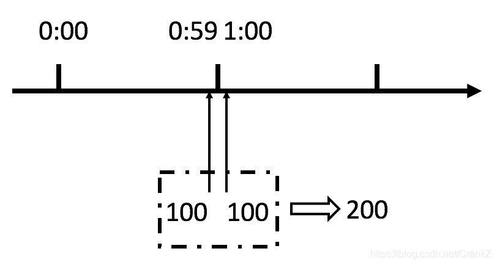
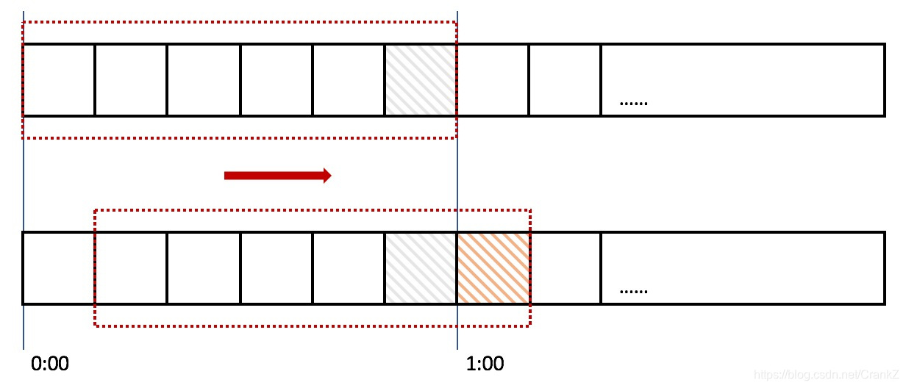
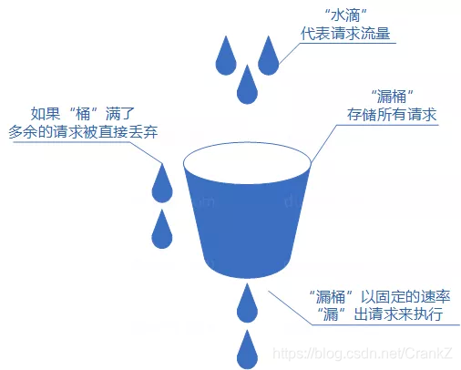
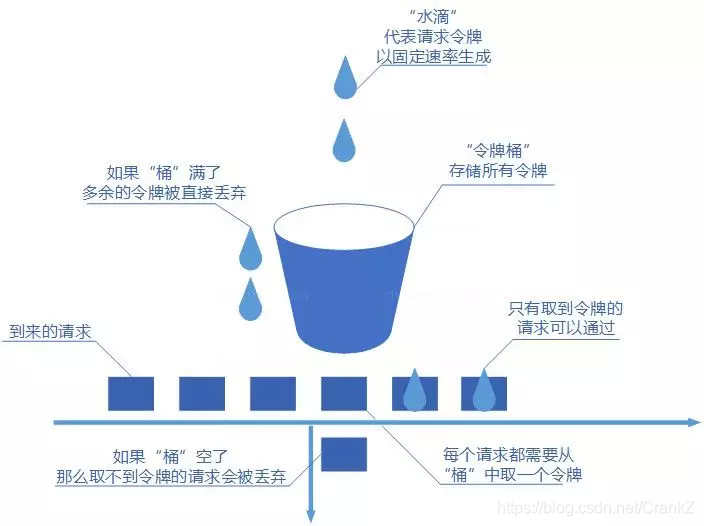
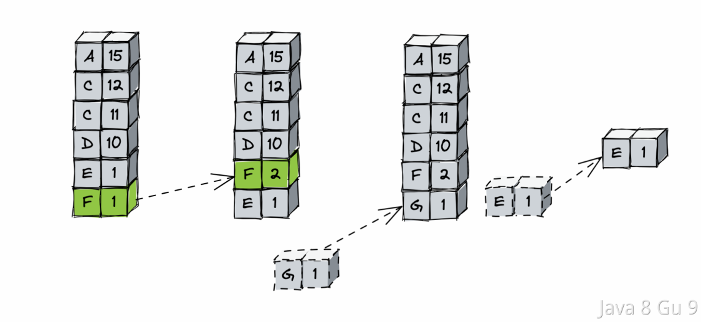

# Java面试题

## 限流算法

### 计数器（固定窗口）

计数器算法是限流算法里最简单也是最容易实现的一种算法。比如我们规定，对于A接口来说，我们1分钟的访问次数不能超过100个。那么我们可以这么做：在一开 始的时候，我们可以设置一个计数器counter，每当一个请求过来的时候，counter就加1，如果counter的值大于100并且该请求与第一个 请求的间隔时间还在1分钟之内，那么说明请求数过多；如果该请求与第一个请求的间隔时间大于1分钟，且counter的值还在限流范围内，那么就重置 counter，具体算法的示意图如下：


这个算法虽然简单，但是有一个十分致命的问题，那就是临界问题，我们看下图：



从上图中我们可以看到，假设有一个恶意用户，他在0:59时，瞬间发送了100个请求，并且1:00又瞬间发送了100个请求，这种情况，其实是符合我们上述规则的。因为在0:00-0:59这个区间用户确实没有超过我们设置的100这个最大范围，1:00-1:59这个区间也是一样。

但是，其实这个用户在 0:59-1:00这1秒里，瞬间发送了200个请求，这种情况使用固定窗口的计数器就很明显不符合我们的初衷。

### 滑动窗口算法（rolling window）

为了解决这个问题，我们引入了滑动窗口算法。如果学过TCP网络协议的话，那么一定对滑动窗口这个名词不会陌生。下面这张图，很好地解释了滑动窗口算法：



在上图中，整个红色的矩形框表示一个时间窗口，在我们的例子中，一个时间窗口就是一分钟。然后我们将时间窗口进行划分，比如图中，我们就将滑动窗口 划成了6格，所以每格代表的是10秒钟。每过10秒钟，我们的时间窗口就会往右滑动一格。每一个格子都有自己独立的计数器counter，比如当一个请求 在0:35秒的时候到达，那么0:30~0:39对应的counter就会加1。

那么滑动窗口怎么解决刚才的临界问题的呢？我们可以看上图，0:59到达的100个请求会落在灰色的格子中，而1:00到达的请求会落在橘黄色的格 子中。当时间到达1:00时，我们的窗口会往右移动一格，那么此时这个**时间窗口内**的总请求数量一共是200个，超过了限定的100个，所以此时能够检测出来触 发了限流。

滑动窗口算法是计数器算法的一种改进，将原来的一个时间窗口划分成多个时间窗口，并且不断向右滑动该窗口。流量经过滑动时间窗口算法整形之后，可以保证任意时间窗口内，都不会超过最大允许的限流值，从流量曲线上来看会更加平滑，可以部分解决上面提到的临界突发流量问题。对比固定时间窗口限流算法，滑动时间窗口限流算法的时间窗口是持续滑动的，并且除了需要一个计数器来记录时间窗口内接口请求次数之外，还需要记录在时间窗口内每个接口请求到达的时间点，对内存的占用会比较多。 在临界位置的突发请求都会被算到时间窗口内，因此可以解决计数器算法的临界问题。

### 漏桶算法(Leaky Bucket)

漏桶算法由流量容器、流量入口和出口组成。其中流量出口流速即为我们期望的限速值，比如 100 QPS。漏桶算法除了具备限流能力，还具备流量整型功能。流入漏桶流量的流速是不恒定的，经过漏桶限速后，流出流量的速度是恒定的。需要说明的是，漏桶的容量是有限的，一旦流入流量超出漏桶容量，这部分流量只能被丢弃了。



不管流量多大，超出的部分都会直接丢弃，即使服务器还有大量空闲资源也是直接丢弃，无法处理突发流量。那么如何解决这个问题呢？下面介绍令牌桶算法。

### 令牌桶算法(Token Bucket)

它的运行过程是这样的，一个令牌工厂按照设定值定期向令牌桶发放令牌。当令牌桶满了后，多出的令牌会被丢弃掉。每当一个请求到来时，该请求对应的线程会从令牌桶中取令牌。如果遇到突发情况，初期由于令牌桶中存放了很多个令牌，因此允许多个请求同时取令牌。当桶中没有令牌后，无法获取到令牌的请求可以丢弃，或者重试。下面我们来看一下的令牌桶示意图：



令牌桶算法既能够将所有的请求平均分布到时间区间内，又能接受服务器能够承受范围内的突发请求，因此是目前使用较为广泛的一种限流算法。

### 漏桶算法和令牌桶算法比较

|        | 漏桶算法                                      | 令牌桶算法                               |
| ------ | ----------------------------------------- | ----------------------------------- |
| 请求何时拒绝 | 流入请求速率任意，常量固定速率流出请求。当流入请求数积累到漏桶容量时，则拒绝新请求 | 固定速率往桶中添加令牌，如果桶中令牌不够，则拒绝新请求         |
| 速率限制   | 限制常量流出速率（流出速率是固定值），从而 **平滑突发流入速率**        | 限制平均流入速率，**允许一定程度的突发请求**（支持一次拿多个令牌） |

### 令牌桶对比滑动窗口的优势在哪里呢？

可以看出，滑动窗口可能遇到在限定时间内达到访问上限后，下次请求直接拒绝，直到滑动窗口内请求数减少的时候才会允许请求发生。令牌桶事先存储了令牌数量，可以应对请求突发上涨的问题，也可以在令牌使用完之后，定时补充令牌，满足部分请求过来的情况。

### 限流算法的改进-平滑限流

ES原生版本本身有限流策略，是基于请求数的漏桶策略，通过队列加线程池的方式实现。线程池大小决定了处理并发度，处理不完放到队列，队列放不下则拒绝请求。但是单纯地基于请求数的限流不能控制资源使用量，而且只作用于分片级子请求的传输层，对于我们前面分析的接入层无法起到有效的保护作用。原生版本也有内存熔断策略，但是在协调节点接入层并没有做限制。

腾讯的优化方案是基于内存资源的漏桶策略。我们将节点 JVM 内存作为漏桶的资源，当内存资源足够的时候，请求可以正常处理；当内存使用量到达一定阈值的时候分区间阶梯式平滑限流。例如上图中浅黄色的区间限制写入，深黄色的区间限制查询，底部红色部分作为预留 buffer，预留给处理中的请求、merge 等操作，以保证节点内存的安全性。


限流方案里面有一个挑战是：我们如何才能实现平滑限流？因为采用单一的阈值限流很容易出现请求抖动，例如请求一上来把内存打上去马上触发限流，而放开一点点请求又会涌进来把内存打上去。我们的方案是设置了高低限流阈值区间，在这个区间中，基于余弦变换实现请求数和内存资源之间的平滑限流。当内存资源足够的时候，请求通过率 100%，当内存到达限流区间逐步上升的时候，请求通过率随之逐步下降。而当内存使用量下降的时候，请求通过率也会逐步上升，不会一把放开。通过实际测试，平滑的区间限流能在高压力下保持稳定的写入性能。

### 负载自适应限流

所谓负载自适应限流，就是限流器结合服务器实例的Load、CPU、内存、接口的RT、QP、并发线程数等指标，进行的一种自适应的流控策略。即通过监控这些指标的变化，来动态的调整限流，来达到保证系统稳定性的目的。

这种思想也有很多其他的应用，比如自适应扩容，也是根据机器的Load，CPU等情况，进行动态的扩容等。

其实主要就是要给系统定义一个基线，或者水位，一旦这些指标达到了水位之上，比如CPU利用率超过60%，那么就开启自适应限流，通过限流的方式来保护系统不被打垮。

注明的Sentinal限流框架就支持自适应限流，目前他支持以下的阈值类型：

- Load（仅对 Linux/Unix-like 机器生效）：当系统 load1 超过阈值，且系统当前的并发线程数超过系统容量时才会触发系统保护。系统容量由系统的 maxQps * minRt 计算得出。设定参考值一般是 CPU cores * 2.5。

- CPU usage（1.5.0+ 版本）：当系统 CPU 使用率超过阈值即触发系统保护（取值范围 0.0-1.0）。

- RT：当单台机器上所有入口流量的平均 RT 达到阈值即触发系统保护，单位是毫秒。

- 线程数：当单台机器上所有入口流量的并发线程数达到阈值即触发系统保护。

- 入口 QPS：当单台机器上所有入口流量的 QPS 达到阈值即触发系统保护。

以下是Sentinal给的一个自适应限流的示例，供参考：

```java
/*
 * Copyright 1999-2018 Alibaba Group Holding Ltd.
 *
 * Licensed under the Apache License, Version 2.0 (the "License");
 * you may not use this file except in compliance with the License.
 * You may obtain a copy of the License at
 *
 *      http://www.apache.org/licenses/LICENSE-2.0
 *
 * Unless required by applicable law or agreed to in writing, software
 * distributed under the License is distributed on an "AS IS" BASIS,
 * WITHOUT WARRANTIES OR CONDITIONS OF ANY KIND, either express or implied.
 * See the License for the specific language governing permissions and
 * limitations under the License.
 */

package com.alibaba.csp.sentinel.demo.system;

import java.util.ArrayList;
import java.util.Collections;
import java.util.List;
import java.util.concurrent.TimeUnit;
import java.util.concurrent.atomic.AtomicInteger;

import com.alibaba.csp.sentinel.util.TimeUtil;
import com.alibaba.csp.sentinel.Entry;
import com.alibaba.csp.sentinel.EntryType;
import com.alibaba.csp.sentinel.SphU;
import com.alibaba.csp.sentinel.slots.block.BlockException;
import com.alibaba.csp.sentinel.slots.system.SystemRule;
import com.alibaba.csp.sentinel.slots.system.SystemRuleManager;

/**
 * @author jialiang.linjl
 */
public class SystemGuardDemo {

    private static AtomicInteger pass = new AtomicInteger();
    private static AtomicInteger block = new AtomicInteger();
    private static AtomicInteger total = new AtomicInteger();

    private static volatile boolean stop = false;
    private static final int threadCount = 100;

    private static int seconds = 60 + 40;

    public static void main(String[] args) throws Exception {

        tick();
        initSystemRule();

        for (int i = 0; i < threadCount; i++) {
            Thread entryThread = new Thread(new Runnable() {
                @Override
                public void run() {
                    while (true) {
                        Entry entry = null;
                        try {
                            entry = SphU.entry("methodA", EntryType.IN);
                            pass.incrementAndGet();
                            try {
                                TimeUnit.MILLISECONDS.sleep(20);
                            } catch (InterruptedException e) {
                                // ignore
                            }
                        } catch (BlockException e1) {
                            block.incrementAndGet();
                            try {
                                TimeUnit.MILLISECONDS.sleep(20);
                            } catch (InterruptedException e) {
                                // ignore
                            }
                        } catch (Exception e2) {
                            // biz exception
                        } finally {
                            total.incrementAndGet();
                            if (entry != null) {
                                entry.exit();
                            }
                        }
                    }
                }

            });
            entryThread.setName("working-thread");
            entryThread.start();
        }
    }

    private static void initSystemRule() {
        SystemRule rule = new SystemRule();
        // max load is 3
        rule.setHighestSystemLoad(3.0);
        // max cpu usage is 60%
        rule.setHighestCpuUsage(0.6);
        // max avg rt of all request is 10 ms
        rule.setAvgRt(10);
        // max total qps is 20
        rule.setQps(20);
        // max parallel working thread is 10
        rule.setMaxThread(10);

        SystemRuleManager.loadRules(Collections.singletonList(rule));
    }

    private static void tick() {
        Thread timer = new Thread(new TimerTask());
        timer.setName("sentinel-timer-task");
        timer.start();
    }

    static class TimerTask implements Runnable {
        @Override
        public void run() {
            System.out.println("begin to statistic!!!");
            long oldTotal = 0;
            long oldPass = 0;
            long oldBlock = 0;
            while (!stop) {
                try {
                    TimeUnit.SECONDS.sleep(1);
                } catch (InterruptedException e) {
                }
                long globalTotal = total.get();
                long oneSecondTotal = globalTotal - oldTotal;
                oldTotal = globalTotal;

                long globalPass = pass.get();
                long oneSecondPass = globalPass - oldPass;
                oldPass = globalPass;

                long globalBlock = block.get();
                long oneSecondBlock = globalBlock - oldBlock;
                oldBlock = globalBlock;

                System.out.println(seconds + ", " + TimeUtil.currentTimeMillis() + ", total:"
                    + oneSecondTotal + ", pass:"
                    + oneSecondPass + ", block:" + oneSecondBlock);
                if (seconds-- <= 0) {
                    stop = true;
                }
            }
            System.exit(0);
        }
    }
}
```

## 定时算法

### 为什么定时任务可以定时执行？

定时任务可以定时执行的原理是通过操作系统提供的定时器实现的。定时器是计算机系统的一个重要组成部分，它可以周期性地发出信号或中断，以便操作系统或其他应用程序可以在指定的时间间隔内执行某些任务。  

在定时任务中，操作系统或应用程序会利用计时器或定时器来定期检查当前时间是否达到了预定的执行时间，如果当前时间已经达到了预定的时间，系统会自动执行相应的任务。在操作系统中，常见的定时任务管理工具有crontab（Linux系统）、Windows Task Scheduler（Windows系统）等。  

总之，定时任务可以定时执行，是因为操作系统或应用程序利用定时器周期性地检查当前时间，一旦达到预定时间就会自动执行相应的任务。

#### 为什么Cron表达式能定时执行

Cron 表达式是我们经常使用的一种表达式，主要用于配置各种定时任务的。  

他可以定时执行其实底层也是基于操作系统的定时器的机制。在常见的计算机操作系统中，都提供了一种定时器机制，可以设置定时器来触发某个操作或执行某个任务。Cron 表达式利用这种机制实现了定时执行任务的功能。  

具体来说，当我们在系统中设置了一个 Cron 任务后，Cron 服务会根据 Cron 表达式计算出任务下一次应该执行的时间点，并将这个时间点与当前时间点进行比较。如果当前时间点已经超过了任务的执行时间点，那么 Cron 服务会立即执行该任务；否则，Cron 服务会将任务的执行时间点记录下来，并在这个时间点到来时再执行任务。  

为了实现这种定时器机制，Cron 表达式通常会被转化为一些特定的参数，然后传递给操作系统或程序库，让它们来设置相应的定时器。不同的操作系统或程序库对于定时器的实现方式可能有所不同，但它们的基本思想都是一致的：在指定的时间点触发一个定时器事件，然后执行相应的任务或操作。  

在 Unix/Linux 系统中，Cron 服务通常是通过一个名为 cron 的系统服务来实现的。这个服务会周期性地检查系统中已经配置好的 crontab 文件，根据其中的配置信息来决定哪些任务应该被执行。  

crontab 文件中包含了多条定时任务的配置信息，其中每条任务都由五个时间字段和一个命令行指令组成。这五个时间字段分别表示分钟、小时、日期、月份和星期几，cron 会根据这些时间信息来判断任务何时应该被执行。  

当定时器达到指定时间时，cron 会根据 crontab 文件中的配置信息，启动相应的命令行指令来执行任务。这样，定时任务就可以按照预定的时间定时执行了。  

在 Windows 系统中，Cron 服务通常是通过 Task Scheduler（任务计划程序）来实现的。这个程序也会周期性地检查系统中已经配置好的任务计划，根据其中的配置信息来决定哪些任务应该被执行。

### Java中实现定时任务的几种方式

想要用Java中原生的特性实现定时任务，主要有以下几种常见的手段：

1. Timer类和TimerTask类： Timer类是Java SE5之前的一个定时器工具类，可用于执行定时任务。TimerTask类则表示一个可调度的任务，通常通过继承该类来实现自己的任务，然后使用Timer.schedule()方法来安排任务的执行时间。

2. ScheduledExecutorService类： ScheduledExecutorService是Java SE5中新增的一个定时任务执行器，它可以比Timer更精准地执行任务，并支持多个任务并发执行。通过调用ScheduledExecutorService.schedule()或ScheduledExecutorService.scheduleAtFixedRate()方法来安排任务的执行时间。

3. DelayQueue：DelayQueue是一个带有延迟时间的无界阻塞队列，它的元素必须实现Delayed接口。当从DelayQueue中取出一个元素时，如果其延迟时间还未到达，则会阻塞等待，直到延迟时间到达。因此，我们可以通过将任务封装成实现Delayed接口的元素，将其放入DelayQueue中，再使用一个线程不断地从DelayQueue中取出元素并执行任务，从而实现定时任务的调度。

以上几种方案，相比于xxl-job这种定时任务调度框架来说，他实现起来简单，不须要依赖第三方的调度框架和类库。方案更加轻量级。

当然这个方案也不是没有缺点的，首先，以上方案都是基于JVM内存的，需要把定时任务提前放进去，那如果数据量太大的话，可能会导致OOM的问题；另外，基于JVM内存的方案，一旦机器重启了，里面的数据就都没有了，所以一般都需要配合数据库的持久化一起用，并且在应用启动的时候也需要做重新加载。

还有就是，现在很多应用都是集群部署的，那么集群中多个实例上的多个任务如何配合是一个很大的问题。

以上是在不引入任何其他第三方框架的情况下可以使用的JDK自带的功能实现定时任务，如果可以引入一些常用的类库，如Spring等，还有以下几种方案：

1. Spring的@Scheduled注解： Spring框架提供了一个方便的定时任务调度功能，可以使用@Scheduled注解来实现定时任务。通过在需要执行定时任务的方法上加上@Scheduled注解，并指定执行的时间间隔即可。

2. Quartz框架： Quartz是一个流行的开源任务调度框架，它支持任务的并发执行和动态调度。通过创建JobDetail和Trigger对象，并将它们交给Scheduler进行调度来实现定时任务。

3. xxl-job：xxl-job是一款分布式定时任务调度平台，可以实现各种类型的定时任务调度，如定时执行Java代码、调用HTTP接口、执行Shell脚本等。xxl-job采用分布式架构，支持集群部署，可以满足高并发、大数据量的任务调度需求。

4. Elastic-Job：Elastic-Job是一款分布式任务调度框架，可以实现各种类型的定时任务调度，如简单任务、数据流任务、脚本任务、Spring Bean任务等。Elastic-Job提供了丰富的任务调度策略，可以通过配置cron表达式、固定间隔等方式实现定时任务调度。Elastic-Job支持分布式部署，提供了高可用性和灵活的扩展性，可以满足高并发、大数据量的任务调度需求。

### Java中Timer实现定时调度的原理是什么？

Java中的Timer类是一个定时调度器，用于在指定的时间点执行任务。JDK 中Timer类的定义如下：

```java
public class Timer {
    /**
     * The timer task queue.  This data structure is shared with the timer
     * thread.  The timer produces tasks, via its various schedule calls,
     * and the timer thread consumes, executing timer tasks as appropriate,
     * and removing them from the queue when they're obsolete.
     */
    private final TaskQueue queue = new TaskQueue();

    /**
     * The timer thread.
     */
    private final TimerThread thread = new TimerThread(queue);
}
```

以上就是Timer中最重要的两个成员变量：

1. TaskQueue：一个任务队列，用于存储已计划的定时任务。任务队列按照任务的执行时间进行排序，确保最早执行的任务排在队列前面。在队列中的任务可能是一次性的，也可能是周期性的。

2. TimerThread：Timer 内部的后台线程，它负责扫描 TaskQueue 中的任务，检查任务的执行时间，然后在执行时间到达时执行任务的 run() 方法。TimerThread 是一个守护线程，因此当所有非守护线程完成时，它会随之终止。

任务的定时调度的核心代码就在TimerThread中：

```java
class TimerThread extends Thread {

    boolean newTasksMayBeScheduled = true;

    /**
     * 存储 TimerTask 的队列
     */
    private TaskQueue queue;

    TimerThread(TaskQueue queue) {
        this.queue = queue;
    }

    public void run() {
        try {
            mainLoop();
        } finally {
            synchronized (queue) {
                newTasksMayBeScheduled = false;
                queue.clear(); 
            }
        }
    }

    /**
     * 主要的计时器循环。 
     */
    private void mainLoop() {
        while (true) {
            try {
                TimerTask task;
                boolean taskFired;
                synchronized (queue) {
                    // 等待队列变为非空
                    while (queue.isEmpty() && newTasksMayBeScheduled)
                        queue.wait();
                    if (queue.isEmpty())
                        break; // 队列为空，将永远保持为空；线程终止

                    // 队列非空；查看第一个事件并执行相应操作
                    long currentTime, executionTime;
                    task = queue.getMin();
                    synchronized (task.lock) {
                        if (task.state == TimerTask.CANCELLED) {
                            queue.removeMin();
                            continue;  // 无需执行任何操作，再次轮询队列
                        }
                        currentTime = System.currentTimeMillis();
                        executionTime = task.nextExecutionTime;
                        if (taskFired = (executionTime <= currentTime)) {
                            if (task.period == 0) { // 非重复，移除
                                queue.removeMin();
                                task.state = TimerTask.EXECUTED;
                            } else { // 重复任务，重新安排
                                queue.rescheduleMin(
                                  task.period < 0 ? currentTime   - task.period
                                                : executionTime + task.period);
                            }
                        }
                    }
                    if (!taskFired) // 任务尚未触发；等待
                        queue.wait(executionTime - currentTime);
                }
                if (taskFired)  // 任务触发；运行它，不持有锁
                    task.run();
            } catch (InterruptedException e) {
            }
        }
    }
}
```

可以看到，TimerThread的实际是在运行mainLoop方法，这个方法一进来就是一个while(true)的循环，他在循环中不断地从TaskQueue中取出第一个任务，然后判断他是否到达执行时间了，如果到了，就触发任务执行。否则就继续等一会再次执行。

不断地重复这个动作，从队列中取出第一个任务进行判断，执行。。。

这样只要有新的任务加入队列，就在队列中按照时间排序，然后唤醒timerThread重新检查队列进行执行就可以了。代码如下：

```java
private void sched(TimerTask task, long time, long period) {
        if (time < 0)
            throw new IllegalArgumentException("Illegal execution time.");

        // Constrain value of period sufficiently to prevent numeric
        // overflow while still being effectively infinitely large.
        if (Math.abs(period) > (Long.MAX_VALUE >> 1))
            period >>= 1;

        synchronized(queue) {
            if (!thread.newTasksMayBeScheduled)
                throw new IllegalStateException("Timer already cancelled.");

            synchronized(task.lock) {
                if (task.state != TimerTask.VIRGIN)
                    throw new IllegalStateException(
                        "Task already scheduled or cancelled");
                task.nextExecutionTime = time;
                task.period = period;
                task.state = TimerTask.SCHEDULED;
            }
            //新任务入队列
            queue.add(task);
            //唤醒任务
            if (queue.getMin() == task)
                queue.notify();
        }
    }
```

#### 优缺点

Timer 类用于实现定时任务，最大的好处就是他的实现非常简单，特别的轻量级，因为它是Java内置的，所以只需要简单调用就行了。

但是他并不是特别的解决定时任务的好的方案，因为他存在以下问题：

1. Timer内部是单线程执行任务的，如果某个任务执行时间较长，会影响后续任务的执行。

2. 如果任务抛出未捕获异常，将导致整个 Timer 线程终止，影响其他任务的执行。

3. Timer 无法提供高精度的定时任务。因为系统调度和任务执行时间的不确定性，可能导致任务执行的时间不准确。

4. 虽然可以使用 cancel 方法取消任务，但这仅仅是将任务标记为取消状态，仍然会在任务队列中占用位置，无法释放资源。这可能导致内存泄漏。

5. 当有大量任务时，Timer 的性能可能受到影响，因为它在每次扫描任务队列时都要进行时间比较。

6. Timer执行任务完全基于JVM内存，一旦应用重启，那么队列中的任务就都没有了

### 实现一个定时任务，可以用什么数据结构及算法？

定时任务，是我们经常要用的，不管是Java中内置的，还是一些框架中的。但是想要实现一个定时任务，其实底层依赖的无非就是以下几种数据结构与算法：

1. 小顶堆：我们可以使用小顶堆来管理定时事件，其中每个事件包含触发时间戳和要执行的任务信息。最紧要触发的任务一直处于堆的根部。通过小顶堆，可以高效地找到最近触发的定时事件，并在触发时执行相应的任务。
   
   如Java中的Timer、DelayQueue等，都是基于小顶堆实现的。

2. 时间轮算法：时间轮算法是一种时间管理算法，可以高效地处理定时任务。它将时间划分成若干个时间槽，并使用循环队列来存储在每个时间槽上触发的任务，从而避免了遍历整个定时事件集合的开销。
   
   如Netty中的HashedWheelTimer、Quartz Scheduler、Kafka中等都有时间轮算法的应用。

3. 链表（用的比较少）：链表可以用于管理定时事件，每个节点包含触发时间戳和任务信息。链表中的节点按照触发时间戳从小到大排列，通过遍历链表，可以找到最近触发的定时事件并执行任务。

### 什么是小顶堆，可以用在哪些场景？

小顶堆（Min Heap）是一种特殊的二叉堆数据结构，它满足以下性质：对于堆中的任意节点i，其父节点的值小于等于节点i的值。换句话说，堆中的最小值总是位于堆的根节点上。


小顶堆是一种二叉堆数据结构，它可以使用数组来实现。

小顶堆常用于解决与最小值相关的问题，所以在实际应用中非常的广泛，比如：

1. 查找最小值，在一群数字中，查找最小值，可以利用小顶堆，小顶堆的根节点就是最小值。如：从10亿个数字中，取出最小的10个数

2. 排序，小顶堆可以用于堆排序，可以把一个数组构建成小顶堆，那么就是实现了从小到大的排序。

3. 定时器，在定时器的实现中，可以使用小顶堆来管理即将触发的定时事件。每个定时事件可以表示为一个包含触发时间戳的数据结构。从堆顶不断取出需要执行的定时任务即可。

4. Dijkstra算法：在最短路径问题中，Dijkstra算法使用优先级队列来选择当前最短路径的下一个节点，而小顶堆可以用作实现该优先级队列。

5. 优先级队列：小顶堆可以用作优先级队列的底层数据结构，在O(log n)时间内进行插入和删除操作，O(1)时间内获取最小优先级元素。如Java 中的 PriorityQueue

#### 插入过程

小顶堆的插入主要有两个步骤：

1. 将新元素添加到小顶堆的最后一个位置（数组的末尾）。

2. 执行"上浮"（Heapify Up）操作：将新插入的元素与其父节点进行比较。如果新元素的值比父节点的值小，则交换它们，并继续向上比较和交换，直到满足小顶堆的性质（即新元素的值不小于其父节点的值），或者到达堆的根节点。

假如有一个以下小顶堆，当我们插入一个元素3的时候：


将3添加到堆的最后位置：


执行上浮操作，将3上浮到正确位置：


#### 删除过程

小顶堆的删除主要有两个步骤：

1. 将堆顶元素（最小值）删除，并用堆的最后一个元素（数组的最后一个元素）来替换它。

2. 执行"下沉"（Heapify Down）操作：将新的根节点与其较小的子节点进行比较。如果新根节点的值比其子节点的值大，则交换它们，并继续向下比较和交换，直到满足小顶堆的性质（即新根节点的值不大于其子节点的值），或者到达叶子节点。

以下是删除3这个元素的过程：


经过几轮下沉后：


### 什么是时间轮？

时间轮算法（Time Wheel Algorithm）是一种用于处理定时任务和调度的常见算法。

时间轮算法主要需要定义一个时间轮盘，在一个时间轮盘中划分出多个槽位，每个槽位表示一个时间段，这个段可以是秒级、分钟级、小时级等等。如以下就是把一个时间轮分为了60个时间槽，每一个槽代表一秒钟。

然后当我们有定时任务需要执行的时候，就把他们挂在到这些槽位中，这个任务将要在哪个槽位中执行，就把他挂在到哪个槽位的链表上。

比如当前如果是0秒，那么要3秒后执行，那就挂在槽位为3的那个位置上。

而随着时间的推移，轮盘不断旋转，任务会被定期触发。

因为这个时间轮是60个槽位，那么他就会在一分钟完整的转完一圈，那么就有一个指针，每一秒钟在槽位中进行一次移动。这个操作是有一个单独的线程来做的，他的工作就是每一秒钟改变一次current指针。

然后还有一个线程池，在指针轮转到某个槽位上的时候，在线程池中执行链表中需要执行的任务。

以上就是一个简单的时间轮算法，但是这个时间轮存在一个问题，那就是我们把它分了60个槽，那么就意味着我们的定时任务最多只支持60s以内的。

那么，怎么解决这个问题呢？

首先能想到的最简单的方式就是加槽位，比如我要支持5分钟的延迟任务，那么就可以把槽位设置为300个。

还有就是也可以调整时间轮槽位移动的延迟，比如把1秒钟移动一次，改为1分钟移动一次，那么就可以支撑60分钟的延迟任务了。

但是这两个办法都不够灵活，而且是有瓶颈的。于是有一种新的办法。

#### round

在时间轮中增加一个round的标识，标识运行的圈数，比如说上面的60s的时间轮，如果我要200s之后运行，那么我在设置这个任务的时候，就把他的round设置为 200/60 = 3 ，然后再把它放到 200%60 = 20的这个槽位上。

有了这个round之后，每一次current移动到某个槽位时，检查任务的round是不是为0，如果不为0，则减一。

这样时间轮转到第三圈时，round的值会变成0，再第四圈运行到current=20的时候，发现round=0了，那么就可以执行这个任务了。

这样就解决了我们前面说的问题了。

但是这个方案还存在一个问题，那就是这个round的检查过程，需要把所有任务都遍历一遍，效率还是没那么高。

#### 分层时间轮

为了解决遍历所有任务的问题，我们可以引入分层时间轮。我们在刚刚的秒级时间轮的基础上，在定义一个分钟级时间轮

也就是说我们对于200s以后执行这个任务，我们先把他放到分钟级时间轮上，这个时间轮的槽位每一分钟移动一次，当移动时候，发现某个槽位上有这一分钟内需要执行的任务时。

把这个任务取出来，放到秒级时间轮中。这样在第3分20秒的时候，就可以运行这个任务了。

这就是分层时间轮。在分层时间轮包括多个级别的时间轮，每个级别的时间轮都有不同的粒度和周期。

通常，粒度较细的时间轮拥有更短的周期，而粒度较粗的时间轮拥有更长的周期。例如，分层时间轮可以包括毫秒级、秒级、分钟级等不同粒度的时间轮。

当一个任务需要被调度时，它被分配到适当级别的时间轮中，每个级别的时间轮都独立地旋转。当一个时间轮的指针到达某个位置时，它将触发执行该级别时间轮中的任务。如果某个任务在较粗的时间轮中已经到期，它将被升级到下一级时间轮。

当任务升级到下一级时间轮时，任务的调度粒度变得更细。这意味着任务将在更短的时间内被触发，从而更精确地满足其调度要求。

#### 典型应用

时间轮算法在各种框架和库中都有广泛的应用。以下是一些应用时间轮算法的常见框架和库：

1. Netty：Netty 是一款高性能的网络通信框架，它使用时间轮算法来处理定时任务和超时检测。时间轮用于管理通道的超时和重连机制。

2. Akka：Akka 是一个并发编程框架，它包括一个调度器，该调度器使用时间轮算法来管理和触发并发任务。这使得 Akka 能够支持高并发和复杂的任务调度需求。

3. Kafka：Apache Kafka 是一个分布式消息队列系统，它使用时间轮算法来管理消息的过期和删除。时间轮用于清理过期消息，以释放存储空间。

4. Hystrix：Hystrix 是 Netflix 开发的容错和延迟容忍库，它使用时间轮来管理命令执行和熔断状态的转换。

5. Disruptor：Disruptor 是一个高性能并发框架，它使用时间轮算法来管理任务的并发执行，以提高处理大量事件的性能。

6. xxl-job：在以前的版本的xxl-job中，使用quartz做定时任务调度，但是在7.28版本中去除了quartz，改用了时间轮算法。

### 定时任务扫表的方案有什么缺点？

通过定时任务扫表，是我们在业务中经常会做的事情，一般是直接用xxl-job等定时任务去分页查询数据库，然后进行业务操作，这个方案，一般是最简单的，也是最有效的。

但是，他还是有一些缺点的，如：

1. 数据量多扫表慢

2. 集中式扫表会影响正常业务

3. 定时扫表存在延迟问题

那么，这几个问题，该如何解决呢？

#### 数据量多，扫表慢

随着需要扫描的表中的数据量越来越大，通过定时任务扫表的方式会越来越慢，那么想要解决这个问题，首先可以考虑加索引。

我们可以在state字段上增加一个索引，虽然这个字段的区分度不高，但是一般来说，这张表中，SUCCESS的数据量占90%，而INIT的数据量只占10%，而我们扫表的时候只关心INIT即可，所以增加索引后，扫表的效率是可以大大提升的。

其次，可以考虑多线程并发扫表，这里可以考虑采用线程池，在任务中开多个线程并发的从数据库中扫描数据进行处理。

但是这样做，会带来一个问题，那就是多个线程之间如何做好隔离，如何确保不会出现并发导致同一条记录被多个线程执行多次呢？

首先最基本的保障，扫表之后的处理逻辑要做好幂等控制，一旦出现了重复的情况，下游也能因为做了幂等而不会重复处理。

除此以外，在扫表的时候，可以通过分段的思想进行数据隔离。举个例子：

```java
Long minId = messageService.getMinInitId();

for(int i=1;i<= threadPool.size();i++){
    Long maxId = minId + segmentSize()*i;
    List<Message> messages = messageService.scanInitMessages(minId,maxId);
    proccee(messages);
    minId = maxId + 1;
}
```

像上面的例子中，假设有10个线程，那么第一个线程就扫描ID处于0-1000的数据，第二个线程扫描1001-2000的数据，第三个线程扫描2001-3000的数据。这样以此类推，线程之间通过分段的方式就做好了隔离，可以避免同一个数据被多个线程扫描到。

这个做法，有个小问题，那就是INIT的数据的ID可能不是连续的，那么就需要考虑其他的分段方式，比如在事件表中增加一个业务ID，然后根据这个biz_id做分片也可以。

比如：

```java
for(int i=1;i<= threadPool.size();i++){
    List<Message> messages = messageService.scanInitMessages(i);
    proccee(messages);
}
```

这样在SQL中：

```sql
SELECT * FROM RETRY_MESSAGE WHERE 
STATE = "INIT"
AND BIZ_ID LIKE "${frontNumber}%"
```

那么，不同的线程执行的SQL就不一样了分别是：

```sql
SELECT * FROM RETRY_MESSAGE WHERE 
STATE = "INIT"
AND BIZ_ID LIKE "1%"

SELECT * FROM RETRY_MESSAGE WHERE 
STATE = "INIT"
AND BIZ_ID LIKE "2%"

SELECT * FROM RETRY_MESSAGE WHERE 
STATE = "INIT"
AND BIZ_ID LIKE "3%"

SELECT * FROM RETRY_MESSAGE WHERE 
STATE = "INIT"
AND BIZ_ID LIKE "4%"
```

这样也是可以做分段的。

#### 集中式扫表会影响正常业务

如果业务量比较大的话，集中式的扫描数据库势必给数据库带来一定的压力，那么就会影响到正常的业务。

那么想要解决这个问题，首先可以考虑，不扫主库，而是扫描备库。之所以能这么做，是因为这个业务场景一般都是可以接受一定的数据延迟的，那么备库带来延迟就可以忽略，但是备库是没有业务操作的，所以对备库的扫描是不会对业务造成影响的。

当然，这里还要考虑一个问题，那就是备库扫描数据之后的执行，执行完该如何同步到主库，这里可以直接修改主库，主备库数据ID一致的，直接去修改主库的就行了。不建议直接在备库上修改。

但是不管怎么样，备库还是可以分担扫表的这个大量高峰请求的。

除了扫备库，还有一个方案，那就是做分库了。把原来集中在同一个数据库的数据分散到不同的数据库中，这样用集群代替单库来整体对外提供服务，可以大大的提升吞吐量。

因为多个数据库的话，每个库提供的连接数就会多，并且多个实例的话，CPU、IO、LOAD这些指标也可以互相分担。

#### 定时扫表存在延迟问题

定时任务都是集中式的定时执行的，那么就会存在延迟的问题。随着数据库越来越大，延时会越来越长。

想要降低延迟，那就要抛弃定时任务的方案，可以考虑延迟消息，基于延迟消息来做定时执行。

用了延迟消息之后，还可以缓解数据库的压力。也能比定时扫表的性能要好，实时性也更高。

当然，引入另外一个中间件也需要考虑成本的。

#### 同步转异步

再提一个方案，那就是同步转异步。什么叫同步转异步呢，那就是同步先干一把，失败了的话，再异步执行。如：

```java
private static ThreadFactory namedThreadFactory = new ThreadFactoryBuilder()
    .setNameFormat("hollis-pool-%d").build();

private static ExecutorService pool = new ThreadPoolExecutor(5, 200,
    0L, TimeUnit.MILLISECONDS,
    new LinkedBlockingQueue<Runnable>(1024), namedThreadFactory, new ThreadPoolExecutor.AbortPolicy());

@Transactional(rollbackFor = Exception.class)
public void pay(PayRequest payRequest){

    //在同一个事务中做本地业务操作和记录消息
    payService.doPay(payRequest);
    retryMessageService.init(payRequest);

    //同步执行一次外部调用
    try{
        Result result = outerService.doSth(payRequest);
        if(result.isSuccess()){
            retryMessageService.success(payRequest);
        }
    }catch(Exception e){
        // 捕获异常，失败依赖异步重试
    }


}
```

如上，在同步接口中，先尝试着执行一次要可能会失败的任务，如果成功了，那就把事件推进到成功。如果失败了也无所谓，因为会有异步定时任务捞起来重试。

### 订单到期关闭如何实现

在电商、支付等系统中，一般都是先创建订单（支付单），再给用户一定的时间进行支付，如果没有按时支付的话，就需要把之前的订单（支付单）取消掉。这种类似的场景有很多，还有比如到期自动收货、超时自动退款、下单后自动发送短信等等都是类似的业务问题。

订单的到期关闭的实现有很多种方式，分别有：

1. 被动关闭

2. 定时任务

3. DelayQueue

4. 时间轮

5. kafka

6. RocketMQ延迟消息

7. RabbitMQ死信队列

8. RabbitMQ插件

9. Redis过期监听

10. Redis的ZSet

11. Redisson

#### 被动关闭

在解决这类问题的时候，有一种比较简单的方式，那就是通过业务上的被动方式来进行关单操作。

简单点说，就是订单创建好了之后。我们系统上不做主动关单，什么时候用户来访问这个订单了，再去判断时间是不是超过了过期时间，如果过了时间那就进行关单操作，然后再提示用户。


这种做法是最简单的，基本不需要开发定时关闭的功能，但是他的缺点也很明显，那就是如果用户一直不来查看这个订单，那么就会有很多脏数据冗余在数据库中一直无法被关单。

还有一个缺点，那就是需要在用户的查询过程中进行写的操作，一般写操作都会比读操作耗时更长，而且有失败的可能，一旦关单失败了，就会导致系统处理起来比较复杂。

所以，这种方案只适合于自己学习的时候用，任何商业网站中都不建议使用这种方案来实现订单关闭的功能。

#### 定时任务

定时任务关闭订单，这是很容易想到的一种方案。  

具体实现细节就是我们通过一些调度平台来实现定时执行任务，任务就是去扫描所有到期的订单，然后执行关单动作。


这个方案的优点也是比较简单，实现起来很容易，基于Timer、ScheduledThreadPoolExecutor、或者像xxl-job这类调度框架都能实现，但是有以下几个问题：

1. 时间不精准。 一般定时任务基于固定的频率、按照时间定时执行的，那么就可能会发生很多订单已经到了超时时间，但是定时任务的调度时间还没到，那么就会导致这些订单的实际关闭时间要比应该关闭的时间晚一些。

2. 无法处理大订单量。 定时任务的方式是会把本来比较分散的关闭时间集中到任务调度的那一段时间，如果订单量比较大的话，那么就可能导致任务执行时间很长，整个任务的时间越长，订单被扫描到时间可能就很晚，那么就会导致关闭时间更晚。

3. 对数据库造成压力。 定时任务集中扫表，这会使得数据库IO在短时间内被大量占用和消耗，如果没有做好隔离，并且业务量比较大的话，就可能会影响到线上的正常业务。

4. 分库分表问题。 订单系统，一旦订单量大就可能会考虑分库分表，在分库分表中进行全表扫描，这是一个极不推荐的方案。

所以，定时任务的方案，适合于对时间精确度要求不高、并且业务量不是很大的场景中。如果对时间精度要求比较高，并且业务量很大的话，这种方案不适用。

#### JDK自带的DelayQueue

有这样一种方案，他不需要借助任何外部的资源，直接基于应用自身就能实现，那就是基于JDK自带的DelayQueue来实现。

> DelayQueue是一个无界的BlockingQueue，用于放置实现了Delayed接口的对象，其中的对象只能在其到期时才能从队列中取走。

基于延迟队列，是可以实现订单的延迟关闭的，首先，在用户创建订单的时候，把订单加入到DelayQueue中，然后，还需要一个常驻任务不断的从队列中取出那些到了超时时间的订单，然后在把他们进行关单，之后再从队列中删除掉。

这个方案需要有一个线程，不断的从队列中取出需要关单的订单。一般在这个线程中需要加一个while(true)循环，这样才能确保任务不断的执行并且能够及时的取出超时订单。

使用DelayQueue实现超时关单的方案，实现起来简单，不须要依赖第三方的框架和类库，JDK原生就支持了。

当然这个方案也不是没有缺点的，首先，基于DelayQueue的话，需要把订单放进去，那如果订单量太大的话，可能会导致OOM的问题；另外，DelayQueue是基于JVM内存的，一旦机器重启了，里面的数据就都没有了。虽然我们可以配合数据库的持久化一起使用。而且现在很多应用都是集群部署的，那么集群中多个实例上的多个DelayQueue如何配合是一个很大的问题。

所以，基于JDK的DelayQueue方案只适合在单机场景、并且数据量不大的场景中使用，如果涉及到分布式场景，那还是不建议使用。

#### Netty的时间轮

还有一种方式，和上面我们提到的JDK自带的DelayQueue类似的方式，那就是基于时间轮实现。


为什么要有时间轮呢？主要是因为DelayQueue插入和删除操作的平均时间复杂度——O(nlog(n))，虽然已经挺好的了，但是时间轮的方案可以将插入和删除操作的时间复杂度都降为O(1)。

> 时间轮可以理解为一种环形结构，像钟表一样被分为多个 slot。每个 slot 代表一个时间段，每个 slot 中可以存放多个任务，使用的是链表结构保存该时间段到期的所有任务。时间轮通过一个时针随着时间一个个 slot 转动，并执行 slot 中的所有到期任务。

基于Netty的HashedWheelTimer可以帮助我们快速的实现一个时间轮，这种方式和DelayQueue类似，缺点都是基于内存、集群扩展麻烦、内存有限制等等。

但是他相比DelayQueue的话，效率更高一些，任务触发的延迟更低。代码实现上面也更加精简。

所以，基于Netty的时间轮方案比基于JDK的DelayQueue效率更高，实现起来更简单，但是同样的，只适合在单机场景、并且数据量不大的场景中使用，如果涉及到分布式场景，那还是不建议使用。

#### Kafka的时间轮

既然基于Netty的时间轮存在一些问题，那么有没有其他的时间轮的实现呢？

还真有的，那就是Kafka的时间轮，Kafka内部有很多延时性的操作，如延时生产，延时拉取，延时数据删除等，这些延时功能由内部的延时操作管理器来做专门的处理，其底层是采用时间轮实现的。

而且，为了解决有一些时间跨度大的延时任务，Kafka 还引入了层级时间轮，能更好控制时间粒度，可以应对更加复杂的定时任务处理场景；

Kafka 中的时间轮的实现是 TimingWheel 类，位于 kafka.utils.timer 包中。基于Kafka的时间轮同样可以得到O(1)时间复杂度，性能上还是不错的。

基于Kafka的时间轮的实现方式，在实现方式上有点复杂，需要依赖kafka，但是他的稳定性和性能都要更高一些，而且适合用在分布式场景中。

#### RocketMQ延迟消息

相比于Kafka来说，RocketMQ中有一个强大的功能，那就是支持延迟消息。

> 延迟消息，当消息写入到Broker后，不会立刻被消费者消费，需要等待指定的时长后才可被消费处理的消息，称为延时消息。

有了延迟消息，我们就可以在订单创建好之后，发送一个延迟消息，比如20分钟取消订单，那就发一个延迟20分钟的延迟消息，然后在20分钟之后，消息就会被消费者消费，消费者在接收到消息之后，去关单就行了。

但是，RocketMQ的延迟消息并不是支持任意时长的延迟的，它只支持：1s 5s 10s 30s 1m 2m 3m 4m 5m 6m 7m 8m 9m 10m 20m 30m 1h 2h这几个时长。（商业版支持任意时长）

可以看到，有了RocketMQ延迟消息之后，我们处理上就简单很多，只需要发消息，和接收消息就行了，系统之间完全解耦了。但是因为延迟消息的时长受到了限制，所以并不是很灵活。

如果我们的业务上，关单时长刚好和RocketMQ延迟消息支持的时长匹配的话，那么是可以基于RocketMQ延迟消息来实现的。否则，这种方式并不是最佳的。（但是在RocketMQ 5.0中新增了基于时间轮实现的定时消息，可以解决这个问题！）

#### RabbitMQ死信队列

延迟消息不仅在RocketMQ中支持，其实在RabbitMQ中也是可以实现的，只不过其底层是基于死信队列实现的。  

当RabbitMQ中的一条正常的消息，因为过了存活时间（TTL过期）、队列长度超限、被消费者拒绝等原因无法被消费时，就会变成Dead Message，即死信。

当一个消息变成死信之后，他就能被重新发送到死信队列中（其实是交换机-exchange）。

那么基于这样的机制，就可以实现延迟消息了。那就是我们给一个消息设定TTL，但是并不消费这个消息，等他过期，过期后就会进入到死信队列，然后我们再监听死信队列的消息消费就行了。

而且，RabbitMQ中的这个TTL是可以设置任意时长的，这就解决了RocketMQ的不灵活的问题。

但是，死信队列的实现方式存在一个问题，那就是可能造成队头阻塞，因为队列是先进先出的，而且每次只会判断队头的消息是否过期，那么，如果队头的消息时间很长，一直都不过期，那么就会阻塞整个队列，这时候即使排在他后面的消息过期了，那么也会被一直阻塞。

基于RabbitMQ的死信队列，可以实现延迟消息，非常灵活的实现定时关单，并且借助RabbitMQ的集群扩展性，可以实现高可用，以及处理大并发量。他的缺点第一是可能存在消息阻塞的问题，还有就是方案比较复杂，不仅要依赖RabbitMQ，而且还需要声明很多队列(exchange)出来，增加系统的复杂度。

#### RabbitMQ插件

其实，基于RabbitMQ的话，可以不用死信队列也能实现延迟消息，那就是基于rabbitmq_delayed_message_exchange插件，这种方案能够解决通过死信队列实现延迟消息出现的消息阻塞问题。但是该插件从RabbitMQ的3.6.12开始支持的，所以对版本有要求。

这个插件是官方出的，可以放心使用，安装并启用这个插件之后，就可以创建x-delayed-message类型的队列了。


前面我们提到的基于死信队列的方式，是消息先会投递到一个正常队列，在TTL过期后进入死信队列。但是基于插件的这种方式，消息并不会立即进入队列，而是先把他们保存在一个基于Erlang开发的Mnesia数据库中，然后通过一个定时器去查询需要被投递的消息，再把他们投递到x-delayed-message队列中。

基于RabbitMQ插件的方式可以实现延迟消息，并且不存在消息阻塞的问题，但是因为是基于插件的，而这个插件支持的最大延长时间是(2^32)-1 毫秒，大约49天，超过这个时间就会被立即消费。但是他基于RabbitMQ实现，所以在可用性、性能方便都很不错。

#### Redis过期监听

很多用过Redis的人都知道，Redis有一个过期监听的功能，  

在 redis.conf 中，加入一条配置notify-keyspace-events Ex开启过期监听，然后再代码中实现一个KeyExpirationEventMessageListener，就可以监听key的过期消息了。  

这样就可以在接收到过期消息的时候，进行订单的关单操作。

这个方案不建议大家使用，是因为Redis官网上明确的说过，Redis并不保证Key在过期的时候就能被立即删除，更不保证这个消息能被立即发出。所以，消息延迟是必然存在的，随着数据量越大延迟越长，延迟个几分钟都是常事儿。

而且，在Redis 5.0之前，这个消息是通过PUB/SUB模式发出的，他不会做持久化，至于你有没有接到，有没有消费成功，他不管。也就是说，如果发消息的时候，你的客户端挂了，之后再恢复的话，这个消息你就彻底丢失了。（在Redis 5.0之后，因为引入了Stream，是可以用来做延迟消息队列的。）

#### Redis的zset

虽然基于Redis过期监听的方案并不完美，但是并不是Redis实现关单功能就不完美了，还有其他的方案。

我们可以借助Redis中的有序集合——zset来实现这个功能。

zset是一个有序集合，每一个元素(member)都关联了一个 score，可以通过 score 排序来取集合中的值。

我们将订单超时时间的时间戳（下单时间+超时时长）与订单号分别设置为 score 和 member。这样redis会对zset按照score延时时间进行排序。然后我们再开启redis扫描任务，获取"当前时间 > score"的延时任务，扫描到之后取出订单号，然后查询到订单进行关单操作即可。

使用redis zset来实现订单关闭的功能的优点是可以借助redis的持久化、高可用机制。避免数据丢失。但是这个方案也有缺点，那就是在高并发场景中，有可能有多个消费者同时获取到同一个订单号，一般采用加分布式锁解决，但是这样做也会降低吞吐型。

但是，在大多数业务场景下，如果幂等性做得好的，多个消费者取到同一个订单号也无妨。

#### Redisson + Redis

上面这种方案看上去还不错，但是需要我们自己基于zset这种数据结构编写代码，那么有没有什么更加友好的方式？  

有的，那就是基于Redisson。  

Redisson是一个在Redis的基础上实现的框架，它不仅提供了一系列的分布式的Java常用对象，还提供了许多分布式服务。

Redisson中定义了分布式延迟队列RDelayedQueue，这是一种基于我们前面介绍过的zset结构实现的延时队列，它允许以指定的延迟时长将元素放到目标队列中。  

其实就是在zset的基础上增加了一个基于内存的延迟队列。当我们要添加一个数据到延迟队列的时候，redisson会把数据+超时时间放到zset中，并且起一个延时任务，当任务到期的时候，再去zset中把数据取出来，返回给客户端使用。

大致思路就是这样的，感兴趣的大家可以看一看RDelayedQueue的具体实现。

基于Redisson的实现方式，是可以解决基于zset方案中的并发重复问题的，而且还能实现方式也比较简单，稳定性、性能都比较高。

#### 总结

我们介绍了11种实现订单定时关闭的方案，其中不同的方案各自都有优缺点，也各自适用于不同的场景中。那我们尝试着总结一下：  

实现的复杂度上（包含用到的框架的依赖及部署）：  

Redisson > RabbitMQ插件 > RabbitMQ死信队列 > RocketMQ延迟消息 ≈ Redis的zset > Redis过期监听 ≈ kafka时间轮 > 定时任务 > Netty的时间轮 > JDK自带的DelayQueue > 被动关闭  

方案的完整性：  

Redisson ≈ RabbitMQ插件 > kafka时间轮 > Redis的zset ≈ RocketMQ延迟消息 ≈ RabbitMQ死信队列 > Redis过期监听 > 定时任务 > Netty的时间轮 > JDK自带的DelayQueue > 被动关闭  

不同的场景中也适合不同的方案：  

- 自己玩玩：被动关闭

- 单体应用，业务量不大：Netty的时间轮、JDK自带的DelayQueue、定时任务

- 分布式应用，业务量不大：Redis过期监听、RabbitMQ死信队列、Redis的zset、定时任务

- 分布式应用，业务量大、并发高：Redisson、RabbitMQ插件、kafka时间轮、RocketMQ延迟消息  

总体考虑的话，考虑到成本，方案完整性、以及方案的复杂度，还有用到的第三方框架的流行度来说，个人比较建议优先考虑Redisson+Redis、RabbitMQ插件、Redis的zset、RocketMQ延迟消息等方案。  

## 本地缓存

### 本地缓存和分布式缓存有什么区别？

本地缓存和分布式缓存是两种不同的缓存架构，它们的主要区别在于数据的存储和管理方式。

本地缓存是指将数据存储在单个应用程序的内存中，它通常被用于提高应用程序的性能，减少对数据库等后端存储系统的请求次数。

本地缓存的优点是速度快、易于使用和管理，但是它只能在应用程序的本地节点使用，不能跨多个节点进行共享。也就是说，本地缓存在集群环境中，会存在不一致的问题。多个本地缓存之间的数据可能不一致。

分布式缓存是指将数据存储在多个节点的内存中，这些节点可以在不同的服务器上，甚至在不同的地理位置上。

分布式缓存的优点是可以支持多个应用程序共享数据，提高系统的可伸缩性和可用性，但是它的管理和维护成本较高，需要考虑数据一致性和故障恢复等问题。

总的来说，本地缓存适合于单个应用程序的性能优化，而分布式缓存则适合于多个应用程序共享数据、提高系统可伸缩性和可用性的场景。

### 本地缓存的实现方式

在设计本地缓存时，一般需要考虑以下几个方面的问题:

#### 数据结构

一般来讲，为了提升缓存的效率，通常采用Key-Value结构进行数据存储，也就是说，缓存中的数据保存和读取都需要有一个Key，通过Key来读取固定的缓存的Value。

#### 线程安全

本地缓存一定要考虑线程安全的问题，因为大多数情况下本地缓存都是一个全局可访问的变量，那么就会有多个线程同时访问，所以线程安全问题不容忽视。

#### 对象上限

因为是本地缓存，而本地内存中的数据是要占用JVM的堆内存的，所以内存是有上限要求的，如果无限存储，最终一定会导致OOM的问题。

#### 清除策略

为了避免OOM的问题，一般会考虑在缓存中增加清除策略，通过一定的手段定期的清理掉一些数据，来保证内存占用不会过大，常见清除策略主要有有LRU(最近最少使用)、FIFO(先进先出)、LFU(最近最不常用)、SOFT(软引用)、WEAK(弱引用)等;

#### 过期时间

有了清除策略并不能保证百分百的可以删除数据，极端情况会会使得某些数据一直无法删除。这时候就需要有一种机制，能够保证某些K-V一定可以删除。通常采用的方案是给每一个缓存的key设置过期时间，当达到过期时间之后直接删除,采用清除策略+过期时间双重保证;

#### 实现方式

考虑到以上这些问题之后，就可以考虑如何具体实现一个本地缓存了。

最简单的方式是通过HashMap来实现一个本地缓存，因为他本身就是一种Key-Value结构的，并且如果使用ConcurrentHashMap的话，也能保证线程安全，不过需要自己实现对象上限、过期策略以及清除策略。

除此之外，也有一些比较成熟的开源的本地缓存框架可以直接使用，比较常用的有：

- Guava Cache

- Caffeine （推荐）

- Ehcache

推荐优先使用Caffeine作为本地缓存，在功能上，GuavaCache支持的功能，Caffeine都支持，另外Caffeine支持异步Cache和写入外部资源，这两个Guava Cache是不支持的。Caffeine也是Spring 5中默认支持的Cache。而Caffeine在性能上要比GuavaCache好很多，主要有以下几个原因：

1. 剔除算法，GuavaCache采用的是「LRU」算法，而Caffeine采用的是「Window TinyLFU」算法，这是两者之间最大，也是根本的区别。

2. 立即失效，Guava会把立即失效 (例如：expireAfterAccess(0) and expireAfterWrite(0)) 转成设置最大Size为0。这就会导致剔除提醒的原因是SIZE而不是EXPIRED。Caffiene能正确识别这种剔除原因。

3. 取代提醒，Guava只要数据被替换，不管什么原因，都会触发剔除监听器。而Caffiene在取代值和先前值的引用完全一样时不会触发监听器。

4. 异步化，Caffiene的很多工作都是交给线程池去做的（默认：ForkJoinPool.commonPool()），例如：剔除监听器，刷新机制，维护工作等。

#### 具体示例

基于Caffeine实现本地缓存

```java
import com.github.benmanes.caffeine.cache.Cache;
import com.github.benmanes.caffeine.cache.Caffeine;
import org.springframework.beans.factory.InitializingBean;
import org.springframework.stereotype.Component;

import java.util.concurrent.TimeUnit;

/**
 * 本地缓存工具
 *
 * @author hollis
 */
@Component
public class LocalCacheManager implements InitializingBean {

    private Cache<String, String> localCache;

    /**
     * 向缓存中保存数据，如果已经存在则不覆盖
     */
    public void putIfNotExist(String key, String value) {
        if (localCache.getIfPresent(key) == null) {
            localCache.put(key, value);
        }
    }

    /**
     * 根据key获取缓存数据
     *
     * @param key
     */
    public String get(String key) {
        return localCache.getIfPresent(key);
    }

    public void del(String key) {
        localCache.invalidate(key);
    }

    /**
     * 在bean初始化时，初始化本地缓存
     */
    @Override
    public void afterPropertiesSet() {
        localCache = Caffeine.newBuilder()
            .expireAfterWrite(10, TimeUnit.SECONDS)
            .expireAfterAccess(10, TimeUnit.SECONDS)
            .maximumSize(1000)
            .build();
    }
}
```

### 什么是近端缓存？

近端缓存（Edge Cache）通常是指位于网络边缘、离用户更近的位置的缓存。它可以用于在网络上尽可能快地向用户提供内容，减少用户请求的响应时间和带宽占用。

离用户更近的位置，那么首先能想到的就是CDN，其实它就是一种使用近端缓存的技术，它将内容存储在分布在全球各地的缓存服务器上，以提供更快速和可靠的内容传输服务。

除了CDN以外，应用服务器相比于分布式缓存，离用户也更近一些。所以和应用服务器部署在一起的缓存有时候可以叫做是近端缓存。

比如我们前面提到的本地缓存，他也是近端缓存的一种。

还有一种近端缓存，就是可以把Redis等这种分布式缓存在应用服务器上也部署一份，这样就使得查询缓存的时候不需要网络通信的远程调用，也能提升查询的速度。

### 介绍下LFU、LRU等缓存失效算法？

缓存失效算法主要是进行缓存失效的，当缓存中的存储的对象过多时，需要通过一定的算法选择出需要被淘汰的对象，一个好的算法对缓存的命中率影响是巨大的。常见的缓存失效算法有FIFO、LRU、LFU，以及Caffeine中的Window TinyLFU算法。

#### FIFO

FIFO 算法是一种比较容易实现也最容易理解的算法。它的主要思想就是和队列是一样的，即先进先出（First In First Out）

一般认为一个数据是最先进入的，那么可以认为在将来它被访问的可能性很小。

因为FIFO刚好符合队列的特性，所以通常FIFO的算法都是使用队列来实现的：


1. 新数据插入到队列尾部，数据在队列中顺序移动；

2. 淘汰队列头部的数据；

#### LRU

LRU（The Least Recently Used，最近最少使用）是一种常见的缓存算法，在很多分布式缓存系统（如Redis, Memcached）中都有广泛使用。

LRU算法的思想是：如果一个数据在最近一段时间没有被访问到，那么可以认为在将来它被访问的可能性也很小。因此，当空间满时，最久没有访问的数据最先被淘汰。

##### 链表实现法

最常见的一种实现方式是使用一个链表保存缓存数据，详细算法实现如下：


1. 新数据插入到链表头部；

2. 每当缓存命中，则将数据移到链表头部；

3. 当链表满的时候，将链表尾部的数据丢弃。

#### LFU

LFU（Least Frequently Used ，最近最不常用）也是一种常见的缓存算法。

顾名思义，LFU算法的思想是：如果一个数据在最近一段时间被访问频率很低，那么可以认为在将来它被访问的可能性也很小。因此，当空间满时，最小频率访问的数据最先被淘汰。

LFU的每个数据块都有一个引用计数，所有数据块按照引用计数排序，具有相同引用计数的数据块则按照时间排序。

具体实现如下：



1. 新加入数据插入到队列尾部（因为引用计数为1）；

2. 队列中的数据被访问后，引用计数增加，队列重新排序；

3. 当需要淘汰数据时，将已经排序的列表最后的数据块删除。

#### Window-TinyLFU

LFU 通常能带来最佳的缓存命中率，但 LFU 有两个缺点：

1. 它需要给每个记录项维护频率信息，每次访问都需要更新，需要一个巨大的空间记录所有出现过的 key 和其对应的频次；

2. 如果数据访问模式随时间有变，LFU 的频率信息无法随之变化，因此早先频繁访问的记录可能会占据缓存，而后期访问较多的记录则无法被命中；

3. 如果一个刚加入缓存的元素，它的频率并不高，那么它可能会会直接被淘汰。

其中第一点过于致命导致我们通常不会使用 LFU。我们最常用的 LRU 实现简单，内存占用低，但其并不能反馈访问频率。LFU 通常需要较大的空间才能保证较好的缓存命中率。

W-TinyLFU是一种高效的缓存淘汰算法，它是TinyLFU算法的一种改进版本，主要用于处理大规模缓存系统中的淘汰问题。W-TinyLFU的核心思想是基于窗口的近似最少使用算法，即根据数据的访问模式动态地调整缓存中数据的淘汰策略。W-TinyLFU 综合了LRU和LFU的长处：高命中率、低内存占用。

W-TinyLFU由多个部分组合而成，包括窗口缓存、过滤器和主缓存。


使用LRU来作为一个窗口缓存，主要是让元素能够有机会在窗口缓存中去积累它的频率，避免因为频率很低而直接被淘汰。

主缓存是使用SLRU，元素刚进入W-TinyLFU会在窗口缓存暂留一会，被挤出窗口缓存时，会在过滤器中和主缓存中最容易被淘汰的元素进行PK，如果频率大于主缓存中这个最容易被淘汰的元素，才能进入主缓存。

### 说一说多级缓存是如何应用的？

提到多级缓存，很多人第一时间想到通过Guava本地缓存+Redis分布式缓存组成的二级缓存。其实，多级缓存可并不只是这两层，在一些场景中，可能有很多层。

那么，我们以一个电商的秒杀场景举例，说一说一个多级缓存的真实应用场景。

一个真实的秒杀业务，从前到后，可能涉及到5层缓存。


#### 客户端缓存

首先，离用户最近的一定是客户端了，比如我们使用的手机、电脑等，在手机上的APP以及电脑的浏览器 ，都是可以支持做缓存的。

秒杀场景中，比较典型的客户端缓存的例子就是秒杀页面的倒计时。

当用户第一次访问秒杀页面的时候，会向后端服务器请求查询秒杀开始时间，然后这个时间就可以在客户端进行缓存下来了。

然后客户端自己就可以基于这个开始时间做倒计时了。

设想一下，如果每一秒钟都要向后端发送请求，那么请求量实在是太大了，所以通过客户端缓存的方式，可以大大降低后端服务器的压力。  

#### CDN缓存

秒杀活动中，有很多商品相关的信息，比如商品的图片信息，这些前端的静态资源其实变化的频率并不是很高，那么其实就可以通过CDN来做缓存。

这些静态资源，如图像、HTML、JavaScript 和视频。提前放到CDN中，让用户可以就近的访问到CDN快速的拿到静态资源。

#### Nginx缓存

在客户端及CDN缓存的基本都一些静态的数据，但是还是有很多数据不适合做缓存的，那么这时候用户请求过来的话就要发送到后端服务器中。

而在请求给到服务器之前，会先经过Nginx做负载均衡。

为了提升请求的效率，降低对后端服务器的压力，很多时候我们也会在Nginx中做一些缓存。

比如一些静态资源，除了放到CDN中，Nginx中也可以缓存一份，当没有CDN的时候，可以优先到Nginx中获取。

在秒杀场景中，我们需要做一些用户的鉴权，比如用户是否登录，是否是黄牛用户，用户的IP是否被封禁。这些信息一般是放在Nginx中的，可以在这里面做一些前置的校验，把一些非法的请求就直接都给拒绝掉了。

#### Web App 缓存

当Nginx请求过滤之后，有些合理请求就需要发送到Web App当中，这时候就会涉及到很多具体的业务逻辑了。

但是，应用当中也会经常使用本地缓存来提升查询效率。但是本地缓存我们都知道，可能存在不一致的问题，所以这里面存储的信息一般是变化没那么频繁的。

比如一次秒杀活动的开始和结束时间、比如秒杀的用户的用户等级这些信息，基本都是变化没那么频繁的，就可以放到本地缓存中，可以快速的读取。

#### 分布式缓存

有些数据因为要考虑他的一致性，所以没办法放到本地缓存中，比如商品库存，这种就需要放到分布式缓存中，比如Redis。

在秒杀场景中，我们经常使用Redis来做库存扣减，其实这就是利用了Redis来做缓存的一种具体案例。

### 如何实现多级缓存？

多级缓存是比较常见的一种性能优化的手段，一般来说就是本地缓存+分布式缓存。

本地缓存一般采用Caffeine和Guava，这两种是性能比较高的本地缓存的框架。他们都提供了缓存的过期、管理等功能。

分布式缓存一般采用Redis、Memcached等分布式缓存框架。

在做多级缓存的方案中，会先查询本地缓存，如果本地缓存查不到，再查询分布式缓存。并且在分布式缓存中查询到之后保存到本地缓存中一份。


有些特殊场景，如黑名单场景，本地缓存也会用bloom filter来充当，因为bloom filter是有假阳性的特性的，所以命中后需要在查一次分布式缓存，如果没命中则直接返回。


简单代码逻辑如下：

```java
public String query(String key){
	String localResult = localCache.get(key);
	if(localResult == null){
  	String remoteResult = remoteCache.get(key);
  	if(remoteResult != null){
    	localCache.put(remoteResult);
    }
  }
	return localResult;
}
```

#### 多级缓存一致性问题

使用多级缓存，比较大的问题就是一致性如何保证，因为用到了本地缓存，而一个集群中有很多台服务器，每个服务器上面的本地缓存内容都不一样。

这个是使用本地缓存的最大的劣势了，但是这个问题是在提升性能的情况下不可避免的带来的副作用。

> 在回答这个问题之前，我先多说几句，这个问题挺好的，可以激发大家的解决问题的想法。但是后面我要说的不管哪个方案，如果真的是用在项目中，那么一定是不合理的。
> 因为本地缓存就是通过牺牲一致性来提升效率的，如果他能保证一致性，那么也就没分布式缓存什么事儿了。
> 虽然我们可以用接下来要介绍的手段在一定程度上解决，但是我要强调的是，很多方案你做了之后，本地缓存自身的优势可能也就没了。
> 所以，如果有一致性要求，那么就不要用本地缓存！！！

想要让本地缓存保持一致性，那么也就意味着，当一台机器上的本地缓存更新或者失效时，别的机器也要感知到，并且能及时处理。

首先， 有一个方案，就是我们给本地缓存记录一个版本，当某台机器的本地缓存更新之后，把他的最新的版本号以及缓存中的数据记录到数据库中，这样，当下次有请求请求到一个未更新过本地缓存的机器时，对比一下版本号，发现版本号旧了，那么就从数据库中更新一下本地缓存。

其次，借助配置中心。当某一个机器上的本地缓存发生变更之后，向配置中心做一次配置变更，然后通过配置中心把变更再推送到每一台机器上，大家监听配置变化做本地缓存的更新。

另外，借助MQ的广播消息，可以实现这个功能，当有实例需要更新本地缓存的时候，发一个MQ的广播消息，然后所有实例监听到这个广播消息后，各自更新自己的本地缓存。

除了数据库、广播消息和配置中心，也可以用redis，但是，这就有点脱裤子放屁了，用了本地缓存，还要去检查redis和数据库。。。

其实，真正的工作中，一般来说，对于本地缓存的使用，一般都是这样的：

首先，肯定是要评估数据的变化频率，对于变化不频繁的数据，才会考虑放到本地缓存中。那种频繁更新的数据，其实并不适合放到本地缓存。比如数据库的库存，你见过哪个公司秒杀是在本地缓存做的？本地缓存这么快，咋不用呢？因为他就不适合啊。

还有就是，要提前评估下业务上能否接收不一致，以及能接受的不一致的时长。如果接受不了不一致，那就绝对不能用本地缓存。

如果能接受，那么就基于业务上能接受的时长设置失效时长，比如业务上可以接受10分钟的延迟，那么我们可以设置个8分钟的超时时间。这样到期之后这个缓存的内容就会自动失效。

在初始化缓存的时候，可以设置参数，如expireAfterAccess、expireAfterWrite、refreshAfterWrite，利用这些参数我们可以配置自动更新及自动失效。

##### 自动失效：

```java
Cache<String, String> cache = Caffeine.newBuilder()
                .expireAfterWrite(5, TimeUnit.SECONDS) // 设置缓存项写入后的过期时间为5秒
                .build();
```

在自动失效后，查询本地缓存就会有一次cache miss，然后下次再查询就会去分布式缓存查询，然后再缓存到本地缓存中即可。这样就能保持最新数据了。

这是让缓存自动失效的方式，还有一种可以让本地缓存自动更新的方式。如Cffeine就支持可以定义一个refresh策略，他会定时的进行数据的刷新。

##### 自动更新：

```java
Cache<String, String> cache = Caffeine.newBuilder()
                .refreshAfterWrite(5, TimeUnit.SECONDS) // 设置缓存项写入后的自动刷新时间为5秒
                .build(new CacheLoader<String, String>() { //定义一个CacheLoader，实现load方法。
                 	@Override
                 	public ListenableFuture<String> reload(String key, String oldValue) throws Exception {
                     return remoteCache.get(key);
                	}
               });
```

以上，会在达到缓存刷新的时间后，Caffiene会自动调用load方法进行数据读取并更新。

## 相关阅读

- [基本功 | Java 即时编译器原理解析及实践](https://tech.meituan.com/2020/10/22/java-jit-practice-in-meituan.html)

- [彻底弄懂 Java 的移位操作符](https://juejin.cn/post/6844904025880526861)

- [面向过程：面向过程性能比面向对象高？？](https://github.com/Snailclimb/JavaGuide/issues/431)

- [Java hashCode() 和 equals()的若干问题解答](https://www.cnblogs.com/skywang12345/p/3324958.html)

- [如何理解 String 类型值的不可变？ - 知乎提问](https://www.zhihu.com/question/20618891/answer/114125846)

- [还在无脑用StringBuilder？来重温一下字符串拼接吧](https://juejin.cn/post/7182872058743750715)

- [Java--深入理解字符串的String#intern()方法奥妙之处_吾日三省贾斯汀的博客-CSDN博客](https://blog.csdn.net/JustinQin/article/details/120606343)

- [R 大（RednaxelaFX）关于常量折叠的回答](https://www.zhihu.com/question/55976094/answer/147302764)

- [Java Reflection: Why is it so slow?](https://stackoverflow.com/questions/1392351/java-reflection-why-is-it-so-slow)[应用安全：JAVA 反序列化漏洞之殇](https://cryin.github.io/blog/secure-development-java-deserialization-vulnerability/)

- [Java keywords with examples](https://www.codejava.net/java-core/the-java-language/java-keywords)

- [this关键字总结_this这个关键字_dbjxs的博客-CSDN博客](https://blog.csdn.net/u013393958/article/details/79881037)

- [剖析static关键字的四种使用场景_拉里_佩奇的博客-CSDN博客](https://blog.csdn.net/chen13579867831/article/details/78995480)

- [java提高篇(八)----详解内部类 - chenssy - 博客园](https://www.cnblogs.com/chenssy/p/3388487.html)

- [Java提高篇——静态代码块、构造代码块、构造函数以及Java类初始化顺序 - 萌小Q - 博客园](https://www.cnblogs.com/Qian123/p/5713440.html)

- 《深入拆解 Tomcat & Jetty》

- 如何完成一次 IO：https://llc687.top/126.html

- 程序员应该这样理解 IO：[程序员应该这样理解IO - 简书](https://www.jianshu.com/p/fa7bdc4f3de7)

- 10 分钟看懂， Java NIO 底层原理：[10分钟看懂， Java NIO 底层原理 - 疯狂创客圈 - 博客园](https://www.cnblogs.com/crazymakercircle/p/10225159.html)

- IO 模型知多少 | 理论篇：[IO 模型知多少 | 理论篇 - 「圣杰」 - 博客园](https://www.cnblogs.com/sheng-jie/p/how-much-you-know-about-io-models.html)

- 《UNIX 网络编程 卷 1；套接字联网 API 》6.2 节 IO 模型

- Java NIO浅析：[Java NIO浅析 - 美团技术团队](https://tech.meituan.com/2016/11/04/nio.html)

- 面试官：Java NIO 了解？https://mp.weixin.qq.com/s/mZobf-U8OSYQfHfYBEB6KA

- Java NIO：Buffer、Channel 和 Selector：[Java NIO：Buffer、Channel 和 Selector_Javadoop](https://www.javadoop.com/post/java-nio)

- 《实战 Java 高并发程序设计》

- [解读 java 并发队列 BlockingQueue_Javadoop](https://javadoop.com/post/java-concurrent-queue)

- https://juejin.im/post/5aeebd02518825672f19c546
