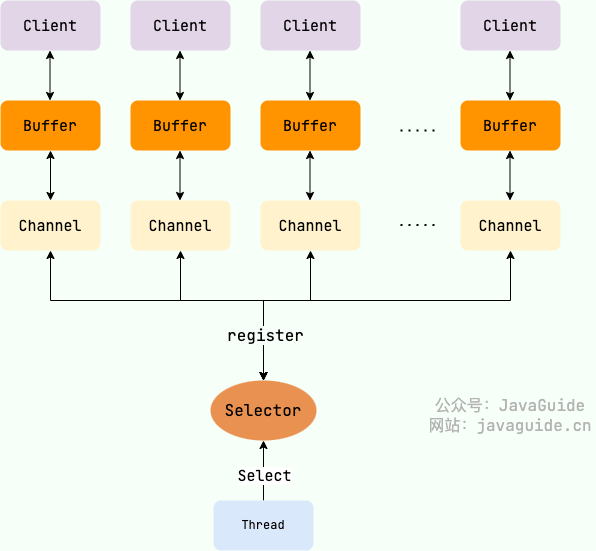

如果是比较大的文件，这样无意义的copy显然会极大的浪费CPU的效率，所以就诞生了DMA  

# Java面试题

#### 基础

###### jvm、jre、jdk

###### java是编译与解释并存的语言

###### java和c++区别

###### ^：按位异或

###### 左移、右移、无符号右移的原理

|             | 原码                             | 补码                                                        | 反码                                     | 左移                                | 右移                            | 无符号右移            |
| ----------- | ------------------------------ | --------------------------------------------------------- | -------------------------------------- | --------------------------------- | ----------------------------- | ---------------- |
| 负数          | 原码就是机器数，是加了一位符号位的二进制数。负数的符号位是1 | 负数的补码为 其原码除符号位外所有位取反（得到反码了），然后最低位加1。                      |                                        |                                   |                               |                  |
| 负数一般用补码来计算。 | 负数的反码等于原码除符号位以外所有的位取反          | 左侧的数字左移右侧数字的位数的结果，其规则为：丢弃最高为，0补最低位。因此，左移可以用作乘2操作的一个高效的实现。 | 先求补码，然后右移，左边空出的用1填补，然后求补码对应的原码(先-1再求反) | 负数，先求补码，然后不顾符号的右移，高位全部补0，最后就是所得值。 |                               |                  |
| 正数          | 原码就是机器数，是加了一位符号位的二进制数。正数的符号位是0 | 正数的补码与原码相同                                                | 正数的反码就是原码                              | 同负数                               | 先求补码，正数的补码就是原码，然后右移，左边空出的用0填补 | 正数的补码就是原码，所以直接右移 |

###### 左移、右移超过位数限制会怎样

###### continue、break、return区别

###### 基本数据类型：byte、short、int、long、float、double、char、boolean

###### 包装类型和基本类型的区别

###### 基本数据类型一定存放在栈中吗

###### 自动拆箱intValue、自动装箱valueOf

###### 浮点数和定点数的区别

浮点数通过二进制表达小数，通过2^-1,2^-2...表达小数，有误差-----java开发手册：二进制无法精确表示大部分十进制小数

```
二进制科学计数法
X = (-1)^S * M * R^E
S：取值0或1，决定一个数字的符号，0表示正，1表示负
M：二进制定点小数，表示数字的尾数，尾数的第一位总是1，因此可在尾数中省略第一位的1，这个1称为隐藏位，使得单精度尾数可表示24位有效数字
E：二进制定点整数，表示数字的阶码或指数，此时使用移码表示：(2^n-1)-1+E
R：基数，可以约定为2、4、16

单精度浮点数定义
32位表示浮点数，第1位表示符号位S，之后8位表示阶码E，最后23位表示尾数M

-0.75表示成二进制
0.75*2=1.5-------------------------1
0.5*2=1----------------------------1
-0.75(D)=-0.11(B)=-1.1*2^-1

单精度浮点数表示
符号位S=1，尾数M=1.1，阶码E=(2^8-1)-1-1=126(D)=01111110(B)
-0.75(H)的规格化浮点数为1 01111110 100 0000 0000 0000 0000 0000
```

###### BigDecimal的计数保留法最好是四舍六入五成双：BigDecimal.ROUND_HALF_EVEN

###### 静态方法为什么不能调用非静态成员?

###### 静态方法和实例方法有何不同？调用方式、访问类成员是否存在限制

###### 重载和重写有什么区别？

###### 什么是可变长参数？可变参数只能作为函数的最后一个参数，但其前面可以有也可以没有任何其他参数。遇到方法重载的情况怎么办呢？会优先匹配固定参数还是可变参数的方法呢？答案是会优先匹配固定参数的方法，因为固定参数的方法匹配度更高。

###### 面向对象和面向过程的区别

面向过程指的是把解决问题的过程拆成一个一个方法，通过方法的执行完成功能。

面向对象指的是先抽象出对象，通过对象执行方法的方式完成功能。面向对象更易维护、更易复用、更易拓展。

###### 类的构造方法

我们不定义类的构造方法的话，java会添加一个默认的无参构造方法，我们添加了一个（无论是否有参）构造方法，java就不会添加默认了。所以我们重载构造方法时，一定要加上无参构造方法。构造方法可以被重载，不可被重写。构造方法必须与类名相同，没有返回值，但不可以用void。new的时候调用构造方法。

###### 封装

封装是指把一个类的状态信息隐藏在类的内部，不允许外部对象直接访问类的内部信息，但是提供一些可以被外部访的方法来操作属性。如果一个对象没有对外部提供方法，那这个对象也就没有存在意义了。外部有时候不需要操作类内部的部分信息，只需要调用指定的方法就可以执行功能。

###### 继承

不同类型的对象之间有一些共性存在，这就是基础类。继承就是在基础类的基础上建立新类的技术，新类的定义可以增加新的数据和功能，也可以使用基础类的功能，但是不能选择性的继承，必须是全部继承。通过使用继承，可以提高代码重用性，增加程序可维护性，节省创造新类的时间，提高我们的开发效率。

###### 多态

多态是指一个对象具有多种状态，具体表现为父类的引用指向子类的实例。对象的引用和对象的实例之间具有继承/实现的关系。对象引用调用的方法，到底是对哪个类的调用是在运行期才能确定的。多态不能调用只在子类存在父类不存在的方法。如果子类重写了父类的方法，调用的是子类覆盖的方法，否则调用的是父类的方法。

###### 接口和抽象类的比较

接口和抽象类共同点：不可以被实例化；可以包含抽象方法；抽象类内可以实现方法，java8后接口可以拥有方法的默认实现。

接口和抽象类不同点：接口主要是对类的行为进行约束，实现一个接口就具有对应的行为，抽象类主要用于代码复用，强调的是主从关系；接口可以被多个继承，抽象类只能被继承一个；接口内的成员变量是public static final修饰，不能被修改，必须有初始值，抽象类的成员变量默认default赋值，可以被子类重新定义和重新赋值。

###### 浅拷贝和深拷贝

浅拷贝是指在堆上创建一个新对象，不过如果对象属性也是一个引用，那么这个引用会被拷贝过来直接使用。深拷贝是指在堆上创建一个新对象，包括重新创建对象内部的引用对象。

###### hashcode()返回的一定是对象地址吗？不一定，不同的jdk实现hashcode也不同，有的使用一些算法来实现，有的使用内存地址

###### 为什么重写equals方法也要重写hashcode方法呢？相同对象的hashcode一定要相等，所以重写equals方法后，hashcode方法也要重写，根据比较的属性异或得到结果，例如`return name.toUpperCase().hashCode() ^ age;`，这样在把对象放入hashset之类的哈希表结构时才能保证功能正常。

###### String、StringBuilder和StringBuffer的区别

String使用final修饰字符数组，且不对外暴露，每次修改String都会创建新对象；StringBuilder和StringBuffer都继承了AbstractStringBuilder类，但是StringBuilder对方法没有加同步锁，是线程不安全的；StringBuffer对方法加了同步锁，是线程安全的。

###### jdk9之后String、StringBuilder和StringBuffer底层都改为字节数组？

java认为大部分情况下的字符串只包含latin-1编码范围内的字符，即一个字节即可表示，使用char（两个字节）表示会浪费一半空间，所以默认使用一个字节表示字符，除非字符中有latin-1无法表示的字符，才会改用utf-16，使用两个字节表示。

###### +拼接字符串，java重载了+，底层使用了StringBuilder的append拼接，但是for循环调用+会创建过多StringBuilder对象，对内存还是不友好。

###### String reference3 = new String("a") + new String("b");reference3.intern();这句话创建了几个字符串对象？

创建一个堆中StringBuilder对象，两个堆中String对象a和b，一个字符串常量池中a字符串，一个字符串常量池中b字符串，一个堆中String对象ab;字符串常量池中没有ab字符串，创建一个字符串常量池中对堆内String对象ab的引用。=7个对象

###### String#intern 方法有什么作用?

`String.intern()` 是一个 native（本地）方法，其作用是将指定的字符串对象的引用保存在字符串常量池中，可以简单分为两种情况：

- 如果字符串常量池中保存了对应的字符串对象的引用，就直接返回该引用。
- 如果字符串常量池中没有保存了对应的字符串对象的引用，那就在常量池中创建一个指向该字符串对象的引用并返回。

```java
// 通过javap -c StringTest.class可以查看反编译的字节码
public class StringTest {
  public static void main(String[] args) {
    // 创建字符串常量池中"a"，创建堆中string对象，对象指向常量池中"a"，reference1引用堆中string对象地址
    String reference1 = new String("a");
    // intern方法先去字符串常量池中找是否有"a"字符串，此时常量池中已经有"a"了，直接返回给reference0常量池中的对象地址引用
    String reference0 = reference1.intern();
    // 字符串字面量赋值时也先去字符串常量池中找是否有"a"字符串，此时常量池中已经有"a"了，直接返回给reference2常量池中的对象地址引用
    String reference2 = "a";
    System.out.println(reference1 == reference2); // 堆中string对象地址 != 常量池中对象地址
    System.out.println(reference1 == reference0); // 堆中string对象地址 != 常量池中对象地址
    System.out.println(reference0 == reference2); // 常量池中对象地址 == 常量池中对象地址
    System.out.println("---------------------------");

    // 创建堆中对象StringBuilder，创建字符串常量池中"a"，创建堆中string对象指向常量池中"a"，创建堆中string对象指向常量池中"a"，stringBuilder对象执行toString方法创建堆中string对象"aa"，此时常量池中没有"aa"
    String reference3 = new String("a") + new String("a");
    // intern方法先去常量池中找是否有"aa"字符串，此时常量池中没有。则在字符串常量池中存储一个指向堆中string对象"aa"的引用，并把这个引用返回给reference4
    String reference4 = reference3.intern();
    // 字符串字面量赋值时也会先去字符串常量池中查找是否有"aa"字符串，此时常量池中已经有"aa"字符串的引用了，直接返回给reference5常量池中的这个新引用，新引用指向堆中string对象"aa"
    String reference5 = "aa";
    System.out.println(reference3 == reference4);
    System.out.println(reference3 == reference5);
    System.out.println(reference4 == reference5);
  }
}
```

###### try、catch、finally知识

如果在try和finally中都有return，则try中的return会被暂存起来，等到执行finally代码到return时，实际return的值是finally中的return。

如果没有catch，try后面一定要有finally。

finally中的代码一定会被执行吗？

如果执行finally代码前虚拟机终止了，则不会执行后面代码；程序的线程终止了，也不会执行finally里面代码。

try-with-resource可以代替finally关闭流的作用

###### 泛型类、泛型接口、泛型方法

###### 反射

优点：给予了框架提供开箱即用的能力，使代码更灵活

缺点：有安全问题，避开了泛型的安全检查，运行时性能较慢

应用场景：动态代理的实现依赖反射；框架中的注解使用到了反射：分析类得到类、方法、注解信息

例子：

```java
public class TargetObject {
  private String value;

  public TargetObject() {
    this.value = "c++";
  }

  public String publicMethod(String input) {
    return "I love " + input;
  }

  private String privateMethod() {
    return "value:" + this.value;
  }
}


public class Test {
  public static void main(String[] args)
      throws ClassNotFoundException,
          InstantiationException,
          IllegalAccessException,
          NoSuchMethodException,
          InvocationTargetException,
          NoSuchFieldException {
    // 反射创建class对象，生成类实例
    Class<?> targetClass = Class.forName("com.javaTest.JavaGuide.reflect.TargetObject");
    TargetObject targetObject = (TargetObject) targetClass.newInstance();
    // 打印类内部所有方法
    for (Method method : targetClass.getMethods()) {
      System.out.println(method.getName());
    }
    System.out.println("------------------");
    // 调用public方法
    //        Method publicMethod = targetClass.getMethod("publicMethod", String.class);
    Method publicMethod = targetClass.getDeclaredMethod("publicMethod", String.class);
    String result = (String) publicMethod.invoke(targetObject, "Java");
    System.out.println(result);

    // 设置类对象中成员变量值
    Field field = targetClass.getDeclaredField("value");
    field.setAccessible(true);
    field.set(targetObject, "JavaValue");
    System.out.println("------------------");
    // 调用private方法
    Method privateMethod = targetClass.getDeclaredMethod("privateMethod");
    privateMethod.setAccessible(true);
    String result2 = (String) privateMethod.invoke(targetObject);
    System.out.println(result2);
  }
}
```

###### 注解

是java5开始提供的功能，是特殊的注释，可用于类、方法、变量上，用于在编译期/运行期提供信息，本质是一个继承了Annotation的特殊接口

解析方式：部分注解如override在编译器编译代码时处理，用于检查是否子类重写了父类方法；部分注解在运行期间由框架根据反射技术分析类进行处理。

###### SPI

Service Provider Interface，即服务提供者的接口。API是由服务实现者提供接口和实现，由服务调用者直接调用服务提供者的接口达到服务调用。SPI是由服务调用者提供接口规则，由服务提供者实现接口内容。

应用场景：Spring框架、数据库驱动

优点：提供更高的代码灵活性、可拓展性、可维护性，将服务实现者和服务提供者接口解耦开来，避免实现逻辑污染调用方代码。

缺点：加载时需要循环加载全部的类，不能按需加载，较慢；多个serviceLoader执行load时容易出现并发问题

场景：服务调用者接口负责提供接口定义、规则制定。服务实现者负责实现接口逻辑。用户直接引入服务调用者接口和服务实现者，调用服务调用者接口的功能即可。后期切换实现者，只需要修改依赖即可，调用代码无感知。

基本原理：通过Serviceloader加载接口和实现类。ServiceLoader读取META-INF/services文件夹下所有文件名为接口，文件内容为实现类名的文件，根据内容调用反射生成对应的实现类。

###### 序列化和反序列化

应用场景：将对象放到网络中传输；存储到文件；存储到数据库；存储到内存中

原理：将对象转化成二进制字节流

序列化、反序列化协议存在表示层，是TCP/IP协议的一部分。序列化、反序列化无法保留深层复杂对象之间的引用关系。

常用协议：JDK自带、Kryo（dubbo推荐，针对java语言的）、ProtoBuf

不推荐JDK自带协议：不支持跨语言调用；JDK自带协议生成的字节数组较大，传输体积较大，效率较低；当反序列化时，攻击者可以操作反序列化数组达到修改生成对象内容的效果，存在安全问题。

###### IO流

java IO流分为字符流和字节流：InputStreamReader/OutputStreamWriter，InputStream/OutputStream

###### 语法糖

java语法糖包括：枚举、自动装箱、自动拆箱、可变长参数、泛型、switch字符串、条件编译、数值字面量中有下划线、增强for循环(for(aa  a: collection){})、try-with-resource、lambda表达式

switch本来不支持字符串，只支持short、char、int、long整数类型和枚举类型，且都会转换成整数类型进行判断。java7开始支持String，后面也支持了Character, Byte, Short, Integer。字符串类型的switch会被转换成hashcode比较+equals比较，性能上比基本数据类型差一点。

泛型是在编译期被擦除的类型，等到真正调用时才传入具体的类，调用处使用父类来接收。

可变长参数类似String... args，在编译后转换成对应类型的数组String args[]。

自动装/拆箱调用包装类的valueOf()和xxxValue()。

枚举类会被转换成泛型类继承enum类，在内部写好对应变量的赋值逻辑。

条件编译是指对if等判断语句中常量判断计算为false的部分不编译进去。

数值字面量中有下划线，编译时会去掉下划线，类似10_000_000->10000000。

增强for循环，for(Student stu:studentArr)->int length = studentArr.length;for(int i=0;io<length;i++)。对于容器类list的for循环会被转换成迭代器的循环。

try-with-resource其实也是转换后会被编译成try-catch的代码。

lambda表达式在编译时会转换成几个jvm提供的lambda api方法，并将内部匿名方法提取出来成独立方法进行调用，以此达到目的。

特殊情况：

1. 方法重载时仅仅是参数的泛型类不同，此时编译器会报错，因为泛型擦除后方法就一样了。random(List<String> names)和random(List<Integer> names)就不允许编译了。

2. 泛型类的静态变量在运行时与所有泛型类实现类共享，可被任意改变。

3. 自动装拆箱时，Integer等包装类对128内的数字用了缓存池，比较时有可能一样。

4. for循环时删除元素，会抛出cocurrentModificationException，可以用iterator循环处理，并删除元素。

###### final

放在类上，类无法被继承

放在方法上 ，方法无法被重写

放在变量上，基本数据类型无法被修改，引用数据类型无法被重新引用

###### static

静态成员变量和静态方法：静态成员变量属于类，可以直接由类调用，在java虚拟机方法区存储；静态方法只能调用类的静态成员变量；

静态代码块：[父类静态变量初始化、父类静态代码块(加载类时执行一次，仅执行一次)]->[子类静态变量初始化、子类静态代码块(加载类时执行一次，仅执行一次)]->子类main方法->[父类非静态变量初始化、父类非静态代码块(每次创建对象时执行一次)]->父类构造函数->[子类非静态变量初始化、子类非静态代码块(每次创建对象时执行一次)]->子类构造函数；

静态内部类和内部类：内部类暗含一个对外部类的引用；静态内部类不含，只能调用外部类静态成员和静态方法；

静态引用：import static 加上类名，可以直接调用类的静态方法和静态成员，无需再写类名。

静态代码块与非静态代码块区别：静态代码块只在类加载时执行一次/class.forName()加载，非静态代码块每次创建对象都执行。

非静态代码块和构造函数的区别：非静态代码块为每一个对象创建时都执行相同的初始化逻辑；构造函数由调用方主动选择用何种方式进行对象构造。

###### Java初始化类顺序

- (1)访问SubClass.main(),(这是一个static方法)，于是装载器就会为你寻找已经编译的SubClass类的代码（也就是SubClass.class文件）。在装载的过程中，装载器注意到它有一个基类（也就是extends所要表示的意思），于是它再装载基类。不管你创不创建基类对象，这个过程总会发生。如果基类还有基类，那么第二个基类也会被装载，依此类推。

- (2)执行根基类的static初始化，然后是下一个派生类的static初始化，依此类推。这个顺序非常重要，因为派生类的“static初始化”有可能要依赖基类成员的正确初始化。

- (3)当所有必要的类都已经装载结束，开始执行main()方法体，并用new SubClass（）创建对象。

- (4)类SubClass存在父类，则调用父类的构造函数，你可以使用super来指定调用哪个构造函数。基类的构造过程以及构造顺序，同派生类的相同。首先基类中各个变量按照字面顺序进行初始化，然后执行基类的构造函数的其余部分。

- (5)对子类成员数据按照它们声明的顺序初始化，执行子类构造函数的其余部分。

###### 代理模式

静态代理：从应用和实现角度来看，静态代理需要手动编写代理类，将代理对象需要增加的功能写进代理类中。从JVM角度，接口、被代理类、静态代理类都在编译期间被生成成对应的class。

动态代理：从应用角度，动态代理不需要我们对每一个类都增加一个代理类，不需要实现接口就可以完成代理。从JVM角度看，动态代理是在运行期间动态生成字节码加载到JVM中。

JDK动态代理：原理是代理类实现一个InvocationHandler接口和invoke方法，对被代理类执行增加的功能，最后抛出工厂类进行调用。缺点是只能代理实现了接口的类的方法，优点是性能好于CGLIB，且随着JDK的升级会越来越好。

CGLIB动态代理：使用了ASM的字节码增强库实现，基于继承实现类的方法代理。本质上是实现了被代理类的子类完成方法的拦截调用，优点是不需要类实现接口就可以代理方法，缺点是无法代理final修饰的方法，性能不如JDK。

###### 内部类

成员内部类可以直接访问外部类的成员变量，即使是private的。内部类的存在可以弥补类的单继承带来的缺陷，可以在类里面创建多个内部类继承多个类完成功能。    

局部内部类存在方法内或作用域内，可以解决一些复杂问题，同时不用对外抛出类。

匿名内部类需要一个接口，然后直接new一个接口的实例并实现接口内部的方法，特殊点在于传给匿名内部类的变量需要声明成final。

静态内部类是成员内部类的静态版本，它是独立的类，创建时不依赖外部类对象的创建，只能访问外部类静态成员/静态方法。

```java
public class OuterClass {
  private String name;
  private int age;
  private static String school;

  public String toString() {
    return "我是外部类的对象实例：(name：" + name + ";age：" + age + ")";
  }

  /** 成员内部类可以直接访问外部类的成员变量，即使是private的。内部类的存在可以弥补类的单继承带来的缺陷，可以在类里面创建多个内部类继承多个类完成功能。 */
  public class InnerClass {
    public InnerClass() {
      name = "孙权";
      age = 18;
    }

    public String toString() {
      return "我是成员内部类的对象实例：(name：" + name + ";age：" + age + ")";
    }
  }

  /** 静态内部类是成员内部类的静态版本，它是独立的类，创建时不依赖外部类对象的创建，只能访问外部类静态成员/静态方法。 */
  public static class InnerStaticClass {
    public String _name = "nonstatic";
    public static String _name2 = "static";

    public InnerStaticClass() {
      school = "南京邮电大学";
    }

    public String toString() {
      return "我是静态内部类的对象实例：(school：" + school + ";_name：" + _name + ";_name2：" + _name2 + ")";
    }
  }

  public static void main(String[] args)
      throws ClassNotFoundException, InstantiationException, IllegalAccessException {
    // 必须创建外部类对象，才能创建外部类对象的成员内部类对象。不能直接创建成员内部类对象
    OuterClass outerClass = new OuterClass();
    OuterClass.InnerClass innerClass = outerClass.new InnerClass();
    System.out.println(innerClass.toString());
    // 这样写运行时也会抛出异常
    //    OuterClass.InnerClass innerClassQQ = (InnerClass)
    // Class.forName("com.javaTest.JavaGuide.testClass.OuterClass.InnerClass").newInstance();
    //    System.out.println(innerClassQQ.toString());
    OuterClass outerClassQQ =
        (OuterClass) Class.forName("com.javaTest.JavaGuide.testClass.OuterClass").newInstance();
    System.out.println(outerClassQQ.toString());
    OuterClass.InnerStaticClass innerStaticClass = new InnerStaticClass();
    System.out.println(innerStaticClass.toString());
    // 局部内部类存在方法内或作用域内，可以解决一些复杂问题，同时不用对外抛出类。
    if (true) {
      class BlockInnerClass {
        private String className;

        public BlockInnerClass() {
          this.className = "BlockInnerClass";
        }

        public String toString() {
          return "我是局部内部类的对象实例：(className：" + this.className + ")";
        }
      }
      System.out.println(new BlockInnerClass().toString());
    }
    // 匿名内部类需要一个接口，然后直接new一个接口的实例并实现接口内部的方法，特殊点在于传给匿名内部类的变量需要声明成final。
    System.out.println(
        new IStudent() {
          @Override
          public String getInfo() {
            return "我是匿名内部类的实现类的getInfo方法";
          }
        }.getInfo());
  }
}
```

###### Unsafe类

unsafe类是java提供的可以直接操作内存的一个类，一般不建议在项目里使用，Netty等实现NIO的库会调用unsafe操作堆外内存，保证一些频繁从堆内拷贝到堆外的数据能更高效的进行操作，堆外内存不由jvm管理，由操作系统管理，需要手动释放内存。

unsafe提供cas功能，AtomicInteger等原子类也是调用对应的方法，只有CAS比较成功并赋值之后才会跳出循环。从而保证了多线程操作时的成功->cas就是自旋等待最终成功的线程安全解决方式。

###### Java只有值传递

原因可能是为了安全性，对于方法调用者来说，方法实现是未知的，使用值传递可以保证一部分的数据是无法被修改的。为了简单易用，避免引用传递产生的语义不理解，java实现只有值传递。

###### Java异常体系


#### 集合类

##### Collection

###### Arraylist

ArrayList继承了list接口、randomaccess接口（快速随机访问，通过下标访问）、serialize接口（可序列化）、cloneable接口（可拷贝），底层使用了数组对象，线程不安全。

Vector是list的古老实现类，底层使用数组对象，线程安全。

ArrayList和LinkedList比较：

- ArrayList底层是对象数组，LinkedList底层是双向链表。

- ArrayList指定元素位置增删改的时间复杂度是O(n)，因为需要修改对应位置元素，再把元素之后的所有元素向后位移一个；直接在末尾增删改的时间复杂度是O(1)，因为支持快速随机访问。

- LinkedList指定元素位置增删改的时间复杂度是O(n)，因为需要遍历找到对应位置元素；如果是直接在头部或者尾部插入元素，时间复杂度是O(1)，因为可以根据头部指针和尾部指针找到。

- ArrayList支持快速随机访问，即根据数组下标访问元素，时间复杂度是O(1)，LinkedList访问元素需要从队头开始顺序往下查找，时间复杂度是O(n)。

- ArrayList需要预留一些数组空间供下次增加元素使用，必要时需要扩容，占用一些额外内存空间。LikedList每一个链表元素都需要增加前驱和后驱指针，占用空间也会大一点。

ArrayList默认初始容量大小是10，创建list对象时数组未进行初始化，只有真正放入元素时才会初始化成10个大小的数组。数组添加元素的核心是扩容，一次扩容后大小调整为原来的1.5倍，底层是原大小+原大小右移一位得到结果。右移操作的除法在大数据时更高效，因为底层只需要移动一下数据位即可。

核心方法数组拷贝的实现是调用了System.arraycopy方法，传入原数组和目标数组，指定原数组从哪个位置开始移动元素到新数组指定位置，其他元素直接拷贝。

相关文章：[ArrayList 源码分析 | JavaGuide(Java面试 + 学习指南)](https://javaguide.cn/java/collection/arraylist-source-code.html#_3-1-%E5%85%88%E4%BB%8E-arraylist-%E7%9A%84%E6%9E%84%E9%80%A0%E5%87%BD%E6%95%B0%E8%AF%B4%E8%B5%B7)

###### Linkedlist

LikedList查找指定位置元素的方式：检查位置是大于当前大小的一半还是小于一半。大于一半则从尾部元素向前遍历查找；小于一半则从头部元素向后遍历查找。双向链表(JDK1.6 之前为循环链表，JDK1.7 取消了循环)。

相关文章：[LinkedList 源码分析 | JavaGuide(Java面试 + 学习指南)](https://javaguide.cn/java/collection/linkedlist-source-code.html)

###### Vector

`Vector` 是 `List` 的古老实现类，底层使用`Object[]` 存储，线程安全。使用 `synchronized` 关键字进行同步处理。

###### Slack

Stack继承自Vector，是一个后进先出的栈，而Vector是一个列表。

###### 比较 HashSet、LinkedHashSet 和 TreeSet 三者的异同

- `HashSet`、`LinkedHashSet` 和 `TreeSet` 都是 `Set` 接口的实现类，都能保证元素唯一，并且都不是线程安全的。
- `HashSet`、`LinkedHashSet` 和 `TreeSet` 的主要区别在于底层数据结构不同。`HashSet` 的底层数据结构是哈希表（基于 `HashMap` 实现）。`LinkedHashSet` 的底层数据结构是链表和哈希表，元素的插入和取出顺序满足 FIFO。`TreeSet` 底层数据结构是红黑树，元素是有序的，排序的方式有自然排序和定制排序。
- 底层数据结构不同又导致这三者的应用场景不同。`HashSet` 用于不需要保证元素插入和取出顺序的场景，`LinkedHashSet` 用于保证元素的插入和取出顺序满足 FIFO 的场景，`TreeSet` 用于支持对元素自定义排序规则的场景。

###### 需要确认某个元素是否在集合内的时候，为什么hashset比list性能更好呢？

hashset使用contains确认某个元素是否在集合内部时使用了hashmap的containskey方法，时间复杂度接近O(1)，没有出现hash碰撞的情况下。list的contains方法需要遍历整个数组，时间复杂度是O(n)。hashset可以去重。

###### HashMap 和 HashSet 区别

如果你看过 `HashSet` 源码的话就应该知道：`HashSet` 底层就是基于 `HashMap` 实现的。（`HashSet` 的源码非常非常少，因为除了 `clone()`、`writeObject()`、`readObject()`是 `HashSet` 自己不得不实现之外，其他方法都是直接调用 `HashMap` 中的方法。

| `HashMap`                       | `HashSet`                                                                          |
| ------------------------------- | ---------------------------------------------------------------------------------- |
| 实现了 `Map` 接口                    | 实现 `Set` 接口                                                                        |
| 存储键值对                           | 仅存储对象                                                                              |
| 调用 `put()`向 map 中添加元素           | 调用 `add()`方法向 `Set` 中添加元素，底层将元素放到hashmap的key中                                      |
| `HashMap` 使用键（Key）计算 `hashcode` | `HashSet` 使用成员对象来计算 `hashcode` 值，对于两个对象来说 `hashcode` 可能相同，所以`equals()`方法用来判断对象的相等性 |

###### HashSet 如何检查重复?

当你把对象put进入`HashSet`时，`HashSet` 会先计算对象的`hashcode`值来判断对象加入的位置，同时也会与其他加入的对象的 `hashcode` 值作比较，如果没有相符的 `hashcode`，`HashSet` 会假设对象没有重复出现。但是如果发现有相同 `hashcode` 值的对象，这时会调用`equals()`方法来检查 `hashcode` 相等的对象是否真的相同。如果两者相同，`HashSet` 就返回false，并使用新元素覆盖旧元素。

###### Queue 与 Deque 的区别

`Queue` 是单端队列，只能从一端插入元素，另一端删除元素，实现上一般遵循 **先进先出（FIFO）** 规则。

`Queue` 扩展了 `Collection` 的接口，根据 **因为容量问题而导致操作失败后处理方式的不同** 可以分为两类方法: 一种在操作失败后会抛出异常，另一种则会返回特殊值。

| `Queue` 接口 | 抛出异常      | 返回特殊值      |
| ---------- | --------- | ---------- |
| 插入队尾       | add(E e)  | offer(E e) |
| 删除队首       | remove()  | poll()     |
| 查询队首元素     | element() | peek()     |

`Deque` 是双端队列，在队列的两端均可以插入或删除元素。

`Deque` 扩展了 `Queue` 的接口, 增加了在队首和队尾进行插入和删除的方法，同样根据失败后处理方式的不同分为两类：

| `Deque` 接口 | 抛出异常          | 返回特殊值           |
| ---------- | ------------- | --------------- |
| 插入队首       | addFirst(E e) | offerFirst(E e) |
| 插入队尾       | addLast(E e)  | offerLast(E e)  |
| 删除队首       | removeFirst() | pollFirst()     |
| 删除队尾       | removeLast()  | pollLast()      |
| 查询队首元素     | getFirst()    | peekFirst()     |
| 查询队尾元素     | getLast()     | peekLast()      |

事实上，`Deque` 还提供有 `push()` 和 `pop()` 等其他方法，可用于模拟栈。

###### 说一说 PriorityQueue

`PriorityQueue` 是在 JDK1.5 中被引入的, 其与 `Queue` 的区别在于元素出队顺序是与优先级相关的，即总是优先级最高的元素先出队。

这里列举其相关的一些要点：

- `PriorityQueue` 利用了二叉堆的数据结构来实现的，底层使用可变长的数组来存储数据
- `PriorityQueue` 通过堆元素的上浮和下沉，实现了在 O(logn) 的时间复杂度内插入元素和删除堆顶元素。
- `PriorityQueue` 是非线程安全的，且不支持存储 `NULL` 和 `non-comparable` 的对象。
- `PriorityQueue` 默认是小顶堆，但可以接收一个 `Comparator` 作为构造参数，从而来自定义元素优先级的先后。

`PriorityQueue` 在面试中可能更多的会出现在手撕算法的时候，典型例题包括堆排序、求第 K 大的数、带权图的遍历等，所以需要会熟练使用才行。

##### Map

###### hashmap

hashmap在jdk1.8之前是数组+链表的实现方式，jdk1.8之后是数组+链表或红黑树的实现方式。hashmap初始容量为16，扩容后体积为两倍，负载因子默认是0.75，大于负载因子*容量时进行扩容操作。负载因子太大，会导致数组过于密集，容易产生hash碰撞现象；负载因子太低会导致数组过于稀疏，数组利用率低。

对比jdk1.8之前和jdk1.8之后：

1. jdk1.8之前只有数组+链表，jdk1.8之后增加红黑树，但是判断红黑树的逻辑顺序如下：当链表长度大于等于8时，继续判断，当hashmap数组长度大于等于64时，才会转换链表为红黑树；当长度小于64时，会先将数组扩容，之后重新计算元素下标，以此避免hash碰撞；

2. jdk1.8之前的hash函数运算速度较慢，使用了四次右移操作，jdk1.8之后的hash函数简化为一次右移操作。

3. jdk1.8之前，hash碰撞后的链表是头插法，jdk1.8之后的链表是尾插法。

扩容逻辑：

插入元素时判断条件：如果插入数组索引处没有元素，直接插入；如果有元素，判断是否是链表，链表的条件下，从链表内开始从头部遍历检查元素，是否hash值相同，是否key相同，相同的才会覆盖，全部不相同的在尾部插入元素；红黑树的条件下，调用红黑树的插入方法。调用插入之前，判断链表长度是否大于等于8，当链表长度大于等于8时，继续判断，当hashmap数组长度大于等于64时，才会转换链表为红黑树；当长度小于64时，会先将数组扩容，之后重新计算元素下标，以此避免hash碰撞。

###### HashMap 的长度为什么是 2 的幂次方？

为了能让 HashMap 存取高效，尽量较少碰撞，也就是要尽量把数据分配均匀。我们上面也讲到了过了，Hash 值的范围值-2147483648 到 2147483647，前后加起来大概 40 亿的映射空间，只要哈希函数映射得比较均匀松散，一般应用是很难出现碰撞的。但问题是一个 40 亿长度的数组，内存是放不下的。所以这个散列值是不能直接拿来用的。用之前还要先做对数组的长度取模运算，得到的余数才能用来要存放的位置也就是对应的数组下标。这个数组下标的计算方法是“ `(n - 1) & hash`”。（n 代表数组长度）。这也就解释了 HashMap 的长度为什么是 2 的幂次方。

**这个算法应该如何设计呢？**

我们首先可能会想到采用%取余的操作来实现。但是，重点来了：**“取余(%)操作中如果除数是 2 的幂次则等价于与其除数减一的与(&)操作（也就是说 hash%length==hash&(length-1)的前提是 length 是 2 的 n 次方；）。”** 并且 **采用二进制位操作 &，相对于%能够提高运算效率，这就解释了 HashMap 的长度为什么是 2 的幂次方。**

###### LinkedHashMap

什么是 LinkedHashMap？

`LinkedHashMap` 是 Java 集合框架中 `HashMap` 的一个子类，它继承了 `HashMap` 的所有属性和方法，并且在 `HashMap` 的基础重写了 `afterNodeRemoval`、`afterNodeInsertion`、`afterNodeAccess` 方法。使之拥有顺序插入和访问有序的特性。它在底层增加了双向链表保证插入顺序，相对于hashmap插入性能有所下降，查询性能有所提升，适用于需要保证插入顺序的场景。


###### LinkedHashMap 如何按照访问顺序迭代元素？

`LinkedHashMap` 可以通过构造函数中的 `accessOrder` 参数指定按照访问顺序迭代元素。当 `accessOrder` 为 true 时，每次访问一个元素时，该元素会被移动到链表的末尾，因此下次访问该元素时，它就会成为链表中的最后一个元素，从而实现按照访问顺序迭代元素。

###### LinkedHashMap 如何实现 LRU 缓存？

将 `accessOrder` 设置为 true 并重写 `removeEldestEntry` 方法当链表大小超过容量时返回 true，使得每次访问一个元素时，该元素会被移动到链表的末尾。一旦插入操作让 `removeEldestEntry` 返回 true 时，视为缓存已满，`LinkedHashMap` 就会将链表首元素移除，由此我们就能实现一个 LRU 缓存。

```java
public class LRUCache<K, V> extends LinkedHashMap<K, V> {
    private final int capacity;

    public LRUCache(int capacity) {
        super(capacity, 0.75f, true);
        this.capacity = capacity;
    }

    /**
     * 判断size超过容量时返回true，告知LinkedHashMap移除最老的缓存项(即链表的第一个元素)
     */
    @Override
    protected boolean removeEldestEntry(Map.Entry<K, V> eldest) {
        return size() > capacity;
    }
}

//测试代码
LRUCache < Integer, String > cache = new LRUCache < > (2);
cache.put(1, "one");
cache.put(2, "two");
cache.put(3, "three");
cache.put(4, "four");
for (int i = 0; i < 4; i++) {
    System.out.println(cache.get(i));
}

// 输出
null
null
three
four
```

###### 什么是fail-fast机制？fail-fast和fail-safe

[什么是fail-fast - 程序员自由之路 - 博客园](https://www.cnblogs.com/54chensongxia/p/12470446.html) 

###### HashMap 和 TreeMap 区别

`TreeMap` 和`HashMap` 都继承自`AbstractMap` ，但是需要注意的是`TreeMap`它还实现了`NavigableMap`接口和`SortedMap` 接口。实现 `NavigableMap` 接口让 `TreeMap` 有了对集合内元素的搜索的能力。

实现`SortedMap`接口让 `TreeMap` 有了对集合中的元素根据键排序的能力。默认是按 key 的升序排序，不过我们也可以指定排序的比较器。

相比于`HashMap`来说 `TreeMap` 主要多了对集合中的元素根据键排序的能力以及对集合内元素的搜索的能力。

###### ConcurrentHashMap 和 Hashtable 的区别

`ConcurrentHashMap` 和 `Hashtable` 的区别主要体现在实现线程安全的方式上不同。

- **底层数据结构：** JDK1.7 的 `ConcurrentHashMap` 底层采用 **分段的数组+链表** 实现，JDK1.8 采用的数据结构跟 `HashMap1.8` 的结构一样，数组+链表/红黑二叉树。`Hashtable` 和 JDK1.8 之前的 `HashMap` 的底层数据结构类似都是采用 **数组+链表** 的形式，数组是 HashMap 的主体，链表则是主要为了解决哈希冲突而存在的；
- **实现线程安全的方式（重要）：**
  - 在 JDK1.7 的时候，`ConcurrentHashMap` 对整个桶数组进行了分割分段(`Segment`，分段锁)，每一把锁只锁容器其中一部分数据（下面有示意图），多线程访问容器里不同数据段的数据，就不会存在锁竞争，提高并发访问率。
  - 到了 JDK1.8 的时候，`ConcurrentHashMap` 已经摒弃了 `Segment` 的概念，而是直接用 `Node` 数组+链表+红黑树的数据结构来实现，并发控制使用 `synchronized` 和 CAS 来操作。（JDK1.6 以后 `synchronized` 锁做了很多优化） 整个看起来就像是优化过且线程安全的 `HashMap`，虽然在 JDK1.8 中还能看到 `Segment` 的数据结构，但是已经简化了属性，只是为了兼容旧版本；
  - **`Hashtable`(同一把锁)** :使用 `synchronized` 来保证线程安全，效率非常低下。当一个线程访问同步方法时，其他线程也访问同步方法，可能会进入阻塞或轮询状态，如使用 put 添加元素，另一个线程不能使用 put 添加元素，也不能使用 get，竞争会越来越激烈效率越低。

下面，我们再来看看两者底层数据结构的对比图。

**JDK1.7 的 ConcurrentHashMap**：


`ConcurrentHashMap` 是由 `Segment` 数组结构和 `HashEntry` 数组结构组成。

`Segment` 数组中的每个元素包含一个 `HashEntry` 数组，每个 `HashEntry` 数组属于链表结构。

`Segment` 继承了 `ReentrantLock`,所以 `Segment` 是一种可重入锁，扮演锁的角色。`HashEntry` 用于存储键值对数据。

```java
static class Segment<K,V> extends ReentrantLock implements Serializable {
}
```

一个 `ConcurrentHashMap` 里包含一个 `Segment` 数组，`Segment` 的个数一旦**初始化就不能改变**。 `Segment` 数组的大小默认是 16，也就是说默认可以同时支持 16 个线程并发写。

`Segment` 的结构和 `HashMap` 类似，是一种数组和链表结构，一个 `Segment` 包含一个 `HashEntry` 数组，每个 `HashEntry` 是一个链表结构的元素，每个 `Segment` 守护着一个 `HashEntry` 数组里的元素，当对 `HashEntry` 数组的数据进行修改时，必须首先获得对应的 `Segment` 的锁。也就是说，对同一 `Segment` 的并发写入会被阻塞，不同 `Segment` 的写入是可以并发执行的。

**JDK1.8 的 ConcurrentHashMap**：


JDK1.8 的 `ConcurrentHashMap` 不再是 **Segment 数组 + HashEntry 数组 + 链表**，而是 **Node 数组 + 链表 / 红黑树**。不过，Node 只能用于链表的情况，红黑树的情况需要使用 **`TreeNode`**。ConcurrentHashMap的链表转红黑树的判断条件也是和hashmap类似：只有数组长度大于64，且链表长度大于8才会开始树化。

`TreeNode`是存储红黑树节点，被`TreeBin`包装。`TreeBin`通过`root`属性维护红黑树的根结点，因为红黑树在旋转的时候，根结点可能会被它原来的子节点替换掉，在这个时间点，如果有其他线程要写这棵红黑树就会发生线程不安全问题，所以在 `ConcurrentHashMap` 中`TreeBin`通过`waiter`属性维护当前使用这棵红黑树的线程，来防止其他线程的进入。

```java
static final class TreeBin<K,V> extends Node<K,V> {
        TreeNode<K,V> root;
        volatile TreeNode<K,V> first;
        volatile Thread waiter;
        volatile int lockState;
        // values for lockState
        static final int WRITER = 1; // set while holding write lock
        static final int WAITER = 2; // set when waiting for write lock
        static final int READER = 4; // increment value for setting read lock
...
}
```

###### JDK 1.7 和 JDK 1.8 的 ConcurrentHashMap 实现有什么不同？

- **线程安全实现方式**：JDK 1.7 采用 `Segment` 分段锁来保证安全， `Segment` 是继承自 `ReentrantLock`。JDK1.8 放弃了 `Segment` 分段锁的设计，采用 `Node + CAS + synchronized` 保证线程安全，锁粒度更细，`synchronized` 只锁定当前链表或红黑二叉树的首节点。
- **Hash 碰撞解决方法** : JDK 1.7 采用拉链法，JDK1.8 采用拉链法结合红黑树（链表长度超过一定阈值时，将链表转换为红黑树）。
- **并发度**：JDK 1.7 最大并发度是 Segment 的个数，默认是 16。JDK 1.8 最大并发度是 Node 数组的大小，并发度更大。

###### ConcurrentHashMap 为什么 key 和 value 不能为 null？

`ConcurrentHashMap` 的 key 和 value 不能为 null 主要是为了避免二义性。null 是一个特殊的值，表示没有对象或没有引用。如果你用 null 作为键，那么你就无法区分这个键是否存在于 `ConcurrentHashMap` 中，还是根本没有这个键。同样，如果你用 null 作为值，那么你就无法区分这个值是否是真正存储在 `ConcurrentHashMap` 中的，还是因为找不到对应的键而返回的。

拿 get 方法取值来说，返回的结果为 null 存在两种情况：

- 值没有在集合中 ；
- 值本身就是 null。

这也就是二义性的由来。

多线程环境下，存在一个线程操作该 `ConcurrentHashMap` 时，其他的线程将该 `ConcurrentHashMap` 修改的情况，所以无法通过 `containsKey(key)` 来判断否存在这个键值对，也就没办法解决二义性问题了。

与此形成对比的是，`HashMap` 可以存储 null 的 key 和 value，但 null 作为键只能有一个，null 作为值可以有多个。如果传入 null 作为参数，就会返回 hash 值为 0 的位置的值。单线程环境下，不存在一个线程操作该 HashMap 时，其他的线程将该 `HashMap` 修改的情况，所以可以通过 `contains(key)`来做判断是否存在这个键值对，从而做相应的处理，也就不存在二义性问题。

也就是说，多线程下无法正确判定键值对是否存在（存在其他线程修改的情况），单线程是可以的（不存在其他线程修改的情况）。

###### 如何保证 `ConcurrentHashMap` 复合操作的原子性呢？

`ConcurrentHashMap` 提供了一些原子性的复合操作，如 `putIfAbsent`、`compute`、`computeIfAbsent` 、`computeIfPresent`、`merge`等。这些方法都可以接受一个函数作为参数，根据给定的 key 和 value 来计算一个新的 value，并且将其更新到 map 中。

上面的代码可以改写为：

```java
// 线程 A
map.putIfAbsent(key, value);
// 线程 B
map.putIfAbsent(key, anotherValue);
```

或者：

```java
// 线程 A
map.computeIfAbsent(key, k -> value);
// 线程 B
map.computeIfAbsent(key, k -> anotherValue);
```

很多同学可能会说了，这种情况也能加锁同步呀！确实可以，但不建议使用加锁的同步机制，违背了使用 `ConcurrentHashMap` 的初衷。在使用 `ConcurrentHashMap` 的时候，尽量使用这些原子性的复合操作方法来保证原子性。

###### JDK1.7下ConcurrentHashMap的put方法->ensureSegment方法->put方法赋值

ensureSegment的功能是当segement数组此位置为空时，初始化一个segment对象到这个位置。核心逻辑是while循环判断这个位置没有对象，然后调用unsafe方法cas一次，尝试把segment放到这个位置上。

###### JDK1.8下ConcurrentHashMap的put方法

put方法是比较核心的业务逻辑方法，其主要思路就是：先进入循环，判断如果node数组没有初始化，就先进行初始化操作；接着判断node数组对应位置的node元素是否存在，如果不存在，就尝试cas赋值一次，成功就跳出循环；如果其他线程已经在这个位置放置元素了，就继续走下面逻辑。下面就是根据元素是链表还是红黑树分别进行操作：链表的情况下，一个一个往下判断，检查hash值、key值相同的元素，找到的话就替换对应的value值，直到找到链表尾部，如果还找不到，就新增一个尾部元素；如果是红黑树就直接调用红黑树的方法直接放元素进去。

#### IO

Java io流一般分为字符流和字节流，从输入角度又分为输入流和输出流。字节流包括InputStream、FileInputStream(读取文件操作)、BufferedInputStream(字节缓冲输入流，配合FileInputStream使用)、DataInputStream(读取一些基本数据类型数据)、ObjectInputStream(读取一些对象数据类型数据)。字符流包括Reader、InputStreamReader、FileReader(读取文件操作)、BufferedReader(字符缓冲输入流，配合FileReader使用)、Writer、OutputStreamWriter、FileWriter。

###### 为什么要用字符流？

当输入/输出内容是字符时，使用字符流更方便，默认字符流使用unicode编码，如果使用字节流直接读取中文字符，会出现乱码。utf8 :英文占 1 字节，中文占 3 字节，unicode：任何字符都占 2 个字节，gbk：英文占 1 字节，中文占 2 字节。

###### 为什么会出现字节缓冲输入流/字节缓冲输出流？

BufferedInputStream/BufferedOutputStream内部使用字节数组保存了一个字节的缓冲，使用输入流时，BufferedInputStream默认读取一部分输入内容到缓冲中，这样大幅减少了 IO 次数，当我们调用read方法时直接读取内存中的缓冲内容即可，比FileInputStream快一点。当使用int接收read方法时，使用BufferedInputStream性能较FileInputStream快很多，如果使用byte[]接收read方法时，BufferedInputStream性能提升就不会那么显著了。同理可以用在BufferedReader/BufferedWriter。

###### 随机访问流

RandomAccessFile的特点是可以设置从文件哪个字节偏移量开始写入内容。这个典型应用场景是大文件分片上传。write方法在写入对象的时候如果对应的位置已经有数据的话，会将其覆盖掉。断点续传也可以用到，上传时只需要从未上传的分片开始继续上传即可。seek(long pos)方法来设置文件指针的偏移量（距文件开头pos个字节处）。如果想要获取文件指针当前的位置的话，可以使用getFilePointer()方法。

文件分片后，合并文件的代码如下：


###### 适配器模式

**适配器（Adapter Pattern）模式** 主要用于接口互不兼容的类的协调工作，你可以将其联想到我们日常经常使用的电源适配器。

适配器模式中存在被适配的对象或者类称为 **适配者(Adaptee)** ，作用于适配者的对象或者类称为**适配器(Adapter)** 。适配器分为对象适配器和类适配器。类适配器使用继承关系来实现，对象适配器使用组合关系来实现。

IO 流中的字符流和字节流的接口不同，它们之间可以协调工作就是基于适配器模式来做的，更准确点来说是对象适配器。通过适配器，我们可以将字节流对象适配成一个字符流对象，这样我们可以直接通过字节流对象来读取或者写入字符数据。

`InputStreamReader` 和 `OutputStreamWriter` 就是两个适配器(Adapter)， 同时，它们两个也是字节流和字符流之间的桥梁。`InputStreamReader` 使用 `StreamDecoder` （流解码器）对字节进行解码，**实现字节流到字符流的转换，** `OutputStreamWriter` 使用`StreamEncoder`（流编码器）对字符进行编码，实现字符流到字节流的转换。

###### 观察者模式

NIO 中的文件目录监听服务使用到了观察者模式。

NIO 中的文件目录监听服务基于 `WatchService` 接口和 `Watchable` 接口。`WatchService` 属于观察者，`Watchable` 属于被观察者。

`Watchable` 接口定义了一个用于将对象注册到 `WatchService`（监控服务） 并绑定监听事件的方法 `register` 。

```java
public interface Path
    extends Comparable<Path>, Iterable<Path>, Watchable{
}

public interface Watchable {
    WatchKey register(WatchService watcher,
                      WatchEvent.Kind<?>[] events,
                      WatchEvent.Modifier... modifiers)
        throws IOException;
}
```

`WatchService` 用于监听文件目录的变化，同一个 `WatchService` 对象能够监听多个文件目录。

```java
// 创建 WatchService 对象
WatchService watchService = FileSystems.getDefault().newWatchService();

// 初始化一个被监控文件夹的 Path 类:
Path path = Paths.get("workingDirectory");
// 将这个 path 对象注册到 WatchService（监控服务） 中去
WatchKey watchKey = path.register(
watchService, StandardWatchEventKinds...);
```

`Path` 类 `register` 方法的第二个参数 `events` （需要监听的事件）为可变长参数，也就是说我们可以同时监听多种事件。

```java
WatchKey register(WatchService watcher,
                  WatchEvent.Kind<?>... events)
    throws IOException;
```

常用的监听事件有 3 种：

- `StandardWatchEventKinds.ENTRY_CREATE`：文件创建。
- `StandardWatchEventKinds.ENTRY_DELETE` : 文件删除。
- `StandardWatchEventKinds.ENTRY_MODIFY` : 文件修改。

`register` 方法返回 `WatchKey` 对象，通过`WatchKey` 对象可以获取事件的具体信息比如文件目录下是创建、删除还是修改了文件、创建、删除或者修改的文件的具体名称是什么。

```java
WatchKey key;
while ((key = watchService.take()) != null) {
    for (WatchEvent<?> event : key.pollEvents()) {
      // 可以调用 WatchEvent 对象的方法做一些事情比如输出事件的具体上下文信息
    }
    key.reset();
}
```

`WatchService` 内部是通过一个 daemon thread（守护线程）采用定期轮询的方式来检测文件的变化，简化后的源码如下所示。

```java
class PollingWatchService
    extends AbstractWatchService
{
    // 定义一个 daemon thread（守护线程）轮询检测文件变化
    private final ScheduledExecutorService scheduledExecutor;

    PollingWatchService() {
        scheduledExecutor = Executors
            .newSingleThreadScheduledExecutor(new ThreadFactory() {
                 @Override
                 public Thread newThread(Runnable r) {
                     Thread t = new Thread(r);
                     t.setDaemon(true);
                     return t;
                 }});
    }

  void enable(Set<? extends WatchEvent.Kind<?>> events, long period) {
    synchronized (this) {
      // 更新监听事件
      this.events = events;

        // 开启定期轮询
      Runnable thunk = new Runnable() { public void run() { poll(); }};
      this.poller = scheduledExecutor
        .scheduleAtFixedRate(thunk, period, period, TimeUnit.SECONDS);
    }
  }
}
```

###### 同步、异步、阻塞、非阻塞怎么理解？

同步和异步是用来描述被调用者的。

比如A调用B。同步是指，当A调用B之后，B会立即执行要做的事，A的本次调用会得到结果。异步是指，当A调用B之后，B不会保证立即执行要做的事，但是保证一定会做，B在未来某个时间执行完后会通知A。A的本次调用不会产生结果，但是B执行完后会通知A。

阻塞和非阻塞是用来描述调用者的。

比如A调用B。阻塞是指，当A调用B之后，会一直等待，等着B返回结果。非阻塞是指，当A调用B之后，不需要等待，可以去做其他的事情。是否同步和是否阻塞没有必然关系。

存在同步阻塞、同步非阻塞、异步阻塞、异步非阻塞四种模型。

##### io模型

UNIX 系统下， IO 模型一共有 5 种：**同步阻塞 I/O**、**同步非阻塞 I/O**、**I/O 多路复用**、**信号驱动 I/O** 和**异步 I/O**。

###### BIO (Blocking I/O)

BIO 属于同步阻塞 I/O 模型 。

同步阻塞 IO 模型中，应用程序主动发起recv_from调用后，会一直阻塞，直到内核把数据拷贝到用户空间。


在客户端连接数量不高的情况下，是没问题的。但是，当面对十万甚至百万级连接的时候，传统的 BIO 模型是无能为力的。因此，我们需要一种更高效的 I/O 处理模型来应对更高的并发量。

###### 同步非阻塞 I/O


在同步非阻塞I/O模型中，应用程序先发起recv_from系统调用，此时系统会检查数据是否缓冲完成，如果没有，则直接返回。此后应用程序隔段时间就会发起一次recv_from系统调用，系统都会返回，直到数据已经缓冲到内核缓冲区。此时应用程序发起recv_from系统调用时，内核将开始拷贝内核缓冲区中的数据到应用程序内存中，直到数据拷贝完成，这个时候内核会返回给应用程序，应用程序开始处理数据。在拷贝期间，应用程序处于阻塞状态。可以看出，同步非阻塞I/O模型相对于阻塞模型来说，准备数据和数据拷贝到到内核缓冲区的过程都是非阻塞的，应用程序的调用都是立即返回的。直到内核开始从内核缓冲区中拷贝数据到应用程序内存中的时期，才会使应用程序处于阻塞状态。这里的同步是指内核复制数据到应用程序是同步进行的，非阻塞是指应用程序在确认数据是否缓冲完毕的时候是非阻塞进行的。

但是，这种 IO 模型同样存在问题：**应用程序不断进行 I/O 系统调用轮询数据是否已经准备好的过程是十分消耗 CPU 资源的。**

###### I/O 多路复用


I/O 多路复用模型中，线程首先发起 select 调用，询问内核查询的多个套接字是否准备好数据了，此时一直处于阻塞状态，等到某一个套接字数据准备好了，内核才会返回结果，此时用户线程再发起recv_from调用。recv_from调用的过程（数据从内核空间 -> 用户空间）还是阻塞的。这个IO模型本质上依然是同步阻塞模型。

> 目前支持 IO 多路复用的系统调用，有 select，epoll 等等。select 系统调用，目前几乎在所有的操作系统上都有支持。
> 
> - **select 调用**：内核提供的系统调用，它支持一次查询多个系统调用的可用状态。几乎所有的操作系统都支持。缺点是单个进程可以监控的套接字数量有上限，在Linux上一般是1024。
> - **epoll 调用**：linux 2.6 内核，属于 select 调用的增强版本，优化了 IO 的执行效率。

IO 多路复用模型，相对于阻塞I/O模型，似乎不显出什么优势，但是当select调用查询多个套接字时，将比单个调用的BIO方便不少，系统性能也会得到提升，cpu资源消耗相对更小。

Java 中的 NIO ，有一个非常重要的**选择器 ( Selector )** 的概念，也可以被称为 **多路复用器**。通过它，只需要一个线程便可以管理多个客户端连接。当客户端数据到了之后，才会为其服务。



###### 信号驱动 I/O


这个模型似乎未出现在java中，还是一个系统模型。这个模型主要是应用程序先发起一个sigaction系统调用，产生一个信号处理程序，此时内核会立即返回。直到内核中数据准备好，数据拷贝到内核缓冲区中，此后内核会按照约定递交sigio信号，应用程序接收到后会按照自己产生的信号处理程序继续发起recv_from系统调用，此时内核将内核缓冲区的数据复制到应用程序内存中，完成后返回。可以看出这个模型在数据准备阶段不需要阻塞，也不会出现频繁系统调用产生的系统资源浪费，全部流程基于约定的信号和数据处理程序，只是最后的内核缓冲区数据拷贝到应用程序内存中这个时期应用程序还是处于阻塞状态。

###### 异步 I/O（AIO）


异步I/O模型是应用程序发起aio_read系统调用，内核检查数据未准备好，则直接返回。直到内核接收到数据且在内核缓冲区准备好数据，且内核按照约定将内核缓冲区的数据拷贝到应用程序内存中指定位置，此后内核会按照约定通知应用程序。此时应用程序可以开始处理数据。在此期间，应用程序未处于阻塞状态。这是真正的异步非阻塞IO。

Java 7 中引入了 NIO 的改进版 NIO 2,它是异步 IO 模型。目前来说 AIO 的应用还不是很广泛。Netty 之前也尝试使用过 AIO，不过又放弃了。这是因为，Netty 使用了 AIO 之后，在 Linux 系统上的性能并没有多少提升。

##### 零拷贝

要想理解零拷贝，首先要了解操作系统的IO流程，因为有内核态和用户态的区别，为了保证安全性和缓存，普通的读写流程如下： 
（对于Java程序，还会多了一个堆外内存和堆内存之间的copy）


整体的流程如下所示： 

1. 用户read发起系统调用，由用户态进入内核态，通过DMA技术将磁盘中的数据copy到内核缓冲区中

2. 当DMA完成工作后，会发起一个中断通知CPU数据拷贝完成，然后CPU再将内核态中的数据copy到用户态中

3. 内核唤醒对应线程，同时将用户态的数据返回给该线程空间

4. 用户态线程进行业务处理 

5. 当服务器对请求进行响应的时候，会发起系统调用，由内核将用户态的数据copy到内核态中

6. 复制完毕后，再有网络适配器通过DMA技术将内核态缓冲区中的数据copy到网卡中，完成后，内核态会返回到用户态

7. 最后由网卡将数据发送出去

8. 最后由网卡将数据发送出去

**在这个过程中，如果不考虑用户态的内存拷贝和物理设备到驱动的数据拷贝，我们会发现，这其中会涉及4次数据拷贝。同时也会涉及到4次进程上下文的切换。零拷贝技术的本质，就是通过各种方式，在特殊情况下，减少数据拷贝的次数/减少CPU参与数据拷贝的次数。**
常见的零拷贝方式有mmap，sendfile，DMA，directI/O等。

###### DMA

正常的IO流程中，不管是物理设备之间的数据拷贝，如磁盘到内存，还是内存之间的数据拷贝，如用户态到内核态，都是需要CPU参与的，如下所示


如果是比较大的文件，这样无意义的copy显然会极大的浪费CPU的效率，所以就诞生了DMA：


###### mmap

上文我们说到，正常的read+write，都会经历至少四次数据拷贝的，其中就包括内核态到用户态的拷贝，它的作用是为了安全和缓存。如果我们能保证安全性，是否就让用户态和内核态共享一个缓冲区呢？这就是mmap的作用。  

mmap，全称是memory map，翻译过来就是内存映射，顾名思义，就是将内核态和用户态的内存映射到一起，避免来回拷贝，实现这样的映射关系后，进程就可以采用指针的方式读写操作这一段内存，而系统会自动回写脏页面到对应的文件磁盘上，即完成了对文件的操作而不必再调用 read、write 等系统调用函数。相反，内核空间对这段区域的修改也直接反映用户空间，从而可以实现不同进程间的文件共享。

一般来讲，mmap会代替read方法，模型如下图所示：


如果这个时候系统进行IO的话，采用mmap + write的方式，内存拷贝的次数会变为3次，上下文切换则依旧是4次。需要注意的是，mmap采用基于缺页异常的懒加载模式。通过 mmap 申请 1000G 内存可能仅仅占用了 100MB 的虚拟内存空间，甚至没有分配实际的物理内存空间，只有当真正访问的时候，才会通过缺页中断的方式分配内存。但是mmap不是银弹，有如下原因：  

1. mmap 使用时必须实现指定好内存映射的大小，因此 mmap 并不适合变长文件；  

2. 因为mmap在文件更新后会通过OS自动将脏页回写到disk中，所以在随机写很多的情况下，mmap 方式在效率上不一定会比带缓冲区的一般写快；  

3. 因为mmap必须要在内存中找到一块连续的地址块，如果在 32-bits 的操作系统上，虚拟内存总大小也就 2GB左右（32位系统的地址空间最大为4G，除去1G系统，用户能使用的内存最多为3G左右（windows内核较大，一般用户只剩下2G可用）。），此时就很难对 4GB 大小的文件完全进行 mmap，所以对于超大文件来讲，mmap并不适合。

###### sendfile

如果只是传输数据，并不对数据作任何处理，譬如将服务器存储的静态文件，如html，js发送到客户端用于浏览器渲染，在这种场景下，如果依然进行这么多数据拷贝和上下文切换，简直就是丧心病狂有木有！所以我们就可以通过sendfile的方式，只做文件传输，而不通过用户态进行干预：


此时我们发现，数据拷贝变成了3次，上下文切换减少到了2次。 
虽然这个时候已经优化了不少，但是我们还有一个问题，为什么内核要拷贝两次（page cache -> socket cache），能不能省略这个步骤？当然可以

###### sendfile + DMA Scatter/Gather

DMA gather是LInux2.4新引入的功能，它可以读page cache中的数据描述信息（内存地址和偏移量）记录到socket cache中，由 DMA 根据这些将数据从读缓冲区拷贝到网卡，相比之前版本减少了一次CPU拷贝的过程，如下图所示：


###### direct I/O

之前的mmap可以让用户态和内核态共用一个内存空间来减少拷贝，其实还有一个方式，就是硬件数据不经过内核态的空间，直接到用户态的内存中，这种方式就是Direct I/O。换句话说，Direct I/O不会经过内核态，而是用户态和设备的直接交互，用户态的写入就是直接写入到磁盘，不会再经过操作系统刷盘处理。 
这样确实拷贝次数减少，读取速度会变快，但是因为操作系统不再负责缓存之类的管理，这就必须交由应用程序自己去做，譬如MySql就是自己通过Direct I/O完成的，同时MySql也有一套自己的缓存系统。
同时，虽然direct I/O可以直接将文件写入磁盘中，但是文件相关的元信息还是要通过fsync缓存到内核空间。

##### Java NIO

java nio在底层系统调用之上，封装了channel、buffer、selector等组件，保证了高并发下的性能，在较少连接时相较于bio没有明显优势。java的网络编程框架netty使用了java的nio，并增加了零拷贝技术减少了系统资源的消耗（拷贝时间、多余拷贝次数、cpu资源）。

#### 并发编程

###### CopyOnWriteArrayList

CopyOnWriteArrayList使用了COW(Copy on Write)的策略，保证读多写少的场景的性能。COW是指多个读线程读取数据时，是读取原数组的数据，不会加锁，读读并行。写线程修改数据(add、remove、update)时，对arraylist加锁，写写互斥。写数据时，调用系统方法将原数组拷贝一份，在拷贝数组上操作完毕后才将数组引用指向拷贝数组。

优点：面对读多写少的场景，读读并行，性能较高，写线程不会影响读的性能。

缺点：

1. 每个写线程都需要拷贝数组，当数组占用内存较大时，写操作对内存的消耗也较大。

2. 面对写多的场景会出现性能问题，每个写线程都因为需要加锁而阻塞，且写逻辑里会复制数组，再进行新增或替换操作，写操作的开销较大。

3. 可能出现一段时间的数据不一致问题，写线程在将拷贝数组赋值给数组引用前，读线程读到的数据都是旧数据。如果读线程先读取了数组引用，写线程此时才将数组引用改成拷贝数组，这个读线程依然只能读到旧数据。

add方法

核心逻辑就是先对arraylist加锁，调用系统方法复制数组到拷贝数组中，再在数组末尾添加元素，最后将拷贝数组赋值给数组引用，最后finally中释放锁。

由于CopyOnWriteArrayList的数组在每次add时直接从原数组复制一份拷贝数组，同时增加一格数组长度，所以内部数组每个位置都有元素，不像arraylist会存在空闲空间。

remove方法

核心逻辑就是先对arraylist加锁，调用系统方法复制数组到拷贝数组中，如果删除的是数组最后一个元素，那复制操作直接复制原数组元素到最后一个元素之前即可；如果不是最后一个元素，那复制原数组元素从0到指定下标之前的元素+指定下标之后的元素到数组末尾。最后将拷贝数组赋值给数组引用，最后finally中释放锁。

get方法

读取原数组引用，如果是根据下标找元素，直接返回指定下标的元素。

contains方法

for循环整个数组，对每个元素使用equals方法判断是否相等，找到则返回true。

###### ConcurrentLinkedQueue

Java 提供的线程安全的 `Queue` 可以分为**阻塞队列**和**非阻塞队列**，其中阻塞队列的典型例子是 `BlockingQueue`，非阻塞队列的典型例子是 `ConcurrentLinkedQueue`，在实际应用中要根据实际需要选用阻塞队列或者非阻塞队列。 **阻塞队列可以通过加锁来实现，非阻塞队列可以通过 CAS 操作实现。**

从名字可以看出，`ConcurrentLinkedQueue`这个队列使用链表作为其数据结构．`ConcurrentLinkedQueue` 应该算是在高并发环境中性能最好的队列了。它之所有能有很好的性能，是因为其内部复杂的实现。

`ConcurrentLinkedQueue` 内部代码我们就不分析了，大家知道 `ConcurrentLinkedQueue` 主要使用 CAS 非阻塞算法来实现线程安全就好了。

`ConcurrentLinkedQueue` 适合在对性能要求相对较高，同时对队列的读写存在多个线程同时进行的场景，即如果对队列加锁的成本较高则适合使用无锁的 `ConcurrentLinkedQueue` 来替代。

###### ConcurrentSkipListMap

为了引出 `ConcurrentSkipListMap`，先带着大家简单理解一下跳表。

对于一个单链表，即使链表是有序的，如果我们想要在其中查找某个数据，也只能从头到尾遍历链表，这样效率自然就会很低，跳表就不一样了。跳表是一种可以用来快速查找的数据结构，有点类似于平衡树。它们都可以对元素进行快速的查找。但一个重要的区别是：对平衡树的插入和删除往往很可能导致平衡树进行一次全局的调整。而对跳表的插入和删除只需要对整个数据结构的局部进行操作即可。这样带来的好处是：在高并发的情况下，你会需要一个全局锁来保证整个平衡树的线程安全。而对于跳表，你只需要部分锁即可。这样，在高并发环境下，你就可以拥有更好的性能。而就查询的性能而言，跳表的时间复杂度也是 **O(logn)** 所以在并发数据结构中，JDK 使用跳表来实现一个 Map。

跳表的本质是同时维护了多个链表，并且链表是分层的


最低层的链表维护了跳表内所有的元素，每上面一层链表都是下面一层的子集。

跳表内的所有链表的元素都是排序的。查找时，可以从顶级链表开始找。一旦发现被查找的元素大于当前链表中的取值，就会转入下一层链表继续找。这也就是说在查找过程中，搜索是跳跃式的。如上图所示，在跳表中查找元素 18。


查找 18 的时候原来需要遍历 18 次，现在只需要 7 次即可。针对链表长度比较大的时候，构建索引查找效率的提升就会非常明显。

从上面很容易看出，**跳表是一种利用空间换时间的算法。**

使用跳表实现 `Map` 和使用哈希算法实现 `Map` 的另外一个不同之处是：哈希并不会保存元素的顺序，而跳表内所有的元素都是排序的。因此在对跳表进行遍历时，你会得到一个有序的结果。所以，如果你的应用需要有序性，那么跳表就是你不二的选择。JDK 中实现这一数据结构的类是 `ConcurrentSkipListMap`。

###### 什么是 BlockingQueue？

`BlockingQueue` （阻塞队列）是一个接口，继承自 `Queue`。`BlockingQueue`阻塞的原因是其支持当队列没有元素时一直阻塞，直到有元素；还支持如果队列已满，一直等到队列可以放入新元素时再放入。BlockingQueue常用于生产者-消费者模型中，生产者线程会向队列中添加数据，而消费者线程会从队列中取出数据进行处理。

###### BlockingQueue 的实现类有哪些？

- `ArrayBlockingQueue`：使用数组实现的有界阻塞队列。在创建时需要指定容量大小，并支持公平和非公平两种方式的锁访问机制。
- `LinkedBlockingQueue`：使用单向链表实现的可选有界阻塞队列。在创建时可以指定容量大小，如果不指定则默认为`Integer.MAX_VALUE`。和`ArrayBlockingQueue`类似， 它也支持公平和非公平的锁访问机制。
- `PriorityBlockingQueue`：支持优先级排序的无界阻塞队列。元素必须实现`Comparable`接口或者在构造函数中传入`Comparator`对象，并且不能插入 null 元素。
- `SynchronousQueue`：同步队列，是一种不存储元素的阻塞队列。每个插入操作都必须等待对应的删除操作，反之删除操作也必须等待插入操作。因此，`SynchronousQueue`通常用于线程之间的直接传递数据。
- `DelayQueue`：延迟队列，其中的元素只有到了其指定的延迟时间，才能够从队列中出队。

###### ArrayBlockingQueue

`ArrayBlockingQueue` 一旦创建，容量不能改变。其并发控制采用可重入锁 `ReentrantLock` ，不管是插入操作还是读取操作，都需要获取到锁才能进行操作。当队列容量满时，尝试将元素放入队列的生产者线程将导致操作阻塞;尝试从一个空队列中取一个元素的消费者线程也会同样阻塞。

`ArrayBlockingQueue` 默认情况下不能保证线程访问队列的公平性，所谓公平性是指严格按照线程等待的绝对时间顺序，即最先等待的线程能够最先访问到 `ArrayBlockingQueue`。而非公平性则是指访问 `ArrayBlockingQueue` 的顺序不是遵守严格的时间顺序，有可能存在，当 `ArrayBlockingQueue` 可以被访问时，长时间阻塞的线程依然无法访问到 `ArrayBlockingQueue`。如果保证公平性，通常会降低吞吐量。如果需要获得公平性的 `ArrayBlockingQueue`，可采用如下代码：

```java
private static ArrayBlockingQueue<Integer> blockingQueue = new ArrayBlockingQueue<Integer>(10,true);
```

###### LinkedBlockingQueue

`LinkedBlockingQueue` 底层基于**单向链表**实现的阻塞队列，可以当做无界队列也可以当做有界队列来使用，同样满足 FIFO 的特性，与 `ArrayBlockingQueue` 相比起来具有更高的吞吐量，为了防止 `LinkedBlockingQueue` 容量迅速增加，损耗大量内存。通常在创建 `LinkedBlockingQueue` 对象时，会指定其大小，如果未指定，容量等于 `Integer.MAX_VALUE` 。

###### ArrayBlockingQueue 和 LinkedBlockingQueue 有什么区别？

`ArrayBlockingQueue` 和 `LinkedBlockingQueue` 是 Java 并发包中常用的两种阻塞队列实现，它们都是线程安全的。不过，不过它们之间也存在下面这些区别：

- 底层实现：`ArrayBlockingQueue` 基于数组实现，而 `LinkedBlockingQueue` 基于链表实现。
- 是否有界：`ArrayBlockingQueue` 是有界队列，必须在创建时指定容量大小。`LinkedBlockingQueue` 创建时可以不指定容量大小，默认是`Integer.MAX_VALUE`，也就是无界的。但也可以指定队列大小，从而成为有界的。
- 锁是否分离： `ArrayBlockingQueue`中的锁是没有分离的，即生产和消费用的是同一个锁；`LinkedBlockingQueue`中的锁是分离的，即生产用的是`putLock`，消费是`takeLock`，这样可以防止生产者和消费者线程之间的锁争夺。
- 内存占用：`ArrayBlockingQueue` 需要提前分配数组内存，而 `LinkedBlockingQueue` 则是动态分配链表节点内存。这意味着，`ArrayBlockingQueue` 在创建时就会占用一定的内存空间，且往往申请的内存比实际所用的内存更大，而`LinkedBlockingQueue` 则是根据元素的增加而逐渐占用内存空间。

###### PriorityBlockingQueue

`PriorityBlockingQueue` 是一个支持优先级的无界阻塞队列。默认情况下元素采用自然顺序进行排序，也可以通过自定义类实现 `compareTo()` 方法来指定元素排序规则，或者初始化时通过构造器参数 `Comparator` 来指定排序规则。

`PriorityBlockingQueue` 并发控制采用的是可重入锁 `ReentrantLock`，队列为无界队列（`ArrayBlockingQueue` 是有界队列，`LinkedBlockingQueue` 也可以通过在构造函数中传入 `capacity` 指定队列最大的容量，但是 `PriorityBlockingQueue` 只能指定初始的队列大小，后面插入元素的时候，**如果空间不够的话会自动扩容**）。

简单地说，它就是 `PriorityQueue` 的线程安全版本。不可以插入 null 值，同时，插入队列的对象必须是可比较大小的（comparable），否则报 `ClassCastException` 异常。它的插入操作 put 方法不会 block，因为它是无界队列（take 方法在队列为空的时候会阻塞）。

###### DelayQueue

DelayQueue底层使用了PriorityQueue优先级队列作为任务的存放处，使用ReentantLock可重入锁锁住Queue保证多个线程竞争时的线程安全性。PriorityQueue使用了二叉小顶堆保证任务按照优先级进行排序。为了保证异步任务的定时执行，使用了Condition的await和signal方法完成多线程之间的等待与唤醒。

应用场景一般是定时任务调度和缓存过期时间。定时任务调度的功能一般需要将任务加入到DelayQueue中，设置好剩余时间保证任务按顺序执行。缓存过期删除功能一般需要将缓存封装成一个task，设置好过期时间后， 由消费者定期删除指定缓存。

DelayQueue的delay接口指定了获取剩余时间的方法getDelay方法需要生产者自己实现，并且需要重写compareTo方法用于比较各个任务谁的优先级较高。

```java
public class DelayedTask implements Delayed {
  public long excuteTime;
  private Runnable task;

  public DelayedTask(long delay, Runnable task) {
    this.excuteTime = System.currentTimeMillis() + delay;
    this.task = task;
  }

  @Override
  public long getDelay(TimeUnit unit) {
    return unit.convert(excuteTime - System.currentTimeMillis(), TimeUnit.MILLISECONDS);
  }

  @Override
  public int compareTo(Delayed o) {
    return Long.compare(excuteTime, ((DelayedTask) o).excuteTime);
  }

  public void execute() {
   task.run();
  }
}


public class TestDelayQueue {
  public static void main(String[] args) {
    DelayQueue<DelayedTask> delayQueue = new DelayQueue();
    delayQueue.add(
        new DelayedTask(
            2000,
            () -> {
              System.out.println("bb");
            }));
    delayQueue.add(
        new DelayedTask(
            1000,
            () -> {
              System.out.println("aa");
            }));
    delayQueue.add(
        new DelayedTask(
            3000,
            () -> {
              System.out.println("cc");
            }));

    for (int i = 0; i < delayQueue.size(); i++) {
      System.out.println("start DelayedTask:" + i);
      new Thread(
              new Runnable() {
                @Override
                public void run() {
                  if (!delayQueue.isEmpty()) {
                    DelayedTask take = null;
                    try {
                      take = delayQueue.take();
                    } catch (InterruptedException e) {
                      throw new RuntimeException(e);
                    }
                    if (take != null) {
                      take.execute();
                    }
                  }
                }
              })
          .start();
    }
  }
}
```

输出结果：

```java
start DelayedTask:0
start DelayedTask:1
start DelayedTask:2
aa
bb
cc
```

###### MESI

volatile修饰的变量会在线程的工作内存修改了之后，通过总线嗅探机制同步给主内存和其他线程的工作内存，这是计算机实现的机制。同时，volatile修饰的变量在修改的地方，前后代码行会加上内存屏障，防止指令重排序。其实底层是jvm使用了汇编的lock指令加在变量赋值前后。

如果一个线程内的几条指令互不影响，可以使用指令重排序

as-if-serial原则：

happens-before原则

###### DCL双重检查锁单例对象出现半初始化现象

###### ThreadLocal类

ThreadLocal是采用哈希表的方式来为每个线程都提供一个变量的副本

ThreadLocal保证各个线程间数据安全，每个线程的数据不会被另外线程访问和破坏

###### ReadWriteLock场景

ReadWriteLock即为读写锁，他要求写与写之间互斥，读与写之间互斥，    读与读之间可以并发执行。在读多写少的情况下可以提高效率

###### Synchronized 的锁升级

#### JVM

###### 哪种情况会导致持久区jvm堆内存溢出？

Java中堆内存分为两部分，分别是permantspace和heap space。permantspace（持久区）主要存放的是Java类定义信息，与垃圾收集器要收集的Java对象关系不大。持久代溢出通常由于持久代设置过小，动态加载了大量Java类，因此C选项正确。

heap space分为年轻代和年老代， 年老代常见的内存溢出原因有循环上万次的字符串处理、在一段代码内申请上百M甚至上G的内存和创建成千上万的对象。

#### 相关阅读

- [基本功 | Java 即时编译器原理解析及实践](https://tech.meituan.com/2020/10/22/java-jit-practice-in-meituan.html)

- [彻底弄懂 Java 的移位操作符](https://juejin.cn/post/6844904025880526861)

- [面向过程：面向过程性能比面向对象高？？](https://github.com/Snailclimb/JavaGuide/issues/431)

- [Java hashCode() 和 equals()的若干问题解答](https://www.cnblogs.com/skywang12345/p/3324958.html)

- [如何理解 String 类型值的不可变？ - 知乎提问](https://www.zhihu.com/question/20618891/answer/114125846)

- [还在无脑用StringBuilder？来重温一下字符串拼接吧](https://juejin.cn/post/7182872058743750715)

- [Java--深入理解字符串的String#intern()方法奥妙之处_吾日三省贾斯汀的博客-CSDN博客](https://blog.csdn.net/JustinQin/article/details/120606343)

- [R 大（RednaxelaFX）关于常量折叠的回答](https://www.zhihu.com/question/55976094/answer/147302764)

- [Java Reflection: Why is it so slow?](https://stackoverflow.com/questions/1392351/java-reflection-why-is-it-so-slow)[应用安全：JAVA 反序列化漏洞之殇](https://cryin.github.io/blog/secure-development-java-deserialization-vulnerability/)

- [Java keywords with examples](https://www.codejava.net/java-core/the-java-language/java-keywords)

- [this关键字总结_this这个关键字_dbjxs的博客-CSDN博客](https://blog.csdn.net/u013393958/article/details/79881037)

- [剖析static关键字的四种使用场景_拉里_佩奇的博客-CSDN博客](https://blog.csdn.net/chen13579867831/article/details/78995480)

- [java提高篇(八)----详解内部类 - chenssy - 博客园](https://www.cnblogs.com/chenssy/p/3388487.html)

- [Java提高篇——静态代码块、构造代码块、构造函数以及Java类初始化顺序 - 萌小Q - 博客园](https://www.cnblogs.com/Qian123/p/5713440.html)

- 《深入拆解 Tomcat & Jetty》

- 如何完成一次 IO：https://llc687.top/126.html

- 程序员应该这样理解 IO：[程序员应该这样理解IO - 简书](https://www.jianshu.com/p/fa7bdc4f3de7)

- 10 分钟看懂， Java NIO 底层原理：[10分钟看懂， Java NIO 底层原理 - 疯狂创客圈 - 博客园](https://www.cnblogs.com/crazymakercircle/p/10225159.html)

- IO 模型知多少 | 理论篇：[IO 模型知多少 | 理论篇 - 「圣杰」 - 博客园](https://www.cnblogs.com/sheng-jie/p/how-much-you-know-about-io-models.html)

- 《UNIX 网络编程 卷 1；套接字联网 API 》6.2 节 IO 模型

- Java NIO浅析：[Java NIO浅析 - 美团技术团队](https://tech.meituan.com/2016/11/04/nio.html)

- 面试官：Java NIO 了解？https://mp.weixin.qq.com/s/mZobf-U8OSYQfHfYBEB6KA

- Java NIO：Buffer、Channel 和 Selector：[Java NIO：Buffer、Channel 和 Selector_Javadoop](https://www.javadoop.com/post/java-nio)

- 《实战 Java 高并发程序设计》

- [解读 java 并发队列 BlockingQueue_Javadoop](https://javadoop.com/post/java-concurrent-queue)

- https://juejin.im/post/5aeebd02518825672f19c546
