# Redis学习手册

## 如何集成Redis到Spring Boot中？

### 添加redis所需依赖：

```xml
<!-- redis 缓存操作 -->
<dependency>
    <groupId>org.springframework.boot</groupId>
    <artifactId>spring-boot-starter-data-redis</artifactId>
    <version>2.5.15</version>
</dependency>
<!-- 阿里JSON解析器 -->
<dependency>
    <groupId>com.alibaba.fastjson2</groupId>
    <artifactId>fastjson2</artifactId>
    <version>2.0.25</version>
</dependency>
<dependency>
    <groupId>org.apache.commons</groupId>
    <artifactId>commons-pool2</artifactId>
    <version>2.9.0</version>
</dependency>
```

### 添加配置

常规配置如下： 在application.yml配置文件中配置 redis的连接信息

```yaml
spring:
  redis:
    host: 127.0.0.1
    port: 6379
    password:
    database: 0
    lettuce:
      pool:
        max-idle: 16
        max-active: 32
        min-idle: 8
```

### 配置类

```java
@Configuration
public class RedisConfig {
  @Bean
  public RedisTemplate<String, Object> redisTemplate(RedisConnectionFactory factory) {
    RedisTemplate<String, Object> redisTemplate = new RedisTemplate<String, Object>();
    redisTemplate.setConnectionFactory(factory);
    StringRedisSerializer stringRedisSerializer = new StringRedisSerializer();

    FastJson2JsonRedisSerializer fastJson2JsonRedisSerializer =
        new FastJson2JsonRedisSerializer(Object.class);

    // 设置key和value的序列化规则
    redisTemplate.setKeySerializer(stringRedisSerializer); // key的序列化类型
    redisTemplate.setValueSerializer(fastJson2JsonRedisSerializer); // value的序列化类型
    redisTemplate.setHashKeySerializer(stringRedisSerializer);
    redisTemplate.setHashValueSerializer(fastJson2JsonRedisSerializer);
    redisTemplate.afterPropertiesSet();

    return redisTemplate;
  }
}
```

```java
public class FastJson2JsonRedisSerializer<T> implements RedisSerializer<T>
{
    public static final Charset DEFAULT_CHARSET = Charset.forName("UTF-8");

    private Class<T> clazz;

    public FastJson2JsonRedisSerializer(Class<T> clazz)
    {
        super();
        this.clazz = clazz;
    }

    @Override
    public byte[] serialize(T t) throws SerializationException
    {
        if (t == null)
        {
            return new byte[0];
        }
        return JSON.toJSONString(t, JSONWriter.Feature.WriteClassName).getBytes(DEFAULT_CHARSET);
    }

    @Override
    public T deserialize(byte[] bytes) throws SerializationException
    {
        if (bytes == null || bytes.length <= 0)
        {
            return null;
        }
        String str = new String(bytes, DEFAULT_CHARSET);

        return JSON.parseObject(str, clazz, JSONReader.Feature.SupportAutoType);
    }
}
```

### 项目中使用

```java
@Component
public class CacheUtils {
  private static Logger logger = LoggerFactory.getLogger(CacheUtils.class);
  @Autowired public RedisTemplate redisTemplate;
  private static final String SYS_CACHE = "sys-cache";


  /**
   * 获取缓存
   *
   * @param cacheName
   * @param key
   * @return
   */
  public Object get(String cacheName, String key) {
    //    return getCache(cacheName).get(getKey(key));
    return redisTemplate.opsForHash().get(cacheName, getKey(key));
  }


  /**
   * 写入缓存
   *
   * @param cacheName
   * @param key
   * @param value
   */
  public void put(String cacheName, String key, Object value) {
    redisTemplate.opsForHash().put(cacheName, getKey(key), value);
  }

  /**
   * 从缓存中移除
   *
   * @param cacheName
   * @param key
   */
  public void remove(String cacheName, String key) {
    redisTemplate.opsForHash().delete(cacheName, getKey(key));
  }

  /**
   * 从缓存中移除所有
   *
   * @param cacheName
   */
  public void removeAll(String cacheName) {
    Set<String> keys = redisTemplate.opsForHash().keys(cacheName);
    for (String key : keys) {
      redisTemplate.opsForHash().delete(cacheName, key);
    }
    logger.info("清理缓存： {} => {}", cacheName, keys);
  }
}
```

### 如何在单元测试中使用Redis？

重点解决的问题是无法自动注入RedisTemplate，所以手动初始化RedisTemplate，中间需要初始化LettuceConnectionFactory工厂类，设置好redis服务器的地址和密码等参数。重点需要执行connectionFactory.afterPropertiesSet()方法，保证工厂能正常初始化成功。

```java
@SpringBootTest(classes = CacheUtilsTest.class)
class CacheUtilsTest {
  private static Logger logger = LoggerFactory.getLogger(CacheUtilsTest.class);
  private static RedisTemplate<String, Object> redisTemplate;

  @BeforeAll
  static void startRedis() {
    redisTemplate = new RedisTemplate<String, Object>();
    RedisStandaloneConfiguration redisStandaloneConfiguration = new RedisStandaloneConfiguration("192.168.56.100", 6379);
    redisStandaloneConfiguration.setDatabase(0);
    redisStandaloneConfiguration.setPassword("123456");
    LettuceConnectionFactory connectionFactory = new LettuceConnectionFactory(redisStandaloneConfiguration);
    connectionFactory.afterPropertiesSet();
    redisTemplate.setConnectionFactory(connectionFactory);
    StringRedisSerializer stringRedisSerializer = new StringRedisSerializer();

    FastJson2JsonRedisSerializer fastJson2JsonRedisSerializer =
            new FastJson2JsonRedisSerializer(Object.class);

    // 设置key和value的序列化规则
    redisTemplate.setKeySerializer(stringRedisSerializer); // key的序列化类型
    redisTemplate.setValueSerializer(fastJson2JsonRedisSerializer); // value的序列化类型
    redisTemplate.setHashKeySerializer(stringRedisSerializer);
    redisTemplate.setHashValueSerializer(fastJson2JsonRedisSerializer);
    redisTemplate.afterPropertiesSet();
  }

  @Test
  void testGetCacheNames() {
    String pattern = "zhglxt";
    redisTemplate.opsForHash().put("zhglxt-sys-config","sys_config:sys.index.skinName","skin-purple");
    Set<String> keys = new HashSet<>();
    // 获取redis全部key
    Set<String> hashKetSet = redisTemplate.keys("*");
    logger.info("getCacheNames:{}", hashKetSet);
    for (Object s : hashKetSet) {
      String ss = (String) s;
      if (ss.startsWith(pattern)) {
        keys.add(ss);
      }
    }
    logger.info("getCacheNames end:{}", keys);
  }
}
```

TODO：可以使用embeded-redis进行单元测试环境下模拟redis的测试方式

## redis常用命令

```shell
# 登录时指定ip、端口、密码
redis-cli -h 127.0.0.1 -p 6379 -a 123456
# 登录后也可以指定密码
auth 123456
# 查询全部key
keys *
# 查看key是什么类型的数据
type key
# 查看key的剩余生存时间
ttl key
```

### Redis五种数据结构

#### string

##### 常用命令

```shell
# O(1)复杂度 有值则覆盖，无值则新建
set key val
# O(1)复杂度 删除某个key
del key
# O(1) 查看某key的value
get key
# O(1)复杂度 有值则不变，无值才新建
setnx key val
# O(1)复杂度 将val关联到key，并设置过期时间seconds 
setex key seconds val
# O(1)复杂度 有值则覆盖，无值则新建，并返回旧值
getset key val
# O(n)复杂度 同时设置多个key和val
mset key1 val1 key2 val2
# O(n)复杂度 有值则不变，无值才新建
msetnx key1 val1 key2 val2
# O(1)复杂度 将val追加到key对应的旧值中，无值则新建
append key value
# O(n)复杂度 同时获得多个key的val
mget key1 key2
# O(n)复杂度 返回key对应val的指定范围内容，范围由start和end指定
getrange key start end
# O(1)复杂度 返回指定key的val的字符串长度
strlen key
# O(1)复杂度 将key对应val减1
decr key
decrby key decrement
# O(1)复杂度 将key对应val加1
incr key
incrby key increment
```

##### Redis为什么要自己定义SDS？

Redis自己本身是通过C语言实现的，但是他并没有直接使用C语言中的字符数组的方式来实现字符串，而是自己实现了一个SDS（Simple Dynamic Strings），即简单动态字符串，这是为什么呢？

首先，因为字符串在Redis中使用实在是太广泛了 ，所以对他的基本要求就有两点，第一就是要支持任意字符的存储，第二就是各种操作需要高效。

接着我们看看C语言中字符串的实现方式有什么问题呢？很多人可能都忘了，我帮大家回忆一下，C语言中，字符串是通过字符数组实现的，底层呢是开辟了一块连续的空间，依次存放字符串中的每一个字符。为了表示字符串的结束，他会在字符数组的最后一个字符处记录\0，也就是说，在C语言中，当识别到字符数组中的\0字符的时候，就认为字符串结束了，那么这么做会带来哪些问题呢？

就是这样实现的字符串中就不能保存任意内容了，至少\0就不行，因为遇到他的时候就直接截断了，这肯定是接受不了的。

还有就是因为C中的字符串以\0作为识别字符串结束的方式，所以他的字符串长度判断、字符串追加等操作，都需要从头开始遍历，一直遍历到\0的时候再返回长度或者做追加。这就使得字符串相关的操作效率都很低。

那么，想要解决上面的两个问题要怎么办呢？那就是在用字符数组表示字符串的同时，在这个字符串中增加一个表示分配给该字符数组的总长度的alloc字段，和一个表示字符串现有长度的len字段。这样在获取长度的时候就不依赖\0了，直接返回len的值就行了。

还有呢，就是在做追加操作的时候，只需要判断新追加的部分的len加上已有的len是否大于alloc，如果超过就重新再申请新空间，如果没超过，就直接进行追加就行了。

还有很多其他操作，比如复制、比较等都可以使用类似的思想高效的操作。

##### setnx业务场景

###### 加锁

SETNX 可以用作加锁原语(locking primitive)。比如说，要对关键字(key) foo 加锁，客户端可以尝试以下方式：

```shell
SETNX lock.foo <current Unix time + lock timeout + 1>
```

如果 SETNX 返回 1 ，说明客户端已经获得了锁， key 设置的 unix 时间则指定了锁失效的时间。之后客户端可以通过 DEL lock.foo 来释放锁。

如果 SETNX 返回 0 ，说明 key 已经被其他客户端上锁了。如果锁是非阻塞(non-blocking lock)的，我们可以选择返回调用，或者进入一个重试循环，直到成功获得锁或重试超时(timeout)。

###### 处理死锁(deadlock)

如果因为客户端失败、崩溃或其他原因导致没有办法释放锁的话，怎么办？

这种状况可以通过检测发现——因为上锁的 key 保存的是 unix 时间戳，假如 key 值的时间戳小于当前的时间戳，表示锁已经不再有效。

但是，当有多个客户端同时检测一个锁是否过期并尝试释放它的时候，我们不能简单粗暴地删除死锁的 key ，再用 SETNX 上锁，因为这时竞争条件(race condition)已经形成了：

- C1 和 C2 读取 lock.foo 并检查时间戳，SETNX 都返回 0 ，因为它已经被 C3 锁上了，但C3 在上锁之后就崩溃(crashed)了。

- C1 向 lock.foo 发送 DEL 命令。

- C1 向 lock.foo 发送 SETNX 并成功。

- C2 向 lock.foo 发送 DEL 命令。

- C2 向 lock.foo 发送 SETNX 并成功。

- 出错：因为竞争条件的关系，C1 和 C2 两个都获得了锁。

怎么解决有待查询资料

##### incr业务场景

incr可以实现一个限流器，比如一个应用限制用户访问1秒钟最多10次请求。伪代码如下：

```java
FUNCTION LIMIT_API_CALL(ip)
ts = CURRENT_UNIX_TIME()
keyname = ip+":"+ts
current = GET(keyname)
IF current != NULL AND current > 10 THEN
 ERROR "too many requests per second"
END
IF current == NULL THEN
 MULTI
   INCR(keyname, 1)
   EXPIRE(keyname, 1)
 EXEC
ELSE
 INCR(keyname, 1)
END
PERFORM_API_CALL()
```

这里在增加次数和设置过期时间时使用事务，确保不会出现单个请求增加次数后未执行过期时间设置导致一直存在该缓存，导致一个用户永远只能用10次。

或者可以将incr和expire用一个lua脚本实现，也可以避免竞态问题出现：

```lua
local current
current = redis.call("incr",KEYS[1])
if tonumber(current) == 1 then
 redis.call("expire",KEYS[1],1)
end
```

#### hash

##### 常用命令

```shell
# O(1)复杂度
hget key field
# O(n)复杂度 返回key对应的hash中，所有的域和值。
hgetall key
# O(1)复杂度 有值则覆盖，无值则新建
hset key field value
# O(1)复杂度 有值则不变，无值才新建
hsetnx key field value
# O(n)复杂度 同时设置多个field和val
hmset key field1 value1 field2 value2
# O(n)复杂度 同时获得多个field的val
hmget key field1 field2
# (n)复杂度 同时删除多个field和val
hdel key field1 field2
# O(1)复杂度 获得指定key的hash中的field数量
hlen key
# O(1)复杂度 判断指定key的hash中field是否存在
hexists key field
# O(1)复杂度 为指定key的hash中的field的值加上增量 increment
hincrby key field increment
# O(n)复杂度 返回指定key的hash中的所有域
hkeys key
# O(n)复杂度 返回指定key的hash中的所有值
hvals key
```

list的常用命令

set的常用命令

#### bitmap

##### 常用命令

```shell
# O(1)复杂度 设置指定key下的bit数组指定index下的二进制数字是0还是1
setbit key index 0/1
# O(n)复杂度 获得指定key的bit数组中1的个数
bitcount key
```

##### bitmap的业务场景

实现用户上线次数统计：

举个例子，如果今天是网站上线的第 100 天，而用户 peter 在今天阅览过网站，那么

执行命令 SETBIT peter 100 1 ；如果明天 peter 也继续阅览网站，那么执行命令 SETBIT

peter 101 1 ，以此类推。

当要计算 peter 总共以来的上线次数时，就使用 BITCOUNT 命令：执行 BITCOUNT

peter ，得出的结果就是 peter 上线的总天数。

想要知道用户第几天上线也可以知道，整个存储成本相当的低。即使运行 10 年，占用的空间也只是每个用户 10*365 比特位(bit)，也即是每个用户 456 字节。但是对于这个数量级执行bitcount和get几乎一样快。

##### 如果一个bitmap特别大怎么计算bitcount比较好？

1. 分区域执行bitcount，再在内存中进行累加。

2. 将大的bitmap分散到不同的key中。

redis用途：缓存、限流、分布式锁、消息队列、session、排行榜、布隆过滤器

redis3种过期数据删除策略、6种内存数据淘汰策略

redis内存空间释放时机

redis事务、不支持原子性、支持持久性、三种持久化方式、aof三种策略

redis批量操作：原生批量操作、pipeline操作、pipeline和原生批量操作的区别、pipeline和事务操作的区别、lua脚本、lua脚本的优点与缺陷

两种解决大量key同时过期对redis造成影响的方式

```
1、设置不同的过期时间
2、lazy-free
```

发现big key的两种方式

```
1、bigkey参数
2、开源工具分析rdb文件
```

解决big key的四种方式

```
1、拆分
2、设置过期时间
3、有选择的删除
4、集群分片到不同节点
5、读写分离
6、二级缓存
```

发现hot key的四种方式

```
1、hotkey参数
2、jd项目监测热键
3、monitor
4、业务上预测出来
```

解决hot key的三种方式

```
1、读写分离
2、多级缓存
3、热键拆分
4、集群备份、同步、分片到多个节点上
```

慢查询命令、配置项

缓存穿透两种解决方式

```
1、规则校验参数
2、数据库读不出来后，写到缓存中一个null，最好有过期时间
3、布隆过滤器
```

缓存击穿三种解决方式

```
1、部分key定期异步续期
2、数据库读数据加互斥锁，将数据加载到缓存中，再释放锁
```

缓存雪崩三种解决方式

```
1、设置不同的过期时间
2、集群部署
3、部分key定期异步续期
```

旁路缓存读写、为什么要这么设计、两个缺陷与解决方式

```
写逻辑：写db，删缓存
读逻辑：读缓存/读db，更缓存
缺陷：1、频繁写缓存命中率较低2、先读再写，缓存可能是错的3、首次一定读db
解决：1、缓存db强一致场景：每次更新db也更新缓存，用分布式锁确保线程安全
2、允许db和缓存暂时不一致的业务：每次更新db也更新缓存，缓存设置过期时间短
```

读写穿透读写、和旁路缓存区别

```
读穿透：读缓存，缓存中无数据，由缓存读db数据到缓存中，再返回
写穿透：写数据到缓存，由缓存写数据到db中
区别：通过缓存去做这些操作
```

异步缓存写入读写、和读写穿透区别

```
只更缓存，使用异步方式更新db
适合更新频繁，但是一致性要求不要的场景：点赞数、访问量
```

三种读写方式：数据一致性、并发性能

redis阻塞的情况：O(n)的命令、AOF文件刷盘、save命令、AOF重写阻塞、big key传输阻塞、查找big key阻塞、清空数据库、集群扩容阻塞、使用了swap、cpu竞争、定期删除过期key阻塞主线程（可以设置lazy-free）、达到最大内存上限（内存淘汰）

字符串：命令、sds（三个相对于c原生字符串优势）、场景（session、token、图片地址、序列化对象、用户限流、页面限流、分布式锁）

list：命令、双向链表、场景（队列、栈、简陋消息队列）

hash：命令、数组+链表、场景（对象、用户信息、购物车信息、商品信息、文章信息）

set：命令、hashset、场景（点赞数、交并差操作、共同好友、共同关注、好友推荐、公众号推荐、随机抽取用户中奖、随机点名）

zset：命令、有打分的set（ziplist+skiplist，7.0后使用listpack取代ziplist，什么时候切换ziplist到skiplist、跳表是什么（跳表+hash，读score是O(1)，范围查询是O(logn)））、场景（交并差操作、排行榜、送礼、微信步数、段位排行、热度排行、优先级任务队列）

bitmap：命令（操作多个bitmap？）、存储二进制数字的数组、场景（用户签到、活跃用户、用户行为统计（是否点赞过某个视频））

hyperloglog：其他的不太了解，场景（数据量巨大的技术场景，对ip的访问统计、对网站的UV统计）

geospatial index：常用命令、sorted set、场景（地图两点距离、得到某点附近的点、附近的人（jedis实现））

redis产生内存碎片的2个场景、如何查看内存碎片率、2种清理内存碎片方式

RDB作用、两个命令、是否会阻塞主线程

AOF是什么、AOF持久化流程、3种AOF写入策略、AOF重写是什么、AOF重写流程、AOF配置项、AOF手动触发、AOF文件校验机制、rdb+aof是什么

AOF和RDB各自的优势、业务选择什么持久化

分布式锁的用途、性质、主要实现方式

redis实现分布式锁：自己写脚本、redisson、锁的优雅续期、可重入锁、分布式锁的集群可靠性方案

增加分布式锁性能：分段锁（100个商品库存分成10key，一个key保存10个库存，分开让客户端请求，并发性能提升十倍）

zookeper实现分布式锁：zk节点、监听器、curator框架、可重入锁

redis集群是AP

redis主从复制、哨兵模式、cluster（哈希槽、数据分片、2的14次方个槽位、为什么用这个数字）

redis协议：RESP

redis和memcached的区别

redis为什么设计成单线程的，为什么不用多线程

redis瓶颈在哪

IO多路复用技术

redis6.0后多线程用在哪里、为了什么

setnx命令、lua脚本为什么保证原子性、lua脚本的超时处理

```
Redis 的指令执行本身是单线程的，这个线程还要执行客户端的 Lua 脚本，如果 Lua脚本执行超时或者陷入了死循环，是不是没有办法为客户端提供服务了呢？

例如：
eval 'while(true) do end' 0
为了防止某个脚本执行时间过长导致 Redis 无法提供服务，Redis 提供了lua-time-limit 参数限制脚本的最长运行时间，默认为 5 秒钟。

lua-time-limit 5000（redis.conf 配置文件中）

当脚本运行时间超过这一限制后，Redis 将开始接受其他命令但不会执行（以确保脚本的原子性，因为此时脚本并没有被终止），而是会返回“BUSY”错误。

Redis 提供了一个 script kill 的命令来中止脚本的执行。新开一个客户端：

script kill

如果当前执行的 Lua 脚本对 Redis 的数据进行了修改（SET、DEL 等），那么通过script kill 命令是不能终止脚本运行的

127.0.0.1:6379> eval "redis.call('set','vincent','666') while true do end" 0

因为要保证脚本运行的原子性，如果脚本执行了一部分终止，那就违背了脚本原子性的要求。最终要保证脚本要么都执行，要么都不执行

127.0.0.1:6379> script kill
(error) UNKILLABLE Sorry the script already executed write commands against the dataset. You can either wait the script
termination or kill the server in a hard way using the SHUTDOWN NOSAVE command.

遇到这种情况，只能通过 shutdown nosave 命令来强行终止 redis。

shutdown nosave 和 shutdown 的区别在于 shutdown nosave 不会进行持久化操作，意味着发生在上一次快照后的数据库修改都会丢失
```

stream常用命令、消费者组命令

虚拟内存机制、配置、场景

事务机制：不支持回滚、往下执行全部命令

缓存与db不一致问题：

双更怎么都会不一致（失败问题、并发问题）、双更缓存利用率太低、性能浪费；

删缓存更db（读写不一致）

更db删缓存（缓存失效时读写不一致，概率较低、失败问题依然导致不一致）

为了解决失败问题，应用中引入消息队列重试方式，由专门消费者处理重试逻辑；订阅数据库binlog变更日志，使用canal投递数据给消息队列，由专门消费者处理重试逻辑

先删后更、数据库主从延迟下先更后删都会出现缓存旧值情况，解决需要延迟双删

电商平台某个时间某个不知名商品突然访问量暴增，怎么防止缓存击穿？

因为事先不知道某个商品会大卖，无法加到缓存里。读逻辑先读缓存，缓存有就返回；缓存没有就先加reddsion锁，第一个读线程先上锁后，读数据库然后写缓存；第二个线程拿不到分布式锁，等待；

redis怎么解决读写不一致场景：延时双删+过期时间；

### ZSet

ZSet（也称为Sorted Set）是Redis中的一种特殊的数据结构，它内部维护了一个有序的字典，这个字典的元素中既包括了一个成员（member），也包括了一个double类型的分值(score)。这个结构可以帮助用户实现记分类型的排行榜数据，比如游戏分数排行榜，网站流行度排行等。

Redis中的ZSet在具体实现上，有多种结构，大类的话有两种，分别是ziplist(压缩列表)和skiplist(跳跃表)，但是这只是以前，在Redis 5.0中新增了一个listpack（紧凑列表）的数据结构，这种数据结构就是为了替代ziplist的，而在之后Redis 7.0的发布中，在ZSet的实现中，已经彻底不在使用zipList了。

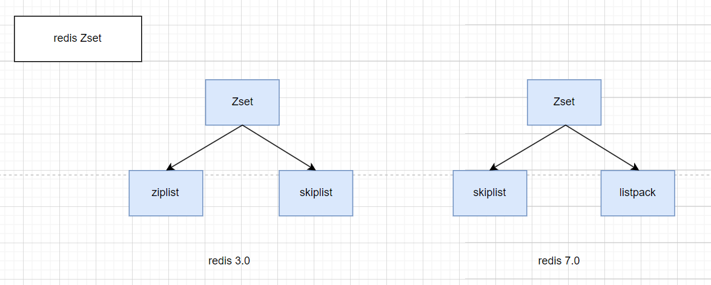

当ZSet的元素数量比较少时，Redis会采用ZipList（ListPack）来存储ZSet的数据。ZipList（ListPack）是一种紧凑的列表结构，它通过连续存储元素来节约内存空间。当ZSet的元素数量增多时，Redis会自动将ZipList（ListPack）转换为SkipList，以保持元素的有序性和支持范围查询操作。

在这个过程中，Redis会遍历ZipList（ListPack）中的所有元素，按照元素的分数值依次将它们插入到SkipList中，这样就可以保持元素的有序性。

在Redis的ZSET具体实现中，SkipList的这种实现，不仅用到了跳表，还会用到dict（字典）。

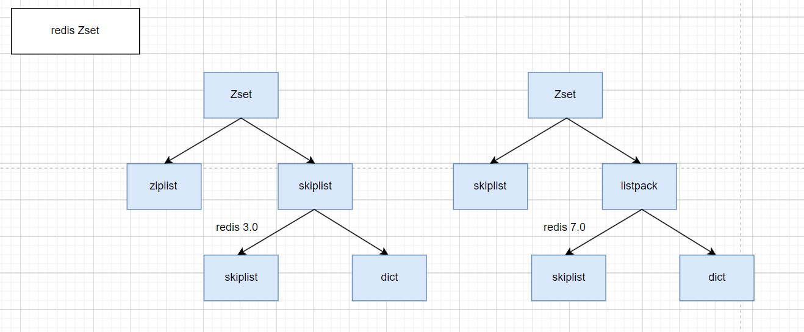

其中，SkipList用来实现有序集合，其中每个元素按照其分值大小在跳表中进行排序。跳表的插入、删除和查找操作的时间复杂度都是 O(log n)，可以保证较好的性能。

dict用来实现元素到分值的映射关系，其中元素作为键，分值作为值。哈希表的插入、删除和查找操作的时间复杂度都是 O(1)，具有非常高的性能。

#### 何时转换

ZipList（ListPack）和SkipList之间是什么时候进行转换的呢？

当我们想zset中ADD第一个元素的时候，Redis会进行判断，如果符合以下条件，则使用zipList来实现zset，否则将使用skipList实现zset：

- ZSet集合中的元素数量小于zset_max_ziplist_entries（zset-max-listpack-entries） 的值（默认为 128 ）

- ZSet集合中所有元素的长度小于zset_max_ziplist_value（zset-max-listpack-value） 的值（默认为 64字节 ）

这时候，就会使用zipList来实现，否则会使用skipList来实现，但是，如果使用了zipList并不表示就不会变成skipList，当以上条件任意一个不被满足时，还是会转成skipList的。

总的来说就是，当元素数量少于128，每个元素的长度都小于64字节的时候，使用ZipList（ListPack），否则，使用SkipList！

#### 跳表

跳表也是一个有序链表，如下面这个数据结构：

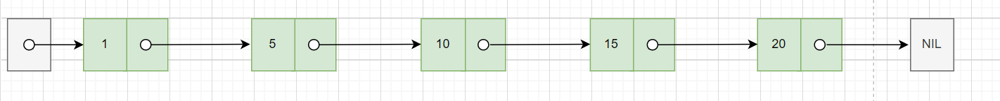

在这个链表中，我们想要查找一个数，需要从头结点开始向后依次遍历和匹配，直到查到为止，这个过程是比较耗费时间的，他的时间复杂度是0（n）。

当我们想要向这个链表中插入一个数的时候，过程和查找类似，先需要从头开始遍历找到合适的为止，然后再插入，他的时间复杂度也是 O(n)。

那么，怎么能提升遍历速度呢，有一个办法，那就是我们对链表进行改造，先对链表中每两个节点建立第一级索引，如下图所示：

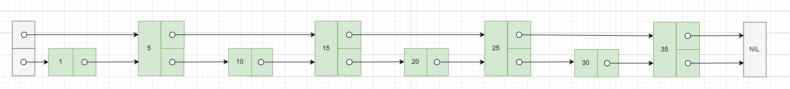

有了我们创建的这个索引之后，我们查询元素20，我们先从一级索引5->15 ->25 ->35中查找，发现20介于15和25之间，然后，转移到下一层进行搜索，即15->20->25，即可找到25这个节点了。

可以看到，同样是查找25，原来的链表需要遍历5个元素(1、5、10、15、20、25)，建立了一层索引之后，只需要遍历2个元素即可（15、20）。

有了上面的经验，我们可以继续创建二级索引、三级索引....

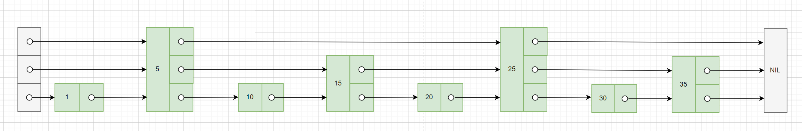

在这样一个链表中查找25这个元素，只需要遍历2个节点就可以了（5、25）。

因为我们的链表不够大，查找的元素也比较靠前，所以速度上的感知可能没那么大，但是如果是在成千上万个节点、甚至数十万、百万个节点中遍历呢？这样的数据结构就能大大提高效率。

像上面这种带多级索引的链表，就是跳表。

## redis什么时候删除过期key？

我们都知道，Redis的Key是可以设置过期时间的，那么，过期了一定会立即删除吗？

回答这个问题之前，我们先看下Redis是如何实现的Key的过期。

以下是官网中关于过期的实现的描述（https://redis.io/commands/expire/ ）：

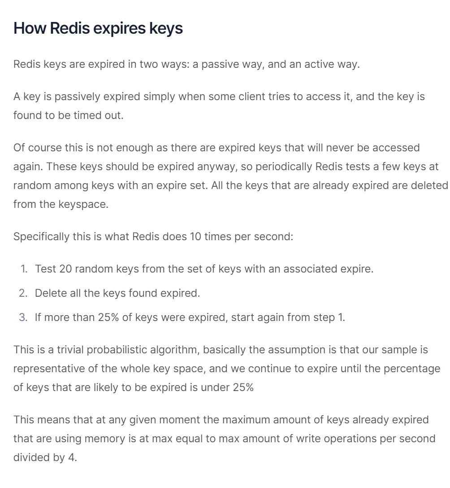

也就是说Redis的键有两种过期方式：一种是惰性删除，另一种是定时删除。

惰性删除指的是当某个客户端尝试访问一个键，发现该键已经超时，那么它会被从Redis中删除。

当然，仅仅依靠惰性删除还不够，因为有些过期的键可能永远不会再被访问。这些键应该被及时删除，因此Redis会定期随机检查一些带有过期时间的键。所有已经过期的键都会从键空间中删除。

具体来说，Redis每秒会执行以下操作10次：

- 从带有过期时间的键集合中随机选择20个键。

- 删除这些键中所有已经过期的键。

- 如果已经过期的键占比超过25%，则重新从步骤1开始。

直到过期Key的比例下降到 25% 或者这次任务的执行耗时超过了25毫秒，才会退出循环。

所以，Redis其实是并不保证Key在过期的时候就能被立即删除的。因为一方面惰性删除中需要下次访问才会删除，即使是定时删除，也是通过轮询的方式来实现的。如果要过期的key很多的话，就会带来延迟的情况。

### 定时删除

#### 优点

1. 及时释放内存：主动删除能够及时地释放过期键占用的内存，避免内存空间被长时间占用，从而降低了内存使用率。

2. 很多冷数据可以被主动删除及时清空掉。

3. 避免写操作延迟：由于过期键被定期删除，不会导致过多的过期键在访问时触发删除操作，因此可以减少读写操作的延迟。

#### 缺点

1. 增加系统开销：定期扫描和删除操作会增加系统的开销，特别是在有大量键需要处理时，可能会导致Redis的性能下降。

### 惰性删除

#### 优点

1. 减少系统开销：被动删除不会定期地进行扫描和删除操作，因此可以减少系统的开销，节省计算资源。 

#### 缺点

1. 可能导致内存占用高：被动删除可能导致过期键长时间占用内存，直到被访问时才被删除，这可能会导致内存占用率较高。系统有大量冷数据时会一直得不到释放。
2. 可能导致访问延迟：当大量键同时过期并在访问时触发删除操作时，可能会导致读写操作的延迟。

Redis的惰性删除策略，不需要额外配置。当你设置键的过期时间（TTL）时，Redis会自动处理被动删除。

要使用主动删除策略，需要在Redis配置文件中设置过期键检查的频率。你可以通过设置以下配置参数来调整主动删除的行为：

- hz（每秒执行的定时器频率）：增加该值可以提高主动删除的频率。

- maxmemory（Redis的最大内存限制）：设置合适的最大内存限制，以确保Redis在内存不足时触发主动删除。

例如，在Redis配置文件中可以设置：

```properties
maxmemory 1gb
hz 10
```

### 错误操作

开发者在设置键过期时间时常会出现：

1. 开始先插入一个键并设置了过期时间：set key1 value1 ex 200

2. 正常情况下这个键会在200s后被删除

3. 后续更新这个键时：set key1 value2

4. 这次忘记设置过期时间了，导致redis执行set命令时误以为需要清除过期时间，导致这个键再也不会过期了

5. 这时执行ttl key1，会看到返回-1（永不过期）

但是，仅仅通过给 key 设置过期时间还是有问题的。因为还是可能存在定时删除和惰性删除漏掉了很多过期 key 的情况。这样就导致大量过期 key 堆积在内存里，然后就 Out of memory 了。

怎么解决这个问题呢？答案就是：**Redis 内存淘汰机制。**

## Redis 内存淘汰机制是什么？

### Redis 提供 6 种数据淘汰策略

1. **volatile-lru（least recently used）**：从已设置过期时间的数据集（`server.db[i].expires`）中挑选最近最少使用的数据淘汰。
2. **volatile-ttl**：从已设置过期时间的数据集（`server.db[i].expires`）中挑选将要过期的数据淘汰。
3. **volatile-random**：从已设置过期时间的数据集（`server.db[i].expires`）中任意选择数据淘汰。
4. **allkeys-lru（least recently used）**：当内存不足以容纳新写入数据时，在键空间中，移除最近最少使用的 key（这个是最常用的）。
5. **allkeys-random**：从数据集（`server.db[i].dict`）中任意选择数据淘汰。
6. **no-eviction**：禁止驱逐数据，也就是说当内存不足以容纳新写入数据时，新写入操作会报错。这个应该没人使用吧！

4.0 版本后增加以下两种：

7. **volatile-lfu（least frequently used）**：从已设置过期时间的数据集（`server.db[i].expires`）中挑选最不经常使用的数据淘汰。
8. **allkeys-lfu（least frequently used）**：当内存不足以容纳新写入数据时，在键空间中，移除最不经常使用的 key。

### LRU和LFU有什么区别？

LRU算法（最近最少使用）：淘汰很久没有访问过的数据，淘汰标准以最近一次访问时间作为参考。

LFU算法（最近最不经常使用）：淘汰最近一段时间被访问次数最少得数据，以次数作为参考

绝大多数情况下使用LRU策略就可以了，当存在大量热点缓存数据时，使用LFU更合适。

### 项目中的使用策略

如果项目中的缓存数据比较重要，则不能配置带有allkeys前缀的淘汰机制，这些机制会在内存不足时有概率的删除掉未配置过期时间的key，导致重要数据被清空。应当使用volatile前缀的淘汰机制。

如果项目中的缓存数据被删除了也不会造成功能上的故障，则可以使用allkeys前缀的淘汰机制，这样也能保证在redis内存不足时及时清除数据，保证缓存可用。

## 删除Redis的命令会阻塞Redis吗？

redis的删除命令del删除时间分情况讨论：

1. 删除一般的字符串时，时间复杂度是O(1)；

2. 删除列表、集合、有序集合、hash的某个值时，时间复杂度是O(n)，n是集合内部元素数量。

如果删除元素的值非常大，例如一个字符串几百兆，则删除命令会阻塞Redis一段时间，直到删除完成。所以这个问题需要分情况。

## Redis的集群模式有哪些？

Redis有三种主要的集群模式，用于在分布式环境中实现高可用性和数据复制。这些集群模式分别是：主从复制（Master-Slave Replication）、哨兵模式（Sentinel）和Redis Cluster模式。

### 主从模式

主从复制是Redis最简单的集群模式。这个模式主要是为了解决单点故障的问题，所以将数据复制多个副本中，这样即使有一台服务器出现故障，其他服务器依然可以继续提供服务。

主从模式中，包括一个主节点（Master）和一个或多个从节点（Slave）。主节点负责处理所有写操作和读操作，而从节点则复制主节点的数据，并且只能处理读操作。当主节点发生故障时，可以将一个从节点升级为主节点，实现故障转移（需要手动实现）。

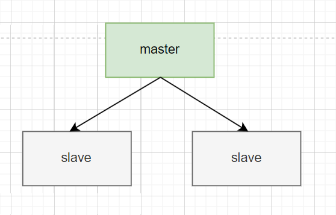

主从复制的优势在于简单易用，适用于读多写少的场景。它提供了数据备份功能，并且可以有很好的扩展性，只要增加更多的从节点，就能让整个集群的读的能力不断提升。

但是主从模式最大的缺点，就是不具备故障自动转移的能力，没有办法做容错和恢复。

主节点和从节点的宕机都会导致客户端部分读写请求失败，需要人工介入让节点恢复或者手动切换一台从节点服务器变成主节点服务器才可以。并且在主节点宕机时，如果数据没有及时复制到从节点，也会导致数据不一致。这就对运维提出了要求，需要公司做一些自动化脚本在切换时使用。

### 哨兵模式

为了解决主从模式的无法自动容错及恢复的问题，Redis引入了一种哨兵模式的集群架构。

哨兵模式是在主从复制的基础上加入了哨兵节点。哨兵节点是一种特殊的Redis节点，用于监控主节点和从节点的状态。当主节点发生故障时，哨兵节点可以自动进行故障转移，选择一个合适的从节点升级为主节点，并通知其他从节点和应用程序进行更新。

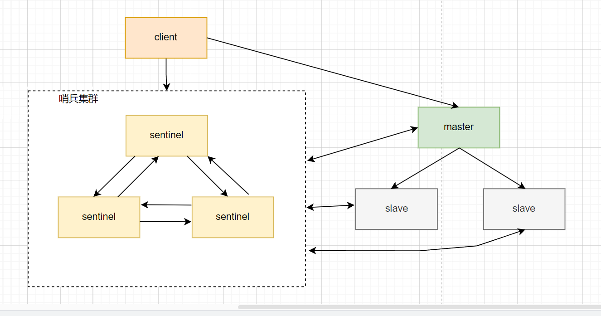

在原来的主从架构中，引入哨兵节点，其作用是监控Redis主节点和从节点的状态。每个Redis实例都可以作为哨兵节点，通常需要部署多个哨兵节点，以确保故障转移的可靠性。

哨兵节点定期向所有主节点和从节点发送PING命令，如果在指定的时间内未收到PONG响应，哨兵节点会将该节点标记为主观下线。如果一个主节点被多数哨兵节点标记为主观下线，那么它将被标记为客观下线。

当主节点被标记为客观下线时，哨兵节点会触发故障转移过程。它会从所有健康的从节点中选举一个新的主节点，并将所有从节点切换到新的主节点，实现自动故障转移。同时，哨兵节点会更新所有客户端的配置，指向新的主节点。

哨兵节点通过发布订阅功能来通知客户端有关主节点状态变化的消息。客户端收到消息后，会更新配置，将新的主节点信息应用于连接池，从而使客户端可以继续与新的主节点进行交互。

这个集群模式的优点就是为整个集群系统了一种故障转移和恢复的能力。虽然这个模式不再需要运维遇到主节点下线时手动切换主从节点，但是主从节点切换期间，会存在访问瞬断的问题，此时客户端发请求都会报错。

### Cluster模式

Redis Cluster是Redis中推荐的分布式集群解决方案。它将数据自动分片到多个节点上，每个节点负责一部分数据。理论上这个集群可以容纳上万个分片（官方推荐1000个左右）。

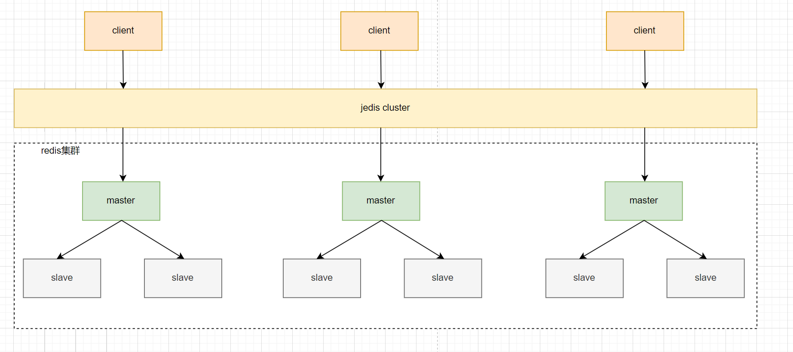

Redis Cluster采用主从复制模式来提高可用性。每个分片都有一个主节点和多个从节点。主节点负责处理写操作，而从节点负责复制主节点的数据并处理读请求。

Redis Cluster能够自动检测节点的故障。当一个节点失去连接或不可达时，Redis Cluster会尝试将该节点标记为不可用，并从可用的从节点中提升一个新的主节点。

Redis Cluster是适用于大规模应用的解决方案，它提供了更好的横向扩展和容错能力。它自动管理数据分片和故障转移，减少了运维的负担。

Cluster模式的特点是数据分片存储在不同的节点上，每个节点都可以单独对外提供读写服务。不存在单点故障的问题。

但是和哨兵模式有同样的访问瞬断问题：当某个分片的主节点宕机时，访问这个分片的客户端请求都会报错，直到该分片有了新的主节点选举产生。只不过这里的访问瞬断被分散到了某一个分片上。

这种集群模式极大满足了高并发的需求，理论上单个节点承载10万并发，需要50万并发，分片设置成5个即可。

## 什么是Redis的数据分片？

Redis的数据分片（sharding）是一种将一个Redis数据集分割成多个部分，分别存储在不同的Redis节点上的技术。它可以用于将一个单独的Redis数据库扩展到多个物理机器上，从而提高Redis集群的性能和可扩展性。

Redis数据分片的实现方式通常是将数据按照某种规则（例如，key的hash值）分配到不同的节点上。当客户端想要访问某个key时，它会先计算出这个key应该存储在哪个节点上，然后直接连接到该节点进行操作。因此，对于客户端而言，Redis集群就像是一个大型的、统一的数据库，而不需要关心数据的实际分布情况。

在Redis的Cluster 集群模式中，使用哈希槽（hash slot）的方式来进行数据分片，将整个数据集划分为多个槽，每个槽分配给一个节点。客户端访问数据时，先计算出数据对应的槽，然后直接连接到该槽所在的节点进行操作。Redis Cluster还提供了自动故障转移、数据迁移和扩缩容等功能，能够比较方便地管理一个大规模的Redis集群。

Redis Cluster将整个数据集划分为16384个槽，每个槽都有一个编号（0~16383），集群的每个节点可以负责多个hash槽，客户端访问数据时，先根据key计算出对应的槽编号：HASH_SLOT=CRC16(key) mod 16384，然后根据槽编号找到负责该槽的节点，向该节点发送请求。

在 Redis 的每一个节点上，都有这么两个东西，一个是槽（slot），它的的取值范围是：0-16383。还有一个就是 cluster，可以理解为是一个集群管理的插件。当我们的存取的 Key 的时候，Redis 会根据 CRC16 算法得出一个结果，然后把结果对 16384 求余数，这样每个 key 都会对应一个编号在 0-16383 之间的哈希槽，通过这个值，去找到对应的插槽所对应的节点，然后直接自动跳转到这个对应的节点上进行存取操作。

Redis Cluster中的数据分片具有以下特点：

1. 数据自动迁移：当节点加入或离开集群时，Redis Cluster会自动将负责的槽重新分配给其他节点，从而保持数据的平衡。数据迁移的过程中，Redis Cluster还能保证数据的可用性，即使某些节点宕机或网络分区，集群也能够继续提供服务。

2. 容错性：Redis Cluster采用多个节点互相复制数据的方式来保证数据的可靠性和容错性。如果某个节点宕机，其他节点仍然能够提供服务，并且在新节点加入集群后，数据也可以自动迁移和恢复。

3. 可扩展性：Redis Cluster支持水平扩展，即通过添加新节点来增加集群的处理能力和存储容量。添加节点时，Redis Cluster会自动将一部分槽分配给新节点，从而使整个集群的数据负载均衡。

4. 性能优化：Redis Cluster中每个节点都可以独立地处理客户端请求，从而提高了集群的吞吐量和响应速度。此外，Redis Cluster还支持异步复制和批量操作等特性，可以进一步优化性能。

### 16384

Redis Cluster将整个数据集划分为16384个槽，为什么是16384呢，这个数字有什么特别的呢？

这个问题在Github上有所讨论，Redis的作者也下场做过回复：https://github.com/redis/redis/issues/2576

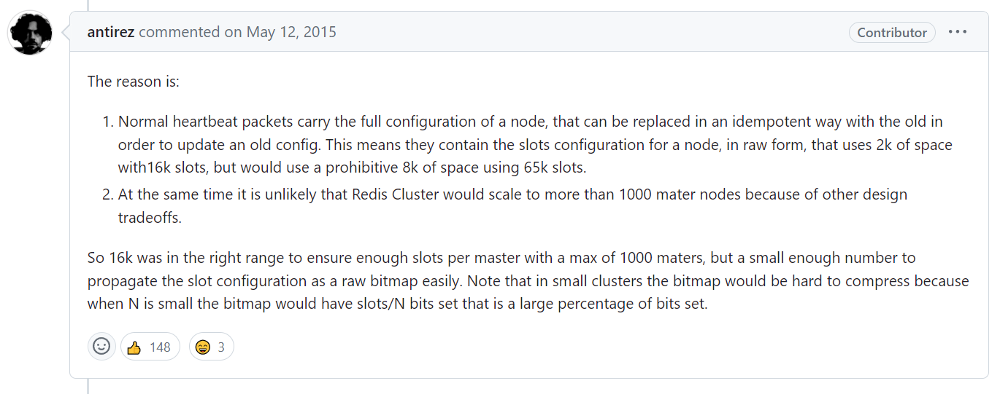

16384这个数字是一个2的14次方（2^14），尽管crc16能得到2^16 -1=65535个值，但是并没有选择，主要从消息大小和集群规模等方面考虑的：

1. 正常的心跳数据包携带了节点的完整配置，在更新配置的时候，可以以幂等方式进行替换。这意味着它们包含了节点的原始槽配置，对于包含16384个槽位的情况，使用2k的空间就够了，但如果使用65535个槽位，则需要使用8k的空间，这就有点浪费了。

2. 由于其他设计权衡的原因，Redis Cluster不太可能扩展到超过1000个主节点，这种情况下，用65535的话会让每个节点上面的slot太多了，会导致节点的负载重并且数据迁移成本也比较高。而16384是相对比较好的选择，可以在1000个节点下使得slot均匀分布，每个分片平均分到的slot不至于太小。

除此之外，还有一些原因和优点供大家参考：

1. 易于扩展：槽数量是一个固定的常数，这样就可以方便地进行集群的扩展和缩小。如果需要添加或删除节点，只需要将槽重新分配即可。

2. 易于计算：哈希算法通常是基于槽编号计算的，将槽数量设置为2的幂次方，可以使用位运算等简单的算法来计算槽编号，从而提高计算效率。

3. 负载均衡：槽数量的选择可以影响数据的负载均衡。如果槽数量太少，会导致某些节点负载过重；如果槽数量太多，会导致数据迁移的开销过大。16384这个数量在实践中被证明是一个比较合适的选择，能够在保证负载均衡的同时，减少数据迁移的开销。

### CRC16算法

当我们的存取的 Key 的时候，Redis 会根据 CRC16 算法得出一个结果，然后把结果对 16384 求余数，这样每个 key 都会对应一个编号在 0-16383 之间的哈希槽。

那么，什么是CRC16算法呢？

CRC16（Cyclic Redundancy Check，循环冗余校验码）算法是一种广泛使用的校验算法，主要用于数据通信和数据存储等领域，例如网络通信中的错误检测和校正、数据存储中的文件校验和等。

CRC16算法基于多项式除法，将输入数据按位进行多项式除法运算，最后得到一个16位的校验码。CRC16算法的计算过程包括以下几个步骤：

1. 初始化一个16位的寄存器为全1；

2. 将输入数据的第一个字节与16位寄存器的低8位进行异或操作，结果作为新的16位寄存器的值；

3. 将16位寄存器的高8位和低8位分别右移一位，丢弃掉最低位，即寄存器右移一位；

4. 如果输入数据还没有处理完，转到第2步继续处理下一个字节；

5. 如果输入数据已经处理完，将16位寄存器的值取反，得到CRC16校验码。

CRC16算法的多项式是一个固定的16位二进制数，不同的CRC16算法使用的多项式也不相同。例如，CRC-16/CCITT算法使用的多项式为0x1021，而Modbus CRC16算法使用的多项式为0xA001。

CRC16算法的优点是计算速度快，校验效果好，具有广泛的应用范围。缺点是只能检测错误，无法纠正错误。如果数据被修改，CRC校验值也会被修改，但无法确定是哪一位数据被修改。因此，在数据传输和存储中，通常需要与其它校验算法配合使用，以保证数据的完整性和正确性。

## Redis竟然也有死循环bug？

当在Redis中执行randomkey命令时，Redis会随机挑选出一个未过期的key返回。例如，Redis中现在有fruit、food、meat三个key，每次执行randomkey都会随机返回这三个key中的一个。

当Redis中存在大量过期key还未被及时清理时，一个客户端执行randomkey命令时，Redis很可能很多次都找到一个过期的key，然后根据惰性删除策略直接删除这个key，再接着找下一个。这样本身比较耗时。

这个流程是在主节点上执行的。当客户端访问一个从节点执行randomkey时，会出现死循环。

Redis规定主从节点之间，主节点拥有删除过期key的能力：每次主节点删除一个过期key，都会同步一条del命令给从节点进行同步。当客户端访问一个拥有大量过期key的从节点时，每次从节点查找到一个过期key，都不能删除，下次再找很可能还是过期key，这样就陷入了死循环。

这个问题直到Redis 5.0才得到修复，修复方式就是从节点randomkey循环查找的次数限制在100次，超过次数直接跳出循环。

## Redis的持久化机制是怎样的？

Redis提供了两种持久化的机制，分别是RDB和AOF。

### RDB

RDB是将Redis的内存中的数据定期保存到磁盘上，以防止数据在Redis进程异常退出或服务器断电等情况下丢失。

RDB的优点是：快照文件小、恢复速度快，适合做备份和灾难恢复

RDB的缺点是：定期更新可能会丢数据

触发方式：

1. 配置文件
   
   `redis.conf` 配置文件中默认有此下配置：
   
   ```clojure
   save 900 1           #在900秒(15分钟)之后，如果至少有1个key发生变化，Redis就会自动触发bgsave命令创建快照。
   save 300 10          #在300秒(5分钟)之后，如果至少有10个key发生变化，Redis就会自动触发bgsave命令创建快照。
   save 60 10000        #在60秒(1分钟)之后，如果至少有10000个key发生变化，Redis就会自动触发bgsave命令创建快照。
   ```

2. 执行save
   
   这是一个同步保存操作，会阻塞 Redis 主线程；

3. 执行bgsave
   
   fork 出一个子进程，子进程执行，不会阻塞 Redis 主线程。

### AOF

AOF是将Redis的所有写操作追加到AOF文件（Append Only File）的末尾，从而记录了Redis服务器运行期间所有修改操作的详细记录。当Redis重新启动时，可以通过执行AOF文件中保存的写操作来恢复数据。

但是如果Redis刚刚执行完一个写命令，还没来得及写AOF文件就宕机了，那么这个命令和相应的数据就会丢失了。但是这也比RDB要更加靠谱一些。

AOF的优点是：可以实现更高的数据可靠性、支持更细粒度的数据恢复，适合做数据存档和数据备份。

AOF的缺点是：文件大占用空间更多，每次写操作都需要写磁盘导致负载较高。

AOF的触发方式是在配置文件中开启AOF：

`redis.conf` 配置文件：

```bash
appendonly yes
```

AOF 文件的保存位置和 RDB 文件的位置相同，都是通过 `dir` 参数设置的，默认的文件名是 `appendonly.aof`。

开启 AOF 持久化后每执行一条会更改 Redis 中的数据的命令，Redis 就会将该命令写入到 AOF 缓冲区 `server.aof_buf` 中，然后再写入到 AOF 文件中（此时还在系统内核缓存区未同步到磁盘），最后再根据持久化方式（ `fsync`策略）的配置来决定何时将系统内核缓存区的数据同步到硬盘中的。

#### AOF 工作基本流程是怎样的？

AOF 持久化功能的实现可以简单分为 5 步：

1. **命令追加（append）**：所有的写命令会追加到 AOF 缓冲区中。
2. **文件写入（write）**：将 AOF 缓冲区的数据写入到 AOF 文件中。这一步需要调用`write`函数（系统调用），`write`将数据写入到了系统内核缓冲区之后直接返回了（延迟写）。注意！！！此时并没有同步到磁盘。
3. **文件同步（fsync）**：AOF 缓冲区根据对应的持久化方式（ `fsync` 策略）向硬盘做同步操作。这一步需要调用 `fsync` 函数（系统调用）， `fsync` 针对单个文件操作，对其进行强制硬盘同步，`fsync` 将阻塞直到写入磁盘完成后返回，保证了数据持久化。
4. **文件重写（rewrite）**：随着 AOF 文件越来越大，需要定期对 AOF 文件进行重写，达到压缩的目的。
5. **重启加载（load）**：当 Redis 重启时，可以加载 AOF 文件进行数据恢复。

> Linux 系统直接提供了一些函数用于对文件和设备进行访问和控制，这些函数被称为 **系统调用（syscall）**。

这里对上面提到的一些 Linux 系统调用再做一遍解释：

- `write`：写入系统内核缓冲区之后直接返回（仅仅是写到缓冲区），不会立即同步到硬盘。虽然提高了效率，但也带来了数据丢失的风险。同步硬盘操作通常依赖于系统调度机制，Linux 内核通常为 30s 同步一次，具体值取决于写出的数据量和 I/O 缓冲区的状态。
- `fsync`：`fsync`用于强制刷新系统内核缓冲区（同步到到磁盘），确保写磁盘操作结束才会返回。

AOF 工作流程图如下：

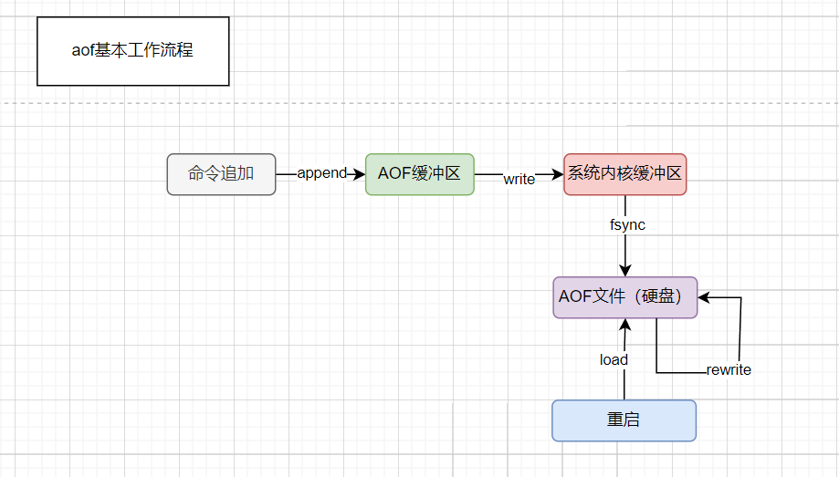


### 比较

RDB和AOF在数据可靠性、性能、存储空间占用等方面都有不同的优缺点，具体可以根据实际业务需求和硬件条件来选择合适的持久化机制，或者同时使用两种持久化机制来实现更高的数据可靠性。

| 特性     | RDB                        | AOF                     |
| ------ | -------------------------- | ----------------------- |
| 数据可靠性  | 可能会丢失最后一次快照之后的数据，备份时消耗机器性能 | 保证最后一次写操作之前的数据不会丢失      |
| 性能     | 读写性能较高，适合做数据恢复、备份          | 写性能较高，适合做数据存档           |
| 存储空间占用 | 快照文件二进制格式，占用空间较少           | AOF文件较大，占用空间较多          |
| 恢复时间   | 从快照文件中恢复数据较快               | 从AOF文件中恢复数据较慢，需要一条条执行命令 |

**综上**：

- Redis 保存的数据丢失一些也没什么影响的话，可以选择使用 RDB。
- 不建议单独使用 AOF，因为时不时地创建一个 RDB 快照可以进行数据库备份、更快的重启以及解决 AOF 引擎错误。
- 如果保存的数据要求安全性比较高的话，建议同时开启 RDB 和 AOF 持久化或者开启 RDB 和 AOF 混合持久化。

### 混合持久化

AOF和RDB各自有优缺点，为了让用户能够同时拥有上述两种持久化的优点， Redis 4.0 推出了 RDB-AOF 混合持久化。

在开启混合持久化的情况下，AOF 重写时会把 Redis 的持久化数据，以 RDB 的格式写入到 AOF 文件的开头，之后的数据再以 AOF 的格式化追加的文件的末尾。

`aof-use-rdb-preamble`是开启混合模式的参数。

混合持久化结合了 RDB 和 AOF 持久化的优点，开头为 RDB 的格式，使得 Redis 可以更快的启动，同时结合 AOF 的优点，有减低了大量数据丢失的风险。

但是，在AOF 文件中添加了 RDB 格式的内容，使得 AOF 文件的可读性变得很差；如果开启混合持久化，那么此混合持久化 AOF 文件，是不能用在旧版本中的，不向下兼容的。

### Redis能完全保证数据不丢失吗？

不能，因为Redis是基于内存存储的，当Redis进程异常退出或服务器断电等情况发生时，内存中的数据可能会丢失。

为了防止数据丢失，Redis提供了RDB和AOF的持久化机制，Redis可以将数据从内存保存到磁盘中，以便在Redis进程异常退出或服务器断电等情况下，通过从磁盘中加载数据来恢复数据。

但是，持久化机制也不是绝对可靠的，归根结底Redis还是个缓存，他并不是完全给你做持久化用的，所以还是要有自己的持久化方式，比如双写到数据库。

因此，为了最大程度地保障数据安全，建议采用多种手段来提高数据可靠性，如定期备份数据、使用主从复制机制、使用集群模式等。

### AOF的三种写回策略

AOF有三种数据写回策略，分别是always，everysec和no。

- `appendfsync always`，同步写回：每个写命令执行完，立马同步地将日志写回磁盘；
  
  具体流程：主线程调用 `write` 执行写操作后，后台线程（ `aof_fsync` 线程）立即会调用 `fsync` 函数同步 AOF 文件（刷盘），`fsync` 完成后线程返回，这样会严重降低 Redis 的性能（`write` + `fsync`）。

- `appendfsync everysec`，每秒写回：每个写命令执行完，只是先把日志写到AOF文件的内存缓冲区，每隔一秒把缓冲区中的内容写入磁盘；
  
  具体流程：主线程调用 `write` 执行写操作后立即返回，由后台线程（ `aof_fsync` 线程）每秒钟调用 `fsync` 函数（系统调用）同步一次 AOF 文件（`write`+`fsync`，`fsync`间隔为 1 秒）

- `appendfsync no`，操作系统控制的写回：每个写命令执行完，只是先把日志写到AOF文件的内存缓冲区，由操作系统决定何时将缓冲区内容写回磁盘。
  
  具体流程：主线程调用 `write` 执行写操作后立即返回，让操作系统决定何时进行同步，Linux 下一般为 30 秒一次（`write`但不`fsync`，`fsync` 的时机由操作系统决定）。

“同步写回”可靠性肯定是最高的，但是它在每一个写命令后都有一个落盘操作，而且还是同步的，这和直接写磁盘类型的数据库有啥区别？

"操作系统控制的写回"这种是最不靠谱的，谁知道操作系统啥时候帮你做持久化，万一没来及持久化就宕机了，不就gg了。

"每秒写回"是在二者之间折中了一下，异步的每秒把数据写会到磁盘上，最大程度的提升效率和降低风险。

**这 3 种持久化方式的主要区别在于 `fsync` 同步 AOF 文件的时机（刷盘）**。

为了兼顾数据和写入性能，可以考虑 `appendfsync everysec` 选项 ，让 Redis 每秒同步一次 AOF 文件，Redis 性能受到的影响较小。而且这样即使出现系统崩溃，用户最多只会丢失一秒之内产生的数据。当硬盘忙于执行写入操作的时候，Redis 还会优雅的放慢自己的速度以便适应硬盘的最大写入速度。

从 Redis 7.0.0 开始，Redis 使用了 **Multi Part AOF** 机制。顾名思义，Multi Part AOF 就是将原来的单个 AOF 文件拆分成多个 AOF 文件。在 Multi Part AOF 中，AOF 文件被分为三种类型，分别为：

- BASE：表示基础 AOF 文件，它一般由子进程通过重写产生，该文件最多只有一个。
- INCR：表示增量 AOF 文件，它一般会在 AOFRW 开始执行时被创建，该文件可能存在多个。
- HISTORY：表示历史 AOF 文件，它由 BASE 和 INCR AOF 变化而来，每次 AOFRW 成功完成时，本次 AOFRW 之前对应的 BASE 和 INCR AOF 都将变为 HISTORY，HISTORY 类型的 AOF 会被 Redis 自动删除。

Multi Part AOF 不是重点，了解即可，详细介绍可以看看阿里开发者的[Redis 7.0 Multi Part AOF 的设计和实现](https://zhuanlan.zhihu.com/p/467217082) 这篇文章。

**相关 issue**：[Redis 的 AOF 方式 #783](https://github.com/Snailclimb/JavaGuide/issues/783)。

### Always也不能保证不丢

即使是在always策略下，也不能保证100%不丢失数据的，主要出于以下原因：

1. 磁盘和系统故障：如果在写入操作和同步到磁盘之间发生硬件故障或系统崩溃，可能会丢失最近的写操作。

2. 操作系统缓冲区：即使Redis请求立即将数据同步到磁盘，操作系统的I/O缓冲区可能会导致实际写入磁盘的操作延迟发生。如果在写入缓冲区之后，没写磁盘前，机器挂了，那么数据就丢了。

3. 磁盘写入延迟：磁盘的写入并非实时完成，特别是在涉及到机械硬盘时，写入延迟主要由磁盘旋转速度（RPM）和寻道时间决定。如果在这这个延迟过程中，机器挂了，那么数据也就丢了。

### AOF 重写了解吗？

当 AOF 变得太大时，Redis 能够在后台自动重写 AOF 产生一个新的 AOF 文件，这个新的 AOF 文件和原有的 AOF 文件所保存的数据库状态一样，但体积更小。

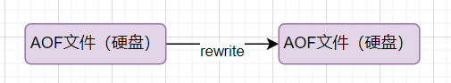

> AOF 重写（rewrite） 是一个有歧义的名字，该功能是通过读取数据库中的键值对来实现的，程序无须对现有 AOF 文件进行任何读入、分析或者写入操作。

由于 AOF 重写会进行大量的写入操作，为了避免对 Redis 正常处理命令请求造成影响，Redis 将 AOF 重写程序放到子进程里执行。

AOF 文件重写期间，Redis 还会维护一个 **AOF 重写缓冲区**，该缓冲区会在子进程创建新 AOF 文件期间，记录服务器执行的所有写命令。当子进程完成创建新 AOF 文件的工作之后，服务器会将重写缓冲区中的所有内容追加到新 AOF 文件的末尾，使得新的 AOF 文件保存的数据库状态与现有的数据库状态一致。最后，服务器用新的 AOF 文件替换旧的 AOF 文件，以此来完成 AOF 文件重写操作。

开启 AOF 重写功能，可以调用 `BGREWRITEAOF` 命令手动执行，也可以设置下面两个配置项，让程序自动决定触发时机：

- `auto-aof-rewrite-min-size`：如果 AOF 文件大小小于该值，则不会触发 AOF 重写。默认值为 64 MB;
- `auto-aof-rewrite-percentage`：执行 AOF 重写时，当前 AOF 大小（aof_current_size）和上一次重写时 AOF 大小（aof_base_size）的比值。如果当前 AOF 文件大小增加了这个百分比值，将触发 AOF 重写。将此值设置为 0 将禁用自动 AOF 重写。默认值为 100。

Redis 7.0 版本之前，如果在重写期间有写入命令，AOF 可能会使用大量内存，重写期间到达的所有写入命令都会写入磁盘两次。

Redis 7.0 版本之后，AOF 重写机制得到了优化改进。下面这段内容摘自阿里开发者的[从 Redis7.0 发布看 Redis 的过去与未来](https://mp.weixin.qq.com/s/RnoPPL7jiFSKkx3G4p57Pg) 这篇文章。

> AOF 重写期间的增量数据如何处理一直是个问题，在过去写期间的增量数据需要在内存中保留，写结束后再把这部分增量数据写入新的 AOF 文件中以保证数据完整性。可以看出来 AOF 写会额外消耗内存和磁盘 IO，这也是 Redis AOF 写的痛点，虽然之前也进行过多次改进但是资源消耗的本质问题一直没有解决。
> 
> 阿里云的 Redis 企业版在最初也遇到了这个问题，在内部经过多次迭代开发，实现了 Multi-part AOF 机制来解决，同时也贡献给了社区并随此次 7.0 发布。具体方法是采用 base（全量数据）+inc（增量数据）独立文件存储的方式，彻底解决内存和 IO 资源的浪费，同时也支持对历史 AOF 文件的保存管理，结合 AOF 文件中的时间信息还可以实现 PITR 按时间点恢复（阿里云企业版 Tair 已支持），这进一步增强了 Redis 的数据可靠性，满足用户数据回档等需求。

**相关 issue**：[Redis AOF 重写描述不准确 #1439](https://github.com/Snailclimb/JavaGuide/issues/1439)。

### 线上如何设置Redis的持久化策略

如果对性能要求比较高的，最好不要设置master持久化，可以在某个slave开启aof备份数据，数据写回策略设置为每秒一次即可。

### 线上如何设置Redis的数据备份策略

这个场景一般是Redis保存的数据比较重要，且数据量比较多。

可以通过：

1. 写一个crontab定时任务脚本，每小时copy一次rdb和aof文件到另一台机器上，保留48小时内数据。

2. 再写一个crontab定时任务脚本，每天copy一个晚上24点的rdb和aof文件到一个目录中，最多保存一个月数据。

3. 每次copy完，都将太旧的文件删除掉。

## Redis集群为什么至少需要3个master节点？

因为新master的选举至少需要半数以上的master节点同意才能选举成功，如果只有两个master节点，一个挂了，剩下一个是达不到选举成功条件的。

## Redis集群为什么推荐奇数个master节点？

以3个master和4个master为例，同样挂了1个master的时候，3个master剩2个，超过半数，可以选举新的master。4个master剩3个，超过半数，同样可以选举新的master。即这两个例子下挂1个master都一样。

同样挂了2个master的时候，3个master剩1个，不超过半数，不可以选举新的master。4个master剩2个，未超过半数，同样不可以选举新的master。即这两个例子下挂2个master都一样。

这种情况下，选择3个master更节省机器资源。即选择奇数个master节点更推荐。

## Redis集群模式下可以使用批量命令吗？

默认情况下，mset、mget等批量命令Redis集群只支持所有key落到同一个slot的情况，不然会报错。如果需要在Redis集群内用mset命令设置多个key，可以在key前面添加{xxx}，这样的key在计算hash slot时只会使用{}内的内容进行计算，最终多个key可以落到同一个hash slot中，从而批量命令就可以执行成功了。示例如下：

```shell
mset {user1}:1:name sunquan {user1}:1:age 27
```

## 资料：

- [删除数据后，redis为什么内存占用率还是很高？-极客时间](https://time.geekbang.org/column/article/289140)
- [你的 Redis 真的变慢了吗？性能优化如何做 - 阿里开发者](https://mp.weixin.qq.com/s/nNEuYw0NlYGhuKKKKoWfcQ)
- [Redis延迟问题全面排障指南](https://mp.weixin.qq.com/s/mIc6a9mfEGdaNDD3MmfFsg)
- [Redis 开发与运维笔记-Redis 的噩梦-阻塞](https://mp.weixin.qq.com/s/TDbpz9oLH6ifVv6ewqgSgA)
- [一文详解 Redis 中 BigKey、HotKey 的发现与处理](https://mp.weixin.qq.com/s/FPYE1B839_8Yk1-YSiW-1Q)
- [缓存和数据库一致性问题，看这篇就够了 - 水滴与银弹](https://mp.weixin.qq.com/s?__biz=MzIyOTYxNDI5OA==&mid=2247487312&idx=1&sn=fa19566f5729d6598155b5c676eee62d&chksm=e8beb8e5dfc931f3e35655da9da0b61c79f2843101c130cf38996446975014f958a6481aacf1&scene=178&cur_album_id=1699766580538032128#rd)
- [阿里云 Redis 开发规范](https://developer.aliyun.com/article/531067)
- [HyperLogLog 算法的原理讲解以及 Redis 是如何应用它的](https://juejin.cn/post/6844903785744056333)
- [Sketch of the Day: HyperLogLog — Cornerstone of a Big Data Infrastructure](http://content.research.neustar.biz/blog/hll.html)
- 布隆过滤器,位图,HyperLogLog：https://hogwartsrico.github.io/2020/06/08/BloomFilter-HyperLogLog-BitMap/index.html
- [Redis 到底是怎么实现“附近的人”这个功能的呢？](https://juejin.cn/post/6844903966061363207)
- Redis 源码解析——内存分配：[https://shinerio.cc/2020/05/17/redis/Redis源码解析——内存管理](https://shinerio.cc/2020/05/17/redis/Redis%E6%BA%90%E7%A0%81%E8%A7%A3%E6%9E%90%E2%80%94%E2%80%94%E5%86%85%E5%AD%98%E7%AE%A1%E7%90%86)
- [Redis 7.0 Multi Part AOF 的设计和实现](https://zhuanlan.zhihu.com/p/467217082)
- 《Redis 开发与运维》
- 《Redis 设计与实现》
- Redis Transactions : [https://redis.io/docs/interact/transactions/](https://redis.io/docs/manual/transactions/)
- Redis Commands：[Commands | Redis](https://redis.io/commands/) 
- Redis Data types tutorial：https://redis.io/docs/manual/data-types/data-types-tutorial/ 
- What is Redis Pipeline：[What is Redis Pipeline](https://buildatscale.tech/what-is-redis-pipeline/)
