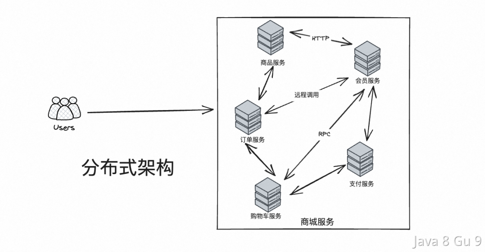
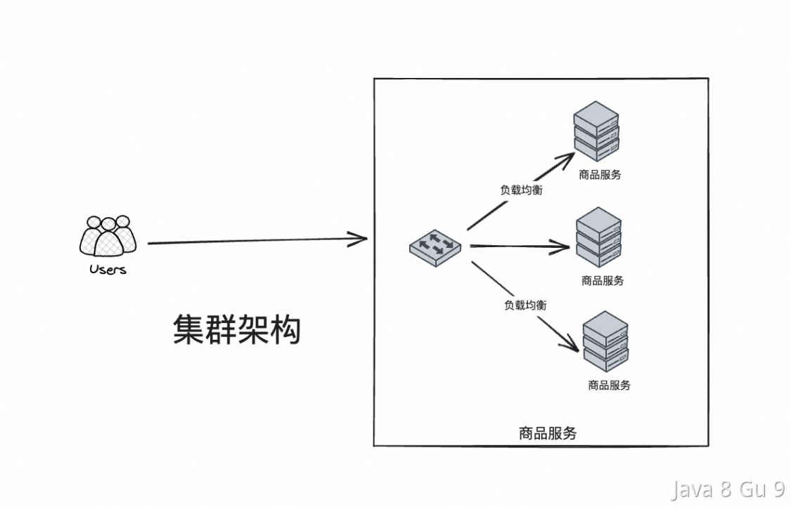
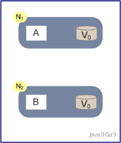
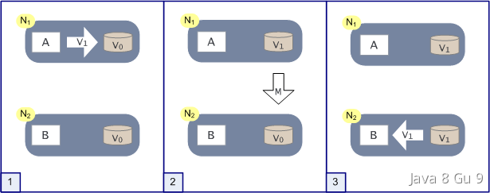
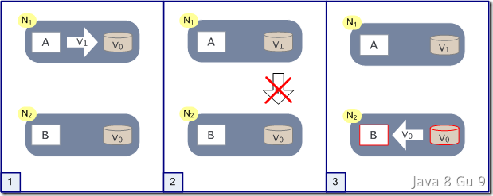
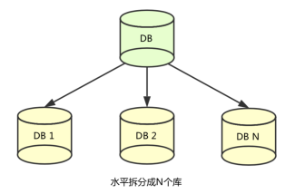

# 分布式系统理论

## 什么是分布式系统？和集群的区别？

分布式是针对集中式来说的，先说集中式，集中式系统就是把一整个系统的所有功能，包括数据库等等全部都部署在一起，通过一个整套系统对外提供服务。但是集中式系统存在系统大而复杂、难于维护、容易发生单点故障、扩展性差等问题。而这些问题在分布式系统中可以很好的解决。

分布式就是把一个集中式系统拆分成多个系统，每一个系统单独对外提供部分功能，整个分布式系统整体对外提供一整套服务。对于访问分布式系统的用户来说，感知上就像访问一台计算机一样。

分布式意味着可以采用更多的普通计算机（相对于昂贵的大型机）组成分布式集群对外提供服务。计算机越多，CPU、内存、存储资源等也就越多，能够处理的并发访问量也就越大。但是分布式系统中也存在着网络通信延迟、数据一致性等问题。

拿电商网站来说，我们一般把一个电商网站横向拆分成商品模块、订单模块、购物车模块、消息模块、支付模块等。然后我们把不同的模块部署到不同的机器上，各个模块之间通过远程服务调用(RPC)等方式进行通信。以一个分布式的系统对外提供服务。

分布式（distributed）是指在多台不同的服务器中部署不同的服务模块，通过远程调用协同工作，对外提供服务。

集群（cluster）是指在多台不同的服务器中部署相同应用或服务模块，构成一个集群，通过负载均衡设备对外提供服务。

### 分布式系统的特征

分布式系统需要各个主机之间通信和协调主要通过网络进行，所以，分布式系统中的计算机在空间上几乎没有任何限制，这些计算机可能被放在不同的机柜上，也可能被部署在不同的机房中，还可能在不同的城市中，对于大型的网站甚至可能分布在不同的国家和地区。

但是，无论空间上如何分布，一个标准的分布式系统应该具有以下几个主要特征：

#### 分布性

分布式系统中的多台计算机之间在空间位置上可以随意分布，系统中的多台计算机之间没有主、从之分，即没有控制整个系统的主机，也没有受控的从机。

#### 透明性

系统资源被所有计算机共享。每台计算机的用户不仅可以使用本机的资源，还可以使用本分布式系统中其他计算机的资源(包括CPU、文件、打印机等)。

#### 同一性

系统中的若干台计算机可以互相协作来完成一个共同的任务，或者说一个程序可以分布在几台计算机上并行地运行。

#### 通信性

系统中任意两台计算机都可以通过通信来交换信息。

和集中式系统相比，分布式系统的性价比更高、处理能力更强、可靠性更高、也有很好的扩展性。但是，分布式在解决了网站的高并发问题的同时也带来了一些其他问题。首先，分布式的必要条件就是网络，这可能对性能甚至服务能力造成一定的影响。其次，一个集群中的服务器数量越多，服务器宕机的概率也就越大。另外，由于服务在集群中分布式部署，用户的请求只会落到其中一台机器上，所以，一旦处理不好就很容易产生数据一致性问题。

## 什么是CAP理论，为什么不能同时满足？

### 数据一致性(consistency)

如果系统对一个写操作返回成功，那么之后的读请求都必须读到这个新数据；如果返回失败，那么所有读操作都不能读到这个数据，对调用者而言数据具有强一致性(strong consistency)

### 服务可用性(availability)

所有读写请求在一定时间内得到响应，可终止、不会一直等待。

对于一个可用性的分布式系统，每一个非故障的节点必须对每一个请求作出响应。所以，一般我们在衡量一个系统的可用性的时候，都是通过停机时间来计算的。  

|                    |             |             |
| ------------------ | ----------- | ----------- |
| 可用性分类              | 可用水平（%）     | 年可容忍停机时间    |
| 容错可用性           | 99.9999  | <1 min   |
| 极高可用性           | 99.999   | <5 min   |
| 具有故障自动恢复能力的可用性  | 99.99    | <53 min  |
| 高可用性            | 99.9     | <8.8h    |
| 商品可用性           | 99       | <3.65 d  |

通常我们描述一个系统的可用性时，我们说淘宝的系统可用性可以达到5个9，意思就是说他的可用水平是99.999%，即全年停机时间不超过 (1-0.99999)*365*24*60 = 5.256 min，这是一个极高的要求。

好的可用性主要是指系统能够很好的为用户服务，不出现用户操作失败或者访问超时等用户体验不好的情况。一个分布式系统，上下游设计很多系统如负载均衡、WEB服务器、应用代码、数据库服务器等，任何一个节点的不稳定都可以影响可用性。

### 分区容错性(partition-tolerance)

分区容错性指“the system continues to operate despite arbitrary message loss or failure of part of the system”，即分布式系统在遇到某节点或网络分区故障的时候，仍然能够对外提供满足一致性和可用性的服务。

分区容错性和扩展性紧密相关。在分布式应用中，可能因为一些分布式的原因导致系统无法正常运转。好的分区容错性要求能够使应用虽然是一个分布式系统，而看上去却好像是在一个可以运转正常的整体。比如现在的分布式系统中有某一个或者几个机器宕掉了，其他剩下的机器还能够正常运转满足系统需求，或者是机器之间有网络异常，将分布式系统分隔为独立的几个部分，各个部分还能维持分布式系统的运作，这样就具有好的分区容错性。

简单点说，就是在网络中断，消息丢失的情况下，系统如果还能正常工作，就是有比较好的分区容错性。

### CAP的证明

如上图，是我们证明CAP的基本场景，网络中有两个节点N1和N2，可以简单的理解N1和N2分别是两台计算机，他们之间网络可以连通，N1中有一个应用程序A，和一个数据库V，N2也有一个应用程序B2和一个数据库V。现在，A和B是分布式系统的两个部分，V是分布式系统的数据存储的两个子数据库。

在满足一致性的时候，N1和N2中的数据是一样的，V0=V0。在满足可用性的时候，用户不管是请求N1或者N2，都会得到立即响应。在满足分区容错性的情况下，N1和N2有任何一方宕机，或者网络不通的时候，都不会影响N1和N2彼此之间的正常运作。

如上图，是分布式系统正常运转的流程，用户向N1机器请求数据更新，程序A更新数据库Vo为V1，分布式系统将数据进行同步操作M，将V1同步的N2中V0，使得N2中的数据V0也更新为V1，N2中的数据再响应N2的请求。

这里，可以定义N1和N2的数据库V之间的数据是否一样为一致性；外部对N1和N2的请求响应为可用性；N1和N2之间的网络环境为分区容错性。这是正常运作的场景，也是理想的场景，然而现实是残酷的，当错误发生的时候，一致性和可用性还有分区容错性，是否能同时满足，还是说要进行取舍呢？

作为一个分布式系统，它和单机系统的最大区别，就在于网络，现在假设一种极端情况，N1和N2之间的网络断开了，我们要支持这种网络异常，相当于要满足分区容错性，能不能同时满足一致性和响应性呢？还是说要对他们进行取舍。

假设在N1和N2之间网络断开的时候，有用户向N1发送数据更新请求，那N1中的数据V0将被更新为V1，由于网络是断开的，所以分布式系统同步操作M，所以N2中的数据依旧是V0；这个时候，有用户向N2发送数据读取请求，由于数据还没有进行同步，应用程序没办法立即给用户返回最新的数据V1，怎么办呢？

有二种选择，第一，牺牲数据一致性，保证可用性。响应旧的数据V0给用户；

第二，牺牲可用性，保证数据一致性。阻塞等待，直到网络连接恢复，数据更新操作M完成之后，再给用户响应最新的数据V1。

这个过程，证明了要满足分区容错性的分布式系统，只能在一致性和可用性两者中，选择其中一个。

### CAP权衡

通过CAP理论及前面的证明，我们知道无法同时满足一致性、可用性和分区容错性这三个特性，那要舍弃哪个呢？

我们分三种情况来阐述一下。

#### CA without P

这种情况在分布式系统中几乎是不存在的。首先在分布式环境下，网络分区是一个自然的事实。因为分区是必然的，所以如果舍弃P，意味着要舍弃分布式系统。那也就没有必要再讨论CAP理论了。这也是为什么在前面的CAP证明中，我们以系统满足P为前提论述了无法同时满足C和A。

比如我们熟知的关系型数据库，如My Sql和Oracle就是保证了可用性和数据一致性，但是他并不是个分布式系统。一旦关系型数据库要考虑主备同步、集群部署等就必须要把P也考虑进来。

其实，在CAP理论中。C，A，P三者并不是平等的，CAP之父在《Spanner，真时，CAP理论》一文中写到：

> 如果说Spanner真有什么特别之处，那就是谷歌的广域网。Google通过建立私有网络以及强大的网络工程能力来保证P，在多年运营改进的基础上，在生产环境中可以最大程度的减少分区发生，从而实现高可用性。

从Google的经验中可以得到的结论是，无法通过降低CA来提升P。要想提升系统的分区容错性，需要通过提升基础设施的稳定性来保障。

所以，对于一个分布式系统来说。P是一个基本要求，CAP三者中，只能在CA两者之间做权衡，并且要想尽办法提升P。

#### CP without A

如果一个分布式系统不要求强的可用性，即容许系统停机或者长时间无响应的话，就可以在CAP三者中保障CP而舍弃A。

一个保证了CP而一个舍弃了A的分布式系统，一旦发生网络故障或者消息丢失等情况，就要牺牲用户的体验，等待所有数据全部一致了之后再让用户访问系统。

设计成CP的系统其实也不少，其中最典型的就是很多分布式数据库，他们都是设计成CP的。在发生极端情况时，优先保证数据的强一致性，代价就是舍弃系统的可用性。如HBase，还有分布式系统中常用的Zookeeper也是在CAP三者之中选择优先保证CP的。

无论是像HBase这种分布式存储系统，还是像Zookeeper这种分布式协调组件。数据的一致性是他们最最基本的要求。一个连数据一致性都保证不了的分布式存储要他有何用？

ZooKeeper是个CP（一致性+分区容错性）的，即任何时刻对ZooKeeper的访问请求能得到一致的数据结果，同时系统对网络分割具备容错性。但是它不能保证每次服务请求的可用性，也就是在极端环境下，ZooKeeper可能会丢弃一些请求，消费者程序需要重新请求才能获得结果。ZooKeeper是分布式协调服务，它的职责是保证数据在其管辖下的所有服务之间保持同步、一致。所以就不难理解为什么ZooKeeper被设计成CP而不是AP特性的了。

#### AP wihtout C

要高可用并允许分区，则需放弃一致性。一旦网络问题发生，节点之间可能会失去联系。为了保证高可用，需要在用户访问时可以马上得到返回，则每个节点只能用本地数据提供服务，而这样会导致全局数据的不一致性。

这种舍弃强一致性而保证系统的分区容错性和可用性的场景和案例非常多。前面我们介绍可用性的时候说到过，很多系统在可用性方面会做很多事情来保证系统的全年可用性可以达到N个9，所以，对于很多业务系统来说，比如淘宝的购物，12306的买票，redis集群。都是在可用性和一致性之间舍弃了一致性而选择可用性。

你在12306买票的时候肯定遇到过这种场景，当你购买的时候提示你是有票的（但是可能实际已经没票了），你也正常的去输入验证码，下单了。但是过了一会系统提示你下单失败，余票不足。这其实就是先在可用性方面保证系统可以正常的服务，然后在数据的一致性方面做了些牺牲，会影响一些用户体验，但是也不至于造成用户用户流失的严重阻塞。

但是，我们说很多网站牺牲了一致性，选择了可用性，这其实也不准确的。就比如上面的买票的例子，其实舍弃的只是强一致性。退而求其次保证了最终一致性。也就是说，虽然下单的瞬间，关于车票的库存可能存在数据不一致的情况，但是过了一段时间，还是要保证最终一致性的。

对于多数大型互联网应用的场景，主机众多、部署分散，而且现在的集群规模越来越大，所以节点故障、网络故障是常态，而且要保证服务可用性达到N个9，即保证P和A，舍弃C（退而求其次保证最终一致性）。

### 适合的才是最好的

上面介绍了如何CAP中权衡及取舍以及典型的案例。孰优孰略，没有定论，只能根据场景定夺，适合的才是最好的。

对于涉及到钱财这样不能有一丝让步的场景，C必须保证。网络发生故障宁可停止服务，这是保证CP，舍弃A。比如前几年支付宝光缆被挖断的事件，在网络出现故障的时候，支付宝就在可用性和数据一致性之间选择了数据一致性，用户感受到的是支付宝系统长时间宕机，但是其实背后是无数的工程师在恢复数据，保证数数据的一致性。

对于其他场景，比较普遍的做法是选择可用性和分区容错性，舍弃强一致性，退而求其次使用最终一致性来保证数据的安全。

## 分布式系统有哪些一致性模型？

所谓一致性，是指数据在多个副本之间是否能够保持一致的特性。再聊一致性的时候，其实要搞清楚一致性模型。（概念挺多，但是没办法，这玩意它本身就是理论。想结合代码、示例都做不到，甚至想着画个图都不知道该如何下手）

分布式系统中的一致性模型是一组管理分布式系统行为的规则。它决定了在分布式系统中如何访问和更新数据，以及如何将这些更新提供给客户端。面对网络延迟和局部故障等分布式计算难题，分布式系统的一致性模型对保证系统的一致性和可靠性起着关键作用。在分布式系统中有多种一致性模型可用，每个模型都有其优点和缺点，选择模型取决于系统的具体要求。

大的分类上面，主要有三种，分别是强一致性、弱一致性和最终一致性：

- 强一致性模型（Strong Consistency）： 在强一致性模型下，系统保证每个读操作都将返回最近的写操作的结果，即任何时间点，客户端都将看到相同的数据视图。这包括线性一致性（Linearizability）、顺序一致性（Sequential Consistency）和严格可串行性（Strict Serializability）等子模型。强一致性模型通常牺牲了可用性来实现数据一致性。

- 弱一致性模型（Weak Consistency）： 弱一致性模型放宽了一致性保证，它允许在不同节点之间的数据访问之间存在一定程度的不一致性，以换取更高的性能和可用性。这包括因果一致性（Causal Consistency）、会话一致性（Session Consistency）和单调一致性（Monotonic Consistency）等子模型。弱一致性模型通常更注重可用性，允许一定程度的数据不一致性。

- 最终一致性模型（Eventual Consistency）： 最终一致性模型是一种最大程度放宽了一致性要求的模型。它允许在系统发生分区或网络故障后，经过一段时间，系统将最终达到一致状态。这个模型在某些情况下提供了很高的可用性，但在一段时间内可能会出现数据不一致的情况。

### 线性一致性 & 顺序一致性

线性一致性（Linearizability）和顺序一致性（Sequential Consistency）是两种强一致性模型。

线性一致性是一种最强的一致性模型，它强调在分布式系统中的任何时间点，读操作都应该返回最近的写操作的结果。

举个例子，如果操作A在操作B之前成功完成，那么操作B在序列化中应该看起来在操作A之后发生，即操作A应该在操作B之前完成。线性一致性强调实时性，确保操作在实际时间上的顺序保持一致。

顺序一致性也是一种强一致性模型，但相对于线性一致性而言，它放宽了一些限制。在顺序一致性模型中，系统维护一个全局的操作顺序，以确保每个客户端看到的操作顺序都是一致的。

与线性一致性不同，顺序一致性不强调实时性，只要操作的顺序是一致的，就可以接受一些延迟。

他们的主要区别在于强调实时性。线性一致性要求操作在实际时间上的顺序保持一致，而顺序一致性只要求操作的顺序是一致的，但不一定要求操作的实际时间顺序。

### 顺序一致性 & 最终一致性

很多人看完线性一致性和顺序一致性的区别之后，会容易懵，看上去顺序一致性和我们理解的最终一致性有点像？

那么他们的区别是啥呢？在时间上，虽然顺序一致性和最终一致性都不强要求实时性，但是最终一致性的时间放的会更宽。并且最终一致性其实并不强调顺序，他只需要保证最终的结果一致就行了，而顺序一致性要求操作顺序必须一致。

并且，顺序一致性还是一种强一致性，比如在Zookeeper中，其实就是通过ZAB算法来保证的顺序一致性，即各个节点之间的写入顺序要求一致。并且要半数以上的节点写入成功才算成功。所以，顺序一致性的典型应用场景就是数据库管理系统以及分布式系统。

而最终一致性通常适用于互联网三高架构的业务开发，如电商网站，社交媒体网站等。

CAP证明、CP（分布式数据库、zk）、AP（抢票、购物、redis集群）

合理的分库分表策略：

例如一个商家的所有商品分布在多个库，多张表里，查询时则只能建立多个数据库连接，查完合并到一起，效率太低，性能消耗太大。

商家端商品表：商家id作为分表策略，同一个商家id的商品在一张表里；

用户端订单表：userId后四位作为分表策略，基于用户id可以在一张表里查到全部订单；订单id存时加上userId后四位，基于订单id后四位也能找到需要去哪张表里查全部订单。

运营管理端：查全量数据，非实时查询（数仓，等几十秒），实时（es）

旧系统上亿单表数据如何做分库分表：写一个数据迁移系统，主要职责是批量查询数据，并入到分库分表新系统里+cannal监听binlog写入增量更新的数据+增量更新和全量更新冲突的部分需要处理，可以放入mq里一段时间后再replay一下

灰度发布：新老系统都存在，一部分流量打到新系统中，检查日志是否有问题，等一段时间后再把新系统增加到满，把老系统流量全部关闭。

数据库迁移无论怎么做都会可能存在问题和bug，是否存在永不迁移的数据架构：

TiDB分布式数据库可以保证不需要分库分表

## 分布式事务基本理论

### 分布式事务产生的背景

原本一个系统是单库单表的架构就可以支撑起整个业务运转。但是随着业务数据的规模越来越大，数据量越来越大，单个数据库逐渐成为系统性能的瓶颈，所以我们想到了对数据库进行水平拆分，将单个数据库分成数据库分片。

如图所示，分库分表之后，原来在一个数据库上进行的写操作，就有可能会变成跨多个数据库，这就产生了跨数据库的事务问题。

与此同时，随着业务服务的不断扩大，单个业务系统也不再适合承担整个系统的职责。遵循着面向服务原则（SOA），我们将系统架构拆分成多个业务子系统，降低系统间的耦合度，使不同系统专注于自身的业务，更有利于业务的发展和系统的伸缩性。

业务拆分之后，一个完整的业务流程可能需要调用到多个服务，如何保证服务间的数据一致性成为了一个难题。

### 分布式事务理论基础

#### 2PC协议

两阶段提交协议（Two Phase Commitment Protocol）是分布式事务最基本的协议，蕴含了整个分布式事务的基本思想。2PC协议通过事务管理器、资源管理器两个角色完成分布式事务的操作。事务管理器通过两个阶段完成分布式事务流程：第一阶段准备资源，也就是预留事务所需要的资源，如果每个资源管理器都预留成功，则进行第二阶段的资源提交，否则协调资源管理器进行回滚。

#### TCC协议

TCC（Try-Confirm-Cancel）是服务化的两阶段提交协议，业务开发者需要实现Try、Confirm、Cancel这三个服务接口，第一阶段服务由业务代码编排来调用 Try 接口进行资源预留，所有参与者的 Try 接口都成功了，事务管理器会提交事务，并调用每个参与者的 Confirm 接口真正提交业务操作，否则调用每个参与者的 Cancel 接口回滚事务。

#### Saga协议

Saga 是一种补偿协议，在 Saga 模式下，分布式事务内有多个参与者，每一个参与者都是一个冲正补偿服务，需要用户根据业务场景实现其正向操作和逆向回滚操作。

分布式事务执行过程中，依次执行各参与者的正向操作，如果所有正向操作均执行成功，那么分布式事务提交。如果任何一个正向操作执行失败，那么分布式事务会退回去执行前面各参与者的逆向回滚操作，回滚已提交的参与者，使分布式事务回到初始状态。

Saga 正向服务与补偿服务也需要业务开发者实现。Saga 理论出自 Hector & Kenneth 1987发表的论文 Sagas。

### 
## 深入阅读：

- 
- 
- 
- 
- 
