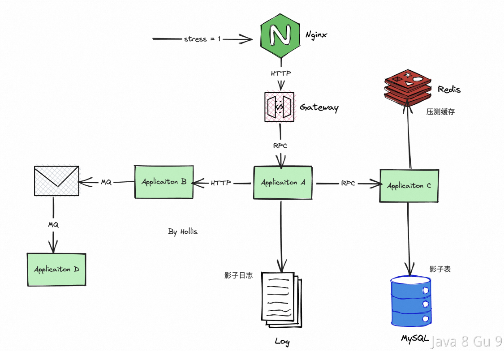
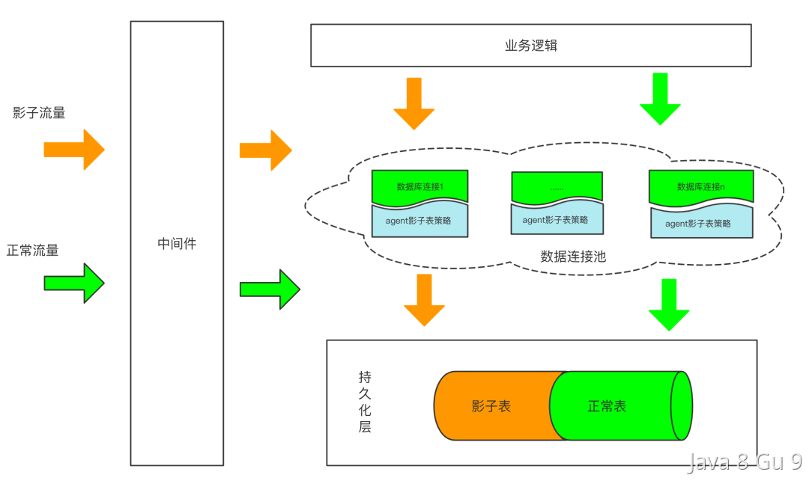

## 高可用系统

### 什么是SLA？

SLA是Service Level Agreement的缩写，意为服务等级协议。它是指供应商和客户之间达成的一份正式协议，规定了供应商应该向客户提供的服务水平、质量、可靠性和响应时间等指标。

SLA通常会涉及到各种服务指标，例如服务可用性、服务等待时间、故障修复时间、数据保密性、客户支持等，旨在确保供应商向客户提供高质量、高可靠性、高安全性的服务。

SLA通常用于云计算、SaaS、PaaS等服务领域，对于企业用户和服务提供商之间的合作非常重要。通过制定合适的SLA，双方可以达成共识，从而更好地维护业务合作关系。

一般作为甲方在采购乙方的服务的时候，乙方都会提供一些SLA指标，这些指标包括但不限于以下几个方面：

1. 可用性：指服务在一定时间范围内能够正常使用的时间比例，通常以百分比表示。例如，“四个九”（99.99%）可用性要求表示一年内服务最多只能停机不超过52.56分钟。

2. 响应时间：指服务响应请求的时间，通常以毫秒或秒为单位表示。例如，网络服务的响应时间可要求在100毫秒以内。

3. 吞吐量：指系统在单位时间内能够处理的请求量，通常以每秒钟处理的请求量（QPS）或每分钟处理的请求量（RPM）为单位。

4. 故障处理时间：指故障发生后系统能够恢复正常运行的时间，通常以分钟或小时为单位。例如，“四个九”（99.99%）可用性要求通常要求故障处理时间在52分钟以内。

5. 数据可靠性：指系统能够保证数据的完整性、一致性、可用性和安全性。例如，在数据库系统中，可要求采用主从同步、备份等技术手段来保证数据的可靠性。

6. 服务支持：指服务提供商提供的技术支持、客户服务等方面的指标。例如，在运营云服务时，可要求服务提供商提供24小时客户服务、及时响应客户请求等。

7. 其他指标：根据具体业务需求和服务类型，还可以定义其他指标，如安全性、可扩展性、性能等。

SLA的指标需要根据业务需求、技术能力和市场标准等因素来进行制定，同时要具备可量化和可监控的特性，以确保双方都能够达成共识并得到有效执行。

#### 4个9、5个9

SLA 4个9指的是服务的可用性要求，也被称为“四个九”，通常表示服务的可用性达到99.99%。

具体地说，四个九表示在一年的时间内，服务最多只能停机不超过52.56分钟（365*24*60*(1-0.9999)）。这意味着服务需要保持高可用性，并且具备足够的弹性和韧性，以应对突发的故障和异常情况。

同理，3个9、5个9等也是类似的算法。

### 什么是冷备、热备，暖备？

冷备、热备和暖备是备份和恢复方案中常见的术语，它们表示备份和恢复方案的不同类型和不同级别。

#### 冷备（Cold Backup）

冷备是指在关闭系统或服务后，将数据备份到离线介质中的一种备份方式。在备份过程中，系统或服务不可用。恢复时需要将备份的数据还原到系统中，并启动系统或服务。由于备份和恢复过程中系统处于离线状态，因此冷备的恢复时间较长，但成本相对较低。

举例：在深夜停机时备份整个数据库、在一个网站的低峰期备份数据库。

#### 热备（Hot Backup）

热备是指在系统或服务运行期间，对数据进行备份的一种备份方式。在备份过程中，系统或服务仍然可以提供服务。热备的恢复时间相对较短，但需要额外的资源来支持备份和恢复，因此成本较高。

举例：使用数据库备份工具在生产服务器上运行备份任务，而无需停机，以确保数据持续可用。就像我们通常做的数据库的主从同步，其实就是热备的一种实现。

#### 暖备（Warm Backup）

暖备是介于冷备和热备之间的备份方式。在进行暖备时，备份数据与原始数据之间的同步是定期进行的，备份数据的时间间隔通常比热备长，但比冷备短。暖备的恢复时间比热备长，但比冷备短，因为需要将备份数据还原到原来的位置，并进行一些必要的同步操作。

举例：一般是在某个应用程序的特定功能模块关闭或限制访问的情况下备份数据，以减轻备份操作对业务的影响。

综合来看，冷备、热备和暖备的选择应该根据具体的业务需求和资源限制来进行综合考虑。一般而言，如果数据要求高可用性和实时性，应该采用热备方式；如果数据要求较高，但可用性和实时性要求相对较低，可以采用暖备方式；如果数据要求不是很高，可以采用冷备方式。

### 如何设计一个高可用架构？

设计一个高可用架构需要考虑多个方面，包括可用性、可靠性、性能、扩展性、安全性等。下面是一些设计高可用架构的一般性原则和方法：

1. 设计集群架构：采用多节点的集群架构可以提高系统的可用性和可靠性，从而避免单点故障导致系统不可用。

2. 采用分布式架构：采用分布式架构可以将系统的负载分散到多个节点上，从而提高系统的性能和可扩展性。

3. 实现故障转移和容错机制：通过使用冗余组件、备份数据等技术手段，可以实现故障转移和容错机制。例如，采用主从复制、备份、快速切换等技术来确保数据不丢失、系统快速恢复。

4. 可靠的服务器和网络：选择可靠的服务器和网络设备，以确保它们能够在故障时正常运行。可以采用多个服务器进行冗余备份，以实现故障转移和负载均衡。可以选择高可靠性网络设备和路由器，以避免网络故障。

5. 容灾和备份：需要设置容灾和备份计划，以确保在自然灾害、人为错误或其他紧急情况下能够快速恢复服务。可以使用云备份和容灾服务，以提高备份和恢复的效率和可靠性。

6. 设计监控和自动化工具：通过使用监控工具和自动化工具可以实现对系统的实时监控和自动化维护。例如，通过使用系统监控工具、自动化运维工具等来实现自动化运维、自动化扩容等功能，从而减少手动操作和人为错误。

7. 实现数据安全保护：通过采用多层次的安全策略来保护数据的安全性。例如，使用加密技术、防火墙、入侵检测等技术来保护系统和数据的安全。

8. 进行容量规划和性能优化：通过进行容量规划和性能优化，可以提高系统的性能和可扩展性。例如，通过使用缓存、调整配置参数、优化代码等技术手段来提高系统的性能和稳定性。

9. 设计自动化扩容和弹性伸缩：通过设计自动化扩容和弹性伸缩功能，可以根据业务需求和系统负载情况来自动调整系统资源。例如，通过使用自动化扩容工具和自动化弹性伸缩策略来实现系统资源的自动分配和调整。

需要注意的是，设计高可用架构需要综合考虑业务需求、技术方案、资源投入等因素，同时需要不断进行优化和改进，以实现最优的性能和可用性。

### 什么是异地多活？

异地多活是一种分布式系统架构模式，可以让多个数据中心在不同地理位置提供相同的服务，并且能够实现数据的实时同步和故障切换。通常用于需要在全球范围内提供高可用性和低延迟的应用程序，例如在线游戏、社交媒体、金融交易等。

在异地多活架构中，多个数据中心之间通过高速网络连接进行数据同步和负载均衡。每个数据中心都具有完整的应用程序和数据副本，可以同时提供服务并处理客户端请求。当一个数据中心发生故障时，可以通过自动切换和故障转移机制将流量转移到其他健康的数据中心，从而保证系统的可用性和可靠性。

异地多活架构需要考虑多个因素，例如数据同步和冲突解决、负载均衡和故障切换、安全性和隐私保护等。通常需要采用分布式数据库、消息队列、负载均衡器、DNS解析等技术来支持异地多活架构。

#### 同城容灾

同城容灾和异地多活一样，也是一种分布式系统架构模式，可以在同一城市或地理区域内提供高可用性和容灾能力。它通过将不同的服务器和存储设备组合在一起，构建出一个分布式系统，可以实现数据的实时同步和故障切换。

在同城容灾架构中，多个数据中心之间通过高速网络连接进行数据同步和负载均衡。每个数据中心都具有完整的应用程序和数据副本，可以同时提供服务并处理客户端请求。当一个数据中心发生故障时，可以通过自动切换和故障转移机制将流量转移到其他健康的数据中心，从而保证系统的可用性和可靠性。

同城容灾架构相比于异地多活架构来说，更加适用于数据中心距离较近的情况。它可以通过使用复制、镜像和数据同步等技术来实现数据的备份和容灾，从而提高系统的可用性和可靠性。同时，同城容灾架构还可以提供低延迟和高带宽的网络连接，以支持高吞吐量的应用程序。

### 什么是压测，怎么做压测？

压测是一种非常常见的帮我们做性能评估的手段。通过模拟用户请求，帮助我们发现系统的瓶颈以及评估系统的整体水位。

以下是进行压测的一般步骤：

1. 确定测试目标：明确进行压测的目标，具体是哪个接口，那个方法，哪种具体的case。以及这次压测我们要实现什么目的，是测试300QPS能不能扛得住，还是看看系统的整体水位咋样。

2. 制定压测计划：确定压测的具体策略，包括测试的时间、持续多久、并发量要压到多少、是一次性压到指标还是脉冲式压上去、测试环境配置等。

3. 创建环境并准备脚本：压测可以在测试环境也可以在生产环境，但是不管是硬件配置、部署架构还是代码，都需要和线上环境尽量保持一致。并且需要准备好压测数据及脚本，是不同的用户，还是相同的用户，是写数据还是读数据。都是不一样的。

4. 执行压测：根据测试计划，执行压测并收集性能指标。可以逐步增加负载，观察系统的响应情况。

5. 监控系统性能：施压不是目的，目的是在施压过程中，观察系统的整体情况。包括但不限于：RT、CPU利用率、Load、内存情况、GC次数、GC时长、网络IO情况、堆内存情况、线上报警情况等。

6. 分析结果：对压测结果进行分析，确定系统的性能瓶颈和潜在问题，并采取相应的优化措施。

7. 优化和再测试：根据分析结果，进行必要的优化和改进，并重新进行压测，直到系统能够满足预期的性能要求。

常用的压测工具包括JMeter、Apache Bench等，它们可以帮助自动化执行压测脚本，并提供详细的测试报告和性能分析。在进行压测时，需要特别注意对生产环境的影响，确保不会对实际用户造成不良影响。因此，在压测前务必仔细准备，并充分评估风险。

看一下这个压测文章：[如何做好性能压测（三）| 阿里巴巴在开源压测工具 JMeter 上的实践和优化 - info2soft - twt企业IT交流平台](https://www.talkwithtrend.com/Article/245389)

### 什么是全链路压测？

全链路压测诞生于阿里巴巴双11备战过程，如果说双11大促是阿里业务的“期末考试”，全链路压测就是大考前的“模拟考试”。全链路压测通过在生产环境对业务大流量场景进行高仿真模拟，获取最真实的线上实际承载能力、执行精准的容量规划，确保系统可用性。

因为对于像阿里这种大型互联网公司来说，尤其是电商业务，一个业务流程涉及到的上下游实在是太多了。任何一个节点都可能成为整个系统的瓶颈。

而在单链路压测时，往往只关注自己的系统，就会不可避免忽略掉一些资源竞争及外部干扰，最终得到一个过于乐观的结果。

并且在分布式场景中，我们和上下游之间的依赖关系错综复杂，只有在全链路压测中才能真正的暴露出真实环境中的各种问题。

全链路压测可以从网络到Nginx反向代理、到应用服务器、系统间依赖、数据库、缓存、磁盘等全方位的找出系统瓶颈。

但是全链路压测和单链路压测有个比较大的不同，那就是对于很多下游系统来说，他需要能识别出压测流量，一方面可以对这些流量做一些特殊处理，比如某个系统大促当天会被降级，那么他就可以直接把压测流量过滤掉，不参加压测。

还有就是，很多时候压测都不仅仅是读操作，还有很多写操作，那就会在很多系统中产生数据，那么就需要把这部分流量识别出来，把这部分数据做好隔离。



所以，全链路压测中比较重要的就是流量识别及数据隔离。

#### 流量识别

在流量识别方面，一般都是通过流量染色实现的，其实就是对各种服务框架进行改造，比如DUBBO、REDIS、TDDL、MQ等所有的系统间交互以及存储等需要用到的组件中做改造。

比如定义一个特殊的字段，如full_chain_stress_tag，把他在整个链路中都传递下去，然后这样各个系统就可以有效的识别出压测流量了。

这个也可以和分布式链路追踪结合着来做，理论上大家要该干的事儿是一样的。

#### 数据隔离

数据隔离一般都是用影子表。比如我们有一张order表，那么在压测前就需要创建一张order__shadow表，作为他的影子表。

这样在数据库持久层，就需要识别出压测流量，然后把压测数据写入到影子表中。这样就可以避免对真实数据产生影响。



除了数据库，还有缓存，也一样，也需要识别压测流量，然后写入到对应的影子缓存中。还有日志，如果有需要，也可以做隔离

#### 工具

目前市面上可以用的全链路压测工具有Takin、Quake（美团）、Rhino（字节）、ForceBot

以下是一些行业内大厂的一些压测的分享（外链）：

- [史上最复杂业务场景，逼出阿里高可用三大法宝](https://zhuanlan.zhihu.com/p/27211011)

- [阿里双十一大促，技术准备只做了这两件事情？](https://mp.weixin.qq.com/s?__biz=MjM5MDE0Mjc4MA==&mid=2650995093&idx=1&sn=574f6d83a48c2c596943b1fbeb25e4a7&chksm=bdbf01c68ac888d03eadfff1475e782ac8e289ad62bfe5cfe15542105fcdd8f6dfb6e2da7afa&scene=21#wechat_redirect)

- [独家揭秘 | 阿里怎么做双11全链路压测？](https://developer.aliyun.com/article/723177) 

- [10年5次进化，双11容量规划如何实现成本与稳定的最佳平衡？](https://juejin.im/entry/6844903713773977614) 

- [阿里巴巴高可用技术专家襄玲：压测环境的设计和搭建](https://mp.weixin.qq.com/s?__biz=MzU4NzU0MDIzOQ==&mid=2247486698&idx=3&sn=c3a2af9322c2bf6ad25d8c4823d1461f&chksm=fdeb3e8aca9cb79c3ff4f0d61eed4db4e7fd72c54e0ef670ad9d4c12caa05000dec80bbd179a&scene=21#wechat_redirect) 

- [字节跳动全链路压测(Rhino)的实践](https://mp.weixin.qq.com/s/vofrpFGvnptj3MNAv1hQ-w) 

- [全链路压测平台（Quake）在美团中的实践](https://tech.meituan.com/2018/09/27/quake-introduction.html) 

- [京东全链路压测军演系统(ForceBot)](https://github.com/panjianning/performance-test/blob/master/%E4%BA%AC%E4%B8%9C%E5%85%A8%E9%93%BE%E8%B7%AF%E5%8E%8B%E6%B5%8B%E5%86%9B%E6%BC%94%E7%B3%BB%E7%BB%9F(ForceBot).pdf) 

- [饿了么全链路压测的探索与实践](https://zhuanlan.zhihu.com/p/30306892) 

- [携程全链路测试实践](https://github.com/panjianning/performance-test/blob/master/%E6%90%BA%E7%A8%8B%E5%85%A8%E9%93%BE%E8%B7%AF%E6%B5%8B%E8%AF%95%E5%AE%9E%E8%B7%B5.pdf) 

- [有赞全链路压测实战](https://cloud.tencent.com/developer/article/1510088)

## 高并发系统

### 如何设计一个能够支持高并发的系统？

设计一个能够支持高并发的系统需要考虑多方面的因素，包括架构、性能优化、容错和可伸缩性等。以下是一些一般性的建议和实践：

1. 分布式架构：将系统分解成多个模块，采用分布式架构来降低单点故障的风险，并提高系统的可伸缩性和性能。

2. 集群部署：将一个服务通过集群进行部署，来提升系统整体的吞吐量及响应速度，并使用负载均衡技术将请求均衡分配给多个服务器，以提高系统的性能和可用性。

3. 利用缓存：使用缓存、NoSQL等技术，以提高数据读写的性能和可靠性。

4. 异步处理：采用异步处理机制，如使用消息队列、事件驱动等技术，以降低请求响应时间和提高系统吞吐量。

5. 预加载：使用预加载技术来提前加载需要的资源，以减少用户等待时间。

6. 代码优化和调优：对系统代码进行优化和调优，如采用异步I/O、避免锁（减小锁的粒度）、减少循环和递归、避免长事务等，以提高系统性能。

7. 数据库优化：合理的数据库设计和优化，包括合理的索引设计、分库分表、读写分离、缓存优化等，可以有效提高系统的并发度和响应速度。

8. 分库分表：将一个大型的数据库拆分成多个小型的数据库（分库），然后将每个小型数据库中的表再进行拆分（分表），从而减轻单个数据库或表的读写压力，通过分库分表，可以将大量的读写操作分散到多个数据库或表中，从而提高系统的并发度和响应速度。

9. 读写分离：读写分离是一种常用的数据库优化技术，它将读操作和写操作分配到不同的数据库实例上处理。通过读写分离，主库主要负责写操作，从库则负责读操作，从而提高了系统的并发度和可扩展性。同时，读写分离还可以提高系统的可用性和容错能力，因为即使主库出现故障，从库仍然可以提供读服务。

10. 防止雪崩：通过使用限流、熔断、降级等技术，可以防止系统因为某个组件出现故障而导致整个系统崩溃的雪崩效应。

11. 容错和监控：实现容错机制，如备份、容灾、负载降级等，以保障系统的可用性。同时，使用监控工具来实时监测系统的运行状况和性能瓶颈，及时做出调整和优化。

12. 测试和评估：进行全面的性能测试和评估，包括压力测试、负载测试、安全测试等，以发现并解决系统的性能瓶颈和安全隐患。

综上所述，设计高并发系统需要从多个方面考虑，需要综合运用各种技术和工具，进行全面的测试和评估，以实现系统的高可用、高性能和高安全性。

### 微服务的服务降级、服务熔断

略

### 什么是预热？它有何作用？

预热一般指缓存预热，一般用在高并发系统中，为了提升系统在高并发情况下的稳定性的一种手段。

缓存预热是指在系统启动之前或系统达到高峰期之前，通过预先将常用数据加载到缓存中，以提高缓存命中率和系统性能的过程。缓存预热的目的是尽可能地避免缓存击穿和缓存雪崩，还可以减轻后端存储系统的负载，提高系统的响应速度和吞吐量。

1. 减少冷启动影响：当系统重启或新启动时，缓存是空的，这被称为冷启动。冷启动可能导致首次请求处理缓慢，因为数据需要从慢速存储（如数据库）检索。

2. 提高数据访问速度：通过预先加载常用数据到缓存中，可以确保数据快速可用，从而加快数据访问速度。

3. 平滑流量峰值：在流量高峰期之前预热缓存可以帮助系统更好地处理高流量，避免在流量激增时出现性能下降。

4. 保证数据的时效性：定期预热可以保证缓存中的数据是最新的，特别是对于高度依赖于实时数据的系统。

5. 减少对后端系统的压力：通过缓存预热，可以减少对数据库或其他后端服务的直接查询，从而减轻它们的负载。

比如秒杀商品、大促活动等，这些是可以提前预知哪些key会变成热key的，所以就可以做提前的预热。

缓存预热的一般做法是在系统启动或系统空闲期间，将常用的数据加载到缓存中，主要做法有以下几种：

1. 系统启动时加载：在系统启动时，将常用的数据加载到缓存中，以便后续的访问可以直接从缓存中获取。

2. 定时任务加载：定时执行任务，将常用的数据加载到缓存中，以保持缓存中数据的实时性和准确性。

3. 手动触发加载：在系统达到高峰期之前，手动触发加载常用数据到缓存中，以提高缓存命中率和系统性能。

缓存预热是一种提高高并发系统性能和可靠性的重要方法，通过预先将常用的数据加载到缓存中，避免缓存击穿和缓存雪崩等问题，从而保证系统的稳定性和可靠性。

#### JVM缓存预热的方法

在进行缓存预热时，有一些做法可供参考。常见的是以下这几个：

##### 启动过程中预热

比较常见的一种实现方式就是在系统启动的时候预热，这种方式一般对于本地缓存十分常见，因为本地缓存本身就是基于JVM内存的，当应用重启时，本地缓存就会被清空，而在应用启动之后，就需要把本地缓存的内容预热好。这样才能起到缓存的效果。

那么，一种有效的方式就是基于Spring来实现。在Spring应用程序启动时，可以通过监听应用启动事件，或者在应用的初始化阶段，将需要缓存的数据加载到缓存中。这可以通过在启动时调用相关服务或者数据访问层的方法来实现。

Spring其实提供了一系列事件及扩展点，可以让我们在他的生命周期的各个阶段做我们想做的事情。如基于ApplicationReadyEvent、CommandLineRunner、InitializingBean、@PostConstruct等。

###### ApplicationReadyEvent

在应用程序启动时，可以通过监听应用启动事件，或者在应用的初始化阶段，将需要缓存的数据加载到缓存中。

ApplicationReadyEvent 是 Spring Boot 框架中的一个事件类，它表示应用程序已经准备好接收请求，即应用程序已启动且上下文已刷新。这个事件是在 ApplicationContext 被初始化和刷新，并且应用程序已经准备好处理请求时触发的。

基于ApplicationReadyEvent，我们可以在应用程序完全启动并处于可用状态后执行一些初始化逻辑。使用 @EventListener 注解或实现 ApplicationListener 接口来监听这个事件。例如，使用 @EventListener 注解：

```java
@EventListener(ApplicationReadyEvent.class)
public void preloadCache() {
    // 在应用启动后执行缓存预热逻辑
    // ...
}
```

###### Runner

如果你不想直接监听ApplicationReadyEvent，在SpringBoot中，也可以通过CommandLineRunner 和 ApplicationRunner 来实现这个功能。

CommandLineRunner 和 ApplicationRunner 是 Spring Boot 中用于在应用程序启动后执行特定逻辑的接口。这解释听上去就像是专门干这个事儿的。

```java
import org.springframework.boot.CommandLineRunner;
import org.springframework.stereotype.Component;

@Component
public class MyCommandLineRunner implements CommandLineRunner {

    @Override
    public void run(String... args) throws Exception {
        // 在应用启动后执行缓存预热逻辑
        // ...
    }
}
```

```java
import org.springframework.boot.ApplicationArguments;
import org.springframework.boot.ApplicationRunner;
import org.springframework.stereotype.Component;

@Component
public class MyApplicationRunner implements ApplicationRunner {

    @Override
    public void run(ApplicationArguments args) throws Exception {
        // 在应用启动后执行缓存预热逻辑
        // ...
    }
}
```

CommandLineRunner 和 ApplicationRunner的调用，是在SpringApplication的run方法中，其实就是callRunners(context, applicationArguments);的实现：

```java
private void callRunners(ApplicationContext context, ApplicationArguments args) {
    List<Object> runners = new ArrayList<>();
    runners.addAll(context.getBeansOfType(ApplicationRunner.class).values());
    runners.addAll(context.getBeansOfType(CommandLineRunner.class).values());
    AnnotationAwareOrderComparator.sort(runners);
    for (Object runner : new LinkedHashSet<>(runners)) {
        if (runner instanceof ApplicationRunner) {
            callRunner((ApplicationRunner) runner, args);
        }
        if (runner instanceof CommandLineRunner) {
            callRunner((CommandLineRunner) runner, args);
        }
    }
}
```

###### 使用InitializingBean接口

实现 InitializingBean 接口，并在 afterPropertiesSet 方法中执行缓存预热的逻辑。这样，Spring 在初始化 Bean 时会调用 afterPropertiesSet 方法。

```java
import org.springframework.beans.factory.InitializingBean;
import org.springframework.stereotype.Component;

@Component
public class CachePreloader implements InitializingBean {

    @Override
    public void afterPropertiesSet() throws Exception {
        // 执行缓存预热逻辑
        // ...
    }
}
```

###### 使用@PostConstruct注解

类似的，我们还可以使用 @PostConstruct 注解标注一个方法，该方法将在 Bean 的构造函数执行完毕后立即被调用。在这个方法中执行缓存预热的逻辑。

```java
import javax.annotation.PostConstruct;
import org.springframework.stereotype.Component;

@Component
public class CachePreloader {

    @PostConstruct
    public void preloadCache() {
        // 执行缓存预热逻辑
        // ...
    }
}
```

##### 定时任务

在启动过程中预热有一个问题，那就是一旦启动之后，如果需要预热新的数据，或者需要修改数据，就不支持了，那么，在应用的运行过程中，我们也是可以通过定时任务来实现缓存的更新预热的。

我们通常依赖这种方式来确保缓存中的数据是最新的，避免因为业务数据的变化而导致缓存数据过时。

在Spring中，想要实现一个定时任务也挺简单的，基于@Scheduled就可以轻易实现

```java
@Scheduled(cron = "0 0 1 * * ?") // 每天凌晨1点执行
public void scheduledCachePreload() {
    // 执行缓存预热逻辑
    // ...
}
```

##### 用时加载

就像Redis可以基于用户的查询来进行延迟删除key一样 ，我们也可以基于用户的查询进行延迟的更新缓存。

也就是说，在用户请求到来时，根据用户的访问模式和业务需求，动态地将数据加载到缓存中。这种方式更加灵活，可以根据实际需求选择性地预热缓存。

```java
public Data fetchData(String key) {
    // 先检查缓存中是否存在数据
    Data cachedData = cache.get(key);

    if (cachedData == null) {
        // 如果缓存中不存在，根据业务需求加载数据到缓存中
        // ...
    }

    return cachedData;
}
```

###### 缓存加载器

一些缓存框架提供了缓存加载器的机制，可以在缓存中不存在数据时，自动调用加载器加载数据到缓存中。这样可以简化缓存预热的逻辑。如Caffeine中就有这样的功能：

```java
import com.github.benmanes.caffeine.cache.Caffeine;
import com.github.benmanes.caffeine.cache.LoadingCache;
import org.springframework.stereotype.Service;

import java.util.concurrent.TimeUnit;

@Service
public class MyCacheService {

    private final LoadingCache<String, String> cache;

    public MyCacheService() {
        this.cache = Caffeine.newBuilder()
                .refreshAfterWrite(1, TimeUnit.MINUTES)  // 配置自动刷新，1分钟刷新一次
                .build(key -> loadDataFromSource(key));  // 使用加载器加载数据
    }
    public String getValue(String key) {
        return cache.get(key);
    }
    private String loadDataFromSource(String key) {
        // 从数据源加载数据的逻辑
        // 这里只是一个示例，实际应用中可能是从数据库、外部服务等获取数据
        System.out.println("Loading data for key: " + key);
        return "Value for " + key;
    }
}
```

在上面的例子中，我们使用 Caffeine.newBuilder().refreshAfterWrite(1, TimeUnit.MINUTES) 配置了缓存的自动刷新机制，即每个缓存项在写入后的1分钟内，如果有读请求，Caffeine 会自动触发数据的刷新。

loadDataFromSource 方法是用于加载数据的自定义方法。你可以在这个方法中实现从数据源（例如数据库、外部服务）加载数据的逻辑。

#### Redis预热的方法

如果要给Redis预热，可以看下面的：

##### RedisBloom

RedisBloom是Redis的一个模块，提供了多个数据结构，包括布隆过滤器、计数器、和TopK数据结构等。其中，布隆过滤器可以用于Redis缓存预热，通过将预热数据添加到布隆过滤器中，可以快速判断一个键是否存在于缓存中。（[https://redis.io/docs/data-types/probabilistic/bloom-filter/](https://oss.redislabs.com/redisbloom/)）

##### Redis Bulk loading

这是一个官方出的，基于Redis协议批量写入数据的工具（[Bulk loading | Redis](https://redis.io/docs/manual/patterns/bulk-loading/)）

##### Redis Desktop Manager

Redis Desktop Manager是一个图形化的Redis客户端，可以用于管理Redis数据库和进行缓存预热。通过Redis Desktop Manager，可以人工轻松地将预热数据批量导入到Redis缓存中。

### 高并发场景中，乐观锁和悲观锁哪个更适合？

乐观锁和悲观锁是在处理并发访问时使用的两种不同的策略。

乐观锁的基本思想是假设冲突很少发生，每个线程在修改数据之前，先获取一个版本号或时间戳，并在更新时检查这个版本号或时间戳，以确保其他线程没有同时修改数据。

乐观锁适用于读操作频繁，写操作相对较少的场景。当冲突较少，且并发写入的概率较低时，乐观锁的性能可能更好。

悲观锁则是假设冲突经常发生，因此在访问共享资源之前，线程会先获取锁，确保其他线程无法同时访问相同的数据。这可能导致并发性降低，因为只有一个线程能够访问数据。

悲观锁适用于写操作较为频繁，且并发写入的概率较高的场景。悲观锁可以有效地避免多个线程同时修改相同数据的情况。

乐观锁和悲观锁还有个区别：乐观锁因为比较乐观，所以一般是先做业务逻辑操作，比如参数处理，内存中进行模型组装调整，然后再去更新数据库。悲观锁因为比较悲观，所以会先尝试加锁，然后再去做业务逻辑操作。

也就是说，乐观锁是先干活，后加锁。悲观锁是先加锁，再干活。

而高并发的写操作时，你干了一大堆活，把模型都组装好了，内存计算也都做完了，结果最后去数据库那更新的时候发现版本号变了。这不是大冤种吗？

所以，应该是先尝试获取锁，如果获取锁成功，再进行业务操作，否则就直接返回失败。这样可以做fail-fast。

综上，在高并发场景中，一般来说并发写入的冲突较为频繁，所以建议优先考虑悲观锁。即在做并发操作前，先尝试获取锁，如果获取锁成功，在进行业务操作，否则就直接返回失败。

比如，我们通常在并发场景下都使用分布式锁，即先加分布式锁，然后再操作。这个就是一个悲观锁的思想，我认为冲突一定很大，所以我先尝试加锁。拿到锁再开始干活。
