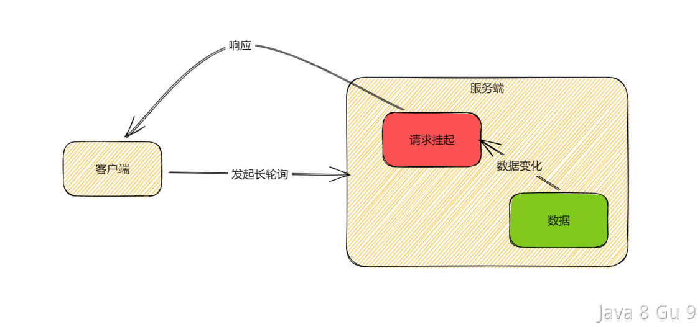
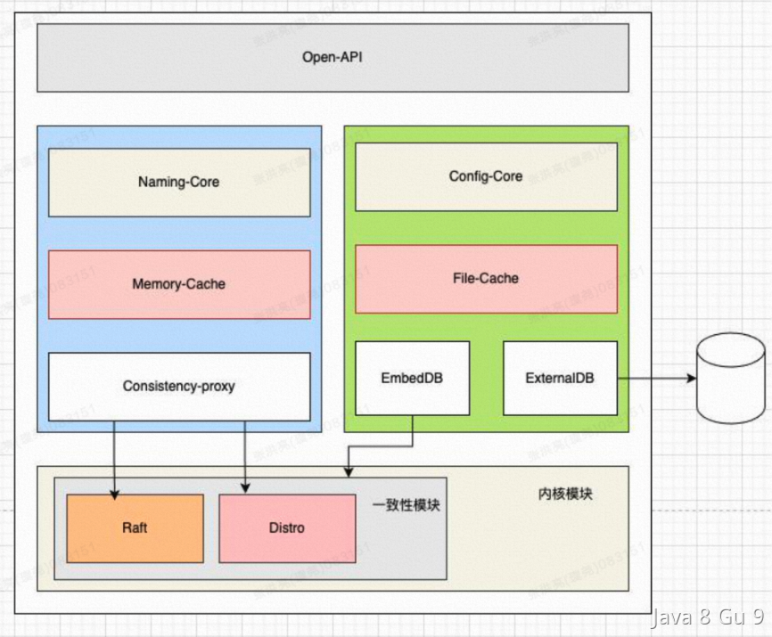
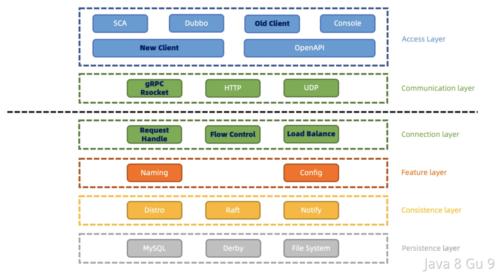
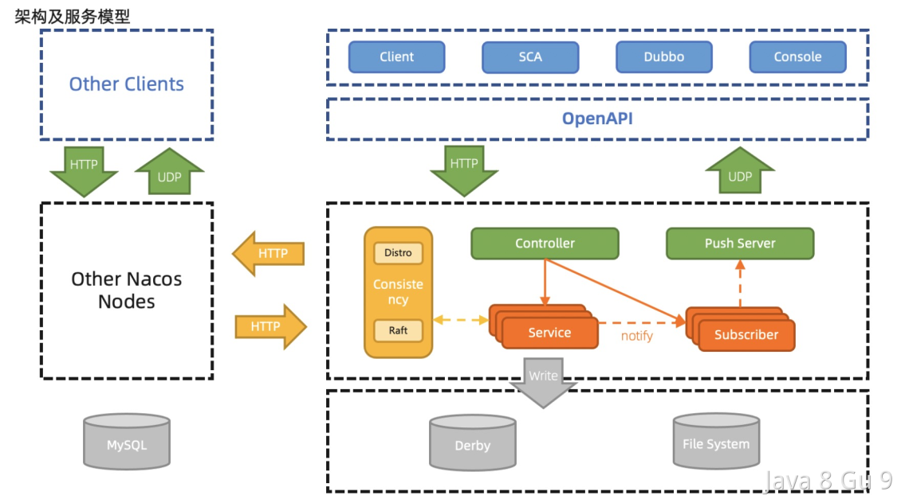
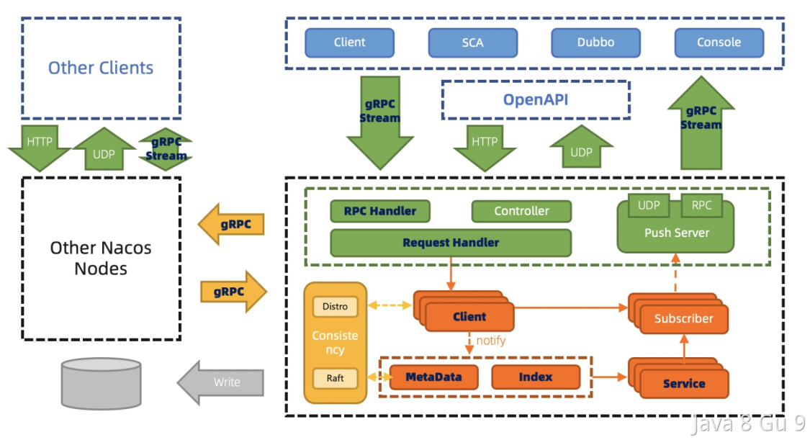
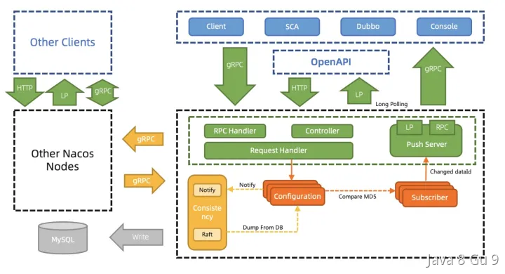

# 微服务

## 注册中心如何选型？

配置中心有很多成熟的工具，如Zookeeper、Nacos、Eureka、Consul等。  

Zookeeper是最早流行的开源分布式协调服务框架之一，同时也提供了分布式配置中心的功能。Zookeeper以高可用、一致性和可靠性著称，但是需要用户自己来开发实现分布式配置的功能。  

Nacos是阿里巴巴开源的服务注册中心和配置中心。与Zookeeper不同的是，Nacos自带了配置中心功能，并提供了更多的可视化配置管理工具。Nacos的目标是成为一个更全面的云原生服务发现、配置和管理平台。  

Eureka是Netflix开源的服务注册中心，被广泛应用在Spring Cloud微服务架构中。它提供了易于使用的REST API和Web界面，并支持基于Region和Zone的服务分组和负载均衡。  

Consul是HashiCorp开源的服务注册中心和配置中心，提供了服务发现、健康检查、KV存储和多数据中心功能。Consul提供了更丰富的健康检查和路由功能，同时也提供了丰富的API和Web UI。

|                |                            |             |                       |            |
| -------------- | -------------------------- | ----------- | --------------------- | ---------- |
|                | Nacos                      | Eureka      | Consul                | Zookeeper  |
| CAP            | CP+AP                      | AP          | CP                    | CP         |
| 健康检查           | TCP/HTTP/MYSQL/Client Beat | Client Beat | TCP/HTTP/gRPC/Cmd  | Keep Alive |
| 负载均衡           | 权重/metadata/Selector       | Ribbon      | Fabio                 | —          |
| 一致性算法          | Raft/Distro                | Gossip      | Raft                  | ZAB        |
| 雪崩保护           | 有                          | 有           | 无                     | 无          |
| 访问协议           | HTTP/DNS                   | HTTP        | HTTP/DNS              | TCP        |
| 跨注册中心同步        | 支持                         | 不支持         | 支持                    | 不支持        |
| Spring Cloud集成 | 支持                         | 支持          | 支持                    | 支持         |
| Dubbo集成        | 支持                         | 不支持         | 支持                    | 支持         |
| K8s集成          | 支持                         | 不支持         | 支持                    | 支持         |

选择服务注册中心和配置中心需要考虑应用场景、功能需求、易用性和维护成本等因素，有以下几个原则供参考：

如果对一致性要求高，建议考虑支持CP模型的Consul、Nacos以及ZK

如果应用已经在使用Spring Cloud框架，则建议使用Eureka；

如果应用在用Dubbo/Spring Cloud Alibaba，或者需要一套更全面的云原生服务治理平台，则建议使用Nacos；

如果需要更强大的健康检查和路由功能，则建议使用Consul。虽然Nacos和Eureka都支持服务健康检查和路由功能，但是Consul在这方面的功能更为强大，比如Consul支持多种健康检查方式（TCP、HTTP、gRPC等）、支持自定义健康检查脚本，可以更精细地控制服务的健康状况。

当然，Zookeeper也是一款成熟的分布式协调服务框架，如果已经熟悉使用Zookeeper，也可以考虑使用Zookeeper作为服务注册中心和配置中心。

## 什么是Nacos，主要用来作什么？

Nacos是一个基于云原生架构的动态服务发现、配置管理和服务治理平台。支持多种编程语言和多种部署方式，并且与Spring Cloud等主流的微服务框架深度集成。  

配置管理：可以将应用程序的配置信息存储在Nacos的配置中心，通过Nacos实现动态配置管理和灰度发布，从而实现应用程序的动态调整和部署。

服务发现及注册：可以将服务注册到Nacos注册中心，并通过Nacos实现服务的自动发现和负载均衡，从而实现服务的高可用和弹性伸缩。

服务治理：可以通过Nacos实现服务的健康检查、故障转移、服务限流、熔断降级等治理能力，从而提高服务的可靠性和稳定性。 

事件监听和推送：可以通过Nacos实现配置变更、服务注册和注销等事件的监听和推送，从而实现应用程序的自动化部署和管理。

### 哪些服务用到了Nacos？

1. Spring Cloud Alibaba：Nacos是Spring Cloud Alibaba的核心组件之一，可以和Spring Cloud集成，实现服务发现、负载均衡、配置管理等功能。

2. Dubbo：Nacos是Dubbo 2.7.x版本的服务注册中心和配置中心，可以通过Nacos实现服务的动态发现和配置管理。

3. Kubernetes：Nacos可以作为Kubernetes的服务注册中心和配置管理平台，可以将Kubernetes中的服务注册到Nacos中，并通过Nacos进行服务发现和负载均衡。

4. Service Mesh：Nacos可以作为Service Mesh的控制面板，实现服务的配置管理、流量控制和熔断降级等功能。

## Nacos是AP的还是CP的？

Nacos支持AP和CP两种模式，可以根据具体的使用场景进行选择。默认情况下是AP模式，可以通过修改nacos的配置文件来切换AP/CP。  

在AP模式下，Nacos保证高可用性和可伸缩性，但不保证强一致性。在CP模式下，Nacos保证强一致性，但可能会降低可用性和可伸缩性。

在实际应用中，具体应该采用哪种模式，需要根据业务的特点和需求来判断。

如果在分布式系统中，某些数据的一致性对业务有非常高的要求，例如金融、支付等场景，那么可以选择使用CP模式。在CP模式下，当发生网络分区或故障时，为了保证数据一致性，Nacos会对服务进行自动隔离和恢复。但是，这会导致部分服务不可用，因此可用性会受到影响。

如果对于某些服务来说，可用性比一致性更加重要，例如网站、在线游戏等场景，那么可以选择使用AP模式。在AP模式下，Nacos会优先保证服务的可用性，如果发生了网络分区或故障，Nacos会在保证一定的可用性的前提下，尽可能保持数据一致性。这样虽然可能会导致数据不一致的情况，但是可以保证服务的可用性，从而减少业务的影响。

## Nacos如何实现的配置变化客户端可以感知到？

客户端与配置中心的数据交互方式其实无非就两种，要么推 ，要么就是拉 。

推的模式就客户端和服务端建立TCP长链接，当服务端数据发生变化，立即通过这个已经建立好的长连接将数据推送到客户端。

长链接的优点是实时性，一旦数据变动，客户端立即就能感知到。但是缺点就是服务端需要维护大量的TCP连接，这会占用大量的内存和CPU资源，同时也容易受到网络抖动等因素的影响。

拉的模式就是客户端轮询，通过不断轮询的方式检查数据是否发生变化，变化的话就把数据拉回来。

轮询的优点是实现比较简单，但弊端也显而易见，轮询无法保证数据的实时性，并且轮询方式对服务端还会产生压力。

那Nacos使用的是哪种模式呢？

在Nacos1.x版本中采用的是长轮询，看好哦，不是长连接，也不是轮询，是长轮询（Long Polling）。 
在Nacos2.0中，采用gRPC长连接。

其实就是把长连接和轮询综合了一下，就是说客户端发起轮询，但是不立即返回，而是hold一段时间，这段时间保持着一个有效连接，超时或者变化再返回，然后再发起一次轮询。

### 长轮询

大概过程就是客户端向Nacos服务器发起一个长轮询请求，Nacos不会立即返回结果，而是会将请求挂起，直到有配置变化或者超时才会响应。当配置发生变化时，Nacos服务器会把变化后的配置信息响应客户端，并且客户端会再次发起一个新的长轮询请求。这样，客户端就能够实时感知到配置的变化。

这种方式避免客户端对服务端的不断轮询造成压力，也避免了长时间保持连接所带来的负担，同时也可以保证配置的实时性。但是，长轮询的缺点是需要频繁地发起HTTP请求，这会增加网络开销，同时也可能会受到网络延迟等因素的影响，导致配置的实时性不如长连接。

### 长轮询和长连接

长轮询是一种实现异步消息通信的机制，它通常用于客户端向服务器端请求某个资源时，如果服务器端没有即时可用的响应数据，就会将客户端的请求挂起，直到服务器端有了可用的响应数据，再将数据返回给客户端。因此，长轮询的过程是客户端主动发起请求，服务器端被动响应请求。

长连接是指在客户端和服务器端之间建立一条持久连接，通过该连接可以在一定时间内保持通信状态，避免了客户端频繁地建立和关闭连接所带来的额外开销。在长连接中，客户端和服务器端之间会保持一定的心跳机制，以确保连接的有效性。因此，长连接的过程是由服务器端主动维护连接，客户端被动地接受服务器端的消息。

在数据变化感知的实时性上面，长连接比长轮询要更加精准，感知的更快，长轮询也是有可能发生延迟的。

在协议层面上，长连接是基于TCP实现的，长轮询是基于HTTP实现的。

## Nacos能同时实现AP和CP的原理是什么？

Nacos在单个集群中同时支持AP和CP两种模式，之所以这么设计是因为Nacos目前在业内主要有两种应用，分别是注册中心和配置中心。  

对于注册中心来说，他要提供服务的注册和发现能力，如果使用一个强一致性算法，那么就会对可用性造成一定的影响。而注册中心一旦可用性不能满足了，那么就会影响所有服务的互相调用。而如果一致性没办法做到强一致性的话，最多是可能某个服务不在了，但是还会调用过去，理论上来说会失败，然后重试也是可以接受的。  

对于配置中心来说，他的主要职责就是提供统一的配置，一致性是他的一个重点考量，即使损失一点可用性（晚一点推送）也是可以接受的，但是不同的机器接收到配置不一样，这个是不能接受的。  

所以，Nacos就同时支持这两种模式了，他在CP方面，采用了JRaft（1.0是Raft），在AP方面，采用了Distro  。

也就是说，Nacos，为了同时支持注册中心和配置中心，他通过JRaft协议实现了一个CP的模式，又通过Distro协议实现了一个AP的模式，可以在这两者模式之间进行切换。

JRaft是一个纯 Java 的 Raft 算法实现库, 基于百度 braft 实现而来, 使用 Java 重写了所有功能。通过 RAFT 提供的一致性状态机，可以解决复制、修复、节点管理等问题，极大的简化当前分布式系统的设计与实现，让开发者只关注于业务逻辑，将其抽象实现成对应的状态机即可。Raft 可以解决分布式理论中的 CP，即一致性和分区容忍性，并不能解决 Available 的问题。（https://www.sofastack.tech/projects/sofa-jraft/overview/ ）

Distro是Nacos自研AP分布式协议，是面向临时实例设计的一种分布式协议，保证了在某些Nacos节点宕机后，整个临时处理系统依旧可以正常工作。Distro协议的设计思想：

- Nacos 每个节点是平等的都可以处理写请求，同时把新数据同步到其他节点。

- 每个节点只负责部分数据，定时发送自己负责数据的校验值到其他节点来保持数据一致性。

- 每个节点独立处理读请求，及时从本地发出响应。

参考：[Nacos 2.0原理解析（一）：Distro协议_nacos distro协议-CSDN博客](https://blog.csdn.net/zcrzcrzcrzcrzcr/article/details/122260705)

## Nacos 2.x为什么新增了RPC的通信方式？

Nacos 2.X 在 1.X 的架构基础上，通信层通过 gRPC 和 Rsocket 实现了长连接 RPC 调用和推送能力。主要是为了改善Nacos在大规模集群环境下的性能和稳定性。

> 同时新增一个链接层，用来将不同类型的 Request 请求，将来自不同客户端的不同类型请求，转化为相同语意的功能数据结构，复用业务处理逻辑。同时，将来的流量控制和负载均衡等功能也会在链接层处理。

在Nacos的早期版本中，节点之间的通信采用了HTTP协议。在高并发、大规模集群环境下，由于HTTP的连接管理和请求响应的开销，会导致一些性能和稳定性方面的问题。

HTTP 短连接模型，每次客户端请求都会创建和销毁 TCP 链接，TCP 协议销毁的链接状态是 WAIT_TIME，完全释放还需要一定时间，当 TPS 和 QPS 较高时，服务端和客户端可能有大量的 WAIT_TIME 状态链接，从而会导致 connect time out 错误或者 Cannot assign requested address 的问题。

配置模块使用 HTTP 短连接阻塞模型来模拟长连接通信，但是由于并非真实的长连接模型，因此每 30 秒需要进行一次请求和数据的上下文切换，每一次切换都有引起造成一次内存浪费，从而导致服务端频繁 GC。

在大规模集群环境下，维护大量的HTTP连接会给负载均衡、路由等方面的管理带来一定的复杂性。并且HTTP协议对请求和响应的内容通常需要进行压缩和序列化处理，这也会带来一定的开销。

同时，1.0的版本中还存在以下几个问题：

通过心跳续约，当服务规模上升时，特别是类似 Dubbo 的接口级服务较多时，心跳及配置元数据的轮询数量众多，导致集群 TPS 很高，系统资源高度空耗。

心跳续约需要达到超时时间才会移除并通知订阅者，默认为 15s，时延较长，时效性差。若改短超时时间，当网络抖动时，会频繁触发变更推送，对客户端服务端都有更大损耗。

为了解决这些问题，Nacos 2.x引入了gRPC的通信方式

Nacos2架构下的服务发现，客户端通过gRPC，发起注册服务或订阅服务的请求。服务端使用Client对象来记录该客户端使用gRPC连接发布了哪些服务，又订阅了哪些服务，并将该Client进行服务间同步。由于实际的使用习惯是服务到客户端的映射，即服务下有哪些客户端实例。

配置管理之前用Http1.1的Keep Alive模式30s发一个心跳模拟长链接，协议难以理解，内存消耗大，推送性能弱，因此2.0通过gRPC彻底解决这些问题，内存消耗大量降低。

- 客户端不再需要定时发送实例心跳，只需要有一个维持连接可用 keepalive 消息即可。重复 TPS 可以大幅降低。

- TCP 连接断开可以被快速感知到，提升反应速度。

- 长连接避免频繁连接开销，可以大幅缓解 TIME_ WAIT 问题。

- 真实的长连接，解决配置模块 GC 问题。

- 更细粒度的同步内容，减少服务节点间的通信压力。  

当然，缺点也是存在的。那就是RPC 协议的观测性不如 HTTP。即使 gRPC 基于 HTTP2.0 Stream 实现，仍然不如直接使用 HTTP 协议来的直观。

