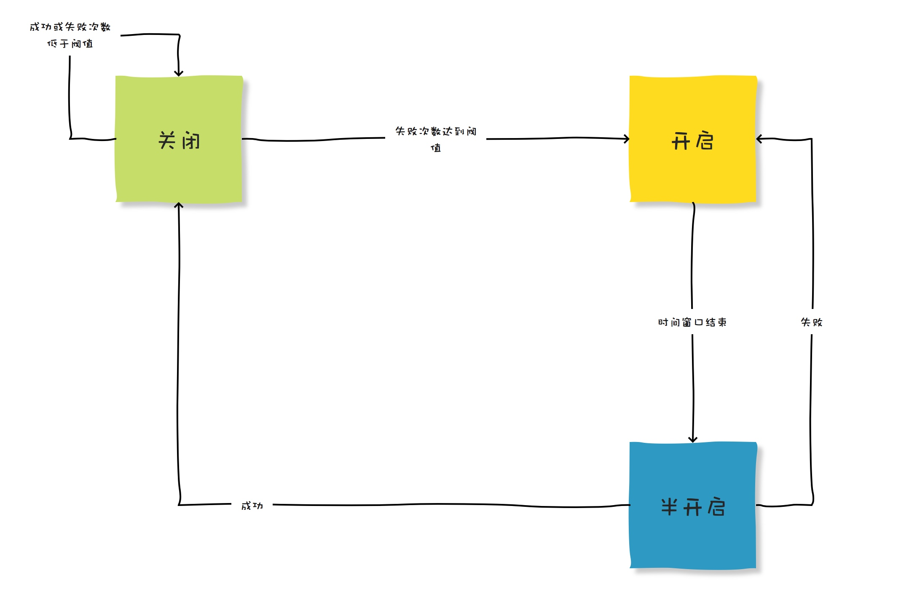

# 微服务

## 注册中心如何选型？

配置中心有很多成熟的工具，如Zookeeper、Nacos、Eureka、Consul等。  

Zookeeper是最早流行的开源分布式协调服务框架之一，同时也提供了分布式配置中心的功能。Zookeeper以高可用、一致性和可靠性著称，但是需要用户自己来开发实现分布式配置的功能。  

Nacos是阿里巴巴开源的服务注册中心和配置中心。与Zookeeper不同的是，Nacos自带了配置中心功能，并提供了更多的可视化配置管理工具。Nacos的目标是成为一个更全面的云原生服务发现、配置和管理平台。  

Eureka是Netflix开源的服务注册中心，被广泛应用在Spring Cloud微服务架构中。它提供了易于使用的REST API和Web界面，并支持基于Region和Zone的服务分组和负载均衡。  

Consul是HashiCorp开源的服务注册中心和配置中心，提供了服务发现、健康检查、KV存储和多数据中心功能。Consul提供了更丰富的健康检查和路由功能，同时也提供了丰富的API和Web UI。

|                |                            |             |                       |            |
| -------------- | -------------------------- | ----------- | --------------------- | ---------- |
|                | Nacos                      | Eureka      | Consul                | Zookeeper  |
| CAP            | CP+AP                      | AP          | CP                    | CP         |
| 健康检查           | TCP/HTTP/MYSQL/Client Beat | Client Beat | TCP/HTTP/gRPC/Cmd  | Keep Alive |
| 负载均衡           | 权重/metadata/Selector       | Ribbon      | Fabio                 | —          |
| 一致性算法          | Raft/Distro                | Gossip      | Raft                  | ZAB        |
| 雪崩保护           | 有                          | 有           | 无                     | 无          |
| 访问协议           | HTTP/DNS                   | HTTP        | HTTP/DNS              | TCP        |
| 跨注册中心同步        | 支持                         | 不支持         | 支持                    | 不支持        |
| Spring Cloud集成 | 支持                         | 支持          | 支持                    | 支持         |
| Dubbo集成        | 支持                         | 不支持         | 支持                    | 支持         |
| K8s集成          | 支持                         | 不支持         | 支持                    | 支持         |

选择服务注册中心和配置中心需要考虑应用场景、功能需求、易用性和维护成本等因素，有以下几个原则供参考：

如果对一致性要求高，建议考虑支持CP模型的Consul、Nacos以及ZK

如果应用已经在使用Spring Cloud框架，则建议使用Eureka；

如果应用在用Dubbo/Spring Cloud Alibaba，或者需要一套更全面的云原生服务治理平台，则建议使用Nacos；

如果需要更强大的健康检查和路由功能，则建议使用Consul。虽然Nacos和Eureka都支持服务健康检查和路由功能，但是Consul在这方面的功能更为强大，比如Consul支持多种健康检查方式（TCP、HTTP、gRPC等）、支持自定义健康检查脚本，可以更精细地控制服务的健康状况。

当然，Zookeeper也是一款成熟的分布式协调服务框架，如果已经熟悉使用Zookeeper，也可以考虑使用Zookeeper作为服务注册中心和配置中心。

## 什么是Nacos，主要用来作什么？

Nacos是一个基于云原生架构的动态服务发现、配置管理和服务治理平台。支持多种编程语言和多种部署方式，并且与Spring Cloud等主流的微服务框架深度集成。  

配置管理：可以将应用程序的配置信息存储在Nacos的配置中心，通过Nacos实现动态配置管理和灰度发布，从而实现应用程序的动态调整和部署。

服务发现及注册：可以将服务注册到Nacos注册中心，并通过Nacos实现服务的自动发现和负载均衡，从而实现服务的高可用和弹性伸缩。

服务治理：可以通过Nacos实现服务的健康检查、故障转移、服务限流、熔断降级等治理能力，从而提高服务的可靠性和稳定性。 

事件监听和推送：可以通过Nacos实现配置变更、服务注册和注销等事件的监听和推送，从而实现应用程序的自动化部署和管理。

### 哪些服务用到了Nacos？

1. Spring Cloud Alibaba：Nacos是Spring Cloud Alibaba的核心组件之一，可以和Spring Cloud集成，实现服务发现、负载均衡、配置管理等功能。

2. Dubbo：Nacos是Dubbo 2.7.x版本的服务注册中心和配置中心，可以通过Nacos实现服务的动态发现和配置管理。

3. Kubernetes：Nacos可以作为Kubernetes的服务注册中心和配置管理平台，可以将Kubernetes中的服务注册到Nacos中，并通过Nacos进行服务发现和负载均衡。

4. Service Mesh：Nacos可以作为Service Mesh的控制面板，实现服务的配置管理、流量控制和熔断降级等功能。

## Nacos是AP的还是CP的？

Nacos支持AP和CP两种模式，可以根据具体的使用场景进行选择。默认情况下是AP模式，可以通过修改nacos的配置文件来切换AP/CP。  

在AP模式下，Nacos保证高可用性和可伸缩性，但不保证强一致性。在CP模式下，Nacos保证强一致性，但可能会降低可用性和可伸缩性。

在实际应用中，具体应该采用哪种模式，需要根据业务的特点和需求来判断。

如果在分布式系统中，某些数据的一致性对业务有非常高的要求，例如金融、支付等场景，那么可以选择使用CP模式。在CP模式下，当发生网络分区或故障时，为了保证数据一致性，Nacos会对服务进行自动隔离和恢复。但是，这会导致部分服务不可用，因此可用性会受到影响。

如果对于某些服务来说，可用性比一致性更加重要，例如网站、在线游戏等场景，那么可以选择使用AP模式。在AP模式下，Nacos会优先保证服务的可用性，如果发生了网络分区或故障，Nacos会在保证一定的可用性的前提下，尽可能保持数据一致性。这样虽然可能会导致数据不一致的情况，但是可以保证服务的可用性，从而减少业务的影响。

## Nacos如何实现的配置变化客户端可以感知到？

客户端与配置中心的数据交互方式其实无非就两种，要么推 ，要么就是拉 。

推的模式就客户端和服务端建立TCP长链接，当服务端数据发生变化，立即通过这个已经建立好的长连接将数据推送到客户端。

长链接的优点是实时性，一旦数据变动，客户端立即就能感知到。但是缺点就是服务端需要维护大量的TCP连接，这会占用大量的内存和CPU资源，同时也容易受到网络抖动等因素的影响。

拉的模式就是客户端轮询，通过不断轮询的方式检查数据是否发生变化，变化的话就把数据拉回来。

轮询的优点是实现比较简单，但弊端也显而易见，轮询无法保证数据的实时性，并且轮询方式对服务端还会产生压力。

那Nacos使用的是哪种模式呢？

在Nacos1.x版本中采用的是长轮询，看好哦，不是长连接，也不是轮询，是长轮询（Long Polling）。 
在Nacos2.0中，采用gRPC长连接。

其实就是把长连接和轮询综合了一下，就是说客户端发起轮询，但是不立即返回，而是hold一段时间，这段时间保持着一个有效连接，超时或者变化再返回，然后再发起一次轮询。

### 长轮询

大概过程就是客户端向Nacos服务器发起一个长轮询请求，Nacos不会立即返回结果，而是会将请求挂起，直到有配置变化或者超时才会响应。当配置发生变化时，Nacos服务器会把变化后的配置信息响应客户端，并且客户端会再次发起一个新的长轮询请求。这样，客户端就能够实时感知到配置的变化。

这种方式避免客户端对服务端的不断轮询造成压力，也避免了长时间保持连接所带来的负担，同时也可以保证配置的实时性。但是，长轮询的缺点是需要频繁地发起HTTP请求，这会增加网络开销，同时也可能会受到网络延迟等因素的影响，导致配置的实时性不如长连接。

### 长轮询和长连接

长轮询是一种实现异步消息通信的机制，它通常用于客户端向服务器端请求某个资源时，如果服务器端没有即时可用的响应数据，就会将客户端的请求挂起，直到服务器端有了可用的响应数据，再将数据返回给客户端。因此，长轮询的过程是客户端主动发起请求，服务器端被动响应请求。

长连接是指在客户端和服务器端之间建立一条持久连接，通过该连接可以在一定时间内保持通信状态，避免了客户端频繁地建立和关闭连接所带来的额外开销。在长连接中，客户端和服务器端之间会保持一定的心跳机制，以确保连接的有效性。因此，长连接的过程是由服务器端主动维护连接，客户端被动地接受服务器端的消息。

在数据变化感知的实时性上面，长连接比长轮询要更加精准，感知的更快，长轮询也是有可能发生延迟的。

在协议层面上，长连接是基于TCP实现的，长轮询是基于HTTP实现的。

## Nacos能同时实现AP和CP的原理是什么？

Nacos在单个集群中同时支持AP和CP两种模式，之所以这么设计是因为Nacos目前在业内主要有两种应用，分别是注册中心和配置中心。  

对于注册中心来说，他要提供服务的注册和发现能力，如果使用一个强一致性算法，那么就会对可用性造成一定的影响。而注册中心一旦可用性不能满足了，那么就会影响所有服务的互相调用。而如果一致性没办法做到强一致性的话，最多是可能某个服务不在了，但是还会调用过去，理论上来说会失败，然后重试也是可以接受的。  

对于配置中心来说，他的主要职责就是提供统一的配置，一致性是他的一个重点考量，即使损失一点可用性（晚一点推送）也是可以接受的，但是不同的机器接收到配置不一样，这个是不能接受的。  

所以，Nacos就同时支持这两种模式了，他在CP方面，采用了JRaft（1.0是Raft），在AP方面，采用了Distro  。

也就是说，Nacos，为了同时支持注册中心和配置中心，他通过JRaft协议实现了一个CP的模式，又通过Distro协议实现了一个AP的模式，可以在这两者模式之间进行切换。

JRaft是一个纯 Java 的 Raft 算法实现库, 基于百度 braft 实现而来, 使用 Java 重写了所有功能。通过 RAFT 提供的一致性状态机，可以解决复制、修复、节点管理等问题，极大的简化当前分布式系统的设计与实现，让开发者只关注于业务逻辑，将其抽象实现成对应的状态机即可。Raft 可以解决分布式理论中的 CP，即一致性和分区容忍性，并不能解决 Available 的问题。（https://www.sofastack.tech/projects/sofa-jraft/overview/ ）

Distro是Nacos自研AP分布式协议，是面向临时实例设计的一种分布式协议，保证了在某些Nacos节点宕机后，整个临时处理系统依旧可以正常工作。Distro协议的设计思想：

- Nacos 每个节点是平等的都可以处理写请求，同时把新数据同步到其他节点。

- 每个节点只负责部分数据，定时发送自己负责数据的校验值到其他节点来保持数据一致性。

- 每个节点独立处理读请求，及时从本地发出响应。

参考：[Nacos 2.0原理解析（一）：Distro协议_nacos distro协议-CSDN博客](https://blog.csdn.net/zcrzcrzcrzcrzcr/article/details/122260705)

## Nacos 2.x为什么新增了RPC的通信方式？

Nacos 2.X 在 1.X 的架构基础上，通信层通过 gRPC 和 Rsocket 实现了长连接 RPC 调用和推送能力。主要是为了改善Nacos在大规模集群环境下的性能和稳定性。

> 同时新增一个链接层，用来将不同类型的 Request 请求，将来自不同客户端的不同类型请求，转化为相同语意的功能数据结构，复用业务处理逻辑。同时，将来的流量控制和负载均衡等功能也会在链接层处理。

在Nacos的早期版本中，节点之间的通信采用了HTTP协议。在高并发、大规模集群环境下，由于HTTP的连接管理和请求响应的开销，会导致一些性能和稳定性方面的问题。

HTTP 短连接模型，每次客户端请求都会创建和销毁 TCP 链接，TCP 协议销毁的链接状态是 WAIT_TIME，完全释放还需要一定时间，当 TPS 和 QPS 较高时，服务端和客户端可能有大量的 WAIT_TIME 状态链接，从而会导致 connect time out 错误或者 Cannot assign requested address 的问题。

配置模块使用 HTTP 短连接阻塞模型来模拟长连接通信，但是由于并非真实的长连接模型，因此每 30 秒需要进行一次请求和数据的上下文切换，每一次切换都有引起造成一次内存浪费，从而导致服务端频繁 GC。

在大规模集群环境下，维护大量的HTTP连接会给负载均衡、路由等方面的管理带来一定的复杂性。并且HTTP协议对请求和响应的内容通常需要进行压缩和序列化处理，这也会带来一定的开销。

同时，1.0的版本中还存在以下几个问题：

通过心跳续约，当服务规模上升时，特别是类似 Dubbo 的接口级服务较多时，心跳及配置元数据的轮询数量众多，导致集群 TPS 很高，系统资源高度空耗。

心跳续约需要达到超时时间才会移除并通知订阅者，默认为 15s，时延较长，时效性差。若改短超时时间，当网络抖动时，会频繁触发变更推送，对客户端服务端都有更大损耗。

为了解决这些问题，Nacos 2.x引入了gRPC的通信方式

Nacos2架构下的服务发现，客户端通过gRPC，发起注册服务或订阅服务的请求。服务端使用Client对象来记录该客户端使用gRPC连接发布了哪些服务，又订阅了哪些服务，并将该Client进行服务间同步。由于实际的使用习惯是服务到客户端的映射，即服务下有哪些客户端实例。

配置管理之前用Http1.1的Keep Alive模式30s发一个心跳模拟长链接，协议难以理解，内存消耗大，推送性能弱，因此2.0通过gRPC彻底解决这些问题，内存消耗大量降低。

- 客户端不再需要定时发送实例心跳，只需要有一个维持连接可用 keepalive 消息即可。重复 TPS 可以大幅降低。

- TCP 连接断开可以被快速感知到，提升反应速度。

- 长连接避免频繁连接开销，可以大幅缓解 TIME_ WAIT 问题。

- 真实的长连接，解决配置模块 GC 问题。

- 更细粒度的同步内容，减少服务节点间的通信压力。  

当然，缺点也是存在的。那就是RPC 协议的观测性不如 HTTP。即使 gRPC 基于 HTTP2.0 Stream 实现，仍然不如直接使用 HTTP 协议来的直观。

## 限流、降级、熔断有什么区别？

限流、降级和熔断是三种常用的系统稳定性策略，它们在高并发和高负载的场景下尤为重要。通常我们说为了保证系统的可用性，限流、降级、熔断一把梭，但是其实他们是三个不太相同的概念，作用也不太一样。

### 限流

限流的目的是控制系统的并发流量，通过限制请求流量的手段防止过度的流量导致系统崩溃。一般用于应对突发流量高峰。

一般是被调用方对调用方进行限流。举个例子，我提供了一个查询用户信息的服务，给集团内外的很多个调用方使用，但是我为了保证我的可用性，我会对每个调用方做限流，防止某个调用方不守规矩，把我的服务打挂了。

> 当然，也有在服务端给客户端直接做限流的，一般用于外部服务能力不太行的时候，比如电商网站大促的时候，可能会依赖很多银行的服务，但是银行服务本身可能没那么高的并发， 所以可能在电商网站上自己控制一下QPS，来起到限流的目的，避免下游系统被打挂。

常见的限流算法：

1. 漏桶算法：系统请求先进入漏桶，再从漏桶中逐一取出请求执行，控制漏桶的流量。

2. 令牌桶算法：系统请求会得到一个令牌，从令牌桶中取出一个令牌执行，控制令牌桶中令牌的数量。

3. 计数器算法：系统请求被计数，通过比较当前请求数与限流阈值来判断是否限流。

4. 可以阻塞算法：当系统达到限流阈值时，不再接受新请求，等到限流阈值降下来再接受请求。

5. 令牌环算法：与令牌桶算法类似，但是在多个令牌桶之间形成环形结构，以便在不同的请求处理速率之间进行平衡。

6. 最小延迟算法：基于预测每个请求的处理时间，并在处理完请求后进行延迟，以控制请求的速率。

7. 滑动窗口：基于一个固定大小的时间窗口，允许在该时间窗口内的请求数不超过设定的阈值。这个时间窗口随着时间的推移不断滑动，以适应不同时间段内的请求流量。

### 降级

降级是当系统负载过高时，主动关闭一些非核心功能，以确保核心功能的正常运行。一般用于在系统资源有限或响应时间过长时，通过降低服务质量保障核心服务。区别于熔断机制，降级一般并不是彻底功能不可用，而是用一种默认返回、异步执行、延迟处理等方式进行降低处理。

服务降级的概念听起来可能不是很容易理解，举一个生活中的例子就很好理解了。

有的时候我们去饭店吃饭，吃完饭以后服务员会拿一张问卷，让就餐者填写一下用户反馈。但是，这种让用户填写反馈的请求，只有在店里不忙的时候才会出现。如果店里非常忙，顾客很多的话，店员就不会再找就餐者填写问卷了。  

其实，这种就是服务降级。在人流量大的时候，用户反馈这个功能就被降级了。因为他相对来说并没有那么重要。  

接着再来看分布式系统的降级。

上图是一张淘宝商品的详情页，对于很多剁手党来说这个页面真的是再熟悉不过了。  

但是，这个页面我粗略的大致数了一下，至少有15个以上的功能模块，如：图片、标题、定价、库存、推荐、评价、物流、收藏、下单等。

虽然这些功能都展示在同一个页面上，但是其实这些功能并不都是在同一个应用里面的。这十几个模块可能分别在十几个应用中实现的。

详情页在渲染的时候，要和十几个应用进行网络交互。

这些功能中，有一些是非常重要的，比如：定价、库存、下单等。还有一些是相对来说没那么重要的，比如：推荐、收藏等。  

> 这个识别哪些功能是核心功能、哪些功能是非核心功能，然后对非核心功能采取不同的降级方案制定的过程叫做降级预案。  

双十一当天，整个网站的流量十分巨大的，详情页的访问量更是整个网站的重灾之地。所以，一旦有大促的时候，需要有限保证主要功能的可用，至于那些次要的功能就可以被降级掉，即不显示某些模块，或者返回一些默认内容。

#### 降级的方式

还拿之前的饭店中给用户做问卷调查的例子来说。当人流量大的时候，直接取消问卷调查只是一种方式。还有很多其他方式可以选择的。比如：  

1、先让用户填写一下手机号，然后离店后，给用户发短信，让其填写电子问卷。  

2、在店门口放一个问卷，用户离店时自己去填写问卷。 等等，只要愿意想，其实是有很多种方案的。  

同样，对于大型网站来说，服务的降级其实也是有很多方式可以选的，常见的几种如下：

##### 延迟服务

比如发表了评论，重要服务，比如在文章中显示正常，但是延迟给用户增加积分，只是放到一个缓存中，等服务平稳之后再执行。  

在粒度范围内关闭服务（片段降级或服务功能降级）  

比如关闭相关文章的推荐，直接关闭推荐区

##### 页面异步请求降级

比如商品详情页上有推荐信息/配送至等异步加载的请求，如果这些信息响应慢或者后端服务有问题，可以进行降级； 页面跳转（页面降级）  

比如可以有相关文章推荐，但是更多的页面则直接跳转到某一个地址。

##### 写降级

比如秒杀抢购，我们可以只进行Cache的更新，然后异步同步扣减库存到DB，保证最终一致性即可，此时可以将DB降级为Cache。  

##### 读降级

比如多级缓存模式，如果后端服务有问题，可以降级为只读缓存，这种方式适用于对读一致性要求不高的场景；  

Q：那无法退款，其实是采用了关闭服务这种降级方式咯 A：嗯嗯是的。 Q：11月11日的零点到11月12日的零点之间无法退款，这个降级是自动发生的吗？ A：这就涉及到降级的介入方式了。听我继续说。

#### 降级的介入方式

按照是不是可以自动化降级，降级共有两种介入方式，分别是：自动开关降级和人工开关降级。

##### 自动开关降级

自动开关降级的方式一般是当系统达到某些设定的条件（系统负载、资源使用情况、SLA等指标）之后，自动执行一些策略。  

常见的可以作为自动降级条件的指标有以下几个：

###### 服务超时

当访问的数据库/http服务/远程调用响应慢或者长时间响应慢，且该服务不是核心服务的话可以在超时后自动降级；  

比如前面提到的详情页上有推荐和收藏功能，即使出现问题也不会影响用户的正常下单。如果是调用别人的远程服务，和对方定义一个服务响应最大时间，如果超时了则可以自动降级。

###### 失败次数

调用外部服务的时候，除了超时以外，最常见的异常情况就是调用失败。比如详情页中的库存信息，如果是某一次查询请求失败了，那么就可以通过读取缓存数据等方式直接降级掉。  

但是，这种降级可能存在一个问题，就是虽然一次请求展示了缓存，但是其他用户访问的时候还是会查询库存信息，这对于库存系统来说就是雪上加霜。因为他可能已经有问题了，但是上游系统还是在不断的对他发送请求。  

所以，可以针对这个查询库存的接口做统一的降级。设定一个失败次数的阈值，一旦整体失败次数达到这个阈值了，就对后续一段时间内的该查询接口做降级。直到其功能恢复。  

###### 发生故障

上面提到的失败可能是服务不稳定造成的，过一段时间可以自动恢复的。还有一种情况可能是依赖的服务彻底跪了、或者网络不通了等等。这种情况就可以直接降级了。  

当HTTP请求返回固定的错误码、或者一个RPC请求的时候底层服务抛了异常以后，就认为有故障发生，对其进行降级即可。

###### 限流降级

还有种电商网站常见的策略，那就是限流降级。对于某些功能，设定一个流量阈值，一旦流量达到阈值的话，就进行降级。  

比如秒杀功能，如果一瞬间流量太大，就可以进行限流降级。对于后续访问的用户直接提示已售空、跳转错误页、或者让他输入验证码重试等。

##### 人工开关降级

还有一种降级方式，那就是人工开关降级。  

人工开关降级的方式是指当系统维护人员在发现系统异常之后，通过人工修改参数、关闭服务等方式进行降级的方法。  

这种方式的好处是比较灵活，能够根据异常情况灵活应对；但弊端是对人的要求比较高，一来需要维护人员对系统有足够的了解，另外要求维护人员在系统异常时能够在第一时间进行处置。  

还有一种情况，可能也会人工介入，那就是在大促之前，预估到流量会十分巨大，提早的识别出风险，为了节省资源保证主流程的可用，开发人员可以手动将某个功能降级掉。  

这里说的人工开关降级，并不一定是一定要人工操作，也可能是人工通过一个定时任务进行定时触发的。

#### 降级工具

目前市面上，针对流量控制，限流降级主要有以下两种选择：Netflix Hystrix 和 Alibaba Sentinal。

##### Hystrix

Hystrix是一个库，它提供了服务与服务之间的容错功能，主要体现在延迟容错和容错，从而做到控制分布式系统中的联动故障。Hystrix通过隔离服务的访问点，阻止联动故障，并提供故障的解决方案，从而提高了这个分布式系统的弹性。  

Hystrix 的关注点在于以 隔离 和 熔断 为主的容错机制，超时或被熔断的调用将会快速失败，并可以提供 fallback 机制。

##### Sentinel

Sentinel 是阿里中间件团队开源的，面向分布式服务架构的轻量级高可用流量控制组件，主要以流量为切入点，从流量控制、熔断降级、系统负载保护等多个维度来帮助用户保护服务的稳定性。  

Sentinel 的侧重点在于：多样化的流量控制、熔断降级、系统负载保护、实时监控和控制台等

##### 对比

最后用表格来进行对比总结：

|         | Sentinel                          | Hystrix                      |
| ------- | --------------------------------- | ---------------------------- |
| 隔离策略    | 信号量隔离                             | 线程池隔离/信号量隔离                  |
| 熔断降级策略  | 基于响应时间或失败比率                       | 基于失败比率                       |
| 实时指标实现  | 滑动窗口                              | 滑动窗口（基于 RxJava）              |
| 规则配置    | 支持多种数据源                           | 支持多种数据源                      |
| 扩展性     | 多个扩展点                             | 插件的形式                        |
| 基于注解的支持 | 支持                                | 支持                           |
| 限流      | 基于 QPS，支持基于调用关系的限流                | 有限的支持                        |
| 流量整形    | 支持慢启动、匀速器模式                       | 不支持                          |
| 系统负载保护  | 支持                                | 不支持                          |
| 控制台     | 开箱即用，可配置规则、查看秒级监控、机器发现等           | 不完善                          |
| 常见框架的适配 | Servlet、Spring Cloud、Dubbo、gRPC 等 | Servlet、Spring Cloud Netflix |

[https://github.com/alibaba/Sentinel/wiki/Sentinel-与-Hystrix-的对比](https://github.com/alibaba/Sentinel/wiki/Sentinel-%E4%B8%8E-Hystrix-%E7%9A%84%E5%AF%B9%E6%AF%94)

### 熔断

熔断是为了防止系统因某个服务的故障而整体崩溃，类似于电路的熔断器。在检测到下游服务异常时，自动停止向该服务发送请求，并在一定时间后尝试恢复。

熔断一般发生在调用方，举个例子，当电商平台上用户支付时，收银台发现某个支付渠道，如微信支付失败率突增，超时严重，那么就可以临时把这个支付方式熔断掉。

现在很多网站的背后都是一个庞大的分布式系统，多个系统之间的交互大多数都是采用RPC的方式，但是因为是远程调用，所以被调用者的服务的可用情况其实是不可控的。  

而越是庞大的系统，上下游的调用链就会越长，而如果在一个很长的调用链中，某一个服务由于某种原因导致响应时间很长，或者完全无响应，那么就可能把整个分布式系统都拖垮。  

如果其中某一个服务由于自身原因导致响应很慢，那么就可能导致上游的服务相应也很慢，这样循环往复，就会导致整个系统全线崩溃，这就是服务雪崩。  

在服务的依赖调用中，当被调用方出现故障时，出于自我保护的目的，调用方会主动停止调用，并根据业务需要进行相应处理。调用方这种主动停止调用的行为我们称之为熔断。

#### 为什么需要熔断

其实，在分布式系统中，为了保证整体服务可用性和一致性，很多系统都会引入重试机制，在有些情况下，重试其实是可以解决问题的，比如网络问题等，都可以通过重试来解决。  

但是，有些情况下，重试并不能解决问题，反而会加剧问题的严重性，比如下游系统因为请求量太大，导致CPU已经被打满，数据库连接池被占满，这时候上游系统调不通就会不断进行重试，这种重试请求，对于下游系统来说，无疑是雪上加霜，给下游系统造成二次伤害。  

而分布式系统，大多数的服务雪崩也都是因为不断重试导致的，这种重试有可能是框架级别的自动重试、有可能是代码级别的重试逻辑、还有可能是用户的主动重试。  

有些重试是无法避免的，而且如果因为防止雪崩，就不设计重试机制，也是一种因噎废食。

#### 熔断器模式

熔断器模式（Circuit Breaker Pattern），是一个现代软件开发的设计模式。用以侦测错误，并避免不断地触发相同的错误（如维护时服务不可用、暂时性的系统问题或是未知的系统错误）。  

假设有个应用程序每秒会与数据库沟通数百次，此时数据库突然发生了错误，程序员并不会希望在错误时还不断地访问数据库。因此会想办法直接处理这个错误，并进入正常的结束程序。简单来说，  

熔断器会侦测错误并且“预防”应用程序不断地重试调用一个近乎毫无回应的服务（除非该服务已经安全到可重试连线了）。

熔断器模式是防止微服务系统雪崩的一种重要手段。  

一个比较完善的熔断器，一般包含三种状态：

- 关闭
  
  熔断器在默认情况下下是呈现关闭的状态，而熔断器本身带有计数功能，每当错误发生一次，计数器也就会进行“累加”的动作，到了一定的错误发生次数断路器就会被“开启”，这个时候亦会在内部启用一个计时器，一旦时间到了就会切换成半开启的状态。

- 开启
  
  在开启的状态下任何请求都会“直接”被拒绝并且抛出异常讯息。

- 半开启
  
  在此状态下断路器会允许部分的请求，如果这些请求都能成功通过，那么就意味着错误已经不存在，则会被切换回关闭状态并重置计数。倘若请求中有“任一”的错误发生，则会恢复到“开启”状态，并且重新计时，给予系统一段休息时间。

上图是熔断器的三种状态的转换情况。如果在微服务系统的调用过程中，引入熔断器，那么整个系统将天然具备以下能力：

- 快速失败：当因为调用远程服务失败次数过多，熔断器开启时，上游服务对于下游服务的调用就会快速失败，这样可以避免上游服务被拖垮。

- 无缝恢复：因为熔断器可以定期检查下游系统是否恢复，一旦恢复就可以重新回到关闭状态，所有请求便可以正常请求到下游服务。使得系统不需要人为干预。

Q：熔断模式我听懂了，那么这个模式如何运用到系统中啊？ A：其实熔断器的原理理解了，实现起来也不是很复杂 Q：那你们在代码中都是自己写熔断器的吗？ A：倒也不是，实现上有一些框架可以帮我们实现，并且还有些附加功能

#### 熔断工具

熔断器为了实现快速失败和无缝恢复，就需要进行服务调用次数统计、服务调用切断等操作，如果想要自己实现一个熔断器其实也是可以的。  

但是，市面上有一些框架已经帮我们做了这些事情。如Hystrix和Sentinel、resilience4j等。

##### Hystrix

Hystrix（https://github.com/Netflix/Hystrix ）是Netflix开源的一款容错系统，能帮助使用者码出具备强大的容错能力和鲁棒性的程序。提供降级，熔断等功能。  

但是，在2018年底，Hystrix在其Github主页宣布，不再开放新功能，推荐开发者使用其他仍然活跃的开源项目。

Hystrix虽然不再开发新功能 ，但对用户的影响应该不会太大，一是因为开发者可以继续使用Hystrix的最新版本1.5.18

##### resilience4j

Hystrix停更之后，Netflix官方推荐使用resilience4j（https://github.com/resilience4j/resilience4j ），它是一个轻量、易用、可组装的高可用框架，支持熔断、高频控制、隔离、限流、限时、重试等多种高可用机制。

与Hystrix相比，它有以下一些主要的区别：

- Hystrix调用必须被封装到HystrixCommand里，而resilience4j以装饰器的方式提供对函数式接口、lambda表达式等的嵌套装饰，因此你可以用简洁的方式组合多种高可用机制

- Hystrix的频次统计采用滑动窗口的方式，而resilience4j采用环状缓冲区的方式

- 关于熔断器在半开状态时的状态转换，Hystrix仅使用一次执行判定是否进行状态转换，而resilience4j则采用可配置的执行次数与阈值，来决定是否进行状态转换，这种方式提高了熔断机制的稳定性

- 关于隔离机制，Hystrix提供基于线程池和信号量的隔离，而resilience4j只提供基于信号量的隔离

##### Sentinel

Sentinel（https://github.com/alibaba/Sentinel ）是阿里中间件团队开源的，面向分布式服务架构的轻量级高可用流量控制组件，主要以流量为切入点，从流量控制、熔断降级、系统负载保护等多个维度来帮助用户保护服务的稳定性。  

Hystrix 的关注点在于以隔离和熔断为主的容错机制，超时或被熔断的调用将会快速失败，并可以提供 fallback 机制。

而 Sentinel 的侧重点在于：

- 多样化的流量控制

- 熔断降级

- 系统负载保护

- 实时监控和控制台

|     | 限流                                                                            | 降级                                                                  | 熔断                                                         |
| --- | ----------------------------------------------------------------------------- | ------------------------------------------------------------------- | ---------------------------------------------------------- |
| 目的  | 控制系统的流量，防止过度的流量导致系统崩溃。                                                        | 主动关闭一些非核心功能，以确保核心功能的正常运行。                                           | 防止系统因某个服务的故障而整体崩溃，类似于电路的熔断器。                               |
| 手段  | 各种限流算法：滑动窗口、漏桶、令牌桶                                                            | 开关；通过开关控制某些功能直接被降级。                                                 | 熔断器                                                        |
| 工具  | Sentinel                                                                      | Sentinel                                                            | Sentinel                                                   |
| 示例  | 我提供了一个查询用户信息的服务，给集团内外的很多个调用方使用，但是我为了保证我的可用性，我会对每个调用方做限流，防止某个调用方不守规矩，把我的服务打挂了。 | 双十一大促期间，淘宝上面会把退款功能关闭 某次腾讯视频挂了的时候，用户名称默认显示腾讯用户，这也是一种降级方式，用兜底名称做展示 | 当电商平台上用户支付时，收银台发现某个支付渠道，如微信支付失败率突增，超时严重，那么就可以临时把这个支付方式熔断掉。 |
| 发起方 | 被调用方（客户端）/调用方（服务端）                                                            | 被调用方（客户端）/调用方（服务端）                                                  | 调用方（服务端）                                                   |

