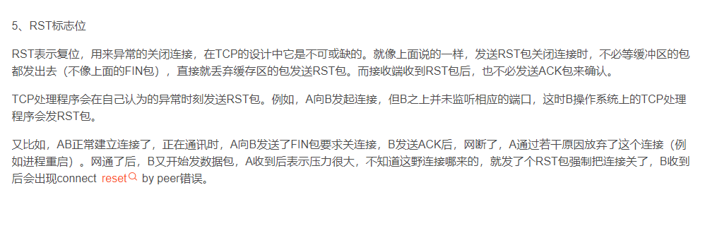

## 我终于知道为什么我的微信小程序发送https请求失败了！

### 开始阶段

事情的起因是，我某一天突然想写一个小程序，于是我准备用我的阿里云服务器提供后台服务。一开始的开发是很简单的，我需要搭建一个web系统提供http服务，再写一个小程序的简单页面作为客户端。但是在小程序上线的时候，我查看到微信对小程序服务器的限制是要求使用域名访问+https访问时，我就发现问题不简单了。


接下来，就是对服务器增加域名和ssl证书的环节。我先使用了阿里云的域名服务，花6块钱找了个便宜域名：


接着也用它的ssl证书服务，选择了免费证书：


把他们配置到nginx上其实也很快：

```nginx
user nginx;
worker_processes auto;
error_log /var/log/nginx/error.log;
pid /run/nginx.pid;

# Load dynamic modules. See /usr/share/doc/nginx/README.dynamic.
include /usr/share/nginx/modules/*.conf;

events {
    worker_connections 1024;
}

http {
    log_format  main  '$remote_addr - $remote_user [$time_local] "$request" '
                      '$status $body_bytes_sent "$http_referer" '
                      '"$http_user_agent" "$http_x_forwarded_for"';

    access_log  /var/log/nginx/access.log  main;

    sendfile            on;
    tcp_nopush          on;
    tcp_nodelay         on;
    keepalive_timeout   65;
    types_hash_max_size 2048;

    include             /etc/nginx/mime.types;
    default_type        application/octet-stream;

    # Load modular configuration files from the /etc/nginx/conf.d directory.
    # See http://nginx.org/en/docs/ngx_core_module.html#include
    # for more information.
    include /etc/nginx/conf.d/*.conf;

    server {
        #listen       80 default_server;
        listen 443 ssl http2;
        listen       [::]:443 ssl http2;
        server_name  www.xxx.xxx;
        ssl_certificate cert/xxx.xxx.pem;
        ssl_certificate_key cert/xxx.xxx.key;
        ssl_session_cache shared:MozSSL:10m;
        ssl_session_timeout 1d;
        # OCSP stapling
        ssl_stapling on;
        ssl_stapling_verify on;
        #ssl_session_cache shared:SSL:10m;
        #ssl_session_timeout 10m;
        #自定义设置使用的TLS协议的类型以及加密套件（以下为配置示例，请您自行评估是否需要配置）
        #TLS协议版本越高，HTTPS通信的安全性越高，但是相较于低版本TLS协议，高版本TLS协议对浏览器的兼容性较差。
        #ssl_ciphers ECDHE-RSA-AES128-GCM-SHA256:ECDHE:ECDH:AES:HIGH:!NULL:!aNULL:!MD5:!ADH:!RC4;
        ssl_ciphers ECDHE-RSA-AES256-GCM-SHA384:ECDHE-ECDSA-AES128-GCM-SHA256;
        ssl_protocols TLSv1 TLSv1.1 TLSv1.2 TLSv1.3;
        #ssl_protocols TLSv1 TLSv1.1 TLSv1.2 TLSv1.3;
        #表示优先使用服务端加密套件。默认开启
        ssl_prefer_server_ciphers on;
        charset 'utf-8';
        #root         /usr/share/nginx/html;
        #index          /usr/share/nginx/html/index.html;

        # Load configuration files for the default server block.
        include /etc/nginx/default.d/*.conf;

        location ^~ /common {
        proxy_http_version 1.1;
        proxy_set_header Upgrade $http_upgrade;
        proxy_set_header Connection "upgrade";
        proxy_set_header Host $host;
        proxy_set_header X-Nginx-Proxy true;
        proxy_cache_bypass $http_upgrade;
        proxy_pass http://localhost:8081;
        }
        location  / {
            index          index.html;
        }
        error_page 404 /404.html;
            location = 40x.html {
        }

        error_page 500 502 503 504 /50x.html;
            location = 50x.html {
        }
    }
```

域名刚注册完，访问时阿里云就贴心的提示了域名需要备案的信息，我也是花了点时间去做备案，当然备案的审批流程需要些时间，我也就先不管它了。


### 发展阶段

接着，我的小程序就可以开始本地调试了，先运行到小程序模拟器上。结果，点击上传，开始报错了（别急，这才是噩梦的开始）：


这一串错误可以看出是https请求失败了，至于为啥呢，我还不知道。于是，我打开了大名鼎鼎的wireshark，开始抓包。（有时候客户端也会报错 url not in domain list）

一开始，我并不了解https的请求流程，特意去查了下资料并比对了下实操，正常的https请求流程是这样的：


可以看到从`TCP`的`SYN` `SYN ACK` `ACK`开始，建立https的连接需要客户端和服务端交流各种参数，确认通信无误才会结束。而我的小程序一发https请求，对应的抓包结果是：


只有client hello就结束了？！后面一个rst是个啥，我还不懂捏。



原来TCP RST信息是说这个TCP连接被截断了，后续的请求需要重新建立一个TCP连接了。也就是说这个https请求到这生生就结束了！

这个出错肯定需要反复检验，我的困扰就在这时产生了：

- 在2%的情况下，我的请求能成功（老天保佑~）

- 在98%的情况下，我的请求都是这个失败的样子。

如果是我的服务器有配置问题，那应该不可能成功呀。但是，我出于对自己第一次做域名+ssl证书的小白经历的不自信，我还是检查了一堆服务器的配置，比如：

1. 更换ssl证书类型，大概就是选了阿里云的不同种类的证书
   
   

2. 检查2%情况下的抓包与失败时的区别
   
   区别就是一个client hello结束后服务器进行了正常的交换参数过程。

3. 使用openssl检查我的nginx支持哪些https的版本


### 重点阶段

重点来了，当我在检查我的服务器支持哪些https版本时，报错信息让我又去搜索了一遍：


这篇文章的开头就让我觉得作者是个很懂行的人：


这一段确实需要有一定研究经验才能得出结论：


重要信息来了：


我以为是我的服务器主动断开连接导致失败的，原来请求被中间层直接截断了，原因是域名备案的问题。这也是我一直没想到的点。

这里提到了云盾检查的原理是截取到TCP client hello中的SNI字段，从而得到服务器域名。那我得检查一下我的client hello是否也是这样：


这也就证实了之前的所有异常现象：

1. 2%的请求能发送成功，是因为偶然避过了云盾的监控，没有被截断请求，所以正常打到了服务器上，服务也就能正常返回了

2. 98%的请求都是在TCP连接刚建立完成，客户端第一次发送client hello请求进行参数交换时被云盾监控到，并检查出域名未通过备案，所以直接截断了TCP连接。既然HTTPS建立连接过程被中断了，小程序客户端也就打印出SSL的相关错误信息。

3. 小程序客户端有时候直接返回错误：url not in domain list就是微信等机构在发起请求时先检查了服务器域名是否备案，如果没有还是截断请求。

### 结尾

我还是静静等阿里云的备案通过吧~哭~

最后附上这个解救我的文章吧：[阿里云环境中TLS/SSL握手失败的场景分析-阿里云开发者社区](https://developer.aliyun.com/article/751868)
