# 消息中间件

## RocketMQ的架构是怎么样的？

RocketMQ主要由Producer、Broker和Consumer三部分组成，如下图所示：

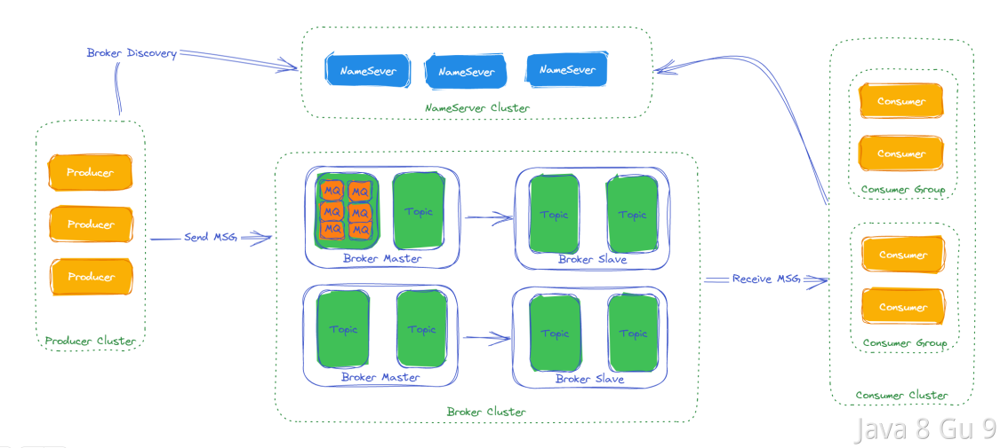

1. Producer：消息生产者，负责将消息发送到Broker。

2. Broker：消息中转服务器，负责存储和转发消息。RocketMQ支持多个Broker构成集群，每个Broker都拥有独立的存储空间和消息队列。

3. Consumer：消息消费者，负责从Broker消费消息。

4. NameServer：名称服务，负责维护Broker的元数据信息，包括Broker地址、Topic和Queue等信息。Producer和Consumer在启动时需要连接到NameServer获取Broker的地址信息。

5. Topic：消息主题，是消息的逻辑分类单位。Producer将消息发送到特定的Topic中，Consumer从指定的Topic中消费消息。

6. Message Queue：消息队列，是Topic的物理实现。一个Topic可以有多个Queue，每个Queue都是独立的存储单元。Producer发送的消息会被存储到对应的Queue中，Consumer从指定的Queue中消费消息。

## RocketMQ支持哪些功能？

## RocketMQ vs. ActiveMQ vs. Kafka

| Messaging Product | Client SDK           | Protocol and Specification                           | Ordered Message                                                 | Scheduled Message | Batched Message                                 | BroadCast Message | Message Filter                                          | Server Triggered Redelivery | Message Storage                                                                                         | Message Retroactive                          | Message Priority | High Availability and Failover                                                  | Message Track | Configuration                                                                                                             | Management and Operation Tools                                  |
| ----------------- | -------------------- | ---------------------------------------------------- | --------------------------------------------------------------- | ----------------- | ----------------------------------------------- | ----------------- | ------------------------------------------------------- | --------------------------- | ------------------------------------------------------------------------------------------------------- | -------------------------------------------- | ---------------- | ------------------------------------------------------------------------------- | ------------- | ------------------------------------------------------------------------------------------------------------------------- | --------------------------------------------------------------- |
| ActiveMQ          | Java, .NET, C++ etc. | Push model, support OpenWire, STOMP, AMQP, MQTT, JMS | Exclusive Consumer or Exclusive Queues can ensure ordering      | Supported         | Not Supported                                   | Supported         | Supported                                               | Not Supported               | Supports very fast persistence using JDBC along with a high performance journal，such as levelDB, kahaDB | Supported                                    | Supported        | Supported, depending on storage,if using levelDB it requires a ZooKeeper server | Not Supported | The default configuration is low level, user need to optimize the configuration parameters                                | Supported                                                       |
| Kafka             | Java, Scala etc.     | Pull model, support TCP                              | Ensure ordering of messages within a partition                  | Not Supported     | Supported, with async producer                  | Not Supported     | Supported, you can use Kafka Streams to filter messages | Not Supported               | High performance file storage                                                                           | Supported offset indicate                    | Not Supported    | Supported, requires a ZooKeeper server                                          | Not Supported | Kafka uses key-value pairs format for configuration. These values can be supplied either from a file or programmatically. | Supported, use terminal command to expose core metrics          |
| RocketMQ          | Java, C++, Go        | Pull model, support TCP, JMS, OpenMessaging          | Ensure strict ordering of messages,and can scale out gracefully | Supported         | Supported, with sync mode to avoid message loss | Supported         | Supported, property filter expressions based on SQL92   | Supported                   | High performance and low latency file storage                                                           | Supported timestamp and offset two indicates | Not Supported    | Supported, Master-Slave model, without another kit                              | Supported     | Work out of box,user only need to pay attention to a few configurations                                                   | Supported, rich web and terminal command to expose core metrics |

## RocketMQ支持的功能

### 主题（Topic）

Apache RocketMQ 中消息传输和存储的顶层容器，用于标识同一类业务逻辑的消息。主题通过TopicName来做唯一标识和区分。

主题、消息队列、消息、生产者、消费者的逻辑关系可以参见下图：

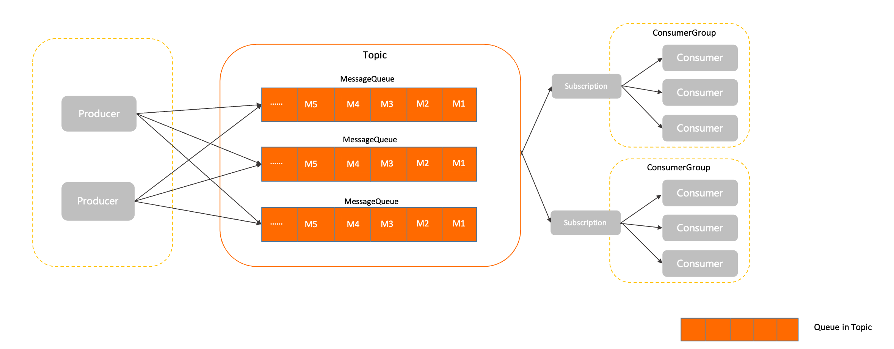

#### 行为约束

**消息类型强制校验**

Apache RocketMQ 5.x版本支持将消息类型拆分到主题中进行独立运维和处理，因此系统会对发送的消息类型和主题定的消息类型进行强制校验，若校验不通过，则消息发送请求会被拒绝，并返回类型不匹配异常。校验原则如下：

- 消息类型必须一致：发送的消息的类型，必须和目标主题定义的消息类型一致。

- 主题类型必须单一：每个主题只支持一种消息类型，不允许将多种类型的消息发送到同一个主题中。

### 消息类型（MessageType）

Apache RocketMQ 中按照消息传输特性的不同而定义的分类，用于类型管理和安全校验。 Apache RocketMQ 支持的消息类型有普通消息、顺序消息、事务消息和定时/延时消息。

Apache RocketMQ 从5.0版本开始，支持强制校验消息类型，即每个主题Topic只允许发送一种消息类型的消息，这样可以更好的运维和管理生产系统，避免混乱。

### 消息队列（MessageQueue）

#### 定义

队列是 Apache RocketMQ 中消息存储和传输的实际容器，也是消息的最小存储单元。 Apache RocketMQ 的每一种主题都是由多个队列组成，以此实现队列数量的水平拆分和队列内部的流式存储。队列通过QueueId来做唯一标识和区分。

队列的主要作用如下：

- 存储顺序性
  
  队列天然具备顺序性，即消息按照进入队列的顺序写入存储，同一队列间的消息天然存在顺序关系，队列头部为最早写入的消息，队列尾部为最新写入的消息。消息在队列中的位置和消息之间的顺序通过位点（Offset）进行标记管理。

- 流式操作语义
  
  Apache RocketMQ 基于队列的存储模型可确保消息从任意位点读取任意数量的消息，以此实现类似聚合读取、回溯读取等特性，这些特性是RabbitMQ、ActiveMQ等非队列存储模型不具备的。

#### 行为约束

每个主题下会由一到多个队列来存储消息，每个主题对应的队列数与消息类型以及实例所处地域（Region）相关。

#### 版本兼容性

队列的名称属性在 Apache RocketMQ 服务端的不同版本中有如下差异：

- 服务端3.x/4.x版本：队列名称由{主题名称}+{BrokerID}+{QueueID}三元组组成，和物理节点绑定。

- 服务端5.x版本：队列名称为一个集群分配的全局唯一的字符串组成，和物理节点解耦。

因此，在开发过程中，建议不要对队列名称做任何假设和绑定。如果您在代码中自定义拼接队列名称并和其他操作进行绑定，一旦服务端版本升级，可能会出现队列名称无法解析的兼容性问题。

#### 使用建议

**按照实际业务消耗设置队列数**

Apache RocketMQ 的队列数可在创建主题或变更主题时设置修改，队列数量的设置应遵循少用够用原则，避免随意增加队列数量。

主题内队列数过多可能对导致如下问题：

- 集群元数据膨胀
  
  Apache RocketMQ 会以队列粒度采集指标和监控数据，队列过多容易造成管控元数据膨胀。

- 客户端压力过大
  
  Apache RocketMQ 的消息读写都是针对队列进行操作，队列过多对应更多的轮询请求，增加系统负荷。

**常见队列增加场景**

- 需要增加队列实现物理节点负载均衡
  
  Apache RocketMQ 每个主题的多个队列可以分布在不同的服务节点上，在集群水平扩容增加节点后，为了保证集群流量的负载均衡，建议在新的服务节点上新增队列，或将旧的队列迁移到新的服务节点上。

- 需要增加队列实现顺序消息性能扩展
  
  在 Apache RocketMQ 服务端4.x版本中，顺序消息的顺序性在队列内生效的，因此顺序消息的并发度会在一定程度上受队列数量的影响，因此建议仅在系统性能瓶颈时再增加队列。

### 消息（Message）

#### 定义

消息是 Apache RocketMQ 中的最小数据传输单元。生产者将业务数据的负载和拓展属性包装成消息发送到服务端，服务端按照相关语义将消息投递到消费端进行消费。

Apache RocketMQ 的消息模型具备如下特点：

- **消息不可变性**
  
  消息本质上是已经产生并确定的事件，一旦产生后，消息的内容不会发生改变。即使经过传输链路的控制也不会发生变化，消费端获取的消息都是只读消息视图。

- **消息持久化**
  
  Apache RocketMQ 会默认对消息进行持久化，即将接收到的消息存储到 Apache RocketMQ 服务端的存储文件中，保证消息的可回溯性和系统故障场景下的可恢复性。

#### 行为约束

消息大小不得超过其类型所对应的限制，否则消息会发送失败。

系统默认的消息最大限制如下：

- 普通和顺序消息：4 MB

- 事务和定时或延时消息：64 KB

#### 使用建议

**单条消息不建议传输超大负载**

作为一款消息中间件产品，Apache RocketMQ 一般传输的是都是业务事件数据。单个原子消息事件的数据大小需要严格控制，如果单条消息过大容易造成网络传输层压力，不利于异常重试和流量控制。

生产环境中如果需要传输超大负载，建议按照固定大小做报文拆分，或者结合文件存储等方法进行传输。

**消息中转时做好不可变设计**

Apache RocketMQ 服务端5.x版本中，消息本身不可编辑，消费端获取的消息都是只读消息视图。 但在历史版本3.x和4.x版本中消息不可变性没有强约束，因此如果您需要在使用过程中对消息进行中转操作，务必将消息重新初始化。

- 正确使用示例如下：
  
  ```java
  Message m = Consumer.receive();
  Message m2= MessageBuilder.buildFrom(m);
  Producer.send(m2);
  ```

- 错误使用示例如下：
  
  ```java
  Message m = Consumer.receive();
  m.update()；
  Producer.send(m);
  ```

### 消息视图（MessageView）

消息视图是 Apache RocketMQ 面向开发视角提供的一种消息只读接口。通过消息视图可以读取消息内部的多个属性和负载信息，但是不能对消息本身做任何修改。

### 消息标签（MessageTag）

消息标签是Apache RocketMQ 提供的细粒度消息分类属性，可以在主题层级之下做消息类型的细分。消费者通过订阅特定的标签来实现细粒度过滤。

### 消息位点（MessageQueueOffset）

消息是按到达Apache RocketMQ 服务端的先后顺序存储在指定主题的多个队列中，每条消息在队列中都有一个唯一的Long类型坐标，这个坐标被定义为消息位点。

### 消费位点（ConsumerOffset）

一条消息被某个消费者消费完成后不会立即从队列中删除，Apache RocketMQ 会基于每个消费者分组记录消费过的最新一条消息的位点，即消费位点。

### 消息索引（MessageKey）

消息索引是Apache RocketMQ 提供的面向消息的索引属性。通过设置的消息索引可以快速查找到对应的消息内容。

### 生产者（Producer）

#### 定义

生产者是Apache RocketMQ 系统中用来构建并传输消息到服务端的运行实体。生产者通常被集成在业务系统中，将业务消息按照要求封装成消息并发送至服务端。

在消息生产者中，可以定义如下传输行为：

- 发送方式：生产者可通过API接口设置消息发送的方式。Apache RocketMQ 支持同步传输和异步传输。

- 批量发送：生产者可通过API接口设置消息批量传输的方式。例如，批量发送的消息条数或消息大小。

- 事务行为：Apache RocketMQ 支持事务消息，对于事务消息需要生产者配合进行事务检查等行为保障事务的最终一致性。具体信息，请参见[事务消息](https://rocketmq.apache.org/zh/docs/featureBehavior/04transactionmessage)。

生产者和主题的关系为多对多关系，即同一个生产者可以向多个主题发送消息，对于平台类场景如果需要发送消息到多个主题，并不需要创建多个生产者；同一个主题也可以接收多个生产者的消息，以此可以实现生产者性能的水平扩展和容灾。

#### 内部属性

**客户端ID**

- 定义：生产者客户端的标识，用于区分不同的生产者。集群内全局唯一。

- 取值：客户端ID由Apache RocketMQ 的SDK自动生成，主要用于日志查看、问题定位等运维场景，不支持修改。

**通信参数**

- 接入点信息 **（必选）** ：连接服务端的接入地址，用于识别服务端集群。 接入点必须按格式配置，建议使用域名，避免使用IP地址，防止节点变更无法进行热点迁移。
- 身份认证信息 **（可选）** ：客户端用于身份验证的凭证信息。 仅在服务端开启身份识别和认证时需要传输。
- 请求超时时间 **（可选）** ：客户端网络请求调用的超时时间。取值范围和默认值，请参见[参数限制](https://rocketmq.apache.org/zh/docs/introduction/03limits)。

**预绑定主题列表**

- 定义：Apache RocketMQ 的生产者需要将消息发送到的目标主题列表，主要作用如下：
  
  - 事务消息 **（必须设置）** ：事务消息场景下，生产者在故障、重启恢复时，需要检查事务消息的主题中是否有未提交的事务消息。避免生产者发送新消息后，主题中的旧事务消息一直处于未提交状态，造成业务延迟。
  
  - 非事务消息 **（建议设置）** ：服务端会在生产者初始化时根据预绑定主题列表，检查目标主题的访问权限和合法性，而不需要等到应用启动后再检查。
    
    若未设置，或后续消息发送的目标主题动态变更， Apache RocketMQ 会对目标主题进行动态补充检验。

- 约束：对于事务消息，预绑定列表必须设置，且需要和事务检查器一起配合使用。

**事务检查器**

- 定义：Apache RocketMQ 的事务消息机制中，为保证异常场景下事务的最终一致性，生产者需要主动实现事务检查器的接口。具体信息，请参见[事务消息](https://rocketmq.apache.org/zh/docs/featureBehavior/04transactionmessage)。

- 发送事务消息时，事务检查器必须设置，且需要和预绑定主题列表一起配合使用。

**发送重试策略**：

- 定义: 生产者在消息发送失败时的重试策略。具体信息，请参见[消息发送重试机制](https://rocketmq.apache.org/zh/docs/featureBehavior/05sendretrypolicy)。

#### 版本兼容性

Apache RocketMQ 服务端5.x版本开始，生产者是匿名的，无需管理生产者分组（ProducerGroup）；对于历史版本服务端3.x和4.x版本，已经使用的生产者分组可以废弃无需再设置，且不会对当前业务产生影响。

#### 使用建议

**不建议单一进程创建大量生产者**

Apache RocketMQ 的生产者和主题是多对多的关系，支持同一个生产者向多个主题发送消息。对于生产者的创建和初始化，建议遵循够用即可、最大化复用原则，如果有需要发送消息到多个主题的场景，无需为每个主题都创建一个生产者。

**不建议频繁创建和销毁生产者**

Apache RocketMQ 的生产者是可以重复利用的底层资源，类似数据库的连接池。因此不需要在每次发送消息时动态创建生产者，且在发送结束后销毁生产者。这样频繁的创建销毁会在服务端产生大量短连接请求，严重影响系统性能。

- 正确示例
  
  ```java
  Producer p = ProducerBuilder.build();
  for (int i =0;i<n;i++){
      Message m= MessageBuilder.build();
      p.send(m);
   }
  p.shutdown();
  ```

- 典型错误示例
  
  ```java
  for (int i =0;i<n;i++){
      Producer p = ProducerBuilder.build();
      Message m= MessageBuilder.build();
      p.send(m);
      p.shutdown();
    }
  ```

### 事务检查器（TransactionChecker）

Apache RocketMQ 中生产者用来执行本地事务检查和异常事务恢复的监听器。事务检查器应该通过业务侧数据的状态来检查和判断事务消息的状态。

### 事务状态（TransactionResolution）

Apache RocketMQ 中事务消息发送过程中，事务提交的状态标识，服务端通过事务状态控制事务消息是否应该提交和投递。事务状态包括事务提交、事务回滚和事务未决。

### 消费者分组（ConsumerGroup）

消费者分组是Apache RocketMQ 系统中承载多个消费行为一致的消费者的负载均衡分组。和消费者不同，消费者分组并不是运行实体，而是一个逻辑资源。在 Apache RocketMQ 中，通过消费者分组内初始化多个消费者实现消费性能的水平扩展以及高可用容灾。

#### 定义

消费者分组是 Apache RocketMQ 系统中承载多个消费行为一致的消费者的负载均衡分组。

和消费者不同，消费者分组并不是运行实体，而是一个逻辑资源。在 Apache RocketMQ 中，通过消费者分组内初始化多个消费者实现消费性能的水平扩展以及高可用容灾。

在消费者分组中，统一定义以下消费行为，同一分组下的多个消费者将按照分组内统一的消费行为和负载均衡策略消费消息。

- 订阅关系：Apache RocketMQ 以消费者分组的粒度管理订阅关系，实现订阅关系的管理和追溯。具体信息，请参见[订阅关系（Subscription）](https://rocketmq.apache.org/zh/docs/domainModel/09subscription)。

- 投递顺序性：Apache RocketMQ 的服务端将消息投递给消费者消费时，支持顺序投递和并发投递，投递方式在消费者分组中统一配置。具体信息，请参见[顺序消息](https://rocketmq.apache.org/zh/docs/featureBehavior/03fifomessage)。

- 消费重试策略： 消费者消费消息失败时的重试策略，包括重试次数、死信队列设置等。具体信息，请参见[消费重试](https://rocketmq.apache.org/zh/docs/featureBehavior/10consumerretrypolicy)。

#### 内部属性

**消费者分组名称**

- 定义：消费者分组的名称，用于区分不同的消费者分组。集群内全局唯一。

- 取值：消费者分组由用户设置并创建。具体命名规范，请参见[参数限制](https://rocketmq.apache.org/zh/docs/introduction/03limits)。

**投递顺序性**

- 定义：消费者消费消息时，Apache RocketMQ 向消费者客户端投递消息的顺序。
  
  根据不同的消费场景，Apache RocketMQ 提供顺序投递和并发投递两种方式。具体信息，请参见[顺序消息](https://rocketmq.apache.org/zh/docs/featureBehavior/03fifomessage)。

- 取值：默认投递方式为并发投递。

**消费重试策略**

- 定义：消费者消费消息失败时，系统的重试策略。消费者消费消息失败时，系统会按照重试策略，将指定消息投递给消费者重新消费。具体信息，请参见[消费重试](https://rocketmq.apache.org/zh/docs/featureBehavior/10consumerretrypolicy)。

- 取值：重试策略包括：
  
  - 最大重试次数：表示消息可以重新被投递的最大次数，超过最大重试次数还没被成功消费，消息将被投递至死信队列或丢弃。
  
  - 重试间隔：Apache RocketMQ 服务端重新投递消息的间隔时间。 最大重试次数和重试间隔的取值范围及默认值，请参见[参数限制](https://rocketmq.apache.org/zh/docs/introduction/03limits)。

- 约束：重试间隔仅在PushConsumer消费类型下有效。

**订阅关系**

- 定义：当前消费者分组关联的订阅关系集合。包括消费者订阅的主题，以及消息的过滤规则等。订阅关系由消费者动态注册到消费者分组中，Apache RocketMQ 服务端会持久化订阅关系并匹配消息的消费进度。更多信息，请参见[订阅关系（Subscription）](https://rocketmq.apache.org/zh/docs/domainModel/09subscription)。

#### 行为约束

在 Apache RocketMQ 领域模型中，消费者的管理通过消费者分组实现，同一分组内的消费者共同分摊消息进行消费。因此，为了保证分组内消息的正常负载和消费，

Apache RocketMQ 要求同一分组下的所有消费者以下消费行为保持一致：

- **投递顺序**

- **消费重试策略**

#### 版本兼容性

如行为约束中所述，同一分组内所有消费者的投递顺序和消费重试策略需要保持一致。

- Apache RocketMQ 服务端5.x版本：上述消费者的消费行为从关联的消费者分组中统一获取，因此，同一分组内所有消费者的消费行为必然是一致的，客户端无需关注。

- Apache RocketMQ 服务端3.x/4.x历史版本：上述消费逻辑由消费者客户端接口定义，因此，您需要自己在消费者客户端设置时保证同一分组下的消费者的消费行为一致。

若您使用 Apache RocketMQ 服务端5.x版本，客户端使用历史版本SDK，则消费者的消费逻辑以消费者客户端接口的设置为准。

#### 使用建议

**按照业务合理拆分分组**

Apache RocketMQ 的消费者和主题是多对多的关系，对于消费者分组的拆分设计，建议遵循以下原则：

- 消费者的投递顺序一致：同一消费者分组下所有消费者的消费投递顺序是相同的，统一都是顺序投递或并发投递，不同业务场景不能混用消费者分组。

- 消费者业务类型一致：一般消费者分组和主题对应，不同业务域对消息消费的要求不同，例如消息过滤属性、消费重试策略不同。因此，不同业务域主题的消费建议使用不同的消费者分组，避免一个消费者分组消费超过10个主题。

**消费者分组管理尽量避免自动化机制**

在 Apache RocketMQ 架构中，消费分组属于状态管理类的逻辑资源，每个消费分组都会涉及关联的消费状态、堆积信息、可观测指标和监控采集数据。因此，生产环境需要严格管理消费者分组资源，请勿随意进行增、删、改、查操作。

Apache RocketMQ 虽然提供了自动创建消费者分组的功能，但是建议仅在测试环境使用，生产环境请勿打开，避免产生大量消费者分组，无法管理和回收，且浪费系统资源。

### 消费者（Consumer）

消费者是Apache RocketMQ 中用来接收并处理消息的运行实体。消费者通常被集成在业务系统中，从服务端获取消息，并将消息转化成业务可理解的信息，供业务逻辑处理。

#### 定义

消费者是 Apache RocketMQ 中用来接收并处理消息的运行实体。 消费者通常被集成在业务系统中，从 Apache RocketMQ 服务端获取消息，并将消息转化成业务可理解的信息，供业务逻辑处理。

在消息消费端，可以定义如下传输行为：

- 消费者身份：消费者必须关联一个指定的消费者分组，以获取分组内统一定义的行为配置和消费状态。

- 消费者类型：Apache RocketMQ 面向不同的开发场景提供了多样的消费者类型，包括PushConsumer类型、SimpleConsumer类型、PullConsumer类型（仅推荐流处理场景使用）等。具体信息，请参见[消费者分类](https://rocketmq.apache.org/zh/docs/featureBehavior/06consumertype)。

- 消费者本地运行配置：消费者根据不同的消费者类型，控制消费者客户端本地的运行配置。例如消费者客户端的线程数，消费并发度等，实现不同的传输效果。

#### 内部属性

**消费者分组名称**

- 定义：当前消费者关联的消费者分组名称，消费者必须关联到指定的消费者分组，通过消费者分组获取消费行为。更多信息，请参见[消费者分组（ConsumerGroup）](https://rocketmq.apache.org/zh/docs/domainModel/07consumergroup)。

- 取值：消费者分组为Apache RocketMQ 的逻辑资源，需要您提前通过控制台或OpenAPI创建。具体命名格式，请参见[使用限制](https://rocketmq.apache.org/zh/docs/introduction/03limits)。

**客户端ID**

- 定义：消费者客户端的标识，用于区分不同的消费者。集群内全局唯一。

- 取值：客户端ID由Apache RocketMQ 的SDK自动生成，主要用于日志查看、问题定位等运维场景，不支持修改。

**通信参数**

- 接入点信息 **（必选）** ：连接服务端的接入地址，用于识别服务端集群。 接入点必须按格式配置，建议使用域名，避免使用IP地址，防止节点变更无法进行热点迁移。
- 身份认证信息 **（可选）** ：客户端用于身份验证的凭证信息。 仅在服务端开启身份识别和认证时需要传输。
- 请求超时时间 **（可选）** ：客户端网络请求调用的超时时间。取值范围和默认值，请参见[参数限制](https://rocketmq.apache.org/zh/docs/introduction/03limits)。

**预绑定订阅关系列表**

- 定义：指定消费者的订阅关系列表。 Apache RocketMQ 服务端可在消费者初始化阶段，根据预绑定的订阅关系列表对目标主题进行权限及合法性校验，无需等到应用启动后才能校验。

- 取值：建议在消费者初始化阶段明确订阅关系即要订阅的主题列表，若未设置，或订阅的主题动态变更，Apache RocketMQ 会对目标主题进行动态补充校验。

**消费监听器**

- 定义：Apache RocketMQ 服务端将消息推送给消费者后，消费者调用消息消费逻辑的监听器。

- 取值：由消费者客户端本地配置。

- 约束：使用PushConsumer类型的消费者消费消息时，消费者客户端必须设置消费监听器。消费者类型的具体信息，请参见[消费者分类](https://rocketmq.apache.org/zh/docs/featureBehavior/06consumertype)。

#### 行为约束

在 Apache RocketMQ 领域模型中，消费者的管理通过消费者分组实现，同一分组内的消费者共同分摊消息进行消费。因此，为了保证分组内消息的正常负载和消费，Apache RocketMQ 要求同一分组下的所有消费者以下消费行为保持一致：

- **投递顺序**

- **消费重试策略**

#### 版本兼容性

如行为约束中所述，同一分组内所有消费者的投递顺序和消费重试策略需要保持一致。

- Apache RocketMQ 服务端5.x版本：上述消费者的消费行为从关联的消费者分组中统一获取，因此，同一分组内所有消费者的消费行为必然是一致的，客户端无需关注。

- Apache RocketMQ 服务端3.x/4.x历史版本：上述消费逻辑由消费者客户端接口定义，因此，您需要自己在消费者客户端设置时保证同一分组下的消费者的消费行为一致。

若您使用 Apache RocketMQ 服务端5.x版本，客户端使用历史版本SDK，则消费者的消费逻辑以消费者客户端接口的设置为准。

#### 使用建议

**不建议在单一进程内创建大量消费者**

Apache RocketMQ 的消费者在通信协议层面支持非阻塞传输模式，网络通信效率较高，并且支持多线程并发访问。因此，大部分场景下，单一进程内同一个消费分组只需要初始化唯一的一个消费者即可，开发过程中应避免以相同的配置初始化多个消费者。

**不建议频繁创建和销毁消费者**

Apache RocketMQ 的消费者是可以重复利用的底层资源，类似数据库的连接池。因此不需要在每次接收消息时动态创建消费者，且在消费完成后销毁消费者。这样频繁地创建销毁会在服务端产生大量短连接请求，严重影响系统性能。

- 正确示例
  
  ```java
  Consumer c = ConsumerBuilder.build();
  for (int i =0;i<n;i++){
        Message m= c.receive();
        //process message
      }
  c.shutdown();
  ```

- 典型错误示例
  
  ```java
  for (int i =0;i<n;i++){
      Consumer c = ConsumerBuilder.build();
      Message m= c.receive();
      //process message
      c.shutdown();
    }
  ```

### 消费结果（ConsumeResult）

Apache RocketMQ 中PushConsumer消费监听器处理消息完成后返回的处理结果，用来标识本次消息是否正确处理。消费结果包含消费成功和消费失败。

### 订阅关系（Subscription）

订阅关系是Apache RocketMQ 系统中消费者获取消息、处理消息的规则和状态配置。订阅关系由消费者分组动态注册到服务端系统，并在后续的消息传输中按照订阅关系定义的过滤规则进行消息匹配和消费进度维护。

#### 定义

订阅关系是 Apache RocketMQ 系统中消费者获取消息、处理消息的规则和状态配置。

订阅关系由消费者分组动态注册到服务端系统，并在后续的消息传输中按照订阅关系定义的过滤规则进行消息匹配和消费进度维护。

通过配置订阅关系，可控制如下传输行为：

- 消息过滤规则：用于控制消费者在消费消息时，选择主题内的哪些消息进行消费，设置消费过滤规则可以高效地过滤消费者需要的消息集合，灵活根据不同的业务场景设置不同的消息接收范围。具体信息，请参见[消息过滤](https://rocketmq.apache.org/zh/docs/featureBehavior/07messagefilter)。

- 消费状态：Apache RocketMQ 服务端默认提供订阅关系持久化的能力，即消费者分组在服务端注册订阅关系后，当消费者离线并再次上线后，可以获取离线前的消费进度并继续消费。

#### 订阅关系判断原则

Apache RocketMQ 的订阅关系按照消费者分组和主题粒度设计，因此，一个订阅关系指的是指定某个消费者分组对于某个主题的订阅，判断原则如下：

- 不同消费者分组对于同一个主题的订阅相互独立如下图所示，消费者分组Group A和消费者分组Group B分别以不同的订阅关系订阅了同一个主题Topic A，这两个订阅关系互相独立，可以各自定义，不受影响。
  
  

- 同一个消费者分组对于不同主题的订阅也相互独立如下图所示，消费者分组Group A订阅了两个主题Topic A和Topic B，对于Group A中的消费者来说，订阅的Topic A为一个订阅关系，订阅的Topic B为另外一个订阅关系，且这两个订阅关系互相独立，可以各自定义，不受影响。
  
  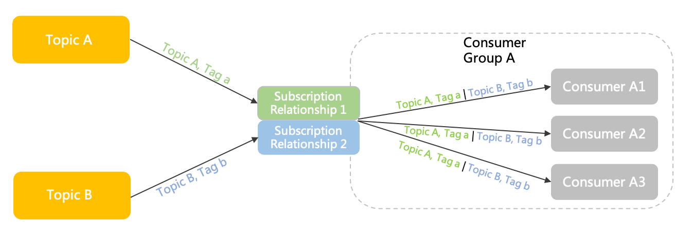

#### 行为约束

**订阅关系一致**

Apache RocketMQ 是按照消费者分组粒度管理订阅关系，因此，同一消费者分组内的消费者在消费逻辑上必须保持一致，否则会出现消费冲突，导致部分消息消费异常。

- 正确示例
  
  ```java
  //Consumer 
  c1Consumer c1 = ConsumerBuilder.build(groupA);
  c1.subscribe(topicA,"TagA");
  //Consumer 
  c2Consumer c2 = ConsumerBuilder.build(groupA);
  c2.subscribe(topicA,"TagA");
  ```

- 错误示例
  
  ```java
  //Consumer 
  c1Consumer c1 = ConsumerBuilder.build(groupA);
  c1.subscribe(topicA,"TagA");
  //Consumer 
  c2Consumer c2 = ConsumerBuilder.build(groupA);
  c2.subscribe(topicA,"TagB");
  ```

#### 使用建议

**建议不要频繁修改订阅关系**

在 Apache RocketMQ 领域模型中，订阅关系关联了过滤规则、消费进度等元数据和相关配置，同时系统需要保证消费者分组下的所有消费者的消费行为、消费逻辑、负载策略等一致，整体运算逻辑比较复杂。因此，不建议在生产环境中通过频繁修改订阅关系来实现业务逻辑的变更，这样可能会导致客户端一直处于负载均衡调整和变更的过程，从而影响消息接收。

### 消息过滤

消费者可以通过订阅指定消息标签（Tag）对消息进行过滤，确保最终只接收被过滤后的消息合集。过滤规则的计算和匹配在Apache RocketMQ 的服务端完成。

### 重置消费位点

以时间轴为坐标，在消息持久化存储的时间范围内，重新设置消费者分组对已订阅主题的消费进度，设置完成后消费者将接收设定时间点之后，由生产者发送到Apache RocketMQ 服务端的消息。

### 消息轨迹

在一条消息从生产者发出到消费者接收并处理过程中，由各个相关节点的时间、地点等数据汇聚而成的完整链路信息。通过消息轨迹，您能清晰定位消息从生产者发出，经由Apache RocketMQ 服务端，投递给消费者的完整链路，方便定位排查问题。

### 消息堆积

生产者已经将消息发送到Apache RocketMQ 的服务端，但由于消费者的消费能力有限，未能在短时间内将所有消息正确消费掉，此时在服务端保存着未被消费的消息，该状态即消息堆积。

### 事务消息

事务消息是Apache RocketMQ 提供的一种高级消息类型，支持在分布式场景下保障消息生产和本地事务的最终一致性。

### 定时/延时消息

定时/延时消息是Apache RocketMQ 提供的一种高级消息类型，消息被发送至服务端后，在指定时间后才能被消费者消费。通过设置一定的定时时间可以实现分布式场景的延时调度触发效果。

#### 应用场景

**典型场景一：分布式定时调度**

在分布式定时调度场景下，需要实现各类精度的定时任务，例如每天5点执行文件清理，每隔2分钟触发一次消息推送等需求。传统基于数据库的定时调度方案在分布式场景下，性能不高，实现复杂。基于 Apache RocketMQ 的定时消息可以封装出多种类型的定时触发器。


**典型场景二：任务超时处理**

以电商交易场景为例，订单下单后暂未支付，此时不可以直接关闭订单，而是需要等待一段时间后才能关闭订单。使用 Apache RocketMQ 定时消息可以实现超时任务的检查触发。

基于定时消息的超时任务处理具备如下优势：

- 精度高、开发门槛低：基于消息通知方式不存在定时阶梯间隔。可以轻松实现任意精度事件触发，无需业务去重。

- 高性能可扩展：传统的数据库扫描方式较为复杂，需要频繁调用接口扫描，容易产生性能瓶颈。 Apache RocketMQ 的定时消息具有高并发和水平扩展的能力。


**定时时间设置原则**

- Apache RocketMQ 定时消息设置的定时时间是一个预期触发的系统时间戳，延时时间也需要转换成当前系统时间后的某一个时间戳，而不是一段延时时长。

- 定时时间的格式为毫秒级的Unix时间戳，您需要将要设置的时刻转换成时间戳形式。具体方式，请参见[Unix时间戳转换工具](https://www.unixtimestamp.com/)。

- 定时时间必须设置在定时时长范围内，超过范围则定时不生效，服务端会立即投递消息。

- 定时时长最大值默认为24小时，不支持自定义修改，更多信息，请参见[参数限制](https://rocketmq.apache.org/zh/docs/introduction/03limits)。

- 定时时间必须设置为当前时间之后，若设置到当前时间之前，则定时不生效，服务端会立即投递消息。

**示例如下：**

- 定时消息：例如，当前系统时间为2022-06-09 17:30:00，您希望消息在下午19:20:00定时投递，则定时时间为2022-06-09 19:20:00，转换成时间戳格式为1654773600000。

- 延时消息：例如，当前系统时间为2022-06-09 17:30:00，您希望延时1个小时后投递消息，则您需要根据当前时间和延时时长换算成定时时刻，即消息投递时间为2022-06-09 18:30:00，转换为时间戳格式为1654770600000。

**定时消息生命周期**

- 初始化：消息被生产者构建并完成初始化，待发送到服务端的状态。

- 定时中：消息被发送到服务端，和普通消息不同的是，服务端不会直接构建消息索引，而是会将定时消息单独存储在定时存储系统中，等待定时时刻到达。

- 待消费：定时时刻到达后，服务端将消息重新写入普通存储引擎，对下游消费者可见，等待消费者消费的状态。

- 消费中：消息被消费者获取，并按照消费者本地的业务逻辑进行处理的过程。 此时服务端会等待消费者完成消费并提交消费结果，如果一定时间后没有收到消费者的响应，Apache RocketMQ会对消息进行重试处理。具体信息，请参见[消费重试](https://rocketmq.apache.org/zh/docs/featureBehavior/10consumerretrypolicy)。

- 消费提交：消费者完成消费处理，并向服务端提交消费结果，服务端标记当前消息已经被处理（包括消费成功和失败）。 Apache RocketMQ 默认支持保留所有消息，此时消息数据并不会立即被删除，只是逻辑标记已消费。消息在保存时间到期或存储空间不足被删除前，消费者仍然可以回溯消息重新消费。

- 消息删除：Apache RocketMQ按照消息保存机制滚动清理最早的消息数据，将消息从物理文件中删除。更多信息，请参见[消息存储和清理机制](https://rocketmq.apache.org/zh/docs/featureBehavior/11messagestorepolicy)。


#### 使用限制

**消息类型一致性**

定时消息仅支持在 MessageType为Delay 的主题内使用，即定时消息只能发送至类型为定时消息的主题中，发送的消息的类型必须和主题的类型一致。

**定时精度约束**

Apache RocketMQ 定时消息的定时时长参数精确到毫秒级，但是默认精度为1000ms，即定时消息为秒级精度。

Apache RocketMQ 定时消息的状态支持持久化存储，系统由于故障重启后，仍支持按照原来设置的定时时间触发消息投递。若存储系统异常重启，可能会导致定时消息投递出现一定延迟。

#### 使用建议

**避免大量相同定时时刻的消息**

定时消息的实现逻辑需要先经过定时存储等待触发，定时时间到达后才会被投递给消费者。因此，如果将大量定时消息的定时时间设置为同一时刻，则到达该时刻后会有大量消息同时需要被处理，会造成系统压力过大，导致消息分发延迟，影响定时精度。

### 顺序消息

顺序消息是Apache RocketMQ 提供的一种高级消息类型，支持消费者按照发送消息的先后顺序获取消息，从而实现业务场景中的顺序处理。

在有序事件处理、撮合交易、数据实时增量同步等场景下，异构系统间需要维持强一致的状态同步，上游的事件变更需要按照顺序传递到下游进行处理。在这类场景下使用 Apache RocketMQ 的顺序消息可以有效保证数据传输的顺序性。

**数据实时增量同步**

以数据库变更增量同步场景为例，上游源端数据库按需执行增删改操作，将二进制操作日志作为消息，通过 Apache RocketMQ 传输到下游搜索系统，下游系统按顺序还原消息数据，实现状态数据按序刷新。如果是普通消息则可能会导致状态混乱，和预期操作结果不符，基于顺序消息可以实现下游状态和上游操作结果一致。

#### 功能原理

**什么是顺序消息**

顺序消息是 Apache RocketMQ 提供的一种高级消息类型，支持消费者按照发送消息的先后顺序获取消息，从而实现业务场景中的顺序处理。 相比其他类型消息，顺序消息在发送、存储和投递的处理过程中，更多强调多条消息间的先后顺序关系。

Apache RocketMQ 顺序消息的顺序关系通过消息组（MessageGroup）判定和识别，发送顺序消息时需要为每条消息设置归属的消息组，相同消息组的多条消息之间遵循先进先出的顺序关系，不同消息组、无消息组的消息之间不涉及顺序性。

基于消息组的顺序判定逻辑，支持按照业务逻辑做细粒度拆分，可以在满足业务局部顺序的前提下提高系统的并行度和吞吐能力。

**如何保证消息的顺序性**

Apache RocketMQ 的消息的顺序性分为两部分，生产顺序性和消费顺序性。

- **生产顺序性** ：
  
  Apache RocketMQ 通过生产者和服务端的协议保障单个生产者串行地发送消息，并按序存储和持久化。
  
  如需保证消息生产的顺序性，则必须满足以下条件：
  
  - 单一生产者：消息生产的顺序性仅支持单一生产者，不同生产者分布在不同的系统，即使设置相同的消息组，不同生产者之间产生的消息也无法判定其先后顺序。
  
  - 串行发送：Apache RocketMQ 生产者客户端支持多线程安全访问，但如果生产者使用多线程并行发送，则不同线程间产生的消息将无法判定其先后顺序。

满足以上条件的生产者，将顺序消息发送至 Apache RocketMQ 后，会保证设置了同一消息组的消息，按照发送顺序存储在同一队列中。服务端顺序存储逻辑如下：

- 相同消息组的消息按照先后顺序被存储在同一个队列。

- 不同消息组的消息可以混合在同一个队列中，且不保证连续。


如上图所示，消息组1和消息组4的消息混合存储在队列1中， Apache RocketMQ 保证消息组1中的消息G1-M1、G1-M2、G1-M3是按发送顺序存储，且消息组4的消息G4-M1、G4-M2也是按顺序存储，但消息组1和消息组4中的消息不涉及顺序关系。

- **消费顺序性** ：
  
  Apache RocketMQ 通过消费者和服务端的协议保障消息消费严格按照存储的先后顺序来处理。
  
  如需保证消息消费的顺序性，则必须满足以下条件：
  
  - 投递顺序
    
    Apache RocketMQ 通过客户端SDK和服务端通信协议保障消息按照服务端存储顺序投递，但业务方消费消息时需要严格按照接收---处理---应答的语义处理消息，避免因异步处理导致消息乱序。
    
    备注
    
    消费者类型为PushConsumer时， Apache RocketMQ 保证消息按照存储顺序一条一条投递给消费者，若消费者类型为SimpleConsumer，则消费者有可能一次拉取多条消息。此时，消息消费的顺序性需要由业务方自行保证。消费者类型的具体信息，请参见[消费者分类](https://rocketmq.apache.org/zh/docs/featureBehavior/06consumertype)。
  
  - 有限重试
    
    Apache RocketMQ 顺序消息投递仅在重试次数限定范围内，即一条消息如果一直重试失败，超过最大重试次数后将不再重试，跳过这条消息消费，不会一直阻塞后续消息处理。
    
    对于需要严格保证消费顺序的场景，请务设置合理的重试次数，避免参数不合理导致消息乱序。

**生产顺序性和消费顺序性组合**

如果消息需要严格按照先进先出（FIFO）的原则处理，即先发送的先消费、后发送的后消费，则必须要同时满足生产顺序性和消费顺序性。

一般业务场景下，同一个生产者可能对接多个下游消费者，不一定所有的消费者业务都需要顺序消费，您可以将生产顺序性和消费顺序性进行差异化组合，应用于不同的业务场景。例如发送顺序消息，但使用非顺序的并发消费方式来提高吞吐能力。更多组合方式下表所示：

| 生产顺序            | 消费顺序 | 顺序性效果                                                                |
| --------------- | ---- | -------------------------------------------------------------------- |
| 设置消息组，保证消息顺序发送。 | 顺序消费 | 按照消息组粒度，严格保证消息顺序。 同一消息组内的消息的消费顺序和发送顺序完全一致。                           |
| 设置消息组，保证消息顺序发送。 | 并发消费 | 并发消费，尽可能按时间顺序处理。                                                     |
| 未设置消息组，消息乱序发送。  | 顺序消费 | 按队列存储粒度，严格顺序。 基于 Apache RocketMQ 本身队列的属性，消费顺序和队列存储的顺序一致，但不保证和发送顺序一致。 |
| 未设置消息组，消息乱序发送。  | 并发消费 | 并发消费，尽可能按照时间顺序处理。                                                    |

**顺序消息生命周期**


- 初始化：消息被生产者构建并完成初始化，待发送到服务端的状态。

- 待消费：消息被发送到服务端，对消费者可见，等待消费者消费的状态。

- 消费中：消息被消费者获取，并按照消费者本地的业务逻辑进行处理的过程。 此时服务端会等待消费者完成消费并提交消费结果，如果一定时间后没有收到消费者的响应，Apache RocketMQ会对消息进行重试处理。具体信息，请参见[消费重试](https://rocketmq.apache.org/zh/docs/featureBehavior/10consumerretrypolicy)。

- 消费提交：消费者完成消费处理，并向服务端提交消费结果，服务端标记当前消息已经被处理（包括消费成功和失败）。 Apache RocketMQ 默认支持保留所有消息，此时消息数据并不会立即被删除，只是逻辑标记已消费。消息在保存时间到期或存储空间不足被删除前，消费者仍然可以回溯消息重新消费。

- 消息删除：Apache RocketMQ按照消息保存机制滚动清理最早的消息数据，将消息从物理文件中删除。更多信息，请参见[消息存储和清理机制](https://rocketmq.apache.org/zh/docs/featureBehavior/11messagestorepolicy)。

#### 使用限制

顺序消息仅支持使用MessageType为FIFO的主题，即顺序消息只能发送至类型为顺序消息的主题中，发送的消息的类型必须和主题的类型一致。

#### 使用示例

以Java语言为例，收发顺序消息的示例代码如下：

```java
        //顺序消息发送。
        MessageBuilder messageBuilder = new MessageBuilderImpl();;
        Message message = messageBuilder.setTopic("topic")
                //设置消息索引键，可根据关键字精确查找某条消息。
                .setKeys("messageKey")
                //设置消息Tag，用于消费端根据指定Tag过滤消息。
                .setTag("messageTag")
                //设置顺序消息的排序分组，该分组尽量保持离散，避免热点排序分组。
                .setMessageGroup("fifoGroup001")
                //消息体。
                .setBody("messageBody".getBytes())
                .build();
        try {
            //发送消息，需要关注发送结果，并捕获失败等异常
            SendReceipt sendReceipt = producer.send(message);
            System.out.println(sendReceipt.getMessageId());
        } catch (ClientException e) {
            e.printStackTrace();
        }
        //消费顺序消息时，需要确保当前消费者分组是顺序投递模式，否则仍然按并发乱序投递。
        //消费示例一：使用PushConsumer消费顺序消息，只需要在消费监听器处理即可。
        MessageListener messageListener = new MessageListener() {
            @Override
            public ConsumeResult consume(MessageView messageView) {
                System.out.println(messageView);
                //根据消费结果返回状态。
                return ConsumeResult.SUCCESS;
            }
        };
        //消费示例二：使用SimpleConsumer消费顺序消息，主动获取消息进行消费处理并提交消费结果。
        //需要注意的是，同一个MessageGroup的消息，如果前序消息没有消费完成，再次调用Receive是获取不到后续消息的。
        List<MessageView> messageViewList = null;
        try {
            messageViewList = simpleConsumer.receive(10, Duration.ofSeconds(30));
            messageViewList.forEach(messageView -> {
                System.out.println(messageView);
                //消费处理完成后，需要主动调用ACK提交消费结果。
                try {
                    simpleConsumer.ack(messageView);
                } catch (ClientException e) {
                    e.printStackTrace();
                }
            });
        } catch (ClientException e) {
            //如果遇到系统流控等原因造成拉取失败，需要重新发起获取消息请求。
            e.printStackTrace();
        }
```

#### 使用建议

**串行消费，避免批量消费导致乱序**

消息消费建议串行处理，避免一次消费多条消息，否则可能出现乱序情况。

例如：发送顺序为1->2->3->4，消费时批量消费，消费顺序为1->23（批量处理，失败）->23（重试处理）->4，此时可能由于消息3的失败导致消息2被重复处理，最后导致消息消费乱序。

**消息组尽可能打散，避免集中导致热点**

Apache RocketMQ 保证相同消息组的消息存储在同一个队列中，如果不同业务场景的消息都集中在少量或一个消息组中，则这些消息存储压力都会集中到服务端的少量队列或一个队列中。容易导致性能热点，且不利于扩展。一般建议的消息组设计会采用订单ID、用户ID作为顺序参考，即同一个终端用户的消息保证顺序，不同用户的消息无需保证顺序。

因此建议将业务以消息组粒度进行拆分，例如，将订单ID、用户ID作为消息组关键字，可实现同一终端用户的消息按照顺序处理，不同用户的消息无需保证顺序。


## RocketMQ的事务消息是如何实现的？

RocketMQ的事务消息是通过TransactionListener接口来实现的。

在发送事务消息时，首先向RocketMQ Broker发送一条“half消息”（即半消息），半消息将被存储在Broker端的事务消息日志中，但是这个消息还不能被消费者消费。

接下来，在半消息发送成功后，应用程序通过执行本地事务来确定是否要提交该事务消息。

如果本地事务执行成功，就会通知RocketMQ Broker提交该事务消息，使得该消息可以被消费者消费；否则，就会通知RocketMQ Broker回滚该事务消息，该消息将被删除，从而保证消息不会被消费者消费。

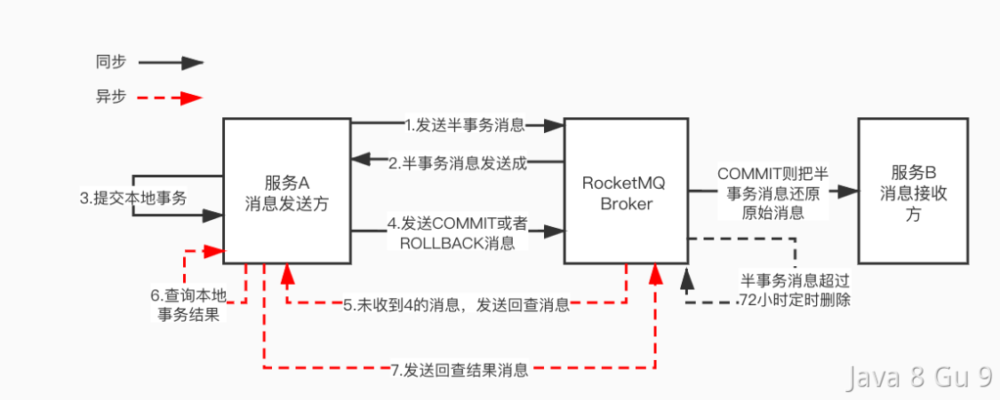

拆解下来的话，主要有以下4个步骤：

1. 发送半消息：应用程序向RocketMQ Broker发送一条半消息，该消息在Broker端的事务消息日志中被标记为“prepared”状态。

2. 执行本地事务：Apache RocketMQ服务端将消息持久化成功之后，向生产者返回Ack确认消息已经发送成功，此时消息被标记为"暂不能投递"，这种状态下的消息即为半事务消息。应用程序继续执行本地事务。

3. 生产者开始执行本地事务逻辑。

4. 生产者根据本地事务执行结果向服务端提交二次确认结果（Commit或是Rollback），服务端收到确认结果后处理逻辑如下：
   
   1. 二次确认结果为Commit：服务端将半事务消息标记为可投递，并投递给消费者。
   
   2. 二次确认结果为Rollback：服务端将回滚事务，不会将半事务消息投递给消费者。

5. 在断网或者是生产者应用重启的特殊情况下，若服务端未收到发送者提交的二次确认结果，或服务端收到的二次确认结果为Unknown未知状态，经过固定时间后，服务端将对消息生产者即生产者集群中任一生产者实例发起消息回查。 **说明** 服务端回查的间隔时间和最大回查次数，请参见[参数限制](https://rocketmq.apache.org/zh/docs/introduction/03limits)。

6. 生产者收到消息回查后，需要检查对应消息的本地事务执行的最终结果。

7. 生产者根据检查到的本地事务的最终状态再次提交二次确认，服务端仍按照步骤4对半事务消息进行处理。

### 事务消息生命周期


- 初始化：半事务消息被生产者构建并完成初始化，待发送到服务端的状态。

- 事务待提交：半事务消息被发送到服务端，和普通消息不同，并不会直接被服务端持久化，而是会被单独存储到事务存储系统中，等待第二阶段本地事务返回执行结果后再提交。此时消息对下游消费者不可见。

- 消息回滚：第二阶段如果事务执行结果明确为回滚，服务端会将半事务消息回滚，该事务消息流程终止。

- 提交待消费：第二阶段如果事务执行结果明确为提交，服务端会将半事务消息重新存储到普通存储系统中，此时消息对下游消费者可见，等待被消费者获取并消费。

- 消费中：消息被消费者获取，并按照消费者本地的业务逻辑进行处理的过程。 此时服务端会等待消费者完成消费并提交消费结果，如果一定时间后没有收到消费者的响应，Apache RocketMQ会对消息进行重试处理。具体信息，请参见[消费重试](https://rocketmq.apache.org/zh/docs/featureBehavior/10consumerretrypolicy)。

- 消费提交：消费者完成消费处理，并向服务端提交消费结果，服务端标记当前消息已经被处理（包括消费成功和失败）。 Apache RocketMQ默认支持保留所有消息，此时消息数据并不会立即被删除，只是逻辑标记已消费。消息在保存时间到期或存储空间不足被删除前，消费者仍然可以回溯消息重新消费。

- 消息删除：Apache RocketMQ按照消息保存机制滚动清理最早的消息数据，将消息从物理文件中删除。更多信息，请参见[消息存储和清理机制](https://rocketmq.apache.org/zh/docs/featureBehavior/11messagestorepolicy)。

### 如果一直没收到COMMIT或者ROLLBACK怎么办？

在RocketMQ的事务消息中，如果半消息发送成功后，RocketMQ Broker在规定时间内没有收到COMMIT或者ROLLBACK消息。

RocketMQ会向应用程序发送一条回查请求，应用程序可以通过回调方法返回是否要提交或回滚该事务消息。如果应用程序在规定时间内未能返回响应，RocketMQ会将该消息标记为“UNKNOW”状态。

在标记为“UNKNOW”状态的事务消息中，如果应用程序有了明确的结果，还可以向MQ发送COMMIT或者ROLLBACK。

但是MQ不会一直等下去，如果过期时间已到，RocketMQ会自动回滚该事务消息，将其从事务消息日志中删除。

### 第一次发送半消息失败了怎么办？

在事务消息的一致性方案中，我们是先发半消息，再做业务操作的。

所以，如果半消息发失败了，那么业务操作就不能真正执行，不会有不一致的问题。

遇到这种情况rollback重试就行了。（可以自己重试，也可以依赖上游重试）

### 为什么要用事务消息？

很多人看完事务消息会有一个疑惑：本地事务执行完成之后再发送普通消息有什么区别？为什么要有事务消息呢？

主要是因为：本地事务执行完成之后再发送普通消息可能会发消息失败。普通消息无法像单机数据库事务一样，具备提交、回滚和统一协调的能力。

一旦发送消息失败了，那么本地事务提交了，但是消息没成功，那么监听者就收不到消息，那么就产生数据不一致了。

那如果用事务消息。先提交一个半消息，然后执行本地事务，再发送一个commit的半消息。如果后面这个commit半消息失败了，MQ是可以基于第一个半消息不断回查来推进状态的。这样只要本地事务提交成功，最终MQ也会成功。如果本地事务rolllback，那么MQ的消息也会rollback。保证了全局提交结果的一致性。

### 使用限制

**消息类型一致性**

事务消息仅支持在 MessageType 为 Transaction 的主题内使用，即事务消息只能发送至类型为事务消息的主题中，发送的消息的类型必须和主题的类型一致。

**消费事务性**

Apache RocketMQ 事务消息保证本地主分支事务和下游消息发送事务的一致性，但不保证消息消费结果和上游事务的一致性。因此需要下游业务分支自行保证消息正确处理，建议消费端做好[消费重试](https://rocketmq.apache.org/zh/docs/featureBehavior/10consumerretrypolicy)，如果有短暂失败可以利用重试机制保证最终处理成功。

**中间状态可见性**

Apache RocketMQ 事务消息为最终一致性，即在消息提交到下游消费端处理完成之前，下游分支和上游事务之间的状态会不一致。因此，事务消息仅适合接受异步执行的事务场景。

**事务超时机制**

Apache RocketMQ 事务消息的生命周期存在超时机制，即半事务消息被生产者发送服务端后，如果在指定时间内服务端无法确认提交或者回滚状态，则消息默认会被回滚。事务超时时间，请参见[参数限制](https://rocketmq.apache.org/zh/docs/introduction/03limits)。

### 使用示例

以Java语言为例，使用事务消息示例参考如下：

```java
    //演示demo，模拟订单表查询服务，用来确认订单事务是否提交成功。
    private static boolean checkOrderById(String orderId) {
        return true;
    }
    //演示demo，模拟本地事务的执行结果。
    private static boolean doLocalTransaction() {
        return true;
    }
    public static void main(String[] args) throws ClientException {
        ClientServiceProvider provider = new ClientServiceProvider();
        MessageBuilder messageBuilder = new MessageBuilderImpl();
        //构造事务生产者：事务消息需要生产者构建一个事务检查器，用于检查确认异常半事务的中间状态。
        Producer producer = provider.newProducerBuilder()
                .setTransactionChecker(messageView -> {
                    /**
                     * 事务检查器一般是根据业务的ID去检查本地事务是否正确提交还是回滚，此处以订单ID属性为例。
                     * 在订单表找到了这个订单，说明本地事务插入订单的操作已经正确提交；如果订单表没有订单，说明本地事务已经回滚。
                     */
                    final String orderId = messageView.getProperties().get("OrderId");
                    if (Strings.isNullOrEmpty(orderId)) {
                        // 错误的消息，直接返回Rollback。
                        return TransactionResolution.ROLLBACK;
                    }
                    return checkOrderById(orderId) ? TransactionResolution.COMMIT : TransactionResolution.ROLLBACK;
                })
                .build();
        //开启事务分支。
        final Transaction transaction;
        try {
            transaction = producer.beginTransaction();
        } catch (ClientException e) {
            e.printStackTrace();
            //事务分支开启失败，直接退出。
            return;
        }
        Message message = messageBuilder.setTopic("topic")
                //设置消息索引键，可根据关键字精确查找某条消息。
                .setKeys("messageKey")
                //设置消息Tag，用于消费端根据指定Tag过滤消息。
                .setTag("messageTag")
                //一般事务消息都会设置一个本地事务关联的唯一ID，用来做本地事务回查的校验。
                .addProperty("OrderId", "xxx")
                //消息体。
                .setBody("messageBody".getBytes())
                .build();
        //发送半事务消息
        final SendReceipt sendReceipt;
        try {
            sendReceipt = producer.send(message, transaction);
        } catch (ClientException e) {
            //半事务消息发送失败，事务可以直接退出并回滚。
            return;
        }
        /**
         * 执行本地事务，并确定本地事务结果。
         * 1. 如果本地事务提交成功，则提交消息事务。
         * 2. 如果本地事务提交失败，则回滚消息事务。
         * 3. 如果本地事务未知异常，则不处理，等待事务消息回查。
         *
         */
        boolean localTransactionOk = doLocalTransaction();
        if (localTransactionOk) {
            try {
                transaction.commit();
            } catch (ClientException e) {
                // 业务可以自身对实时性的要求选择是否重试，如果放弃重试，可以依赖事务消息回查机制进行事务状态的提交。
                e.printStackTrace();
            }
        } else {
            try {
                transaction.rollback();
            } catch (ClientException e) {
                // 建议记录异常信息，回滚异常时可以无需重试，依赖事务消息回查机制进行事务状态的提交。
                e.printStackTrace();
            }
        }
    }
```

### 使用建议

**避免大量未决事务导致超时**

Apache RocketMQ支持在事务提交阶段异常的情况下发起事务回查，保证事务一致性。但生产者应该尽量避免本地事务返回未知结果。大量的事务检查会导致系统性能受损，容易导致事务处理延迟。

**正确处理"进行中"的事务**

消息回查时，对于正在进行中的事务不要返回Rollback或Commit结果，应继续保持Unknown的状态。 一般出现消息回查时事务正在处理的原因为：事务执行较慢，消息回查太快。解决方案如下：

- 将第一次事务回查时间设置较大一些，但可能导致依赖回查的事务提交延迟较大。

- 程序能正确识别正在进行中的事务。

## RocketMQ如何保证消息的顺序性？

和Kafka只支持同一个Partition内消息的顺序性一样，RocketMQ中也提供了基于队列(分区)的顺序消费。即同一个队列内的消息可以做到有序，但是不同队列内的消息是无序的！

当我们作为MQ的生产者需要发送顺序消息时，需要在send方法中，传入一个MessageQueueSelector。

MessageQueueSelector中需要实现一个select方法，这个方法就是用来定义要把消息发送到哪个MessageQueue的，通常可以使用取模法进行路由：

```java
SendResult sendResult = producer.send(msg, new MessageQueueSelector() {
    @Override
      //mqs：该Topic下所有可选的MessageQueue
    //msg：待发送的消息
    //arg：发送消息时传递的参数
    public MessageQueue select(List<MessageQueue> mqs, Message msg, Object arg) {
     Integer id = (Integer) arg;
     //根据参数，计算出一个要接收消息的MessageQueue的下标
     int index = id % mqs.size();
     //返回这个MessageQueue
     return mqs.get(index);
    }
   }, orderId);
```

通过以上形式就可以将需要有序的消息发送到同一个队列中。需要注意的时候，这里需要使用同步发送的方式！

消息按照顺序发送的消息队列中之后，那么，消费者如何按照发送顺序进行消费呢？

RocketMQ的MessageListener回调函数提供了两种消费模式，有序消费模式MessageListenerOrderly和并发消费模式MessageListenerConcurrently。所以，想要实现顺序消费，需要使用MessageListenerOrderly模式接收消息：

```java
consumer.registerMessageListener(new MessageListenerOrderly() {
        Override
        public ConsumeOrderlyStatus consumeMessage(List<MessageExt> msgs ,ConsumeOrderlyContext context) {
             System.out.printf("Receive order msg:" + new String(msgs.get(0).getBody()));
             return ConsumeOrderlyStatus.SUCCESS ; 
        }
});
```

当我们用以上方式注册一个消费之后，为了保证同一个队列中的有序消息可以被顺序消费，就要保证RocketMQ的Broker只会把消息发送到同一个消费者上，这时候就需要加锁了。

在实现中，ConsumeMessageOrderlyService 初始化的时候，会启动一个定时任务，会尝试向 Broker 为当前消费者客户端申请分布式锁。如果获取成功，那么后续消息将会只发给这个Consumer。

接下来在消息拉取的过程中，消费者会一次性拉取多条消息的，并且会将拉取到的消息放入 ProcessQueue，同时将消息提交到消费线程池进行执行。

那么拉取之后的消费过程，怎么保证顺序消费呢？这里就需要更多的锁了。

RocketMQ在消费的过程中，需要申请 MessageQueue 锁，确保在同一时间，一个队列中只有一个线程能处理队列中的消息。

获取到 MessageQueue 的锁后，就可以从ProcessQueue中依次拉取一批消息处理了，但是这个过程中，为了保证消息不会出现重复消费，还需要对ProcessQueue进行加锁。（这个在扩展知识中展开）

然后就可以开始处理业务逻辑了。

总结下来就是三次加锁，先锁定Broker上的MessageQueue，确保消息只会投递到唯一的消费者，对本地的MessageQueue加锁，确保只有一个线程能处理这个消息队列。对存储消息的ProcessQueue加锁，确保在重平衡的过程中不会出现消息的重复消费。

（完整的处理流程大家可以看一下这张图，是极客时间上某个专栏中的内容，虽然专栏中这段文字描述不太容易懂，但是这个图画的还是挺清晰的。）

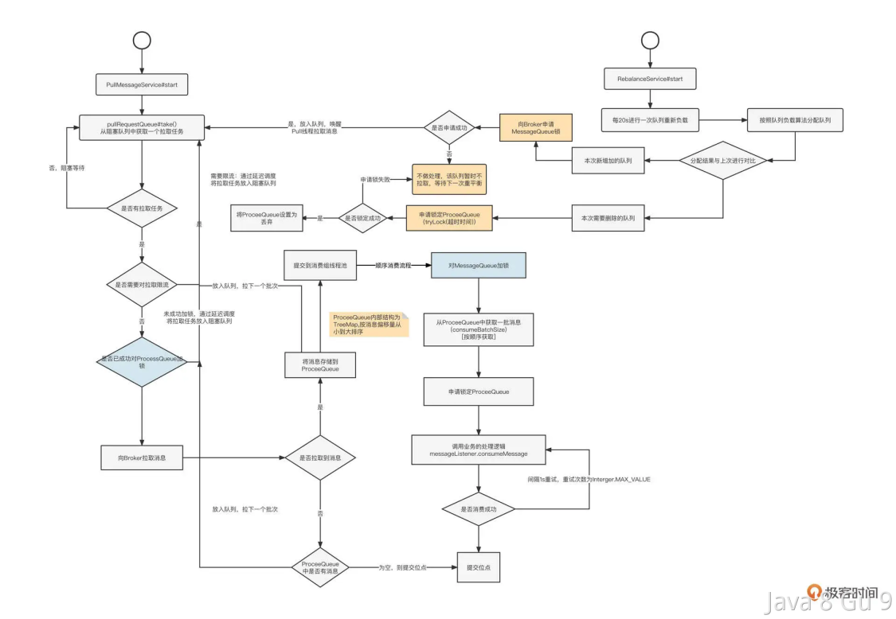

### 第三把锁有什么用？

前面介绍客户端加锁过程中，一共加了三把锁，那么，有没有想过这样一个问题，第三把锁如果不加的话，是不是也没问题？

因为我们已经对MessageQueue加锁了，为啥还需要对ProcessQueue再次加锁呢？

这里其实主要考虑的是重平衡的问题。

当我们的消费者集群，新增了一些消费者，发生重平衡的时候，某个队列可能会原来属于客户端A消费的，但是现在要重新分配给客户端B了。

这时候客户端A就需要把自己加在Broker上的锁解掉，而在这个解锁的过程中，就需要确保消息不能在消费过程中就被移除了，因为如果客户端A可能正在处理一部分消息，但是位点信息还没有提交，如果客户端B立马去消费队列中的消息，那存在一部分数据会被重复消费。

那么如何判断消息是否正在消费中呢，就需要通过这个ProcessQueue上面的锁来判断了，也就是说在解锁的线程也需要尝试对ProcessQueue进行加锁，加锁成功才能进行解锁操作。以避免过程中有消息消费。

### 顺序消费存在的问题

通过上面的介绍，我们知道了RocketMQ的顺序消费是通过在消费者上多次加锁实现的，这种方式带来的问题就是会降低吞吐量，并且如果前面的消息阻塞，会导致更多消息阻塞。所以，顺序消息需要慎用。

## RocketMQ如何保证消息不丢失？

RocketMQ的消息想要确保不丢失，需要生产者、消费者以及Broker的共同努力，缺一不可。

首先在生产者端，消息的发送分为同步和异步两种，在同步发送消息的情况下，消息的发送会同步阻塞等待Broker返回结果，在Broker确认收到消息之后，生产者才会拿到SendResult。如果这个过程中发生异常，那么就说明消息发送可能失败了，就需要生产者进行重新发送消息。

但是Broker其实并不会立即把消息存储到磁盘上，而是先存储到内存中，内存存储成功之后，就返回给确认结果给生产者了。然后再通过异步刷盘的方式将内存中的数据存储到磁盘上。但是这个过程中，如果机器挂了，那么就可能会导致数据丢失。

如果想要保证消息不丢失，可以将消息保存机制修改为同步刷盘，这样，Broker会在同步请求中把数据保存在磁盘上，确保保存成功后再返回确认结果给生产者。

```properties
## 默认情况为 ASYNC_FLUSH 
flushDiskType = SYNC_FLUSH 
```

除了同步发送消息，还有异步发送，异步发送的话就需要生产者重写SendCallback的onSuccess和onException方法，用于给Broker进行回调。在方法中实现消息的确认或者重新发送。

为了保证消息不丢失，RocketMQ肯定要通过集群方式进行部署，Broker 通常采用一主多从部署方式，并且采用主从同步的方式做数据复制。

当主Broker宕机时，从Broker会接管主Broker的工作，保证消息不丢失。同时，RocketMQ的Broker还可以配置多个实例，消息会在多个Broker之间进行冗余备份，从而保证数据的可靠性。

默认方式下，Broker在接收消息后，写入 master 成功，就可以返回确认响应给生产者了，接着消息将会异步复制到 slave 节点。但是如果这个过程中，Master的磁盘损坏了。那就会导致数据丢失了。

如果想要解决这个问题，可以配置同步复制的方式，即Master在将数据同步到Slave节点后，再返回给生产者确认结果。

```properties
## 默认为 ASYNC_MASTER
brokerRole=SYNC_MASTER
```

在消费者端，需要确保在消息拉取并消费成功之后再给Broker返回ACK，就可以保证消息不丢失了，如果这个过程中Broker一直没收到ACK，那么就可以重试。

所以，在消费者的代码中，一定要在业务逻辑的最后一步`return ConsumeConcurrentlyStatus.CONSUME_SUCCESS; `当然，也可以先把数据保存在数据库中，就返回，然后自己再慢慢处理。

但是，需要注意的是RocketMQ和Kafka一样，只能最大限度的保证消息不丢失，但是没办法做到100%保证不丢失。

## RocketMQ如何实现延时消息？

RocketMQ是支持延迟消息的，延迟消息写入到Broker后，不会立刻被消费者消费，需要等待指定的时长后才可被消费处理的消息，称为延时消息。

当消息发送到Broker后，Broker会将消息根据延迟级别进行存储。RocketMQ的延迟消息实现方式是：将消息先存储在内存中，然后使用Timer定时器进行消息的延迟，到达指定的时间后再存储到磁盘中，最后投递给消费者。

但是，RocketMQ的延迟消息并不是支持任意时长的延迟的，它只支持（5.0之前）：1s 5s 10s 30s 1m 2m 3m 4m 5m 6m 7m 8m 9m 10m 20m 30m 1h 2h这几个时长。

另外，RocketMQ 5.0中新增了基于时间轮实现的定时消息。

前面提到的延迟消息，并使用Timer定时器来实现延迟投递。但是，由于Timer定时器有一定的缺陷，比如在定时器中有大量任务时，会导致定时器的性能下降，从而影响消息投递。

因此，在RocketMQ 5.0中，采用了一种新的实现方式：基于时间轮的定时消息。时间轮是一种高效的定时器算法，能够处理大量的定时任务，并且能够在O(1)时间内找到下一个即将要执行的任务，因此能够提高消息的投递性能。

并且，基于时间轮的定时消息能够支持更高的消息精度，可以实现秒级、毫秒级甚至更小时间粒度的定时消息。

具体实现方式如下：

1. RocketMQ在Broker端使用一个时间轮来管理定时消息，将消息按照过期时间放置在不同的槽位中，这样可以大幅减少定时器任务的数量。

2. 时间轮的每个槽位对应一个时间间隔，比如1秒、5秒、10秒等，每次时间轮的滴答，槽位向前移动一个时间间隔。

3. 当Broker接收到定时消息时，根据消息的过期时间计算出需要投递的槽位，并将消息放置到对应的槽位中。

4. 当时间轮的滴答到达消息的过期时间时，时间轮会将该槽位中的所有消息投递给消费者。

使用方式：

```java
//创建一个消息生产者
DefaultMQProducer producer = new DefaultMQProducer("ProducerGroupName");
producer.setNamesrvAddr("localhost:9876");
producer.start();

Message message = new Message("TopicTest", "TagA", "Hello RocketMQ".getBytes(RemotingHelper.DEFAULT_CHARSET));
// 设置消息的延迟级别为3，即延迟10s
message.setDelayTimeLevel(3);

// 消息发送
SendResult sendResult = producer.send(message);
System.out.printf("%s%n", sendResult);
```

## RocketMQ有几种集群方式？

3种，分别是单Master模式、多Master模式以及多Master多Slave模式。

单Master集群，这是一种最简单的集群方式，只包含一个Master节点和若干个Slave节点。所有的写入操作都由Master节点负责处理，Slave节点主要用于提供读取服务。当Master节点宕机时，集群将无法继续工作。

多Master集群：这种集群方式包含多个Master节点，不部署Slave节点。这种方式的优点是配置简单，单个Master宕机或重启维护对应用无影响，在磁盘配置为RAID10时，即使机器宕机不可恢复情况下，由于RAID10磁盘非常可靠，消息也不会丢（异步刷盘丢失少量消息，同步刷盘一条不丢），性能最高；缺点是单台机器宕机期间，这台机器上未被消费的消息在机器恢复之前不可订阅，消息实时性会受到影响。

多Master多Slave集群：这种集群方式包含多个Master节点和多个Slave节点。每个Master节点都可以处理写入操作，并且有自己的一组Slave节点。当其中一个Master节点宕机时，消费者仍然可以从Slave消费。优点是数据与服务都无单点故障，Master宕机情况下，消息无延迟，服务可用性与数据可用性都非常高；缺点是性能比异步复制模式略低（大约低10%左右），发送单个消息的RT会略高，且目前版本在主节点宕机后，备机不能自动切换为主机。

## RocketMQ消息堆积了怎么解决？

RocketMQ的消息堆积，一般都是因为客户端本地消费过程中，由于消费耗时过长或消费并发度较小等原因，导致客户端消费能力不足，出现消息堆积的问题。

当线上出现消息堆积的问题时，一般有以下几种方式来解决：

1. 增加消费者数量：消息堆积了，消费不过来了，那就把消费者的数量增加一下，让更多人的实例来消费这些消息。

2. 提升消费者消费速度：消费者消费的慢可能是消息堆积的主要原因，想办法提升消费速度，比如引入线程池、本地消息存储后即返回成功后续再慢慢消费等。

3. 降低生产者的生产速度：如果生产者可控的话，可以让生产者生成消息的速度慢一点。

4. 清理过期消息：有一些过期消息、或者一直无法成功的消息，在业务做评估之后，如果无影响或者影响不大，其实是可以清理的。

5. 调整 RocketMQ 的配置参数：RocketMQ 提供了很多可配置的参数，例如消息消费模式、消息拉取间隔时间等，可以根据实际情况来调整这些参数，从而优化消息消费的效率。

6. 增加 Topic 队列数：如果一个 Topic 的队列数比较少，那么就容易出现消息堆积的情况。可以通过增加队列数来提高消息的处理并发度，从而减少消息堆积。

## RocketMQ消费堆积问题排查

负责的业务中有一个应用因为特殊原因，需要修改消息配置（将Spring Cloud Stream 改为 RocketMQ native），修改前和修改后的配置项如下：

```properties
spring.cloud.stream.bindings.consumerA.group=CID_CONSUMER_A
spring.cloud.stream.bindings.consumerA.contentType=text/plain
spring.cloud.stream.bindings.consumerA.destination=CONSUMER_A_TOPIC
spring.cloud.stream.rocketmq.bindings.consumerA.consumer.tags=CONSUMER_A_TOPIC_TAG

spring.cloud.stream.bindings.consumerB.group=CID_CONSUMER_A
spring.cloud.stream.bindings.consumerB.contentType=text/plain
spring.cloud.stream.bindings.consumerB.destination=CONSUMER_B_TOPIC
spring.cloud.stream.rocketmq.bindings.consumerB.consumer.tags=CONSUMER_B_TOPIC_TAG

spring.cloud.stream.bindings.consumerC.group=CID_CONSUMER_A
spring.cloud.stream.bindings.consumerC.contentType=text/plain
spring.cloud.stream.bindings.consumerC.destination=CONSUMER_C_TOPIC
spring.cloud.stream.rocketmq.bindings.consumerC.consumer.tags=CONSUMER_C_TOPIC_TAG
```

修改后：

```properties
spring.rocketmq.consumers[0].consumer-group=CID_CONSUMER_A
spring.rocketmq.consumers[0].topic=CONSUMER_A_TOPIC
spring.rocketmq.consumers[0].sub-expression=CONSUMER_A_TOPIC_TAG
spring.rocketmq.consumers[0].message-listener-ref=consumerAListener

spring.cloud.stream.bindings.consumerB.group=CID_CONSUMER_A
spring.cloud.stream.bindings.consumerB.contentType=text/plain
spring.cloud.stream.bindings.consumerB.destination=CONSUMER_B_TOPIC
spring.cloud.stream.rocketmq.bindings.consumerB.consumer.tags=CONSUMER_B_TOPIC_TAG

spring.cloud.stream.bindings.consumerC.group=CID_CONSUMER_A
spring.cloud.stream.bindings.consumerC.contentType=text/plain
spring.cloud.stream.bindings.consumerC.destination=CONSUMER_C_TOPIC
spring.cloud.stream.rocketmq.bindings.consumerC.consumer.tags=CONSUMER_C_TOPIC_TAG
```

但是当机器发布一半后开始灰度观察的时候，出现了消息堆积问题。

### 问题原因

#### 消息订阅关系不一致

经过历史经验和踩坑，感觉有可能是订阅组机器订阅关系不一致导致的消息堆积问题（因为订阅组的机器有的订阅关系是A，有的是B，MQ不能确定是否要消费，就能只能先堆积到broker中），查看MQ控制台后发现，确实是消息订阅关系不一致，导致消息堆积。

#### Spring Cloud Stream 和 RocketMQ Native

所以就引申出了一个问题，为什么将Spring Cloud Stream修改为原生的MetaQ之后，同一个ConsumerId对应的订阅关系就会改变呢？

更简单来说，就是为什么当RocketMQ和Spring Cloud Stream 使用相同的ConsumerId之后，RocketMQ的订阅关系会把Spring Cloud Stream的订阅关系给冲掉呢？

> 注意，一个consumerId是可以订阅多个topic的

这个时候就只能翻Spring Cloud Stream 和 RocketMQ 的启动源码来解答疑惑。

##### RocketMQ

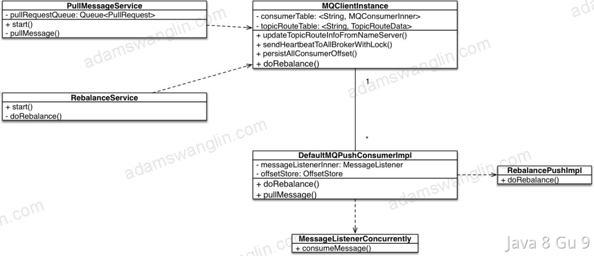

- MQConsumerInner：记录当前consumerGroup和服务端的交互方式，以及topic和tag的映射关系。默认的实现是DefaultMQPushConsumerImpl，和consumerGroup的对应关系是1 : 1

- MQClientInstance：统一管理网络链接等可以复用的对象，通过Map维护了ConsumerGroupId和MQConsumerInner的映射关系。简单来说，就是一个ConsumerGroup，只能对应一个MQConsumerInner，如下代码所示：

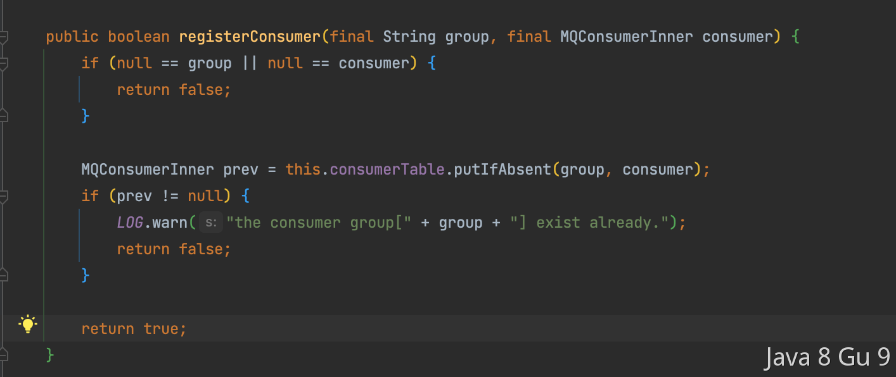

##### Spring Cloud Stream

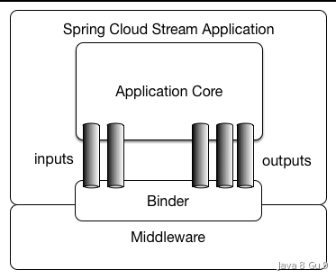

Spring Cloud Stream是连接Spring和中间件的一个胶水层，在Spring Cloud Stream启动的时候，也会注册一个ConsumerGroup，如下代码所示：

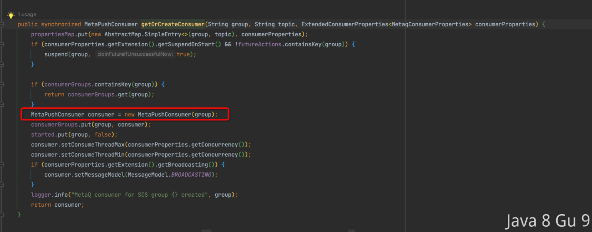

### 问题根因

分析到这里，原因就已经很明显了。Spring Cloud Stream会在启动的时候自己new一个MetaPushConsumer（事实上就是一个新的MQConsumerInner），所以对于一个ConsumerGroup来说，就存在了两个MQConsumerInner，这显然是不符合RocketMQ要求的1:1的映射关系的，所以RocketMQ默认会用新的映射代替老的映射关系。显然，Spring Cloud Stream的被RocketMQ原生的给替代掉了。
这也就是为什么已经发布的机器中，对于ConsumerA来说，只剩下RocketMQ原生的那组订阅关系了。

### 解决思路

修改consumerId

```properties
spring.rocketmq.consumers[0].consumer-group=CID_CONSUMER_A
spring.rocketmq.consumers[0].topic=CONSUMER_A_TOPIC
spring.rocketmq.consumers[0].sub-expression=CONSUMER_A_TOPIC_TAG
spring.rocketmq.consumers[0].message-listener-ref=consumerAListener

spring.cloud.stream.bindings.consumerB.group=CID_CONSUMER_B
spring.cloud.stream.bindings.consumerB.contentType=text/plain
spring.cloud.stream.bindings.consumerB.destination=CONSUMER_B_TOPIC
spring.cloud.stream.rocketmq.bindings.consumerB.consumer.tags=CONSUMER_B_TOPIC_TAG

spring.cloud.stream.bindings.consumerC.group=CID_CONSUMER_B
spring.cloud.stream.bindings.consumerC.contentType=text/plain
spring.cloud.stream.bindings.consumerC.destination=CONSUMER_C_TOPIC
spring.cloud.stream.rocketmq.bindings.consumerC.consumer.tags=CONSUMER_C_TOPIC_TAG
```

### 思考和总结

问题原因并不复杂，但是很多人可能分析到第一层（订阅关系不一致导致消费堆积）就不会再往下分析了，但是我们还需要有更深入的探索精神的。生产环境中尽量不要搞两套配置项，会额外增加理解成本。。。

## 介绍一下RocketMQ的工作流程？

RocketMQ中有这样几个角色：NameServer、Broker、Producer和Consumer。

NameServer：NameServer是RocketMQ的路由和寻址中心，它维护了Broker和Topic的路由信息，提供了Producer和Consumer与正确的Broker建立连接的能力。NameServer还负责监控Broker的状态，并提供自动发现和故障恢复的功能。

Broker：Broker是RocketMQ的核心组件，负责存储、传输和路由消息。它接收Producer发送的消息，并将其存储在内部存储中。并且还负责处理Consumer的订阅请求，将消息推送给订阅了相应Topic的Consumer。

Producer（消息生产者）：Producer是消息的生产者，用于将消息发送到RocketMQ系统。

Consumer（消息消费者）：Consumer是消息的消费者，用于从RocketMQ系统中订阅和消费消息。

RocketMQ的工作过程大致如下：

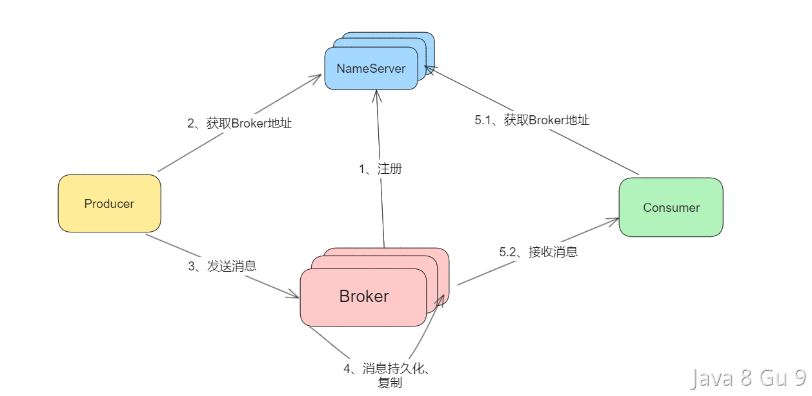

1. 启动NameServer，他会等待Broker、Producer以及Consumer的链接。

2. 启动Broker，会和NameServer建立连接，定时发送心跳包。心跳包中包含当前Broker信息(ip、port等)、Topic信息以及Borker与Topic的映射关系。

3. 启动Producer，启动时先随机和NameServer集群中的一台建立长连接，并从NameServer中获取当前发送的Topic所在的所有Broker的地址；然后从队列列表中轮询选择一个队列，与队列所在的Broker建立长连接，进行消息的发送。

4. Broker接收Producer发送的消息，当配置为同步复制时，master需要先将消息复制到slave节点，然后再返回“写成功状态”响应给生产者；当配置为同步刷盘时，则还需要将消息写入磁盘中，再返回“写成功状态”；要是配置的是异步刷盘和异步复制，则消息只要发送到master节点，就直接返回“写成功”状态。

5. 启动Consumer，过程和Producer类似，先随机和一台NameServer建立连接，获取订阅信息，然后在和需要订阅的Broker建立连接，获取消息。

## RocketMQ怎么实现消息分发的？

RocketMQ 支持两种消息模式：广播消费（ Broadcasting ）和集群消费（ Clustering ）。

广播消费：当使用广播消费模式时，RocketMQ 会将每条消息推送给集群内所有的消费者，保证消息至少被每个消费者消费一次。


广播模式下，RocketMQ 保证消息至少被客户端消费一次，但是并不会重投消费失败的消息，因此业务方需要关注消费失败的情况。并且，客户端每一次重启都会从最新消息消费。客户端在被停止期间发送至服务端的消息将会被自动跳过。

集群消费：当使用集群消费模式时，RocketMQ 认为任意一条消息只需要被集群内的任意一个消费者处理即可。

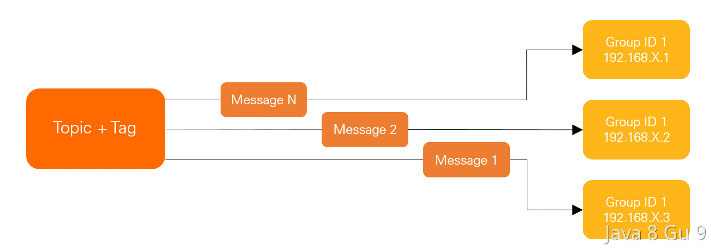

集群模式下，每一条消息都只会被分发到一台机器上处理。但是不保证每一次失败重投的消息路由到同一台机器上。一般来说，用集群消费的更多一些。

通过设置MessageModel可以调整消费方式：

```java
// MessageModel设置为CLUSTERING（不设置的情况下，默认为集群订阅方式）。
properties.put(PropertyKeyConst.MessageModel, PropertyValueConst.CLUSTERING);

// MessageModel设置为BROADCASTING。
properties.put(PropertyKeyConst.MessageModel, PropertyValueConst.BROADCASTING); 
```

## 消息队列使用拉模式好还是推模式好？为什么？

推和拉是两种消息传递的方式。

推的模式就消费者端和消息中间件建立TCP长链接或者注册一个回调，当服务端数据发生变化，立即通过这个已经建立好的长连接（或者注册好的回调）将数据推送到客户端。

拉的模式就是消费者轮询，通过不断轮询的方式检查数据是否发生变化，变化的话就把数据拉回来。

如果使用拉的模式来实现消息队列的话，消费者可以完全自己掌控消息的数量及速度，这样可以大大的避免消息堆积的情况。但是，这种方案也有缺点，首先就是消费者需要不断的进行轮询，这种轮询也会对消息中间件造成一定的压力。

如果使用推的模式来实现，好处就是消息是实时的， 一旦有消息过来消费者马上就能感知到。而且对于消费者来说也比较简单，不需要轮询，只需要等推送就行了。但是缺点也比较明显，那就是如果消息的生产速度大于消费速度，可能会导致消息大量堆积在消费者端，会对消费者造成很大的压力，甚至可能把消费者压垮。

一般来说，推的模式适合实时性要求比较高的场景。而拉的模式适合实时性要求没那么高的场景。

还有需要注意的就是，在有些生产环境下，服务器环境只能单向通信，也就是只能通过一端访问另外一端，而不能在反方向通信，此时就需要消费方，使用拉模式，推模式是长链接，是双向通信，所以不行。

在很多中间件的实现上，可能并没有在直接用长连接或者轮询，而是把二者结合了一下，使用长轮询的方式进行拉消息的。

### 长轮询

长轮询，就是消费者向消息中间件发起一个长轮询请求，消息中间件如果有消息就直接返回，如果没有也不会立即断开连接，而是等待一会，等待过程中如果有新消息到达，再把消息返回。如果超时还没有消息，那就结束了，等下次长轮询。

比如Kafka和RocketMQ都是支持基于长轮询进行拉取消息的。

## RocketMQ的消息是推还是拉？

MQ的消费模式可以大致分为两种，一种是推Push，一种是拉Pull。

Push是服务端主动推送消息给客户端，Pull是客户端需要主动到服务端轮询获取数据。

他们各自有各自的优缺点，推优点是及时性较好，但如果客户端没有做好流控，一旦服务端推送大量消息到客户端时，就会导致客户端消息堆积甚至崩溃。

拉优点是客户端可以依据自己的消费能力进行消费，但是频繁拉取会给服务端造成压力，并且可能会导致消息消费不及时。

RocketMQ既提供了Push模式也提供了Pull模式，开发者可以自行选择，主要有两个Consumer可以供开发者选择：

```java
public class DefaultMQPullConsumer extends ClientConfig implements MQPullConsumer {

// https://github.com/apache/rocketmq/blob/develop/client/src/main/java/org/apache/rocketmq/client/consumer/DefaultMQPullConsumer.java
}

public class DefaultMQPushConsumer extends ClientConfig implements MQPushConsumer {

//https://github.com/apache/rocketmq/blob/develop/client/src/main/java/org/apache/rocketmq/client/consumer/DefaultMQPushConsumer.java
}
```

其中DefaultMQPullConsumer已经不建议使用了，建议使用DefaultLitePullConsumer。Lite Pull Consumer是RocketMQ 4.6.0推出的Pull Consumer，相比于原始的Pull Consumer更加简单易用，它提供了Subscribe和Assign两种模式。

```java
/**
 * @deprecated Default pulling consumer. This class will be removed in 2022, and a better implementation {@link
 * DefaultLitePullConsumer} is recommend to use in the scenario of actively pulling messages.
 */
```

但是，我们需要注意的是，RocketMQ的push模式其实底层的实现还是基于pull实现的，只不过他把pull给封装的比较好，让你以为是在push。

其实RocketMQ的push就是通过长轮询来实现的。

以下是关于RocketMQ中实现长轮询的代码（基于5.1.4），关键入口PullMessageProcessor的processRequest方法的部分代码：

```java
if (this.brokerController.getMessageStore() instanceof DefaultMessageStore) {
    DefaultMessageStore defaultMessageStore = (DefaultMessageStore)this.brokerController.getMessageStore();
    boolean cgNeedColdDataFlowCtr = brokerController.getColdDataCgCtrService().isCgNeedColdDataFlowCtr(requestHeader.getConsumerGroup());
    if (cgNeedColdDataFlowCtr) {
        boolean isMsgLogicCold = defaultMessageStore.getCommitLog()
            .getColdDataCheckService().isMsgInColdArea(requestHeader.getConsumerGroup(),
                requestHeader.getTopic(), requestHeader.getQueueId(), requestHeader.getQueueOffset());
        if (isMsgLogicCold) {
            ConsumeType consumeType = this.brokerController.getConsumerManager().getConsumerGroupInfo(requestHeader.getConsumerGroup()).getConsumeType();
            if (consumeType == ConsumeType.CONSUME_PASSIVELY) {
                response.setCode(ResponseCode.SYSTEM_BUSY);
                response.setRemark("This consumer group is reading cold data. It has been flow control");
                return response;
            } else if (consumeType == ConsumeType.CONSUME_ACTIVELY) {
                if (brokerAllowFlowCtrSuspend) {  // second arrived, which will not be held
                    PullRequest pullRequest = new PullRequest(request, channel, 1000,
                        this.brokerController.getMessageStore().now(), requestHeader.getQueueOffset(), subscriptionData, messageFilter);
                    this.brokerController.getColdDataPullRequestHoldService().suspendColdDataReadRequest(pullRequest);
                    return null;
                }
                requestHeader.setMaxMsgNums(1);
            }
        }
    }
}
```

其中这部分代码，就是通过创建一个轮询任务。

```java
PullRequest pullRequest = new PullRequest(request, channel, 1000,
                        this.brokerController.getMessageStore().now(), requestHeader.getQueueOffset(), subscriptionData, messageFilter);
this.brokerController.getColdDataPullRequestHoldService().suspendColdDataReadRequest(pullRequest);
```

[ColdDataPullRequestHoldService](https://github.com/apache/rocketmq/blob/develop/broker/src/main/java/org/apache/rocketmq/broker/coldctr/ColdDataPullRequestHoldService.java) （[PullRequestHoldService](https://github.com/apache/rocketmq/blob/develop/broker/src/main/java/org/apache/rocketmq/broker/longpolling/PullRequestHoldService.java)）是一个子线程，他的run方法如下：

```java
@Override
public void run() {
    // 记录服务启动信息
    log.info("{} service started", this.getServiceName());

    // 在服务未停止的情况下循环执行以下逻辑
    while (!this.isStopped()) {
        try {
            // 根据配置决定等待的时长，控制数据流量
            if (!this.brokerController.getMessageStoreConfig().isColdDataFlowControlEnable()) {
                this.waitForRunning(20 * 1000); // 不启用冷数据流量控制时等待 20 秒
            } else {
                this.waitForRunning(5 * 1000);  // 启用冷数据流量控制时等待 5 秒
            }

            // 记录当前时间戳以计算处理时间
            long beginClockTimestamp = this.systemClock.now();

            // 执行检查数据并拉取的逻辑
            this.checkColdDataPullRequest();

            // 计算处理所花费的时间
            long costTime = this.systemClock.now() - beginClockTimestamp;

            // 记录处理耗时，并根据情况标记为 "NOTIFYME" 或 "OK"
            log.info("[{}] checkColdDataPullRequest-cost {} ms.", costTime > 5 * 1000 ? "NOTIFYME" : "OK", costTime);

        } catch (Throwable e) {
            // 记录异常信息，但不中断循环
            log.warn(this.getServiceName() + " service has exception", e);
        }
    }

    // 记录服务结束信息
    log.info("{} service end", this.getServiceName());
}
```

就是说，每隔一段时间（5秒或者20秒），执行一次数据拉取checkColdDataPullRequest，看下这个方法的具体实现：

```java
/**
 * 检查数据并拉取
 */
private void checkColdDataPullRequest() {
    int succTotal = 0, errorTotal = 0;
    int queueSize = pullRequestColdHoldQueue.size();

    // 使用迭代器遍历冷数据拉取请求队列
    Iterator<PullRequest> iterator = pullRequestColdHoldQueue.iterator();
    while (iterator.hasNext()) {
        PullRequest pullRequest = iterator.next();

        // 判断是否超过了冷数据拉取的超时时间
        if (System.currentTimeMillis() >= pullRequest.getSuspendTimestamp() + coldHoldTimeoutMillis) {
            try {
                // 向请求中添加标记表明不需要挂起
                pullRequest.getRequestCommand().addExtField(NO_SUSPEND_KEY, "1");

                // 使用消息处理器执行请求，唤醒客户端进行消息拉取
                this.brokerController.getPullMessageProcessor().executeRequestWhenWakeup(
                    pullRequest.getClientChannel(), pullRequest.getRequestCommand());
                succTotal++;
            } catch (Exception e) {
                // 记录异常信息
                log.error("PullRequestColdHoldService checkColdDataPullRequest error", e);
                errorTotal++;
            }

            // 从迭代器中移除已处理的请求
            iterator.remove();
        }
    }

    // 记录处理结果的日志信息
    log.info("checkColdPullRequest-info-finish, queueSize: {} successTotal: {} errorTotal: {}",
        queueSize, succTotal, errorTotal);
}
```

### 用法

以下实例来自RocketMQ官网：[https://rocketmq.apache.org/](https://rocketmq.apache.org/)

#### Push模式

```java
public class Consumer {
  public static void main(String[] args) throws InterruptedException, MQClientException {
    // 初始化consumer，并设置consumer group name
    DefaultMQPushConsumer consumer = new DefaultMQPushConsumer("please_rename_unique_group_name");

    // 设置NameServer地址 
    consumer.setNamesrvAddr("localhost:9876");
    //订阅一个或多个topic，并指定tag过滤条件，这里指定*表示接收所有tag的消息
    consumer.subscribe("TopicTest", "*");
    //注册回调接口来处理从Broker中收到的消息
    consumer.registerMessageListener(new MessageListenerConcurrently() {
      @Override
      public ConsumeConcurrentlyStatus consumeMessage(List<MessageExt> msgs, ConsumeConcurrentlyContext context) {
        System.out.printf("%s Receive New Messages: %s %n", Thread.currentThread().getName(), msgs);
        // 返回消息消费状态，ConsumeConcurrentlyStatus.CONSUME_SUCCESS为消费成功
        return ConsumeConcurrentlyStatus.CONSUME_SUCCESS;
      }
    });
    // 启动Consumer
    consumer.start();
    System.out.printf("Consumer Started.%n");
  }
}
```

#### Pull模式

```java
public class PullConsumerTest {
  public static void main(String[] args) throws MQClientException {
    DefaultMQPullConsumer consumer = new DefaultMQPullConsumer("please_rename_unique_group_name_5");
    consumer.setNamesrvAddr("127.0.0.1:9876");
    consumer.start();
    try {
      MessageQueue mq = new MessageQueue();
      mq.setQueueId(0);
      mq.setTopic("TopicTest");
      mq.setBrokerName("jinrongtong-MacBook-Pro.local");
      long offset = 26;
      PullResult pullResult = consumer.pull(mq, "*", offset, 32);
      if (pullResult.getPullStatus().equals(PullStatus.FOUND)) {
        System.out.printf("%s%n", pullResult.getMsgFoundList());
        consumer.updateConsumeOffset(mq, pullResult.getNextBeginOffset());
      }
    } catch (Exception e) {
      e.printStackTrace();
    }
    consumer.shutdown();
  }
}
```

```java
public class LitePullConsumerSubscribe {
    public static volatile boolean running = true;
    public static void main(String[] args) throws Exception {
        DefaultLitePullConsumer litePullConsumer = new DefaultLitePullConsumer("lite_pull_consumer_test");
        litePullConsumer.subscribe("TopicTest", "*");
        litePullConsumer.setPullBatchSize(20);
        litePullConsumer.start();
        try {
            while (running) {
                List<MessageExt> messageExts = litePullConsumer.poll();
                System.out.printf("%s%n", messageExts);
            }
        } finally {
            litePullConsumer.shutdown();
        }
    }
}
```

## RabbitMQ如何实现延迟消息？

RabbitMQ中是可以实现延迟消息的，一般有两种方式，分别是通过死信队列以及通过延迟消息插件来实现。

### 死信队列

当RabbitMQ中的一条正常的消息，因为过了存活时间（TTL过期）、队列长度超限、被消费者拒绝等原因无法被消费时，就会变成Dead Message，即死信。

当一个消息变成死信之后，他就能被重新发送到死信队列中（其实是交换机-exchange）。

那么基于这样的机制，就可以实现延迟消息了。那就是我们给一个消息设定TTL，但是并不消费这个消息，等他过期，过期后就会进入到死信队列，然后我们再监听死信队列的消息消费就行了。

而且，RabbitMQ中的这个TTL是可以设置任意时长的，这相比于RocketMQ只支持一些固定的时长而显得更加灵活一些。

但是，死信队列的实现方式存在一个问题，那就是可能造成队头阻塞，因为队列是先进先出的，而且每次只会判断队头的消息是否过期，那么，如果队头的消息时间很长，一直都不过期，那么就会阻塞整个队列，这时候即使排在他后面的消息过期了，那么也会被一直阻塞。

基于RabbitMQ的死信队列，可以实现延迟消息，非常灵活的实现定时关单，并且借助RabbitMQ的集群扩展性，可以实现高可用，以及处理大并发量。他的缺点第一是可能存在消息阻塞的问题，还有就是方案比较复杂，不仅要依赖RabbitMQ，而且还需要声明很多队列出来，增加系统的复杂度

#### 如何使用死信队列

使用死信队列大致分为几步：

1. 配置业务队列，绑定到业务交换机上

2. 为业务队列配置死信交换机和路由key

3. 为死信交换机配置死信队列

注意，并不是直接声明一个公共的死信队列，然后所以死信消息就自己跑到死信队列里去了。而是为每个需要使用死信的业务队列配置一个死信交换机，这里同一个项目的死信交换机可以共用一个，然后为每个业务队列分配一个单独的路由key。

有了死信交换机和路由key后，接下来，就像配置业务队列一样，配置死信队列，然后绑定在死信交换机上。也就是说，死信队列并不是什么特殊的队列，只不过是绑定在死信交换机上的队列。死信交换机也不是什么特殊的交换机，只不过是用来接受死信的交换机，所以可以为任何类型【Direct、Fanout、Topic】。一般来说，会为每个业务队列分配一个独有的路由key，并对应的配置一个死信队列进行监听，也就是说，一般会为每个重要的业务队列配置一个死信队列。

有了前文这些陈述后，接下来就是惊险刺激的实战环节，这里省略了RabbitMQ环境的部署和搭建环节。

先创建一个Springboot项目。然后在pom文件中添加 `spring-boot-starter-amqp` 和 `spring-boot-starter-web` 的依赖，接下来创建一个Config类，这里是关键：

```java
@Configuration
public class RabbitMQConfig {

    public static final String BUSINESS_EXCHANGE_NAME = "dead.letter.demo.simple.business.exchange";
    public static final String BUSINESS_QUEUEA_NAME = "dead.letter.demo.simple.business.queuea";
    public static final String BUSINESS_QUEUEB_NAME = "dead.letter.demo.simple.business.queueb";
    public static final String DEAD_LETTER_EXCHANGE = "dead.letter.demo.simple.deadletter.exchange";
    public static final String DEAD_LETTER_QUEUEA_ROUTING_KEY = "dead.letter.demo.simple.deadletter.queuea.routingkey";
    public static final String DEAD_LETTER_QUEUEB_ROUTING_KEY = "dead.letter.demo.simple.deadletter.queueb.routingkey";
    public static final String DEAD_LETTER_QUEUEA_NAME = "dead.letter.demo.simple.deadletter.queuea";
    public static final String DEAD_LETTER_QUEUEB_NAME = "dead.letter.demo.simple.deadletter.queueb";

    // 声明业务Exchange
    @Bean("businessExchange")
    public FanoutExchange businessExchange(){
        return new FanoutExchange(BUSINESS_EXCHANGE_NAME);
    }

    // 声明死信Exchange
    @Bean("deadLetterExchange")
    public DirectExchange deadLetterExchange(){
        return new DirectExchange(DEAD_LETTER_EXCHANGE);
    }

    // 声明业务队列A
    @Bean("businessQueueA")
    public Queue businessQueueA(){
        Map<String, Object> args = new HashMap<>(2);
//       x-dead-letter-exchange    这里声明当前队列绑定的死信交换机
        args.put("x-dead-letter-exchange", DEAD_LETTER_EXCHANGE);
//       x-dead-letter-routing-key  这里声明当前队列的死信路由key
        args.put("x-dead-letter-routing-key", DEAD_LETTER_QUEUEA_ROUTING_KEY);
        return QueueBuilder.durable(BUSINESS_QUEUEA_NAME).withArguments(args).build();
    }

    // 声明业务队列B
    @Bean("businessQueueB")
    public Queue businessQueueB(){
        Map<String, Object> args = new HashMap<>(2);
//       x-dead-letter-exchange    这里声明当前队列绑定的死信交换机
        args.put("x-dead-letter-exchange", DEAD_LETTER_EXCHANGE);
//       x-dead-letter-routing-key  这里声明当前队列的死信路由key
        args.put("x-dead-letter-routing-key", DEAD_LETTER_QUEUEB_ROUTING_KEY);
        return QueueBuilder.durable(BUSINESS_QUEUEB_NAME).withArguments(args).build();
    }

    // 声明死信队列A
    @Bean("deadLetterQueueA")
    public Queue deadLetterQueueA(){
        return new Queue(DEAD_LETTER_QUEUEA_NAME);
    }

    // 声明死信队列B
    @Bean("deadLetterQueueB")
    public Queue deadLetterQueueB(){
        return new Queue(DEAD_LETTER_QUEUEB_NAME);
    }

    // 声明业务队列A绑定关系
    @Bean
    public Binding businessBindingA(@Qualifier("businessQueueA") Queue queue,
                                    @Qualifier("businessExchange") FanoutExchange exchange){
        return BindingBuilder.bind(queue).to(exchange);
    }

    // 声明业务队列B绑定关系
    @Bean
    public Binding businessBindingB(@Qualifier("businessQueueB") Queue queue,
                                    @Qualifier("businessExchange") FanoutExchange exchange){
        return BindingBuilder.bind(queue).to(exchange);
    }

    // 声明死信队列A绑定关系
    @Bean
    public Binding deadLetterBindingA(@Qualifier("deadLetterQueueA") Queue queue,
                                    @Qualifier("deadLetterExchange") DirectExchange exchange){
        return BindingBuilder.bind(queue).to(exchange).with(DEAD_LETTER_QUEUEA_ROUTING_KEY);
    }

    // 声明死信队列B绑定关系
    @Bean
    public Binding deadLetterBindingB(@Qualifier("deadLetterQueueB") Queue queue,
                                      @Qualifier("deadLetterExchange") DirectExchange exchange){
        return BindingBuilder.bind(queue).to(exchange).with(DEAD_LETTER_QUEUEB_ROUTING_KEY);
    }
}
```

这里声明了两个Exchange，一个是业务Exchange，另一个是死信Exchange，业务Exchange下绑定了两个业务队列，业务队列都配置了同一个死信Exchange，并分别配置了路由key，在死信Exchange下绑定了两个死信队列，设置的路由key分别为业务队列里配置的路由key。

下面是配置文件application.yml：

```yaml
spring:
  rabbitmq:
    host: localhost
    password: guest
    username: guest
    listener:
      type: simple
      simple:
          default-requeue-rejected: false
          acknowledge-mode: manual
```

这里记得将`default-requeue-rejected`属性设置为false。

接下来，是业务队列的消费代码：

```java
@Slf4j
@Component
public class BusinessMessageReceiver {

    @RabbitListener(queues = BUSINESS_QUEUEA_NAME)
    public void receiveA(Message message, Channel channel) throws IOException {
        String msg = new String(message.getBody());
        log.info("收到业务消息A：{}", msg);
        boolean ack = true;
        Exception exception = null;
        try {
            if (msg.contains("deadletter")){
                throw new RuntimeException("dead letter exception");
            }
        } catch (Exception e){
            ack = false;
            exception = e;
        }
        if (!ack){
            log.error("消息消费发生异常，error msg:{}", exception.getMessage(), exception);
            channel.basicNack(message.getMessageProperties().getDeliveryTag(), false, false);
        } else {
            channel.basicAck(message.getMessageProperties().getDeliveryTag(), false);
        }
    }

    @RabbitListener(queues = BUSINESS_QUEUEB_NAME)
    public void receiveB(Message message, Channel channel) throws IOException {
        System.out.println("收到业务消息B：" + new String(message.getBody()));
        channel.basicAck(message.getMessageProperties().getDeliveryTag(), false);
    }
}
```

然后配置死信队列的消费者：

```java
@Component
public class DeadLetterMessageReceiver {


    @RabbitListener(queues = DEAD_LETTER_QUEUEA_NAME)
    public void receiveA(Message message, Channel channel) throws IOException {
        System.out.println("收到死信消息A：" + new String(message.getBody()));
        channel.basicAck(message.getMessageProperties().getDeliveryTag(), false);
    }

    @RabbitListener(queues = DEAD_LETTER_QUEUEB_NAME)
    public void receiveB(Message message, Channel channel) throws IOException {
        System.out.println("收到死信消息B：" + new String(message.getBody()));
        channel.basicAck(message.getMessageProperties().getDeliveryTag(), false);
    }
}
```

最后，为了方便测试，写一个简单的消息生产者，并通过controller层来生产消息。

```java
@Component
public class BusinessMessageSender {

    @Autowired
    private RabbitTemplate rabbitTemplate;

    public void sendMsg(String msg){
        rabbitTemplate.convertSendAndReceive(BUSINESS_EXCHANGE_NAME, "", msg);
    }
}
```

```java
@RequestMapping("rabbitmq")
@RestController
public class RabbitMQMsgController {

    @Autowired
    private BusinessMessageSender sender;

    @RequestMapping("sendmsg")
    public void sendMsg(String msg){
        sender.sendMsg(msg);
    }
}
```

接下来，访问一下url，来测试一下：

`http://localhost:8080/rabbitmq/sendmsg?msg=msg`

日志：

```log
收到业务消息A：msg
收到业务消息B：msg
```

表示两个Consumer都正常收到了消息。这代表正常消费的消息，ack后正常返回。然后我们再来测试nck的消息。

`http://localhost:8080/rabbitmq/sendmsg?msg=deadletter`

这将会触发业务队列A的NCK，按照预期，消息被NCK后，会抛到死信队列中，因此死信队列将会出现这个消息，日志如下：

```log
收到业务消息A：deadletter
消息消费发生异常，error msg:dead letter exception
java.lang.RuntimeException: dead letter exception
...

收到死信消息A：deadletter
```

可以看到，死信队列的Consumer接受到了这个消息，所以流程到此为止就打通了。

#### 死信消息的变化

那么“死信”被丢到死信队列中后，会发生什么变化呢？

如果队列配置了参数 `x-dead-letter-routing-key` 的话，“死信”的路由key将会被替换成该参数对应的值。如果没有设置，则保留该消息原有的路由key。

举个栗子：

如果原有消息的路由key是`testA`，被发送到业务Exchage中，然后被投递到业务队列QueueA中，如果该队列没有配置参数`x-dead-letter-routing-key`，则该消息成为死信后，将保留原有的路由key`testA`，如果配置了该参数，并且值设置为`testB`，那么该消息成为死信后，路由key将会被替换为`testB`，然后被抛到死信交换机中。

另外，由于被抛到了死信交换机，所以消息的Exchange Name也会被替换为死信交换机的名称。

消息的Header中，也会添加很多奇奇怪怪的字段，修改一下上面的代码，在死信队列的消费者中添加一行日志输出：

```
log.info("死信消息properties：{}", message.getMessageProperties());
```

然后重新运行一次，即可得到死信消息Header中被添加的信息：

```
死信消息properties：MessageProperties [headers={x-first-death-exchange=dead.letter.demo.simple.business.exchange, x-death=[{reason=rejected, count=1, exchange=dead.letter.demo.simple.business.exchange, time=Sun Jul 14 16:48:16 CST 2019, routing-keys=[], queue=dead.letter.demo.simple.business.queuea}], x-first-death-reason=rejected, x-first-death-queue=dead.letter.demo.simple.business.queuea}, correlationId=1, replyTo=amq.rabbitmq.reply-to.g2dkABZyYWJiaXRAREVTS1RPUC1DUlZGUzBOAAAPQAAAAAAB.bLbsdR1DnuRSwiKKmtdOGw==, contentType=text/plain, contentEncoding=UTF-8, contentLength=0, receivedDeliveryMode=PERSISTENT, priority=0, redelivered=false, receivedExchange=dead.letter.demo.simple.deadletter.exchange, receivedRoutingKey=dead.letter.demo.simple.deadletter.queuea.routingkey, deliveryTag=1, consumerTag=amq.ctag-NSp18SUPoCNvQcoYoS2lPg, consumerQueue=dead.letter.demo.simple.deadletter.queuea]
```

Header中看起来有很多信息，实际上并不多，只是值比较长而已。下面就简单说明一下Header中的值：

| 字段名                    | 含义                                                                                                                |
| ---------------------- | ----------------------------------------------------------------------------------------------------------------- |
| x-first-death-exchange | 第一次被抛入的死信交换机的名称                                                                                                   |
| x-first-death-reason   | 第一次成为死信的原因，rejected：消息在重新进入队列时被队列拒绝，由于default-requeue-rejected 参数被设置为false。expired ：消息过期。maxlen ： 队列内消息数量超过队列最大容量 |
| x-first-death-queue    | 第一次成为死信前所在队列名称                                                                                                    |
| x-death                | 历次被投入死信交换机的信息列表，同一个消息每次进入一个死信交换机，这个数组的信息就会被更新                                                                     |

#### 死信队列应用场景

通过上面的信息，我们已经知道如何使用死信队列了，那么死信队列一般在什么场景下使用呢？

一般用在较为重要的业务队列中，确保未被正确消费的消息不被丢弃，一般发生消费异常可能原因主要有由于消息信息本身存在错误导致处理异常，处理过程中参数校验异常，或者因网络波动导致的查询异常等等，当发生异常时，当然不能每次通过日志来获取原消息，然后让运维帮忙重新投递消息（没错，以前就是这么干的= =）。通过配置死信队列，可以让未正确处理的消息暂存到另一个队列中，待后续排查清楚问题后，编写相应的处理代码来处理死信消息，这样比手工恢复数据要好太多了。

#### 总结

死信队列其实并没有什么神秘的地方，不过是绑定在死信交换机上的普通队列，而死信交换机也只是一个普通的交换机，不过是用来专门处理死信的交换机。

总结一下死信消息的生命周期：

1. 业务消息被投入业务队列
2. 消费者消费业务队列的消息，由于处理过程中发生异常，于是进行了nck或者reject操作
3. 被nck或reject的消息由RabbitMQ投递到死信交换机中
4. 死信交换机将消息投入相应的死信队列
5. 死信队列的消费者消费死信消息

死信消息是RabbitMQ为我们做的一层保证，其实我们也可以不使用死信队列，而是在消息消费异常时，将消息主动投递到另一个交换机中，当你明白了这些之后，这些Exchange和Queue想怎样配合就能怎么配合。比如从死信队列拉取消息，然后发送邮件、短信、钉钉通知来通知开发人员关注。或者将消息重新投递到一个队列然后设置过期时间，来进行延时消费。

### RabbitMQ插件

其实，基于RabbitMQ的话，可以不用死信队列也能实现延迟消息，那就是基于rabbitmq_delayed_message_exchange插件，这种方案能够解决通过死信队列实现延迟消息出现的消息阻塞问题。但是该插件从RabbitMQ的3.6.12开始支持的，所以对版本有要求。

这个插件是官方出的，可以放心使用，安装并启用这个插件之后，就可以创建x-delayed-message类型的交换机了。

前面我们提到的基于死信队列的方式，是消息先会投递到一个正常队列，在TTL过期后进入死信队列。但是基于插件的这种方式，消息并不会立即进入队列，而是先把他们保存在一个基于Erlang开发的Mnesia数据库中，然后通过一个定时器去查询需要被投递的消息，再把他们投递到x-delayed-message交换机中。

基于RabbitMQ插件的方式可以实现延迟消息，并且不存在消息阻塞的问题，但是因为是基于插件的，而这个插件支持的最大延长时间是(2^32)-1 毫秒，大约49天，超过这个时间就会被立即消费。

不过这个方案也有一定的限制，它将延迟消息存在于 Mnesia 表中，并且在当前节点上具有单个磁盘副本，存在丢失的可能。

目前该插件的当前设计并不真正适合包含大量延迟消息（例如数十万或数百万）的场景，详情参见 [#/issues/72](https://link.juejin.cn/?target=https%3A%2F%2Fgithub.com%2Frabbitmq%2Frabbitmq-delayed-message-exchange%2Fissues%2F72) 另外该插件的一个可变性来源是依赖于 Erlang 计时器，在系统中使用了一定数量的长时间计时器之后，它们开始争用调度程序资源，并且时间漂移不断累积。（https://github.com/rabbitmq/rabbitmq-delayed-message-exchange#limitations ）

## 什么是RabbitMQ的死信队列？

RabbitMQ的死信队列（Dead Letter Queue，简称DLQ）是一种用于处理消息处理失败或无法路由的消息的机制。它允许将无法被正常消费的消息重新路由到另一个队列，以便稍后进行进一步的处理、分析或排查问题。

当消息队列里面的消息出现以下几种情况时，就可能会被称为"死信"：

1. 消息处理失败：当消费者由于代码错误、消息格式不正确、业务规则冲突等原因无法成功处理一条消息时，这条消息可以被标记为死信。

2. 消息过期：在RabbitMQ中，消息可以设置过期时间。如果消息在规定的时间内没有被消费，它可以被认为是死信并被发送到死信队列。

3. 消息被拒绝：当消费者明确拒绝一条消息时，它可以被标记为死信并发送到死信队列。拒绝消息的原因可能是消息无法处理，或者消费者认为消息不符合处理条件。

4. 消息无法路由：当消息不能被路由到任何队列时，例如，没有匹配的绑定关系或路由键时，消息可以被发送到死信队列。

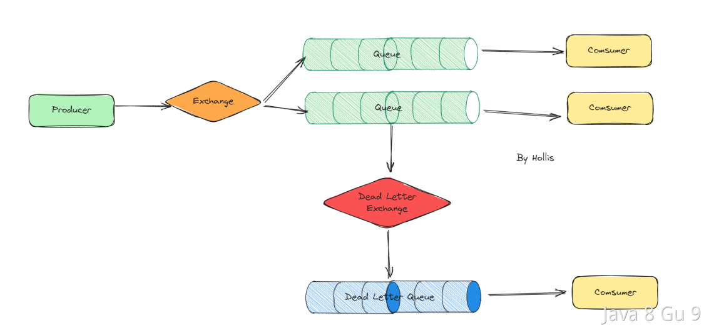

当消息变成"死信"之后，如果配置了死信队列，它将被发送到死信交换机，死信交换机将死信投递到一个队列上，这个队列就是死信队列。但是如果没有配置死信队列，那么这个消息将被丢弃。  

RabbitMQ的死信队列其实有很多作用，比如我们可以借助他实现延迟消息，进而实现订单的到期关闭，超时关单等业务逻辑。

### 配置死信队列

在RabbitMQ中，死信队列通常与交换机（Exchange）和队列（Queue）之间的绑定关系一起使用。要设置死信队列，通常需要以下步骤：

1. 创建死信队列：定义一个用于存储死信消息的队列。

2. 创建死信交换机：为死信队列定义一个交换机，通常是一个direct类型的交换机。

3. 将队列与死信交换机绑定：将主要队列和死信交换机绑定，以便无法处理的消息能够被转发到死信队列。

4. 在主要队列上设置死信属性：通过设置队列的x-dead-letter-exchange和x-dead-letter-routing-key属性，指定死信消息应该被发送到哪个交换机和路由键。

当消息被标记为死信时，它将被发送到死信队列，并可以由应用程序进一步处理、审查或记录。这种机制有助于增加消息处理的可靠性和容错性，确保不丢失重要的消息，并提供了一种处理失败消息的方式。  

以下是一个配置死信队列的方式：

```java
import org.springframework.amqp.core.*;
import org.springframework.context.annotation.Bean;
import org.springframework.context.annotation.Configuration;

@Configuration
public class RabbitMQConfig {

    // 配置死信队列和交换机
    @Bean
    public DirectExchange deadLetterExchange() {
        return new DirectExchange("dead-letter-exchange");
    }

    // 死信队列
    @Bean
    public Queue deadLetterQueue() {
        return new Queue("dead-letter-queue");
    }

    // 绑定死信队列到死信交换机
    @Bean
    public Binding deadLetterBinding() {
        return BindingBuilder.bind(deadLetterQueue()).to(deadLetterExchange()).with("dead-letter-routing-key");
    }

    // 主队列的交换机
    @Bean
    public DirectExchange mainExchange() {
        return new DirectExchange("main-exchange");
    }

         // 主队列
    @Bean
    public Queue mainQueue() {
          Map<String, Object> args = new HashMap<>(2);
          // 声明当前队列绑定的死信交换机 
                args.put("x-dead-letter-exchange", DEAD_LETTER_EXCHANGE);
          // 这里声明当前队列的死信路由key 
                args.put("x-dead-letter-routing-key", "dead-letter-routing-key");

          return QueueBuilder.durable("main-queue").withArguments(args).build();
    }


    // 绑定主队列到主交换机
    @Bean
    public Binding binding() {
        return BindingBuilder.bind(mainQueue()).to(mainExchange()).with("main-routing-key");
    }
}
```

这样，消费者在消费的时候，分别监听主队列和死信队列就可以了：

```java
@Component 
public class DeadLetterMessageReceiver { 
    @RabbitListener(queues = "dead-letter-queue") 
    public void receiveA(Message message, Channel channel) throws IOException { 
      System.out.println("收到死信消息：" + new String(message.getBody())); 
      channel.basicAck(message.getMessageProperties().getDeliveryTag(), false); 
    } 
}


@Component 
public class MainMessageReceiver { 
    @RabbitListener(queues = "main-queue") 
    public void receiveA(Message message, Channel channel) throws IOException { 
      System.out.println("收到普通消息A：" + new String(message.getBody())); 
      channel.basicAck(message.getMessageProperties().getDeliveryTag(), false); 
    } 
}
```

## RabbitMQ是怎么做消息分发的？

rabbitMQ一共有6种工作模式（消息分发方式）分别是简单模式、工作队列模式、发布订阅模式、路由模式、主题模式以及RPC模式。

简单模式是最基本的工作模式，也是最简单的消息传递模式。在简单模式中，一个生产者将消息发送到一个队列中，一个消费者从队列中获取并处理消息。这种模式适用于单个生产者和单个消费者的简单场景，消息的处理是同步的。

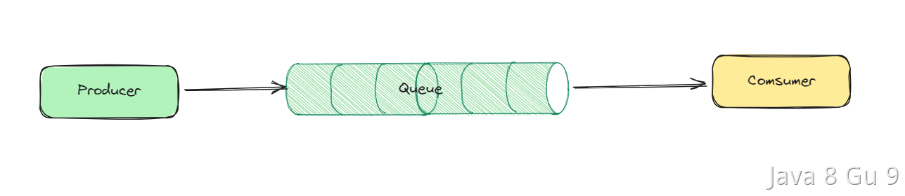

工作队列模式用于实现一个任务在多个消费者之间的并发处理。在工作队列模式中，一个生产者将消息发送到一个队列中，多个消费者从队列中获取并处理消息。每个消息只能被一个消费者处理。这种模式适用于多个消费者并发处理消息的情况，提高了系统的处理能力和吞吐量。

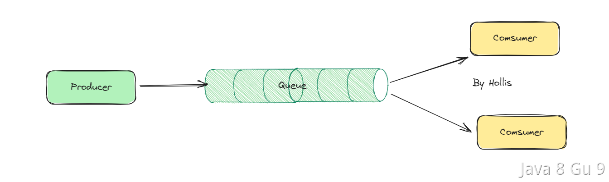

发布/订阅模式用于实现一条消息被多个消费者同时接收和处理。在发布/订阅模式中，一个生产者将消息发送到交换器（Exchange）中，交换器将消息广播到所有绑定的队列，每个队列对应一个消费者。这种模式适用于消息需要被多个消费者同时接收和处理的广播场景，如日志订阅和事件通知等。

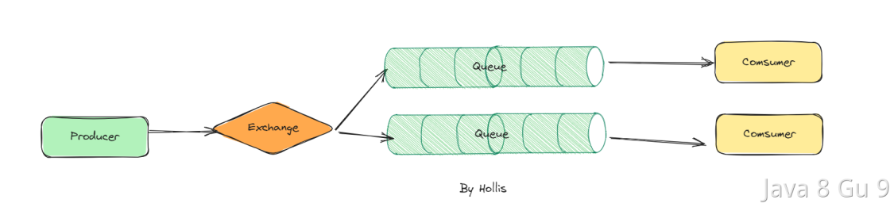

路由模式用于实现根据消息的路由键（Routing Key）将消息路由到不同的队列中。在路由模式中，一个生产者将消息发送到交换器中，并指定消息的路由键，交换器根据路由键将消息路由到与之匹配的队列中。这种模式适用于根据不同的条件将消息发送到不同的队列中，以实现消息的筛选和分发。

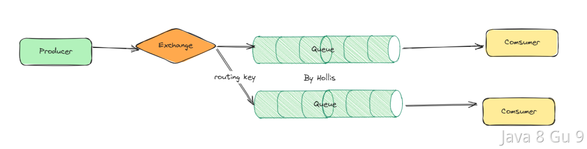

主题模式是一种更灵活的消息路由模式，它使用通配符匹配路由键，将消息路由到多个队列中。在主题模式中，一个生产者将消息发送到交换器中，并指定主题（Topic）作为路由键，交换器根据通配符匹配将消息路由到与之匹配的队列中。这种模式适用于消息的复杂路由需求，可以实现高度灵活的消息筛选和分发。

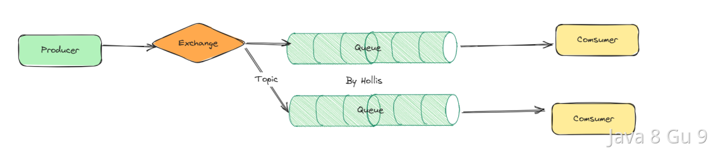

RPC模式是一种用于实现分布式系统中远程调用的工作模式。指的是通过rabbitMQ来实现一种RPC的能力。

这几种模式，根据不同的场景可以用不同的模式，每种模式的发送方及接收方的代码都不太一样，有的简单，有的复杂， 具体实现可以参考：https://www.rabbitmq.com/getstarted.html

## RabbitMQ的整体架构是怎么样的？

RabbitMQ是一个开源的消息中间件，用于在应用程序之间传递消息。它实现了AMQP（高级消息队列协议）并支持其他消息传递协议，例如STOMP（简单文本定向消息协议）和MQTT（物联网协议）。

他的整体架构大致如下：

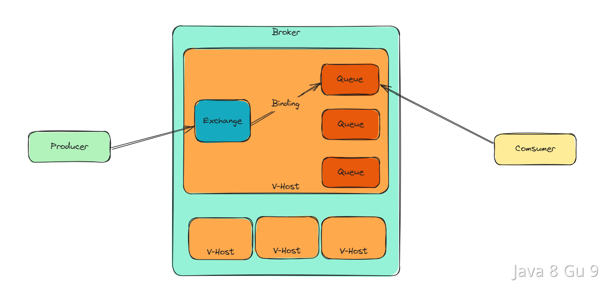

Producer（生产者）：生产者是消息的发送方，负责将消息发布到RabbitMQ的交换器（Exchange）。  

VHost：是RabbitMQ中虚拟主机的概念，它类似于操作系统中的命名空间，用于将RabbitMQ的资源进行隔离和分组。每个VHost拥有自己的交换器、队列、绑定和权限设置，不同VHost之间的资源相互独立，互不干扰。VHost可以用于将不同的应用或服务进行隔离，以防止彼此之间的消息冲突和资源竞争。  

Exchange（交换器）：交换器是消息的接收和路由中心，它接收来自生产者的消息，并将消息路由到一个或多个与之绑定的队列（Queue）中。  

Queue（队列）：队列是消息的存储和消费地，它保存着未被消费的消息，等待消费者（Consumer）从队列中获取并处理消息。  

Binding（绑定）：绑定是交换器和队列之间的关联关系，它定义了交换器将消息路由到哪些队列中。  

Consumer（消费者）：消费者是消息的接收方，负责从队列中获取消息，并进行处理和消费。

## RabbitMQ 是如何保证高可用的?

RabbitMQ可以通过多种方式来实现高可用性，以确保在硬件故障或其他不可预测的情况下，消息队列系统仍然能够正常运行。RabbitMQ有三种模式：单机模式、普通集群模式、镜像集群模式。

其中单机模式一般用于demo搭建，不适合在生产环境中使用。剩下的集群模式和镜像模式都可以帮助我们实现不同程度的高可用。

### 普通集群模式

普通集群模式，就是将 RabbitMQ 实例部署到多台服务器上，多个实例之间协同工作，共享队列和交换机的元数据，并通过内部通信协议来协调消息的传递和管理。

在这种模式下，我们创建的Queue，它的元数据（配置信息）会在集群中的所有实例间进行同步，但是队列中的消息只会存在于一个 RabbitMQ 实例上，而不会同步到其他队列。

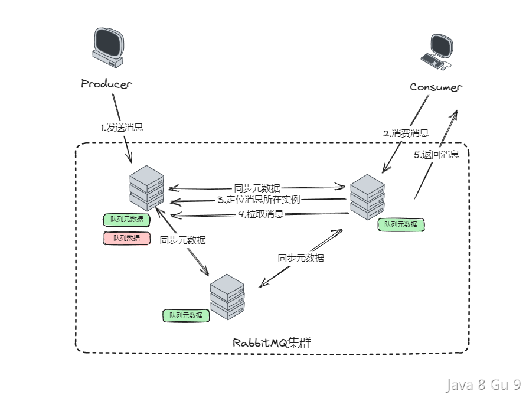

当我们消费消息的时候，如果消费者连接到了未保存消息的实例，那么那个实例会通过元数据定位到消息所在的实例，拉取数据过来发送给消费者进行消费。

消息的发送也是一样的，当发送者连接到了一个不保存消息的实例时，也会被转发到保存消息的实例上进行写操作。

这种集群模式下，每一个实例中的元数据是一样的，大家都是完整的数据。但是队列中的消息数据，在不同的实例上保存的是不一样的。这样通过增加实例的方式就可以提升整个集群的消息存储量，以及性能。

这种方式在高可用上有一定的帮助，不至于一个节点挂了就全都挂了。但是也还有缺点，至少这个实例上的数据是没办法被读写了。

### 镜像模式

顾名思义，就是每一台RabbitMQ都像一个镜像一样，存储的内容都是一样的。这种模式下，Queue的元数据和消息数据不再是单独存储在某个实例上，而是集群中的所有实例上都存储一份。

这样每次在消息写入的时候，就需要在集群中的所有实例上都同步一份，这样即使有一台实例发生故障，剩余的实例也可以正常提供完整的数据和服务。

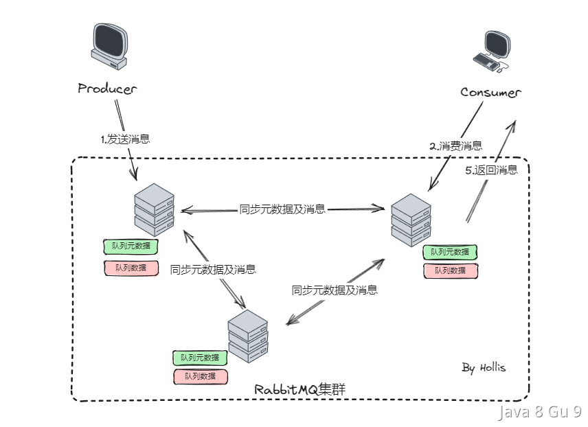

这种模式下，就保障了RabbitMQ的高可用。

## RabbitMQ如何防止重复消费

RabbitMQ的消息消费是有确认机制的，正常情况下，消费者在消息消费成功后，会发送一个确认消息，消息队列接收到之后，就会将该消息从消息队列中删除，下次也就不会再投递了。

但是如果存在网络延迟的问题，导致确认消息没有发送到消息队列，导致消息重投了，是有可能，所以，当我们使用MQ的时候，消费者端自己也需要做好幂等控制来防止消息被重复消费。

一般来说，处理这种幂等问题就是我们提过无数次的'一锁、二判、三更新'。

也就是说我们在发送消息是需要生成一个唯一的标识并且把它放到消息体中，根据这个标识就可以判断两次消息是不是同一条。这样我们在消费者端，接收到消息以后，只需要解析出消息体中的这个唯一标识，就可以通过'一锁、二判、三更新'的方式来判断是否消费成功过了。

## 如何保障消息一定能发送到RabbitMQ

当我们作为一个消费发送方，如何保证我们给RabbitMQ发送的消息一定能发送成功，如何确保他一定能收到这个消息呢？

我们知道，RabbitMQ的消息最终时存储在Queue上的，而在Queue之前还要经过Exchange，那么这个过程中就有两个地方可能导致消息丢失。第一个是Producer到Exchange的过程，第二个是Exchange到Queue的过程。

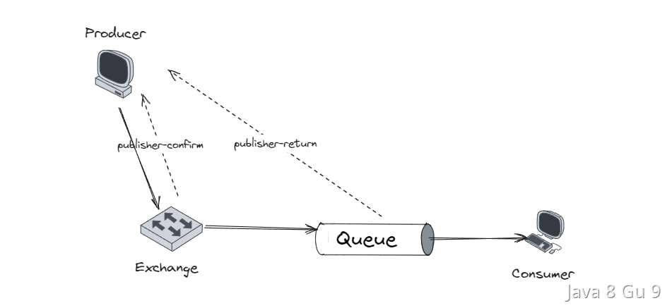

为了解决这个问题，有两种方案，一种是通过confirm机制，另外一种是事务机制，因为事务机制并不推荐，这里先介绍Confirm机制。

### 介绍下RabbitMQ的事务机制

想要保证发送者一定能把消息发送给RabbitMQ，一种是通过confirm机制，另外一种就是通过事务机制。

RabbitMQ的事务机制，允许生产者将一组操作打包成一个原子事务单元，要么全部执行成功，要么全部失败。事务提供了一种确保消息完整性的方法，但需要谨慎使用，因为它们对性能有一定的影响。

RabbitMQ是基于AMQP协议实现的，RabbitMQ中，事务是通过在通道（Channel）上启用的，与事务机制有关的方法有三个：

- txSelect()：将当前channel设置成transaction模式。

- txCommit()：提交事务。

- txRollback()：回滚事务。

我们需要先通过txSelect开启事务，然后就可以发布消息给MQ了，如果txCommit提交成功了，则消息一定到达了RabbitMQ，如果在txCommit执行之前RabbitMQ实例异常崩溃或者抛出异常，那我们就可以捕获这个异常然后执行txRollback进行回滚事务。

所以， 通过事务机制，我们也能保证消息一定可以发送给RabbitMQ。

以下，是一个通过事务发送消息的方法示例：

```java
import com.rabbitmq.client.*;

public class RabbitMQTransactionExample {

    public static void main(String[] args) throws Exception {
        ConnectionFactory factory = new ConnectionFactory();
        factory.setHost("localhost");

        try (Connection connection = factory.newConnection();
             Channel channel = connection.createChannel()) {

            // 启用事务
            channel.txSelect();

            String exchangeName = "my_exchange";
            String routingKey = "my_routing_key";

            try {
                // 发送第一条消息
                String message1 = "Transaction Message 1";
                channel.basicPublish(exchangeName, routingKey, null, message1.getBytes());

                // 发送第二条消息
                String message2 = "Transaction Message 2";
                channel.basicPublish(exchangeName, routingKey, null, message2.getBytes());

                // 模拟一个错误
                int x = 1 / 0;

                // 提交事务（如果没有发生错误）
                channel.txCommit();

                System.out.println("Transaction committed.");
            } catch (Exception e) {
                // 发生错误，回滚事务
                channel.txRollback();
                System.err.println("Transaction rolled back.");
            }
        }
    }
}
```

上面两个可能丢失的过程，都可以利用confirm机制，注册回调来监听是否成功。

Publisher Confirm是一种机制，用于确保消息已经被Exchange成功接收和处理。一旦消息成功到达Exchange并被处理，RabbitMQ会向消息生产者发送确认信号（ACK）。如果由于某种原因（例如，Exchange不存在或路由键不匹配）消息无法被处理，RabbitMQ会向消息生产者发送否认信号（NACK）。

```java
// 启用Publisher Confirms
channel.confirmSelect();

// 设置Publisher Confirms回调
channel.addConfirmListener(new ConfirmListener() {
    @Override
    public void handleAck(long deliveryTag, boolean multiple) throws IOException {
        System.out.println("Message confirmed with deliveryTag: " + deliveryTag);
        // 在这里处理消息确认
    }

    @Override
    public void handleNack(long deliveryTag, boolean multiple) throws IOException {
        System.out.println("Message not confirmed with deliveryTag: " + deliveryTag);
        // 在这里处理消息未确认
    }
});
```

Publisher Returns机制与Publisher Confirms类似，但用于处理在消息无法路由到任何队列时的情况。当RabbitMQ在无法路由消息时将消息返回给消息生产者，但是如果能正确路由，则不会返回消息。

```java
// 启用Publisher Returns
channel.addReturnListener(new ReturnListener() {
    @Override
    public void handleReturn(int replyCode, String replyText, String exchange, String routingKey, AMQP.BasicProperties properties, byte[] body) throws IOException {
        System.out.println("Message returned with replyCode: " + replyCode);
        // 在这里处理消息发送到Queue失败的返回
    }
});
```

通过以上方式，我们注册了两个回调监听，用于在消息发送到Exchange或者Queue失败时进行异常处理。通常我们可以在失败时进行报警或者重试来保障一定能发送成功。

完整的代码如下：

```java
import com.rabbitmq.client.*;

public class PublisherCallbacksExample {

    public static void main(String[] args) throws Exception {
        ConnectionFactory factory = new ConnectionFactory();
        factory.setHost("localhost");

        try (Connection connection = factory.newConnection();
             Channel channel = connection.createChannel()) {

            // 启用Publisher Confirms
            channel.confirmSelect();

            // 设置Publisher Confirms回调
            channel.addConfirmListener(new ConfirmListener() {
                @Override
                public void handleAck(long deliveryTag, boolean multiple) throws IOException {
                    System.out.println("Message confirmed with deliveryTag: " + deliveryTag);
                    // 在这里处理消息确认
                }

                @Override
                public void handleNack(long deliveryTag, boolean multiple) throws IOException {
                    System.out.println("Message not confirmed with deliveryTag: " + deliveryTag);
                    // 在这里处理消息未确认
                }
            });

            // 启用Publisher Returns
            channel.addReturnListener(new ReturnListener() {
                @Override
                public void handleReturn(int replyCode, String replyText, String exchange, String routingKey, AMQP.BasicProperties properties, byte[] body) throws IOException {
                    System.out.println("Message returned with replyCode: " + replyCode);
                    // 在这里处理消息发送到Queue失败的返回
                }
            });

            String exchangeName = "my_exchange";
            String routingKey = "my_routing_key";
            String message = "Hello, RabbitMQ!";

            // 发布消息到Exchange
            channel.basicPublish(exchangeName, routingKey, true, null, message.getBytes());

            // 等待Publisher Confirms
            if (!channel.waitForConfirms()) {
                System.out.println("Message was not confirmed!");
            }

            // 关闭通道和连接
            channel.close();
        }
    }
}
```

另外，这里如果发送到Queue之后，是否一定能持久化下来，是否一定不丢，这就是另外一个话题了。

## RabbitMQ如何保证消息不丢

上文介绍了如何确保RabbitMQ的发送者把消息能够投递给RabbitMQ的Exchange和Queue，那么，Queue又是如何保证消息能不丢的呢？

RabbitMQ在接收到消息后，默认并不会立即进行持久化，而是先把消息暂存在内存中，这时候如果MQ挂了，那么消息就会丢失。所以需要通过持久化机制来保证消息可以被持久化下来。

### 队列和交换机的持久化

在声明队列时，可以通过设置durable参数为true来创建一个持久化队列。持久化队列会在RabbitMQ服务器重启后保留，确保队列的元数据不会丢失。

在声明交换机时，也可以通过设置durable参数为true来创建一个持久化交换机。持久化交换机会在RabbitMQ服务器重启后保留，以确保交换机的元数据不会丢失。

绑定关系通常与队列和交换机相关联。当创建绑定关系时，还是可以设置durable参数为true，以创建一个持久化绑定。持久化绑定关系会在服务器重启后保留，以确保绑定关系不会丢失。

```java
@Bean
public Queue TestQueue() {
    // 第二个参数durable:是否持久化,默认是false
    return new Queue("queue-name",true,true,false);
}


@Bean
public DirectExchange mainExchange() {
      //第二个参数durable:是否持久化,默认是false
    return new DirectExchange("main-exchange",true,false);
}
```

### 持久化消息

生产者发送的消息可以通过设置消息的deliveryMode为2来创建持久化消息。持久化消息在发送到持久化队列后，将在服务器重启后保留，以确保消息不会丢失。

> deliveryMode是一项用于设置消息传递模式的属性，用于指定消息的持久性级别。deliveryMode可以具有两个值：  
> 11（非持久化）：这是默认的传递模式。如果消息被设置为非持久化，RabbitMQ将尽力将消息传递给消费者，但不会将其写入磁盘，这意味着如果RabbitMQ服务器在消息传递之前崩溃或重启，消息可能会丢失。  
> 22（持久化）：如果消息被设置为持久化，RabbitMQ会将消息写入磁盘，以确保即使在RabbitMQ服务器重启时，消息也不会丢失。持久化消息对于重要的消息非常有用，以确保它们不会在传递过程中丢失。

```java
Message message = MessageBuilder.withBody("hello, spring".getBytes(StandardCharsets.UTF_8)) //kp 消息体，字符集
                .setDeliveryMode(MessageDeliveryMode.PERSISTENT) 
                .build();

rabbitTemplate.convertAndSend("simple.queue", message);
```

### 消费者确认机制

有了持久化机制后，那么怎么保证消息在持久化下来之后一定能被消费者消费呢？这里就涉及到消息的消费确认机制。

在RabbitMQ中，消费者处理消息成功后可以向MQ发送ack回执，MQ收到ack回执后才会删除该消息，这样才能确保消息不会丢失。如果消费者在处理消息中出现了异常，那么就会返回nack回执，MQ收到回执之后就会重新投递一次消息，如果消费者一直都没有返回ACK/NACK的话，那么他也会在尝试重新投递。

### 无法做到100%不丢

虽然我们通过发送者端进行异步回调、MQ进行持久化、消费者做确认机制，但是也没办法保证100%不丢，因为MQ的持久化过程其实是异步的。即使我们开了持久化，也有可能在内存暂存成功后，异步持久化之前宕机了，那么这个消息就会丢失。

如果想要做到100%不丢失，就需要引入本地消息表，来通过轮询的方式来进行消息重投。

## 如何基于本地消息表实现分布式事务？

本地消息表其实也是借助消息来实现分布式事务的。

这个方案的主要思想是将分布式事务拆分为本地事务和消息事务两个部分，本地事务在本地数据库中进行提交或回滚，而消息事务则将消息写入消息中间件中，以实现消息的可靠投递和顺序性。

一般来说的做法是，在发送消息之前，先创建一条本地消息，并且保证写本地业务数据的操作，和，写本地消息记录的操作在同一个事务中。这样就能确保只要业务操作成功，本地消息一定可以写成功。

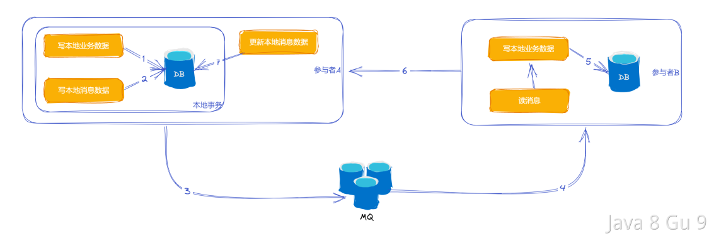

然后再基于本地消息，调用MQ发送远程消息。

消息发出去之后，等待消费者消费，在消费者端，接收到消息之后，做业务处理，处理成功后再修改本地消息表的状态。

这个过程中，可能有几个步骤都可能发生失败，那么如果失败了怎么办呢？

1、2如果失败，因为在同一个事务中，所以事务会回滚，3及以后的步骤都不会执行。数据是一致的。

3如果失败，那么就需要有一个定时任务，不断的扫描本地消息数据，对于未成功的消息进行重新投递。

4、5如果失败，则依靠消息的重投机制，不断地重试。

6、7如果失败，那么就相当于两个分布式系统中的业务数据已经一致了，但是本地消息表的状态还是错的。这种情况也可以借助定时任务继续重投消息，让下游幂等消费再重新更改消息状态，或者本系统也可以通过定时任务去查询下游系统的状态，如果已经成功了，则直接推进消息状态即可。

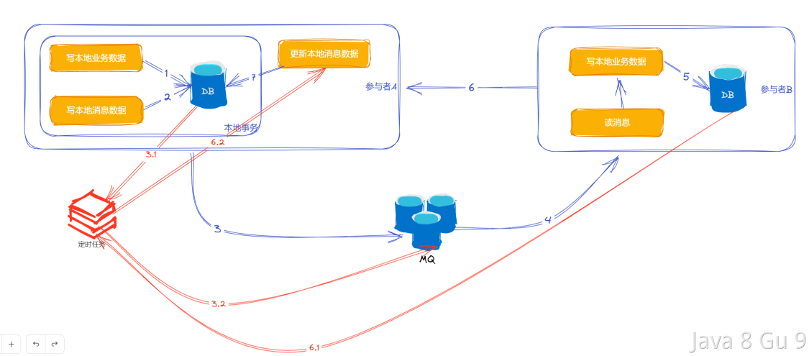

### 优缺点

优点：

1. 可靠性高：基于本地消息表实现分布式事务，可以将本地消息的持久化和本地业务逻辑操作，放到一个事务中执行进行原子性的提交，从而保证了消息的可靠性。

2. 可扩展性好：基于本地消息表实现分布式事务，可以将消息的发送和本地事务的执行分开处理，从而提高了系统的可扩展性。

3. 适用范围广：基于本地消息表实现分布式事务，可以适用于多种不同的业务场景，可以满足不同业务场景下的需求。

缺点：

1. 实现复杂度高：基于本地消息表实现分布式事务，需要设计复杂的事务协议和消息发送机制，并且需要进行相应的异常处理和补偿操作，因此实现复杂度较高。

2. 系统性能受限：基于本地消息表实现分布式事务，需要将消息写入本地消息表，并且需要定时扫描本地消息表进行消息发送，因此对系统性能有一定影响。

3. 会带来消息堆积扫表慢、集中式扫表会影响正常业务、定时扫表存在延迟问题等问题。

## 基于本地消息表实现分布式事务保证最终一致性

这种背景的话一般都是在分布式场景中，需要保证各个系统之间的数据的最终一致性，比如交易下单环节，保证订单系统和用户积分系统之间的最终一致。

也就是说，用户下单后，订单需要创建成功，用户积分也要增加成功，如果有一个失败了，这都是没满足一致性。

### 技术选型

保证分布式事务的方案有很多，比如本地消息表、MQ的事务消息、TCC、Seata等、2PC等

这些方案中各自都有优缺点，首先比较重的就是TCC、Seata和2PC，因为他们要么需要引入一个单独的协调者，要么需要代码做改造，要么对分布式系统之间有很强的侵入性。

比如TCC需要下游提供Try、Confirm和Cancel三种操作，2PC也是，需要把一个业务操作拆成2个阶段。

那么相对来说比较轻量级的方案就是依赖可靠消息，实现最终一致性。尤其是我们这个场景中，积分的增加其实不需要强一致性，只需要保证几秒钟之后积分增加成功就行，而且是一旦下单成功，积分增加必须成功，所以就比较适合使用可靠消息来保证最终一致性。

那么也就是说我们可以在创订单系统创建订单成功之后，发一个MQ消息，然后积分系统接收这个MQ消息即可。

```java
@Transactional
public void order(OrderDTO orderDTO){
    orderServive.createOrder(orderDTO);
    mqService.send(orderDTO);
}
```

但是这个方案存在一个问题，那就是第二步，发送消息其实是有可能失败的。那么就有以下几种情况：

1. 消息发送失败，MQ没接到消息
   
   这种情况，messageService.send(orderDTO);会抛异常，那么本地事务捕获到这个异常之后，把createOrder回滚了就行了

2. MQ接到了消息，但是客户端因为网络延迟以为失败了
   
   这种情况比较复杂了，就是说客户端因为接到了失败的response，会直接回滚createOrder。但是MQ收到了消息之后，会投递给积分系统，积分系统会直接消费消息，然后增加积分

上面的第二种情况，就导致了数据不一致。

那么想要解决这个问题，要么就是用MQ的事务消息，要么就是引入本地消息表。因为不是所有的MQ都支持事务消息，所以这里我们选择本地消息表。

### 具体实现

在这个环节中，在订单服务的数据库中创建一张本地消息表  

|                  |              |     |
| ---------------- | ------------ | --- |
| id               | long         |     |
| gmt_create<br>   | datetime<br> |     |
| gmt_modified<br> | datetime<br> |     |
| message_type<br> | varchar<br>  |     |
| biz_type<br>     | varchar<br>  |     |
| identifier<br>   | varchar<br>  |     |
| content<br>      | text<br>     |     |
| state<br>        | varchar<br>  |     |

这样表就用来记录本地消息的。这样我们就可以把以上代码做一下调整：

```java
@Transactional
public void order(OrderDTO orderDTO){
    orderServive.createOrder(orderDTO);
    messageService.createMessage(orderDTO);
}
```

这样我们就在一个事务中，创建两条数据库记录，因为加了事务，那么就可以保证，如果order创建成功，message也一定能写入成功。否则就都失败。

但是这里只是记录了本地消息，还需要把本地消息通过MQ发出去。这里就可以有很多办法了，一种是异步扫表，还可以直接同步发消息，也可以借助Spring Event来异步处理，都是可以的。

但是如果是同步发的话时效性肯定更好，但是同步发消息需要注意，要把调MQ发消息的地方放到事务外，要不然会因为MQ网络延迟等问题导致回滚，就又出现前面的问题了。

所以就可以用编程式事务：

```java
@Autowired
TransactionTemplate transactionTemplate;
public void order(OrderDTO orderDTO){
   transactionTemplate.execute(
        new TransactionCallbackWithoutResult(){  
            @Override
            public Object doTransactionWithoutResult(TransactionStatus status){  
                orderServive.createOrder(orderDTO);
                                messageService.createMessage(orderDTO);
            }  
    });
    mqService.send(orderDTO);
    messageService.updateSuccess(orderDTO);
}
```

```java
@Autowired
TransactionTemplate transactionTemplate;
public void order(OrderDTO orderDTO){
   boolean transactionSuccess = transactionTemplate.execute(new TransactionCallback<Boolean>() {
        @Override
        public Boolean doInTransaction(TransactionStatus status) {
            try {
                orderServive.createOrder(orderDTO);
                messageService.createMessage(orderDTO);
                //以上执行如果未抛异常，则成功，返回true
                return true; // 表示事务执行成功
            } catch (Exception e) {
                // 如果发生异常，则标记事务为回滚
                status.setRollbackOnly();
                return false; // 表示事务执行失败
            }
        }
    });

    if (transactionSuccess) {
        // 事务执行成功，可以执行 mqService.send(orderDTO)
        mqService.send(orderDTO);
        messageService.updateSuccess(orderDTO);
    } else {
        // 事务执行失败的处理逻辑
        // 可以抛出异常或记录日志等
    }
}
```

在事务中写入本地业务数据+本地消息，然后在事务外发MQ消息，如果发送失败了，也不影响事务的commit，如果发送成功了，把本地消息表的状态推进一下。

如果失败，下一次再通过定时任务扫表把需要处理的事件查出来重发就行了。

所以本地消息表中还需要有一个定时任务，还需要提供一个接口给下游回调。
